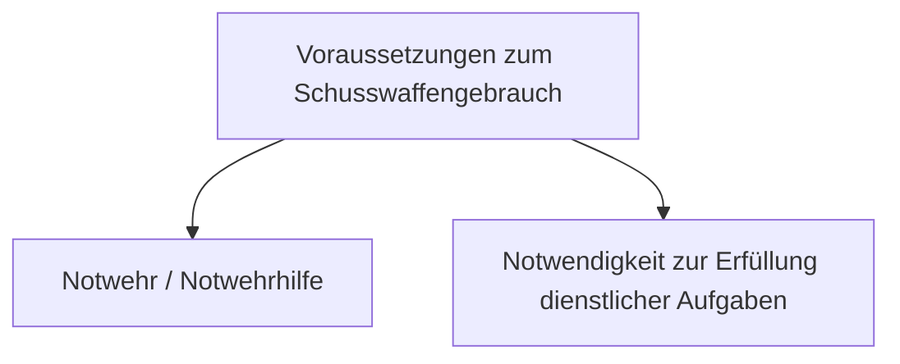
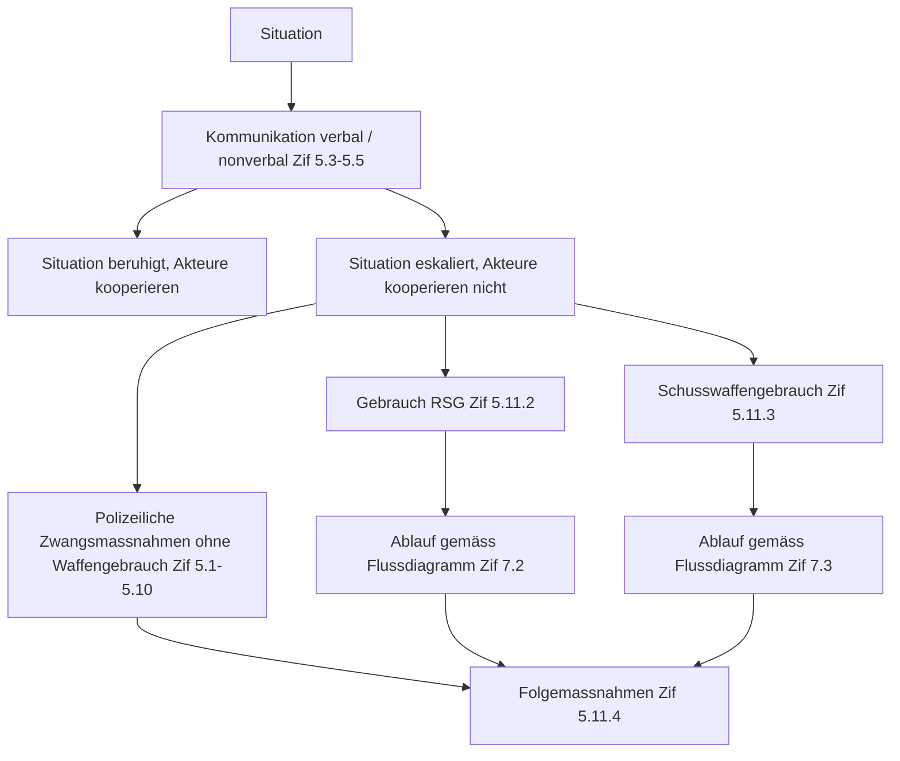
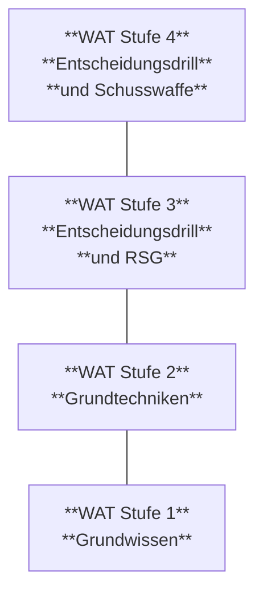

Schweizerische Eidgenossenschaft
Confédération suisse
Confederazione Svizzera
Confederaziun svizra

**Schweizer Armee**

<description>
A thick horizontal dark grey bar.
</description>

Reglement 51.301 d

# **Wachtdienst aller Truppen**

(WAT)

Gültig ab 01.01.2021
Stand am 01.01.2023


SAP 2544.7699


Schweizerische Eidgenossenschaft
Confédération suisse
Confederazione Svizzera
Confederaziun svizra

**Schweizer Armee**

Reglement 51.301 d

# **Wachtdienst aller Truppen**

(WAT)

Gültig ab 01.01.2021
Stand am 01.01.2023

Reglement 51.301 d Wachtdienst aller Truppen

# Verteiler

* Unteroffiziersanwärter und Unteroffiziersanwärterinnen in der Unteroffiziersschule
* Eingeteilte Unteroffiziere und Unteroffizierinnen
* Eingeteilte Offiziere und Offizierinnen
* Berufsmilitärs

II

Reglement 51.301 d Wachtdienst aller Truppen

# Inkraftsetzung

**Reglement 51.301 d**

## Wachtdienst aller Truppen
(WAT)

vom 30.06.2020<sup>1</sup>

erlassen gestützt auf Artikel 92 des Militärgesetzes (MG) vom 03.02.1995<sup>2</sup>, Artikel 18 der Verordnung über die Polizeibefugnisse der Armee (VPA) vom 26.10.1994<sup>3</sup> sowie Ziffer 74 Absatz 3 des Dienstreglements der Armee (DRA) vom 22.06.1994<sup>4</sup>.

Dieses Reglement tritt auf den 01.01.2021 in Kraft.

Auf den Termin des Inkrafttretens werden aufgehoben:

Das Reglement 51.301 "Wachtdienst aller Truppen (WAT)" gültig ab 01.09.2017 sowie das Reglement 51.301.01 "Anhänge zum Reglement 51.301 Wachtdienst aller Truppen (Anh WAT)" vom 08.06.2017 gültig ab 01.09.2017.

**Chef der Armee**

<sup>1</sup> Unterzeichnungsdatum
<sup>2</sup> SR 510.10
<sup>3</sup> SR 510.32
<sup>4</sup> SR 510.107.0

III

Reglement 51.301 d Wachtdienst aller Truppen

# Bemerkungen

1. Das Reglement "Wachtdienst aller Truppen" zitiert oft aus der Verordnung über die Polizeibefugnisse der Armee (VPA) und aus dem Dienstreglement der Armee (DRA). Die Auszüge sind durch kursive Schrift und am Ende des Zitats durch den Hinweis auf die Herkunft kenntlich gemacht. Diese Normen werden aus Gründen der rechtlichen Klarheit nicht umformuliert.
2. Wo immer möglich erläutert das Reglement die Normen aus der VPA und aus dem DRA oder es präzisiert Einzelheiten. Wachtsoldaten müssen befähigt sein, im Rahmen der Recht- und Verhältnismässigkeit situationsgerecht und selbständig die bewilligten Zwangsmittel einzusetzen. Die zuständigen Kommandanten und Kommandantinnen regeln aufgrund ihrer Lagebeurteilung die Eskalationsmöglichkeiten.
3. Die gefechts- und ausbildungstechnischen Einzelheiten sind in den Reglementen 51.019 d "Grundschulung (GS 17)", 51.047 d "Zwangsmittel unterhalb des Schusswaffengebrauchs" und in den waffentechnischen Reglementen festgehalten.
4. Bezüglich Ausbildung legt das Reglement lediglich fest, welche Inhalte zwingend auszubilden sind, damit der oder die Angehörige der Armee (AdA) die Befugnis erhält, im Rahmen seiner oder ihrer dienstlichen Aufgaben polizeiliche Zwangsmassnahmen zur Erfüllung seines Auftrages anzuwenden.
5. Taktische Verfahren werden in den spezifischen Reglementen der Truppengattungen festgelegt.
6. Befehle für den Einsatz der Armee, der Befehl für den Eigenschutz sowie der Befehl für die Ausbildung Eigenschutz und Ausbildungsinhalte Eigenschutztraining zeigen bedrohungsgerecht weiterführende Massnahmen auf.
7. Für eine standortbezogene Bedrohungsanalyse können die Kommandanten und Kommandantinnen die Militärpolizei (Tf 0800 55 23 33, E-Mail: <u>triage-kdo.mp@vtg.admin.ch</u>), die Vertreter und Vertreterinnen der Integralen Sicherheit V (Tf 058 484 22 22, E-Mail: <u>integralesicherheit.astab@vtg.admin.ch</u>) sowie die Sich Org DU CdA und den Dienst für präventive Sicherheit (DPSA) vordienstlich und vor Ort anfordern.
8. Für die Abklärung der Konformität von Sicherheitsräumen können die Truppenkommandanten oder Truppenkommandantinnen Vertreter oder Vertreterinnen der Integralen Sicherheit V (Tf 058 484 22 22, E-Mail: <u>integralesicherheit.astab@vtg.admin.ch</u>) oder der Sich Org DU CdA anfordern.
9. Die Ausbildungskontrolle Wachtdienst aller Truppen erfolgt ausschliesslich im Learning Management System (LMS).
10. Im Fortbildungsdienst der Truppe (FDT) erfolgt die Überführung der Inhalte der Ausbildungskontrolle Wachtdienst aller Truppen mittels LMS (Kompetenzabfrage für Miliz Kdt).

IV

Reglement 51.301 d Wachtdienst aller Truppen

# Änderungskontrolle

<table>
  <tbody>
    <tr>
        <th>Zif</th>
        <th>Abs</th>
        <th>Was</th>
        <th>Änderungen</th>
        <th></th>
    </tr>
    <tr>
        <td>Allgemein</td>
        <td colspan="2"></td>
        <td>In Anlehnung an die Revision der VPA per 01.01.<br/>2023 wurde im Regl WAT der Begriff "militärisches<br/>Polizeiorgan" durch "Angehörige der Armee" er-<br/>setzt sowie der Begriff des Angriffs allgemeiner<br/>und einfacher formuliert.</td>
        <td></td>
    </tr>
    <tr>
        <td colspan="3">Weitere Präzisierungen und Änderungen</td>
        <td></td>
        <td></td>
    </tr>
    <tr>
        <td></td>
        <td></td>
        <td>Militärische Polizeiorgane</td>
        <td>Zif wurde aufgrund der Aufhebung in der VPA<br/>ebenfalls aufgehoben.</td>
        <td></td>
    </tr>
    <tr>
        <td>1.5</td>
        <td>3/4</td>
        <td>Begriff Wachdienst</td>
        <td>Abs 3 wurde einfacher formuliert und Abs 4 auf-<br/>grund der Aufhebung in der VPA ebenfalls aufge-<br/>hoben.</td>
        <td></td>
    </tr>
    <tr>
        <td>5</td>
        <td></td>
        <td>Polizeiliche Zwangsmassnah-<br/>men</td>
        <td>In Kap 5 wurde die Anwendung polizeilicher<br/>Zwangsmassnahmen präzisiert.</td>
        <td></td>
    </tr>
    <tr>
        <td>5.2</td>
        <td>4</td>
        <td>Übersicht der polizeilichen<br/>Zwangsmassnahmen</td>
        <td>Abs 4 wurde allgemeiner und einfacher formuliert.</td>
        <td></td>
    </tr>
    <tr>
        <td>5.9</td>
        <td>1b</td>
        <td>Vorläufige Festnahme</td>
        <td>Abs 1b wurde allgemeiner und einfacher formuliert.</td>
        <td></td>
    </tr>
    <tr>
        <td>5.11.1</td>
        <td>1</td>
        <td>Persönliche Verantwortung</td>
        <td>In Abs 1 wurde der Begriff "Angehörige der militäri-<br/>schen Polizeiorgane" durch "Angehörige der Ar-<br/>mee" ersetzt.</td>
        <td></td>
    </tr>
    <tr>
        <td>5.11.4.1</td>
        <td>2</td>
        <td>Beistand</td>
        <td>In Abs 2 wurde der Begriff "Angehörige der militäri-<br/>schen Polizeiorgane" durch "Angehörige der Ar-<br/>mee" ersetzt.</td>
        <td></td>
    </tr>
    <tr>
        <td rowspan="4">6.1</td>
        <td>2a</td>
        <td rowspan="4">Voraussetzungen gemäss Art.<br/>16 VPA</td>
        <td>In Abs 2a wurde der Begriff "militärischen Polizei-<br/>organe" durch "Angehörige der Armee" ersetzt so-<br/>wie der Begriff des Angriffs allgemeiner und einfa-<br/>cher formuliert.</td>
        <td></td>
    </tr>
    <tr>
        <td>2b</td>
        <td>In Abs 2b wurde der Begriff des Angriffs allgemei-<br/>ner und einfacher formuliert.</td>
        <td></td>
    </tr>
    <tr>
        <td>2c</td>
        <td>In Abs 2c 2. wurde der Begriff "die militärischen<br/>Polizeiorgane" durch "Angehörige der Armee" er-<br/>setzt.<br/>In Abs 2c 6. wurde d der Begriff des Angriffs allge-<br/>meiner und einfacher formuliert.</td>
        <td></td>
    </tr>
    <tr>
        <td>3</td>
        <td>In Abs 3 wurde der Begriff "der militärischen Poli-<br/>zeiorgane" durch "Angehörigen der Armee" er-<br/>setzt.</td>
        <td></td>
    </tr>
  </tbody>
</table>

V

Reglement 51.301 d Wachtdienst aller Truppen

VI

Reglement 51.301 d
Wachtdienst aller Truppen

# Inhaltsverzeichnis

**1 Allgemeine Bestimmungen** 1
1.1 Grundlagen 1
1.2 Zweck 1
1.3 Geltungsbereich 1
1.4 Stellung und Befugnisse der Wache 1
1.5 Begriff Wachtdienst 1
1.6 Verantwortung 1
1.7 Mögliche Gefahren und Bedrohungen 2

**2 Organisation des Wachtdienstes** 3
2.1 Organisation 3
2.2 Unterstellung 3

**3 Ausbildung** 3
3.1 Allgemeines 3
3.1.1 WAT Stufe 1 3
3.1.2 WAT Stufe 2 4
3.1.3 WAT Stufe 3 4
3.1.4 WAT Stufe 4 4
3.1.5 Wachtdienstausbildung im FDT 4
3.2 Beginn des Wachtdienstes mit Schusswaffe in der Rekrutenschule 4
3.3 Übungen im Raum von Wachen 5

**4 Bewaffnung und Munition** 5
4.1 Grundsätzliches zur Bewaffnung 5
4.2 Ausnahmsweiser Verzicht auf Schusswaffen 5
4.3 Munition 5
4.4 Zustand von Schusswaffen 6

**5 Polizeiliche Zwangsmassnahmen** 6
5.1 Verhältnismässigkeit 6
5.2 Übersicht der polizeilichen Zwangsmassnahmen 7
5.3 Wegweisung und Fernhaltung 7
5.4 Anhaltung und Identitätsfeststellung 7
5.5 Befragung 8
5.6 Durchsuchung von Personen 8
5.7 Kontrolle von Sachen 8
5.8 Beschlagnahme 9
5.9 Vorläufige Festnahme 9
5.10 Anwendung von körperlichem Zwang 10
5.11 Waffengebrauch 10
5.11.1 Persönliche Verantwortung 10
5.11.2 Gebrauch des Reizstoffsprühgeräts 10
5.11.3 Schusswaffengebrauch 10

VII

Reglement 51.301 d Wachtdienst aller Truppen

5.11.3.1 Warnschuss 10
5.11.3.2 Gezielte Schussabgabe 10
5.11.3.3 Verzicht auf Schusswaffengebrauch 11
5.11.4 Massnahmen nach dem Waffengebrauch 11
5.11.4.1 Beistand 11
5.11.4.2 Meldepflicht 11
5.11.4.3 Spurensicherung 11
**6 Voraussetzungen zum Schusswaffengebrauch 12**
6.1 Voraussetzungen gemäss Art. 16 VPA 12
6.2 Notwehr und Notwehrhilfe bei einem Angriff 13
6.3 Erfüllung dienstlicher Aufgaben 13
6.4 Schwere Verbrechen und schwere Vergehen 14
6.5 Personen, die für andere eine Gefahr darstellen können 14
6.6 Schwere Verbrechen oder schwere Vergehen an Einrichtungen 14
6.7 Widerrechtliche Wegnahme von Material 14
6.8 Militärische Anlagen 14
6.9 Militärische Geheimnisse 15
6.10 Übersicht zum Schusswaffengebrauch 16
**7 Entscheidungsvorgänge im Wachtdienst 18**
7.1 Allgemeines 18
7.2 Entscheidvorgang zum Gebrauch des Reizstoffsprühgeräts 19
7.3 Entscheidvorgang zum Schusswaffengebrauch 20
**8 Schutzmassnahmen 21**
8.1 Allgemeines 21
8.2 Schutz von Waffen und Munition 21
8.3 Lagerung von schutzwürdigem Armeematerial 21
8.4 Warnplakate 22
8.5 Sperrzonen 22
8.6 Weitere Schutzmassnahmen 22
8.7 Unterhalt 23
**9 Kontrollen 23**
9.1 Allgemeines 23
**10 Wachtdienstbefehl 23**
10.1 Grundsätzliches 23
10.2 Formulierung der Befugnis zum Schusswaffengebrauch 24
10.3 Hinweise zum Inhalt 24
10.4 Kenntnis des Wachtdienstbefehls 25
10.5 Wachtvergehen 25

VIII

Reglement 51.301 d
Wachtdienst aller Truppen

# Anhangsverzeichnis

**Anhang 1**
Vier-Stufen-Modell – eine tabellarische Übersicht 26

**Anhang 2**
Lerninhalte und Stoffpläne zur Ausbildung Wachtdienst aller Truppen 27

**Anhang 3**
Modul Wachtdienstschiessen Sturmgewehr 30

**Anhang 4**
Modul Wachtdienstschiessen Pistole 31

**Anhang 5**
Entscheidungsdrill 35

**Anhang 6**
Eskalationsstufen 37

**Anhang 7**
Form 51.301.02 dfi "Theoretische Prüfung Wachtdienst" 38

**Anhang 8**
Form 51.301.03 dfi "Theoretische Prüfung Wachtdienst mit Lösungen" 41

**Anhang 9**
Form 51.301.04 d "Protokoll Beschlagnahme / Festnahme" 44

**Anhang 10**
Form 51.301.05 dfire "Warnung "STOP" Bewachung mit Kampfmunition" 46

**Anhang 11**
Übersicht aller Anordnungen und Arbeitshilfen im Wachtdienst 47

IX

Reglement 51.301 d Wachtdienst aller Truppen

X

Reglement 51.301 d Wachtdienst aller Truppen

# 1 Allgemeine Bestimmungen

## 1.1 Grundlagen
<sup>1</sup> Bundesgesetz über die Armee und die Militärverwaltung (Militärgesetz, MG; SR 510.10);
<sup>2</sup> Verordnung über die Polizeibefugnisse der Armee (VPA; SR 510.32);
<sup>3</sup> Dienstreglement der Armee (DRA; SR 510.107.0).

## 1.2 Zweck
Auf den Grundlagen von MG, VPA und DRA ergänzt dieses Reglement Einzelheiten für den Wachtdienst aller Truppen.

## 1.3 Geltungsbereich
<sup>1</sup> Das Reglement gilt für die Erfüllung von Wachtdienstaufgaben im Ausbildungsdienst und, solange nichts Anderes angeordnet ist, auch im Friedensförderungsdienst, Assistenzdienst und Aktivdienst.
<sup>2</sup> Es gilt nicht für die Anwendung militärischer Gewalt gegen gegnerische Militärpersonen und Truppenverbände.

## 1.4 Stellung und Befugnisse der Wache
*Die Wache ist ein militärisches Polizeiorgan. Es stehen ihr die Polizeibefugnisse der Truppe zu. Ihren Anordnungen hat jedermann Folge zu leisten (vgl Zif 74 Abs. 1 DRA).*

## 1.5 Begriff Wachtdienst
<sup>1</sup> Der Wachtdienst im Sinne dieses Reglements bezweckt den Schutz von Personen, Material, Munition, Objekten und Fahrzeugen vor Übergriffen von Personen oder Personengruppen, die nicht als gegnerische Militärpersonen oder Truppenverbände gelten. Er kann auch dazu dienen, Personen an der Flucht zu hindern. Zudem dient der Wachtdienst dazu, Personen vor Gefahren eines technischen Versagens (z B Brand) oder der Umwelt zu schützen.
<sup>2</sup> Der Wachtdienst wird unter Anwendung der Polizeibefugnisse geleistet:
a. als Bewachung mit ständig anwesenden Wachen;
b. als Überwachung mit patrouillierenden Wachen.
<sup>3</sup> *Die Truppe im Dienst darf polizeiliche Zwangsmassnahmen einsetzen, um:*
a. *Gefahren für die Sicherheit der Armee abzuwehren;*
b. *Störungen der militärischen Ordnung zu beseitigen;*
c. *bei der Verfolgung von Straftaten gegen die Armee oder ihre Angehörigen bis zum Eintreffen der zuständigen Strafverfolgungsorgane die unaufschiebbaren Massnahmen zu treffen (vgl Art. 3 VPA).*

## 1.6 Verantwortung
<sup>1</sup> *An Wachen werden hohe Anforderungen gestellt. Jeder oder jede Angehörige der Wache ist persönlich verantwortlich für die Erfüllung der ihm oder ihr übertragenen Aufgabe.*
<sup>2</sup> *Im Wachtdienst übernehmen wenige AdA die Verantwortung für die Sicherheit von vielen. Deshalb ist der Wachtdienst eine militärische Aufgabe von besonderem Gewicht. Wachtvergehen wiegen besonders schwer (vgl Zif 76 DRA).*

1

Reglement 51.301 d Wachtdienst aller Truppen

<sup>3</sup> Die Verantwortung des Wachtkommandanten oder der Wachtkommandantin sowie des einzelnen Wachtsoldaten ist besonders hoch, weil sie:
a. ihre Entscheide oft rasch und auf sich allein gestellt zu treffen haben;
b. die Sicherheit von Menschen, Munition, Material und zugewiesenen Objekten zu gewährleisten haben.

## 1.7 Mögliche Gefahren und Bedrohungen
Als mögliche Bedrohungsformen für die Truppen bzw für Objekte gelten insbesondere:
a. technisch bedingte Ereignisse wie Brand oder Versagen von Baustrukturen bzw technischen Einrichtungen;
b. Beschimpfungen, Pöbeleien;
c. Nichtbeachtung von Anweisungen oder Signalisationen;
d. Missachtung von Umzäunungen oder Sperrzonen, gewaltsame Durchbrüche mit Fahrzeugen;
e. passiver Widerstand;
f. Randale, Störung des Dienstbetriebes, Belästigung, Provokationen, Drohungen;
g. Beschädigung oder Zerstörung von Objekten und Material;
h. Beschuss von Fahrzeugen und Luftfahrzeugen, Munition und anderem Material;
i. Diebstahl von Waffen, Fahrzeugen, Luftfahrzeugen, Munition und anderem Material;
j. gegnerische Aufklärung und Spionage;
k. Erpressung, Bombendrohungen;
l. Angriffe auf die Truppe;
m. terroristische Aktionen (Überfälle, Anschläge, Geiselnahmen usw).

2

Reglement 51.301 d
Wachtdienst aller Truppen

# 2 Organisation des Wachtdienstes

## 2.1 Organisation

<sup>1</sup> Die zuständigen Kommandanten und Kommandantinnen befehlen und organisieren den Wachtdienst entsprechend der jeweiligen Lage sowie aufgrund der technischen Möglichkeiten des jeweiligen Truppenstandortes.

<sup>2</sup> Die Wachtelemente sind grundsätzlich doppelt zu besetzen. Ausnahmen werden im Wachtdienstbefehl geregelt und sind insbesondere dort zulässig, wo Pikett- und Interventionselemente sofort eingreifen können.

<sup>3</sup> Durch vorsorgliche Massnahmen und Schutzvorkehrungen ist nach dem Grundsatz der Ökonomie der Kräfte eine einfache Wachtorganisation und eine Beschränkung des Personalbestandes anzustreben (siehe Zif 8). Im Wesentlichen sind folgende Massnahmen möglich:
a. Zentralisierung der zu schützenden Güter;
b. Härten der zu schützenden Objekte (bauliche und technische Massnahmen);
c. Nutzung bestehender militärischer Infrastruktur.

<sup>4</sup> Waffenplatzkommandanten und Waffenplatzkommandantinnen regeln im Waffenplatzbefehl die minimale Bewachung, die für alle Truppen auf dem Waffenplatz gilt.

## 2.2 Unterstellung

Die Wache ist dem Kommandanten oder der Kommandantin, der oder die den Wachtdienstbefehl erlassen hat, direkt unterstellt. Der Wachtkommandant oder die Wachtkommandantin nimmt ohne andere Anordnung nur von diesem Kommandanten oder dieser Kommandantin, die Wachtmannschaft nur vom Wachtkommandanten oder nur von der Wachtkommandantin Befehle entgegen (vgl Zif 74 Abs. 2 DRA).

# 3 Ausbildung

## 3.1 Allgemeines

<sup>1</sup> Einem oder einer AdA dürfen erst dann Wachtdienstaufgaben zugeteilt werden, wenn er oder sie die dafür notwendige Ausbildung abgeschlossen und bestanden hat.

<sup>2</sup> Der oder die AdA erhält über vier Ausbildungsstufen die Berechtigung, polizeiliche Zwangsmassnahmen im Sinne der VPA anzuwenden (Vier-Stufen-Modell). Die Lerninhalte und Stoffpläne dazu sind im Anhang 1 und Anhang 2 aufgeführt.

<sup>3</sup> Das Bestehen ist im LMS in der Ausbildungskontrolle Wachtdienst aller Truppen durch den verantwortlichen Ausbilder oder die verantwortliche Ausbilderin einzutragen.

### 3.1.1 WAT Stufe 1

<sup>1</sup> Die WAT Stufe 1 ist Teil der allgemeinen Grundausbildung und wird von allen AdA absolviert. Diese berechtigt den oder die AdA zu den folgenden polizeilichen Zwangsmassnahmen:
a. Wegweisung und Fernhaltung;
b. Anhaltung und Identitätsfeststellung;
c. Befragung.

3

Reglement 51.301 d
Wachtdienst aller Truppen

<sup>2</sup> Mit dieser Ausbildungsstufe kann der oder die AdA unbewaffnet als Parkwache, Schiesswache, im Logendienst und den militärischen Auskunftsdienst eingesetzt werden.

### 3.1.2 WAT Stufe 2

<sup>1</sup> Die WAT Stufe 2 berechtigt den oder die AdA<sup>1</sup> zu allen polizeilichen Zwangsmassnahmen im Sinne der VPA, mit Ausnahme des Gebrauchs des Reizstoffsprühgeräts (RSG) und von Schusswaffen:
a. Wegweisung und Fernhaltung;
b. Anhaltung und Identitätsfeststellung;
c. Befragung;
d. Durchsuchen von Personen;
e. Kontrolle von Sachen;
f. Beschlagnahme;
g. Vorläufige Festnahme;
h. Anwendung von körperlichem Zwang.

<sup>2</sup> Mit dieser Ausbildungsstufe kann der oder die AdA unbewaffnet zusätzlich als Zufahrts- / Zutrittskontrolle, zur Überwachung von Perimetern und für dienstbetriebliche Kontrollaufgaben im Ausgang, beim Einrücken und während des Abtretens eingesetzt werden.

### 3.1.3 WAT Stufe 3

Die WAT Stufe 3 berechtigt den oder die AdA<sup>2</sup> zusätzlich, vom RSG Gebrauch zu machen.

### 3.1.4 WAT Stufe 4

<sup>1</sup> Die WAT Stufe 4 berechtigt den oder die AdA zusätzlich, von der Schusswaffe Gebrauch zu machen.

<sup>2</sup> Mit dieser Ausbildungsstufe kann der oder die AdA mit der Schusswaffe Wachtdienst leisten.

### 3.1.5 Wachtdienstausbildung im FDT

Im FDT sind die Ausbildungsinhalte der jeweiligen Stufen im Rahmen der Erstellung der Grundbereitschaft in kombinierter Form vor dem Wachtdienstantritt zu überprüfen. Eine Ausbildungskontrolle ist darüber zu führen und bis Ende FDT aufzubewahren.

## 3.2 Beginn des Wachtdienstes mit Schusswaffe in der Rekrutenschule

<sup>1</sup> Der Wachtdienst mit Schusswaffe beginnt für Rekruten spätestens ab Beginn der Verbandsausbildung.

<sup>2</sup> Sind für den Wachtdienst früher Schusswaffen erforderlich, so sind als Wachtkommandant oder Wachtkommandantin und als bewaffnete Wachen ausschliesslich Kader oder fertig ausgebildete AdA einzusetzen.

<sup>1</sup> AdA, welche waffenlosen Militärdienst leisten, werden bis und mit dieser Ausbildungsstufe ausgebildet.
<sup>2</sup> AdA, welche schiessuntauglich sind, werden bis und mit dieser Ausbildungsstufe ausgebildet.

4

Reglement 51.301 d Wachtdienst aller Truppen

## 3.3 Übungen im Raum von Wachen

Finden Verbandsdrill, Einsatztrainings oder Einsatzübungen im Raum von Wachen statt, so sind folgende Massnahmen zu treffen:
a. Einsatz von reglementarisch neutralisierten Waffen oder Einsatz von Simulationsgeräten der übenden Truppe;
b. schriftliche Bekanntgabe von Beginn und Dauer der Einsatzübung an die Wache;
c. die Wache darf nicht Teil der Übung sein.

# 4 Bewaffnung und Munition

### 4.1 Grundsätzliches zur Bewaffnung

<sup>1</sup> Der Wachtdienst wird grundsätzlich mit der Schusswaffe (vgl Zif 74 Abs. 3 DRA) und dem RSG geleistet.

<sup>2</sup> Angehörige der Wache, die eine Schusswaffe tragen, sind immer mit Kampfmunition ausgerüstet.

<sup>3</sup> Als Waffen werden im Wachtdienst Sturmgewehre, Pistolen und RSG eingesetzt. Grundsätzlich sind die persönlichen Schusswaffen zu verwenden. Ist die Ausbildung nachweislich sichergestellt, kann von vorgesetzter Stelle auch der Einsatz einer nicht persönlichen Schusswaffe gestattet werden.

<sup>4</sup> Wo es die Lage erlaubt, kann der Kommandant oder die Kommandantin anordnen, dass sich die Ausrüstung der Wache mit der Schusswaffe beschränkt auf:
a. einzelne Elemente einer Wachtorganisation (z B Piketts, Reserven);
b. bestimmte Zeitspannen.

### 4.2 Ausnahmsweiser Verzicht auf Schusswaffen

<sup>1</sup> Angehörige der Wache erfüllen ihre Aufträge im Umfeld einer möglichen Bedrohung. Unter Umständen ist ihnen Notwehr / Notwehrhilfe bzw die Erfüllung eines Wachtauftrags nur unter Einsatz der Schusswaffe möglich.

<sup>2</sup> Die Vorschrift, wonach Angehörige der Wache mit Schusswaffe immer auch über Kampfmunition verfügen, signalisiert gegen aussen ein wichtiges Prinzip: Jeder und jede Angehörige der Wache mit Schusswaffe kann sich und andere bei einem Angriff mit Kampfmunition verteidigen (keine Scheinbewaffnung).

<sup>3</sup> Wo es die Lage erlaubt, kann der Kommandant oder die Kommandantin ausnahmsweise anordnen, dass der Wachtdienst ohne Schusswaffe geleistet wird.

<sup>4</sup> Ein Wachtdienst ohne Schusswaffe kann beispielsweise angeordnet werden, wenn für einzelne Wachen vom Standort oder vom publikumsintensiven Umfeld her ein Schusswaffengebrauch wegen der Gefährdung Dritter nicht zu verantworten ist.

### 4.3 Munition

<sup>1</sup> Der Wachtkommandant oder die Wachtkommandantin übernimmt die für den Wachtdienst nötige Munition inklusive RSG und quittiert dies nachweislich (z B im Gefechtsjournal, auf separatem Formular usw).

5

Reglement 51.301 d Wachtdienst aller Truppen

<sup>2</sup> Bei der Wachtübernahme sind die Magazine auf Befehl des Wachtkommandanten oder der Wachtkommandantin vollständig abzufüllen.

<sup>3</sup> Im Wachtlokal sind die gefüllten Magazine in unmittelbarer Nähe der Schusswaffen zu deponieren.

## 4.4 Zustand von Schusswaffen

<sup>1</sup> Beim Antreten zur Wache ist das vollständig gefüllte Magazin in die Schusswaffe einzusetzen.

<sup>2</sup> Nach Verlassen des Wachtlokals ist die Schusswaffe unterladen (Magazin mit Munition eingesetzt, keine Ladebewegung ausgeführt) und gesichert zu tragen. In Ausnahmefällen kann der zuständige Kommandant oder die zuständige Kommandantin anordnen, dass die Schusswaffe geladen und gesichert zu tragen ist. Beim Sturmgewehr ist die Seriefeuersperre eingesetzt.

<sup>3</sup> Vor der Rückkehr ins Wachtlokal ist die Schusswaffe auf Befehl und geführt zu entladen. Der Wachtkommandant oder die Wachtkommandantin oder dessen Stellvertreter oder deren Stellvertreterin<sup>3</sup> ist für die Entladekontrolle verantwortlich.

<sup>4</sup> Die direkte Weitergabe von Schusswaffen, gefüllten Magazinen oder RSG von einem Wachtorgan an ein anderes ist verboten.

<sup>5</sup> Für Verschiebungen in Fahrzeugen oder Lufttransport ist das Sturmgewehr (Stgw) mit dem Lauf nach unten zu tragen.

# 5 Polizeiliche Zwangsmassnahmen

Polizeiliche Zwangsmassnahmen können gemäss Kapitel 1.3 angewendet werden, soweit:

a. *der oder die Angehörige der Armee einen entsprechenden Auftrag erhalten hat;*
b. *es zur Erfüllung des Auftrages notwendig ist;*
c. *und der oder die Angehörige der Armee zur Anwendung polizeilicher Zwangsmassnahmen ausgebildet wurde (vgl Art 7 VPA).*

## 5.1 Verhältnismässigkeit

<sup>1</sup> Jede polizeiliche Zwangsmassnahme muss zur Wahrung oder Herstellung des rechtmässigen Zustandes geeignet sein.

<sup>2</sup> Sie darf nicht über das hinausgehen, was zur Erreichung des verfolgten Zweckes erforderlich ist.

<sup>3</sup> Sie darf nicht zu einem Nachteil führen, der in einem Missverhältnis zum verfolgten Zweck steht (vgl Art. 5 VPA).

<sup>4</sup> Der Zwangsmitteleinsatz darf nicht länger dauern als absolut notwendig.

<sup>5</sup> Wo mehrere in gleichem Masse geeignete Zwangsmittel den gleichen Erfolg versprechen, ist das mildeste zu wählen.

***

<sup>3</sup> Sollte der stellvertretende Wachtkommandant oder die stellvertretende Wachtkommandantin kein Ausbilder oder keine Ausbilderin der Stufe 2 (gemäss Regl 53.096 "5,6 mm Sturmgewehr 90") sein, ist er oder sie vorgängig zur Führung des Entladens und der Entladekontrolle zu befähigen.

6

Reglement 51.301 d Wachtdienst aller Truppen

$^6$ Je nach Lage ist energisches aber korrektes Auftreten, Zureden, Trennen der Parteien Schliessen von Absperrungen, Alarmieren des Wachtkommandanten oder der Wachtkommandantin bzw des Piketts oder der Polizei zweckmässig.

## 5.2 Übersicht der polizeilichen Zwangsmassnahmen

$^1$ *Polizeiliche Zwangsmassnahmen sind:*
a. *Wegweisung und Fernhaltung;*
b. *Anhaltung und Identitätsfeststellung;*
c. *Befragung;*
d. *Durchsuchung von Personen;*
e. *Kontrolle von Sachen;*
f. *Beschlagnahme;*
g. *vorläufige Festnahme;*
h. *Anwendung von körperlichem Zwang;*
i. *Waffengebrauch.*

$^2$ *Es dürfen folgende Waffen eingesetzt werden:*
a. *Feuerwaffen;*
b. *Reizstoffe;*
c. *nicht tödlich wirkende Destabilisierungsgeräte.*

$^3$ *Beim Waffengebrauch darf folgende Munition eingesetzt werden:*
a. *Vollmantelmunition;*
b. *Hilfsmunition;*
c. *Munition mit kontrollierter Expansionswirkung.*

$^4$ *Waffen und Munition dürfen nur von speziell dafür ausgebildeten Angehörigen der Armee eingesetzt werden (vgl Art. 4 VPA).*

## 5.3 Wegweisung und Fernhaltung

*Personen können von bestimmten Orten weggewiesen oder ferngehalten werden, wenn:*
a. *sie sonst ernsthaft und unmittelbar gefährdet würden;*
b. *es für die Sicherheit der Armee, ihrer Angehörigen, ihres Materials, ihrer oder von ihr bewachter Objekte, zum Schutz wichtiger Informationen oder für die Aufrechterhaltung der militärischen Ordnung notwendig ist;*
c. *sie Einsätze behindern, die von der zuständigen Behörde zur Aufrechterhaltung oder Wiederherstellung der öffentlichen Sicherheit und Ordnung oder zur Durchsetzung vollstreckbarer Anordnungen befohlen worden sind (vgl Art. 8 VPA).*

## 5.4 Anhaltung und Identitätsfeststellung

$^1$ *Verdächtige Personen können angehalten, und es kann ihre Identität festgestellt werden. Die zivile Polizei kann beigezogen werden, um abzuklären, ob nach diesen Personen oder nach Sachen, die von ihnen mitgeführt werden, gefahndet wird.*

$^2$ *Personen, die Zutritt zu Truppenstandorten, militärischen oder militärisch bewachten Objekten begehren, können angehalten, und es kann ihre Identität festgestellt werden, auch wenn gegen sie kein Verdacht vorliegt.*

7

Reglement 51.301 d Wachtdienst aller Truppen

<sup>3</sup> *Angehaltene Personen müssen auf Verlangen ihre Personalien angeben und mitgeführte Ausweispapiere vorweisen.*

<sup>4</sup> *Wenn die Identität an Ort und Stelle nicht sicher oder nur mit erheblichen Schwierigkeiten festgestellt werden kann, oder wenn erhebliche Zweifel an der Richtigkeit der Angaben, an der Echtheit der Ausweispapiere oder am rechtmässigen Besitz von Sachen bestehen, so können die angehaltenen Personen zu einer militärischen Kommando- oder Dienststelle gebracht oder den zuständigen Polizei- oder Untersuchungsorganen überstellt werden.*

<sup>5</sup> *Angehaltene Personen sind nach der Identitätsfeststellung unverzüglich zu entlassen, wenn nicht die Voraussetzungen für andere Zwangsmassnahmen vorliegen (vgl Art. 9 VPA).*

## 5.5 Befragung

<sup>1</sup> *Personen können über Sachverhalte befragt werden, deren Kenntnis zur Erfüllung des Auftrags von Bedeutung ist.*

<sup>2</sup> *Befragte Personen sind auf das Recht zur Verweigerung der Aussage hinzuweisen (vgl Art. 10 VPA).*

## 5.6 Durchsuchung von Personen

<sup>1</sup> *Personen können durchsucht werden, wenn sie:*
a. *eines Verbrechens oder Vergehens dringend verdächtig sind;*
b. *Waffen oder andere gefährliche Gegenstände auf sich tragen und verdächtigt werden, diese widerrechtlich zu gebrauchen;*
c. *vorläufig festgenommen oder verhaftet worden sind;*
d. *bewusstlos oder sonst hilflos sind und die Durchsuchung zur Feststellung der Personalien erforderlich ist.*

<sup>2</sup> *Personen, die Zutritt zu Truppenstandorten, militärischen oder militärisch bewachten Objekten begehren, können durchsucht werden, ohne dass eine Voraussetzung nach Absatz 1 gegeben ist.*

<sup>3</sup> *Weibliche Personen dürfen nur von Frauen durchsucht werden; hiervon ausgenommen ist die Durchsuchung auf Waffen. Im Aktivdienst gilt diese Bestimmung, soweit weibliches Personal verfügbar ist (vgl Art. 11 VPA).*

## 5.7 Kontrolle von Sachen

<sup>1</sup> *Angehaltene Personen können verpflichtet werden, mitgeführte Sachen vorzuzeigen und Behältnisse sowie Fahrzeuge zu öffnen.*

<sup>2</sup> *Behältnisse und Fahrzeuge können durchsucht werden, wenn der Verdacht besteht, dass sich darin Gegenstände befinden, die der Beschlagnahme unterliegen.*

<sup>3</sup> *Mitgeführte Behältnisse und Fahrzeuge von Personen, die Zutritt zu Truppenstandorten, militärischen oder militärisch bewachten Objekten begehren, können durchsucht werden, ohne dass die Voraussetzung von Absatz 2 gegeben ist (vgl Art. 12 VPA).*

8

Reglement 51.301 d Wachtdienst aller Truppen

## 5.8 Beschlagnahme

<sup>1</sup> Gegenstände können beschlagnahmt werden, wenn:
a. von ihnen eine erhebliche Gefahr ausgeht;
b. an oder mit ihnen eine strafbare Handlung begangen wurde;
c. sie zur Begehung einer strafbaren Handlung bestimmt sind oder waren;
d. sie durch eine strafbare Handlung hervorgebracht oder erlangt worden sind;
e. sie als Beweismittel von Bedeutung sein können.

<sup>2</sup> Über jede Beschlagnahme ist ein Protokoll aufzunehmen (Form 51.301.04 d "Protokoll Beschlagnahme / Festnahme"). Das Protokoll enthält mindestens die Bezeichnung der beschlagnahmten Gegenstände, die Personalien allfälliger Auskunftspersonen sowie Grund, Ort und Zeit der Massnahme. Das Protokoll ist von den Personen, denen die Gegenstände abgenommen wurden, zu unterschreiben. Eine Verweigerung der Unterschrift ist im Protokoll zu vermerken.

<sup>3</sup> Die beschlagnahmten Gegenstände sind den zuständigen Polizei- oder Untersuchungsorganen zu übergeben (vgl Art. 13 VPA).

## 5.9 Vorläufige Festnahme

<sup>1</sup> Personen können vorläufig festgenommen werden, wenn:
a. sie die Sicherheit der Armee, ihrer Angehörigen, ihres Materials, ihrer oder von ihr bewachter Objekte oder von wichtigen Informationen gefährden oder die militärische Ordnung stören, sofern eine Wegweisung und Fernhaltung nicht genügt;
b. sie eine Straftat gegen die Armee oder ihre Angehörigen begangen oder zu begehen versucht haben und von diesen unmittelbar verfolgt werden;
c. sie sich oder andere ernsthaft gefährden;
d. sie wegen ihres Zustandes oder Verhaltens in schwerwiegender Weise öffentliches Ärgernis erregen oder die öffentliche Sicherheit und Ordnung ernsthaft stören;
e. nach ihnen gefahndet wird.

<sup>2</sup> Über jede Festnahme ist unverzüglich ein Protokoll aufzunehmen (Form 51.301.04 d "Protokoll Beschlagnahme / Festnahme"). Das Protokoll enthält mindestens die Personalien der festgenommenen Personen und allfälliger Auskunftspersonen sowie Grund, Ort und Zeit der Massnahme. Das Protokoll ist von den festgenommenen Personen zu unterschreiben. Eine Verweigerung der Unterschrift ist im Protokoll zu vermerken.

<sup>3</sup> Festgenommene Personen sind nach Aufnahme des Protokolls unverzüglich den zuständigen Polizei- oder Untersuchungsorganen zu übergeben. Militärpersonen können auch ihren vorgesetzten Truppenkommandanten oder ihrer vorgesetzten Truppenkommandantin übergeben werden.

<sup>4</sup> Festgenommene Personen dürfen gefesselt werden, wenn sie Widerstand leisten oder wenn Gefahr besteht, dass sie fliehen, andere Personen angreifen oder sich selber verletzen (vgl Art. 14 VPA).

<sup>5</sup> Die Fesselung erfolgt mit Handschellen oder Kabelbindern.

9

Reglement 51.301 d Wachtdienst aller Truppen

## 5.10 Anwendung von körperlichem Zwang

*Körperlicher Zwang darf nur angewendet werden, wenn er unmittelbar geboten ist und weniger schwerwiegende Mittel sich nicht eignen (vgl Art. 15 VPA).*

## 5.11 Waffengebrauch

### 5.11.1 Persönliche Verantwortung

<sup>1</sup> Jeder und jede Angehörige der Armee ist für den Einsatz seiner oder ihrer Waffe persönlich verantwortlich (vgl Art. 17 Abs. 1 VPA).

<sup>2</sup> Wer über den Gebrauch einer Waffe im Rahmen des Wachtdiensts entscheiden muss, hat dies nach den Kriterien der Zif 5.1 und 6 zu tun.

### 5.11.2 Gebrauch des Reizstoffsprühgeräts

<sup>1</sup> Das RSG ist ein nicht letales Zwangsmittel und dient dazu, Akteure zu neutralisieren. Reizstoff darf nur angewendet werden, wenn die Lage mit weniger schwerwiegenden Mitteln nicht bereinigt werden kann.

<sup>2</sup> Sofern der Zweck und die Umstände es zulassen, hat dem Gebrauch des RSG ein Warnruf vorauszugehen. Der Warnruf hat in der Landessprache des Standortes zu erfolgen.

<sup>3</sup> Der Warnruf lautet: "Halt, oder ich spraye!" ("Halte, ou je spraye!", "Alt, o uso lo spray!"). Er kann durch das Handzeichen "Halt" verstärkt werden.

### 5.11.3 Schusswaffengebrauch

<sup>1</sup> Sofern der Zweck und die Umstände es zulassen, hat dem Gebrauch der Schusswaffe ein Warnruf, wenn nötig verstärkt durch ein deutliches Zeichen, vorauszugehen. Der Warnruf hat in der Landessprache des Standortes zu erfolgen.

<sup>2</sup> Der Warnruf lautet: "Halt, oder ich schiesse!" ("Halte, ou je tire!", "Alt, o sparo!").

#### 5.11.3.1 Warnschuss

<sup>1</sup> Vereiteln die Umstände die Wirkung eines Warnrufes, darf ein Warnschuss gegen ein Objekt, das als Kugelfang dient, abgegeben werden. Er darf nicht auf eine Person abgegeben werden und diese oder gar unbeteiligte Dritte gefährden.

<sup>2</sup> Umstände, die die Wirkung eines Warnrufes vereiteln können, sind:
a. eine zu grosse Lärmkulisse;
b. eine zu grosse Distanz zum Gegner.

<sup>3</sup> Wo Wachen einen festen Standort haben, müssen die Möglichkeiten zur Abgabe eines Warnschusses vorgängig beurteilt werden (Objekt als Kugelfang).

#### 5.11.3.2 Gezielte Schussabgabe

<sup>1</sup> Haben andere Zwangsmittel versagt oder versprechen keine Wirkung, wird die Schusswaffe als letztes Mittel zur Angriffs- und Fluchtverhinderung eingesetzt. Mit gezielten Schüssen darf nur die Angriffsunfähigkeit bzw Fluchtunfähigkeit angestrebt werden. Die gezielte Schussabgabe darf nur solange wiederholt werden, bis die Angriffsunfähigkeit bzw Fluchtunfähigkeit erreicht ist.

10

Reglement 51.301 d Wachtdienst aller Truppen

<sup>2</sup> Erzwingt die Situation den Schusswaffengebrauch zur Fluchtverhinderung (der Rücken des Flüchtenden ist den Schützen zugewandt), muss auf die Beine gezielt werden.

### 5.11.3.3 Verzicht auf Schusswaffengebrauch

<sup>1</sup> *Bei unverhältnismässiger Gefährdung unbeteiligter Dritter ist auf den Schusswaffengebrauch zu verzichten (vgl Art. 17 Abs. 4 VPA).*

<sup>2</sup> Beim Entscheid für einen allfälligen Verzicht auf den Schusswaffengebrauch geht es um eine Abwägung der auf dem Spiel stehenden Rechtsgüter. Ein Verzicht ist vor allem beim Warnschuss oder beim gezielten Schuss zur Erreichung der Fluchtunfähigkeit in Betracht zu ziehen. Geht es um den Schutz von Leib und Leben eines Wachtsoldaten oder Dritten vor einem nicht anders abwendbaren Angriff, darf trotz Gefährdung Dritter von der Schusswaffe Gebrauch gemacht werden.

<sup>3</sup> Lässt sich die Flucht nicht verhindern, ist für die Fahndung eine gute Personenbeschreibung durch den Wachtsoldaten besonders wichtig.

## 5.11.4 Massnahmen nach dem Waffengebrauch

### 5.11.4.1 Beistand

<sup>1</sup> **Dem durch Waffengebrauch Verletzten ist der nötige Beistand zu leisten.**

<sup>2</sup> *Der oder die Angehörige der Armee, der oder die von der Waffe Gebrauch gemacht hat, ist zu betreuen (vgl Art. 17 Abs. 6 VPA).*

<sup>3</sup> Wenn Angehörige der Wache von der Waffe Gebrauch gemacht haben, haben die Vorgesetzten für alle Betroffenen (Verletzte, AdA, Dritte) die Betreuung sicherzustellen. Bei Bedarf ist eine entsprechende Fachperson beizuziehen.

<sup>4</sup> Bei einer nachfolgenden Untersuchung sind die betroffenen Angehörigen der Wache mit unterstützender Hilfe zu begleiten und der Beizug einer Fachperson soll rasch erfolgen.

<sup>5</sup> Hinweise betreffend Massnahmen nach dem Gebrauch des RSG gibt das Reglement 51.047 d "Zwangsmittel unterhalb des Schusswaffengebrauchs" Zif 5.3.4.

### 5.11.4.2 Meldepflicht

In jedem Fall von Waffengebrauch (Schusswaffe und RSG) ist dem Vorgesetzten und der Militärpolizei (Tf 0800 55 23 33) unverzüglich Meldung zu erstatten (vgl Art. 17 Abs. 7 VPA).

### 5.11.4.3 Spurensicherung

<sup>1</sup> *Zur Spurensicherung und zur Fahndung nach geflüchteten Personen ist unverzüglich die zivile oder die Militärpolizei beizuziehen. Eingesetzte Waffen sind für die Untersuchung sicherzustellen (vgl Art. 17 Abs. 8 VPA).*

<sup>2</sup> Für den Tatort gilt:
a. nichts berühren;
b. nichts verändern bis die Polizei eintrifft;
c. den unmittelbaren Tatort verlassen;
d. Drittpersonen vom Tatort fernhalten;
e. Tatort weiträumig absperren.

11

Reglement 51.301 d Wachtdienst aller Truppen

<sup>3</sup> Für das Sicherstellen von Schusswaffen und Munition gilt:
a. Zustand unverändert belassen;
b. Manipulationen an Waffen nur vornehmen, wenn diese bekannt sind und eine Veränderung des Zustands aus Sicherheitsgründen notwendig ist; dabei keine Fingerabdrücke verursachen;
c. alle Manipulationen protokollieren;
d. Fundorte von Waffen schützen und eindeutig markieren.

<sup>4</sup> Beim Schusswaffengebrauch wird Pulverschmauch ausgestossen, welcher sich auf Händen und Kleidung absetzen kann. Deshalb gilt hierzu;
a. verdächtigen Personen nie die Hand geben;
b. Hände nicht abwischen lassen (Hosentaschen, Taschentuch usw);
c. Hände nicht waschen lassen;
d. nichts mehr berühren lassen (Waffen, Munition, Fahrzeuge usw);
e. Hände von tatverdächtigen Personen schützen (Sack mit Luftlöchern).

# 6 Voraussetzungen zum Schusswaffengebrauch

## 6.1 Voraussetzungen gemäss Art. 16 VPA

<sup>1</sup> Die Schusswaffe ist als letztes Mittel einzusetzen.

<sup>2</sup> *Wenn andere verfügbare Mittel nicht ausreichen, ist in einer den Umständen angemessenen Weise von der Schusswaffe Gebrauch zu machen, wenn:*
a. *Angehörige der Armee ohne Recht angegriffen oder unmittelbar mit einem Angriff bedroht werden (Notwehr);*
b. *andere Personen ohne Recht angegriffen oder unmittelbar mit einem Angriff bedroht werden (Notwehrhilfe);*
c. *die dienstlichen Aufgaben nicht anders als durch Schusswaffengebrauch ausgeführt werden können, insbesondere:*
   1. *wenn Personen, welche ein schweres Verbrechen oder ein schweres Vergehen begangen haben oder eines solchen dringend verdächtigt sind, sich der Festnahme oder einer bereits vollzogenen Verhaftung durch Flucht zu entziehen versuchen;*
   2. *wenn Angehörige der Armee aufgrund erhaltener Informationen oder aufgrund persönlicher Feststellungen annehmen dürfen oder müssen, dass Personen für andere eine unmittelbar drohende Gefahr an Leib und Leben darstellen und sich diese der Festnahme oder einer bereits vollzogenen Verhaftung durch Flucht zu entziehen versuchen;*
   3. *zur Befreiung von Geiseln;*
   4. *zur Verhinderung eines unmittelbar drohenden schweren Verbrechens oder schweren Vergehens an Einrichtungen, die der Allgemeinheit dienen oder die für die Allgemeinheit wegen ihrer Verletzlichkeit eine besondere Gefahr bilden;*
   5. *wenn die widerrechtliche Wegnahme von Material, das eine schwere Gefahr für die Allgemeinheit bilden kann, verhindert werden muss;*

12

Reglement 51.301 d Wachtdienst aller Truppen

6. wenn eine militärische Anlage, die wichtig für die Auftragserfüllung der Armee oder wesentlicher Teil davon ist, ohne Recht angegriffen oder unmittelbar mit einem Angriff bedroht wird;
7. wenn eine schwere Verletzung des militärischen Geheimnisses verhindert werden muss (vgl Art. 16 Abs. 2 VPA).

$^3$ Die Befugnis zum Schusswaffengebrauch kann auf einzelne der in Absatz 2 genannten Fälle beschränkt, oder es kann deren Anwendungsbereich eingeschränkt und präzisiert werden. Solche Anordnungen berücksichtigen, neben Lage und Auftrag, insbesondere den Ausbildungsstand der betroffenen Angehörigen der Armee (vgl Art. 16 Abs. 3 VPA).

$^4$ Im Aktivdienst kann das Eidgenössische Departement für Verteidigung, Bevölkerungsschutz und Sport oder der General die Befugnis zum Waffengebrauch erweitern (vgl Art. 16 Abs. 4 VPA).

$^5$ Zusammenfassende Darstellung der Voraussetzungen zum Schusswaffengebrauch:



<table>
  <thead>
    <tr>
        <th></th>
        <th>Notwehr / Notwehrhilfe</th>
        <th>Notwendigkeit zur Erfüllung<br/>dienstlicher Aufgaben</th>
    </tr>
  </thead>
  <tbody>
    <tr>
        <td>Jede Wache ist dazu berechtigt.<br/>Dies ist im Wachtdienstbefehl ausdrücklich festzuhalten.</td>
        <td>Nur, wenn der Kommandant oder die Kommandantin der Wache diese Befugnis im Wachtdienstbefehl ausdrücklich erteilt.</td>
        <td></td>
    </tr>
    <tr>
        <td>Einzelheiten:<br/>Zif 5.1, 6.1, 6.2, 6.10</td>
        <td>Einzelheiten:<br/>Zif 5.1, 6.1, 6.3-6.10</td>
        <td></td>
    </tr>
  </tbody>
</table>

## 6.2 Notwehr und Notwehrhilfe bei einem Angriff

$^1$Als Angriffe gelten insbesondere:
a. Angriffe mit Waffen oder anderen gefährlichen Gegenständen (z B Schusswaffen, Stichwaffen, Schlagwaffen, Wurfgegenstände, Brandmittel);
b. in anderer Weise Angriffe auch ohne Waffen (z B gewaltsames Vorgehen eines körperlich stark überlegenen Angreifers).

$^2$ Jede Wache hat bei einem Angriff das Recht zum Schusswaffengebrauch als letztes Mittel in Notwehr oder Notwehrhilfe. Die Abwehr muss den Umständen angemessen sein. Dies ist im Wachtdienstbefehl ausdrücklich festzuhalten.

## 6.3 Erfüllung dienstlicher Aufgaben

$^1$ Die Befugnis zum Schusswaffengebrauch zur Erfüllung dienstlicher Aufgaben ist einer Wache nur gegeben, wenn der Wachtdienstbefehl dies ausdrücklich vorsieht.

$^2$ Wird die Befugnis zum Schusswaffengebrauch zur Auftragserfüllung nicht oder nur eingeschränkt erteilt, hat die Wache ihren Auftrag mit den übrigen polizeilichen Zwangsmassnahmen durchzusetzen. Sie behält aber das Recht, die Schusswaffe als letztes Mittel in Notwehr oder Notwehrhilfe zu gebrauchen.

13

Reglement 51.301 d Wachtdienst aller Truppen

## 6.4 Schwere Verbrechen und schwere Vergehen

Als schwere Verbrechen oder schwere Vergehen im Sinn dieses Reglements gelten namentlich:

a. vorsätzliche Tötungsdelikte, schwere Körperverletzung;
b. Geiselnahme;
c. Brandstiftung, Verursachung einer Explosion, Gefährdung durch Sprengstoffe und giftige Gase in verbrecherischer Absicht.

## 6.5 Personen, die für andere eine Gefahr darstellen können

Hier kann es sich etwa um Personen handeln, die gewalttätig geworden sind oder massive, ernstzunehmende Drohungen ausgesprochen haben.

## 6.6 Schwere Verbrechen oder schwere Vergehen an Einrichtungen

Als unmittelbar drohende schwere Verbrechen oder schwere Vergehen an Einrichtungen, die der Allgemeinheit dienen oder die für die Allgemeinheit wegen ihrer Verletzlichkeit eine besondere Gefahr bilden, gelten insbesondere:

a. Vergiftung oder Verseuchung von Trinkwasserreservoirs, Lebensmittellagern usw;
b. Brandanschläge auf Treibstoff- oder Chemikalienlager oder andere ernstliche Beschädigungen, die zu grosser Umweltverschmutzung oder -verseuchung führen können;
c. Anschläge auf Kernkraftanlagen;
d. Zerstörung oder ernsthafte Beschädigung von Stauanlagen, die zu grossen Überflutungen führen können;
e. Anschläge auf Flughäfen und andere wichtige Anlagen des öffentlichen Verkehrs;
f. Anschläge auf zivile Objekte, die der nationalen Sicherheit dienen.

## 6.7 Widerrechtliche Wegnahme von Material

Als Material, das eine schwere Gefahr für die Allgemeinheit bilden kann, gelten insbesondere:

a. Waffen, wie Hand- und Faustfeuerwaffen, Ziel- und Abschussgeräte von Lenkwaffen, schultergestützte Mehrzweckwaffen sowie Lenkwaffen;
b. Munition, speziell aber Kampf- und Übungsmunition, wie Handgranaten, Sprengmittel (z B Minen, Sprengrohre, Sprengstoffe, Zündmittel);
c. Gefechtsfahrzeuge.

## 6.8 Militärische Anlagen

Ist eine militärische Anlage wichtig für die Auftragserfüllung der Armee oder wesentlicher Teil davon, muss deren Schutz als Auftrag formuliert und der Schusswaffengebrauch bei einer unmittelbaren Bedrohung oder einem Angriff geregelt werden. Anlagen von dieser Bedeutung sind den verantwortlichen Kommandanten und Kommandantinnen bekannt. Sie erlassen die entsprechenden Wachtaufträge.

14

Reglement 51.301 d Wachtdienst aller Truppen

## 6.9 Militärische Geheimnisse

<sup>1</sup> Als militärische Geheimnisse gelten nicht nur klassifizierte Informationen, sondern auch klassifiziertes Material oder klassifizierte Munition.

<sup>2</sup> Militärische Geheimnisse, deren Verletzung effektiv als schwer einzustufen ist, sind den verantwortlichen geheimnistragenden Kommandanten und Kommandantinnen bekannt. Sie erlassen die entsprechenden Wachtaufträge.

15

Reglement 51.301 d
Wachtdienst aller Truppen

## 6.10 Übersicht zum Schusswaffengebrauch

<table>
  <thead>
    <tr>
        <th></th>
        <th>Notwehr / Notwehrhilfe<br/>(1)</th>
        <th>Festnahme bei schwerem Verbrechen oder schwerem Vergehen<br/>(2)</th>
    </tr>
  </thead>
  <tbody>
    <tr>
        <td>Ereignis</td>
        <td>Die Wache oder Dritte werden angegriffen oder von einem Angriff unmittelbar bedroht.</td>
        <td>Die Wache stellt in Verbindung mit ihrem Auftrag die Begehung eines schweren Verbrechens/Vergehens fest, oder sie verdächtigt Personen dringend eines solchen.</td>
    </tr>
    <tr>
        <td>Tathandlung / Tatwaffe / Tatobjekt</td>
        <td>Angriff mit Waffen oder anderen gefährlichen Gegenständen (z B Schusswaffen, Stichwaffen, Schlagwaffen, Wurfgegenstände, Brandmittel). Angriffe in anderer Weise auch ohne Waffen (z B gewaltsames Vorgehen eines körperlich stark überlegenen Angreifers).</td>
        <td>Namentlich bei folgenden Delikten:<br/>- vorsätzliche Tötungsdelikte, schwere Körperverletzung;<br/>- Geiselnahme;<br/>- Brandstiftung, Verursachung einer Explosion, Gefährdung durch Sprengstoffe und giftige Gase in verbrecherischer Absicht.</td>
    </tr>
    <tr>
        <td>Mögliche Formulierung der Befugnis zum Schusswaffengebrauch</td>
        <td>Wenn andere verfügbare Mittel nicht ausreichen, ist als letztes Mittel in einer den Umständen angemessenen Weise von der Schusswaffe Gebrauch zu machen:<br/><br/>wenn die Wache oder andere Personen mit einem Angriff unmittelbar bedroht oder angegriffen werden (Notwehr / Notwehrhilfe).</td>
        <td>Wenn andere verfügbare Mittel nicht ausreichen, ist als letztes Mittel in einer den Umständen angemessenen Weise von der Schusswaffe Gebrauch zu machen:<br/><br/>wenn Personen, welche ein schweres Verbrechen oder ein schweres Vergehen gegen Leib und Leben von Angehörigen der Armee begangen haben oder eines solchen dringend verdächtigt sind, sich der Festnahme oder einer bereits vollzogenen Verhaftung durch Flucht zu entziehen versuchen (solange sie von der Wache nach der Straftat unmittelbar verfolgt werden).</td>
    </tr>
    <tr>
        <td>Primärer Zweck des Schusswaffengebrauchs</td>
        <td>Angriffsunfähigkeit:<br/><br/>Gezielte Schüsse auf den Leib oder den Kopf.</td>
        <td>Fluchtunfähigkeit:<br/><br/>Gezielte Schüsse auf die Beine.</td>
    </tr>
  </tbody>
</table>

16

Reglement 51.301 d
Wachtdienst aller Truppen

<table>
  <thead>
    <tr>
        <th>**Wegnahme von Waffen, Munition und Gefechtsfahrzeugen<br/>(3)**</th>
        <th>**Schweres Verbrechen oder schweres Vergehen an Einrichtungen<br/>(4)**</th>
        <th></th>
    </tr>
  </thead>
  <tbody>
    <tr>
        <td>Die Wache stellt die widerrechtliche Wegnahme von Waffen, Munition oder Gefechtsfahrzeugen fest, welche eine schwere Gefahr für die Allgemeinheit bilden kann.</td>
        <td>Die Wache stellt ein unmittelbar drohendes schweres Verbrechen / Vergehen an einer militärischen Einrichtung fest, die wegen ihrer Verletzlichkeit eine besondere Gefahr für die Allgemeinheit bildet.</td>
        <td>Ereignis</td>
    </tr>
    <tr>
        <td>Wegnahme von:<br/>- Waffen, wie Hand- und Faustfeuerwaffen, Ziel- und Abschussgeräte von Lenkwaffen, schultergestützte Mehrzweckwaffen sowie Lenkwaffen;<br/>- Munition, speziell aber Kampf- und Übungsmunition, wie Handgranaten, Sprengmittel (z B Minen, Sprengrohre, Sprengstoffe, Zündmittel);<br/>- Gefechtsfahrzeuge.</td>
        <td>Zerstörung, Beschädigung, Beeinträchtigung, Vergiftung, Verseuchung usw von Einrichtungen bzw Material / Stoffen, die darin gelagert werden.</td>
        <td>Tathandlung /<br/>Tatwaffe /<br/>Tatobjekt</td>
    </tr>
    <tr>
        <td>Wenn andere verfügbare Mittel nicht ausreichen, ist als letztes Mittel in einer den Umständen angemessenen Weise von der Schusswaffe Gebrauch zu machen:<br/>wenn die widerrechtliche Wegnahme von ...<sup>4</sup> verhindert werden muss.</td>
        <td>Wenn andere verfügbare Mittel nicht ausreichen, ist als letztes Mittel in einer den Umständen angemessenen Weise von der Schusswaffe Gebrauch zu machen:<br/>zur Verhinderung eines unmittelbar drohenden schweren Verbrechens / Vergehens an / am... <sup>5</sup></td>
        <td>Mögliche Formulierung der Befugnis zum Schusswaffengebrauch</td>
    </tr>
    <tr>
        <td>Fluchtunfähigkeit:<br/><br/>Gezielte Schüsse auf die Beine.</td>
        <td>Angriffsunfähigkeit:<br/><br/>Gezielte Schüsse auf den Leib oder den Kopf.</td>
        <td>Primärer Zweck des Schusswaffengebrauchs</td>
    </tr>
  </tbody>
</table>

<sup>4</sup> Es ist aufzuführen, welches Material im konkreten Einzelfall gemeint ist.
<sup>5</sup> Es ist aufzuführen, welche Einrichtung im konkreten Einzelfall gemeint ist.

17

Reglement 51.301 d Wachtdienst aller Truppen

# 7 Entscheidungsvorgänge im Wachtdienst

## 7.1 Allgemeines



```description
A vertical text box on the right side of the flowchart contains the following text, oriented vertically:
Laufende Beurteilung der Situation notwendig. Daraus erfolgt die Wahl der im Moment verhältnismässigen polizeilichen Zwangsmassnahmen (Siehe Anhang 6)
An arrow points downwards next to this text box.
```

18

Reglement 51.301 d
Wachtdienst aller Truppen

## 7.2 Entscheidvorgang zum Gebrauch des Reizstoffsprühgeräts

```mermaid
graph TD
    A[Gebrauch des RSG<br/>kommt in Betracht] --> B[Entsichern]
    B --> C{Warnruf?<br/>(Zif 5.11.2.)}
    
    C -- Ja --> D[Warnruf]
    D --> E{Hat Warnruf<br/>Wirkung?}
    
    E -- Ja --> F[Polizeiliche<br/>Zwangsmassnahmen<br/>(Zif 5)]
    
    E -- Nein --> G
    C -- Nein --> G{Ist der<br/>Gebrauch des RSG ge-<br/>rechtfertigt?<br/>(Zif 5.11.2)}
    
    G -- Nein --> H[Polizeiliche<br/>Zwangsmassnahmen<br/>(Zif 5)]
    
    G -- Ja --> I[Gezielter Gebrauch<br/>des RSG<br/>(Zif 5.11.2)]
    
    I --> J[Folgemassnahmen nach Gebrauch des<br/>RSG<br/>(Zif 5.11.4)]
```

19

Reglement 51.301 d
Wachtdienst aller Truppen

## 7.3 Entscheidvorgang zum Schusswaffengebrauch

```mermaid
graph TD
    Start[Schusswaffengebrauch<br/>kommt in Betracht] --> Q1{Waffe geladen?}
    Q1 -- Nein --> Action1[Ladebewegung]
    Action1 --> Q2{Warnruf?<br/>(Zif 5.11.3)}
    Q1 -- Ja ----> Q2
    Q2 -- Ja --> Action2[Warnruf]
    Action2 --> Q3{Hat Warnruf<br/>Wirkung?}
    Q3 -- Ja --> Action3[Polizeiliche<br/>Zwangsmassnahmen<br/>(Zif 5)]
    Q3 -- Nein --> Q4{Warnschuss?<br/>(Zif 5.11.3.1)}
    Q2 -- Nein --> Q4
    Q4 -- Ja --> Action4[Warnschuss]
    Action4 --> Q5{Hat Warnschuss<br/>Wirkung?}
    Q5 -- Ja --> Action5[Polizeiliche<br/>Zwangsmassnahmen<br/>(Zif 5)]
    Q5 -- Nein --> Q6{Gezielte Schussab-<br/>gabe gerechtfertigt?<br/>(Zif 5.11.3.2)}
    Q4 -- Nein --> Q6
    Q6 -- Ja --> Action6[Gezielte Schussabgabe]
    Action6 --> Action7[Folgemassnahmen nach<br/>Schusswaffengebrauch<br/>(Zif 5.11.4)]
    Q6 -- Nein --> Action3
```

20

Reglement 51.301 d
Wachtdienst aller Truppen

# 8 Schutzmassnahmen

## 8.1 Allgemeines
Vorbeugende Schutzmassnahmen tragen nicht nur zum Schutz der Wachen bei, sondern insbesondere auch dazu:
a. mögliche Täter von Übergriffen abzuhalten oder Übergriffe zumindest zu erschweren;
b. die Anwendung polizeilicher Zwangsmassnahmen zu beschränken und insbesondere die Notwendigkeit des Schusswaffengebrauchs hinauszuschieben;
c. die Wachtorganisation zu vereinfachen und den Personalbestand zu reduzieren;
d. Klarheit für Wache und Umwelt zu schaffen.

## 8.2 Schutz von Waffen und Munition
<sup>1</sup> Automatische Waffen, Panzerabwehr-, Hand- und Faustfeuerwaffen sowie Munition sind nach den 90.124 "Weisungen über die Zusammenarbeit der Departementsbereiche Verteidigung und armasuisse (ZUVA)", Anhang 5: Schutz und Sicherheit im Fall von erhöhter Bedrohung zu bewachen. Bei nicht erhöhter Gefährdung gilt für diese Waffen und Munition:
a. in Räumen mit einer Einbruchmeldeanlage gelagert, sind sie täglich durch Ronden zu überwachen;
b. in nicht diebstahlsicheren Räumen gelagert, sind sie zu bewachen;
c. können Schusswaffen ausserhalb diebstahlsicheren Räumens nicht bewacht werden, sind Waffen und Verschlüsse getrennt zu lagern. Die Verschlüsse müssen bewacht werden. Die Waffen dürfen in einem abschliessbaren Raum aufbewahrt werden und müssen überwacht werden.
d. in Sicherheitsräumen gelagert, kann auf eine Ronde verzichtet werden.

<sup>2</sup> Die Schlüssel der Lagerorte sind diebstahlsicher aufzubewahren oder dürfen sich nur auf dem für den Lagerort verantwortlichen Chef oder verantwortliche Chefin bzw dessen oder deren Stellvertreter oder Stellvertreterin befinden. Über die Standorte der Schlüssel (1 Schlüssel pro Magazin) ist eine schriftliche Ein- und Ausgangskontrolle zu führen. Zusätzlich zu den Daten und den Zeiten sind die Namen festzuhalten.

## 8.3 Lagerung von schutzwürdigem Armeematerial
<sup>1</sup> Armeematerial wird nach Schutzbedarf gemäss den 90.124 "Weisungen über die Zusammenarbeit der Departementsbereiche Verteidigung und armasuisse (ZUVA)", Anhang 5: Schutz und Sicherheit, kategorisiert.

<sup>2</sup> Für Armeematerial mit hohem und sehr hohem Schutzbedarf werden die entsprechenden Informationen am Unterstützungsrapport Abteilung (URA), Unterstützungsrapport Bataillon (URB), Unterstützungsrapport Schule (URS) und Unterstützungsrapport Einheit (URE) bzw mit der Abgabe des Materials erteilt.

<sup>3</sup> Schutzwürdiges Armeematerial kann auch in persönlichem Gewahrsam gehalten werden.

<sup>4</sup> Die Zuweisung der diebstahlsicheren Räume erfolgt durch den jeweiligen Koordinationsabschnitt. Diebstahlsichere Räume müssen technisch oder täglich durch Ronden (Eintrag im Gefechtsjournal) überwacht werden.

21

Reglement 51.301 d Wachtdienst aller Truppen

<sup>5</sup> Wo sich Betriebsstoffdepots nicht abschliessen lassen, sind sie zu bewachen, sofern ein erhöhtes Risiko auf mutwillige Beschädigung, Zerstörung oder Umweltverschmutzung durch Dritte besteht. Andernfalls genügt die Überwachung.

## 8.4 Warnplakate

<sup>1</sup> Im Kontrollbereich von Wachtorganen mit Schusswaffen sind Warnplakate (Form 51.301.05 dfire) gut sichtbar anzubringen.

<sup>2</sup> Im Bereich von ständig anwesenden Wachtorganen mit Schusswaffen sind die Warnplakate nachts und bei schlechter Sicht entsprechend zu beleuchten.

<sup>3</sup> Bei Beendigung des Wachtdienstes sind die Warnplakate zu entfernen.

<sup>4</sup> Die Warnplakate gelten innerhalb eines klar definierten Perimeters.

## 8.5 Sperrzonen

<sup>1</sup> Um militärisch bewachte oder überwachte Objekte können Sperrzonen festgelegt werden, deren Betreten allen Unbefugten untersagt ist. Die Sperrzonen sind mit angemessenen Mitteln deutlich zu kennzeichnen. Wo der zivile Bereich nicht eindeutig vom militärischen getrennt werden kann, sind in der Regel weder Stahldrahtwalzen noch Stacheldraht zu verwenden, sondern Absperrgitter, Absperrband oder andere geeignete Mittel.

<sup>2</sup> Sperrzonen haben den Zweck, Unbefugte fernzuhalten und der Wache damit ihre Aufgabe zu vereinfachen. Sie erfüllen ihren Zweck nur dort, wo sie gegenüber dem zivilen Bereich massvoll und durchsetzbar sind.

<sup>3</sup> Unbefugtes Betreten einer Sperrzone schafft eine Verdachtslage. Die Wache kann nach dem Grundsatz der Verhältnismässigkeit alle polizeilichen Zwangsmassnahmen bis letztlich zum Schusswaffengebrauch anwenden.

<sup>4</sup> Unbefugtes Betreten einer Sperrzone allein rechtfertigt aber keinen Schusswaffengebrauch.

<sup>5</sup> Wo Truppen im Ausbildungsdienst die Zugänge zu zivilen Gebäuden gemeinsam mit Zivilpersonen nutzen (z B Schulhäuser), ist die Verwendung von Stacheldraht oder Stahldrahtwalzen nur bei einer ausserordentlichen Bedrohungslage zulässig.

## 8.6 Weitere Schutzmassnahmen

<sup>1</sup> Als organisatorische Schutzmassnahmen sind je nach Lage anzustreben:
a. Konzentration der zu schützenden Personen, Güter und Objekte (z B in einbruchsicheren oder zumindest diebstahlsicheren Räumen, Zusammenzug im Truppenkörper);
b. getrennte Lagerung einzelner Teile von Waffen- und Gerätesystemen;
c. getrennte Lagerung jener Waffen und Munition, die eine schwere Gefahr für die Allgemeinheit bilden können;
d. Nutzen bzw Schaffen übersichtlicher Räume und Örtlichkeiten;
e. konsequentes Kontroll- und Meldewesen;
f. Alarmorganisation (z B Verbindungsmittel, Transportmittel für Pikett).

<sup>2</sup> Als technische und bauliche Schutzmassnahmen sind insbesondere möglich:
a. Absperrungen, Hindernisse, Stellungen, Deckungen;

22

Reglement 51.301 d
Wachtdienst aller Truppen

b. Beschränken bzw Kanalisieren der Zugänge;
c. Beleuchten des Umgeländes, Ausleuchten der Zugänge;
d. Härten von Objekten;
e. Schliessvorrichtungen, Überwachungseinrichtungen.

## 8.7 Unterhalt
Warnplakate, Absperrungen, Beleuchtungen, Stellungen usw sind in einem guten Zustand zu halten. Sie dürfen keine Gefahr für die Bevölkerung darstellen.

# 9 Kontrollen

## 9.1 Allgemeines
<sup>1</sup> Kontrollen der Wache durch den Kommandanten oder durch die Kommandantin tragen zu einem hohen Bereitschaftsgrad, Aufmerksamkeit und Sicherheit bei.

<sup>2</sup> Wenn die Wache nicht von einem Offizier oder einer Offizierin kommandiert wird, bezeichnet der Kommandant oder die Kommandantin in der Regel einen Wachtoffizier oder eine Wachtoffizierin, der oder die in seinem Auftrag die Bereitschaft, Aufmerksamkeit und Sicherheit der Wache mehrfach während der Zeit des Wachtdienstes überprüft und den Wachtkommandanten oder die Wachtkommandantin bei Bedarf unterstützt. Seine oder ihre Erreichbarkeit muss dauernd sichergestellt sein.

<sup>3</sup> Kontrollorgane haben sich klar zu erkennen zu geben. Vorgetäuschte Überfälle zur Überprüfung der Aufmerksamkeit der Wache sind aus Sicherheitsgründen verboten.

<sup>4</sup> Probealarme und die Überprüfung der Einsatzbereitschaft sind gestattet, wenn sie der Wache vorher bekannt gegeben worden sind. Es dürfen keine Rollenspieler eingesetzt werden.

<sup>5</sup> Für Kontrollen der Wache kann die Checkliste "Inspektion der Wache und der Infrastruktur (IWI)" der Militärpolizei als Unterstützung beigezogen werden: LMS: Katalog/Organisation/Kommando Operationen/Militärpolizei/P251.01_Form_IWI.

# 10 Wachtdienstbefehl

## 10.1 Grundsätzliches
<sup>1</sup> Der Wachtdienstbefehl ist schriftlich zu erlassen.

<sup>2</sup> Er regelt insbesondere die Organisation der Wache und die Anwendung von möglichen polizeilichen Zwangsmassnahmen nach den Zif 5 und 6.

<sup>3</sup> Er hat ausdrücklich festzuhalten, dass jede Wache mit Schusswaffe bei einem Angriff das Recht hat, in einer den Umständen angemessenen Weise als letztes Mittel in Notwehr oder Notwehrhilfe von der Schusswaffe Gebrauch zu machen (vgl Zif 10.2 Abs. 2 Bst. a Formulierung der Befugnis zum Schusswaffengebrauch).

<sup>4</sup> Er ist eng gefasst und lässt den Befehlsempfängern wenig Entschlussfreiheit.

<sup>5</sup> Er ist minimal INTERN zu klassifizieren.

23

Reglement 51.301 d Wachtdienst aller Truppen

## 10.2 Formulierung der Befugnis zum Schusswaffengebrauch

<sup>1</sup> Der Kommandant, der oder die Kommandantin, die den Wachtdienstbefehl erlässt, legt darin die Befugnis zum Schusswaffengebrauch fest. Er hält sich dabei an die Formulierungen von Zif 6.1 Abs. 2 und beschränkt sie in der Regel auf einzelne oder mehrere der genannten Fälle.

<sup>2</sup> Mögliche Formulierungen können im Ausbildungsdienst beispielsweise lauten:

> Wenn andere verfügbare Mittel nicht ausreichen, ist als letztes Mittel in folgenden Fällen in einer den Umständen angemessenen Weise von der Schusswaffe Gebrauch zu machen:
>
> a. wenn die Wache oder andere Personen mit einem Angriff unmittelbar bedroht oder angegriffen werden (Notwehr / Notwehrhilfe);
> b. wenn die widerrechtliche Wegnahme von Material<sup>6</sup>, das eine schwere Gefahr für die Allgemeinheit bilden kann, verhindert werden muss;
> c. wenn Personen, welche ein schweres Verbrechen oder ein schweres Vergehen gegen Leib und Leben von Angehörigen der Armee begangen haben oder eines solchen dringend verdächtigt sind, sich der Festnahme oder einer bereits vollzogenen Verhaftung durch Flucht zu entziehen versuchen (so lange sie von der Wache nach der Straftat unmittelbar verfolgt werden).

## 10.3 Hinweise zum Inhalt

<sup>1</sup> Die Bedrohung, der sich eine Wache allenfalls gegenübersieht, ist in der Orientierung des Wachtdienstbefehls festzuhalten.

<sup>2</sup> Der Wachtdienstbefehl hat neben den einzelnen Wachen auch den Wachtkommandanten oder die Wachtkommandantin, seinen oder ihren Stellvertreter, seine oder ihre Stellvertreterin, das Pikett sowie einen allfälligen Wachtoffizier oder eine allfällige Wachtoffizierin einzuschliessen.

<sup>3</sup> Zusätzlich ist im Wachtdienstbefehl festzuhalten, dass:

a. sämtliche Umgangsformen wie Besitz, Konsum und Handel von und mit Drogen gemäss den einschlägigen Bestimmungen der Betäubungsmittelgesetzgebung verboten sind; die 90.115 "Weisungen zum Umgang mit legalen Hanfprodukten im Militärdienst" des CdA zu beachten sind und die Nichtbefolgung dieser Vorschriften zu entsprechenden Konsequenzen führt (administrative Massnahmen, Disziplinarstrafverfahren, Strafverfahren);
b. bei Verbindungen, die mit Funkgeräten ohne Sprachverschlüsselung sichergestellt werden, zwingend die Verschleierung nach TOZZA (Truppen, Orte, Zeiten, Zahlen, Aufträge) zu verlangen ist;
c. der Kommandant oder die Kommandantin mit periodischen und ausserordentlichen Meldungen über den Verlauf der Wache zu orientieren ist;
d. die Wache für den Unterhalt der Warnplakate, Beleuchtungen und Absperrungen sowie für die Einsatzbereitschaft des zugewiesenen Materials verantwortlich ist.

<sup>4</sup> Was in den Grundlagen zum Wachtdienst steht (MG, VPA, DRA), soll im Wachtdienstbefehl nicht abgeschrieben werden. Der Kommandant oder die Kommandantin sorgt aber

***

<sup>6</sup> Es ist in Klammer aufzuführen, welches Material im konkreten Einzelfall gemeint ist (vgl Zif 6.7).

24

Reglement 51.301 d
Wachtdienst aller Truppen

dafür, dass der Wache alle für ihre Aufgabe erforderlichen Unterlagen im Wachtlokal zur Verfügung stehen, insbesondere:

a. Vorschriften wie VPA, DRA, Reglement 51.301 "Wachtdienst aller Truppen (WAT)", Reglement 51.019 "Grundschulung 17 (GS 17)", Reglement 51.047 "Zwangsmittel unterhalb des Schusswaffengebrauchs";
b. truppeneigene Dokumente wie Verschleierungs-, Unterkunfts-, Standort-, Telefonlisten, Alarmbefehle, Plan der Örtlichkeiten;
c. Form 06.070 dfi "Gefechtsjournal", Form 06.005 dfi "Melde- und Telegrammformulare", Form 51.301.04 d "Protokoll Beschlagnahme / Festnahme", Form 06.071 dfi "Ablösungsliste".

## 10.4 Kenntnis des Wachtdienstbefehls

<sup>1</sup> Die Angehörigen der Wache sind vor Antritt des Wachtdienstes über den Wachtdienstbefehl und die Bedrohung zu instruieren.

<sup>2</sup> *Jeder und jede Angehörige der Wache ist verpflichtet, den Wachtdienstbefehl zu kennen und zu befolgen. Bei Unklarheiten verlangt er oder sie vor dem Antritt zum Dienst die nötigen Erläuterungen (vgl Zif 75 Abs. 3 DRA).*

## 10.5 Wachtvergehen

Der Truppe ist in Erinnerung zu rufen, dass Wachtverbrechen oder -vergehen vom Militärstrafgesetz (vgl Art. 76 MStG) erfasst werden und nur in leichten Fällen eine disziplinarische Bestrafung möglich ist.

25

Reglement 51.301 d
Wachtdienst aller Truppen

# Anhang 1
## Vier-Stufen-Modell – eine tabellarische Übersicht

<table>
  <thead>
    <tr>
        <th></th>
        <th>WAT Stufe 1</th>
        <th>WAT Stufe 2</th>
        <th>WAT Stufe 3</th>
        <th>WAT Stufe 4</th>
    </tr>
  </thead>
  <tbody>
    <tr>
        <td>Endzustand der Ausbildung</td>
        <td>Der/die AdA ist berechtigt, **unbewaffnet** als Parkwache, Schiesswache, im Logendienst und den militärischen **Auskunftsdienst** eingesetzt zu werden.</td>
        <td>Der/die AdA ist berechtigt, **unbewaffnet** zusätzlich zur Stufe 1 als **Zufahrts- / Zutrittskontrolle**, zur Überwachung von Perimetern (**Patrouille**) und für dienstliche Kontrollaufgaben im Ausgang / Einrücken / Abtreten eingesetzt zu werden.</td>
        <td>Der/die AdA ist berechtigt, zusätzlich zur Stufe 2 vom **Reizstoffsprühgerät (RSG) Gebrauch zu machen.**</td>
        <td>Der/die AdA ist berechtigt, zusätzlich zur Stufe 3 von der **Schusswaffe Gebrauch zu machen.**</td>
    </tr>
    <tr>
        <td>Lerninhalte (Übersicht)</td>
        <td>• Allgemeine Kenntnisse über den Wachtdienst (Rechtsgrundlagen, Bedrohung, VPA)<br/>• Kommunizieren<br/>• Kommunikationsmittel</td>
        <td>Zusätzlich zur Stufe 1:<br/>• Zwangsmittel Modul A &amp; B<br/>• Personenkontrolle<br/>• Fahrzeugkontrolle<br/>• Patrouillentätigkeiten<br/>• Festnahme<br/>• Übermittlungsmittel<br/>• Verhältnismässigkeit</td>
        <td>Zusätzlich zur Stufe 2:<br/>• Zwangsmittel Modul C<br/>• Entscheidungsdrill</td>
        <td>Zusätzlich zur Stufe 3:<br/>• Persönlich Waffe Modul A &amp; B<br/>• Wachtdienstschiessen</td>
    </tr>
    <tr>
        <td colspan="5">**Vor dem ersten Einsatz muss der/die AdA in jedem Fall anhand des gültigen Wachtdienstbefehls am konkreten Dispositiv ausgebildet werden.**</td>
    </tr>
    <tr>
        <td>Polizeibefugnisse</td>
        <td>• Wegweisung und Fernhaltung<br/>• Anhaltung und Identitätsfeststellung<br/>• Befragung</td>
        <td>Zusätzlich zur Stufe 1:<br/>• Durchsuchen von Personen<br/>• Kontrolle von Sachen<br/>• Beschlagnahme<br/>• Vorläufige Festnahme<br/>• Anwendung von körperlichem Zwang (ohne RSG und ohne Schusswaffe)</td>
        <td>Zusätzlich zur Stufe 2:<br/>• Anwendung von körperlichem Zwang (mit RSG ohne Schusswaffe)</td>
        <td>Zusätzlich zur Stufe 3:<br/>• Anwendung von körperlichem Zwang (mit RSG und Schusswaffe)</td>
    </tr>
    <tr>
        <td>Ausbildungskontrollen</td>
        <td>Im GAD:<br/>• LMS (WAT Stufe 1)</td>
        <td>Im GAD:<br/>• LMS (WAT Stufe 2)<br/>• Technikprüfungen Zwangsmittel Modul A &amp; B</td>
        <td>Im GAD:<br/>• LMS (WAT Stufe 3)<br/>• Praktischer Test Entscheidungsdrill (Anhang 5)</td>
        <td>Im GAD:<br/>• LMS (WAT Stufe 4)<br/>• Form 51.301.02 dfi "Theoretische Prüfung Wachtdienst" (Anhang 7)<br/>• Schiessprogramm Wachtdienst (Anhang 3 &amp; 4)<br/>• Praktischer Test Entscheidungsdrill (Anhang 5)</td>
    </tr>
    <tr>
        <td>Wachtdienst im FDT</td>
        <td colspan="4">**Im Rahmen der Erstellung der Grundbereitschaft sind die Lerninhalte der jeweiligen Stufen in kombinierter Form vor dem Wachtdienstantritt zu überprüfen. Eine Ausbildungskontrolle ist darüber zu führen und bis Ende FDT aufzubewahren.**</td>
    </tr>
  </tbody>
</table>

26

Reglement 51.301 d
Wachtdienst aller Truppen

# Anhang 2
## Lerninhalte und Stoffpläne zur Ausbildung Wachtdienst aller Truppen

Die Ausbildung des Wachtdienstes aller Truppen ist in vier Stufen aufgeteilt.

Diese Ausbildung kann je nach Funktion der AdA als Ganzes oder stufenweise in Teilen absolviert werden.

Das Erlangen der WAT Stufe 1 ist Pflichtteil der Allgemeinen Grundausbildung (AGA).

Nach Abschluss der funktionsbezogenen Grundausbildung (FGA) sind grundsätzlich alle AdA zum Leisten des Wachtdienstes mit Schusswaffe befähigt.



27

Reglement 51.301 d
Wachtdienst aller Truppen

## WAT Stufe 1: Grundwissen

<table>
  <tbody>
    <tr>
        <th>Block</th>
        <th>Thema</th>
        <th>Lerninhalte</th>
        <th>Grundlagen</th>
        <th>Dauer (Richtwert)</th>
    </tr>
    <tr>
        <td>1.1</td>
        <td>Allgemeine Theorie Wachtdienst</td>
        <td>• Allgemeine Kenntnisse über den Wachtdienst (Rechtsgrundlagen, Bedrohung, VPA, Rechte und Pflichten)<br/>• Polizeibefugnisse der Truppe und Wachtdienst</td>
        <td>• Form 51.301.01 d "Allgemeine Theorie Wachtdienst aller Truppen"<br/>• Regl 51.002 d "Dienstreglement der Armee", Kap 7, Kap 8 (insbesondere Zif 77-82, 84, 92-109), Kap 9<br/>• Regl 51.019 d "Grundschulung 17", Kap 2</td>
        <td>45 min*</td>
    </tr>
    <tr>
        <td>1.2</td>
        <td>Kommunikation</td>
        <td>• Meldeschema (AEIOU)<br/>• Mündliches Melden<br/>• Schriftliches Melden<br/>• Verbale Kommunikation<br/>• Nonverbale Kommunikation</td>
        <td>• Regl 51.019 d "Grundschulung 17", Kap 5.2.1<br/>• Form 06.005 dfi "Melde- und Telegrammformulare"<br/>• Form 38.006 dfi "Meldezettel"<br/>• Regl 51.047 d "Zwangsmittel unterhalb des Schusswaffengebrauchs", Kap 2</td>
        <td>60 min*/***</td>
    </tr>
    <tr>
        <td>1.3</td>
        <td>Kommunikationsmittel</td>
        <td></td>
        <td>• Die Kommunikationsmittel basieren auf der jeweiligen Ausrüstung der Einheit. Je nach Dispositiv können sie unterschiedlich sein.</td>
        <td>15 min***</td>
    </tr>
  </tbody>
</table>

## WAT Stufe 2: Grundtechniken

<table>
  <tbody>
    <tr>
        <th>Block</th>
        <th>Thema</th>
        <th>Lerninhalte</th>
        <th>Grundlagen</th>
        <th>Dauer (Richtwert)</th>
    </tr>
    <tr>
        <td>2.1</td>
        <td>Zwangsmittel Modul A</td>
        <td>Körperzwang<br/>• Einführung Zwangsmittel / Formen der Zwangsanwendung<br/>• Sicherheitserziehung und Basisausbildung<br/>• Selbstschutz<br/>• Abwehr von Blöcken<br/>• Aktive Verteidigungstechniken<br/>• Überwältigen</td>
        <td>• Regl 51.047 d "Zwangsmittel unterhalb des Schusswaffengebrauchs", Kap 3<br/>• Regl 51.047.02 d "Anhang 2: Stoffplan Grundausbildung Zwangsmittel (AGA)"<br/>• Arbeitshilfe 51.047.04 dfi "Formen der Zwangsanwendung"</td>
        <td>5 - 11 h**</td>
    </tr>
    <tr>
        <td>2.2</td>
        <td>Zwangsmittel Modul B</td>
        <td>Schliesstechnik<br/>• Sicherheitserziehung und Basisausbildung<br/>• Technik liegend<br/>• Technik stehend</td>
        <td>• Regl 51.019 d "Grundschulung 17" (Zif 188-193, exkl 189 und 190)<br/>• Regl 51.047 d "Zwangsmittel unterhalb des Schusswaffengebrauchs", Kap 4<br/>• Regl 51.047.02 d "Anhang 2: Stoffplan Grundausbildung Zwangsmittel (AGA)"</td>
        <td>2.5 - 4.5 h**</td>
    </tr>
    <tr>
        <td>2.3</td>
        <td>Übermittlungsmittel (nach Bedarf)</td>
        <td>• SE-X35<br/>• Feldtelefon 96</td>
        <td>• Regl 58.406 dfi "Sprechregeln für Funk und Telefon"<br/>• Dok 58.440.01 dfi "Funksystem SE-135 (Checkliste)"<br/>• Dok 58.430.01 dfi "Funksystem SE-235 (Checkliste)"<br/>• Regl 58.740 d "Feldtelefon 96"</td>
        <td>1 h***<br/>(nur Grundkenntnisse Uem D bis zur EGA)</td>
    </tr>
    <tr>
        <td>2.4</td>
        <td>Personen- und Fahrzeugkontrolle, Festnahme</td>
        <td>• Routinedurchsuchung<br/>• Festnahmetechniken<br/>• Fahrzeugdurchsuchung</td>
        <td>• Regl 51.019 d "Grundschulung 17", Kap 7.4.3 – 7.4.4</td>
        <td>3 h***</td>
    </tr>
    <tr>
        <td>2.5</td>
        <td>Patrouillentätigkeit</td>
        <td>• Patrouillentechnik<br/>• Patrouillenstrecke</td>
        <td>• Regl 51.019 d "Grundschulung 17", Kap 7.4.5</td>
        <td>1 h***</td>
    </tr>
  </tbody>
</table>

\* Gemäss Stoffprogramm AGA des Kdo Ausb;
\*\* Gemäss entsprechendem Reglement;
\*\*\* Zusätzliche Ausbildungszeit spezifisch für die Wachtdienstausbildung.

28

Reglement 51.301 d
Wachtdienst aller Truppen

## WAT Stufe 3: Entscheidungsdrill und RSG

<table>
  <thead>
    <tr>
        <th>Block</th>
        <th>Thema</th>
        <th>Lerninhalte</th>
        <th>Grundlagen</th>
        <th>Dauer (Richtwert)</th>
    </tr>
  </thead>
  <tbody>
    <tr>
        <td>3.1</td>
        <td>Zwangsmittel<br/>Modul C</td>
        <td>RSG<br/>• Sicherheitserziehung und Basisausbildung<br/>• Handhabung des RSG</td>
        <td>• Regl 51.047 d "Zwangsmittel unterhalb des Schusswaffengebrauchs", Kap 5<br/>• Regl 51.047.02 d "Anhang 2: Stoffplan Grundausbildung Zwangsmittel (AGA)"</td>
        <td>2 - 4.5 h**</td>
    </tr>
    <tr>
        <td>3.2</td>
        <td>Entscheidungsdrill<br/>(exkl Szenarien mit Waffengebrauch / sofern keine Weiterausbildung zu der Stufe 4 vorgesehen ist)</td>
        <td>• Fallbeispiele mit verschiedenen Aggressionsstufen</td>
        <td>• Regl 51.301 d "Wachtdienst aller Truppen (WAT)", Anhang 5</td>
        <td>(2 h***)</td>
    </tr>
  </tbody>
</table>

## WAT Stufe 4: Entscheidungsdrill und Schusswaffe

<table>
  <thead>
    <tr>
        <th>Block</th>
        <th>Thema</th>
        <th>Lerninhalte</th>
        <th>Grundlagen</th>
        <th>Dauer (Richtwert)</th>
    </tr>
  </thead>
  <tbody>
    <tr>
        <td>4.1</td>
        <td>Schusswaffe<br/>(Stgw / Pist)</td>
        <td>Modul A<br/>• Grundkönnen</td>
        <td>• Regl 53.096.05 d "Anhang 4: Stoffplan Grundausbildung Sturmgewehr 90"<br/>oder<br/>• Regl 53.103.01 d "Anhang 3: Stoffplan Grundausbildung Pistole"</td>
        <td>11.5 h*/**<br/><br/>oder<br/>4 h*/**</td>
    </tr>
    <tr>
        <td>4.2</td>
        <td>Schusswaffe<br/>(Stgw / Pist)</td>
        <td>Modul B<br/>• Schiessen innerhalb der Gesprächsdistanz</td>
        <td>• Regl 53.096.05 d "Anhang 4: Stoffplan Grundausbildung Sturmgewehr 90"<br/>oder<br/>• Regl 53.103.01 d "Anhang 3: Stoffplan Grundausbildung Pistole"</td>
        <td>4 h*/**<br/><br/>oder<br/>4 h*/**</td>
    </tr>
    <tr>
        <td>4.3</td>
        <td>Schiessprogramm Wachtdienst</td>
        <td></td>
        <td>Stgw:<br/>• Regl 51.301 d "WAT", Anhang 3<br/>oder<br/>Pist:<br/>• Regl 51.301 d "WAT", Anhang 4</td>
        <td>80 min***</td>
    </tr>
    <tr>
        <td>4.4</td>
        <td>Theoretische Prüfung Wachtdienst</td>
        <td></td>
        <td>• Form 51.301.02 dfi "Theoretische Prüfung Wachtdienst" im Regl 51.301 d "WAT", Anhang 7<br/>• LMS: Theoretische Prüfung Wachtdienst</td>
        <td>0.5 h***</td>
    </tr>
    <tr>
        <td>4.5</td>
        <td>Entscheidungsdrill<br/>(inkl Szenarien mit Waffengebrauch)</td>
        <td>• Fallbeispiele mit verschiedenen Aggressionsstufen</td>
        <td>• Regl 51.301 d "WAT", Anhang 5</td>
        <td>(2 h***)</td>
    </tr>
  </tbody>
</table>

\* Gemäss Stoffprogramm AGA des Kdo Ausb;
\*\* Gemäss entsprechendem Reglement;
\*\*\* Zusätzliche Ausbildungszeit spezifisch für die Wachtdienstausbildung.

29

Reglement 51.301 d
Wachtdienst aller Truppen

# Anhang 3
## Modul Wachtdienstschiessen Sturmgewehr

<table>
  <thead>
    <tr>
        <th>Lektion</th>
        <th>Thema</th>
        <th>Ziel</th>
        <th>Zeit</th>
        <th>Pat</th>
    </tr>
  </thead>
  <tbody>
    <tr>
        <td>WD-1</td>
        <td>**Zeit und Distanz**<br/>Zeit für folgende Abläufe messen:<br/>- Waffen hintergehängt oder Patrouillenstellung / Ladebewegung / Warnruf / Kontaktstellung / Feuer.</td>
        <td>Notwendigkeit aufzeigen von:<br/>- Mentale Vorbereitung;<br/>- Waffeneinsatzbereitschaft (Patrouille-, Einsatz- oder Wartestellung);<br/>- Erwägung Schusswaffengebrauch = Ladebewegung.</td>
        <td>10'</td>
        <td>-</td>
    </tr>
    <tr>
        <td>WD-2</td>
        <td>**Schiessen mit Warnruf**<br/>*Ausgangslage: Unterladen / Patrouillenstellung oder Wartestellung.*<br/>Der **Warnruf** ist vor jeder Übung zu machen.<br/>- 7 m, 1 bis 3 Schuss, Scheibe T, OZL, stehend, 100% Treffer X Zone;<br/>- 10 m, 1 bis 3 Schuss, Scheibe T, OZL, stehend, 100% Treffer X Zone;<br/>- 15 m, 1 bis 3 Schuss, Scheibe T, OZL, stehend, 100% Treffer X Zone.</td>
        <td></td>
        <td>10'</td>
        <td>9</td>
    </tr>
    <tr>
        <td>WD-3</td>
        <td>**Schiessen mit Warnschuss (ab Deckung)**<br/>*Ausgangslage: Unterladen / Patrouillenstellung oder Wartestellung.*<br/>Der **Warnschuss** ist vor jeder Übung zu machen.<br/>- Warnschuss in sichere Zone (gekennzeichnete Scheibe "Blindscheibe"), 1 x 1 Schuss, OZL;<br/>- 15 m, 1 bis 3 Schuss, Scheibe T, OZL, rechte Seite der Deckung, 100% Treffer X Zone;<br/>- Warnschuss in sichere Zone (gekennzeichnete Scheibe "Blindscheibe"), 1 x 1 Schuss, OZL;<br/>- 15 m, 1 bis 3 Schuss, Scheibe T, OZL, linke Seite der Deckung, 100% Treffer X Zone.</td>
        <td></td>
        <td>15'</td>
        <td>8</td>
    </tr>
    <tr>
        <td>WD-4</td>
        <td>**Notfalldrill, Misserfolgsdrill**<br/>*Ausgangslage: Geladen, Kontaktstellung.*<br/>- 0,5 m vor der Scheibe;<br/>- Zurück bis auf 2-4 m, Schusslinie verlassen, 1 bis 3 Schuss + 2 x Misserfolgsdrill auf Animation, Scheibe T, OZL, 100% Treffer X/Y Zone.</td>
        <td></td>
        <td>15'</td>
        <td>5</td>
    </tr>
    <tr>
        <td>WD-5</td>
        <td>**Entscheiden**<br/>- Kommunizieren, bewegen, schiessen (KBS);<br/>- Bedrohung, Distanz, Zeit (BDZ);<br/>- Distanz, Hindernisse, Deckung, Überraschung (DIHDU);<br/>- Integration Warnruf;<br/>- Integration Ladebewegung;<br/>- Integration Warnschuss;<br/>- Integration Festnahme-Drill;<br/>- Integration Fluchtunfähigkeit oder Angriffsunfähigkeit;<br/>- Integration Mark RSG.</td>
        <td>*Ausgangslage:*<br/>Unterladen, Patrouillenstellung:<br/>- Der/die Ausbilder/in stellt 3 Scheiben T mit Beinen im Abstand von je 2-3 m auf und klebt auf Nr 1 eine Hand, auf Nr 2 ein Messer, auf Nr 3 eine Feuerwaffe. Weiter stellt er/sie eine "Blindscheibe" für den Warnschuss und eine Deckung auf ca. 15 m auf.<br/>- Der/die AdA beginnt eine Patrouille von 30 m.<br/>- Der/die Ausbilder/in nennt eine Nummer und der/die AdA muss auf den Reiz reagieren.</td>
        <td>30'</td>
        <td>0-5</td>
    </tr>
    <tr>
        <td>Total</td>
        <td></td>
        <td></td>
        <td>80'</td>
        <td>27</td>
    </tr>
  </tbody>
</table>

30

Reglement 51.301 d Wachtdienst aller Truppen

# Anhang 4
## Modul Wachtdienstschiessen Pistole

<table>
  <thead>
    <tr>
        <th>Lektion</th>
        <th>Thema</th>
        <th>Ziel</th>
        <th>Zeit</th>
        <th>Pat</th>
    </tr>
  </thead>
  <tbody>
    <tr>
        <td>WD-1</td>
        <td>**Zeit und Distanz**<br/>Zeit für folgende Abläufe messen:<br/>- Bereitschaftsstellung, Wartestellung / Ladebewegung / Warnruf / Kontaktstellung / Feuer.</td>
        <td>Notwendigkeit aufzeigen von:<br/>- Mentale Vorbereitung;<br/>- Waffeneinsatzbereitschaft (Grund-, Einsatz- oder Wartestellung);<br/>- Erwägung Schusswaffengebrauch = Ladebewegung.</td>
        <td>10'</td>
        <td>-</td>
    </tr>
    <tr>
        <td>WD-2</td>
        <td>**Schiessen mit Warnruf**<br/>*Ausgangslage: Unterladen / Einsatzstellung oder Wartestellung*<br/>Der **Warnruf** ist vor jeder Übung zu machen.<br/>- 5 m, 1 bis 3 Schuss, Scheibe T, OZL, stehend, 100% Treffer X Zone;<br/>- 7 m, 1 bis 3 Schuss, Scheibe T, OZL, stehend, 100% Treffer X Zone;<br/>- 10 m, 1 bis 3 Schuss, Scheibe T, OZL, stehend, 100% Treffer X Zone.</td>
        <td></td>
        <td>10'</td>
        <td>9</td>
    </tr>
    <tr>
        <td>WD-3</td>
        <td>**Schiessen mit Warnschuss (ab Deckung)**<br/>*Ausgangslage: Unterladen, Grundstellung*<br/>Der **Warnschuss** ist vor jeder Übung zu machen.<br/>- Warnschuss in sichere Zone (gekennzeichnete Scheibe "Blindscheibe"), 1 x 1 Schuss, OZL;<br/>- 15 m, 1 bis 3 Schuss, Scheibe T, OZL, rechte Seite der Deckung, 100% Treffer X Zone;<br/>- Warnschuss in sichere Zone (gekennzeichnete Scheibe "Blindscheibe"), 1 x 1 Schuss, OZL;<br/>- 15 m, 1 bis 3 Schuss, Scheibe T, OZL, linke Seite der Deckung, 100% Treffer X Zone.</td>
        <td></td>
        <td>15'</td>
        <td>8</td>
    </tr>
    <tr>
        <td>WD-4</td>
        <td>**Notfalldrill, Misserfolgsdrill**<br/>*Ausgangslage: Geladen, Kontaktstellung.*<br/>- 0,5 m vor der Scheibe;<br/>- Zurück bis auf 2-4 m, Schusslinie verlassen, 1 bis 3 Schuss + 2 x Misserfolgsdrill auf Animation, Scheibe T, OZL, 100 % Treffer X/Y Zone.</td>
        <td></td>
        <td>15'</td>
        <td>5</td>
    </tr>
    <tr>
        <td>WD-5</td>
        <td>**Entscheiden**<br/>- Kommunizieren, bewegen, schiessen (KBS);<br/>- Bedrohung, Distanz, Zeit (BDZ);<br/>- Distanz, Hindernisse, Deckung, Überraschung (DIHDU);<br/>- Integration Warnruf;<br/>- Integration Ladebewegung;<br/>- Integration Warnschuss;<br/>- Integration Festnahme-Drill;<br/>- Integration Fluchtunfähigkeit oder Angriffsunfähigkeit;<br/>- Integration Mark RSG.</td>
        <td>*Ausgangslage:*<br/>Unterladen, Grund- oder Bereitschaftsstellung:<br/>- Der/die Ausbilder/in stellt 3 Scheiben T mit Beinen im Abstand von je 2-3 m auf und klebt auf Nr 1 eine Hand, auf N. 2 ein Messer, auf N. 3 eine Feuerwaffe. Weiter stellt er/sie eine "Blindscheibe" für den Warnschuss und eine Deckung auf ca. 15 m auf.<br/>- Der/die AdA beginnt eine Patrouille von 30 m.<br/>- Der/die Ausbilder/in nennt eine Nummer und der/die AdA muss auf den Reiz reagieren.</td>
        <td>30'</td>
        <td>0-5</td>
    </tr>
    <tr>
        <td>Total</td>
        <td></td>
        <td></td>
        <td>80'</td>
        <td>27</td>
    </tr>
  </tbody>
</table>

31

Reglement 51.301 d Wachtdienst aller Truppen


32

Reglement 51.301 d Wachtdienst aller Truppen

```description
A large white number "2" on a solid black rectangular background is positioned on the left side of the page. To its right, there is a slanted image of a black combat knife or bayonet with a textured grip and a crossguard.
```


33

Reglement 51.301 d Wachtdienst aller Truppen


34

Reglement 51.301 d
Wachtdienst aller Truppen

# Anhang 5
## Entscheidungsdrill
Ziel des Entscheidungsdrills ist die Überprüfung der verhältnismässigen Reaktion der AdA in verschiedenen Szenarien in unterschiedlichen Aggressionsstufen. Dabei geht es um die Einzel- wie auch die Binomausbildung.

### Ablauf
Nachdem der Ausbilder oder die Ausbilderin die Schusswaffen der Rollenspieler und Rollenspielerinnen sowie der beübten AdA reglementarisch neutralisiert hat, kann der Entscheidungsdrill geübt werden.

Der oder die AdA beginnt am Rand des Quadrats (Grösse 3 m x 3 m) und dreht sich um. Der Ausbilder oder die Ausbilderin gibt das Szenario dem Rollenspieler oder der Rollenspielerin vor. Wenn der oder die AdA und der Rollenspieler oder die Rollenspielerin bereit ist, löst der Ausbilder oder die Ausbilderin mit dem Ruf "GO" das Szenario aus. Der oder die AdA dreht sich zur Situation um. Wenn der oder die AdA den Zwangsmittelentscheid getroffen hat, bevor es zum physischen Kontakt kommt, stoppt der Ausbilder oder die Ausbilderin mit "HALT" und bespricht den oder die AdA im KBS-Prinzip.

Die Aggressionsstufen sind nicht zwingend aufbauend (von tiefer zu hoher Intensität) zu absolvieren. Der Lerneffekt (in der Festigungs- und Anwendungsstufe) ist höher, wenn die verschiedenen Aggressionsstufen nicht nacheinander behandelt werden (Beispiel: 1. Durchlauf "verbal / statisch", 2. Durchlauf "Hieb / Stichwaffe", 3. Durchlauf "verbal / beweglich", 4. Durchlauf "Schusswaffe" usw). Wenn die Kommunikation des oder der AdA nicht überzeugend und / oder der Einsatz der Zwangsmittel nicht angemessen ist, so ist das Szenario um drei Sekunden zu verlängern.

35

Reglement 51.301 d Wachtdienst aller Truppen

<table>
  <thead>
    <tr>
        <th>Aggressionsstufen</th>
        <th colspan="2">Ausgangslage<br/>(Rollenspieler/in)</th>
        <th>Verhalten<br/>(Rollenspieler/in)</th>
        <th>Ausbilder/in<br/>Tätigkeit</th>
        <th></th>
    </tr>
  </thead>
  <tbody>
    <tr>
        <td rowspan="6">bis WAT Stufe 3</td>
        <td>Verbal<br/>statisch</td>
        <td>Der/die Rollenspieler/in steht 50 cm ausserhalb des Quadrates. Sobald sich der, die AdA umdreht, zählt er, sie leise bis 3. Dann beleidigt er, sie den, die AdA.</td>
        <td>* Hände sichtbar;<br/>* Statisch.</td>
        <td rowspan="6">Sofortiger Abbruch bevor es zum physischen Kontakt kommt.<br/>Beurteilung des Handelns auf Basis der Reglemente.</td>
        <td></td>
    </tr>
    <tr>
        <td>Verbal<br/>beweglich</td>
        <td>Der/die Rollenspieler/in steht 50 cm vor dem Quadrat. Sobald sich der, die AdA umdreht, zählt er, sie leise bis 3. Anschl beleidigt er, sie den, die AdA und bewegt sich auf ihn zu.</td>
        <td>* Hände sichtbar;<br/>* Langsam sich seitlich bewegen.</td>
        <td></td>
    </tr>
    <tr>
        <td rowspan="4">bis WAT Stufe 4</td>
        <td>Versuch einer<br/>Umklammerung</td>
        <td>Der/die Rollenspieler/in steht auf der Linie des Quadrates. Sobald sich der, die AdA umdreht, zählt er, sie langsam bis 3 und geht auf den, die AdA zu, um ihn, sie an der Uniform zu packen.</td>
        <td>* Keine Reaktion auf die Anweisung des, der AdA;<br/>* Versuchen, den Kragen zu packen.</td>
    </tr>
    <tr>
        <td>Schlagen</td>
        <td>Der/die Rollenspieler/in steht auf der Linie des Quadrates. Sobald sich der, die AdA umdreht, zählt er, sie langsam bis 3 und geht auf ihn, sie zu, um ihn, sie zu schlagen.</td>
        <td>* Keine Reaktion auf die Anweisung des, der AdA;<br/>* Schläge vorwärts.</td>
    </tr>
    <tr>
        <td>Hieb- / Stichwaffen</td>
        <td>Der/die Rollenspieler/in steht 5 Meter hinter der Linie des Quadrates. Sobald sich der, die AdA umdreht, geht er, sie zügig auf diesen, diese zu und bedroht ihn, sie mit der Waffe.</td>
        <td>* Keine Reaktion auf die Anweisung des, der AdA;<br/>* Angriff mit der Waffe auf den, die AdA.</td>
    </tr>
    <tr>
        <td>Schusswaffen</td>
        <td>Der/die Rollenspieler/in steht 5 Meter hinter der Linie des Quadrates. Die Waffe sichtbar in den Händen und der Lauf gegen den Boden gerichtet.</td>
        <td>* Keine Reaktion auf die Anweisung des, der AdA;<br/>* Die Waffe langsam auf den, die AdA richten;<br/>* Feueröffnung simulieren.</td>
    </tr>
  </tbody>
</table>

**Bedingungen:**
- Für das Erreichen der WAT Stufe 3 muss jeder oder jede AdA 3 von 4 ausgewählten Szenarien erfüllen (Szenario ohne Schusswaffengebrauch);
- Für das Erreichen der WAT Stufe 4 muss jeder oder jede AdA 4 von 5 ausgewählten Szenarien erfüllen.

36

Reglement 51.301 d
Wachtdienst aller Truppen

# Anhang 6
## Eskalationsstufen

```description
A graph showing escalation levels. The vertical axis is labeled "Bedrohung" (Threat) ranging from "tief" (low) to "hoch" (high). The horizontal axis is labeled "Reaktion Wache" (Guard Reaction) with four main zones: "Kontakt" (Contact - green background), "Kontrolle" (Control - yellow background), "Zwang" (Coercion - purple background), and "Schiessen" (Shooting - red background). A diagonal line of data points represents the escalation of measures.
```

### Eskalationsstufen Daten
<table>
    <tr>
        <th>Bedrohung / Reaktion</th>
        <th>Maßnahme</th>
        <th>Typ</th>
    </tr>
    <tr>
        <td></td>
        <td></td>
        <td></td>
    </tr>
    <tr>
        <td>hoch / Schiessen</td>
        <td>Waffengebrauch zur Auftragserfüllung</td>
        <td>Mögliches Verhalten</td>
    </tr>
    <tr>
        <td>hoch / Schiessen</td>
        <td>Kopfschuss</td>
        <td>Mögliches Verhalten</td>
    </tr>
    <tr>
        <td>hoch / Schiessen</td>
        <td>Schuss in den Leib</td>
        <td>Mögliches Verhalten</td>
    </tr>
    <tr>
        <td>hoch / Schiessen</td>
        <td>Schuss in die Extremitäten</td>
        <td>Mögliches Verhalten</td>
    </tr>
    <tr>
        <td>hoch / Schiessen</td>
        <td>Warnschuss</td>
        <td>Mögliches Verhalten</td>
    </tr>
    <tr>
        <td>hoch / Schiessen</td>
        <td>"Halt, oder ich schiesse"</td>
        <td>Mögliches Verhalten</td>
    </tr>
    <tr>
        <td>hoch / Schiessen</td>
        <td>**Waffengebrauch**</td>
        <td>Polizeiliche Zwangsmassnahme</td>
    </tr>
    <tr>
        <td>mittel-hoch / Zwang</td>
        <td>Ei Spray</td>
        <td>Mögliches Verhalten</td>
    </tr>
    <tr>
        <td>mittel-hoch / Zwang</td>
        <td>"Halt, oder ich spraye!"</td>
        <td>Mögliches Verhalten</td>
    </tr>
    <tr>
        <td>mittel-hoch / Zwang</td>
        <td>Zwischenwaffeneinsatz</td>
        <td>Mögliches Verhalten</td>
    </tr>
    <tr>
        <td>mittel-hoch / Zwang</td>
        <td>**Anwendung von körperlichem Zwang**</td>
        <td>Polizeiliche Zwangsmassnahme</td>
    </tr>
    <tr>
        <td>mittel / Zwang</td>
        <td>Fesselung</td>
        <td>Mögliches Verhalten</td>
    </tr>
    <tr>
        <td>mittel / Zwang</td>
        <td>**Vorläufige Festnahme**</td>
        <td>Polizeiliche Zwangsmassnahme</td>
    </tr>
    <tr>
        <td>mittel / Kontrolle</td>
        <td>Ist ein Protokoll erstellt worden?</td>
        <td>Mögliches Verhalten</td>
    </tr>
    <tr>
        <td>mittel / Kontrolle</td>
        <td>**Beschlagnahme**</td>
        <td>Polizeiliche Zwangsmassnahme</td>
    </tr>
    <tr>
        <td>mittel / Kontrolle</td>
        <td>Ist der Besitzer anwesend?</td>
        <td>Mögliches Verhalten</td>
    </tr>
    <tr>
        <td>mittel / Kontrolle</td>
        <td>**Kontrolle von Sachen**</td>
        <td>Polizeiliche Zwangsmassnahme</td>
    </tr>
    <tr>
        <td>mittel / Kontrolle</td>
        <td>Durchsuchen von Personen / Fz</td>
        <td>Mögliches Verhalten</td>
    </tr>
    <tr>
        <td>tief-mittel / Kontrolle</td>
        <td>"Sind Sie mit jemandem verabredet?"</td>
        <td>Mögliches Verhalten</td>
    </tr>
    <tr>
        <td>tief-mittel / Kontrolle</td>
        <td>**Befragung**</td>
        <td>Polizeiliche Zwangsmassnahme</td>
    </tr>
    <tr>
        <td>tief-mittel / Kontrolle</td>
        <td>"Können Sie mir bitte Ihren Ausweis zeigen?"</td>
        <td>Mögliches Verhalten</td>
    </tr>
    <tr>
        <td>tief-mittel / Kontrolle</td>
        <td>**Anhaltung und Identitätsfeststellung**</td>
        <td>Polizeiliche Zwangsmassnahme</td>
    </tr>
    <tr>
        <td>tief / Kontakt</td>
        <td>**Wegweisung und Fernhaltung**</td>
        <td>Polizeiliche Zwangsmassnahme</td>
    </tr>
    <tr>
        <td>tief / Kontakt</td>
        <td>"Guten Tag, wie kann ich ihnen helfen?"</td>
        <td>Mögliches Verhalten</td>
    </tr>
</table>**Reaktion Wache**
Anpassen Stimme / Körperhaltung / Waffentragart / Mitteleinsatz

■ **Polizeiliche Zwangsmassnahme**
● <font color="#4a86e8">Mögliches Verhalten</font>

37

Reglement 51.301 d Wachtdienst aller Truppen

# Anhang 7
## Form 51.301.02 dfi "Theoretische Prüfung Wachtdienst"

*   **Grad / Grade / Grado**:     
*   **Name / Nom / Cognome**:     
*   **Vorname / Prénom / Nome**:     
*   **Einteilung / Incorporation / Incorporazione**:     
*   **Datum / Date / Data**:     

*   Das Reglement 51.301 oder andere Unterlagen dürfen nicht verwendet werden.
*   Die Prüfung gilt als bestanden, wenn alle Fragen richtig beantwortet wurden.
*   Dieses Prüfungsblatt ist bis am Ende des Dienstes aufzubewahren.
*   Il est interdit d'utiliser le règlement 51.301 ou d'autres documents.
*   L'examen est réussi si toutes les réponses sont justes.
*   Cette feuille d'examen doit être conservée jusqu'à la fin du service.
*   Non è permesso utilizzare il regolamento 51.301 o altre documentazioni.
*   L'esame è superato se tutte le risposte sono giuste.
*   Questo foglio d'esame va conservato fino alla fine del servizio.

**Prüfung / Examen / Esame**:
*   bestanden / réussi / superato [ ]
*   nicht bestanden / non réussi / non superato [ ]
*   **Visum / Visa / Visto**: [signature]

<table>
  <thead>
    <tr>
        <th>1</th>
        <th>Nennen Sie die möglichen Gefahren und Bedrohungen im Wachtdienst in Friedenszeiten.<br/>Indiquez les dangers et menaces à prendre en compte dans le cadre du service de garde en temps de paix.<br/>Identificare le possibili pericole e minacce durante il servizio di guardia in tempo di pace.</th>
        <th>richtig<br/>juste<br/>giusto</th>
        <th>falsch<br/>faux<br/>sbagliato</th>
    </tr>
  </thead>
  <tbody>
    <tr>
        <td rowspan="5"></td>
        <td>[ ] Spionage / espionnage / spionaggio</td>
        <td>    </td>
        <td>    </td>
    </tr>
    <tr>
        <td>[ ] Beschimpfungen, Pöbeleien / insultes, provocations / insulti, ingiurie</td>
        <td>    </td>
        <td>    </td>
    </tr>
    <tr>
        <td>[ ] Nichtbeachten von Anweisungen, Missachten von Absperrungen / inobservation d'instructions, franchissement de clôtures / inosservanza di avvertenze, non considerazione di sbarramenti</td>
        <td>    </td>
        <td>    </td>
    </tr>
    <tr>
        <td>[ ] Brand / incendie / incendio</td>
        <td>    </td>
        <td>    </td>
    </tr>
    <tr>
        <td>[ ] Friedlicher Protest / manifestation pacifique / protesta pacifica</td>
        <td>    </td>
        <td>    </td>
    </tr>
    <tr>
        <th>2</th>
        <th>Von wem darf die Wachtmannschaft ausschliesslich Befehle entgegennehmen?<br/>Qui est le seul à pouvoir donner des ordres à l'équipe de garde?<br/>Da chi i militari della guardia possono solo prendere ordini?</th>
        <th>    </th>
        <th>    </th>
    </tr>
    <tr>
        <td rowspan="3"></td>
        <td>[ ] Nur vom Wachtkommandanten/nur von der Wachtkommandantin / le commandant de la garde / solamente dal comandante della guardia</td>
        <td>    </td>
        <td>    </td>
    </tr>
    <tr>
        <td>[ ] Von einem/einer Gradvorgesetzten / un militaire revêtant un grade supérieur / da un superiore di grado</td>
        <td>    </td>
        <td>    </td>
    </tr>
    <tr>
        <td>[ ] Von Drittpersonen / un tiers / da terze persone</td>
        <td>    </td>
        <td>    </td>
    </tr>
    <tr>
        <th>3</th>
        <th>Kreuzen Sie die richtige(n) Lösung(en) an:<br/>Cochez la (les) réponse(s) correcte(s):<br/>Mettere una crocetta in corrispondenza della/e soluzione/i corretta/e:</th>
        <th>    </th>
        <th>    </th>
    </tr>
    <tr>
        <td rowspan="6"></td>
        <td>[ ] Die Schusswaffe muss auf der Wache grundsätzlich in durchgeladenem Zustand mitgetragen werden.<br/>L’arme à feu doit être portée en principe chargée (cartouche chambrée) lors de la garde.<br/>Durante la guardia l'arma da fuoco deve in linea di principio essere portata carica.</td>
        <td>    </td>
        <td>    </td>
    </tr>
    <tr>
        <td>[ ] Die Schusswaffe ist auf der Wache entsichert zu tragen.<br/>L’arme à feu doit être portée désassurée lors de la garde.<br/>Durante la guardia l'arma da fuoco deve in linea di principio essere portata disassicurata.</td>
        <td>    </td>
        <td>    </td>
    </tr>
    <tr>
        <td>[ ] Beim Stgw muss während des Wachtdienstes immer die Seriefeuersperre eingesetzt sein.<br/>L’arrêtoir du tir en rafales doit être toujours engagé sur le F ass lors d'un service de garde.<br/>Durante la guardia il F ass deve essere portato sempre con inserita la piastrina d'arresto del fuoco a raffica.</td>
        <td>    </td>
        <td>    </td>
    </tr>
    <tr>
        <td>[ ] Das Magazin muss im Wachtdienst immer vollständig abgefüllt sein.<br/>Le magasin doit être toujours complètement rempli lors d'un service de garde.<br/>Durante il servizio di guardia il caricatore deve sempre essere completamente pieno.</td>
        <td>    </td>
        <td>    </td>
    </tr>
    <tr>
        <td>[ ] Vor der Rückkehr ins Wachtlokal ist die Schusswaffe auf Befehl und geführt zu entladen. Der/die Wachtkommandant/in oder deren Stellvertreter/in ist für die Entladekontrolle verantwortlich.<br/>Le retrait des cartouches est effectué sur ordre et conduit avant le retour au local de garde. Le commandant de la garde ou son remplaçant est responsable pour le contrôle du retrait des cartouches.<br/>La scarica deve essere ordinata e condotta prima del rientro al locale di guardia. Il comandante di guardia o il suo sostituto è responsabile del controllo della scarica.</td>
        <td>    </td>
        <td>    </td>
    </tr>
    <tr>
        <td>[ ] Ich darf im Wachtdienst eine Waffe ohne Kampfmunition tragen.<br/>J’ai le droit de porter une arme sans munitions de combat lors d'un service de garde.<br/>Durante il servizio di guardia posso portare un'arma senza munizioni da combattimento.</td>
        <td>    </td>
        <td>    </td>
    </tr>
  </tbody>
</table>

38

Reglement 51.301 d Wachtdienst aller Truppen

<table>
  <thead>
    <tr>
        <th>4</th>
        <th colspan="2">Die Wache hat das Recht und die Pflicht, polizeiliche Zwangsmassnahmen zur Wahrung und Herstellung des rechtsmässigen Zustandes anzuwenden. Nennen Sie polizeiliche Zwangsmassnahmen:<br/>La garde a le droit et le devoir de faire usage de mesures policières de contrainte pour le maintien et le rétablissement de l’état de droit. Citez des mesures policières de contrainte:<br/>La guardia ha il diritto e il dovere di adottare misure coercitive di polizia al fine di salvaguardare e ristabilire lo stato legale. Indicare misure coercitive di polizia:</th>
        <th>richtig<br/>juste<br/>giusto</th>
        <th>falsch<br/>faux<br/>sbagliato</th>
        <th></th>
    </tr>
  </thead>
  <tbody>
    <tr>
        <td></td>
        <td colspan="2">[ ] Wegweisung und Fernhaltung, Anhaltung und Identitätsfeststellung / *éloigner et tenir à distance des personnes, arrêter des personnes et contrôler leur identité* / Allontanamento e tenuta a distanza di persone, trattenuta e verifica dell’identità<br/>[ ] Warnung und Ratschlag / *mettre en garde et conseiller* / Avvertimento e consiglio<br/>[ ] Befragung, Durchsuchung / *interroger, fouiller* / Interrogazione e perquisizione<br/>[ ] Beschlagnahme / *procéder à des séquestres* / Sequestro<br/>[ ] Anwendung von körperlichem Zwang / *exercer des contraintes physiques* / Impiego di coercizione fisica</td>
        <td rowspan="2"></td>
        <td rowspan="2"></td>
        <td></td>
    </tr>
    <tr>
        <td>5</td>
        <td colspan="2">Dürfen polizeiliche Zwangsmassnahmen durch die Wache sowohl an Zivil- als auch an Militärpersonen angewendet werden?<br/>La garde est-elle autorisée à faire usage de mesures policières de contrainte tant à l'encontre de civils que de militaires?<br/>La guardia può adottare misure coercitive di polizia sia nei confronti di persone civili che di militari?<br/><br/>[ ] ja / oui / si [ ] nein / non / no</td>
        <td></td>
    </tr>
    <tr>
        <td>6</td>
        <td colspan="2">Kreuzen Sie die richtige(n) Lösung(en) zum Waffengebrauch an:<br/>*Cochez la (les) réponse(s) correcte(s) concernant l’usage de l’arme:*<br/>Mettere una crocetta in corrispondenza della/e soluzione/i corretta/e per quanto riguarda l'uso delle armi:</td>
        <td rowspan="2"></td>
        <td rowspan="2"></td>
        <td></td>
    </tr>
    <tr>
        <td></td>
        <td colspan="2">[ ] Jeder Waffengebrauch muss den Umständen angemessen sein.<br/>*Chaque usage de l’arme doit être proportionné aux circonstances.*<br/>Ogni uso di armi deve essere adeguato alle circostanze.<br/>[ ] Ich setze die Waffe ein, wenn eine andere militärische Person unmittelbar an Leib und Leben bedroht oder angegriffen wird.<br/>*J’utilise l’arme si la vie et l'intégrité corporelle d'un autre militaire sont directement menacées ou que ce dernier est attaqué.*<br/>Ricorro all'uso dell'arma se la vita e l'integrità fisica di un altro militare sono direttamente minacciate oppure se il militare viene aggredito.<br/>[ ] Ich setze die Waffe ein, wenn eine andere zivile Person unmittelbar an Leib und Leben bedroht oder angegriffen wird.<br/>*J’utilise l’arme si la vie et l’intégrité corporelle d’une personne civile sont directement menacées ou que cette dernière est attaquée.*<br/>Ricorro all'uso dell'arma se la vita e l'integrità fisica di una persona civile sono direttamente minacciate, oppure se la persona civile viene aggredita.<br/>[ ] Ich setze die Waffe ein, wenn mich jemand unmittelbar an Leib und Leben bedroht, und ich keine anderen Mittel mehr einsetzen kann.<br/>*J’utilise l’arme si quelqu’un menace directement ma vie et mon intégrité corporelle et que je ne peux pas engager d’autres moyens.*<br/>Ricorro all'uso dell'arma se la mia vita e la mia integrità fisica sono direttamente minacciate e non sono più in grado di ricorrere ad altri mezzi.<br/>[ ] Ich setze die Waffe ein, wenn ich eine flüchtende Person stoppen kann, welche einen militärischen Personenwagen gestohlen hat.<br/>*J'utilise l’arme si je peux stopper une personne en fuite qui a volé une voiture militaire.*<br/>Ricorro all'uso dell'arma se posso bloccare una persona che si dà alla fuga dopo aver rubato un'autovettura militare.</td>
        <td></td>
    </tr>
    <tr>
        <td>7</td>
        <td colspan="2">Welches Dokument regelt den Schusswaffengebrauch für die Wache endgültig?<br/>*Quel document règle définitivement l’usage de l’arme à feu par la garde?*<br/>Quale documento disciplina definitivamente l'uso delle armi da fuoco per la guardia?<br/><br/>[ ] Wachtdienstbefehl / *l'ordre du service de garde* / Ordine per il servizio di guardia<br/>[ ] Die Befehlsausgabe des Wachtkommandanten/der Wachtkommandantin / *La donnée d'ordres du commandant de la garde* / L'impartizione dell'ordine da parte del comandante di guardia<br/>[ ] Dienstreglement der Armee (DRA) / *le règlement de service de l'armée (RSA)* / il regolamento di servizio dell'esercito (RSE)</td>
        <td></td>
        <td></td>
        <td></td>
    </tr>
  </tbody>
</table>

39

Reglement 51.301 d
Wachtdienst aller Truppen

*   **8. Wie muss der Warnruf lauten und in welcher Sprache hat er zu erfolgen? / Comment la sommation doit-elle être formulée, et dans quelle langue? / Quale dev'essere l'intimazione e in che lingua deve essere pronunciata?**
    *   "Halt!" - in der Landessprache des Standortes / "Halte!" - dans la langue nationale du lieu / "Alt!" - nella lingua nazionale del luogo [ ]
    *   "Halt, oder ich schiesse!" oder "Halt, oder ich spraye!" - in der Landessprache des Standortes / "Halte ou je tire!" ou "Halte ou je spraye!" – dans la langue nationale du lieu / "Alt, o sparo" oppure Alt, o uso lo spray" – nella lingua nazionale del luogo [ ]
    *   "Stop, oder ich schiesse!" – in der Landessprache des Standortes / "Stop ou je tire!" – dans la langue nationale du lieu / "Stop, o sparo" – nella lingua nazionale del luogo [ ]
    *   "Achtung, oder ich schiesse!" – in der Landessprache des Standortes / "Attention ou je tire!" – dans la langue nationale du lieu / "Attenzione, o sparo" - nella lingua nazionale del luogo [ ]
    *   **richtig / juste / giusto**:     
    *   **falsch / faux / sbagliato**:     

*   **9. Darf der Wachtdienst mit Schusswaffe ohne Kampfmunition geleistet werden? / Un service de garde peut-il être effectué avec une arme à feu sans munitions de combat? / Può essere svolto il servizio di guardia con un'arma da fuoco senza munizioni da combattimento?**
    *   ja / oui / si [ ]
    *   nein / non / no [ ]
    *   **richtig / juste / giusto**:     
    *   **falsch / faux / sbagliato**:     

*   **10. Wer ist für den Schusswaffengebrauch im Wachtdienst verantwortlich? / Qui est responsable de l’usage de l’arme à feu lors d'un service de garde? / Chi è responsabile per l'uso delle armi da fuoco durante il servizio di guardia?**
    *   Der/die Wachtkommandant/in / le commandant de la garde / il comandante della guardia [ ]
    *   Jeder, jede einzelne AdA / chaque militaire / ogni singolo militare [ ]
    *   Der/die Gruppenführer/in / le chef de groupe / Il capogruppo [ ]
    *   **richtig / juste / giusto**:     
    *   **falsch / faux / sbagliato**:     

*   **11. Wo sind die gefüllten Magazine im Wachtlokal zu deponieren? / Où les magasins remplis doivent-ils être déposés dans le local de garde? / Dove vanno deposti i caricatori pieni nel locale di guardia?**
    *   Auf Mann / sur l'homme / sull'uomo [ ]
    *   Beim Wachtkommandant/bei der Wachtkommandantin / auprès du commandant de la garde / presso il comandante della guardia [ ]
    *   In unmittelbarer Nähe der Schusswaffen / à proximité immédiate des armes à feu / nell'immediata vicinanza delle armi da fuoco [ ]
    *   **richtig / juste / giusto**:     
    *   **falsch / faux / sbagliato**:     

*   **12. Was ist eine Notwehrsituation? / Qu’est-ce qu’une situation de légitime défense? / Che cos'è una situazione di legittima difesa?**
    *   Ich werde durch einen Angriff unmittelbar an Leib und Leben bedroht. / Ma vie et mon intégrité corporelle sont directement menacées par une attaque. / La mia vita e la mia integrità fisica sono direttamente minacciate da un'aggressione. [ ]
    *   Mein/e Kamerad/in wird von einem Angriff unmittelbar an Leib und Leben bedroht. / La vie et l'intégrité corporelle de mon camarade sont directement menacées par une attaque. / La vita e l'integrità fisica del mio camerata sono direttamente minacciate da un'aggressione. [ ]
    *   **richtig / juste / giusto**:     
    *   **falsch / faux / sbagliato**:     

*   **13. Was ist eine Notwehrhilfesituation? / Qu’est-ce que la légitime défense pour autrui? / Che cos'è una situazione di aiuto in caso di legittima difesa?**
    *   Ich werde durch einen Angriff unmittelbar an Leib und Leben bedroht. / Ma vie et mon intégrité corporelle sont directement menacées par une attaque. / La mia vita e la mia integrità fisica sono direttamente minacciate da un'aggressione. [ ]
    *   Mein/e Kamerad/in wird von einem Angriff unmittelbar an Leib und Leben bedroht. / La vie et l‘intégrité corporelle de mon camarade sont directement menacées par une attaque. / La vita e l'integrità fisica del mio camerata sono direttamente minacciate da un'aggressione. [ ]
    *   **richtig / juste / giusto**:     
    *   **falsch / faux / sbagliato**:     

*   **14. Dürfen Sie einen Warnschuss abgeben, wenn Sie damit Dritte gefährden? / Avez-vous le droit de tirer un coup de semonce si vous mettez en danger la vie de tiers en le faisant? / È consentito sparare un colpo d'avvertimento se in tal modo vengono messi in pericolo terzi?**
    *   ja / oui / si [ ]
    *   nein / non / no [ ]
    *   **richtig / juste / giusto**:     
    *   **falsch / faux / sbagliato**:     

*   **15. Wohin zielen Sie bei einer Schussabgabe zur Fluchtverhinderung (der Rücken des Flüchtenden ist dem Schützen/der Schützin zugewandt)? / Que visez-vous si vous tirez pour empêcher la fuite (le fuyard tourne le dos au tireur)? / Dove mira se deve sparare ad una persona per impedirle la fuga (la schiena della persona in fuga è rivolta verso il tiratore)?**
    *   In den Kopf / la tête / alla testa [ ]
    *   Körpermitte / le centre du corps / al centro del corpo [ ]
    *   Auf die Beine / les jambes / alle gambe [ ]
    *   **richtig / juste / giusto**:     
    *   **falsch / faux / sbagliato**:

40

Reglement 51.301 d Wachtdienst aller Truppen

# Anhang 8
# Form 51.301.03 dfi "Theoretische Prüfung Wachtdienst mit Lösungen"

* **Grad / Grade / Grado**:     
* **Name / Nom / Cognome**:     
* **Vorname / Prénom / Nome**:     
* **Einteilung / Incorporation / Incorporazione**:     
* **Datum / Date / Data**:     

- Das Reglement 51.301 oder andere Unterlagen dürfen nicht verwendet werden.
- Die Prüfung gilt als bestanden, wenn alle Fragen richtig beantwortet wurden.
- Dieses Prüfungsblatt ist bis am Ende des Dienstes aufzubewahren.
- Il est interdit d'utiliser le règlement 51.301 ou d'autres documents.
- L'examen est réussi si toutes les réponses sont justes.
- Cette feuille d'examen doit être conservée jusqu'à la fin du service.
- Non è permesso utilizzare il regolamento 51.301 o altre documentazioni.
- L'esame è superato se tutte le risposte sono giuste.
- Questo foglio d'esame va conservato fino alla fine del servizio.

**Prüfung / Examen / Esame**:
- bestanden / réussi / superato [ ]
- nicht bestanden / non réussi / non superato [ ]
- **Visum / Visa / Visto**:     

<table>
  <thead>
    <tr>
        <th>1</th>
        <th>Nennen Sie die möglichen Gefahren und Bedrohungen im Wachtdienst in Friedenszeiten.<br/>Indiquez les dangers et menaces à prendre en compte dans le cadre du service de garde en temps de paix.<br/>Identificare le possibili pericole e minacce durante il servizio di guardia in tempo die pace.</th>
        <th>Zif 1.8</th>
        <th>richtig<br/>juste<br/>giusto</th>
        <th>falsch<br/>faux<br/>sbagliato</th>
    </tr>
  </thead>
  <tbody>
    <tr>
        <td rowspan="5"></td>
        <td>**X Spionage / espionnage / spionaggio**</td>
        <td rowspan="5"></td>
        <td rowspan="5"></td>
        <td rowspan="5"></td>
    </tr>
    <tr>
        <td>**X Beschimpfungen, Pöbeleien / insultes, provocations / insulti, ingiurie**</td>
    </tr>
    <tr>
        <td>**X Nichtbeachten von Anweisungen, Missachten von Absperrungen / inobservation d'instructions, franchissement de clôtures / inosservanza di avvertenze, non considerazione di sbarramenti**</td>
    </tr>
    <tr>
        <td>**X Brand / incendie / incendio**</td>
    </tr>
    <tr>
        <td>Friedlicher Protest / manifestation pacifique / protesta pacifica</td>
    </tr>
    <tr>
        <th>2</th>
        <th>Von wem darf die Wachtmannschaft ausschliesslich Befehle entgegennehmen?<br/>Qui est le seul à pouvoir donner des ordres à l’équipe de garde?<br/>Da chi i militari della guardia possono solo prendere ordini?</th>
        <th>Zif 2.2</th>
        <th rowspan="4"></th>
        <th rowspan="4"></th>
    </tr>
    <tr>
        <td></td>
        <td>**X Nur vom Wachtkommandanten/nur von der Wachtkommandantin / le commandant de la garde / solamente dal comandante della guardia**</td>
        <td></td>
    </tr>
    <tr>
        <td></td>
        <td>Von einem/einer Gradvorgesetzten / un militaire revêtant un grade supérieur / da un superiore di grado [ ]</td>
        <td></td>
    </tr>
    <tr>
        <td></td>
        <td>Von Drittpersonen / un tiers / da terze persone [ ]</td>
        <td></td>
    </tr>
    <tr>
        <th>3</th>
        <th>Kreuzen Sie die richtige(n) Lösung(en) an:<br/>Cochez la (les) réponse(s) correcte(s):<br/>Mettere una crocetta in corrispondenza della/e soluzione/i corretta/e:</th>
        <th>Zif 4.4</th>
        <th rowspan="7"></th>
        <th rowspan="7"></th>
    </tr>
    <tr>
        <td></td>
        <td>Die Schusswaffe muss auf der Wache grundsätzlich in durchgeladenem Zustand mitgetragen werden.<br/>L’arme à feu doit être portée en principe chargée (cartouche chambrée) lors de la garde.<br/>Durante la guardia l'arma da fuoco deve in linea di principio essere portata carica. [ ]</td>
        <td></td>
    </tr>
    <tr>
        <td></td>
        <td>Die Schusswaffe ist auf der Wache entsichert zu tragen.<br/>L’arme à feu doit être portée désassurée lors de la garde.<br/>Durante la guardia l'arma da fuoco deve in linea di principio essere portata disassicurata. [ ]</td>
        <td></td>
    </tr>
    <tr>
        <td></td>
        <td>**X Beim Stgw muss während des Wachtdienstes immer die Seriefeuersperre eingesetzt sein.<br/>L’arrêtoir du tir en rafales doit être toujours engagé sur le F ass lors d'un service de garde.<br/>Durante la guardia il F ass deve essere portato sempre con inserita la piastrina d'arresto del fuoco a raffica.**</td>
        <td></td>
    </tr>
    <tr>
        <td></td>
        <td>**X Das Magazin muss im Wachtdienst immer vollständig abgefüllt sein.<br/>Le magasin doit être toujours complètement rempli lors d'un service de garde.<br/>Durante il servizio di guardia il caricatore deve sempre essere completamente pieno.**</td>
        <td></td>
    </tr>
    <tr>
        <td></td>
        <td>**X Vor der Rückkehr ins Wachtlokal ist die Schusswaffe auf Befehl und geführt zu entladen. Der/ die Wachtkommandant/in oder deren Stellvertreter/in ist für die Entladekontrolle verantwortlich.<br/>Le retrait des cartouches est effectué sur ordre et conduit avant le retour au local de garde. Le commandant de la garde ou son remplaçant est responsable pour le contrôle du retrait des cartouches.<br/>La scarica deve essere ordinata e condotta prima del rientro al locale di guardia. Il comandante di guardia o il suo sostituto è responsabile del controllo della scarica.**</td>
        <td></td>
    </tr>
    <tr>
        <td></td>
        <td>Ich darf im Wachtdienst eine Waffe ohne Kampfmunition tragen.<br/>J’ai le droit de porter une arme sans munitions de combat lors d'un service de garde.<br/>Durante il servizio di guardia posso portare un'arma senza munizioni da combattimento. [ ]</td>
        <td></td>
    </tr>
  </tbody>
</table>

41

Reglement 51.301 d
Wachtdienst aller Truppen

*   **4. Die Wache hat das Recht und die Pflicht, polizeiliche Zwangsmassnahmen zur Wahrung und Herstellung des rechtsmässigen Zustandes anzuwenden. Nennen Sie polizeiliche Zwangsmassnahmen: / La garde a le droit et le devoir de faire usage de mesures policières de contrainte pour le maintien et le rétablissement de l’état de droit. Citez des mesures policières de contrainte: / La guardia ha il diritto e il dovere di adottare misure coercitive di polizia al fine di salvaguardare e ristabilire lo stato legale. Indicare misure coercitive di polizia: (Zif 5.2)**
    *   Wegweisung und Fernhaltung, Anhaltung und Identitätsfeststellung / éloignier et tenir à distance des personnes, arrêter des personnes et contrôler leur identité / Allontanamento e tenuta a distanza di persone, trattenuta e verifica dell’identità [x]
    *   Warnung und Ratschlag / mettre en garde et conseiller / Avvertimento e consiglio [ ]
    *   Befragung, Durchsuchung / interroger, fouiller / Interrogazione e perquisizione [x]
    *   Beschlagnahme / procéder à des séquestres / Sequestro [x]
    *   Anwendung von körperlichem Zwang / exercer des contraintes physiques / Impiego di coercizione fisica [x]

*   **5. Dürfen polizeiliche Zwangsmassnahmen durch die Wache sowohl an Zivil- als auch an Militärpersonen angewendet werden? / La garde est-elle autorisée à faire usage de mesures policières de contrainte tant à l'encontre de civils que de militaires? / La guardia può adottare misure coercitive di polizia sia nei confronti di persone civili che di militari? (Zif 1.4)**
    *   ja / oui / si [x]
    *   nein / non / no [ ]

*   **6. Kreuzen Sie die richtige(n) Lösung(en) zum Waffengebrauch an: / Cochez la (les) réponse(s) correcte(s) concernant l’usage de l’arme: / Mettere una crocetta in corrispondenza della/e soluzione/i corretta/e per quanto riguarda l'uso delle armi: (Zif 6.1)**
    *   Jeder Waffengebrauch muss den Umständen angemessen sein. / Chaque usage de l’arme doit être proportionné aux circonstances. / Ogni uso di armi deve essere adeguato alle circostanze. [x]
    *   Ich setze die Waffe ein, wenn eine andere militärische Person unmittelbar an Leib und Leben bedroht oder angegriffen wird. / J’utilise l’arme si la vie et l'intégrité corporelle d'un autre militaire sont directement menacées ou que ce dernier est attaqué. / Ricorro all'uso dell'arma se la vita e l'integrità fisica di un altro militare sono direttamente minacciate oppure se il militare viene aggredito. [x]
    *   Ich setze die Waffe ein, wenn eine andere zivile Person unmittelbar an Leib und Leben bedroht oder angegriffen wird. / J’utilise l’arme si la vie et l’intégrité corporelle d’une personne civile sont directement menacées ou que cette dernière est attaquée. / Ricorro all'uso dell'arma se la vita e l'integrità fisica di una persona civile sono direttamente minacciate, oppure se la persona civile viene aggredita. [x]
    *   Ich setze die Waffe ein, wenn mich jemand unmittelbar an Leib und Leben bedroht, und ich keine anderen Mittel mehr einsetzen kann. / J’utilise l’arme si quelqu’un menace directement ma vie et mon intégrité corporelle et que je ne peux pas engager d’autres moyens. / Ricorro all'uso dell'arma se la mia vita e la mia integrità fisica sono direttamente minacciate e non sono più in grado di ricorrere ad altri mezzi. [x]
    *   Ich setze die Waffe ein, wenn ich eine flüchtende Person stoppen kann, welche einen militärischen Personenwagen gestohlen hat. / J'utilise l’arme si je peux stopper une personne en fuite qui a volé une voiture militaire. / Ricorro all'uso dell'arma se posso bloccare una persona che si dà alla fuga dopo aver rubato un'autovettura militare. [ ]

*   **7. Welches Dokument regelt den Schusswaffengebrauch für die Wache endgültig? / Quel document règle définitivement l’usage de l’arme à feu par la garde? / Quale documento disciplina definitivamente l'uso delle armi da fuoco per la guardia? (Zif 10)**
    *   Wachtdienstbefehl / l'ordre du service de garde / Ordine per il servizio di guardia [x]
    *   Die Befehlsausgabe des Wachtkommandanten/der Wachtkommandantin / La donnée d'ordres du commandant de la garde / L'impartizione dell'ordine da parte del comandante di guardia [ ]
    *   Dienstreglement der Armee (DRA) / le règlement de service de l'armée (RSA) / il regolamento di servizio dell'esercito (RSE) [ ]

42

Reglement 51.301 d
Wachtdienst aller Truppen

<table>
    <tr>
        <th>8</th>
        <th>Wie muss der Warnruf lauten und in welcher Sprache hat er zu erfolgen?&lt;br/&gt;Comment la sommation doit-elle être formulée, et dans quelle langue?&lt;br/&gt;Quale dev'essere l'intimazione e in che lingua deve essere pronunciata? **Zif 5.11.2 / 5.11.3**</th>
        <th>richtig&lt;br/&gt;juste&lt;br/&gt;giusto</th>
        <th>falsch&lt;br/&gt;faux&lt;br/&gt;sbagliato</th>
    </tr>
    <tr>
        <td></td>
        <td>[ ] "Halt!" - in der Landessprache des Standortes / "Halte!" - dans la langue nationale du lieu / "Alt!" - nella lingua nazionale del luogo&lt;br/&gt;**X "Halt, oder ich schiesse!" oder "Halt, oder ich spraye!" - in der Landessprache des Standortes / "Halte ou je tire!" ou "Halte ou je spraye!" – dans la langue nationale du lieu / "Alt, o sparo" oppure Alt, o uso lo spray" – nella lingua nazionale del luogo**&lt;br/&gt;[ ] "Stop, oder ich schiesse!" – in der Landessprache des Standortes / "Stop ou je tire!" – dans la langue nationale du lieu / "Stop, o sparo" – nella lingua nazionale del luogo&lt;br/&gt;[ ] "Achtung, oder ich schiesse!" – in der Landessprache des Standortes / "Attention ou je tire!" – dans la langue nationale du lieu / "Attenzione, o sparo" - nella lingua nazionale del luogo</td>
        <td></td>
        <td></td>
    </tr>
    <tr>
        <td>9</td>
        <td>Darf der Wachtdienst mit Schusswaffe ohne Kampfmunition geleistet werden? **Zif 4.1**&lt;br/&gt;Un service de garde peut-il être effectué avec une arme à feu sans munitions de combat?&lt;br/&gt;Può essere svolto il servizio di guardia con un'arma da fuoco senza munizioni da combattimento?&lt;br/&gt;&lt;br/&gt;[ ] ja / oui / si [space] **X nein / non / no**</td>
        <td></td>
        <td></td>
    </tr>
    <tr>
        <td>10</td>
        <td>Wer ist für den Schusswaffengebrauch im Wachtdienst verantwortlich?&lt;br/&gt;Qui est responsable de l’usage de l’arme à feu lors d'un service de garde ?&lt;br/&gt;Chi è responsabile per l'uso delle armi da fuoco durante il servizio di guardia? **Zif 5.11.1**&lt;br/&gt;[ ] Der/die Wachtkommandant/in / le commandant de la garde / il comandante della guardia&lt;br/&gt;**X Jeder, jede einzelne AdA / chaque militaire / ogni singolo militare**&lt;br/&gt;[ ] Der/die Gruppenführer/in / le chef de groupe / Il capogruppo</td>
        <td></td>
        <td></td>
    </tr>
    <tr>
        <td>11</td>
        <td>Wo sind die gefüllten Magazine im Wachtlokal zu deponieren?&lt;br/&gt;Où les magasins remplis doivent-ils être déposés dans le local de garde?&lt;br/&gt;Dove vanno deposti i caricatori pieni nel locale di guardia? **Zif 4.3**&lt;br/&gt;[ ] Auf Mann / sur l'homme / sull'uomo&lt;br/&gt;[ ] Beim Wachtkommandant/bei der Wachtkommandantin / auprès du commandant de la garde / presso il comandante della guardia&lt;br/&gt;**X In unmittelbarer Nähe der Schusswaffen / à proximité immédiate des armes à feu / nell'immediata vicinanza delle armi da fuoco**</td>
        <td></td>
        <td></td>
    </tr>
    <tr>
        <td>12</td>
        <td>Was ist eine Notwehrsituation?&lt;br/&gt;Qu’est-ce qu’une situation de légitime défense?&lt;br/&gt;Che cos'è una situazione di legittima difesa? **Zif 6.1**&lt;br/&gt;**X Ich werde durch einen Angriff unmittelbar an Leib und Leben bedroht.&lt;br/&gt;Ma vie et mon intégrité corporelle sont directement menacées par une attaque.&lt;br/&gt;La mia vita e la mia integrità fisica sono direttamente minacciate da un'aggressione.**&lt;br/&gt;[ ] Mein/e Kamerad/in wird von einem Angriff unmittelbar an Leib und Leben bedroht.&lt;br/&gt;La vie et l'intégrité corporelle de mon camarade sont directement menacées par une attaque.&lt;br/&gt;La vita e l'integrità fisica del mio camerata sono direttamente minacciate da un'aggressione.</td>
        <td></td>
        <td></td>
    </tr>
    <tr>
        <td>13</td>
        <td>Was ist eine Notwehrhilfesituation?&lt;br/&gt;Qu’est-ce que la légitime défense pour autrui?&lt;br/&gt;Che cos'è una situazione di aiuto in caso di legittima difesa? **Zif 6.1**&lt;br/&gt;[ ] Ich werde durch einen Angriff unmittelbar an Leib und Leben bedroht.&lt;br/&gt;Ma vie et mon intégrité corporelle sont directement menacées par une attaque.&lt;br/&gt;La mia vita e la mia integrità fisica sono direttamente minacciate da un'aggressione.&lt;br/&gt;**X Mein/e Kamerad/in wird von einem Angriff unmittelbar an Leib und Leben bedroht.&lt;br/&gt;La vie et l‘intégrité corporelle de mon camarade sont directement menacées par une attaque.&lt;br/&gt;La vita e l'integrità fisica del mio camerata sono direttamente minacciate da un'aggressione.**</td>
        <td></td>
        <td></td>
    </tr>
    <tr>
        <td>14</td>
        <td>Dürfen Sie einen Warnschuss abgeben, wenn Sie damit Dritte gefährden?&lt;br/&gt;Avez-vous le droit de tirer un coup de semonce si vous mettez en danger la vie de tiers en le faisant?&lt;br/&gt;È consentito sparare un colpo d'avvertimento se in tal modo vengono messi in pericolo terzi?&lt;br/&gt;**Zif 5.11.3.1**&lt;br/&gt;&lt;br/&gt;[ ] ja / oui / si [space] **X nein / non / no**</td>
        <td></td>
        <td></td>
    </tr>
    <tr>
        <td>15</td>
        <td>Wohin zielen Sie bei einer Schussabgabe zur Fluchtverhinderung (der Rücken des Flüchtenden ist dem Schützen/der Schützin zugewandt)?&lt;br/&gt;Que visez-vous si vous tirez pour empêcher la fuite (le fuyard tourne le dos au tireur)?&lt;br/&gt;Dove mira se deve sparare ad una persona per impedirle la fuga (la schiena della persona in fuga è rivolta verso il tiratore)? **Zif 5.11.3.2**&lt;br/&gt;[ ] In den Kopf / la tête / alla testa&lt;br/&gt;[ ] Körpermitte / le centre du corps / al centro del corpo&lt;br/&gt;**X Auf die Beine / les jambes / alle gambe**</td>
        <td></td>
        <td></td>
    </tr>
</table>

43

Reglement 51.301 d Wachtdienst aller Truppen

# Anhang 9
# Form 51.301.04 d "Protokoll Beschlagnahme / Festnahme"

* **genaue Ortsbezeichnung**:     
* **Datum**:     
* **genaue Zeit**:     

### Personalien der betroffenen Person
* **Grad**:     
* **Name**:     
* **Vorname**:     
* **Strasse / Nr**:     
* **PLZ / Ort**:     
* **Geburtsdatum**:     
* **Heimatort**:     
* **Telefon**:     

### Grund der Massnahme
* **Der Gegenstand / die Gegenstände wurden beschlagnahmt, weil**
    * der Zutritt damit verboten ist [ ]
    * der Besitz verboten ist [ ]
    * Gefährdung von Personen besteht [ ]
    * damit eine strafbare Handlung begangen wurde [ ]
    * damit eine strafbare Handlung geplant wurde [ ]
    * es Diebesgut ist [ ]
    * er / sie als Beweismittel dient / dienen [ ]
* **Person vorläufig festgenommen, weil**
    * sie sich unbefugten Zutritt verschafft hat [ ]
    * sie unsere Weisungen nicht befolgt hat [ ]
    * sie ein Verbrechen / Vergehen begangen hat [ ]
    * sie ein Verbrechen / Vergehen geplant hat [ ]
    * von ihr eine Gefährdung ausgeht [ ]
    * nach ihr gefahndet wird [ ]

### beschlagnahmte Gegenstände
<table>
  <thead>
    <tr>
        <th>Pos</th>
        <th>Anzahl</th>
        <th>Bezeichnung</th>
        <th>zurückerhalten<br/>Unterschrift</th>
    </tr>
  </thead>
  <tbody>
    <tr>
        <td>    </td>
        <td>    </td>
        <td>    </td>
        <td>    </td>
    </tr>
    <tr>
        <td>    </td>
        <td>    </td>
        <td>    </td>
        <td>    </td>
    </tr>
    <tr>
        <td>    </td>
        <td>    </td>
        <td>    </td>
        <td>    </td>
    </tr>
    <tr>
        <td>    </td>
        <td>    </td>
        <td>    </td>
        <td>    </td>
    </tr>
    <tr>
        <td>    </td>
        <td>    </td>
        <td>    </td>
        <td>    </td>
    </tr>
    <tr>
        <td>    </td>
        <td>    </td>
        <td>    </td>
        <td>    </td>
    </tr>
    <tr>
        <td>    </td>
        <td>    </td>
        <td>    </td>
        <td>    </td>
    </tr>
    <tr>
        <td>    </td>
        <td>    </td>
        <td>    </td>
        <td>    </td>
    </tr>
    <tr>
        <td>    </td>
        <td>    </td>
        <td>    </td>
        <td>    </td>
    </tr>
    <tr>
        <td>    </td>
        <td>    </td>
        <td>    </td>
        <td>    </td>
    </tr>
    <tr>
        <td>    </td>
        <td>    </td>
        <td>    </td>
        <td>    </td>
    </tr>
    <tr>
        <td>    </td>
        <td>    </td>
        <td>    </td>
        <td>    </td>
    </tr>
    <tr>
        <td>    </td>
        <td>    </td>
        <td>    </td>
        <td>    </td>
    </tr>
    <tr>
        <td>    </td>
        <td>    </td>
        <td>    </td>
        <td>    </td>
    </tr>
  </tbody>
</table>

### Protokollführer/in
* **Grad**:     
* **Name**:     
* **Vorname**:     
* **Einteilung**:     
* **Kdo Stelle (Vb / Ort)**:     
* **Tf Kdo Stelle**:     

* **Unterschrift der betroffenen Person**:     
* **verweigert**: [ ]
* **Unterschrift Protokollführer/in**:

44

Reglement 51.301 d Wachtdienst aller Truppen

### weitere Auskunftspersonen

*   **Grad**:     
*   **Name**:     
*   **Vorname**:     
*   **Strasse / Nr**:     
*   **PLZ / Ort**:     
*   **Geburtsdatum**:     
*   **Heimatort**:     
*   **Telefon**:     

***

*   **Grad**:     
*   **Name**:     
*   **Vorname**:     
*   **Strasse / Nr**:     
*   **PLZ / Ort**:     
*   **Geburtsdatum**:     
*   **Heimatort**:     
*   **Telefon**:     

***

*   **Grad**:     
*   **Name**:     
*   **Vorname**:     
*   **Strasse / Nr**:     
*   **PLZ / Ort**:     
*   **Geburtsdatum**:     
*   **Heimatort**:     
*   **Telefon**:     

***

*   **Grad**:     
*   **Name**:     
*   **Vorname**:     
*   **Strasse / Nr**:     
*   **PLZ / Ort**:     
*   **Geburtsdatum**:     
*   **Heimatort**:     
*   **Telefon**:     

### Bemerkungen

45

Reglement 51.301 d
Wachtdienst aller Truppen

# Anhang 10
## Form 51.301.05 dfire "Warnung "STOP" Bewachung mit Kampfmunition"


```description
The image is a yellow warning sign with a black border. 
At the top, the word "STOP" is written in large, bold, black capital letters. 
On either side of the word "STOP" is a black silhouette of a soldier standing at attention and holding a rifle.
The text below is organized into five sections, each in a different language: German, French, Italian, Romansh, and English.
```

**WARNUNG – Militärisch bewachtes Gelände!**
Sie betreten militärisch bewachtes Gebiet. Auf den Anruf «Halt!» sofort still stehen und den Weisungen der Truppe nachkommen. Der Truppe stehen Polizeibefugnisse zu. Sie macht im äussersten Fall von der Schusswaffe Gebrauch.

**MISE EN GARDE – Zone gardée militairement!**
Vous pénétrez dans une zone gardée militairement. A la sommation «Halte!», vous devez vous arrêter immédiatement et suivre les instructions de la troupe. La troupe dispose de pouvoirs de police. Elle fait usage de l'arme à feu comme moyen ultime.

**AVVISO – Zona sorvegliata militarmente!**
State entrando in una zona sorvegliata militarmente. All'ordine «Alt!» vogliate fermarvi immediatamente e seguire le istruzioni della truppa. La truppa dispone di poteri di polizia e in caso estremo aprirà il fuoco.

**AVERTIMENT – Zona survegliada militarmain!**
Vus penetrais en ina zona survegliada militarmain. Sin il cumond «Halt!» star immediat airi e suandar las instrucziuns da la truppa. La truppa ha cumpetenzas polizialas. En il mender cas fa ella diever da l'arma.

**WARNING – Militarily guarded area!**
You are entering a militarily guarded area. When called upon to «Halt!», immediately stand still and follow the instructions of military personnel. Troops have police rights. If absolutely necessary, they will shoot.

46

Reglement 51.301 d
Wachtdienst aller Truppen

# Anhang 11
## Übersicht aller Anordnungen und Arbeitshilfen im Wachtdienst

*   51.301 d "Wachtdienst aller Truppen (WAT)"
*   51.301.01 d "Allgemeine Theorie Wachtdienst aller Truppen"
*   51.301.02 dfi "Theoretische Prüfung Wachtdienst"
*   51.301.03 dfi "Theoretische Prüfung Wachdienst mit Lösungen"
*   51.301.04 d "Protokoll Beschlagnahme / Festnahme"
*   51.301.05 dfire "Warnung \"STOP\" Bewachung mit Kampfmunition"

47

Reglement 51.301 d Wachtdienst aller Truppen

# Notizen

48

Reglement 51.301 d Wachtdienst aller Truppen

# Notizen

49

Reglement 51.301 d <u>Wachtdienst aller Truppen</u>

### Impressum

* **Herausgeber**: Schweizer Armee
* **Verfasser**: Kdo Ausb, Chef der Armee
* **Premedia**: Zentrum digitale Medien der Armee DMA
* **Vertrieb**: Bundesamt für Bauten und Logistik BBL
* **Copyright**: VBS/DDPS
* **Auflage**: 4000 01.2023
* **Internet**: https://www.lmsvbs.ch
* **Reglement**: 51.301 d
* **SAP**: 2544.7699

Inhalt gedruckt auf 100% Altpapier, aus FSC-zertifizierten Rohstoffen

50