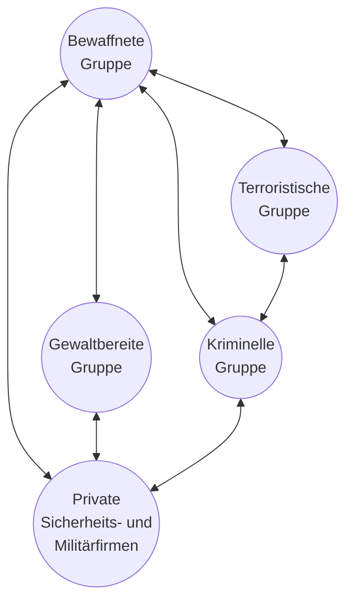
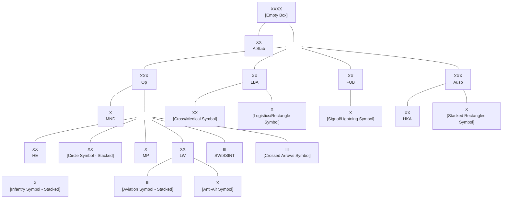
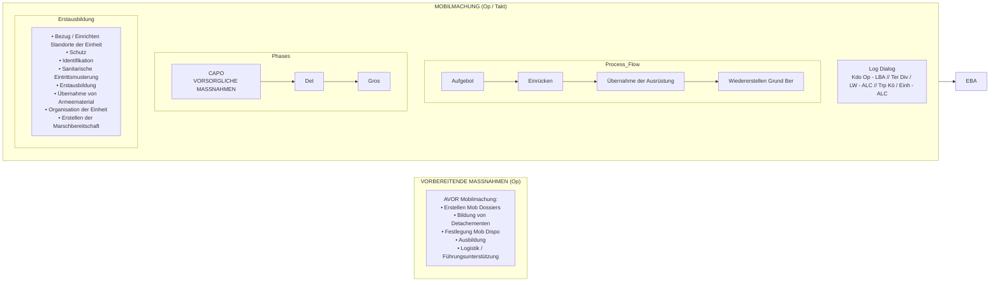
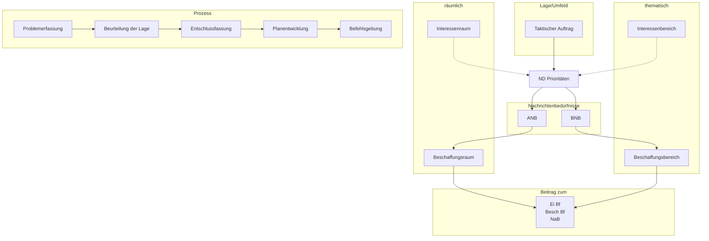
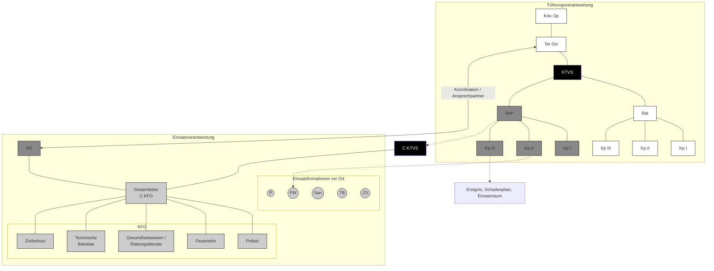
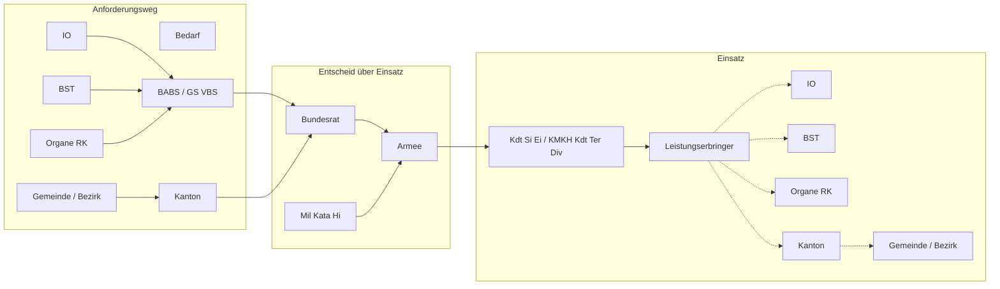
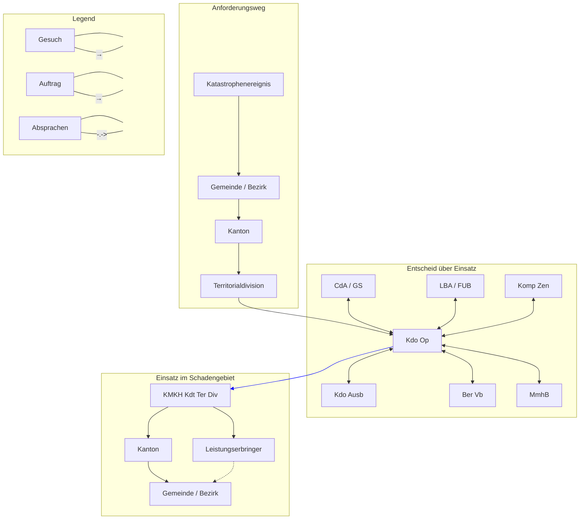
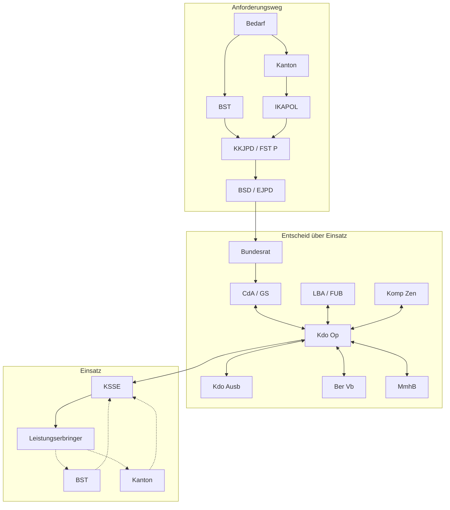

Schweizerische Eidgenossenschaft
Confédération suisse
Confederazione Svizzera
Confederaziun svizra

**Schweizer Armee**

<description>
A thick horizontal purple bar spans the width of the page.
</description>

Reglement 50.030 d

# Taktische Führung 17
## (TF 17)
## Inhalts- und Abbildungsverzeichnis

Gültig ab 01.01.2018
Stand am 01.09.2019


SAP 2565.7025


Schweizerische Eidgenossenschaft
Confédération suisse
Confederazione Svizzera
Confederaziun svizra

**Schweizer Armee**

Reglement 50.030 d

# Taktische Führung 17

(TF 17)

## Inhalts- und Abbildungsverzeichnis

Gültig ab 01.01.2018
Stand am 01.09.2019

Reglement 50.030 d Taktische Führung 17

# Verteiler

**Persönliche Exemplare**
* Eingeteilte Offiziere
* Offiziersaspiranten
* Höhere Unteroffiziere, die in Stäben eingeteilt sind
* Berufsoffiziere und -unteroffiziere, die nicht in einer OTF Funktion eingeteilt sind

**Verwaltungsexemplare**
* Stäbe und Bundesämter des VBS

**Bund**
* Delegierte des Bundes und der Kantone für den Sicherheitsverbund Schweiz (KKM SVS)
* Chef LAINAT
* Vertreter Bundeskanzlei

**Kantone**
* Generalsekretär KKJPD
* Generalsekretär RK MZF
* Leiter der Fachgruppe zivile Führungsstäbe KVMBZ
* Präsidenten der Polizeikonkordate
* Präsidenten der regionalen Arbeitsgruppen KVMBZ
* Fachkonferenzen der Kantone (in IK FKS, RKK MZF und KKJPD gebündelt)
* Stabschefs der kantonalen Führungsstäbe

**Weitere**
* BAZL
* Skyguide
* armasuisse
* Bibliothek am Guisanplatz

II

Reglement 50.030 d Taktische Führung 17

# Inkraftsetzung

## Reglement 50.030 d

## Taktische Führung 17
(TF 17)

vom 05.07.2017<sup>1</sup>

erlassen gestützt auf Artikel 10 der Organisationsverordnung für das Eidgenössische Departement für Verteidigung, Bevölkerungsschutz und Sport (OV-VBS) vom 07.03.2003<sup>2</sup>.

Dieses Reglement tritt auf den 01.01.2018 in Kraft.

Auf den Termin des Inkrafttretens wird aufgehoben und ausser Kraft gesetzt: Reglement 51.020 Taktische Führung XXI (TF XXI), gültig ab 01.01.2004.

Die Direktunterstellten heben alle diesem Reglement widersprechenden Anordnungen auf.

**Chef der Armee**

<sup>1</sup>Unterzeichnungsdatum
<sup>2</sup>SR **172.214.1**
III

Reglement 50.030 d Taktische Führung 17

# Revisionsanträge

Revisionsanträge zum vorliegenden Reglement sind schriftlich zu richten an:

Armeestab
Chef Militärdoktrin
Papiermühlestrasse 20
3003 Bern

IV

Reglement 50.030 d Taktische Führung 17

# Vorbemerkungen

**Generisches Maskulinum**
Zugunsten der Lesbarkeit wird in diesem Reglement das generische Maskulinum verwendet.

**Gegner – Gegenseite**
Aus Gründen der Lesbarkeit wird in diesem Reglement das Begriffspaar Gegner/gegnerisch verwendet. Der Anwender muss den entsprechenden Begriff angepasst an Auftrag und Lage verwenden.

**Verteidigung**
Der Begriff Verteidigung muss zum Verständnis mit einer Führungsstufe verbunden werden. Verteidigen als Gefechtsform hat auf taktischer Führungsstufe eine andere Bedeutung als auf strategischer und militärstrategischer oder operativer Stufe.

**Kraft (Kräfte) – Mittel**
Kraft ist die Summe aller eingesetzten Mittel und definiert sich über im Verbund erzeugte Wirkung. Um die Begriffe voneinander unterscheiden zu können, werden diese getrennt verwendet:
* die operative Führungsstufe verwendet in der Regel den Begriff "Kraft/Kräfte";
* die taktische Führungsstufe verwendet in der Regel den Begriff "Mittel".

**Aktion – Einsatz der Armee – Operation – Einsatz**
Eine militärische Handlung wird allgemein als **Aktion** bezeichnet. Unter diesen Oberbegriff fallen:
* **Einsatz der Armee** – von der strategischen und militärstrategischen Führungsstufe in gegenseitiger Absprache geführte Operation/en zur Erreichung des angestrebten militärischen Endzustandes;
* **Operation** – in Raum und Zeit abgestimmte, streitkräftegemeinsame und operationsraum-übergreifende Aktion militärischer Kräfte zur Erreichung operativer und militärstrategischer Ziele;
* **Einsatz** – räumlich und zeitlich abgestimmte Aktion militärischer Verbände zur Erreichung taktischer Ziele.

V

Reglement 50.030 d Taktische Führung 17

**Bedrohung versus Gefahren**
Bedrohung ist die Gesamtheit der Handlungsmöglichkeiten eines Gegners oder einer Gegenseite, die Unversehrtheit von Menschen, Tieren und Gütern, die Informationshoheit oder die militärische bzw zivile Handlungsfreiheit in Frage zu stellen. Bedrohung setzt einen Willen voraus, die Schweiz oder ihre Interessen zu schädigen oder zumindest eine solche Schädigung in Kauf zu nehmen.

Gefahren sind die Gesamtheit der Faktoren der Umwelt, welche die Unversehrtheit von Menschen, Tieren und Gütern oder die militärische bzw zivile Handlungsfreiheit in Frage stellen können. Gefahren setzen keinen Willen voraus, die Schweiz oder ihre Interessen zu schädigen.

**Begriffe**
Die mit einem Sternchen versehenen Wörter sind Begriffe und durch eine eindeutige Definition belegt (siehe Reglement 50.041, Begriffe Führungsreglemente der Armee 17).

VI

Reglement 50.030 d Taktische Führung 17

# Inhaltsverzeichnis TF 17

## Kapitel 1

**1 Allgemeines** 1
1.1 Zweck 1
1.2 Aufgaben der Armee 2
1.2.1 Aufgabenspektrum der Armee 3
1.2.2 Einsatzspektrum der Armee 3
1.2.3 Rechtsgrundlagen für den Einsatz der Armee 5
1.3 Aufgaben der Führungsstufen 8
1.4 Leistungsprofil der Armee 11
1.5 Bereitschaft 14
1.6 Zusammenarbeit mit Partnern 17

## Kapitel 2

**2 Einsatzumfeld** 1
2.1 Operationsräume 1
2.2 Militärgeografische Aspekte der Schweiz 4
2.2.1 Die Schweiz und ihr Umfeld 4
2.2.2 Verkehrsachsen 5
2.2.3 Hindernisse 8
2.2.4 Klima und Witterung 9
2.2.5 Bevölkerung und Gesellschaft 9
2.2.6 Infrastruktur 10
2.3 Geländetypen 12
2.3.1 Offenes Gelände 13
2.3.2 Bedecktes Gelände 13
2.3.3 Gekammertes Gelände 14
2.3.4 Gebirgiges Gelände 14
2.3.5 Überbautes Gelände 15
2.4 Partner im nationalen Sicherheitsverbund 16
2.4.1 Sicherheitsverbund Schweiz 16
2.4.2 Bevölkerungsschutz 16
2.4.3 Gemeinsame Führungsorgane 17
2.4.4 Polizei 19
2.4.5 Feuerwehr 21
2.4.6 Gesundheitswesen Schweiz 22
2.4.7 Technische Betriebe 24
2.4.8 Zivilschutz 24
2.4.9 Grenzwachtkorps 25
2.4.10 Private Sicherheitsfirmen 28

VII

Reglement 50.030 d Taktische Führung 17

2.5 **Akteure und Organisationen im internationalen Umfeld** 29
2.5.1 Bevölkerungsschutz im grenznahen Ausland 29
2.5.2 Sicherheitspolitisch relevante internationale Organisationen 30

# Kapitel 3

3 **Bedrohung und Gefahren** 1
3.1 Bedrohung 1
3.1.1 Grundsätzliches 1
3.1.2 Zwischenstaatliche Konfliktaustragung 3
3.1.3 Gewaltanwendung durch nicht-staatliche Akteure 6
3.1.4 Fähigkeiten der Akteure in den Operationsräumen 10
3.1.5 Herausforderungen für die Sicherheitskräfte 13
3.2 Gefahren 14
3.2.1 Naturbedingte Gefahren 14
3.2.2 Zivilisationsbedingte Gefahren 15
3.2.3 Allgemeine Merkmale von Katastrophen 15
3.2.4 Herausforderungen für die Sicherheitskräfte 16

# Kapitel 4

4 **Gliederung der Armee** 1
4.1 **Truppengattungen, Dienstzweige und Militärjustiz** 1
**Truppengattungen** 1
4.1.1 Infanterie 1
4.1.2 Panzertruppen 2
4.1.3 Artillerie 2
4.1.4 Fliegertruppen 2
4.1.5 Fliegerabwehrtruppen 3
4.1.6 Genietruppen 3
4.1.7 Führungsunterstützungstruppen 3
4.1.8 Rettungstruppen 4
4.1.9 Logistiktruppen 4
4.1.10 Sanitätstruppen 5
4.1.11 Militärpolizei 5
4.1.12 ABC Abwehrtruppen 6
4.1.13 Spezialkräfte 6
**Dienstzweige** 7
4.1.14 Generalstabsdienst 7
4.1.15 Militärischer Nachrichtendienst 7
4.1.16 Armeeseelsorge 8
4.1.17 Psychologisch-Pädagogischer Dienst der Armee 8
4.1.18 Territorialdienst 8

VIII

Reglement 50.030 d Taktische Führung 17

4.1.19 Bereitschaftsdienst 8
**Militärjustiz** **9**
**4.2 Formationen der operativen und taktischen Stufe** **9**
**Operative Stufe** **11**
4.2.1 Kommando Operationen 11
4.2.2 Militärischer Nachrichtendienst und Dienst für präventiven Schutz der Armee 11
**Taktische Stufe** **12**
4.2.3 Heer 12
4.2.4 Territorialdivisionen 12
4.2.5 Kommando Militärpolizei 13
4.2.6 Luftwaffe 13
4.2.7 Kompetenzzentrum SWISSINT 13
4.2.8 Kommando Spezialkräfte 14
4.2.9 Logistikbasis der Armee 14
4.2.10 Führungsunterstützungsbasis 15
4.2.11 Lehrverbände 15
4.2.12 Berufsformationen 15
4.2.13 Einsatzverbände 16

### Kapitel 5

**5 Grundkenntnisse taktischer Führung** **1**
5.1 Allgemeines 1
5.2 Grundsätze der Taktik 2
5.2.1 Einsatzgrundsätze 2
5.2.2 Weitere Grundsätze 5
5.2.3 Taktische Grundsätze 6
5.3 Führung auf taktischer Stufe 10
5.3.1 Führung der Unterstellten 10
5.3.2 Wirkungsorientierte Führung 12
5.3.3 Führung der Kommunikation 13
5.3.4 Führung des Personellen 14
5.3.5 Führung der Ausbildung 15
5.4 Einsatzraum und Raumordnung 16
5.5 Taktische Aufgaben 24

### Kapitel 6

**6 Aufgaben im Einsatz** **1**
6.1 Mobilmachung 1
6.2 Erstellen der Einsatzbereitschaft im Bereitschaftsraum 5

IX

Reglement 50.030 d Taktische Führung 17

6.2.1 Erstellen der Einsatzbereitschaft 5
6.2.2 Bereitschaftsraum 5
6.3 Mobilität 9
6.3.1 Verschiebung 9
6.3.2 Marsch 10
6.3.3 Bewegungs- und Hindernisführung 12
6.3.4 Besonderheiten 14
6.4 Nachrichtendienst 17
6.4.1 Führung des Nachrichtendienstes 18
6.4.2 Nachrichtendienstlicher Zyklus 19
6.4.3 Nachrichtenverbund 25
6.5 Führungsunterstützung 28
6.5.1 Führungsdienst 29
6.5.2 Führungsinfrastruktur 29
6.6 Logistik 37
6.6.1 Allgemeines 37
6.6.2 Grundsätze der Logistik 37
6.6.3 Stufen der Logistik 38
6.6.4 Prozesse der Logistik 39
6.6.5 Sanität 48
6.7 Schutz eigener Mittel 53
6.7.1 Individuelle Schutzmassnahmen 54
6.7.2 Gegennachrichtendienst 55
6.7.3 Tarnen und Täuschen 55
6.7.4 ABC Abwehr 56
6.7.5 Kampfmittelabwehr 57
6.7.6 Integrale Sicherheit 57
6.7.7 Schutzmassnahmen im Elektromagnetischen Raum 57
6.7.8 Schutzmassnahmen im Cyber-Raum 58

# Kapitel 7

# 7 Verteidigung 1
## 7.1 Rahmen 1
7.1.1 Verteidigungsbegriffe 1
7.1.2 Verteidigungsfall 1
7.1.3 Bedrohungsannahmen 2
7.1.4 Verteidigungsdoktrin 3
7.1.5 Zivil-militärische Zusammenarbeit in der Verteidigung 7
## 7.2 Militärische Kraftanwendung im zivilen Umfeld 8
## 7.3 Umsetzung in der Luft 9
7.3.1 Schutz des Luftraums 10

X

Reglement 50.030 d Taktische Führung 17

7.3.2 Luftmobilität 11
7.3.3 Luftgestützte Nachrichtenbeschaffung 12
7.3.4 Erdkampf 12
7.3.5 Gefechtsformen in der Luft 13
7.4 Umsetzung am Boden 14
7.4.1 Schützende Aktionen 15
7.4.2 Dissuasive Präsenz 19
7.4.3 Bekämpfung bewaffneter Gruppen 20
7.4.4 Abwehr eines terrestrischen Vorstosses 23
7.4.5 Beitrag der Spezialkräfte 25
7.5 Gefechtsform Angriff am Boden 27
7.5.1 Prinzip des Angriffs 27
7.5.2 Räumliche Elemente des Angriffs 29
7.5.3 Bewegungsformen 32
7.5.4 Angriffsarten 34
7.5.5 Angriff in überbautem Gelände 35
7.5.6 Angriff in anderem Geländetyp 38
7.6 Gefechtsform Verteidigung am Boden 38
7.6.1 Prinzip der Verteidigung 39
7.6.2 Räumliche Elemente der Verteidigung 41
7.6.3 Taktische Elemente der Verteidigung 42
7.6.4 Verteidigung in gebirgigem Gelände 43
7.6.5 Verteidigung in überbautem Gelände 44
7.6.6 Verteidigung in anderem Geländetyp 45
7.7 Gefechtsform Verzögerung am Boden 46
7.7.1 Prinzip der Verzögerung 46
7.7.2 Räumliche Elemente der Verzögerung 48
7.8 Besondere Aufgaben in allen Gefechtsformen am Boden 49
7.8.1 Nachrichtenbeschaffung am Boden 50
7.8.2 Überwachen von Räumen 50
7.8.3 Begegnungsgefecht 51
7.8.4 Rückzug 52
7.8.5 Aufnahme 55
7.8.6 Ablösung 57
7.8.7 Flussübergang 59
7.8.8 Bekämpfung gegnerischer Luftlandungen 60
7.9 Umsetzung im Elektromagnetischen Raum 61
7.9.1 Rahmen 61
7.9.2 Schutzmassnahmen 63
7.9.3 Intervention / Wirkungen 63
7.9.4 Nachrichtenbeschaffung im Elektromagnetischen Raum 64

XI

Reglement 50.030 d Taktische Führung 17

7.10 **Umsetzung im Cyber-Raum** 65
7.10.1 Rahmen 65
7.10.2 Schutzmassnahmen 65
7.10.3 Intervention/Wirkungen 65
7.11 **Umsetzung im Informationsraum** 68
7.11.1 Rahmen 68
7.11.2 Schutzmassnahmen 69
7.11.3 Intervention/Wirkungen 69

### Kapitel 8

8 **Wahrung der Lufthoheit** 1
8.1 Rahmen 1
8.1.1 Allgemeines 1
8.1.2 Nationale Partner 1
8.1.3 Internationale Partner 2
8.1.4 Luftraumordnungsmassnahmen 2
8.2 Umsetzung in der Luft 4
8.2.1 Luftpolizeidienst 4
8.2.2 Passive luftpolizeiliche Massnahmen 4
8.2.3 Aktive luftpolizeiliche Massnahmen 5
8.2.4 Nicht eingeschränkter Luftverkehr 6
8.2.5 Eingeschränkter Luftverkehr 6
8.2.6 Waffeneinsatz gegen Luftfahrzeuge 7
8.2.7 Übergang zur Luftverteidigung und Neutralitätsschutz 7

### Kapitel 9

9 **Unterstützung ziviler Behörden** 1
9.1 Rahmen 1
9.1.1 Allgemeines 1
9.1.2 Zielsetzung 2
9.1.3 Zivil-militärische Zusammenarbeit (ZMZ) 2
9.2 Zusammenarbeit zwischen ziviler Führungsorganisation und Armee 3
9.3 Leistungsanforderung 6
9.3.1 Gesuchsteller und Gesuchsweg 6
9.3.2 Gesuch 8
9.4 Militärische Leistungen 9
9.4.1 Spontanhilfe 10
9.4.2 Militärische Katastrophenhilfe im Inland und grenznahen Ausland 11
9.4.3 Katastrophenhilfe und humanitäre Hilfeleistung im Ausland 12
9.4.4 Sicherungseinsätze 12

XII

Reglement 50.030 d Taktische Führung 17

9.4.5 Weitere Unterstützungseinsätze 18
9.5 Umsetzung in der Luft 19
9.5.1 Rahmen 19
9.5.2 Luftmobilität 19
9.5.3 Luftgestützte Nachrichtenbeschaffung 19
9.6 Umsetzung am Boden 20
9.7 Umsetzung in den anderen Operationsräumen 20
9.7.1 Umsetzung im Elektromagnetischen Raum 20
9.7.2 Umsetzung im Cyber-Raum 21
9.7.3 Umsetzung im Informationsraum 21
9.8 Unterstützung 21
9.8.1 Nachrichtendienst 21
9.8.2 Führungsunterstützung 23
9.8.3 Logistik 23
9.8.4 ABC Abwehr- und Schutzmassnahmen 24
9.8.5 Kampfmittelbeseitigung 25

# Kapitel 10

**10 Friedensförderung 1**
10.1 Rahmen 1
10.1.1 Allgemeines 1
10.1.2 Begriffe 2
10.1.3 Nationaler Rechtsrahmen und völkerrechtlicher Rahmen 2
10.1.4 Angestrebter Endzustand 2
10.2 Politische Entscheidungsfindung in der Schweiz 3
10.3 Führung im internationalen Umfeld 3
10.3.1 Organisation und Unterstellung von Friedensförderungsverbänden 3
10.3.2 Nationale Unterstellung 4
10.3.3 Interoperabilität 4
10.3.4 Einsatzregeln 5
10.3.5 Standardverhalten 5
10.4 Einsatzraum in der Friedensförderung 5
10.4.1 Zivilbevölkerung 5
10.4.2 Rechtliche Erwägungen 6
10.4.3 Akteure und internationale Partner 6
10.5 Aufgaben in der Friedensförderung 6
10.5.1 Prävention und Bedrohungsminderung 7
10.5.2 Sicherheit und Stabilität 8
10.5.3 Nachsorge und Konsolidierung 8
10.6 Umsetzung in der Luft 9

XIII

Reglement 50.030 d Taktische Führung 17

10.7 Umsetzung am Boden 9
10.8 Umsetzung in den anderen Operationsräumen 10
10.8.1 Umsetzung im Elektromagnetischen Raum 10
10.8.2 Umsetzung im Cyber-Raum 11
10.8.3 Umsetzung im Informationsraum 11
10.9 Unterstützung 11
10.9.1 Nachrichtendienst 11
10.9.2 Führungsunterstützung 11
10.9.3 Logistik 13

# Anhangsverzeichnis

**Anhang 1**
Aufgabenspektrum 1

**Anhang 2**
Einsatzspektrum mit taktischen Aufgaben 2

**Anhang 3**
Übersicht Einsatzarten, Zuständigkeiten für das Aufgebot, Befugnisse 4

**Anhang 4**
Bereitschaftsgrade 5

**Anhang 5**
Nachschubklassen 10

**Anhang 6**
Umsetzung Schutzaufgaben am Boden 11

**Anhang 7**
Richtwerte für Schutzaufgaben am Boden 13

**Anhang 8**
Richtwerte für Mobilität 15

**Anhang 9**
Richtwerte für Gefechtsformen am Boden 16

**Anhang 10**
Aufgaben im Einsatz 18

XIV

Reglement 50.030 d Taktische Führung 17

# Abbildungsverzeichnis

### Kapitel 1
* Abbildung 101: System der Führungsdokumente der Armee 1
* Abbildung 102: Aufgabenspektrum der Armee 3
* Abbildung 103: Einsatzspektrum der Armee 4
* Abbildung 104: Einsatzarten 5
* Abbildung 105: Führungsstufen und Aufgaben 9
* Abbildung 106: Schematische Darstellung Leistungsprofil der Armee 12
* Abbildung 107: Abgestufte Bereitschaft (Prinzipskizze) 15

### Kapitel 2
* Abbildung 201: Operationsräume – Weltraum, Luft, Boden, Maritimer Raum, Elektromagnetischer Raum, Cyber-Raum und Informationsraum (Prinzipdarstellung) 1
* Abbildung 202: Militärgeografische Merkmale der Schweiz in ihrem Umfeld 4
* Abbildung 203: Hauptverkehrsachsen von nationaler und europäischer Bedeutung (Strasse und Schiene) 6
* Abbildung 204: Luftraumstruktur mit den Luftstrassen GOLF 5 und ALPHA 9, den 5 Flughäfen von nationaler Bedeutung und dem täglichen Luftverkehr über der Schweiz (ohne militärische Flugbewegungen) 7
* Abbildung 205: Hinderniswirkung des Mittellandes (Gewässer, Bevölkerung) 8
* Abbildung 206: Auswahl kritischer Infrastrukturen von nationaler und europäischer Bedeutung 11
* Abbildung 207: Geländetypen 12
* Abbildung 208: Verbundsystem Bevölkerungsschutz 17
* Abbildung 209: Polizeikonkordate 20
* Abbildung 210: Gesundheitswesen Schweiz 23
* Abbildung 211: Grenzwachtregionen 26
* Abbildung 212: Einsatzraum des Grenzwachtkorps (schematische Darstellung) 27
* Abbildung 213: Europäische Sicherheitsarchitektur (Stand: 2016) 30

### Kapitel 3
* Abbildung 301: Akteure und Handlungsweisen in einem hybriden Konfliktumfeld 3
* Abbildung 302: Möglicher Verlauf eines zwischenstaatlichen Konfliktes (mit eskalierender Intensität) 4
* Abbildung 303: Mögliche Konfliktverläufe (parallel und kumulativ) 5
* Abbildung 304: Kategorien der nicht-staatlichen Gewaltakteure und Übergangsbeziehungen 6

XV

Reglement 50.030 d Taktische Führung 17

Abbildung 305: Fähigkeiten und Kategorien der Akteure im Cyber-Raum 13

## Kapitel 4
Abbildung 401: Armeegrundgliederung 10
Abbildung 402: Bilden von Einsatzverbänden (Beispiel eines Einsatzverbands Infanteriebataillon) 16

## Kapitel 5
Abbildung 501: Raumordnung Boden am Beispiel Verteidigung (schematische Darstellung) 18

## Kapitel 6
Abbildung 601: Prozess der Mobilmachung 1
Abbildung 602: Schematische Darstellung der Mobilmachung in einem taktischen Dispositiv 4
Abbildung 603: Bereitschaftsraum 7
Abbildung 604: Räumliche Elemente des Marsches 11
Abbildung 605: Passieren eines Verbandes – vorwärts 14
Abbildung 606: Passieren eines Verbandes – rückwärts 15
Abbildung 607: Beauftragung des Nachrichtendienstes im Verlauf der Aktionsplanung 18
Abbildung 608: Der nachrichtendienstliche Zyklus eingebettet im Gesamtrahmen der Führung und Leistungserbringung 20
Abbildung 609: Nachrichtenverbund am Beispiel eines Truppenkörpers 26
Abbildung 610: Schematische Darstellung des Nachrichtenverbundes in einem taktischen Dispositiv 27
Abbildung 611: Teilmobile Verbindungsmittel im Verbund mit der ortsfesten IKT-Betreiberinfrastruktur 33
Abbildung 612: Schematische Darstellung der Führungseinrichtungen und Verbindungsmitteln in einem taktischen Dispositiv 34
Abbildung 613: Stufen der Logistik 38
Abbildung 614: Prozess der logistischen Planung 40
Abbildung 615: Nachschubsprozess 41
Abbildung 616: Darstellung der Logistikpunkte 42
Abbildung 617: Schematische Darstellung des Nachschubprozesses in einem taktischen Dispositiv 43
Abbildung 618: Instandhaltungsprozess 45
Abbildung 619: Verkehr- und Transportprozess 46
Abbildung 620: Infrastrukturprozess 47
Abbildung 621: Stufen der Sanität 48
Abbildung 622: Sanitätsprozess 51
Abbildung 623: Schematische Darstellung des Patientenwegs in einem taktischen Dispositiv 52

XVI

Reglement 50.030 d Taktische Führung 17

**Kapitel 7**
**Abbildung 701:** Umsetzung der Verteidigungsdoktrin in allen Operationsräumen 4
**Abbildung 702:** Aktionen in der Verteidigung am Boden 15
**Abbildung 703:** Schützende Aktionen in der Verteidigung 16
**Abbildung 704:** Schutz kritischer Infrastruktur 17
**Abbildung 705:** Schutz von Grenzabschnitten 17
**Abbildung 706:** Schutz von Transversalen und Knoten 18
**Abbildung 707:** Schutz von Schlüsselräumen 19
**Abbildung 708:** Dissuasive Präsenz in der Verteidigung 20
**Abbildung 709:** Bekämpfung bewaffneter Gruppen in der Verteidigung 21
**Abbildung 710:** Kombination der Gefechtsformen bei der Abwehr eines terrestrischen Vorstosses 23
**Abbildung 711:** Einsatz der Mittel im Verbund durch einen Einsatzverband Mechanisierte Brigade bei der Abwehr eines terrestrischen Vorstosses 24
**Abbildung 712:** Gefechtsform Angriff (schematische Darstellung) 27
**Abbildung 713:** Die räumlichen Elemente des Angriffs (schematische Darstellung) 30
**Abbildung 714:** Lageabhängiges Vorgehen im überbauten Gelände (schematische Darstellung) 36
**Abbildung 715:** Gefechtsform Verteidigung (schematische Darstellung) 39
**Abbildung 716:** Räumliche und taktische Elemente der Verteidigung (schematische Darstellung) 42
**Abbildung 717:** Gefechtsform Verzögerung (schematische Darstellung) 46
**Abbildung 718:** Räumliche Elemente der Verzögerung (schematische Darstellung) 48
**Abbildung 719:** Rückzug 52
**Abbildung 720:** Aufnahme 55
**Abbildung 721:** Ablösung 57
**Abbildung 722:** Flussübergang 59
**Abbildung 723:** Aktionen im Cyber-Raum 66

**Kapitel 8**
**Abbildung 801:** Beispiel eines grenzübergreifenden Flugbeschränkungsgebiets (WEF 2016) 3

**Kapitel 9**
**Abbildung 901:** Beispiel der Zusammenarbeit zwischen ziviler Führungsorganisation und Armee 5
**Abbildung 902:** Generischer Gesuchsweg (Prinzipskizze) 6
**Abbildung 903:** Gesuchsweg für militärische Katastrophenhilfe (Prinzipskizze) 7

XVII

Reglement 50.030 d Taktische Führung 17

Abbildung 904: Gesuchsweg für Sicherungseinsätze (Prinzipskizze) 8
Abbildung 905: Beispiel für den durch die Ter Div – zusammen mit den zivilen Behörden – bereinigten "Leistungsgesuch" nach dem Raster PPQQZD 9
Abbildung 906: Militärische Leistungen zugunsten ziviler Behörden 10
Abbildung 907: Zusammenspiel zwischen Spontanhilfe und militärischer Katastrophenhilfe (generische Darstellung) 11
Abbildung 908: Schutz kritischer Infrastruktur 13
Abbildung 909: Schutz von Grenzabschnitten 14
Abbildung 910: Schutz von Transversalen und Knoten 15
Abbildung 911: Schutz von Schlüsselräumen 16
Abbildung 912: Verstärkung der polizeilichen Grundversorgung und Personenschutz 17

## Kapitel 10
Abbildung 1001: Aufgabenbereiche in der Friedensförderung 7

XVIII

Reglement 50.030 d Taktische Führung 17

# Notizen

XIX

Reglement 50.030 d Taktische Führung 17

**Impressum**

*   **Herausgeber**: Schweizer Armee
*   **Verfasser**: A Stab, Militärdoktrin
*   **Premedia**: Zentrum elektronische Medien ZEM
*   **Vertrieb**: Bundesamt für Bauten und Logistik BBL
*   **Copyright**: VBS/DDPS
*   **Auflage**: 1600 07.2021
*   **Internet**: https://www.lmsvbs.admin.ch
*   **Reglement**: 50.030 d
*   **SAP**: 2565.7025

Inhalt gedruckt auf 100% Altpapier, aus FSC-zertifizierten Rohstoffen

XX


Schweizerische Eidgenossenschaft
Confédération suisse
Confederazione Svizzera
Confederaziun svizra

**Schweizer Armee**

<description>
A thick horizontal purple bar spans the width of the page.
</description>

Reglement 50.030 d

# Taktische Führung 17
## (TF 17)
## Kapitel 1 – Allgemeines

Gültig ab 01.01.2018
Stand am 01.09.2019


SAP 2565.7025


Schweizerische Eidgenossenschaft
Confédération suisse
Confederazione Svizzera
Confederaziun svizra

**Schweizer Armee**

Reglement 50.030 d

# Taktische Führung 17
## (TF 17)
# Kapitel 1 – Allgemeines

Gültig ab 01.01.2018
Stand am 01.09.2019

Reglement 50.030 d Taktische Führung 17

II

Reglement 50.030 d Taktische Führung 17

# Inhaltsverzeichnis TF 17 – Kapitel 1

**1 Allgemeines** 1
1.1 Zweck 1
1.2 Aufgaben der Armee 2
1.2.1 Aufgabenspektrum der Armee 3
1.2.2 Einsatzspektrum der Armee 3
1.2.3 Rechtsgrundlagen für den Einsatz der Armee 5
1.3 Aufgaben der Führungsstufen 8
1.4 Leistungsprofil der Armee 11
1.5 Bereitschaft 14
1.6 Zusammenarbeit mit Partnern 17

III

Reglement 50.030 d Taktische Führung 17

IV

Reglement 50.030 d Taktische Führung 17

# 1 Allgemeines

## 1.1 Zweck

1001 Der Chef der Armee (CdA) erlässt die Führungsreglemente der Armee. Diese beinhalten Grundsätze, setzen Standards und dienen als Leitlinien für das Handeln der militärstrategischen, der operativen und der taktischen Führung. Sie sind so ausgestaltet, dass die Handlungsfreiheit des Kommandanten gewahrt bleibt und nur soweit eingeschränkt wird, als dies für die Koordination notwendig ist.

1002 Die Taktische Führung 17 (TF 17) enthält die Grundsätze für die Führung von Aktionen der Armee auf taktischer Stufe. Sie richtet sich an alle Offiziere und weitere Kader, die auf der taktischen Stufe führen.

<table>
  <thead>
    <tr>
        <th>Führungsstufe</th>
        <th colspan="3">Führungsreglemente der Armee</th>
        <th>Arbeitshilfen</th>
    </tr>
    <tr>
        <th></th>
        <th>Verfahren</th>
        <th>Prozesse/Produkte</th>
        <th>Terminologie</th>
        <th></th>
    </tr>
  </thead>
  <tbody>
    <tr>
        <td>Militärstrategische Führung</td>
        <td>MF 17</td>
        <td rowspan="3"></td>
        <td rowspan="3"></td>
        <td>Handbuch MSS</td>
    </tr>
    <tr>
        <td>Operative Führung</td>
        <td>OF 17</td>
        <td>FSO 17</td>
        <td>Begriffe 17</td>
        <td>Handbuch Op Fhr</td>
    </tr>
    <tr>
        <td>Taktische Führung</td>
        <td>TF 17</td>
        <td></td>
        <td>BGO<br/>BFT</td>
    </tr>
  </tbody>
</table>

**Legende**
*   **MF 17** Militärstrategische Führung 17
*   **OF 17** Operative Führung 17
*   **TF 17** Taktische Führung 17
*   **FSO 17** Führung und Stabsorganisation der Armee 17
*   **MSS** Militärstrategischer Stab
*   **Op Fhr** Operative Führung
*   **BGO** Behelf für Generalstabsoffiziere
*   **BFT** Behelf Führung Truppenkörper

*Abbildung 101: System der Führungsdokumente der Armee*

1003 Das Reglement TF 17 dient der Förderung des umfassenden Verständnisses für den taktischen Einsatz militärischer Mittel. Es beschreibt den Einsatz der Mittel im Verbund (das Gefecht der verbundenen Waffen bzw den Einsatz der verbundenen Mittel).

1004 Die in der TF 17 beschriebenen Prinzipien und Verfahren gelten als Anhaltspunkte. Sie sind keine bindenden Lösungen und dienen als Leitlinie für das Handeln auf taktischer Stufe. Der Kommandant bestimmt und verantwortet im Einzelfall sein Handeln.

1

Reglement 50.030 d Taktische Führung 17

## 1.2 Aufgaben der Armee

1005 Der Schutz der Freiheit, der Rechte des Volkes, der Unabhängigkeit und die Sicherheit des Landes ist eine der Hauptaufgaben unseres Staates. Im Inneren liegt die Verantwortung in erster Linie bei den Kantonen, gegen aussen bei der Eidgenossenschaft.

1006 In einem Umfeld vielseitiger Abhängigkeiten, Verletzlichkeiten und Interessen kann diese Aufgabe nur im Verbund bewältigt werden. Der Sicherheitsverbund Schweiz (SVS) vereinigt kommunale, kantonale und eidgenössische Behörden und Organisationen. Die Nachrichtendienste sorgen für die bedrohungsgerechte Antizipation. Die Armee ist neben den Blaulichtorganisationen, den technischen Betrieben und dem Zivilschutz eines der Hauptmittel des SVS zur Abwehr von Bedrohung und Gefahren sowie zur Bewältigung von Ereignissen.

1007 Die Bundesverfassung definiert die Aufgaben der Armee. Deren Ausgestaltung wird durch Gesetze und Verordnungen präzisiert.

1008 Das Militärgesetz nennt unter Artikel 1 als Aufgaben der Armee:

> <sup>1</sup>Die Armee:
> a) dient der Kriegsverhinderung und trägt bei zur Erhaltung des Friedens;
> b) verteidigt das Land und seine Bevölkerung;
> c) wahrt die schweizerische Lufthoheit.
>
> <sup>2</sup>Sie unterstützt die zivilen Behörden im Inland, wenn deren Mittel nicht mehr ausreichen:
> a) bei der Abwehr schwerwiegender Bedrohungen der inneren Sicherheit;
> b) bei der Bewältigung von Katastrophen und anderer ausserordentlicher Lagen;
> c) beim Schutz von Personen und besonders schutzwürdigen Sachen, insbesondere von Infrastrukturen, die für Gesellschaft, Wirtschaft und Staat unerlässlich sind (kritische Infrastrukturen);
> d) bei der Erfüllung von Aufgaben im Rahmen des Sicherheitsverbundes Schweiz und der koordinierten Dienste;
> e) bei der Bewältigung von Spitzenbelastungen oder von Aufgaben, die die Behörden mangels geeigneter Personen oder Mittel nicht bewältigen können;
> f) bei der Erfüllung anderer Aufgaben von nationaler oder internationaler Bedeutung.
>
> <sup>3</sup>Sie unterstützt zivile Behörden im Ausland:
> a) beim Schutz von Personen und besonders schutzwürdigen Sachen;
> b) bei humanitären Hilfeleistungen.
>
> <sup>4</sup>Sie leistet Beiträge zur Friedensförderung im internationalen Rahmen.
>
> <sup>5</sup>Sie kann zivilen Behörden und Dritten:
> a) für zivile oder ausserdienstliche Tätigkeiten im Inland militärische Mittel zur Verfügung stellen;
> b) mit Truppen im Ausbildungsdienst und mit Berufsformationen Spontanhilfe zur Bewältigung von unvorhergesehenen Ereignissen leisten.

2

Reglement 50.030 d Taktische Führung 17

## 1.2.1 Aufgabenspektrum der Armee

1009 Das Aufgabenspektrum beschreibt,
* welche Aufgaben die Verfassung und das Militärgesetz der Armee übertragen;
* wer in welcher Aufgabe den Einsatz der Armee verantwortet;
* welchem Zweck die Armeeaufgaben dienen.

<table>
  <thead>
    <tr>
        <th></th>
        <th colspan="3">Kriegsverhinderung und Beitrag zur Erhaltung des Friedens</th>
    </tr>
    <tr>
        <th>Armeeaufgaben</th>
        <th>Verteidigung</th>
        <th>Unterstützung<br/>ziviler Behörden</th>
        <th>Friedensförderung</th>
    </tr>
    <tr>
        <th></th>
        <th colspan="3">Wahrung der Lufthoheit</th>
    </tr>
    <tr>
        <th>Einsatzverantwortung</th>
        <th>Bund</th>
        <th>Kanton, Bundesbehörde,<br/>internationale Organisation</th>
        <th>Bund<br/>(Mandat; im Verbund mit internationaler<br/>Organisation / Partnerstaaten)</th>
    </tr>
    <tr>
        <th>Aufgaben gemäss<br/>Militärgesetz</th>
        <th>• Verteidigung von Land und<br/>Bevölkerung</th>
        <th>**Im Inland:** Unterstützung bei<br/>• Abwehr schwerwiegender Bedrohungen<br/>der inneren Sicherheit;<br/>• Bewältigung von Katastrophen und<br/>anderer ausserordentlicher Lagen;<br/>• Schutz von Personen und besonders<br/>schutzwürdigen Sachen, insbesondere<br/>von kritischen Infrastrukturen;<br/>• Erfüllung von Aufgaben im Rahmen des<br/>SVS und der Koordinierten Dienste;<br/>• Bewältigung von Spitzenbelastungen<br/>oder von Aufgaben, die die Behörden<br/>nicht bewältigen können;<br/>• Erfüllung anderer Aufgaben von nationa-<br/>ler und internationaler Bedeutung.<br/>**Im Ausland:** Unterstützung bei<br/>• Schutz von Personen und besonders<br/>schutzwürdigen Sachen;<br/>• humanitärer Hilfeleistungen.<br/>**Ferner:**<br/>• Zurverfügungstellung militärischer Mittel<br/>für zivile und ausserdienstliche Tätigkei-<br/>ten im Inland;<br/>• Spontanhilfe.</th>
        <th>• Leisten von Beiträgen zur<br/>Friedensförderung im internationalen<br/>Rahmen</th>
    </tr>
    <tr>
        <th>Zweck der Einsätze</th>
        <th>• Prävention und Abwehr eines<br/>bewaffneten Angriffs;<br/>• Bewältigung von konkreten, zeitlich<br/>anhaltenden, landesweiten und nur mit<br/>militärischen Mitteln bekämpfbaren<br/>Bedrohungen der territorialen Integrität,<br/>der gesamten Bevölkerung oder der<br/>Ausübung der Staatsgewalt.</th>
        <th>• Prävention und Abwehr von<br/>Bedrohungen der inneren Sicherheit;<br/>• Bewältigung von Katastrophen, Notlagen<br/>und Aufgaben nationaler Bedeutung.</th>
        <th>• Konfliktprävention;<br/>• Krisenbewältigung im internationalen<br/>Umfeld.</th>
    </tr>
  </thead>
</table>

*Abbildung 102: Aufgabenspektrum der Armee*

1010 Die Armee kann gleichzeitig mehrere Aufgaben erfüllen und Aktionen führen. Diese können verschiedenen Armeeaufgaben zugeordnet sein (z B Verteidigungsoperation begleitet von Katastrophenhilfeeinsätzen). Bei Gleichzeitigkeit hat die Verteidigungsaufgabe Vorrang vor allen anderen Aufgaben.

## 1.2.2 Einsatzspektrum der Armee

1011 Das Einsatzspektrum dient der Umsetzung der Armeeaufgaben und zeigt auf,
* welche Aktionen die Armee durchführt, um eine Armeeaufgabe zu erfüllen (vertikal);

3

Reglement 50.030 d Taktische Führung 17

* welche Aktionen die Armee in einem Raum über alle Armeeaufgaben führt (horizontal).

<table>
  <thead>
    <tr>
        <th></th>
        <th colspan="4">Kriegsverhinderung und Beitrag zur Erhaltung des Friedens</th>
        <th></th>
    </tr>
    <tr>
        <th>Armeeaufgaben</th>
        <th>Verteidigung</th>
        <th>Unterstützung ziviler Behörden</th>
        <th>Friedensförderung</th>
        <th colspan="2"></th>
    </tr>
    <tr>
        <th></th>
        <th colspan="4">Wahrung der Lufthoheit</th>
        <th></th>
    </tr>
  </thead>
  <tbody>
    <tr>
        <td>Luft</td>
        <td colspan="2">Unterstützung (Katastrophenhilfe-Einsätze, Humanitäre Hilfeleistungen, Aufgaben der koordinierten Bereiche u a)</td>
        <td colspan="2"></td>
        <td></td>
    </tr>
    <tr>
        <td>Luft</td>
        <td colspan="4">Unterstützung (Luftmobilität und luftgestützte Nachrichtenbeschaffung)</td>
        <td></td>
    </tr>
    <tr>
        <td>Luft</td>
        <td colspan="2">Schutz des Luftraums</td>
        <td colspan="2" rowspan="2">Beiträge zur Konfliktprävention und Krisenbewältigung</td>
        <td></td>
    </tr>
    <tr>
        <td>Luft</td>
        <td>Luftverteidigung</td>
        <td>Wahrung der Lufthoheit</td>
        <td></td>
    </tr>
    <tr>
        <td>Luft</td>
        <td>Erdkampf</td>
        <td colspan="3"></td>
        <td></td>
    </tr>
    <tr>
        <td>Boden</td>
        <td colspan="2">Unterstützung (Katastrophenhilfe-Einsätze, Humanitäre Hilfeleistungen, Aufgaben der koordinierten Bereiche u a)</td>
        <td colspan="2"></td>
        <td></td>
    </tr>
    <tr>
        <td>Boden</td>
        <td colspan="4">Schützende Aktionen</td>
        <td></td>
    </tr>
    <tr>
        <td>Boden</td>
        <td>Dissuasive Präsenz</td>
        <td colspan="2"></td>
        <td rowspan="2">Beiträge zur Konfliktprävention und Krisenbewältigung</td>
        <td></td>
    </tr>
    <tr>
        <td>Boden</td>
        <td>Bekämpfung bewaffneter Gruppen</td>
        <td colspan="2"></td>
        <td></td>
    </tr>
    <tr>
        <td>Boden</td>
        <td>Abwehr eines terrestrischen Vorstosses</td>
        <td colspan="2"></td>
        <td>Rüstungskontrolle und Abrüstungshilfe</td>
        <td></td>
    </tr>
    <tr>
        <td>Em Rm</td>
        <td colspan="2">Unterstützung (ESM, COMINT, ELINT, EE)</td>
        <td colspan="2"></td>
        <td></td>
    </tr>
    <tr>
        <td>Em Rm</td>
        <td colspan="4">Schutz (EPM)</td>
        <td></td>
    </tr>
    <tr>
        <td>Em Rm</td>
        <td>Intervention (ECM)</td>
        <td colspan="3"></td>
        <td></td>
    </tr>
    <tr>
        <td>Info Rm</td>
        <td colspan="2">Unterstützung</td>
        <td colspan="2"></td>
        <td></td>
    </tr>
    <tr>
        <td>Info Rm</td>
        <td colspan="4">Schutz</td>
        <td></td>
    </tr>
    <tr>
        <td>Info Rm</td>
        <td>Intervention</td>
        <td colspan="3"></td>
        <td></td>
    </tr>
    <tr>
        <td>Cyber Rm</td>
        <td colspan="4">Computernetzwerkverteidigung</td>
        <td></td>
    </tr>
    <tr>
        <td>Cyber Rm</td>
        <td>Computernetzwerkausnutzung</td>
        <td colspan="3"></td>
        <td></td>
    </tr>
    <tr>
        <td>Cyber Rm</td>
        <td>Computernetzwerkangriffe</td>
        <td colspan="3"></td>
        <td></td>
    </tr>
    <tr>
        <td>Basis</td>
        <td colspan="4">Leistungen zugunsten Dritter (national und international)</td>
        <td></td>
    </tr>
    <tr>
        <td>Basis</td>
        <td colspan="4">Grundleistungen</td>
        <td></td>
    </tr>
    <tr>
        <td>Basis</td>
        <td colspan="4">Nachrichtendienst, Führungsunterstützung, Elektronische Operationen, Logistik und Sanität, koordinierte Bereiche, Ausbildung</td>
        <td></td>
    </tr>
  </tbody>
</table>

**Legende:**
**Em Rm**: Elektromagnetischer Raum
**Info Rm**: Informationsraum
**Cyber Rm**: Cyber-Raum
**ESM**: Elektronische Unterstützungsmassnahmen
**COMINT**: Funkaufklärung
**ELINT**: Elektronische Aufklärung
**EE**: lokaler Notrundfunk
**EPM**: Elektronische Schutzmassnahmen
**ECM**: Elektronische Gegenmassnahmen

*Abbildung 103: Einsatzspektrum der Armee*

1012 Welche Aufgaben und Einsätze die Armee im konkreten Fall durchführt, ist stets auftragsabhängig und das Resultat einer politischen und militärischen Lagebeurteilung und Entschlussfassung. Es gilt in jedem Fall das Primat der Politik.

4

Reglement 50.030 d Taktische Führung 17

### 1.2.3 Rechtsgrundlagen für den Einsatz der Armee

#### Rechtlicher Rahmen

1013 Gemäss Bundesverfassung bildet das Recht die Grundlage und Schranke des staatlichen Handelns (Legalitätsprinzip; Art. 5 BV). Dies gilt auch für die Einsätze der Armee. Sie müssen sich auf eine Rechtsgrundlage stützen und dürfen rechtliche Schranken nicht überschreiten. Diese Grundlage wird sowohl durch Völkerrecht als auch Landesrecht bestimmt.

1014 Die Armee und ihre Angehörigen handeln nie im rechtsfreien Raum. Die Rechtmässigkeit sichert die rechtlich unanfechtbare Ausführung der Aufträge der Armee. Rechtliche Grundlagen können die Absicht des Kommandanten im Ganzen oder in Teilbereichen einschränken. Vorgesetzte sind dafür verantwortlich, dass die unterstellte Truppe in Erfüllung ihres Auftrages rechtmässig handelt. Rechtliche Erwägungen sind deshalb immer Bestandteil der militärischen Führungsprozesse.

1015 Kommandanten Grosser Verbände werden bei dieser Aufgabe von juristischen Beratern (Of Recht) unterstützt. Im Interesse der präzisen, umfassenden und verzugslosen Beratungsleistung sind die juristischen Berater eng in die Führung einzubinden und frühzeitig beizuziehen.

1016 Kommandanten Grosser Verbände sind verpflichtet, ihre unterstellten Kommandanten hinsichtlich rechtlicher Aspekte zu unterstützen.

#### Einsatzarten

1017 Als Einsatz im rechtlichen Sinn gilt grundsätzlich jede Tätigkeit der Armee, die in Erfüllung des sicherheitspolitischen Auftrags geleistet wird und die nicht als Ausbildung gilt. Einsätze sind in der jeweiligen Einsatzart zu absolvieren.

1018 Es werden im Militärgesetz folgende Einsatzarten unterschieden:
* Aktivdienst;
* Assistenzdienst;
* Friedensförderungsdienst.

<table>
  <thead>
    <tr>
        <th>Armeeaufgaben</th>
        <th colspan="3">Kriegsverhinderung und Beitrag zur Erhaltung des Friedens</th>
    </tr>
    <tr>
        <th rowspan="2"></th>
        <th>Verteidigung</th>
        <th>Unterstützung ziviler Behörden</th>
        <th>Friedensförderung</th>
    </tr>
    <tr>
        <th rowspan="2"></th>
        <th>Wahrung der Lufthoheit</th>
        <th rowspan="2"></th>
    </tr>
  </thead>
  <tbody>
    <tr>
        <td>Aktivdienst</td>
        <td>Landesverteidigungsdienst</td>
        <td>Ordnungsdienst</td>
        <td></td>
    </tr>
    <tr>
        <td>Assistenzdienst</td>
        <td rowspan="2"></td>
        <td rowspan="2"></td>
        <td></td>
    </tr>
    <tr>
        <td>Friedensförderungsdienst</td>
        <td></td>
    </tr>
  </tbody>
</table>

Abbildung 104: Einsatzarten

5

Reglement 50.030 d Taktische Führung 17

1019 Die Einsatzarten umschreiben im Wesentlichen die spezifischen Rechte und Pflichten der Armeeangehörigen im jeweiligen Einsatz, die Einsatz- und Führungsverantwortung sowie die Zuständigkeiten (vgl Anhang 3).

**Einsatzrecht**

1020 Unter Einsatzrecht versteht man die Gesamtheit der landes- und völkerrechtlichen Regeln, die den Einsatz von Streitkräften und insbesondere die Anwendung von Zwang und Gewalt definieren. Es beinhaltet alle für einen bestimmten Einsatz relevanten nationalen und internationalen Rechtsquellen sowie die darauf gestützten Anordnungen des Bundes und der involvierten Kantone und Gemeinden. Der Begriff deckt das gesamte Einsatzspektrum ab.

1021 Durch das Einsatzrecht wird das Handeln jedes einzelnen Beteiligten bis auf Stufe Soldat legitimiert, aber auch limitiert. Die Rechtsquellen und die darauf basierenden Anordnungen bestimmen somit den Handlungsspielraum jedes Einzelnen während eines Einsatzes. Das Einsatzrecht ist nicht ein einzelner, homogener Erlass, sondern stützt sich auf eine Vielzahl von Rechtsquellen und Anordnungen, namentlich:
* Verfassung / Völkerrecht;
* Gesetze;
* Verordnungen;
* Reglemente, Weisungen, Statuten;
* allgemeine Rechtsregeln und Gewohnheitsrecht;
* Beschlüsse der zuständigen politischen Gremien.

1022 Die Gesamtheit dieser Regelungen bestimmt, ob eine militärische Aktion rechtmässig und somit zulässig ist oder nicht. Die Rechtsquellen bilden untereinander eine klare Hierarchie. Ein nachgeordneter Erlass kann niemals neues Recht schaffen oder übergeordnetes Recht brechen. Er präzisiert und erläutert das übergeordnete Recht, das gleichsam seine eigenen Grenzen bildet.

1023 Kommandanten aller Stufen sind verpflichtet:
* Die für den Einsatz relevanten rechtlichen Grundlagen zu kennen, zu verstehen und durchzusetzen;
* sicherzustellen, dass ihre Unterstellten jederzeit rechtmässig handeln;
* Verstösse gegen das Landes- und Völkerrecht zu verhindern bzw zu ahnden.

6

Reglement 50.030 d Taktische Führung 17

### Kriegsvölkerrecht
1024 Das Kriegsvölkerrecht verpflichtet die Konfliktparteien, die Gewalt auf das militärisch notwendige Mass zu beschränken. Konkretisiert wird die militärische Notwendigkeit durch folgende kriegsvölkerrechtliche Prinzipien:
*   **Unterscheidungsprinzip:** Es muss jederzeit zwischen militärischen Zielen einerseits und geschützten Personen und Objekten andererseits unterschieden werden.
*   **Vorsichtsprinzip:** Die Konfliktparteien sind verpflichtet, alle praktisch möglichen Massnahmen zu treffen, um geschützte Personen und Objekte von den Folgen des bewaffneten Konflikts zu verschonen.
*   **Verhältnismässigkeitsprinzip:** Es ist den Konfliktparteien verboten, für einen geringen militärischen Vorteil grosse Opfer unter geschützten Personen oder Objekten in Kauf zu nehmen.

Detaillierte Ausführungen zum Kriegsvölkerrecht finden sich im Reglement 51.007.04 d Rechtliche Grundlagen für das Verhalten im Einsatz (RVE).

### Subsidiaritätsprinzip
1025 Das Prinzip der Subsidiarität ist ein konstitutives Element der Schweizerischen Eidgenossenschaft. Es besagt, dass eine gesellschaftliche oder politische Gemeinschaft grundsätzlich die Selbstverantwortung trägt, und dass die übergeordnete Gemeinschaft nur dann und nur im Sinne der Hilfe zur Selbsthilfe unterstützend eingreift, wenn dies notwendig oder angefordert ist.

### Einsatzregeln
1026 Einsatzregeln* (international: "Rules of Engagement – ROE") sind national oder international für einen bestimmten Einsatz festgelegte und zwischen den beteiligten Nationen bzw Sicherheitsbehörden abgestimmte Richtlinien, die den Einsatz der Truppe im Einsatzraum regeln, insbesondere die Anwendung von Gewalt und Zwangsmassnahmen einschliesslich des Waffengebrauchs.

1027 Einsatzregeln definieren in Raum und Zeit, was politisch gemacht werden soll, militärisch gemacht werden kann und rechtlich gemacht werden darf.

1028 Einsatzregeln werden so formuliert, dass Eskalationen auf militärischer Seite aus eigenen Mitteln und in eigener Kompetenz bewältigt werden können.

1029 Einsatzregeln werden von der militärstrategischen Führung veranlasst, von der operativen Führung als notwendiger Bestandteil des Operationsbefehls erstellt und der vorgesetzten politischen Stufe und den beteiligten Partnern zur Genehmigung unterbreitet. Von der taktischen Stufe werden keine eigenen oder zusätzlichen Einsatzregeln erstellt.

7

Reglement 50.030 d Taktische Führung 17

1030 Für alle Einsätze müssen Einsatzregeln auf abzugebenden Taschenkarten bereits während der Vorbereitung und der einsatzbezogenen Ausbildung vorliegen.

### Verhaltensregeln

1031 Verhaltensregeln\* (international: "Rules of Behaviour – ROB") sind Anordnungen des direkten militärischen Vorgesetzten auf taktischer Führungsstufe, die Vorschriften zu Fragen der Ausrüstung, des Verhaltens und der Sicherheit enthalten.

1032 Verhaltensregeln legen die Art und Weise fest, wie sich die Truppe gegenüber den zivilen Behörden, der Bevölkerung und verschiedenen Akteuren zu verhalten hat.

1033 Verhaltensregeln bestimmen und beschreiben u a:
* Tenü und Ausrüstung;
* Bedrohungsstufe;
* Auftreten;
* Verhalten gegenüber der Öffentlichkeit und dem sozialen Umfeld (Medien, Netzwerke);
* Informationsschutz (Geheimhaltung, Persönlichkeitsschutz).

1034 Verhaltensregeln werden im Rahmen des Einsatzbefehls durch den taktischen Kommandanten (Einsatzverband [Boden / Luft / Mechanisierte Brigade] / Territorialdivision) erlassen. Sie unterliegen keinen Formvorschriften. Sie sind mit der operativen Führung und den zivilen zuständigen Behörden vor ihrer Inkraftsetzung abzustimmen.

1035 Unterstellten Kommandanten kann die Kompetenz zur Verschärfung der Verhaltensregeln delegiert werden.

### Taschenkarte

1036 Einsatz- und Verhaltensregeln haben Befehlscharakter. Sie werden den Angehörigen der Armee in ihrer Muttersprache und in konzentrierter Form als persönliche Taschenkarte (international: "Pocket Card") abgegeben. Die rechtlichen Rahmenbedingungen des konkreten Einsatzes sind darin klar und verständlich darzustellen.

## 1.3 Aufgaben der Führungsstufen

1037 Aufgaben, erforderliche Fähigkeiten, Art und Umfang von Mitteln, Befehlsbefugnisse und Unterstellungsverhältnisse unterscheiden sich auftragsabhängig. Über Kommandoordnung, Gliederung der Einsatzverbände, Zuordnung der Aufgaben und Befugnisse, Kompetenzen von Stäben und

8

Reglement 50.030 d Taktische Führung 17

Verbänden sowie über die operationsraumübergreifende Koordination der Mittel wird der Lage entsprechend entschieden.

<table>
  <thead>
    <tr>
        <th>Führungsstufen</th>
        <th colspan="2">Aufgaben</th>
    </tr>
  </thead>
  <tbody>
    <tr>
        <td>Strategische Führung</td>
        <td>* Bundesversammlung<br/>* Bundesrat</td>
        <td>Staatspolitische Ziele (Bundesverfassung)<br/>Nationale Interessen<br/>Sicherheitspolitik</td>
    </tr>
    <tr>
        <td>Militärstrategische Führung</td>
        <td>* Chef der Armee / Oberbefehlshaber der Armee<br/>* Armeeführung</td>
        <td>Umsetzung strategischer Richtlinien und Weisungen sowie Festlegung der militärstrategischen Weisungen und der dafür benötigten Ressourcen</td>
    </tr>
    <tr>
        <td>Operative Führung</td>
        <td>* Chef Kommando Operationen</td>
        <td>Umsetzung militärstrategischer Weisungen in operative Planungen bzw Operationen</td>
    </tr>
    <tr>
        <td>Taktische Führung</td>
        <td>* Chef FUB / LBA<br/>* Kdt Einsatzverband (Gs Vb / Trp Kö / Einh)</td>
        <td>Führung des Einsatzes der Mittel im Verbund (Führung des Gefechtes der verbundenen Waffen bzw des Einsatzes der verbundenen Mittel)</td>
    </tr>
  </tbody>
</table>

*Abbildung 105: Führungsstufen und Aufgaben*

### Strategische Führung

1038 Die strategische Führung ist für die Wahrung nationaler Interessen zuständig. Sie bestimmt die staatspolitischen Ziele und legt die Sicherheitspolitik und deren Ziele fest.

1039 Die strategische Führung erteilt Weisungen und Planungsaufträge für den Einsatz der Armee / mögliche Armeeeinsätze in Abstimmung mit allen Bereichen der Politik und legt die strategischen Ziele fest. Die strategische Führung obliegt der Bundesversammlung bzw dem Bundesrat.

1040 Die strategische Führung ist darauf angewiesen, dass ihr von der Armee im Einzelfall Optionen unterbreitet werden. Auf diesen basierend erlässt die strategische Führung ihre Handlungsrichtlinien.

### Militärstrategische Führung

1041 Die militärstrategische Führung verbindet die politische und die militärische Führung.

9

Reglement 50.030 d Taktische Führung 17

1042 Die militärstrategische Führung schafft günstige Voraussetzungen für den Einsatz und die (Weiter-)Entwicklung militärischer Mittel zur Erreichung strategischer Ziele. Ihre Leistungen werden im Dialog mit der strategischen und unter Einbezug der operativen Führung erbracht und umfassen hauptsächlich folgende Punkte:
* Antizipation des militärstrategisch relevanten Kontextes;
* Bestimmung von möglichen militärstrategischen Zielen und Mitteln;
* Erarbeitung von militärstrategischen Optionen;
* Erlass von militärstrategischen Weisungen an die operative Stufe.

1043 Die Aufgabe der militärstrategischen Führung besteht darin, die drei Faktoren Ziele – Wege – Mittel unter Berücksichtigung des sicherheitsrelevanten Kontextes aufeinander abzustimmen.

1044 Die militärstrategische Führung umfasst den Chef der Armee bzw den Oberbefehlshaber der Armee, den Militärstrategischen Stab, den Armeestab und die Mitglieder der Armeeführung.

### Operative Führung

1045 Die operative Führung führt streitkräftegemeinsame Operationen (international: "Joint"). Sie generiert und kombiniert die Wirkungen in allen Operationsräumen (Luft, Boden, Elektromagnetischer Raum, Cyber-Raum, Informationsraum) und führt entlang von Operationslinien die Gesamtheit der Aktionen aller militärischen Verbände zur Erreichung der operativen und militär-strategischen Ziele.

1046 Eine Operation ist raumübergreifend und wird mit Formationen der taktischen Stufe (z B Teile des Heeres, der Territorialdivisionen, der Luftwaffe und des Kommandos Spezialkräfte) durchgeführt. Jede Operation bedingt immer auch Unterstützung durch Formationen der Logistikbasis der Armee und der Führungsunterstützungsbasis.

1047 Die operative Führung setzt die militärstrategischen Weisungen in Aufträge an die taktische Führung um. Sie stellt sicher, dass die Kraftanwendung in den einzelnen Operationsräumen auf das gemeinsame Ziel ausgerichtet wird. Wesentlich ist dabei, Kräfte in Raum und Zeit, unter Einbezug der verfügbaren Information, bestmöglich zum Einsatz zu bringen.

1048 Die operative Führung führt das Aufgebot, die Mobilmachung und den Aufmarsch der für die Operation benötigten Kräfte und stellt deren Durchhaltefähigkeit mittels Ablösungen während der Operation und deren Rückführung sicher.

1049 Die operative Führung kooperiert mit anderen nationalen sicherheitsrelevanten Partnern (z B Polizei, Feuerwehr, Zivilschutz, Grenzwachtkorps) und allenfalls mit ausländischen Streitkräften.

10

Reglement 50.030 d Taktische Führung 17

1050 Die operative Führung umfasst den Chef Kommando Operationen mit seinem Stab. Er wird dabei durch den Chef Logistikbasis der Armee, den Chef Führungsunterstützungsbasis und den Chef Kommando Ausbildung unterstützt.

### Taktische Führung

1051 Die taktische Führung setzt die Aufträge der operativen Führung in Befehle für die taktischen Aktionen militärischer Verbände um. Sie führt den Einsatz der Mittel im Verbund (das Gefecht der verbundenen Waffen bzw den Einsatz der verbundenen Mittel).

1052 Die Aufgabe der taktischen Führung besteht darin, unter Berücksichtigung der Faktoren Auftrag, Umwelt, gegnerische Mittel, eigene Mittel und Zeitverhältnisse, die angestrebten Wirkungen zu erzeugen.

1053 Die taktische Stufe umfasst Einsatzverbände (Boden, Luft, Verbände der operativen Stufe), Grosse Verbände, Truppenkörper und Einheiten.

### Aktionen und ihre Wirkungen auf verschiedenen Führungsstufen

1054 Jede Aktion erzeugt Wirkung(en). Unter einer Wirkung versteht man das direkte oder indirekte Ergebnis einzelner oder mehrerer Aktionen.

1055 Mit taktischen Aktionen werden taktische Wirkungen angestrebt. In der Regel werden Wirkungen auf operativer, militärstrategischer und strategischer Stufe erst durch eine Vielzahl von Aktionen und einer Kaskade von Wirkungen auf taktischer Stufe erzeugt.

1056 Einzelne taktische Aktionen können unmittelbar operative oder sogar strategische Wirkungen erzeugen.

## 1.4 Leistungsprofil der Armee

1057 Das Leistungsprofil ist eine Vorgabe der politischen Führung an die Armee. Es zeigt auf, welche und wie viele Armeeangehörige nach welcher Vorbereitungszeit wie lange für die Erfüllung welcher Aufgaben aufgeboten und eingesetzt werden. Es berücksichtigt die sicherheitspolitische Lage (Bedrohung und Gefahren) und die Leistungen, die von anderen sicherheitspolitischen Instrumenten erbracht werden.

1058 Das Leistungsprofil unterscheidet drei Arten von Leistungen:
* Leistungen, die permanent zu erbringen sind;
* Leistungen, die im Rahmen vorhersehbarer Einsätze erbracht werden müssen;
* Leistungen, die im Rahmen nicht vorhersehbarer Einsätze, das heisst bei überraschend eintretenden Ereignissen (z B anhaltende Terrorbedrohung, natur- oder zivilisationsbedingte Katastrophen), erbracht werden müssen.

11

12
Reglement 50.030 d
Taktische Führung 17

**Zeitpunkt politischer Entscheid**

<table>
  <thead>
    <tr>
        <th>Kräfte</th>
        <th>Bereitschaft</th>
        <th>Planungs-, Vorbereitungs- und Ausbildungszeit</th>
        <th>Leistung</th>
        <th>Einsatzdauer</th>
        <th>Umfang</th>
        <th>Bemerkungen</th>
    </tr>
  </thead>
  <tbody>
    <tr>
        <td>Berufsorg + Durchdiener</td>
        <td>Nicht vorhersehbar</td>
        <td>6h / 12h</td>
        <td>Katastrophenhilfe Schweiz und grenznahes Ausland / inkl ABC</td>
        <td>während Wochen</td>
        <td>min 150 Angehörige der Armee</td>
        <td></td>
    </tr>
    <tr>
        <td>Berufsorg + Durchdiener</td>
        <td>Nicht vorhersehbar</td>
        <td>48h</td>
        <td>Sofortige Unterstützung ziviler Behörden bei besonderen Ereignissen</td>
        <td>während Wochen</td>
        <td>rund 800 Angehörige der Armee</td>
        <td></td>
    </tr>
    <tr>
        <td>Miliz Fo und Schulen (WK+Schulen wenn verfügbar)</td>
        <td>Nicht vorhersehbar</td>
        <td>bis 72h</td>
        <td>Rasche Unterstützung ziviler Behörden bei besonderen Ereignissen (Katastrophen / Notlagen)</td>
        <td>während Wochen</td>
        <td>bis 900 Angehörige der Armee</td>
        <td>Total maximal 35'000 Angehörige der Armee (exkl bei Bedarf weitere Kräfte für einsatzbezogene Unterstützungsleistungen im Bereich Logistik, FU, LW, MP...) / Ablösung/en von Teilen</td>
    </tr>
    <tr>
        <td>Miliz-formationen mit hoher Bereitschaft</td>
        <td>Nicht vorhersehbar</td>
        <td>24–96h</td>
        <td>Ergänzende Unterstützung ziviler Behörden</td>
        <td>während Wochen</td>
        <td>bis 6000 Angehörige der Armee</td>
        <td></td>
    </tr>
    <tr>
        <td>Miliz Fo</td>
        <td>Nicht vorhersehbar</td>
        <td>bis 10 Tage</td>
        <td>Weitere Leistungen nach Bedarf durch aufgebotene Milizformationen</td>
        <td>    </td>
        <td>    </td>
        <td></td>
    </tr>
    <tr>
        <td>Berufsorg + Freiwillige</td>
        <td>Vorhersehbar und im Dienstleistungsplan berücksichtigt</td>
        <td>Tage</td>
        <td>Assistenzdienst im Ausland: Beiträge zur humanitären Hilfe</td>
        <td>während Wochen</td>
        <td>total bis 1000 Angehörige der Armee, freiwillig</td>
        <td></td>
    </tr>
    <tr>
        <td>Miliz Fo</td>
        <td>Vorhersehbar und im Dienstleistungsplan berücksichtigt</td>
        <td>4 Wochen bis Monate</td>
        <td>Friedensförderung</td>
        <td>während Jahren</td>
        <td>    </td>
        <td></td>
    </tr>
    <tr>
        <td>Miliz Fo</td>
        <td>Vorhersehbar und im Dienstleistungsplan berücksichtigt</td>
        <td>max 2 Wochen</td>
        <td>Unterstützung ziviler Behörden beim Konferenz- und Objektschutz</td>
        <td>max 2 Wochen</td>
        <td>max 8000 Angehörige der Armee</td>
        <td></td>
    </tr>
    <tr>
        <td>Miliz Fo</td>
        <td>Vorhersehbar und im Dienstleistungsplan berücksichtigt</td>
        <td>max 2 Wochen</td>
        <td>Wahrung der Lufthoheit mit verstärktem Luftpolizeidienst</td>
        <td>während Wochen</td>
        <td>rund 2500 Angehörige der Armee</td>
        <td></td>
    </tr>
    <tr>
        <td>Berufsorg + Miliz Fo</td>
        <td>Permanent</td>
        <td>Permanent</td>
        <td>Erhalt und Weiterentwicklung von Fähigkeiten zur Verteidigung (mit operationellem Leistungsvermögen)</td>
        <td>Permanent</td>
        <td>    </td>
        <td></td>
    </tr>
    <tr>
        <td>Berufsorg + Miliz Fo</td>
        <td>Permanent</td>
        <td>Permanent</td>
        <td>Wahrung der Lufthoheit mit Sensoren und Luftpolizeidienst</td>
        <td>Permanent</td>
        <td>    </td>
        <td></td>
    </tr>
    <tr>
        <td>Berufsorg + Miliz Fo</td>
        <td>Permanent</td>
        <td>Permanent</td>
        <td>Basisleistungen (permanente sowie einsatz- und ausbildungsspezifische)</td>
        <td>Permanent</td>
        <td>    </td>
        <td></td>
    </tr>
  </tbody>
</table>

*Schematische Darstellung ohne zeitliche Proportionalität*

Abbildung 106: Schematische Darstellung Leistungsprofil der Armee

Reglement 50.030 d Taktische Führung 17

1059 Die Armee muss permanent
* über Fähigkeiten zur Abwehr eines bewaffneten Angriffs verfügen und diese laufend weiterentwickeln;
* die Wahrung der Lufthoheit mit Sensoren und normalem Luftpolizeidienst sicherstellen und dazu das identifizierte Luftlagebild erstellen und Kampfflugzeuge in Bereitschaft halten, um bei Bedarf rasch intervenieren zu können;
* Basisleistungen, d h von einem bestimmten Auftrag unabhängige Leistungen erbringen (z B Lufttransport, Luftaufklärung, Nachrichtenbeschaffung, Führungsunterstützung, Logistik, Sanität).

1060 Die Armee muss bei vorhersehbaren Einsätzen
* zum Schutz kritischer Infrastruktur oder zum Konferenzschutz nach einer Vorbereitungs- und Planungsphase von maximal zwei Wochen während maximal zwei Wochen bis zu 8000 Angehörige der Armee einsetzen;
* den Luftpolizeidienst nach einer Vorbereitungszeit von zwei Wochen für mehrere Wochen verstärken, dabei Kampfflugzeuge mit erhöhter Bereitschaft am Boden oder in der Luft bereithalten und Schlüsselobjekte mit Fliegerabwehrmitteln schützen;
* in der militärischen Friedensförderung nach Wochen bis Monaten, für bestimmte Missionen auch nach wenigen Tagen mandatierten internationalen Organisationen bewaffnete Kontingente, Kleindetachemente und individuell eingesetztes Personal zur Verfügung stellen.

1061 Die Armee muss bei nicht vorhersehbaren Einsätzen
* innerhalb von 12 Stunden ABC Abwehrtruppen als Mittel der ersten Stunde einsetzen, wobei diese gestaffelt in den Einsatz gelangen;
* innerhalb von 6 bis 12 Stunden mindestens 150 Angehörige der Armee während weniger Wochen zur Katastrophenhilfe in der Schweiz und im grenznahen Ausland einsetzen;
* innerhalb von 48 bis 96 Stunden sofortige, rasche oder ergänzende Unterstützung der zivilen Behörden während Wochen mit einem differenzierten Ansatz von Angehörigen der Armee gewährleisten;
* innerhalb von 10 Tagen gestaffelt total 35'000 Angehörige der Armee aufbieten und einsetzen, um Leistungen für die zivilen Behörden zu erbringen. Bei solchen Einsätzen geht es darum, kritische Infrastrukturen zu schützen, Räume zu überwachen und die Kontrolle des Luftraumes zu verstärken. Im Fall einer natur- oder zivilisationsbedingten Katastrophe leistet die Armee militärische Katastrophenhilfe.

13

Reglement 50.030 d Taktische Führung 17

1062 Das Leistungsprofil ist die zentrale Grundlage für die Bereitschaft der Armee.

1063 Die im Leistungsprofil definierten Leistungen werden solange wie möglich im Rahmen des ordentlichen Dienstleistungsplanes erbracht. Ein Truppenaufgebot ist nötig, wenn zur Bewältigung eines Anlasses oder eines Ereignisses nicht genügend oder nicht geeignete Truppen zur Verfügung stehen. Bei der Abwehr eines bewaffneten Angriffs können alle verfügbaren Kräfte aufgeboten werden.

1064 Ein Truppenaufgebot setzt immer einen politischen Entscheid voraus; die entsprechenden Befugnisse der zuständigen Instanzen betreffend Aufgebot und Anordnung der Einsatzart sind im Militärgesetz geregelt. Zwischen einem politischen Entscheid zum Aufgebot von Truppen und dem Einrücken der aufgebotenen Verbände liegt immer ein Zeitraum, der im Leistungsprofil als Vorbereitungszeit ausgewiesen ist.

1065 Damit das Leistungsprofil erfüllt werden kann, muss die Armee permanent die dazu notwendige Bereitschaft sicherstellen und dazu Basisleistungen in Form von einsatzunabhängigen Grundleistungen erbringen. Dies umfasst beispielsweise die Bereitschaftsführung, den Nachrichtendienst, die Planung und Führung von Aktionen, die Sicherstellung der Verfügbarkeit der IKT-Systeme sowie die sanitätsdienstliche und logistische Unterstützung. Basisleistungen werden durch die Berufsorganisation und Milizverbände erbracht.

## 1.5 Bereitschaft

1066 Bereitschaft\* ist die Verfügbarkeit und die Fähigkeit einer Formation, innerhalb einer vorgegebenen Zeitspanne unter bestimmten Voraussetzungen personell und materiell eine verlangte Leistung zu erbringen.

1067 Bereitschaft ist die Voraussetzung, damit die Armee Leistungen erbringen kann. Sie stellt sicher, dass die erforderlichen Mittel quantitativ, qualitativ und rechtzeitig gemäss Leistungsprofil zur Verfügung stehen. Formationen werden mittels Operations- bzw Einsatzbefehl ausgelöst bzw im Rahmen einer Mobilmachung aufgeboten.

1068 Bereitschaft ermöglicht flexibel auf Bedrohungen und Gefahren zu reagieren und trägt damit zur Handlungsfähigkeit von Bundesrat und Armeeführung bei.

### Abgestufte Bereitschaft

1069 Abgestufte Bereitschaft\* ist die der sicherheitspolitischen Lage angepasste Verfügbarkeit der Armee.

14

Reglement 50.030 d Taktische Führung 17

1070 Das System der abgestuften Bereitschaft basiert auf vier Kategorien von Formationen, die sich in ihrer Bereitschaft unterscheiden und deshalb unterschiedlich rasch eingesetzt werden können:
* Mittel der ersten Stunde (aus dem Stand): Berufsorganisation, Bereitschaftsformationen (Durchdiener) und Milizformationen, deren Angehörige ihren Dienst detachementsweise über das Jahr leisten, damit die Bereitschaft permanent sichergestellt werden kann;
* 1. Stufe: Formationen in Schulen und Kursen;
* 2. Stufe: Milizformationen mit hoher Bereitschaft;
* 3. Stufe: übrige Milizformationen nach Aufgebot.


*Abbildung 107: Abgestufte Bereitschaft (Prinzipskizze)*

1071 Mit der Berufsorganisation (Berufsmilitär, ziviles Berufspersonal), den Bereitschaftsformationen (Durchdiener) und den Milizformationen, deren Angehörige ihren Dienst detachementsweise über das Jahr verteilt leisten, ist die Bereitschaft permanent sichergestellt und die Armee kann aus dem Stand Leistungen erbringen. Diese Formationen (Mittel der ersten Stunde) können alarmiert und rasch eingesetzt werden. Ihre Durchhaltefähigkeit ist aber beschränkt. Sie werden mittels Einsatzbefehl ausgelöst.

1072 Falls sich zum Zeitpunkt eines Ereignisses Formationen im Fortbildungsdienst der Truppe befinden und / oder Schulen (1. Stufe) verfügbar sind, kommen diese zum Einsatz, soweit sie sich für die Erfüllung der geforderten Aufgaben eignen. Bis zum Abschluss der Grundausbildung sind Rekruten-

15

Reglement 50.030 d Taktische Führung 17

schulen nur beschränkt einsetzbar, da nur ausexerzierte Armeeangehörige für Sicherungseinsätze eingesetzt werden dürfen. Mit Ausnahme von Ordnungsdiensteinsätzen sind Kaderschulen grundsätzlich im gesamten Aufgabenspektrum einsetzbar. Diese Truppen werden mittels Einsatzbefehl ausgelöst.

1073 **Milizformationen mit hoher Bereitschaft (2. Stufe)** sind Verbände, die aufgrund ihrer Eignung speziell bezeichnet sind und innert weniger Tage primär zur Unterstützung der zivilen Behörden oder für die Sicherstellung von Leistungen zugunsten der Armee aufgeboten und eingesetzt werden können. Ihr Einsatz erhöht die Durchhaltefähigkeit der bereits im Einsatz stehenden Truppen und wahrt die Handlungsfreiheit für das allfällige Aufgebot weiterer Milizformationen.

1074 Erfordert ein Ereignis den Einsatz zusätzlicher Kräfte, so können ab politischem Entscheid weitere **Milizformationen (3. Stufe)** im Rahmen der Mobilmachung aufgeboten werden und in den Einsatz gelangen. Dazu gehören auch Verbände zur Erbringung von Basisleistungen und zur Einsatzunterstützung.

### Bereitschaftsvorgaben

1075 Die operative Führung führt die Bereitschaft der Armee. Sie legt aufgrund der militärstrategischen Vorgaben und der Lage die Bereitschaftsvorgaben fest.

1076 Bereitschaftsvorgaben bestimmen, welche Formation für welche Aufgaben in welcher Stärke mit welchem Ausbildungsstand und innert welcher Zeit für die Leistungserbringung bereit sein muss.

1077 Dabei wird zwischen der vorgabenorientierten Grundbereitschaft und der auftragsorientierten Einsatzbereitschaft unterschieden.

1078 **Grundbereitschaft** definiert für jede Formation einen Zustand, den diese unabhängig vom Auftrag bezüglich Personal, Ausbildung, Logistik und Führung zu erreichen und zu erhalten hat. Die Grundbereitschaft ist Voraussetzung zum raschen Erreichen der Einsatzbereitschaft.

1079 **Einsatzbereitschaft** baut auf der Grundbereitschaft auf. Das Erstellen der Einsatzbereitschaft wird durch die einsatzbezogene Ausbildung (EBA) und allenfalls notwendige Anpassungen in den Bereichen Personal, Logistik und Führung erreicht. Die Vorgaben werden von der operativen Führung befohlen und von der taktischen Führung umgesetzt.

1080 Für jeden Einsatz müssen die Formationen, sofern sie nicht im Dienst stehen, zuerst aufgeboten werden. Je nach Zustand und vorgesehenem Einsatz erfolgt als erste Massnahme das Wiedererstellen der Grundbereitschaft. Darauf aufbauend wird die Einsatzbereitschaft erstellt und der Verband für den Einsatz durch den für den bevorstehenden Einsatz Verantwortlichen geprüft.

16

Reglement 50.030 d Taktische Führung 17

1081 In einigen Bereichen, insbesondere dort wo Bedrohungen, Gefahren oder Ereignisse überraschend und ohne lange Vorwarnzeit eintreten können und Leistungen deshalb aus dem Stand erbracht werden müssen, sind Grund- und Einsatzbereitschaft von Formationen möglichst deckungsgleich.

1082 Bei fortdauerndem Einsatz finden Ablösungen statt, am Schluss jedes Einsatzes werden alle Verbände in die Grundbereitschaft zurückgeführt.

## 1.6 Zusammenarbeit mit Partnern

### Kooperation

1083 Die Armee oder Teile der Armee sind im Einsatz auf Kooperation angewiesen, in erster Linie mit Partnern im Sicherheitsverbund Schweiz, unter Umständen aber auch mit anderen Staaten und internationalen Organisationen.

1084 Die militärische Zusammenarbeit mit in- und ausländischen Partnern im Rahmen einer sicherheitspolitischen Kooperation erweitert die Fähigkeiten und erhöht die Handlungsfreiheit der Armee. Ausserdem wird damit die positive Wahrnehmung der Armee als kompetenter und verlässlicher Partner im In- und Ausland gefördert.

### Interoperabilität

1085 Interoperabilität* ist die Fähigkeit der Armee zur Zusammenarbeit mit anderen sicherheitspolitischen Instrumenten der Schweiz sowie mit Streitkräften anderer Staaten und mit internationalen Organisationen.

1086 Interoperabilität ist zentrale Voraussetzung für das vernetzte, gesamtheitliche Handeln im Inland (Sicherheitsverbund Schweiz) und im Ausland. Dazu muss ein bestimmter Grad an Standardisierung erreicht sein.

1087 Interoperabilität stellt sicher, dass einer von den verantwortlichen politischen Instanzen gewollten Kooperation keine doktrinalen, rechtlichen, sprachlichen, technischen, organisatorischen oder prozessualen Hindernisse im Wege stehen, ohne dass eine solche Kooperation präjudiziert würde.

1088 Im Rahmen des Armeeauftrages zur Unterstützung ziviler Behörden geht es vor allem um die Interoperabilität mit inländischen zivilen Rettungs- und Sicherheitskräften sowie den zuständigen zivilen Verantwortlichen des Bundes und der Kantone.

### Standardisierung

1089 Voraussetzung für Kooperation und Interoperabilität ist Standardisierung. International werden dazu drei Stufen der Standardisierung mit aufsteigender Zusammenarbeitseffizienz unterschieden: Vereinbarkeit, Austauschbarkeit, Gleichheit.

17

Reglement 50.030 d Taktische Führung 17

# Notizen

18

Reglement 50.030 d Taktische Führung 17

# Notizen

19

Reglement 50.030 d Taktische Führung 17

# Notizen

20


Schweizerische Eidgenossenschaft
Confédération suisse
Confederazione Svizzera
Confederaziun svizra

**Schweizer Armee**

<description>
A solid purple horizontal bar spans the width of the page.
</description>

Reglement 50.030 d

# Taktische Führung 17
(TF 17)

## Kapitel 2 – Einsatzumfeld

Gültig ab 01.01.2018
Stand am 01.09.2019


SAP 2565.7025


Schweizerische Eidgenossenschaft
Confédération suisse
Confederazione Svizzera
Confederaziun svizra

**Schweizer Armee**

Reglement 50.030 d

# Taktische Führung 17
(TF 17)

## Kapitel 2 – Einsatzumfeld

Gültig ab 01.01.2018
Stand am 01.09.2019

Reglement 50.030 d Taktische Führung 17

II

Reglement 50.030 d Taktische Führung 17

# Inhaltsverzeichnis TF 17 – Kapitel 2

**2 Einsatzumfeld** 1
2.1 Operationsräume 1
2.2 Militärgeografische Aspekte der Schweiz 4
2.2.1 Die Schweiz und ihr Umfeld 4
2.2.2 Verkehrsachsen 5
2.2.3 Hindernisse 8
2.2.4 Klima und Witterung 9
2.2.5 Bevölkerung und Gesellschaft 9
2.2.6 Infrastruktur 10
2.3 Geländetypen 12
2.3.1 Offenes Gelände 13
2.3.2 Bedecktes Gelände 13
2.3.3 Gekammertes Gelände 14
2.3.4 Gebirgiges Gelände 14
2.3.5 Überbautes Gelände 15
2.4 Partner im nationalen Sicherheitsverbund 16
2.4.1 Sicherheitsverbund Schweiz 16
2.4.2 Bevölkerungsschutz 16
2.4.3 Gemeinsame Führungsorgane 17
2.4.4 Polizei 19
2.4.5 Feuerwehr 21
2.4.6 Gesundheitswesen Schweiz 22
2.4.7 Technische Betriebe 24
2.4.8 Zivilschutz 24
2.4.9 Grenzwachtkorps 25
2.4.10 Private Sicherheitsfirmen 28
2.5 Akteure und Organisationen im internationalen Umfeld 29
2.5.1 Bevölkerungsschutz im grenznahen Ausland 29
2.5.2 Sicherheitspolitisch relevante internationale Organisationen 30

III

Reglement 50.030 d Taktische Führung 17

IV

Reglement 50.030 d Taktische Führung 17

# 2 Einsatzumfeld

## 2.1 Operationsräume

2001 Militärische Aktionen finden nicht ausschliesslich in greifbaren Räumen (Weltraum, Luft, Boden, Maritimer Raum) statt, sondern wirken zudem im Elektromagnetischen Raum, im Cyber-Raum und im Informationsraum.

![Abbildung 201: Operationsräume – Weltraum, Luft, Boden, Maritimer Raum, Elektromagnetischer Raum, Cyber-Raum und Informationsraum (Prinzipdarstellung). Die Grafik zeigt eine 3D-Box-Darstellung der verschiedenen Operationsräume. Oben thront der "Info Raum" über dem "Weltraum". Darunter folgt der "Luftraum", der über dem "Boden" und dem "Maritimer Raum" liegt. Die linke Wand der Box ist als "Em Raum" (Elektromagnetischer Raum) und die rechte Wand als "Cyber Raum" gekennzeichnet. Innerhalb der Boden-Ebene sind Begriffe wie "Kritische Infrastruktur", "Transversalen" und "Grenzen" markiert. Die Basis der gesamten Darstellung ist mit "Logistik / Führungsunterstützung" beschriftet.](image)

Abbildung 201: Operationsräume – Weltraum, Luft, Boden, Maritimer Raum, Elektro-magnetischer Raum, Cyber-Raum und Informationsraum (Prinzipdarstellung)

2002 Der **Weltraum*** ist der Raum über dem Luftraum, der rund 100 km über der Erdoberfläche beginnt. Völkerrechtlich ist der Weltraum hoheitsfrei. Sicherheitsrelevante weltraumgestützte Systeme dienen der Kommunikation, der Navigation sowie der Nachrichtenbeschaffung und Frühwarnung. Viele Staaten verfügen heute über Satellitensysteme, um ihre militärischen Operationen zu unterstützen. Einzelne Grossmächte sind befähigt, Satelliten in ihrer Umlaufbahn zu zerstören, und viele weitere Staaten können das Funktionieren von Satelliten anderer Staaten beeinträchtigen, mit Folgen für die militärischen und zivilen Anwendungen.

1

Reglement 50.030 d Taktische Führung 17

2003 Ohne weltraumgestützte Plattformen wären die erreichten Verbesserungen der Präzision und die Verkürzung der Zielbekämpfungsgeschwindigkeit moderner Waffensysteme nicht möglich. Die Navigationssysteme und ein Teil der Präzisionswaffen (GPS-Lenkwaffen) von luft-, boden- und seegestützten Systemen basieren auf Satellitennavigation. Satellitenaufnahmen ermöglichen eine präzise Zielaufklärung und -bekämpfung. Sind die Umlaufbahnen von Aufklärungssatelliten bekannt, so können die eigenen Truppen der gegnerischen weltraumgestützten Aufklärung zeitweise entzogen werden.

2004 Die **Luft*** (der Luftraum) ist der Raum über der Erdoberfläche, der bis in eine Höhe von rund 100 km reicht und von Luftfahrzeugen genutzt werden kann. Aufgrund seiner besonderen Eigenschaften (Dreidimensionalität, Hindernisfreiheit, Transparenz) lassen sich Mittel in der Luft rasch verlegen und einsetzen. Aus der Höhe können am Boden liegende Ziele aufgeklärt und auf grosse Distanzen bekämpft werden. Bedrohungen in und aus der Luft können aus erheblich grösseren Entfernungen und mit wesentlich geringeren Vorwarnzeiten entstehen als am Boden.

2005 Wenn in bewaffneten Konflikten Fähigkeiten zur Wirkung in und aus der Luft fehlen, so können am Boden eingesetzte Truppen keinen koordinierten Kampf führen und Streitkräfte verlieren ihre Handlungsfreiheit auch in den anderen Räumen.

2006 Der **Boden*** ist der Raum, der Teil der Erdoberfläche ist und als Gelände, Bevölkerung und Witterung direkt wahrgenommen wird.

2007 Militärische Aktionen am Boden finden häufig in einem hoch dynamischen und komplexen Umfeld statt. Im selben Raum können staatliche und nichtstaatliche Akteure sowie die Zivilbevölkerung präsent sein. Die Komplexität der Gegebenheiten stellt hohe Anforderungen an den Einsatz von Aufklärungs- und Wirkmitteln. Bewegungen werden oft kanalisiert oder behindert. In bewaffneten Konflikten sind Aktionen am Boden entscheidend. Nur am Boden eingesetzte Truppen sind in der Lage, die Wirkungen aus anderen Räumen zu konsolidieren und Gelände zu halten.

2008 Der **Maritime Raum*** ist der Raum, der die miteinander verbundenen Gewässer der Erde umfasst, die die Kontinente umgeben und von Über- und Unterwasserfahrzeugen genutzt werden kann. Der Maritime Raum bedeckt über 70 % der Erdoberfläche und wird in seiner gesamten Ausdehnung von besonderen Plattformen als Einsatz- und Bewegungsraum genutzt. Militärisch dient der Maritime Raum Streitkräften zur globalen Machtprojektion. Mit see-gestützten Waffensystemen (ballistischen Lenkwaffen, Marschflugkörpern) können Ziele teilweise auf mehrere tausend Kilometer präzise bekämpft werden.

2

Reglement 50.030 d Taktische Führung 17

2009 Der **Elektromagnetische Raum*** ist der Raum, in dem sich elektromagnetische Wellen ausbreiten und Geräte zum Einsatz gelangen, die im elektromagnetischen Spektrum wirken. Jedes Objekt in den greifbaren (physischen) Räumen erzeugt im Elektromagnetischen Raum eine Signatur, die gemessen und sichtbar gemacht werden kann. Von zentraler Bedeutung ist der Elektromagnetische Raum für die funkbasierte Kommunikation. Elektromagnetische Wellen können aufgeklärt und gestört werden. Durch die elektronische Aufklärung lassen sich Informationen über Standorte von Truppen und deren Tätigkeiten sowie über Waffensysteme gewinnen. Die Störung der gegnerischen Kommunikation wirkt auf dem Gefechtsfeld ähnlich wie das Feuer, aber wesentlich grossflächiger.

2010 Der **Cyber-Raum*** ist der Raum, in dem Daten erfasst, gespeichert, übertragen, verarbeitet, geordnet, kodiert, dargestellt und in physische Aktionen umgewandelt werden können. Im Cyber-Raum spielen Distanzen und Landesgrenzen keine Rolle. Akteure können sich weitgehend anonym in diesem Raum bewegen und dadurch mit relativ geringem Risiko Schaden anrichten, beispielsweise mit Cyber-Angriffen gegen kritische Infrastrukturen. Militärisch bietet der Cyber-Raum einen vom geografischen Raum und von der Zeit unabhängigen Angriffsvektor und eine Nachrichtenbeschaffungsmethode ins Zentrum des gegnerischen Denkens. Dank direkter Wirkung auf Geräte und ihre Funktion kann viel Schaden ohne unmittelbares Leid im Ziel erzeugt werden.

2011 Der **Informationsraum*** ist der Raum, in dem sich Personen bewusst und / oder unbewusst Informationen verfügbar halten und austauschen. Die Geschwindigkeit, mit der Informationen verbreitet werden, die Rolle von sozialen Medien und die Abhängigkeit und Verletzlichkeit von Informationssystemen haben generell zu einer höheren Bedeutung des Informationsraumes geführt. Taktische Aktionen in allen Räumen erzeugen in der Regel auch (erwünschte oder unerwünschte) Wirkungen im Informationsraum. Daneben werden von zahlreichen Streitkräften auch eigentliche Informationsoperationen (psychologische Operationen) geführt mit dem Ziel, die Entscheidungsfähigkeit von Akteuren oder die Einstellung der Zivilbevölkerung direkt zu beeinflussen.

3

Reglement 50.030 d Taktische Führung 17

## 2.2 Militärgeografische Aspekte der Schweiz

### 2.2.1 Die Schweiz und ihr Umfeld

2012 Die Gesamtfläche der Schweiz beträgt 41'285 km<sup>2</sup> bei einer maximalen Ost-West-Ausdehnung von rund 350 km und einer Nord-Süd-Ausdehnung von 220 km.


*Abbildung 202: Militärgeografische Merkmale der Schweiz in ihrem Umfeld*

2013 Der Grenzverlauf der Schweiz mit ihrem benachbarten Ausland beträgt 1858 km. Dieser lässt sich entsprechend seiner Beschaffenheit in folgende Kategorien unterteilen:
* natürliche Grenze durch Gewässer mit Hindernischarakter;
* natürliche Grenze im alpinen und hochalpinen Gebiet;
* Passagen an natürlichen Grenzen (Brücken, Pässe, Tunnels);
* überwiegend offene Grenze im ländlichen Gebiet;
* unüberschaubare Grenze im urbanen Gebiet (z B Genf, Basel, Chiasso);
* organisatorische Grenzen wie Flugplätze von regionaler und nationaler Bedeutung.

4

Reglement 50.030 d Taktische Führung 17

2014 Der Jura, das Mittelland und der Alpenraum (inklusive Voralpen und Alpensüdseite) bilden aufgrund ihrer unterschiedlichen topografischen Eigenschaften, Siedlungs- und Bevölkerungsdichte sowie des Erschliessungsgrades die militärgeografischen Zonen der Schweiz.
*   Der **Jura** umfasst rund 10 Prozent der Landesfläche und ist im Vergleich zum Mittelland eher dünn besiedelt. Das Landschaftsbild ist von Wäldern, Weiden- und landwirtschaftlichen Nutzflächen geprägt. Der Jura ist verkehrsmässig gut erschlossen. Grössere Verkehrsachsen (Strasse und Schiene) verlaufen jedoch hauptsächlich durch die Längstäler und die Klusen, wo auch die Hauptindustrie angesiedelt ist.
*   Das **Mittelland** umfasst rund 30 Prozent der Landesfläche, ist dicht besiedelt und bildet den wirtschaftlichen Ballungsraum der Schweiz. Das Landschaftsbild ist von einem teils flachen, mehrheitlich allerdings hügeligen Gelände, einer hohen Siedlungs- und Überbauungsdichte, landwirtschaftlichen Nutzflächen und vereinzelten Wäldern geprägt. Das Mittelland ist entsprechend seiner dichten Besiedelung auch verkehrsmässig sehr gut erschlossen.
*   Der **Alpenraum** umfasst rund 60 Prozent der Landesfläche, ist aufgrund der Topografie sehr dünn besiedelt und verfügt auch über entsprechend wenig Industrie. Das Landschaftsbild ist von nicht-urbarem Land geprägt, bestehend aus ausgedehnten unwegsamen Felspartien. Die verkehrsmässige Erschliessung der Alpen ist naturgemäss stark eingeschränkt und verläuft entlang der Haupttäler. Dank zahlreicher Kunstbauten (Tunnels und Brücken) sind auch abgelegene Regionen erreichbar oder miteinander verbunden.

2015 Die Distanzen zu den der Schweiz am nächsten liegenden Meeren betragen rund 250 km zum Mittelmeer, 600 km zur Nordsee und 700 km zum Atlantik.

### 2.2.2 Verkehrsachsen

#### Strasse und Schiene

2016 Die Schweiz verfügt über ein dichtes und sehr gut ausgebautes Strassen- und Schienennetz.

2017 Die Schweiz wird im Wesentlichen von zwei leistungsfähigen Verkehrsachsen von nationaler und europäischer Bedeutung durchquert:
*   der **Ost-West Achse** entlang des Mittellandes;
*   der **Nord-Süd Achse** mit dem Gotthard und den Alternativen San Bernardino, Lötschberg–Simplon oder Grosser St. Bernard.

2018 Alpenquerende Umgehungsachsen befinden sich im Osten (Brenner) und im Südwesten (Mont Blanc).

5

Reglement 50.030 d Taktische Führung 17

2019 Das Schweizer Mittelland lässt sich sowohl im Norden als auch im Süden nur durch eine grossräumige Bewegung umfahren.

![Abbildung 203: Hauptverkehrsachsen von nationaler und europäischer Bedeutung (Strasse und Schiene). Die Karte zeigt die Schweiz und angrenzende Länder (Frankreich, Deutschland, Österreich, Italien) mit den wichtigsten Strassen- und Schienenverbindungen. Markiert sind unter anderem die Ost-West Achse, die Nord-Süd Achse sowie wichtige Pässe und Tunnel wie San Gottardo, San Bernardino, Simplon, Lötschberg, Gd St-Bernard und Mont Blanc. Umfahrungsrouten im Norden (Ost-West), Westen (Mont Blanc), Süden (Süd) und Osten (Brenner) sind ebenfalls eingezeichnet.](image)

*Abbildung 203: Hauptverkehrsachsen von nationaler und europäischer Bedeutung (Strasse und Schiene)*

### Luftstrassen

2020 Der Schweizer Luftraum liegt inmitten des europäischen Luftraums. Häufig führt der kürzeste Weg zwischen europäischen Regionen durch die Schweiz; eine Umgehung hätte meist wesentlich längere Flugzeiten zur Folge. Dies gilt sowohl für den zivilen Flugverkehr als auch für militärische Luftoperationen im Falle von Spannungen oder bewaffneten Konflikten.

2021 Über die Schweiz führen zwei rund 30 km breite Luftstrassen von gesamteuropäischer wirtschaftlicher Bedeutung. Daneben gibt es zahlreiche kleinere Flugrouten mit unterschiedlich dichter Nutzung sowie militärische Trainingsräume über den Alpen und über dem Jura.

2022 An der Schnittstelle der beiden grossen Luftstrassen liegt der für die Schweiz und als Drehkreuzflughafen auch für Europa bedeutende Flughafen Zürich-Kloten. Vier weitere Flughäfen (Genf-Cointrin, Bern-Belp, Basel-Mühlhausen und Lugano-Agno) sind von nationaler Bedeutung. Der Flughafen Basel-

6

Reglement 50.030 d Taktische Führung 17

Mühlhausen, als Besonderheit, liegt vollständig im grenznahen Ausland. Im Umfeld der Schweiz befinden sich einige internationale Drehscheiben ("Hubs") wie Frankfurt, Milano und weitere.


*Abbildung 204: Luftraumstruktur mit den Luftstrassen GOLF 5 und ALPHA 9, den 5 Flughäfen von nationaler Bedeutung und dem täglichen Luftverkehr über der Schweiz (ohne militärische Flugbewegungen)*

2023 Die Luftstrassen führen über das schweizerische Mittelland und damit über die Metropolregionen der Schweiz (Genf, Lausanne, Bern, Basel, Zürich) sowie über die weiteren grossen Agglomerationsräume.

2024 Aufgrund der anspruchsvollen Topographie der Schweiz (ausgeprägte Kammerung im Jura und im Alpenraum) gibt es im unteren Luftraum zahlreiche Radarschatten. Diese schränken eine permanente und vollumfängliche Überwachung des gesamten schweizerischen Luftraums in allen Höhen erheblich ein.

2025 Im Weltraum wird die Schweiz von zivil und militärisch genutzten Satelliten überquert.

7

Reglement 50.030 d Taktische Führung 17

## 2.2.3 Hindernisse

2026 Terrestrische Verschiebungen werden in sämtlichen geografischen Zonen der Schweiz durch eine Vielzahl von Engnissen und Hindernissen teilweise stark beeinträchtigt oder kanalisiert:
* das Mittelland ist durch seinen hohen Überbauungsgrad gekennzeichnet;
* bei einer Durchquerung des Mittellandes von West nach Ost stehen die meisten Fliessgewässer quer zur Marschrichtung;
* der Alpen- und Voralpenraum sowie der Jura und Teile des Mittellandes werden von einem teilweise ausgeprägten Relief bestimmt;
* aufgrund der vielfältigen Kammerung des Geländes weist das Verkehrsnetz der Schweiz zahlreiche Kunstbauten (Viadukte, Tunnels und Brücken) auf. Einzelne Landesteile und Gebiete sind nur dank diesen Kunstbauten erreichbar.


Abbildung 205: Hinderniswirkung des Mittellandes (Gewässer, Bevölkerung)

8

Reglement 50.030 d Taktische Führung 17

### 2.2.4 Klima und Witterung

2027 Das Klima der Schweiz wird massgebend durch den Atlantik und die vorherrschenden Strömungen aus westlichen Richtungen mit vorwiegend feucht-milder Meeresluft geprägt. Dies führt zu wechselhafter Witterung, häufiger Bewölkung und turbulenten Winden. Die Alpen wirken dabei als Klimaschranke zwischen der Nord- und Südschweiz, woraus erhebliche regionale Unterschiede entstehen.

2028 Folgende drei Klimatypen werden unterschieden:
* gemässigtes mitteleuropäisches Klima nördlich der Alpen;
* mediterranes Klima südlich der Alpen;
* inneralpine Trockentäler (Wallis und Engadin).

2029 Die Temperaturen sind im Wesentlichen abhängig von der Höhenlage und variieren von arktisch bis mediterran. Die Niederschlagsmengen sind im Sommer mit Ausnahme des Wallis ungefähr doppelt so hoch wie im Winter. Ab einer Höhenlage von 1200–1500 m über Meer fällt der Niederschlag im Winter vorwiegend als Schnee. In Tieflagen der Alpennordseite ist vor allem im Herbst, aber auch im Winter und Frühfrühling mit Nebel zu rechnen.

2030 In der Schweiz treten regelmässig extreme Witterungsverhältnisse (Starkniederschläge, Gewitter, Schneefälle, Hitze- und Kälteperioden) auf. Diese bleiben jedoch in der Regel regional und zeitlich beschränkt.

### 2.2.5 Bevölkerung und Gesellschaft

2031 Die Entwicklung der Schweizer Bevölkerung und Gesellschaft wird im Wesentlichen durch folgende Merkmale gekennzeichnet:
* Das anhaltende Bevölkerungswachstum führt zu zunehmender Urbanisierung des Landes und steigenden Mobilitätsbedürfnissen. Mehr als zwei Drittel der Bevölkerung leben in den fünf grössten Städten Zürich, Genf, Basel, Bern und Lausanne sowie deren Agglomerationen;
* Überalterung der Gesellschaft infolge einer steigenden Lebenserwartung und stagnierenden Geburtenhäufigkeit;
* zunehmende Individualisierung der Gesellschaft, wodurch gemeinschaftliche Werte (z B Freiwilligenarbeit) tendenziell an Bedeutung verlieren;
* anhaltende Internationalisierung der Arbeitswelt, reger Grenzverkehr und starke Migration;
* die Sprachenvielfalt stellt ein prägendes Merkmal der Schweiz dar. Neben den vier Landessprachen trägt ein hoher Ausländeranteil zur Sprachenvielfalt bei;

9

Reglement 50.030 d Taktische Führung 17

* aufgrund der gut ausgebauten Kommunikationsnetze (Kabel und Funktechnik) und der grossen Verbreitung von Endgeräten ist der Vernetzungsgrad der Gesellschaft sehr hoch;
* die zeitverzugslose und globale Verfügbarkeit von Informationen – insbesondere über elektronische Medien und soziale Netzwerke – ist allgegenwärtig und wird als selbstverständlich betrachtet;
* der hohe Technologie- und Vernetzungsgrad ermöglicht in zahlreichen anderen Dienstleistungsbereichen eine nahezu permanente Leistungserbringung.

### 2.2.6 Infrastruktur

2032 Zur Sicherstellung der Verfügbarkeit von Gütern und Dienstleistungen ist die Schweiz in hohem Masse auf das ständige Funktionieren von kritischen Infrastrukturen angewiesen.

2033 Kritische Infrastrukturen umfassen sowohl Einrichtungen als auch Organisationen und werden in folgende Sektoren unterteilt:
* Behörden;
* Energie;
* Entsorgung;
* Finanzen;
* Gesundheit;
* Industrie;
* Information und Kommunikation;
* Nahrung;
* Öffentliche Sicherheit;
* Verkehr.

2034 Störungen von kritischen Infrastrukturen haben in der Regel schwerwiegende Auswirkungen auf Bevölkerung und Wirtschaft und können sich dominoartig auf andere kritische Infrastrukturen auswirken (z B Stromversorgung und IKT).

2035 Zu den kritischen Infrastrukturen von europäischer Bedeutung zählen insbesondere die durch die Schweiz führenden Höchstspannungsnetze, Gas- und Ölleitungen, aber auch das Schienen- und Strassenverkehrsnetz sowie Informations- und Kommunikationsinfrastruktur.

10

Reglement 50.030 d Taktische Führung 17


*Abbildung 206: Auswahl kritischer Infrastrukturen von nationaler und europäischer Bedeutung*

2036 Zusätzlich zu den zivilen Infrastrukturen sind insbesondere militärische Infrastrukturen für das Funktionieren der Armee kritisch. Dazu gehören u a Ausbildungs-, Logistik-, Führungs- und Einsatzinfrastruktur.

11

Reglement 50.030 d Taktische Führung 17

## 2.3 Geländetypen

2037 Das Gelände hat für den Einsatz von Formationen der taktischen Stufe eine grosse Bedeutung und muss deshalb in der Aktionsplanung sorgfältig beurteilt werden.

2038 Auf taktischer Stufe werden fünf Geländetypen unterschieden: Offenes Gelände, bedecktes Gelände, gekammertes Gelände, gebirgiges Gelände und überbautes Gelände.

<table>
  <thead>
    <tr>
        <th>Geländetyp / Ort</th>
        <th>Schrägbild 1</th>
        <th>Schrägbild 2</th>
        <th>Pixelkarte</th>
    </tr>
  </thead>
  <tbody>
    <tr>
        <td>**Offenes Gelände**<br/>Grosses Moos, BE/FR</td>
        <td></td>
        <td></td>
        <td></td>
    </tr>
    <tr>
        <td>**Bedecktes Gelände**<br/>Belfond, JU</td>
        <td></td>
        <td></td>
        <td></td>
    </tr>
    <tr>
        <td>**Gekammertes Gelände**<br/>Wolhusen, LU</td>
        <td></td>
        <td></td>
        <td></td>
    </tr>
    <tr>
        <td>**Gebirgiges Gelände**<br/>Bivio, Julierpass, GR</td>
        <td></td>
        <td></td>
        <td></td>
    </tr>
    <tr>
        <td>**Überbautes Gelände**<br/>Basel Stadt, BS</td>
        <td></td>
        <td></td>
        <td></td>
    </tr>
    <tr>
        <td colspan="4">Pixelkarte 50 © swisstopo, Swissimage © swisstopo, Schrägbilder © Luftwaffe</td>
    </tr>
  </tbody>
</table>

Abbildung 207: Geländetypen

12

Reglement 50.030 d Taktische Führung 17

2039 Die Beschaffenheit des Geländes kann die Bewegungsmöglichkeiten von Truppen und damit die Geschwindigkeit einer Aktion unterschiedlich beeinflussen. Im Zusammenhang mit den Witterungsbedingungen kann sie auch Auswirkungen auf die Leistungen der Verbindungsmittel (z B Relais, Antennen) haben.

### 2.3.1 Offenes Gelände

2040 Offenes Gelände* ist Gelände, das aufgrund seiner Beschaffenheit
* mehrheitlich Sichtdistanzen über 500 m,
* gute Bewegungsmöglichkeiten und
* kaum Tarnungs- und Deckungsmöglichkeiten aufweist.

2041 Dieser Geländetyp weist kaum natürliche oder künstliche Hindernisse auf (z B Hochbauten, Wälder, Gewässer, Bodenerhebungen, Geländeeinschnitte).

2042 Offenes Gelände erlaubt das Entfalten von Truppen, das Erzielen von Wirkung aus wechselnden Richtungen und das Verlegen von Schwergewichten.

2043 Offenes Gelände ermöglicht eine Führung über Verbindungsmittel mit geringem technischem Aufwand und erlaubt es, Mittel mit wenigen oder gar keinen Einschränkungen einzusetzen.

### 2.3.2 Bedecktes Gelände

2044 Bedecktes Gelände* ist Gelände, das aufgrund seiner Beschaffenheit
* mehrheitlich Sichtdistanzen unter 500 m,
* auf Verkehrsträger beschränkte Bewegungsmöglichkeiten und
* zahlreiche Tarnungsmöglichkeiten aufweist.

2045 Dieser Geländetyp weist kanalisierende Verkehrsträger und beschränkte Ausweichmöglichkeiten auf. Er schränkt die eigene und gegnerische Mobilität erheblich ein und die Koordination der Verbände und ihrer Wirkmittel wird erschwert.

2046 Bedecktes Gelände, vorwiegend Waldgebiete, bietet keinen Schutz vor direkter Waffeneinwirkung (Deckung oder Sichtschutz).

2047 Bedecktes Gelände kann den Einsatz der Verbindungsmittel (z B Funk, Richtstrahl) und der Mittel der Elektronischen Kriegführung einschränken.

13

Reglement 50.030 d Taktische Führung 17

## 2.3.3 Gekammertes Gelände

2048 Gekammertes Gelände* ist Gelände, das aufgrund seiner Beschaffenheit
* mehrere Geländekammern mit unterschiedlichen Sichtdistanzen unter 500 m,
* beschränkte Bewegungsmöglichkeiten zwischen den Geländekammern und
* zahlreiche Tarnungs- und Deckungsmöglichkeiten aufweist.

2049 Dieser Geländetyp weist beherrschende Höhen, natürliche und künstliche Engpässe (z B Brücken, Tunnels, Schluchten) und entlang von Verkehrsträgern konzentrierte Infrastruktur auf, welche die Mobilität auf Verkehrsträger beschränken können.

2050 Gekammertes Gelände kann die zusammenhängende Führung erschweren. Der Einsatz von Verbindungsmitteln und Mitteln der Elektronischen Kriegführung erfordert zusätzlichen technischen Aufwand (z B Relaisstationen, geeignete Antennen).

## 2.3.4 Gebirgiges Gelände

2051 Gebirgiges Gelände* ist Gelände, das aufgrund seiner Beschaffenheit
* standortabhängig unterschiedlichste Sicht- und Übermittlungsdistanzen,
* zahlreiche Tarnungs- und Deckungsmöglichkeiten für kleine Verbände,
* auf Verkehrsträger beschränkte Bewegungsmöglichkeiten für Motorfahrzeuge und Tragtiere aufweist und Fussmärsche stark verlangsamt.

2052 Dieser Geländetyp weist beherrschende Höhen und kanalisierende Engpässe auf, welche die Mobilität von Motorfahrzeugen auf Verkehrsträger beschränken. Witterungsbedingungen und Naturgefahren beeinflussen die Aktionen erheblich.

2053 Gebirgiges Gelände erschwert die zusammenhängende Führung. Besonders können Verbände den Kontakt zu Nachbarverbänden verlieren. Der Einsatz von Verbindungsmitteln und das Erbringen von Logistikleistungen erfordern erheblichen technischen Aufwand.

14

Reglement 50.030 d Taktische Führung 17

### 2.3.5 Überbautes Gelände

2054 Überbautes Gelände* ist künstlich bedecktes Gelände, das aufgrund seiner Beschaffenheit
* unterschiedliche Sichtdistanzen, mehrheitlich deutlich unter 500 m,
* stark eingeschränkte Übermittlungsdistanzen,
* vorwiegend auf Verkehrsträger beschränkte Bewegungsmöglichkeiten für Motorfahrzeuge und
* zahlreiche Tarnungs- und Deckungsmöglichkeiten aufweist.

2055 Überbautes Gelände besteht aus unübersichtlichen und miteinander verflochtenen, zum Teil dicht bewohnten Räumen:
* es ist mehrheitlich ausgedehnt, dicht bebaut, vielfältig gegliedert;
* es besteht häufig aus historischen Stadtkernen mit engen Strassenzügen, modernen Stadtvierteln mit leistungsfähigen Verkehrsadern und -trägern, Geschäftszentren, Vorstädten mit ausgedehnten Wohngebieten, Industriegebieten mit gleichartiger und -förmiger Architektur, Hallen, Kulturgütern, Flughäfen, Bahn- und Militäranlagen;
* es enthält häufig kritische Infrastrukturen;
* es enthält zahlreiche ausgedehnte, unterirdische Abwasser- und Tunnelsysteme, Kunst- und Verbindungsbauten (Brücken, Viadukte) sowie weitere Hochbauten.

2056 Dieser Geländetyp weist Ortschaften sowie eine lockere Struktur mit grossen Gebäuden (Fabrikhallen, Einkaufszentren, Lagerhallen) und dazwischen liegenden offenen Flächen (Lagerflächen, Parkplätze, Sportanlagen, vereinzelte landwirtschaftliche Nutzflächen) auf. Er bietet viele Schutzmöglichkeiten vor kinetischer Waffenwirkung.

2057 Überbautes Gelände erschwert die zusammenhängende Führung. Die Verbände können den Kontakt zu Nachbarverbänden verlieren. Die Durchmischung von Kombattanten und unbeteiligter Zivilbevölkerung erschwert eine klare Abgrenzung zwischen Konfliktparteien.

2058 Der Einsatz von Nachrichtenbeschaffungs- und Verbindungsmitteln sowie von Mitteln der Elektronischen Kriegführung erfordert erheblichen technischen Aufwand.

2059 Überbautes Gelände bietet Rückzugs- und Einsatzmöglichkeiten für Spezialkräfte und irreguläre Kräfte und erlaubt, wegen der vielen Eintritts- und Verteilmöglichkeiten, raschen Zugang zum Cyber-Raum und zum Informationsraum.

15

Reglement 50.030 d Taktische Führung 17

## 2.4 Partner im nationalen Sicherheitsverbund

2060 Bedrohung und Gefahren werden innerhalb eines nationalen Verbundes von Sicherheitsorganen, Hilfsorganisationen und anderen zivilen Dienstleistungserbringern bewältigt.

### 2.4.1 Sicherheitsverbund Schweiz

2061 Der Sicherheitsverbund Schweiz (SVS) umfasst grundsätzlich alle für die innere Sicherheit relevanten politischen Instrumente des Bundes, der Kantone und der Gemeinden.

2062 Der SVS dient primär der Konsultation und Koordination in der normalen Lage, d h vor und nach einer Krise, nicht aber dem Krisenmanagement. Es geht darum, sich ergänzende Fähigkeiten unterschiedlicher Partner im Rahmen eines arbeitsteiligen Systems im Einsatz zur Verfügung zu stellen.

2063 Sicherheitspolitik wird von Bund und Kantonen als gleichberechtigte Partner gestaltet. Die Mittel der Kantone (z B Polizei, Wehrdienste, Gesundheitswesen, Technische Betriebe, Zivilschutz, Systemführer, Netzbetreiber) und die Mittel des Bundes werden in der zivilen Führungsorganisation zusammengeführt.

2064 Aufgrund der sich gegenseitig ergänzenden verschiedenen Mittel und Fähigkeiten der einzelnen Partner ist die enge zivil-militärische Zusammenarbeit bei allen Einsätzen der Armee im Sinne des SVS ausdrücklich verlangt (kritischer Erfolgsfaktor).

2065 Die Zusammenarbeit wird durch die gegenseitigen Kenntnisse der jeweiligen Führungsprozesse und -standards sowie durch die interoperable Terminologie erleichtert.

### 2.4.2 Bevölkerungsschutz

2066 Der Bevölkerungsschutz ist ein ziviles Verbundsystem der Partnerorganisationen Polizei, Feuerwehr, Gesundheitswesen / Rettungsdienste, technische Betriebe und Zivilschutz. Er schützt die Bevölkerung, ihre Lebensgrundlagen und Kulturgüter bei Katastrophen und in Notlagen sowie im Fall eines bewaffneten Konflikts. Er verfügt über gemeinsame Führungsorgane.

2067 Die Gesamtverantwortung für den Bevölkerungsschutz liegt bei den Kantonen und den Gemeinden.

2068 Bei Katastrophen und in Notlagen wird auf lokaler, regionaler und kantonaler Ebene ein übergeordnetes gemeinsames Führungsorgan eingesetzt.

16

Reglement 50.030 d Taktische Führung 17

2069 Die Partnerorganisationen tragen im Rahmen des Verbundsystems die jeweilige Verantwortung in ihren Aufgabenbereichen und unterstützen einander gegenseitig.

2070 Im Verantwortungsbereich des Bundes liegen Massnahmen mit Blick auf einen bewaffneten Angriff sowie Katastrophen und Notlagen mit nationaler Dimension.

2071 Auf nationaler Ebene ist das Bundesamt für Bevölkerungsschutz (BABS) für konzeptionelle Fragen zuständig und sorgt für die Koordination.

2072 Das BABS verfügt mit dem LABOR SPIEZ und der Nationalen Alarmzentrale (NAZ) über Fachstellen, welche die Behörden und Einsatzkräfte unterstützen.


*Abbildung 208: Verbundsystem Bevölkerungsschutz*

### 2.4.3 Gemeinsame Führungsorgane

2073 Ereignisse werden so lange wie möglich mit den normalen Strukturen und Abläufen auf der tiefst möglichen Führungsebene bewältigt. Die Führung obliegt dabei den politischen Behörden.

2074 Im Zentrum der Ereignisbewältigung steht in der Regel die Gemeinde oder der technische Betrieb; übergeordnete Führungsebenen handeln so lange wie möglich nur subsidiär. Zur Beschleunigung von Führungsabläufen verfügen alle Stufen über spezielle Krisenführungsorgane oder -stäbe.

17

Reglement 50.030 d Taktische Führung 17

### Nationale Ebene

2075 Die NAZ des BABS ist die Fachstelle für ausserordentliche Ereignisse im Zusammenhang mit Radioaktivität, grossen Chemieunfällen, Staudammbrüchen und bei Naturgefahren. Als Melde- und Lagezentrum des Bundes verfolgt sie permanent die Lage primär im Bereich von zivilisationsbedingten Katastrophen. Sekundär verfolgt die NAZ bedrohliche Wetterentwicklungen und naturbedingte Katastrophen (gemeinsam mit dem Bundesamt für Umwelt) und stellt die Alarmierung von Behörden und Bevölkerung sicher. Im Bereich Radioaktivität hat sie die Kompetenz, Sofortmassnahmen zum Schutz der Bevölkerung anzuordnen. Im Ereignisfall ist die NAZ erste Anlaufstelle für die Kantone in allen Fragen des Bevölkerungsschutzes.

2076 Bei ABCN Ereignissen, die mehrere Kantone, das ganze Land (z B bei Pandemien, naturbedingte Katastrophen) oder das grenznahe Ausland umfassen, übernimmt der Bund mit dem Bundesstab zur Bewältigung von ABC- und Naturereignissen (BST ABCN) die Koordination und im Einvernehmen mit den Kantonen die Führung.

2077 Der BST ABCN
* beurteilt die Gesamtlage und mögliche Entwicklungen;
* steuert die Massnahmen des Bundes bei der Bewältigung von Ereignissen mit erhöhter Radioaktivität sowie bei biologischen, chemischen und Naturereignissen (ABCN-Ereignissen);
* sorgt dafür, dass die Massnahmen der verschiedenen Bundesstellen und der Kantone aufeinander abgestimmt sind;
* bereitet, wenn notwendig, Anträge an den Bundesrat vor.

### Kantonale Ebene

2078 Die kantonalen Krisenführungsorgane und Führungsstäbe (KFO / KFS) stellen bei besonderen und ausserordentlichen Ereignissen in den Kantonen die Führung sicher. Sie informieren und beraten die Regierung und bereiten die erforderlichen Entscheidungsgrundlagen vor. Sie stellen die Koordination und den Vollzug von Massnahmen der Regierung, die Unterstützung der Einsatzkräfte im Katastrophenfall und die Zusammenarbeit mit der Armee sicher. Die Führung verbleibt beim Regierungsrat.

2079 Grössere oder räumlich gegliederte Kantone verfügen zudem über regionale Krisenführungsorgane mit Bezirksführungsstäben (BFS).

### Gemeindeebene

2080 Bei der zivilen Ereignisbewältigung kommt den Gemeindeführungsorganen und Gemeindeführungsstäben (GFO / GFS) eine Schlüsselrolle zu. Mehrere Gemeinden können gemeinsam ein regionales Führungsorgan (RFO) bilden, das anstelle der jeweiligen GFO tritt. Auf Stufe Gemeinde können im unmit-

18

Reglement 50.030 d Taktische Führung 17

telbaren Kontakt mit der Bevölkerung und direkt auf den Schadenplätzen Bedürfnisse identifiziert und Wirkung erzeugt werden. Schutzmassnahmen und Schadensbegrenzung oder -behebung werden in der Regel auf Stufe Gemeinde geführt, Ausnahmen bilden wichtige Infrastrukturobjekte und grössere Gewässer.

### 2.4.4 Polizei

2081 Die Polizei ist das zivile Organ zur Wahrung des staatlichen Gewaltmonopols und zum Erhalten der öffentlichen Sicherheit und Ordnung. Öffentliche Sicherheit ist in der Schweiz primär Aufgabe der Kantone und Gemeinden. Der Bund kann nur in ausserordentlichen Situationen wie z B im Falle eines bewaffneten Angriffs in die kantonale Souveränität eingreifen.

2082 Die Polizeikorps sind in der Regel in Sicherheits-, Verkehrs- und Kriminalpolizei gegliedert, in der Westschweiz teilweise auch nur in Gendarmerie (Sicherheits- und Verkehrspolizei) und Sûreté (Kriminalpolizei). Je nach Kanton verfügen die Gemeinden über eigene Polizeikorps oder haben die Aufgabe an die Kantonspolizei delegiert.

2083 Das normale Einsatzelement der Polizei ist die Patrouille, die aus einer überkantonalen, kantonalen oder regionalen Einsatzzentrale heraus eingesetzt wird. Für grössere Ereignisse werden mehrere Patrouillen unter dem Kommando eines Einsatzleiters oder Schadenplatzkommandanten zusammengezogen. Nur für Sicherungsaufgaben bei Grossanlässen und im Ordnungsdienst werden grössere Einheiten in Detachements-, Zugs- oder Kompaniestärke gebildet und vor Ort zentral geführt. Die Schwergewichtsbildung und ein Mittelausgleich finden zuerst korpsintern und darüber hinaus innerhalb der Polizeikonkordate statt.

2084 Die Polizeikonkordate dienen der vertraglich festgehaltenen regionalen Zusammenarbeit zwischen den Polizeikorps mehrerer Nachbarkantone. Es gibt die Konkordate Westschweiz, Nordwestschweiz, Zentralschweiz und Ostschweiz. Die Kantone Zürich und Tessin gehören keinem Konkordat an.

19

Reglement 50.030 d Taktische Führung 17


*Abbildung 209: Polizeikonkordate*

2085 Ziel der Konkordate ist eine verbesserte und effizientere Zusammenarbeit in den Bereichen Ausbildung, Beschaffung und Bewirtschaftung von Material und Ausrüstung, Koordination und Zurverfügungstellung einzelner Dienste, Kontrollen der Verkehrs- und Kriminalpolizei, Verbrechensbekämpfung und -prävention, Verhütung und Verfolgung von Schwerverbrechen sowie Bewältigung von ausserordentlichen Ereignissen.

2086 Zwecks Interessenwahrnehmung und -koordination in der inneren Sicherheit haben sich die Kantone in der Konferenz der kantonalen Justiz- und Polizeidirektoren (KKJPD) und in der Konferenz der Kantonalen Polizeikommandanten der Schweiz (KKPKS) organisiert.

2087 Bei einem drohenden oder verübten Terroranschlag setzt die KKPKS den nationalen Führungsstab Polizei ein. Dieser ist aus Fachleuten der Polizeikorps zusammengesetzt und dem Präsidenten der KKPKS unterstellt. Er koordiniert die polizeilichen Einsatzkräfte (insbesondere in den Bereichen Schutz, Fahndung und Ermittlung) und arbeitet eng mit den Krisenführungsorganen von Bund und Kantonen zusammen.

2088 Die kantonalen und kommunalen Polizeikorps sind permanent im Einsatz und weitgehend durch die täglichen Aufgaben in der normalen Lage gebunden. Besonderen Ereignissen und ausserordentlichen Situationen wird mit

20

Reglement 50.030 d Taktische Führung 17

Schwergewichtsbildung und Leistungsverzicht begegnet. Die dazu verfügbaren Mittel beschränken sich schweizweit auf mehrere hundert Polizisten mit einer Durchhaltefähigkeit von mehreren Tagen.

2089 Auf Bundesebene ist der Bundessicherheitsdienst (BSD) zuständig für die Sicherheit der Bundesverwaltung, der internationalen Vertretungen in der Schweiz und der Schweizer Vertretungen im Ausland. Die Bundeskriminalpolizei (BKP) ist zuständig für die Verfolgung des Organisierten Verbrechens, schwerer Wirtschafts- und Sprengstoffdelikte und Verstösse gegen das Waffenexportgesetz. Der Vollzug von Massnahmen wird teilweise an die kantonalen Polizeikorps delegiert (Bund ohne Exekutivmittel).

2090 Die Transportpolizei sorgt auf den Bahnhöfen und in den Verkehrsmitteln verschiedenster Transportunternehmen im öffentlichen Verkehr für Sicherheit und Ordnung. Als spezialisierte Sicherheitspolizei erfüllt sie ihre Aufgaben in allen Landesteilen der Schweiz und arbeitet eng mit dem Bahnpersonal und anderen Polizeikorps zusammen. Sie verfügt auf Anlagen und in Transportmitteln des öffentlichen Verkehrs über polizeihoheitliche Kompetenzen gemäss Bundesgesetzgebung. Die Bahnpolizisten verfügen über die gleiche Ausrüstung und Ausbildung wie die kantonalen Polizeikorps. Sie sind aber nur in den Bereichen Prävention und Hilfe tätig. Die Verfolgung / Ermittlung (Repression) von Straftaten ist Sache der gebietszuständigen Kantonspolizei.

2091 Die Transportpolizei verfügt neben ihren Polizeiformationen auch über einen eigenen Sicherheitsdienst mit Sicherheitspersonal ohne Polizeikompetenzen. Dieser Sicherheitsdienst umfasst jeweils mehrere Dutzend Mitarbeiter in den Grossregionen Zürich und Léman zum Schutz von Bahnanlagen, Reisenden und Bahnmitarbeitern.

2092 Die Transportpolizei wird schweizweit aus einer Einsatzzentrale zentral geführt.

### 2.4.5 Feuerwehr

2093 Die Feuerwehren bekämpfen Feuer-, Elementar- und andere Schadenereignisse wie Strahlen-, Chemie- und Ölunfälle. Dabei arbeiten sie eng untereinander und mit Rettungsdiensten, Polizei sowie technischen Betrieben zusammen.

2094 Die Feuerwehren zählen in der Schweiz über 100'000 Angehörige. Sie organisieren sich in:
* Orts- oder Gemeindefeuerwehren;
* Stützpunktfeuerwehren mit regionaler Zuständigkeit;

21

Reglement 50.030 d Taktische Führung 17

* Sonderstützpunktfeuerwehren mit Sonderzuständigkeit, z B für Ölwehr, Chemiewehr, Strassen- oder Autobahnrettung.

2095 Die Grundbedürfnisse werden meistens durch die Orts- oder Gemeindefeuerwehren mit ihren Löschzügen und Feuerwehrkompanien abgedeckt.

2096 Bei grösseren Ereignissen oder längeren Einsätzen kommen die regionalen Stützpunktfeuerwehren mit rasch einsetzbaren Detachementen zum Zuge, die über geeignetes Material und entsprechende Kompetenz verfügen.

2097 Die überregional organisierten Sonderstützpunktfeuerwehren kommen zum Einsatz, wenn spezielles Material und besondere Fachkompetenz erforderlich sind.

2098 Einrichtungen und Unternehmen mit besonderen Risiken wie z B Bahntunnel, Chemiewerke oder Flugplätze verfügen über eigene Feuerwehren mit spezifischen Einsatzmitteln. Sie sind deshalb oft auch Sonderstützpunktfeuerwehren.

2099 Die Raumordnung der Feuerwehr, der Rayon der Stützpunkte, ist in der Regel nicht deckungsgleich mit der Raumordnung der Führungsorganisationen und der Zivilschutzorganisation.

2100 Die Feuerwehr ist innert Minuten bis Stunden im Einsatz und hat eine Durchhaltefähigkeit von Stunden bis Tagen. Sie muss so rasch wie möglich durch Mittel mit grösserer Durchhaltefähigkeit abgelöst und wieder in Bereitschaft versetzt werden.

2101 Dank hoher Verfügbarkeit, standardisierten und eingespielten Abläufen sowie hoher Autonomie ist die Feuerwehr ein Mittel der ersten Stunden und verschafft dem Bevölkerungsschutz Zeit, um die Führung und Ereignisbewältigung für länger dauernde Einsätze zu organisieren.

### 2.4.6 Gesundheitswesen Schweiz

2102 Das Gesundheitswesen Schweiz (inkl Medizin, Pharma und Medizintechnik) ist ein komplexes System von Leistungsträgern aus Bund, Kantonen, Gemeinden sowie Berufsverbänden und Pflegeorganisationen, der Krankenversicherer sowie öffentlichen und privaten Leistungserbringern wie Spitälern, Pflegeheimen, frei praktizierenden Ärzten, Apotheken, Kantonslaboratorien, Veterinärdiensten, Care Teams, Sanitätsnotrufzentralen (SNZ 144), Rettungsdiensten (inkl Luft- / Bergrettung) und Samaritervereinen.

2103 Das Gesundheitswesen hat unter Einbezug von Rettungsdiensten die Gesunderhaltung von Bevölkerung und Nutztieren sowie die Rettung bei Ereignissen (grosse Personenschäden, Ereignisse im Bereich ABCN) sicherzustellen.

22

Reglement 50.030 d Taktische Führung 17

2104 Der Bundesrat ist die Vollzugs- und Aufsichtsbehörde für die Anwendung der Gesetze im schweizerischen Gesundheitssystem.

2105 Die Verantwortung für das Gesundheitswesen obliegt den Kantonen. Die Gesundheitsdirektorenkonferenz (GDK) ist das politische Koordinationsorgan, das die für das Gesundheitswesen zuständigen Regierungsmitglieder der Kantone vereint.

2106 Die Gemeinden sind zuständig für die Pflegeheime und deren Aufsicht sowie für die Organisation der Pflege zuhause.

```mermaid
graph TD
    subgraph Bundesrat
        BR_Top[Bundesrat]
        BST[BST ABCN]
        KSD[Beauftragter KSD / SANKO]
        EDI[EDI<br/>Bundesamt für Gesundheit,<br/>Bundesamt für Lebensmittel-<br/>sicherheit und Veterinärwesen]
        WBF[WBF, VBS<br/>Bundesamt für wirtschaftliche<br/>Landesversorgung,<br/>Bundesamt für Bevölkerungsschutz,<br/>Logistikbasis der Armee - Sanität]
    end

    subgraph Kantone
        K_Top[Kantone]
        K_Left[Kantonale Gesundheitsdirektionen;<br/>Kantonsärzte, -apotheker,<br/>Veterinäre Tierseuchenbekämpfung]
        K_Right[Gesundheitsdirektorenkonferenz,<br/>Regierungs-, Präsidialkonferenzen;<br/>Kantonale Führungsorgane;<br/>Kantonale KSD-Verantwortliche]
    end

    subgraph Organisationen_Gemeinden
        direction LR
        subgraph Organisationen
            O_Content[Swiss Medical Association, Vereinigung der<br/>Kantonsärzte/innen der Schweiz, Schweizerisches<br/>Rotes Kreuz, Schweizerischer Samariterbund,<br/>Interverband für das Rettungswesen, Schweizeri-<br/>sche Gesellschaft der Notfall- und Rettungsme-<br/>dizin, Vereinigung Rettungssanitäter Schweiz;<br/>H+ (die Spitäler der Schweiz);<br/>Fachverbände, Vereine;<br/>Sanitätsnotrufzentralen/Rettungsdienst;<br/>Spitäler, Heime;<br/>Pflegeheime, Spitex]
        end
        subgraph Gemeinden
            G_Content[Regionale Führungsorgane;<br/>Gemeindeführungsorgane]
        end
    end

    %% Connections
    BR_Top -- "Vorgaben, Gesetze, Weisungen" --> EDI
    EDI -. "Weisungsbefugnis, Impfempfehlungen" .-> K_Left
    KSD -. "Weisungsbefugnis, Impfempfehlungen" .-> K_Right
    K_Left -- "Verantwortung für die Umsetzung" --> O_Content
    K_Right -- "Verantwortung für die Umsetzung" --> G_Content
    G_Content -. "Zuständigkeit für die Umsetzung" .-> O_Content
    
    %% Bidirectional Information Flow
    BST <--> KSD
    EDI <--> WBF
    K_Left <--> K_Right
    O_Content <--> G_Content
    
    %% Vertical Information Flow
    KSD <--> K_Right
    WBF <--> K_Right
    EDI <--> K_Left
```

**Legende**
*    Vorgaben, Gesetze, Weisungen
*    Weisungsbefugnis, Impfempfehlungen
*    Verantwortung für die Umsetzung
*    Zuständigkeit für die Umsetzung
*    Informationsfluss, Zusammenarbeit und Koordination (KSD)

Abbildung 210: Gesundheitswesen Schweiz

23

Reglement 50.030 d Taktische Führung 17

2107 Der Koordinierte Sanitätsdienst (KSD) gewährt über alle Stufen unter Einbezug von Gremien, Departementen, Ämtern, Konferenzen, Organen bis hin zu Organisationen die Zusammenarbeit und Koordination zwischen Leistungserbringern und Leistungsbezügern mit dem Ziel des optimalen Einsatzes und der Nutzung der sanitätsdienstlichen Mittel (personell, materiell, infrastrukturell). Oberste Instanz des KSD auf Stufe Bund ist der Beauftragte des Bundesrates für den KSD (Beauftragter KSD, in Personalunion Oberfeldarzt der Armee). Er leitet das Sanitätsdienstliche Koordinationsgremium (SANKO) und vertritt den KSD im BST ABCN.

2108 Im Rahmen von Ereignissen, die mehrere Kantone, das ganze Land (Grossereignisse, z B Pandemien, naturbedingte Katastrophen) oder das grenznahe Ausland umfassen, übernimmt der Bund die Koordination und im Einvernehmen mit den Kantonen die Führung.

### 2.4.7 Technische Betriebe

2109 Die technischen Betriebe haben bei Katastrophen und in Notlagen sicherzustellen, dass Elektrizitäts-, Wasser- und Gasversorgung, Entsorgung, Verkehrsverbindungen sowie Telematik lagegerecht funktionieren bzw nach behördlich festgelegten Notmassnahmen stufenweise wieder normalisiert werden. Aufgrund ihrer wichtigen Funktion werden viele technische Betriebe als kritische Infrastrukturen eingestuft.

2110 Zu den technischen Betrieben gehören auf lokaler Ebene in der Regel Wasserversorgung, Elektrizitätsversorgung, Gasversorgung, Fernwärme, Kabelnetzbetreiber, Abfallentsorgung, Abwasserreinigung und Strassenunterhalt. Auf regionaler und nationaler Ebene gehören dazu z B Energieproduzenten, öffentliche Transportunternehmen, die Post, Swisscom, Swissgrid (Nationale Netzgesellschaft, die den Betrieb des schweizerischen Höchstspannungsnetzes verantwortet), SWITCH (offizielle Registrierungsstelle für Internet-Domain-Namen mit der Endung ".ch") sowie SIX (Zahlungsverkehr).

2111 Die technischen Betriebe sind durch Gesetze und Verträge gegenüber den kantonalen und eidgenössischen Behörden zur permanenten Leistungserbringung verpflichtet. Dazu gehört auch die Sicherstellung einer Krisenorganisation.

### 2.4.8 Zivilschutz

2112 Der Zivilschutz ist die einzige Organisation des Bevölkerungsschutzes, die bei lange andauernden und schweren Ereignissen die Durchhaltefähigkeit gewährleisten und die anderen Organisationen bei Grossereignissen, Katastrophen, Notlagen und bei einem bewaffneten Angriff, längerfristig unterstützen, verstärken und entlasten kann. Die Verantwortung liegt bei den Kantonen.

24

Reglement 50.030 d Taktische Führung 17

2113 Zudem erbringt der Zivilschutz spezialisierte Leistungen wie die Führungsunterstützung für die zivilen Führungsorgane, die Alarmierung der Bevölkerung, die Bereitstellung der Schutzinfrastruktur, die Betreuung von Schutzsuchenden und obdachlosen Personen, den Schutz von Kulturgütern, Rettungen aus Trümmerlagen sowie Instandstellungsarbeiten.

2114 Der Zivilschutz ist wie die Armee eine Organisation mit nationaler Dienstpflicht nach dem Milizprinzip. Er weist einen Sollbestand von rund 100'000 Angehörigen auf.

2115 Die Organisation des Zivilschutzes kann unterschiedlich sein und richtet sich nach der Gefährdungsanalyse, den topografischen Gegebenheiten und den kantonalen, regionalen und Gemeindestrukturen. Der Zivilschutz ist in der Regel auf Stufe Gemeindeverbund regional organisiert. Die Gemeinden können ihre Formationen aber selbständig aufbieten und einsetzen. In grösseren Gemeinden bestehen spezielle Formationen mit erhöhter Bereitschaft.

2116 Der Zivilschutz ist innert Stunden bis Tagen über mehrere Tage bis Wochen einsetzbar. Er verfügt selten über namhafte eigene Telekommunikationsmittel, Fahrzeuge und Baugeräte, sondern greift auf die Mittel der Gemeinden und ziviler Unternehmen zurück.

### 2.4.9 Grenzwachtkorps

2117 Das Grenzwachtkorps (GWK) ist der bewaffnete und uniformierte Verband der Eidgenössischen Zollverwaltung und gehört zum Eidgenössischen Finanzdepartement (EFD). Es ist das grösste zivile Sicherheitsorgan des Bundes und hat einen Bestand von über 2000 Grenzwächtern.

2118 Das zentrale Grenzwachtkommando in Bern, unter der Führung des Chefs GWK, plant und führt nationale und internationale Einsätze, überregionale Schwergewichtsbildungen und die Ausbildung.

2119 Vier regionale Einsatzzentralen in Basel, Chur, Chiasso und Genf stellen die Einsatzkoordination sicher. Zwei Kooperationszentren für Polizei- und Zollangelegenheiten in Chiasso und Genf ermöglichen einen raschen Austausch von Informationen mit Italien bzw Frankreich.

2120 Sieben Grenzwachtregionen, unter der Führung von je einem Kommandanten, definiert nach geotaktischen Gesichtspunkten, umfassen insgesamt 38 Posten. Diese Posten werden von einem Postenchef geführt und können mobil, stationär oder kombiniert sein. Die Abschnittsgrenzen der Grenzwachtregionen sind weder mit denjenigen der Armee (insbesondere der Territorialdivisionen) noch der Polizeikonkordate identisch.

25

Reglement 50.030 d Taktische Führung 17


*Abbildung 211: Grenzwachtregionen*

2121 In Erfüllung seiner grenzpolizeilichen Aufgaben pflegt das GWK eine enge Zusammenarbeit mit inländischen Polizeiorganen und ausländischen Grenzpolizeiorganen.

2122 Zu den Aufgabenbereichen des GWK gehören:
*   **Zollaufgaben:** u a Bekämpfung des Schmuggels von steuer- und bewilligungspflichtigen oder verbotenen Waren, Erhebung von Abgaben wie Mehrwertsteuer, Zoll- und Strassenverkehrsabgaben sowie Wahrnehmung von wirtschafts-, gesundheits- und umwelt-polizeilichen Aufgaben;
*   **sicherheitspolizeiliche Aufgaben:** u a Personen-, Sach- und Fahrzeugfahndung zur Bekämpfung der grenzüberschreitenden Kriminalität sowie Kontrolle des Barmittelverkehrs zur Bekämpfung der Geldwäscherei und der Terrorismusfinanzierung;
*   **Migrationsaufgaben:** u a grenzpolizeiliche Passkontrollen an den Schengen-Aussengrenzen in den internationalen Flughäfen von Genf-Cointrin, Basel-Mühlhausen und Lugano-Agno, Verhinderung der rechtswidrigen Ein-, Aus-, Durchreise und Aufenthalte sowie Bekämpfung der Schleppertätigkeit und des Menschenhandels.

26

Reglement 50.030 d Taktische Führung 17

2123 Das GWK verfügt über besondere Fähigkeiten, z B zur Dokumentenprüfung, zum Aufspüren und Nachweisen von Substanzen, zur Fahrzeugbeschau und für den Ordnungsdienst.

2124 Der Einsatzraum des GWK umfasst den Grenzraum, der zollrechtlich als Geländestreifen entlang der Zollgrenze definiert und im Einvernehmen mit den Grenzkantonen festgelegt ist (der Grenzraum kann eine Tiefe von bis zu 15 km aufweisen) und darüber hinaus einen zusätzlichen Raum entlang bestimmter Verkehrsachsen mit Grenzbezug. Das GWK ist aber nicht in der Lage, seinen Einsatzraum lückenlos zu kontrollieren.


**Legende: stationäre und mobile Grenzwachtposten**
❶ Strassen- / Bahnverkehr: stationäre Zollkontrolle GWK
❷ Strassen- / Bahnverkehr: mobile Zollkontrolle GWK auf Strassen, in Zügen, im Zwischengelände inkl Grenzgewässer
❸ Flughafen: stationäre Personenkontrolle GWK an der Schengen-Aussengrenze

<table>
  <tbody>
    <tr>
        <td>++++ Landesgrenze</td>
        <td>HHHH Kantonsgrenzen</td>
        <td>[patterned area] Einsatzraum</td>
        <td>[shaded area] Grenzraum</td>
    </tr>
  </tbody>
</table>

Abbildung 212: Einsatzraum des Grenzwachtkorps (schematische Darstellung)

2125 An der Grenze erfolgt die Erfüllung der drei Aufgabenbereiche originär. Das GWK arbeitet eng mit dem zivilen Teil der Zollverwaltung und erfüllt weitgehend die gleichen Aufgaben. Dabei werden die spezifischen Fähigkeiten wechselseitig genutzt (z B in der Zollfahndung).

2126 Im Grenzraum und im übrigen Einsatzraum, d h im Bahnverkehr und an den Flughäfen, erfolgen nur die Zollaufgaben originär, hinzu kommen von den Kantonen delegierte Aufgaben. Damit leistet das GWK einen wesentlichen Beitrag zur Wahrung der inneren Sicherheit.

27

Reglement 50.030 d Taktische Führung 17

### 2.4.10 Private Sicherheitsfirmen

2127 Die öffentliche Hand konzentriert sich bei der Sicherheit auf Bereiche, in denen es sich um hoheitliche Aufgaben handelt, die nicht an Private delegiert werden können. Die übrigen Aufgaben im Bereich der Sicherheit werden zunehmend von privaten Sicherheitsfirmen wahrgenommen.

2128 Private Sicherheitsfirmen können folgende Aufgaben wahrnehmen:
* Bewachung von Gebäuden und Personen;
* Durchsuchen von Personen und Effekten bei geschlossenen Veranstaltungen;
* Aufsichts- und Ordnungsdienst bei Konzerten und Sportveranstaltungen;
* Ausstellen von Parkbussen;
* Kontrollen im öffentlichen Verkehr;
* Durchführung von Gefangenentransporten;
* Bewaffnete Begleitung von Werttransporten;
* Ladendetektivdienst und Diebstahlkontrollen;
* Patrouillendienst in der Öffentlichkeit.

2129 Angehörige von privaten Sicherheitsfirmen haben die gleichen Rechte wie jeder Einwohner. Sie sind nicht berechtigt, ihren Auftrag unter Anwendung von Zwang oder unter Verletzung der Privatsphäre durchzusetzen. Sie können mit behördlicher Bewilligung ihre Aufgaben auch bewaffnet oder mit Schutzhunden erfüllen.

2130 Bei den meisten aufgeführten Aufgaben ist eine explizite, spezifische, rechtskräftige Delegation von hoheitlichen Polizeikompetenzen durch die zuständigen Behörden oder mindestens eine räumliche (z B Hausrecht) und zeitliche Einschränkung notwendig.

28

Reglement 50.030 d Taktische Führung 17

## 2.5 Akteure und Organisationen im internationalen Umfeld

2131 Die wirkungsvolle Bewältigung von Bedrohungen und Gefahren lässt sich zunehmend nur noch im internationalen Verbund bewerkstelligen. Kenntnisse über potenzielle Partner, Akteure und Organisationen im grenznahen Ausland sowie in der internationalen Sicherheitsarchitektur sind deshalb unerlässlich.

### 2.5.1 Bevölkerungsschutz im grenznahen Ausland

2132 In **Deutschland** ist der Bevölkerungsschutz ähnlich organisiert wie in der Schweiz. Das Rückgrat bilden die mit schweren Mitteln ausgerüsteten 80'000 Freiwilligen des Technischen Hilfswerks (THW), die in Ortsverbänden organisiert sind. Die Bundeswehr wird subsidiär im Inland nur zur Unterstützung der Katastrophenhilfe und zur Amtshilfe eingesetzt.

2133 Die innere Sicherheit wird ausschliesslich durch die zivilen Polizeikorps der Länder und des Bundes gewährleistet.

2134 In **Frankreich** ist der Bevölkerungsschutz in der *Sécurité Civile* des Innenministeriums und der Departemente organisiert. Das Rückgrat bilden die 250'000 Mann starken, paramilitärisch organisierten, professionellen Einheiten der Feuerwehr (*Sapeurs-Pompiers*), die oft auch für das Rettungswesen zuständig sind. Die Streitkräfte unterhalten bei der Genie eine kleine Katastrophenhilfeeinheit mit sehr hoher Einsatzbereitschaft.

2135 Die innere Sicherheit wird durch die Einheiten der *Police Nationale* und der paramilitärischen *Gendarmerie Nationale* gewährleistet.

2136 In **Italien** ist der *Servizio Protezione Civile* ein Netzwerk von staatlichen und nicht-staatlichen Organisationen wie der Feuerwehr (*Vigili del Fuoco*), dem Forstdienst, den Streitkräften, dem Roten Kreuz und den freiwilligen Zivilschutzkolonnen. Das Rückgrat auf nationaler und regionaler Ebene bilden die gemischt hauptberuflich und freiwillig organisierten *Vigili del Fuoco* mit gegen 100'000 hauptamtlichen Feuerwehr- und Rettungsspezialisten. Die Zivilschutzkolonnen verfügen über mehr als eine Million Freiwillige, wovon mehrere Zehntausend innert Stunden mobilisierbar sind.

2137 Die innere Sicherheit wird durch die Staatspolizei und Einheiten der paramilitärischen *Carabinieri* (als Teil der Streitkräfte) gewährleistet. Die regulären Streitkräfte können zur Sicherstellung wichtiger öffentlicher Aufgaben auch zum Einsatz kommen.

2138 In **Österreich** bestehen verschiedene, auf die Ursachen von Katastrophen (Hochwasser, Lawinen, Strahlenunfälle) ausgerichtete Organisationen zur

29

Reglement 50.030 d Taktische Führung 17

Schadensbewältigung. Die Feuerwehrkommandos bilden auf nationaler und regionaler Stufe das Rückgrat der Krisenorganisation.

2139 Die Streitkräfte werden bei Schadenereignissen sehr rasch zur Unterstützung beigezogen und kommen auch zur Sicherstellung der inneren Sicherheit (z B Grenzschutz) zum Einsatz.

2140 Die Strukturen des Bevölkerungsschutzes im **Fürstentum Liechtenstein** sind denjenigen in der Schweiz angelehnt bzw entsprechen denjenigen eines kleinen Landkantons.

2141 Die drei Hauptsäulen Feuerwehr, Samariter und Zivilschutz sind als Freiwilligenorganisationen auf Gemeindeebene organisiert und werden durch das Amt für Bevölkerungsschutz sowie den Landesführungsstab koordiniert. Die Landespolizei stellt die innere Sicherheit im Fürstentum sicher.

2142 Die Ausbildung der verschiedenen Bevölkerungsschutzorganisationen findet auf mehreren Stufen gemeinsam mit den Ostschweizer Kantonen statt.

## 2.5.2 Sicherheitspolitisch relevante internationale Organisationen

2143 Die neutrale Schweiz liegt eingebettet in ein dichtes Netz von Sicherheitsstrukturen, denen sie jedoch nicht in allen Fällen selber angehört.

```description
A Venn diagram showing the European security architecture in 2016. The largest container is OSZE (57 members). Inside it is PfP (50 members), which contains NATO (28 members) and EU (28 members). The EU and NATO overlap significantly. Switzerland is listed within PfP but outside NATO and EU.
```

<table>
    <tr>
        <th>OSZE (57)</th>
        <th>PfP (50)</th>
        <th>NATO (28)</th>
        <th>EU (28)</th>
        <th>UN (193)</th>
    </tr>
    <tr>
        <td>[colspan=4] **OSZE (57)**</td>
        <td>[rowspan=14] Sämtliche Staaten ausser Vatikanstadt sind Mitglied der Vereinten Nationen (193)</td>
    </tr>
    <tr>
        <td>[colspan=3] **PfP (50)**</td>
        <td></td>
    </tr>
    <tr>
        <td>[colspan=2] **NATO (28)**</td>
        <td>**EU (28)**</td>
        <td></td>
    </tr>
    <tr>
        <td>USA&lt;br/&gt;Kanada</td>
        <td>Belgien&lt;br/&gt;Bulgarien&lt;br/&gt;Dänemark&lt;br/&gt;Deutschland&lt;br/&gt;Estland&lt;br/&gt;Frankreich&lt;br/&gt;Griechenland&lt;br/&gt;Italien&lt;br/&gt;Kroatien&lt;br/&gt;Lettland&lt;br/&gt;Litauen</td>
        <td>Luxemburg&lt;br/&gt;Niederlande&lt;br/&gt;Polen&lt;br/&gt;Portugal&lt;br/&gt;Rumänien&lt;br/&gt;Slowakei&lt;br/&gt;Slowenien&lt;br/&gt;Spanien&lt;br/&gt;Tschechien&lt;br/&gt;Ungarn&lt;br/&gt;Vereinigtes Königreich</td>
        <td></td>
    </tr>
    <tr>
        <td></td>
        <td>Albanien&lt;br/&gt;Island&lt;br/&gt;Norwegen&lt;br/&gt;Türkei</td>
        <td></td>
        <td></td>
    </tr>
    <tr>
        <td></td>
        <td></td>
        <td>Finnland&lt;br/&gt;Irland&lt;br/&gt;Malta&lt;br/&gt;Österreich&lt;br/&gt;Schweden</td>
        <td></td>
    </tr>
    <tr>
        <td></td>
        <td></td>
        <td>Zypern</td>
        <td></td>
    </tr>
    <tr>
        <td></td>
        <td>Armenien&lt;br/&gt;Aserbaidschan&lt;br/&gt;Bosnien und Herzegowina&lt;br/&gt;Georgien&lt;br/&gt;Kasachstan&lt;br/&gt;Kirgistan&lt;br/&gt;Mazedonien&lt;br/&gt;Moldawien&lt;br/&gt;Montenegro&lt;br/&gt;Russland&lt;br/&gt;Serbien&lt;br/&gt;Tadschikistan&lt;br/&gt;Turkmenistan&lt;br/&gt;Ukraine&lt;br/&gt;Usbekistan&lt;br/&gt;Weissrussland&lt;br/&gt;**Schweiz**</td>
        <td></td>
        <td></td>
    </tr>
    <tr>
        <td>Andorra&lt;br/&gt;Liechtenstein&lt;br/&gt;Monaco&lt;br/&gt;Mongolei&lt;br/&gt;San Marino&lt;br/&gt;Vatikanstadt</td>
        <td></td>
        <td></td>
        <td></td>
    </tr>
</table>*Abbildung 213: Europäische Sicherheitsarchitektur (Stand: 2016)*

30

Reglement 50.030 d Taktische Führung 17

### Vereinte Nationen (UNO)

2144 Grundsätzlich sind die Vereinten Nationen (UNO) auf globaler Ebene die wichtigste sicherheitspolitische und humanitäre Organisation, indem nur der UNO-Sicherheitsrat die Anwendung militärischer Gewalt rechtfertigen kann.

2145 Die Schweiz ist als Mitglied der UNO verpflichtet, die vom Sicherheitsrat beschlossenen Handlungsrichtlinien zu übernehmen und umzusetzen.

### Europäische Union (EU)

2146 Die Europäische Union (EU) ist in erster Linie ein wirtschaftliches und politisches, aber auch ein sicherheitspolitisches Bündnis.

2147 Im Rahmen des Gründungsvertrags der EU wurden auch Bestimmungen zur Gemeinsamen Aussen- und Sicherheitspolitik (GASP) innerhalb der EU eingeführt. Ein wichtiger Bestandteil der GASP stellt die Gemeinsame Sicherheits- und Verteidigungspolitik (GSVP) dar und ist deren operativer Arm im Bereich des EU-Krisenmanagements. Wichtigste Akteure der GSVP sind die nationalen Regierungen der EU-Mitgliedstaaten.

### Europäische Sicherheits- und Asylzusammenarbeit (Schengen/Dublin)

2148 Sicherheitsrelevant ist auch das Assoziierungsabkommen von Schengen und Dublin. Dieses regelt die Teilnahme der Schweiz an der europäischen Sicherheits- und Asylzusammenarbeit. Die beiden Bereiche sind aneinandergekoppelt, für die Kantone hat jedoch Schengen die grössere Bedeutung.

2149 Mit dem Schengen-Abkommen wurden die Personenkontrollen an den gemeinsamen Grenzen zwischen den Schengen-Staaten aufgehoben. Gleichzeitig profitieren die Schweiz und insbesondere die Kantone, in deren Hoheit die Polizei liegt, im Kampf gegen Kriminalität von verschärften Kontrollen an den Schengen-Aussengrenzen sowie von einer verstärkten grenzüberschreitenden Polizeizusammenarbeit, beispielsweise durch das europaweite Fahndungssystem SIS (Schengener Informationssystem).

### Organisation für Sicherheit und Zusammenarbeit in Europa (OSZE)

2150 Die Schwerpunkte der Tätigkeit der Organisation für Sicherheit und Zusammenarbeit in Europa (OSZE) liegen in der Präventivdiplomatie, der Konfliktverhütung und Krisenbewältigung sowie im Wiederaufbau und der Festigung demokratischer Gesellschaftsstrukturen nach Konflikten.

2151 Im politisch-militärischen Bereich bestehen ihre Absichten darin, durch Offenheit und Transparenz Spannungen abzubauen, gegenseitiges Vertrauen zu stärken und dadurch zur gegenseitigen Rüstungskontrolle im OSZE-Raum beizutragen.

31

Reglement 50.030 d Taktische Führung 17

2152 Im Rahmen von Feldmissionen kann die OSZE unterstützen und beraten, um Demokratie, Rechtstaatlichkeit, Menschenrechte, Schutz von Minderheiten und den Aufbau von Zivilgesellschaften zu fördern.

2153 Die Vertrauens- und Sicherheitsbildenden Massnahmen (VSBM) umfassen Verifikationsmechanismen wie Austausch militärischer Information, gegenseitige Überprüfungen, Inspektionen sowie Kontaktanlässe, die Ankündigung und Beobachtung militärischer Aktivitäten sowie allgemeine Regeln für die Zusammenarbeit bei der Bewältigung von sicherheitspolitischen Krisen.

2154 Zudem verfügt die OSZE in ihren Teilnehmerstaaten über die Möglichkeit punktueller Feldpräsenzen (gegenseitige Inspektionen). Diese tragen zur Normalisierung der Lage nach Konflikten und zur Unterstützung von demokratischen Transformationsprozessen bei.

### Organisation des Nordatlantikvertrags (NATO)

2155 Die Organisation des Nordatlantikvertrags (NATO) ist das weltweit grösste Militär- und Verteidigungsbündnis und bleibt damit die für die europäische Sicherheit bedeutendste Organisation.

2156 Um den Schutz seiner Mitgliedstaaten sicherstellen zu können, verfolgt das Bündnis drei Kernfunktionen: Kollektive Verteidigung, Krisenmanagement und kooperative Sicherheit. Die eigentliche Kernfunktion des Bündnisses bleibt die Beistandsverpflichtung nach Artikel 5 des Washingtoner Vertrags.

2157 Im Zuge einer veränderten Bedrohungswahrnehmung in den zwei Jahrzehnten nach dem Wegfall des Warschauer Paktes hat sich die NATO den neuen sicherheits- und verteidigungspolitischen Verhältnissen angepasst:
* Die militärischen Fähigkeiten der meisten europäischen NATO-Staaten haben sich in der Zeit der grossen Einsätze (insbesondere im Irak und in Afghanistan) auf die Erfordernisse der Operationen ausgerichtet;
* die einzelnen NATO-Staaten haben ihre Fähigkeiten zur autonomen Territorialverteidigung stark reduziert oder sogar ganz aufgegeben (insbesondere kleinere Staaten);
* im Zuge der Ukraine-Krise wurde die Verteidigungsfähigkeiten wieder in den Vordergrund gerückt.

2158 Gleichzeitig sind die Aspekte Prävention und Widerstandsfähigkeit in den Vordergrund gerückt. Die Hauptherausforderungen werden in den Bereichen Cyber-Schutz, Verhinderung der Proliferation von Massenvernichtungswaffen, Schutz vor Angriffen mit Massenvernichtungswaffen und im Kampf gegen den internationalen Terrorismus gesehen.

32

Reglement 50.030 d Taktische Führung 17

2159 Die NATO wird zunehmend zu einer Sicherheitsallianz, in der Partnerschaftsbeziehungen an Bedeutung gewinnen.

**Partnerschaft für den Frieden (PfP)**

2160 Partnerschaft für den Frieden (PfP) ist eine politische Initiative, die gemeinsam von den 28 NATO- und 22 Partnerstaaten getragen wird.

2161 Die Schweiz setzt für ihre Teilnahme an der PfP mehrere thematische Schwerpunkte, die durch ihre eigenen sicherheitspolitischen Interessen und Bedürfnisse bestimmt werden. Die schweizerischen Aktivitäten – in Form von Projekten und Ausbildungsangeboten – werden durch das EDA und das VBS gesteuert. In diesem Zusammenhang spielen das Genfer Zentrum für Sicherheitspolitik (GCSP), das Genfer Zentrum für die demokratische Kontrolle der Streitkräfte (DCAF) und das Genfer Internationale Zentrum für Humanitäre Minenräumung (GICHD) eine wichtige Rolle.

33

Reglement 50.030 d Taktische Führung 17

# Notizen

34

Reglement 50.030 d Taktische Führung 17

# Notizen

35

Reglement 50.030 d Taktische Führung 17

# Notizen

36


Schweizerische Eidgenossenschaft
Confédération suisse
Confederazione Svizzera
Confederaziun svizra

**Schweizer Armee**

```description
A thick horizontal purple bar spans the width of the page.
```

Reglement 50.030 d

# Taktische Führung 17
(TF 17)

## Kapitel 3 – Bedrohung und Gefahren

Gültig ab 01.01.2018

SAP 2565.7025


Schweizerische Eidgenossenschaft
Confédération suisse
Confederazione Svizzera
Confederaziun svizra

**Schweizer Armee**

Reglement 50.030 d

# Taktische Führung 17
(TF 17)

## Kapitel 3 – Bedrohung und Gefahren

Gültig ab 01.01.2018

Reglement 50.030 d Taktische Führung 17

II

Reglement 50.030 d Taktische Führung 17

# Inhaltsverzeichnis TF 17 – Kapitel 3

**3 Bedrohung und Gefahren** 1
3.1 Bedrohung 1
3.1.1 Grundsätzliches 1
3.1.2 Zwischenstaatliche Konfliktaustragung 3
3.1.3 Gewaltanwendung durch nicht-staatliche Akteure 6
3.1.4 Fähigkeiten der Akteure in den Operationsräumen 10
3.1.5 Herausforderungen für die Sicherheitskräfte 13
3.2 Gefahren 14
3.2.1 Naturbedingte Gefahren 14
3.2.2 Zivilisationsbedingte Gefahren 15
3.2.3 Allgemeine Merkmale von Katastrophen 15
3.2.4 Herausforderungen für die Sicherheitskräfte 16

III

Reglement 50.030 d Taktische Führung 17

IV

Reglement 50.030 d Taktische Führung 17

# 3 Bedrohung und Gefahren

3001 Das sicherheitsrelevante Umfeld der Schweiz wird von Faktoren bestimmt, die an Vielfalt, Komplexität und gegenseitigen Interaktionen laufend zugenommen haben und deshalb weniger überschaubar geworden sind. Gleichzeitig treten immer wieder neue Akteure und Phänomene auf, die das Lagebild massgebend beeinflussen. Die Antizipation von Lageentwicklungsmöglichkeiten wird schwieriger, Vorwarnzeiten verkürzen sich und Überraschung ist der dominierende Faktor.

3002 Zu den Schlüsselfaktoren im sicherheitsrelevanten Umfeld der Schweiz gehören derzeit die globalen Machtverschiebungen und die damit verbundenen wachsenden zwischenstaatlichen Interessenkonflikte, die zunehmende Bedeutung nicht-staatlicher Akteure, die anhaltende Instabilität und gewaltsam ausgetragene Konflikte im Umfeld Europas sowie die technologische Entwicklung und zunehmende Vernetzung. Ein latenter Risikofaktor geht zudem von natur- und zivilisationsbedingten Katastrophen aus, die sich jederzeit und ohne Vorwarnzeit ereignen können.

3003 Auf der Grundlage der erkannten Schlüsselfaktoren lassen sich generische Bedrohungen und Gefahren ableiten, die es bei der Planung und Führung von Einsätzen der Armee zu berücksichtigen gilt.

## 3.1 Bedrohung

3004 Bedrohungen gehen von Akteuren aus, die durch ihr Handeln die Sicherheit, Souveränität oder territoriale Integrität und damit die Handlungsfreiheit eines Staates bzw seiner Gesellschaft gefährden.

3005 Bedrohungen können unterschiedliche Ausprägungen und Intensitätsstufen aufweisen. Diese reichen von der gewaltfreien Anwendung ziviler Machtinstrumente bis hin zur umfassenden bewaffneten Gewaltanwendung.

3006 Infolge der zunehmenden globalen Machtpolitik hat das Bedrohungspotenzial ausgehend von staatlichen Akteuren in Europa zugenommen. Parallel zu dieser Entwicklung hat sich die Bedrohung, die von nicht-staatlichen Akteuren ausgeht, mehrfach bestätigt.

### 3.1.1 Grundsätzliches

3007 Aktuelle Bedrohungsannahmen gehen davon aus, dass mehrere gegnerische Akteure in einem Konfliktumfeld gleichzeitig auftreten und zur Durchsetzung ihrer Interessen ein breites Spektrum von Macht- und Gewaltinstrumenten zur Anwendung bringen.

1

Reglement 50.030 d Taktische Führung 17

3008 Das gleichzeitige Auftreten von Akteuren und deren Handlungen ist kein grundlegend neues Phänomen. Schon immer haben Konfliktakteure sämtliche ihnen zur Verfügung stehenden Macht- und Gewaltmittel zur Erreichung ihrer Ziele eingesetzt und diese bei Bedarf gegenseitig koordiniert. Mit dem Hinweis auf die Vielschichtigkeit wird der Fokus generischer Bedrohungsannahmen vermehrt auf das Zusammenwirken und die Wechselwirkung von bisher isoliert betrachteten Bedrohungsformen gelegt.

3009 Folgende Merkmale kennzeichnen im Wesentlichen die aktuellen Bedrohungsannahmen:
* Vielfalt und Anzahl der an einem Konflikt beteiligten staatlichen und nicht-staatlichen Akteure nehmen tendenziell zu. Ein Akteur agiert als Drahtzieher und bringt die verfügbaren Macht- und Gewaltinstrumente in einem räumlich und zeitlich koordinierten Zusammenhang zielgerichtet zur Anwendung. Die Bedrohung kann sich jedoch auch aus den Handlungen mehrerer Akteure ergeben, die unkoordiniert erfolgen und unterschiedlichen Zielen dienen.
* Ein breites Spektrum an zivilen, politischen, wirtschaftlichen, informellen, humanitären sowie militärischen Macht- und Gewaltinstrumenten wird zum Einsatz gebracht. In Folge der zunehmenden Vernetzung, des technologischen Fortschritts und der damit verbundenen Verletzlichkeit von Staaten und Gesellschaften wird das Handlungsspektrum dabei laufend erweitert.
* Das Handlungsspektrum kann sowohl reguläre als auch irreguläre, offene und verdeckte sowie konventionelle und unkonventionelle Handlungen umfassen. Dabei wird erkannt, dass neben nicht-staatlichen Akteuren auch Staaten vermehrt verdeckt und unkonventionell sowie ausserhalb geltender Gesetze und Konventionen (irregulär) agieren.
* Aufgrund des verdeckten und indirekten Vorgehens sind Herkunft und Ausmass der Bedrohung oft nicht rechtzeitig und vollständig erkennbar und bleiben diffus. Dadurch kann die Wahrnehmung von Bevölkerung und Führung zusätzlich beeinflusst werden. Der Informations- und Cyber-Raum gewinnen dabei an Bedeutung, da in diesen Operationsräumen weitgehend anonym agiert werden kann.

2

Reglement 50.030 d Taktische Führung 17

3010 Die sich daraus ergebende mehrdimensionale Bedrohung wird aufgrund ihrer Vielschichtigkeit auch als *hybride* Bedrohung bezeichnet.

<mark>**staatliche Akteure**</mark>
* **Streitkräfte**
* **Nachrichtendienste**
* **Polizei**
* **...**


<mark>**nicht-staatliche Akteure**</mark>
* **gewaltbereite, bewaffnete, kriminelle, terroristische Gruppen**
* **Sicherheits- und Militärfirmen**
* **multinationale Organisationen**
* **Konzerne**
* **Medien**
* **...**

*Abbildung 301: Akteure und Handlungsweisen in einem hybriden Konfliktumfeld*

### 3.1.2 Zwischenstaatliche Konfliktaustragung

3011 Staaten trachten in der Regel danach, ihre strategischen Ziele gegenüber einem anderen Staat ohne die offene Anwendung bewaffneter Gewalt zu erreichen. Damit wollen Staaten ihre volkswirtschaftlichen und gesellschaftlichen Kosten gering halten und / oder verhindern, dass sie als Aggressor eindeutig identifiziert werden und Gefahr laufen, durch die internationale Staatengemeinschaft verurteilt oder sanktioniert zu werden.

3012 So dürfte ein Staat so lange wie möglich versuchen, mit offenen zivilen Machtinstrumenten sowie verdeckter staatlicher Macht- und Gewaltanwendung seine Ziele zu erreichen. Die mehrdimensionale Vorgehensweise begünstigt dabei grundsätzlich die Verschleierung der Identität des Aggressors sowie dessen Absichten.

3

4
Reglement 50.030 d
Taktische Führung 17

**Konfliktintensität**

```description
The image is a diagram showing the possible course of an interstate conflict with escalating intensity. It uses horizontal bars of different colors to represent different levels of power and violence, with red arrows and dots indicating specific actions or events over time.

- The vertical axis represents "Konfliktintensität" (Conflict Intensity).
- The horizontal axis represents "Konfliktverlauf" (Course of Conflict).
- A vertical label on the left side of the top section reads "Nur wenn nötig" (Only if necessary).
- A vertical label on the left side of the lower sections reads "So lange wie möglich" (As long as possible).
- A dashed red line separates the "Offene bewaffnete Gewalt" section from the others.
```

<table>
    <tr>
        <th>Intensitätsstufe</th>
        <th>Unterkategorien / Aktionen</th>
    </tr>
    <tr>
        <td>**Offene bewaffnete Gewalt**</td>
        <td>▪ Streitkräftegemeinsame Operationen&lt;br/&gt;▪ Einsatz von Fernwaffen und Drohnen&lt;br/&gt;▪ Sonderoperationen&lt;br/&gt;▪ ...</td>
    </tr>
    <tr>
        <td>**Androhung bewaffneter Gewalt (Machtdemonstration)**</td>
        <td>▪ Truppenkonzentrationen&lt;br/&gt;▪ Übungen, Erhöhung Bereitschaft&lt;br/&gt;▪ ...</td>
    </tr>
    <tr>
        <td>**Verdeckte Macht- und Gewaltanwendung**</td>
        <td>▪ Spionage, Sabotage, Anschläge&lt;br/&gt;▪ Informationsoperationen&lt;br/&gt;▪ Aktionen im Cyber-Raum&lt;br/&gt;▪ Unterstützung nicht-staatlicher Akteure</td>
    </tr>
    <tr>
        <td>**Nicht-staatliche Macht- und Gewaltanwendung**</td>
        <td>▪ Kampfhandlungen&lt;br/&gt;▪ Sabotage, Anschläge, Kriminalität&lt;br/&gt;▪ Demonstrationen, ziviler Ungehorsam&lt;br/&gt;▪ Informationsoperationen&lt;br/&gt;▪ ...</td>
    </tr>
    <tr>
        <td>**Offene Anwendung ziviler Machtinstrumente**</td>
        <td>▪ Wirtschaftssanktionen&lt;br/&gt;▪ Information, Kommunikation&lt;br/&gt;▪ ...</td>
    </tr>
</table>Abbildung 302: Möglicher Verlauf eines zwischenstaatlichen Konfliktes (mit eskalierender Intensität)

Reglement 50.030 d Taktische Führung 17

3013 Zu den Handlungen, die offen und regulär zur Anwendung gebracht werden können, gehören insbesondere:
* Politische und wirtschaftliche Druckausübung (z B Sanktionen);
* Information und Kommunikation.

3014 Zu den Handlungen, die verdeckt und irregulär zur Anwendung gebracht werden können, gehören insbesondere:
* Spionage, Sabotage, Anschläge;
* Informationsoperationen (Beeinflussung, Manipulation von Medien);
* Aktionen im Cyber-Raum;
* Unterstützung und Instrumentalisierung nicht-staatlicher Akteure (Beratung, Ausbildung, Finanzierung, Ausrüstung, Führung).

3015 Diese Handlungen können durch den Aufbau einer glaubwürdigen Drohkulisse und Androhung staatlicher bewaffneter Gewaltanwendung begleitet werden:
* Truppenkonzentrationen;
* Erhöhung der Bereitschaft von Truppen;
* Übungen.

3016 Nur wenn nötig und wenn diese Handlungen alleine nicht zur Zielerreichung führen, kann ein staatlicher Aggressor zur offenen Anwendung bewaffneter Gewalt übergehen. Dazu gehören insbesondere:
* Sonderoperationen (Anschläge auf Schlüsselpersonen, -objekte und -räume bzw deren Inbesitznahme);
* Einsatz von Fernwaffen gegen kritische Infrastrukturen (militärische und zivile Ziele von strategischer, operativer und taktischer Bedeutung);
* Durchführung streitkräftegemeinsamer Operationen.

3017 Entsprechend den strategischen Absichten, Fähigkeiten, Stärken und Schwächen der involvierten Akteure sowie dem gesellschaftlichen, politischen und wirtschaftlichen Kontext wird jeder zwischenstaatliche Konflikt einen individuellen Verlauf nehmen und können die Handlungen in Raum, Zeit und Intensität variieren.


Abbildung 303: Mögliche Konfliktverläufe (parallel und kumulativ)

5

Reglement 50.030 d Taktische Führung 17

3018 Es gibt keinen standardisierten Verlauf eines zwischenstaatlichen Konfliktes. Einzelne Eskalationsschritte können ausgelassen, andere vorgezogen, neue umgesetzt werden. Zudem sind Anfang und Ende einzelner Handlungen schwer oder gar nicht erkennbar. So sind Konfliktentwicklungen denkbar, in denen Staaten oder Bündnisse aus Opportunitätsgründen (Dringlichkeit einer Intervention, öffentlicher Druck, mangelnde Alternativen, Überraschungseffekt) rasch zur offenen Anwendung bewaffneter Gewalt übergehen.

### 3.1.3 Gewaltanwendung durch nicht-staatliche Akteure

3019 Gewaltanwendung durch nicht-staatliche Akteure kann eine Begleiterscheinung von zwischenstaatlichen Konflikten sein, indem
* staatliche Konfliktparteien versuchen, Dritte zwecks Unterstützung der eigenen Ziele zu instrumentalisieren (erstens können sie damit verdeckt handeln und ihre Beteiligung an einem Konflikt abstreiten und zweitens können sie dadurch ihre eigenen Mittel schonen oder fehlende Fähigkeiten ersetzen);
* infolge der Schwächung des staatlichen Gewaltmonopols, einer erhöhten Gewalttoleranz sowie wirtschaftlicher Einschränkungen ein günstiges Umfeld für nicht-staatliche Akteure entsteht.

3020 Nicht-staatliche Akteure können jedoch auch in Erscheinung treten und einen Staat herausfordern, ohne dass sich dieser in einem Konflikt mit einem anderen Staat befindet.

3021 Zu den nicht-staatlichen, militärisch relevanten Gewaltakteuren werden gewaltbereite, bewaffnete, kriminelle und terroristische Gruppen sowie private Sicherheits- und Militärfirmen gezählt.



Abbildung 304: Kategorien der nicht-staatlichen Gewaltakteure und Übergangsbeziehungen

6

Reglement 50.030 d Taktische Führung 17

3022 In einem hybriden Konfliktumfeld können jedoch auch weitere nicht-staatliche Akteure wie NGO, Konzerne, Medien, Einzelpersonen (z B Lobbyisten, radikalisierte Einzeltäter) oder multi- und supranationale Organisationen das Lagebild massgebend beeinflussen.

3023 Eine klare Abgrenzung zwischen den einzelnen Kategorien ist in der Regel schwierig, da diese oft mehrere Charakteristiken gleichzeitig aufweisen, sich untereinander absprechen oder miteinander kooperieren.

3024 Die Gewaltanwendung durch nicht-staatliche Akteure kann ein Ausmass erreichen, das hinsichtlich Ausprägung und Intensität die Möglichkeiten und Aufgaben der zivilen Sicherheitskräfte (Polizei) übersteigt, und damit das staatliche Gewaltmonopol schwächt. Dieser Umstand kann zu einer erhöhten Gewalttoleranz und Schattenwirtschaft führen und ein günstiges Umfeld für kriminelle Gruppen sowie für private Sicherheitsfirmen schaffen.

3025 Nicht-staatliche Akteure handeln bis zu einem hohen Eskalationsgrad offen und können spektakuläre Handlungen durchführen, wenn sie dadurch Aufmerksamkeit oder Sympathisanten gewinnen, einzelne Bevölkerungsgruppen sowie staatliche Sicherheitskräfte einschüchtern oder diese zu unverhältnismässigen Reaktionen provozieren wollen.

3026 Handlungen können inmitten der Bevölkerung im urbanen Umfeld stattfinden, wobei deren Schädigung bewusst in Kauf genommen oder sogar gezielt herbeigeführt werden. Mit diesem Vorgehen können nicht-staatliche Akteure das Ziel verfolgen, die internationale Staatengemeinschaft oder eine Schutzmacht dazu zu bewegen, in den Konflikt einzugreifen.

### Gewaltbereite Gruppen

3027 Gewaltbereite Gruppen umfassen eine grössere Zahl von Anhängern (bis zu mehreren Hundert) und zeichnen sich dadurch aus, dass sie zur Realisierung ihrer Anliegen zur Gewaltanwendung in begrenztem Ausmass bereit sind.

3028 Motive und Absichten gewaltbereiter Gruppen variieren stark und müssen nicht zwangsläufig politischer Natur sein. Der Organisationsgrad kann sehr unterschiedlich sein.

3029 Die Gewaltanwendung wird in der Regel kollektiv ausgeübt und erfolgt im Rahmen von Demonstrationen, Kundgebungen und Unruhen oder durch zivilen Ungehorsam. Wird Gewalt gegen Personen ausgeübt, besteht in der Regel keine Tötungsabsicht. Wird Gewalt gegen Objekte und Sachen ausgeübt, ist der Zerstörungsgrad begrenzt, da die eingesetzten Mittel beschränkt sind.

3030 Die angewandten Methoden und Mittel sind begrenzt. Grundsätzlich beinhalten diese Handlungen Farbanschläge, Sachbeschädigungen, Brandanschläge, Sabotageaktionen und Gewalt gegen Personen. Moderne Kom-

7

Reglement 50.030 d Taktische Führung 17

munikationsmittel erlauben es solchen Gruppen, sich in kürzester Zeit in grösserer Zahl zu mobilisieren und koordiniert aufzutreten.

### Bewaffnete Gruppen

3031 Ein zentrales Merkmal bewaffneter Gruppen ist der militärische Charakter ihrer Organisation und die Absicht, ihre Ziele unter Anwendung von offener Waffengewalt zu erreichen.

3032 Bewaffnete Gruppen haben eine politische, religiöse und / oder kulturelle Dimension. Sie rekrutieren ihre Angehörigen aus verschiedenen Personengruppen, allenfalls auch aus Streitkräften (Söldner). Sie suchen die Unterstützung durch die Bevölkerung oder Teile davon.

3033 Ausrüstung, Organisation und Ausbildungsstand bewaffneter Gruppen sind oft gering, können aber auch einen Entwicklungsstand annehmen, die diese kaum mehr von regulären Streitkräften unterscheidet. So orientieren sich bewaffnete Gruppen häufig an militärischen Organisationen und bilden Einheiten, die nach militärischen Grundsätzen geführt werden.

3034 Zu den verbreiteten Waffensystemen gehören Handfeuer- und Langwaffen, Panzer- und Fliegerabwehrwaffen, Bogenschusswaffen und improvisierte Sprengladungen. Bewaffnete Gruppen können aber auch erbeutetes schweres Gerät (z B Kampffahrzeuge) einsetzen.

3035 Folgende Taktiken werden von bewaffneten Gruppen angewendet:
* Propaganda;
* Hinterhalte;
* Handstreiche und Überfälle;
* begrenzte Angriffsaktionen;
* Beschuss mit indirektem Feuer;
* Anschläge mit Sprengstoff.

3036 In der Regel sind bewaffnete Gruppen nicht in der Lage, grosse zusammenhängende Handlungen durchzuführen. Trotzdem können sie allenfalls mit gezielten Handlungen Streitkräfte binden und langfristig zur Aufgabe des Kampfes veranlassen.

3037 In seltenen Fällen können bewaffnete Gruppen die Dimension von staatlichen Streitkräften erreichen und auch quasi-staatliche Aufgaben wahrnehmen.

### Terroristische Gruppen

3038 Terroristische Gruppen sind weitgehend politisch oder ideologisch motiviert. Sie richten sich gegen eine herrschende Gesellschaftsordnung und wollen den Staat und die Gesellschaft durch Begehen oder Androhung von

8

Reglement 50.030 d Taktische Führung 17

Terrorakten sowie mit der Verbreitung von Furcht und Schrecken beeinflussen oder ändern.

3039 Ein Terrorakt zeichnet sich durch eine extreme, konzentrierte Gewaltanwendung aus und soll ein Maximum an Wirkung erzielen. Dabei ist sorgfältige Auswahl des Ziels zur Erzeugung von Medienaufmerksamkeit von entscheidender Bedeutung.

3040 Die Zahl der Angehörigen einer terroristischen Gruppe ist beschränkt, dies ist für das konspirative Verhalten erforderlich.

3041 Typische Anwendungsformen terroristischer Gewalt sind:
* Attentate;
* Entführungen (inklusive Flugzeugentführung);
* Geiselnahmen;
* Anschläge (inklusive Selbstmordanschläge und der Einsatz von ABC Wirkstoffen).

### Kriminelle Gruppen

3042 Kriminelle Gruppen sind in erster Linie wirtschaftlich motiviert und nutzen Lücken im Gesellschafts-, Wirtschafts- und Sicherheitssystem sowie Schwächen im staatlichen Gewaltmonopol.

3043 Kriminelle Gruppen weisen eine hierarchisch geprägte Struktur auf. Ihre Angehörige sind bereit, strafbare Handlungen zu begehen und Gewalt anzuwenden.

3044 Die Tätigkeitsfelder krimineller Gruppen sind vielfältig und können Bereiche wie Schutzgelderpressung, illegaler Drogen-, Menschen- und Waffenhandel umfassen.

3045 Gewalttaten dienen in erster Linie dem Zugriff auf Güter und Personen, der Durchsetzung von Geschäftsinteressen und der Sicherstellung ihrer Geschäftsabwicklung.

3046 Typische Anwendungsformen krimineller Gewalt sind:
* Raubüberfälle;
* Entführungen / Geiselnahmen;
* Attentate;
* Anschläge mit unkonventionellen Spreng- und Brandvorrichtungen.

### Private Sicherheits- und Militärfirmen

3047 Private Sicherheits- und Militärfirmen verstehen sich als Anbieter von Dienstleistungen im Sicherheitsbereich. Diese Firmen geben sich politisch neutral und sind primär am Geschäftserfolg interessiert.

9

Reglement 50.030 d Taktische Führung 17

3048 Die Mitarbeiter rekrutieren sich auch aus ehemaligen Angehörigen von Streit- und Sicherheitskräften, die über die notwendigen Kenntnisse und Erfahrungen verfügen.

3049 Private Sicherheits- und Militärfirmen bewirtschaften folgende Tätigkeitsfelder:
* Wahrnehmung von Beratertätigkeiten zugunsten von staatlichen Stellen oder nicht-staatlichen Akteuren, insbesondere bewaffneten Gruppen;
* Übernahme von Aufgaben regulärer Streitkräfte, bei denen eine Teilnahme an Kampfhandlungen vermieden werden soll oder ordentliche Fähigkeiten fehlen, insbesondere in den Bereichen Nachrichtendienst, Logistik und Führungsunterstützung;
* Durchführung von militärischen Aktionen und bewaffneten Sicherheitsdienstleistungen.

3050 Je nach Erfordernis verfügen diese Firmen über leichte und schwere Waffen und setzen diese bei Kampfhandlungen ein.

### 3.1.4 Fähigkeiten der Akteure in den Operationsräumen

3051 Ein Merkmal der hybriden Bedrohung liegt darin, dass neben staatlichen Streitkräften vermehrt auch nicht-staatliche Akteure über Fähigkeiten in sämtlichen Operationsräumen verfügen. Die einzelnen Fähigkeiten können mit wechselnder Intensität gleichzeitig, abgestuft oder punktuell, aber durch letztere nur begrenzt koordiniert und operationsraumübergreifend zum Einsatz gebracht werden.

**Weltraum**

3052 Weltraumgestützte Anwendungen dienen der Navigation inkl Synchronisation, der Kommunikation, Wetterbeobachtung, Frühwarnung (vor ballistischen Lenkwaffen) sowie der Aufklärung und Erdbeobachtung. Während gewisse Anwendungen, wie globale Navigation, praktisch nur von Grossmächten autonom betrieben werden können, verfügen immer mehr Staaten über eigene Aufklärungssatelliten für militärische Zwecke. Letztere ermöglichen unter anderem die punktgenaue Bekämpfung von Zielen in der Tiefe des gegnerischen Raums mittels Marschflugkörpern.

3053 Auch Staaten, die über keine eigenen Satellitensysteme verfügen, nützen Weltraumanwendungen auf kommerzieller Basis, vor allem in den Bereichen Kommunikation, Wetterbeobachtung und Nachrichtenbeschaffung. Militärische Anwendungen im Bereich Navigation auf Basis des amerikanischen NAVSTAR GPS-Systems erfordern verschlüsselte Codes, die nicht auf kommerzieller Basis zur Verfügung gestellt werden.

10

Reglement 50.030 d Taktische Führung 17

3054 Es ist davon auszugehen, dass nicht-staatliche Akteure über keine eigenen Satellitensysteme verfügen, jedoch eine Mitbenützung nicht ausgeschlossen werden kann. Staatliche Akteure können ihnen weltraumgestützte Anwendungen zur Verfügung stellen. Grundsätzlich können nicht-staatliche Akteure auf kommerziell verfügbare Weltraumanwendungen zugreifen. Bei entsprechendem Know-how ist mit Cyber-Angriffen auf Betreiber von Weltraumsystemen zu rechnen. Darüber hinaus dürften sie über einfache Mittel zur GPS-Störung verfügen.

### Luft

3055 Das Fähigkeitsspektrum moderner Luftstreitkräfte hat sich erweitert. Neue Fähigkeiten sind unter anderem die satelliten- und drohnengestützte Aufklärung sowie Präzisionsfeuer bei jedem Wetter. Durch Präzisionsbewaffnung, die aus Distanz eingesetzt werden kann, hochauflösende Sensoren und digitale Informations- und Kommunikationstechnologie sind Kampfflugzeuge wesentlich leistungsfähiger geworden. Es ist ein Trend zu Plattformen mit geringer Radarrückstrahlfläche erkennbar, was die Überlebensfähigkeit steigert. Für die Nachrichtenbeschaffung und die Bekämpfung von Zielen am Boden wird in die Entwicklung von unbemannten Kampfflugzeugen investiert.

3056 Kampfmittel im Luftraum werden vorwiegend durch staatliche Streitkräfte eingesetzt. Dabei können diese nicht-staatliche Akteure in allen Phasen eines Konflikts direkt (Nachrichtenbeschaffung, Luftmobilität und Feuerunterstützung) oder indirekt (Präsenz in Grenznähe zur präventiven Verhinderung von grösseren Luftoperation eines möglichen staatlichen Gegners) unterstützen.

3057 Bewaffnete Gruppen können mit wenigen bemannten und unbemannten Leichtflugzeugen, Helikoptern und Drohnen (vor allem Mikro- und Minidrohnen) Transporte durchführen, aufklären und Angriffe gegen Bodenziele fliegen. Bewaffnete Gruppen sind auch fähig, tieffliegende Luftziele mittels bodengestützten Wirkmitteln auf kurze Distanz zu bekämpfen. In der Regel dürften dies einfach zu bedienende Systeme sein, komplexere Systeme sind nicht auszuschliessen.

### Boden

3058 Am Boden verfügen staatliche Landstreitkräfte über zahlreiche Träger- und Waffensysteme, die weiterhin als zentrale Elemente des Einsatzes der Mittel im Verbund auch in überbautem Gelände eingesetzt werden. Die Wirkungen werden mittels mobileren und leichteren Systemen erzielt.

3059 Zum festen Bestandteil der Aktionen am Boden gehört der Einsatz von Sonderoperationskräften. Diese beschaffen Informationen, werden für Sabotageaktionen oder Zielbeleuchtung eingesetzt oder stehen in Kontakt mit

11

Reglement 50.030 d Taktische Führung 17

nicht-staatlichen Akteuren, die sie ausbilden, ausrüsten, unterstützen oder sogar führen.

3060 Nicht-staatliche Akteure verstehen es, sich gegen Streit- und Sicherheitskräfte auch am Boden zu behaupten. Grosse Wirkung zeigt dabei der Einsatz von improvisierten Sprengmitteln. Die Wirkung ist dabei vielfältig, führt bei den verteidigenden Sicherheitsorganen zu Desorganisation, Zurückhaltung und aufwendigem Selbstschutz, aber auch zu schwerwiegenden Schäden und Verlusten bei der Truppe selber, in der Zivilbevölkerung und an der Infrastruktur.

3061 Waffensysteme nicht-staatlicher Akteure sind in der Regel leicht und begünstigen eine maximale Bewegungsfreiheit. In einem hybriden Konfliktumfeld muss damit gerechnet werden, dass diese Akteure auch über schwere Mittel sowie chemische, biologische oder radiologische Waffen verfügen können.

### Elektromagnetischer Raum

3062 Im Elektromagnetischen Raum kann die Bedrohung aus der Anwendung verbreiteter und öffentlich zugänglicher Technologie bis hin zu hochentwickelten militärischen Mitteln entstehen.

3063 Die zunehmende Miniaturisierung – kombiniert mit der Multifunktionalität der Geräte – vereinfacht und beschleunigt die Kommunikation. Dies verleiht auch nicht-staatlichen Akteuren eine breite Palette von Fähigkeiten (z B Aufklärung, Navigation, Ortung, Kommunikation, Stören).

3064 Im Rahmen der rasch fortschreitenden technologischen Entwicklung ist ein starker Wandel von analogen hin zu digitalen Übertragungsverfahren erkennbar, namentlich auch im hybriden Konfliktumfeld unter Verwendung von Frequenzen im angestammt zivilen Spektrum.

3065 Dieser Trend hat unterdessen alle Nutzer- und Benutzerbereiche erfasst und hält auch bei providerunabhängigen Kleinfunksystemen und Kleinfunkgeräten rasch Einzug.

3066 Neben der klassischen elektromagnetischen Signalaufklärung werden zunehmend akustische und / oder optische Sensoren über Funk eingesetzt.

3067 Der Einsatz von Störsendern stellt keine besonders grosse technische Herausforderung mehr dar und kann von sämtlichen Akteuren zur Behinderung oder Täuschung von funkbasierter Kommunikation, Navigation und gegnerischen Sensoren angewendet werden.

### Cyber-Raum

3068 Im Cyber-Raum kann die Bedrohung von Amateur-Hackern bis hin zu systematisch agierenden Staaten ausgehen.

12

Reglement 50.030 d Taktische Führung 17

<table>
  <thead>
    <tr>
        <th></th>
        <th>Icon</th>
        <th>Kategorie</th>
        <th>Akteure</th>
    </tr>
  </thead>
  <tbody>
    <tr>
        <td rowspan="5">Spionage </td>
        <td></td>
        <td>Bewaffneter Konflikt</td>
        <td>Cyber-Mächte</td>
    </tr>
    <tr>
        <th></th>
        <th>Terrorismus</th>
        <th>Gezielte und unerkennbare Bedrohungsagenten</th>
    </tr>
    <tr>
        <th></th>
        <th>Kriminalität</th>
        <th>Professionelle Organisationen, Cyber-Kriminelle</th>
    </tr>
    <tr>
        <th></th>
        <th>Aktivismus</th>
        <th>Entwickler von Verwundbarkeiten, motivierte Hacker</th>
    </tr>
    <tr>
        <th></th>
        <th>Vandalismus</th>
        <th>Anwender von Hacking-Tools</th>
    </tr>
  </tbody>
</table>

*Abbildung 305: Fähigkeiten und Kategorien der Akteure im Cyber-Raum*

3069 Während Einzelpersonen in der Regel nur geringeren Schaden anrichten können, sind Staaten und Organisationen mit entsprechenden finanziellen und materiellen Möglichkeiten fähig, im Extremfall kritische Infrastrukturen zu manipulieren oder lahmzulegen.

3070 Dazwischen gibt es eine Vielzahl von Möglichkeiten für professionelle Hacker, unter Anwendung der notwendigen Techniken in Netzwerke und Systeme einzudringen, an schützenswerte Daten zu gelangen oder schwere Schäden für Eigentümer von Netzwerken und Systemen oder an Infrastrukturen anzurichten. Besonders gross ist die Gefährdung im Bereich der Cyber-Kriminalität und der Spionage.

### Informationsraum

3071 Der Informationsraum bietet die Möglichkeit, das Verhalten und die Einstellung des nationalen und internationalen Umfelds durch geeignete Methoden und Massnahmen (Information und Kommunikation) zu beeinflussen.

3072 Die entsprechenden Kommunikationsplattformen (Soziale Netzwerke, Internet, Printmedien, Fernsehen und Rundfunk) können zu diesem Zweck sowohl von staatlichen als auch von nicht-staatlichen Akteuren permanent und systematisch genutzt werden.

### 3.1.5 Herausforderungen für die Sicherheitskräfte

3073 Angesichts der Vielseitigkeit der hybriden Bedrohung kann der Einsatz der Armee nicht die alleinige Reaktion des bedrohten Staates sein. Nur ein gesamtheitlicher Ansatz, der alle erforderlichen sicherheitspolitischen Instrumente einschliesst und abgestimmt zum Einsatz zu bringen erlaubt, hat Aussicht auf Erfolg.

13

Reglement 50.030 d Taktische Führung 17

3074 Grundsätzlich sehen sich Sicherheitskräfte mit folgenden Herausforderungen konfrontiert:
* In einem hybriden Konfliktumfeld kann sich die Lage rasch und unerwartet ändern, neue Akteure und Handlungsmethoden auftreten. Der ständigen und umfassenden Lageverfolgung und dem daraus generierten konsolidierten (zivilen und militärischen) Lagebild muss deshalb höchste Priorität beigemessen werden.
* Bedrohung geht vermehrt von nicht-staatlichen oder verdeckt operierenden staatlichen Akteuren aus, die kaum von der Zivilbevölkerung zu unterscheiden sind und Aktionen im urbanen Gebiet durchführen. Die Bekämpfung dieser Akteure findet in einem rechtlich teilweise umstrittenen Rahmen statt. Um die Handlungsfreiheit der Truppe zu wahren, sollen Themen wie die Zusammenarbeit mit den zivilen Behörden, die Festlegung der Einsatzverantwortung, die Ausgestaltung des Nachrichtenverbundes und die Verfügbarkeit flexibler Einsatzmittel frühzeitig und klar geregelt werden. Daraus ergeben sich für die Truppe eindeutige Einsatz- und Verhaltensregeln.

## 3.2 Gefahren

3075 Gefahren resultieren aus natur- und technologiebedingten Katastrophen, welche die Unversehrtheit von Menschen, Tieren und Gütern, die Handlungs- und Bewegungsfreiheit sowie die gesellschaftliche Ordnung in Frage stellen können.

### 3.2.1 Naturbedingte Gefahren

3076 Aufgrund der geologischen, topografischen und meteorologischen Gegebenheiten besteht in der Schweiz eine erhöhte Wahrscheinlichkeit für naturbedingte Katastrophen. Klimaveränderungen und gesteigerte Bodennutzung können das Risiko ausgehend von Naturgefahren weiter erhöhen.

3077 Zu den wesentlichen Gefahrenpotenzialen gehören u a:
* meteorologische Gefahren: Hochwasser, Unwetter, Hitze- und Kälteperioden, Dürren, Waldbrände;
* gravitative Naturgefahren: Berg- und Felsstürze, Lawinen, Murgänge;
* seismische Gefahren: Erdbeben;
* extraterrestrische Gefahren: Meteoriteneinschläge.

3078 Zu den Naturgefahren sind ebenfalls gesellschaftsbedingte Gefahren wie Krankheiten von Menschen und Tieren (Epidemien, Pandemien und Seuchen) zu zählen.

14

Reglement 50.030 d Taktische Führung 17

### 3.2.2 Zivilisationsbedingte Gefahren

3079 Aufgrund der hohen Anzahl, Konzentration und Ausdehnung kritischer Infrastrukturen sind auch zivilisations- bzw. technologiebedingte Katastrophen möglich, die durch Umweltereignisse, Unfälle, Systemausfälle, menschliches Versagen oder durch externe Gewaltanwendung verursacht werden können.

3080 Zu den wesentlichen Gefahrenpotenzialen gehören u. a.:
* Stromausfälle und Mangellagen;
* Ausfälle der Informations- und Kommunikationstechnologie;
* Versorgungsengpässe bei Gütern der Grundversorgung (Gas, Betriebsstoffe, Nahrungsmittel, Wasser, Medikamente);
* Entsorgungsengpässe (Abfall, Abwasser, Sondermüll);
* Einschränkungen und Grossunfälle bei der Verkehrsinfrastruktur;
* Störfälle in Kern- und Industrieanlagen mit Freisetzung von gefährlichen Substanzen;
* Störfälle oder Mauerbruch von Speicherseen.

### 3.2.3 Allgemeine Merkmale von Katastrophen

3081 Katastrophenereignisse treten in der Regel ohne oder nur mit kurzen Vorwarnzeiten von wenigen Stunden bis Tagen auf.

3082 Räumliche Ausdehnung, Dauer und Intensität einer Katastrophe können variieren und entsprechend der Ursache, dem Zeitpunkt und dem Ort des Ereignisses lokale bis überregionale oder sogar nationale Auswirkungen haben.

3083 Der Höhepunkt einer Katastrophe (Schadensintensität) kann innert wenigen Minuten erreicht sein oder sich kontinuierlich ergeben.

3084 Die Anfangsphase einer Katastrophe ist oft durch grosses Chaos gekennzeichnet. Während Ortung und Rettung von Menschen zeitkritische Faktoren darstellen, wird der Selbst- und Spontanhilfe der Bevölkerung in dieser Phase grosse Bedeutung beigemessen.

3085 Natur- und zivilisationsbedingte Gefahren treten selten isoliert auf, sondern stehen zueinander in Wechselwirkung. Aufgrund der hohen Siedlungs- und Nutzungsdichte sowie dem hohen Vernetzungsgrad ist das Potenzial für Verbundkatastrophen gross.

3086 Infolge eines Naturereignisses oder der Störung einzelner kritischer Infrastrukturen können sogenannte Dominoeffekte entstehen, die sich auf die Funktionalität anderer Infrastrukturen oder Lebensbereiche auswirken. So

15

Reglement 50.030 d Taktische Führung 17

ist zum Beispiel bei einem Ausfall der Stromversorgung oder der Informations- und Kommunikationstechnologie mit Auswirkungen auf nahezu sämtliche andere kritischen Infrastrukturen, Dienstleistungen und Lebensbereiche zu rechnen.

### 3.2.4 Herausforderungen für die Sicherheitskräfte

3087 Natur- oder zivilisationsbedingte Katastrophen können je nach Ausmass unterschiedliche Anforderungen an die Sicherheitskräfte stellen.

3088 Spezifische Herausforderungen für die Armee als Organisation und Einsatzmittel sind:
* Rasche Verfügbarkeit eines umfassenden Lagebildes und ständige Lageverfolgung;
* rechtzeitiges Aufgebot von Milizverbänden mit hoher Bereitschaft (z B Katastrophenhilfe-Bereitschafts- oder Sanitätskompanien);
* allfällige Mobilisation von weiteren Verbänden, um der betroffenen Bevölkerung zu helfen (z B Rettungs- oder Geniebataillone) oder die Schadenplätze zu schützen (z B Infanteriebataillone);
* eingeschränkte Bewegungsfreiheit, Kommunikation und Versorgung;
* reduzierte Einrückungsbestände insbesondere aufgrund der eingeschränkten Bewegungsfreiheit;
* Erfordernis hoher eigener Autonomie aufgrund des allfälligen eingeschränkten zivilen Versorgungssystems;
* Schutz der Truppe, z B vor dem Kontakt mit giftigen Substanzen oder anderen direkten und indirekten Gefahren;
* sicherheitsrelevante Folgeereignisse, die sich erschwerend auf die Ereignisbewältigung auswirken.

16

Reglement 50.030 d Taktische Führung 17

# Notizen

17

Reglement 50.030 d Taktische Führung 17

# Notizen

18

Reglement 50.030 d Taktische Führung 17

# Notizen

19

Reglement 50.030 d Taktische Führung 17

# Notizen

20


Schweizerische Eidgenossenschaft
Confédération suisse
Confederazione Svizzera
Confederaziun svizra

**Schweizer Armee**

```description
A thick horizontal purple bar spans the width of the page.
```

Reglement 50.030 d

# Taktische Führung 17

(TF 17)

## Kapitel 4 – Gliederung der Armee


Gültig ab 01.01.2018 SAP 2565.7025


Schweizerische Eidgenossenschaft
Confédération suisse
Confederazione Svizzera
Confederaziun svizra

**Schweizer Armee**

Reglement 50.030 d

# Taktische Führung 17
## (TF 17)
## Kapitel 4 – Gliederung der Armee

Gültig ab 01.01.2018

Reglement 50.030 d Taktische Führung 17

II

Reglement 50.030 d Taktische Führung 17

# Inhaltsverzeichnis TF 17 – Kapitel 4

**4 Gliederung der Armee** 1
**4.1 Truppengattungen, Dienstzweige und Militärjustiz** 1
**Truppengattungen** 1
4.1.1 Infanterie 1
4.1.2 Panzertruppen 2
4.1.3 Artillerie 2
4.1.4 Fliegertruppen 2
4.1.5 Fliegerabwehrtruppen 3
4.1.6 Genietruppen 3
4.1.7 Führungsunterstützungstruppen 3
4.1.8 Rettungstruppen 4
4.1.9 Logistiktruppen 4
4.1.10 Sanitätstruppen 5
4.1.11 Militärpolizei 5
4.1.12 ABC Abwehrtruppen 6
4.1.13 Spezialkräfte 6
**Dienstzweige** 7
4.1.14 Generalstabsdienst 7
4.1.15 Militärischer Nachrichtendienst 7
4.1.16 Armeeseelsorge 8
4.1.17 Psychologisch-Pädagogischer Dienst der Armee 8
4.1.18 Territorialdienst 8
4.1.19 Bereitschaftsdienst 8
**Militärjustiz** 9
**4.2 Formationen der operativen und taktischen Stufe** 9
**Operative Stufe** 11
4.2.1 Kommando Operationen 11
4.2.2 Militärischer Nachrichtendienst und Dienst für präventiven Schutz der Armee 11
**Taktische Stufe** 12
4.2.3 Heer 12
4.2.4 Territorialdivisionen 12
4.2.5 Kommando Militärpolizei 13
4.2.6 Luftwaffe 13
4.2.7 Kompetenzzentrum SWISSINT 13
4.2.8 Kommando Spezialkräfte 14
4.2.9 Logistikbasis der Armee 14

III

Reglement 50.030 d Taktische Führung 17

4.2.10 Führungsunterstützungsbasis 15
4.2.11 Lehrverbände 15
4.2.12 Berufsformationen 15
4.2.13 Einsatzverbände 16

IV

Reglement 50.030 d Taktische Führung 17

# 4 Gliederung der Armee

## 4.1 Truppengattungen, Dienstzweige und Militärjustiz

4001 Die Armee besteht aus Truppengattungen und Dienstzweigen. Zwecks Unabhängigkeit der Gerichtsbarkeit befindet sich die Militärjustiz ausserhalb der Armeegliederung.

4002 Einsätze verlangen die Kombination und das Zusammenwirken von Verbänden verschiedener Truppengattungen.

4003 Verbände sämtlicher Truppengattungen sind – abhängig von ihrer Ausrüstung – befähigt, zivile Behörden zu unterstützen.

4004 Formationen und Einzelpersonen besonders geeigneter Truppengattungen und Dienstzweige können in humanitären Hilfsaktionen eingesetzt werden.

### Truppengattungen

4005 Truppengattungen sind die Gesamtheit der militärischen Kräfte, die vergleichbare Fähigkeiten, Mittel und Ausbildung aufweisen. Sie sind in der Verordnung über die Organisation der Armee festgelegt und dienen dazu, Militärdienstpflichtige / -taugliche in die Armee einzuteilen.

4006 Bei der Beschreibung der Truppengattungen sind in erster Linie diejenigen Funktionen aufgeführt, die unmittelbar die Hauptleistung der jeweiligen Truppengattung erbringen. Querschnittsfunktionen, die innerhalb von Truppengattungen die Hauptleistung ermöglichen oder unterstützen, werden nicht ausdrücklich erwähnt.

### 4.1.1 Infanterie

4007 Infanterie
*   umfasst Infanteristen, Infanteriebesatzer, Späher und Mörserkanoniere;
*   zeichnet sich aus durch Vielseitigkeit, splittergeschützte Beweglichkeit und ausgeprägte Befähigung zum abgesessenen Einsatz;
*   schützt Räume sowie militärische und zivile Infrastruktur;
*   sperrt Achsen, nimmt und hält taktisch günstige Geländeteile;
*   eignet sich besonders zum Einsatz im überbauten, bedeckten, gekammerten oder gebirgigen Gelände;
*   eignet sich aufgrund ihrer vielfältigen Ausrüstung und Ausbildung zur differenzierten Gewaltanwendung im zivilen Umfeld.

1

Reglement 50.030 d Taktische Führung 17

## 4.1.2 Panzertruppen
4008 Panzertruppen
* umfassen Panzersoldaten, Panzergrenadiere, Panzergrenadier-Besatzer, Panzersappeure, Aufklärer und Panzerjägersoldaten;
* zeichnen sich durch Feuer- und Schlagkraft, Duellfähigkeit, hohe Mobilität und hohen Eigenschutz aus und haben eine abhaltende Wirkung;
* sperren Achsen, nehmen und halten Geländeteile;
* greifen im taktisch günstigen Gelände an;
* verzögern im offenen, bedeckten oder gekammerten Gelände;
* beschaffen kampflos oder gewaltsam Nachrichten im Interessenraum.

## 4.1.3 Artillerie
4009 Artillerie
* umfasst Kanoniere, Schiesskommandanten und weitere Funktionsträger der Feuerleitung;
* zeichnet sich aus durch Feuerkraft, weitreichende Wirkmittel und Sensoren, Vernetzung, splittergeschützte Beweglichkeit, ausgeprägte Befähigung zur schnellen Verlagerung des Feuerschwergewichtes;
* führt den allgemeinen Feuerkampf (AF) in der Tiefe des Raumes und unterstützt andere Truppengattungen unmittelbar mit indirektem Feuer (unmittelbare Feuerunterstützung –UF) auf unterschiedliche Distanzen und zu unterschiedlichen Zwecken (niederhalten, zerschlagen, stören, blenden, beleuchten);
* eignet sich insbesondere mit ihren Sensoren zur Überwachung von Räumen (z B Flanken, truppenleere Räume);
* wirkt durch ihre ausgeprägte Zerstörungskraft und durch die psychologische Zermürbung ihres Feuers.

## 4.1.4 Fliegertruppen
4010 Fliegertruppen
* umfassen Piloten, Bodenpersonal auf den Flugplätzen und Personal für den Betrieb luftlagerelevanter Sensoren inklusive Übermittlung;
* zeichnen sich durch hohe und weiträumige Reaktionsfähigkeit im und aus dem Luftraum aus;
* schützen den Luftraum im Verbund und ergänzend zu den Fliegerabwehrtruppen;
* beschaffen Nachrichten zur Luftlage und bereiten diese auf;
* unterstützen anderen Truppengattungen und zivile Behörden durch luftgestützte Nachrichtenbeschaffung und Luftmobilität;
* wirken durch präzises und weitreichendes Feuer in der Luft.

2

Reglement 50.030 d Taktische Führung 17

### 4.1.5 Fliegerabwehrtruppen
4011 Fliegerabwehrtruppen
* umfassen Kanoniere, Lenkwaffensoldaten, Radarsoldaten, Sicherungssoldaten und Personal im Bereich Logistik und Übermittlung;
* schützen den Luftraum im Verbund und ergänzend zu den Fliegertruppen;
* wirken durch Raumschutz, Objektschutz, Abnützen und Sperren im unteren Luftraum;
* beschaffen Nachrichten zur Luftlage und bereiten diese auf;
* schaffen günstige Rahmenbedingungen für den Einsatz der Fliegerformationen und von Verbänden am Boden.

### 4.1.6 Genietruppen
4012 Genietruppen
* umfassen Sappeure, Pontoniere, Baupioniere, Baumaschinenfahrer, Motorfahrer für Spezialfahrzeuge und Bootsschützen;
* zeichnen sich aus durch ihre technische und taktische Kompetenz im Bereich der Bewegungs- und Hindernisführung, Bauführung und Katastrophenhilfe;
* schliessen oder öffnen taktisch günstige Geländeteile;
* erstellen, entfernen oder überwinden mit unterschiedlichen technischen Mitteln Hindernisse und ermöglichen damit die Beweglichkeit eigener Verbände bzw schränken damit die Beweglichkeit des Gegners ein. Dies beinhaltet auch die Räumung von Kampf- und Sprengmitteln in militärischen Einsätzen;
* unterstützen andere Truppengattungen beim Bau behelfsmässiger Geländeverstärkungen und beim Härten von Objekten;
* überwachen stehende und fliessende Gewässer.

### 4.1.7 Führungsunterstützungstruppen
4013 Führungsunterstützungstruppen
* umfassen Übermittlungs-, Richtstrahl- und Informatikpioniere, Funkaufklärer, Sprachspezialisten und Spezialisten des Hauptquartiers;
* zeichnen sich aus durch ihre technische und taktische Kompetenz im Bereich der drahtlosen und drahtgebundenen Kommunikation und im Bereich von Computernetzwerken und Informationssystemen;
* erbringen Leistungen auf dem Gebiet der integrierten Informations- und Kommunikationstechnologie (inkl Kryptologie);

3

Reglement 50.030 d Taktische Führung 17

* erbringen Leistungen in der Elektronischen Kriegführung (Funkaufklärung und -störung);
* führen Computernetzwerkoperationen durch;
* führen Befragungen durch und werten Dokumente aus;
* betreiben Führungsanlagen der Stufe Armeeführung und Landesregierung.

### 4.1.8 Rettungstruppen

4014 Rettungstruppen
* umfassen Rettungssoldaten, Baumaschinenfahrer und Motorfahrer für Spezialfahrzeuge;
* sind die Hauptträger der militärischen Katastrophenhilfe in allen Lagen;
* zeichnen sich aus, in schweren und ausgedehnten Schadenlagen Rettungsaktionen durchzuführen und bei Gross- und Industriebränden Leistungen zu erbringen;
* räumen Trümmerfelder, bergen Personen, leisten Wassertransporte und Lenzeinsätze und erstellen Schutzverbauungen;
* werden alleine oder in Verbindung mit anderen Truppengattungen und gegebenenfalls Organen des Bevölkerungsschutzes eingesetzt;
* erbringen zusätzlich Beiträge zur Unterstützung humanitärer Hilfeleistung;
* unterstützen andere Truppengattungen bei Einsatzvorbereitungen und während des Einsatzes.

### 4.1.9 Logistiktruppen

4015 Logistiktruppen
* umfassen Nachschubsoldaten, Truppenköche, Verkehrssoldaten, Motorfahrer, Instandhalter, Infrastruktursoldaten, Hundeführer, Trainsoldaten, Veterinärsoldaten und Hufschmiede;
* zeichnen sich durch ihre Fähigkeit aus, die Truppe in der Auftragserfüllung zu unterstützen und erhöhen die Kapazität und die Durchhaltefähigkeit der Basislogistik;
* stellen die materielle Durchhaltefähigkeit, die Funktionsbereitschaft der Ausrüstung, Transporte und Verkehrsführung, die Sicherheit und den Betrieb von Führungsanlagen, Schutz- und Suchaufgaben sowie die Tierseuchenbekämpfung sicher;
* erbringen ihre Leistungen im gesamten Einsatzspektrum der Armee zugunsten aller Truppengattungen.

4

Reglement 50.030 d Taktische Führung 17

### 4.1.10 Sanitätstruppen

4016 Sanitätstruppen
* umfassen Sanitätssoldaten, Spitalsoldaten, Ärzte, Veterinärärzte, Apotheker sowie medizinisches und medizinisch-technisches Fachpersonal;
* zeichnen sich durch ihre Fähigkeit aus, die Truppe in der Auftragserfüllung zu unterstützen und erhöhen die Kapazität und Durchhaltefähigkeit der Basislogistik;
* unterstützen die Durchhaltefähigkeit durch Sicherstellen der Gesunderhaltung von Mensch und Tier, qualifizierten Patienten- und Heilmitteltransporten sowie der medizinischen Versorgung und Pflege (Bereich Low Level Care);
* erbringen im Einsatz zugunsten der Truppe präventive, diagnostische und therapeutische medizinische Leistungen in den Bereichen Grund- und Einsatzversorgung, notfall-medizinische Versorgung, Verstärkung und Unterstützung von Zivilspitälern sowie Lebensmittelhygiene;
* stellen die materielle Durchhaltefähigkeit und Funktionsbereitschaft des Sanitätsmaterials sicher;
* erbringen ihre Leistungen im gesamten Einsatzspektrum der Armee zugunsten aller Truppengattungen;
* eignen sich aufgrund ihrer Ausbildung für den Unterstützungseinsatz zugunsten ziviler Spitäler im Rahmen des Koordinierten Sanitätsdienstes (KSD).

### 4.1.11 Militärpolizei

4017 Militärpolizei
* umfasst, Militärpolizisten, Militärpolizeisicherungssoldaten, -grenadiere, -besatzer, Hauptkommissäre, Kommissäre und Inspektoren;
* zeichnet sich aus durch Vielseitigkeit, rasche Verfügbarkeit, hohe Durchhaltefähigkeit, Interoperabilität mit militärischen und zivilen Sicherheitskräften und die Befähigung, selbständig und über alle Armeeaufgaben polizeiliche Leistungen für die Armee zu erbringen;
* stellt die sicherheits- und verkehrspolizeiliche Grundversorgung in der Armee im In- und Ausland sicher;
* stellt die sicherheits-, verkehrs- und kriminalpolizeiliche Spezialversorgung sowie die polizeiliche Bewältigung von Schadens- und Sonderlagen in der Armee im In- und Ausland sicher;
* schützt permanent kritische Infrastrukturen und Personen in der Armee mittels sicherheitspolizeilichen Massnahmen;

5

Reglement 50.030 d Taktische Führung 17

*   trägt zum Schutz der Armee vor Spionage, Sabotage und weiteren rechtswidrigen Handlungen bei;
*   stellt das Militärstrafgefangenenwesen im Aktivdienst sicher.

### 4.1.12 ABC Abwehrtruppen
4018 ABC Abwehrtruppen
*   umfassen ABC Dekontaminationssoldaten, ABC Aufklärer, Labor Spezialisten und ABC Nachweissoldaten SIBCRA (SIBCRA: Sampling and Identification of Biological, Chemical and Radiological Agents);
*   zeichnen sich aus durch die technische Kompetenz, ABC Kampfstoffe nachzuweisen und Truppen zu dekontaminieren;
*   klären kontaminierte Gebiete auf, messen diese aus und markieren sie;
*   dekontaminieren Personen (inkl Patienten), Tiere, Material und Fahrzeuge;
*   können mit dem mobilen ABC Nachweis die Art der Kontamination ereignisnah feststellen und identifizieren;
*   unterstützen in allen Lagen andere Truppengattungen und zivile Behörden beim Nachweis von Radioaktivität, biologischen und chemischen Kampfstoffen sowie von toxischen Industriematerialien (TIM).

### 4.1.13 Spezialkräfte
4019 Spezialkräfte
*   umfassen Armeeaufklärer, Grenadiere (-aufklärer), Fallschirmaufklärer, Militärpolizisten und weitere Spezialisten;
*   zeichnen sich aus durch hohe Bereitschaft, rasche Verfügbarkeit, hohe Mobilität, Multispektraleinsatz- und Interventionsfähigkeit, Höchstleistung im Präzisionsschiessen und in Zutrittssprengtechnik und die Fähigkeit, diskrete, präzise der Lage angepasste Aktionen durchzuführen;
*   erbringen in allen Lagen u a folgende Leistungen:
    - Schutz- und Interventionseinsätze zugunsten der Armee und ziviler Behörden im Inland;
    - Sonderaufklärung und Direkte Aktionen innerhalb oder ausserhalb von Räumen unter eigener Kontrolle. Diese erfolgen je nach Lage zugunsten der zivilen Behörden oder der militärischen operativen Führung (im Rahmen der Verteidigung);
    - Nachrichtenbeschaffung, Beratung und Schutz zugunsten der zivilen Behörden oder internationaler Kontingente im Ausland;
    - Ausbildungsunterstützung und -beratung im In- und Ausland;
    - Rettung und Rückführung von Schweizer Bürgern aus dem Ausland.

6

Reglement 50.030 d Taktische Führung 17

# Dienstzweige

4020 In Dienstzweigen sind Angehörige der Armee eingeteilt, die besondere Funktionen wahrnehmen. Zu deren Ausbildung wird keine Rekrutenschule durchgeführt. Sie umfassen den Generalstabsdienst, den militärischen Nachrichtendienst, die Armeeseelsorge, den Psychologisch-Pädagogischen Dienst der Armee, den Territorialdienst und den Bereitschaftsdienst.

### 4.1.14 Generalstabsdienst

4021 Der Dienstzweig Generalstabsdienst umfasst die Generalstabsoffiziere.

4022 Generalstabsoffiziere zeichnen sich aufgrund ihrer Selektion und Ausbildung durch umfassende militärische Kenntnisse und Verständnis für grössere Zusammenhänge aus.

4023 Generalstabsoffiziere sind als nächste Führungsgehilfen der Mitglieder der Armeeführung und der Kommandanten der Grossen Verbände befähigt, entscheidende und ausgewogene Beiträge zur Führung zu leisten. Sie beraten ihren Kommandanten und setzen seine Anordnungen um. Sie können auch Schlüsselfunktionen im Kommando Ausbildung ausüben. Sie sind befähigt, als Stabschefs, Unterstabschefs, Chefs von Stabsteilen, Stabsgruppen oder Arbeitsgruppen, Zielvorgaben und Aufträge ihres Kommandanten umzusetzen und auszuführen.

4024 Der Dienstzweig Generalstabsdienst wird vom Chef der Armee geführt.

### 4.1.15 Militärischer Nachrichtendienst

4025 Der Dienstzweig Militärischer Nachrichtendienst umfasst sämtliche Stabsteile und Truppen, die nachrichtendienstliche Aufgaben erfüllen. Dazu zählt neben den nachrichtendienstlichen Verbänden und Stabsteilen auch der Dienst für präventiven Schutz der Armee. Diese Organe sind besonders für die Nachrichtenbeschaffung, -auswertung und -verbreitung gegliedert, ausgebildet und ausgerüstet.

4026 Der Militärische Nachrichtendienst stellt auf jeder Führungsstufe mithilfe von Nachrichtenzentren und nachrichtendienstlichen Sensoren die Versorgung von Führung und Waffensystemen mit Informationen über Gegner, Partner und Umwelt sicher, stellt diesbezüglich die Lage dar und beurteilt Bedrohung und Gefahren für die Armee.

4027 Der Dienstzweig Militärischer Nachrichtendienst wird vom Chef der Armee geführt.

7

Reglement 50.030 d Taktische Führung 17

### 4.1.16 Armeeseelsorge

4028 Der Dienstzweig Armeeseelsorge umfasst alle in der Armee eingeteilten Armeeseelsorger. Diese zeichnen sich durch ihre theologische und seelsorgerische Ausbildung aus.

4029 Die Armeeseelsorge stellt die seelsorgerische Betreuung aller Dienstleistenden und die Beratung ihrer Kommandanten in seelsorgerischen Fragen sicher. Der Chef Armeeseelsorge erlässt fachliche Weisungen.

4030 Der Dienstzweig Armeeseelsorge wird vom Chef Personelles der Armee geführt.

### 4.1.17 Psychologisch-Pädagogischer Dienst der Armee

4031 Der Dienstzweig Psychologisch-Pädagogischer Dienst der Armee (PPD A) umfasst alle Fachspezialisten mit psychologischer / sozialpsychologischer / sozialpädagogischer Ausbildung.

4032 Der PPD A stellt Instrumente für Prävention, Beratung und Coaching, Weiterbildung und Forschung im Bereich militärspezifischer psychologisch-pädagogischer Fragen und Anliegen zur Verfügung. Der Chef PPD A erlässt fachliche Weisungen.

4033 Der Dienstzweig Psychologisch-Pädagogischer Dienst der Armee wird vom Chef Personelles der Armee geführt.

### 4.1.18 Territorialdienst

4034 Der Dienstzweig Territorialdienst umfasst Offiziere und höhere Unteroffiziere, die in den Stäben der Grossen Verbände die Herausforderungen an der Schnittstelle zwischen Armee und zivilen Behörden bewältigen. Die Territorialdivisionen verfügen zu diesem Zweck über unterstellte kantonale Territorialverbindungsstäbe.

4035 Dem Territorialdienst obliegen alle militärischen Aufgaben, die im Rahmen der zivil-militärischen Zusammenarbeit anfallen.

4036 Der Dienstzweig Territorialdienst wird vom Chef Kommando Operationen geführt.

### 4.1.19 Bereitschaftsdienst

4037 Der Dienstzweig Bereitschaftsdienst umfasst alle Offiziere, die als Teil des Kommandos Operationen, der Grossen Verbände oder Truppenkörper den Kommandanten in der Führung der Bereiche Bereitschaft und Mobilmachung unterstützen.

8

Reglement 50.030 d Taktische Führung 17

4038 Der Dienstzweig Bereitschaftsdienst setzt sowohl die Vorgaben für die Grundbereitschaft als auch für die Einsatzbereitschaft der Armee um.

4039 Der Dienstzweig Bereitschaftsdienst wird vom Chef Kommando Operationen geführt.

### Militärjustiz

4040 Die Militärjustiz umfasst Gerichtspräsidenten, Auditoren, Untersuchungsrichter, Gerichtsschreiber und Richter. Richter sind Offiziere, Unteroffiziere oder Soldaten aus der Truppe und werden vom Bundesrat bzw von der Bundesversammlung für eine bestimmte Amtsdauer gewählt. Sie leisten den Richterdienst bei der Militärjustiz nebst ihren ordentlichen Truppendiensten.

4041 Die Militärjustiz gliedert sich in das Oberauditorat, in mehrere erstinstanzliche Militärgerichte, Militärappellationsgerichte und das auf gleicher Stufe wie das Bundesgericht stehende Militärkassationsgericht.

4042 Die Militärjustiz beurteilt alle der Militärgerichtsbarkeit unterworfenen strafbaren Handlungen.

4043 Die Militärjustiz wird vom Oberauditor geführt, der im Generalsekretariat des VBS eingegliedert ist und als militärische Strafverfolgungsbehörde in Strafsachen unabhängig von der Führungsstruktur der Armee handelt.

## 4.2 Formationen der operativen und taktischen Stufe

4044 Die Armee gliedert sich in:
* den Chef der Armee, unterstützt durch den Armeestab;
* das Kommando Operationen;
* die Logistikbasis der Armee;
* die Führungsunterstützungsbasis;
* das Kommando Ausbildung.

9

10
Reglement 50.030 d



*Abbildung 401: Armeegrundgliederung*

Taktische Führung 17

Reglement 50.030 d Taktische Führung 17

# Operative Stufe

## 4.2.1 Kommando Operationen

4045 Das Kommando Operationen (Kdo Op) plant und führt sämtliche Operationen und Einsätze der Armee mit Ausnahme einzelner originären Einsätze (z B der Luftwaffe oder der Militärpolizei). Es generiert und kombiniert die Wirkungen in allen Operationsräumen (Luft, Boden, Elektromagnetischer Raum, Cyber-Raum, Informationsraum). Dem Kommando Operationen obliegt zudem die Führung der Bereitschaft (inkl Mobilmachung), des Territorialdienstes, der Führungsunterstützung, der Logistik und der Sanität.

4046 Für subsidiäre Sicherungseinsätze wird jeweils ein Kommandant subsidiärer Sicherungseinsatz (KSSE) bezeichnet. Je nach Einsatz kann es sich dabei um den Chef Kommando Operationen, um den Kommandanten einer Territorialdivision oder um weitere militärische Kommandanten (z B Kommandant Militärpolizei) handeln.

4047 Dem Kommando Operationen sind der Militärische Nachrichtendienst, das Heer, vier Territorialdivisionen, das Kommando Militärpolizei, die Luftwaffe, das Kompetenzzentrum SWISSINT und das Kommando Spezialkräfte unterstellt.

## 4.2.2 Militärischer Nachrichtendienst und Dienst für präventiven Schutz der Armee

4048 Der militärische Nachrichtendienst (MND) erbringt zuhanden der Armeeführung alle nachrichtendienstlichen Leistungen für die Streitkräfteentwicklung, Bereitschaftssteuerung sowie die Ausbildung und den Einsatz.

4049 Der Militärische Nachrichtendienst ist verantwortlich für den Nachrichtendienst der Armee (NDA) und verantwortet in diesem Bereich Doktrin, Organisation und Material.

4050 Der Dienst für präventiven Schutz der Armee (DPSA) ist verantwortlich für die permanente Beurteilung der militärischen Sicherheitslage und für den präventiven Schutz der Armee. Er verantwortet in diesen Bereichen Doktrin, Ausbildung, Organisation und Ausrüstung.

11

Reglement 50.030 d Taktische Führung 17

# Taktische Stufe

## 4.2.3 Heer

4051 Das Heer (HE) ist ein Grosser Verband der taktischen Stufe. In der Grundgliederung umfasst es folgende robuste Formationen: die Panzerbataillone, die mechanisierten Bataillone, die Panzersappeurbataillone, die Aufklärungsbataillone, die Artillerieabteilungen und das Pontonierbataillon. Diese sind in drei mechanisierten Brigaden gegliedert, die bei Bedarf durch weitere Formationen (z B Infanteriebataillone, Geniebataillone) verstärkt werden können.

4052 Das Heer ist der Hauptträger des Kampfes am Boden. Es verschafft mit flexiblen, raschen und schlagkräftigen Verbänden der operativen Stufe Handlungsfreiheit.

4053 Im Falle eines bewaffneten Angriffs oder gegebenenfalls in anderen ausserordentlichen Lagen kann der Kommandant Heer als Kommandant Einsatzverband Boden (EVB) im Auftrag des Chefs Kommando Operationen Einsätze von Formationen am Boden führen.

## 4.2.4 Territorialdivisionen

4054 Die vier Territorialdivisionen (Ter Div) sind Grosse Verbände der taktischen Stufe. Sie sind das Bindeglied der Armee zu den Kantonen. Ihre Räume sind durch Kantonsgrenzen bestimmt. In der Grundgliederung umfassen sie die (Gebirgs-) Infanteriebataillone, die Geniebataillone und die Rettungsbataillone. Bei Bedarf können ihnen robuste Mittel aus dem Heer (z B mechanisierte Bataillone, Aufklärungsbataillone) oder aus anderen Grossen Verbänden (z B Militärpolizeibataillone) unterstellt bzw zugewiesen werden.

4055 Die Territorialdivisionen führen im Rahmen der Unterstützung der zivilen Behörden alle erforderlichen Sicherungs-, Katastrophenhilfe- und Unterstützungseinsätze. Dabei geht es darum, deren Leistungen optimal in den Verbund der zivilen bzw polizeilichen Einsatzmittel einzupassen.

4056 In der Verteidigung können die Territorialdivisionen Schutz- und Kampfaufgaben erfüllen (z B Schützen und Halten kritischer Infrastruktur). In ausserordentlichen Lagen kann der Kommandant einer Territorialdivision durch den Chef Kommando Operationen als Kommandant Einsatzverband Boden eingesetzt werden.

4057 Den Territorialdivisionen obliegt die Führung der Mobilmachung in ihren Räumen.

12

Reglement 50.030 d Taktische Führung 17

### 4.2.5 Kommando Militärpolizei

4058 Das Kommando Militärpolizei (Kdo MP) ist ein Grosser Verband der taktischen Stufe. Es besteht aus einer Berufsorganisation und einer Milizorganisation. Letztere umfasst die Militärpolizei-Bereitschaftskompanie, das Einsatzkommando Militärpolizei Fahndung und Schutz und die Militärpolizeibataillone. Die Milizverbände ermöglichen die vollständige militärpolizeiliche Leistungserbringung in allen Lagen und mit der nötigen Durchhaltefähigkeit.

4059 Das Kommando Militärpolizei gewährleistet den originären Polizeidienst in der Armee, schützt Objekte der Armee und der Verwaltung und kann zur Unterstützung der zivilen Behörden eingesetzt werden.

4060 Die Militärpolizeieinsätze werden gesamtheitlich durchgeführt und in der Regel zentral durch das Kommando Militärpolizei geführt.

### 4.2.6 Luftwaffe

4061 Die Luftwaffe (LW) ist ein Grosser Verband der taktischen Stufe. Sie umfasst das Kommando Luftwaffe, die Operationszentrale Luftwaffe, die Flugplatzkommandos inkl die Fliegergeschwader, die Lufttransportgeschwader, die Lufttransportabteilungen und die Flugplatzabteilungen sowie die Luftwaffenausbildungs- und -trainingsbrigade inkl das Drohnenkommando, die Fliegerabwehrabteilungen und die Luftwaffennachrichtenabteilungen.

4062 Die Aufgaben der Luftwaffe umfassen den Schutz des Luftraums (Wahrung der Lufthoheit und Luftverteidigung), die Luftmobilität, die luftgestützte Nachrichtenbeschaffung und den Erdkampf.

4063 Im Luftraum bleibt die Kommandoordnung über alle Lagen gleich. Der Kommandant Luftwaffe ist für die Planung, Führung und Steuerung aller unterstellten Verbände verantwortlich. Er ist gleichzeitig Kommandant Einsatzverband Luft (EVL). Auf Grund kurzer Vorwarn- und Reaktionszeiten im Luftraum gibt es neben der Kommandoführung die Einsatzleitung. Die Operationszentrale Luftwaffe ist für letztere verantwortlich.

4064 Der Luftwaffe obliegt die Bereitschaft (inkl Mobilmachung) aller ihr in der Grundgliederung unterstellten Verbände.

### 4.2.7 Kompetenzzentrum SWISSINT

4065 Das Kompetenzzentrum SWISSINT ist die nationale Kommandostelle für alle Aufgaben im Bereich der militärischen Friedensförderung. Es gewährleistet die Rekrutierung, Ausbildung und Ausrüstung der Kontingente für Einsätze in der militärischen Friedensförderung. Während des Einsatzes stellt es die Personalbetreuung und die logistischen Belange sicher.

13

Reglement 50.030 d Taktische Führung 17

4066 Die Führung militärischer Friedensförderungseinsätze erfolgt durch die UNO, die OSZE oder eine von diesen mandatierte internationale Organisation bzw Koalition von Staaten. Die schweizerischen Beiträge (individuell eingesetztes Personal, Kontingente) werden dieser für die Dauer des Einsatzes zugewiesen. Das Kompetenzzentrum SWISSINT ergreift die notwendigen Massnahmen, damit sämtliche national definierten Vorgaben (inkl Auflagen und Einschränkungen) eingehalten und umgesetzt werden.

### 4.2.8 Kommando Spezialkräfte

4067 Das Kommando Spezialkräfte (KSK) umfasst in der Grundgliederung Berufsformationen (das Armeeaufklärungsdetachement und das Militärpolizeispezialdetachement) und Milizverbände (die Grenadierbataillone und die Fallschirmaufklärungskompanie). Die Milizverbände erhöhen die Durchhaltefähigkeit der Berufskomponente.

4068 Wesentliche Aufgaben der Spezialkräfte sind offensive Einsätze und Direkte Aktionen in der Tiefe des Raumes, die Nachrichtenbeschaffung durch Sonderaufklärung, die Durchführung von Abnützungsaktionen hinter den gegnerischen Linien und die Zielbeleuchtung für die Abriegelung aus der Luft oder die bodengestützte operative Feuerunterstützung.

4069 Einsätze der Spezialkräfte werden unter Einbezug des Kommandos Spezialkräfte durch das Kommando Operationen geplant und geführt. Der Stab des Kommandos Spezialkräfte führt die Einsätze taktisch und synchronisiert diese eng mit der operativen und militärstrategischen Führung.

### 4.2.9 Logistikbasis der Armee

4070 Die Logistikbasis der Armee (LBA) erbringt mit ihren fünf Armeelogistikcentern, der Logistikbrigade, dem Hauptquartier der LBA, der Sanität und der Armeeapotheke Leistungen im In- und Ausland in den Bereichen: Führung, Nachschub, Instandhaltung, Verkehr und Transport, Sanität und Infrastruktur.

4071 Der Logistikbrigade sind in der Grundgliederung folgende Milizverbände unterstellt: die Logistikbataillone, das Logistiksupportbataillon, das Verkehrs- und Transportbataillon, das Infrastrukturbataillon, die Spitalbataillone, das Sanitätslogistikbataillon und das Sanitätssupportbataillon.

4072 Die Logistikbasis der Armee plant und steuert die militärische und zivile, logistische und sanitätsdienstliche Leistungserbringung gemäss Vorgaben des Kommandos Operationen zentral.

14

Reglement 50.030 d Taktische Führung 17

### 4.2.10 Führungsunterstützungsbasis

4073 Die Führungsunterstützungsbasis (FUB) verantwortet das Funktionieren und die Verfügbarkeit der Informations- und Kommunikationstechnologie (IKT) und der Datenübertragung der Armee, sowie die Leistungen im Bereich Elektronischer Operationen (Elektronische Kriegführung und Cyber-Kriegführung).

4074 Die Führungsunterstützungsbasis umfasst eine Berufsorganisation und Milizverbände (u a die Hauptquartierbataillone, die Elektronikabteilung, die EKF Abteilungen und die Richtstrahlbataillone), die der Führungsunterstützungsbrigade unterstellt sind.

4075 Die Milizverbände können mit teilmobilen und mobilen Komponenten der Telekommunikation lage- und auftragsgerecht Schwergewichte bilden und die Durchhaltefähigkeit der Berufsorganisation erhöhen.

4076 Die Führungsunterstützungsbasis plant und steuert die Führungsunterstützung der gesamten Armee gemäss Vorgaben des Kommandos Operationen zentral.

### 4.2.11 Lehrverbände

4077 Die Lehrverbände (LVb) sind dem Kommando Ausbildung unterstellt. Sie sind für die Grund- und Funktionsausbildung der Armeeangehörigen bis Stufe Einheit und für die Führungsausbildung der Unteroffiziere und Subalternoffiziere zuständig.

4078 Die Lehrverbände sind keine taktischen Kommandos, enthalten aber verschiedene Mittel der ersten Stunde (z B Spezialisten, Infanterie- und Katastrophenhilfe-Bereitschaftskompanien) und weitere Einsatzformationen (z B Sanitätskompanien). Im Ereignisfall werden diese Verbände direkt vom Chef Kommando Operationen eingesetzt.

### 4.2.12 Berufsformationen

4079 Berufsformationen umfassen:
* das Einsatzkommando Militärpolizei (Ei Kdo MP);
* das Einsatzkommando Militärpolizei Sicherheitsdienst (Ei Kdo MP Sich D);
* das Militärpolizeispezialdetachement (MP Spez Det);
* das Kampfmittelbeseitigungs- und Minenräumungseinsatzdetachement (KAMIR Ei Det);
* das Armeeaufklärungsdetachement (AAD).

15

Reglement 50.030 d Taktische Führung 17

4080 Berufsformationen werden im ganzen Einsatzspektrum der Armee eingesetzt und erbringen insbesondere Basisleistungen und Leistungen, die eine hohe Bereitschaft erfordern.

4081 Berufsformationen sind im Ereignis- und Krisenfall – gemeinsam mit den Durchdienerverbänden, den bereits im Dienst sich befindenden Milizverbänden und den Schulen – für Landesregierung und Armee Mittel der ersten Stunde.

### 4.2.13 Einsatzverbände

4082 Ein Einsatzverband* ist ein nach der Einsatzgliederung aufgebauter Verband der taktischen Führungsstufe.

4083 Die operative Führung bestimmt für jede Operation – je nach Auftrag und Lage – die Kommandoordnung und die Mittelzusammensetzung über alle Operationsräume und Phasen.

4084 Die Grundgliederung der Formationen der operativen und taktischen Stufe sowie die permanente Raumordnung bilden die Ausgangslage jeder Operation.

4085 Die bestehenden Formationen der taktischen Stufe werden nur ausnahmsweise in ihrer Grundgliederung eingesetzt. Basierend auf einer operativen Lagebeurteilung werden sie auftragsbezogen gegliedert, einsatzunterstellt oder zugewiesen und damit Einsatzverbände gebildet.


Abbildung 402: Bilden von Einsatzverbänden (Beispiel eines Einsatzverbands Infanteriebataillon)

16

Reglement 50.030 d Taktische Führung 17

4086 Ausbildung, Erfahrung und umfassendes Verständnis der eigenen Mittel sind die Voraussetzung dafür, dass die Kommandanten unterschiedliche Mittel in wechselnder Zusammensetzung führen können.

4087 Beim Bilden von Einsatzverbänden sind nebst der beabsichtigten Wirkung u a zu berücksichtigen:
* Unterstellungsverhältnisse (Unterstellung vs Zuweisung);
* Führbarkeit des Verbandes (technisch und organisatorisch);
* Mobilität;
* logistische Machbarkeit;
* Durchhaltefähigkeit;
* Führung des Personalwesens;
* Ausbildungsstand;
* Erstellen der Einsatzbereitschaft.

4088 Das Bilden von Einsatzverbänden erfolgt, wenn immer möglich, vor der Aktion im Bereitschaftsraum.

17

Reglement 50.030 d Taktische Führung 17

# Notizen

18

Reglement 50.030 d Taktische Führung 17

# Notizen

19

Reglement 50.030 d Taktische Führung 17

# Notizen

20


Schweizerische Eidgenossenschaft
Confédération suisse
Confederazione Svizzera
Confederaziun svizra

**Schweizer Armee**

<description>
A thick horizontal purple bar spans the width of the page.
</description>

Reglement 50.030 d

# Taktische Führung 17

(TF 17)

## Kapitel 5 – Grundkenntnisse taktischer Führung

Gültig ab 01.01.2018
Stand am 01.09.2019


SAP 2565.7025


Schweizerische Eidgenossenschaft
Confédération suisse
Confederazione Svizzera
Confederaziun svizra

**Schweizer Armee**

Reglement 50.030 d

# Taktische Führung 17
(TF 17)

## Kapitel 5 – Grundkenntnisse taktischer Führung

Gültig ab 01.01.2018
Stand am 01.09.2019

Reglement 50.030 d Taktische Führung 17

II

Reglement 50.030 d
Taktische Führung 17

# Inhaltsverzeichnis TF 17 – Kapitel 5

**5 Grundkenntnisse taktischer Führung** 1
5.1 Allgemeines 1
5.2 Grundsätze der Taktik 2
5.2.1 Einsatzgrundsätze 2
5.2.2 Weitere Grundsätze 5
5.2.3 Taktische Grundsätze 6
5.3 Führung auf taktischer Stufe 10
5.3.1 Führung der Unterstellten 10
5.3.2 Wirkungsorientierte Führung 12
5.3.3 Führung der Kommunikation 13
5.3.4 Führung des Personellen 14
5.3.5 Führung der Ausbildung 15
5.4 Einsatzraum und Raumordnung 16
5.5 Taktische Aufgaben 24

III

Reglement 50.030 d Taktische Führung 17

IV

Reglement 50.030 d Taktische Führung 17

# 5 Grundkenntnisse taktischer Führung

## 5.1 Allgemeines

5001 Taktik* ist die Lehre von der Führung verschiedener Truppengattungen und deren Mittel im Einsatz auf Stufe Einheit bis Grosser Verband, um mit bestmöglichem Zusammenwirken das Ziel zu erreichen oder den Auftrag zu erfüllen.

5002 Taktik bezweckt, die verfügbaren Mittel unter Berücksichtigung von Lage und Zeit aufeinander abgestimmt zum Einsatz zu bringen (Einsatz der Mittel im Verbund), um den eigenen Auftrag zu erfüllen.

5003 Auf operativer Stufe werden taktisch geführte Aktionen und somit deren Wirkungen innerhalb und zwischen den verschiedenen Operationsräumen koordiniert und synchronisiert, um operative und militärstrategische Ziele zu erreichen. Auf taktischer Stufe werden taktisch geführte Aktionen in ihrer Wirkung auf einzelne Operationsräume begrenzt (Luft, Boden, Elektromagnetischer Raum, Cyber-Raum), um taktische Ziele zu erreichen.

5004 Bei einer taktischen Aktion geht es darum, räumlich und zeitlich die Kräfteüberlegenheit zu erlangen und dadurch den eigenen Auftrag gegenüber dem Gegner durchzusetzen.

5005 Taktik kann als Kombination dargestellt werden:
* Taktik umfasst die kreative und flexible Anwendung der zur Verfügung stehenden Mittel zur Auftragserfüllung, die Fähigkeit, rasche Entscheide unter schwierigsten Umständen zu treffen, sowie das Verständnis für die Wirkung von Aktionen auf Soldaten und Kader. Die Fähigkeit, Taktik anzuwenden, wird über eigene in Ausbildung und Einsatz gemachte Erfahrungen und Intuition erworben.
* Taktik zeichnet sich durch messbare und normative Bereiche aus. Es geht um Kenntnisse eigener und gegnerischer Fähigkeiten, Techniken und Einsatzverfahren. Es geht dabei auch um den Vergleich und die Gegenüberstellung absoluter Zahlen (Anzahl an Systemen, Einsatz- und Wirkdistanzen, technische Eigenheiten von Systemen).

5006 Taktische Kenntnisse sind die Voraussetzung dafür, dass der Kommandant unter Berücksichtigung aller relevanten Einflussfaktoren zeitgerecht einen umsetzbaren Entschluss fassen und formulieren kann.

1

Reglement 50.030 d Taktische Führung 17

## 5.2 Grundsätze der Taktik

### 5.2.1 Einsatzgrundsätze

5007 Einsatzgrundsätze* sind erfahrungsgestützte Grundsätze, die der militärische Führer situativ beachtet, um die Qualität von Lösungsvarianten und Entschlüssen zu beurteilen, taktische Aufgaben umzusetzen bzw den angestrebten militärischen Endzustand zu erreichen.

5008 Einsatzgrundsätze sind:
* Ausrichten auf das Ziel;
* Schwergewichtsbildung;
* Einfachheit;
* Sicherheit;
* Ökonomie der Kräfte;
* Einheitlichkeit des Handelns;
* Flexibilität;
* Freiheit des Handelns;
* Überraschung;
* Verhältnismässigkeit.

**Ausrichten auf das Ziel**

5009 Jegliches militärisches Handeln muss auf das durch den Auftrag vorgegebene Ziel ausgerichtet sein. Es darf keine Zweifel darüber geben, was der Kommandant zu erreichen beabsichtigt.

5010 Die eigenen Mittel bringt der Kommandant im Raum und während der zur Verfügung stehenden Zeit so zum Einsatz, dass er das vorgegebene taktische Ziel erreicht.

**Schwergewichtsbildung**

5011 Der militärische Erfolg ist das Resultat der Schwergewichtsbildung, das heisst der Konzentration der Kräfte bzw der Wirkungen eigener Mittel zur richtigen Zeit am richtigen Ort. Jede Zersplitterung der eigenen Kräfte muss vermieden werden. Der Gegner muss durch den Einsatz eigener überlegener Mittel vernichtet oder neutralisiert werden. Dies bedingt die bewusste Inkaufnahme von Lücken und Risiken.

5012 Die Konzentration von Kräften ist auf kurze Zeitspannen zu beschränken. Die dazu nötigen Bewegungen sind rasch zu vollziehen. Die Wahl des richtigen Zeitpunktes muss auf einer sorgfältigen Beurteilung der Lage beruhen.

2

Reglement 50.030 d Taktische Führung 17

5013 Die Schwergewichtsbildung beschränkt sich nicht nur auf Kampftruppen und unterstützende Mittel. Sie schliesst Führungs- und logistischen Leistungen mit ein.

### Einfachheit

5014 Einfach gehaltene Aktionen verringern den Aufwand für Vorbereitung und Koordination und erhöhen die Wahrscheinlichkeit für zeitgerechtes und erfolgreiches Handeln.

5015 Eine Absicht, klar und einfach dargestellt und formuliert, verspricht den sichersten Erfolg, weil Unterstellte die Idee des Kommandanten rasch und unmittelbar verstehen.

### Sicherheit

5016 Leichtfertiges, unüberlegtes Handeln gefährdet die Truppe und setzt den Erfolg aufs Spiel. Nur wenn für die Sicherheit von Führung, Truppe und Einrichtungen gesorgt ist, besteht Aussicht auf das Erreichen der vorgegebenen Ziele.

5017 Sicherheit umfasst alle Massnahmen, die der Kommandant vorkehrt, um sich vor Überraschung, Beeinflussung, Störung und Aufklärung zu schützen. Er hat den Zusammenhang der Schutzmassnahmen innerhalb seiner Truppe und mit seinem übergeordneten Verband sicherzustellen.

### Ökonomie der Kräfte

5018 Ökonomie der Kräfte bedeutet umsichtigen Einsatz der personellen und materiellen Mittel in Raum und Zeit im Verhältnis zum angestrebten Ziel. Dazu gehören eine der Lage angepasste Bereitschaft, ein angemessener Wechsel zwischen Einsatz, Ruhe und Ausbildung, Erhalt des Willens und ausreichende Versorgung.

5019 Taktisch zweckmässig ausgenütztes Gelände und der Einsatz von Geländeverstärkungen erlauben, eigene Kräfte einzusparen.

5020 In entscheidenden Aktionen sollen alle verfügbaren Kräfte eingesetzt werden und keine Kräfte brachliegen, dies gilt auch für die Mittel der Feuerunterstützung und der Logistik.

5021 Neue Ausrüstung, technische Lösungen und angepasste Einsatzverfahren können Wirkungen verstärken, ohne eigene Kräfte zu belasten. Solche Mittel und Vorgehen sind konsequent zu suchen und einzusetzen.

### Einheitlichkeit des Handelns

5022 Für die Erfüllung eines Auftrags muss die Einheitlichkeit des Handelns unter einem einzigen verantwortlichen Chef und durch klare Abgrenzung der Verantwortungsbereiche hergestellt werden.

3

Reglement 50.030 d Taktische Führung 17

5023 Die Kommandoordnung wird durch Abschnittsgrenzen, Aufträge, Unterstellungen und Zuweisungen festgelegt.

5024 Um die Einheitlichkeit des Handelns sicherzustellen, sind bei allen Aktionen Koordinationsmassnahmen zwischen beteiligten / zuständigen militärischen und zivilen Kommandanten angezeigt.

### Flexibilität

5025 Der Kommandant muss flexibel genug sein, um seinen Plan geänderten Bedingungen anzupassen, von einer sich bietenden Gelegenheit Gebrauch zu machen oder das Schwergewicht seiner Aktion zu verlegen. Er darf aber damit den Rahmen der Absicht des vorgesetzten Kommandanten nicht sprengen.

5026 Damit die Unterstellten im Sinne des Ganzen flexibel handeln können, muss die Aktion im Gesamtrahmen verstanden und die eigene Absicht eindeutig formuliert sein.

### Freiheit des Handelns

5027 Die Initiative darf nicht dem Gegner überlassen werden. Es ist Aufgabe jedes Kommandanten, die Freiheit des Handelns zu bewahren, um seinerseits die Initiative ergreifen zu können.

5028 Die Freiheit des Handelns lässt sich gewinnen oder bewahren durch:
* vorausschauendes Handeln (Eventual- und Folgeplanung);
* Schutz vor Überraschung durch Erhalt von Führungsfähigkeit, Überwachung, Aufklärung und Erkundung;
* Sicherstellen der Benutzbarkeit von Verbindungs- und Verkehrswegen;
* Ausscheiden und Bereithalten von Reserven (Truppen, Feuer, Material, Munition);
* zweckmässige Gliederung der verfügbaren Mittel;
* Anpassen der Autonomie (Nachschubgüter, logistische Leistungen);
* Geheimhaltung und Tarnung.

### Überraschung

5029 Der Gegner ist wenn immer möglich in einer Weise zu treffen, auf die er nicht vorbereitet ist.

5030 Überraschung verursacht Verwirrung oder sogar Lähmung der gegnerischen Führung und zerstört den inneren Zusammenhalt und die Moral des Gegners. Dadurch erhöhen sich die Erfolgsaussichten für eigene Aktionen.

5031 Überrascht wird der Gegner durch die Unvorhersehbarkeit von Ort, Zeitpunkt, Mittel und Verfahren der Aktion.

4

Reglement 50.030 d Taktische Führung 17

5032 Vor allem bei offensiven Aktionen sind für die Überraschung in der Regel die Geschwindigkeit der Aktion bzw der Durchführung (Tempo) von entscheidender Bedeutung.

### Verhältnismässigkeit

5033 Aktionen gegen militärische Ziele sind zulässig, wenn dadurch verursachte oder erwartete Verluste an zivilen Personen und Sachschäden zum erwarteten konkreten und unmittelbaren militärischen Vorteil in keinem Missverhältnis stehen (Verhältnismässigkeitsprinzip).

5034 Die Anwendung dieses Grundsatzes verlangt lagegerechtes Handeln.

5035 Die Verhältnismässigkeit einer Aktion ist auch eine Frage der Wahrnehmung von Aussenstehenden (z B zivilen Behörden).

5036 Der Schwellenwert der Verhältnismässigkeit einer Aktion kann nicht exakt und nicht im Voraus bestimmt werden. Die Eskalationsstufe wird in der Regel nicht durch die Armee definiert, sondern durch gegnerische Handlungen aufgezwungen.

5037 Verhältnismässig ist eine Aktion, wenn alle drei folgenden Anforderungen gleichzeitig (d h kumulativ) erfüllt sind:
*   **Geeignet:**
    Geeignet ist eine Aktion, wenn die angestrebte Wirkung durch sie zumindest gefördert werden kann. Nicht erforderlich ist, dass die Wirkung auch tatsächlich eintritt.
*   **Erforderlich:**
    Erforderlich ist eine Aktion, wenn kein milderes, weniger belastendes Mittel die gleiche Wirkung erzeugen kann. Ist nur ein geeignetes Mittel vorhanden, so muss es mangels Alternativen erforderlich sein.
*   **Angemessen** (proportional, verhältnismässig im engeren Sinne):
    Angemessen ist eine Aktion, wenn der Nachteil für den Betroffenen und die erstrebte Wirkung in einem vernünftigen Verhältnis stehen. Zwischen dem Schaden des Einzelnen und dem Nutzen für die Allgemeinheit darf kein Missverhältnis bestehen.

5038 Eine Aktion ist in ihrer Durchführung unverhältnismässig, wenn die dadurch herbeigeführte Wirkung deutlich nachteiliger ist, als diejenige, die durch die Aktion hätte abgewendet werden sollen.

### 5.2.2 Weitere Grundsätze

5039 Im Friedensförderungsdienst sind weitere Grundsätze entscheidend:
*   Unparteilichkeit;
*   Transparenz;
*   Zusammenarbeit mit allen Beteiligten.

5

Reglement 50.030 d Taktische Führung 17

### **Unparteilichkeit**

5040 Die Unparteilichkeit dient der eigenen Glaubwürdigkeit, indem sie aufzeigt, dass keine eigenen oder sogar persönlichen Interessen verfolgt werden und keine Unterscheidung nach Nationalität, Rasse, Religion, sozialer Stellung oder politischer Überzeugung vorgenommen wird.

5041 Unparteilichkeit ist nicht mit Neutralität gleichzusetzen. Die Truppe ergreift bei der Durchführung der friedensfördernden Aktionen gegenüber den Akteuren niemals Partei, ist aber nie neutral, wenn es gilt, ihren Auftrag auch gegen Widerstand zu erfüllen.

### **Transparenz**

5042 Transparenz wird erreicht, wenn Auftrag, Ziele und Handeln der Truppe eindeutig geregelt sind und diese Vorgaben der Bevölkerung eindeutig und klar vermittelt werden.

5043 Bekannt sein muss mindestens, über welche Fähigkeiten die Truppe verfügt, um sich durchzusetzen und welche Kompetenzen sie hat, sich zu schützen. Zudem verbreitet die Truppe bei Bedarf Informationen über offene Kommunikationswege.

### **Zusammenarbeit mit allen Beteiligten**

5044 Durch gegenseitige Achtung und Respekt bei der Zusammenarbeit mit allen Beteiligten im Einsatzraum werden Synergien genutzt sowie Vertrauen, Glaubwürdigkeit und dadurch Schutz für die Truppe geschaffen.

### **5.2.3 Taktische Grundsätze**

5045 Taktische Grundsätze* sind für eine Gefechtsform allgemein gültige Leitlinien, die den taktischen Kommandanten helfen, die Entschlussfassung zu beschleunigen und die Mittel taktisch richtig einzusetzen.

5046 Taktische Grundsätze sind:
* Einfliessen in einen Geländeteil;
* Abriegeln und Teilen;
* Feuer und Bewegung;
* Auflockern und Zusammenwirken der Mittel;
* Inbesitznahme des taktisch zusammenhängenden Geländes;
* Verstärken und Entlasten;
* Nachrichtenbeschaffung vor Bewegung;
* offenes und diskretes Vorgehen;
* Zusammenhalt der Mittel.

6

Reglement 50.030 d Taktische Führung 17

5047 Taktische Grundsätze werden unterteilt in
* Grundsätze des Angriffs;
* Grundsätze der Verteidigung;
* Grundsätze der Sicherheit.

5048 Taktische Grundsätze setzen voraus, dass sich jede taktische Aktion in den Gefechtsformen Angriff oder Verteidigung abspielt. Grundsätze des Angriffs kommen zur Anwendung, wenn die Aktion beweglich geführt wird. Grundsätze der Verteidigung werden angewendet, wenn die Aktion statisch geführt wird.

5049 Grundsätze des Angriffs und der Verteidigung bilden eine untrennbare Einheit und sind komplementär. Eine bewegliche Aktion befreit, schafft Überlegenheit und muss damit immer angestrebt werden. Eine statische Aktion kann durch Bewegung durchbrochen bzw aufgebrochen werden.

5050 Grundsätze der Sicherheit können garantieren, dass bei einer taktischen Aktion nicht zu rasch Risiken eingegangen werden, die zu einem taktischen Ungleichgewicht führen. Sie dienen dazu, intuitiv Leitplanken zu setzen, damit der taktische Kommandant
* auf der Grundlage von Nachrichten agiert;
* den Grundsatz der Überraschung befolgt;
* seine eigenen Mittel im Einsatzraum nicht überdehnt und den Zusammenhalt mit dem übergeordneten Verband und den Nachbarn behält.

## Grundsätze des Angriffs

### Einfliessen in einen Geländeteil

5051 Ein Geländeteil wird aus einer Richtung angegangen. Die Bewegung wird so vorgetragen, dass nie eine Flanken- oder Rückenbedrohung für den sich bewegenden Verband entsteht. Zu diesem Zweck wird das taktisch zusammenhängende Gelände entlang der Angriffsachse in chronologischer Reihenfolge der Bewegung physisch besetzt oder mit Feuer gesichert.

5052 Je höher das zu erwartende Gewaltpotential im Geländeteil, desto konsequenter müssen dominante Höhen unter eigene Kontrolle gebracht werden, bevor der Angriff weiter in die Tiefe fortgesetzt werden kann. Je besser es einem Gegner gelingt, Präsenz in einem Angriffsstreifen vorzutäuschen, desto langsamer und kräfteraubender wird das Einfliessen in den Geländeteil.

### Abriegeln und Teilen

5053 Abriegeln und Teilen soll einerseits den zusammenhängenden Kampf des Gegners im Angriffstreifen verhindern. Andererseits wird dadurch ermög-

7

Reglement 50.030 d Taktische Führung 17

licht, dass ein Zwischenziel mit Feuer und Bewegung gezielt angegangen und dass der Gegner nicht mehr aus Nebenräumen unterstützt / verstärkt werden kann.

5054 Mit Abriegeln wird verhindert, dass der Gegner physisch in den Angriffsstreifen eindringen kann, um z B seine Mittel mit Reserven zu verstärken, oder mit Feuer in den Angriffsstreifen wirken kann.

5055 Durch Teilen wird das Zusammenwirken der gegnerischen Mittel unterbunden. Auf diese Weise wird der zusammenhängende Kampf des Gegners im Angriffsstreifen verunmöglicht.

5056 Abriegeln und Teilen können erfolgen
* mit direktem Feuer auf die Flanken und / oder in die Tiefe des Raumes;
* mit indirektem Feuer in die Tiefe des Raumes und / oder auf dominante Höhen;
* mit physischer Präsenz an Ein- und Ausgängen des Geländeteils.

### Feuer und Bewegung

5057 Feuer und Bewegung bilden den Schlüssel zum Erfolg. Damit wird Gelände und Tiefe im Raum gewonnen und der Gegner vernichtet.

5058 Während der Bewegung auf ein Zwischenziel muss das Unterstützungsfeuer sichergestellt sein. Das Feuer muss nicht unbedingt ausgelöst werden. Vor allem im tieferen Gewaltspektrum soll es aber verhindern, dass die Gewaltanwendung eskaliert.

5059 Wird dafür indirektes Feuer eingesetzt, so muss dieses beim Betreten der Gefahrenzone rechtzeitig mit direktem Feuer ersetzt werden.

## Grundsätze der Verteidigung

### Auflockern und Zusammenwirken der Mittel

5060 Entscheidend für den Erfolg einer statischen Aktion ist die rasche Feuerüberlegenheit aus mehreren Stellungen. Es ist deshalb nötig, dass sich ein taktischer Verband aus mehreren Verteidigungsstellungen entweder bereits dezentral organisiert hat oder diese Auflockerung sofort sucht.

5061 Die Auflockerung führt dazu, dass der Gegner nicht alle Elemente des taktischen Verbands im gleichen Wirkungsraum bekämpfen kann, sondern seine Mittel auf mehrere Wirkungsräume aufteilen muss. Die gegnerischen Mittel werden geteilt. Der Gegner wird dadurch in seiner Kräftekonzentration geschwächt.

5062 Aus der Auflockerung wird anschliessend angestrebt, eigene Wirkmittel (vor allem das Feuer) zusammenzufassen, um gleichzeitig mehrere gegnerische

8

Reglement 50.030 d Taktische Führung 17

Stellungen zu bekämpfen. Dadurch erhöht sich die eigene Handlungsfreiheit.

### Inbesitznahme des taktisch zusammenhängenden Geländes

5063 Entscheidend für den nachhaltigen Erfolg einer statischen Aktion ist der Besitz des taktisch zusammenhängenden Geländes. Dieses umfasst alle Geländeelemente, deren Besitz entscheidend ist, um einen bestimmten Geländeteil zu beherrschen:
* dominante Höhen, von denen aus der Geländeteil überwacht und Feuer geleitet und / oder zur Wirkung gebracht werden kann;
* Fassaden von Gebäuden, von denen aus Einfluss auf das Gefecht genommen werden kann;
* Ein- und Ausgänge in den Geländeteil, über die der Gegner oder der Verteidiger selbst Mittel nachführen kann.

5064 Das taktisch zusammenhängende Gelände muss mit Feuer gesichert und / oder physisch besetzt werden. Solange es nicht in der Hand des Verteidigers ist, darf nicht (oder nur unter bewusster Inkaufnahme des Risikos) zum Angriff übergegangen werden.

### Verstärken und Entlasten

5065 Ziel jeder statischen Aktion ist es, den Gegner im taktisch zusammenhängenden Gelände aus dezentralen Stellungen langfristig zu binden, um dadurch Voraussetzungen für bewegliche Aktionen zu schaffen.

5066 Gelingt es dem statischen Verband nicht, das taktisch zusammenhängende Gelände in Besitz zu nehmen, so muss er verstärkt werden, bis diese Bedingung erfüllt ist.

5067 Erst nach erfolgter Inbesitznahme des taktisch zusammenhängenden Geländes kann die Entlastung des statischen Verbands durch bewegliche Aktionen beginnen, damit der Druck auf diesen gemindert werden kann. Die beweglichen Aktionen erfolgen meistens vor den eigenen statischen Stellungen.

## Grundsätze der Sicherheit

### Nachrichtenbeschaffung vor Bewegung

5068 Nachrichtenbeschaffung vor Bewegung bedeutet, dass der taktische Kommandant immer klar wissen muss, mit welchem Sensor Nachrichten zu beschaffen ist. Dafür setzt er einen eigenen oder einen vom übergeordneten Verband zugewiesenen Sensor im Rahmen einer taktischen Vorausaktion ein.

9

Reglement 50.030 d Taktische Führung 17

### Offenes und diskretes Vorgehen
5069 Offenes und diskretes Vorgehen bedeutet, dass nur diejenigen Mittel offen gezeigt werden sollen, die für die unmittelbare Auftragserfüllung benötigt werden. Oft dienen offen eingesetzte Elemente dazu, den Gegner zum Handeln zu zwingen, um dann mit diskret eingesetzten Elementen seine Reaktionen überraschend aufzufangen.

### Zusammenhalt der Mittel
5070 Zusammenhalt der Mittel bedeutet, dass der taktische Kommandant verhindern muss, dass sein Verband den Zusammenhalt mit dem übergeordneten Verband verliert. Er muss auch verhindern, dass seine Mittel überdehnt werden und durch den Gegner getrennt werden können.

## 5.3 Führung auf taktischer Stufe
5071 Führung auf taktischer Stufe verlangt vom Kommandanten u a in den folgenden Bereichen zu handeln:
* Führung der Unterstellten;
* Wirkungsorientierte Führung;
* Führung der Kommunikation;
* Führung des Personellen;
* Führung der Ausbildung.

### 5.3.1 Führung der Unterstellten
5072 Führen* heisst, das Handeln der Unterstellten auf das Erreichen eines gemeinsamen Zieles ausrichten.

5073 Der taktische Kommandant setzt Aufträge militärisch um, um die angestrebte Wirkung zu erzeugen. Abhängig von den verfügbaren Mitteln ist er in der Lage, den Einsatz der Mittel im Verbund selbständig zu führen.

5074 Der Kommandant kennt die unterstellten Mittel und deren Fähigkeiten und weiss, wie er diese taktisch, räumlich und zeitlich geschickt einsetzen und koordinieren kann.

5075 Er bringt in seinem Einsatz- und Einflussbereich, unter Berücksichtigung von Auftrag, Lage und Zeit, die ihm zur Verfügung stehenden Mittel synchronisiert und zielgerichtet zur Wirkung.

5076 Führen verlangt Entscheide. Der Kommandant entscheidet in aller Regel aufgrund rational erlangter Denkresultate, erzielt unter konsequenter und stufengerechter Anwendung der Führungstätigkeiten im Rahmen der Aktionsplanung.

10

Reglement 50.030 d Taktische Führung 17

5077 Der Kommandant schliesst mit seiner Befehlsausgabe die Aktionsplanung ab:
* in der Einfachheit zeigen sich Sorgfalt und Präzision seines Entschlusses;
* Kürze stellt sicher, dass der Befehl Gehör findet;
* in der Bestimmtheit wird der Wille spürbar, sich durchzusetzen.

5078 Absicht und Auftrag des Kommandanten bilden zusammen den Rahmen für Denken und Handeln jedes Unterstellten.

5079 Der Kommandant führt seine Unterstellten nach dem Prinzip der **Auftragstaktik**. Zur Erreichung des Zieles wird dem Unterstellten ein Höchstmass an Handlungsfreiheit eingeräumt.

5080 Aufträge beinhalten nur diejenigen Auflagen und Einschränkungen, die zur Koordination der verschiedenen Aktionen oder aufgrund des eigenen Handlungsspielraums erforderlich sind.

5081 Auftragstaktik verlangt, Unterstellte während der Aktionsplanung direkt in die Entscheidungsfindung zur Umsetzung des eigenen Auftrages einzubeziehen.

5082 Diese Form des Führens basiert auf gegenseitigem Vertrauen und verlangt von jedem Unterstellten Pflichterfüllung und den unbedingten Willen, den Auftrag zu erfüllen.

5083 Die Verantwortung des Kommandanten ist unteilbar. Sie verpflichtet ihn, seine Truppe zum Erfolg zu führen.

5084 Der Mensch ist in allen Aktionen der entscheidende Faktor für den Erfolg. Führung hat diesen Umstand zu berücksichtigen. Zeitdruck, Ungewissheit der Lage, psychischer und physischer Zustand der eingesetzten Truppe und die Tragweite des Handelns oder einer Unterlassung sind Einflussgrössen für die Führung.

5085 Die Persönlichkeit des Kommandanten prägt seinen Führungsstil. Leistungsvermögen und damit die Einsatzbereitschaft der Truppe sind direkt betroffen. Vorbild, Kompetenz und Verantwortungsgefühl des Kommandanten sind ausschlaggebend. Die Anforderungen an einen Kommandanten verlangen folgende Charaktereigenschaften:
* Entscheidungsfreude;
* Initiative;
* Beweglichkeit im Denken und Handeln;
* Widerstandsfähigkeit;
* Kritikfähigkeit;

11

Reglement 50.030 d Taktische Führung 17

* Einfühlungsvermögen;
* Beharrlichkeit;
* Verantwortungsbewusstsein.

5086 Armeeangehörige wollen ihren Kommandanten sehen, hören und erleben. Deshalb sucht er immer wieder den Kontakt zu seinen Unterstellten.

5087 Als Erzieher fördert der Kommandant die Einsicht in die Notwendigkeit des Auftrags und den besonderen Stellenwert von Disziplin und Gehorsam und setzt diese bei Bedarf mittels Disziplinarstrafrecht um.

5088 Führungsgehilfen unterstützen den Kommandanten bei seiner Führungsaufgabe und überwachen die Ausführung der Befehle. Führungsgehilfen verzichten auf Eigenmächtigkeiten und handeln in denjenigen Bereichen im Auftrag des Kommandanten, wo sie ständig oder zeitlich beschränkt über delegierte Kompetenzen verfügen.

### 5.3.2 Wirkungsorientierte Führung

5089 Wirkungsorientierte Führung erzeugt entscheidende Wirkung rascher und präziser durch die Vernetzung von Sensoren, Effektoren, Leistungserbringern und Entscheidungsträgern (Konzept der vernetzten Aktionsführung).

5090 Zieleinwirkung und Wirkungsanalyse (international: "Targeting") ist Teil wirkungsorientierter Führung und besteht aus Zielanalyse, Zielortung, Zielverfolgung und Wirkungsanalyse.

5091 Im Rahmen der Zielanalyse werden dauernd mögliche Zielobjekte ausgeschieden und in einen Zielkatalog aufgenommen. Zielobjekte werden nach destruktiven oder konstruktiven Kriterien ausgewählt. Die angestrebte Wirkung auf dem Zielobjekt kann unmittelbar und physisch sein. Zielobjekte müssen nicht zwingend primäre Ziele sein, sondern können auch indirekt zur Erreichung übergeordneter Ziele (Wirkungen) dienen:
* Die Zielanalyse erfolgt als Teil und aufgrund der Beurteilung der Lage (gesamtheitliche Systemanalyse);
* Die raumverantwortlichen Kommandanten erstellen auf ihrer Stufe raumspezifische Ziellisten. Diese werden auf operativer Stufe zusammengeführt und priorisiert;
* Der Zielkatalog reduziert die Anzahl möglicher Ziele auf die für die Wirkungserzeugung relevanten. Ziele auf der Zielliste werden zu besonderen Nachrichtenbedürfnissen für Überwachung, Aufklärung / Erkundung, Zielortung und Zielverfolgung;
* Das Zieldossier enthält alle verfügbaren und gesammelten Informationen zum einzelnen Ziel (Charakteristik, Identität, Hintergrund, Stel-

12

Reglement 50.030 d Taktische Führung 17

lenwert für die eigene und fremde Führung der Aktion sowie allfällige Risiken, mögliche Sekundär- und Kollateraleffekte). Das Zieldossier wird während der Lageverfolgung laufend nachgeführt.

5092 Zielortung und Zielverfolgung werden durch den Verbund aller Sensoren aus allen Operationsräumen sichergestellt. Erst der Verbund erlaubt es, Ziele jederzeit, ständig und überall zu orten und ununterbrochen zu verfolgen.

5093 Die Wirkungsanalyse folgt der Zielbekämpfung oder anderweitiger -beeinflussung. Sie bewertet direkt und indirekt erzeugte Wirkung in Bezug auf die geplante Wirkung.

5094 Erfolgreich bekämpfte / beeinflusste Zielobjekte werden aus der Zielliste gestrichen, erfolglos bekämpfte / beeinflusste werden gegebenenfalls mit höherer Priorität und Zuweisung anderer Effektoren erneut aufgeführt.

### 5.3.3 Führung der Kommunikation

5095 Führung der Kommunikation und operative Informationsführung dienen der Wirkungserzeugung im Informationsraum. Sie richten sich jeweils an ein ausgewähltes Zielpublikum und unterscheiden sich im Zweck.

5096 Kommunikation ist Führungsaufgabe und Führungshilfe jedes Kommandanten. Kommunikationsspezialisten unterstützen ihn dabei.

5097 Kommunikation erreicht die eigenen Unterstellten, das unmittelbare öffentliche Umfeld im eigenen Verantwortungsbereich (Raumverantwortung) sowie mittelbar alle, die Zugang zur Information und zum Verhalten des jeweiligen Kommandanten haben.

5098 Zielpublikum der operativen Informationsführung ist einerseits der Gegner und andererseits die allgemeine Öffentlichkeit. Dabei geht es darum, Wirkung im Informationsraum zu erzielen und damit die Aktion vorzubereiten oder zu gestalten. Sie wird durch besondere Stabsgruppen und Verbände auf Anordnung der politischen Behörden geplant und durchgeführt.

5099 Kommunikation kann wegen ihrer Wirkung nicht von der operativen Informationsführung abgekoppelt / abgegrenzt werden. Kommunikationstätigkeiten aller Kommandanten und die operative Informationsführung müssen daher als Wirkung im Informationsraum inhaltlich, räumlich und zeitlich im Rahmen der delegierten Kompetenzen abgestimmt werden.

5100 Der Umfang der vermittelten Informationen wird von den dienstlichen Geheimhaltungspflichten, den Pflichten zum Schutz der Persönlichkeit (Verschwiegenheitspflicht, Berufsgeheimnisse, Datenschutz) und der Stossrichtung der Wirkungserzeugung im Informationsraum begrenzt. Informationen müssen wahrheitsgetreu und im Rahmen der Geheimhaltungspflicht vollständig sein.

13

Reglement 50.030 d Taktische Führung 17

### Interne Kommunikation

5101 Der Kommandant informiert Unterstellte im Rahmen des Auftrags, um Wissen und Impulse zu vermitteln, damit sie ihre Aufträge selbständig, initiativ und motiviert erfüllen können. Er nutzt deshalb jede Gelegenheit zur internen Kommunikation. Kommuniziert werden kann u a:
* mündlich im Rahmen von Antrittsverlesen, Fahnenübernahmen / -abgaben, Theorien, Rapporten, Funkkontakten, gezielten Truppenbesuchen;
* schriftlich mittels Brief, Tagesbefehlen, truppenspezifischer Printmedien;
* über elektronische Medien mit audiovisuellem Material, über militärische Datenaustauschplattformen (selektiv, sicher) oder Internetplattformen (öffentlich zugänglich, ungeschützt).

5102 Moderne Informations- und Kommunikationstechnologie erlaubt die Informationsverbreitung über viele Kanäle (z B soziale Medien), die sich aufgrund ihrer Struktur rasch und lawinenartig weiterverbreiten. Schutz und Zielpublikum der internen Kommunikation müssen jederzeit beachtet und geprüft werden.

### Externe Kommunikation

5103 Der Kommandant kommuniziert, um seinen Verband und allenfalls das unmittelbare öffentliche Umfeld teilhaben zu lassen. Externe Kommunikation fördert das Vertrauen in Personen und Organisationen. Zweck der externen Kommunikation ist es, Verständnis und Kooperation des Umfeldes für die eigene Auftragserfüllung zu schaffen.

5104 Kommuniziert wird auf der Basis des Kommunikationskonzeptes mit vorbereiteten, auf das Zielpublikum und das Medium ausgerichteten Informationsgefässen. Kommuniziert werden kann u a:
* mündlich über Behördentreffen, Medien- und Kontaktanlässe;
* schriftlich mittels Brief, Medienmitteilungen, Flugblättern oder Plakaten;
* über elektronische Medien mit schriftlichen sowie audiovisuellen Auftritten.

### 5.3.4 Führung des Personellen

5105 Der Kommandant ist oberster Personalverantwortlicher seines Verbandes. Er wird in dieser Funktion fachdienstlich durch Vorgesetzte, Stabsmitarbeitende (z B USC Pers, Adj) und Verwaltungsdienststellen (z B Personelles der Armee, Fachstelle für Personensicherheitsprüfungen) unterstützt.

14

Reglement 50.030 d Taktische Führung 17

5106 Die personelle Einsatzbereitschaft eines Verbandes hängt u a von der Besetzung der Funktionen und der Verfügbarkeit der Funktionsträger ab. Der Kommandant stellt in Zusammenarbeit mit dem Personellen der Armee sicher, dass dauernd ausreichend qualifiziertes Personal eingeteilt ist.

5107 Der Kommandant beantragt Weiterausbildung und Beförderung der Geeigneten. Er ist auch für die Kadergewinnung und die Fünfjahresplanung verantwortlich.

5108 Im Einsatz umfasst die Führung des Personellen folgende Bereiche:
* **Fürsorge für die Truppe:** Massnahmen, die es ermöglichen, mental bereit in einen Einsatz zu gehen, während des Einsatzes die mentale Bereitschaft aufrechtzuhalten und allfällige Auswirkungen des Einsatzes für die Angehörigen der Armee zu minimieren;
* **Gesundheitsvorsorge:** als Pflicht des Kommandanten im Bereich Gesunderhaltung der Truppe;
* **Personalersatz:** Massnahmen zur Kontrolle und Steuerung der personellen Einsatzbereitschaft, die sicherstellen, dass dem Kommandanten die personellen Ressourcen, die er zur Auftragserfüllung benötigt, quantitativ und qualitativ zur Verfügung stehen;
* **Personalverluste:** Angemessener Umgang mit Personalausfällen, insbesondre durch Tod, schwere Verletzung oder unbekannten Verbleib, in einer Weise, die der Verantwortung von Staat und Armee für ihre Soldaten sowie der Würde des Menschen gerecht wird. Zudem geht es darum, die rechtlichen Verhältnisse der betroffenen Personen zu ordnen und ihren Nachlass und gegebenenfalls letztwillige Verfügungen sicherzustellen.

5109 Zur Beratung, Unterstützung (inkl Aktionsnachbereitung) sämtlicher Armeeangehöriger kann der Kommandant die Militärärzte, die Armeeseelsorge, den Sozialdienst der Armee und den psychologisch-pädagogischen Dienst der Armee beiziehen.

### 5.3.5 Führung der Ausbildung

5110 Der Kommandant ist für den Ausbildungsstand seines Verbandes verantwortlich und berücksichtigt die Ausbildungsvorgaben der vorgesetzten Kommandostelle.

5111 Der Kommandant nutzt zusätzlich Spezialisten-, Kader- und taktische Ausbildung, um den in der Grundbereitschaft erreichten Ausbildungsstand seines Verbandes zu festigen.

15

Reglement 50.030 d Taktische Führung 17

5112 Der Kommandant kennt und erkennt den Ausbildungsbedarf seines Verbandes. Selbst während der Aktion besteht weiterhin Ausbildungsbedarf und bieten sich Ausbildungsmöglichkeiten.

5113 Der Kommandant legt über den Ausbildungsstand seines Verbandes Rechenschaft ab. Sind die Resultate ungenügend, leitet die vorgesetzte Führungsstufe zur Unterstützung des Kommandanten Massnahmen ein.

## 5.4 Einsatzraum und Raumordnung

5114 Aktionen finden in allen Operationsräumen (Luft, Boden, Welt-, Maritimen, Elektromagnetischen, Cyber- und Informationsraum) statt. Nicht alle Operationsräume sind für die Schweizer Armee als aktive Wirkungsräume von gleicher Bedeutung. Nutzt sie der Gegner, kann die Armee durch Wirkungen aus diesen Operationsräumen betroffen sein.

5115 Taktische Aktionen sind grundsätzlich auf einzelne Operationsräume beschränkt, d h Verbände der taktischen Stufe wirken in einem Operationsraum oder aus einem einzelnen Operationsraum in einen anderen. Die operationsraumübergreifende Koordination und Synchronisation von Wirkungen obliegt der operativen Führung und kann in gewissen Fällen an die taktische Stufe delegiert werden.

5116 Die räumliche Verantwortung und die entsprechenden Schnittstellen müssen eindeutig festgelegt werden. Jede Führungsstufe legt für ihren Einsatzraum die Raumordnung fest.

5117 Die Raumordnung ergibt sich aus der Notwendigkeit, den eigenen und den Raumbedarf der Unterstellten aufeinander abzustimmen und den inneren Zusammenhang der Führung sicherzustellen.

5118 Die Raumordnung regelt die Verantwortungs- und Kompetenzbereiche der Unterstellten. Diese verfügen darin jederzeit über die Führungsverantwortung und Einsatzkompetenz.

5119 Die Raumordnung wird im Rahmen der Lageverfolgung ständig überwacht, geprüft und der Lageentwicklung angepasst.

5120 Die Aktionen in einem Operationsraum verlangen regelmässig nach integraler Koordination der Mittel über den eigenen Einsatzraum hinaus. So benötigen Wirkmittel des Elektromagnetischen Raums oder Tagesstandorte der Luftwaffe sowie die Fliegerabwehrverbände Standorte am Boden. Das vorgesetzte Kommando führt die zu treffenden Absprachen.

5121 Aufgrund geringer unmittelbarer Bedeutung des Welt- und des Maritimen Raums für die taktische Stufe, sowie fehlender räumlicher Erfassbarkeit des Elektromagnetischen, des Cyber- und des Informationsraums sind in die-

16

Reglement 50.030 d Taktische Führung 17

sen keine **geografischen** Verantwortungsbereiche für die taktische Stufe bestimmt. Die Verantwortung richtet sich primär nach den Besitzverhältnissen von Daten und Infrastruktur sowie technischen Gegebenheiten.

### Luft

5122 Luftraumordnung* ist das Gewährleisten einer sicheren, effizienten und flexiblen Nutzung bezeichneter Teile des Luftraums bei möglichst geringer Einschränkung der eigenen Mittel.

5123 In der Luft müssen Bewegungen ziviler und militärischer Nutzer, Bewegungen und Wirkungsmöglichkeiten der Flieger- und Fliegerabwehrverbände sowie das Feuer von Bogenschusswaffen koordiniert werden.

#### Luftraumordnung im Rahmen der Wahrung der Lufthoheit

5124 Der Bundesrat kann die Benützung des schweizerischen Luftraums oder von Teilen davon einschränken oder verbieten.

5125 Bei eingeschränktem Luftverkehr werden Flugbeschränkungs-, Flugverbots- und Gefahrengebiete definiert, publiziert und durchgesetzt.

#### Luftraumordnung in der Luftverteidigung

5126 In der Luftverteidigung werden Gebiete definiert, in denen:
* Flieger- und Fliegerabwehrverbände gemeinsam wirken (international: "Joint Engagement Zone – JEZ");
* nur Fliegerverbände wirken (international: "Fighter Engagement Zone – FEZ");
* nur Fliegerabwehrverbände wirken (international: "Missile Engagement Zone – MEZ").

5127 Die Gebiete stellen unterschiedliche Anforderungen an die Einsatzleitung.

5128 In einem Gebiet mit integrierter Luftverteidigung (international: "Integrated Air Defence – IAD") wird der zeitgleiche Einsatz von Kampfflugzeugen und Fliegerabwehrsystemen im gleichen Raum ermöglicht.

5129 Bei Kommunikationsausfall oder erheblicher Sättigung können luft- und bodengestützte Systeme autonom in von der Operationszentrale Luftwaffe vorgängig festgelegten und, in der Regel, ausgeschiedenen Räumen wirken. Zielbeurteilung, -zuweisung und Feuereröffnung erfolgen gemäss den vorgegebenen Einsatzregeln durch den Feuerleitenden vor Ort oder den Verbandsführer.

### Boden

5130 Die Raumordnung regelt verbindlich die Verantwortungsbereiche der am Boden eingesetzten Formationen. Bewegungen, Feuer und weitere Aktio-

17

Reglement 50.030 d Taktische Führung 17

nen (Beeinflussung, Information) werden räumlich und zeitlich aufeinander abgestimmt, um gemeinsam Wirkung zu erzielen. Dabei werden die Beschaffenheit des Geländes und die Reichweite der Sensoren, der Effektoren und der Verbindungsmittel berücksichtigt.


<table>
  <thead>
    <tr>
        <th>Symbol</th>
        <th>Bedeutung</th>
        <th>Symbol</th>
        <th>Bedeutung</th>
    </tr>
  </thead>
  <tbody>
    <tr>
        <td></td>
        <td>Feuerzone</td>
        <td></td>
        <td>Bereitstellungsraum</td>
    </tr>
    <tr>
        <td></td>
        <td>Feuerraum</td>
        <td></td>
        <td>Bewegungsraum</td>
    </tr>
    <tr>
        <td></td>
        <td>Kampfraum</td>
        <td></td>
        <td>Einsatzraum Fliegerabwehr<br/>kurzer Reichweite</td>
    </tr>
  </tbody>
</table>

**Abbildung 501: Raumordnung Boden am Beispiel Verteidigung (schematische Darstellung)**

18

Reglement 50.030 d Taktische Führung 17

5131 Die Raumordnung am Boden kann aus folgenden durch Abschnittsgrenzen getrennten Verantwortungsbereichen bestehen:
* territorialer Raum;
* Interessenraum;
* Einsatzraum;
* truppenleerer Raum;
* Vorgelände;
* rückwärtiger Raum;
* Bereitschaftsraum;
* Bereitstellungsraum;
* (Artillerie-)Bewegungsraum;
* Kampfraum;
* Feuerraum;
* Feuerzone;
* ...

### Abschnittsgrenze

5132 Eine Abschnittsgrenze* ist eine Führungslinie, die räumliche Verantwortungsbereiche trennt.

5133 Das Festlegen einer Abschnittsgrenze ist die Führungshandlung, welche die räumlich-geografische Kompetenzaufteilung zwischen Formationen regelt. Je beweglicher Formationen eingesetzt werden, desto grossräumiger – aber dennoch unmissverständlich – müssen organisatorische und räumliche Kompetenzen geregelt sein. Zusammenhängendes Gelände oder ein zusammenhängender Einsatzraum wird durch Abschnittsgrenzen möglichst nicht geteilt.

5134 Werden militärische Beiträge zugunsten ziviler Behörden erbracht, werden am Boden die Abschnittsgrenzen zwecks vereinfachter Koordination möglichst entlang von Kantons- und Gemeindegrenzen gezogen.

### Territorialer Raum

5135 Der territoriale Raum* ist der durch politische Grenzen definierte Raum, in dem die zivil-militärische Zusammenarbeit stattfindet.

5136 Das schweizerische Staatsgebiet wird in vier territoriale Räume aufgeteilt, die durch Kantonsgrenzen bestimmt sind.

5137 Für jeden territorialen Raum ist eine Territorialdivision zuständig. Der Einsatzraum einer Territorialdivision wird aufgrund seiner Ausdehnung nicht vollständig mit militärischen Verbänden ausgefüllt.

19

Reglement 50.030 d Taktische Führung 17

5138 Die Einsatzverantwortung im territorialen Raum liegt bei den zivilen Behörden. Im Rahmen der Verteidigung und dem damit verbundenen Ausscheiden von Einsatzräumen, in denen ein Einsatzverband Boden zum Einsatz gelangt, kann die Einsatzverantwortung räumlich und zeitlich begrenzt abweichend geregelt werden.

5139 Die Anwendung militärischer Gewalt im territorialen Raum ist durch die operative Führung mit den zivilen Behörden abzusprechen und mittels Einsatzregeln festzulegen.

### Interessenraum

5140 Der Interessenraum* ist der Raum, aus dem Nachrichten für ein bestimmtes Führungsorgan zur Wahrung seiner Handlungsfreiheit von entscheidender Bedeutung sind.

5141 Am Boden sowie in der Luft, im Elektromagnetischen Raum und im Weltraum umfasst der Interessenraum als Erweiterung des eigenen Einsatzraums jenen Raum, aus dem direkte Einflüsse auf die eigene Führung denkbar und technisch machbar sind. Aus dem Interessenraum heraus kann der Auftrag des Verbandes nachhaltig in Frage gestellt werden.

5142 Die Festlegung des Interessenraums dient im Nachrichtendienst als Auftrag für die Nachrichtenauswertung und als Filter für die Steuerung des Nachrichtenflusses.

5143 Wo räumliche Abgrenzungen nicht möglich oder thematische Abgrenzungen sinnvoller sind (z B im Cyber-Raum oder im Informationsraum), werden Interessenbereiche anstatt Interessenräume festgelegt.

### Einsatzraum

5144 Ein Einsatzraum* ist der räumliche Verantwortungsbereich eines taktischen Kommandanten.

5145 Einsatzräume werden durch Einsatzverbände nicht vollständig ausgefüllt. Innerhalb eines bestimmten Einsatzraums ist aber der bezeichnete Kommandant verantwortlich.

5146 Der bezeichnete Kommandant koordiniert Überwachung, Aufklärung und Schutz sowie das Verhalten der weiteren in seinem Raum eingesetzten Verbände ohne Raumverantwortung.

5147 Zeitgemässe Sensor- und Waffentechnik erlaubt es, einzelne Bereiche eines taktischen Dispositivs (Lücken, Flanken) zu überwachen sowie mögliche Ziele auf grosse Distanz zu erkennen und wirksam zu bekämpfen.

5148 Allen Mitteln werden die ihren Aufträgen und ihrem Raumbedarf entsprechenden Einsatzräume zugewiesen: Insbesondere mobile Verbände benöti-

20

Reglement 50.030 d Taktische Führung 17

gen zur Vermeidung von Massierungen, zur Wahrung der Bewegungsfreiheit und zum Erzielen ihrer vorgesehenen Wirkung entsprechend bemessene Einsatzräume.

5149 Jeder Kommandant muss sich ein klares und umfassendes Bild seines Einsatzraums verschaffen, damit er dessen Eigen- und Gegebenheiten bei der Erfüllung seines Auftrages angemessen berücksichtigen kann.

5150 Die **Einsatzräume der Fliegerabwehr** richten sich auf die Bedrohung aus der Luft und die zu erbringende Leistung aus und müssen mit den Einsatzräumen der zu unterstützenden Verbände nicht identisch sein, aber koordiniert werden.

### Truppenleerer Raum

5151 Ein truppenleerer Raum* ist ein durch die vorgesetzte Kommandostelle bewusst ausgeschiedener Raum, in dem sich kein unterstellter Verband mit Raumverantwortung befindet.

5152 Die vorgesetzte Kommandostelle entscheidet, ob und womit die Überwachung truppenleerer Räume sicherzustellen ist.

### Vorgelände

5153 Das Vorgelände* ist der vordere Teil des Einsatzraums, in dem mit Feuer, Bewegungs- und Hindernisführung sowie offensiven Aktionen besonders befähigter Verbände günstige Voraussetzungen für den Mitteleinsatz geschaffen werden.

5154 Der Zweck des Vorgeländes ist, den Gegner abzunützen, zu verlangsamen oder zur Umgruppierung seiner Mittel zu zwingen.

5155 Vorgelände wird nicht zwingend auf jeder Führungsstufe ausgeschieden. Ob die Kampfführung auf ein Vorgelände ausgedehnt wird, hängt von der Absicht des Kommandanten ab.

5156 Die Ausrichtung des Vorgeländes muss der Angriffsrichtung bzw den Mitteln und Methoden des Gegners Rechnung tragen.

### Rückwärtiger Raum

5157 Ein rückwärtiger Raum* ist der hintere Teil des Einsatzraums, in dem sich ortsfeste und teilmobile Führungs- und Logistikeinrichtungen befinden.

5158 Der rückwärtige Raum beinhaltet die Kommandoposten. Darin werden Lageverfolgung, bei Bedarf Folgeplanung sowie die Führung der logistischen und sanitätsdienstlichen Leistungserbringung sichergestellt.

5159 Ein rückwärtiger Raum wird nicht zwingend auf jeder Führungsstufe ausgeschieden.

21

Reglement 50.030 d Taktische Führung 17

5160 Die Ausrichtung des rückwärtigen Raums muss der Angriffsrichtung bzw den Mitteln und Methoden des Gegners Rechnung tragen.

5161 Die Formationen im rückwärtigen Raum treffen in der Vorbereitung alle Massnahmen zum Halten ihres Standortes.

### Bereitschaftsraum

5162 Ein Bereitschaftsraum* ist ein zugewiesener Raum, in dem sich Verbände im Hinblick auf eine Aktion bereithalten.

5163 Der Kommandant weist seinen unterstellten Verbänden einen jeweiligen Bereitschaftsraum zu. Dabei berücksichtigt er, der Lage und dem Auftrag entsprechend, die Bedürfnisse der Truppe und insbesondere deren geplante oder vorgesehene Verweildauer. Der Kommandant trifft alle Massnahmen, um das Überleben seiner Truppe sicherzustellen (Eigenschutz).

5164 Im Bereitschaftsraum gliedern sich die Verbände für die Aktion (Bilden von Einsatzverbänden) und bereiten sich auf die eigentliche Aktion vor. Den Bedürfnissen von neu unterstellten und / oder zugewiesenen Verbänden ist Rechnung zu tragen.

5165 Ein Bereitschaftsraum kann auch zum Einsatzraum werden. Die Kommandanten sind verantwortlich, den Bereitschaftsraum entsprechend vorzubereiten.

### Bereitstellungsraum

5166 Ein Bereitstellungsraum* ist ein zugewiesener Raum, in dem sich Verbände im Hinblick auf eine bestimmte Aktion gliedern und organisieren, sofern die Entfernung zwischen dem Bereitschaftsraum und dem Einsatzraum die Synchronisation der Aktion erschwert.

5167 Die Wahl des Bereitstellungsraums ergibt sich aus der Beurteilung der Lage und der Zusammensetzung der Verbände. Er wird so spät wie möglich bezogen, um sich möglichst lange der Wirkung gegnerischer Mittel zu entziehen.

5168 Die Entfernung des Bereitstellungsraums vom Einsatzraum hängt von der Umwelt, von den Akteuren im Raum, vom Mobilitätsgrad sowie vom Grad der Kontrolle über den Luftraum und des Elektromagnetischen Raums ab.

5169 Auf den Bereitstellungsraum kann verzichtet werden, wenn die Entfernung zwischen Bereitschaftsraum und Einsatzraum gering ist. Die Verbände erstellen in diesem Fall die Einsatzgliederung im Bereitschaftsraum.

22

Reglement 50.030 d Taktische Führung 17

### Bewegungsraum

5170 Ein Bewegungsraum\* ist ein festgelegter Teil des Einsatzraums, der mobilen Einsatzverbänden die benötigte Bewegungsfreiheit zur Einsatzführung verschafft. Er enthält Bereitschafts-, Bereitstellungs- und Kampfräume sowie Stellungs- und Einsatzräume der Einsatzunterstützungs-, Führungsunterstützungs-, Logistik- und Sanitätsverbände.

5171 Die vorgesetzte Führungsstufe legt den Raum fest, der den Einsatzverbänden die zum Einsatz und zum Überleben benötige Bewegungsfreiheit verschafft. Deshalb ist dieser Raum grosszügig zu bemessen.

### Artilleriebewegungsraum

5172 Ein Artilleriebewegungsraum ist ein festgelegter Raum, welcher der Artillerie die zum Einsatz und zum Überleben benötigte Bewegungsfreiheit verschafft.

### Kampfraum

5173 Ein Kampfraum\* ist der Raum, in dem der taktische Kommandant seine Kampfmittel zur Wirkung bringt.

### Feuerraum

5174 Ein Feuerraum\* ist der Teil des Einsatzraums, in dem der Kommandant beabsichtigt, mit Feuer Wirkung zu erzielen.

5175 Aufgrund der Absicht des Kommandanten werden im Einsatzraum Feuerräume ausgeschieden, in denen der Gegner mit dem Feuer der direkt und indirekt schiessenden Waffen bekämpft wird.

5176 Feuerräume werden ausgeschieden:
* auf Achsen, vor Engnissen und in Stauräumen (z B Brücken, Brückenköpfen, Auflade- und Abladeräume, vor künstlichen, durch die Einsatzführung erstellten Verminungen, permanenten und natürlichen Hindernissen);
* auf möglichen Standorten von gegnerischen Führungs-, Logistik- und IKT-Einrichtungen;
* auf gegnerischen Bereitstellungsräumen;
* in den Flanken der angreifenden / verteidigenden eigenen Truppen;
* in Räumen möglicher gegnerischer Luftlandungen.

5177 Im Weiteren stellt der Kommandant Zielanalyse, Zielbekämpfung und Wirkungsanalyse in den Feuerräumen durch den Einsatz von Sensoren (z B Aufklärer, Späher, Schiesskommandanten, Drohnenschiesskommandanten [bei eigener vorteilhafter Luftsituation], Peilsender) sicher. Durch enge Zusam-

23

Reglement 50.030 d Taktische Führung 17

menarbeit und Koordination mit der vorgesetzten Führungsstufe und weiteren Aufklärungselementen werden Synergien genutzt.

### Feuerzone
5178 Eine Feuerzone* ist ein im Gelände eindeutig erkennbarer, allseitig abgegrenzter Teil des Einsatzraums, in dem Feuer zur Wirkung gebracht wird, ohne dass hierfür mit dem zuständigen Kommandanten oder einem an diesen Teil angrenzenden Verband weitere Koordinationsmassnahmen zu treffen sind.

## 5.5 Taktische Aufgaben
5179 Die gemeinsame Sprache ist Voraussetzung für den Erfolg jeder Aktion. Dies bedingt, dass Kommandanten aller Stufen Begriffe verwenden, die alle Beteiligten gleich verstehen.

5180 Die taktischen Aufgaben werden für die Formulierung von Absicht und / oder Auftrag verwendet. Sie beschreiben eine angestrebte Wirkung bzw eine Aktion und können im gesamten Einsatzspektrum zur Anwendung gelangen.

5181 Welcher taktische Begriff gewählt wird, um einen Auftrag zu beschreiben, ist eine Konsequenz aus der Beurteilung der Lage und Aufgabe des Kommandanten. Beim Formulieren der Absicht und den daraus resultierenden Aufträgen muss sich der Vorgesetzte bewusst sein, welche taktischen Wirkungen und welches Handeln er von seinen Unterstellten erwartet. Eine präzise Sprache hilft, Missverständnisse zu vermeiden.

5182 Die untenstehenden taktischen Aufgaben (in alphabetischer Reihenfolge, nicht abschliessend) werden den Kategorien "ermöglichen", "kämpfen", "schützen", "helfen" zugeordnet:

<table>
  <thead>
    <tr>
        <th>Ermöglichen<br/>(eigene Aktionen)</th>
        <th>– alarmieren*<br/>– aufklären*<br/>– bereithalten (sich)*<br/>– beseitigen (KAMIR)<br/>– beziehen und ausbauen (Berrm*)<br/>– dezentralisieren<br/>– erkunden*<br/>– manövrieren*<br/>– orten* und verfolgen* (Ziele)<br/>– offenhalten*<br/>– öffnen*<br/>– räumen (KAMIR)<br/>– sicherstellen (Durchhaltefähigkeit*)</th>
        <th>– sicherstellen (Eigenschutz)<br/>– sicherstellen (Führung)<br/>– sicherstellen (Logistik*)<br/>– tarnen*<br/>– täuschen*<br/>– transportieren*<br/>– überwachen<br/>– umgehen*<br/>– unterstützen*<br/>– verlegen (Luft)<br/>– verschieben*<br/>– warnen (Luft)<br/>– zentralisieren</th>
    </tr>
  </thead>
</table>

24

Reglement 50.030 d Taktische Führung 17

<table>
  <thead>
    <tr>
        <th>Kämpfen*<br/>(Gefechtsformen<br/>Angriff*, Verteidi-<br/>gung*, Verzöge-<br/>rung*)</th>
        <th>– abnützen*<br/>– abriegeln*<br/>– angreifen*<br/>– annähern (sich)*<br/>– bekämpfen*<br/>– blenden*<br/>– durchbrechen*<br/>– einschliessen*<br/>– exfiltrieren*<br/>– halten*<br/>– infiltrieren*<br/>– isolieren*<br/>– kanalisieren*<br/>– lösen (sich)*<br/>– nehmen/in Besitz nehmen*<br/>– neutralisieren*<br/>– niederhalten*<br/>– offenhalten*</th>
        <th>– öffnen*<br/>– säubern*<br/>– sichern*<br/>– sperren*<br/>– stören*<br/>– stoppen*<br/>– stossen*<br/>– überfallen*<br/>– umfassen*<br/>– verfolgen*<br/>– verhindern*<br/>– vernichten*<br/>– verteidigen*<br/>– verzögern*<br/>– zerschlagen*<br/>– zerstören*<br/>– zurückziehen*</th>
    </tr>
    <tr>
        <th>Schützen*</th>
        <th>– abdrängen (Luft)<br/>– abfangen (Luft)<br/>– absperren*<br/>– anhalten*<br/>– befragen*<br/>– begleiten (Luft)<br/>– beobachten*<br/>– bewachen*<br/>– betreiben (Luftpolizei-<br/>dienst*)<br/>– betreiben (Checkpoint*)/<br/>Verkehr kontrollieren*<br/>– blenden*<br/>– durchsuchen*</th>
        <th>– eskortieren*<br/>– festnehmen (vorläufig)*<br/>– härten*<br/>– identifizieren*<br/>– intervenieren*<br/>– kanalisieren*<br/>– kontrollieren*<br/>– offenhalten*<br/>– öffnen*<br/>– sichern*<br/>– überwachen*<br/>– unterbinden (Em Rm)<br/>– zwingen (Luft)</th>
    </tr>
    <tr>
        <th>Helfen*</th>
        <th>– bergen<br/>– entgiften<br/>– entminen<br/>– entseuchen / desinfizieren<br/>– evakuieren*<br/>– leiten (Verkehr)</th>
        <th>– löschen<br/>– pflegen<br/>– retten<br/>– senden (EKF)<br/>– suchen<br/>– transportieren*</th>
    </tr>
  </thead>
</table>

25

Reglement 50.030 d Taktische Führung 17

# Notizen

26

Reglement 50.030 d Taktische Führung 17

# Notizen

27

Reglement 50.030 d Taktische Führung 17

# Notizen

28


Schweizerische Eidgenossenschaft
Confédération suisse
Confederazione Svizzera
Confederaziun svizra

**Schweizer Armee**

```description
A solid purple horizontal bar spans the width of the page.
```

Reglement 50.030 d

# Taktische Führung 17
## (TF 17)
## Kapitel 6 – Aufgaben im Einsatz

Gültig ab 01.01.2018
Stand am 01.09.2019


SAP 2565.7025


Schweizerische Eidgenossenschaft
Confédération suisse
Confederazione Svizzera
Confederaziun svizra

**Schweizer Armee**

Reglement 50.030 d

# Taktische Führung 17
(TF 17)

## Kapitel 6 – Aufgaben im Einsatz

Gültig ab 01.01.2018
Stand am 01.09.2019

Reglement 50.030 d Taktische Führung 17

II

Reglement 50.030 d Taktische Führung 17

# Inhaltsverzeichnis TF 17 – Kapitel 6

**6 Aufgaben im Einsatz** 1
6.1 Mobilmachung 1
6.2 Erstellen der Einsatzbereitschaft im Bereitschaftsraum 5
6.2.1 Erstellen der Einsatzbereitschaft 5
6.2.2 Bereitschaftsraum 5
6.3 Mobilität 9
6.3.1 Verschiebung 9
6.3.2 Marsch 10
6.3.3 Bewegungs- und Hindernisführung 12
6.3.4 Besonderheiten 14
6.4 Nachrichtendienst 17
6.4.1 Führung des Nachrichtendienstes 18
6.4.2 Nachrichtendienstlicher Zyklus 19
6.4.3 Nachrichtenverbund 25
6.5 Führungsunterstützung 28
6.5.1 Führungsdienst 29
6.5.2 Führungsinfrastruktur 29
6.6 Logistik 37
6.6.1 Allgemeines 37
6.6.2 Grundsätze der Logistik 37
6.6.3 Stufen der Logistik 38
6.6.4 Prozesse der Logistik 39
6.6.5 Sanität 48
6.7 Schutz eigener Mittel 53
6.7.1 Individuelle Schutzmassnahmen 54
6.7.2 Gegennachrichtendienst 55
6.7.3 Tarnen und Täuschen 55
6.7.4 ABC Abwehr 56
6.7.5 Kampfmittelabwehr 57
6.7.6 Integrale Sicherheit 57
6.7.7 Schutzmassnahmen im Elektromagnetischen Raum 57
6.7.8 Schutzmassnahmen im Cyber-Raum 58

III

Reglement 50.030 d Taktische Führung 17

IV

Reglement 50.030 d Taktische Führung 17

# 6 Aufgaben im Einsatz

6001 Der Einsatz auf taktischer Stufe, unabhängig von seiner Ausprägung, bedingt folgende Aufgaben wahrzunehmen:
* Mobilmachung;
* Erstellen der Einsatzbereitschaft im Bereitschaftsraum;
* Mobilität;
* Nachrichtendienst;
* Führungsunterstützung;
* Logistik;
* Schutz eigener Mittel.

## 6.1 Mobilmachung

6002 Mobilmachung* ist das Aufgebot von Truppen zum Einsatz. Sie umfasst: Aufgebot, Einrücken, Übernahme der Ausrüstung, Erstellen der Führungs- und Funktionsfähigkeit, Organisation der Formation, Grundversorgung im Sanitätsdienst und Erstellen der Marschbereitschaft.

6003 Die Mobilmachung dient dazu, Mittel zeitgerecht aufzubieten, auszurüsten und in den Einsatz zu bringen. Eine Mobilmachung setzt immer einen politischen Entscheid voraus.

6004 Das Erstellen der Marschbereitschaft bildet das Ende der Mobilmachung der Verbände.



Abbildung 601: Prozess der Mobilmachung

1

Reglement 50.030 d Taktische Führung 17

### Vorbereitende Massnahmen
6005 Vorbereitende Massnahmen sind Bestandteil der Grundbereitschaft und schaffen lageabhängig günstige Voraussetzungen für die Mobilmachung (z B Erstellen der Mobilmachungsdossiers, Bildung von Detachementen).

### Vorsorgliche Massnahmen
6006 Vorsorgliche Massnahmen sind lageabhängig. Dabei können Kader und Führungsorgane bei Bedarf durch die operative Stufe aufgeboten werden (CAPO Detachemente). Zu den CAPO Detachementen gehören Kommandanten, Stäbe oder Stabsteile aller Führungsstufen, nachrichtendienstliche Organe und Detachemente, sowie Teile von Stabsformationen (z B Stabsbataillone, Stabskompanien oder Infrastrukturbataillon).

### Aufgebot
6007 Die operative Führung erlässt das Aufgebot. Das Aufgebot erfolgt:
* für Berufs- und Bereitschaftsformationen, Schulen und im Dienst stehende Formationen direkt mittels Alarmierung;
* für Milizformationen mit hoher Bereitschaft (MmhB) mittels elektronischen Kommunikationsmitteln, sofern das Aufgebot nicht zeitkritisch ist mittels Marschbefehl;
* für übrige Milizformationen mittels Marschbefehl.

6008 Ein erlassenes Aufgebot wird unter keinen Umständen rückgängig gemacht.

### Einrücken
6009 Das Einrücken erfolgt dezentral auf militärischen Infrastrukturen (Mobilmachungsplätzen) in den Räumen der Territorialdivisionen bzw im Verantwortungsbereich der Luftwaffe.

6010 Die Territorialdivisionen und die Luftwaffe führen die Mobilmachungstätigkeiten aller Formationen in ihrem Raum bzw Verantwortungsbereich. Dazu koordinieren sie die Mobilmachungstätigkeiten der beteiligten Verbände mit den Armeelogistikzentren, den Flugplätzen, den Waffenplätzen und den Schulen.

### Übernahme der Ausrüstung
6011 Die Übernahme der Ausrüstung erfolgt in den Armeelogistikzentren:
* die bestehende Ausrüstung der Berufs- und Bereitschaftsformationen sowie von Schulen und im Dienst stehenden Truppen wird bei Bedarf basierend auf einem Logistikdialog einsatzbezogen ergänzt;
* die Milizformationen mit hoher Bereitschaft übernehmen an einem fixen Standort vorkommissioniert eingelagertes Material nach dem

2

Reglement 50.030 d Taktische Führung 17

*   Holprinzip. Die Übernahme erfolgt durch festgelegte Detachemente im zugewiesenen Armeelogistikzentrum (Logistikdialog);
*   die übrigen Milizformationen übernehmen das Material mit den festgelegten Detachementen in den von der operativen Stufe zugewiesenen Armeelogistikzentren.

6012 Die Kommandanten führen ihre Verbände während der Übernahme der Ausrüstung. Die Verbindung zwischen dem taktischen Verband und dem bezeichneten Grossen Verband stellt der Bereitschaftsoffizier sicher.

### Wiedererstellen der Grundbereitschaft

6013 Das Wiedererstellen der Grundbereitschaft beginnt unmittelbar nach dem Einrücken im Rahmen der Erstausbildung und wird ausserhalb des Mobilmachungsplatzes im Bereitschaftsraum fortgeführt. Es werden nur die Bereiche der Grundbereitschaft wiedererstellt, die für den folgenden Einsatz benötigt werden.

6014 Die dazu notwendige Ausbildung wird parallel zu den übrigen Mobilmachungsarbeiten mit dem Gros der Eingerückten durchgeführt. Neben der Ausbildung im Bereich Eigenschutz sind die Ausbildungsinhalte auf den Einsatz ausgerichtet und werden durch den einsatzführenden Verband vorgegeben.

6015 Die Mobilmachung eines Verbandes soll innerhalb von 24 Stunden abgeschlossen sein, damit anschliessend ein weiterer Verband auf demselben Mobilmachungsplatz einrücken kann. Die Mobilmachung ist abgeschlossen, sobald der Verband die Ausrüstung übernommen, sich organisiert, die Marschbereitschaft erstellt hat und bereit ist, einen neuen Raum zu beziehen, um sich dort auf den Einsatz vorzubereiten (Bereitschaftsraum) oder direkt eingesetzt zu werden (Einsatzraum). Nicht abgeschlossene, für den Einsatz relevante Bereiche der Grundbereitschaft, sind nach Verlassen des Mobilmachungsplatzes im Rahmen der einsatzbezogenen Ausbildung abzuschliessen.

6016 Das Kommando Ausbildung unterstützt das Wiedererstellen der Grundbereitschaft, die Erstausbildung sowie die einsatzbezogene Ausbildung personell, materiell und mit Ausbildungsinfrastruktur.

3

4
Reglement 50.030 d


Abbildung 602: Schematische Darstellung der Mobilmachung in einem taktischen Dispositiv

Taktische Führung 17

Reglement 50.030 d Taktische Führung 17

## 6.2 Erstellen der Einsatzbereitschaft im Bereitschaftsraum

### 6.2.1 Erstellen der Einsatzbereitschaft

6017 Das Erstellen der Einsatzbereitschaft dient dem Verband dazu, den erhaltenen Auftrag zu erfüllen, und findet in einem zugewiesenen Bereitschaftsraum unter der Führung des einsatzführenden Kommandanten statt.

6018 Milizformationen mit hoher Bereitschaft erstellen ihre Einsatzbereitschaft in der Regel auf dem Mobilmachungsplatz.

6019 Das Erstellen der Einsatzbereitschaft beinhaltet:
* das Bilden von Einsatzverbänden;
* das Absolvieren der einsatzbezogenen Ausbildung (EBA);
* bei Bedarf die Anpassung der Ausrüstung;
* den Abschluss des Erstellens der Führungsfähigkeit.

6020 Das Erstellen der Einsatzbereitschaft wird mit einer Überprüfung und Zertifizierung durch das einsatzführende Kommando abgeschlossen.

### 6.2.2 Bereitschaftsraum

6021 Die operative Führung legt unter Berücksichtigung von Lage und Auftrag den Bereitschaftsraum fest.

6022 Der Bereitschaftsraum wird durch den Zweck der Aktion bestimmt:
* Bei einem Bereitschaftsraum im Rahmen der Verteidigung steht vor allem die Verfügbarkeit der Verbände für Kampfaufgaben im Vordergrund. Er liegt ausserhalb der angenommenen Hauptstossrichtung des Gegners und in sicherer Entfernung der eigenen geplanten Einsatzräume. Der Tarnung und dem Schutz kommen besondere Bedeutung zu;
* Bei einem Bereitschaftsraum im Rahmen einer dissuasiven Präsenz wird dagegen durch die deutlich wahrnehmbare Präsenz der Verbände eine abhaltende (dissuasive) Wirkung bezweckt;
* Bei einem Bereitschaftsraum im Rahmen der Unterstützung ziviler Behörden stehen die Bereitstellung, der Eigenschutz, die Gliederung des Verbandes sowie die Logistik für und während der eigentlichen Aktion im Vordergrund.

5

Reglement 50.030 d Taktische Führung 17

### Anforderungen an einen Raum

6023 Kriterien für die Wahl vom Bereitschaftsraum sind:
* Vorhandensein mehrerer leistungsfähiger Verkehrsträger, welche den Bereitschaftsraum mit den Einsatzräumen verbinden;
* Möglichkeiten zur Dezentralisierung der eigenen Mittel;
* Deckungs-, Schutz-, Ausbau-, Tarn- und Täuschungsmöglichkeiten;
* Verbindungsmöglichkeiten der Führungsunterstützungsmittel.

6024 Im zugewiesenen Raum bestimmt der Kommandant darin die Raumordnung des Bereitschaftsraumes. Bereitschaftsräume werden bevorzugt in Agglomerationen bezogen (Überleben, Deckung, Tarnung, Täuschung, Verbindungen, Umfeld).

### Erkundung, Aufklärung und Bezug

6025 Die Verbände treffen alle Massnahmen, um den Bereitschaftsraum rasch und möglichst zeitverzugslos aus der Bewegung zu beziehen. Dies bedingt die frühzeitige Erkundung der Verkehrs- und Wohninfrastruktur, Kontaktaufnahme mit dem Kommando der betroffenen Territorialdivision und der zivilen Behörde sowie die gründliche Aufklärung des eigentlichen Bereitschaftsraums. Die Vorausdetachemente stellen mittels Einweisung einen gestaffelten Anmarsch auf mehreren Marschstrassen sicher.

6026 Ist der direkte Bezug aus der Bewegung nicht möglich, beziehen die Verbände in sicherer Distanz zum vorgesehenen Standort einen gesicherten Halt und halten sich abrufbereit.

6

Reglement 50.030 d
Taktische Führung 17


### Merkpunkte Berrm

*   **Klare Raumordnung und Verantwortlichkeiten**
*   **Agglomerationen <-> ein Dorf pro Einh**

### Schutz

*   **Tarnung/Deckung** <mark>1</mark>
*   **Truppenstandorte geschützt** <mark>2</mark>
*   **Raum geschützt** <mark>3</mark>
*   **Pikettelement in erhöhtem BG** <mark>4</mark>
*   **Alarmierung sichergestellt** <mark>5</mark>
*   **Beweglichkeit sichergestellt** <mark>6</mark>
*   **Abmarsch geplant, vorbereitet** <mark>7</mark>

### Weitere Tätigkeiten

*   **Logistik sichergestellt (Log Punkte)** <mark>8</mark>
*   **Verbindungen sichergestellt** <mark>9</mark>
*   **Ausbildungsprogramm**
*   **Einsatzvorbereitungen**
*   **Vorbehaltene Entschlüsse**

7 Abbildung 603: Bereitschaftsraum

Reglement 50.030 d Taktische Führung 17

### Verweilen im Bereitschaftsraum

6027 Jeder Verband schützt sich selbst und hält sich zur Auftragserfüllung bereit.

6028 Die ersten Massnahmen im Bereitschaftsraum zielen auf das Erstellen der Alarmbereitschaft hin. Dazu gehören ein lückenloses Aufklärungs-, Beobachtungs-, Schutz-, Übermittlungs-, ABC-Warn- und -Meldenetz, differenzierte Bereitschaftsgrade für ausgeschiedene Pikett- oder Reserveelemente und eine Abmarschplanung gestützt auf erkundete Marschstrassen für die jeweiligen möglichen Einsätze.

6029 Zum Erstellen und Erhalten der Einsatzbereitschaft sind folgende Aufgaben unabhängig vom Auftrag und Lage wahrzunehmen:
* Überprüfung und Anpassung aller taktischen Entschlüsse im Bereitschaftsraum;
* Umsetzung aller logistischen Massnahmen zur Erhaltung der Einsatzbereitschaft;
* Sicherstellung des Eigenschutzes;
* Sicherstellung eines geordneten Dienst- und Ausbildungsbetriebs der Verbände;
* Vorbereitung von Kader und Truppe auf die bevorstehenden Aktionen.

6030 Zum Erstellen und Erhalten der Einsatzbereitschaft gehören bei Bedarf:
* präventive Besetzung von Geländeteilen bezüglich Beherrschung des Raums einerseits, bezüglich Abmarsch in die Einsatzräume andererseits;
* vorsorgliche genietechnische Massnahmen zur Sicherstellung der Beweglichkeit im ganzen Bereitschaftsraum;
* Einnehmen der Einsatzgliederung. Die einsatzunterstellten oder zugewiesenen Elemente stossen im Bereitschaftsraum zum vorgesetzten Verband und werden in diesen eingegliedert.

6031 Der Ausbaugrad des Bereitschaftsraums hängt von der Verweildauer der Truppe in diesen Räumen ab. Es muss das Bestreben jedes Kommandanten sein, den Ausbau des Bereitschaftsraums – primär bezüglich Handlungsfreiheit und Schutz der Truppe – laufend zu verbessern.

### Abmarsch aus dem Bereitschaftsraum

6032 Beim Abmarsch aus dem Bereitschaftsraum verschiebt der Verband entweder in einen neuen Bereitschaftsraum oder in einen Einsatzraum.

6033 Der Abmarsch muss auf Stichwort ausgelöst und reflexartig ausgeführt werden können. Die Abmarschplanung trägt den möglichen Aktionen des Verbandes, den zur Verfügung stehenden Marschstrassen und dem Lagebild Rechnung.

8

Reglement 50.030 d Taktische Führung 17

## 6.3 Mobilität

6034 Mobilität* ist die Fähigkeit, Mittel in allen Lagen und auftragsbezogen über Land, auf dem Wasser und in der Luft zu bewegen.

6035 Sie berücksichtigt alle Verkehrsträger zu Land (Strasse, Gelände, Schiene), zu Wasser und in der Luft, um Mittel zeitgerecht in den Einsatzraum zu verlegen bzw in ihre Ausgangsbasis zurückzuführen.

6036 Mobilität dient dazu, die Beweglichkeit eigener Mittel im Einsatzraum zu fördern (Wirkung an den Gegner heranzubringen oder sich der Wirkung des Gegners zu entziehen). Gegenmobilität hingegen dient dazu, die Beweglichkeit des Gegners einzuschränken.

6037 Im Einsatzraum stehen der passive Schutz und die Beweglichkeit der Hauptsysteme im Vordergrund. Die eigene Mobilitätsfähigkeit und allfällige Unterstützungsleistungen erlauben dem eingesetzten Verband, seine Beweglichkeit sicherzustellen.

6038 Um während einer Aktion Mittel bewegen zu können, ist neben einer vorteilhaften Luftsituation, die verhindert, dass der Gegner die eigenen Mittel aus der Luft vernichtet oder abnützt, die dauernde Überwachung des Einsatzraums nötig. Diese verhindert, dass gegnerische oder naturbedingte Veränderungen des Einsatzraums die eigene Beweglichkeit nachhaltig einschränken.

6039 Eine früh beginnende Überwachung des Raums, in dem Verschiebungen oder Marschbewegungen geplant sind, beugt Überraschungen vor.

### 6.3.1 Verschiebung

6040 Verschieben* heisst, Personen, Tiere, Verbände und / oder Güter von einem Standort an einen anderen befördern.

6041 Die Verschiebungsführung ist Bestandteil der Aktionsführung. Es geht darum, diese so zu planen, zu organisieren, zu befehlen und zu koordinieren (z B mit dem Festlegen von Bereitschaftsgraden), dass ein Höchstmass an Beweglichkeit erreicht werden kann.

6042 Teilweise erfordern Verschiebungen unterstützende Fähigkeiten in den Bereichen Transport (Strassen-, Bahn- und / oder Lufttransporte) und Verkehrsführung. In jedem Falle muss vor Auslösung einer Verschiebung die Verbindung zwischen Verschiebungskommandoposten, den leitenden bzw unterstützenden Organen auf den Verschiebungsachsen bzw -strassen und dem Kommandoposten am Ziel der Verschiebung sichergestellt sein.

6043 In der Planung und Durchführung von Verschiebungen sind Massierungen von Verbänden und Mitteln zu vermeiden. Auf einer Strasse sollen mehrere

9

Reglement 50.030 d Taktische Führung 17

Verbände nur dann gleichzeitig verschieben, wenn Lage und Gelände keine anderen Möglichkeiten zulassen. Dabei ist auch die gegnerische Aufklärungsfähigkeit im Welt-, Luft- und Elektromagnetischen Raum angemessen zu berücksichtigen.

6044 Um die permanente Führungsfähigkeit sicherzustellen, sind Führungslinien festzulegen und Verbindungen aufrechtzuerhalten.

6045 Die Verschiebungsführung basiert auf dem räumlich-zeitlichen Verschiebungskonzept und der Marschtabelle.

6046 Die Verkehrsführung schafft Voraussetzungen für die notwendige Handlungsfreiheit, um den Ablauf von Verschiebungen räumlich und zeitlich zu koordinieren.

### 6.3.2 Marsch

6047 Ein Marsch* ist die taktische Verschiebung von Verbänden am Boden.

6048 Der Marsch dient der Verschiebung bzw der Verlegung von Verbänden:
* vom Mobilmachungs- in den Bereitschaftsraum;
* von einem Bereitschafts- in einen neuen Bereitschaftsraum;
* von einem Bereitschafts- in einen Bereitstellungsraum;
* von einem Bereitschafts- bzw einem Bereitstellungsraum in einen Einsatzraum (als Annäherung);
* in einen neuen Bereitschafts-, Bereitstellungs- oder Einsatzraum;
* und nach dem Einsatz je nach Lage in einen Bereitstellungs-, Bereitschafts oder Demobilmachungsraum.

6049 Märsche erfolgen in der Regel nach einer Erkundung und müssen geschützt erfolgen.

6050 Es ist stets davon auszugehen, dass eigene Bewegungen gestört oder unterbrochen werden können (z B durch gegnerische Einwirkungen, durch Fluchtbewegungen der Zivilbevölkerung).

6051 Ohne Sicherungselement übernimmt ein vom Kommandanten beauftragter Verband (z B die Spitzenkompanie) die Funktion der Vorhut und schützt die Bewegung des übergeordneten Verbandes nach vorne, bereinigt selbständig die Lage bei schwachem Gegner, bindet starken Gegner, organisiert bei Hindernissen die Umfahrung und gewährleistet in allen Fällen die Beweglichkeit für den übergeordneten Verband. Der beauftragte Verband ist dementsprechend zu gliedern und auszurüsten.

6052 Je nach Lage und Auftrag scheidet der Kommandant Mittel zum Flankenschutz aus oder spricht sich mit benachbarten Verbänden raumübergreifend

10

Reglement 50.030 d Taktische Führung 17

ab. Die Nachhut schützt die Bewegung des Verbandes nach hinten. Märsche bedingen situativ die Kontrolle über den Luftraum, die Feuerbereitschaft der Unterstützungsmittel und das Sicherstellen der Beweglichkeit durch Verbände der Genie.

6053 Besonderes Augenmerk gilt dem Schutz von Marschhalten und von Durch- und Übergängen ("Passages obligés"). Sind Engnisse, Tunnels, Übergänge, permanente Hindernisse, Ein- oder Austritte in Geländekammern bzw Ortschaften von entscheidender Bedeutung für den Marsch, so müssen diese Geländeteile nicht nur technisch, sondern auch taktisch geschützt werden.

### Räumliche Elemente des Marsches


<table>
  <thead>
    <tr>
        <th>1</th>
        <th>Einkolonnierungspunkt (EKP)</th>
        <th>5</th>
        <th>Geländepunkte</th>
        <th>9</th>
        <th>Umfahrung oder Umleitung</th>
    </tr>
    <tr>
        <th>2</th>
        <th>Marschstreifen</th>
        <th>6</th>
        <th>Phasenlinien</th>
        <th>10</th>
        <th>Marschhalt</th>
    </tr>
    <tr>
        <th>3</th>
        <th>Marschstrasse</th>
        <th>7</th>
        <th>Anfang- / Endpunkte (AP / EP)</th>
        <th>11</th>
        <th>Auskolonnierungspunkt (AKP)</th>
    </tr>
    <tr>
        <th>4</th>
        <th>Fixpunkte</th>
        <th>8</th>
        <th>Meldesammelstelle</th>
        <th colspan="2"></th>
    </tr>
  </thead>
</table>

*Abbildung 604: Räumliche Elemente des Marsches*

6054 Der **Einkolonnierungspunkt\*** (EKP) ist der Fixpunkt, bei dem sich ein Verband einzukolonnieren hat und der vom vorgesetzten Kommandanten geführte Marsch beginnt. Er ist durch die Verbandsspitze zur Fixzeit gemäss Marschtabelle zu überschreiten. Organisation und Führung der Bewegung bis zum EKP liegen in der Verantwortung des unterstellten Verbandes.

6055 Der **Marschstreifen\*** ist ein durch Abschnittsgrenzen bezeichneter Geländestreifen, innerhalb dessen der Marsch geführt wird. Er darf nur auf Antrag verlassen werden. Der Marschstreifen verfügt in der Regel über mehrere Marschstrassen. Er bietet Platz und Möglichkeiten für Umgehungsmanöver.

6056 Die **Marschstrasse\*** ist eine vom vorgesetzten Kommandanten zugewiesene Strecke, auf welcher der Marsch durchgeführt wird. Zur Marschstrasse gehören die Geländestreifen rechts und links der Strasse für kleinere, lokale Umgehungen von Hindernissen.

11

Reglement 50.030 d Taktische Führung 17

6057 **Fixpunkte*** sind genau bezeichnete Orte, die ein Verband zu einer bestimmten Zeit zu erreichen oder zu überschreiten hat. Sie befinden sich entlang der Marschstrasse. Sie werden in der Marschtabelle aufgeführt und sind von der Verbandspitze zu einem befohlenen Zeitpunkt zu überschreiten.

6058 Die **Geländepunkte** dienen der Bestimmung des Standortes sowie der Führung und Koordination des Marsches. Befinden sich die Geländepunkte systematisch entlang von Strassen, spricht man von Wegpunkten.

6059 **Phasenlinien** dienen der räumlichen und zeitlichen Führung und Koordination des Marsches. Sie verlaufen entlang von markanten Geländelinien quer zur Bewegungsrichtung.

6060 **Anfangs- und Endpunkte** (AP / EP) definieren eine besonders befohlene Marschstrecke, wenn sich die Verbände frei im Marschstreifen bewegen (z B im Zusammenhang mit einem Flussübergang).

6061 Die **Meldesammelstelle** ist ein bemannter und mit Verbindungsmitteln ausgerüsteter Posten, dem zwingend Meldung über den Verlauf des Marsches zu erstatten ist. Die Meldesammelstelle kann auch als Kontrollposten funktionieren, an der sich weisungsberechtige Stabsmitglieder oder Organe der Militärpolizei zur Kontrolle und Führung des Marsches aufhalten. Die Meldesammelstelle kann zudem mit Sanitäts- und Instandhaltungspersonal einschliesslich Material versehen werden.

6062 Die **Umfahrung oder Umleitung** dient zur geplanten oder situativ organisierten Umgehung eines Hindernisses. Der Anfang und das Ende der neuen Marschstrasse werden in der Regel mit Gelände- oder Wegpunkten befohlen. Die Wegweisung ist mittels Kennzeichen sicherzustellen.

6063 Der **Marschhalt** dient zur Kontrolle und zum Unterhalt der Fahrzeuge sowie zur Erholung der Fahrer. Nach ungefähr 150 Minuten Marsch sind Marschhalte von mindestens 30 Minuten angebracht. Sie werden entlang der Marschstrasse aufgrund der vorhandenen Deckungs- und Umfahrungsmöglichkeiten festgelegt.

6064 Der **Auskolonnierungspunkt*** (AKP) ist ein Fixpunkt, bei dem der durch den vorgesetzten Kommandanten geführte Marsch endet. Ab hier trägt der unterstellte Verband die Verantwortung für die Bewegungsführung bis zum Erreichen des Marschzieles.

### 6.3.3 Bewegungs- und Hindernisführung

6065 Bewegungs- und Hindernisführung* ist die Gesamtheit der Massnahmen, welche die Beweglichkeit und / oder das Sperren von Geländeteilen und Achsen regeln.

12

Reglement 50.030 d Taktische Führung 17

6066 Sie zielt darauf ab, einerseits die Bewegung des Gegners einzuschränken, ihn in einem für den eigenen Verband günstigen Gelände zu kanalisieren, um ihn dort zu schlagen, und anderseits die eigene Bewegungsfreiheit sicherzustellen.

6067 Der Kommandant entscheidet über die Bewegungs- und Hindernisführung. Ab Stufe Grosser Verband werden die entsprechenden Massnahmen / Auflagen für die unterstellten Kommandanten in einer Beilage zum Einsatzbefehl geregelt.

6068 Die Bewegungs- und Hindernisführung bewirkt durch eine geschickte Anwendung der Befugnisse, dass:
* die eigene Bewegungsfreiheit so umfassend und lange wie möglich erhalten bleibt;
* den Bewegungsbedürfnissen aller Partner im nationalen Sicherheitsverbund Rechnung getragen wird;
* Hindernisse aller Art lagegerecht erstellt und rasch geschlossen werden können.

6069 Änderungen von Befugnissen und Bereitschaftsgraden werden ausschliesslich durch denjenigen Kommandanten vorgenommen, welcher diese angeordnet hat.

6070 Die Umsetzung der Bewegungs- und Hindernisführung erfolgt durch Truppenkörper oder besonders bezeichnete Einheiten.

6071 Die Bewegungsführung umfasst:
* die Regelung zur Nutzung reservierter Verkehrsträger und der Bewegungsräume;
* alle Massnahmen zur Sicherstellung der erforderlichen Bewegungsfreiheit im Rahmen des nationalen Sicherheitsverbundes.

6072 Dabei geht es darum, Behinderungen der eigenen Beweglichkeit entgegenzuwirken und die entsprechenden Massnahmen anzuordnen. Dazu gehören folgende Aufgaben:
* Minen räumen und unkonventionelle Spreng- und Brandvorrichtungen beseitigen;
* Gewässer und Gräben mittels Brückenschlägen überwinden;
* Verkehrsträger instand halten bzw instand stellen;
* Umfahrungen vorbereiten und schützen.

6073 Die Hindernisführung umfasst:
* die Integration von Sperren im Einsatzraum;
* das Erstellen behelfsmässiger, reversibler oder irreversibler Hindernisse.

13

Reglement 50.030 d Taktische Führung 17

6074 Dabei geht es darum:
* vorgesehene permanente Hindernisse reversibler Bauart (Einsteckelemente / Stahlspinnen) samt den zugehörigen Schutzbauten einzubeziehen;
* behelfsmässige Sprengungen durchzuführen;
* Trichtersprengladungen einzusetzen.

### 6.3.4 Besonderheiten

**Passieren anderer Verbände**

6075 Die hohe Beweglichkeit und die dynamische Aktionsführung bedingen, dass ein Einsatzverband anderen Verbänden die Durchfahrt durch den eigenen Einsatzraum ermöglichen und gewährleisten muss.

6076 Die vorgesetzte Kommandostelle legt für den passierenden Verband die Passierstrassen und -punkte verbindlich fest. Die Anzahl der Passierpunkte richtet sich nach der Bedrohung, der Geländebeschaffenheit, dem Auftrag des passierenden Verbandes und den taktischen Möglichkeiten des passierten / schützenden Verbandes. In der Regel sollen einem Verband in der Grösse eines Truppenkörpers mindestens zwei Passierstrassen zugewiesen werden.

6077 Der passierte Verband ist für den Schutz des passierenden Verbandes verantwortlich, und zwar unabhängig von seiner Bewegungsrichtung.

6078 Der passierte Verband unterstützt den passierenden Verband mit Nachrichten, Lotsen- und Verkehrsdienst und, falls nötig, mit vorbereitendem Feuer nach vorne oder zu dessen Flankenschutz.


<table>
  <thead>
    <tr>
        <th>PP</th>
        <th>Passierpunkt</th>
    </tr>
    <tr>
        <th>⊗</th>
        <th>Kontaktpunkt</th>
    </tr>
    <tr>
        <th>PhL</th>
        <th>Phasenlinie</th>
    </tr>
  </thead>
</table>

*Abbildung 605: Passieren eines Verbandes – vorwärts*

14

Reglement 50.030 d Taktische Führung 17


<table>
  <thead>
    <tr>
        <th></th>
        <th>Abkürzung</th>
        <th>Bedeutung</th>
    </tr>
  </thead>
  <tbody>
    <tr>
        <td>PP</td>
        <td>Passierpunkt</td>
        <td></td>
    </tr>
    <tr>
        <td>⊗</td>
        <td>Kontaktpunkt</td>
        <td></td>
    </tr>
    <tr>
        <td>PhL</td>
        <td>Phasenlinie</td>
        <td></td>
    </tr>
  </tbody>
</table>

*Abbildung 606: Passieren eines Verbandes – rückwärts*

6079 Die Führungseinrichtungen der sich berührenden Verbände sind für die Dauer des Passierens räumlich zusammenzuführen, damit gemeinsam Massnahmen zur Koordination und Führung der Aktion unmittelbar vor Ort getroffen werden können.

6080 Die passierenden Verbände bis Stufe Einheit melden sich per Funk beim Kommando des passierten / schützenden Verbandes kurz vor dem Passieren an, melden das Überschreiten der Passierpunkte und melden sich nach Verlassen der Passierstrassen wieder ab. Der Übermittlungsoffizier der vorgesetzten Kommandostelle stellt dabei sicher, dass die passierenden Verbände rechtzeitig mit dem Einsatzverband kommunizieren kann.

### Konvoi

6081 Für die Durchführung von Konvois gelten die Grundsätze des Marsches. Die Besonderheiten der jeweiligen Transportmittel sind dabei zu berücksichtigen. In der Planung sind genügend Ausweichstrassen vorzusehen.

6082 In einem Konvoi werden (militärische und / oder zivile) Transportmittel gemeinsam mit einem Schutzverband räumlich und zeitlich begrenzt zusammengestellt. Der Schutz des Konvois wird von Lage und Auftrag bestimmt und setzt sich aus Mitteln verschiedener Truppengattungen zusammen. Dabei ist dem Schutz des Elektromagnetischen Raums rund um den Konvoi erhöhte Beachtung zu schenken. Sofern die Luftlage es erlaubt und entsprechende Luftaufklärungsmittel verfügbar sind, werden die geplanten Marschstrassen vorgängig und während der Verschiebung aus der Luft aufgeklärt bzw überwacht.

6083 Jeder Konvoi steht unter einheitlicher Führung. Personen oder Fahrzeuge ziviler Organisationen integriert der Kommandant in seinen Konvoi gemäss den getroffenen Vereinbarungen. Insbesondere muss geregelt sein, dass

15

Reglement 50.030 d Taktische Führung 17

der Kommandant des Konvois selbst Angehörigen ziviler Organisationen verpflichtende Befehle erteilen kann. Abhängig vom Grad der Bedrohung kann es angezeigt sein, dass der Kommandant des Schutzverbands direkt die Führung des Konvois übernimmt.

6084 Kommandanten verringern die Gefahr für den Konvoi durch Nutzung weniger ausgesetzter und gefährdeter Räume, selbst wenn dadurch die Marschdauer (und damit einhergehend die Marschstrecke) verlängert wird. Weniger gefährdete Räume können weniger Schutz und damit weniger Mittel benötigen. Routine ist dabei zu vermeiden. Marschstrassen, Zeiten, Gliederung und Koordinationsmassnahmen sind wenn immer möglich zu wechseln.

### Luftmobilität auf taktischer Stufe

6085 Die Luftmobilität auf taktischer Stufe stellt die Luftbeweglichkeit innerhalb eines Einsatzraums sicher. Dazu verfügt die Luftwaffe über Helikopter und leichte Transportflugzeuge. Die Luftmobilität auf taktischer Stufe umfasst:
* den taktischen Lufttransport von leichten Verbänden zur Schwergewichtsbildung (Einsatz von Aufklärungsverbänden, Spezialkräften und lufttransportierbaren Reserven kleineren Umfangs mit leichter Bewaffnung und leichtem Gerät);
* den Transport von wichtigem Material und Entscheidungsträgern;
* die Suche, Rettung, Evakuierung und Rückführung (Ausfliegen von eingeschlossenen Verbänden und medizinisch bedingte Evakuation).

6086 Der taktische Lufttransport von Verbänden bis zur Grösse eines Truppenkörpers wird ausserhalb deren Einsatzräumen erfolgen, für kleinere Verbände unter Umständen auch innerhalb.

6087 Die Durchführung von Lufttransporten bedingt minimal eine vorteilhafte Luftsituation und angemessene Wetterbedingungen.

6088 Die Lufttransportmittel werden zentral geleitet eingesetzt. Die taktische Stufe beantragt über ihre Vertreter der Fliegerorganisation die benötigte Transportleistung bei der operativen Führung. Die operative Führung priorisiert die Leistungen und beauftragt die Luftwaffe, die entsprechenden Transporte durchzuführen. Die Luftwaffe entscheidet über die Art und Weise der Leistungserbringung.

16

Reglement 50.030 d Taktische Führung 17

## 6.4 Nachrichtendienst

6089 Nachrichtendienst* ist geführtes und organisiertes Beschaffen, Auswerten und Verbreiten von Informationen und Nachrichten über Bedrohung, Gefahren, Akteure und Umwelt zur Erhöhung der Handlungsfreiheit und Glaubwürdigkeit der militärischen Führung und für die Zielzuweisung an militärische Effektoren.

6090 Informationen über Kooperationspartner und weitere Akteure ausserhalb der Armee sind auch nachrichtendienstlich relevant.

6091 Der Nachrichtendienst (ND) unterstützt mit seinen Leistungen und Produkten den Schutz und die Sicherheit, die Streitkräfteentwicklung, die Ausbildung, die Bereitschaft, die Aktionsführung sowie die Wirkungserzeugung in allen Operationsräumen. Er stellt damit die Handlungsfreiheit der militärischen Führung auf allen Stufen sicher. Die Leistungserbringung erfolgt aufgrund von Nachrichtenbedürfnissen.

6092 Nachrichtendienst erfolgt immer aufgrund eines Bedarfs der Führung. Die Beschaffung erfolgt grundsätzlich mit Quellen aus verschiedenen Operationsräumen. Die Auswertung verbindet die einzelnen Erkenntnisse zu einem konsolidierten operationsraumübergreifenden Lagebild, das in verschiedenen Produkten verbreitet wird. Eine prozessübergreifende ND Führung und aktuelle Grundlagen in Form von breit abgestütztem Wissen bilden die Voraussetzung für eine bedarfsgerechte Produktion. Der Nachrichtendienst wirkt gesamtheitlich quer über die einzelnen Operationsräume hinweg.

6093 Der Nachrichtendienst erbringt seine Leistungen in Form von
* Grundlagen und Szenarien für die Aktionsplanung auf allen Stufen;
* Lageinformationen, Grundlagen, Analysen und Beurteilungen für die Führung und den Nachrichtenverbund auf allen Stufen;
* Lageinformationen für Verbände der operativen und taktischen Stufe;
* Zielinformationen für Wirksysteme;
* Zielinformationen, Lageinformationen und Grundlagen zur Mehrung seines eigenen Wissens;
* nachhaltiger Sicherstellung des Nachrichtendienstes durch die Weiterentwicklung von ND Verfahren und ND Systemen, Ausbildung des ND Personals, Pflege des Nachrichtenverbundes sowie der bedrohungsgerechten Bereitschaft und Bereitstellung von ND Organen und Mittel.

6094 Neben den eigentlichen ND Organen tragen alle Truppen und Stellen durch Erkundung, Aufklärung, Überwachung, Verbindungsaufnahme und rechtzeitige Meldung ihren Anteil am Nachrichtenverbund bei (Nachrichtendienst aller Truppen). Die Allgemeinen Nachrichtenbedürfnisse (ANB) sind der Grundauftrag für den Nachrichtendienst aller Truppen.

17

Reglement 50.030 d Taktische Führung 17

6095 Der Nachrichtendienst wirkt in einem gesellschaftlich und politisch sensiblen Bereich. Deshalb werden seine Kompetenzen durch Gesetze, Verordnungen und Vorschriften klar geregelt. Im Rahmen dieser Auflagen beauftragt der jeweilige Kommandant den Nachrichtendienst und kontrolliert dessen Tätigkeiten.

### 6.4.1 Führung des Nachrichtendienstes

6096 Der Kommandant integriert den Nachrichtendienst in die Führung der Aktion, bestimmt die räumlichen und thematischen Interessengrenzen, die nachrichtendienstlichen Prioritäten, formuliert seine Nachrichtenbedürfnisse, legt im Rahmen der rechtlichen und militärischen Vorgaben die Schranken der Nachrichtenbeschaffung fest und beurteilt die Qualität der Produkte. Er legt den Einsatz des Nachrichtendienstes sowie das Engagement im Nachrichtenverbund in Form von ND Prioritäten und Aktivitäten fest.

6097 Die ND Prioritäten bilden den inhaltlichen Kern des Auftrages an den ND. Interessenraum (Irm) und Interessenbereich (Iber) geben den räumlichen und thematischen Rahmen, die Nachrichtenbedürfnisse definieren den Inhalt der Produkte. Nachrichtenbeschaffungsräume und -bereiche dienen der räumlichen und thematischen Abgrenzung der Sensoraktivitäten.

6098 Die Leistung des Nachrichtendienstes wird durch den Kommandanten und den Stab durch die Formulierung von Nachrichtenbedürfnissen (auch in Form von Nachrichtenbegehren) abgerufen.

6099 Auftrag und Vorgaben für den Nachrichtendienst werden im Verlauf der Aktionsplanung entwickelt. In der Problemerfassung müssen Interessenraum und -bereich umrissen werden, die ND Prioritäten ergeben sich aus der Beurteilung der Lage und werden in der Entschlussfassung festgelegt. Über den ganzen Prozess werden Nachrichtenbedürfnisse identifiziert. Während der Planentwicklung werden sie priorisiert und den ND Quellen zugewiesen. Um Friktionen mit anderen Quellen und mit Verbänden zu vermeiden sowie Verantwortlichkeiten zu klären, werden schliesslich Nachrichtenbeschaffungsräume und -bereiche festgelegt.




**Abbildung 607: Beauftragung des Nachrichtendienstes im Verlauf der Aktionsplanung**

18

Reglement 50.030 d Taktische Führung 17

6100 Während der Lageverfolgung werden nachrichtendienstliche Prioritäten und besondere Nachrichtenbedürfnisse laufend überprüft und der Lage (ND Prio im Lagerapport, BNB jederzeit) angepasst:
* Änderungen der nachrichtendienstlichen Prioritäten haben eine Umdisponierung des Nachrichtenverbundes zur Folge;
* Änderungen bei den Nachrichtenbedürfnissen werden normalerweise mit dem bestehenden Dispositiv erfüllt, können aber auch eine Änderung der Prioritäten erzwingen.

6101 Damit der Nachrichtendienst seine Leistung flexibel erbringen und rasch auf Lageveränderungen reagieren kann, ist ihm innerhalb der nachrichtendienstlichen Prioritäten sowie der taktischen Rahmenbedingungen und rechtlichen Vorgaben möglichst viel Handlungsspielraum zu belassen. Die eigentliche Führung der nachrichtendienstlichen Organe, einschliesslich der Nachrichtenbeschaffungsorgane in Einsatz und Ausbildung, obliegt dem Nachrichtendienst.

6102 Bei der Führung des Nachrichtendienstes geht es darum, dass der Kommandant die benötigten Leistungen (Umwelt- und Akteursanalysen, Lageschilderungen und -darstellungen, Szenarien, Zielinformationen, Expertisen) und Rahmenbedingungen festlegt. Die notwendigen Ressourcen, Infrastrukturen und Fähigkeiten (Personal, Verbände, IKT, Wissen, Sensoren und Plattformen) werden bereitgestellt. Der Dienst wird in die Führungsprozesse und die Gesamtaktion integriert und schliesslich die Effizienz und Effektivität, Rechtmässigkeit und Verhältnismässigkeit kontrolliert. Gelingt es nicht, Anforderungen, Rahmenbedingungen, Fähigkeiten und Ressourcen in Einklang zu bringen, so ist der taktische Grundentschluss anzupassen.

### 6.4.2 Nachrichtendienstlicher Zyklus

6103 Der nachrichtendienstliche Zyklus beschreibt den Produktionsprozess des Nachrichtendienstes. Er umfasst
* die Nachrichtenbeschaffung,
* die Nachrichtenauswertung,
* die Nachrichtenverbreitung
sowie die nachrichtendienstliche Führung.

19

Reglement 50.030 d Taktische Führung 17


```description
The image is a diagram showing the intelligence cycle within a management framework. 
On the left, a large arrow labeled "Ressourcen, Infrastruktur, Fähigkeiten" points into a central box. 
The central box is labeled "ND" and contains a circular process with three arrows: "Na Besch" (Intelligence Collection), "Na Aw" (Intelligence Evaluation), and "Na Verbr" (Intelligence Dissemination), surrounding a core labeled "ND Fhr" (Intelligence Leadership). 
Above this box, a blue downward arrow represents "Führung des ND" (Leadership of the ND) with sub-points "Anhören/Einbinden", "ND Prio / Irm / Iber", and "ANB/BNB". 
Next to it, another blue downward arrow represents "Kontrolle des ND" (Control of the ND) with sub-points "Qualitätskontrolle" and "Kontrolle der Na Besch". 
On the right, a large arrow labeled "Leistungen, Produkte" points out of the central box.
```

*Abbildung 608: Der nachrichtendienstliche Zyklus eingebettet im Gesamtrahmen der Führung und Leistungserbringung*

6104 Der nachrichtendienstliche Zyklus läuft permanent, selbständig und bei allen Nachrichtendienstorganen.

### Nachrichtenbeschaffung

6105 Nachrichtenbeschaffung\* ist Gewinnung von Informationen über Bedrohung, Gefahren, Akteure und Umwelt durch Überwachung, Aufklärung, Erkundung, Zielortung, Zielverfolgung und weitere geeignete Mittel und Methoden sowie deren Führung.

6106 Die Nachrichtenbeschaffung umfasst in allen Operationsräumen Organe, Mittel, Methoden und Aktivitäten, um Informationen zur Deckung von Nachrichtenbedürfnissen zu gewinnen.

6107 Bei der Nachrichtenbeschaffung werden drei verschiedene Tätigkeiten unterschieden: Überwachen, Aufklären / Erkunden sowie Ziele orten und verfolgen.

6108 Überwachen\* heisst, in einem bestimmten Nachrichtenbeschaffungsraum bzw -bereich oder Geländeteil oder an einem Objekt oder System wiederholt die Tätigkeiten und Veränderungen durch Beobachtungsposten und / oder technische Mittel feststellen.

6109 Bei der Überwachung wird ein grösserer Raum bzw Bereich über längere Zeit auf Veränderungen beobachtet.

6110 Aufklären\* heisst, in einem bestimmten Nachrichtenbeschaffungsraum bzw -bereich aktiv Informationen über den Gegner, die Gegenseite oder weitere Akteure beschaffen.

6111 Erkunden\* heisst, in einem bestimmten Teil des Interessenraums bzw -bereiches aktiv Informationen über Umwelt und Gefahren beschaffen.

20

Reglement 50.030 d Taktische Führung 17

6112 Bei der Aufklärung / Erkundung werden Objekte bzw Akteure aufgrund von Annahmen, Anzeichen oder Informationslücken aus der Überwachung gezielt gesucht. Aufklären und Erkunden unterscheiden sich über das Objekt des Interesses: Beim Erkunden geht es um Umwelt, bei der Aufklärung um Akteure.

6113 Zielortung\* ist die räumlich und zeitlich präzise Erfassung eines Zielobjekts zwecks Identifizierung und allenfalls Zuweisung an einen Effektor.

6114 Zielverfolgung\* ist das räumlich und zeitlich präzise und ununterbrochene Festhalten eines Zielobjekts zwecks Bekämpfung bzw Beeinflussung mit einem bestimmten Effektor.

6115 Bei der Zielortung und -verfolgung werden Ziele aufgrund von Erkenntnissen aus der Überwachung und der Aufklärung / Erkundung identifiziert und verfolgt, ihre Position und Bewegung wird so genau festgehalten, dass eine Einwirkung mit eigenen Effektoren jederzeit möglich ist.

6116 Die Nachrichtenbeschaffung
* ist eine aktive, nach Prioritäten geleistete Daueraufgabe aller nachrichtendienstlichen Organe und Mittel;
* erfolgt immer bedarfsorientiert;
* erfolgt sowohl durch den Einsatz der unterstellten, der einsatzunterstellten oder der zugewiesenen Mittel sowie durch die Nutzung der unterstützenden Mittel als auch des Nachrichtenverbundes mittels Nachrichtenbegehren;
* wird durch den Nachrichtendienst geführt.

6117 Die Nachrichtenbeschaffung stützt sich auf komplementäre Methoden in den verschiedenen Operationsräumen ab:
* OSINT (Open Source Intelligence) – aus offenen Quellen;
* HUMINT (Human Intelligence) – aus menschlichen Quellen oder aus dem Einsatz von Menschen als Sensoren;
* SIGINT (Signal Intelligence) – aus elektromagnetischen Emissionen;
  - ELINT (Electronic Intelligence) – von Ortungs-, Lenk- und Steuerungssystemen;
  - COMINT (Communication Intelligence) – von Kommunikationssystemen;
* IMINT (Imagery Intelligence) – von bildgebenden Sensoren;
* RADINT (Radar Intelligence) – von elektromagnetischen Rückstrahlungen;
* CNE (Computer Network Exploitation) – aus der Analyse von Computernetzwerken und Informationssystemen;

21

Reglement 50.030 d Taktische Führung 17

*   MASINT (Measurement and Signature Intelligence) – von weiteren technischen Sensoren (z B Schall- oder Strahlungsmessungen);
*   TECHINT (Technical Intelligence) – aus der Analyse von Waffen und Systemen.

6118 Zur Nachrichtenbeschaffung zählt auch der Nachrichtenaustausch (insbesondere mit nicht-militärischen Stellen), die Personenbefragung und Auswertung von nachrichtendienstlich relevanten Informationen aus fremden Dokumenten, Ausrüstungsgegenständen und anderen Informationsträgern.

6119 Nachrichten werden je nach Lage, Zweck und Zielobjekt mit unterschiedlichen Vorgehensweisen aktiv oder passiv, gewaltlos, durchsetzungsfähig oder gewaltsam sowie offen, diskret oder verdeckt beschafft:
*   Die **aktive Nachrichtenbeschaffung** führt feststellbare Nachrichtenbeschaffungsaktionen im Interessenraum der Zielobjekte durch, die **passive Nachrichtenbeschaffung** erfasst aus der Distanz Signale des Gegners und setzt keine aktiven Sensoren im Interessenraum ein;
*   Die **gewaltlose Nachrichtenbeschaffung** vermeidet den Kontakt mit dem Gegner und beeinträchtigt dessen Infrastruktur nicht. Bei der **durchsetzungsfähigen Nachrichtenbeschaffung** sind Sensoren / Plattformen so beschaffen, dass sie trotz gegnerischem Widerstand oder topographischen Hindernissen ihre Nachrichtenbeschaffungsräume erreichen. Mit der **gewaltsamen Nachrichtenbeschaffung** wird beim Gegner gezielt eine Reaktion und damit die Offenlegung von Dispositiv, Mitteln oder Absicht provoziert;
*   Die **offene Nachrichtenbeschaffung** erfolgt so, dass sie ohne Aufwand durch die Objekte des Interesses festgestellt werden kann. Die **diskrete Nachrichtenbeschaffung** versucht durch geeignetes eigenes Verhalten, durch militärische Tarnung und Täuschung eine Entdeckung durch die Objekte des Interesses zu vermeiden. Die **verdeckte Nachrichtenbeschaffung** erfolgt mit falschen (nicht militärischen) Identitäten. Die verdeckte Nachrichtenbeschaffung wird durch das Kriegsvölkerrecht nicht als militärische Aktion betrachtet.

6120 Jeder Sensor und jede Nachrichtenbeschaffungsmethode kann unter Berücksichtigung von Raum, Zeit, Bedrohung und Gefahren für jede Nachrichtenbeschaffungstätigkeit (Überwachung, Aufklärung / Erkundung oder Zielortung / -verfolgung) eingesetzt werden.

6121 Die Wahl der ND Quellen und das Dispositiv der ND Sensoren sowie deren räumliche und zeitliche Nutzung erfolgt durch die Beschaffungsleitung. Durch die Formulierung und Zuweisung von Nachrichtenbedürfnissen, die Bezeichnung und Zuteilung von Stellungsräumen sowie von Nachrichtenbeschaffungsräumen und -bereichen steuert sie die Nachrichtenbeschaffung.

22

Reglement 50.030 d Taktische Führung 17

Interessenräume und -bereiche dienen der Steuerung des Informationsflusses.

### Nachrichtenauswertung

6122 **Nachrichtenauswertung*** ist derjenige Erkenntnisvorgang, der Informationen durch Bewerten, Analysieren, Vergleichen, Interpretieren, Integrieren, Verdichten und Beurteilen in Nachrichten umwandelt.

6123 Die nachrichtendienstliche Auswertung wertet eingehende Informationen fortlaufend gemäss nachrichtendienstlichen Prioritäten und Nachrichtenbedürfnissen zu einer räumlich-zeitlichen und thematisch-zeitlichen aktuellen Momentaufnahme aus (Nachrichtenkarte, erkannte Lage, Lagefortschreibung).

6124 Aus Lageelementen (Sensorprodukte und Produkte anderer Nachrichtenzentren) wird über mehrere Schritte das Lagebild abgeleitet und nachgeführt. Das Lagebild umfasst die für das jeweilige Führungsorgan relevanten Zustände, die Zusammenhänge (Systemanalyse) und Entwicklungsmöglichkeiten. Es wird in den Zwischenprodukten Nachrichtenkarte, Lagefortschreibung, früheren Analysen und Hintergrundinformationen festgehalten und bildet die Basis für die nachrichtendienstlichen Produkte. Die Beschaffungssteuerung schliesst festgestellte Lücken im Lagebild.

6125 Der Nachrichtendienst führt die Dokumentation über Umwelt, Akteure, Gefahren und Bedrohung, die während der Aktion laufend mit neuen Erkenntnissen aus der Analyse aktualisiert wird.

6126 Die nachrichtendienstliche Auswertung dient zusätzlich der Analyse eigener bzw fremder Einsatz- und Gefechtserfahrungen und bietet damit Grundlagen für die Einsatzvorbereitung eigener Verbände.

### Nachrichtenverbreitung

6127 **Nachrichtenverbreitung*** ist derjenige Prozess, der die Nachrichtenbedürfnisse von Kommandanten, Stäben, Effektoren und weiteren Teilnehmern im Nachrichtenverbund ermittelt und diesen entsprechende stufen- und zeitgerechte Nachrichten zur Verfügung stellt.

6128 Produkte des Nachrichtendienstes und ihre Empfänger sind:
* **räumlich-zeitliche Lagedarstellungen** (Lagekarten), die auf der operativen und taktischen Stufe den Verlauf der Aktionen im Bereich Bedrohung und Gefahren in einer stufengerechten Abstraktion zeigen, um der Führung ein Gesamtbild (Zusammenhänge) von den gegnerischen Tätigkeiten zu bieten;
* **thematisch-zeitliche Lagedarstellungen** (Lagefortschreibung), die auf der operativen und taktischen Stufe den Verlauf der Aktionen im Bereich Bedrohung und Gefahren in einer stufengerechten Abstraktion

23

Reglement 50.030 d Taktische Führung 17

beschreiben, um der Führung eine Vorstellung (Zusammenhänge) von den gegnerischen Tätigkeiten ohne räumlichen Bezug zu vermitteln, unter anderem im Elektromagnetischen Raum, im Cyber-Raum und im Informationsraum;
* Analysen (**Einzelnachrichten, Lageberichte, Lagevorträge**), die aufgrund der Lagekarten und der Lagefortschreibung, der Lage und der Entwicklungsmöglichkeiten unter Berücksichtigung des eigenen Auftrags und der eigenen Absicht der militärstrategischen, operativen und taktischen Führung erlauben, Chancen und Risiken für den eigenen Verband zu erkennen sowie Ziele für die eigenen Effektoren auszuscheiden;
* **Hintergrundinformationen** (nachrichtendienstliche Grundlagen, Zieldossiers);
* aktuelle konsolidierte räumliche **Objektpositionsdarstellungen** (z B identifiziertes Luftlagebild) mit Objektidentifikation, Position und Bewegungsrichtung, die der Aktionsführung, der Zieleinwirkung und Wirkungsanalyse, der Zielverfolgung, der Alarmierung sowie als Grundlage für das integrale Lagebild dienen;
* **Zielinformationen**, welche die präzise Identifikation des Zielobjektes, seine Position, seine Bewegungsrichtung sowie allenfalls seine Charakteristik und das Umfeld im Wirkungsbereich umfassen. Sie erlauben die zeitkritische Ausrichtung des Effektors und, vor dem Hintergrund des Lagebildes, den Entscheid über die Auslösung der Wirkung;
* Alarme als Spezialfälle von Einzelnachrichten.

### Nachrichtendienstliche Führung

6129 Bei der nachrichtendienstlichen Führung (ND Führung) geht es um die interne Führung der Leistungserbringung, des nachrichtendienstlichen Produktionsprozesses von der Bedarfserhebung und Produktespezifikation über die Auswahl und den Einsatz der Sensoren bis hin zur Qualitätskontrolle und Verbreitung der Produkte.

6130 Die ND Führung verfügt im Sinne des Kommandanten und im Rahmen der nachrichtendienstlichen Prioritäten über die verbandseigenen, unterstellten, zugewiesenen und unterstützenden Mittel in den Bereichen Nachrichtenbeschaffung, -auswertung und -verbreitung. Sie setzt diese zur Erfüllung der Nachrichtenbedürfnisse verhältnismässig, rechtmässig, effizient und effektiv ein. Sie schöpft die Möglichkeiten des Nachrichtenverbundes aus. Zur ND Führung gehört auch die ND Ausbildung.

24

Reglement 50.030 d Taktische Führung 17

### Nachrichtenzentrum

6131 Das Nachrichtenzentrum ist sowohl Führungs- als auch Produktionszentrum des Nachrichtendienstes. In ihm laufen Nachrichten und Informationen von Quellen und Sensoren sowie Bedürfnisse aus Verbands- und Effektorführung zusammen und von ihm ND Produkte, Aufträge und Nachrichtenbegehren zu diesen zurück. Es ist die Schnittstelle von Nachrichtendienst und Nachrichtenverbund zur Verbandsführung im Führungsraum. Nachrichtenzentrum und Führungsraum bilden den Kern der Aktionsführung.

### 6.4.3 Nachrichtenverbund

6132 Nachrichtenverbund* ist über Hierarchien und Organisationsgrenzen hinweg reichendes, sich ergänzendes Zusammenwirken militärischer und ziviler nachrichtendienstlicher Organe in den Bereichen Beschaffung, Auswertung und Verbreitung mit dem Ziel, ein stufen- und zeitgerechtes Lagebild darstellen, beurteilen und verbreiten zu können.

6133 Der Nachrichtenverbund ist das stufen-, organisationen- und operationsraumübergreifende Netzwerk des Nachrichtendienstes zur gemeinsamen, arbeitsteiligen und optimierten Nachrichtenbeschaffung, -auswertung und -verbreitung, um möglichst umfassend die Verfolgung der Lage und Beurteilung der absehbaren Entwicklungsmöglichkeiten sowie eine realitätsnahe Lagedarstellung vorzunehmen.

6134 Der Nachrichtenverbund erlaubt dem Nachrichtendienst den Zugriff auf Informationen und Ressourcen ausserhalb des eigenen Verantwortungsbereiches und verhindert ungewollte Verdoppelungen und / oder Informationslücken. Der Nachrichtenverbund ermöglicht:
* den Zugang zu Sensoren, Informationen und Nachrichten aus anderen Operationsräumen, Verantwortungsbereichen und Führungsstufen;
* die Erhöhung der Detektionswahrscheinlichkeit;
* durch Redundanz Sicherheit zu schaffen;
* durch Aufgabenteilung zwischen den verschiedenen Führungsstufen die Permanenz räumlich und zeitlich im nachrichtendienstlichen Zyklus sicherzustellen.

6135 Leistungen werden im Nachrichtenverbund über Nachrichtenbegehren eingefordert. Die Verbindlichkeit von Leistungsanforderungen wird von der Kommandoordnung, gemeinsamen Aktionszielen bzw Art und Tiefe der Zusammenarbeit und wechselseitigem Informationsbedarf bestimmt.

6136 Am Beispiel eines Truppenkörpers wird der Nachrichtenfluss zwischen seinem Nachrichtenzentrum und folgenden nachrichtendienstlichen Organen im Rahmen des Nachrichtenverbundes sichergestellt:

25

Reglement 50.030 d Taktische Führung 17

* eigene Sensoren im eigenen Einsatzraum;
* Nachrichtenzentrum der vorgesetzten Kommandostelle;
* Nachrichtenzentren der Nachbartruppenkörper;
* Kommandoposten der unterstellten Einheiten;
* zivile Führungsorgane (in der Regel regionale Führungsorganisation) im eigenen Einsatzraum;
* Nachrichtenzentren fremder Verbände im eigenen Einsatzraum.


Abbildung 609: Nachrichtenverbund am Beispiel eines Truppenkörpers

6137 Auf Stufe Grosser Verband können zusätzlich folgende nachrichtendienstliche Organe zum Tragen kommen:
* EKF-Sensoren;
* militärischer Nachrichtendienst;
* Nachrichtenzentrum Luftwaffe;
* Einsatzzentrale Lufttransport / Luftaufklärung der Operationszentrale Luftwaffe für Einsatz von Drohnen und FLIR-Helikoptern;
* Einsatzzentrale SIGINT der Operationszentrale Luftwaffe;
* kantonale Führungsorganisation.

26

Reglement 50.030 d
Taktische Führung 17

```description
Schematic diagram showing the intelligence network (Nachrichtenverbund) in a tactical disposition. The diagram uses various military symbols, abbreviations, and line styles to represent connections between different entities.

Key entities (circles and boxes):
- MND (under XXX)
- NDB (green circle)
- IMINT (blue circle)
- ND LW (blue circle)
- ZEO (blue circle)
- ALC (black circle)
- NAZ (green circle)
- KFO, RFO, GFO, Ziv ND, ZS, P, FW (green circles in a hexagonal network at the bottom)
- Various tactical unit symbols (rectangles with symbols like 'ND', 'XX', 'X', 'II', 'I') distributed across the field.

Line styles (Legend):
- Solid blue line: Militärische ND Führung
- Dotted green line: Militärische ND Führung (Trp Kö)
- Dashed blue line: Zivile ND Führung
- Dash-dot blue line: Zivil-militärische ND Führung
```

**Abbildung 610: Schematische Darstellung des Nachrichtenverbundes in einem taktischen Dispositiv**

27

Reglement 50.030 d Taktische Führung 17

6138 Für die taktische Umsetzung müssen u a folgende Aspekte berücksichtigt werden:
* der Nachrichtendienst muss die politischen und/oder rechtlichen Auflagen einhalten;
* die nachrichtendienstlichen Prioritäten des Kommandanten und die Schlüsselnachrichten müssen im Verlaufe der Aktion ständig überprüft werden;
* die Nachrichtenbedürfnisse müssen alle Operationsräume berücksichtigen;
* die Nachrichtenbegehren müssen die Auftragserfüllung unterstützen;
* die Nachrichtenbeschaffung muss hinsichtlich der Führungs- und logistischen Unterstützung machbar sein;
* bei der Nachrichtenverbreitung müssen die Produkte und Empfänger eindeutig festgelegt werden.

## 6.5 Führungsunterstützung

6139 Führungsunterstützung\* (FU) ist die Gesamtheit der Mittel und Verfahren zur Sicherstellung der Führungsfähigkeit. Sie umfasst den Führungsdienst und die Führungsinfrastruktur.

6140 FU ist die technische und betriebliche Voraussetzung für vernetzte Aktionsführung. Der technische Verbund von Sensoren, Entscheidungsträgern und Effektoren führt die einzelnen Fähigkeiten innerhalb des Gesamtsystems zusammen. Dadurch wird der Führungsrhythmus beschleunigt, das Tempo der Aktionen erhöht und der Übergang von einer Aktionsphase in die Folgende zeitlich verkürzt.

### 6.5.1 Führungsdienst

6141 Führungsdienst\* ist die Gesamtheit der organisatorischen und technischen Massnahmen, die es dem Kommandanten und seinem Stab ermöglichen, ihren Verband zu führen.

6142 Der Führungsdienst stellt mittels Supportleistungen (Betrieb der Führungseinrichtungen sowie Betrieb und Steuerung der Führungsunterstützungsmittel) den reibungslosen Ablauf der Führung sicher.

6143 Supportleistungen des Führungsdienstes umfassen:
* Bereitstellen des technischen Umfeldes (Räumlichkeiten, Verbindungen und anderes);
* Steuerung der Gesamtheit aller Tätigkeiten;

28

Reglement 50.030 d Taktische Führung 17

* Steuerung von Informationseingang, Informationsverbreitung und Informationsausgang im Führungsraum;
* Erbringen von umfassenden Dienstleistungen zugunsten der Stabsarbeit (z B Büroautomation, Kanzlei, Disposition von Arbeits- und Rapporträumen, Sicherstellen der Erreichbarkeit des Stabes).

### 6.5.2 Führungsinfrastruktur

6144 Führungsinfrastruktur* ist die Gesamtheit der Führungseinrichtungen und Führungsunterstützungsmittel, die der Kommandant und sein Stab zur Führung ihres Verbandes benötigen.

6145 Die Führungsinfrastruktur schafft die notwendigen physischen Voraussetzungen für die Führungsfähigkeit.

**Führungseinrichtungen**

6146 Eine Führungseinrichtung* ist der Ort oder die ortsfeste, teilmobile oder mobile Installation, welche die Abwicklung der Führungsprozesse ermöglichen. Es werden unterschieden: Hauptquartier, Kommandoposten, Führungsstaffel, Kommandantenstaffel.

6147 Eine besondere Bedeutung haben die ortsfesten und in der Regel umfassend geschützten Führungseinrichtungen (z B K-Anlagen oder Hauptquartier / Kommandoposten eines Grossen Verbandes). Meist sind diese mit Führungsunterstützungsmitteln umfassend ausgerüstet. Verbindungsmittel sind redundant ausgelegt und diversifiziert und teilweise sind auch Fach- und Führungsinformationssysteme bereits vor Ort betriebsbereit.

6148 Einzelne Anlagen dienen der Landesregierung und den Stäben des Hauptquartiers der Armee. Diese Anlagen werden durch die HQ Formationen der Führungsunterstützungsbasis (FUB) betrieben. Die HQ Formationen stellen die Unterstützung der Anlagebenutzer mit HQ Leistungen (Informations- und Kommunikationstechnologie [IKT], Transport, Logistik, Schutz) sowie den Betrieb der Verbindungsmittel auf Stufe Armee sicher.

6149 Andere Anlagen dienen den Stäben und den unterstellten Formationen der Grossen Verbände. Diese Anlagen werden durch die jeweiligen Stabsformationen betrieben. Die Stabsformationen stellen den Betrieb und den Schutz der Führungseinrichtungen einschliesslich der teilmobilen (z B improvisierte Einrichtungen) oder mobilen Elemente (z B Führungsstaffel) sicher.

**Führungsunterstützungsmittel**

6150 Führungsunterstützungsmittel* umfassen Führungsinformationssysteme, Fachsysteme, allgemeine Büroinformatikmittel und Verbindungsmittel.

29

Reglement 50.030 d Taktische Führung 17

6151 Einzelne Anwendungen (Fachanwendungen und allgemeine Büroanwendungen) können je nach Anforderungen auf Führungsinformationssystemen, Fachsystemen oder allgemeinen Büroinformatikmitteln zur Verfügung gestellt werden.

6152 Innerhalb der Führungsunterstützungsmittel bilden die Verbindungsmittel eine besondere Gruppe. Sie bilden die Basis für den Datenaustausch zwischen Sensoren, Entscheidungsträgern und Effektoren.

6153 Im Detail ist die Ausgestaltung der Verbindungsmittel stets abhängig von
* der Führungsorganisation;
* den Führungsprozessen;
* den ortsfesten Führungseinrichtungen und der IKT-Betreiberinfrastruktur im Einsatzraum und dessen Umfeld;
* der Umwelt;
* den Entschlüssen des Kommandanten.

6154 Auftrag und Lage, aber auch die Präferenz des Kommandanten bestimmen, welche Information wo, von wem, in welcher Zeit und Qualität benötigt wird. Diese Faktoren definieren die konkreten Anforderungen an die FU. Der Informationsbedarf der Führung bildet die Grundlage für die Anzahl und Art der einzusetzenden Systeme sowie die Auflagen bezüglich Verfügbarkeit, Integrität und Vertraulichkeit der benötigten Information.

6155 Das Vorhandensein ortsfester Führungseinrichtungen und IKT-Betreiberinfrastruktur im Einsatzraum und dessen Umfeld ermöglicht den Anschluss teilmobiler Verbindungsmittel. Die ortsfesten Netze lassen sich durch Anbindung teilmobiler und mobiler Führungseinrichtungen sowie von Sensoren und Effektoren mit breitbandigen Anschlüssen (z B teilmobile Radarsysteme) lage- und auftragsgerecht erweitern.

6156 Die spezifischen Merkmale des Geländes (z B die Ausdehnung und Kammerung) beeinflussen die Leistungsfähigkeit der eingesetzten funkbasierten Verbindungsmittel stark. Mithilfe moderner Planungssysteme kann das Verhalten von Kommunikationssystemen oder dasjenige eines Systemverbundes in einem konkreten Raum mit hinlänglicher Genauigkeit vorhergesagt werden.

6157 Um das technische Funktionieren der vernetzen Verbindungsmittel störungsfrei sicherzustellen, erfolgt deren technische Führung zentral.

6158 Zwecks Koordination sämtlicher Bedürfnisse im Bereich der FU müssen im Rahmen der Aktionsplanung auf allen Führungsstufen FU-Dialoge durchgeführt werden.

30

Reglement 50.030 d Taktische Führung 17

6159 Das Erstellen von Verbindungen, der Betrieb und die Instandhaltung der Netze sowie der Schutz der Informations- und Kommunikationssysteme werden durch Erkenntnisse und Lehren aus Dialogen und Lage laufend beeinflusst.

6160 Absicht und Auftrag des Leistungsbezügers sind Ausgangspunkt für das Denken und Handeln der aus Berufs- und Milizkomponenten zusammengesetzten Leistungserbringer der FU. Basierend auf dem Entschluss des Leistungsbezügers wird das Konzept zum Einsatz der Führungsunterstützungsmittel erstellt und daraus die stufengerechten Anträge für den FU-Dialog auf operativer und taktischer Führungsstufe abgeleitet. Der FU-Dialog klärt die Machbarkeit und löst Planungen, Abstimmungen und Aufträge aus. Ist die FU-Leistungserbringung nur mit unverhältnismässigem Ressourceneinsatz möglich oder bestehen bezüglich der einzusetzenden Mittel Konkurrenzsituationen, ist eine erneute Abstimmung mit dem vorgesetzten Führungsgrundgebiet FU und / oder dem Leistungsbezüger notwendig.

6161 Die technischen Systeme zur Leistungserbringung im Bereich der Verbindungsmittel werden in folgende Hauptgruppen unterteilt:
* ortsfeste IKT-Betreiberinfrastruktur;
* teilmobile Verbindungsmittel;
* mobile Verbindungsmittel.

### Ortsfeste IKT-Betreiberinfrastruktur

6162 Die Basis für die Leistungserbringung im Bereich FU bilden zum einen die bestehende, ortsfeste und geschützte IKT-Betreiberinfrastruktur und zum andern die technischen Anteile der Führungsinfrastruktur. Die Führungsinfrastruktur und deren technische Installationen sind eng mit der IKT-Betreiberinfrastruktur vernetzt.

6163 Die ortsfeste IKT-Betreiberinfrastruktur des Leistungserbringers FU umfasst:
* Kommunikationsnetze;
* Recheninfrastruktur;
* Sensorstandorte;
* Sendestandorte.

6164 Die Kommunikationsnetze (z B Führungsnetz Schweiz) stellen die Verbindungen zwischen den ortsfesten Führungseinrichtungen, der Recheninfrastruktur, der Sensor- und Sendestandorte und den kritischen Infrastrukturen der Armee (z B Flugplätze, Logistikzentren) sicher.

6165 Die Recheninfrastruktur gewährleistet zentral und redundant die für Waffen-, Führungs- und Informationssysteme benötigte Rechenleistung schwergewichtig aus geschützten Rechenzentren.

31

Reglement 50.030 d Taktische Führung 17

6166 Die Standorte von Sensor- und Sendeeinrichtungen sind wesentliche Elemente der ortsfesten IKT-Betreiberinfrastruktur, weil dort Daten den Sendeeinrichtungen zugeführt bzw. von den Sensoren abgeführt werden. Vielfach befinden sich an diesen Standorten auch Übergänge zwischen dem leitergebundenen und dem funkbasierten Anteil der Kommunikationsnetze.

6167 Der Betrieb der ortsfesten IKT-Betreiberinfrastruktur erfolgt in allen Lagen durch das Berufspersonal der FUB. Die Durchhaltefähigkeit der Berufsorganisation und der Schutz der Systeme werden mit Milizformationen gewährleistet.

6168 Der Schutz der ortsfesten Betreiberinfrastruktur muss gegenüber der Bedrohung sichergestellt sein. Der Schutz umfasst Massnahmen gegen Waffeneinwirkung, gegen Handlungen von Akteuren im Elektromagnetischen Raum und im Cyber-Raum, im Bereich von hochleistungselektronischen Systemen und ABC, im Bereich des Anlagenbetriebes (z. B. Schutz gegen Feuer, Zutrittskontrolle) sowie im Bereich der betrieblichen Autonomie (z. B. Notstrom, Einsatz von Teilsystemen). Die detaillierte Ausgestaltung der Schutzmassnahmen ist grundsätzlich objektabhängig und in den jeweiligen klassifizierten Nutzungs-, Schutz- und Betriebskonzepten geregelt.

### Teilmobile Verbindungsmittel

6169 Mit teilmobilen Anteilen breitbandiger Verbindungsmittel lassen sich – basierend auf den Anschlusspunkten der ortsfesten Kommunikationsnetze – neue Räume erschliessen, bestehende Netze verdichten und die Funkintegration für die mobilen Verbindungsmittel sicherstellen.


Abbildung 611: Teilmobile Verbindungsmittel im Verbund mit der ortsfesten IKT-Betreiberinfrastruktur

32

Reglement 50.030 d Taktische Führung 17

6170 Mit teilmobilen Verbindungsmitteln soll die höchstmögliche Modularität und dadurch die Erhöhung der Handlungsfreiheit (inkl Möglichkeit für Verbindungen ins grenznahe Ausland) erreicht werden. Sie sind in der Regel breitbandig ausgelegt. Mit teilmobilen Verbindungsmitteln besteht auch die Möglichkeit, teilmobile Führungseinrichtungen, Systeme oder Sensoren und Effektoren direkt oder abgesetzt an das ortsfeste Netz anzuschliessen.

6171 Der Betrieb und der Schutz der teilmobilen Verbindungsmittel erfolgt durch die Milizformationen der FUB. Diese werden den Einsatzverbänden (Stufe Grosser Verband und Truppenkörper) zugewiesen.

**Mobile Verbindungsmittel**

6172 Die funkbasierten Führungs-, Aufklärungs-, Feuerführungs- und Logistiknetze der Einsatzverbände der taktischen Stufe werden mit mobilen taktischen Systemen sichergestellt. Die Reichweite der Systeme lässt sich mit Relais erhöhen. Mit der Funkintegration kann einerseits die Reichweite der Funksysteme erheblich vergrössert und andererseits die Durchgängigkeit zu ortsfesten Endgeräten oder zivilen mobilen Endgeräten gewährleistet werden.

6173 Autonome Verbindungen über grössere Distanzen oder in ungünstigem Gelände lassen sich mit HF-Systemen sicherstellen. Damit werden landesweite Verbindungen oder auch Übertragungen in gebirgiges Gelände ohne Sichtverbindung und ohne dazwischenliegende Relaisstationen ermöglicht. Aufgrund der physikalisch bedingten sehr begrenzten Bandbreite stehen Sprachübertragungen im Vordergrund.

6174 Die mobilen Verbindungsmittel sind in der Regel den Einsatzverbänden zugeteilt. Der Betrieb und der Schutz der Mittel wird durch den jeweiligen Einsatzverband sichergestellt.

33

Reglement 50.030 d
Taktische Führung 17


### Legende

<table>
  <thead>
    <tr>
        <th></th>
        <th>Symbol</th>
        <th>Beschreibung</th>
        <th>Symbol</th>
        <th>Beschreibung</th>
        <th colspan="2"></th>
    </tr>
  </thead>
  <tbody>
    <tr>
        <td></td>
        <td>—</td>
        <td>Richtstrahlverbindung</td>
        <td></td>
        <td>Führungseinrichtung (elektronisch)</td>
        <td></td>
        <td>Funkstation</td>
    </tr>
    <tr>
        <td></td>
        <td>- . - . -</td>
        <td>Führungsachse</td>
        <td></td>
        <td>Vermittlungseinrichtung</td>
        <td></td>
        <td>Relaisstation</td>
    </tr>
    <tr>
        <td></td>
        <td></td>
        <td></td>
        <td></td>
        <td>Radio Access Point</td>
        <td></td>
        <td>Telefonstation</td>
    </tr>
  </tbody>
</table>

Abbildung 612: Schematische Darstellung der Führungseinrichtungen und Verbindungsmitteln

34

Reglement 50.030 d
Taktische Führung 17

```description
A complex military tactical diagram showing the deployment of ICT (Information and Communication Technology) operational points within a tactical disposition. The diagram uses standard military symbols (NATO APP-6 style) including unit sizes (XX for division, II for battalion, I for company), command posts (flags), and specific ICT symbols (lightning bolts in circles or rectangles). Lines and dashed lines indicate communication links or boundaries between different command levels and units. Several "Einsatzstelle IKT" (ICT operational points) are highlighted with shaded circular areas.
```

 **Einsatzstelle IKT**

**in einem taktischen Dispositiv**

35

Reglement 50.030 d Taktische Führung 17

6175 Am Beispiel eines Grossen Verbandes werden folgende Führungseinrichtungen geplant und betrieben:
* Hauptquartier des Grossen Verbandes;
* Kommandoposten der unterstellten Truppenkörper;
* Führungs- bzw Kommandantenstaffel des Grossen Verbandes und der unterstellten Truppenkörper, die auf den entsprechenden Führungsachsen verschieben.

6176 Auf Stufe Grosser Verband können folgende Verbindungsmittel zum Tragen kommen:
* ortsfeste IKT-Betreiberinfrastruktur: breitbandige Anschlüsse (z B Führungsnetz Schweiz);
* teilmobile Verbindungsmittel: Telefon- und Faxstationen (IMFS), breitbandige Anschlüsse (IMFS);
* mobile Verbindungsmittel: Funkstationen (HF und VHF). Die Erhöhung der Reichweite und die Vernetzung mit teilmobilen Verbindungsmitteln und ortsfester IKT-Betreiberinfrastruktur wird mit Relaisstationen und durch Funkintegration (Radio Access Points) sichergestellt.

6177 Für die taktische Umsetzung müssen u a folgende Aspekte berücksichtigt werden:
* bei der Wahl der Standorte, der Festlegung der Organisation und des Schutzes der Führungseinrichtungen muss der taktischen Lage Rechnung getragen werden;
* die Führungsachsen müssen unter Berücksichtigung der geplanten Aktionen bestimmt werden;
* bei der Wahl der Führungsachsen muss die FU-technische Machbarkeit geprüft werden, damit die Kommandanten immer in der Lage sind, die vorgesetzte Kommandostelle und die unterstellten / zugewiesenen Verbände zu erreichen;
* mögliche Ausfälle von Verbindungsmitteln müssen bereits bei der Aktionsplanung berücksichtigt und entsprechende Massnahmen angeordnet und vorbereitet werden.

36

Reglement 50.030 d Taktische Führung 17

## 6.6 Logistik

### 6.6.1 Allgemeines

6178 Logistik* ist die Gesamtheit der Dienstleistungen zur Unterstützung von Truppen in den Bereichen:
* Nachschub;
* Instandhaltung;
* Sanität;
* Verkehr und Transport;
* Infrastruktur.

6179 Logistik und Sanität sind wesentliche Faktoren der Bereitschaft und dienen damit der Durchhaltefähigkeit und der Befähigung zum Einsatz der Armee.

### 6.6.2 Grundsätze der Logistik

6180 Die Grundsätze der Logistik sind die folgenden:
* Die Leistungserbringung erfolgt in allen Lagen und bei allen Armeeaufgaben entlang der gleichen Prozesse und nach den gleichen Grundsätzen.
* Die Prozesse und Verfahren der Logistik richten sich nach den Vorgaben der Bereitschaft oder der Auftragserfüllung.
* Die operative Führungsstufe legt die minimal erforderliche logistische Autonomie aller Verbände und die Priorisierung der Leistungserbringung fest. Zu deren Sicherstellung unterstützt die Basislogistik und die zivile Logistik die Kommandanten aller Stufen.
* Die Leistungserbringung erfolgt je nach Auftrag, Lage und Mittel nach dem Hol- und / oder Bringprinzip immer über Logistikpunkte. Sie erfolgt bedarfsorientiert.
* Schutz und Sicherheit bestimmen massgeblich den Erfolg der Leistungserbringung. Sie sind Teil der logistischen Aktionsführung.
* Jeder Truppenkörper und jede selbständige Einheit basieren auf einem Armeelogistikcenter und einem Medizinischen Zentrum der Region (MZR).

37

Reglement 50.030 d Taktische Führung 17

### 6.6.3 Stufen der Logistik

6181 Die Logistik gliedert sich in drei Stufen:
* die Einsatzlogistik;
* die Basislogistik (LBA);
* die zivile Logistik.


Abbildung 613: Stufen der Logistik

#### Einsatzlogistik

6182 Die Einsatzlogistik umfasst jene Angehörigen der Armee und Verbände, die zugunsten eines Truppenkörpers logistische Leistungen in allen Logistikprozessen erbringen. Dazu zählen die Führungsgrundgebiete Logistik der Stäbe und bezeichnete Einheiten (z B Stabs-, Dienst-, Logistik- oder Betriebseinheit).

6183 Die Führungsgrundgebiete Logistik steuern die logistischen Ressourcen mit Vorgaben an die unterstellten Verbände. Grundlagen sind das Logistikkonzept und die Handlungsrichtlinien der vorgesetzten Stufe, welche die minimal erforderliche logistische Autonomie festlegen.

6184 In den Einheiten der Einsatzlogistik sind Fähigkeiten zusammengefasst, deren Zusammenwirken für die lagegerechte Sicherstellung der Logistik entscheidend ist und die Einsatzelemente von Aufgaben entlastet, die während eines Einsatzes nicht wahrgenommen werden können oder hinderlich sind.

38

Reglement 50.030 d Taktische Führung 17

6185 Jeder Kommandant hat je nach Lagebeurteilung die Pflicht, seine Einsatzlogistik zur Sicherstellung der vorgesehenen Leistung im eigenen Verband einzusetzen. Sowohl in der Aktionsplanung als auch in der Lageverfolgung werden fehlende Leistungen zur Sicherstellung der Logistikautonomie über die vorgesetzte Kommandostelle beantragt. Bewilligte Leistungen werden direkt über definierte Logistikpunkte bezogen.

6186 Grundsätzlich erfolgt die direkte Zusammenarbeit (Austausch der Mittel und Dienstleistungen) zwischen der Basislogistik bzw der zivilen Logistik und der Einsatzlogistik auf der Stufe Truppenkörper oder Einheit.

### Basislogistik

6187 Die Basislogistik (LBA) verantwortet das Material so lange, bis dieses durch die Verbände übernommen wird. Die Verantwortlichkeit bezieht sich auf Lagerung, Wartung, Instandsetzung, Disposition, Kommissionierung und Transporte.

6188 Gleichzeitig stellt die LBA die logistische Reserve der Armee sicher. Mit ihren personellen Mitteln und den eingelagerten Vorräten ist die Logistikbasis in der Lage, den Verbänden zusätzlich benötigtes Material zuzuführen oder diese direkt vor Ort logistisch zu unterstützen.

6189 Die LBA entscheidet, ob eigene Mitarbeiter, Angehörige der Logistikbrigade oder zivile Unternehmen die Leistungserbringung sicherstellen. Die Leistungserbringung wird informatikgestützt einstufig über die Logistikführung der LBA schweizweit geplant, disponiert und gesteuert.

### Zivile Logistik

6190 Die zivile Logistik umfasst private und öffentliche Industrie-, Gewerbe- und Dienstleistungsunternehmen. Sie erbringt logistische Dienstleistungen zugunsten der Armee, wie z B die Lieferung von Ersatzteilen und Nahrungsmitteln, die Durchführung von Instandhaltungsarbeiten und Transporten, die Sicherstellung der Postsortierung, -beförderung und -zustellung, die Unterbringung der Truppe und Gebäudebetreiberleistungen an den Armeeimmobilien.

6191 Die zivile Logistik wird zur Sicherstellung der Armeelogistik beigezogen.

6192 Die Einsatzlogistik kann Leistungen bei der zivilen Logistik kaufen oder mieten. Dieses Verfahren wird als Selbstsorge bezeichnet.

## 6.6.4 Prozesse der Logistik

6193 Die Logistik unterteilt sich in die nachfolgenden Prozesse:
* Nachschub;
* Instandhaltung;
* Sanität;
* Verkehr und Transport;
* Infrastruktur.

39

Reglement 50.030 d Taktische Führung 17

## Führung der Logistik

6194 Die Planung der logistischen Leistung erfolgt über mehrere Führungsstufen mit Einbezug der unterstellten Verbänden zur Klärung der Machbarkeit. Grundlage bildet das entsprechende Logistikkonzept. Nach erfolgtem Logistikdialog wird die logistische Beurteilung der Lage (Bestand, Bedarf, Bilanz, Beschaffung, Bewertung) mittels Logistikrapporten bis auf Stufe Truppenkörper durchgeführt und falls nötig werden Anträge auf dem Dienstweg gestellt. Nach den definitiven Entscheiden werden die logistischen Details zwischen der Einsatz- und der Basislogistik an logistischen Absprachen geklärt.

<table>
  <thead>
    <tr>
        <th>Führungsstufen</th>
        <th>Ustü LBA</th>
        <th>Prozess logistische Planung</th>
        <th colspan="3"></th>
    </tr>
    <tr>
        <th>Militärstrategische Führung</th>
        <th rowspan="2">Oberbefehlshaber<br/>Chef der Armee<br/>Armeeführung</th>
        <th rowspan="2">Chef LBA<br/>Oberfeldarzt</th>
        <th>Militärstrategische Handlungsrichtlinien</th>
        <th>Entscheid bei Mangellagen</th>
        <th></th>
    </tr>
    <tr>
        <th>Operative Führung</th>
        <th rowspan="2">J4/6<br/>Kommando Operationen</th>
        <th rowspan="2">Logistikführung</th>
        <th>1. Entwurf Operationsplan / -befehl mit Beilage Log aus Logistikkonzept</th>
        <th>7. Überarbeitete Beilage Logistik zum Operationsbefehl</th>
    </tr>
    <tr>
        <th></th>
        <th rowspan="2">G4 / A4 / I4<br/>Grosser Verband</th>
        <th rowspan="2">Logistikführung</th>
        <th>2. Log Dialog 1</th>
        <th>Log Dialog 2</th>
    </tr>
    <tr>
        <th>Taktische Führung</th>
        <th rowspan="2">S4<br/>Truppenkörper</th>
        <th rowspan="2">Armeelogistikcenter</th>
        <th>3. Entwurf Einsatzplan / -befehl mit Teil Log aus Logistikkonzept</th>
        <th>8. Überarbeitete Beilage Logistik zum Einsatzbefehl</th>
    </tr>
    <tr>
        <th></th>
        <th rowspan="2">Einh Fw<br/>Einheit</th>
        <th rowspan="2">Armeelogistikcenter</th>
        <th>4. Log Rapport 1</th>
        <th>6. Anträge zum Log Dialog 2</th>
        <th>Log Rapport 2</th>
    </tr>
    <tr>
        <th></th>
        <th rowspan="2"></th>
        <th>5. Entwurf Einsatzbefehl mit Teil Log aus Logistikkonzept</th>
        <th>Anträge zum Log Dialog 2</th>
        <th>9. Besondere Anordnungen im Einsatzbefehl</th>
    </tr>
    <tr>
        <th></th>
        <th rowspan="2"></th>
        <th rowspan="2"></th>
        <th></th>
        <th>Log Absprache Trp Kö</th>
    </tr>
    <tr>
        <th></th>
        <th rowspan="2"></th>
        <th></th>
        <th></th>
        <th>10. Log Absprache Einh</th>
    </tr>
  </thead>
</table>

*Abbildung 614: Prozess der logistischen Planung*

6195 Die Lageverfolgung beinhaltet die permanente, lagebezogene Ermittlung des logistischen Bedarfes, die Klärung der logistischen Machbarkeit sowie die Führung der logistischen Leistungserbringung. Voraussetzung dazu ist das logistische Lagebild auf Stufe des Truppenkörpers bzw der selbständigen Einheit. Es orientiert sich an der logistischen Autonomie. Mit einem standardisierten Meldewesen werden die dazu benötigten Informationen beschafft und verbreitet.

### Nachschub

6196 Im Zentrum des Nachschubs steht die Aufrechterhaltung eines auf die Lage abgestimmten Güterflusses vom Leistungserbringer zum Leistungsbezüger bzw umgekehrt, um die Durchhaltefähigkeit sicherzustellen.

40

Reglement 50.030 d Taktische Führung 17


**Holprinzip** [solid red arrow]
**Bringprinzip** [dashed red arrow]

*Abbildung 615: Nachschubprozess*

6197 Die Leistungserbringung erfolgt immer über Logistikpunkte. Logistikpunkte sind geografisch bestimmte Treffpunkte für die Übergabe bzw Übernahme der Güter aller Nachschubklassen und sind nicht an eine Führungsstufe gebunden. Der Schutz und die Sicherheit der Logistikpunkte sind immer in der Verantwortung des Betreibers.

41

Reglement 50.030 d Taktische Führung 17


**Holprinzip** [description: solid red arrow pointing right]
**Bringprinzip** [description: dash-dotted red arrow pointing right]
[description: pentagon symbol] **Logistikpunkt**

*Abbildung 616: Darstellung der Logistikpunkte*

42

Reglement 50.030 d
Taktische Führung 17

```description
Schematic diagram of a supply process within a tactical disposition. The diagram uses military symbols (NATO Joint Military Symbology) to represent units and installations. 

Key elements include:
- Unit sizes indicated by symbols: XX (Division), X (Brigade), II (Battalion), I (Company).
- Specific installations: ALC (Army Logistics Center), "ziv" (civilian), and "AS" (Army Support).
- Flow lines: Solid blue arrows represent the "Normalfall" (normal case) supply flow, while dashed blue arrows represent the "Ausnahmefall" (exceptional case) supply flow.
- The diagram shows the movement of supplies from higher-level logistics centers (ALC) through various command levels (Division, Brigade) down to battalion and company levels in the field.
- Boundaries between different command areas are marked with tactical symbols (X, XX, II).
```

**Legende**
*   —— Normalfall
*   - - - Ausnahmefall

**Abbildung 617: Schematische Darstellung des Nachschubprozesses in einem taktischen Dispositiv**

43

Reglement 50.030 d Taktische Führung 17

6198 Je nach Lage erfolgt die Leistungserbringung zwischen dem Armeelogistikcenter (ALC) und dem Truppenkörper im Bring- oder Holprinzip:
* Beim Holprinzip findet der Nachschub in den fünf ALC oder ihren Aussenstellen (ALC-AS) sowie der Armeeapotheke (Aapot) statt;
* beim Bringprinzip werden die Güter an den Logistikpunkt des Truppenkörpers geliefert.

6199 Mit Unterstützung der Logistikbataillone sind die ALC zuständig für die Bereitstellung, den Verlad und den Transport von Gütern aller Nachschubklassen an den Logistikpunkt.

6200 Die ALC tragen die Verantwortung für die Güter (mit Ausnahme von Teilen der Nachschubklasse VIII) bis zur Übergabe am Logistikpunkt. Mit der Übernahme geht die Verantwortung an den Leistungsempfänger über.

6201 Auf Stufe Truppenkörper erfolgt im Anschluss die Verteilung an die einzelnen Einheiten ebenfalls im Bring- oder Holprinzip über Logistikpunkte.

6202 Die Kontrolle der Hauptpositionen erfolgt immer anlässlich der Übernahme durch den Leistungsempfänger. Mit der Grundmeldung des Leistungsempfängers an das Armeelogistikcenter sowie an die vorgesetzte Kommandostelle ist die Übernahme abgeschlossen.

6203 Bei der Einsatzlogistik ergibt sich der Nachschub aus der Notwendigkeit, die befohlene Durchhaltefähigkeit sicherzustellen, aufrechtzuerhalten oder lageabhängig auszugleichen. Dies kann auf Anordnung / Abruf oder nach einem festgelegten Zyklus erfolgen. In beiden Fällen ist die Priorisierung der Verbände und die Dringlichkeit der Nachschubklassen zu beachten. Eine enge Zusammenarbeit mit dem zugewiesenen ALC ist daher zwingend.

6204 Zusätzlich besteht für die Einsatzlogistik, unter Berücksichtigung allfälliger Auflagen der vorgesetzten Kommandostelle, die Möglichkeit der Selbstsorge zur Verfügung.

6205 Während der laufenden Einsatz stellt die Einsatzlogistik die nicht mehr benötigte oder defekte / verbrauchte Güter für den Rückschub bereit. Der Rückschub erfolgt in der Regel angelehnt an den Nachschub über die Logistikpunkte aber in umgekehrter Richtung.

6206 Das Truppenrechnungswesen der Armee (Basislogistik) stellt der Truppe in enger Zusammenarbeit mit der Postfinance AG (zivile Logistik) die finanziellen Mittel zur Verfügung. Zudem erstellt es Verträge und entschädigt Leistungen der zivilen Logistik zugunsten der Truppe.

6207 Die Verpflegung leistet ihren Beitrag zur physischen und psychischen Leistungs- und Durchhaltefähigkeit aller Angehörigen der Armee.

6208 Die Verpflegung wird auf Stufe Einheit mittels einer stationären oder mobilen Einheitsküche organisiert. Einheitsküchen können auf Stufe Truppenkörper zusammengeführt werden.

44

Reglement 50.030 d Taktische Führung 17

6209 Die Basislogistik stellt der Truppe ein Sortiment Armeeproviant zur Verfügung. Artgleiche Produkte dürfen nur in begründeten Fällen in Selbstsorge beschafft werden.

6210 Der Einkauf von Frisch- und Tiefkühlprodukten erfolgt gestützt auf die zivile Logistik in Selbstsorge.

### Instandhaltung

6211 Die Instandhaltung stellt mittels Wartung, Inspektion und Instandsetzung den definierten Soll-Zustand des Materials sicher.

6212 Die Instandhaltung des Materials wird über sechs Instandhaltungsstufen umgesetzt. Diese regeln Verantwortung, Kompetenz und Ausrüstung der Werkstätten für die durchzuführenden Massnahmen. Sie beginnen auf der Instandhaltungsstufe 0 mit einfachen Wartungsarbeiten und führen bis zur Instandhaltungsstufe 5 mit Instandsetzung von Bau- und Unterbaugruppen sowie Komponenten.


<table>
  <thead>
    <tr>
        <th>Ih Stufe</th>
        <th>Verantwortung</th>
        <th>Ih Stufe</th>
        <th>Verantwortung</th>
        <th>Ih Stufe</th>
        <th>Verantwortung</th>
    </tr>
  </thead>
  <tbody>
    <tr>
        <td>4</td>
        <td>Ziviles Fachpersonal</td>
        <td>2</td>
        <td>Trp Hdwk Log Br</td>
        <td>0</td>
        <td>Bediener</td>
    </tr>
    <tr>
        <td>5</td>
        <td>Ziviles Fachpersonal</td>
        <td>3</td>
        <td>Fachpersonal LBA</td>
        <td>1</td>
        <td>Trp Hdwk</td>
    </tr>
  </tbody>
</table>

**Normalfall** <description>Dicke, strichpunktierte Linie mit Pfeil</description>
**Ausnahmefall** <description>Dünne, gestrichelte Linie mit Pfeil</description>

*Abbildung 618: Instandhaltungsprozess*

6213 Systembezogene Wartungs- und Instandsetzungskompetenzen regeln den Umfang der Instandhaltungsarbeiten für jede Instandhaltungsstufe.

45

Reglement 50.030 d Taktische Führung 17

6214 Die Einsatzlogistik umfasst die Instandhaltungsstufen 0 und 1. Die Instandhaltung erfolgt in allen Lagen durch die Bediener vor Ort bzw auf Stufe Truppenkörper durch die Truppenhandwerker in deren Werkstatt. Bei der Instandhaltungsstufe 0 werden die Wartung (Parkdienste), die Funktionsbereitschaftskontrolle und der Austausch von Verbrauchs- und Kleinmaterial durch die Bediener vorgenommen. Zur Instandhaltungsstufe 1 zählen die Kader und Truppenhandwerker des Truppenkörpers oder der selbständigen Einheiten.

6215 Die Instandhaltungsstufen 2 und 3 sind der Basislogistik zugeordnet. Die Armeelogistikcenter werden durch die Logistikbataillone und die Apotheke durch das Sanitätslogistikbataillon unterstützt. Die Truppenkörper der Logistikbrigade stellen somit die Durchhaltefähigkeit der Basislogistik sicher.

6216 Die zivile Logistik mit Materialkompetenzzentren (MKZ) trägt in der Instandhaltungsstufe 4 die technische Systemverantwortung für ein oder mehrere Systeme. Die Instandhaltungsstufe 5 umfasst die Instandsetzung von Bau- und Unterbaugruppen sowie die Zulieferung von Ersatzteilen.

### Verkehr und Transport

6217 Verkehr ist die Gesamtheit der Bewegungen zu Land, zu Wasser und in der Luft.


Verkehrsführung und Transport <description>Orange gestrichelte Linie mit Pfeilspitze</description>

*Abbildung 619: Verkehr- und Transportprozess*

6218 Mit der Verkehrsführung verfügen die Verbände über die Fähigkeit zur Erkundung, Wegweisung, Überwachung und Verkehrsregelung auf Strassen.

46

Reglement 50.030 d Taktische Führung 17

6219 Transport ist die Verschiebung von Personen, Tieren, Verbänden und / oder Güter mit Transportmitteln.

6220 Die Einsatzlogistik verfügt über unterstellte Transportmittel, um ihre eigene Mobilität sicherzustellen. Sie führt ihre Transportmittel über eine eigene Transportzentrale.

6221 Reichen die Kapazitäten der Einsatzlogistik nicht aus, steuert die Armeetransportkoordinationszentrale (ATKZ) der Basislogistik die Transporte gemäss den Prioritäten der operativen Führung zentral. Sie disponiert schweizweit Transporte in allen Lagen zugunsten der Basis- und unterstützt die Einsatzlogistik.

6222 Mit dem Verkehrs- und Transportbataillon kann die Einsatz- und Basislogistik mit Verkehrsführungs- und Transportleistungen unterstützt werden. Bei Bedarf mietet die Basislogistik bei der zivilen Logistik Transportmittel oder kauft Transportleistungen ein.

### Infrastruktur

6223 Logistikleistungen im Bereich der Infrastruktur stellen die Verfügbarkeit und die Nutzung von Einrichtungen oder Gebäuden sicher, die für die Ausbildungs-, Logistik-, Führungs- und Einsatzunterstützung von der Armee benötigt werden.


Bereitstellung und Betrieb ——————>

*Abbildung 620: Infrastrukturprozess*

47

Reglement 50.030 d Taktische Führung 17

6224 Bei der Zuweisung von Infrastrukturen durch die operative Führung werden die militärischen vor den zivilen sowie die Einsätze vor den Ausbildungsbedürfnissen priorisiert.

6225 Die Verbände können sowohl Armeeinfrastrukturen, Infrastrukturen von zivilen Besitzern (Kantonen, Gemeinden oder Privaten) nutzen als auch improvisierte Einrichtungen betreiben.

6226 Die Verantwortung für die Bereitstellung der Armeeinfrastrukturen liegt bei der Basislogistik oder bei einem von ihr beauftragten Dienstleister. Sie beinhaltet die Nutzungsbereitschaft sowie den sicherheits- und gesetzeskonformen Betrieb der Armeeinfrastrukturen. Bei den zivilen Infrastrukturen sind die Eigentümer gegenüber der Truppe verantwortlich.

6227 Die Einsatzlogistik ist für den Betrieb, den Schutz und die Sicherheit der übernommenen Infrastruktur verantwortlich.

### 6.6.5 Sanität

6228 Sanität* ist die Gesamtheit der Dienstleistungen zur human- und veterinärmedizinischen Unterstützung von Truppen.

#### Stufen der Sanität

6229 Die Sanität gliedert sich in drei Stufen:
* Truppensanität;
* Basissanität;
* ziviles Gesundheits- und Veterinärwesen.


Abbildung 621: Stufen der Sanität

48

Reglement 50.030 d Taktische Führung 17

### Truppensanität

6230 Die Truppensanität umfasst die prähospitalen und sanitätsdienstlichen Leistungen für die Verbände im Einsatz. Sie beinhaltet Rettung, Evakuation, Stabilisierung und Transport sowie Behandlung und Pflege von Patienten auf Stufe Truppenkörper.

6231 Die Leistungserbringer der Truppensanität sind:
* jeder Angehörige der Armee (Selbst- und Kameradenhilfe);
* Einheitssanitätertrupp (Rettung, Evakuation, Transport von Patienten);
* Sanitätsgruppe (Behandlung und Pflege von Patienten in einem Krankenzimmer auf Stufe Truppenkörper);
* unterstellter / zugewiesener Sanitätszug aus den Sanitätskompanien (Triage, Stabilisierung und Transport von Patienten).

6232 Die Truppensanität im Veterinärbereich umfasst die veterinärmedizinische Versorgung und die Tierseuchenbekämpfung. Die Leistungserbringer sind:
* die Veterinärkompanie (mobile Tierklinik);
* die Veterinär- und Armeetiereabteilung (Seuchenbekämpfungssortimente).

### Basissanität

6233 Die Basissanität umfasst die medizinische Grundversorgung, die hospitale Versorgung und die Versorgung mit Sanitätsmaterial (Nachschubklasse VIII).

6234 Die Leistungserbringer der Basissanität sind:
* der militärärztliche Dienst und der Pflegedienst der Armee (in den militärmedizinischen Zentren und Ambulatorien);
* das Sanitätssupportbataillon (Betrieb und Verstärkung der militärmedizinischen Zentren und Ambulatorien sowie Rekrutierungszentren, Verstärkung der Truppensanität mit Sanitätsgruppen);
* die Spitalbataillone (Betrieb und Verstärkung hospitaler Einrichtungen);
* die Angehörigen des Rotkreuzdienstes (primär fachliche Unterstützung im hospitalen Bereich);
* die Armeeapotheke (Lagerung, Instandhaltung von und Versorgung mit Sanitätsmaterial);
* das Sanitätslogistikbataillon (Verstärkung / Unterstützung der Armeeapotheke).

49

Reglement 50.030 d Taktische Führung 17

6235 Die Basissanität im Veterinärbereich umfasst die veterinärmedizinische Grundversorgung und die Lebensmittelhygiene. Die Leistungserbringer sind:
* das Kompetenzzentrum Veterinärdienst und Armeetiere;
* das Lebensmittelhygieneinspektorat der Armee.

**Ziviles Gesundheits- und Veterinärwesen**

6236 Das zivile Gesundheits- und Veterinärwesen erbringt Dienstleistungen zugunsten der Basis- und Truppensanität. Die Leistungserbringer sind:
* zivile Rettungsdienste (Rettung, Evakuation, Stabilisierung und Transporte von Patienten);
* zivile Arztpraxen (Abklärung und ambulante Behandlung von Patienten);
* zivile Spitäler (Behandlung, Pflege und Rehabilitation von Patienten);
* zivile Lieferanten von Arzneimitteln und medizinisch-technischen Produkten (Versorgung mit und Instandhaltung von Sanitätsmaterial);
* zivile Tierarztpraxen und Tierkliniken.

**Prozess Sanität**

6237 Der Sanitätsprozess wird über alle Führungsstufen durch verschiedene Leistungserbringer sichergestellt. Die medizinische Versorgung der Angehörigen der Armee und der Armeetiere muss den zivilen Standards entsprechen. Unabhängig von Lage und Einsatzart basiert die hospitale Versorgung auf dem zivilen Gesundheitswesen.

50

Reglement 50.030 d Taktische Führung 17


**Ordentlicher Patientenweg** [description: solid blue arrow]
**Möglicher Patientenweg** [description: dashed blue arrow]
**Leistungserbringer** [description: solid black line]
**Hospitalisationsraum** [description: dashed blue oval]

1.  **Ort der Verwundung/Erkrankung**
2.  **Patientensammelstelle (Stufe Trp Kö oder Einh)**
3.  **Sanitätshilfsstelle; Betrieb durch Sanitätszug (Stufe Trp Kö)**
4.  **Krankenzimmer Stufe Trp Kö; Betrieb durch Sanitätsgruppe**
5.  **Sanitätssupportbataillon verstärkt die med Grundversorgung (sanitätsdienstliche Einrichtungen MMR)**
6.  **Sanitätslogistikbataillon verstärkt Armeeapotheke**
7.  **Spitalbataillon betreibt improvisierten Pflegestandort**
8.  **Spitalbataillon verstärkt ziviles Spital**
9.  **Spitalbataillon betreibt geschütztes Militärspital**
10. **Ziviles Spital**
11. **Ziviles Rettungswesen (144, REGA)**

*Abbildung 622: Sanitätsprozess*

6238 Der Sanitätsprozess richtet sich in erster Linie nach dem Patientenweg. Abhängig von der Lage und der Verletzungsart ist dabei für den Patienten immer der rascheste Weg in die best-geeignete sanitätsdienstliche Einrichtung zu wählen.

51

52
Reglement 50.030 d
Taktische Führung 17


**Legende**
*   **Ordentlicher Patientenweg**: ————
*   **Möglicher Patientenweg**: – – – –

Abbildung 623: Schematische Darstellung des Patientenwegs in einem taktischen Dispositiv

Reglement 50.030 d Taktische Führung 17

## 6.7 Schutz eigener Mittel

6239 Schutz eigener Mittel und Schutz von Einrichtungen umfassen:
* alle benötigten Fähigkeiten, um Armeeangehörige sowie armeeeigene Systeme, Infrastruktur, Informationen vor gegnerischen Handlungen (Bedrohung) und Umwelteinflüssen (Gefahren) zu schützen;
* alle Massnahmen und Mittel, die erforderlich sind, um die Gefährdung von Personen, Infrastruktur, Material und Prozessen durch alle Arten von Bedrohung (in und aus allen Operationsräumen) und in allen Lagen zu minimieren.

6240 Schutz eigener Mittel ist Daueraufgabe und Voraussetzung für die eigene Einsatzfähigkeit und Handlungsfreiheit und liegt in der Verantwortung des Kommandanten.

6241 Vorbereitende Massnahmen dienen zur Reduzierung von Verlusten, Schäden und Beeinträchtigungen nach einem Angriff, einem Anschlag oder einem anderen Schadenfall. Darunter fallen:
* Sensibilisierung gegenüber Kampfmitteln und unkonventionellen Spreng- und Brandvorrichtungen;
* Redundanzen bei den erforderlichen Mitteln zur uneingeschränkten Erfüllung des Auftrags;
* angemessene sanitätsdienstliche Versorgung;
* verfügbare Mittel zur Schadensbeseitigung.

6242 Verluste und Schäden sind Risiken jeder Aktion. Deshalb:
* muss der Kommandant unter Berücksichtigung seines Auftrags das jeweilig akzeptable Risiko gegen die Notwendigkeiten der erfolgreichen Auftragserfüllung abwägen (Risikomanagement);
* ist absoluter Schutz nicht möglich (dies gilt grundsätzlich für Aktionen im gesamten Einsatzspektrum);
* können zu hohe Erwartungen an die Wirksamkeit von Schutzmassnahmen bei Verlusten die Entschlossenheit mindern, die Aktion fortzusetzen;
* kann das Bestreben, jedes Risiko durch Schutzmassnahmen auszuschalten, den Handlungsspielraum des Kommandanten und damit die Auftragserfüllung erheblich beeinträchtigen.

6243 Schutzmassnahmen (z B Härten) können für den gesamten Verantwortungsbereich oder nur für bestimmte, besonders gefährdete Geländeteile oder Einrichtungen befohlen werden (z B Geniedienst aller Truppen). Sie können für jeden Einzelnen gelten, aber auch auf bestimmtes Personal oder bestimmte Verbände oder Einrichtungen beschränkt werden.

53

Reglement 50.030 d Taktische Führung 17

6244 Schutzmassnahmen auf Dauer können für einen Verband belastend sein und die Auftragserfüllung erschweren. Der Kommandant prüft daher ständig, ob die Aufrechterhaltung der Massnahmen erforderlich ist. Lässt eine Entspannung der Lage die Lockerung von Massnahmen zu, verringert er die Forderungen oder hebt er diese auf, um die Truppe zu entlasten.

6245 Die passive Luftverteidigung umfasst die Gesamtheit aller Selbstschutzmassnahmen, um die Verwundbarkeit der eigenen Mittel gegen Einwirkungen aus der Luft zu mindern.

6246 Dezentralisierung in Kombination mit Tarnung und Täuschung erschwert dem Gegner, eigene Mittel aufzuklären und zu bekämpfen. Der Kommandant entscheidet situativ über nötige Massnahmen.

6247 Der Kommandant muss sich bewusst sein, dass insbesondere die Führungseinrichtungen jederzeit ein Ziel gegnerischer Handlungen sind. Der Schutz der eigenen Führung / Truppe, insbesondere im Bereich der integralen Sicherheit, muss mit hoher Priorität geplant und durchgesetzt werden.

### 6.7.1 Individuelle Schutzmassnahmen

6248 Individuelle Schutzmassnahmen beinhalten:
* der Lage und dem Auftrag angepasste Ausrüstung;
* die Einsatzfähigkeit der Ausrüstung (Ausbildung und Funktionsfähigkeit).

6249 Der Kommandant verantwortet Umfang und Umsetzung des individuellen Schutzes und der zugehörigen Massnahmen in seinem Verband und in seinem Verantwortungsbereich. Er verantwortet:
* das Durchsetzen aller rechtsverbindlichen Vorgaben;
* einen dem Auftrag und der Lage angepassten Eigenschutz;
* einen funktionierenden und dauernd verfügbaren ABC-Schutz- und Sanitätsdienst;
* die regelmässige Prüfung und Anpassung der Bereitschafts- und Wachtdienstvorgaben;
* das wiederkehrende Einexerzieren aller Notfallmassnahmen (Alarmierung, Intervention, Evakuierung, Halten des Standorts);
* die regelmässige, an Auftrag und Lage angepasste Ausbildung sowie Übungen;
* die Kontrolle von Vollständigkeit und Zweckmässigkeit mitgeführter Ausrüstung in seinem Verband;
* die regelmässige Kontrolle der Funktions- und Einsatzbereitschaft der Ausrüstung;
* die Gesunderhaltung der Truppe über die Dauer der Aktion.

54

Reglement 50.030 d Taktische Führung 17

## 6.7.2 Gegennachrichtendienst

6250 Gegennachrichtendienst* ist die Gesamtheit der passiven und aktiven Massnahmen, die Handlungen und Ergebnisse des gegnerischen Nachrichtendienstes beeinflussen, beeinträchtigen oder verhindern.

6251 Passive Massnahmen sind:
* Schutz und Sicherheit;
* Tarnung und Täuschung;
* Sensibilisierung hinsichtlich des Umgangs mit Informationen jeglicher Art und mit allen Kommunikationsmitteln, Vorgehen des Gegners und Früherkennung gegnerischer Handlungen.

6252 Aktive Massnahmen sind:
* Spionageabwehr (Bekämpfung der gegnerischen verdeckten Aufklärung);
* Gegenaufklärung (Bekämpfung der gegnerischen offenen und diskreten Aufklärung);
* Unterwanderung (Eindringen in gegnerische nachrichtendienstliche Systeme und Organisationen zum Schutz der eigenen).

6253 Auf der taktischen Stufe sind Tarnung und Täuschung, Schutz und Sicherheit sowie Gegenaufklärung ständige Aufgaben und erfolgen ohne besonderen Befehl.

## 6.7.3 Tarnen und Täuschen

6254 Tarnen* heisst, eigene Mittel der gegnerischen Aufklärung (Sicht, Schall, Wärme, Optronik, Elektronik) entziehen.

6255 Tarnen schafft günstige Voraussetzungen für das eigene Überleben und ist Aufgabe jeder Führungsstufe.

6256 Getarnt wird nach folgenden Grundsätzen:
* Tarnen ist eine selbständige Aufgabe jedes Einzelnen und aller Verbände;
* Tarnen muss gegen Multispektralaufklärung wirksam sein;
* Tarnen muss in allen Operationsräumen stattfinden.

6257 Tarnmassnahmen nützen u a folgende Umstände aus:
* konstruktions- und / oder materialbedingte Tarneigenschaften von Systemen / Objekten;
* Gelände;
* Witterung;
* Tageszeit;

55

Reglement 50.030 d Taktische Führung 17

* Jahreszeit;
* natürliche, der Umgebung angepasste Tarnmittel;
* ortsverschiedene Signatur derselben Einrichtung in verschiedenen Operationsräumen (z B durch räumlich abgesetzte Funkmittel).

6258 Täuschen* heisst, den Gegner, die Gegenseite oder weitere Akteure durch Vorspiegelung eines falschen Lagebildes in die Irre führen.

6259 Täuschen kann auf jeder Führungsstufen umgesetzt werden. Im umfassenden Sinn einer Operation muss die operative Führung die Täuschung führen.

6260 Der Erfolg von Tarnen und Täuschen hängt direkt vom Vorbereitungsgrad und der Umsetzung ab. Die Massnahmen sind daher bereits bei der Aktionsplanung und den Einsatzvorbereitungen zu berücksichtigen.

6261 Tarnen und Täuschen sind wesentliche Elemente passiver Luftverteidigung. Passive Luftverteidigung ist das Durchführen von Selbstschutzmassnahmen mit dem Ziel, eigene Mittel gegnerischen Angriffen aus der Luft zu entziehen oder deren Auswirkung zu mindern.

### 6.7.4 ABC Abwehr

6262 ABC Abwehr* ist die Gesamtheit der Planungen, Prozesse und Massnahmen, die zur Prävention und Bewältigung von nuklearen, radiologischen, biologischen und chemischen Ereignissen dienen und dadurch zum Schutz von Personen, Tieren, Verbänden, Gütern und Umwelt beitragen.

6263 Die ABC Abwehr aller Truppen schützt eigene Mittel. Für alle Verbände geht es darum:
* die persönliche ABC Schutzausrüstung einsatzbereit zu halten, die Sofortmassnahmen einzuüben und die prophylaktischen Schutzmassnahmen auf allen Stufen anzuordnen;
* mögliche ABC Gefährdungen im Einsatzraum frühzeitig zu identifizieren;
* mit dem truppeneigenen ABC Spürdienst das Vorhandensein einer ABC Gefährdung zeitverzugslos festzustellen und den Alarm auszulösen;
* die sofortige Dekontamination (Stufe Angehöriger der Armee) sowie behelfsmässige Dekontamination (Stufe Truppenkörper und / oder Einheit ) durchzuführen sowie die Eigenvergiftung so gering wie möglich zu halten und das Verschleppen der Kontamination zu verhindern.

6264 Bei Bedarf können zusätzlich Leistungen der ABC Abwehrtruppen zur Unterstützung beigezogen werden.

56

Reglement 50.030 d Taktische Führung 17

### 6.7.5 Kampfmittelabwehr

6265 Kampfmittelabwehr aller Truppen* ist die Gesamtheit der Massnahmen, um die Kampfmittelgefährdung abzuwehren und eigene Mittel vor der Gefährdung durch Minen, Blindgänger und unkonventionelle Spreng- und Brandvorrichtungen zu schützen.

6266 Für Verbände geht es darum, mittels stufengerechter Informationen und Befähigungen angemessen auf die Gefährdung von Kampfmitteln zu reagieren. Dazu gehören passive und aktive Massnahmen:
* Als passive Massnahmen gelten die Sensibilisierung der Truppe in Bezug auf das Erkennen einer Gefährdung, das korrekte Melden von Kampfmitteln sowie das sichere Bewegen in kampfmittelbelasteten Gebieten.
* Zu den aktiven Massnahmen gehören die Aufklärung, Suche, Detektion und Beseitigung von Kampfmitteln sowie die Auswertung von Kampfmittellagen.

### 6.7.6 Integrale Sicherheit

6267 Integrale Sicherheit* ist die Gesamtheit der Massnahmen in den Bereichen Informations-, Personen-, Objekt- und Umweltsicherheit.

6268 Die Massnahmen zur integralen Sicherheit sind durch den Kommandanten gemäss den einschlägigen Vorschriften durchzusetzen.

### 6.7.7 Schutzmassnahmen im Elektromagnetischen Raum

6269 Schutzmassnahmen im Elektromagnetischen Raum sollen die eigenen Verbände gegen alle möglichen Arten der gegnerischen Funkaufklärung schützen sowie die Auswirkungen gegnerischer Funkstörmassnahmen mindern und dadurch die eigene, funkbasierte Führungsfähigkeit sicherstellen.

6270 **Aktive Elektronische Schutzmassnahmen** sind sowohl Aufgaben des Funk-Providers als auch Fähigkeiten der Elektronischen Kriegführung (EKF). Dabei handelt es sich um elektronisch wahrnehmbare Massnahmen, wie z B das Variieren der Sendeparameter (Sendeleistung, Frequenzverwendung, Modulationen, Bandspreizverfahren, Standortwahl der Antenne bzw Abstrahlrichtung) und den Schutz des Nutzinhaltes mittels z B Chiffrierung. Aktive Elektronische Schutzmassnahmen beginnen bei der IKT bereits im Rahmen der Rüstungsbeschaffung und werden für Aktionen durch die Verantwortlichen der Funkplanung präzisiert. Im Bereich der EKF dienen die aktiven Elektronischen Schutzmassnahmen dem Durchsetzen von eigenen, meist entscheidenden Funkverbindungen mithilfe des Einsatzes von EKF-Effektoren.

57

Reglement 50.030 d Taktische Führung 17

6271 **Passive Elektronische Schutzmassnahmen** sind ausschliesslich Massnahmen auf Seite des Funk-Providers in Form von betrieblichen, technischen oder taktischen Vorkehrungen. Die Funkmittel sollten grundsätzlich nur dann zur Anwendung kommen, wenn keine anderen leitergebundenen Kommunikationsmittel zur Verfügung stehen. Im Bereich Funk ist zudem zwischen gerichteten (z B Richtstrahl) und ungerichteten (z B Funkgeräte mit Rutenantennen) Funkmitteln zu unterscheiden. Wenn immer möglich, sind gerichtete den ungerichteten Funkmitteln vorzuziehen.

6272 In der Planung der eigenen Funkmittel sind die gegnerischen Möglichkeiten im Bereich Funkaufklärung bzw Funkstörung (wie z B Mittel, Fähigkeiten) sowie Gelände und physikalische Ausbreitungsbedingungen für Funkwellen zu berücksichtigen. Die Planung der eigenen Funkmittel muss somit nicht nur hinsichtlich der notwendigen Wirkung, sondern auch hinsichtlich des Schutzes vor gegnerischer Funkaufklärung bzw -störung erfolgen.

6273 Die Führung der Funkbereitschaftsgrade aller genutzten Funkmittel ist ein wesentlicher Bestandteil der passiven Elektronischen Schutzmassnahmen. Sie werden auftrags- und phasenbezogen befohlen. Es gilt zu beachten, dass moderne Funkmittel, wenn sie in Betrieb sind, auch ohne aktive Nutzung zur Kommunikation aufklärbare Emissionen abstrahlen können (z B Synchronisationssignale).

6274 Während des Betriebs von Funksystemen kann folgendes Verhalten den Schutz erhöhen:
* Vermeiden von Regelmässigkeiten im Betrieb, wie z B stündliche Verbindungskontrollen;
* Durchführen von Funktionskontrollen mit kleinster Leistung;
* Senden von kurzen, klaren und überlegten Meldungen;
* striktes Einhalten der Funkbereitschaftsgrade;
* von den effektiven Standorten abgesetzter Betrieb der Funkstationen;
* Erhöhen der Sendeleistung bei Beeinträchtigung durch Störung.

6275 Technische Vorkehrungen sind Bestandteil der Konfiguration und Beschaffenheit der eingesetzten Systeme und können durch den Benutzer nur sehr beschränkt beeinflusst werden.

### 6.7.8 Schutzmassnahmen im Cyber-Raum

6276 Schutzmassnahmen im Cyber-Raum schützen die eigenen Verbände gegen alle mögliche Arten der gegnerischen Cyber-Kriegführung und anderer gegnerischer Handlungen sowie mindern die Auswirkungen gegnerischer Störmassnahmen. Sie stellen dadurch die eigene Führungsfähigkeit und Handlungsfreiheit im Cyber-Raum sicher.

58

Reglement 50.030 d Taktische Führung 17

### Schutzmassnahmen durch spezialisierte Formationen

6277 Bei Schutzmassnahmen im Cyber-Raum wird im Rahmen der Cyber-Kriegführung von der Wahrung der militärischen Sicherheit gesprochen. Diese wird durch Cyber-Verteidigung, Cyber-Aufklärung und Cyber-Angriff sichergestellt. Das Zentrum Elektronische Operationen (ZEO) und die ihm zugewiesenen Verbände handeln dabei als Organe der militärischen Sicherheit.

6278 Die Cyber-Kriegführung der Armee kann:
* die eigenen und gegnerischen Netzwerke und Systeme überwachen oder aufklären;
* Angriffe gegen militärische Computernetzwerke und Informationssysteme abwehren;
* in Computernetzwerke und Informationssysteme eindringen, die für Angriffe verwendet werden, um den Zugang zu Informationen zu stören, zu verhindern oder zu verlangsamen. Dabei können Daten vorübergehend entnommen, verändert oder zerstört werden.

6279 Bei der Cyber-Aufklärung und beim Cyber-Angriff wird zwischen passiven und aktiven Massnahmen unterschieden:
* passive Massnahmen sind die Gesamtheit aller technischen und organisatorischen Massnahmen zur Durchführung von Aktionen im Cyber-Raum ohne in fremde Computernetzwerke und Informationssysteme einzudringen;
* aktive Massnahmen sind die Gesamtheit aller technischen und organisatorischen Massnahmen zur Durchführung von Aktionen im Cyber-Raum einschliesslich dem Eindringen in fremde Computernetzwerke und Informationssysteme.

6280 Im Ausbildungs- und Assistenzdienst bedarf es vor dem Eindringen in fremde Computernetzwerke und Informationssysteme der Genehmigung des Bundesrates. Im Aktivdienst ist der Chef der Armee / Oberbefehlshaber der Armee die Genehmigungsinstanz für sämtliche Aktionen im Cyber-Raum. Er kann die Kompetenz dem Chef Kommando Operationen delegieren.

6281 Im Ausbildungsdienst wird die Armee auf passive und aktive Cyber-Verteidigung und passive Cyber-Aufklärung beschränkt. Im Assistenzdienst, wenn der Einsatz anderer militärischer Mittel aussichtslos wäre oder die Zielerreichung mit diesen Mitteln unverhältnismässig erschwert würde, kann der Bundesrat der Armee sämtliche Aktionen im Cyber-Raum in Auftrag geben.

6282 Zum Schutz der eigenen Computernetzwerke und Informationssysteme kann die Armee deren Zugang zu fremden Computernetzwerken und Informationssystemen mit Genehmigung des Chefs der Armee unterbrechen. Dieser kann diese Kompetenz delegieren.

59

Reglement 50.030 d Taktische Führung 17

**Schutzmassnahmen durch alle Verbände und Formationen**

6283 Die passiven Schutzmassnahmen umfassen das Einhalten der Vorschriften der Integralen Sicherheit im Umgang mit den militärischen Computernetzwerken und Informationssystemen, die Sensibilisierung der Truppe in Bezug auf die Cyber-Bedrohung sowie das korrekte Melden von verdächtigen Daten (z B E-Mails) und Internetauftritten.

6284 Zwecks Betreiben der IKT-Systeme und -Infrastrukturen werden aktive Massnahmen von der Armee, von unterschiedlichen Verwaltungseinheiten in der Bundesverwaltung, aber auch von zivilen Leistungserbringern wahrgenommen.

60


Schweizerische Eidgenossenschaft
Confédération suisse
Confederazione Svizzera
Confederaziun svizra

**Schweizer Armee**

```description
A thick horizontal purple bar spans the width of the page.
```

Reglement 50.030 d

# **Taktische Führung 17**

(TF 17)

## **Kapitel 7 – Verteidigung**

Gültig ab 01.01.2018
Stand am 01.09.2019


SAP 2565.7025


Schweizerische Eidgenossenschaft
Confédération suisse
Confederazione Svizzera
Confederaziun svizra

**Schweizer Armee**

Reglement 50.030 d

# Taktische Führung 17
(TF 17)

## Kapitel 7 – Verteidigung

Gültig ab 01.01.2018
Stand am 01.09.2019

Reglement 50.030 d Taktische Führung 17

II

Reglement 50.030 d Taktische Führung 17

# Inhaltsverzeichnis TF 17 – Kapitel 7

**7 Verteidigung** 1
**7.1 Rahmen** 1
7.1.1 Verteidigungsbegriffe 1
7.1.2 Verteidigungsfall 1
7.1.3 Bedrohungsannahmen 2
7.1.4 Verteidigungsdoktrin 3
7.1.5 Zivil-militärische Zusammenarbeit in der Verteidigung 7
**7.2 Militärische Kraftanwendung im zivilen Umfeld** 8
**7.3 Umsetzung in der Luft** 9
7.3.1 Schutz des Luftraums 10
7.3.2 Luftmobilität 11
7.3.3 Luftgestützte Nachrichtenbeschaffung 12
7.3.4 Erdkampf 12
7.3.5 Gefechtsformen in der Luft 13
**7.4 Umsetzung am Boden** 14
7.4.1 Schützende Aktionen 15
7.4.2 Dissuasive Präsenz 19
7.4.3 Bekämpfung bewaffneter Gruppen 20
7.4.4 Abwehr eines terrestrischen Vorstosses 23
7.4.5 Beitrag der Spezialkräfte 25
**7.5 Gefechtsform Angriff am Boden** 27
7.5.1 Prinzip des Angriffs 27
7.5.2 Räumliche Elemente des Angriffs 29
7.5.3 Bewegungsformen 32
7.5.4 Angriffsarten 34
7.5.5 Angriff in überbautem Gelände 35
7.5.6 Angriff in anderem Geländetyp 38
**7.6 Gefechtsform Verteidigung am Boden** 38
7.6.1 Prinzip der Verteidigung 39
7.6.2 Räumliche Elemente der Verteidigung 41
7.6.3 Taktische Elemente der Verteidigung 42
7.6.4 Verteidigung in gebirgigem Gelände 43
7.6.5 Verteidigung in überbautem Gelände 44
7.6.6 Verteidigung in anderem Geländetyp 45
**7.7 Gefechtsform Verzögerung am Boden** 46
7.7.1 Prinzip der Verzögerung 46
7.7.2 Räumliche Elemente der Verzögerung 48
**7.8 Besondere Aufgaben in allen Gefechtsformen am Boden** 49
7.8.1 Nachrichtenbeschaffung am Boden 50

III

Reglement 50.030 d Taktische Führung 17

7.8.2 Überwachen von Räumen 50
7.8.3 Begegnungsgefecht 51
7.8.4 Rückzug 52
7.8.5 Aufnahme 55
7.8.6 Ablösung 57
7.8.7 Flussübergang 59
7.8.8 Bekämpfung gegnerischer Luftlandungen 60
7.9 Umsetzung im Elektromagnetischen Raum 61
7.9.1 Rahmen 61
7.9.2 Schutzmassnahmen 63
7.9.3 Intervention/Wirkungen 63
7.9.4 Nachrichtenbeschaffung im Elektromagnetischen Raum 64
7.10 Umsetzung im Cyber-Raum 65
7.10.1 Rahmen 65
7.10.2 Schutzmassnahmen 65
7.10.3 Intervention/Wirkungen 65
7.11 Umsetzung im Informationsraum 68
7.11.1 Rahmen 68
7.11.2 Schutzmassnahmen 69
7.11.3 Intervention/Wirkungen 69

IV

Reglement 50.030 d Taktische Führung 17

# 7 Verteidigung

## 7.1 Rahmen

### 7.1.1 Verteidigungsbegriffe

7001 Die verfassungsmässige Armeeaufgabe Verteidigung verfolgt das strategische Ziel, den Schutz von Land und Bevölkerung sicherzustellen und den Souveränitätsanspruch des Staates glaubhaft aufrechtzuerhalten.

7002 Die Verteidigung auf operativer Stufe erfolgt im Rahmen einer Verteidigungsoperation mit dem Ziel, einem Angreifer die Erreichung seiner operativen und militärstrategischen Ziele zu verwehren.

7003 Der Begriff "Verteidigung" findet auch auf der taktischen Stufe in folgenden Operationsräumen Anwendung:
* Luft: Luftverteidigung ist die Gesamtheit der defensiven und offensiven Massnahmen, um einen bestimmten Grad an Kontrolle über den Luftraum zu erreichen;
* Boden: bei der Gefechtsform Verteidigung geht es darum, einen angreifenden Gegner durch Feuer aus Verteidigungsstellungen und durch Angriffsaktionen zu stoppen, zu zerschlagen oder zu vernichten;
* Cyber-Raum: Computernetzwerkverteidigung ist Teil der Computernetzwerkoperationen mit dem Ziel, Angriffe auf Computernetzwerke und Informationssysteme zu erkennen, das unerlaubte Eindringen zu verhindern, den Informationsabfluss aus und die nicht autorisierte Kontrolle von Computernetzwerken und Informationssystemen zu verhindern sowie das Handeln der Angreifer zu verstehen und einzudämmen.

7004 Der Begriff "Verteidigung" wird im Elektromagnetischen Raum und im Informationsraum nicht verwendet.

### 7.1.2 Verteidigungsfall

7005 Angesichts der Verletzlichkeit von Staat, Gesellschaft und Wirtschaft kann die Schweiz (ebenso wie andere hochentwickelte Staaten) durch massive und koordinierte irreguläre, verdeckte und unkonventionelle Handlungen nicht-staatlicher Akteure gelähmt oder gar zum Zusammenbruch gebracht werden, ohne dass staatliche Streitkräfte von ausserhalb des Landes einen bewaffneten Angriff im herkömmlichen Sinn durchführen.

7006 In einem Fall von hinreichend intensiver und ausgedehnter Bedrohung kann die Armee im Rahmen ihrer originären Aufgabe, also der Verteidigung, eingesetzt werden, auch wenn der Angriff nicht durch eine Armee erfolgt, die

1

Reglement 50.030 d Taktische Führung 17

einem Staat zugeordnet werden kann. Kriterien für einen solchen Einsatz der Armee sind folgende Punkte, die alle erfüllt sein müssen:
* Die territoriale Integrität, die gesamte Bevölkerung oder die Ausübung der Staatsgewalt sind konkret bedroht;
* Es handelt sich um eine zeitlich anhaltende Bedrohung, die über eine punktuelle zeitliche Bedrohung hinausgeht;
* Es handelt sich um eine landesweite und nicht nur örtliche oder regionale Bedrohung, wobei das Niveau der Bedrohung nicht im gesamten Land gleich hoch sein muss;
* Es handelt sich um eine Bedrohung, die eine solche Intensität (Angriffsähnlichkeit) erreicht, dass sie nur mit militärischen Mitteln bekämpft werden kann.

7007 Der konkrete Entscheid, ob die Armee in einem Fall zur Verteidigung oder subsidiär eingesetzt wird, obliegt in jedem Fall dem Bundesrat bzw der Bundesversammlung.

7008 Ob Sicherungseinsätze subsidiär als Unterstützung der zivilen Behörden (weiter-) geführt werden oder originär als Bestandteil der Verteidigung, entscheiden ebenfalls die politischen Behörden.

7009 Die jeweiligen Kompetenzen der Armee (z B Zuweisung der Einsatzkompetenz) und das Mass an zulässiger Gewaltanwendung werden prioritär durch die Regeln des Kriegsvölkerrechts und situativ von den zuständigen Behörden mittels Einsatzregeln festgelegt. Die Übergänge zwischen den Einsätzen innerhalb der jeweiligen Armeeaufgaben werden von den politischen Behörden in Abstimmung mit der militärischen Führung festgelegt.

### 7.1.3 Bedrohungsannahmen

7010 Bedrohungsannahmen gehen davon aus, dass sich mehrere gegnerische staatliche und nicht-staatliche (Gewalt-) Akteure gleichzeitig in mehreren Operationsräumen auftreten, zur Erreichung ihrer Ziele ein breites Spektrum von Gewaltmitteln einsetzen und diese bei Bedarf gegenseitig koordinieren. Das Handlungsspektrum kann sowohl reguläre als auch irreguläre, offene und verdeckte sowie konventionelle und unkonventionelle Handlungen umfassen.

7011 Ein Auseinanderhalten von staatlichen und nicht-staatlichen Akteuren wird nicht immer möglich sein. Bewaffnete Gruppen können z B durch staatliche, aber unkonventionell kämpfende Spezialkräfte oder nicht-staatliche Akteure, wie private Sicherheitsfirmen, ergänzt werden – oder umgekehrt.

7012 Abhängig von seinen Zielen und /oder seinen Gewaltmitteln, kann sowohl ein staatlicher als auch ein nicht-staatlicher Gegner:

2

Reglement 50.030 d Taktische Führung 17

*   zivile und/oder militärische Objekte und Infrastrukturen (inkl Transversalen und Knoten) sabotieren oder Anschläge (auch mit Sprengstoff) auf diese durchführen;
*   Hinterhalte, Handstreiche, Überfälle oder begrenzte Angriffsaktionen gegen zivile und/oder militärische Sicherheitskräfte durchführen und diese binden;
*   Aktionen im Informationsraum durchführen;
*   Aktionen im Cyber-Raum durchführen;
*   nicht-staatliche Akteure zur Erreichung ihrer oder zur Unterstützung seiner eigenen Ziele unterstützen, z B um zivile und/oder militärische Sicherheitskräfte durch Demonstrationen, Kundgebungen oder Unruhen zu binden und Gewalt gegen diese auszuüben;
*   Truppen grenznah konzentrieren und Übungen durchführen;
*   Sonderoperationen gegen Schüsselpersonen, -objekte und -räume durchzuführen;
*   einen bewaffneten Angriff (bis zum Umfang einer streitkräftegemeinsamen Operation) durchführen, um maximale Verluste oder Schaden zuzufügen.

### 7.1.4 Verteidigungsdoktrin

7013 Die Verteidigungsdoktrin trägt diesen Bedrohungsannahmen Rechnung und stützt sich auf jeder Führungsstufe und in allen Operationsräumen auf eine Kombination von:
*   unterstützenden Aktionen;
*   offensiven Aktionen;
*   defensiven Aktionen.

7014 Unterstützende Aktionen zielen darauf ab, die Wirkung der anderen Aktionen zu verstärken bzw zu ergänzen.

7015 Offensive Aktionen zielen darauf ab, beim Gegner eine bestimmte Wirkung zu erzielen, wie physische Kampfunfähigkeit, Lähmung, Überraschung, Chaos, Zusammenbruch der Verbindungen usw (z B vernichten, schlagen, abnützen, stören, binden, isolieren), und den eigenen Willen durchzusetzen.

7016 Defensive Aktionen (z B verhindern, verzögern, halten, überwachen, tarnen) zielen darauf ab, die Wirkung gegnerischer offensiver Aktionen zu mindern oder zu unterbinden und sich der Durchsetzung des gegnerischen Willens zu widersetzen.

7017 Im Verteidigungsfall, das heisst in einer ausserordentlichen Lage, haben offensive und defensive Aktionen höhere Gewichtung als unterstützende Akti-

3

Reglement 50.030 d Taktische Führung 17

onen. Im Elektromagnetischen und Cyber-Raum kann die Bedeutung der offensiven und defensiven Aktionen bereits in der normalen Lage zunehmen.

7018 Die Armee muss in der Lage sein, sowohl auf staatliche als auch auf nichtstaatliche Akteure zu reagieren. Die Armee wirkt dabei als Gesamtsystem. Eigene Kräfte werden dynamisch in Raum und Zeit eingesetzt, um einen raschen und nachhaltigen Erfolg zu erzielen.

7019 Mittels unterstützender Aktionen werden kritische Infrastruktur, Transversalen und Grenzabschnitte bereits vor Ausbruch offener Kampfhandlungen geschützt und das ordentliche Funktionieren kritischer Infrastrukturen während der gesamten Aktion sichergestellt. Gleichzeitig werden entscheidungsfähige Reserven bereitgestellt, um verlorengegangene Räume und Infrastruktur mittels offensiver Aktionen zurückzugewinnen. Diese Reserven können auch dazu dienen, eine Gegenkonzentration aufzubauen und im Falle eines bewaffneten Angriffs, den Kampf streitkräftegemeinsam mittels sowohl offensiver als auch defensiver Aktionen zu führen.

![Diagramm zur Umsetzung der Verteidigungsdoktrin in verschiedenen Operationsräumen. Das Bild zeigt eine geschichtete Darstellung der Operationsräume: Ganz oben "Info Raum" mit einer Weltkugel, darunter "Weltraum", gefolgt von "Luftraum" und "Boden" (dargestellt durch eine Karte der Schweiz mit Markierungen für Kritische Infrastruktur, Transversalen und Grenzen). Ganz unten befindet sich der "Maritimer Raum". Die Seitenwände des Modells sind beschriftet mit "Em Raum" (links) und "Cyber Raum" (rechts). Die Basis bildet "Logistik / Führungsunterstützung".](image)

*Abbildung 701: Umsetzung der Verteidigungsdoktrin in allen Operationsräumen*

4

Reglement 50.030 d Taktische Führung 17

### Unterstützende Aktionen

7020 Bei unterstützenden Aktionen geht es darum, die Unversehrtheit der kritischen Infrastruktur in Zusammenarbeit mit den zivilen Sicherheitskräften und den Objektbetreibern jederzeit zu gewährleisten.

7021 Der **Schutz der kritischen Infrastruktur** bleibt auch im Falle eines bewaffneten Angriffs Voraussetzung für die eigentliche Verteidigungsoperation. Weil unterschiedliche Konfliktformen (z B konventioneller Gegner, Handlungen bewaffneter Gruppen, von terroristischen Gruppen verübte Gewaltakte) gleichzeitig und im gleichen Raum auftreten können, muss die Armee in der Lage sein, parallel zur Führung des eigentlichen Kampfes, Sicherungseinsätze durchzuführen. Diese obliegen insbesondere den Territorialdivisionen und der Militärpolizei.

### Offensive und defensive Aktionen

7022 Bei offensiven und defensiven Aktionen geht es darum:
* den Eigenschutz in allen Phasen der Aktion sicherzustellen;
* den Luftraum zu verteidigen und dabei zumindest eine vorteilhafte Luftsituation zu erlangen;
* bewaffnete Gruppen und gegnerische Sonderoperationskräfte zu vernichten;
* ins Land eindringende oder eingedrungene gegnerische Streitkräfte zu schlagen oder zumindest abzunützen;
* allenfalls Aktionen in Kooperation mit Streitkräften anderer Staaten zu führen.

7023 Bei der **Bekämpfung von bewaffneten Gruppen** geht es darum, die gegnerische Gewalteskalation zu unterbinden und den betroffenen Raum abzuriegeln bzw zu sichern. Das militärische Ziel ist dabei, den Gegner zu vernichten oder mindestens zu neutralisieren. Die dazu nötige Gewaltanwendung erfolgt so präzise wie möglich. Kontrolle, Zugriff oder Angriff bilden eigene Möglichkeiten der Eskalation im abgeriegelten Raum. Die für den Einsatz vorgesehenen, primär infanteristischen Verbände und Spezialkräfte werden dabei je nach Eskalationspotenzial und Gelände einsatzgegliedert und können auch mechanisierte Kräfte (z B Panzerformationen oder Artillerie) und weitere Spezialisten (z B Militärpolizei, KAMIR) umfassen, insbesondere wenn der Gegner schwere Waffen einsetzt.

7024 Im Falle eines konventionellen **bewaffneten Angriffs staatlicher Streitkräfte** geht es primär darum, den Willen des Gegners zu brechen, aber auch Gelände zu halten und dem Gegner möglichst hohe Verluste zuzufügen. Dabei geht es darum, ihn durch eine aktive Verteidigung von Räumen und Achsen zu kanalisieren, in seiner Mobilität einzuschränken und abzunutzen oder zu

5

Reglement 50.030 d Taktische Führung 17

schlagen. Dadurch soll er am raschen Erringen von Erfolgen gehindert und als Konsequenz zum Abbruch der Kampfhandlungen gezwungen werden.

7025 Die Verbände am Boden führen den **Einsatz der Mittel im Verbund**, bei dem es darum geht, Feuer und Bewegung von eigenen Kampfverbänden so zu koordinieren, dass die Aufklärungs-, Wirkungs- und Bewegungsmöglichkeiten des Gegners minimiert werden und dadurch der eigene Auftrag gegenüber dem Gegner durchgesetzt werden kann. Der Einsatz der Mittel im Verbund wird als Kombination der drei Gefechtsformen Angriff, Verteidigung und Verzögerung geführt. Dabei werden Einsatzverbände gebildet, die massgeschneidert gemäss ihrem Auftrag und den Besonderheiten des Einsatzraums zusammengestellt sind. Direkt schiessende Waffensysteme wirken eng mit indirektem Feuer von Bogenschusswaffen, mit Mitteln der Luftwaffe und mit der Elektronischen Kriegführung zusammen.

7026 Beim **Kampf in der Tiefe des gegnerischen Raums** geht es darum, vorgeschobene Kommandoposten sowie Teile der gegnerischen Aufklärung und Einsatzunterstützung auszuschalten, Kommunikationslinien und Verbindungen zu unterbrechen, ein geordnetes Heranführen von Nachschub, Angriffskräften und Reserven zu erschweren und die gegnerischen Kräfte abzunutzen, bevor sie auf die eigenen Kräfte treffen. Die Durchführung offensiver Aktionen in der Tiefe des Raums obliegt in erster Linie den Spezialkräften.

7027 Voraussetzung für die Kampfführung am Boden ist das Erreichen einer **vorteilhaften Luftsituation**. Dies wird mit offensiver und defensiver Luftverteidigung sichergestellt. Dabei gelangen sowohl luftgestützte als auch bodengestützte Wirkmittel zum Einsatz. Kampfflugzeuge und Mittel der bodengestützten Luftverteidigung (Fliegerabwehr) ergänzen sich in ihrer Wirkung.

7028 Die Luftwaffe unterstützt den Kampf der am Boden eingesetzten Verbände entweder indirekt durch Abriegelung aus der Luft oder direkt durch Luftnahunterstützung. Der Einsatz der Luftwaffe im **Erdkampf** erfolgt mit luftgestützten Präzisionswaffen und ermöglicht damit eine präzise Zieleinwirkung- und Wirkungsanalyse.

7029 Mit der Elektronischen Kriegführung wird der Gegner im Elektromagnetischen Raum aufgeklärt. Durch Stören oder Unterbinden seines Funkverkehrs, durch Blenden seiner Sensorik und durch Freihalten der eigenen Funkfrequenzen wird er in seiner Führungsfähigkeit beeinträchtigt. **Wirkungen im Elektromagnetischen Raum** können dazu dienen, Schwächen und technisch bedingte Unterlegenheiten in anderen Operationsräumen zu kompensieren. Unter Umständen bilden sie die Voraussetzung, um am Boden oder in der Luft überhaupt wirken zu können.

6

Reglement 50.030 d Taktische Führung 17

7030 Der Kampf im **Cyber-Raum** bildet ein wesentliches Element moderner Konfliktführung. Im Vordergrund steht dabei der Schutz der eigenen Netze und Systeme. Die Armee muss in der Lage sein, die Überwachung und die Sicherheit der eigenen Datenverarbeitungsanlagen permanent und in hoher Bereitschaft zu gewährleisten, Angreifer zu identifizieren, ihre Aktivitäten und Fähigkeiten zu analysieren und mit eigenen Cyber-Angriffen auf gegnerische Computernetzwerkoperationen zu reagieren.

7031 Um in allen Lagen führungsfähig zu bleiben, geht es im **Informationsraum** darum:
* sich nicht durch vorgespiegelte oder falsche Daten und/oder Informationen beeinflussen zu lassen;
* keine eigenen Informationen zu verlieren und den unerwünschten Abfluss von Informationen zu verhindern;
* den Informationsfluss nach innen und aussen zielgruppengerecht zu steuern.

### 7.1.5 Zivil-militärische Zusammenarbeit in der Verteidigung

7032 Grundsätzlich gelten für die zivil-militärische Zusammenarbeit in der Verteidigung die gleichen Abläufe wie bei der Unterstützung der zivilen Behörden; das permanente Nebeneinander von unterschiedlichen militärischen und zivilen Aufgaben sowie rechtlichen Zuständen ist inhärent.

7033 Die zivil-militärische Zusammenarbeit unterscheidet sich in den Armeeaufgaben Verteidigung und Unterstützung ziviler Behörden insofern, als dass im ersten Fall die Einsatzverantwortung beim Bund und im zweiten Fall in der Regel bei den Kantonen liegt.

7034 In der zivil-militärischen Zusammenarbeit stehen neben der militärischen Umsetzung einer zivilen Forderung ebenso die Leistungen von zivilen Dritten (schwergewichtig Partnerorganisationen des Sicherheitsverbund Schweiz) zugunsten der Armee im Zentrum. Damit die militärische Leistung rechtzeitig erbracht werden kann, müssen die gemeinsamen Führungsprozesse, die Schnittstellen und die formalen Anforderungen als Standards feststehen.

7035 Die zivil-militärische Zusammenarbeit im Rahmen der Verteidigung erfordert zusätzliche Koordination in folgenden Bereichen:
* Leistungen ziviler Behörden und Instanzen zugunsten der Armee (z B SBB, Swissgrid, Swisscom, Partnerorganisationen des Bevölkerungsschutzes);
* gemeinsame Tätigkeitsfelder ziviler Partner und der Armee (z B Luftraumüberwachung, Schutz kritischer militärischer Infrastruktur);

7

Reglement 50.030 d Taktische Führung 17

* Leistungen der zivilen Wirtschaft (z B Industrie, Energie, öffentlicher Verkehr);
* Einschränkungen im zivilen Bereich in Folge militärischer Aktionen (z B Einschränkungen der Versorgung, Grundrechte, Bewegungsfreiheit);
* Erweiterung bzw Aktivierung der Koordinierten Bereiche, verbunden mit zu erfüllenden Beiträgen der Armee;
* Änderungen in den hoheitlichen Aufgaben gemäss Bundesverfassung infolge Auslagerung von militärischen Fähigkeiten an zivile Partner im Sicherheitsverbund Schweiz.

7036 Unterstützungseinsätze zugunsten der zivilen Behörden (z B Katastrophenhilfe, Lufttransport, luftgestützte Nachrichtenbeschaffung) können in reduzierter Form, aber lageabhängig und nach politischem Entscheid mit geänderten Einsatzkompetenzen, parallel zur Verteidigung weitergeführt werden.

7037 Sicherungseinsätze und der Schutz kritischer Infrastruktur, die bereits in der Armeeaufgabe Unterstützung ziviler Behörden aktiviert wurden, können unter Berücksichtigung der politischen Priorisierung in das Verteidigungsdispositiv der Armee überführt werden.

## 7.2 Militärische Kraftanwendung im zivilen Umfeld

7038 Das Ziel eines Gegners, die Funktionalität von Gesellschaft und Bevölkerung sowie von kritischen Infrastrukturen zu beeinflussen oder zu beeinträchtigen hat zur Folge, dass überbautes Gelände und allenfalls dicht besiedelte Gebiete praktisch zwangsläufig zum Schauplatz bewaffneter Auseinandersetzungen werden. Dadurch können sowohl die Zivilbevölkerung als auch zahlreiche kritische Infrastrukturen direkt von Kampfhandlungen betroffen sein.

7039 Die Armee trachtet danach, Kollateralschäden nach Möglichkeit zu vermeiden. Weil die Aktionen in der Verteidigung grundsätzlich innerhalb der eigenen Landesgrenzen und gegebenenfalls inmitten der eigenen Zivilbevölkerung erfolgen, sind Nicht-Kombattante, Wehrlose und Unbeteiligte zu schützen oder wenn möglich zu evakuieren.

7040 Zur Evakuation kann es kommen, wenn Aktionen gegen einen räumlich erkannten Gegner durchgeführt werden müssen. Dabei geht es darum, Zivilpersonen an Orten zu konzentrieren, wo sie Schutz finden und so durch die Aktionen nicht gefährdet werden.

7041 Wenn immer möglich, ist der Zivilbevölkerung ein kontrolliertes Ausweichen vor den Aktionen im Einsatzraum zu ermöglichen. Die Massnahme wird zwischen der militärischen Führung und den zivilen Behörden abgesprochen und von letzteren durchgeführt.

8

Reglement 50.030 d Taktische Führung 17

7042 Gesellschaft und Wirtschaft müssen einen Konflikt möglichst unbeschadet überstehen. Deshalb müssen – allenfalls parallel zur eigentlichen Verteidigungsoperation – Aktionen geführt werden, die das Überleben der Zivilbevölkerung, das Funktionieren aller lebenswichtigen Einrichtungen und den Schutz des Kulturgutes gewährleisten.

7043 Eskaliert die Lage und geht sie in einen bewaffneten Konflikt über, müssen die Einsatzverfahren auf allen Führungsstufen so wahrgenommen werden, dass der Gegner vernichtet, gleichzeitig aber Gesellschaft und Wirtschaft möglichst geschont werden. Aktionen müssen durchsetzungsfähig sein, müssen aber gleichzeitig den völkerrechtlichen Bestimmungen folgen.

7044 Jeder Kommandant muss:
* vor jeder Bekämpfung eines Ziels dessen militärischen Charakter aufgrund aller Informationen prüfen, die zum Zeitpunkt des Handelns zur Verfügung stehen;
* Mittel und Methoden zur Bekämpfung des militärischen Ziels so wählen, dass Kollateralschäden vermieden oder zumindest beschränkt werden;
* abwägen, ob bei einem Angriff, der die Zivilbevölkerung in Mitleidenschaft ziehen kann, diese vorher gewarnt (und gegebenenfalls die Gefahrenzone evakuiert) werden soll.

7045 Der Kommandant stellt seine laufende Aktion ein, wenn er feststellt, dass:
* das Ziel unter besonderem rechtlichem Schutz steht;
* damit zu rechnen ist, dass die Aktion zivile Verluste oder Schäden verursacht, die im Vergleich mit dem konkret erwarteten unmittelbaren militärischen Vorteil als unverhältnismässig erscheinen.

## 7.3 Umsetzung in der Luft

7046 Für den Luftraum kann ein Einsatzverband Luft (EVL) gebildet werden. Der EVL leitet alle offensiven und defensiven Aktionen direkt aus der Operationszentrale Luftwaffe.

7047 Auf den Luftraum bezogen beinhaltet die Verteidigung folgende Aufgaben:
* den Schutz des Luftraums, beinhaltend:
  - die Luftverteidigung,
  - den Schutz gegen Angriffe mit ballistischen Lenkwaffen;
* die Luftmobilität;
* die luftgestützte Nachrichtenbeschaffung;
* den Erdkampf.

9

Reglement 50.030 d Taktische Führung 17

### 7.3.1 Schutz des Luftraums

#### Luftverteidigung

7048 Mittels Luftverteidigung (LUV) wird die Kontrolle über den Luftraum erreicht. Sie stellt die Handlungsfreiheit für Luft- und Landoperationen sicher. Ohne ausreichende Kontrolle über den Luftraum sind Aktionen am Boden und in der Luft höchstens in Ausnahmefällen erfolgreich. Solange ein Gegner über beträchtliche Luftangriffsmittel verfügt, werden die eigenen Luftkampfmittel prioritär zur Luftverteidigung eingesetzt.

7049 Die Kontrolle über den Luftraum wird durch defensive und offensive Luftverteidigung erreicht. Um terrestrische Aktionen mit Aussicht auf Erfolg durchzuführen, gilt es, zumindest eine vorteilhafte Luftsituation zu erreichen.

7050 Die **defensive Luftverteidigung** besteht aus der aktiven und passiven Luftverteidigung.

7051 Grundvoraussetzung für die aktive Luftverteidigung ist das identifizierte Luftlagebild. Dieses erfordert eine **permanente Luftraumüberwachung** des Schweizer Luftraums und des zugehörigen Interessenraums mittels weitreichender Sensoren (RADINT und SIGINT). Mobile Sensoren ergänzen und verdichten das ortsfeste und somit verwundbare Sensornetz. Luftwaffennachrichtenposten liefern einen Beitrag zur Luftraumüberwachung im unteren bis mittleren Luftraum. Sie haben eine beschränkte Reichweite und sind wetter- und tageszeitabhängig.

7052 Die **aktive Luftverteidigung** (international: "Active Air Defence") wird durch den abgestimmten Einsatz von Flieger- und Fliegerabwehrverbänden geführt. Flieger eignen sich zur Schwergewichtsbildung, verfügen aber nur über eine begrenzte Durchhaltefähigkeit. Die Fliegerabwehr stellt die Durchhaltefähigkeit sicher, gleichzeitig sind ihre abstrahlenden Sensoren verwundbar. Fliegerabwehr ohne abstrahlende Sensoren verunmöglicht oder erschwert dem Gegner die Nutzung des unteren Luftraums.

7053 Die **passive Luftverteidigung** ist für alle Armeeteile zwingend und ist vor allem bei einem Erstschlag gegnerischer Kräfte für den Erhalt der Handlungsfreiheit zentral. Luftwaffenformationen dezentralisieren nicht nur an ihren Standorten, sondern setzen ihre Luftfahrzeuge auch dezentral ab improvisierten Einrichtungen auf Zivilflugplätzen, stillgelegten Militärflugplätzen oder geeigneten Strassenabschnitten ein.

7054 Die **offensive Luftverteidigung** drängt den Gegner punktuell in die Defensive und entlastet die eigenen Kräfte.

#### Schutz gegen Angriffe mit ballistischen Lenkwaffen

7055 **Passive Massnahmen** ermöglichen es, einen Angriff durch Frühwarnung auf sehr grosse Distanz zu erkennen. Es ist Aufgabe des Bevölkerungsschutzes, die Bevölkerung und die Armee zu warnen und zum Bezug von Schutzräu-

10

Reglement 50.030 d Taktische Führung 17

men aufzufordern. Durch Rettung und Katastrophenhilfe wird der Schaden bewältigt.

7056 **Aktive Massnahmen** ermöglichen es, den Angriff durch Frühwarnung auf sehr grosse Distanz zu erkennen, zu erfassen, zu verfolgen und angreifende ballistische Lenkwaffen zu bekämpfen. Damit wird deren Einschlag verhindert oder zumindest dessen Auswirkung reduziert.

7057 Während bei den aktiven Massnahmen in der Schweiz keine Fähigkeiten vorhanden sind, verfügt sie bei den passiven Massnahmen über eine gute Schutzrauminfrastruktur, ein eingespieltes Alarmierungssystem und über zivile und militärische Verbände für Rettung und Katastrophenhilfe.

### 7.3.2 Luftmobilität

7058 Luftmobilität\* umfasst strategischen und taktischen Lufttransport, Luftbetankung sowie Such-, Rettungs-, Evakuierungs- und Rückführungsaktionen.

7059 Strategischer Lufttransport ist die Fähigkeit, Kräfte in entfernte Einsatzräume oder zwischen Einsatzräumen zu verlegen.

7060 Mit taktischem Lufttransport werden am Boden eingesetzte Verbände, insbesondere Spezialkräfte, unterstützt. Bei der Bekämpfung bewaffneter Gruppen dient Lufttransport der Schwergewichtsbildung, der Überraschung und dem präzisen Zugriff.

7061 Lufttransporte verlangen mindestens eine vorteilhafte Luftsituation. Bei wichtigen Lufttransporten muss diese allenfalls erkämpft werden. Lufttransportmittel werden in der Regel ausserhalb des Wirkungsbereiches von gegnerischen direkt schiessenden Waffen eingesetzt. Dies schliesst aber nicht aus, dass eigene eingeschlossene Verbände unter Umständen mittels Lufttransport ausgeflogen werden.

7062 Luftbetankung dient der Erhöhung der Einsatzreichweite, Einsatzdauer und Nutzlast von Luftfahrzeugen und ist damit eine wichtige Verstärkung des Einsatzwerts. Die Schweizer Luftwaffe verfügt über keine eigenen Luftbetankungsflugzeuge. Schweizer Kampfflugzeuge können jedoch Treibstoff in der Luft übernehmen.

7063 Die Lufttransportverbände führen **Such-, Rettungs-, Evakuierungs- und Rückführungsaktionen** durch – bei Bedarf in Zusammenarbeit mit Spezialkräften. Bei Evakuierungsaktionen werden versprengte und eingeschlossene Verbände ausgeflogen. Der Verwundetentransport dient dazu, kranke oder verwundete Personen in sanitätsdienstliche Einrichtungen zu fliegen.

11

Reglement 50.030 d Taktische Führung 17

### 7.3.3 Luftgestützte Nachrichtenbeschaffung

7064 Bei der luftgestützten Nachrichtenbeschaffung geht es um den Betrieb von Plattformen und Sensoren zur Überwachung, Aufklärung / Erkundung, Zielortung, Zielverfolgung und Vermessung zugunsten der operativen Führungsstufe.

7065 Luftgestützte Nachrichtenbeschaffung liefert Rohdaten, die je nach Bedarf eine aufwändige Auswertung verlangen. Signal- und Radaraufklärung sind allwettertauglich.

7066 Durch die direkte Übertragung der Lagedarstellung in Nachrichtenzentren wird die Lageverfolgung unterstützt.

7067 Aus der Luft werden gegnerische Handlungen und Ziele (z B Bereitstellungen oder wichtige Waffensysteme) aufgeklärt und Räume überwacht.

7068 Kampfflugzeuge in der Aufklärungsrolle dienen der punktuellen Aufklärung und Wirkungsanalyse und sind in der Lage, sich im umkämpften Luftraum zu behaupten.

7069 Aufklärungsdrohnen grosser Verweildauer dienen der Überwachung von Räumen, Achsen und Objekten, der Führung von Aktionen am Boden sowie der Feuerleitung. In Gebieten, in denen die Luftüberlegenheit nicht gesichert ist, sind Drohnen mit grosser Verweildauer verwundbar. Sie sind begrenzt in der Lage, ohne Grenzverletzung Nachrichten aus der Tiefe des gegnerischen Raums zu beschaffen.

7070 Die operative Führungsstufe legt die Prioritäten für den Einsatz luftgestützter Nachrichtenbeschaffungsmittel fest. Sie können Kommandostellen zugewiesen werden. Sie werden durch die Einsatzzentrale der Luftwaffe zentral geleitet.

7071 Kommerziell oder von Kooperationspartnern erhältliche Satellitenbilder tragen zur Nachrichtenbeschaffung bei.

### 7.3.4 Erdkampf

7072 Bei einer Verteidigungsoperation unterstützen Kampfflugzeuge am Boden eingesetzte Verbände mittels Abriegelung aus der Luft indirekt oder mittels Luftnahunterstützung direkt. Präzise Luft-Bodenwaffen erlauben eine skalierbare, der Absicht angemessene Wirkung.

7073 Die **Luftnahunterstützung** erfolgt in Ergänzung zum Feuer der Bogenschusswaffen.

7074 **Abriegelung aus der Luft** in der Tiefe des gegnerischen Raums kann das Gefecht am Boden entscheidender beeinflussen als Luftnahunterstützung. Aufgrund der beschränkt verfügbaren Mittel liegt das Schwergewicht bei der Abriegelung aus der Luft.

12

Reglement 50.030 d Taktische Führung 17

### 7.3.5 Gefechtsformen in der Luft

7075 Kontrolle über den Luftraum (international: **"Control of the Air"**) ist eine Voraussetzung für den Erfolg konventioneller militärischer Aktionen. Dabei werden drei Grade unterschieden:
*   **Vorteilhafte Luftsituation** (international: "Favourable Air Situation"): Niedrigster Grad der Kontrolle über den Luftraum, bei dem gegnerische Luftstreitkräfte räumlich und zeitlich beschränkt daran gehindert werden, eigene Aktionen zu verunmöglichen.
*   **Luftüberlegenheit** (international: "Air Superiority"): Mittlerer Grad der Kontrolle über den Luftraum, bei dem gegnerische Luftstreitkräfte unfähig sind, Aktionen der eigenen Streitkräfte nachhaltig zu beeinträchtigen.
*   **Luftherrschaft** (international: "Air Supremacy"): Höchster Grad der Kontrolle über den Luftraum, bei dem gegnerische Luftstreitkräfte unfähig sind, Aktionen der eigenen Streitkräfte zu stören.

7076 Defensive und offensive Luftverteidigung (international: **"Counter-Air"**) dienen dem Erreichen der Kontrolle über den Luftraum.

7077 Kampfflugzeuge und Fliegerabwehrverbände führen den defensiven Kampf (international: **"Defensive Counter-Air – DCA"**). Sie sind dabei auf eine möglichst weitreichende, überlebensfähige und permanente Luftraumüberwachung sowie auf die Vernetzung der Systeme angewiesen. Kann ein Gegner keine Luftüberlegenheit erreichen, muss er sich zusätzlich auf passive Luftverteidigungsmassnahmen (international: **"Passive Air Defence"**) stützen. Diese haben zum Ziel, eigene Mittel durch Selbstschutzmassnahmen gegnerischen Angriffen aus der Luft zu entziehen oder deren Auswirkung zu mindern. Selbstschutzmassnahmen umfassen Dezentralisierung, Mobilität, Tarnung, Täuschung und Härtung.

7078 Mittels offensiver Luftverteidigung (international: **"Offensive Counter-Air – OCA"**) werden gegnerische Luftstreitkräfte in ihrem eigenen Raum aufgesucht und in der Luft und / oder am Boden zerstört. Bei offensiver Luftverteidigung werden Luftlagesensoren, gegnerische Kampfflugzeuge und zugehörige Infrastruktur am Boden bekämpft. Das Niederhalten gegnerischer Fliegerabwehrmittel (international: **"Suppression of Enemy Air Defences – SEAD"**) ist wichtiger Bestandteil offensiver Luftverteidigung und ermöglicht die Bewegungsfreiheit im Luftraum.

7079 Die am Boden eingesetzten Verbände werden mittels Luftnahunterstützung direkt oder mittels Abriegelung aus der Luft indirekt unterstützt. Abriegelung aus der Luft (international: **"Air Interdiction – AI"**) wirkt gegen gegnerische terrestrische Kräfte oder durch sie nutzbare Infrastruktur, bevor jene in direkte Kampfhandlungen mit eigenen Kräften eintreten. Für die Zieleinwirkung und

13

Reglement 50.030 d Taktische Führung 17

Wirkungsanalyse setzt die Abriegelung aus der Luft ein identifiziertes Bodenlagebild voraus. Moderne Streitkräfte verwenden dafür sowohl luft- als auch weltraumgestützte Sensoren. Luftnahunterstützung (international: "**Close Air Support** – CAS") verlangt eine enge taktische Koordination zwischen den zu unterstützenden Verbänden am Boden und den fliegenden Mitteln.

## 7.4 Umsetzung am Boden

7080 Am Boden, wo die Koordination zwischen unterstützenden, offensiven und defensiven Aktionen zu erfolgen hat, wird in der Regel ein Einsatzverband Boden (EVB) gebildet und diesem ein Raum zugewiesen. Der EVB führt verschiedene Verbände der taktischen Stufe am Boden (z B mechanisierte Brigaden und/oder Truppenkörper) und koordiniert deren Aktionen und Wirkungen.

7081 Am Boden müssen die Raumordnung, die Einsatzkompetenz und die Führungsverantwortung klar geregelt werden. Verbände der Territorialdivisionen sowie Verbände der Einsatzverbände Boden, Luft, Logistikbasis der Armee und Führungsunterstützungsbasis werden in den gleichen Räumen eingesetzt. Unterstellungsverhältnisse, Weisungsbefugnis und Raumverantwortung werden durch das Kommando Operationen festgelegt.

7082 Am Boden beinhaltet die Verteidigung:
* Schützende Aktionen;
* dissuasive Präsenz;
* Bekämpfung bewaffneter Gruppen;
* Abwehr eines terrestrischen Vorstosses.

14

Reglement 50.030 d Taktische Führung 17


*Abbildung 702: Aktionen in der Verteidigung am Boden*

### 7.4.1 Schützende Aktionen

7083 Schützen* heisst, die Unversehrtheit von Personen, Objekten und Geländeteilen wahren. Es werden unterschieden:
* überwachen;
* sichern;
* bewachen.

15

Reglement 50.030 d Taktische Führung 17

7084 Am Boden eingesetzte Verbände aller Truppengattungen müssen schützende Aktionen durchführen können. Die Zusammensetzung der verschiedenen Verbände erfolgt nach Lage, Verfügbarkeit und Auftrag. Die Hauptträger sind vor allem die Infanteriebataillone der Territorialdivisionen und Militärpolizeiverbände.


*Abbildung 703: Schützende Aktionen in der Verteidigung*

7085 Am Boden eingesetzte Einsatzverbände können folgende schützende Aktionen durchführen:
*   **Schutz kritischer Infrastruktur:** Es geht darum, bedrohungsgerecht, bestimmte schutzwürdige Einrichtungen wie Kernkraftwerke, Netzwerkstationen der Energieversorgung, Kommunikations- und Informationsinfrastruktur, sowie einzelne Objekte und Teile von Transversalen zu überwachen, zu sichern oder zu bewachen.

16

Reglement 50.030 d Taktische Führung 17


Abbildung 704: Schutz kritischer Infrastruktur

*   **Schutz von Grenzabschnitten:** Es geht darum, die Truppe für das Überwachen der Landesgrenze, Überwachen oder Sichern von Grenzübergängen sowie für Aufgaben vergleichbarer Art beim Einschränken oder Schliessen des Grenzverkehrs einzusetzen.


Abbildung 705: Schutz von Grenzabschnitten

17

Reglement 50.030 d Taktische Führung 17

*   **Schutz von Transversalen und Knoten:** Es geht darum, ausgewählte Einrichtungen zu überwachen oder zu bewachen, Streckenabschnitte zu überwachen oder zu sichern sowie Mittel für das Offenhalten und/oder das Schliessen von Strecken, Abschnitten, Zugängen zu Räumen bereitzuhalten, um die kontrollierte Nutzung der Verkehrs-, Kommunikations- und Energieträger zu gewährleisten.

![Abbildung 706: Schutz von Transversalen und Knoten. Die Grafik zeigt eine schematische Darstellung von militärischen Symbolen zur Überwachung und Sicherung. Ein oberer blauer Bereich ist als "Sichern von Knoten" markiert und enthält Symbole für Reserven (R), Überwachung und Sicherungspunkte entlang von Linien, die als "Verkehrs-, Kommunikations- oder Energieträger" bezeichnet werden. Ein unterer blauer Bereich ist als "Überwachen von Transversalen" markiert und zeigt ähnliche Symbole entlang einer vertikalen Achse.](image)

*Abbildung 706: Schutz von Transversalen und Knoten*

*   **Schutz von Schlüsselräumen:** Es geht darum, für die Sicherheit des Landes als von zentraler Bedeutung eingestufte Räume für militärische Zwecke zu überwachen oder zu sichern.

18

Reglement 50.030 d Taktische Führung 17

![Abbildung 707: Schutz von Schlüsselräumen. Die Grafik zeigt ein blaues, unregelmäßiges Gebilde, das einen Schlüsselraum darstellt. Innerhalb dieses Raumes befinden sich verschiedene taktische Symbole, darunter ein Kreis mit dem Buchstaben "R", Dreiecke, Rechtecke und Symbole für Verkehrs-, Kommunikations- oder Energieträger. Pfeile deuten auf die Sicherung und Verbindung dieser Elemente hin. Der Text "Sichern von Schlüsselräumen" steht links neben der Grafik, und "Verkehrs-, Kommunikations- oder Energieträger" steht rechts.](image)

*Abbildung 707: Schutz von Schlüsselräumen*

7086 Schützen kann eine eigenständige Aufgabe im Rahmen der Unterstützung ziviler Behörden, aber auch Bestandteil der Verteidigung sein. Im letzteren Fall können z B kritische Infrastrukturen im Rahmen eines Verteidigungsdispositives zusätzlich gehalten werden.

### 7.4.2 Dissuasive Präsenz

7087 Dissuasive Präsenz* ist das Abhalten eines Gegners durch glaubwürdiges Darstellen eigener Fähigkeiten und Bereitschaft.

7088 Dissuasive Präsenz bezweckt, potentielle Gegner zu überzeugen, dass der Vorteil einer aggressiven Handlung aufgrund der zu erwartenden Reaktion und des bevorstehenden Schadens in keinem Verhältnis zum erwarteten Gewinn steht. Jede Aktion, die wahrgenommen wird, kann grundsätzlich eine dissuasive Wirkung erzeugen.

7089 Bei der dissuasiven Präsenz geht es um Aktionen, deren Sichtbarkeit den Gegner von Gewaltanwendung abhalten soll. Dazu gehören u a:
* Präsenz an kritischen Infrastrukturen;
* Patrouillentätigkeiten in den Zentren der Ortschaften sowie an entscheidenden Orten, Objekten und Achsen;
* deutlich sichtbare Mobilitätsübungen / Manöver von Einsatzverbänden, alleine oder in internationaler Zusammenarbeit;
* Schutz von Grenzabschnitten.

19

Reglement 50.030 d Taktische Führung 17

![Abbildung 708: Dissuasive Präsenz in der Verteidigung. The diagram shows various military tactical elements on a map-like background. Key elements include:
- "Ortschaften" (localities) represented by a shaded circle.
- "R" in a circle with arrows pointing to different areas.
- "Gegenkonzentration" (counter-concentration) with a military unit symbol and arrows.
- "Schutz von Grenzabschnitten" (protection of border sections) along a line of crosses representing a border.
- "Mobilitätsübungen und Manöver" (mobility exercises and maneuvers) with a vehicle symbol.
- "kritische Infrastruktur" (critical infrastructure) represented by a factory/power plant icon.
- "Achsen" (axes) represented by road/path lines.
- "Objekte" (objects) represented by building icons.
- Red arrows and symbols representing potential enemy threats or movements across the border.](image)

Abbildung 708: Dissuasive Präsenz in der Verteidigung

7090 Zeichnet sich eine offene Anwendung bewaffneter Gewalt gegen die Schweiz ab, kann zu den bereits getroffenen Aktionen grenznah die Gegenkonzentration als weitere Aktion zur dissuasiven Präsenz vorgesehen werden.

7091 Eine Gegenkonzentration* ist der Einsatz vornehmlich beweglicher Kräfte im Rahmen einer Verteidigungsoperation, die der dissuasiven Präsenz dienen sollen.

7092 Am Boden eingesetzte Verbände demonstrieren Stärke und Entschlossenheit so massiv und eindrücklich, dass es gar nicht zu einer militärischen Auseinandersetzung kommt. Dissuasive Präsenz bedeutet, sich so überzeugend auf die Abwehr vorzubereiten, dass kein terrestrischer Vorstoss erfolgt.

### 7.4.3 Bekämpfung bewaffneter Gruppen

7093 Der Einsatzverband Boden oder die Territorialdivisionen nehmen die Aufgabe der Bekämpfung bewaffneter Gruppen wahr.

7094 Die Zusammensetzung des Einsatzverbandes ergibt sich aus der Beurteilung der Lage der vorgesetzten Stufe. Je nach Ausprägung (Umfang, Verhalten) der bewaffneten Gruppen kann der zu deren Bekämpfung ausgeschiedene

20

Reglement 50.030 d Taktische Führung 17

Einsatzverband aus Infanterie, Panzertruppen, Spezialkräften und allenfalls weiteren Spezialisten (z B Luftwaffe, EKF, Militärpolizei, KAMIR) bestehen.

7095 Nachdem das Netzwerk/Dispositiv der bewaffneten Gruppen durch die vorgesetzte Stufe analysiert und verstanden sowie deren kritischen Elemente (z B Schlüsselpersonen und -systeme) erkannt wurden, geht es bei deren Bekämpfung darum, diese aufzuklären, zu isolieren und anschliessend zu neutralisieren.


*Abbildung 709: Bekämpfung bewaffneter Gruppen in der Verteidigung*

7096 Bei der Bekämpfung bewaffneter Gruppen ist die Bewegungsfreiheit der eigenen Mittel im gesamten Einsatzraum eine Voraussetzung. Die eigene Bewegungsfreiheit dauernd aufrechtzuerhalten, ist eine ständige Aufgabe des Einsatzverbandes. Wird diese eingeschränkt, ist sie unverzüglich wieder herzustellen. Deshalb sollten Teile des Einsatzverbandes lufttransportierbar sein.

21

Reglement 50.030 d Taktische Führung 17

7097 Erst ein Echtzeit-Lagebild ermöglicht allen Kommandanten des Einsatzverbandes eine möglichst präzise Aktionsführung. Dazu ist der durch die vorgesetzte Stufe geführte Sensor-Effektor-Verbund für die rasche und zielgerichtete Nachrichtenbeschaffung über die zu neutralisierenden Elemente der bewaffneten Gruppen von grosser Bedeutung. Für die dazu notwendigen, dezentralen Aktionen eignen sich insbesondere die Spezialkräfte.

7098 Beim **Aufklären** müssen die kritischen Elemente der bewaffneten Gruppen räumlich und zeitlich präzis bestimmt werden. Hierzu muss der Einsatzverband über eigene Aufklärungsmittel, die mit leistungsfähigen optronischen Geräten ausgerüstet sind, sowie über Aufklärungsergebnisse der vorgesetzten Stufen verfügen (z B von Drohnen und der EKF).

7099 Zum **Isolieren** der zu neutralisierenden Elemente der bewaffneten Gruppen muss die Kontrolle der Zugänge zum Einsatzraum physisch und physikalisch (EKF) erfolgen und während der ganzen Aktion bestehen bleiben.

7100 Die Kontrolle von Ein- und Ausgängen oder das Offenhalten bzw Schliessen von Verkehrsträgern ermöglicht es dem Einsatzverband, den Personen- und Verkehrsfluss zu steuern.

7101 Bewegliche (z B Patrouillen) und statische Elemente (z B Checkpoints) sollen Zusammenschlüsse der bewaffneten Gruppen verhindern bzw erschweren und verdeckte Handlungen frühzeitig aufdecken. Je nach Lageentwicklung kann ein eingerichteter Checkpoint zu einer Sperre ausgebaut werden.

7102 Der Einsatzverband kann zum Isolieren über Bogenfeuer (Mörser oder Artillerie) verfügen oder mittels Erdkampf unterstützt werden.

7103 Beim Isolieren kann es auch darum gehen, gewaltbereite Elemente von jenen ohne Gewaltbereitschaft zu trennen und getrennt zu halten.

7104 Beim **Neutralisieren** der bewaffneten Gruppen geht es um eine differenzierte Anwendung von verschiedenen Gefechtsformen. Der Grad der Intensität der Anwendung militärischer Gewalt und die zum Einsatz verfügbaren Mittel werden mit den Einsatz- und Verhaltensregeln festgelegt.

7105 Aktionen zahlenmässig geringer, beweglicher Verbände zur Inbesitznahme von Schlüsselgelände oder -objekten tragen dazu bei, die Elemente der bewaffneten Gruppen in ihrer Handlungsfreiheit einzuschränken oder zu schwächen.

7106 Mit gezielten Durchsuchungs- und Säuberungsaktionen sollen in bestimmten Geländeteilen oder Objekten verbliebene Elemente der bewaffneten Gruppen zur Aufgabe ihrer Handlungen gezwungen werden.

7107 Der Erfolg ist abhängig von der Fähigkeit des Einsatzverbandes, eine differenzierte Wirkung zu erzeugen. Differenziert wirken heisst, befähigt zu sein,

22

Reglement 50.030 d Taktische Führung 17

die Intensität der Anwendung militärischer Gewalt je nach Lage anzupassen. Dazu verfügt der Einsatzverband über präzises Unterstützungsfeuer und -mittel (z B Scharfschützengewehre).

### 7.4.4 Abwehr eines terrestrischen Vorstosses

7108 Der Einsatzverband Boden trägt in der Regel die Hauptlast bei der Abwehr eines terrestrischen Vorstosses.

7109 Bei der Abwehr eines terrestrischen Vorstosses müssen die Einsatzverbände der taktischen Stufe fähig sein, den Einsatz der Mittel im Verbund (das Gefecht der verbundenen Waffen) selbständig zu führen und dazu offensive und defensive Aktionen durchzuführen, die eine Kombination der Gefechtsformen Angriff, Verteidigung und Verzögerung beinhalten.

![Abbildung 710: Kombination der Gefechtsformen bei der Abwehr eines terrestrischen Vorstosses. Das Diagramm zeigt taktische Symbole für drei Gefechtsformen: "Gefechtsform Verteidigung" (dargestellt durch einen blauen Kreis mit nach außen gerichteten Stacheln und einer roten gegnerischen Pfeilbewegung), "Gefechtsform Angriff" (dargestellt durch einen blauen geschwungenen Pfeil mit dem Buchstaben R) und "Gefechtsform Verzögerung" (dargestellt durch einen blauen Pfeil mit zwei Querstrichen, der sich von roten gegnerischen Pfeilen wegbewegt).](image)

*Abbildung 710: Kombination der Gefechtsformen bei der Abwehr eines terrestrischen Vorstosses*

7110 Bei der Abwehr eines terrestrischen Vorstosses ist die Kombination offensiver und defensiver Aktionen zwecks Erlangung der eigenen Überlegenheit und Erzeugung präziser Wirkungen zentral. Dabei geht es darum:
1. mit den Nachrichtenbeschaffungsmitteln frühzeitig die Absicht und die Schwergewichtsbildung des Gegners zu erkennen;
2. komplementär mit Elementen der Spezialkräfte Sonderaufklärung und Direkte Aktionen in der Tiefe des Einsatzraumes zu führen;

23

Reglement 50.030 d Taktische Führung 17

3. mit Elementen der Luftwaffe in der Tiefe des Einsatzraumes die offensive Luftverteidigung zu führen und die Abriegelung aus der Luft durchzuführen;
4. mit besonders befähigten Verbänden im Vorgelände den Gegner abzunützen und zu verlangsamen;
5. mit mechanisierten und infanteristischen Einsatzverbänden Räume zu halten, Achsen zu sperren, den Gegner zu stoppen oder zu kanalisieren;
6. mit panzerstarken Einsatzverbänden den aufgelaufenen oder durchgebrochenen Gegner zu zerschlagen oder zu vernichten;
7. mit den Artillerieverbänden die Aktionen zu unterstützen und den Gegner in der Tiefe des Einsatzraumes zu zerschlagen bzw in seiner Mobilität einzuschränken;
8. allenfalls mit Elementen der Luftwaffe mittels Luftnahunterstützung den Kampf am Boden direkt zu beeinflussen;
9. mit den Genieverbänden Geländeteile oder Objekte zu härten sowie die Bewegungs- und Hindernisführung und die Mobilität sicherzustellen.


Abbildung 711: Einsatz der Mittel im Verbund durch einen Einsatzverband Mechanisierte Brigade bei der Abwehr eines terrestrischen Vorstosses

24

Reglement 50.030 d Taktische Führung 17

7111 Voraussetzungen für die Abwehr eines terrestrischen Vorstosses sind u a:
* präzise Kenntnisse über Lage und Einsatzumfeld;
* Einbindung in Führungsnetze, verlässliche Information über alle Mittel und den Einsatzraum;
* Bewegungs- und Hindernisführung, die das Offenhalten von Achsen bzw von Übergängen regelt (der Kommandant entscheidet, welche Objekte in welchem Zustand in seine Aktionsführung einzubeziehen sind);
* Feuerüberlegenheit;
* insbesondere für die offensiven Aktionen von Einsatzverbänden am Boden eine vorteilhafte Luftsituation (unabdingbar für mechanisierte Einsatzverbände).

7112 Einsatzvorbereitungen umfassen u a:
* dauerndes Überwachen/Erkunden des Einsatzraums und Aufklären des Gegners;
* Absprechen der Einsatzunterstützung;
* Einexerzieren von offensiven bzw beweglichen Aktionen;
* Durchführen allfälliger Vorausaktionen;
* Festlegen von Bewegungsachsen und -räumen;
* Schützen der eigenen Mittel, Tarnen und Täuschen.

### 7.4.5 Beitrag der Spezialkräfte

7113 Die Spezialkräfte tragen insbesondere bei der Bekämpfung bewaffneter Gruppen und bei der Abwehr eines terrestrischen Vorstosses bei. Ihr Einsatz im Verbund mit den anderen am Boden eingesetzten Verbänden dient dazu, mittels Kombination und Ergänzung der jeweiligen Stärken, eine effiziente Erreichung der operativen Ziele sicherzustellen.

7114 Damit die Spezialkräfte erfolgreich eingesetzt werden können, müssen die Merkmale und Grenzen ihrer Leistungen bekannt sein. Zudem sollen folgende Punkte berücksichtigt werden:
* Frühzeitige Integration der Spezialkräfte in die Aktionsplanung (z B mittels Verbindungsorganen);
* Festlegung einer klaren Kommandoordnung zwischen den am Boden eingesetzten Einsatzverbänden;
* gegenseitige Ergänzung in den Bereichen Feuerkraft, Nachrichtendienst, Führungsunterstützung, Logistik und Eigenschutz.

25

Reglement 50.030 d Taktische Führung 17

7115 Die Leistungen der Spezialkräfte fokussieren auf die Bereiche Sonderaufklärung und Direkte Aktionen. Dabei kommen zum Tragen:

*   Sonderaufklärung:
    - Aufklärung in der Tiefe bzw hinter den gegnerischen Linien;
    - Überwachung von Geländeteilen, Achsen und Objekten;
    - Lokalisierung, Identifikation und Überwachung von Schlüsselzielen/-personen;
    - Nachrichtenbeschaffung mit menschlichen Mitteln und Übermittlung von Bildmaterial;
    - gezielte Untersuchung von sensitiven Räumen mit erhöhter Gefährdung (international: "Sensitive Site Exploitation – SSE");
    - Leitung von Effektoren zugunsten Direkter Aktionen und Wirkungsanalyse;
*   Direkte Aktionen:
    - Abnützungsaktionen hinter den gegnerischen Linien;
    - offensive Aktionen gegen Schlüsselbereiche und -systeme;
    - Inbesitznahme, Zerstörung oder Beschädigung von sensitivem gegnerischem Material;
    - Wiedererlangen von gestohlenem Material oder Objekten besonderer Bedeutung;
    - Ausschalten von strategisch oder operativ wirksamen Mitteln;
    - Festnahme oder Neutralisieren von Schlüsselpersonen;
    - Aktionen zugunsten der EKF-Effektoren;
    - Erzeugung von Wirkungen im Informationsraum;
    - Leitung von Effektoren zugunsten offensiver Luftverteidigung;
    - Befreiung und Rettung von gefangenen Angehörigen der Armee.

26

Reglement 50.030 d Taktische Führung 17

## 7.5 Gefechtsform Angriff am Boden

7116 Der Angriff* hat zum Ziel, einen Gegner aufzusuchen, um ihn zu vernichten oder zu zerschlagen, ihm Gelände zu entreissen oder ihn zur Aufgabe des Kampfes zu zwingen.

### 7.5.1 Prinzip des Angriffs


*Abbildung 712: Gefechtsform Angriff (schematische Darstellung)*

7117 Der Angriff umfasst grundsätzlich folgende Phasen (in dieser Reihenfolge):
* Annäherung unter Ausnützen der Mittel und Möglichkeiten aller Operationsräume;
* Feuervorbereitung / Einsatz der Unterstützungsmittel in allen Operationsräumen;
* Angriff;
* Ausnutzung des Angriffserfolgs;
* oder Verfolgung und Vernichtung des Gegners.

7118 Der Angreifer hat dann den Vorteil der Initiative, wenn es ihm gelingt, den Gegner zu überraschen. Er bestimmt den Zeitpunkt, den Ort, die Mittel und das erste Ziel seiner Aktion. Er setzt alles daran, die Freiheit des Handelns im Verlaufe des Angriffs zu wahren.

7119 Beim Angriff geht es darum, die eigene Bewegung mit der Wirkung aller Mittel, insbesondere aber des Feuers, zu koordinieren. Dabei sind rasch Gelände und Tiefe zu gewinnen.

7120 Rasche Wirkung oder Inbesitznahme von Gelände kann wichtiger sein als massive Unterstützung (insbesondere mit Feuer). Wer Schlüsselgelände vor dem Gegner in Besitz nimmt, gewinnt Handlungsfreiheit. Diese kann auf Dauer jedoch nur gewahrt bleiben, wenn auch die Einsatzunterstützungsmittel zeitgerecht Wirkung erzielen.

27

Reglement 50.030 d Taktische Führung 17

7121 Je mehr Zeit für die Angriffsvorbereitungen aufgewendet wird, umso mehr Zeit hat der Gegner, seine Verteidigung vorzubereiten. Mit der Dauer der Vorbereitungen wächst die Gefahr, dass der Gegner die Absicht des Angreifers vorzeitig erkennt. Dagegen sind Massnahmen zur Tarnung und Geheimhaltung vorzusehen und durchzusetzen.

7122 Mit der Wirkung der Unterstützungswaffen auf erkannte und vermutete Stellungen des Gegners wird der Angriff vorbereitet bzw eingeleitet. Auf Vorbereitungsfeuer ist zu verzichten, wenn es die Überraschung in Frage stellt.

7123 Wenn es die Lage erlaubt, den Gegner zu überraschen oder ihm zuvorzukommen, ist kompromiss- und rücksichtslos und ohne zu zögern mit allen zur Verfügung stehenden Mitteln anzugreifen (Angriff nach kurzer Vorbereitung). Rasche Aktionen kleiner, schlagkräftiger Verbände bewirken oft mehr als sorgfältig vorbereitete, aber späte Massnahmen grösserer Verbände.

7124 Der Angriff nach kurzer Vorbereitung dient dazu, den Gegner zu überraschen, seine vorübergehende Schwäche auszunützen oder einer ungünstigen Lageentwicklung vorzubeugen.

7125 Je weiter in die Tiefe gestossen wird, desto mehr nimmt der Angriff den Charakter eines Angriffs nach kurzer Vorbereitung an. Die Geschwindigkeit der Durchführung (Tempo) ist für die Wahrung der Handlungsfreiheit und die Beibehaltung der Initiative unerlässlich.

7126 Angriffe sind prioritär auf die Schwachstellen des Gegners zu richten. In der Regel kann das Ausnützen seiner Schwächen zur örtlichen Überlegenheit führen.

7127 Abhängig von Auftrag und Lage ist es zweckmässig, den Gegner gleichzeitig an mehreren Stellen anzugreifen. In den Nebenabschnitten wird der Gegner mit begrenzten Aktionen gebunden.

7128 Es gilt, an den entscheidenden Stellen die Überlegenheit – vornehmlich durch die Zusammenfassung des Feuers, der Wirkmittel und der Einsatzunterstützungsmittel – zu gewinnen. Günstige Gelegenheiten anzugreifen ergeben sich, wenn der Gegner in seiner Handlungsfreiheit eingeschränkt ist.

7129 Angreifen verlangt immer ein Schwergewicht. Der Angreifer setzt es dort, wo das Kräfteverhältnis günstig ist und er sich den Erfolg verspricht. Zu diesem Zweck werden das Gros der unterstellten Verbände und die Wirkung der Einsatzunterstützungsmittel zusammengefasst.

7130 Das Schwergewicht ist zu verlegen, wenn sich der Erfolg an einer anderen Stelle abzeichnet oder wenn der ursprüngliche Entschluss zu untragbaren Verlusten führen könnte. Dazu dienen unter anderem Einsatzunterstützungsmittel sowie bereitgestellte Reserven.

28

Reglement 50.030 d Taktische Führung 17

7131 Im Angriff dienen Reserven:
* zum Ausnützen des Erfolges durch raschen Stoss in die Tiefe;
* zum Verfolgen und Vernichten des Gegners;
* zur Aufrechterhaltung des Tempos durch Ablösung abgenützter unterstellter Verbände;
* zur Inbesitznahme von Schlüsselgelände;
* zur Bildung neuer Schwergewichte und Erreichung neuer Angriffsziele;
* zur Abwehr gegnerischer Gegenaktionen.

7132 Keilformationen sind für die Führung des Angriffs besonders geeignet. Dabei schützen seitlich zurückgestaffelte Verbände eigene offene Flanken.

7133 Bei unklarer Lage sind die unterstellten Verbände in der Tiefe zu staffeln. Bei geklärter Lage sind sie in der Regel in die Breite zu entfalten.

7134 Die Abstände zwischen den einzelnen Angriffselementen sind abhängig von der Tiefe und Breite der Geländekammern, der Eigenart des Angriffsverbands, des Grads der Kontrolle über den Luftraum sowie der Lage im Elektromagnetischen Raum. Tageszeiten, Witterung und Geländetyp spielen ebenfalls eine Rolle.

7135 Der Abstand der hinteren Elemente muss so gross sein, dass diese nicht entgegen der Absicht in das Gefecht der vorderen Elemente verwickelt werden, dass eine seitliche Verschiebung noch möglich ist und die zurückgestaffelten Elemente zeitgerecht ausgelöst und wirkungsvoll in das Gefecht eingreifen können. Um die Trennung der eigenen Mittel zu verhindern, ist deren Überdehnung zu vermeiden.

### 7.5.2 Räumliche Elemente des Angriffs

7136 Räumliche Elemente des Angriffs sind:
* Bereitstellungsraum (Bstelrm);
* Annäherung;
* Angriffsgrundstellung (Ags);
* Ablauflinie (AL);
* Angriffsstreifen/-achse;
* Phasenlinien (PhL);
* Zwischenziele (ZZ);
* Angriffsziel (AZ).

29

Reglement 50.030 d Taktische Führung 17


<table>
  <tbody>
    <tr>
        <td>1</td>
        <td>Bereitstellungsraum</td>
        <td>5</td>
        <td>Angriffstreifen</td>
    </tr>
    <tr>
        <td>2</td>
        <td>Annäherung</td>
        <td>6</td>
        <td>Phasenlinie</td>
    </tr>
    <tr>
        <td>3</td>
        <td>Angriffsgrundstellung</td>
        <td>7</td>
        <td>Zwischenziel</td>
    </tr>
    <tr>
        <td>4</td>
        <td>Ablauflinie</td>
        <td>8</td>
        <td>Angriffsziel</td>
    </tr>
  </tbody>
</table>

*Abbildung 713: Räumliche Elemente des Angriffs (schematische Darstellung)*

7137 Mit Rücksicht auf mögliche Einwirkungen durch den Gegner (z B Feuer) sind Kräfte so spät, rasch und nahe wie möglich am Gegner zusammenzufassen.

7138 Im **Bereitstellungsraum** gliedern und organisieren sich die Verbände zum Angriff. Der Bereitstellungsraum wird so spät wie möglich bezogen. Die Entfernung des Bereitstellungsraums von der Ablauflinie hängt vom Gelände und bei mechanisierten Verbänden vor allem von der Kontrolle über den Luftraum ab.

7139 Auf den Bereitstellungsraum kann verzichtet werden, wenn die Entfernung Bereitschaftsraum – Ablauflinie die Synchronisation der Aktion nicht erschwert. Die Angriffsverbände erstellen in diesem Fall die Einsatzgliederung im Bereitschaftsraum.

7140 Die **Annäherung*** ist der Marsch eines Verbandes in Richtung des Gegners, vom Bereitschafts- und/oder Bereitstellungsraum bis zur Ablauflinie.

7141 Die **Angriffsgrundstellung*** ist der Geländeteil, in dem die letzten Vorbereitungen getroffen werden und die Gefechtsformation eingenommen wird, wenn nicht in einem Zug aus dem Bereitschafts- bzw Bereitstellungsraum zum Angriff übergegangen werden kann.

30

Reglement 50.030 d Taktische Führung 17

7142 Der Bezug der Angriffsgrundstellung erfolgt in Form einer rasch durchgeführten Annäherung unter bestmöglicher Ausnützung des Strassen- und Wegnetzes. Es ist eine aufgelockerte Formation zu wählen. Die Angriffsgrundstellung ist durch den Angriffsverband selbst oder durch bereits anwesende Verbände zu schützen.

7143 Die **Ablauflinie*** ist die Phasenlinie, mit deren Überschreiten der Angriff beginnt.

7144 Die Ablauflinie dient der räumlichen und zeitlichen Koordination der Bewegungen der angreifenden Verbände untereinander, des Feuers der unterstützenden Waffen und der Wirkung der weiteren Einsatzunterstützungsmittel in anderen Operationsräumen.

7145 Die Ablauflinie muss im Gelände deutlich erkennbar sein und darf für die Bewegung kein Hindernis darstellen. Wird aus der Angriffsgrundstellung angegriffen, bildet deren vorderer Rand die Ablauflinie.

7146 Der Zeitpunkt des Überschreitens der Ablauflinie mit den vordersten Angriffselementen bildet die Angriffszeit. Sie kann zum Voraus konkret oder auf eine sogenannte H-Zeit festgelegt werden.

7147 Ein **Angriffsstreifen*** ist ein durch Abschnittsgrenzen bezeichneter Geländestreifen, innerhalb dessen der Angriff geführt wird.

7148 Die Breite des Angriffsstreifens ist abhängig von Auftrag und Lage. Die örtliche Überlegenheit lässt sich durch Abriegeln und eine den eigenen und gegnerischen Schwächen entsprechende Aufteilung des Angriffsstreifens leichter erreichen.

7149 Im Rahmen von Vorausaktionen geht es darum, Vorbereitungsarbeiten im Angriffsstreifen zu tätigen und allenfalls Geländeteile und/oder Objekte vorsorglich in Besitz zu nehmen.

7150 Einem einzelnen Angriffsverband wird in der Regel eine **Angriffsachse** zugewiesen. Sie gibt den Weg zum Angriffsziel in groben Zügen vor.

7151 Wenn Gelände genommen werden soll, werden Angriffsziele und allfällige Zwischenziele bestimmt. Ist das Besetzen von Gelände weniger entscheidend als das Vernichten oder Zerschlagen des Gegners, können nur Phasenlinien bestimmt werden.

7152 Eine **Phasenlinie*** ist eine Führungslinie, die Phasen trennt.

7153 Das **Angriffsziel*** ist der Geländeteil oder das Objekt, den bzw das ein Verband im Angriff zu nehmen hat.

31

Reglement 50.030 d Taktische Führung 17

7154 Im Angriffsziel werden alle Massnahmen getroffen, um den Angriff weiterzuführen (Ausnutzung oder Verfolgung), zur Verteidigung überzugehen, den alten oder einen neuen Bereitschaftsraum zu beziehen.

7155 Die Distanz zum Angriffsziel muss auf den Einsatzwert des Angriffsverbands und der zu erwartenden Gegenwehr abgestimmt sein. Das Angriffsziel ist nah zu stecken, wenn mit dem Angriff nur ein begrenzter Zweck verfolgt werden soll (z B gewaltsame Aufklärung, Binden oder Täuschen des Gegners).

7156 Ist die Entfernung bis zum Angriffsziel zu gross oder kann der Angriff nicht in einem Zug durchgeführt werden, sind Zwischenziele zu bestimmen.

7157 Ein **Zwischenziel*** ist der Geländeteil oder das Objekt, den bzw das ein Verband im Verlauf einer Aktion zu nehmen hat, um die Voraussetzungen für die Fortführung der Aktion zu schaffen.

### 7.5.3 Bewegungsformen

7158 Es werden folgende Bewegungsformen unterschieden:
* Flankenangriff;
* Umfassung;
* Frontalangriff;
* Durchbruch;
* Infiltration.

7159 Ein **Flankenangriff*** ist ein Angriff in die Seite des Gegners.

7160 Der Flankenangriff zwingt den Gegner, in zwei oder mehr Richtungen zu kämpfen. Teile der eigenen Mittel binden den Gegner frontal, während das Gros in die Flanken angreift und dem Gegner Verbindungswege und Rückzugsrouten abschneidet.

7161 Der Gegner wird aus unerwarteter Richtung angegriffen, von seinen Verbindungen abgeschnitten und wenn möglich eingeschlossen. Durch gestaltende Aktionen ist dafür zu sorgen, dass keine gegnerischen Mittel nachfliessen können und somit der anzugreifende Verband isoliert wird.

7162 Eine **Umfassung*** ist ein Angriff über die Flanke in den Rücken des Gegners.

7163 Die Umfassung hat zum Ziel, mit einer weiträumigen raschen Bewegung den Gegner einzuschliessen und zu vernichten. Zu diesem Zweck ist der Gegner in seinen Positionen zu binden.

7164 In einer ersten Phase soll die Annäherung ohne Kontakt zum Gegner erfolgen.

32

Reglement 50.030 d Taktische Führung 17

7165 Umfassen erfordert besonders gründliche Planung und Koordination aller beteiligten Kräfte.

7166 Ein **Frontalangriff*** ist ein Angriff mit dem Schwergewicht auf die Front des Gegners.

7167 Der Frontalangriff ist die direkteste Bewegungsform. Er ist nur dann die beste Wahl, wenn der Angriff rasch durchgeführt werden muss und die Gewähr besteht, selbst überlegen zu sein.

7168 Der Frontalangriff wird durchgeführt, um:
* gegnerische Sicherungskräfte zu zerschlagen;
* versprengte gegnerische Kräfte im Rahmen der Verfolgung zu zerschlagen;
* den Gegner zu binden;
* Nachrichten zu beschaffen (gewaltsame Aufklärung).

7169 Ein **Durchbruch*** ist ein Angriff auf schmaler Front mit anschliessendem Durchstoss in die Tiefe des vom Gegner besetzten Raums.

7170 Wenn die gegnerischen Flanken nicht angreifbar sind oder wenn die Zeit keine andere Bewegungsform erlaubt, wird der Durchbruch gewählt.

7171 Der Angreifer versucht, den Gegner auf schmaler Front zu vernichten, um auf diese Weise eine Bresche in dessen Verteidigungsdispositiv zu schlagen und so günstige Voraussetzungen für den anschliessenden Durchstoss seiner Hauptkampfmittel zu schaffen.

7172 Mit dem anschliessend folgenden Durchstoss in den Rücken des Gegners werden dessen rückwärtigen Verbindungen unterbrochen.

7173 Der Durchbruch muss sich auf mögliche Schwachstellen des Gegners konzentrieren. Mögliche Schwachstellen, die mit Feuer und Truppen belegt werden, sind:
* Flanken der gegnerischen Hauptkräfte;
* Massierungen vor einem natürlichen oder künstlichen Engnis oder Hindernis;
* Übergänge nach Hindernissen oder Durchgängen (z B Brückenköpfe);
* Staffelwechsel gegnerischer Angriffsverbände.

7174 Eine **Infiltration*** ist eine unbemerkte Bewegung in oder durch ein(en) vom Gegner besetzten oder überwachten Geländeteil oder geschütztes Objekt.

7175 Die Infiltration bezweckt eigene Kräfte – in der Regel schwache – unter Ausnützung von Raum und Umweltbedingungen in eine günstige Ausgangsstellung zu verschieben, um:

33

Reglement 50.030 d Taktische Führung 17

*   vermutete oder bekannte gegnerische Stellungen aufzuklären;
*   vom Gegner gehaltene Stellungen aus einer unerwarteten Richtung anzugreifen;
*   unbemerkt einen Geländeteil zu besetzen und damit die entscheidende Aktion zu unterstützen;
*   Schlüsselgelände zu sichern;
*   dem Gegner in den Rücken zu fallen und damit seine rückwärtigen Verbindungen zu unterbrechen;
*   eigene Verbände der direkten Auseinandersetzung zu entziehen.

7176 Diese Bewegungsform ist zeitaufwendig und schwierig zu koordinieren. Sie bleibt kleinen taktischen Verbänden oder Spezialkräften vorbehalten.

### 7.5.4 Angriffsarten

7177 Es werden folgende Angriffsarten unterschieden:
*   Gegenangriff;
*   Hinterhalt;
*   Überfall;
*   Handstreich.

7178 Ein **Gegenangriff*** ist ein Angriff von rasch verfügbaren Verbänden, die darauf vorbereitet sind, einen eingedrungenen Gegner aufzufangen, zu zerschlagen oder verlorengegangenes Gelände zurückzugewinnen.

7179 Mittels Gegenangriff kann auch eine sich bietende günstige Gelegenheit (z B Stauraum) genutzt werden, um entscheidende Teile des Gegners (Führung, Unterstützung, Reserven) zu vernichten.

7180 In der Regel führt eine ausgeschiedene Reserve den Gegenangriff aus.

7181 Ein **Hinterhalt*** ist ein Angriff von Verbänden, die in einem dafür günstigen Gelände versteckt aufgestellt werden, um dort dem sich in Bewegung befindlichen Gegner aufzulauern, ihn in seiner Handlungsfreiheit einzuschränken und zu vernichten.

7182 Die Aktion wird überraschend ausgelöst, in der Regel durch einen Feuerschlag oder eine ähnlich wirkungsvolle Aktion in einem anderen Geländeteil. Stosselemente vernichten den überraschten, verwirrten, desorientierten und desorganisierten Gegner.

7183 Im Rahmen der Vorbereitung des Hinterhalts ist das vermutete gegnerische Verhalten auf allen Führungsstufen zu antizipieren und mit der eigenen Führung der Aktion abzustimmen. Vor allem sind die Flanken des eigenen Verbandes zu schützen.

34

Reglement 50.030 d Taktische Führung 17

7184 Ein **Überfall*** ist ein überraschender, mit Feuer geführter Angriff von zahlenmässig schwachen, beweglichen Verbänden, um mit geringem Aufwand hohen Schaden anzurichten.

7185 Ein Überfall dient primär der Chancennutzung. Überfallen werden Führungseinrichtungen, logistische Einrichtungen, ruhende Truppen (Reserven), wichtige Transporte (Nachschub-, Schlüsselgüter) sowie allenfalls störende gegnerische Waffenstellungen und aufgelaufener Gegner.

7186 Im Gegensatz zum Hinterhalt wird beim Überfall der Gegner aufgesucht.

7187 Ein **Handstreich*** ist ein vorbereiteter Angriff mit begrenztem Ziel, um wichtige Geländeteile oder Objekte in Besitz zu nehmen.

7188 Handstreiche werden auf tiefer taktischer Stufe geführt. Abhängig vom eingesetzten Verband in Raum und Zeit, kann die operative Führung in die Planung und Ausnützung der Wirkung einbezogen sein.

7189 Präzise Aufklärung sowie das Erkennen und Ausnützen gegnerischer Schwächen sind zwingende Voraussetzungen für den Erfolg.

### 7.5.5 Angriff in überbautem Gelände

7190 Für Angriffe im überbauten Gelände eignen sich insbesondere Einsatzverbände, die über zahlreiche direkt wirkende Kurzdistanzwaffen verfügen (z B Infanterie, Panzergrenadiere).

7191 Auf Ziele, die sich nicht mit direkt schiessenden Waffen bekämpfen lassen, wird mit indirektem Feuer gewirkt. Aufgrund der steilen und präzisen Flugbahn eignen sich Mörser besonders gut. Lassen sich Ziele aufgrund möglicher Kollateralschäden nicht mit Feuer bekämpfen, kann gegebenenfalls mit den EKF-Effektoren der Elektronischen Kriegführung eine ähnliche Wirkung beim Gegner erzeugt werden.

7192 Die engen Platzverhältnisse und das Vermeiden von unerwünschten Wirkungen machen es erforderlich, Angriffe von Kampfverbänden eng mit dem Einsatz von Bogenschusswaffen zu koordinieren.

7193 Im überbauten Gelände werden drei lageabhängige Vorgehensweisen unterschieden:
* Einschliessen;
* objektbezogenes Vorgehen;
* abschnittsweises Vorgehen.

35

Reglement 50.030 d Taktische Führung 17


*Abbildung 714: Lageabhängiges Vorgehen im überbauten Gelände (schematische Darstellung)*

7194 Bietet es sich an, so sind die verschiedenen Vorgehensweisen nacheinander bzw in Kombination anzuwenden. Muss starker Widerstand gebrochen werden, erfolgt dies systematisch nach den taktischen Grundsätzen *Einfliessen in einen Geländeteil, Abriegeln und Teilen* sowie *Feuer und Bewegung*.

### Einschliessen

7195 Durch Einschliessen wird der Gegner aufgeklärt und durch eine Angriffsaktion vernichtet.

7196 Ziel dieses Vorgehens ist es, die Führungs- und Durchhaltefähigkeit des Gegners zu verringern, um so günstige Voraussetzungen für die anschliessende Angriffsaktion zu schaffen.

7197 Die gegnerischen Kräfte werden dadurch von jeglicher Unterstützung von aussen abgeschnitten und in ihrer Handlungsfreiheit eingeschränkt.

7198 Mit dem Einschliessen wird zunächst auf eine schnelle Entscheidung verzichtet. Dieses Vorgehen wird gewählt, wenn keine ausreichenden Informationen über den Gegner vorliegen oder wenn dieser für eine Konfrontation im überbauten Gelände zu stark, die eigenen Mittel zu schwach und der Schutz eigener Kräfte vorrangig ist.

7199 Die mit Hilfe der Bevölkerung aus dem überbauten Gelände gewonnenen Informationen sind häufig eine wertvolle Ergänzung des Lagebildes.

7200 In der Beurteilung der Lage muss berücksichtigt werden, dass der Schutz und die Sicherheit für die sich im überbauten Gelände befindende Bevölkerung während der Isolierung nicht gewährleistet werden kann. Massnahmen sollen ergriffen werden, um der Bevölkerung zu erlauben, das überbaute Gelände zu verlassen.

36

Reglement 50.030 d Taktische Führung 17

### Objektbezogenes Vorgehen

7201 Das objektbezogene Vorgehen hat zum Ziel, die Kontrolle über Schlüsselgelände und -objekte zu gewinnen, um dem Gegner die Möglichkeit zu verwehren, diese zu nutzen oder deren Nutzung zu beeinträchtigen.

7202 Objektbezogenes Vorgehen erfordert einen geringeren Mittelansatz als das abschnittsweise Vorgehen. Das Ausrichten auf eine begrenzte Anzahl von ausgewählten Geländeteilen und Objekten verringert zudem das Risiko für die eigenen eingesetzten Mittel.

7203 Gewonnene Schlüsselgelände und -objekte können der Bereitstellung für eine spätere Ausdehnung der Kontrolle über das gesamte überbaute Gelände dienen.

7204 Objektbezogenes Vorgehen setzt ein klares Lagebild voraus und ist nur möglich, wenn der Gegner das überbaute Gelände nicht flächendeckend beherrscht.

7205 Zur Entscheidung, ob die Mittel im gewonnenen Schlüsselgelände und an den Schlüsselobjekten verbleiben, dient die Abwägung des Risikos unsicherer Verbindungslinien zwischen den Verbänden gegen den Vorteil, die Geländeteile und Objekte unter ständiger Kontrolle zu behalten. Wenn die Mittel belassen werden, so müssen Vorkehrungen getroffen werden, um diese im Falle einer Isolierung zurückzuziehen.

### Abschnittsweises Vorgehen

7206 Das abschnittsweise Vorgehen hat zum Ziel, flächendeckend das überbaute Gelände zu kontrollieren und dem Gegner das Wirken in diesem zu verwehren. Die Kontrolle wird Schritt für Schritt hergestellt.

7207 Das abschnittsweise Vorgehen wird gewählt, wenn ausreichende Mittel zur Verfügung stehen und wenn die Lage eine flächendeckende Wirkung erfordert, aber das überbaute Gelände das Einschliessen nicht zulässt.

7208 Das überbaute Gelände wird für dieses Vorgehen in Abschnitte unterteilt, über die nacheinander die Kontrolle gewonnen wird. Die Abschnitte sind so zu wählen, dass:
* diese für die Verbände im Gelände jeweils erkennbar sind und dadurch die Koordination erleichtert wird;
* die Fortsetzung der Aktion aus den jeweils gewonnen Abschnitten begünstigt wird;
* die Handlungsmöglichkeiten des Gegners rasch eingeschränkt werden;
* der Zusammenhang der Aktion gewahrt bleibt.

37

Reglement 50.030 d Taktische Führung 17

7209 Das abschnittsweise Vorgehen gestattet für jeden Schritt die jeweilige Bildung klarer Schwergewichte. Die Kontrolle über die jeweils gewonnenen Abschnitte ist aufrechtzuerhalten. Die Verzettelung der eigenen Mittel im überbauten Gelände muss vermieden werden.

### 7.5.6 Angriff in anderem Geländetyp

7210 Im **offenen Gelände** eignen sich besonders rasch bewegliche Mittel mit hoher Feuerkraft (z B Panzer- und mechanisierte Formationen), sofern eine vorteilhafte Luftsituation gegeben ist. Der Einsatz der Waffensysteme auf maximale Distanz und die Vernichtung des Gegners stehen dabei im Vordergrund.

7211 Im **bedeckten Gelände** sind die nötige Einsatzunterstützungsmittel von vornherein den Verbänden zu unterstellen bzw zuzuweisen oder die Direktunterstützung ist so zu regeln, dass sie selbständig handeln können.

7212 Im **gekammerten Gelände** ist grosse Handlungsfreiheit im Rahmen eines weitgefassten Auftrages entscheidend, damit massgeschneiderte Verbände den Angriff möglichst lange autonom führen können.

7213 Im **gebirgigen Gelände** ist die Fähigkeit unverzichtbar, Wirkung mittels indirektem Feuer bzw aus der Luft zu entfalten. Luftbewegliche Mittel können die Entscheidung herbeiführen.

## 7.6 Gefechtsform Verteidigung am Boden

7214 Die Verteidigung* hat zum Ziel, den angreifenden Gegner durch Feuer aus Verteidigungsstellungen und durch Angriffsaktionen zu stoppen, zu zerschlagen oder zu vernichten.

38

Reglement 50.030 d Taktische Führung 17

### 7.6.1 Prinzip der Verteidigung


*Abbildung 715: Gefechtsform Verteidigung (schematische Darstellung)*

7215 Die Verteidigung umfasst das Halten von Geländeteilen und das Sperren von Achsen. Durch das Zusammenwirken von Feuer aus diesen Verteidigungsstellungen und begrenzten Angriffsaktionen ist dem Gegner die Inbesitznahme bestimmter Geländeteile zu verunmöglichen. Seine Mittel sind aufzusplittern, abzunützen und zu vernichten. Der Kampf wird von Anfang an in die Tiefe des gegnerischen Angriffsstreifens getragen.

7216 Die Entscheidung wird je nach Lage durch Manöver oder Feuer herbeigeführt. Die Kombination mit den Wirkungen aus anderen Operationsräumen kann das Herbeiführen einer Entscheidung beschleunigen oder den Mittelansatz am Boden reduzieren.

7217 Anzustreben ist die Feuerüberlegenheit aus mehreren Stellungen innerhalb der Stützpunkte und der Sperren. Es ist deshalb nötig, dass sich der Verteidiger bei Kampfbeginn aus mehreren Stellungen bereits dezentral organisiert hat.

7218 Der Verteidiger darf sich nicht darauf beschränken, den Angriff des Gegners abzuwarten und darauf zu reagieren, sondern er muss jede Gelegenheit nutzen, um diesem die Initiative zu entreissen oder wenigstens seine Handlungsfreiheit einzuschränken. Dazu muss er ihm entschlossen und einfalls-

39

Reglement 50.030 d Taktische Führung 17

reich entgegentreten und ihn daran hindern, seinen Angriff planmässig zu führen.

7219 Der Gegner soll auch in der Verteidigung überrascht werden. Aufklärung, Feuerplanung und Manövrieren in vertrautem Gelände sind dazu die Voraussetzungen.

7220 In der Verteidigung wird dort ein Schwergewicht gebildet, wo der gegnerische Hauptstoss durch die intensivste Wirkung gestoppt und der Gegner zum Aufgeben der Aktion gebracht werden kann. Vor allem überbautes, gekammertes und gebirgiges Gelände begünstigen die Verteidigung.

7221 Entscheidend für den Erfolg ist der Besitz des taktisch zusammenhängenden Geländes. Dieses umfasst alle Geländeelemente, deren Besitz entscheidend ist, um einen Geländeteil zu beherrschen:
* dominante Höhen und Gebäudefassaden, von denen der Geländeteil überwacht, das Gefecht beeinflusst, das Feuer geleitet und zur Wirkung gebracht werden kann;
* Ein- und Ausgänge in den Geländeteil, über die der Gegner oder der Verteidiger selbst Mittel nachführen kann.

7222 Es ist die Aufgabe des Kommandanten, das Schwergewicht der Verteidigung immer wieder der wechselnden Lage anzupassen. Er muss dazu auch Mittel aus weniger bedrohten Geländeteilen herauslösen und sie dort einsetzen, wo der Verlauf des Gefechts dies erfordert.

7223 Bei tiefen Einbrüchen eines Gegners kann es notwendig sein, die noch kämpfenden beweglichen Verbände – sofern sie nicht als Eckpfeiler für spätere Gegenangriffe benötigt werden – so weit zurückzunehmen, dass der Zusammenhang der Verteidigung wieder hergestellt wird.

7224 Hindernisse werden in den Verteidigungskampf einbezogen. Bewegungs- und Hindernisführung sind integrale Bestandteile aktiver Verteidigung und mit der Führung des Feuerkampfes abzustimmen. Im Rahmen der Erkundung ist festzustellen, wie der Gegner das Gelände für seinen Angriff nutzen kann und welche Möglichkeiten es dem Verteidiger für Feuer sowie Bewegungs- und Hindernisführung bietet.

7225 Die für die Vorbereitungen der Verteidigung zur Verfügung stehende Zeit ist entscheidend für den Erfolg. Die Vorbereitungen umfassen:
* Überwachung des Verteidigungsdispositives;
* vorsorgliches Besetzen von Schlüsselgelände;
* Erstellen von Geländeverstärkungen für die eigene Hindernisführung;
* Vorbereiten des Unterstützungsfeuers;
* Sicherstellen der Logistik und Führungsunterstützung;

40

Reglement 50.030 d Taktische Führung 17

* Einexerzieren eigener Angriffsaktionen;
* Vorkehrungen für das Überwinden gegnerischer Hindernisse.

### 7.6.2 Räumliche Elemente der Verteidigung

7226 Räumliche Elemente der Verteidigung sind:
* Interessenraum;
* Vorgelände;
* Verteidigungsraum;
* rückwärtiger Raum.

7227 Im **Interessenraum** werden Informationen von entscheidender Bedeutung zur Wahrung der Handlungsfreiheit beschafft. Aus diesem heraus kann der Verteidigungsauftrag in Frage gestellt werden.

7228 Im **Vorgelände** soll der Gegner durch Feuer aus allen Geländeteilen, Bewegungs- und Hindernisführung sowie durch offensive Aktionen (z B überraschendes, zeitlich beschränktes Bekämpfen des Gegners aus vorbereiteten Stellungen) besonders befähigter Verbände entscheidend geschwächt werden. Ziel ist es, die Wucht des gegnerischen Angriffs zu brechen und günstige Voraussetzungen für den Mitteleinsatz im Verteidigungsraum zu schaffen.

7229 Die Ausrichtung des Vorgeländes muss der Angriffsrichtung des Gegners Rechnung tragen und kann somit für die einzelnen unterstellten Verteidigungsverbände durchaus verschieden sein.

7230 Die im Vorgelände eingesetzten Verbände dürfen sich nicht in längerdauernde Kämpfe einlassen, weil sonst die Gefahr besteht, dass sie einzeln vernichtet werden. Nach Abbruch ihrer Aktion sind sie zurückzunehmen und im Verteidigungsraum zur Schwergewichtsbildung einzusetzen. Ihre Aufnahme ist vorzubereiten.

7231 Das Schwergewicht der Verteidigung bildet der Kommandant im **Verteidigungsraum** dort, wo er den Hauptstoss des Angreifers zum Scheitern bringen kann (Hauptabschnitt). Dort muss die grösste kombinierte Wirkung von Feuer aus Sperren und Stützpunkten erreicht werden.

7232 In der Regel wird es nicht möglich sein, einen ausgedehnten Verteidigungsraum lückenlos zu besetzen. Die vorhandenen Mittel sind auf den entscheidenden Verteidigungsabschnitt (Hauptabschnitt) zu konzentrieren. Die übrigen Geländeteile (Nebenabschnitte) sind zu überwachen und zu verstärken, soweit die Mittel dazu ausreichen. Geländeteile, die für den Gegner und die Erfüllung des Verteidigungsauftrages keine Bedeutung haben, sind leer zu lassen.

41

Reglement 50.030 d Taktische Führung 17

7233 In Geländeteilen, die vorerst als Nebenabschnitte bezeichnet werden, können Stützpunkte und Sperren vorbereitet werden. Diese bleiben jedoch vorerst unbesetzt. Sie werden erkundet und deren Bezug wenn möglich eingeübt.

7234 Die Verantwortung (Zuständigkeit) für Lücken im Verteidigungsraum (z B truppenleere Räume oder offene Flanken) ist zu regeln. Minimal sind diese zu überwachen, maximal ist der Einsatz von Reserven und/oder Unterstützungsfeuer vorzusehen.

7235 Im **rückwärtigen Raum** befinden sich die Führungs- und Logistikeinrichtungen. Die Ausrichtung des rückwärtigen Raums muss der Angriffsrichtung des Gegners Rechnung tragen, damit diese Einrichtungen nicht in direkte Kampfhandlungen involviert werden.


<table>
  <thead>
    <tr>
        <th>KL = Koordinationslinie</th>
        <th colspan="3"></th>
        <th colspan="4"></th>
    </tr>
    <tr>
        <th>Räumliche Elemente</th>
        <th colspan="2">Taktische Elemente</th>
        <th colspan="2"></th>
        <th colspan="3"></th>
    </tr>
  </thead>
  <tbody>
    <tr>
        <td>1</td>
        <td>Interessenraum</td>
        <td>3</td>
        <td>Verteidigungsraum</td>
        <td>5</td>
        <td>Sperre</td>
        <td>7</td>
        <td>Gegenangriff</td>
    </tr>
    <tr>
        <td>2</td>
        <td>Vorgelände</td>
        <td>4</td>
        <td>Rückwärtiger Raum</td>
        <td>6</td>
        <td>Stützpunkt</td>
        <td>8</td>
        <td>Gegenstoss</td>
    </tr>
    <tr>
        <td colspan="4"></td>
        <td>9</td>
        <td>Überfall</td>
        <td colspan="2"></td>
    </tr>
  </tbody>
</table>

*Abbildung 716: Räumliche und taktische Elemente der Verteidigung (schematische Darstellung)*

### 7.6.3 Taktische Elemente der Verteidigung

7236 Taktische Elemente der Verteidigung sind:
* Verteidigungsstellungen – unterschieden werden Sperre und Stützpunkt;
* Angriffsaktionen – unterschieden werden Gegenangriff, Gegenstoss und Überfall.

42

Reglement 50.030 d Taktische Führung 17

7237 Angriffsaktionen werden ausgelöst, um bei günstigen Gelegenheiten:
* verlorengegangene wichtige Geländeteile zurückzugewinnen;
* isolierte Teile des Gegners in Stauräumen zu vernichten;
* ein- und durchbrechenden Gegner zu stoppen und anschliessend zu vernichten.

7238 Eine **Sperre*** ist eine primär nach einer Richtung orientierte Verteidigungsstellung, die längs einer räumlich begrenzten Angriffsachse den vorstossenden Gegner stoppen soll.

7239 Ein **Stützpunkt*** ist eine Geschlossene, zur Kampfführung nach allen Richtungen bestimmte Verteidigungsstellung.

7240 Ein **Gegenangriff*** ist ein Angriff von rasch verfügbaren Verbänden, die darauf vorbereitet sind, eingedrungene Gegner aufzufangen, zu zerschlagen oder verlorengegangenes Gelände zurückzugewinnen.

7241 Ein **Gegenstoss*** ist eine reflexartig ausgeführte Angriffsaktion kleiner Verbände innerhalb von Sperren und Stützpunkten.

7242 Der Gegenstoss wird mittels vorbereiteten Elementen des Verteidigungsverbandes geführt, ist gut vorbereitet und wird in der Regel unter Zeitdruck ausgelöst.

7243 Ein **Überfall*** ist ein überraschender, mit Feuer geführter Angriff von zahlenmässig schwachen, beweglichen Verbänden, um mit geringem Aufwand hohen Schaden anzurichten.

7244 Ein Überfall dient primär der Chancennutzung und ermöglicht es, Teile des Gegners in den Stauräumen vor den Verteidigungsstellungen zu vernichten.

### 7.6.4 Verteidigung in gebirgigem Gelände

7245 Im gebirgigen Gelände wird insbesondere um Talausgänge, Verbindungs- und Verkehrsknotenpunkte, Täler, Pässe und beherrschende Höhen sowie verkehrstechnisch unverzichtbare Kunstbauten (Tunnels, Brücken, Viadukte, Infrastrukturen) gekämpft.

7246 Das gebirgige Gelände zwingt dazu, Verbände getrennt voneinander einzusetzen. Ihre Wirkung ist in Bezug auf ihren Zusammenhang dauernd und sorgfältig zu prüfen. Aktionen auf dem Talboden und gegen flankierende Höhen sind sorgfältig zu koordinieren.

7247 Ob das Schwergewicht im gebirgigen Gelände im Tal oder auf der Höhe liegt, hängt vom Gelände, vom gegnerischen Vorgehen und von der Eignung der eigenen Mittel ab. Eine Aktion in Tälern ist nur dann erfolgversprechend, wenn die Kontrolle über die beherrschenden Höhen garantiert ist bzw wenn

43

Reglement 50.030 d Taktische Führung 17

es gelingt, diese vorsorglich in Besitz zu nehmen und sich darauf befindende gegnerische Mittel auszuschalten.

7248 Im gebirgigen Gelände sind in der Regel mehrere kleinere Reserven zu bilden und dezentral bereitzustellen, um vor Ort schnell eingreifen zu können.

7249 Aufgrund der eingeschränkten Bewegungsfreiheit im gebirgigen Gelände ist das Bereithalten von Lufttransportkapazität von Vorteil, sei es für logistische Aufgaben, sei es zum rechtzeitigen Einsatz von Reserven.

7250 Im gebirgigen Gelände ist den rasch wechselnden Wetterlagen (z B Nebelbildung) Rechnung zu tragen. Witterungsbedingungen sind immer zu berücksichtigen. Temperaturschwankungen, Niederschlagsmengen oder Windgeschwindigkeiten und deren rasche Wechsel können Aktionen beeinflussen. Personen und Material können durch diese extremen Belastungen in unerwarteten Momenten ausfallen.

### 7.6.5 Verteidigung in überbautem Gelände

7251 Aufgrund seiner Hinderniswirkung sowie der Tarnungs- und Deckungsmöglichkeiten bildet überbautes Gelände in der Regel das Rückgrat eines Verteidigungsdispositives.

7252 Das Einrichten eines Verteidigungsdispositivs im überbauten Gelände setzt gründliche Erkundung voraus, bei der auch unterirdische Anlagen erfasst werden müssen. Es ist daher schon frühzeitig mit den zuständigen zivilen Behörden Kontakt aufzunehmen, um Pläne und Unterlagen zu beschaffen sowie erforderliche Schutzmassnahmen für die Zivilbevölkerung (z B Warnung, Evakuation) einzuleiten.

7253 Ortschaften werden insbesondere an ihren Rändern (aber nicht unmittelbar am Rand wegen des direkten gegnerischen Feuers) und im nicht-überbauten Zwischengelände verteidigt. Dazu werden die Hauptverkehrswege und -knotenpunkte gesperrt.

7254 Im überbauten Gelände bestehen Sperren in der Regel aus mehreren sich gegenseitig unterstützenden Stützpunkten, die durch mindestens einen Zug besetzt sind. Stützpunkte dienen z B dazu, eine Strassenkreuzung zu halten.

7255 Das Schwergewicht ist dort zu bilden, wo die Gefahr besteht, dass der Gegner schnell in die Tiefe vordringt (z B entlang breiter Strassen). In diesen Geländeteilen muss tief gestaffelt verteidigt werden.

7256 Im überbauten Gelände sind in der Regel mehrere kleinere Reserven zu bilden und dezentral bereitzustellen, um vor Ort schnell eingreifen zu können.

7257 In grösseren überbauten Geländeteilen kann die Verteidigung durch den Einsatz kleiner Verbände hinter der gegnerischen Front unterstützt werden.

44

Reglement 50.030 d Taktische Führung 17

Kanalisationssysteme und andere unterirdische Anlagen können die Verteidigung erleichtern und gedeckte Verbindungslinien bieten. Sie sind aber gegen unbemerktes Eindringen des Gegners zu sichern.

7258 Im überbauten Gelände spielen auch Panzer eine massgebliche Rolle. Nur sie sind genügend feuerstark, beweglich und auch ausreichend geschützt, um wichtige Aufgaben (z B Gegenangriffe) zu erfüllen. Ihr Einsatz erfolgt unter dem Flankenschutz der Infanterie.

7259 Innerhalb des überbauten Geländes erfordern begrenzte Beobachtungsmöglichkeiten und eingeschränkte Einsatzdistanzen entsprechend gegliederte Verbände und schmalere Einsatzräume. Die Einsatzverbände müssen dauernd auf Rundumsicherung und -verteidigung bedacht sein.

7260 Die Leitorgane der Unterstützungswaffen (Späher, Schiesskommandanten, Fliegerleitorgane) und die Aufklärer eignen sich, um das Vorgelände zu überwachen.

7261 Die luft- und weltraumgestützte Nachrichtenbeschaffung kann Einblick in durch den Gegner gehaltene Teile einer Überbauung verschaffen.

7262 Auf Ziele im überbauten Gelände, die sich nicht mit direkt schiessenden Waffen bekämpfen lassen, wird mit indirektem Feuer gewirkt. Aufgrund der steilen und präzisen Flugbahn eignen sich Mörser besonders gut. Lassen sich Ziele aufgrund möglicher Kollateralschäden nicht mit Feuer bekämpfen, kann gegebenenfalls mit den EKF-Effektoren der Elektronischen Kriegführung eine ähnliche Wirkung beim Gegner erzeugt werden.

7263 Die engen Platzverhältnisse im überbauten Gelände machen es erforderlich, Angriffsaktionen von Kampfverbänden eng mit dem Einsatz von Bogenschusswaffen zu koordinieren. Um unerwünschte Wirkungen zu vermeiden, darf indirektes Feuer grundsätzlich nur dann eingesetzt werden, wenn Auflagen der vorgesetzten Führungsstufe eingehalten werden können.

7264 Mögliche Auswirkungen des Unterstützungsfeuers wie Brände und Trümmer sowie mögliche Gefahren durch industrielles ABC-Gefahrenpotenzial (ebenfalls die durch eigenen Waffeneinsatz verursachten Wirkungen/Schäden) sind zu beurteilen und in die Aktionsplanung einzubeziehen.

### 7.6.6 Verteidigung in anderem Geländetyp

7265 Im **offenen Gelände** geht es darum, den Kampf so mobil wie möglich und mittels in die Tiefe gestaffelter Verteidigungsstellungen zu führen. Die Entscheidung wird mittels geplanter und vorbereiteter Gegenangriffe gesucht.

7266 Im **bedeckten Gelände** ist der Schutz gegen Sicht nicht absolut. Moderne luftgestützte Sensoren und Mittel der elektronischen Aufklärung ermöglichen die Lokalisierung von Verbänden, Stellungen und Einrichtungen. Zu-

45

Reglement 50.030 d Taktische Führung 17

dem bietet bedecktes Gelände keine absolute Deckung vor direkter Waffeneinwirkung.

7267 Im bedeckten Gelände sind die nötige Einsatzunterstützungsmittel von vornherein den Verbänden zu unterstellen bzw zuzuweisen oder die Direktunterstützung ist so zu regeln, dass sie selbständig handeln können.

7268 Im **geklammerten Gelände** kommen Passages obligés eine besondere Bedeutung zu. Sie sind in der Aktionsplanung zu berücksichtigen. Im Verteidigungsdispositiv sind diese durch künstliche Hindernisse zu verstärken oder physisch zu besetzen.

7269 Im geklammerten Gelände ist grosse Handlungsfreiheit im Rahmen eines weitgefassten Auftrages entscheidend, damit massgeschneiderte Verbände den Verteidigungskampf möglichst lange autonom führen können.

## 7.7 Gefechtsform Verzögerung am Boden

7270 Die Verzögerung* hat zum Ziel, dem Gegner das Erreichen eines bestimmten Zieles während einer verbindlich festgelegten Zeit zu verunmöglichen.

### 7.7.1 Prinzip der Verzögerung


*Abbildung 717: Gefechtsform Verzögerung (schematische Darstellung)*

7271 Mit der Verzögerung wird die Preisgabe von Raum gegen Zeit bezweckt. Bei weitgehender Erhaltung der eigenen Mittel sollen dem Gegner möglichst grosse Verluste zugefügt werden.

7272 Stark gekammertes Gelände sowie überbautes Gelände begünstigen die Verzögerung. Es bietet Gelegenheiten, das Vordringen des Gegners wiederholt aufzuhalten, vor allem durch Sperren und Stützpunkte sowie begrenzte Gegenangriffe. Es ermöglicht, den Gegner ständig überraschend aus wechselnden Richtungen mit Feuer zu überfallen.

46

Reglement 50.030 d Taktische Führung 17

7273 Die Verzögerung ist gekennzeichnet durch häufige Wechsel zwischen den Gefechtsformen Verteidigung und Angriff sowie begrenztem Rückzug zwecks Erreichens neuer Bereitstellungsräume und Verteidigungsstellungen. Dabei können innerhalb des Einsatzverbandes die unterstellten Verbände durchaus zur gleichen Zeit in verschiedenen Gefechtsformen eingesetzt sein.

7274 Merkmale eines in der Verzögerung eingesetzten Einsatzverbandes sind:
* Beweglichkeit und hohe Feuerkraft;
* dem Gelände angepasste Einsatzgliederung;
* Führung des Feuerkampfes auf maximale Einsatzdistanz.

7275 Die Aufklärung, die Leitung des Feuers und die Wirkungsanalyse erfolgen durch vorgeschobene Schiesskommandanten / Drohnenschiesskommandanten. Artilleriebewegungs-, Feuerräume und Feuerzonen sind auszuscheiden.

7276 Feuer (z B der Artillerie oder der Flieger) unterstützt das Absetzen der Verbände aus Verteidigungsstellungen und begrenzte Gegenangriffe. Das Feuer und die Bewegungen der unterstellten Verbände müssen aufeinander abgestimmt sein. Zur Führung der Verbände werden Phasenlinien verwendet.

7277 Der Kontakt zum Gegner ist mittels Aufklärung permanent aufrechtzuerhalten. Eine maximale Verzögerungswirkung soll auf möglichst breiter Front erreicht werden.

7278 Stellungen sollen den Gegner dort aufhalten, wo ihn das Gelände am meisten kanalisiert. Der Gegner wird auf maximale Distanz bekämpft und zur Entfaltung und Bewegung gezwungen.

7279 Die Bewegungs- und Hindernisführung ist flexibel anzuwenden. Natürliche und künstliche Hindernisse sollen den Gegner bremsen. Hindernisse sind mit Feuer zu belegen.

7280 Die Verzögerung wird vorbereitet mittels:
* Aufklärung und Erkundung der Verzögerungsstreifen;
* genietechnischen Vorbereitungen;
* Flankenschutz;
* Einexerzieren der Aktion im Gelände oder am Geländemodell;
* Koordination der Einsatzunterstützung.

47

Reglement 50.030 d Taktische Führung 17

## 7.7.2 Räumliche Elemente der Verzögerung

7281 Räumliche Elemente der Verzögerung sind:
* Verzögerungsstreifen;
* Sperrzonen;
* Phasenlinien.


**KL = Koordinationslinie**

<table>
    <tr>
        <td>**1** Interessenraum</td>
        <td>**3** Verzögerungsraum</td>
        <td>**5** Verzögerungsstreifen</td>
    </tr>
    <tr>
        <td>**2** Vorgelände</td>
        <td>**4** Rückwärtiger Raum</td>
        <td>**6** Sperrzone</td>
    </tr>
</table>*Abbildung 718: Räumliche Elemente der Verzögerung (schematische Darstellung)*

7282 Die räumlichen Elemente dienen der räumlichen und insbesondere zeitlichen Koordination von Feuer und Bewegung während der laufenden Aktion. Dauer und räumliche Ausdehnung der Verzögerung werden in der Regel durch den vorgesetzten Kommandanten festgelegt.

7283 Im Rahmen der Vorbereitung des Verzögerungsraums ist abzuklären, wo das Gelände eher für den zeitlich begrenzten Kampf aus Verteidigungsstellungen und wo es eher für Gegenangriffe mit begrenztem Ziel geeignet ist. Verzögerungsstreifen und Sperrzonen werden zu diesem Zweck festgelegt.

7284 Ein **Verzögerungsstreifen*** ist ein durch Abschnittsgrenzen bezeichneter Geländestreifen, innerhalb dessen die Verzögerung geführt wird.

7285 Eine **Sperrzone*** ist derjenige Teil des Verzögerungsraums, in dem der Gegner durch Verteidigungsstellungen gestoppt und Angriffsaktionen abgenützt wird.

48

Reglement 50.030 d Taktische Führung 17

7286 Verteidigungsstellungen in den Sperrzonen werden gehalten. Beim Erreichen vordefinierter Kriterien (z B Zeit, Entfaltung des Gegners) werden das Ausweichen und der Rückzug eingeleitet.

7287 Eine Verzögerung ist aus sich folgenden Sperrzonen und/oder aus sich abwechselnden Sperrzonen möglich:
* Gestaffelte Verzögerung: Elemente des Einsatzverbandes lösen sich vom Gegner und beziehen die nächste geplante Sperrzone. Die übrigen Elemente des Einsatzverbandes halten den Kontakt zum Gegner und verzögern kämpfend ausweichend bis zur nächsten geplanten Sperrzone. Dort nimmt der Einsatzverband als Ganzes seinen Kampf wieder auf.
* Überschlagende Verzögerung: Der vordere Einsatzverband zieht sich durch oder um den hinteren Einsatzverband zurück. Mittels Passierpunkten und Phasenlinien ist dabei die Koordination des Passierens sicherzustellen.

7288 Der Zusammenhalt des Gefechts darf nicht gefährdet werden. Bei Bedarf ist der Abstand zwischen den Sperrzonen und/oder deren Tiefe anzupassen.

7289 In der Regel sind nur örtliche Reserven zu bilden und dicht hinter der umkämpften Sperrzone bereitzuhalten.

## 7.8 Besondere Aufgaben in allen Gefechtsformen am Boden

7290 Die Ungewissheit der Lage, nicht belegte Räume und offene Flanken, unerwarteter Kontakt und enge Verzahnung mit dem Gegner, Abtrennung oder Einschliessung von Verbänden, Sicherstellung der Durchhaltefähigkeit sowie der Kampf um Gewässer und gegen luftgelandeten Gegner gehören ebenso zu den Merkmalen des Gefechts am Boden.

7291 Daraus ergeben sich folgende besondere Aufgaben:
* Nachrichtenbeschaffung am Boden;
* Überwachen von Räumen;
* Begegnungsgefecht;
* Rückzug;
* Aufnahme;
* Ablösung;
* Flussübergang;
* Bekämpfung gegnerischer Luftlandungen.

49

Reglement 50.030 d Taktische Führung 17

### 7.8.1 Nachrichtenbeschaffung am Boden

7292 Für die Aufklärung geeignete Verbände und Spezialisten sind:
* **Aufklärer, Späher und Schiesskommandanten:** Sie sind spezialisierte Nachrichtenbeschaffungsorgane mit den Haupttätigkeiten der Überwachung, Aufklärung/Erkundung sowie der Zielortung und -verfolgung am Boden;
* **Spezialkräfte:** Sie sind spezialisierte Organe für die Nachrichtenbeschaffung in der Tiefe des Raums, wo besondere Fähigkeiten der Infiltration, des Überlebens im Einsatzraum und der Exfiltration benötigt werden. Die Spezialkräfte können in beschränktem Rahmen auch zur gewaltsamen Aufklärung hinter den gegnerischen Linien eingesetzt werden;
* **Nachrichtenposten der Luftwaffe:** Sie sind spezialisierte Nachrichtenbeschaffungsorgane für die Überwachung des Luftraums und können zusätzlich Informationen zum Erstellen des Bodenlagebildes in ihrem Einsatzraum liefern;
* **Sprachspezialistenoffiziere:** Sie betreiben in Detachementstärke im Dispositiv eines Grossen Verbandes stationäre Befragungs- und Auswertestellen zur Befragung von Kriegsgefangenen und anderen Informationsträgern sowie zur Auswertung von Beutematerial und -dokumenten. Kleine Teams können die Einsatzverbände auch an der Front unterstützen.

7293 Generell können alle Truppen und insbesondere Kampftruppen Patrouillen bilden sowie Checkpoints und Beobachtungsposten einrichten und betreiben.

7294 Wo die gewaltlose Aufklärung keine Resultate bringt, können mit gewaltsamer Aufklärung, das heisst mit räumlich und zeitlich beschränkten Angriffen durch Kampfverbände oder mit Artilleriefeuer auf vermutete Stellungen oder in Schlüsselräume hinein gegnerische Handlungen provoziert werden. Der Gegner wird so gezwungen, Informationen über Standorte, Kräfte und Absichten preiszugeben.

### 7.8.2 Überwachen von Räumen

7295 Beim Überwachen von Räumen geht es darum, mit geringem Mittelansatz Veränderungen der Lage frühzeitig zu erkennen. Überraschungen sollen damit verhindert und der eigenen Führung genügend Zeit zum Handeln verschafft werden.

7296 Da zum Überwachen nur wenige Mittel eingesetzt werden, verschafft sich der Kommandant die Möglichkeit, mit der Masse der eigenen Mittel an anderer, entscheidender Stelle ein Schwergewicht zu bilden.

50

Reglement 50.030 d Taktische Führung 17

7297 Einsatzverbände sind in ihren Einsatz-, Bereitstellungs- bzw Bereitschaftsräumen für die Überwachung eigenverantwortlich.

7298 Im übrigen Verantwortungsraum der vorgesetzten Stufe und in deren Interessenraum ist die Überwachung durch Mittel dieser Führungsstufe durchzuführen.

7299 Im Angriff lässt der Kommandant Räume in den Flanken überwachen, vor allem, wenn die Aktion ohne Anlehnung an Nachbarn geführt wird.

7300 In der Verteidigung und Verzögerung entschliesst sich der Kommandant zur Überwachung, wenn er den zugewiesenen Raum nicht vollständig mit ausreichend starken Mitteln sichern oder verteidigen will oder kann.

7301 Aufgrund ihres begrenzten Umfangs werden Mittel in der Überwachung in der Regel nicht in der Lage sein, Reserven zu bilden. Reserven der Hauptmittel sind deshalb auch für Aktionen in einem überwachten Raum vorzusehen.

### 7.8.3 Begegnungsgefecht

7302 Der Begegnungsgefecht* ist eine Kampfhandlung, die als Folge des überraschenden Zusammentreffens zweier sich bewegender Gegner entsteht.

7303 Mechanisierte Verbände sind aufgrund ihrer Duellfähigkeit zur Führung des Begegnungsgefechts besonders befähigt. Das Begegnungsgefecht von Infanterieverbänden gegen mechanisierte Gegner ist – ausser im überbauten oder gekammerten Gelände – zu meiden.

7304 Charakteristisch für das Begegnungsgefecht sind Unklarheit der Lage und der Zwang zu raschem Handeln. Der Kommandant ist gezwungen, in kürzester Zeit einen Entschluss zu fassen, wie er den Kampf aufnehmen will.

7305 Wenn es die Lage erfordert, muss der Kommandant selbständig handeln und notfalls von seinem Auftrag abweichen. Die vorgesetzte Führungsstufe ist so rasch wie möglich über Lage und getroffene Massnahmen zu orientieren.

7306 Im Begegnungsgefecht darf der Zwang zum Handeln nicht zu Unvorsichtigkeit und unüberlegten Einsatzverfahren führen. Entscheidend ist, dass jeder Kommandant unverzüglich das Zusammenwirken der Mittel befiehlt und damit die Einheitlichkeit des Handelns sicherstellt.

7307 Je rascher der Kommandant die Feuerüberlegenheit gewinnt und all seine Mittel zur Wirkung bringen kann, desto grösser sind die Erfolgsaussichten. Dabei darf er weder seinen Auftrag aus den Augen verlieren noch seine Mittel so binden, dass er die Handlungsfreiheit des Vorgesetzten unnötig einengt.

51

Reglement 50.030 d Taktische Führung 17

7308 Die Aufmerksamkeit muss sich insbesondere auf die Flanken des Gegners richten. Oft ist es erfolgversprechend, diesen zu umfassen; immer ist aber zu verhindern, dass der eigene Verband umfasst wird. Mit dem Entschluss des Kommandanten geht das Begegnungsgefecht entweder in den Angriff, in die Verteidigung oder in die Verzögerung über.

## 7.8.4 Rückzug

7309 Der Rückzug* ist eine Rückwärtsaktion eines Verbandes mit dem Ziel, sich vom Gegner zu lösen.

7310 Beim Rückzug werden die eigenen Mittel vom Gegner gelöst, um die eigene Handlungsfreiheit zu vergrössern bzw diese Mittel andernorts zu reorganisieren, um sie erneut einzusetzen.

7311 Ein Rückzug kann durchgeführt werden, wenn:
* das Ziel der Aktion erreicht ist;
* das Ziel der Aktion in der vorgesehenen Weise nicht mehr erreicht werden kann;
* die Mittel besser neu und anders eingesetzt werden können.


<table>
  <tbody>
    <tr>
        <td>1</td>
        <td>Rückzugsstreifen</td>
        <td>4</td>
        <td>Aufnahmestellungen</td>
    </tr>
    <tr>
        <td>2</td>
        <td>Nachhuten</td>
        <td>5</td>
        <td>Rückzugsziel</td>
    </tr>
    <tr>
        <td>3</td>
        <td>Zurückgehen des Gros (zuerst auf vielen Achsen, dann auf einer oder wenigen)</td>
        <td colspan="2"></td>
    </tr>
  </tbody>
</table>

*Abbildung 719: Rückzug*

7312 Der Rückzug verläuft in mehreren Phasen, die sich überschneiden können:
* Vorbereiten der Schutzmassnahmen;
* Rückzug der Logistikelemente;

52

Reglement 50.030 d Taktische Führung 17

*   Bezug allfälliger Aufnahmestellungen mit eigenen Reserven oder frisch zugeführten Mitteln;
*   gestaffelter Rückzug der Einsatzunterstützungselemente (unter Sicherstellung der Feuerunterstützung);
*   gestaffeltes Lösen der Einsatzelemente;
*   Rückzug der Nachhuten und Schutzelemente.

7313 Der rechtzeitige Abbruch des Gefechtes, das Lösen vom Gegner und die Einleitung des Absetzens sollen verhindern, dass eigene Mittel langfristig gebunden, durchstossen, umgangen oder aufgerieben werden. Es kommt darauf an, sich möglichst unbemerkt und rasch vom Gegner zu lösen. Das Ausnützen von natürlichen oder künstlichen Hindernissen und überbautem Gelände, vorbereitete Rückzugsstrassen bzw -streifen und einexerzierte rückwärtige Verteidigungsstellungen, das eigene Unterstützungsfeuer sowie schlechte Sicht erleichtern das Lösen vom Gegner.

7314 Starker gegnerischer Druck oder eine gegnerische Umfassung können einen Rückzug gefährden. Ist ein Verband nicht mehr in der Lage, sich selbständig vom Gegner zu lösen, muss er unter Umständen durch andere Mittel entlastet oder freigekämpft werden.

7315 Der Rückzug erfordert:
*   eingehende Planung und frühzeitige Vorbereitung (Erkundung, Kennzeichnung und Instandstellung der Rückzugsstrassen, Massnahmen für die Verkehrsregelung und Sicherstellung der Verbindungen);
*   Tarnung der Vorbereitungen und der Rückzugsbewegungen sowie Täuschung des Gegners;
*   Bereitstellen der nötigen Transportkapazität, wenn möglich auch Lufttransporte;
*   Organisation des Feuerkampfes der Unterstützungswaffen;
*   angemessene zeitliche Staffelung;
*   der Lage entsprechende Schutzmassnahmen.

7316 Als Schutzmassnahmen können in Frage kommen:
*   Zerstörungen;
*   Anlegen bzw Ergänzen von Hindernissen;
*   Errichten von Aufnahmestellungen, die nachstossenden Gegner aufhalten und den zurückgehenden Verbänden eine geordnete Fortsetzung der Bewegung ermöglichen;
*   Belassen von Nachhuten im bisherigen Einsatzraum, die den Kampf weiterführen, den Gegner täuschen und sein Nachstossen verzögern;
*   Einsatz von Fliegerabwehr an besonders gefährdeten Stellen.

53

Reglement 50.030 d Taktische Führung 17

7317 Die Schutzmassnahmen dürfen nicht dazu führen, dass auf Kosten des zurückgehenden Gros Mittel im Übermass eingesetzt werden müssen, deren spätere Rücknahme fraglich ist.

7318 Der Rückzug verspricht nur Erfolg, wenn es gelingt, den Kampf abzubrechen und einen ausreichenden Vorsprung zu gewinnen, bevor der Gegner die Absicht erkennt und nachstossen kann. Das bisherige Lagebild ist daher möglichst lange vorzutäuschen.

7319 Das Lösen vom Gegner führt vorübergehend zu einer Schwächung der Gefechtsbereitschaft und in der Regel auch zu einer Verminderung des Einsatzwerts. Straffe Führung und Raschheit sind entscheidend für das Gelingen.

7320 Die Einsatzgliederung ist beim Lösen vom Gegner weitgehend beizubehalten. Änderungen der Abschnittsgrenzen sind ebenso wie Querbewegungen in der Nähe des Gegners zu vermeiden.

7321 Der Nachschub ist während des Rückzuges zu gewährleisten, auch wenn Logistikelemente und nicht benötigtes Material zuerst zurückgezogen werden.

7322 Mittel zur Feuerunterstützung treffen die nötigen Vorbereitungen so, dass sie jederzeit das Lösen des Gros der Verbände vom Gegner überwachen und die Nachhuten mit Feuer unterstützen können. Den Nachhuten sind dazu genügend Sensoren (z B Schiesskommandanten) zu belassen.

7323 Eine mobile, kampfstarke, mit Geniemitteln verstärkte Reserve ist bereitzuhalten oder aus freiwerdenden Verbänden zu bilden.

7324 Die im Kampf stehenden Elemente – mit Ausnahme der Nachhuten – lösen sich auf der ganzen Breite gleichzeitig oder räumlich und zeitlich gestaffelt vom Gegner und treten den Rückzug in den ihnen zugewiesenen Rückzugsstreifen an.

7325 Die zurückgehenden Elemente trachten danach, den Kampf zu vermeiden. Stossen sie auf Gegner, greifen sie an, um sich den Rückweg zu öffnen, es sei denn, sie können sich unbemerkt dem Zugriff des Gegners entziehen.

7326 Nach dem Lösen vom Gegner werden zurückweichende Verbände in der Aufnahmestellung aufgenommen und weiter nach hinten geleitet. In der Aufnahmestellung wird der Kampf durch die aufnehmenden Verbände nach der Gefechtsform Verteidigung geführt.

7327 Die Nachhuten verschleiern den Rückzug der Hauptmittel und schützen diese gegen ein Nachstossen des Gegners.

54

Reglement 50.030 d Taktische Führung 17

### 7.8.5 Aufnahme

7328 Die Aufnahme* ist eine Aktion mit dem Ziel, eigene zurückweichende Mittel geordnet zurückzunehmen.

7329 Die Aufnahme wird meist in der Verzögerung angewandt, kann aber auch beim Angriff und in der Verteidigung notwendig werden. Der Aufnahmeverband wird im Rücken ausweichender Mittel in Aufnahmestellungen eingesetzt.


*Abbildung 720: Aufnahme*

7330 Der Aufnahmeverband hat folgende Aufgaben:
* die Bewegung der aufzunehmenden Mittel zu überwachen und zu unterstützen und ihnen, wenn nötig, Übergangsstellen, Durchlässe und Engnisse offen zu halten;
* den nachstossenden Gegner abzuwehren;

55

Reglement 50.030 d Taktische Führung 17

* die Voraussetzungen dafür zu schaffen, dass der aufzunehmende Verband ohne Druck des Gegners nach rückwärts abfliesst und sich ganz oder mit Teilen in der Aufnahmestellung zur Verteidigung einrichten kann;
* nach der Aufnahme den Kampf gegen den nachstossenden Gegner allein oder gemeinsam mit den aufgenommenen Mitteln fortzusetzen.

7331 Wenn möglich ist aufgrund seiner Feuerkraft, seines Schutzes und seiner Beweglichkeit ein mechanisierter Verband als Aufnahmeverband vorzusehen. Ein Infanterieverband eignet sich nur in gekammertem, gebirgigem oder überbautem Gelände.

7332 Der vorgesetzte Kommandant bestimmt, wer die Führungsverantwortung hat, wenn der Kampf aus der Aufnahmestellung beginnt. In der Regel befiehlt er für die Aufnahme eine Aufnahmelinie. Sobald erste Mittel des aufzunehmenden Verbandes diese überschritten haben, geht die Führungsverantwortung an den Kommandanten des Aufnahmeverbandes über. Der aufzunehmende Verband verbleibt bis zum Ende der Aktion unter dessen Führung.

7333 Die Aufnahmestellung ist zu halten, bis die letzten Mittel des ausweichenden Verbandes aufgenommen sind, im Regelfall jedoch bis der vorgesetzte Kommandant weitere Anordnungen – wie z B die Aufgabe der Stellung – befiehlt.

7334 Die Aufnahmestellung soll Beobachtung und Feuer auf weite Entfernungen ermöglichen. Sie soll so liegen, dass der Gegner diese nicht umgehen kann und ein gedecktes Abfliessen der Mittel nach hinten möglich ist.

7335 Der Aufnahmeverband muss einsatzbereit sein, bevor die aufzunehmenden Mittel auszuweichen beginnen. Stehen zusätzliche Mittel dafür nicht zur Verfügung, muss der aufzunehmende Verband rechtzeitig selbst eigene Mittel herauslösen und zur Aufnahme einsetzen.

7336 Der aufzunehmende Verband nimmt frühzeitig Verbindung mit dem Aufnahmeverband auf und stellt dazu Personal auf dessen Kommandoposten ab.

7337 In der Planung für die Aufnahme sind unter anderem folgende Einzelheiten zu regeln:
* Auftrag des Aufnahmeverbandes und des aufzunehmenden Verbandes;
* Aufnahmelinie;
* Zeitpunkt der Aufnahmebereitschaft;
* Passierpunkte;
* Schliessen von Verteidigungsstellungen und Auslösen von Gegenangriffen;

56

Reglement 50.030 d Taktische Führung 17

* Wechsel in der Führungsverantwortung;
* Aspekte der Führungsunterstützung;
* Verbindungen und Erkennungszeichen.

### 7.8.6 Ablösung

7338 Die Ablösung* ist eine Aktion, bei der ein Verband durch einen anderen ersetzt wird.

7339 Die Ablösung kann in folgenden Lagen notwendig werden:
* bei der Reorganisation, beim Wiedererstellen der geforderten Einsatzbereitschaft des abzulösenden Verbandes;
* bei Umgruppierung von Mitteln.

7340 Jede Ablösung führt vorübergehend zu einer Senkung der Gefechtsbereitschaft und in der Regel auch zu einer Verminderung des Einsatzwerts. Straffe Führung und Raschheit sind entscheidend für das Gelingen. Für die Wahl des Zeitpunktes ist das Verhalten des Gegners zu berücksichtigen.


**1** – **7** Möglicher Ablauf in Phasen
 ablösender Verband
 abgelöster Verband

*Abbildung 721: Ablösung*

57

Reglement 50.030 d Taktische Führung 17

7341 Eine Ablösung erfordert vorgängig folgende Tätigkeiten:
* frühzeitige Verbindungsaufnahme zwischen den beteiligten Verbänden;
* Organisation des Schutzes;
* Festlegen der Mechanik der Ablösung;
* Organisation der Einsatzunterstützung (z B Artillerie) in der Ablösungsphase;
* Regelung der Kommandoverhältnisse im Einsatzraum des abzulösenden Verbandes.

7342 Bei der Ablösung durch Einsatzverbände unterschiedlicher Gliederung ist in der Regel eine Änderung des Dispositivs notwendig.

7343 Der ablösende Verband übernimmt Hindernisse, Einrichtungen und das Gros des Materials sowie alle Dokumente, die für die Einsatzführung notwendig sind.

7344 Es ist anzustreben, drahtlose Verbindungsmittel im Ablösungsraum unverändert weiter zu betreiben, zumindest so lange, bis der ablösende Verband das Dispositiv bezogen und sich eingerichtet hat.

7345 Einsatzunterstützungselemente sind nicht gleichzeitig mit den Einsatzelementen abzulösen, weil die Kontinuität vor allem des Feuers während der Ablösung nicht verlorengehen darf.

7346 Die Durchführung der Ablösung, insbesondere auch der Ablauf der Bewegungen, ist von den Kommandanten der ablösenden und abzulösenden Verbände im Detail zu besprechen und zu befehlen.

7347 Im Befehl für die Ablösung sind zu regeln:
* Beginn und Ende der Ablösung, wie auch die Reihenfolge der Ablösung;
* Ablauf der Bewegungen;
* Massnahmen für Schutz, Logistik und Führungsunterstützung;
* Zeitpunkt, bis zu dem der Kommandowechsel im Ablösungsraum vollzogen sein soll.

7348 Die Verantwortung für die Führung der Ablösung hat der Kommandant des abzulösenden Verbandes. Der ablösende Verband ist ihm bis zum Erreichen der Gefechtsbereitschaft unterstellt. In der Regel geht anschliessend die Führungsverantwortung im Ablösungsraum an den Kommandanten des ablösenden Verbandes über.

58

Reglement 50.030 d Taktische Führung 17

### 7.8.7 Flussübergang

7349 Der Flussübergang ist eine besonders herausfordernde Aktion. Die eingesetzten Mittel müssen eng koordiniert werden. Sie sind wegen ihrer hohen Verletzlichkeit gegen Angriffe vom Boden und aus der Luft umfassend zu schützen.

7350 Der Kommandant des übersetzenden Einsatzverbandes ist zugleich der Brückenkopfkommandant.

7351 Voraussetzung für den Erfolg des Flussüberganges ist die Bildung eines Brückenkopfes am gegenüberliegenden Ufer. Dem Gegner ist die Möglichkeit zu nehmen, mittels direktem Feuer auf den Flussübergang zu wirken.

7352 Sind keine bestehenden Übergänge vorhanden, kommen als Übersetzmittel Übersetzboote und/oder Lufttransportmittel zum Einsatz. Die übersetzenden Einsatzverbände müssen so zusammengesetzt und ausgestattet sein, dass sie nach dem Übergang über das Gewässer vorerst/eine gewisse Zeit autonom den Einsatz der Mittel im Verbund führen können.

7353 Sobald ein ausreichend ausgedehnter Brückenkopf gebildet ist und in dessen Tiefe starker Feuerschutz durch direkt und indirekt schiessende Waffen sichergestellt wird, kann durch Genieverbände Brückenmaterial nachgeführt und eingebaut werden.


**A** Verantwortungsbereich Kommandant Flussübergang
**B** Verantwortungsbereich Kommandant übersetzender Einsatzverband
- - - Abgrenzung Verantwortungsbereich

Abbildung 722: Flussübergang

59

Reglement 50.030 d Taktische Führung 17

7354 Der Kommandant Flussübergang ist im Bereich des Übergangs für die technische Abwicklung und den taktischen Schutz der Übersetzstelle verantwortlich.

7355 Die übersetzenden Einsatzverbände nehmen mit dem Kommandant Flussübergang über die Kontaktpunkte (KTP) frühzeitig Kontakt auf und verhalten sich zwischen den im Gelände festgelegten Anfangs- (AP) und Endpunkten (EP) entsprechend den erhaltenen Befehlen und Weisungen.

7356 Die indirekte Feuerunterstützung (z B Artillerie oder Flieger) muss sowohl bei der Vorbereitung als auch bei Bezug und Ausbau des Brückenkopfes dauernd verfügbar sein. Ihre Aufgaben sind:
* gegnerische Verbände, die den Übergang unmittelbar behindern oder sich annähern, zu zerschlagen oder niederzuhalten;
* gegnerische Luftlandungen im Raum des Brückenkopfes zu zerschlagen.

7357 Übersetzende Einsatzverbände haben für das Öffnen oder Räumen von Hindernissen im Brückenkopf vorsorglich Geniemittel bereit zustellen.

7358 Dem Gegner wird mittels Abriegelung aus der Luft der Einsatz von Reserven aus der Tiefe des Raums verwehrt, die den Brückenkopf in Bedrängnis bringen könnten. Zur Ausweitung des Brückenkopfes auf dem jenseitigen Ufer des Gewässers werden die eigenen Verbände mittels Luftnahunterstützung unterstützt.

7359 Mittels Tarnung und Täuschung (auch im Elektromagnetischen Raum) wird der Gegner möglichst lange über die Bereitstellung der eigenen Mittel sowie Ort, Zeitpunkt und Ausmass der Übersetzaktion im Unklaren gelassen.

### 7.8.8 Bekämpfung gegnerischer Luftlandungen

7360 Bezeichnend für die Bekämpfung gegnerischer Luftlandungen ist die Notwendigkeit vorausschauenden Handelns (z B Auslösung von geplanten Feuern), bevor sich der gelandete Gegner für den Kampf gegliedert hat.

7361 Der Erfolg der Aktion wird durch folgende Gegenmassnahmen massgeblich beeinflusst:
* Überwachen truppenleerer Räume;
* Schützen gegen Feuerwirkung;
* Errichten von Hindernissen;
* Einsatz von Fliegerabwehrmitteln zum Schutz kritischer Infrastruktur und möglicher Landeräume;
* Planen des Feuers und dessen Leitung (Pikettbatterie/n, Feuerbereitschaftsgrade und Schiesskompetenzen vorsorglich festlegen);
* Planen und Einexerzieren von Gegenangriffen.

60

Reglement 50.030 d Taktische Führung 17

7362 Innerhalb der eigenen Einsatz- und Bereitschaftsräume ist die Bekämpfung gegnerischer Luftlandungen ohne besonderen Befehl unverzüglich aufzunehmen. Luftgelandeter Gegner ist zu vernichten, mindestens aber dessen Zusammenschluss mit anderen Verbänden zu verhindern. Ausserhalb der eigenen Einsatz- und Bereitschaftsräume wird auf Befehl der vorgesetzten Kommandostelle vorgegangen.

7363 Soll in Landeräumen nur mit Feuer eingegriffen werden, sind diese als Feuerzonen zu bezeichnen.

## 7.9 Umsetzung im Elektromagnetischen Raum

### 7.9.1 Rahmen

7364 Der Elektromagnetische Raum* ist der Raum, in dem sich elektromagnetische Wellen ausbreiten und Geräte zum Einsatz gelangen, die im elektromagnetischen Spektrum wirken.

7365 Um der drahtlosen Kommunikation im Elektromagnetischen Raum Informationen zu entziehen oder diese beeinflussen zu können, setzt die Armee die Elektronische Kriegführung (EKF) Stufe Armee (Elektronische Kriegführung der Führungsunterstützungsbasis) ein. Diese ist das militärische Werkzeug im Elektromagnetischen Raum und wird von der operativen Führungsstufe eingesetzt.

7366 Der **elektromagnetische Fussabdruck** aller Akteure ist im Elektromagnetischen Raum derart umfangreich, dass der Einsatz der EKF in Aktionen zum Standard geworden ist.

7367 Die dabei zur Anwendung gelangenden Wirkungsgruppen der Elektronischen Kriegführung sind:
* die **passive**, vom Umfeld nicht-erfassbare und weitreichende **Sensorik**;
* die **aktive**, mit elektromagnetischer Energie einwirkende **Effektorik**.

7368 In der Wirkungsgruppe Sensorik werden folgende EKF Wirkungen unterschieden:
* Funkaufklärung (COMINT);
* Elektronische Aufklärung (ELINT);
* Elektronische Unterstützungsmassnahmen (ESM).

7369 In der Wirkungsgruppe Effektorik werden folgende EKF Wirkungen unterschieden:
* Elektronische Gegenmassnahmen (ECM);
* aktive Elektronische Schutzmassnahmen (aktive EPM);
* Senden mit Effektorensystemen der EKF (EE).

61

Reglement 50.030 d Taktische Führung 17

7370 Die weitreichenden **Sensorensysteme der EKF** ermöglichen die funkelektronische Aufklärung von Sender-, Netz- und Kommunikationsparametern und die Echtzeit-Überwachung sowie die rückwirkende Überwachung relevanter Nutzinformationen und Adressierungselemente und deren Auswertung nach unterschiedlichen Kriterien.

7371 Auf operativer Führungsstufe steht die Erarbeitung und Nachführung des elektromagnetischen Lagebildes im Vordergrund, das als weitreichendes, tages- und wetterunabhängiges Nachrichtenbeschaffungsmittel rund um die Uhr eingesetzt werden kann.

7372 Auf taktischer Führungsstufe stehen die Aufklärung sowie die Zieleinwirkung und Wirkungsanalyse für die Führung der EKF Effektorik im Vordergrund.

7373 Der Einsatz der Sensoren der EKF auf Stufe Armee kann sowohl stationär als auch mobil oder stationär/mobil gemischt erfolgen.

7374 Die **Effektorensysteme der EKF** bestehen aus elektromagnetisch aktiven Systemen, die durch eine absichtliche Ausstrahlung von eigenen elektromagnetischen Funksignalen eine oder mehrere gewollte Wirkungen in den Fernmeldesystemen bzw Funkempfangssystemen oder Radar-Empfängern anderer entfalten.

7375 Um die notwendige Wirkung bzw Feldstärkenüberlegenheit erlangen zu können, erfolgt der Einsatz der Effektoren der EKF auf Stufe Armee in der Regel mobil.

7376 Aufgrund des fortlaufenden Erkenntnisgewinns durch die Sensorik sowie der gezielten Einflussnahme der Effektorik im Einsatzraum und im Interessenraum ist die EKF ein **wichtiges Mittel für die Planung von Aktionen** auf operativer und taktischer Führungsstufe.

7377 Wegen der in der Schweiz zahlreich vorkommenden Überhöhungen, die eine grosse elektromagnetische Tiefe ermöglichen können, ist der Einsatz der eigenen EKF gegen auf Funk angewiesene Akteure auch auf grosse Distanzen sehr erfolgversprechend.

7378 Die EKF auf Stufe Armee gelangt sehr früh zum Einsatz; entsprechend ist eine enge Koppelung an die operative Führungsstufe unabdingbar. Die für die fachliche **Planung und Durchführung** von EKF Aktionen zuständige Einsatzstelle EKF der Armee ist physisch im Zentrum elektronische Operationen (ZEO) der FUB angesiedelt, im Rahmen der Aktionsplanung und der Lageverfolgung jedoch permanent dem Kommando Operationen zur Zusammenarbeit zugewiesen.

62

Reglement 50.030 d Taktische Führung 17

### 7.9.2 Schutzmassnahmen

7379 Aufgaben der EKF im Elektromagnetischen Raum sind:
* das Überwachen der für die eigene Aktionsführung benötigen Funkfrequenzen im Einsatz- und Interessenraum mit EKF-Sensoren;
* das Freihalten und in Einzelfällen das Durchsetzen der für die eigene Aktionsführung notwendigen Funkfrequenzen mit EKF-Effektoren;
* nach Möglichkeit das Entziehen der eigenen Mittel den Wirkungen der gegnerischen EKF-Sensoren und -Effektoren mit Elektronischen Schutzmassnahmen (EPM).

7380 Mithilfe von aktiven Elektronischen Schutzmassnahmen (aktiven EPM) können Funkfrequenzen offensiv freigehalten, im Einzelfall eigene Kommunikation durchgesetzt und die gegnerischen Sensoren geblendet werden.

7381 Aufgabe der Funkgeräte-Benutzer ist nach Möglichkeit, die eigenen Funkmittel den Wirkungen der gegnerischen EKF-Sensoren und -Effektoren mithilfe von passiven Elektronischen Schutzmassnahmen (passiven EPM) zu entziehen. Das Planen und Anordnen der passiven EPM sind Sache der für die IKT-Planung (Bereich Funk) verantwortlichen Stellen und der Funksystembetreiber selbst.

### 7.9.3 Intervention / Wirkungen

7382 Die Durchführung von dynamischen und vernetzten Aktionen am Boden setzt elektromagnetische Fähigkeiten im Einsatz- und Interessenraum voraus.

7383 Die Nachführung des elektromagnetischen Lagebildes bzw die Kontrolle über den Elektromagnetischen Raum steht in einer Verteidigungsoperation im Vordergrund.

7384 Bei gegnerischem Kontakt geht es darum, mittels EKF-Effektoren die Aktionen der Einsatzverbände auf taktischer Stufe zu unterstützen, um die funkbasierte Kommunikation des Gegners einzuschränken und in den Schlüsselbereichen zu verunmöglichen.

7385 Mit den EKF-Effektoren wird mittels Elektronischer Gegenmassnahmen (ECM) die gegnerische funkbasierte Führung geografisch und technisch gewollt und gezielt eingeschränkt oder verunmöglicht.

7386 Dazu dient der Elektronische Kampf (EW), der EKF-Sensoren und -Effektoren in Kombination zur Wirkung bringt. Dabei haben die EKF-Sensoren die Aufgabe der Zielanalyse, -zuweisung und Wirkungsanalyse zugunsten der EKF-Effektoren.

63

Reglement 50.030 d Taktische Führung 17

7387 Die EKF-Verbände werden in der Regel weder unterstellt noch zugewiesen. Die fachliche Aktionsführung verbleibt bei der Einsatzstelle EKF der Armee, die im Auftrag der operativen Führungsstufe EKF-Aktionen fachlich plant und führt.

7388 Die Leistungsbezüger müssen im Rahmen der Konzeptionen die Abhängigkeiten zwischen den Dispositiven der EKF-Sensoren und -Effektoren berücksichtigen.

7389 Die EKF-Verbände beziehen EKF-Dispositive. Dazu werden taktische Faktoren (z B Distanz zu Einsatzräumen, Verlauf von Phasenlinien, Handlungsfreiheit bezüglich Rückzugsmöglichkeiten) und technische Faktoren (z B Einsicht in das Gelände, Reichweiten, exponierte Standorte in Höhenlagen, eigene Verbindungen) gegeneinander abgewogen.

7390 Je nach Auftrag des Leistungsbezügers und Lage ist ein überschlagender Einsatz mehrerer EKF-Effektoren angezeigt; in der Folge ist eine enge Koordination mit den am Boden eingesetzten Verbänden über die Synchronisationsmatrix und im Bereich der Bewegungs- und Hindernisführung unabdingbar.

7391 Es ist zu berücksichtigen, dass im Rahmen der jeweiligen EKF-Dispositive allenfalls unterschiedliche EKF-Leistungen zugunsten von mehreren Leistungsbezügern erbracht werden müssen.

7392 Die mobilen EKF-Effektoren können auch für die lokale Verbreitung von eigenem Radiorundfunk oder die lokale Unterbindung bzw Überlagerung von gegnerischem Radiorundfunk eingesetzt werden.

### 7.9.4 Nachrichtenbeschaffung im Elektromagnetischen Raum

7393 Im Bereich der Nachrichtenbeschaffung im Elektromagnetischen Raum werden aus der funkbasierten Kommunikations- und Datenübertragung innerhalb und zwischen den Operationsräumen Informationen erarbeitet.

7394 Auf operativer Stufe (operative EKF) wird das elektromagnetische Lagebild erarbeitet und nachgeführt. Dieses gibt Aufschluss über die entscheidenden Fragen:
* wer geografisch wo, technisch welche Frequenzen, mit welchen Funksystemen und zu welchem Zweck benutzt;
* welche möglichen gegnerischen Absichten oder Vorhaben aus diesen Informationen in welcher Wahrscheinlichkeit ableitbar sind;
* welche Frequenzen den eigenen Verbänden geografisch und technisch für die eigene funkbasierte Aktionsführung zur Verfügung stehen.

64

Reglement 50.030 d Taktische Führung 17

7395 Auf taktischer Stufe (taktische EKF) geht es um:
* die fortlaufende Verifikation und Nachführung des zugewiesenen Anteils des elektromagnetischen Lagebildes der operativen EKF;
* die Zielzuweisung und Wirkungsanalyse für die EKF-Effektoren im Rahmen des Elektromagnetischen Kampfes (EW).

## 7.10 Umsetzung im Cyber-Raum

### 7.10.1 Rahmen

7396 Der Cyber-Raum* ist der Raum, in dem Daten erfasst, gespeichert, übertragen, verarbeitet, geordnet, kodiert, dargestellt und in physische Aktionen umgewandelt werden können.

7397 Der Cyber-Raum besteht aus einer logischen Kombination von Netzwerkkomponenten und Computersystemen und ist nur teilweise greif- und sichtbar. Er materialisiert sich in Form der Endgeräte (z B Computer, Server, Netzwerkkomponenten), die über den Cyber-Raum miteinander verbunden sind. Über den Cyber-Raum werden die in anderen Operationsräumen (Luft, Boden, Elektromagnetischer Raum und Informationsraum) eingesetzten Informatikmittel vernetzt und dadurch die Kommunikation und der Informationsaustausch ermöglicht.

7398 Im Cyber-Raum spielt die räumliche Distanz keine Rolle. Entscheidend ist der Zugang zu Systemen als Ziele. Dieser kann über bestehende Netzwerke oder speziell für diesen Zweck verdeckt installierte Systeme erfolgen.

### 7.10.2 Schutzmassnahmen

7399 Der Schutz des Cyber-Raums bzw dessen Komponenten ist Sache der Betreiberorganisationen und der Benutzer.

7400 Nebst den präventiven Schutzmassnahmen, die permanent oder aufgrund der aktuellen Lage befohlen und ergriffen werden, gibt es Massnahmen, die im Rahmen von Operationen oder Einsätzen ergriffen werden.

7401 Von grosser Bedeutung sind sämtliche Massnahmen im Bereich Eigenschutz, um möglichst lange unentdeckt zu bleiben und nach der Entdeckung die Anonymität zu wahren.

### 7.10.3 Intervention / Wirkungen

7402 Computernetzwerkoperationen werden auf Stufe Armee geplant und geführt. In der Verteidigung / ausserordentlichen Lage ist der rechtliche Rahmen zur Führung von Computernetzwerkoperationen weiter gefasst als in der normalen und besonderen Lage.

65

Reglement 50.030 d Taktische Führung 17

7403 Computernetzwerkoperationen werden Wochen bis Monate vor einem eigentlichen Einsatz der übrigen Teile der Armee geplant und durchgeführt. Kurzfristigkeit führt zu Ineffizienz und gefährdet die ergriffenen Massnahmen zum Eigenschutz bzw zum eigenen Einsatzverfahren. Als Ausnahme gilt je nach Lage das Opportunitätsprinzip.

7404 Im Rahmen einer Verteidigungsoperation gelangen neben der Computernetzwerkverteidigung auch Computernetzwerkausnutzung und Computernetzwerkangriff zur Anwendung.

7405 Wirkungen im Cyber-Raum werden auf operativer Stufe erzielt und koordiniert. Die Umsetzung der Aktionen im Cyber-Raum (auf operativer Stufe) sowie deren Umsetzung auf taktischer Stufe sind nicht deckungsgleich.

**Aktionen im Cyber-Raum**

<table>
  <thead>
    <tr>
        <th colspan="5">Aktionen im Cyber-Raum</th>
        <th colspan="2"></th>
    </tr>
  </thead>
  <tbody>
    <tr>
        <td rowspan="2">Operativ</td>
        <td colspan="2">Cyber-Schutz (CySchutz)</td>
        <td rowspan="2">Cyber-Aufklärung (CyAufkl)</td>
        <td rowspan="2">Cyber-Angriff (CyAg)</td>
        <td colspan="2"></td>
    </tr>
    <tr>
        <td colspan="2">Cyber-Verteidigung (CyVtg)</td>
        <td></td>
        <td></td>
    </tr>
    <tr>
        <td rowspan="2">Taktisch</td>
        <td colspan="4">Computernetzwerkoperationen (CNO)</td>
        <td colspan="2"></td>
    </tr>
    <tr>
        <td>IKT-Sicherheit</td>
        <td>Computernetzwerk- verteidigung (CND)</td>
        <td>Computernetzwerk- ausnutzung (CNE)</td>
        <td>Computernetzwerk- angriff (CNA)</td>
        <td colspan="2"></td>
    </tr>
  </tbody>
</table>
*Abbildung 723: Aktionen im Cyber-Raum*

7406 Auf taktischer Stufe werden Aktionen im Cyber-Raum von spezialisierten Verwaltungsstellen mit Unterstützung von besonderen Milizformationen durchgeführt. Dabei geht es darum:
* mit der Computernetzwerkverteidigung Daten in eigenen Computernetzwerken und Informationssystemen zu schützen, Angreifer zu erkennen und Angriffe abzuwenden sowie die Integrität der Systeme wiederherzustellen;
* mit der Computernetzwerkausnutzung die notwendigen Informationen sowohl für die Cyber-Aufklärung auf operativer Stufe als auch für die Computernetzwerkverteidigung und allfällige Computernetzwerkangriffe zu beschaffen;
* mit Computernetzwerkangriffen Daten in den gegnerischen Computernetzwerken und Informationssystemen zu verändern oder zu löschen, deren Integrität zu kompromittieren und deren Funktionalität einzuschränken bzw zu verhindern.

66

Reglement 50.030 d Taktische Führung 17

7407 **Computernetzwerkoperationen\*** (international: "Computer Network Operations – CNO") sind Aktionen im Cyber-Raum auf taktischer Führungsstufe. Sie umfassen:
* Computernetzwerkverteidigung;
* Computernetzwerkausnutzung;
* Computernetzwerkangriff.

7408 **Computernetzwerkverteidigung\*** (international: "Computer Network Defence – CND") ist Teil der Computernetzwerkoperationen mit dem Ziel:
* Angriffe auf Computernetzwerke und Informationssysteme zu erkennen;
* das unerlaubte Eindringen zu verhindern;
* den Informationsabfluss aus und die nicht autorisierte Kontrolle von Computernetzwerken und Informationssystemen zu verhindern;
* das Handeln der Angreifer zu verstehen und einzudämmen.

7409 Mittels Computernetzwerkverteidigung werden die eigenen Netzwerke und Systeme vor Angriffen bestmöglich geschützt, deren Resilienz sichergestellt und verstärkt und nach einem Angriff der normale Betrieb möglichst rasch wieder aufgenommen.

7410 Im Bereich der Computernetzwerkverteidigung wird zwischen internen und externen Massnahmen unterschieden. Interne Massnahmen richten sich primär gegen die internen Computernetzwerke und Informationssysteme, um die Integrität und Vertraulichkeit der Daten sicherzustellen. Externe Massnahmen umfassen sämtliche Massnahmen, um das Vorgehen des Angreifers zu verstehen und seine Handlungsfähigkeit einzuschränken.

7411 Interne Massnahmen können jederzeit ergriffen werden, externe jedoch erfordern eine Krise oder einen Konflikt mit spezieller Rechtslage.

7412 **Computernetzwerkausnutzung\*** (international: "Computer Network Exploitation – CNE") ist Teil der Computernetzwerkoperationen zur Informationsbeschaffung durch oder ohne Eindringen in fremde Computernetzwerke und Informationssysteme.

7413 Computernetzwerkausnutzung wird angewendet, um Informationen über den Gegner zu beschaffen (Bestandteil der Cyber-Aufklärung im Nachrichtenverbund) und Computernetzwerkangriffe vorzubereiten.

7414 Mittels Computernetzwerkausnutzung ist es möglich, unerkannt (ohne, dass der aufgeklärte Akteur die getroffenen Massnahmen erkennen kann) und anonym (ohne, dass er eine Möglichkeit zur Rückverfolgung hat) in die gegnerischen Computernetzwerke und Informationssysteme einzudringen.

67

Reglement 50.030 d Taktische Führung 17

7415 Ein **Computernetzwerkangriff*** (international: "Computer Network Attack – CNA") ist Teil der Computernetzwerkoperationen mit dem Ziel:
* Daten in Computernetzwerken und Informationssystemen zu verändern oder zu löschen;
* deren Integrität zu kompromittieren;
* deren Funktionalität einzuschränken bzw zu verhindern.

7416 Ein Computernetzwerkangriff ist meistens die Fortführung von Computernetzwerkausnutzung. Ohne vorherige Informationsbeschaffung über die gegnerischen Systeme und Prozesse ist ein Angriff ohne Vorbereitungszeit nicht möglich.

7417 Auswirkungen eines Computernetzwerkangriffs bleiben in der Regel nicht unerkannt. Deshalb kann es wichtig sein, anonym vorzugehen, d h die Rückverfolgung der Ausnutzung und des Angriffes zu verunmöglichen. Dies erfordert eine detaillierte Planung und ausreichend Vorbereitungszeit.

7418 **IKT-Sicherheit** umfasst Massnahmen zum Schutz der Integrität und Verfügbarkeit der IKT-Systeme sowie zum Schutz der Vertraulichkeit, Integrität, Verfügbarkeit und Nachvollziehbarkeit der Daten, die in diesen Systemen gespeichert, verarbeitet und übertragen werden.

7419 Die betroffenen Massnahmen beinhalten auch reaktive Massnahmen, die jedoch keinen direkten Einfluss im Rahmen einer Aktion auf taktischer Stufe haben.

## 7.11 Umsetzung im Informationsraum

### 7.11.1 Rahmen

7420 Der Informationsraum* ist der Raum, in dem sich Personen bewusst und/oder unbewusst Informationen verfügbar halten und austauschen.

7421 Trägersysteme im Informationsraum sind, neben den Personen selbst, Drucksachen und weitere gestaltete Objekte sowie elektronische Medien.

7422 Der Informationsraum ist bei allen Auseinandersetzungen zur Interessenwahrnehmung der erste betroffene Operationsraum, lange bevor in den physischen Operationsräumen destruktive Handlungen stattfinden.

7423 Der Informationsraum ist der Operationsraum für die operative Informationsführung, die interne und externe Kommunikation sowie für alle anderen Tätigkeiten, die direkt oder indirekt die Wahrnehmung und Beurteilung beeinflussen. Grundsätzlich hinterlässt jede wahrnehmbare Aktion im Informationsraum Spuren. Der Informationsraum ist mit dem Cyber-Raum und dem Elektromagnetischen Raum als Übertragungsmedien eng verknüpft.

68

Reglement 50.030 d Taktische Führung 17

7424 Über den Cyber-Raum, den Elektromagnetischen Raum oder die physischen Operationsräume werden Daten und Informationen manipuliert oder der Informationszugang unterbunden. Damit lässt sich deren Wahrnehmung verfälschen oder stören.

7425 Das Zielpublikum im Informationsraum lässt sich primär in drei Zielgruppen unterteilen, welche sich jeweils in Eigene, Gegner, Partner und Dritte gliedern lassen:
* politische und militärische Führung;
* Formationen und Verbände;
* Bevölkerung.

7426 Das Vorenthalten von oder die Überflutung mit Informationen kann die Wahrnehmung von Zielgruppen und Handlungen des Gegners beeinflussen.

7427 Glaubwürdige Präsenz, zur Schau gestellte schlagkräftige Mittel und Aktionen erzeugen bei potentiellen Gegnern und Partnern Respekt, Furcht oder bestenfalls abhaltende Wirkung (dissuasive Präsenz).

### 7.11.2 Schutzmassnahmen

7428 Zeitgerecht ausgelöste, bereits in der normalen Lage laufende Massnahmen im Informationsraum erlauben eine nachhaltige, glaub- und vertrauenswürdige eigene Kommunikation. Damit lässt sich die Resistenz der eigenen Verbände und die Resilienz der eigenen Gesellschaft gegen gegnerische Massnahmen erhöhen.

7429 Mit eigenen Informationsschutzmassnahmen werden Informationen über Fähigkeiten, Mittel, Absichten und Aktionen vor unerwünschtem Zugriff geschützt.

7430 Aktive Kommunikation während der Konfliktphase und Präsenz auf allen relevanten Informationskanälen sättigt den Informationsraum und reduziert die Wirkung gegnerischer Informationsmassnahmen.

7431 Die breite, öffentlich geführte Auseinandersetzung über Akteure und ihre Handlungen im Informationsraum sensibilisiert die Gesellschaft und eigene Verbände für die Besonderheiten der Aktionsführung im Informationsraum.

7432 Unterstützende Massnahmen erfolgen primär im Cyber- und Elektromagnetischen Raum, sekundär auch in den physischen Operationsräumen.

### 7.11.3 Intervention / Wirkungen

7433 Die Umsetzungen auf strategischer, operativer und taktischer Führungsstufe sind häufig kaum voneinander trennbar. Deshalb ist Information Sache

69

Reglement 50.030 d Taktische Führung 17

des Bundesrates, der dabei von der Bundeskanzlei unterstützt wird. Die Armee leistet auf Verlangen zuhanden der zuständigen Behörden Beiträge.

7434 Taktische Aktionen können negative politische oder militärstrategische Wirkungen haben, die die Umsetzung der Verteidigungsaufgabe beeinträchtigen können.

7435 Alle Aktionen in allen Operationsräumen müssen auch vor dem Hintergrund ihrer Wirkungen im Informationsraum beurteilt und koordiniert werden. Wirkungen in den anderen Operationsräumen können durch ihre Begleitwirkungen im Informationsraum verstärkt oder aufgehoben werden.

7436 Im Informationsraum werden von Beginn an, während des ganzen Konflikts und bis zuletzt, von allen Führungsstufen und von allen Parteien, parallel, willentlich oder ungewollt, kontrolliert und unkontrolliert Wirkungen erzeugt.

7437 Die Wahrnehmung und Wirkungen der Information sind stark abhängig von Kultur, Erziehung, Erfahrung und Lage. Das Risiko von Nebenwirkungen und kontraproduktiven Wirkungen ist im Informationsraum sehr hoch.

7438 Ein breites Publikum muss bereits frühzeitig über die eigenen Zielsetzungen und Absichten ins Bild gesetzt und damit gegnerischer Propaganda begegnet werden. Die eigenen Massnahmen im Informationsraum sollen auch die gegnerische Führungsfähigkeit beeinflussen.

7439 Mittels **operativer Informationsführung** wird angestrebt, einerseits den Gegner und andererseits die allgemeine Öffentlichkeit anzusprechen, um die eigene Aktion damit zu unterstützen.

7440 Mittels **interner und externer Kommunikation** werden breite Zielgruppen angesprochen. Die interne Kommunikation spricht die Unterstellten an. Die externe Kommunikation richtet sich an die Öffentlichkeit und die Bevölkerung. Das Ziel von Kommunikation ist es, Haltung und Verhalten gegenüber eigenen Aktionen und gegnerischen Handlungen zu beeinflussen.

7441 Wirkungen im Informationsraum werden **direkt** über mündliche, schriftliche oder graphische Botschaften an ein ausgewähltes Zielpublikum gerichtet.

7442 **Indirekt** werden Wirkungen im Informationsraum über das Verhalten, die Mittel und die Gestaltung erzeugt.

7443 Im Informationsraum werden Wirkungen durch direkte Information auf der vorgesetzten Führungsstufe koordiniert. Die Kohärenz mit der indirekten Information ist auf jeder Führungsstufe anzustreben. Auf eigener Führungsstufe strebt jeder Kommandant nach der Informationsüberlegenheit.

70

Reglement 50.030 d Taktische Führung 17

# Notizen

71

Reglement 50.030 d Taktische Führung 17

# Notizen

72


Schweizerische Eidgenossenschaft
Confédération suisse
Confederazione Svizzera
Confederaziun svizra

**Schweizer Armee**

<description>
A solid purple horizontal bar spans the width of the page.
</description>

Reglement 50.030 d

# Taktische Führung 17
## (TF 17)
# Kapitel 8 – Wahrung der Lufthoheit

Gültig ab 01.01.2018

SAP 2565.7025


Schweizerische Eidgenossenschaft
Confédération suisse
Confederazione Svizzera
Confederaziun svizra

**Schweizer Armee**

Reglement 50.030 d

# Taktische Führung 17
(TF 17)

## Kapitel 8 – Wahrung der Lufthoheit

Gültig ab 01.01.2018

Reglement 50.030 d Taktische Führung 17

II

Reglement 50.030 d Taktische Führung 17

# Inhaltsverzeichnis TF 17 – Kapitel 8

**8 Wahrung der Lufthoheit** 1
8.1 Rahmen 1
8.1.1 Allgemeines 1
8.1.2 Nationale Partner 1
8.1.3 Internationale Partner 2
8.1.4 Luftraumordnungsmassnahmen 2
8.2 Umsetzung in der Luft 4
8.2.1 Luftpolizeidienst 4
8.2.2 Passive luftpolizeiliche Massnahmen 4
8.2.3 Aktive luftpolizeiliche Massnahmen 5
8.2.4 Nicht eingeschränkter Luftverkehr 6
8.2.5 Eingeschränkter Luftverkehr 6
8.2.6 Waffeneinsatz gegen Luftfahrzeuge 7
8.2.7 Übergang zur Luftverteidigung und Neutralitätsschutz 7

III

Reglement 50.030 d Taktische Führung 17

IV

Reglement 50.030 d Taktische Führung 17

# 8 Wahrung der Lufthoheit

## 8.1 Rahmen

### 8.1.1 Allgemeines

8001 Die Wahrung der Lufthoheit* ist eine Armeeaufgabe mit dem Ziel, Verletzungen von Luftverkehrsregeln und die missbräuchliche Benützung des Luftraums zu verhindern.

8002 Die Lufthoheit* ist das Recht eines Staates, die Benützung des über seinem Staatsgebiet liegenden Luftraums bindend zu regeln und diese Regelung durchzusetzen.

8003 Der Bundesrat kann im Interesse der öffentlichen Ordnung und Sicherheit oder aus militärischen Gründen die Benützung des schweizerischen Luftraums oder das Überfliegen bestimmter Gebiete dauernd oder zeitweise verbieten oder einschränken (eingeschränkter Luftverkehr).

8004 Die Luftwaffe ist mit der Wahrung der Lufthoheit beauftragt.

### 8.1.2 Nationale Partner

8005 Für die Wahrung der Lufthoheit arbeitet die Luftwaffe mit zahlreichen zivilen und militärischen Partnern im Inland zusammen.

8006 Das **Bundesamt für Zivilluftfahrt (BAZL)** legt als Regulator für die zivile Luftfahrt Vorgaben und Normen fest. Das BAZL veranlasst die Ahndung bei Verstössen gegen die Luftverkehrsregeln.

8007 Das **Flugsicherungsunternehmen Skyguide** stellt im Auftrag des Bundes und des BAZL die zivile und militärische Flugsicherung und den Luftfahrtinformationsdienst in der Schweiz und im vom Ausland delegierten Luftraum sicher.

8008 Das **Bundesamt für Polizei (fedpol)** ist Ansprechpartner der Luftwaffe für Absprachen mit kantonalen Polizeikorps bei Flugzeugentführungen, bei Gefahr von Terror aus der Luft und schwerwiegenden Verletzungen der Luftverkehrsregeln.

8009 Weitere Partner sind neben anderen die Führungsunterstützungsbasis, die Logistikbasis der Armee, das Kommando Militärpolizei, die Flughafenbehörden, die schweizerische Rettungsflugwacht, die nationale Alarmzentrale und die Bundesanwaltschaft.

1

Reglement 50.030 d Taktische Führung 17

### 8.1.3 Internationale Partner

8010 Die internationale Einbettung des über die Schweiz führenden Luftverkehrs und räumlich enge Verhältnisse verlangen Abkommen mit Nachbarländern. Die Abkommen beschränken sich auf nicht-militärische Bedrohungen aus der Luft. Staats- und Militärluftfahrzeuge sind davon nicht betroffen.

8011 Abkommen bestehen mit Deutschland, Frankreich, Italien und Österreich. Alle Abkommen regeln minimal den Informations- und Lageaustausch.

8012 Einzelne Abkommen sehen bei Luftpolizeiaktionen gegenseitig die Möglichkeit des Überfliegens der Grenze und zusätzlich Zwangsmassnahmen (Zwingen zur Landung, Warnschuss) vor.

### 8.1.4 Luftraumordnungsmassnahmen

8013 Durch das Anordnen von Luftraumordnungsmassnahmen kann der Luftverkehr eingeschränkt werden. Dazu werden Flugbeschränkungs-, Flugverbots- oder Gefahrengebiete bestimmt.

8014 Ein **Flugbeschränkungsgebiet*** ist ein Teil des Luftraums mit festgelegten Abmessungen über den Landgebieten oder den Hoheitsgewässern eines Staates, in dem der Flug von Luftfahrzeugen durch bestimmte Bedingungen eingeschränkt ist.

8015 Um einen bestimmten Standort vor Bedrohungen aus der Luft zu schützen, wird ein Flugbeschränkungsgebiet mit einem Radius von in der Regel 25 nautischen Meilen und definierter Höhe festgelegt und publiziert.

8016 Diese räumlichen Dimensionen schaffen dem Entscheidungsträger die notwendige Reaktionszeit. Für die Benützung eines Flugbeschränkungsgebiets ist eine Bewilligung der Luftwaffe nötig.

8017 Flugbeschränkungsgebiete können einzig im schweizerischen Luftraum definiert werden. Um ein Flugbeschränkungsgebiet mit einem Radius von durchgehend 25 nautischen Meilen zu errichten, sind auf Grund der geringen räumlichen Ausdehnung der Schweiz zusätzliche Flugbeschränkungsgebiete im Ausland nötig. Diese werden durch die betroffenen Nachbarstaaten definiert.

2

Reglement 50.030 d Taktische Führung 17


*Abbildung 801: Beispiel eines grenzübergreifenden Flugbeschränkungsgebiets (WEF 2016)*

8018 Ein **Flugverbotsgebiet*** ist ein Teil des Luftraums mit festgelegten Abmessungen über den Landgebieten oder den Hoheitsgewässern eines Staates, in dem der Flug von Luftfahrzeugen verboten ist.

8019 Ein **Gefahrengebiet*** ist ein Teil des Luftraums mit festgelegten Abmessungen über den Landgebieten oder den Hoheitsgewässern eines Staates, in dem zu bestimmten Zeiten Vorgänge stattfinden können, die eine Gefahr für Luftfahrzeuge darstellen können. Ein Durchflug ist nicht verboten.

3

Reglement 50.030 d Taktische Führung 17

## 8.2 Umsetzung in der Luft

### 8.2.1 Luftpolizeidienst

8020 **Luftpolizeidienst\*** ist der Einsatz von Luftmachtmitteln, um die Wahrung der Lufthoheit und die Einhaltung der Luftverkehrsregeln durchzusetzen und Hilfe zu leisten.

8021 Beim Luftpolizeidienst geht es primär um:
* den Schutz vor Angriffen in und aus der Luft;
* die Sicherheit im Luftverkehr;
* die Kontrolle zur Einhaltung der Luftverkehrsregeln;
* die Kontrolle der in der "diplomatic clearance" gemachten Angaben und auferlegten Bedingungen (bei Staatsluftfahrzeugen);
* Hilfeleistungen für in Not geratene Luftfahrzeuge und deren Besatzungen.

8022 Die Wahrung der Lufthoheit wird permanent mit Sensoren und **normalem Luftpolizeidienst** sichergestellt. Dazu erstellt die Luftwaffe das identifizierte Luftlagebild in Zusammenarbeit mit Nachbarstaaten und hält Kampfflugzeuge in Bereitschaft, um intervenieren zu können. Der normale Luftpolizeidienst wird mit Berufsmilitär, zivilem Berufspersonal, Durchdienern und Milizformationen sichergestellt, die ihren Dienst detachementsweise über das ganze Jahr leisten.

8023 Die Berufsorganisation ist beschränkt in der Lage, den normalen Luftpolizeidienst zu verstärken. Ein Aufgebot von Milizverbänden ermöglicht einen **verstärkten Luftpolizeidienst** über Wochen. Bei Bedarf wird der Mittelansatz an Sensoren und Interventionsmitteln erhöht.

### 8.2.2 Passive luftpolizeiliche Massnahmen

8024 **Passive luftpolizeiliche Massnahmen** umfassen die permanente Luftraumüberwachung, die möglichst umfassende systematische Erfassung, die Detektion und je nach Luftraumklasse lückenlose Identifizierung der erfassten Luftfahrzeugbewegungen. Sie führen zum identifizierten Luftlagebild.

8025 Das **identifizierte Luftlagebild\*** ist die Darstellung von Position, Flugrichtung, Geschwindigkeit und Typ von Luftfahrzeugen in der Luft mit einer zugeteilten Identifikation, die mit den zur Verfügung stehenden Sensoren erfasst und verdichtet werden.

8026 Ausgefüllte Flugpläne und Transpondersignale geben Auskunft über Identität und geplanten Verlauf von Luftfahrzeugbewegungen und unterstützen

4

Reglement 50.030 d Taktische Führung 17

die Identifikation. Daten aus der Signalaufklärung unterstützen die Identifikation bei nicht kooperierenden Luftfahrzeugen.

8027 Das identifizierte Luftlagebild wird als graphisches Bild auf Konsolen in der Operationszentrale Luftwaffe dargestellt. Teile des identifizierten Luftlagebildes werden Kampfflugzeugen nahezu zeitverzugslos übermittelt. Mittels des Führungs- und Informationssystems Luftwaffe (FIS LW) wird das Luftlagebild in reduziertem Umfang verbreitet.

8028 Sensoranlagen umfassen aktive (z B Radarsysteme) und passive Sensoren (z B SIGINT-Sensoren), die Daten für die Ortung der Luftfahrzeuge und deren Identifikation erfassen.

8029 In der normalen Lage, bei nicht eingeschränktem Luftverkehr, kommen hauptsächlich zivile und militärische ortsfeste Sensoren zum Einsatz.

8030 Luftlagedaten von Nachbarstaaten erhöhen Vorwarnzeit und Sicherheit im grenzüberschreitenden Luftpolizeidienst.

8031 Mit Überlagerung verschiedener Sensorwirkungsräume wird eine hohe Entdeckungs- und Identifikationswahrscheinlichkeit von Zielen erreicht.

8032 Reichen passive luftpolizeiliche Massnahmen zur Identifikation nicht aus, wird eine Überwachung oder optische Identifikation mit einem Militärluftfahrzeug notwendig.

### 8.2.3 Aktive luftpolizeiliche Massnahmen

8033 **Aktive luftpolizeiliche Massnahmen** umfassen optische Identifikation und Überwachung von Luftfahrzeugen und Hilfeleistungen mit Militärluftfahrzeugen sowie Intervention durch Militärluftfahrzeuge oder Fliegerabwehrsysteme.

8034 **"Live missions"** sind Luftpolizeieinsätze mit Militärluftfahrzeugen zum Abfangen und zur optischen Überprüfung von Staatsluftfahrzeugen. Diese benötigen für den Überflug über die Schweiz eine "diplomatic clearance". Dabei werden die in der "diplomatic clearance" und im Flugplan gemachten Angaben (z B Typ, Immatrikulation, Betreiber) überprüft und auffällige Merkmale festgestellt. Bei Bedarf werden Luftfahrzeuge verfolgt und beobachtet, um zu prüfen, ob sich die Besatzung an die Flugverkehrsregeln und Auflagen hält.

8035 **"Hot missions"** sind Luftpolizeieinsätze mit Militärluftfahrzeugen, die wegen schwerwiegenden Verletzungen der Luftverkehrsregeln oder der Lufthoheit sowie anderen kritischen Fällen notwendig werden.

8036 Bei einer Überwachung (international: "Shadowing") wird das Luftfahrzeug und dessen Verhalten von Kampfflugzeugen mit Radar oder optisch aus der

5

Reglement 50.030 d Taktische Führung 17

Distanz beobachtet, ohne dass sich das Kampfflugzeug dem Luftfahrzeug zu erkennen gibt.

8037 Für die optische Identifikation und Überwachung werden Militärluftfahrzeuge aus ihrer laufenden Mission oder Kampfflugzeuge aus der Einsatzbereitschaft abgerufen und an das zu identifizierende Luftfahrzeug herangeführt. Je nach Lage reicht die optische Identifizierung und/oder Überwachung, allenfalls sind weitere Massnahmen nötig.

8038 Der Pilot des Militärluftfahrzeugs nimmt bei einer optischen Identifikation gemäss den international definierten Vorgaben per Funk oder über Zeichen mit der Besatzung des zu identifizierenden Luftfahrzeugs Kontakt auf.

8039 Geht von einem Luftfahrzeug eine Bedrohung oder Gefahr für den übrigen Luftverkehr oder Personen und Einrichtungen am Boden aus, erfolgt eine Intervention durch ein Kampfflugzeug.

8040 Für aktive luftpolizeiliche Massnahmen kommen Militärluftfahrzeuge in der Regel grossräumig zum Einsatz, Fliegerabwehrsysteme werden zum Schutz einzelner Objekte eingesetzt.

8041 Die Operationszentrale Luftwaffe leitet im Luftpolizeidienst die Mittel zentral.

### 8.2.4 Nicht eingeschränkter Luftverkehr

8042 Für den aktiven Luftpolizeidienst bei nicht eingeschränktem Luftverkehr werden als Identifikations- und Interventionsmittel permanent bewaffnete Kampfflugzeuge in erhöhter Bereitschaft bereitgehalten. Dazu werden mit der Berufsorganisation die entsprechend notwendigen Führungs- und Flugplatzeinrichtungen bereitgehalten. Vertragliche Abmachungen stellen bei Bedarf die Nutzung von Ausweichflugplätzen sicher.

8043 Kampfflugzeuge starten ab ihren Flugplätzen innerhalb von maximal 15 Minuten.

### 8.2.5 Eingeschränkter Luftverkehr

8044 Bei eingeschränktem Luftverkehr werden zusätzliche Sensoren eingesetzt: teilmobile bodengestützte Radarsensoren, zusätzliche teilmobile bodengestützte Signalaufklärungssensoren, Luftwaffennachrichtenposten und Radarsensoren der Kampfflugzeuge. Soweit möglich werden Daten via Datennetzwerk direkt in das Luftraumüberwachungs- und Einsatzleitsystem übertragen.

8045 Bei eingeschränktem Luftverkehr oder in Zeiten erhöhter Spannung werden aktive luftpolizeiliche Massnahmen verstärkt durch:
* kürzere Reaktionszeiten der Kampfflugzeuge am Boden;

6

Reglement 50.030 d Taktische Führung 17

*   erhöhte Präsenz von Kampfflugzeugen in der Luft;
*   Einbezug weiterer fliegender Mittel wie Leichtflugzeuge oder bewaffnete Helikopter;
*   Einbindung von vertikal vernetzten Mitteln der Fliegerabwehr.

8046 Aufgrund der erhöhten Bedrohung wird der Entscheidungsträger permanent durch Verbindungsoffiziere der Luftwaffe begleitet, die diesem die verfügbaren technischen Informationen stufengerecht aufbereiten. Sie kommunizieren direkt mit der Operationszentrale Luftwaffe.

8047 In Zeiten erhöhter Spannung kann die Luftwaffe ausserordentliche Massnahmen zur permanenten Überwachung des gesamten Luftverkehrs und zur Identifikation aller Luftfahrzeuge über schweizerischem Hoheitsgebiet anordnen.

### 8.2.6 Waffeneinsatz gegen Luftfahrzeuge

8048 Ein Waffeneinsatz ist nur über eigenem Staatsgebiet, mit eigenen Mitteln, unter eigener Einsatzleitung gestattet.

8049 Ein Waffeneinsatz gegen Luftfahrzeuge ist nur zulässig, wenn andere verfügbare Mittel nicht ausreichen.

8050 Bei nicht eingeschränktem Luftverkehr dürfen gegen zivile Luftfahrzeuge grundsätzlich keine Waffen eingesetzt werden.

8051 Bei eingeschränktem Luftverkehr dürfen im Einzelfall Waffen gegen zivile Luftfahrzeuge eingesetzt werden.

8052 Gegen Staatsluftfahrzeuge, namentlich Militärluftfahrzeuge, die ohne Bewilligung oder unter Missachtung der Bewilligungsauflagen den schweizerischen Luftraum benützen, dürfen Waffen eingesetzt werden, wenn die Luftfahrzeuge den luftpolizeilichen Anordnungen nicht Folge leisten.

8053 Der Chef VBS ordnet den Waffeneinsatz an. Er kann die Kompetenz für den Waffeneinsatz an den Kommandant Luftwaffe delegieren.

8054 Vorbehalten bleiben Waffeneinsätze bei Notstand oder Notwehr.

8055 Das VBS erlässt nach Anhörung des Eidgenössischen Departements für Umwelt, Verkehr, Energie und Kommunikation (UVEK) die Einsatzvorschriften.

### 8.2.7 Übergang zur Luftverteidigung und Neutralitätsschutz

8056 Der Übergang von der Wahrung der Lufthoheit zur Luftverteidigung stellt eine besondere Herausforderung dar, da er fliessend ist und ein Übergang von einem rechtlichen Zustand in einen anderen stattfindet.

7

Reglement 50.030 d Taktische Führung 17

8057 Es muss jederzeit verzugslos von einem Dispositiv für die Wahrung der Lufthoheit in ein Luftverteidigungsdispositiv gewechselt werden können. Es werden Massnahmen ergriffen, um sich der gegnerischen Aufklärung zu entziehen.

8058 Wahrung der Lufthoheit als Neutralitätsschutz kommt zum Tragen, wenn Luftfahrzeuge von Staaten, die sich in einem bewaffneten Konflikt befinden, die Nutzung des schweizerischen Luftraums erzwingen könnten.

8059 Der Bundesrat entscheidet nach neutralitätsrechtlichen und politischen Kriterien, ob er den schweizerischen Luftraum ganz oder eingeschränkt zur Verfügung stellt.

8060 Fremde Luftstreitkräfte können durch ständiges Prüfen der Bereitschaft (international: "Probing") die eigene Kampfflugzeugflotte in Bezug auf ihre Durchhaltefähigkeit frühzeitig abnützen.

8061 Um die Durchhaltefähigkeit sicherzustellen, wird ein ausgewogenes Verhältnis von Präsenz in der Luft und erhöhter Einsatzbereitschaft am Boden angestrebt.

8062 Fliegerabwehrverbände werden bereitgehalten, um Kampfflugzeuge zu unterstützen. Um eine Aufklärung teilmobiler abstrahlender Sensoren zu erschweren, werden diese in unregelmässigen Abständen und an unterschiedlichen Standorten eingesetzt, oder es kommt nur ein Teil der abstrahlenden Sensoren über längere Zeit zum Einsatz.

8063 Zur Identifikation werden insbesondere Informationen der Signalaufklärung genutzt. Eigene Emissionen im Elektromagnetischen Raum werden auf ein nötiges Minimum reduziert.

8


Schweizerische Eidgenossenschaft
Confédération suisse
Confederazione Svizzera
Confederaziun svizra

**Schweizer Armee**

<description>
A thick horizontal purple bar spans the width of the page.
</description>

Reglement 50.030 d

# Taktische Führung 17
## (TF 17)
## Kapitel 9 – Unterstützung ziviler Behörden

Gültig ab 01.01.2018
Stand am 01.09.2019


SAP 2565.7025


Schweizerische Eidgenossenschaft
Confédération suisse
Confederazione Svizzera
Confederaziun svizra

**Schweizer Armee**

Reglement 50.030 d

# Taktische Führung 17

(TF 17)

## Kapitel 9 – Unterstützung ziviler Behörden

Gültig ab 01.01.2018
Stand am 01.09.2019

Reglement 50.030 d Taktische Führung 17

II

Reglement 50.030 d Taktische Führung 17

# Inhaltsverzeichnis TF 17 – Kapitel 9

**9 Unterstützung ziviler Behörden** 1
9.1 Rahmen 1
9.1.1 Allgemeines 1
9.1.2 Zielsetzung 2
9.1.3 Zivil-militärische Zusammenarbeit (ZMZ) 2
9.2 Zusammenarbeit zwischen ziviler Führungsorganisation und Armee 3
9.3 Leistungsanforderung 6
9.3.1 Gesuchsteller und Gesuchsweg 6
9.3.2 Gesuch 8
9.4 Militärische Leistungen 9
9.4.1 Spontanhilfe 10
9.4.2 Militärische Katastrophenhilfe im Inland und grenznahen Ausland 11
9.4.3 Katastrophenhilfe und humanitäre Hilfeleistung im Ausland 12
9.4.4 Sicherungseinsätze 12
9.4.5 Weitere Unterstützungseinsätze 18
9.5 Umsetzung in der Luft 19
9.5.1 Rahmen 19
9.5.2 Luftmobilität 19
9.5.3 Luftgestützte Nachrichtenbeschaffung 19
9.6 Umsetzung am Boden 20
9.7 Umsetzung in den anderen Operationsräumen 20
9.7.1 Umsetzung im Elektromagnetischen Raum 20
9.7.2 Umsetzung im Cyber-Raum 21
9.7.3 Umsetzung im Informationsraum 21
9.8 Unterstützung 21
9.8.1 Nachrichtendienst 21
9.8.2 Führungsunterstützung 23
9.8.3 Logistik 23
9.8.4 ABC Abwehr- und Schutzmassnahmen 24
9.8.5 Kampfmittelbeseitigung 25

III

Reglement 50.030 d Taktische Führung 17

IV

Reglement 50.030 d Taktische Führung 17

# 9 Unterstützung ziviler Behörden

## 9.1 Rahmen

### 9.1.1 Allgemeines

9001 Unterstützung ziviler Behörden* ist eine Armeeaufgabe mit dem Ziel, die zivilen Behörden bei der Bewältigung herausfordernder Aufgaben sowie bei der Prävention und Abwehr von Bedrohungen der inneren Sicherheit zu unterstützen.

9002 Bei der Armeeaufgabe Unterstützung ziviler Behörden geht es darum, die zivilen Behörden permanent, vorhersehbar und nicht vorhersehbar – aber immer rasch – mit militärischen Leistungen in der Erfüllung ihrer Aufgaben zu unterstützen. Die Armee leistet Beiträge:
* bei der Bewältigung ausserordentlicher Lagen (Katastrophen, Notlagen, Aufgaben nationaler Bedeutung) im In- und Ausland oder im Fall von Ereignissen von nationalem oder internationalem, öffentlichem Interesse;
* zur Unterstützung der Sicherheitsorgane der Schweiz, primär derjenigen der Kantone, bei der Prävention und Abwehr von Bedrohungen der inneren Sicherheit.

9003 Die Armee unterstützt die zivilen Behörden subsidiär, d h sie leistet nur Beiträge, die angefordert werden und auf einer Rechtsgrundlage beruhen.

9004 Aktionen zur Unterstützung ziviler Behörden erfolgen meist kurzfristig, sind zeitlich begrenzt und werden mehrheitlich durch am Boden eingesetzte Verbände vorwiegend bei natur- und zivilisationsbedingten Katastrophen, Krisen und Konflikten im Inland sowie im grenznahen Ausland erbracht. Dabei geht es um Aufgaben in den Bereichen Schutz, Transport und Rettung. Diese können präventiv, spontan oder im Rahmen der militärischen Katastrophenhilfe geleistet werden.

9005 Durch den Einsatz von Armeemitteln und durch von der Armee geleistete Beiträge sollen:
* Fähigkeiten und Mittel zum Einsatz und zur Wirkung gebracht werden, über die die zivilen Behörden in dieser Qualität und in diesem Umfang nicht verfügen;
* Spitzenbelastungen der zivilen Leistungserbringer gebrochen werden;
* die Durchhaltefähigkeit der zivilen Mittel erhöht werden.

9006 Einsätze im Rahmen der Unterstützung ziviler Behörden werden – abgesehen von Leistungen zugunsten ziviler oder ausserdienstlicher Tätigkeiten mit militärischen Mitteln (VUM) sowie der Spontanhilfe – grundsätzlich als

1

Reglement 50.030 d Taktische Führung 17

Assistenzdienst geleistet. Sofern die Mittel der zivilen Behörden im Falle einer schwerwiegenden Bedrohung der inneren Sicherheit nicht mehr ausreichen, kann die Armee auch im Aktivdienst (Ordnungsdienst) eingesetzt werden. Ein solcher Entscheid obliegt der Bundesversammlung oder in dringenden Fällen dem Bundesrat.

9007 Aktionen zur Unterstützung ziviler Behörden können ineinander, nebeneinander und/oder gleichzeitig erfolgen. Im Verteidigungsfall entscheidet der Bundesrat bzw die Bundesversammlung, ob die zivilen Behörden durch Sicherungseinsätze subsidiär oder originär als Bestandteil der Verteidigung (weiter-) unterstützt werden. Die Übergänge zwischen den Einsätzen innerhalb der jeweiligen Armeeaufgaben werden von den politischen Behörden in Abstimmung mit der militärischen Führung festgelegt.

### 9.1.2 Zielsetzung

9008 Die für die zivilen Stellen zu erbringenden Leistungen stehen im Zentrum des Einsatzes und haben Priorität. Im Verteidigungsfall sind die Prioritäten neu zu überprüfen. Armeeseitige Erfordernisse (z B Eigenschutz der Armee) sind insofern von Bedeutung, als dass sie erfüllt sein müssen, um die erwartete Leistung sicher, rasch, umfassend und ökonomisch zu erbringen.

9009 Der zu erfüllende militärische Auftrag wird von der zuständigen militärischen Kommandostelle in Absprache mit dem Gesuchsteller und/oder weiteren Fachstellen formuliert. Die Zielsetzung gibt vor, was die zivilen Behörden erreicht haben wollen und wie rasch die militärische Leistung erbracht werden muss. Die taktische Umsetzung ist Sache der Armee.

### 9.1.3 Zivil-militärische Zusammenarbeit (ZMZ)

9010 Die zivil-militärische Zusammenarbeit* ist das gemeinsame, partnerschaftliche Handeln von zivilen Behörden oder Instanzen und militärischen Kommandostellen zur Aufgabenerfüllung.

9011 Die Koordination der zivil-militärischen Zusammenarbeit umfasst Grundlagen und Vorgaben bezüglich der Rechte, Pflichten und Kompetenzen für alle Führungsstufen der Armee an der Schnittstelle zu/mit den zivilen Akteuren (staatlicher und nicht-staatlicher Herkunft) im Rahmen des Sicherheitsverbundes Schweiz und der Landesverteidigung. Geprüft werden gegenseitig Anliegen und Mitteleinsatz.

9012 Die zivil-militärische Zusammenarbeit ist nicht auf den Bereich "Erbringen militärischer Leistungen zur Unterstützung ziviler Behörden" beschränkt. Die zivil-militärische Zusammenarbeit ist bei der Erfüllung aller Armeeaufgaben unverzichtbar, die Ausgestaltung ist unterschiedlich. Als integraler Bestandteil aller militärischen Aktivitäten sind Bedürfnisse und Rahmenbedingungen der zivil-militärischen Zusammenarbeit in der Führung zu berücksichtigen.

2

Reglement 50.030 d Taktische Führung 17

9013 Die zivil-militärische Zusammenarbeit entfaltet ihre Wirkung nur unter bestimmten Voraussetzungen optimal. Dazu gehören u a:
* Interoperabilität (gemeinsame und gleichermassen verwendete Sprache und Führungsabläufe/-verfahren);
* vernetzte Aktionsführung auf der Grundlage eines vereinheitlichten, gemeinsamen Lagebildes und Informationsgleichstandes;
* gegenseitiges Kennen von Entscheidungsträgern und Funktionären sowie Kenntnis der Mittel und Fähigkeiten.

9014 In der zivil-militärischen Zusammenarbeit müssen neben der militärischen Umsetzung einer zivilen Forderung ebenso die Leistungen von zivilen Dritten (schwergewichtig Partnerorganisationen des SVS) zugunsten der Armee geklärt sein.

9015 Bei militärischen Leistungen zur Unterstützung ziviler Behörden regelt die zivil-militärische Zusammenarbeit das Verhältnis zwischen ziviler Behörde als Leistungsbezüger und der Armee als Leistungserbringer. Die Armee formuliert aufgrund der erwarteten Leistungen einen zu erfüllenden militärischen Auftrag. Sie berücksichtigt dabei:
* Angelegenheiten, die die militärische Umsetzung eines zivilen Begehrens betreffen;
* Beginn und Ende der Aktion, darin enthalten Voraussetzungen für die Auslösung derselben, die Durchhaltefähigkeit der Mittel und deren Rückführung;
* die zu erbringenden militärischen Leistungen sowie den/die Leistungserbringer;
* die zwingend zu erbringenden zivilen Vorausleistungen, die den Einsatz militärischer Mittel ermöglichen.

9016 Unter Berücksichtigung der getroffenen Leistungsvereinbarung dienen auf taktischer Stufe Abspracherapporte dazu, mit der zivilen Führungsorganisation erforderliche Leistungen zu definieren und Rollen zu klären.

## 9.2 Zusammenarbeit zwischen ziviler Führungsorganisation und Armee

9017 In der Zusammenarbeit zwischen ziviler Führungsorganisation und Armee wird zwischen der Einsatz- und Führungsverantwortung unterschieden. Die Einsatzverantwortung liegt in jedem Fall bei den politischen Behörden. Die Führungsverantwortung liegt im Inland sowie bei grenznahen oder grenzüberschreitenden Aktionen beim Chef Kommando Operationen. Die Führungsverantwortung kann dabei durch den Chef Kommando Operationen an einen direktunterstellten Kommandanten (in der Regel Kommandant Ter-

3

Reglement 50.030 d Taktische Führung 17

ritorialdivision) delegiert werden. Für Unterstützungseinsätze/-leistungen im Ausland liegt die Führungsverantwortung über die eingesetzten Verbände grundsätzlich direkt beim Chef Kommando Operationen.

9018 Das Kommando Operationen koordiniert und führt bei Aktionen, die mehrere Territorialdivisionen sowie Bundesstellen oder Aktionen in den anderen Operationsräumen (z B Luftraum, Elektromagnetischer Raum, Cyber-Raum) betreffen.

9019 Die Territorialdivisionen koordinieren und führen die taktischen Aktionen gemäss Vorgaben des Kommandos Operationen und unter engem Einbezug der betroffenen regionalen zivilen Stellen.

9020 Der Ansprechpartner für Bundesstellen bei Begehren an die Armee ist grundsätzlich das Generalsekretariat VBS. Leistungen können bei getroffenen Vereinbarungen direkt abgerufen werden über den Führungsraum (Lageverfolgungszentrum) des Kommandos Operationen oder bei Kompetenzen der Luftwaffe über den Pikettoffizier der Luftwaffe in der Operationszentrale Luftwaffe.

9021 Ansprechpartner für die Kantone bei Begehren an die Armee ist grundsätzlich die jeweils zuständige Territorialdivision, ausgenommen davon sind Sicherungseinsätze. Diese laufen polizeiintern vom kantonalen Polizeikorps an den Führungsstab der Polizei (IKAPOL Prozess). Dieser gelangt an das Kommando Operationen.

9022 Die Zusammenarbeit der zivilen (kantonalen) Führungsorganisation (kantonaler Führungsstab KFS – kantonale Führungsorganisation KFO – kantonaler Krisenstab KKS) mit der Armee erfolgt über das Kommando der Territorialdivision, den kantonalen Territorialverbindungsstab (KTVS) oder allenfalls den Kommandanten des militärischen Verbandes, der durch die Armee dem Kanton zugewiesen wird.

9023 Der KTVS ist Teil des Stabes der Territorialdivision. Er ist das Verbindungsglied zwischen der Territorialdivision und der zivilen Führungsorganisation. Durch seine Verbindungsoffiziere, die in den zivilen Führungsorganen mitarbeiten, stellt er die räumliche Nähe her und den Informationsverbund samt Informationsaustausch und gemeinsamem Lagebild sicher. Der KTVS vertritt gegenüber der zivilen Führungsorganisation die Belange der Territorialdivision.

9024 Der Chef KTVS ist Ansprechpartner für den Chef der zivilen Führungsorganisation in allen Fragen im Zusammenhang mit der Unterstützung durch die Armee. Der Chef KTVS dient als Verbindungsoffizier zum Kommandanten der Territorialdivision, der im Einsatz die Führungsverantwortung innehat.

4

Reglement 50.030 d Taktische Führung 17



> \_\_\_\_\_\_ Unterstellung
>
> \- - - - - Zusammenarbeit
>
> \* Möglicher militärischer Einsatzleiter

*Abbildung 901: Beispiel der Zusammenarbeit zwischen ziviler Führungsorganisation und Armee*

9025 Im Falle militärischer Katastrophenhilfe von kantons- oder territorialdivisionsübergreifendem Ausmass bezeichnet der Bundesrat den Kommandanten militärische Katastrophenhilfe (KMKH). Im Falle von militärischer Katastrophenhilfe und militärischen Unterstützungseinsätzen innerhalb des Einsatzraumes einer Territorialdivision führt der Kommandant der Territorialdivision den Einsatz.

9026 Der Kommandant militärische Katastrophenhilfe bzw der Kommandant Territorialdivision bestimmt den militärischen Einsatzleiter und koordiniert mittels Abspracherapporten über den KTVS die Zusammenarbeit mit den zivilen Behörden auf Stufe Kanton. In der Regel koordinieren kantonale, regionale und/oder kommunale Führungsorgane/-organisationen den Einsatz.

9027 Für militärisch geführte Sicherungseinsätze bezeichnet der Bundesrat den Kommandant subsidiärer Sicherungseinsatz (KSSE). Ist dies ein dem Chef Kommando Operationen direktunterstellter Kommandant, wird dieser durch die operative Führung direkt geführt.

9028 Militärisch zu erbringende Leistungen für zivile oder ausserdienstliche Tätigkeiten sind in der Verordnung über die Unterstützung ziviler oder ausserdienstlicher Tätigkeiten mit militärischen Mitteln (VUM) geregelt.

5

Reglement 50.030 d Taktische Führung 17

## 9.3 Leistungsanforderung

### 9.3.1 Gesuchsteller und Gesuchsweg

9029 Militärische Aktionen erfolgen grundsätzlich auf Anweisung der Bundesbehörden. Aktionen, die die Handlungsfreiheit der Politik nicht präjudizieren, können an die Armee delegiert werden. Die Befugnisse zum Aufgebot der Armee sind zwischen Parlament und Bundesrat aufgeteilt.

9030 Unterstützung können beantragen:
* Kantone (Gemeinde / Bezirke);
* Organe von Regierungskonferenzen der Kantone (RK);
* Bundesstellen (BST) ausserhalb der Gruppe Verteidigung (V);
* Internationale Organisationen (IO).



*Abbildung 902: Generischer Gesuchsweg (Prinzipskizze)*

9031 Für Bundesstellen (ausserhalb der Gruppe V) verläuft je nach Ereignis und Lage der Gesuchsweg über das Bundesamt für Bevölkerungsschutz (BABS) oder die zuständigen Generalsekretariate.

9032 Die von der Armee zu erbringenden Leistungen oder die auszuführenden Aufträge werden vom Kommando Operationen in Absprache mit den Partnern (z B Armeestab, Sicherheitspolitik des Generalsekretariats VBS) festgelegt.

9033 Dazu ist in der Regel ein Gesuch einer Behörde nötig, das einen je nach Aufgabe festgelegten Weg durchläuft. Militärische Leistungen vor Ort können erst aufgrund eines Bundes- oder Bundesratsbeschlusses erbracht werden.

6

Reglement 50.030 d Taktische Führung 17

9034 Ausnahmen bilden die Gesuche für:
* Spontanhilfe;
* Leistungen im Rahmen der militärischen Katastrophenhilfe und weiterer Unterstützungsleistungen (z B sanitätsdienstliche Leistungen und Machbarkeitsabklärungen im Rahmen des Koordinierten Sanitätsdienstes);
* Unterstützung aus der Luft zugunsten des Grenzwachtkorps und Polizei;
* den Einsatz militärischer Mittel für zivile und ausserdienstliche Tätigkeiten (VUM).

9035 Verschiedene, gleichzeitig eintreffende Begehren um militärische Leistungen werden durch die operative Führung beurteilt. Sie vergleicht die vorhandenen mit den benötigten Ressourcen und legt nach Rücksprache mit den zivilen Behörden Priorität und Umfang der zu erbringenden militärischen Leistung abschliessend fest.

9036 Die operative Führung erteilt in der Folge auf dem Dienstweg den Auftrag an den Leistungsträger (militärischer Verband).

9037 Können aufgrund unzureichender militärischer Ressourcen die geforderten Leistungen nicht erbracht werden, regelt das Kommando Operationen das weitere Vorgehen.

9038 Die militärische Katastrophenhilfe erfolgt, nachdem der Gesuchsteller sein Gesuch über die zuständige Territorialdivision an das Kommando Operationen eingereicht hat, das nach Rücksprache entscheidet, die Kommandoordnung bestimmt, die Ansprechpartner bezeichnet und die militärischen Mittel zuteilt.



Abbildung 903: Gesuchsweg für militärische Katastrophenhilfe (Prinzipskizze)

7

Reglement 50.030 d Taktische Führung 17

9039 Im Rahmen der inneren Sicherheit richtet der Gesuchsteller das Gesuch zuhanden des Bundesrates zwecks Subsidiaritätsnachweis/-überprüfung beim Bundessicherheitsdienst (BSD) im Eidgenössischen Justiz- und Polizeidepartement ein.



> 
> **Gesuch** (durchgezogener schwarzer Pfeil)
> **Auftrag** (durchgezogener blauer Pfeil)
> **Absprachen** (gestrichelter schwarzer Pfeil)
> IKAPOL: interkantonaler Polizeieinsatz
> KKJPD: Konferenz der kantonalen Justiz- und Polizeidirektoren
> FST P: Führungsstab Polizei

*Abbildung 904: Gesuchsweg für Sicherungseinsätze (Prinzipskizze)*

## 9.3.2 Gesuch

9040 Weil die militärischen Verbände nicht dauernd zur Verfügung stehen und daher nicht jede Leistung jederzeit aus dem Stand abgerufen werden kann, müssen Zeitpunkt und erwartete Leistung bezüglich Intensität und Dauer konkret formuliert sein, damit die Armee rechtzeitig die richtigen Mittel in angemessener Ausprägung/Zusammenstellung und Menge/Anzahl zuführen kann.

9041 Das Ersuchen um militärische Leistungen besteht aus zwei Teilen:
*   **Politisches Gesuch** (formelles Gesuch): die Struktur richtet sich nach den Vorgaben der Bundes- bzw der Staatskanzleien der Kantone. Abhängig von der angeforderten Unterstützung sind für die militärische Katastrophenhilfe sowie für die VUM die "Erklärung der Ausschöpfung bzw des Nichtvorhandenseins der Mittel und Möglichkeiten der betroffenen Gemeinschaft" bzw "Nicht-Konkurrenzierung der Privatwirtschaft" vom Gesuchsteller zu erbringen.
*   **Leistungsgesuch** (operationelles Gesuch): die Struktur folgt dem Raster "PPQQZD". Der zivile Antragssteller beantragt militärische Leistungen zur Unterstützung, indem er die Art, den Ort, den Zeitpunkt, die Dauer der Leistungserbringung und die Dringlichkeit aus seiner Sicht formuliert. Der kantonale Territorialverbindungsstab übersetzt die

8

Reglement 50.030 d Taktische Führung 17

geforderte Art der Unterstützung in militärische Grössen (Anzahl AdA, Verbände, militärische Tätigkeiten):
- Priorität (fortlaufende Dringlichkeit innerhalb der gestellten Begehren);
- Produkt (erwartete Leistung);
- Quantität (Menge/Anzahl, gemäss Beurteilung KTVS);
- Qualität (auf die Leistung, angestrebte Wirkung, nicht auf Truppen bezogen);
- Zeitpunkt (Beginn der erwarteten Leistung);
- Dauer (geschätzte Einsatzdauer).

<table>
  <thead>
    <tr>
        <th>P</th>
        <th>P</th>
        <th colspan="2">Q</th>
        <th>Z</th>
        <th>D</th>
        <th></th>
        <th></th>
    </tr>
    <tr>
        <th>Prio</th>
        <th>Produkte / Aufgaben</th>
        <th>Anzahl AdA</th>
        <th>Vb</th>
        <th>Qualität</th>
        <th>Zeitpunkt</th>
        <th>Dauer</th>
        <th>Beso Bemerkungen / Zusätzliches Material</th>
    </tr>
  </thead>
  <tbody>
    <tr>
        <td>2</td>
        <td>Schutz Zuckerfabrik Aarberg</td>
        <td>100</td>
        <td>1 Kp</td>
        <td>Bewachen</td>
        <td>X+5d</td>
        <td>X+30d</td>
        <td>Nationale Landesversorgung</td>
    </tr>
    <tr>
        <td>1</td>
        <td>Schutz Schadenplatz Langenthal nach Überschwemmung</td>
        <td>300</td>
        <td>1 Bat</td>
        <td>Sichern</td>
        <td>X</td>
        <td>X+8d</td>
        <td>Notfall Kt BE</td>
    </tr>
    <tr>
        <td>3</td>
        <td>Unterstützung Rettungsdienst</td>
        <td>30</td>
        <td>1 Z</td>
        <td>Ermöglichen</td>
        <td>X+15d</td>
        <td>X+18d</td>
        <td></td>
    </tr>
    <tr>
        <td>1</td>
        <td>Räumen Trümmerfelder in Grenchen nach Überschwemmung</td>
        <td>300</td>
        <td>1 Bat</td>
        <td>Helfen</td>
        <td>X</td>
        <td>X+8d</td>
        <td>Notfall Kt SO</td>
    </tr>
    <tr>
        <td>1</td>
        <td>Schutz Höhenanlage Jungfraujoch</td>
        <td>30</td>
        <td>1 Z</td>
        <td>Überwachen</td>
        <td>X</td>
        <td>X+30d</td>
        <td>Führungsfähigkeit</td>
    </tr>
    <tr>
        <td>2</td>
        <td>Waldbrand-Bekämpfung</td>
        <td>    </td>
        <td>2 TH</td>
        <td>Löschflüge</td>
        <td>X+3h</td>
        <td>X+10h</td>
        <td></td>
    </tr>
    <tr>
        <td>1</td>
        <td>Störfall AKW</td>
        <td>    </td>
        <td>1 TH</td>
        <td>Messflüge</td>
        <td>X+1d</td>
        <td>X+5d</td>
        <td>Nationale Tragweite</td>
    </tr>
    <tr>
        <td>2</td>
        <td>Schutz Autobahnverzweigung Luterbach</td>
        <td>100</td>
        <td>1 Kp</td>
        <td>Sichern</td>
        <td>X+2d</td>
        <td>X+10d</td>
        <td></td>
    </tr>
    <tr>
        <td>    </td>
        <td>Total</td>
        <td>860</td>
        <td>2 Bat<br/>2 Kp<br/>2 Z<br/>3 TH</td>
        <td>    </td>
        <td>    </td>
        <td>    </td>
        <td>    </td>
    </tr>
  </tbody>
</table>
**Priorisierung durch KTVS**

*Abbildung 905: Beispiel für den durch die Ter Div – zusammen mit den zivilen Behörden – bereinigten "Leistungsgesuch" nach dem Raster PPQQZD*

## 9.4 Militärische Leistungen

9042 Bei militärischen Leistungen zur Unterstützung ziviler Behörden stellt jeder Kommandant den Eigenschutz seines Verbandes lagegerecht sicher, um die eigene Einsatzfähigkeit auf Dauer aufrechtzuerhalten. Schutzwürdige Truppenstandorte, militärische Transporte und von der Truppe benötigte Infrastruktur müssen – unabhängig vom Auftrag der zivilen Behörden – geschützt werden. Der Kommandant trägt diesen Aspekten ständig Rechnung.

9

Reglement 50.030 d Taktische Führung 17

9043 Die Armee wird ausschliesslich auf Gesuch hin und räumlich und zeitlich begrenzt eingesetzt:

<table>
  <tbody>
    <tr>
        <th>Leistung</th>
        <th>Gesuchsteller</th>
    </tr>
    <tr>
        <td>Spontanhilfe</td>
        <td>Leistungsbezüger vor Ort</td>
    </tr>
    <tr>
        <td>Militärische Katastrophenhilfe im Inland</td>
        <td>– Kantone (Gemeinden / Bezirke)</td>
    </tr>
    <tr>
        <td>Katastrophenhilfe und humanitäre Hilfeleistung im Ausland</td>
        <td>– Organe von Regierungskonferenzen der Kantone</td>
    </tr>
    <tr>
        <td>Sicherungseinsätze</td>
        <td>– Bundesstellen ausserhalb der Gruppe V</td>
    </tr>
    <tr>
        <td>Weitere Unterstützungseinsätze</td>
        <td>– Internationale Organisationen</td>
    </tr>
  </tbody>
</table>
*Abbildung 906: Militärische Leistungen zugunsten ziviler Behörden*

### 9.4.1 Spontanhilfe

9044 Spontanhilfe* ist die sofortige Hilfeleistung an Personen, Gemeinschaften, Tiere und allenfalls zum Schutz von Sachwerten durch sich in der Nähe befindende Personen und Verbände, um diese einer Gefahr zu entziehen.

9045 Spontanhilfe kennzeichnet sich durch Kurzfristigkeit, kurze Dauer, minimale Vorbereitung, Einsatz nur sofort verfügbarer Mittel und Improvisation. Improvisation darf nicht zu riskantem Vorgehen verleiten.

9046 Die Spontanhilfe unterliegt folgenden Auflagen:
* sie wird maximal während 48 Stunden (Behebung der Chaosphase) geleistet;
* sie wird nur innerhalb des eigenen Ausbildungs-, Bereitschafts- oder Einsatzraums (stufengerecht) geleistet (durch die Luftwaffe schweizweit);
* Spezialausrüstung bzw Spezialmaterial wird in der Regel weder angefordert noch abgegeben;
* der aktuelle Auftrag kann nach Massgabe der Rahmenbedingungen der vorgesetzten Stelle und nach Beurteilung der Lage durch den Kommandanten (in angepasstem Umfang) weitergeführt werden;
* der vorgesetzte militärische Kommandant wird informiert;
* die Sicherheitsvorschriften sind eingehalten;
* künftige Aufträge / Bedrohungen müssen erfüllt / abgewehrt werden können;
* Verbände dürfen sich durch den Einsatz nicht selbst gefährden oder ihre Auftragserfüllung in Frage stellen;
* Formationen mit Bereitschaftsauflagen leisten nur Spontanhilfe, wenn ihre dringlichen Aufträge nicht gefährdet werden.

9047 Die Spontanhilfe kann (beim Überschreiten der Auflagen) mit einem Gesuch in einen ordentlichen Einsatz überführt werden.

10

Reglement 50.030 d Taktische Führung 17

## 9.4.2 Militärische Katastrophenhilfe im Inland und grenznahen Ausland

9048 Militärische Katastrophenhilfe im Inland und grenznahen Ausland beinhaltet die Unterstützung ziviler Behörden bei Katastrophen und bei Auswirkungen bewaffneter Konflikte durch geeignete Verbände. Die Rettungsformationen sind die Hauptträger der militärischen Katastrophenhilfe.

9049 Militärische Katastrophenhilfe erfolgt in Form von:
* Beratung der zivilen Behörden oder der zuständigen zivilen Führungsorgane;
* Zurverfügungstellung von Material und Einrichtungen;
* Einsatz von Truppen, militärischem oder zivilem Personal.

9050 Der Einsatz von Verbänden kommt namentlich in Frage für:
* die Rettung und den Schutz (inkl ABC Schutz) von Personen und Tieren sowie allenfalls Sachwerten;
* die Hilfeleistung an die Bevölkerung, die von der Umwelt abgeschnitten ist;
* die Verhütung der Ausdehnung des Katastrophengebietes sowie von Folgeschäden;
* die Mithilfe bei der provisorischen Wiederherstellung der lebenswichtigen Infrastruktur;
* die Mithilfe bei Evakuationen;
* die Verstärkung oder Ablösung bereits eingesetzter ziviler Mittel.

9051 Die militärische Hilfe erstreckt sich über die folgenden Phasen:
* Spontanhilfe;
* militärische Katastrophenhilfe;
* provisorische Wiederherstellung.

![Abbildung 907: Zusammenspiel zwischen Spontanhilfe und militärischer Katastrophenhilfe (generische Darstellung). Das Diagramm zeigt auf der vertikalen Achse die Quantität und auf der horizontalen Achse die Zeit (t). Es stellt den zeitlichen Verlauf und die Überlappung von Spontanhilfe, militärischer Katastrophenhilfe, provisorischer Wiederherstellung und dem Wiederaufbau durch Zivile nach einem Ereignis (z. B. Überschwemmung) dar. Der Bereich der militärischen Hilfe umfasst die ersten drei Phasen.](image)

*Abbildung 907: Zusammenspiel zwischen Spontanhilfe und militärischer Katastrophenhilfe (generische Darstellung)*

11

Reglement 50.030 d Taktische Führung 17

9052 Die provisorische Wiederherstellung ist eine besondere, im Einzelfall zu regelnde Unterstützungsleistung. In der Regel wird die provisorische Wiederherstellung bzw provisorische Ersatz der beeinträchtigten Infrastruktur mittels VUM Leistungen erbracht.

9053 Militärische Katastrophenhilfe im grenznahen Ausland erfolgt im Rahmen bestehender bilateraler Staatsverträge, des Militärgesetzes, der Verordnung über die Katastrophenhilfe im Ausland (VKA) und der Bewilligung des Bundesrates auf Gesuch der betroffenen ausländischen Gemeinschaft.

9054 Die Dienstleistung im Rahmen der militärischen Katastrophenhilfe im grenznahen Ausland kann für obligatorisch erklärt und Verbände können beauftragt werden.

### 9.4.3 Katastrophenhilfe und humanitäre Hilfeleistung im Ausland

9055 Für die Katastrophenhilfe im Ausland sind grundsätzlich der Bereich Humanitäre Hilfe (HH) und das Schweizerische Korps für humanitäre Hilfe (SKH) der Direktion für Entwicklung und Zusammenarbeit (DEZA) zuständig.

9056 Der Delegierte für HH und Chef SKH verfügt über das SKH und weitere besondere Mittel. Dazu gehört namentlich die Rettungskette Schweiz, die – im Falle von Zerstörungen und Verwüstungen – für die Ortung, Rettung und Erstversorgung von Verschütteten spezialisiert ist. Die Armee stellt einen wesentlichen Teil der Rettungskette Schweiz in Form eines Freiwilligenpools, der aus den Genie- und Rettungstruppen alimentiert wird.

### 9.4.4 Sicherungseinsätze

9057 Für die innere Sicherheit sind primär die Kantone zuständig. Es ist Sache der zivilen Sicherheitskräfte, Gewaltanwendung am Boden zu verhindern.

9058 Reichen die kantonalen Mittel für die Gewährleistung des Schutzes der öffentlichen Sicherheit nicht mehr aus, kann die Armee in den rechtlich vorgesehen Bereichen und im durch die zivilen Behörden beantragten Umfang Schutzaufgaben übernehmen.

9059 Grundsätzlich gelten für Sicherungseinsätze im Rahmen der Unterstützung ziviler Behörden die durch die KKJPD und das VBS gemeinsam erarbeiteten Prinzipien:
* Die Armee unterstützt die zivilen Behörden aufgrund von Gesuchen, in denen die erwarteten Leistungen konkret definiert sind. Der Einsatz der Armee und die Einsatzart bedürfen der politischen Genehmigung.
* Die Einsatzverantwortung liegt bei den zivilen Behörden, die Führungsverantwortung für die militärischen Kräfte bei der militärischen Führung.
* Für Einsätze im Rahmen der inneren Sicherheit im Aktivdienst (Ordnungsdienst) wird das Subsidiaritätsprinzip eingehalten.

12

Reglement 50.030 d Taktische Führung 17

* Leistungen werden entsprechend den vorhandenen Ressourcen ausgehandelt und festgelegt. Die Leistungen werden in inhaltlicher, zeitlicher und räumlicher Hinsicht definiert.
* Einsatz- und Verhaltensregeln werden im Dialog erarbeitet. Im Konfliktfall entscheiden die zivilen Behörden.
* In gemeinsamen Übungen sind Prozesse und Aufgaben zu schulen und die Zusammenarbeit zwischen zivilen und militärischen Stellen über alle Stufen zu vertiefen.

9060 Die militärischen Beiträge zu Sicherungseinsätzen am Boden lassen sich in zwei kombinierbare Kategorien einteilen:
* Einsatz materieller Mittel (z B Überwachungssysteme);
* Einsatz personeller Mittel (z B Militärpolizei-, Infanteriebataillone).

9061 Militärische Beiträge erfolgen im Rahmen von Sicherungseinsätzen insbesondere in folgenden Bereichen:
* **Schutz kritischer Infrastruktur:** Es geht darum, bedrohungsgerecht, mit den zivilen Behörden und Anlagebetreibern koordiniert, bestimmte schutzwürdige Einrichtungen wie Kernkraftwerke, Netzwerkstationen der Energieversorgung, Kommunikations- und Informationsinfrastruktur, sowie einzelne Objekte und Teile von Transversalen zu überwachen, zu sichern oder zu bewachen.


Abbildung 908: Schutz kritischer Infrastruktur

13

Reglement 50.030 d Taktische Führung 17

*   **Schutz von Grenzabschnitten:** Es geht darum, die Truppe für grenzpolizeiliche Aufgaben, wie Überwachen der Landesgrenze, Überwachen oder Sichern von Grenzübergängen sowie Aufgaben vergleichbarer Art beim Einschränken oder Schliessen des ordentlichen Grenzverkehrs einzusetzen.


*Abbildung 909: Schutz von Grenzabschnitten*

14

Reglement 50.030 d Taktische Führung 17

*   **Schutz von Transversalen und Knoten:** Es geht darum, ausgewählte Einrichtungen zu überwachen oder zu bewachen, Streckenabschnitte zu überwachen oder zu sichern sowie Mittel für das Offenhalten und/oder das Schliessen von Strecken, Abschnitten, Zugängen zu Räumen bereitzuhalten, um die kontrollierte Nutzung der Verkehrs-, Kommunikations- und Energieträger internationaler und nationaler Bedeutung zu gewährleisten.


*Abbildung 910: Schutz von Transversalen und Knoten*

15

Reglement 50.030 d Taktische Führung 17

*   **Schutz von Schlüsselräumen:** Es geht darum, für die Sicherheit des Landes als von zentraler Bedeutung eingestufte Räume für zivile und/oder militärische Zwecke zu überwachen oder zu sichern.


*Abbildung 911: Schutz von Schlüsselräumen*

16

Reglement 50.030 d Taktische Führung 17

*   Verstärkung der **polizeilichen Grundversorgung** und Unterstützung der Polizei beim **Personenschutz**: Es geht darum, durch vorgesehene, geeignete bzw massgeschneiderte Formationen (z B Militärpolizei, KAMIR) das Polizeidispositiv unmittelbar zu verdichten und unter Aufsicht durch geeignete Massnahmen kontrolliert erzwingende oder einschränkende Handlungen (z B öffnen, schliessen, kontrollieren, umleiten) vorzunehmen.


*Abbildung 912: Verstärkung der polizeilichen Grundversorgung und Personenschutz*

9062 Die Sicherungseinsätze der Armee dienen u a dazu:
*   Sicherheitsdispositive der Bundesbehörden bzw kantonaler Behörden zu ergänzen;
*   im Verbund mit den zivilen Behörden der Bevölkerung ein ausreichendes Sicherheitsgefühl zu vermitteln;
*   absehbare oder akute Krisenlagen bzw besondere Lagen wie z B internationale Konferenzen in der Schweiz oder Gipfelgespräche für Land und Bevölkerung zu bewältigen.

9063 Unter Führung der zivilen Sicherheitskräfte wird die Armee dabei so lange wie nötig Aufgaben nach Vorgabe der zivilen Behörden erfüllen. Sie stellt Fähigkeiten (z B Nachrichtendienst, Mobilität, Schutz, Führungsunterstützung) zur Verfügung, über welche zivile Kräfte nicht verfügen.

17

Reglement 50.030 d Taktische Führung 17

9064 Dabei ist zu beachten:
* Die zivilen und militärischen Zuständigkeiten, Verantwortungsbereiche und Aufgaben im konkreten Einsatzraum müssen klar voneinander abgegrenzt oder sogar getrennt werden;
* die Zuständigkeiten zwischen Bund und Kantonen müssen geregelt werden;
* die jeweiligen Befugnisse und das Mass an zulässiger Gewaltanwendung sind situativ von den zuständigen Behörden im Rahmen von Einsatzregeln festzulegen.

9065 Mit Sicherungseinsätzen kann die Armee auch dazu beitragen, Bedrohungen frühzeitig einzudämmen und dadurch zu verhindern, dass diese ein Ausmass annehmen, das die territoriale Integrität, die gesamte Bevölkerung oder die Ausübung der Staatsgewalt gefährden würde. Sie kann einen Gegner von einer Eskalation der Gewalt abhalten. Erreicht die Gewaltanwendung ein gewisses Ausmass, können Sicherungseinsätze fliessend in die Verteidigung übergehen.

### 9.4.5 Weitere Unterstützungseinsätze

9066 Als weitere Unterstützungseinsätze werden Hilfeleistungen der Armee zugunsten ziviler Behörden verstanden, die weder unter Katastrophenhilfe, Sicherungseinsätze noch Einsätze zugunsten Ziviler im Rahmen der Verordnung über die Unterstützung ziviler oder ausserdienstlicher Tätigkeiten mit militärischen Mitteln (VUM) fallen. Es sind u a:
* Unterstützung von Polizei und Grenzwachtkorps ausserhalb der Bedrohung der inneren Sicherheit;
* Einsätze zur Suche und Rettung;
* Unterstützung in der Brandbekämpfung (z B Wassertransport über grosse Distanzen, Aufspüren von Glutnestern mittels Wärmebildern);
* Unterstützung von ABC Einsätzen (z B Aeroradiometrie und ABC Transportflüge);
* Beiträge im Rahmen der Koordinierten Bereiche;
* Unterstützung bei der Nachrichtenbeschaffung;
* Einsätze zur Kampfmittelbeseitigung und Minenräumung (KAMIR).

18

Reglement 50.030 d Taktische Führung 17

## 9.5 Umsetzung in der Luft

### 9.5.1 Rahmen

9067 Luftmobilität und luftgestützte Nachrichtenbeschaffung erhöhen die Handlungsfreiheit der zivilen Behörden und der militärischen Verbände.

9068 Bei Gefährdung durch Laser, schultergestützte Fliegerabwehrlenkwaffen oder andere Bedrohungsformen sind Schutzmassnahmen vorzusehen oder Flughöhen entsprechend zu wählen.

### 9.5.2 Luftmobilität

9069 Bei Such-, Rettungs-, Evakuierungs- und Rückführungsaktionen arbeiten Lufttransportverbände mit zivilen Partnern und der schweizerischen Alarmierungs- und Leitstelle für den Such- und Rettungsdienst zusammen. Systeme werden dazu in erhöhter Bereitschaft gehalten.

9070 Lufttransport dient zivilen und militärischen Einsatzkräften zur raschen Schwergewichtsbildung über grössere Distanzen. Für den direkten Zugriff im Rahmen von Interventionen werden zivile und militärische Spezialkräfte rasch verlegt und / oder aus der Luft auf Zielobjekten abgesetzt und bei Bedarf exfiltriert.

9071 Helikopter bekämpfen Brände in unwegsamem Gelände. Helikopter und leichte Transportflugzeuge fliegen Zivilpersonen und Tiere aus Notlagen aus und transportieren Ausrüstungs- und Versorgungsgüter bei Bedarf in abgeschnittene Gebiete.

9072 Sofern bestimmte Rahmenbedingungen erfüllt sind, können Einsätze von Lufttransportmitteln auch im Ausland erfolgen.

### 9.5.3 Luftgestützte Nachrichtenbeschaffung

9073 Überwachung, Aufklärung und Erkundung mit bemannten und unbemannten Luftfahrzeugen ermöglichen eine rasche, meist zeitverzugslose Lageerfassung.

9074 Mit Drohnen, kommerziell beschafften Satellitenbildern oder Lufttransportmitteln werden bei Katastrophen Schadensräume aus der Luft oder aus dem Weltraum aufgenommen.

9075 Einsatzführende Instanzen werden durch die zeitverzugsarme direkte Übertragung von Bildern in der Lageverfolgung unterstützt.

9076 Drohnen oder in Lufttransportmitteln installierte Sensoren ermöglichen die Überwachung und Aufklärung von Räumen, Objekten, Achsen, Grenzabschnitten und / oder Menschenansammlungen bei Grossanlässen.

19

Reglement 50.030 d Taktische Führung 17

9077 Mittels Vermessung aus der Luft werden Daten zuhanden der Landestopografie bereitgestellt.

9078 Mit Spürflügen werden Radioaktivität und Konzentrationen chemischer Stoffe in der Luft gemessen.

9079 Die operative Führung legt die Prioritäten für den Einsatz luftgestützter Nachrichtenbeschaffungsmittel fest. Sie können Kommandostellen zugewiesen werden. Sie werden durch die Einsatzzentrale der Luftwaffe zentral geleitet.

## 9.6 Umsetzung am Boden

9080 Die Territorialdivisionen führen in der Regel die geforderten Aktionen mit den unterstellten Mitteln. Kommen – in Absprache mit den zivilen Behörden – der Lage und Aufgabe entsprechend einzelne mechanisierte Verbände zum Einsatz, so führt die Territorialdivision in der Regel auch diese.

9081 Die Armeeaufgabe Unterstützung ziviler Behörden kann zur Verteidigung eskalieren. Die führenden Territorialdivisionen müssen bereit sein, die Schutz-Dispositive zu Verteidigungs-Dispositiven umzubauen und den für die Entscheidung aufgebotenen Einsatzverband Boden in seiner Aktionsführung zu unterstützen.

## 9.7 Umsetzung in den anderen Operationsräumen

### 9.7.1 Umsetzung im Elektromagnetischen Raum

9082 Der Elektromagnetische Raum ist für die eigenen Bedürfnisse verfügbar zu halten und vor fremden Einflüssen zu schützen. Dabei sind die technischen und politischen Vorgaben bezüglich den öffentlich-rechtlichen Frequenzen zu berücksichtigen.

9083 Um sowohl die eigene funkbasierte Führungsfähigkeit als auch diejenige der Partner sicherstellen zu können, werden im Rahmen der Erarbeitung und Nachführung des elektromagnetischen Lagebildes mit den EKF-Sensoren die benötigen Funkfrequenzen im Einsatz- und Interessenraum laufend überwacht und auf ihre Verfügbarkeit hin beurteilt.

9084 Durch den Einsatz eigener Effektoren werden die für die militärische und zivile Führung notwendigen Funkfrequenzen frei gehalten, eigene Kommunikation gegebenenfalls durchgesetzt sowie unerwünschte Kommunikation überlagert bzw verunmöglicht.

9085 Mit den Effektoren der EKF kann regionaler Notrundfunk der SRG oder eigener lokaler Rundfunk verbreitet werden. Bei besonderen Bedürfnissen

20

Reglement 50.030 d Taktische Führung 17

können auch unerwünschter Rundfunk bzw Propagandasender unterdrückt bzw mit "weissem Rauschen" überlagert bzw nicht empfangbar gemacht werden. Der Informationsgehalt der Aussendungen richtet sich nach dem Auftraggeber (Notrundfunk, eigene Informationsverbreitung, Informationsverbreitung zugunsten Dritter).

9086 Die EKF Stufe Armee kann die Nachrichtenbeschaffung im Elektromagnetischen Raum mit den EKF-Sensoren zugunsten berechtigter Behörden jederzeit unterstützen.

### 9.7.2 Umsetzung im Cyber-Raum

9087 Im Rahmen der Unterstützung ziviler Behörden erbringt die Armee technische Leistungen (Bedrohungsanalyse, vertiefte forensische Analysen und Abwehrmassnahmen).

### 9.7.3 Umsetzung im Informationsraum

9088 Die Führung von Aktionen im Informationsraum obliegt den zivilen Behörden. Für die interne Kommunikation der eingesetzten Truppe ist der Kommandant verantwortlich, die externe Kommunikation erfolgt in Absprache mit oder nach Vorgaben der einsatzführenden Instanz.

## 9.8 Unterstützung

### 9.8.1 Nachrichtendienst

9089 Nachrichtendienstliche Aktivitäten bei Einsätzen zur Unterstützung ziviler Behörden sind einerseits zu unterscheiden zwischen Leistungen zur Sicherstellung der militärischen Auftragserfüllung und Leistungsbereitschaft der Truppe (Ausbildung, Schutz eigener Mittel, Mobilität, Bereitschaft) sowie der Armee (Bereitschaft, Schwergewichtsbildung) insgesamt und andererseits in direkte nachrichtendienstliche Leistungen an die zivilen Auftraggeber (z B Sensoreinsatz).

9090 Leistungen zur militärischen Auftragserfüllung und zur Sicherstellung der Bereitschaft sind eine permanente nachrichtendienstliche Aufgabe, die auch bei Einsätzen der Armee zur Unterstützung ziviler Behörden zu erfüllen ist. Die Nachrichtenbeschaffung hat sich dabei auf offene Quellen, Nachrichtendienst aller Truppen (beobachten und melden) und die Zusammenarbeit mit den Behörden im Nachrichtenverbund (ND Koordination) zu beschränken.

9091 Erkenntnisse, die in Zusammenhang mit der inneren Sicherheit stehen und bei Einsatz oder Ausbildung anfallen, müssen von der Armee zwingend den zuständigen zivilen Behörden gemeldet werden.

21

Reglement 50.030 d Taktische Führung 17

9092 Auf der taktischen Stufe ist die Zusammenarbeit mit zivilen nachrichtendienstlichen Organen aktiv zu suchen, sobald der Auftrag erteilt ist. Ohne Auftrag von der operativen Führung besteht für die Truppe keine Berechtigung zur nachrichtendienstlichen Zusammenarbeit mit zivilen Stellen.

9093 Das militärische und das zivile Lagebild sind im Dialog gegenseitig abzugleichen. Bei der militärischen Katastrophenhilfe sind auf Stufe Truppenkörper bzw Einheit zweckmässigerweise gemeinsame Nachrichtenzentren zu betreiben.

9094 Den zivilen Behörden stehen zur Nachrichtenbeschaffung nur beschränkte Mittel zur Verfügung. Die Armee kann deshalb mit ihren Nachrichtenbeschaffungsmitteln zur Unterstützung beigezogen werden.

9095 Die Nachrichtenbeschaffung zugunsten ziviler Behörden erfolgt unter folgenden Auflagen:
* Nachrichtenbeschaffung mit militärischen Sensoren/Mitteln zugunsten ziviler Behörden und Organisationen erfolgt nur aufgrund eines formellen Auftrages von Bundesrat oder Parlament;
* die Nachrichtenbeschaffung durch militärische Sensoren/Mittel untersteht der parlamentarischen Kontrolle;
* der zivile Leistungsbezüger selbst verfügt über die rechtliche Grundlagen (Berechtigung) für die Beschaffung und Nutzung der gewünschten Nachrichten;
* die Armee stellt nur die Mittel und das Personal oder die Sensorleistung zur Verfügung, liefert aber nicht Informationen aus dem militärischen Nachrichtenverbund;
* die Leistungen werden zwingend ausserhalb des (militärischen) Nachrichtenverbundes erbracht;
* die Resultate dürfen weder bei der Truppe ausgewertet und weiterverbreitet, noch gespeichert werden; gesetzlich geregelte Ausnahmen bleiben vorbehalten;
* im Rahmen der militärischen Katastrophenhilfe kann aufgrund anderer Prioritäten zeitlich und ausschliesslich bezüglich des Einsatzraumes von diesen Einschränkungen abgewichen werden;
* die Tätigkeiten müssen umfassend zuhanden des Chefs der Armee dokumentiert werden.

9096 Der Bund und in seinem Auftrag die Armee (oder Teile davon) beschaffen bereits in der normalen Lage permanent Nachrichten zugunsten der zivilen Behörden. Bei Anlässen und Ereignissen (besondere und ausserordentliche Lage) werden diese Leistungen durch die Sensoren der Truppe ausgebaut oder verstärkt.

22

Reglement 50.030 d Taktische Führung 17

### 9.8.2 Führungsunterstützung

9097 Der zentrale Leistungserbringer Führungsunterstützung hat die Aufgabe, die Führungsfähigkeit der Armee und von politischen Behörden (Bund und Kantone) zu gewährleisten.

9098 Dazu werden auch Leistungen zugunsten der Partner im SVS erbracht. Das Angebot umfasst IKT-Leistungen, EKF, Kryptologie, Informatiksicherheit, Computernetzwerkoperationen, Unterstützung mit Sprachspezialisten, Führungsdienst und Hauptquartier-Unterstützung (Anlagen auf Stufe Landesregierung und Armeeführung).

9099 Bei einem Ereignis geht es primär darum, die Führungsfähigkeit zu erstellen und sicherzustellen, Beiträge zur Information und Alarmierung der Bevölkerung zu leisten und/oder Einsatzmittel der Armee (z B im Bereich ABC) mit IKT-Leistungen zu unterstützen.

9100 Die Führungsunterstützungsbasis schafft mit ihren Leistungen gegebenenfalls die technischen Voraussetzungen für die Integration der Partner im SVS. Denkbar sind u a:
* Zurverfügungstellung militärischer Übertragungsleistung (ortsfest, teilmobil oder mobil);
* Sicherstellung von Übergängen aus zivilen Netzen in militärische und umgekehrt;
* Unterstützung im Bereich Führungseinrichtungen;
* Sprachspezialistendienste.

### 9.8.3 Logistik

9101 Direkte Unterstützung der zivilen Behörden in Form der Abgabe von Armeematerial oder technischen Leistungen kann dann erfolgen, wenn die Verfügbarkeit unter Berücksichtigung des Truppeneinsatzes gegeben ist oder wenn anstelle eines Truppeneinsatzes ausschliesslich die direkte logistische Unterstützung vorgesehen ist.

9102 Der Sanitätsdienst der Armee (San D A) als Partner im Koordinierten Sanitätsdienst (KSD) versorgt bestmöglich alle Patienten (zivil oder militärisch) ungeachtet von Alter, Nationalität, ethnischer oder religiöser Zugehörigkeit. Der Einsatz erfolgt in Zusammenarbeit mit dem zivilen Gesundheitswesen.

9103 Die sanitätsdienstliche Unterstützung der zivilen Führungsorganisation erfolgt im Rahmen des KSD. Der Beauftragte des Bundesrates für den KSD koordiniert in besonderen Lagen (z B Vorsorgeplanung Pandemie) unter Mitwirkung des Sanitätsdienstlichen Koordinationsorgans (SANKO) die auf Bundesebene beschlossenen Massnahmen im Inland oder auch im grenz-

23

Reglement 50.030 d Taktische Führung 17

nahen Ausland. Folgende weitere spezifische Unterstützung wird oder kann erbracht werden:
* Beiträge zur medizinischen "Surveillance"/Risikobeurteilung im B-Bereich (Informationen zugunsten der Kantone im Rahmen des KSD);
* Einbezug und Unterstützung des Labors Spiez/BABS in die Prävention, Planung und Umsetzung der schweizweiten ABC-Abwehr;
* Erstellung von zivil-militärischen einheitlich nutzbaren Konzepten und Instrumenten im Rahmen des KSD und Beiträge im SVS (z B sanitätsdienstliche Führung bei Grossereignissen, Umsetzung Alarmplan Brandverletzte, Spitäler für Strahlenpatienten);
* Unterstützung in der Tierseuchenbekämpfung.

9104 In der sanitätsdienstlichen Einsatzversorgung von Patienten kann die Armee das zivile Gesundheitswesen in verschiedener Hinsicht unterstützen:
* Einrichten und Betreiben von Impfzentren;
* Übernahme von grenzsanitätsdienstlichen Funktionen;
* Betrieb von sanitätsdienstlichen Einrichtungen (Grundpflege);
* Bereitstellung von stationären und mobilen sanitätsdienstlichen Leistungserbringern.

### 9.8.4 ABC Abwehr- und Schutzmassnahmen

9105 Die ABC Abwehr der Armee soll durch präventive und zeitgerechte reaktive Massnahmen die Überlebenschancen von Menschen, Tieren und Pflanzen verbessern sowie zur Erhaltung bzw Wiedererlangung der Handlungsfreiheit beitragen.

9106 Mit der ABC Abwehr aller Truppen ist die Armee landesweit in der Lage:
* sich gegen ABC Bedrohungen durch Anordnung von ABC Bereitschaftsgraden und gezielten Schutzmassnahmen zu wappnen (Prophylaxe);
* Freisetzungen von A, B oder C Agenzien zu erkennen und zu melden (ABC Spürdienst);
* mit Sofortmassnahmen das Überleben zu sichern (Sofortdekontamination und behelfsmässige ABC Dekontamination);
* durch permanente Beobachtung und Messung die Lageentwicklung zu verfolgen (CBRN Meldungen).

9107 Die ABC Abwehrtruppen können:
* mit der ABC Aufklärung rasch und in grösseren Räumen Informationen über Vorhandensein, Art und Ausmass einer ABC Kontamination gewinnen;

24

Reglement 50.030 d Taktische Führung 17

* diese den kantonalen Krisenstäben (KFS), den kantonalen Führungsorganisationen (KFO), den Truppenkommandanten oder den zivilen Einsatzkräften melden;
* kontaminierte Gebiete absperren oder nicht-kontaminierte Gebiete freigeben;
* den Nachweis über Art, Menge, Konzentration/Intensität von ABC Agenzien mittels ABC Probennahmen nach internationalen Standards und mobilen oder stationären Laboreinrichtungen erbringen;
* mit gründlicher ABC Dekontamination Personen (inkl Patienten), Tiere, Geräte und Fahrzeuge von Kontamination befreien, sodass diese nicht mehr gefährdet sind bzw dass davon keine Gefahr mehr ausgeht;
* mit Fachspezialisten zivile und militärische Behörden, Organisationen und Einsatzkräften im Falle eines ABC-Ereignisses beraten.

9108 Die ABC Abwehrtruppen stehen als Milizformationen mit hoher Bereitschaft (MmhB) auch ausserhalb der Dienstleistungsfenster rasch für Einsätze zugunsten der zivilen Behörden zur Verfügung. Nebst seinen Milizformationen aus dem Kompetenzzentrum ABC-KAMIR verfügt das VBS mit der Einsatzequipe VBS (EEVBS) über ein ebenfalls sehr rasch verfügbares Element (Berufspersonal aus dem Kompetenzzentrum ABC-KAMIR und dem Labor Spiez/BABS).

### 9.8.5 Kampfmittelbeseitigung

9109 Das Kommando Kampfmittelbeseitigung und Minenräumung (KAMIR) kann die zivilen Behörden bei Bedarf in folgenden Bereichen unterstützen:
* Kampfmittelbeseitigung zu Land und zu Wasser;
* Behandlung von unkonventionellen Spreng- und Brandvorrichtungen;
* Sanierung von kampfmittelbelasteten Gebieten.

25

Reglement 50.030 d Taktische Führung 17

# Notizen

26

Reglement 50.030 d Taktische Führung 17

# Notizen

27

Reglement 50.030 d Taktische Führung 17

# Notizen

28


Schweizerische Eidgenossenschaft
Confédération suisse
Confederazione Svizzera
Confederaziun svizra

**Schweizer Armee**

```description
A thick purple horizontal bar spans the width of the page.
```

Reglement 50.030 d

# Taktische Führung 17
## (TF 17)
# Kapitel 10 – Friedensförderung


Gültig ab 01.01.2018 SAP 2565.7025


Schweizerische Eidgenossenschaft
Confédération suisse
Confederazione Svizzera
Confederaziun svizra

**Schweizer Armee**

Reglement 50.030 d

# Taktische Führung 17
## (TF 17)
# Kapitel 10 – Friedensförderung

Gültig ab 01.01.2018

Reglement 50.030 d Taktische Führung 17

II

Reglement 50.030 d Taktische Führung 17

# Inhaltsverzeichnis TF 17 – Kapitel 10

**10 Friedensförderung** 1
10.1 Rahmen 1
10.1.1 Allgemeines 1
10.1.2 Begriffe 2
10.1.3 Nationaler Rechtsrahmen und völkerrechtlicher Rahmen 2
10.1.4 Angestrebter Endzustand 2
10.2 Politische Entscheidungsfindung in der Schweiz 3
10.3 Führung im internationalen Umfeld 3
10.3.1 Organisation und Unterstellung von Friedensförderungsverbänden 3
10.3.2 Nationale Unterstellung 4
10.3.3 Interoperabilität 4
10.3.4 Einsatzregeln 5
10.3.5 Standardverhalten 5
10.4 Einsatzraum in der Friedensförderung 5
10.4.1 Zivilbevölkerung 5
10.4.2 Rechtliche Erwägungen 6
10.4.3 Akteure und internationale Partner 6
10.5 Aufgaben in der Friedensförderung 6
10.5.1 Prävention und Bedrohungsminderung 7
10.5.2 Sicherheit und Stabilität 8
10.5.3 Nachsorge und Konsolidierung 8
10.6 Umsetzung in der Luft 9
10.7 Umsetzung am Boden 9
10.8 Umsetzung in den anderen Operationsräumen 10
10.8.1 Umsetzung im Elektromagnetischen Raum 10
10.8.2 Umsetzung im Cyber-Raum 11
10.8.3 Umsetzung im Informationsraum 11
10.9 Unterstützung 11
10.9.1 Nachrichtendienst 11
10.9.2 Führungsunterstützung 11
10.9.3 Logistik 13

III

Reglement 50.030 d Taktische Führung 17

IV

Reglement 50.030 d Taktische Führung 17

# 10 Friedensförderung

## 10.1 Rahmen

### 10.1.1 Allgemeines

10001 Friedensförderung* ist eine Armeeaufgabe mit dem Ziel, Beiträge in den Bereichen Konfliktprävention und Krisenbewältigung im Rahmen der internationalen Sicherheitskooperation auf der Grundlage eines UNO- oder OSZE-Mandates zu leisten.

10002 Die internationale Sicherheitskooperation ist integraler Bestandteil der schweizerischen Aussen-, Sicherheits- und Entwicklungspolitik und beinhaltet auch die militärische Friedensförderung.

10003 Die Armeeaufgabe Friedensförderung findet ausschliesslich statt:
* im internationalen Rahmen;
* auf individueller freiwilliger Basis;
* mit ad-hoc gegliederten Einsatzverbänden der Armee, nicht aber mit militärischen Verbänden der Grundgliederung;
* im Umfang von bis zu 500 gleichzeitig eingesetzten Angehörigen der Armee vor Ort.

10004 Berufskomponenten (Berufsmilitär oder Angestellte des Departementsbereichs V) für Erkundungs- und Aufbaudetachemente wie auch einzeln/individuell eingesetzte Personen können, je nach erreichtem Vorbereitungsstand und medizinischer Vorbereitung, im Rahmen der abgestuften Bereitschaft bereits nach wenigen Tagen in den Einsatzraum entsendet werden.

10005 Die Vorbereitungszeit für bewaffnete Einsatzkontingente (einsatzgegliederte militärische Verbände im Rahmen von Friedensförderungseinsätzen) beträgt aufgrund des politischen Entscheidungsprozesses, der Rekrutierung und Ausbildung der Milizangehörigen sowie der materiellen Bereitstellung mehrere Monate.

10006 Die Bereitschaft der Schweizer Armee, mit Teilen zu friedensfördernden Aktionen beizutragen, wird durch das Kompetenzzentrum SWISSINT sichergestellt.

10007 Jede friedensfördernde Aktion ist einmalig und bedarf einer einsatzbezogenen Befehlsgebung. Lehren fliessen direkt in die Einsatzvorbereitung und Ausrüstung ein. Einsatzerfahrungen werden der Armee über den Lessons Learned Prozess stufengerecht verfügbar gemacht.

1

Reglement 50.030 d Taktische Führung 17

### 10.1.2 Begriffe

10008 Friedensförderung umfasst nach allgemeinem Verständnis:
* **Friedensunterstützung** (international: "Peace Support") – mit politisch-diplomatischen Massnahmen eine Lage präventiv und entspannend stärken, um den Ausbruch von Waffengewalt zu verhindern;
* **Friedenserhaltung** (international: "Peace Keeping") – mit militärischen, administrativen, diplomatischen Massnahmen eine deeskalierte Lage bewältigend stärken, voneinander getrennte Parteien zur Zusammenarbeit zusammenbringen;
* **Friedenserzwingung** (international: "Peace Enforcement") – mit militärischen Massnahmen eine eskalierte Lage entspannen, Parteien trennen und voreinander schützen.

10009 Friedensförderung als Armeeaufgabe umfasst Beiträge der Armee in den Bereichen **Konfliktprävention** und **Krisenbewältigung** (Prävention, Sicherheit, Stabilität).

### 10.1.3 Nationaler Rechtsrahmen und völkerrechtlicher Rahmen

10010 Die Teilnahme der Schweiz stützt sich auf ein UNO- oder OSZE-Mandat. Aktivitäten im Ausbildungsbereich können auch im Rahmen eines vom Bundesrat abgeschlossenen internationalen Abkommens über die Ausbildung ausländischer Truppen im Ausland erfolgen. Beiträge durch unbewaffnete Experten im Bereich der Rüstungskontrolle und Abrüstungshilfe erfolgen grundsätzlich im Rahmen des entsprechenden völkerrechtlichen Instruments.

10011 Der rechtliche Rahmen und die Frage des anwendbaren Rechts sind neben dem Mandat in einer gemeinsam mit dem Gastland zu unterzeichnenden speziellen Vereinbarung und der unter den truppenstellenden Staaten ausgehandelten Beteiligungsvereinbarungen geregelt. Die dadurch erzeugte Rechtssicherheit dient dem Schutz der eingesetzten Angehörigen der Armee.

### 10.1.4 Angestrebter Endzustand

10012 Der Endzustand wird durch das internationale Mandat vorgegeben. Die strategische (politische) Absicht muss mit den Fähigkeiten und Leistungen der Schweizer Armee abgeglichen und darauf abgestimmt sein.

2

Reglement 50.030 d Taktische Führung 17

## 10.2 Politische Entscheidungsfindung in der Schweiz

10013 Die politischen Behörden des Bundes entscheiden wo, in welchem Rahmen, mit welchen Beiträgen sich die Armee in der Friedensförderung engagiert. Sie bestimmen das Ambitionsniveau der militärischen Friedensförderung, die Einsatzbeschränkungen, -auflagen und -einschränkungen.

10014 Zuständig für die Anordnung des Einsatzes ist der Bundesrat. Die Bundesversammlung genehmigt den Einsatz, wenn:
* der Einsatz bewaffnet erfolgt,
* das Einsatzkontingent mehr als 100 Angehörige der Armee umfasst
* oder länger als drei Wochen dauert.

Die Genehmigung durch die Bundesversammlung kann auch nachträglich erfolgen.

10015 Beiträge an internationale Friedensförderungsmissionen müssen in die Aussen- und Sicherheitspolitik eingebettet sein. Die Einsätze dienen den sicherheitspolitischen Zielen der Schweiz und die Risiken sind politisch verantwortbar.

10016 Gesetzlich zulässig sind sowohl unbewaffnet als auch bewaffnet zu leistende Einsätze. Die Teilnahme an Friedensförderungsmissionen, mandatiert nach Kapitel VII der UNO-Charta, ist möglich, sofern die Gewaltanwendung bezüglich Ort, Art und Dauer beschränkt ist.

## 10.3 Führung im internationalen Umfeld

### 10.3.1 Organisation und Unterstellung von Friedensförderungsverbänden

10017 In internationalen Friedensförderungseinsätzen werden Verbände nicht anderen Nationen unterstellt (international: "Operational Command – OPCOM"); sie werden zugewiesen (international: "Operational Control – OPCON"). Damit verfügt die Organisation oder der entsprechende Kommandant über deren Leistung, ohne sich mit den entsprechenden nationalen Belangen auseinandersetzen zu müssen.

10018 Die Teile des Einsatzkontingents, die die eigentliche Leistung des Verbandes zugunsten der multinationalen Operation erbringen, werden dem entsprechenden multinationalen Kommando zugewiesen. Dessen Kommandant verfügt über deren Leistungen im Rahmen der Vereinbarungen, welche die Schweiz mit der entsprechenden Organisation abgeschlossen hat.

3

Reglement 50.030 d Taktische Führung 17

10019 Individuell eingesetztes Personal (Militärbeobachter, Stabsoffiziere, OSZE-Beobachter, KAMIBES-Spezialisten, Verifikatoren) werden der entsprechenden internationalen Organisation (z B UNO, OSZE) zugewiesen.

10020 Im Einsatzraum werden ausschliesslich vorgängig definierte Leistungen zugewiesen. Über Begehren, welche die vereinbarte Zusammenarbeit übersteigen, muss national entschieden werden.

10021 Die Schweizer Armee führt eigenständig keine Friedensförderungseinsätze im Ausland. Die Beiträge werden für die Dauer des Einsatzes der entsprechenden internationalen Organisation zugewiesen:
* die Zusammenarbeit wird in bi- und multilateralen Staatsverträgen und Abkommen geregelt;
* die Schweizer Armee definiert nach politischen Vorgaben und nationalen Beschränkungen die entsprechenden Einsatzregeln für das eigene Einsatzkontingent;
* die eigentliche Zuweisung an die entsprechende internationale Organisation erfolgt zum Zeitpunkt der Meldung des Verantwortungsübergangs.

### 10.3.2 Nationale Unterstellung

10022 Alle in der Friedensförderung eingesetzten Armeeangehörigen bleiben national unterstellt. Dazu wird für jede Mission ein leitender nationaler Vertreter (international: "National Contingent Commander – NCC") definiert.

### 10.3.3 Interoperabilität

10023 Erfolgreiche Auftragserfüllung verlangt enge Zusammenarbeit mit Partnern. Die spezifischen Anforderungen an die Zusammenarbeitsfähigkeit von individuell eingesetztem Personal/einzeln eingesetzten Personen sowie Einsatzkontingenten sind abhängig von Auftrag, Partnerkontingenten und internationaler Einbindung.

10024 Sprachkenntnisse, persönliche Flexibilität, Anwendung der Führungsprozesse sowie logistische Normen (z B Betriebsstoffe, Containernormen, Lebensmittelhandhabung, sanitätsdienstliche Versorgung) sind Bereiche, die besondere Beachtung verlangen, damit erfolgversprechend zusammengearbeitet werden kann.

10025 Im internationalen Umfeld wird eine gemeinsame Sprache verwendet, in der Regel Englisch.

4

Reglement 50.030 d Taktische Führung 17

### 10.3.4 Einsatzregeln

10026 Einsätze im internationalen Umfeld sind stark reglementiert. Verbunden damit und zu regeln ist, wer die Einsatzregeln und -vorschriften erlässt, wer über die Befehlsgewalt verfügt und mit welchem Recht Aufträge entgegengenommen und umgesetzt werden müssen.

10027 Einsatzregeln werden für verschiedene Führungsstufen erlassen. Es ist alles daran zu setzen, dass dem einzelnen Angehörigen der Armee eindeutige, verbindliche und umsetzbare Einsatzregeln von seiner Führungsstufe erlassen werden.

### 10.3.5 Standardverhalten

10028 Mangels einheitlicher und nationenübergreifend erlassener Vorgaben und Reglemente werden durch die führende Nation Standardverhalten (international: "Standing Operating Procedures – SOP") definiert und durchgesetzt.

## 10.4 Einsatzraum in der Friedensförderung

10029 Der Einsatzraum in der Friedensförderung geht über den geografischen Raum und den Verantwortungsbereich eines taktischen Kommandanten hinaus. Der Einsatzraum muss umfassend, insbesondere operationsraumübergreifend betrachtet werden.

10030 Der Einsatzraum in der Friedensförderung kennzeichnet sich durch eine nur noch teilfunktionierende oder vollständig ausgeschaltete Infrastruktur (Grad und Ausprägung der Zerstörung, Behinderung).

10031 Friedensförderungseinsätze stellen hohe Anforderungen an die involvierten beteiligen Armeeangehörigen. Werte und Interessen von Konfliktparteien und Beteiligten sind bei der eigenen Planung und deren Umsetzung zu berücksichtigen.

10032 Der Einsatz findet weitgehend ausserhalb des eigenen kulturellen Umfeldes und Erfahrungsschatzes statt. Gesellschaftlichen, ethnischen und religiösen Rahmenbedingungen ist hohe Beachtung zu schenken und dem geschichtlichen Hintergrund des beizulegenden Konfliktes ist Rechnung zu tragen.

### 10.4.1 Zivilbevölkerung

10033 Für den Erfolg friedensfördernder Aktionen ist entscheidend, das Vertrauen der Zivilbevölkerung zu gewinnen und dieses auf Dauer zu erhalten. Voraussetzung für die eigene Glaubwürdigkeit bei der Zivilbevölkerung sind Unparteilichkeit und Unvoreingenommenheit sowie diszipliniertes Verhalten der eingesetzten Truppen.

5

Reglement 50.030 d Taktische Führung 17

10034 Die aktuelle Kenntnis der Lage der Bevölkerung und ihrer Stimmung sind unerlässlich. Wichtige Anhaltspunkte für sich abzeichnende Entwicklungen liefern die Beobachtungen der Verhaltensmuster von Gruppen und Einzelpersonen sowie der kontinuierliche Dialog mit der Bevölkerung.

### 10.4.2 Rechtliche Erwägungen

10035 Friedensfördernde Aktionen finden teilweise in Einsatzräumen statt, in welchen sich die Akteure im rechtsfreien Raum bewegen. Die Einsatzräume werden nicht mehr vom staatlichen Gewaltmonopol beherrscht.

10036 Die Schweizer Armee und ihre Angehörigen handeln nie im rechtsfreien Raum. Rechtliche Grundlagen beeinflussen die Absicht des Kommandanten im Ganzen oder in Teilbereichen.

10037 Rechtliche Erwägungen sind immer Bestandteil der militärischen Führung. Für im Ausland eingesetzte Angehörige der Armee gilt schweizerisches Recht.

### 10.4.3 Akteure und internationale Partner

10038 Das breite Aufgabenspektrum integrierter friedensfördernder Aktionen führt zu einer Vielzahl an politischen, militärischen, humanitären und entwicklungsrelevanten Akteuren vor Ort. In der Palette der Akteure treten neben den Vertretern der Streitkräfte die Regierungsorganisationen (international: "Governmental Organisation – GO") und die Nicht-Regierungsorganisationen (international: "Non Governmental Organisation – NGO") in Erscheinung und müssen in ihren Tätigkeiten miteinander und aufeinander abgestimmt werden.

## 10.5 Aufgaben in der Friedensförderung

10039 Krisen und Konflikte verlaufen unbeständig, sprunghaft und mit unterschiedlicher Dauer. Dieser Hintergrund verlangt, die Aufgaben in folgende Bereiche zu bündeln:
* Prävention und Bedrohungsminderung;
* Sicherheit und Stabilität;
* Nachsorge und Konsolidierung.

6

Reglement 50.030 d Taktische Führung 17

![Aufgabenbereiche in der Friedensförderung: Ein Diagramm mit drei überlappenden Halbkreisen auf einer Zeitachse (t). Der linke dunkle Halbkreis ist beschriftet mit "Prävention und Bedrohungsminderung", der mittlere graue mit "Sicherheit und Stabilität" und der rechte helle mit "Nachsorge und Konsolidierung". In der Mitte befindet sich ein roter Zackenstern mit der Aufschrift "Konflikt". Unterhalb der Halbkreise sind die Phasen "Vorkonflikt" und "Konfliktnachsorge" auf einem sich verjüngenden bzw. verbreiternden Balken markiert.](image)

*Abbildung 1001: Aufgabenbereiche in der Friedensförderung*

10040 Diese Aufgaben folgen dem Prinzip des gesamtheitlichen Ansatzes (international: "Comprehensive Approach") und lassen die Zuordnung des militärischen Mittelansatzes nach Phasen zu, indem sie sowohl die Bearbeitung von Konflikten vor dem Ausbruch von Gewalt wie auch die Konfliktnachsorge umfassen.

10041 Ein im Einzelfall zu definierender Mindeststandard an Sicherheit für die Eingesetzten muss erfüllt sein, um Aufgaben überhaupt wahrnehmen zu können.

### 10.5.1 Prävention und Bedrohungsminderung

10042 Prävention und Bedrohungsminderung umfasst militärische Mittel und Fähigkeiten, die Ursachen und Auslöser von Krisen und Konflikten vorbeugen und den Grundstein für eine nachhaltige Konsolidierung von Frieden und Stabilität legen.

10043 Eingesetzt werden Kleindetachemente und einzelne Experten, mit denen präventiv gewirkt wird:
* Militärbeobachter, Verbindungsoffiziere und Stabsoffiziere;
* Experten im Bereich der Lagersicherheit und Lagerverwaltung sowie der Entsorgung und Vernichtung von Munition, Explosivstoffen und Kleinwaffen;
* Experten der Verifikation im Bereich der Rüstungskontrolle und Abrüstungshilfe zur Einhaltung und Umsetzung der Implementierungsverpflichtungen von Abrüstungs- und Rüstungskontrollvereinbarungen.

7

Reglement 50.030 d Taktische Führung 17

### 10.5.2 Sicherheit und Stabilität

10044 Sicherheit und Stabilität rückt die Problematik des Verlusts von öffentlicher Sicherheit und Ordnung ins Zentrum, wie sie nach einem Konflikt oder in zerfallenden Staaten charakteristisch ist.

10045 Mit bewaffneten Einsatzkontingenten, Kleindetachementen und individuell eingesetztem Personal leistet die Armee u a folgende Beiträge:
* Stabilisierung der Sicherheitslage;
* Übernahme von Führungs- und Stabsfunktionen in multinationalen Missionen;
* Kontrolle der Einhaltung und Implementierung von Waffenstillstands- und Friedensabkommen;
* Vermittlung zwischen Konfliktparteien;
* Bereitstellung von Lufttransport-Kapazitäten;
* Erbringen von terrestrischen Logistik- und Transportleistungen;
* Erbringen von Genieleistungen;
* humanitäre Minenräumung und Kampfmittelbeseitigung;
* Nachrichtendienst und zivil-militärische Zusammenarbeit vor Ort;
* Sanitätsdienst;
* Beratung und Ausbildung lokaler Streit- und Sicherheitskräfte bei der Entwaffnung und Demobilisierung ehemaliger Kombattanter sowie bei der Erstellung temporärer Kleinwaffen- und Munitionslager.

### 10.5.3 Nachsorge und Konsolidierung

10046 Nachsorge und Konsolidierung setzen Mittel und Instrumente ein, mit denen ein Zustand angestrebt wird, der sich dadurch kennzeichnet, dass mehr als die blosse Abwesenheit von bewaffneter Auseinandersetzung vorliegt.

10047 Mit lokaler Beratung und Ausbildungsunterstützung durch militärische Experten sollen die militärischen Führungs- und Fachkräfte befähigt werden, ihre Aufgaben selbst in effizienter und transparenter Weise wahrzunehmen. Dies erfolgt in enger Zusammenarbeit mit dem zivilen Engagement der Schweizer Friedensförderung, die den Aufbau von tragfähigen und nachhaltigen Sicherheitsstrukturen (sogenannte Sicherheitssektor-Reform – SSR) fördert.

10048 Im Bereich der Reform des Sicherheitssektors ist die Armee in der Lage, mit Experten lokale militärische Führungs- und Fachkräfte bei der Evaluation und Durchführung notwendiger Reformen bei den nationalen Sicherheitsinstitutionen, der Erarbeitung normativer Grundlagen und weiterer bereichs-

8

Reglement 50.030 d Taktische Führung 17

übergreifender Aufgaben (Administration, Kriegsvölkerrecht, Ausbildungsmethodik) zu beraten und auszubilden.

10049 Beim Fähigkeitsaufbau geht es darum, mit Experten in Einsätzen mit kurzer Verweildauer und Ausbildern aus dem Empfängerland in regionalen Ausbildungszentren den Aufbau lokaler Fähigkeiten zu unterstützen, welche die Friedens- oder Stabilisierungsprozesse nachhaltig fördern (z B Aufbau eigener Fähigkeiten in der militärischen Friedensförderung).

10050 Weitere Möglichkeiten zur Unterstützung bestehen im Bereich der ABC Abwehr. Es werden auch Beiträge im Rahmen staatsvertraglicher Verpflichtungen der Schweiz (Organisation for the Prohibition of Chemical Weapons – OPCW) oder zugunsten von humanitären Organisationen erbracht.

## 10.6 Umsetzung in der Luft

10051 Im Rahmen der militärischen Friedensförderung führt die Schweizer Luftwaffe primär taktische Lufttransporte im Einsatzraum durch. Die Lufttransportmittel eignen sich auch für den Verwundetentransport.

10052 Strategischer Lufttransport dient der Verlegung, Rotation und Versorgung von Einsatzkontingenten und erfolgt heute mit eingemieteten Mitteln.

## 10.7 Umsetzung am Boden

10053 Zur Unterstützung der Stabilisierung der Sicherheitslage ist die Armee fähig, nach Abschluss eines Waffenstillstands- oder Friedensabkommens mit bewaffneten ad-hoc-Verbänden bis zu Kompaniestärke im Rahmen eines international aufgestellten und geführten Truppenkörpers Schutzaufgaben zugunsten einer Friedensförderungsmission (Friedensunterstützung und Friedenserhaltung) zu übernehmen.

10054 Diese Aufgaben umfassen das Überwachen und Bewachen von Objekten, das Durchführen von Konvois, das Betreiben von Verkehrskontrollen sowie punktuelle Spezialschutzaufgaben und Kampfmittelbeseitigung.

10055 Zur Unterstützung der Implementierung von Waffenstillstand- und Friedensabkommen können Militärbeobachter, Verbindungs- und Stabsoffiziere entsendet werden.

10056 Zur Unterstützung der humanitären Minenräumung ist die Armee fähig, mit Kampfmittelbeseitigungsexperten gezielte Leistungen in den Bereichen Informationsmanagement, Logistik und Finanzen im Hauptquartier einer federführenden Organisation (z B UNO, OSZE, NGO mit entsprechendem Mandat) zu erbringen und den lokalen Fähigkeitsaufbau in der Vernichtung von Minen- und Kampfmitteln zu unterstützen. Bei der humanitären Minen-

9

Reglement 50.030 d Taktische Führung 17

räumung geht es immer darum, den lokalen Behörden die entsprechende Ausbildung zu vermitteln, damit diese Verantwortung im eigenen Bereich übernehmen kann (Hilfe zur Selbsthilfe).

10057 Zur Unterstützung der Entwaffnung und Demobilisierung ehemaliger Kombattanter nach Beendigung eines bewaffneten Konflikts kann die Armee Kleinwaffenexperten entsenden. Im Rahmen von Entwaffnungs- und Waffeneinsammlungsprogrammen können diese Entscheidungsträger beraten und Funktionsträger ausbilden.

10058 Abhängig von den missionsspezifischen Staatsverträgen ist die Armee in der Lage, die eigenen sich im Einsatz befindenden Kräfte und Mittel im selben Aufgabenspektrum zu schützen (international: "Force Protection"). Vor diesem Hintergrund ist in allen Lagen die eigene Beweglichkeit sicherzustellen.

## 10.8 Umsetzung in den anderen Operationsräumen

### 10.8.1 Umsetzung im Elektromagnetischen Raum

10059 Im Rahmen der militärischen Friedensförderung gliedern sich Aktionen im Elektromagnetischen Raum in zwei unterschiedliche Dispositive:
* weitreichende EKF-Sensoren (Kurzwelle, Troposcatter, Satellitenkommunikation und Abstrahlungen von weitreichendem Radar) mit Basierung Schweiz;
* lokale EKF-Sensoren und EKF-Effektoren vor Ort unter Berücksichtigung der technischen, politischen und internationalen Vorgaben bezüglich der öffentlich-rechtlichen Frequenzen und deren Nutzung.

10060 Die lokalen nationalen EKF-Sensoren und EKF-Effektoren Einrichtungen sind mit eigenen Mitteln zu schützen.

10061 Jegliche Aussendungen im Elektromagnetischen Raum (auch systembedingte Steuerungs- und Synchronisationssignale) können mit geeigneten Sensoren erfasst werden. Um sich der Funkaufklärung weitestgehend zu entziehen, ist die Verwendung und der Einsatz (einschliesslich der Betriebsparameter) der eigenen funkbasierten Mittel grundsätzlich zurückhaltend zu regeln.

10062 Nicht-militärischen funkbasierten Mitteln ist die notwendige Beachtung zu schenken.

10063 Durch leistungsstarke Aussendung mittels der eigenen Effektoren (Sender) werden die für die eigene Führung notwendigen Funkfrequenzen frei gehalten und gegebenenfalls durchgesetzt.

10

Reglement 50.030 d Taktische Führung 17

10064 Mit den EKF-Effektoren kann ab überhöhten Standorten aus grösserer Distanz Schlüsselgelände elektromagnetisch besetzt und dadurch die Nutzung bestimmter Frequenzbereiche stark eingeschränkt werden.

10065 Mit den EKF-Effektoren kann lokaler Rundfunk verbreitet werden oder bei Bedarf lokaler Rundfunk bzw Propagandasender mittels "weissem Rauschen" überlagert werden. Der Informationsgehalt der Aussendungen richtet sich nach dem Auftrag (Notrundfunk, eigene Informationsverbreitung, Informationsverbreitung zugunsten Dritter).

### 10.8.2 Umsetzung im Cyber-Raum

10066 Im Rahmen der militärischen Friedensförderung kommen Massnahmen im Cyber-Raum zur Anwendung, die bereits und ebenso in der Schweiz umgesetzt werden. Diese betreffen den Bereich Computernetzwerkverteidigung und zielen auf den Schutz der eigenen Computernetzwerke und Informationssysteme im Einsatzraum ab. Aktionsabhängig können weitere Massnahmen zum Schutz der eingesetzten Mittel zur Anwendung kommen.

### 10.8.3 Umsetzung im Informationsraum

10067 Im Rahmen der militärischen Friedensförderung obliegt die Führung der Aktionen im Informationsraum den Bundesbehörden. Auf deren Anordnung kann die taktische Stufe in Rücksprache mit der operativen Stufe Beiträge leisten.

## 10.9 Unterstützung

### 10.9.1 Nachrichtendienst

10068 Die Armee kann Leistungen zur Nachrichtenbeschaffung, zur militärischen Lageverfolgung und zivil-militärischen Zusammenarbeit sowie zur gemeinsamen Datenanalyse erbringen. Für den Nachrichtenverbund können nationale Nachrichtenzentren bereitgestellt werden.

### 10.9.2 Führungsunterstützung

10069 Die Schweizer Armee unterstützt die Führung von Friedensförderungseinsätzen mit Mitteln und Verfahren, die für den und im Einzelfall bestimmt werden. Die mobile Führungsinfrastruktur umfasst im Normalfall auf dem Luft-, Strassen- und Wasserweg transportierbare Behältnisse (Container), die entsprechend den waffengattungsspezifischen Anforderungen mit Führungsunterstützungsmitteln fest ausgerüstet sind.

10070 Die zur Verfügung stehenden eigenen, schmalbandigen Verbindungsmittel sind ausreichend, um lageabhängig die minimale Führungsfähigkeit des ei-

11

Reglement 50.030 d Taktische Führung 17

genen Verbandes vor Ort sicherzustellen. Für breitbandige Anforderungen und die Integration von Führungsinformationssystemen muss missionsspezifisch entweder auf lokalen zivilen Anbietern/Leistungserbringern (Festnetz oder Satellit) oder auf einem Subsystem eines militärischen Partners basiert werden.

10071 Die Verbindung in die Schweiz findet in der Regel über Mietleitungen (Satellitenkommunikation oder terrestrisch) statt.

10072 Verbindungen zu internationalen Partnern finden in der Regel auf unverschlüsselten Verbindungskanälen statt, damit die Kompatibilität sichergestellt werden kann.

10073 Grundsätzlich können die in der Schweiz eingesetzten Führungsinformationssysteme, Fachsysteme, Fachanwendungen und Büroinformatikmittel sowohl im Inland als auch im Ausland (mit den entsprechenden Anpassungen der Datenbanken/Struktur sowie z B Geodaten) eingesetzt werden. Einschränkungen bei der Leistungsfähigkeit und den Funktionalitäten ergeben sich daraus, dass keine autonomen, sicheren, breitbandigen und laufzeitminimierten Verbindungen ins Ausland bestehen. Die bestehenden Planungsmittel können bezüglich missions-, geografie-, system- und vertragsspezifischen Aspekten daher nur mit hohem Aufwand miteinbezogen werden.

10074 Führungsmittelspezifische Supportprozesse müssen auch ausserhalb der Landesgrenze sichergestellt werden. Nebst Instandhaltung und Nachschub/Rückschub kommt besonders dem Systemmanagement, der Ausbildung (Spezialisten, Anwender) und der Informationssicherheit zentrale Bedeutung zu.

10075 Es bestehen keine schweizerischen gesetzlichen Grundlagen, die für das Verhalten im Bereich Einsatz von Führungsunterstützungsmitteln (z B Nutzung elektromagnetisches Spektrum) relevant sind. Die fehlenden rechtlichen Grundlagen im und für den Einsatzraum werden ausschliesslich durch internationalen Abkommen bzw die jeweilige nationale Gesetzgebung geregelt. Die Inhalte der genannten Grundlagen sind Gegenstand von Verhandlungen auf internationaler Ebene (politische und militärische Interessenvertretung).

10076 Voraussetzung für den Einsatz eigener Führungsunterstützungsmittel in Zusammenarbeit mit militärischen Partnern ist die technische Interoperabilität. Diese kann auf verschiedenen Stufen der Systemhierarchie (System, Subsystem, Endgerät) erreicht sein und orientiert sich an internationalen Standardprozessen und Schnittstellen.

10077 Nebst dem Einsatz eigener Mittel ist auch die Nutzung gemeinsamer Führungsunterstützungsmittel denkbar (z B NATO Mission Secret). Die Verantwortung für den Aufbau, den Betrieb und die Instandhaltung obliegt in diesem Fall der zuständigen internationalen Organisation.

12

Reglement 50.030 d Taktische Führung 17

### 10.9.3 Logistik

10078 Die national gültigen Logistikprozesse werden in Friedensförderungseinsätzen, ausgerichtet auf die vereinbarten Aufgaben und Leistungen, lagebezogen angepasst.

10079 Die Grenzen zwischen den Zuständigkeiten der Basislogistik (LBA) und der Einsatzlogistik (Kompetenzzentrum SWISSINT/Einsatzkontingent) sind fliessend und werden zur Schonung der personellen und materiellen Ressourcen missionsbezogen und im Einzelfall beurteilt und vereinbart.

10080 Das nationale Logistikelement eines Einsatzkontingents kann Aufgaben der Basislogistik (LBA) übernehmen.

10081 Das nationale Logistikelement des Einsatzkontingents stellt die Einsatzlogistik über alle Logistikprozesse sowie auch die mit der zivilen Logistik vereinbarten Aufgaben sicher.

10082 Die LBA kann in Einsatzkontingentsnähe oder in einem Nachbarland eine logistische Basis einrichten und zugunsten des Einsatzkontingents betreiben, sofern diese Aufgabe nicht durch das nationale Logistikelement übernommen wird.

10083 Für deren Standortwahl massgebend sind:
* Leistungsfähigkeit der Verkehrsträger;
* Verfügbarkeit von Transportbasen und -linien in die Schweiz (Flugplatz, Hafen, Bahnanschluss);
* Verfügbarkeit von Transportmitteln (z B Transportflugzeuge, Schiffe, Bahn, Lastwagen);
* Sicherheit/Bedrohung;
* Verfügbarkeit von Verbindungsmitteln;
* Möglichkeiten lokaler Beschaffung von Nachschubgütern;
* Auflagen der vorgesetzten Kommandostelle oder internationaler Partner.

10084 Die Leistungserbringung für besondere Nachschubgüter oder Dienstleistungen (Treibstoffe, Schmiermittel, Wasserversorgung, Flugplatzbetrieb) werden unter den truppenstellenden Partnern abgesprochen und vereinbart. Die vereinbaren Leistungen werden durch die entsprechenden Partner für den gesamte Einsatz oder – im Sinne beschränkter Arbeitsteilung – für einzelne Einsatzkontingente erbracht.

10085 Unabhängig von der von einem Einsatzkontingent zu erbringenden Leistung sind die Fähigkeiten zur logistischen Unterstützung von Elementen der Armee im Ausland durch die LBA ständig bereitzuhalten. Dies kann in Kooperation mit Partnern erfolgen.

13

Reglement 50.030 d Taktische Führung 17

10086 Aufgrund ihrer Fähigkeiten übernimmt eine federführende Nation die Koordination für eine bestimmte logistische Leistung (z B Treibstoffversorgung, Medizinische Versorgung, Infrastrukturen) für alle im Einsatzverband (international: "Task Force") und/oder am Hauptquartier beteiligten Nationen.

10087 Besonders bezeichnete und befähigte Teile beteiligter Streitkräfte übernehmen aufgrund ihrer Fähigkeiten (z B Wasserversorgung, Transporte, Treibstoffe, medizinische Versorgung, Verpflegung, Stromversorgung, Entsorgung) selbständig die Leistungserbringung in einem zugewiesenen geografischen Verantwortungsbereich oder in einem Camp.

10088 Die multinationale Zusammenarbeit in einem Einsatzraum wird verhandelt und in einer fachtechnischen Leistungsvereinbarung festgelegt. Dieses Vertragswerk regelt die Verantwortlichkeiten und Finanzierung der Leistungserbringung zwischen den beteiligten Nationen.

10089 Die Logistik des Kompetenzzentrums SWISSINT koordiniert sämtliche logistischen Bedürfnisse der Einsätze und verbindet Einsatzlogistik und Basislogistik. Sie umfasst folgende Aufgaben:
* ist Vorgabeinstanz für die Sicherstellung der materiellen Einsatzbereitschaft für die Armeeaufgabe Friedensförderung;
* stellt als Vorgabeinstanz die bedarfsorientierte Beschaffung von Material für die Armeeaufgabe Friedenförderung sicher;
* plant und steuert die Logistikprozesse in den Friedensförderungseinsätzen;
* erstellt Ausbildungsvorgaben und koordiniert die Fachausbildung im Bereich Logistik;
* vertritt das Führungsgrundgebiet Logistik in nationalen und internationalen Fachgremien.

10090 Im Bereich Sanität geht es in erster Linie immer darum, die Grundversorgung und die medizinische Erstversorgung sowie das Erstellen der Transportfähigkeit in gravierenden Fällen mit eigenen Mittel zugunsten des Einsatzkontingents sicherzustellen. Zusätzlich können Militärärzte und Pflegepersonal für Leistungen in Feldspitälern oder zur Vorbereitung von medizinischen Evakuationen eingesetzt werden. Von diesen Leistungen profitiert in der Regel auch das eigene Einsatzkontingent.

10091 Die besonderen Erfordernisse der Nachschubklasse VIII (Sanitätsmaterial) bezüglich Recht, Transport, Lagerung und Einsatz sind auch im internationalen Umfeld zu berücksichtigen.

14

Reglement 50.030 d Taktische Führung 17

# Notizen

15

Reglement 50.030 d Taktische Führung 17

# Notizen

16


Schweizerische Eidgenossenschaft
Confédération suisse
Confederazione Svizzera
Confederaziun svizra

**Schweizer Armee**

<description>
A solid purple horizontal bar spans the width of the page.
</description>

Reglement 50.030 d

# Taktische Führung 17
## (TF 17)
# Anhänge

Gültig ab 01.01.2018
Stand am 01.09.2019


SAP 2565.7025


Schweizerische Eidgenossenschaft
Confédération suisse
Confederazione Svizzera
Confederaziun svizra

**Schweizer Armee**

Reglement 50.030 d

# **Taktische Führung 17**

## (TF 17)

# **Anhänge**

Gültig ab 01.01.2018
Stand am 01.09.2019

Reglement 50.030 d Taktische Führung 17

II

Reglement 50.030 d Taktische Führung 17

# Inhaltsverzeichnis TF 17 – Anhänge

**Anhang 1**
Aufgabenspektrum 1

**Anhang 2**
Einsatzspektrum mit taktischen Aufgaben 2

**Anhang 3**
Übersicht Einsatzarten, Zuständigkeiten für das Aufgebot, Befugnisse 4

**Anhang 4**
Bereitschaftsgrade 5
4.1 Betriebsbereitschaftsgrade des Kommandopostens 5
4.2 Gefechtsbereitschaftsgrade 5
4.3 Marschbereitschaftsgrade 6
4.4 ABC-Bereitschaftsgrade und Alarmierung 6
4.5 Funkbereitschaftgrade 7
4.6 Hindernisbereitschaftsgrade 8
4.7 Feuerbereitschaftsgrade 8
4.7.1 Artillerie/Mörser 8
4.7.2 Fliegerabwehr 8
4.8 Bereitschaftsgrade für die Mobilmachung 9

**Anhang 5**
Nachschubklassen 10

**Anhang 6**
Umsetzung Schutzaufgaben am Boden 11

**Anhang 7**
Richtwerte für Schutzaufgaben am Boden 13

**Anhang 8**
Richtwerte für Mobilität 15

**Anhang 9**
Richtwerte für Gefechtsformen am Boden 16

**Anhang 10**
Aufgaben im Einsatz 18
10.1 Mobilmachung und Erstellen der Einsatzbereitschaft 18
10.2 Nachrichtenverbund im Einsatzraum 20
10.3 Führungseinrichtungen und Verbindungsmittel im Einsatzraum 22
10.4 Nachschub im Einsatzraum 24
10.5 Patientenweg im Einsatzraum 26

III

Reglement 50.030 d Taktische Führung 17

IV

Reglement 50.030 d Taktische Führung 17

# Anhang 1 – Aufgabenspektrum

<table>
  <thead>
    <tr>
        <th></th>
        <th colspan="3">Kriegsverhinderung und Beitrag zur Erhaltung des Friedens</th>
    </tr>
    <tr>
        <th>**Armeeaufgaben**</th>
        <th>Verteidigung</th>
        <th>Unterstützung<br/>ziviler Behörden</th>
        <th>Friedensförderung</th>
    </tr>
    <tr>
        <th></th>
        <th colspan="3">Wahrung der Lufthoheit</th>
    </tr>
  </thead>
  <tbody>
    <tr>
        <td>**Einsatzverantwortung**</td>
        <td>Bund</td>
        <td>Kanton, Bundesbehörde,<br/>internationale Organisation</td>
        <td>Bund<br/>(Mandat; im Verbund mit internationaler<br/>Organisation / Partnerstaaten)</td>
    </tr>
    <tr>
        <td>**Aufgaben gemäss<br/>Militärgesetz**</td>
        <td>* Verteidigung von Land und<br/>Bevölkerung</td>
        <td>**Im Inland:** Unterstützung bei<br/>* Abwehr schwerwiegender Bedrohungen<br/>der inneren Sicherheit;<br/>* Bewältigung von Katastrophen und<br/>anderer ausserordentlicher Lagen;<br/>* Schutz von Personen und besonders<br/>schutzwürdigen Sachen, insbesondere<br/>von kritischen Infrastrukturen;<br/>* Erfüllung von Aufgaben im Rahmen des<br/>SVS und der Koordinierten Dienste;<br/>* Bewältigung von Spitzenbelastungen<br/>oder von Aufgaben, die die Behörden<br/>nicht bewältigen können;<br/>* Erfüllung anderer Aufgaben von nationa-<br/>ler und internationaler Bedeutung.<br/>**Im Ausland:** Unterstützung bei<br/>* Schutz von Personen und besonders<br/>schutzwürdigen Sachen;<br/>* humanitärer Hilfeleistungen.<br/>**Ferner:**<br/>* Zurverfügungstellung militärischer Mittel<br/>für zivile und ausserdienstliche Tätigkei-<br/>ten im Inland;<br/>* Spontanhilfe.</td>
        <td>* Leisten von Beiträgen zur<br/>Friedensförderung im internationalen<br/>Rahmen</td>
    </tr>
    <tr>
        <td>**Zweck der Einsätze**</td>
        <td>* Prävention und Abwehr eines<br/>bewaffneten Angriffs;<br/>* Bewältigung von konkreten, zeitlich<br/>anhaltenden, landesweiten und nur mit<br/>militärischen Mitteln bekämpfbaren<br/>Bedrohungen der territorialen Integrität,<br/>der gesamten Bevölkerung oder der<br/>Ausübung der Staatsgewalt.</td>
        <td>* Prävention und Abwehr von<br/>Bedrohungen der inneren Sicherheit;<br/>* Bewältigung von Katastrophen, Notlagen<br/>und Aufgaben nationaler Bedeutung.</td>
        <td>* Konfliktprävention;<br/>* Krisenbewältigung im internationalen<br/>Umfeld.</td>
    </tr>
  </tbody>
</table>

1

Reglement 50.030 d
Taktische Führung 17

# Anhang 2 – Einsatzspektrum mit taktischen Aufgaben

<table>
  <thead>
    <tr>
        <th>Armeeaufgaben</th>
        <th colspan="3">Kriegsverhinderung und Beitrag zur Erhaltung des Friedens</th>
    </tr>
    <tr>
        <th></th>
        <th>Verteidigung</th>
        <th>Unterstützung ziviler Behörden</th>
        <th>Friedensförderung</th>
    </tr>
    <tr>
        <th>Luft</th>
        <th colspan="2">Wahrung der Lufthoheit</th>
        <th rowspan="4">Unterstützung (Luftmobilität und luftgestützte Nachrichtenbeschaffung)<br/>aufklären, beobachten, erkunden, überwachen, Ziele orten und verfolgen, Polizei/GWK/Sicherheitsdienst des Bundes unterstützen, transportieren, verlegen, warnen</th>
    </tr>
    <tr>
        <th></th>
        <th colspan="2">Unterstützung (Katastrophenhilfe-Einsätze, Humanitäre Hilfeleistungen)<br/>bergen, evakuieren, löschen, retten, suchen</th>
    </tr>
    <tr>
        <th></th>
        <th colspan="2">Schutz des Luftraums</th>
    </tr>
    <tr>
        <th></th>
        <th>Luftverteidigung<br/>abnützen, angreifen, bekämpfen, neutralisieren, verfolgen, vernichten</th>
        <th>Wahrung der Lufthoheit<br/>abdrängen, abfangen, begleiten, identifizieren, intervenieren, Luftpolizeidienst betreiben, zwingen</th>
        <th>Beiträge zur Konfliktprävention und Krisenbewältigung</th>
    </tr>
    <tr>
        <th></th>
        <th>Erdkampf<br/>abriegeln, angreifen, bekämpfen, stören, verzögern, zerschlagen, zerstören</th>
        <th colspan="2"></th>
    </tr>
    <tr>
        <th>Boden</th>
        <th colspan="2">Unterstützung (Katastrophenhilfe-Einsätze, Humanitäre Hilfeleistungen)<br/>bergen, evakuieren, löschen, öffnen, retten, suchen</th>
        <th rowspan="2">Schützende Aktionen<br/>absperren, anhalten, befragen, beobachten, bewachen, Checkpoint betreiben, durchsuchen, Eigenschutz sicherstellen, eskortieren, vorläufig festnehmen, härten, intervenieren, kanalisieren, kontrollieren, offenhalten, öffnen, sichern, überwachen</th>
    </tr>
    <tr>
        <th></th>
        <th>Dissuasive Präsenz<br/>Bereitschaftsraum beziehen und ausbauen, aufklären, dezentralisieren, erkunden, sich bereithalten, verschieben</th>
        <th></th>
    </tr>
    <tr>
        <th></th>
        <th>Bekämpfung bewaffneter Gruppen<br/>abriegeln, angreifen, (sich) annähern, bekämpfen, durchsuchen, einschliessen, exfiltrieren, infiltrieren, isolieren, kanalisieren, neutralisieren, säubern, stören, überfallen</th>
        <th></th>
        <th>Beiträge zur Konfliktprävention und Krisenbewältigung</th>
    </tr>
    <tr>
        <th></th>
        <th>Abwehr eines terrestrischen Vorstosses<br/>abnützen, abriegeln, angreifen, (sich) annähern, bekämpfen, blenden, durchbrechen, exfiltrieren, halten, infiltrieren, isolieren, kanalisieren, lösen (sich), nehmen, niederhalten, offenhalten, öffnen, säubern, sperren, stören, stoppen, stossen, überfallen, umfassen, verfolgen, verhindern, vernichten, verteidigen, verzögern, zerschlagen, zerstören, zurückziehen</th>
        <th></th>
        <th>Rüstungskontrolle und Abrüstungshilfe</th>
    </tr>
  </thead>
</table>

2
Taktische Führung

Reglement 50.030 d
Taktische Führung 17

# Ermöglichen

<table>
  <thead>
    <tr>
        <th></th>
        <th colspan="2">Ermöglichen</th>
    </tr>
    <tr>
        <th></th>
        <th colspan="2">alarmieren, aufklären, Bereitschaftsraum beziehen und ausbauen, Durchhaltefähigkeit sicherstellen, Eigenschutz sicherstellen, erkunden, Führung sicherstellen, identifizieren, Logistik sicherstellen, manövrieren, offenhalten, öffnen, räumen, sich bereithalten, tarnen, täuschen, transportieren, überwachen, umgehen, unterstützen, verschieben, zentralisieren, Ziele orten und verfolgen</th>
    </tr>
  </thead>
  <tbody>
    <tr>
        <td rowspan="4">Em Rm</td>
        <td>Unterstützung</td>
        <td>[ ] [ ] [ ]</td>
    </tr>
    <tr>
        <td>Elektronische Unterstützungsmassnahmen einleiten, Funkaufklärung betreiben, elektronisch aufklären, Effektorensysteme zur Verbreitung eigener Informationen betreiben</td>
        <td></td>
    </tr>
    <tr>
        <td>Schutz</td>
        <td>[ ] [ ] [ ]</td>
    </tr>
    <tr>
        <td>funkbasierte Telekommunikation durchsetzen, eigene Funkfrequenzen freihalten, fremde Funktelekommunikation unterbinden</td>
        <td></td>
    </tr>
    <tr>
        <td></td>
        <td>Intervention</td>
        <td>[ ] [ ] [ ]</td>
    </tr>
    <tr>
        <td></td>
        <td>elektronisch blenden, stören, täuschen</td>
        <td></td>
    </tr>
    <tr>
        <td rowspan="4">Info Rm</td>
        <td>Unterstützung</td>
        <td>[ ] [ ] [ ]</td>
    </tr>
    <tr>
        <td>zielgruppenorientierte Medienprodukte erstellen</td>
        <td></td>
    </tr>
    <tr>
        <td>Schutz</td>
        <td>[ ] [ ] [ ]</td>
    </tr>
    <tr>
        <td>Massnahmen gegen gegnerische psychologische Kampfführung einleiten</td>
        <td></td>
    </tr>
    <tr>
        <td></td>
        <td>Intervention</td>
        <td>[ ] [ ] [ ]</td>
    </tr>
    <tr>
        <td></td>
        <td>Einsätze mediengerecht verstärken</td>
        <td></td>
    </tr>
    <tr>
        <td rowspan="4">Cyber Rm</td>
        <td>Computernetzwerkverteidigung</td>
        <td>[ ] [ ] [ ]</td>
    </tr>
    <tr>
        <td>Angriffe auf eigene Computernetzwerke und Informationssysteme erkennen, unerlaubtes Eindringen verhindern, Handeln von Angreifer verstehen und eindämmen</td>
        <td></td>
    </tr>
    <tr>
        <td>Computernetzwerkausnutzung</td>
        <td>[ ] [ ] [ ]</td>
    </tr>
    <tr>
        <td>Informationen aus fremden Computernetzwerken und Informationssystemen beschaffen</td>
        <td></td>
    </tr>
    <tr>
        <td></td>
        <td>Computernetzwerkangriff</td>
        <td>[ ] [ ] [ ]</td>
    </tr>
    <tr>
        <td></td>
        <td>Daten in fremden Computernetzwerken und Informationssystemen verändern, löschen</td>
        <td></td>
    </tr>
    <tr>
        <td rowspan="3">Basis</td>
        <td>Leistungen zugunsten Dritter (national und international)</td>
        <td>[ ] [ ]</td>
    </tr>
    <tr>
        <td>Grundleistungen</td>
        <td>[ ] [ ]</td>
    </tr>
    <tr>
        <td>Nachrichtendienst, Führungsunterstützung, Elektronische Operationen, Logistik und Sanität, koordinierte Bereiche, Ausbildung</td>
        <td></td>
    </tr>
  </tbody>
</table>

3

Reglement 50.030 d Taktische Führung 17

# Anhang 3 – Übersicht Einsatzarten, Zuständigkeiten für das Aufgebot, Befugnisse

```description
A complex diagram showing the relationship between Armeeaufgaben (Army tasks) and service types.
- Top level: Kriegsverhinderung und Beitrag zur Erhaltung des Friedens
- Second level: Verteidigung, Unterstützung ziviler Behörden, Friedensförderung
- Third level: Wahrung der Lufthoheit (under Unterstützung ziviler Behörden)
- Bottom levels show service types: Aktivdienst, Landesverteidigungsdienst, Ordnungsdienst, Assistenzdienst, Friedensförderungsdienst, with various shaded bars indicating their coverage across the tasks.
```

<table>
  <thead>
    <tr>
        <th>Einsatzarten</th>
        <th>Zuständigkeiten</th>
        <th>Befugnisse</th>
    </tr>
  </thead>
  <tbody>
    <tr>
        <td>**Aktivdienst**<br/><br/>(Art. 76ff MG)</td>
        <td>Bundesversammlung</td>
        <td>* Keine Limite.</td>
    </tr>
    <tr>
        <td rowspan="2"></td>
        <td>Bundesrat</td>
        <td>* In dringlichen Fällen, mit nachträglicher Genehmigung durch die Bundesversammlung. Werden mehr als 4000 AdA oder Truppen für mehr als 3 Wochen Dauer aufgeboten, so muss der Bundesrat die unverzügliche Einberufung der Bundesversammlung verlangen.</td>
    </tr>
    <tr>
        <td>**Assistenzdienst im In- oder im Ausland**<br/><br/>(Art. 67ff MG)</td>
        <td>Bundesversammlung</td>
        <td>* Einsatz von mehr als 2000 AdA oder mehr als 3 Wochen Dauer.</td>
    </tr>
    <tr>
        <td rowspan="2"></td>
        <td>Bundesrat</td>
        <td>* Einsatz bis 2000 AdA oder bis zu 3 Wochen Dauer.<br/>* Katastrophenhilfe im Inland, Unterstützung humanitärer Hilfeleistung im Ausland, Schutz von Personen und besonders schutzwürdigen Sachen im Ausland.</td>
    </tr>
    <tr>
        <td>VBS</td>
        <td>* Katastrophenhilfe im Inland.</td>
    </tr>
    <tr>
        <td>**Friedensförderungsdienst**<br/><br/>(Art. 66ff MG)</td>
        <td>Bundesversammlung</td>
        <td>* Bewaffneter Einsatz von mehr als 100 AdA oder mehr als 3 Wochen Dauer.</td>
    </tr>
    <tr>
        <td rowspan="2"></td>
        <td>Bundesrat</td>
        <td>* Unbewaffneter Einsatz.<br/>* Bei bewaffnetem Einsatz bis 100 AdA oder bis zu 3 Wochen Dauer: vorgängige Konsultation der aussenpolitischen und sicherheitspolitischen Kommissionen beider Räte.</td>
    </tr>
  </tbody>
</table>

4

Reglement 50.030 d Taktische Führung 17

# Anhang 4 – Bereitschaftsgrade

## 4.1 Betriebsbereitschaftsgrade des Kommandopostens

<table>
  <thead>
    <tr>
        <th>KP Betriebsbereitschaftsgrade</th>
        <th>Tätigkeiten</th>
    </tr>
  </thead>
  <tbody>
    <tr>
        <td>Minimalbesetzung</td>
        <td>• 1 Offizier verantwortlich für notwendige Führungsmassnahmen;<br/>• Eigenschutz und Alarmorganisation eingespielt;<br/>• Verbindung zu Vorgesetzten und Unterstellten sichergestellt.</td>
    </tr>
    <tr>
        <td>Normalbesetzung</td>
        <td>• Kommandoposten betriebsbereit;<br/>• Arbeit und Ruhe durch Ablösung geregelt.</td>
    </tr>
    <tr>
        <td>Vollbesetzung</td>
        <td>• Kommandoposten betriebsbereit und vollbesetzt;<br/>• Verbindungsorgane vor Ort.</td>
    </tr>
  </tbody>
</table>

## 4.2 Gefechtsbereitschaftsgrade

<table>
  <thead>
    <tr>
        <th>Gefechtsbereitschaftsgrade</th>
        <th>Tätigkeiten</th>
    </tr>
  </thead>
  <tbody>
    <tr>
        <td>Reduzierte Gefechtsbereitschaft</td>
        <td>• Überwachen, Sichern bzw Bewachen wichtiger Objekte und Geländeteile sowie Verbindungen organisiert;<br/>• Gassen und Lücken in Hindernissen zur Schliessung vorbereitet, aber noch offen;<br/>• Hauptwaffen (-systeme) mit reduzierter Bedienung einsatzbereit;<br/>• Reserve steht bereit.</td>
    </tr>
    <tr>
        <td>Volle Gefechtsbereitschaft</td>
        <td>• Hindernisse, Hauptwaffen (-systeme) und 50% der Truppe voll einsatzbereit;<br/>• 50% der Truppe ruhen voll ausgerüstet und einsatzbereit in Deckung.</td>
    </tr>
  </tbody>
</table>

Diese Gefechtsbereitschaftsgrade gelten für die Stufe Einheit. Auf Stufe Truppenkörper sind je nach Lage weitere Massnahmen und Präzisierungen notwendig, z B:
* Festlegung einer Frist für den Übergang von der reduzierten zur vollen Gefechtsbereitschaft;
* Befehl betreffend Offenhalten oder Schliessen von Gassen und Lücken;
* genaue Regelung der Feuerbereitschaft der Unterstützungswaffen, vor allem der Artillerie und der Fliegerabwehr.

5

Reglement 50.030 d Taktische Führung 17

## 4.3 Marschbereitschaftsgrade

<table>
  <thead>
    <tr>
        <th>Bereitschafts-grad</th>
        <th>Marschbereit in</th>
        <th colspan="2">Tätigkeit/Verwendung/Verlad<br/>Truppe</th>
        <th>Motfz</th>
        <th>Verpflegung und Führung</th>
    </tr>
    <tr>
        <th>I</th>
        <th>**Bereit-schaft auf Zeit**</th>
        <th>Durch vorgesetzten Kdt befohlene Zeitspanne</th>
        <th>Tätigkeit abseits des Standortes möglich</th>
        <th>* Wie Trp<br/>* Verwendung für Trsp möglich</th>
        <th>Auf Befehl des Einh Kdt</th>
    </tr>
    <tr>
        <th>II</th>
        <th>**Normale Bereit-schaft**</th>
        <th>1,5 Stunden</th>
        <th>Am Standort</th>
        <th>* Am Standort<br/>* In der Regel unbeladen</th>
        <th>Auf Befehl des Einh Kdt</th>
    </tr>
    <tr>
        <th>III</th>
        <th>**Erhöhte Bereit-schaft**</th>
        <th>0,5 Stunden</th>
        <th>Kann ruhen</th>
        <th>* Beladen und für Abmarsch gegliedert</th>
        <th>Auf Befehl des Kdt Trp Kö</th>
    </tr>
    <tr>
        <th>IV</th>
        <th>**Alarm-Bereit-schaft**</th>
        <th>Wenigen Minuten</th>
        <th>Voll ausgerüstet und bereit (bei Mot Trsp verladebereit)</th>
        <th>* Beladen und für Abmarsch gegliedert<br/>* Bei grosser Kälte: Motoren warm</th>
        <th>Auf Befehl des Kdt Trp Kö</th>
    </tr>
  </thead>
</table>

## 4.4 ABC-Bereitschaftsgrade und Alarmierung

Die Tabelle enthält die unterste, berechtigte Stufe, welche einen ABC BG (0 bis 4) anordnen oder aufheben kann. Falls ein taktischer Kommandant nicht zur Anordnung einer Massnahme berechtigt ist, dann kann er diese bei der berechtigten, vorgesetzten Kommandostelle beantragen, sofern die Lage dies erlaubt.

Die Massnahmen, die dem unmittelbaren Überleben dienen, können auf Stufe Einheit angeordnet werden (z B die Erstellung von ABC BG 4). Bei C-Alarm handelt jeder AdA selbständig nach dem eingeübten Automatismus. Der taktische Kommandant ist dafür verantwortlich, dass in seinem Verband die Alarmierung (Strahlenalarm; C-Alarm) sichergestellt ist.

<table>
  <thead>
    <tr>
        <th>ABC Bereitschaftsgrad</th>
        <th>Schutzzustand</th>
        <th>Auslösung</th>
        <th>Aufhebung</th>
    </tr>
  </thead>
  <tbody>
    <tr>
        <td>ABC BG 0</td>
        <td>ABC-Schutzmaske, C-Schutzanzug, Überstiefel und Schutzhandschuhe sind vorbereitet und griffbereit, Notwäsche und Verpflegung in Plastik (beschriftet).</td>
        <td>Kdo Op</td>
        <td>Kdo Op</td>
    </tr>
    <tr>
        <td>ABC BG 1</td>
        <td>**C-Schutzanzug wird angezogen.**<br/>ABC-Schutzmaske, Überstiefel und Schutzhandschuhe sowie Arbeitsregenschutz sind griffbereit – KNP aufgeklebt.</td>
        <td>Kdt Trp Kö</td>
        <td>Kdt Trp Kö</td>
    </tr>
  </tbody>
</table>

6

Reglement 50.030 d Taktische Führung 17

<table>
  <tbody>
    <tr>
        <td>ABC BG 2</td>
        <td>**C-Schutzanzug und Überstiefel werden angezogen.** ABC Schutzmaske und Schutzhandschuhe sowie Arbeitsregenschutz sind griffbereit – KNP aufgeklebt.</td>
        <td>Kdt Trp Kö</td>
        <td>Kdt Trp Kö</td>
    </tr>
    <tr>
        <td>ABC BG 3</td>
        <td>**C-Schutzanzug (+Kapuze), ABC-Schutzmaske und Überstiefel werden angezogen.** Schutzhandschuhe sowie Arbeitsregenschutz sind griffbereit – KNP aufgeklebt.</td>
        <td>Einh Kdt</td>
        <td>Einh Kdt</td>
    </tr>
    <tr>
        <td>ABC BG 4</td>
        <td>**Erleichterungen werden aufgehoben. C-Schutzanzug (+Kapuze), die ABC-Schutzmaske, die Überstiefel und die Schutzhandschuhe werden angezogen.** Der Schutz wird gegenseitig kontrolliert. Der Arbeitsregenschutz ist griffbereit – KNP aufgeklebt.</td>
        <td>Einh Kdt</td>
        <td>Einh Kdt</td>
    </tr>
  </tbody>
</table>
<table>
  <thead>
    <tr>
        <th>Bezeichnung der Alarme</th>
        <th>Zu erstellender Schutzzustand</th>
        <th>Auslösung</th>
        <th>Aufhebung</th>
    </tr>
  </thead>
  <tbody>
    <tr>
        <td>Strahlenalarm</td>
        <td>Im Freien ABC-Schutzmaske, Arbeitsregenschutz und Schutzhandschuhe anziehen.</td>
        <td>Einh Kdt</td>
        <td>Lockerung durch Kdt Trp Kö</td>
    </tr>
    <tr>
        <td>C-Alarm</td>
        <td>vgl ABC BG 4.</td>
        <td>Vorsorglich oder nach einer Überraschung durch C-Kampfstoffe</td>
        <td>Lockerung durch Einh Kdt</td>
    </tr>
  </tbody>
</table>

## 4.5 Funkbereitschaftgrade

Die Funkbereitschaftsgrade gelten sinngemäss für Funkgeräte, Richtstrahlgeräte und weitere, im elektromagnetischen Spektrum wirkende Geräte.

<table>
  <thead>
    <tr>
        <th>Fk BG</th>
        <th>Definition</th>
    </tr>
  </thead>
  <tbody>
    <tr>
        <td>SE-Aus</td>
        <td>* Gerät für den Betrieb vorbereitet, jedoch ausgeschaltet;<br/>* (N)EMP Schutz sichergestellt.</td>
    </tr>
    <tr>
        <td>Empfangsbereitschaft</td>
        <td>* Gerät für den Betrieb vorbereitet;<br/>* Abstimm- und Sendeverbot;<br/>* Geräte sind auf Empfang eingestellt und werden bedient;<br/>* Verbindungskontrollen nur auf Anordnung der Stelle, die "Empfangsbereitschaft" befohlen hat;<br/>* In Notlagen (lageabhängig) befristeter Übergang zu "SE-Ein" im Verantwortungsbereich der Verbindungsbenutzer.</td>
    </tr>
    <tr>
        <td>SE-Ein</td>
        <td>* Gerät in Betrieb, auf Senden und Empfangen;<br/>* Verantwortung zur Nutzung der Verbindung liegt beim Verbindungsbenutzer.</td>
    </tr>
  </tbody>
</table>

7

Reglement 50.030 d Taktische Führung 17

## 4.6 Hindernisbereitschaftsgrade

<table>
  <thead>
    <tr>
        <th>BG</th>
        <th></th>
    </tr>
  </thead>
  <tbody>
    <tr>
        <td>1</td>
        <td>* Hindernismaterial friedensmässig eingelagert;<br/>* Stunden bis Tage zum Erstellen und Schliessen des Hindernisses.</td>
    </tr>
    <tr>
        <td>2</td>
        <td>* Hindernisse so weit erstellt, signalisiert und bewacht, dass einspuriger Fahrzeugverkehr möglich;<br/>* Eine Stunde bis Hindernis geschlossen.</td>
    </tr>
    <tr>
        <td>3</td>
        <td>* Hindernis geschlossen, signalisiert und bewacht;<br/>* Fahrzeugverkehr nicht mehr möglich;<br/>* Hindernis voll wirksam.</td>
    </tr>
  </tbody>
</table>

## 4.7 Feuerbereitschaftsgrade

### 4.7.1 Artillerie/Mörser

* Festlegen, in welcher Zeit, welcher Anteil an Waffen eines Verbandes feuerbereit sein muss.
* Der Feuerbereitschaftsgrad wird durch die Stelle angeordnet, die im Besitze der Schiesskompetenz ist.
* Nach Beendigung eines Feuerauftrages wird der Feuerbereitschaftsgrad durch die vorgesetzte Stelle (FFZ/FUOf) befohlen.

### 4.7.2 Fliegerabwehr

Regelt den Zeitpunkt der Fähigkeit zur Kampfaufnahme. Sie ist im Einsatzbefehl zu definieren. Es werden zwei Feuerbereitschaftsgrade (FBG) unterschieden:

<table>
  <tbody>
    <tr>
        <td>FBG 1</td>
        <td>* Die Lage erfordert keinen Waffeneinsatz oder die Witterung macht einen Waffeneinsatz unmöglich;<br/>* Waffen und Geräte sind im Dispositiv der Feuereinheit und bewacht;<br/>* Das Waffensystem (Geräte und Bedienungspersonal) ist innert einer Stunde (oder auf befohlene Zeit) feuerbereit.</td>
    </tr>
    <tr>
        <td>FBG 2</td>
        <td>* Der Waffeneinsatz ist jederzeit und sofort möglich;<br/>* Waffen und Geräte sind in der Feuerstellung, bedient und feuerbereit.</td>
    </tr>
  </tbody>
</table>

8

Reglement 50.030 d Taktische Führung 17

## 4.8 Bereitschaftsgrade für die Mobilmachung

<table>
  <thead>
    <tr>
        <th>Stichwort "CAPO..."</th>
        <th>Zustand/ Massnahme</th>
        <th>Stufe</th>
        <th>Besonderes</th>
    </tr>
  </thead>
  <tbody>
    <tr>
        <td>ZERO</td>
        <td>Führung</td>
        <td>* CdA/Armeeführung<br/>* C Kdo Op/Kdo Op<br/>* DU C Kdo Op und Stäbe<br/>* C LBA/Stab LBA/ Ofaz/Stab San<br/>* C FUB/Stab FUB<br/>* C Kdo Ausb/Kdo Ausb</td>
        <td>Modular<br/>* Chef Bereitschaft und Ber Of zwingend<br/>* Det des Nachrichtendienstes</td>
    </tr>
    <tr>
        <td>UNO</td>
        <td>Vorbereitung Ei Ber, Aufbau Führung</td>
        <td>* Stab Ter Div<br/>* Stab HE/Mech Br<br/>* LVb<br/>* Ei LW, Stab LW und Flpl Kdo<br/>* KSK<br/>* Komp Zen ABC-KAMIR und fallweise weitere Komp Zen</td>
        <td>* Kernstab, Ber Of und weitere Of auftrags- und einsatzbezogen;<br/>* Stabsteile, Stäbe Gs Vb und gleichgestellter takt Kdo sowie benötigtes Betr Pers.</td>
    </tr>
    <tr>
        <td>DUE</td>
        <td>Führung Trp Kö, Erkundungen</td>
        <td>* Stab Trp Kö</td>
        <td>Kdt, Kdt Stv, Ber Of und weitere Fkt auftrags- und einsatzbezogen</td>
    </tr>
    <tr>
        <td>TRE</td>
        <td>Führung der Einheit, Erkundungen</td>
        <td>* Einheit</td>
        <td>Kdt, Einh Fw, Four und allfällige weitere Spezialisten</td>
    </tr>
  </tbody>
</table>

9

Reglement 50.030 d Taktische Führung 17

# Anhang 5 – Nachschubklassen

<table>
  <tbody>
    <tr>
        <th>Ns Kl</th>
        <th>Bezeichnung</th>
        <th>Beschrieb</th>
    </tr>
    <tr>
        <td>I</td>
        <td>Verpflegung</td>
        <td>Zutaten für die Produktion der Verpflegung<br/>und Futtermittel.</td>
    </tr>
    <tr>
        <td>II</td>
        <td>Individual- und Kollektivausrüstung</td>
        <td>Persönliche Ausrüstung des Angehörigen<br/>der Armee sowie Armeematerial, das nicht<br/>Bestandteil einer anderen Nachschubklasse<br/>ist.</td>
    </tr>
    <tr>
        <td>III</td>
        <td>Betriebsstoffe</td>
        <td>Substanzen für den Betrieb und die Instand-<br/>haltung von Systemen.</td>
    </tr>
    <tr>
        <td>IV</td>
        <td>Baumaterial</td>
        <td>Bau-, Härtungs- und Absperrmaterial.</td>
    </tr>
    <tr>
        <td>V</td>
        <td>Munition</td>
        <td>Pulver, Sprengstoffe, pyrotechnische oder<br/>chemische Substanzen enthaltende Muniti-<br/>on, einschliesslich deren Komponenten und<br/>Verpackungen.</td>
    </tr>
    <tr>
        <td>VI</td>
        <td>Persönliche Bedarfsartikel</td>
        <td>Feldpost sowie nicht-militärische Verkaufs-<br/>artikel.</td>
    </tr>
    <tr>
        <td>VII</td>
        <td>Technische Systeme</td>
        <td>Aus einem oder mehreren Komponenten<br/>bestehende Systeme, die für einen be-<br/>stimmten Einsatz vorgesehen sind.</td>
    </tr>
    <tr>
        <td>VIII</td>
        <td>Sanitätsmaterial</td>
        <td>Heilmittel (Arzneimittel, Medizinprodukte),<br/>Kosmetika, Biozide, Chemikalien, Reagen-<br/>zien sowie Sortimente mit Ausbildungsma-<br/>terial.</td>
    </tr>
    <tr>
        <td>IX</td>
        <td>Ersatzteile</td>
        <td>Bau- und Unterbaugruppen sowie einzelne<br/>Komponenten für die Instandhaltung des<br/>Armeematerials.</td>
    </tr>
    <tr>
        <td>X</td>
        <td>Material für nicht-militärische Zwecke</td>
        <td>Nicht-militärisches Material, das nicht<br/>Bestandteil einer anderen Nachschubklasse<br/>ist.</td>
    </tr>
  </tbody>
</table>

10

Reglement 50.030 d Taktische Führung 17

# Anhang 6 – Umsetzung Schutzaufgaben am Boden

<table>
  <thead>
    <tr>
        <th>Aufgaben</th>
        <th>Überwachen</th>
        <th>Sichern</th>
        <th>Bewachen</th>
    </tr>
    <tr>
        <th>Intensität</th>
        <th colspan="3"></th>
    </tr>
  </thead>
  <tbody>
    <tr>
        <td>Definitionen</td>
        <td>In einem Geländeteil oder an einem Objekt wiederholt die Tätigkeiten und Veränderungen durch Beobachtungsposten und/oder technische Mittel feststellen.</td>
        <td>Geländeteile durch permanente und temporäre Beobachtungsposten, Patrouillen und Checkpoints schützen.</td>
        <td>Personen und Objekte durch Härten und ständig anwesende Mittel schützen oder Personen an der Flucht hindern.</td>
    </tr>
    <tr>
        <td>Taktische und technische Elemente</td>
        <td>- Beobachtungsposten<br/>- technische Beobachtungsmittel<br/>- allenfalls Mittel zum Eingreifen</td>
        <td>- Beobachtungsposten<br/>- technische Beobachtungsmittel<br/>- Mittel zum Eingreifen<br/>- Patrouillen<br/>- permanente und temporäre Checkpoints</td>
        <td>- Beobachtungsposten<br/>- technische Beobachtungsmittel<br/>- Mittel zum Eingreifen<br/>- Patrouillen<br/>- permanente und temporäre Checkpoints<br/>- Härtungsmaterial<br/>- technische Überwachungssysteme<br/>- Zugangskontrollen (z B mittels Personenkontroll-Container)</td>
    </tr>
    <tr>
        <td>Merkmale<br/>- Material wird dem Begriff *Objekt* zugeordnet<br/>- Achsen und Transversalen sind Bestandteile von Geländeteilen<br/>- Horchposten sind Bestandteile von Beobachtungsposten</td>
        <td>- allfällige Mittel zum Eingreifen (z B Reserve) sind durch die eigene oder vorgesetzte Stufe bereitzustellen</td>
        <td>- Objekte und Verbände können Bestandteile von Geländeteilen sein, aber als solche nicht gesichert werden<br/>- Mittel zum Eingreifen (z B Reserve) sind durch die eigene Stufe bereitzustellen<br/>- Patrouillen können zu Fuss oder motorisiert erfolgen</td>
        <td>- Geländeteile können nicht bewacht werden<br/>- Mittel zum Eingreifen (z B Reserve) sind durch die eigene Stufe bereitzustellen<br/>- Patrouillen können zu Fuss oder motorisiert erfolgen<br/>- Schutzzone/n muss/müssen räumlich klar festgelegt und markiert bzw gehärtet werden<br/>- Zugangskontrollen dienen dazu, den Zugang in die Schutzzone/n zu steuern<br/>- Beobachtungsposten (inkl technische Mittel) sowie Patrouillen und Checkpoints können innerhalb oder ausserhalb der Schutzzone/n betrieben bzw durchgeführt werden</td>
    </tr>
  </tbody>
</table>

11

Reglement 50.030 d
Taktische Führung 17

<table>
  <thead>
    <tr>
        <th>Aufgaben</th>
        <th>Graphische Darstellungen</th>
    </tr>
  </thead>
  <tbody>
    <tr>
        <td>Überwachen</td>
        <td></td>
    </tr>
    <tr>
        <td>Sichern</td>
        <td></td>
    </tr>
    <tr>
        <td>Bewachen</td>
        <td></td>
    </tr>
  </tbody>
</table>

12

Reglement 50.030 d Taktische Führung 17

# Anhang 7 – Richtwerte für Schutzaufgaben am Boden

Die konkrete Leistung eines Verbandes bzw das Verhältnis von Mittel-Umwelt-Zeitverhältnisse ist abhängig vom Resultat einer entsprechenden Beurteilung der Lage. Kennzahlen sind generelle Angaben, die auf Erfahrungswerten beruhen und als Richtwerte dienen.

## Taktische Elemente

<table>
  <thead>
    <tr>
        <th>Taktische Elemente</th>
        <th>Kräfteansatz (Einsatzelement)</th>
    </tr>
  </thead>
  <tbody>
    <tr>
        <td>Beobachtungsposten (Beob Po)</td>
        <td>1 Trupp *oder* 1 Sensor (Späher oder Aufklärer)</td>
    </tr>
    <tr>
        <td>Patrouille (Patr)</td>
        <td>1 Trupp *oder* 1 Sensor (Aufklärer)</td>
    </tr>
    <tr>
        <td>Zugangskontrolle (Zuko)</td>
        <td>1 Trupp</td>
    </tr>
    <tr>
        <td>Checkpoint (CP, technisch)</td>
        <td>1 Gr</td>
    </tr>
  </tbody>
</table>

## Objektschutz

<table>
  <thead>
    <tr>
        <th>Taktische Aufgabe</th>
        <th>Mögliche taktische Elemente</th>
        <th>Kräfteansatz</th>
    </tr>
  </thead>
  <tbody>
    <tr>
        <td>1 Objekt überwachen</td>
        <td>* 2 Beob Po *oder*<br/>* 2 Patr *oder*<br/>* 1 Beob Po + 1 Patr</td>
        <td>* 1 Gr als Einsatzelement<br/>* allenfalls ein Reserveelement zum Eingreifen an mehreren Objekten</td>
    </tr>
    <tr>
        <td>1 Objekt bewachen</td>
        <td>* 2 Beob Po + 2 Patr + 2 Zuko + 1 CP *oder*<br/>* 3 Beob Po + 2 Patr + 1 Zuko + 1 CP *oder*<br/>* 2 Beob Po + 1 Patr + 1 Zuko + 2 CP</td>
        <td>* 1 Z als Einsatzelement<br/>* 1 Z als Reserveelement<br/>* 1 Z als Ruheelement</td>
    </tr>
    <tr>
        <td colspan="3">Bemerkung: Die taktischen Elemente und das Kräfteverhältnis weichen je nach Beschaffenheit und Grösse des Objektes ab. Die objektbezogenen Angaben sind zu beachten.</td>
    </tr>
  </tbody>
</table>

13

Reglement 50.030 d Taktische Führung 17

## Schutz von Objekten, Grenzabschnitten, Transversalen und Knoten, Schlüsselräumen

<table>
  <thead>
    <tr>
        <th>Kräfteansatz</th>
        <th>Überwachen</th>
        <th>Sichern</th>
        <th>Bewachen</th>
    </tr>
  </thead>
  <tbody>
    <tr>
        <td>1 Einh à 3 Z à 4 Gr<br/>(in 1 Einsatz-, 1 Reserve- und 1 Ruheelement gegliedert)</td>
        <td>* 3–4 Objekte *oder*<br/>* 10–20 km Grenzabschnitt *oder*<br/>* 5–10 km Transversale mit 2 Knoten *oder*<br/>* 1 Schlüsselraum von 10–20 km²</td>
        <td>* 4–8 km Grenzabschnitt mit 1 Grenzübergang *oder*<br/>* 2–5 km Transversale mit 1 Knoten *oder*<br/>* 1 Schlüsselraum von 5–10 km²</td>
        <td>* 1 Objekt</td>
    </tr>
    <tr>
        <td>1 Trp Kö à 3 Einh<br/>(inkl 12–15 Sensoren)</td>
        <td>* 12–15 Objekte *oder*<br/>* 30–80 km Grenzabschnitt *oder*<br/>* 15–40 km Transversale mit 8 Knoten *oder*<br/>* 2–3 Schlüsselräume von je 10–20 km²</td>
        <td>* 15–40 km Grenzabschnitt mit 4 Grenzübergängen *oder*<br/>* 10–20 km Transversale mit 4 Knoten *oder*<br/>* 2–3 Schlüsselräume von je 5–10 km²</td>
        <td>* 2–3 Objekte</td>
    </tr>
  </tbody>
</table>

### Kategorien Schutz kritischer Infrastruktur

<table>
  <thead>
    <tr>
        <th>Kategorie</th>
        <th>Umfang</th>
    </tr>
  </thead>
  <tbody>
    <tr>
        <td>Ziv Objekte SKI von nationaler Bedeutung</td>
        <td>Mehr als 10 % der CH Bevölkerung (800’000 Personen) bei Störung/Ausfall/Zerstörung betroffen.</td>
    </tr>
    <tr>
        <td>Ziv Objekte SKI von regionaler Bedeutung</td>
        <td>Weniger als 10 % der CH Bevölkerung (800’000 Personen) bei Störung/Ausfall/Zerstörung betroffen.</td>
    </tr>
    <tr>
        <td colspan="2">Bemerkung: Schutz ist in bestimmten Fällen jedoch zur Aufrechterhaltung der Kernfunktion eines zivilen Objektes SKI von nationaler Bedeutung nötig. Speziell im Sektor Energie und im Informations- und Kommunikationssektor müssen die gegenseitigen Abhängigkeiten der zivilen Objekte SKI von nationaler und regionaler Bedeutung unbedingt beachtet werden.</td>
    </tr>
  </tbody>
</table>

14

Reglement 50.030 d Taktische Führung 17

# Anhang 8 – Richtwerte für Mobilität

## Verschiebung von Verbänden

<table>
  <thead>
    <tr>
        <th>Bereich</th>
        <th>Richtwerte</th>
    </tr>
  </thead>
  <tbody>
    <tr>
        <td>Fz Abstände</td>
        <td>50 – 100 m</td>
    </tr>
    <tr>
        <td>Marschgeschwindigkeit bei Tag</td>
        <td>40 km/h</td>
    </tr>
    <tr>
        <td>Marschgeschwindigkeit bei Nacht</td>
        <td>30 km/h</td>
    </tr>
    <tr>
        <td>Marschleistung zu Fuss pro h</td>
        <td>4 km</td>
    </tr>
    <tr>
        <td>Marschleistung zu Fuss pro Tag</td>
        <td>40 km</td>
    </tr>
    <tr>
        <td>Abstand zwischen Z</td>
        <td>2 Min</td>
    </tr>
    <tr>
        <td>Abstand zwischen Einh</td>
        <td>5 Min</td>
    </tr>
  </tbody>
</table>

## Marschachsen von Verbänden

<table>
  <thead>
    <tr>
        <th>Verband</th>
        <th>Breite der Marschachsen</th>
        <th>Distanz zum benachbarten Verband</th>
    </tr>
  </thead>
  <tbody>
    <tr>
        <td>Gs Vb</td>
        <td>3 km</td>
        <td>10 km</td>
    </tr>
    <tr>
        <td>Trp Kö</td>
        <td>1,5 km</td>
        <td>6 km</td>
    </tr>
    <tr>
        <td>Einh</td>
        <td>0,5 km</td>
        <td>2 km</td>
    </tr>
  </tbody>
</table>

## Zeitvorteil für Lufttransporte

<table>
  <thead>
    <tr>
        <th>Luftfahrzeug</th>
        <th>Entfernung</th>
    </tr>
  </thead>
  <tbody>
    <tr>
        <td>Transporthelikopter</td>
        <td>ab 100 km</td>
    </tr>
    <tr>
        <td>Transportflugzeug</td>
        <td>ab 250 km</td>
    </tr>
  </tbody>
</table>

15

Reglement 50.030 d Taktische Führung 17

# Anhang 9 – Richtwerte für Gefechtsformen am Boden

Die konkrete Leistung eines Verbandes bzw das Verhältnis von Mittel-Umwelt-Zeitverhältnisse ist abhängig vom Resultat einer entsprechenden Beurteilung der Lage. Kennzahlen sind generelle Angaben, die auf Erfahrungswerten beruhen und als Richtwerte dienen.

## Räumliche Anhaltswerte für einen Einsatzraum


```description
Das Diagramm zeigt verschachtelte Einsatzräume mit folgenden Massangaben:
- Gesamte Breite des Einsatzraums (XX): 30 – 50 km
- Gesamte Tiefe des Einsatzraums (XX): 20 – 30 km
- Breite eines Teilbereichs (X): 10 – 30 km
- Tiefe eines Teilbereichs (X): 10 – 15 km
- Breite eines Brigadeabschnitts (X): 5 – 20 km
- Breite eines Bataillonsabschnitts (II): 6 – 10 km
- Tiefe eines Bataillonsabschnitts (II): 4 – 8 km
Im Diagramm sind Symbole für ALC, Divisionen (XX), Brigaden (X), Bataillone (II) und Kompanien (I) eingezeichnet.
```

## Kräfteverhältnis in den Gefechtsformen

<table>
  <thead>
    <tr>
        <th>Kräfteverhältnis (globaler Gn)</th>
        <th>Typische taktische Aufgabe</th>
    </tr>
  </thead>
  <tbody>
    <tr>
        <td>1:6</td>
        <td>Verzögerung</td>
    </tr>
    <tr>
        <td>1:3</td>
        <td>Vorbereitete Verteidigung</td>
    </tr>
    <tr>
        <td>1:2,5</td>
        <td>Verteidigung nach kurzer Vorbereitung</td>
    </tr>
    <tr>
        <td>1:1</td>
        <td>Gegenangriff in die Flanke</td>
    </tr>
    <tr>
        <td>2,5:1</td>
        <td>Angriff gegen Verteidigung nach kurzer Vorbereitung</td>
    </tr>
    <tr>
        <td>3:1</td>
        <td>Angriff gegen vorbereitete Verteidigung</td>
    </tr>
  </tbody>
</table>

16

Reglement 50.030 d Taktische Führung 17

# Angriffsgeschwindigkeit

<table>
  <thead>
    <tr>
        <th>Kräfteverhältnis (globaler Gn)</th>
        <th>Ag (≤ Br) gegen vorbereitete Vtg</th>
        <th>Ag (≤ Br) gegen Vtg nach kurzer Vorbereitung</th>
    </tr>
  </thead>
  <tbody>
    <tr>
        <td>1:1</td>
        <td>0,5 km/h</td>
        <td>0,8 km/h</td>
    </tr>
    <tr>
        <td>2:1</td>
        <td>0,6 km/h</td>
        <td>1,0 km/h</td>
    </tr>
    <tr>
        <td>3:1</td>
        <td>0,75 km/h</td>
        <td>1,3 km/h</td>
    </tr>
    <tr>
        <td>4:1</td>
        <td>1,0 km/h</td>
        <td>1,75 km/h</td>
    </tr>
    <tr>
        <td>5:1</td>
        <td>1,1 km/h</td>
        <td>2,0 km/h</td>
    </tr>
    <tr>
        <td>6:1</td>
        <td>1,3 (+) km/h</td>
        <td>2,3 (+) km/h</td>
    </tr>
    <tr>
        <td colspan="3">≤Br = angreifender Frontverband, der auf gn Hauptkräfte trifft und maximal einer Brigade entspricht.</td>
    </tr>
    <tr>
        <td colspan="3">Bemerkung: Diese Richtwerte gelten für bedecktes Gelände. In offenem Gelände wird das Angriffstempo höher und in überbautem Gelände tiefer. Mittels Überraschung kann das Angriffstempo um den Faktor 1,3 bis 5 gesteigert werden.</td>
    </tr>
  </tbody>
</table>

## Richtwerte für die Verteidigung in unterschiedlichem Geländetyp

<table>
  <thead>
    <tr>
        <th>Einsatzverband</th>
        <th>Geländetyp</th>
        <th>Breite</th>
        <th>Tiefe</th>
    </tr>
  </thead>
  <tbody>
    <tr>
        <td>Mech Br</td>
        <td>offenes</td>
        <td>15 – 20 km</td>
        <td>bis 50 km</td>
    </tr>
    <tr>
        <td></td>
        <td>bedecktes/überbautes</td>
        <td>10 – 15 km</td>
        <td>bis 30 km</td>
    </tr>
    <tr>
        <td>Mech Bat</td>
        <td>offenes</td>
        <td>bis 4 km</td>
        <td>bis 5 km</td>
    </tr>
    <tr>
        <td></td>
        <td>bedecktes</td>
        <td>bis 3 km</td>
        <td>bis 4 km</td>
    </tr>
    <tr>
        <td></td>
        <td>überbautes</td>
        <td>bis 2 km</td>
        <td>bis 3 km</td>
    </tr>
    <tr>
        <td>(Geb) Inf Bat</td>
        <td>bedecktes</td>
        <td>bis 2 km</td>
        <td>bis 3 km</td>
    </tr>
    <tr>
        <td></td>
        <td>überbautes</td>
        <td>bis 1 km</td>
        <td>bis 2 km</td>
    </tr>
    <tr>
        <td>Pz/Pz Gren Kp</td>
        <td>offenes</td>
        <td>bis 1,5 km</td>
        <td>bis 3 km</td>
    </tr>
    <tr>
        <td></td>
        <td>bedecktes</td>
        <td>bis 1 km</td>
        <td>bis 2 km</td>
    </tr>
    <tr>
        <td></td>
        <td>überbautes</td>
        <td>bis 0,8 km</td>
        <td>bis 1,5 km</td>
    </tr>
    <tr>
        <td>(Geb) Inf Kp</td>
        <td>bedecktes</td>
        <td>bis 0,8 km</td>
        <td>bis 1,5 km</td>
    </tr>
    <tr>
        <td></td>
        <td>überbautes</td>
        <td>bis 0,5 km</td>
        <td>bis 1 km</td>
    </tr>
  </tbody>
</table>

17

Reglement 50.030 d Taktische Führung 17

# Anhang 10 – Aufgaben im Einsatz

## 10.1 Mobilmachung und Erstellen der Einsatzbereitschaft

```description
Tactical diagram illustrating the process of mobilization and establishing operational readiness.

Key elements include:
- A top-level command post marked "XXX Op".
- A large area designated as "Mobilmachungsraum" (Mobilization Area) containing:
    - "ALC" (Army Logistics Center) node.
    - Multiple "Wpl" (Waffenplatz / Training Ground) nodes.
    - "Mobilmachungsplatz" (Mobilization Point) with unit symbols (rectangles with vertical bars indicating size, e.g., "II" for battalion).
- Arrows indicating the flow of units and resources from the Mobilization Area towards a "Bereitschaftsraum" (Staging Area/Area of Readiness).
- The "Bereitschaftsraum" is a shaded grey area on the right containing various unit symbols (rectangles with "X" for brigade, "II" for battalion, and "I" for company) and tactical boundaries marked with "XX", "X", and "II".
- A separate unit symbol "XX" with a circle (likely a division-level headquarters or specific command element) is shown below the mobilization area with a dashed oval below it.
- Tactical boundaries are represented by lines labeled with "XX" (Division), "X" (Brigade), and "II" (Battalion).
```

18

Reglement 50.030 d
Taktische Führung 17

```description
A tactical military map diagram showing an "Einsatzraum" (area of operations). 

The diagram features:
- A large grey shaded area labeled "Einsatzraum" bounded by dashed lines with "X" markers, indicating a brigade or division boundary.
- A smaller, darker grey area in the lower-left corner containing various tactical symbols (rectangles with internal markings and antennas) representing military units.
- Boundary lines marked with "I", "II", and "XX" to denote different unit levels (company, battalion, and division/brigade respectively).
- A dashed oval in the bottom left corner.
- The entire diagram is contained within a thin black rectangular frame.
```

19

Reglement 50.030 d Taktische Führung 17

## 10.2 Nachrichtenverbund im Einsatzraum

```description
A complex tactical diagram showing the intelligence network (Nachrichtenverbund) in an operational area. It uses military symbols and abbreviations connected by various dashed and dotted lines.

Key elements include:
- Top level: XXX (Corps level) with MND (Military Intelligence Service).
- External entities: NDB (Federal Intelligence Service), NAZ (National Emergency Operations Centre), ND LW (Air Force Intelligence).
- Specialized nodes: IMINT (Imagery Intelligence), ZEO (Electronic Operations Centre), ALC (Air Logistics Center).
- Tactical units: Various symbols for divisions (XX), brigades (X), and battalions (II) with "ND" (Intelligence) designations.
- Civil-military cooperation (CIMIC) network at the bottom: KFO (Cantonal Management Staff), RFO (Regional Management Staff), GFO (Municipal Management Staff), Ziv ND (Civil Intelligence), ZS (Civil Protection), P (Police), and FW (Fire Brigade).

The diagram illustrates the flow of information between strategic, operational, and tactical military levels, as well as the interface with civilian authorities.
```

20

Reglement 50.030 d Taktische Führung 17


*   - - - - Militärische ND Führung
*   ............ Militärische ND Führung (Trp Kö)
*   — — — Zivile ND Führung
*   — · — · Zivil-militärische ND Führung

21

Reglement 50.030 d Taktische Führung 17

## 10.3 Führungseinrichtungen und Verbindungsmittel im Einsatzraum

```description
A complex tactical diagram showing various military command and communication nodes connected by different types of lines. The diagram includes symbols for command posts (flags with Roman numerals and 'X' markings), communication hubs (circles with symbols), and connection lines representing directional radio links and command axes. Some nodes are highlighted with grey shaded ovals.
```

### Legende

<table>
  <thead>
    <tr>
        <th>Symbol</th>
        <th>Description</th>
        <th>Symbol</th>
        <th>Description</th>
        <th>Symbol</th>
        <th>Description</th>
    </tr>
  </thead>
  <tbody>
    <tr>
        <td>—</td>
        <td>Richtstrahlverbindung</td>
        <td></td>
        <td>Führungseinrichtung (elektronisch)</td>
        <td></td>
        <td>Funkstation</td>
    </tr>
    <tr>
        <td>- . - . -</td>
        <td>Führungsachse</td>
        <td></td>
        <td>Vermittlungseinrichtung</td>
        <td></td>
        <td>Relaisstation</td>
    </tr>
    <tr>
        <td>[none]</td>
        <td>[none]</td>
        <td></td>
        <td>Radio Access Point</td>
        <td></td>
        <td>Telefonstation</td>
    </tr>
  </tbody>
</table>

22

Reglement 50.030 d
Taktische Führung 17

```description
A complex military tactical diagram showing organizational structures and communication links. The diagram uses standard NATO military symbols (rectangles with icons inside) and hierarchy indicators (I, II, X, XX).

Key elements include:
- Symbols for various units, some marked with "Fhr" (Führung/Command), lightning bolts (signals/communication), and "RAP" (Radio Access Point).
- Hierarchical levels indicated by:
    - I (Company level)
    - II (Battalion level)
    - X (Brigade level)
    - XX (Division level)
- Lines connecting units representing command or communication channels.
- Shaded circular areas indicating coverage or specific zones.
- A large bracket on the right side connects various levels down to a "XX" (Division) level.
- A bottom section labeled "Einsatzstelle IKT" (ICT Operations Center).
```

**Einsatzstelle IKT**

23

Reglement 50.030 d Taktische Führung 17

## 10.4 Nachschub im Einsatzraum

```description
Tactical diagram showing supply logistics in an operational area. The diagram uses military symbols and abbreviations:
- "XX" represents a division level.
- "X" represents a brigade level.
- "II" represents a battalion level.
- "ALC" likely refers to an Army Logistics Center (Armeelogistikcenter).
- "ziv" indicates civilian sources or areas.
- "AS" likely stands for Abgabestelle (distribution point).
- Blue lines and arrows indicate the flow of supplies between different echelons (Division, Brigade, Battalion) and logistics centers.
- Dashed circles represent operational areas or logistics zones.
- Rectangular flags with Roman numerals indicate command posts or units at various levels.
- Pentagonal symbols pointing downwards represent supply points or depots.
```

24

Reglement 50.030 d
Taktische Führung 17


<description>
Das Diagramm zeigt eine taktische Gliederung mit verschiedenen militärischen Symbolen (Rechtecke mit Symbolen für Infanterie, Logistik, etc.) und Verbindungslinien. Die Linien sind mit römischen Ziffern und Buchstaben gekennzeichnet, die militärische Führungsebenen repräsentieren:
- XX: Division
- X: Brigade
- II: Bataillon/Regiment
- I: Kompanie
Blaue Pfeile (durchgezogen und gestrichelt) zeigen Kommunikations- oder Wirkungsrichtungen an.
</description>

### Legende
*   **Normalfall**: — (durchgezogene Linie)
*   **Ausnahmefall**: - - - - (gestrichelte Linie)

25

Reglement 50.030 d
Taktische Führung 17

## 10.5 Patientenweg im Einsatzraum

```description
A tactical military diagram showing the patient pathway (Patientenweg) within an operational area. The diagram uses standard military symbols (APP-6) and organizational markers.

Key elements include:
- Unit size indicators: XX (Division), X (Brigade), II (Battalion).
- Symbols for medical facilities and logistics:
    - "ALC" (Army Logistics Center) symbols, one with an "AS" (Ammunition Section/Point) annotation.
    - "H" symbols representing medical/hospital facilities at different echelons (Battalion and higher).
    - Blue dashed lines with arrows indicating the flow of patients between medical points.
    - Rectangular unit symbols with internal markings (crosses for medical units).
    - Oval dashed lines representing specific areas or zones of responsibility.
    - Vertical and horizontal lines indicating organizational boundaries and command levels.
- The diagram is partially cut off on the right side.
```

26

Reglement 50.030 d
Taktische Führung 17

```description
Tactical military diagram showing patient flow and organizational boundaries. The diagram uses standard military symbols (rectangles with icons, circles with crosses) and boundary lines marked with Roman numerals (I, II) and 'X' or 'XX'. Blue arrows indicate the movement of patients between different medical facilities or units.
```


**Legende**
*   —— Ordentlicher Patientenweg
*   - - - Möglicher Patientenweg

27

Reglement 50.030 d Taktische Führung 17

# Notizen

28