Schweizerische Eidgenossenschaft
Confédération suisse
Confederazione Svizzera
Confederaziun svizra

**Schweizer Armee**

<description>
A thick horizontal purple bar spans the width of the page.
</description>

Reglement 50.040 d

# Führung und Stabsorganisation der Armee 17

(FSO 17, zweite überarbeitete Auflage)

Gültig ab 01.10.2018
Stand am 01.11.2023


SAP 2565.7048


Schweizerische Eidgenossenschaft
Confédération suisse
Confederazione Svizzera
Confederaziun svizra

**Schweizer Armee**

Reglement 50.040 d

# Führung und Stabsorganisation der Armee 17

(FSO 17, zweite überarbeitete Auflage)

Gültig ab 01.10.2018
Stand am 01.11.2023

Reglement 50.040 d Führung und Stabsorganisation 17

# Verteiler

**Persönliche Exemplare**
* Höhere Stabsoffiziere
* Kommandanten (ohne höhere Stabsoffiziere)
* Offiziere und höhere Unteroffiziere, die in Stäben eingeteilt sind
* Berufsoffiziere und -unteroffiziere, die nicht in einer OTF Funktion eingeteilt sind
* Subalternoffiziere und Adjutant-Unteroffiziere in Zugführerfunktionen (nur Kapitel 2, 3, 4 und Anhänge 1, 2, 3)

**Verwaltungsexemplare**
* Stäbe und Bundesämter des VBS

**Bund**
* Delegierte des Bundes und der Kantone für den Sicherheitsverbund Schweiz (KKM SVS)
* Chef LAINAT
* Vertreter Bundeskanzlei

**Kantone**
* Generalsekretär KKJPD
* Generalsekretär RK MZF
* Leiter der Fachgruppe zivile Führungsstäbe KVMBZ
* Präsidenten der Polizeikonkordate
* Präsidenten der regionalen Arbeitsgruppen KVMBZ
* Fachkonferenzen der Kantone (in IK FKS, RKK MZF und KKJPD gebündelt)
* Stabschefs der kantonalen Führungsstäbe

**Weitere**
* BAZL
* Skyguide
* armasuisse
* Bibliothek am Guisanplatz

II

Reglement 50.040 d Führung und Stabsorganisation 17

# Inkraftsetzung

**Reglement 50.040 d**

## Führung und Stabsorganisation der Armee 17
(FSO 17, zweite überarbeitete Auflage)

vom 13.06.2018<sup>1</sup>

erlassen gestützt auf Ziffer 21 Absatz 1 Dienstreglement der Schweizerischen Armee vom 22. Juni 1994 (DR 04; SR 510.107.0).

Dieses Reglement tritt auf den 01.10.2018 in Kraft, in Ablösung der bis zum 31.12.2017 befristeten Auflage.

Die Direktunterstellten heben alle diesem Reglement widersprechenden Anordnungen auf.

**Chef der Armee**

<sup>1</sup> Unterzeichnungsdatum
III

Reglement 50.040 d Führung und Stabsorganisation 17

# Vorbemerkungen

**Generisches Maskulinum**
Zugunsten der Lesbarkeit wird in diesem Reglement das generische Maskulinum verwendet.

**Kommandant**
Zugunsten der Lesbarkeit wird in diesem Reglement nur der Begriff Kommandant verwendet. Andere militärische Vorgesetzte aller Führungsstufen oder zivile Chefs von Verwaltungseinheiten aller Stufen innerhalb der Gruppe V sind ebenso angesprochen.

**Gegner – Gegenseite**
Aus Gründen der Lesbarkeit wird in diesem Reglement das Begriffspaar Gegner/gegnerisch verwendet. Der Anwender muss den entsprechenden Begriff angepasst an Auftrag und Lage verwenden.

**Kraft (Kräfte) – Mittel**
Kraft ist die Summe aller eingesetzten Mittel und definiert sich über im Verbund erzeugte Wirkung. Um die Begriffe voneinander unterscheiden zu können, werden diese getrennt verwendet:
* die operative Führungsstufe verwendet in der Regel den Begriff "Kraft/Kräfte";
* die taktische Führungsstufe verwendet in der Regel den Begriff "Mittel".

**Aktion – Einsatz der Armee – Operation – Einsatz**
Eine militärische Handlung wird allgemein als **Aktion** bezeichnet. Unter diesen Oberbegriff fallen:
* **Einsatz der Armee** – von der strategischen und militärstrategischen Führungsstufe in gegenseitiger Absprache geführte Operation/en zur Erreichung des angestrebten militärischen Endzustandes;
* **Operation** – in Raum und Zeit abgestimmte, streitkräftegemeinsame und operationsraumübergreifende Aktion militärischer Kräfte zur Erreichung operativer und militärstrategischer Ziele;
* **Einsatz** – räumlich und zeitlich abgestimmte Aktion militärischer Verbände zur Erreichung taktischer Ziele.

**Bedrohung versus Gefahren**
Bedrohung ist die Gesamtheit der Handlungsmöglichkeiten eines Gegners oder einer Gegenseite, die Unversehrtheit von Menschen, Tieren und Gütern, die Informationshoheit oder die militärische bzw zivile Handlungsfreiheit in Frage zu stellen. Bedrohung setzt einen Willen voraus, die Schweiz oder ihre Interessen zu schädigen oder zumindest eine solche Schädigung in Kauf zu nehmen.

Gefahren sind die Gesamtheit der Faktoren der Umwelt, welche die Unversehrtheit von Menschen, Tieren und Gütern oder die militärische bzw zivile Handlungsfreiheit in Frage stellen können. Gefahren setzen keinen Willen voraus, die Schweiz oder ihre Interessen zu schädigen.

IV

Reglement 50.040 d Führung und Stabsorganisation 17

# Inhaltsverzeichnis

* **1 Allgemeines** 1
    - 1.1 Zweck 1
    - 1.2 Aufgaben der Führungsstufen 2
    - 1.3 Zusammenarbeit mit Partnern 4
* **2 Grundsätzliches zur Führung** 6
    - 2.1 Einleitung und Zweck 6
    - 2.2 Merkmale der militärischen Führung 6
    - 2.3 Vernetzte Aktionsführung 6
    - 2.4 Auftragstaktik 7
    - 2.4.1 Zweck und Prinzip 7
    - 2.4.2 Abweichen vom Auftrag 8
    - 2.5 Einbezug Unterstellter 9
    - 2.6 Rationale und intuitive Aspekte der Führung 9
* **3 Führungsprozesse** 11
    - 3.1 Einleitung 11
    - 3.2 Lageverfolgung 12
    - 3.3 Aktionsplanung 16
    - 3.4 Stabssteuerung 17
    - 3.5 Aktionsnachbereitung 19
* **4 Lageverfolgung und Aktionsplanung** 21
    - 4.1 Lageverfolgung 21
    - 4.1.1 Lageerfassung 21
    - 4.1.2 Lagevergleich 22
    - 4.1.3 Lagebewertung 22
    - 4.1.4 Lagerapport 22
    - 4.2 Aktionsplanung 24
    - 4.2.1 Problemerfassung 25
    - 4.2.2 Sofortmassnahmen 28
    - 4.2.3 Zeitplanung 28
    - 4.2.4 Beurteilung der Lage 31
    - 4.2.5 Entschlussfassung 39
    - 4.2.6 Planentwicklung 46
    - 4.2.7 Befehlsgebung 48
* **5 Produkte der Aktionsplanung und deren Abhängigkeiten** 49
    - 5.1 Einleitung 49
    - 5.2 Einbezug der Unterstellten 49
    - 5.3 Produkte 50

V

Reglement 50.040 d Führung und Stabsorganisation 17

5.4 Strategische Führungsstufe 51
5.5 Militärstrategische Führungsstufe 52
5.5.1 Militärstrategische Handlungsrichtlinie des Chefs der Armee (H<sub>M</sub>) 52
5.5.2 Militärstrategische Optionen (O<sub>M</sub>) 53
5.5.3 Militärstrategische Weisung des Chefs der Armee (W<sub>M</sub>) 53
5.6 Operative Führungsstufe 54
5.6.1 Beiträge zu den militärstrategischen Optionen 55
5.6.2 Planungsvorgabe (V<sub>O</sub>) 56
5.6.3 Operationskonzept (K<sub>O</sub>) 57
5.6.4 Operationsplan/-befehl (P<sub>O</sub>/B<sub>O</sub>) 58
5.7 Taktische Führungsstufe 59
5.7.1 Planungsvorgabe (V<sub>T</sub>) 59
5.7.2 Einsatzkonzept (K<sub>T</sub>) 60
5.7.3 Einsatzplan/-befehl (P<sub>T</sub>/B<sub>T</sub>) 60

**6 Führungsorganisation 61**
6.1 Begriffe und Inhalte 61
6.2 Kommandoordnung 61
6.2.1 Gliederung eines Verbandes 61
6.2.2 Unterstellungsverhältnisse 62
6.2.3 Unterstützungsverhältnisse 63
6.2.4 Besondere Kommandoverhältnisse 64
6.2.5 Dienstweg 64
6.2.6 Beziehungen zwischen Stabsangehörigen und vorgesetzten bzw unterstellten Kommandanten 65
6.2.7 Verbindungsorgane 67
6.3 Stabsorganisation 68
6.3.1 Führungsgrundgebiete 68
6.3.2 Funktionsbeschreibung 70
6.3.3 Stabsteile 73
6.3.4 Führungsrhythmus 74

**7 Führungsunterstützung 75**
7.1 Führungsdienst 75
7.2 Führungsinfrastruktur 76
7.2.1 Führungseinrichtungen 76
7.2.2 Führungsunterstützungsmittel 83
7.3 Sicherheit der Führung 84

VI

Reglement 50.040 d Führung und Stabsorganisation 17

# Anhangsverzeichnis

**Anhang 1**
Befehlsstruktur und Befehlsart 85

**Anhang 2**
Einsatz- und Verhaltensregeln 88

**Anhang 3**
Risikomanagement 92

**Anhang 4**
Kriegsspiel/Synchronisierungsrapport 96

VII

Reglement 50.040 d Führung und Stabsorganisation 17

# Abbildungsverzeichnis

Abb. 1: System der Führungsdokumente der Armee 1
Abb. 2: Führungsstufen und Aufgaben 2
Abb. 3: Führungsprozesse 11
Abb. 4: Lageverfolgung 13
Abb. 5: Aktionsplanung 15
Abb. 6: Stabssteuerung 18
Abb. 7: Aktionsnachbereitung 20
Abb. 8: Tätigkeiten der Lageverfolgung 21
Abb. 9: Analyse der Abweichung und Ermittlung des Handlungsbedarfs 23
Abb. 10: Führungstätigkeiten in der Aktionsplanung 24
Abb. 11: Problemerfassung 26
Abb. 12: Abhängigkeit der Zeitplanung mehrerer Führungsstufen 29
Abb. 13: Viertelregel – Aufteilung der zur Verfügung stehenden Zeit am Beispiel der taktischen Führungsstufe 30
Abb. 14: Faktoren bei der Beurteilung der Lage 32
Abb. 15: Analysemethode A-E-K 33
Abb. 16: Bewertung der Lageentwicklungsmöglichkeiten 38
Abb. 17: Gegenüberstellung der Varianten 41
Abb. 18: Mögliche Darstellung einer Synchronisationsmatrix für einen Ei Vb Mech Br (Auszug) 45
Abb. 19: Einbezug der Unterstellten und Produkte der Aktionsplanung 49
Abb. 20: Von der Kontextverfolgung abgeleitete Aktionsplanung der militärstrategischen Führungsstufe 52
Abb. 21: Durch die militärstrategische Führungsstufe ausgelöste Aktionsplanung der operativen Führungsstufe (Vorausplanung) 54
Abb. 22: Von der Lageverfolgung abgeleitete Aktionsplanung der operativen Führungsstufe (Reaktionsplanung) 55
Abb. 23: Aktionsplanung der taktischen Führungsstufe 59
Abb. 24: Begriffshierarchie Führungsorganisation 61
Abb. 25: Unterstellungs- und Unterstützungsverhältnisse 62
Abb. 26: Dienstweg bzw Fachdienstweg (taktische Führungsstufe) 65
Abb. 27: Grundgliederung Stab (schematische Darstellung) 68
Abb. 28: Aufgabenbereiche der Führungsgrundgebiete 69
Abb. 29: Gliederung der Führungsgrundgebiete 70
Abb. 30: Einsatzgliederung eines Stabes mit Stabsteilen 73
Abb. 31: Führungsrhythmus (Prinzipdarstellung) 74
Abb. 32: Gliederung der Führungsunterstützung 75
Abb. 33: Elemente des Hauptquartiers 78
Abb. 34: Elemente des Kommandopostens 80
Abb. 35: Risikomanagementkonzept 92
Abb. 36: Risikomatrix 94
Abb. 37: Risikoüberwachung (mögliche Darstellung einer Übersicht) 95
Abb. 38: Schritte des Kriegsspiels 100

VIII

Reglement 50.040 d Führung und Stabsorganisation 17

# 1 Allgemeines

## 1.1 Zweck

1 Der Chef der Armee (CdA) erlässt die Führungsreglemente der Armee. Diese beinhalten Grundsätze, setzen Standards und dienen als Leitlinien für das Handeln der militärstrategischen, der operativen und der taktischen Führung. Sie sind so ausgestaltet, dass die Handlungsfreiheit des Kommandanten gewahrt bleibt und nur soweit eingeschränkt wird, als dies durch den rechtlichen Rahmen vorgegeben und für die Koordination notwendig ist.

2 Die Führung und Stabsorganisation der Armee 17 (FSO 17) enthält die Grundsätze, die Prozesse und die Organisation für die Führung. Die FSO 17 hat auf allen Führungsstufen Gültigkeit. Sie richtet sich an alle Kommandanten und Stabsangehörigen.


<table>
  <thead>
    <tr>
        <th>Führungsstufe</th>
        <th colspan="3">Führungsreglemente der Armee</th>
        <th>Arbeitshilfen</th>
    </tr>
    <tr>
        <th rowspan="2"></th>
        <th>Verfahren</th>
        <th>Prozesse/Produkte</th>
        <th>Terminologie</th>
        <th rowspan="2"></th>
    </tr>
  </thead>
  <tbody>
    <tr>
        <td>Militärstrategische Führung</td>
        <td>MF 17</td>
        <td rowspan="3">FSO 17</td>
        <td rowspan="3">Begriffe 17</td>
        <td>Handbuch MSS</td>
    </tr>
    <tr>
        <td>Operative Führung</td>
        <td>OF 17</td>
        <td>Handbuch Op Fhr</td>
        <td></td>
    </tr>
    <tr>
        <td>Taktische Führung</td>
        <td>TF 17</td>
        <td>BGO<br/>BFT</td>
        <td></td>
    </tr>
  </tbody>
</table>

**Legende**
**MF 17** Militärstrategische Führung 17
**OF 17** Operative Führung 17
**TF 17** Taktische Führung 17
**FSO 17** Führung und Stabsorganisation der Armee 17
**MSS** Militärstrategischer Stab
**Op Fhr** Operative Führung
**BGO** Behelf für Generalstabsoffiziere
**BFT** Behelf Führung Truppenkörper

*Abb. 1: System der Führungsdokumente der Armee*

3 Das Reglement FSO 17 dient der Förderung des umfassenden Verständnisses für die Führungsaufgaben, die anzuwendenden Prozesse und die Organisation. Damit wird die geordnete Zusammenarbeit des Kommandanten und des Stabes im Bereich der militärischen Führung ermöglicht, die führungsstufenübergreifenden Beeinflussungen sowie standardisierte Prozesse, Instrumente und Methoden aufgezeigt, um daraus Produkte abzuleiten.

4 Der Kommandant bestimmt, wie die in diesem Reglement beschriebenen Prozesse je nach Auftrag, Lage und Führungsstufe anzuwenden sind.

1

Reglement 50.040 d Führung und Stabsorganisation 17

## 1.2 Aufgaben der Führungsstufen

5 Die Aufgaben militärischer Führung werden der militärstrategischen, der operativen und der taktischen Führungsstufe zugeordnet.

6 Aufgaben, erforderliche Fähigkeiten, Art und Umfang von Mitteln, Befehlsbefugnisse und Unterstellungsverhältnisse unterscheiden sich auftragsabhängig. Über Kommandoordnung, Gliederung der Einsatzverbände, Zuordnung der Aufgaben und Befugnisse, Kompetenzen von Stäben und Verbänden sowie über die operationsraumübergreifende Koordination der Mittel wird der Lage entsprechend entschieden.

<table>
  <thead>
    <tr>
        <th>Führungsstufen</th>
        <th>Aufgaben</th>
        <th></th>
    </tr>
  </thead>
  <tbody>
    <tr>
        <td>**Strategische Führung**</td>
        <td>* Bundesversammlung<br/>* Bundesrat</td>
        <td>Staatspolitische Ziele (Bundesverfassung)<br/>Nationale Interessen<br/>Sicherheitspolitik</td>
    </tr>
    <tr>
        <td>**Militärstrategische Führung**</td>
        <td>* Chef der Armee / Oberbefehlshaber der Armee<br/>* Armeeführung</td>
        <td>Umsetzung strategischer Richtlinien und Weisungen sowie Festlegung der militärstrategischen Weisungen und der dafür benötigten Ressourcen</td>
    </tr>
    <tr>
        <td>**Operative Führung**</td>
        <td>* Chef Kommando Operationen</td>
        <td>Umsetzung militärstrategischer Weisungen in operative Planungen bzw Operationen</td>
    </tr>
    <tr>
        <td>**Taktische Führung**</td>
        <td>* Kdt Einsatzverband (Gs Vb / Trp Kö / Einh)</td>
        <td>Führung des Einsatzes der Mittel im Verbund (Führung des Gefechtes der verbundenen Waffen bzw des Einsatzes der verbundenen Mittel)</td>
    </tr>
  </tbody>
</table>

*Abb. 2: Führungsstufen und Aufgaben*

### Strategische Führung

7 Die strategische Führung ist für die Wahrung nationaler Interessen zuständig. Sie bestimmt die staatspolitischen Ziele und legt die Sicherheitspolitik und deren Ziele fest.

8 Die strategische Führung erteilt Weisungen und Planungsaufträge für den Einsatz der Armee/mögliche Armeeeinsätze in Abstimmung mit allen Bereichen der Politik und legt die strategischen Ziele fest. Die strategische Führung obliegt der Bundesversammlung bzw dem Bundesrat.

2

Reglement 50.040 d Führung und Stabsorganisation 17

9 Die strategische Führung ist darauf angewiesen, dass ihr von der Armee im Einzelfall Optionen unterbreitet werden. Auf diesen basierend erlässt die strategische Führung ihre Handlungsrichtlinien.

**Militärstrategische Führung**

10 Die militärstrategische Führung verbindet die politische und die militärische Führung.

11 Die militärstrategische Führung schafft günstige Voraussetzungen für den Einsatz und die (Weiter-)Entwicklung militärischer Mittel zur Erreichung strategischer Ziele. Sie bildet das Bindeglied zur Departementsleitung und führt den Dialog mit der politischen Stufe. Ihre Leistungen werden im Dialog mit der strategischen und unter Einbezug der operativen Führung erbracht und umfassen hauptsächlich folgende Punkte:
* Antizipation des militärstrategisch relevanten Kontextes;
* Bestimmung von möglichen militärstrategischen Zielen und die daran anschliessende Beurteilung entsprechender Mittel zur Erreichung derselben;
* Erarbeitung von militärstrategischen Optionen und Anträgen zur Anwendung bzw Entwicklung militärischer Kraft als Grundlagen für die politische Entscheidungsfindung;
* Erlass von militärstrategischen Weisungen an die operative Stufe.

12 Die Aufgabe der militärstrategischen Führung besteht darin, die drei Faktoren Ziele – Wege – Mittel unter Berücksichtigung des sicherheitsrelevanten Kontextes aufeinander abzustimmen.

13 Die militärstrategische Führung umfasst den Chef der Armee bzw den Oberbefehlshaber der Armee, den Militärstrategischen Stab, den Armeestab und die Mitglieder der Armeeführung.

**Operative Führung**

14 Die operative Führung führt streitkräftegemeinsame Operationen (international: "Joint"). Sie generiert und kombiniert die Wirkungen in allen Operationsräumen (Luft, Boden, Elektromagnetischer Raum, Cyber-Raum, Informationsraum) und führt entlang von Operationslinien die Gesamtheit der Aktionen aller militärischen Verbände zur Erreichung der operativen und militärstrategischen Ziele.

15 Die operative Führung setzt die militärstrategischen Weisungen in Aufträge an die taktische Führung um. Sie stellt sicher, dass die Kraftanwendung in den einzelnen Operationsräumen auf das gemeinsame Ziel ausgerichtet wird. Wesentlich ist dabei, Kräfte in Raum und Zeit, unter Einbezug der verfügbaren Informationen, bestmöglich zum Einsatz zu bringen.

3

Reglement 50.040 d Führung und Stabsorganisation 17

16 Die operative Führung umfasst den Chef Kommando Operationen mit seinem Stab. Er wird dabei durch den Chef Logistikbasis der Armee, den Chef Kommando Cyber und den Chef Kommando Ausbildung unterstützt.

**Taktische Führung**

17 Die taktische Führung setzt die Aufträge der operativen Führung in Befehle für die taktischen Aktionen militärischer Verbände um. Sie führt den Einsatz der Mittel im Verbund (das Gefecht der verbundenen Waffen bzw den Einsatz der verbundenen Mittel).

18 Die Aufgabe der taktischen Führung besteht darin, unter Berücksichtigung der Faktoren Auftrag, Umwelt, gegnerische Mittel, eigene Mittel und Zeitverhältnisse, die angestrebten Wirkungen zu erzeugen.

19 Die taktische Stufe umfasst Einsatzverbände (Boden, Luft, Verbände der operativen Stufe), Grosse Verbände, Truppenkörper und Einheiten.

## 1.3 Zusammenarbeit mit Partnern

**Kooperation**

20 Die Armee oder Teile der Armee sind im Einsatz auf Kooperation angewiesen, in erster Linie mit Partnern im Sicherheitsverbund Schweiz, unter Umständen aber auch mit anderen Staaten und internationalen Organisationen.

21 Im Rahmen des Sicherheitsverbundes Schweiz leistet die Armee ihre Beiträge als eines der sicherheitspolitischen Instrumente des Staates. Um in diesem Verbund die Tätigkeiten zu koordinieren, ist es nötig, über alle Führungsstufen einheitliche Prozesse zu kennen und anzuwenden.

22 Die militärische Zusammenarbeit mit in- und ausländischen Partnern im Rahmen einer sicherheitspolitischen Kooperation erweitert die Fähigkeiten und erhöht die Handlungsfreiheit der Armee. Ausserdem wird damit die positive Wahrnehmung der Armee als kompetenter und verlässlicher Partner im In- und Ausland gefördert.

**Interoperabilität**

23 Interoperabilität ist die Fähigkeit der Armee zur Zusammenarbeit mit anderen sicherheitspolitischen Instrumenten der Schweiz sowie mit Streitkräften anderer Staaten und mit internationalen Organisationen.

24 Interoperabilität ist zentrale Voraussetzung für das vernetzte, gesamtheitliche Handeln im Inland (Sicherheitsverbund Schweiz) und im Ausland. Dazu muss ein bestimmter Grad an Standardisierung erreicht sein.

25 Interoperabilität stellt sicher, dass einer von den verantwortlichen politischen Instanzen gewollten Kooperation keine doktrinalen, rechtlichen,

4

Reglement 50.040 d Führung und Stabsorganisation 17

sprachlichen, technischen, organisatorischen oder prozessualen Hindernisse im Wege stehen, ohne dass eine solche Kooperation präjudiziert würde.

**Standardisierung**

26 Voraussetzung für Kooperation und Interoperabilität ist Standardisierung. International werden dazu drei Stufen der Standardisierung mit aufsteigender Zusammenarbeitseffizienz unterschieden: Vereinbarkeit, Austauschbarkeit, Gleichheit.

5

Reglement 50.040 d Führung und Stabsorganisation 17

# 2 Grundsätzliches zur Führung

## 2.1 Einleitung und Zweck

27 Führen heisst, das Handeln der Unterstellten auf das Erreichen eines gemeinsamen Zieles ausrichten.

28 Trotz technischer Entwicklung bleibt der Mensch in allen Aktionen der bestimmende Faktor für den Erfolg. Führung ist daher nicht nur durch Zeitdruck und Ungewissheit der Lage, sondern auch durch psychischen und physischen Zustand der eingesetzten Truppe beschränkt, sowie von der Entschlossenheit und dem Handeln des Führers bestimmt.

29 Im Zentrum der Führung steht der zu erfüllende Auftrag. Führen bezweckt, den Einzelnen dazu zu bringen, seine ganze Kraft für die gemeinsame Erfüllung des Auftrages einzusetzen, gegebenenfalls auch unter Einsatz des Lebens.

30 Führen besteht in der Fähigkeit, aufgrund verfügbarer Informationen und Nachrichten, Kräfte bzw Mittel räumlich und zeitlich koordiniert zur Auftragserfüllung bestmöglich einzusetzen.

## 2.2 Merkmale der militärischen Führung

31 Militärische Führungsprozesse sind ausgerichtet auf die Bewältigung von Krisen, Konflikten und Katastrophen. Militärische Führung bedingt die Anwendung von einheitlich ausgebildeten und angewendeten Prozessen sowie einheitlich verstandenen und verwendeten Begriffen.

32 Führung bedingt frühzeitiges Erkennen von Entwicklungen durch vorausschauende Beurteilung, um rechtzeitig Massnahmen zu ergreifen.

33 Führungsprozesse werden unabhängig von einem bestimmten Einsatz angewendet. Lage- und führungsstufenbedingte Abweichungen und Anpassungen sind zulässig, manchmal unumgänglich.

## 2.3 Vernetzte Aktionsführung

34 Vernetzte Aktionsführung ist ein Konzept, bei dem aus der Einbindung von Sensoren, Effektoren, Leistungserbringern und Entscheidungsträgern in einem Netzwerk ein Mehrwert erzielt wird, um entscheidende Wirkung rascher und präziser zu erzeugen.

35 Die Vernetzung von Informations- und Kommunikationssystemen dient dem Zusammenführen von:

6

Reglement 50.040 d Führung und Stabsorganisation 17

*   Sensoren, welche Daten und Informationen sammeln, um somit die Lage zu erfassen;
*   Entscheidungsträgern, welche die Lage verfolgen und beurteilen, die Lageentwicklung antizipieren, die zu erzeugenden Wirkungen festlegen, Aktionen auslösen und steuern;
*   Effektoren, welche direkt auf die Lage einwirken und diese im Einklang mit den festgelegten Wirkungen gestalten.

36 Um den Auftrag effizient zu erfüllen, werden die relevanten Informationen stufen- und zeitgerecht zu einem Lagebild zusammengeführt.

37 Diese Vernetzung verschiedenster Fähigkeiten innerhalb eines Gesamtsystems trägt dazu bei:
*   den Führungsrhythmus zu beschleunigen;
*   das Tempo der Aktionen zu erhöhen;
*   den Übergang von einer Aktionsphase in die folgende zeitlich zu verkürzen.

38 Der vernetzt führende Kommandant verfügt rascher und verlässlicher über führungsrelevante Informationen. Die Empfänger seiner Befehle sind direkter angebunden und verfügen über den gleichen Kenntnisstand.

39 So ermöglicht Vernetzung, die Lage vollständiger zu erfassen, rascher zu entscheiden und dadurch schneller und effizienter zu handeln.

40 Vernetzung kann jedoch dazu verleiten, aufgrund eines vermeintlich klaren Lagebildes die Ungewissheit zu unterschätzen, im Übermass Befehle zu erteilen und damit die Unterstellten in ihrer Handlungsfreiheit zu beschränken.

## 2.4 Auftragstaktik

### 2.4.1 Zweck und Prinzip

41 Da die Ungewissheit der Lage auch durch die Vernetzung von technischen Systemen nicht aufgehoben wird, wird grundsätzlich nach Auftragstaktik geführt. Auftragstaktik ist Führen durch Zielvorgabe und das führungsstufenunabhängige Führungsverfahren der Schweizer Armee.

42 Auftragstaktik lässt zu, die Entscheidungsbefugnis über die Art und Weise der Ausführung des Auftrages zu delegieren und mithin zu dezentralisieren. Dadurch wird die vorgesetzte Führungsstufe samt ihren Ressourcen entlastet. Die führungsstufeneigene Handlungsfreiheit wird gewahrt, doch Chancen können besser genutzt, Risiken besser bewältigt werden.

7

Reglement 50.040 d Führung und Stabsorganisation 17

43 Lage, Zeitverhältnisse, Auftrag und Einsatz sowie die Persönlichkeit des Kommandanten bestimmen den Grad der Ausgestaltung der Auftragstaktik.

44 Der Kommandant legt Handlungsrichtlinien und Aufträge fest. Diese beinhalten nur diejenigen Auflagen und Einschränkungen, die zur Koordination der verschiedenen Aktionen oder aufgrund des eigenen Handlungsspielraums erforderlich sind.

45 Auftragstaktik bezweckt, Unterstellten im Rahmen der Absicht des Vorgesetzten ein Maximum an Handlungsfreiheit zur Auftragserfüllung zu belassen.

46 Damit muss der Kommandant seine Unterstellten kennen und entsprechend erziehen und ausbilden.

47 Unterstellte müssen über die notwendigen Mittel, Unterstützung und Kompetenzen verfügen, welche die Auftragserfüllung überhaupt ermöglichen.

48 Der Kommandant muss seine Unterstellten vertrauen. Von diesen verlangt er Mitdenken und die Bereitschaft, selbständig und initiativ im Sinne seiner Absicht und seines Auftrags zu handeln. Auftragstaktik fördert die Identifikation des Unterstellten mit den übergeordneten Zielen und verlangt von jedem Pflichterfüllung und den unbedingten Willen, den Auftrag zu erfüllen.

### 2.4.2 Abweichen vom Auftrag

49 Absicht und Auftrag des Kommandanten unter Berücksichtigung der Lage bilden zusammen den Rahmen für das Handeln des Unterstellten.

50 Vom Auftrag darf im Rahmen der Absicht des Kommandanten folglich nur dann abgewichen werden, wenn folgende Bedingungen gleichzeitig gegeben sind:
* Die Lage hat sich seit der Auftragserteilung grundlegend verändert;
* Weiteres Zuwarten kann wegen drohender unnötiger Verluste oder nicht genutzter Möglichkeiten nicht verantwortet werden;
* Der Kommandant ist nicht erreichbar.

51 Wer vom Auftrag abweicht, meldet dies und übernimmt allein die Verantwortung dafür.

52 Ein Auftrag wird nicht ausgeführt, wenn er offensichtlich gegen geltendes Recht verstösst.

8

Reglement 50.040 d Führung und Stabsorganisation 17

## 2.5 Einbezug Unterstellter

53 Auftragstaktik verlangt, Unterstellte während der Aktionsplanung nach Möglichkeit in die Entscheidungsfindung zur Umsetzung des eigenen Auftrages einzubeziehen.

54 Der Einbezug Unterstellter schafft frühzeitig Informationsgleichstand und fördert das Verständnis für den zu erfüllenden Auftrag sowie den Gesamtrahmen und die Teile der Aktion. Über den Einbezug seiner Unterstellten schafft der Kommandant günstige Voraussetzungen für die Machbarkeit des eigenen Entschlusses und beschleunigt den Ablauf der Aktion.

55 Die Lage (insbesondere bezüglich der Zeitverhältnisse) bestimmt, wieviel gegenseitige Abstimmung und Zusammenarbeit nötig und möglich ist, damit die vorgesetzte Stufe verstanden und die unterstellte Stufe im richtigen Umfang (bezogen auf Leistung, Fähigkeit, Mittel, Zustand) beauftragt wird.

56 Der Einbezug Unterstellter ist in Umfang und Form somit abhängig von Lage, Auftrag, Führungsstufe und Kommandant. Die Form reicht vom Vor- und Teilbefehl bis zum Dialog (militärstrategischer, operativer, taktischer, Nachrichtendienst-, Logistik- oder Führungsunterstützungsdialog).

57 Die Ausarbeitung eines Produktes der Aktionsplanung kann Unterstellte einbeziehen oder muss aufgrund ihrer besonderen Kenntnisse erfolgen. Dabei werden die Konsequenzen für die Unterstellten der zwei nächstnachgeordneten Stufen berücksichtigt.

58 Lage- und führungsstufenabhängig können Unterstellte folglich nicht jedes Produkt der Aktionsplanung kommentieren.

## 2.6 Rationale und intuitive Aspekte der Führung

59 Der Kommandant wird zuweilen ohne gesicherte Kenntnis der Gesamtlage entscheiden müssen. Elektronische Kriegführung, Informationsstand, gegnerische Informationsoperationen, Verwundbarkeit der Führungsunterstützungsmittel sowie der rasche Verlauf von Aktionen verlangen vom Kommandanten Initiative, Urteilsvermögen und Selbständigkeit.

60 Im Bewusstsein, dass Intuition auf Erfahrung, umfassender Kenntnis der Materie und richtiger Selbsteinschätzung beruht, berücksichtigt der Kommandant, dass:
* der rationale Anteil in der Regel bedeutender ist, je komplexer die Aufgabe, je grösser die Ungewissheit ist und je mehr Schnittstellen vorhanden sind; zudem ist er auch bei neuartigen Aufgaben oder bei der Entscheidungsfindung mit geringem Zeitdruck von hoher Bedeutung;

9

Reglement 50.040 d Führung und Stabsorganisation 17

* der intuitive Anteil sich mit zunehmendem Zeitdruck, auf tiefen Führungsstufen und mit zunehmender Erfahrung des Kommandanten vergrössern kann, um die Beurteilungsverfahren zu verkürzen;
* je grösser die emotionale Belastung des Entscheidungsträgers ist, desto rationaler muss sein Entscheid herbeigeführt sein.

61 Der Kommandant entscheidet in aller Regel aufgrund rational erlangter Einsichten, erzielt durch konsequente und stufengerechte Beurteilung der Lage.

62 Der Stab arbeitet grundsätzlich rational. Entscheidungsgrundlagen zuhanden des Kommandanten basieren auf Fakten, Daten und Zahlen sowie gesicherten Erkenntnissen.

63 Intuitive Entscheidungen sind daher die Ausnahme. Intuition kann somit einen Anteil an der Beurteilung der Lage haben, diese aber nie ersetzen.

10

Reglement 50.040 d Führung und Stabsorganisation 17

# 3 Führungsprozesse

## 3.1 Einleitung

64 Führungsprozesse sind strukturierte Abläufe, die dem Kommandanten und seinem Stab ermöglichen, eine Aktion zu führen. Sie setzen sich zusammen aus Kern- und Unterstützungsprozessen.

65 Kernprozesse sind:
* **Lageverfolgung**: Sie dient der Erfassung der aktuellen Lage in ihrer Gesamtheit, dem Vergleich zwischen geplanter und aktueller Lage sowie der Ermittlung des Handlungsbedarfs und der Anordnung von Steuerungsmassnahmen;
* **Aktionsplanung**: Sie dient der Ausarbeitung einer konkreten oder möglichen Aktion.

66 Unterstützungsprozesse sind:
* **Stabssteuerung**: Sie dient der Festlegung der Stabsdienstordnung für den koordinierten und reibungslosen Ablauf der (Führungs-) Tätigkeiten sowie der Steuerung des Informationsflusses im Stab;
* **Aktionsnachbereitung**: Sie dient der Auswertung einer erfolgten oder noch laufenden Aktion, um Erkenntnisse zur Optimierung noch laufender oder künftiger Aktionen zu gewinnen.


*Abb. 3: Führungsprozesse*

67 In der Regel begleitet die Stabssteuerung die Kernprozesse. Die Aktionsnachbereitung begleitet die laufende Aktion und erfolgt im Hinblick auf künftige Aktionen.

11

Reglement 50.040 d Führung und Stabsorganisation 17

## 3.2 Lageverfolgung

68 Lageverfolgung ist die Grundlage der Führung jeder Aktion. Alles eigene Denken und Handeln wird darauf abgestimmt. Es geht darum, die Lage und deren Entwicklung laufend zu erfassen, diese mit der Planung zu vergleichen, Entwicklungsmöglichkeiten aufgrund von Anzeichen abzuleiten, Chancen und Risiken zu erkennen und sich darauf auszurichten sowie den Erfolg einer Aktion zu beurteilen.

69 Die Lage entwickelt sich während einer Aktion laufend infolge von Handlungen der Akteure (sowohl eigener Aktionen oder gegnerischer Handlungen als auch Aktivitäten von Partnern). Zusätzlich tragen auch Veränderungen in der Umwelt, z B Bewegungen der Bevölkerung, technische Ausfälle, zur Lageentwicklung bei.

70 Besteht eine Abweichung, die den Erfolg der geplanten Aktion in Frage stellt, so müssen im Rahmen der Lageverfolgung der Handlungsbedarf ermittelt und allfällige Steuerungsmassnahmen angeordnet werden (z B Handlungsrichtlinien, Anpassung der ursprünglichen Planung durch Sofortmassnahmen, Anpassung der Eventualplanung oder sogar Auslösung einer neuen Planung [Aktionsplanung oder Folgeplanung]).

71 Die Erfolgsbeurteilung dient dazu, die gesamtheitliche Wirkungserbringung zu bewerten und zu steuern. Sie besteht darin, bestätigte, erzielte mit geplanten, angestrebten Wirkungen zu vergleichen und deren Tragweite auf die Lage im Hinblick auf die Erreichung der angestrebten Ziele zu beurteilen.

72 Die Lage wird auf jeder Führungsstufe im entsprechenden Führungsraum verfolgt. Parallel dazu verfolgen die Führungsgrundgebiete bzw Stabsteile weitgehend unabhängig die Lage in ihren Bereichen (Personelles, Nachrichtendienst, eigene Kräfte/Mittel, Logistik, Sanität, Führungsunterstützung, zivil-militärische Zusammenarbeit).

73 Damit das Lagebild im Führungsraum erstellt werden kann, ist der Informations- und Nachrichtenfluss zwischen dem Führungsraum, dem Nachrichtenzentrum und den Führungsgrundgebieten bzw Stabsteilen sicherzustellen (Stabssteuerung).

74 Ein dafür bezeichneter Stabsangehöriger aus dem Führungsraum übernimmt die Verantwortung für die Lageverfolgung. Abhängig von Auftrag und Lage obliegt es dem Kommandanten, die Lageverfolgung selbst zu übernehmen.

12

Reglement 50.040 d Führung und Stabsorganisation 17

# Lageverfolgung

```description
The image is a complex flowchart titled "Lageverfolgung" (Situation Tracking) within a green frame labeled "Risikomanagement + Erfolgsbeurteilung" (Risk Management + Performance Assessment). It is divided into three main vertical columns: "Stab" (Staff) in blue, a central yellow/grey coordination column, and "Kdt" (Commander) in orange. The process is divided into three horizontal phases: 1 Lageerfassung, 2 Lagevergleich, and 3 Lagebewertung.

- Phase 1 (Lageerfassung): Shows inputs like "Einzelmeldungen", "Lageberichte", "Lagevorträge", and "Frontrapporte" feeding into "Informationsbeschaffung" and "Informationskonsolidierung" by the Staff, and "Informationsbeschaffung" by the Commander. This leads to "Erstellung des Lagebildes" (Creation of the situation picture) which outputs to "Lagedarstellungen".
- Phase 2 (Lagevergleich): The Staff performs "Beschreibung SOLL-Zustand", "Vergleich IST- / SOLL-Zustand", and "Feststellung der Abweichung".
- Phase 3 (Lagebewertung): The Staff performs "Analyse der Abweichung", "Ableitung von Entwicklungsmöglichkeiten", and "Ermittlung des Handlungsbedarfs". This leads to a "Lagerapport" (Situation Report) where the Commander makes "Entscheide" (Decisions).
- Post-Report: Leads to "Anordnung von Steuerungsmassnahmen" (Ordering of control measures) by both Staff and Commander, and "Lageverfolgung, evtl Aktionsplanung".
- Vertical lines indicate "laufend" (ongoing) processes, "Zeitplanung" (Time planning), and "Sofortmassnahmen" (Immediate measures).
```

**Legende:**
*   **Tätigkeiten des Stabes** (Blue box)
*   **Tätigkeiten des Kommandanten** (Orange box)
*   **Koordination und Steuerung** (Yellow box)
*   **dito aber optional** (Dashed border boxes)
*   **Produkt der Stabsarbeit** (White box)
*   **Normaler Führungablauf** (Solid arrow)
*   **Möglicher Führungsablauf** (Dashed arrow)

Abb. 4: Lageverfolgung

13

Reglement 50.040 d Führung und Stabsorganisation 17

# Aktionsplanung

**Risikomanagement**

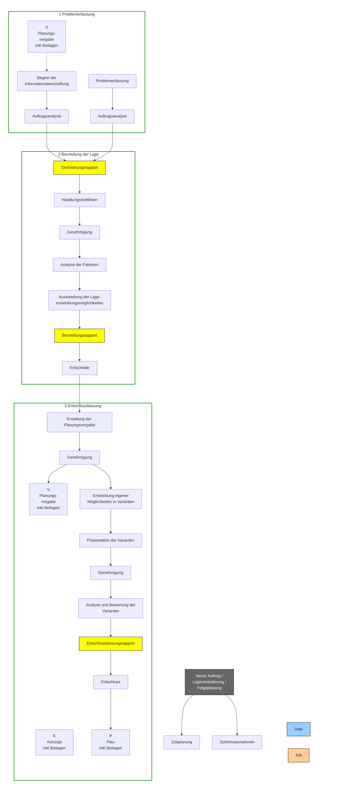

<table>
  <thead>
    <tr>
        <th></th>
        <th>Stab</th>
        <th>Kdt</th>
    </tr>
  </thead>
  <tbody>
    <tr>
        <td>1 Problemerfassung</td>
        <td>Beginn der Informationsbeschaffung</td>
        <td>Problemerfassung</td>
    </tr>
    <tr>
        <td rowspan="2">2 Beurteilung der Lage</td>
        <td>Auftragsanalyse</td>
        <td>Auftragsanalyse</td>
    </tr>
    <tr>
        <td>Orientierungsrapport</td>
        <td>Handlungsrichtlinien</td>
    </tr>
    <tr>
        <td></td>
        <td>Analyse der Faktoren</td>
        <td>Genehmigung</td>
    </tr>
    <tr>
        <td></td>
        <td>Ausarbeitung der Lageentwicklungsmöglichkeiten</td>
        <td rowspan="2">Entscheide</td>
    </tr>
    <tr>
        <td></td>
        <td>Beurteilungsrapport</td>
    </tr>
    <tr>
        <td rowspan="2">3 Entschlussfassung</td>
        <td>Erstellung der Planungsvorgabe</td>
        <td>Genehmigung</td>
    </tr>
    <tr>
        <td>Entwicklung eigener Möglichkeiten in Varianten</td>
        <td rowspan="2">Genehmigung</td>
    </tr>
    <tr>
        <td></td>
        <td>Präsentation der Varianten</td>
    </tr>
    <tr>
        <td></td>
        <td>Analyse und Bewertung der Varianten</td>
        <td rowspan="2">Entschluss</td>
    </tr>
    <tr>
        <td></td>
        <td>Entschlussfassungsrapport</td>
    </tr>
  </tbody>
</table>

14

Reglement 50.040 d Führung und Stabsorganisation 17

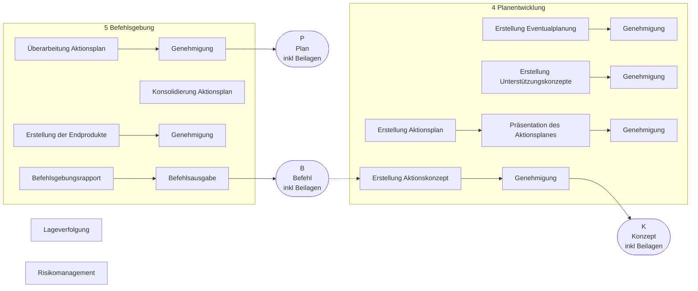

**Legende:**

*   <mark> </mark> Tätigkeiten des Stabes
*   <mark> </mark> Tätigkeiten des Kommandanten
*   <mark> </mark> Koordination und Steuerung
*   [ ] Produkt der Stabsarbeit
*   $\longrightarrow$ Normaler Führungsablauf
*   $-\rightarrow$ Möglicher Führungsablauf
*   **V** Planungsvorgabe
*   **K** Konzept
*   **P** Plan
*   **B** Befehl
*   <mark> </mark> <mark> </mark> <mark> </mark> dito aber optional

Abb. 5: Aktionsplanung

15

Reglement 50.040 d Führung und Stabsorganisation 17

## 3.3 Aktionsplanung

75 Aktionsplanung ist Teil der Führung jeder Aktion.

76 Die Aktionsplanung beschreibt die Abfolge der notwendigen Führungstätigkeiten zur Ausarbeitung einer konkreten, möglichen oder folgenden Aktion.

77 Die Aktionsplanung ist kein abgesetzter Prozess. Parallel dazu wird stets die Lage verfolgt. Je mehr Zeit zur Verfügung steht, desto mehr wird der Unsicherheitsfaktor reduziert und der Ausarbeitungsgrad vertieft.

78 Bei der Aktionsplanung wird unterschieden zwischen:
* Aktionsplanung, die durch die vorgesetzte Führungsstufe ausgelöst wird;
* Aktionsplanung, die von der Lageverfolgung oder einer neuen Problemstellung abgeleitet und infolge eines Lagerapportes ausgelöst wird.

79 Die Aktionsplanung beschreibt die Abfolge und die Synchronisierung der Tätigkeiten des Kommandanten und seines Stabes zur Ausarbeitung einer Aktion. Der Prozess wird vom Stabschef geleitet und ist durch eine vorausschauende und systematische Gedankenführung des Stabes gekennzeichnet.

80 Die Aktionsplanung umfasst die Führungstätigkeiten in unterschiedlicher Tiefe und Ausprägung, abhängig von Lage, Auftrag, Führungsstufe und Persönlichkeit des Kommandanten.

**Folgeplanung**

81 Folgeplanung ist die Planung einer an die laufende Aktion anschliessenden neuen Aktion.

82 Die Ausgangslage für die Folgeplanung ist der angestrebte Endzustand der laufenden Aktion und basiert auf Annahmen, die laufend in der Lageverfolgung verglichen, überprüft und überarbeitet werden müssen.

**Vorausplanung**

83 Vorausplanung ist eine Aktionsplanung auf militärstrategischer und operativer Führungsstufe, die aufgrund militärstrategischer Szenarien und der daraus abgeleiteten militärischen Ziele erfolgt.

84 Vorausplanung erfolgt bereits in der normalen Lage als vorsorgliche Massnahme.

85 Grundsätzlich führt die taktische Führungsstufe keine Vorausplanung durch. Die Luftwaffe und das Kommando Cyber tragen allenfalls mit Produkten der Aktionsplanung zur Vorausplanung bei.

16

Reglement 50.040 d Führung und Stabsorganisation 17

## 3.4 Stabssteuerung

86 Die Stabssteuerung ist ein Prozess, der die Aktionsplanung bzw Lageverfolgung begleitet. Sie wird durch den Stabschef aufgrund eines neuen Auftrags oder einer Lageentwicklung, die zum Handeln zwingt, ausgelöst.

87 Die Stabssteuerung bezweckt:
* den reibungslosen und koordinierten Ablauf der (Führungs-) Tätigkeiten im Stab;
* die Festlegung der Stabsdienstordnung, umfassend:
  - Gliederung und personelle Zusammensetzung;
  - Ablösung des Stabes;
  - Standorte der Führungsinfrastruktur;
  - Bereitschaftsgrade und Ablösungen;
* die Festlegung des Stabsarbeitsplanes;
* die Organisation des Führungsdienstes, umfassend:
  - Triage;
  - Steuerung der Führungsunterstützungsmittel;
  - Betrieb der Führungseinrichtungen.

88 Zuständig für die Stabssteuerung ist der Stabschef. Er zieht die Chefs der Führungsgrundgebiete bzw Stabsteile bei und spricht sich mit dem Kommandanten ab.

89 Abhängig von Auftrag, Lage, Führungsstufe und Kommandant legt der Stabschef Prioritäten und Zeitverhältnisse für die Umsetzung der Stabsarbeit sowie deren Struktur fest.

17

Reglement 50.040 d Führung und Stabsorganisation 17

# Stabssteuerung

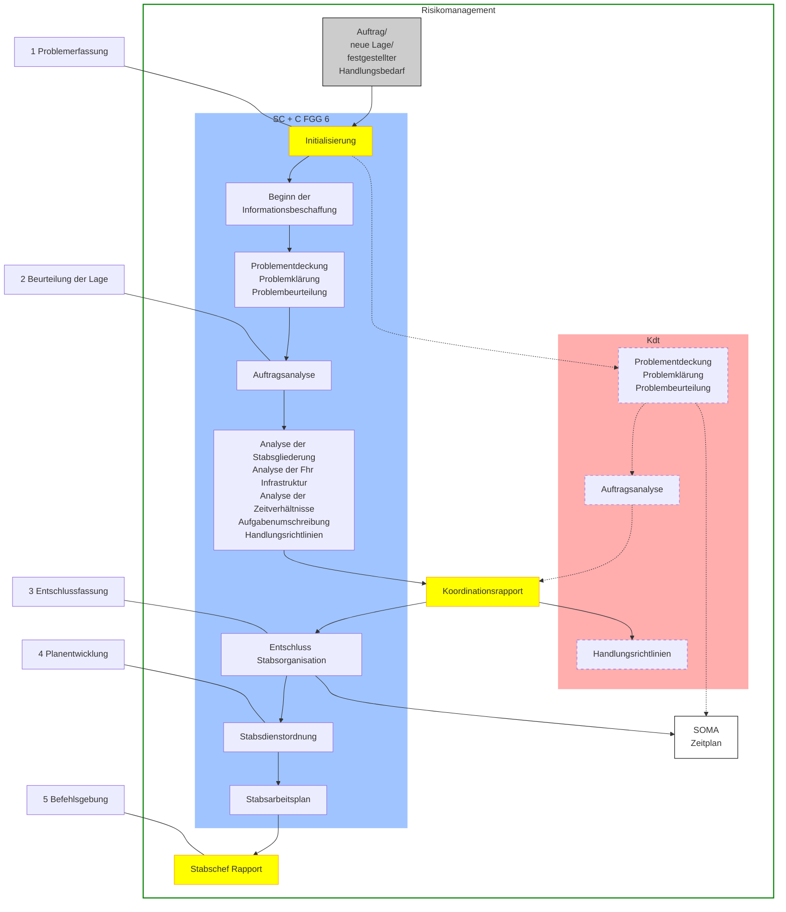

**Legende:**
*   <mark> </mark> Tätigkeiten des Stabes
*   <mark> </mark> Tätigkeiten des Kommandanten
*   <mark> </mark> Koordination und Steuerung
*   <mark> </mark> [---] (gestrichelt) dito aber optional
*   [ ] Produkt der Stabsarbeit
*   $\rightarrow$ Normaler Führungablauf

*Abb. 6: Stabssteuerung*

18

Reglement 50.040 d Führung und Stabsorganisation 17

## 3.5 Aktionsnachbereitung

90 Die Aktionsnachbereitung ist ein Prozess, der durch die Aktionsplanung initialisiert wird, die Aktion während der ganzen Dauer begleitet und nach der eigentlichen Aktion beendet wird.

91 Die Aktionsnachbereitung ist ein ständiger, systematischer und sich wiederholender Prozess, der sequentiell oder parallel zu den anderen Prozessen abläuft. Er beinhaltet mehrere aufeinanderfolgende Tätigkeiten:
* Informationsbeschaffung;
* Analyse;
* Auswertung;
* Umsetzung;
* Kontrolle (Datenbank und Bilanz).

92 Die Aktionsnachbereitung dient dem Kommandanten und seinem Stab dazu, eine erfolgte oder noch laufende Aktion auszuwerten. Das Ziel ist es, Erkenntnisse zur Optimierung noch laufender (Erfahrungen) oder künftiger (Lehren) Aktionen zu gewinnen.

93 Die Analyse der gesammelten Informationen kann aufgrund der Dringlichkeit der zu treffenden Massnahmen oder wegen des Zustands der noch laufenden Aktion abgekürzt erfolgen. Es werden dabei hauptsächlich Sofortmassnahmen beschlossen. Zudem liefern die umgesetzten Massnahmen einen wesentlichen Beitrag zur Folgeplanung. In diesem Fall spricht man von **Erfahrungen**.

94 Mit der Beendigung der Aktion und der Redaktion des Berichtes werden die Erfahrungen, die während der abgeschlossenen Aktion gemacht wurden, für zukünftige Aktionen im Rahmen der Aktionsplanung analysiert und entsprechende Massnahmen getroffen. In diesem Fall spricht man von **Lehren**.

19

Reglement 50.040 d Führung und Stabsorganisation 17

# Aktionsnachbereitung

```description
The image shows a complex flowchart titled "Aktionsnachbereitung" (Action After-Action Review) within a green frame labeled "Risikomanagement". The chart is organized into five numbered phases on the left, with two main vertical tracks for "Stab" (Staff, blue) and "Kdt" (Commander, orange). Central yellow boxes represent "Koordination und Steuerung" (Coordination and Control).

- Phase 1: Problemerfassung. Includes "Aktionsplanung" and "Auslösung". A blue box for "Informationsbeschaffung" is marked as "laufend" (ongoing).
- Phase 2: Beurteilung der Lage. Staff performs "Analyse" and "Ausarbeitung der Erfahrungen/Lehren".
- Phase 3: Entschlussfassung. Staff presents lessons learned to the Commander for "Genehmigung" (Approval). Staff then performs "Auswertung" and "Erstellung der Massnahmen und des Zeitplanes". This leads to a "SOMA" output.
- Phase 4: Planentwicklung. Staff presents measures to the Commander for "Genehmigung". Commander makes "Entscheide" and "Bestimmung der Verantwortlichkeiten". Staff performs "Umsetzung", "Aktualisierung des Zeitplanes", and "Erstellung Massnahmenkatalog". The catalog is presented for "Genehmigung", resulting in a "Befehl" (Order).
- Phase 5: Datenbank/Bilanz. Staff performs "Kontrolle", "Klassieren und Archivieren", "Redaktion des Berichts", and "Bilanz der durchgeführten Aktion". A final "Schlussrap" (Final Report) is presented for "Genehmigung", resulting in a "Bericht" (Report).

A red box at the top right labeled "Lageverfolgung" (Situation Tracking) has arrows indicating continuous feedback.
```

**Legende:**
*   <mark> </mark> Tätigkeiten des Stabes
*   <mark> </mark> Tätigkeiten des Kommandanten
*   <mark> </mark> Koordination und Steuerung
*   [---] (dashed border) dito aber optional
*   [ ] (solid border) Produkt der Stabsarbeit
*   $\rightarrow$ Normaler Führungsablauf

*Abb. 7: Aktionsnachbereitung*

20

Reglement 50.040 d Führung und Stabsorganisation 17

# 4 Lageverfolgung und Aktionsplanung

## 4.1 Lageverfolgung

95 Lageverfolgung beinhaltet folgende drei Tätigkeiten: Lageerfassung, Lagevergleich und Lagebewertung. Diese werden durch die Erfolgsbeurteilung begleitet.


Abb. 8: Tätigkeiten der Lageverfolgung

### 4.1.1 Lageerfassung

96 Bei der Lageerfassung geht es darum, Informationen oder Nachrichten (in Form von Einzelmeldungen oder bereits abgefassten Berichten) zu sammeln und zu beschaffen, um ein aktuelles Bild der Lage zu erhalten.

97 Werden die verfügbaren Informationen oder Nachrichten als ungenügend beurteilt (qualitativ oder quantitativ), werden klärende bzw zusätzliche Informationen eingefordert, um ein möglichst realitätsnahes Bild der Lage zu erhalten.

98 Anhand der beschafften Informationen werden die Zustände in der Bereichen Bedrohung, Gefahren, Akteure und Umwelt in einem Lagebild (z B integrales Lagebild oder Führungskarte) dargestellt.

99 Dieses Vorgehen ermöglicht es, die eigene Aktion und die Handlungen der anderen Akteure zu verstehen und zukünftige Handlungen vorauszusehen.

21

Reglement 50.040 d Führung und Stabsorganisation 17

### 4.1.2 Lagevergleich

100 Ausgangspunkt für den Lagevergleich ist die Aktionsplanung, welche den angenommenen Zustand einer Aktion (Soll-Zustand) zu einem bestimmten Zeitpunkt beschreibt. Diese Beschreibung stellt sowohl den angestrebten Endzustand als auch definierte Zwischenschritte (z B Schlüsselbereiche oder Zwischenziele) dar, die im Verlaufe der Aktion zu erreichen sind. Diese Informationen werden in der Synchronisationsmatrix zusammengeführt.

101 Durch den Vergleich des erreichten Zustandes (Ist-Zustand) mit dem in der Aktionsplanung definierten Zustand der Aktion zu einem bestimmten Zeitpunkt (Soll-Zustand) wird die Abweichung festgestellt.

### 4.1.3 Lagebewertung

102 Die Analyse der Abweichung zwischen angestrebtem und erreichtem Zustand dient der **Ableitung von Entwicklungsmöglichkeiten** und der **Ermittlung des Handlungsbedarfs** für den weiteren Verlauf der Aktion. Unabhängig davon, ob Handlungsbedarf besteht oder nicht, wird die Überwachung der Lageentwicklung fortgesetzt.

103 Mit der Analyse der Abweichung wird die Wichtigkeit des Handlungsbedarfs und der Notwendigkeit einer Entscheidung aufgezeigt.

104 Besteht Handlungsbedarf, so wird stufenweise vorgegangen:
* Ein bezeichneter Stabsangehöriger hat die Kompetenz, im Voraus festgelegten **Steuerungsmassnahmen** ohne weitere vorgängige Absprache mit dem Kommandanten selbständig **anzuordnen**;
* Überschreitet der Handlungsbedarf die Kompetenz des bezeichneten Stabsangehörigen oder es wurden keine Steuerungsmassnahmen im Voraus festgelegt, so wird ein Lagerapport beantragt, um dem Kommandanten eine Entscheidungsgrundlage zu liefern.

### 4.1.4 Lagerapport

105 Anlässlich des Lagerapports geht es darum, den Kenntnisstand zwischen dem Kommandanten und seinem Stab abzugleichen und festzustellen, ob die Aktion wie geplant weitergeführt werden kann oder ob zur Zielerreichung Anpassungen nötig sind.

22

Reglement 50.040 d Führung und Stabsorganisation 17

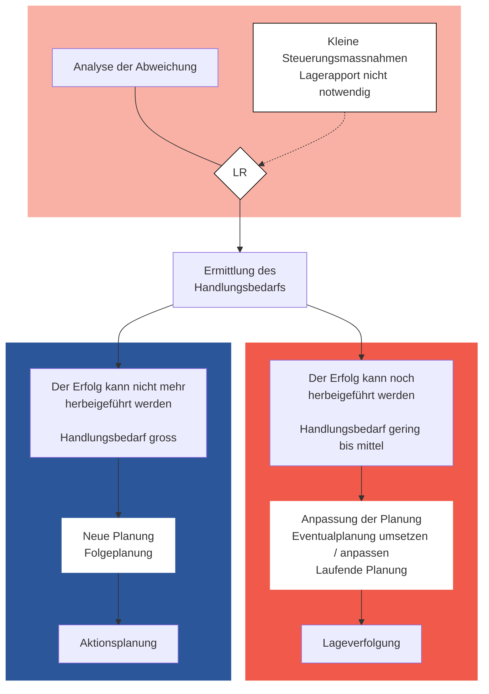

*Abb. 9: Analyse der Abweichung und Ermittlung des Handlungsbedarfs*

106 Ein Lagerapport wird durchgeführt:
* beim Eintreffen einer in der Eventualplanung vorgedachten Lageentwicklungsmöglichkeit;
* bei deutlicher oder sich mindestens abzeichnender Lageveränderung;
* wenn die ursprünglichen Ziele nicht (mehr) erreicht werden können;
* wenn sich aufgrund der Lageveränderung bessere Lösungsmöglichkeiten bieten;
* bei Ablösungen im Stab und/oder wenn eine gegenseitige Orientierung notwendig erscheint.

107 Der Kommandant beurteilt die Wichtigkeit des Handlungsbedarfs und erlässt Handlungsrichtlinien, ordnet allfällige Steuerungsmassnahmen an und passt den Zeitplan an.

108 Im Rahmen der Lageverfolgung wird solange wie möglich dem ursprünglichen Entschluss gefolgt. Lageveränderungen, denen mit kleinen Anpassungen des Entschlusses oder mit der Auslösung von vorbehaltenen Ent-

23

Reglement 50.040 d Führung und Stabsorganisation 17

schlüssen der Eventualplanung begegnet werden kann, werden bewältigt. Dazu kann die bestehende Aktionsplanung auch angepasst werden. Dieser Vorgang wird so oft wiederholt, wie die Lageveränderung, die zum Handeln zwingt, dies erfordert.

109 Wenn die Lage nicht mehr auf der Basis des ursprünglichen Entschlusses erfolgreich bewältigt werden kann und deshalb ein neuer Entschluss notwendig wird, muss mit einer neuen Aktionsplanung begonnen werden. In diesem Fall verlaufen Lageverfolgung und Planung der Folgeaktion (Folgeplanung) parallel.

## 4.2 Aktionsplanung

110 Aktionsplanung beinhaltet alle Aufgaben, die durch den Kommandanten und seinen Stab zur Ausarbeitung einer Aktion durchgeführt werden, vom Zeitpunkt des Eintreffens eines Auftrages oder des Entstehens einer Lage, welche zum Handeln zwingt, bis zur Befehlsausgabe an die Unterstellten.

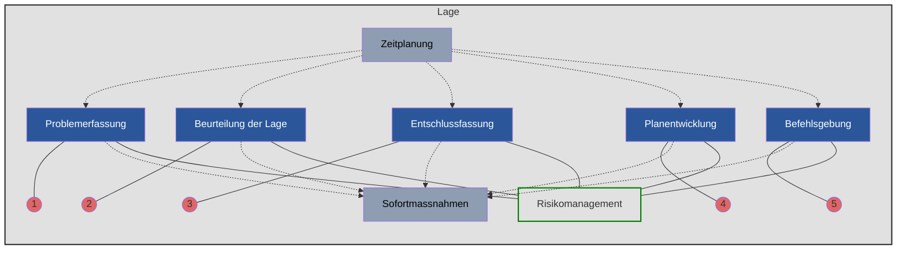

*Abb 10: Führungstätigkeiten in der Aktionsplanung*

111 Der rationale Entscheidungsfindungsprozess beinhaltet eine systematische Durchführung aller Führungstätigkeiten. Er berücksichtigt, dass
* die verschiedenen Führungsstufen einbezogen werden und die Zusammenarbeit mehrerer Personen in verschiedenen Teilprozessen ermöglicht wird;

24

Reglement 50.040 d Führung und Stabsorganisation 17

*   der Kommandant und sein Stab in den meisten Fällen unter hohem Zeitdruck und grosser Unsicherheit arbeiten und entscheiden müssen, bedingt durch ungenaue, unvollständige, falsche, veraltete, widersprüchliche oder nicht rechtzeitig verfügbare Informationen;
*   dessen Standardisierung eine zielgerichtete Zusammenarbeit mit Partnern erleichtert.

112 Dauer sowie organisatorischer, personeller und materieller Aufwand für die einzelnen Führungstätigkeiten sind abhängig von:
*   der Vielschichtigkeit des Problems;
*   der zur Verfügung stehenden Zeit;
*   der Zahl der an der Problemlösung beteiligten Personen.

113 Unterschieden werden 5 (+2) Führungstätigkeiten. Sie umfassen die Abfolge der fünf Aufgaben: Problemerfassung, Beurteilung der Lage, Entschlussfassung, Planentwicklung und Befehlsgebung. Diese werden durch zwei ständige Aufgaben begleitet: Sofortmassnahmen und Zeitplanung.

114 Im Rahmen der Führungstätigkeiten ist begleitend stets das Risikomanagement einzubeziehen. Lage, Auftrag, Führungsstufe und Persönlichkeit des Kommandanten bestimmen, welche Risiken einzugehen sind und wie mit diesen umzugehen ist.

**Risikomanagement**

115 Risiken sind von der Bedrohung, den Gefahren und weiteren Faktoren abhängige Ereignisse und Entwicklungen, die mit einer gewissen Wahrscheinlichkeit eintreten und Auswirkungen auf die Zielerreichung und die Auftragserfüllung haben können.

116 Lage-, auftrags- und führungsstufenabhängig werden bedrohungs- und gefahrenbedingte von weiteren Risiken unterschieden. Taktische Risiken sind weitgehend mit der Beurteilung der Lage abgedeckt.

117 Das Risikomanagement dient dem Kommandanten und seinem Stab dazu,
*   mögliche künftige Ereignisse und Entwicklungen vorauszusehen und damit die Entscheidungsfindung zu unterstützen;
*   die Sicherheit der Beteiligten zu gewährleisten;
*   die eigenen Kräfte/Mittel zu schützen;
*   die eigenen Kräfte/Mittel wirksam einzusetzen.

25

Reglement 50.040 d Führung und Stabsorganisation 17

### 4.2.1 Problemerfassung

118 Die Problemerfassung ist die erste Auseinandersetzung des Kommandanten und seines Stabes mit einer Problemstellung. Der Kommandant muss die zu lösende Aufgabe verstehen, seinen Stab auf die Erfüllung dieser Aufgabe ausrichten und Handlungsrichtlinien für die Umsetzung formulieren.

119 Eine Problemstellung drängt sich auf wegen:
* eines neuen Auftrags;
* zusätzlich erhaltener Befehle und/oder Weisungen;
* einer Lageveränderung, die im Verlauf der Aktion zum Handeln zwingt;
* des Erkennens bisher nicht beachteter Chancen oder Risiken bei der Erfüllung des erhaltenen Auftrages;
* einer allgemein gehaltenen, wenig präzisen Aufgabenzuweisung.

120 Die Problemerfassung besteht aus den drei Teilschritten Problementdeckung, -klärung und -beurteilung.

```mermaid
graph TD
    PS[Problemstellung<br/>Auftrag | Lage | Ereignis] --> PK[Problemklärung]
    PS -.->|"(weitere) Informationsbeschaffung"| PK
    
    PS --> PE[Problementdeckung]
    
    PE --> PK
    
    subgraph PE_Box [Problementdeckung]
    direction TB
    PE1["IST ————————> SOLL"]
    PE2["<b>Worum geht es?</b><br/>• Aufgaben, Ziel, angestrebter<br/>Endzustand?<br/>• Chancen, Risiken?<br/>• Zeitverhältnisse?"]
    PE3["<b>Einordnung</b><br/>• Neuartigkeit?<br/>• Unbestimmtheit?<br/>• Komplexität?"]
    PE4["(Erste) Aufgabenformulierung"]
    end

    subgraph PK_Box [Problemklärung]
    direction TB
    PK1["Zerlegung Problem in Teilprobleme"]
    PK2"![Diagram showing layers of a pyramid representing structure of the task"]
    PK3["<b>Struktur der Aufgabe</b>"]
    PK4["Definitive Formulierung der Aufgabe"]
    PK1 --> PK2 --> PK3 --> PK4
    end

    PK --> PB[Problembeurteilung]
    
    subgraph PB_Box [Problembeurteilung]
    direction TB
    PB1["Pro Teilproblem<br/>• Organisatorische<br/>Zuständigkeit<br/>- Stabsteile?<br/>- Verbände?<br/>- Organisation?"]
    PB2["• Bedeutung<br/>Lösungsaufwand im<br/>Gesamtrahmen"]
    PB3["• Dringlichkeit bzw<br/>Konsequenzen eines<br/>Lösungsaufschubes"]
    end

    PK4 --> AU[Aufgabenumschreibung]
    PK4 --> HR[Handlungsrichtlinien]
    
    subgraph AU_Box [Aufgabenumschreibung]
    direction TB
    AU1["Pro Teilproblem<br/>• Ziel / Zweck<br/>• Teilaufgaben<br/>• Prioritäten"]
    end

    subgraph HR_Box [Handlungsrichtlinien]
    direction TB
    HR1["Pro Teilproblem<br/>• Auflagen<br/>• Erste Lösungsansätze<br/>• Erwartete Endprodukte"]
    end

    AU_Box --- SG[Stabsgliederung]
    SG --- SG1["Einsatzgliederung des Stabes"]
```

*Abb. 11: Problemerfassung*

26

Reglement 50.040 d Führung und Stabsorganisation 17

### Problementdeckung

121 In der Problementdeckung wird geklärt, worum es in der aktuellen Lage überhaupt geht, welches Ziel oder welcher angestrebte Endzustand erreicht, in welchem Rahmen und unter welchen Zeitverhältnissen gehandelt werden muss.

122 Klar formulierte Aufträge, die sich aus einer umfassenden Orientierung über die Lage und einer eindeutigen Absicht des vorgesetzten Kommandanten zusammensetzen, lassen die Problemstellung rasch erkennen.

123 Bei Lageveränderungen im Rahmen einer laufenden Aktion ist die Problemstellung oft nicht auf den ersten Blick erkennbar. In diesem Fall bedeutet die Problementdeckung die Suche nach Chancen und Risiken. Die eigene Aufgabe wird selbst definiert und formuliert.

### Problemklärung

124 In der Problemklärung wird durch Beschaffung, Sichtung und Verdichtung zusätzlicher Informationen der Überblick über die wesentlichen Aspekte der gestellten Aufgabe gewonnen.

125 Ergebnisse der Problemklärung sind:
* ein möglichst klares Bild der gesamten Aufgabe und
* deren mögliche Zerlegung in eine überschaubare Zahl von Teilproblemen mit entsprechender Aufgabenumschreibung und erwarteten Endprodukten sowie
* aufgabenspezifische Handlungsrichtlinien.

126 Eine komplexe Aufgabe wird in Teilprobleme zerlegt, damit:
* die einzelnen Teilprobleme möglichst geringe gegenseitige Abhängigkeit aufweisen;
* die Teilprobleme derselben Führungsstufe effizient bearbeitet werden können;
* die Teilprobleme eine möglichst hohe Übereinstimmung mit den Fähigkeiten der beteiligten Stabsteile und Verbände aufweisen, um die Anpassung der Grundgliederung des Stabes und der Grund- oder Einsatzgliederung der Kräfte/Mittel gering zu halten.

### Problembeurteilung

127 In der Problembeurteilung werden Bedeutung und Dringlichkeit der Teilprobleme sowie die organisatorische Zuständigkeit festgelegt. Damit wird geklärt, welche Teilaufgaben welchen Stabsteilen zugeordnet werden und in welcher Reihenfolge sie abzuarbeiten sind.

27

Reglement 50.040 d Führung und Stabsorganisation 17

128 Bedeutung und Dringlichkeit werden geprüft, weil in den meisten Fällen nicht über ausreichende Ressourcen (Zeit, Personal) verfügt wird, um sämtliche Teilprobleme einer Aufgabe gleichzeitig zu lösen. Die Teilaufgaben sind daher zu gewichten und zu priorisieren.

129 Die Resultate der drei Teilschritte werden anlässlich des Orientierungsrapports präsentiert. Sie sind:
* Beschreibung der Aufgaben bzw des angestrebten Endzustandes, Auslegung von Ziel und Zweck der Aufgaben sowie deren Bedeutung und Dringlichkeit;
* Definition zusätzlicher Handlungsrichtlinien durch den Kommandanten in Form erster Lösungsansätze oder zu beachtender Auflagen (politisches und militärisches Umfeld, Einsatzrechtskonformität);
* Festlegung der Stabsgliederung (Einsatzgliederung des Stabes).

### 4.2.2 Sofortmassnahmen

130 Sofortmassnahmen werden ab Beginn der Problemerfassung laufend getroffen. Sie dürfen weder dem Entschluss vorgreifen noch die Entschlussfreiheit einschränken.

131 Sofortmassnahmen ermöglichen:
* die zur Verfügung stehende Vorbereitungszeit (auch die Zeit für die Einsatzvorbereitungen enthaltend) für eine Aktion auf allen Stufen bestmöglich zu nutzen;
* Informationen zu den Faktoren für die Beurteilung der Lage zu beschaffen;
* die eigene Handlungsfreiheit durch die Auslösung angepasster Massnahmen zu wahren oder zu erhöhen;
* die nachfolgenden Stufen in die Entscheidungsfindung einzubeziehen.

132 Sofortmassnahmen werden durch den Kommandanten angeordnet. Auf der taktischen Führungsstufe werden Sofortmassnahmen, die unterstellte Verbände betreffen, durch Vor- oder Teilbefehle angeordnet.

### 4.2.3 Zeitplanung

133 Mit der Zeitplanung werden interne und externe Zeitpläne unter Berücksichtigung der Verfügbarkeit des Kommandanten (Führungsrhythmus) und des Vorbereitungsgrades der Verbände (Einsatzvorbereitungen) erstellt:
* Der interne Zeitplan ist die Grundlage für die Erstellung des Stabsarbeitsplanes und berücksichtigt die Verfügbarkeit der Stabsangehö-

28

Reglement 50.040 d Führung und Stabsorganisation 17

rigen und die in der Problemerfassung festgelegte Dringlichkeit der einzelnen Teilprobleme und die Stabsgliederung;
*   Der externe Zeitplan berücksichtigt die Tätigkeiten mit Beteiligung Dritter (z B Verbände, Partner), die Umsetzung der eigenen Planung, die Dynamik der Lageentwicklung.

<table>
  <thead>
    <tr>
        <th>Zeitaufteilung</th>
        <th colspan="2">Vorbereitung der Aktion</th>
        <th>Durchführung der Aktion</th>
        <th></th>
    </tr>
    <tr>
        <th>Eigene Führungsstufe</th>
        <th>Interner Zeitplan</th>
        <th>Aktionsplanung durch den eigenen Stab</th>
        <th>Lageverfolgung</th>
        <th></th>
    </tr>
    <tr>
        <th></th>
        <th>Externer Zeitplan</th>
        <th>Aktionsplanung durch Unterstellte</th>
        <th>Lageverfolgung</th>
        <th></th>
    </tr>
    <tr>
        <th>Unterstellte Führungsstufe</th>
        <th>Interner Zeitplan</th>
        <th>Aktionsplanung durch den eigenen Stab</th>
        <th>Lageverfolgung</th>
        <th></th>
    </tr>
    <tr>
        <th></th>
        <th>Externer Zeitplan</th>
        <th>Aktionsplanung durch Unterstellte<br/>SOMA</th>
        <th>Einsatzvorbereitungen</th>
        <th>Lageverfolgung</th>
    </tr>
    <tr>
        <th></th>
        <th>T-x</th>
        <th>T</th>
        <th>Zeit</th>
        <th></th>
    </tr>
  </thead>
</table>

Abb. 12: Abhängigkeit der Zeitplanung mehrerer Führungsstufen (schematische Darstellung)

134 Die Zeitplanung umfasst das Erlangen einer Vorstellung über den Zeitbedarf und die zur Verfügung stehende Zeit für Planung und Durchführung einer Aktion. Der Zeitplan wird – in der Regel – von der Wirkung im Ziel und dem angestrebten Endzustand ausgehend rückwärts rechnend erstellt.

135 Die Zeitplanung ermöglicht erst, anstehende Aufgaben innerhalb der zur Verfügung stehenden Zeit zu lösen. Die zur Verfügung stehende Zeit wird sowohl für die Durchführung als auch für die Planung einer Aktion vollständig, Reserve inbegriffen, ausgewiesen.

136 Die Erstellung des Zeitplans beginnt während der Problemerfassung. Der Zeitplan muss während der folgenden Führungstätigkeiten ständig nachgeführt, der Lage angepasst werden und ist die Grundlage für die Erstellung der Synchronisationsmatrix.

137 Im Zeitplan wird bestimmt, was bis wann wie vorliegen muss. Bedeutung, Qualität und Erscheinungszeitpunkt der zu erstellenden Produkte der Aktionsplanung sind ebenfalls darin enthalten.

138 Der Zeitplan hält fest,
*   wieviel Zeit für die Aktionsplanung bzw -steuerung der eigenen Stufe zur Verfügung steht;
*   zu welchem Zeitpunkt einzelne Tätigkeiten abgeschlossen sein müssen;
*   wieviel Zeit Unterstellte zur Planung und Vorbereitung ihrer Aktionen zur Verfügung haben (der Kommandant legt den Beginn einer Aktion fest und wirkt dahin, dass der eingesetzte Verband zur Vorbereitung der Aktion genügend Zeit hat; sein Stab soll dabei nicht zu viel Zeit für sich beanspruchen);

29

Reglement 50.040 d Führung und Stabsorganisation 17

*   wann Unterstellte spätestens im Besitz der Produkte der Aktionsplanung sein müssen und wieviel Zeit für die Übermittlung dieser Dokumente eingeräumt wird;
*   wann benachbarte Verbände über Absicht/Möglichkeiten zur operationsraumübergreifenden Koordination verfügen müssen, falls der Einbezug der Unterstellten und Nachbarn nicht sichergestellt werden konnte.

139 Die Führungsstufen wenden den Zeitplan unterschiedlich an:
*   Alle Führungsstufen, besonders aber die militärstrategische und die operative, wenden das Prinzip des parallelen Planens an. Unterstellte werden in die Planungsarbeiten einbezogen und nehmen ihre eigene Planungsarbeit deshalb bereits vor dem Vorliegen endgültiger Produkte der Aktionsplanung auf;
*   Auf der taktischen Führungsstufe wird anstelle des parallelen Planens häufig das Planungsprinzip der Viertelregel angewendet. Pro Stufe wird ein Viertel der (noch) zur Verfügung stehenden Zeit für die eigene Aktionsplanung vorgesehen.


**Legende:**
<mark> </mark> Aktionsplanung
[ ] Rest der Vorbereitung der Aktion

*Abb. 13: Viertelregel – Aufteilung der zur Verfügung stehenden Zeit am Beispiel der taktischen Führungsstufe*

30

Reglement 50.040 d Führung und Stabsorganisation 17

140 Der Zeitplan liefert Erkenntnisse über den Vorbereitungsgrad einer Aktion. In jedem Fall muss er die für die eigentlichen Einsatzvorbereitungen (von Stab und Verbänden) benötigte Zeit ausweisen.

141 Der Zeitbedarf für die einzelnen Schritte einer Aktionsplanung lässt sich in der Regel nur abschätzen. Die für einen Ausführungsschritt eingeplante Zeit lässt sich nicht beliebig kürzen.

142 Voraussetzungen für eine angemessene Zeitplanung sind:
* Kenntnis der momentanen Fähigkeit der Kräfte/Mittel (personeller und materieller Bereitschaftsgrad);
* Kenntnis der Voraussetzungen für den optimalen Kräfte-/Mitteleinsatz;
* realistische Einschätzung nicht beeinflussbarer Faktoren (Umwelt, Kompetenzbereiche Dritter usw).

143 Festlegen von Zeiten (Limiten) heisst auch Festlegen der Rahmenbedingungen, unter welchen die Aufgaben erfüllt werden können. Für die Durchführung schwieriger oder komplexer Aktionen kann meistens nur der Beginn genau festgelegt werden, nicht aber die Dauer und der Abschluss. Oft ist es daher notwendig, Reservezeit einzuplanen.

144 Der zeitliche Rahmen wird festgelegt bzw umrissen mit Hilfe von:
* Limiten bzw Zeitpunkten;
* Zeiträumen/Grössenordnungen;
* Prioritäten/Minimalleistungen.

145 Die Anpassung des Zeitplanes ist angezeigt, wenn sich die Lage gegenüber der Ausgangslage deutlich verändert hat oder wenn bedeutend klarere Informationen zur Lage vorhanden sind.

### 4.2.4 Beurteilung der Lage

146 Beurteilen der Lage heisst, im Rahmen des Auftrages und der strukturierten Problem- bzw Aufgabenstellung:
* die entscheidenden Faktoren in Bezug auf den Auftrag erkennen und analysieren,
* daraus Konsequenzen ableiten, sowie
* aus deren Analyse Lageentwicklungsmöglichkeiten ausarbeiten und bewerten.

147 Daraus kann auf die Wirkungsmöglichkeiten der eigenen Kräfte/Mittel geschlossen werden.

31

Reglement 50.040 d Führung und Stabsorganisation 17

148 Die Resultate der Beurteilung der Lage werden anlässlich des Beurteilungsrapports aufgezeigt und darauf basierend wird die Planungsvorgabe zuhanden der Unterstellten erstellt.

**Analyse der Faktoren**

149 Bei der Beurteilung des militärstrategischen Kontextes erkennt und versteht die militärstrategische Führungsstufe die Faktoren Politik – Wirtschaft – Gesellschaft – Umwelt – Information – Wissenschaft und Technologie sowie deren Einfluss auf die eigenen Ziele – Wege – Mittel.

150 Die operative Führungsstufe beurteilt die Lage nach den Faktoren Kräfte – Raum – Zeit – Informationen (KRZI).

151 Die taktische Führungsstufe bevorzugt die Beurteilung der Lage entlang den Faktoren Auftrag – Umwelt – gegnerische Mittel – eigene Mittel – Zeitverhältnisse (AUGEZ).


Abb. 14: Faktoren bei der Beurteilung der Lage

32

Reglement 50.040 d Führung und Stabsorganisation 17

## Analysemethode Aussage – Erkenntnis – Konsequenz

152 Bei der Beurteilung der Lage geht es darum, die führungsstufenspezifischen Faktoren untereinander in Beziehung zu setzen, um mit den gefolgerten, vollständig vernetzten Erkenntnissen die Grundlagen für die eigene Entschlussfassung zu schaffen.

153 Der Kommandant und sein Stab gehen schlussfolgernd von gesammelten Aussagen aus, analysieren diese und gewinnen Erkenntnisse; schliesslich leiten sie daraus handlungsrelevante Konsequenzen ab:
* Aussagen heben Fakten, Daten oder Zahlen zum jeweiligen Beurteilungsfaktor hervor;
* Verschiedene Aussagen werden gegenseitig in Beziehung gesetzt. Aus ihrer Verknüpfung und Analyse lassen sich Erkenntnisse gewinnen;
* Konsequenzen sind konkrete Vorgaben, die der Entwicklung von Varianten dienen.

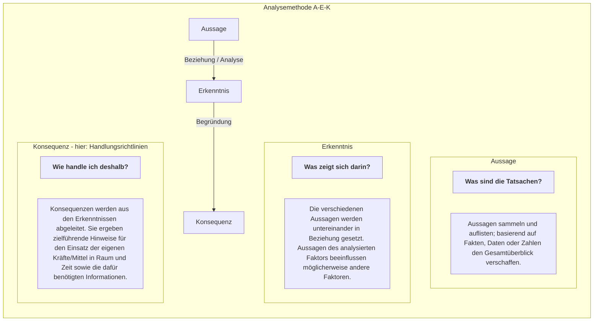


Abb. 15: Analysemethode A-E-K

33

Reglement 50.040 d Führung und Stabsorganisation 17

154 Der Kommandant beurteilt und genehmigt formulierte Konsequenzen. Daraus folgen:
* Handlungsrichtlinien, die in den weiteren Arbeitsschritten zwingend zu berücksichtigen sind;
* Sofortmassnahmen, die entsprechend umgesetzt werden;
* Pendenzen, die ihrer Dringlichkeit folgend stabsintern weiter bearbeitet werden.

**Auftrag**

155 Der Auftrag ist auf allen Führungsstufen der Ausgangspunkt und steht im Zentrum.

156 Der erhaltene Auftrag oder die selbstgestellte Aufgabe (Ziele, angestrebter Endzustand) bilden, unter Einbezug der Absicht des vorgesetzten Kommandanten und dessen Auffassung über die Lageentwicklung, die Grundlage jeglichen Handelns für den Kommandanten und seinen Stab während der ganzen Dauer einer Aktion.

157 Der Auftrag wird nach folgenden Kriterien analysiert:
* Bedeutung der Aufgabe im Gesamtrahmen;
* erwartete Leistung des eigenen Verbandes (explizit/implizit);
* Handlungsspielraum (führungsstufenabhängige Betrachtung der Auflagen und Einschränkungen). Der Auftrag wird immer nach einsatzrechtlichen Gesichtspunkten beurteilt. Der Kommandant und sein Stab benötigen daher bereits zu diesem Zeitpunkt die Richtlinien für die Gewaltanwendung bzw auf taktischer Stufe bereits die Einsatzregeln;
* jegliche Unterstützung, die bei der Erfüllung des Auftrages dienlich sein kann.

158 Führungsstufenabhängig bezeichnet der Kommandant zudem die Erfolgskriterien, an denen die Zielerreichung gemessen wird (Erfolgsbeurteilung).

159 Produkte der Auftragsanalyse sind:
* die gesamtheitliche Beurteilung des Auftrages;
* Konsequenzen und allfällige Erfolgskriterien.

**Umwelt/Raum**

160 Die Analyse der Umwelt/des Raums liefert Erkenntnisse und Konsequenzen für den Mittel-/Kräfteeinsatz und die Führung sowohl der gegnerischen als auch der eigenen Mittel/Kräfte.

34

Reglement 50.040 d Führung und Stabsorganisation 17

161 Als (Operations-) Raum in Betracht kommen:
* Weltraum;
* Luft (-raum);
* Boden;
* Maritimer Raum;
* Elektromagnetischer Raum;
* Cyber-Raum;
* Informationsraum.

162 Die Umwelt umfasst:
* Gelände;
* Witterung, Tages- und Jahreszeiten;
* Bevölkerung (z B Flüchtlingsströme, soziale Gruppierungen, Verhalten).

163 Das Gelände besteht aus:
* Achsen;
* Verkehrs-, Kommunikations- und Energieträgern;
* Gewässern;
* Vegetation;
* Engnissen und Hindernissen;
* militärischen und zivilen Infrastrukturen und Objekten.

164 Das Gelände hat für den Kräfte-/Mitteleinsatz eine grosse Bedeutung und muss deshalb sorgfältig beurteilt werden. Der Geländetyp, die Beschaffenheit, Ausdehnung und Kammerung des Geländes sowie die Witterungsbedingungen können die Bewegungsmöglichkeiten und damit die Geschwindigkeit einer Aktion beeinflussen.

165 Die Umweltanalyse erfordert besonders im Rahmen der Unterstützung ziviler Behörden eine vertiefte Analyse der physikalischen Kräfte (natur- oder zivilisationsbedingte Katastrophen).

166 Produkte der Analyse der Umwelt/des Raums sind Konsequenzen sowie gegnerische und eigene Schlüsselgelände oder Schlüsselräume. Die letzteren sind führungsstufenbezogen unterschiedlich bezeichnet und müssen, abhängig vom Operationsraum, nicht unbedingt physischer Natur sein.

35

Reglement 50.040 d Führung und Stabsorganisation 17

### Gegnerische und eigene Mittel/Kräfte

167 Die Analyse der gegnerischen und eigenen Mittel/Kräfte umfasst die vernetzte Beurteilung in Raum und Zeit von:
* Anzahl und Zusammensetzung der Verbände bzw Akteure;
* Einsatzbereitschaft;
* Fähigkeiten und Durchhaltefähigkeit.

168 Qualitative und quantitative Aussagen zu den Mitteln/Kräften werden analysiert hinsichtlich:
* Führungsunterstützung und Nachrichtenbeschaffung;
* Einsatz;
* Einsatzunterstützung und Zusammenarbeit mit Partnern;
* Logistik;
* besondere Aspekte (Moral, Gesundheit, Disziplin, Ausbildungsstand, Führungsqualität, Einsatzerfahrung).

169 Eine erweiterte Analyse der Mittel/Kräfte kann umfassen:
* Vernetzung mit anderen Akteuren;
* Ausrüstung (Waffen, Geräte, Fahrzeuge);
* Ausübung der Gewaltanwendung (Einsatzverfahren oder Techniken).

170 Neben den gegnerischen und eigenen Mitteln/Kräften spielen Partner eine entscheidende Rolle. Die Mittel/Kräfte von zivilen und militärischen Partnern – allenfalls auch diejenigen von Neutralen und unbeteiligten Dritten – müssen, je nach Lage, ebenfalls analysiert werden.

171 Insbesondere im Rahmen der Unterstützung ziviler Behörden sind die zivilen Einsatzmittel/-kräfte zu beurteilen, schwergewichtig diejenigen der Partnerorganisationen des Sicherheitsverbunds Schweiz.

172 Im Rahmen der militärischen Friedensförderung werden sowohl Streitkräfte von anderen Staaten als auch internationale Organisationen, Regierungsorganisationen und Nicht-Regierungsorganisationen in Betracht kommen.

173 Der Vergleich aller Mittel/Kräfte ergibt Erkenntnisse über deren Einsatzwert in der jeweiligen Lage.

174 Produkte der Analyse der gegnerischen und eigenen Mittel/Kräfte sind Konsequenzen sowie gegnerische und eigene Schlüsselverbände oder Schlüsselmittel.

36

Reglement 50.040 d Führung und Stabsorganisation 17

**Zeitverhältnisse/Zeit**

175 Der Zeitpunkt, zu welchem die Aktion ausgelöst werden muss, sowie die für die Dauer der Aktion zur Verfügung stehende Zeit schränken alle Bereiche der Führung ein.

176 Die Analyse der Zeitverhältnisse lässt als Produkt erkennen:
* wie sich eine Lage in einer gegebenen Zeitspanne verändern kann;
* wann gegnerische Kräfte/Mittel zur Wirkung kommen können und/oder wann eigene Kräfte/Mittel mit welchem Vorbereitungsgrad zum Einsatz gelangen können oder müssen;
* inwieweit Ziele und Aufgaben zeitlich in der Synchronisationsmatrix festgelegt werden können.

**Informationen**

177 Informationen bilden die Grundlage jeder Aktion; ohne diese können Kräfte/Mittel nicht koordiniert in Raum und Zeit eingesetzt werden.

178 Voraussetzung für die Beurteilung der Lage ist grundsätzlich das Vorhandensein von konkreten Informationen über alle Faktoren. Informationen führen dann, sofern als verlässliche Fakten beurteilt, zu den Aussagen, welche eine Analyse überhaupt ermöglichen.

179 Die Verfügbarkeit von Informationen und deren rasche Auswertung werden zu erfolgsentscheidenden Faktoren der Führung auf allen Führungsstufen. Eine effiziente Kraft-/Mittelanwendung in Raum und Zeit basiert auf der Erreichung der Informationsüberlegenheit, um die Lage richtig beurteilen zu können.

**Lageentwicklungsmöglichkeiten**

180 Unter Einbezug der verfügbaren Informationen und im Rahmen der abgeleiteten Konsequenzen werden die Lageentwicklungsmöglichkeiten ausgearbeitet und bewertet.

181 Die Lageentwicklungsmöglichkeiten können als Resultat der Handlungen eines Gegners als System (z B eines staatlichen Akteurs), der Handlungen mehrerer nicht-staatlicher Akteure und/oder der Umweltveränderungen ausgearbeitet werden.

182 In der Ausarbeitung der Lageentwicklungsmöglichkeiten geht es darum, festzustellen, mit welchen Handlungen und Kräften/Mitteln in welcher Zeit die Akteure unter Berücksichtigung der Umwelt, ihre Ziele erreichen (Bedrohung) und/oder wie die Faktoren der Umwelt (Gefahren) die eigene Auftragserfüllung in Frage stellen können.

37

Reglement 50.040 d Führung und Stabsorganisation 17

183 Die Darstellung der Lageentwicklungsmöglichkeiten enthält führungsstufenbezogene Aussagen über Bedrohung und Gefahren:
* mögliche Ziele der Akteure;
* deren möglichen Kräfte-/Mittelansatz in Raum und Zeit;
* mögliche Umweltveränderungen.

184 Die kritischen Verwundbarkeiten oder Schwachstellen der Akteure sind führungsstufenabhängig zu erkennen und hervorzuheben. Sie bilden Grundlagen zur Entwicklung eigener Möglichkeiten. Insbesondere zur Herleitung entscheidender und offensiver Aktionen ist die Untersuchung der möglichen Handlungen der Akteure auf ihre Stärken und Schwächen von entscheidender Bedeutung.

185 Lageentwicklungsmöglichkeiten werden bewertet nach deren:
* Wahrscheinlichkeit, welche aus der Beurteilung tatsächlich festgestellter Anzeichen und Verhalten resultiert (Vorbereitungen, bisherige Einsatzverfahren, Anwendung der Doktrin, vorhandene Kräfte/Mittel);
* Gefährlichkeit, welche aus der Analyse deren Auswirkungen folgt (Gefährlich ist die Lageentwicklungsmöglichkeit dann, wenn die eigene Auftragserfüllung rasch und nachhaltig in Frage gestellt wird).

186 Die Ausarbeitung und Bewertung der Lageentwicklungsmöglichkeiten werden dem Kommandanten anlässlich des Beurteilungsrapports präsentiert. Dieser legt Folgendes fest:
* die bestimmende Lageentwicklungsmöglichkeit;
* weitere Lageentwicklungsmöglichkeiten;
* Lageentwicklungsmöglichkeiten, die sich in allen Fällen ergeben.

187 Die bestimmende Lageentwicklungsmöglichkeit dient als Grundlage für die Entwicklung der eigenen Möglichkeiten. Während der Lageverfolgung muss diese Annahme mit Anzeichen bestätigt und den Gegebenheiten angepasst werden.

188 Weitere Lageentwicklungsmöglichkeiten werden gemäss den Handlungsrichtlinien des Kommandanten als Grundlage für die Eventualplanung verwendet.

189 Im Rahmen der Unterstützung ziviler Behörden liegt die Beurteilung der aktionsrelevanten Lage bei den zivilen Behörden oder von diesen bezeichneten militärischen Stellen.

38

Reglement 50.040 d
Führung und Stabsorganisation 17

# Abb. 16: Bewertung der Lageentwicklungsmöglichkeiten

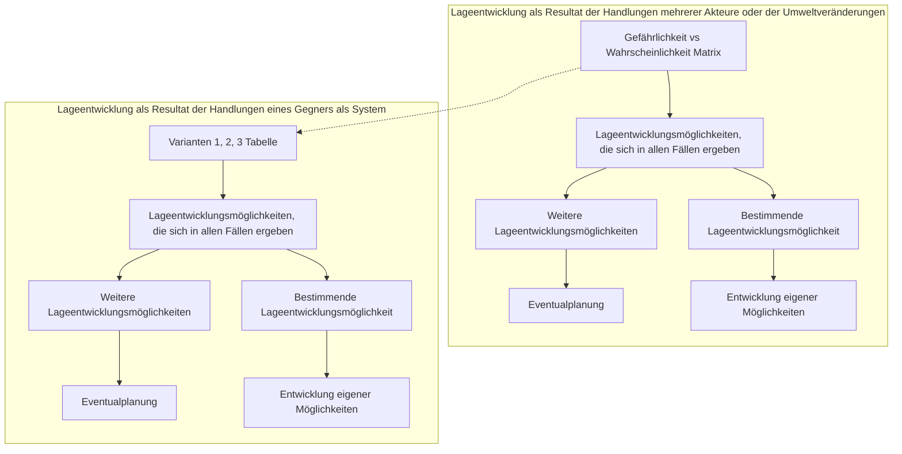

### Daten aus der Matrix (Linke Seite)
<table>
  <thead>
    <tr>
        <th></th>
        <th>hu</th>
        <th>un</th>
        <th>mö</th>
        <th>wa</th>
        <th>sw</th>
        <th>hw</th>
    </tr>
  </thead>
  <tbody>
    <tr>
        <td>sh</td>
        <td>[ ]</td>
        <td>[ ]</td>
        <td>[ ]</td>
        <td>[ ]</td>
        <td>[ ]</td>
        <td>[ ]</td>
    </tr>
    <tr>
        <td>ho</td>
        <td>[ ]</td>
        <td>●</td>
        <td>[ ]</td>
        <td>●</td>
        <td>●</td>
        <td>[ ]</td>
    </tr>
    <tr>
        <td>we</td>
        <td>[ ]</td>
        <td>●</td>
        <td>●</td>
        <td>●</td>
        <td>●</td>
        <td>[ ]</td>
    </tr>
    <tr>
        <td>mo</td>
        <td>[ ]</td>
        <td>[ ]</td>
        <td>●</td>
        <td>●</td>
        <td>●</td>
        <td>[ ]</td>
    </tr>
    <tr>
        <td>ge</td>
        <td>[ ]</td>
        <td>[ ]</td>
        <td>[ ]</td>
        <td>●</td>
        <td>●</td>
        <td>[ ]</td>
    </tr>
    <tr>
        <td>sg</td>
        <td>[ ]</td>
        <td>●</td>
        <td>[ ]</td>
        <td>●</td>
        <td>●</td>
        <td>[ ]</td>
    </tr>
  </tbody>
</table>
*Legende Matrix-Achsen: Y-Achse = Gefährlichkeit (sh, ho, we, mo, ge, sg); X-Achse = Wahrscheinlichkeit (hu, un, mö, wa, sw, hw)*

### Daten aus der Variantentabelle (Rechte Seite)
<table>
  <thead>
    <tr>
        <th></th>
        <th>Variante 1</th>
        <th>Variante 2</th>
        <th>Variante 3</th>
    </tr>
    <tr>
        <th></th>
        <th>Graphische Darstellung</th>
        <th>Graphische Darstellung</th>
        <th>Graphische Darstellung</th>
    </tr>
  </thead>
  <tbody>
    <tr>
        <td>Der Gn kann</td>
        <td>- aaa<br/>- ccc<br/>- ggg<br/>- hhh<br/>- jjj</td>
        <td>- bbb<br/>- ddd<br/>- eee<br/>- hhh<br/>- jjj</td>
        <td>- fff<br/>- iii<br/>- kkk<br/>- hhh<br/>- jjj</td>
    </tr>
    <tr>
        <th></th>
        <th>Stärken | Schwächen</th>
        <th>Stärken | Schwächen</th>
        <th>Stärken | Schwächen</th>
    </tr>
  </tbody>
</table>
*Hinweis: Die Zeilen für "- hhh" und "- jjj" sind über alle drei Varianten hinweg gelb markiert und führen zum Feld "Lageentwicklungsmöglichkeiten, die sich in allen Fällen ergeben".*

39

Reglement 50.040 d Führung und Stabsorganisation 17

190 Die Armee arbeitet daher dazu nur eigene Lageentwicklungsmöglichkeiten aus, wo und wenn dies nötig ist. Im Interesse des Schutzes der eigenen Kräfte/Mittel sowie der Erfüllung des Auftrages ist eine ergänzende Beurteilung der Lage jedoch immer notwendig.

191 Risikomanagement und die Bewertung der Lageentwicklungsmöglichkeiten sind sich gegenseitig ergänzende Tätigkeiten.

### 4.2.5 Entschlussfassung

192 Der Entschluss ist das folgerichtige Resultat der Problemerfassung, der Beurteilung der Lage und der Entwicklung eigener Möglichkeiten in Varianten sowie deren Analyse und Bewertung. Anlässlich des Entschlussfassungsrapports legt der Kommandant fest, wie er den Auftrag erfüllen will.

193 Eine klare Darstellung des Entschlusses und der Überlegungen, die dazu geführt haben, erleichtert den Unterstellten dessen Umsetzung nach den Grundsätzen der Auftragstaktik.

**Entwicklung eigener Möglichkeiten in Varianten**

194 Aufgrund sämtlicher gesammelter Informationen, der aus der Beurteilung der Lage abgeleiteten Handlungsrichtlinien sowie der bestimmenden Lageentwicklungsmöglichkeit werden mehrere Varianten eigener Möglichkeiten entwickelt, analysiert und bewertet.

195 Bei der Entwicklung der eigenen Möglichkeiten geht es darum, festzustellen, welche Wirkungen mit welchen Kräften/Mittel in welcher Zeit unter Berücksichtigung der Umwelt und in Bezug auf die bestimmende Lageentwicklungsmöglichkeit erzeugt werden können, um die Ziele zu erreichen oder den Auftrag zu erfüllen.

196 Dabei ist das Denken in Varianten entscheidend. Es erlaubt, Stärken und Schwächen sowie – führungsstufenabhängig – Chancen und Risiken eines Entschlusses zu erkennen.

197 Die Anzahl der auszuarbeitenden Varianten wird durch die zur Verfügung stehende Zeit, die Bearbeitungskapazität des Kommandanten und seines Stabes, die Komplexität der Aufgaben und den vorhandenen Handlungsspielraum bestimmt.

198 Die Varianten berücksichtigen:
* den eigenen Auftrag und die Absicht des vorgesetzten Kommandanten;
* die bestimmende Lageentwicklungsmöglichkeit;
* die Handlungsrichtlinien aus der Problemerfassung und aus der Beurteilung der Lage;

40

Reglement 50.040 d Führung und Stabsorganisation 17

*   die bereits formulierten nachrichtendienstlichen Prioritäten des Kommandanten;
*   die verfügbaren Kräfte/Mittel.

199 Die Varianten beschreiben die wesentlichen Aufgaben und zeigen auf, wo die jeweiligen Schwergewichte liegen. Sie sollen eine möglichst einfache und effektive Führung ermöglichen. Waffenwirkungen, Möglichkeiten zur Deckung logistischer Bedürfnisse, Aufgaben für die Führungsunterstützung und Nachrichtenbeschaffung sowie einsatzrechtliche Gesichtspunkte sind zu berücksichtigen.

**Präsentation der Varianten**

200 Die Präsentation bindet den Kommandanten in den Prozess der Entwicklung der Varianten ein. Dies verringert den Koordinationsaufwand für die weitere Stabsarbeit. Der Kommandant kann Änderungen vornehmen, Varianten verwerfen oder eigene Varianten hinzufügen.

201 Die Varianten werden verglichen und einzelne Unterschiede hervorgehoben, aber noch nicht analysiert und bewertet. Auf diese Weise lassen sich die Besonderheiten sowie die Stärken und Schwächen einander gegenüberstellen. Bis zum Schluss der Präsentation können Fragen offen bleiben. Diese werden aufgenommen und in der Weiterentwicklung beantwortet.

<table>
  <thead>
    <tr>
        <th>Variante 1 "DECKNAME"</th>
        <th colspan="2">Variante 2 "DECKNAME"</th>
        <th colspan="2">Variante 3 "DECKNAME"</th>
        <th></th>
    </tr>
  </thead>
  <tbody>
    <tr>
        <td rowspan="2">*Graphische Darstellung*</td>
        <td colspan="2" rowspan="2">*Graphische Darstellung*</td>
        <td colspan="2" rowspan="2">*Graphische Darstellung*</td>
        <td></td>
    </tr>
    <tr>
        <td>Stärken</td>
        <td>Schwächen</td>
        <td>Stärken</td>
        <td>Schwächen</td>
        <td>Stärken</td>
        <td>Schwächen</td>
    </tr>
    <tr>
        <td>    </td>
        <td>    </td>
        <td>    </td>
        <td>    </td>
        <td>    </td>
        <td>    </td>
    </tr>
  </tbody>
</table>

*Abb. 17: Gegenüberstellung der Varianten*

**Analyse der Varianten**

202 Jede Variante wird methodisch auf ihre absehbare Wirkung hin überprüft. Verschiedene Varianten sind mit der gleichen Methode zu verifizieren.

203 Die genannten Methoden dienen:
*   der begleitenden Analyse eigener Möglichkeiten bzw Varianten;
*   der nachträglichen Validierung des Entschlusses;
*   zur Optimierung und Verfeinerung von Varianten bis hin zur Anpassung des Aktionsplanes.

41

Reglement 50.040 d Führung und Stabsorganisation 17

204 Abhängig von der zur Verfügung stehenden Zeit können folgende Methoden angewendet werden:
* Variantenprüfung;
* Erkundung im Gelände;
* Kriegsspiel/Synchronisierungsrapport;
* Simulationen;
* Truppenübungen bzw Truppenversuche.

205 Der Kommandant bestimmt die anzuwendende Methode, den Zeitpunkt und die Verantwortlichen der Durchführung. Die Resultate der Analyse werden festgehalten und später bei der Bewertung der Varianten verwendet.

206 Bei einer **Variantenprüfung** werden folgende Gesichtspunkte untersucht (jede Variante muss den folgenden Fragen standhalten):
* **Angemessenheit:** Entspricht die Variante der Absicht des vorgesetzten Kommandanten? Befolgt sie die Handlungsrichtlinien des Kommandanten? Ist sie auf das Ziel ausgerichtet? Ist sie einsatzrechtskonform?
* **Exklusivität:** Unterscheidet sich die Variante von den anderen Varianten? Echte Varianten unterscheiden sich u a in Bezug auf die Verwendung der Kräfte/Mittel und der Reserven, die Organisation und/oder das Schwergewicht.
* **Machbarkeit:** Kann der Auftrag erfüllt werden? Sind die Kräfte/Mittel ausreichend (Bestand, Qualität, Moral, Gesundheit, Disziplin, Ausbildungsstand, Ausrüstung, Durchhaltefähigkeit)? Können die unterstellten Verbände die Variante umsetzen?
* **Tragbarkeit:** Selbst wenn angemessen und machbar, ist die Variante in Bezug auf Risiken tragbar (Auswirkungen auf Personal, Moral, Material, Zeit, Gelände, Bevölkerung)? Ist das Risiko tragbar?
* **Vollständigkeit:** Beantwortet die Variante die Fragen: wann? wer? was? wo? wie? Wurde die Variante gesamtheitlich und in Bezug auf deren Abhängigkeiten betrachtet?

207 Varianten, welche die Prüfung nach diesen Gesichtspunkten nicht bestehen, müssen verworfen, ergänzt oder angepasst werden.

**Bewertung der Varianten**

208 Bei der Bewertung der Varianten geht es darum, dass der Kommandant aufgrund zu gewichtender Entscheidungskriterien die bevorzugte Variante festlegt. Der Zeitpunkt der Bekanntgabe der Gewichtung ist Kommandantenentscheid.

209 Der Kommandant bestimmt ab Beginn der Aktionsplanung, aber spätestens nach der Festlegung der bestimmenden Lageentwicklungsmöglichkeit, die

42

Reglement 50.040 d Führung und Stabsorganisation 17

Entscheidungskriterien. Diese können auf den Einsatzgrundsätzen und ausgewählten Handlungsrichtlinien aus der Beurteilung der Lage gründen. Der Kommandant kann weitere Kriterien festlegen (z B Anwendung der Doktrin, Ausrichten auf die kritischen Verwundbarkeiten oder Schwachstellen der Akteure).

### Entschluss

210 Der Kommandant fasst aufgrund der Analyse und Bewertung der Varianten seinen Entschluss.

211 Der Entschluss:
* legt fest, wie der Kommandant den Auftrag erfüllen will;
* beschreibt den räumlich-zeitlichen Ablauf der Aktion;
* regelt die Zusammensetzung und das Zusammenwirken von Nachrichtenbeschaffungs-, Einsatz- und Einsatzunterstützungsmitteln.

212 Der Entschluss bestimmt das Handeln aller Beteiligten während der ganzen Dauer der Aktion. Er ermöglicht den Unterstellten den Ablauf der Aktion sowie das Ziel der Aktion klar zu erkennen. Er richtet alle Beteiligten gedanklich auf das gemeinsame Ziel aus und lässt diese ihre Aufgabe im Gesamtrahmen erkennen.

213 Der Kommandant begründet seinen Entschluss und vergewissert sich damit, dass seine Unterstellten diesen verstanden haben.

214 Jeder gefasste Entschluss ist Änderungen unterworfen. Auf der Grundlage des Aktionsplanes und der Lageverfolgung muss er daher laufend überprüft und nötigenfalls angepasst werden.

215 Erst die Unterstützungskonzepte und der Aktionsplan ermöglichen dem Kommandanten, aus dem Entschluss seine definitive Absicht zu formulieren.

216 Von dieser formulierten Absicht wird ohne zwingenden Grund nicht abgewichen. Eine Änderung ist nur zulässig, wenn:
* eine wesentliche Lageveränderung eintritt;
* die Ziele nicht mehr oder nur unter Inkaufnahme hoher eigener Verluste erreicht werden können (einschliesslich Bevölkerung und ziviler Objekte);
* ein starres Festhalten die Auftragserfüllung gefährdet;
* sich Gelegenheiten bieten, den Auftrag auf andere Weise besser, für die Bevölkerung und die zivilen Objekte schonender oder mit geringerem Aufwand zu erfüllen.

43

Reglement 50.040 d Führung und Stabsorganisation 17

### Erstellung des Aktionskonzeptes

217 Das Aktionskonzept ist die Umsetzungsvorstellung des Kommandanten, wird aus dem Entschluss abgeleitet und beschreibt, wie der Kommandant:
* die Kräfte/Mittel in Raum und Zeit einsetzen,
* die Informationsüberlegenheit erreichen sowie
* die Ziele bzw den angestrebten Endzustand erreichen will.

218 Das Aktionskonzept dient als Grundlage für die Erstellung der Eventualplanung, der Unterstützungskonzepte und schliesslich des Aktionsplanes, die in der nachfolgenden Führungstätigkeit ausgearbeitet werden. Alle notwendigen Informationen zur Erstellung des Aktionskonzeptes befinden sich in vorgängig erstellten Produkten.

219 Das Aktionskonzept:
* entspricht den Vorgaben des vorgesetzten Kommandanten;
* stellt den Entschluss des Kommandanten zur Zielerreichung dar;
* legt die notwendigen Kräfte/Mittel der Aktion fest;
* beschreibt den räumlich-zeitlichen Ablauf der Aktion;
* ermöglicht die Information des vorgesetzten Kommandanten, der Nachbarn und der Unterstellten über den Entschluss;
* beschreibt die Bedürfnisse für die Erstellung des Aktionsplanes.

### Synchronisationsmatrix

220 Die Synchronisationsmatrix dient der räumlich-zeitlichen Koordination der Kräfte/Mittel und damit dem bestmöglichen Ressourceneinsatz zur Auftragserfüllung.

221 Mit der schriftlichen und grafischen Darstellung werden basierend auf der vorgesetzten Stufe und der bestimmenden Lageentwicklungsmöglichkeit die eigenen Führungsunterstützungs-, Einsatz-, Einsatzunterstützungsmittel und Kräfte/Mittel der Partner aufeinander abgestimmt.

222 Die Erarbeitung der Synchronisationsmatrix erfolgt während der Erstellung der Eventualplanung und der Unterstützungskonzepte oder während des Kriegsspiels unter Beizug der Resultate des Risikomanagements. Die Synchronisationsmatrix wird in der Folge verfeinert, indem die Aktion in Phasen und Sequenzen aufgeteilt wird. Jede Phase entspricht der Erreichung von Zwischenschritten (z B Schlüsselbereichen oder Zwischenzielen). Die letzte Phase mündet in den angestrebten Endzustand.

223 Die Synchronisationsmatrix dient während der Aktion als Führungsgrundlage.

44

45

<table>
  <thead>
    <tr>
        <th colspan="2">Rm, Zeit</th>
        <th>Phase</th>
        <th colspan="2">0</th>
        <th colspan="3">1</th>
        <th colspan="3">2</th>
        <th colspan="4">3</th>
        <th>4</th>
        <th>5</th>
    </tr>
    <tr>
        <th colspan="2">Mittel</th>
        <th>Sequenz</th>
        <th colspan="2"></th>
        <th>1.1</th>
        <th>1.2</th>
        <th>1.3</th>
        <th>2.1</th>
        <th>2.2</th>
        <th colspan="2"></th>
        <th>3.1</th>
        <th colspan="2">3.2</th>
        <th colspan="2"></th>
    </tr>
    <tr>
        <th></th>
        <th>Zeit (geschätzt)</th>
        <th>H-14</th>
        <th>H-12</th>
        <th>H-10</th>
        <th>H-8</th>
        <th>H-6</th>
        <th>H-4</th>
        <th>H-2</th>
        <th>H</th>
        <th>H+2</th>
        <th>H+4</th>
        <th>H+6</th>
        <th>H+8</th>
        <th>H+10</th>
        <th>H+12</th>
        <th></th>
    </tr>
    <tr>
        <th></th>
        <th>Interner Zeitplan</th>
        <th colspan="14"></th>
        <th></th>
    </tr>
  </thead>
  <tbody>
    <tr>
        <td>&lt;mark style="background-color: salmon"&gt;**Bestimmende Lageentwicklungsmöglichkeit**</mark></td>
        <td colspan="2"></td>
        <td colspan="3">Aufkl Rm..., Fe Art + LW, Stoss in Nachbarrm</td>
        <td colspan="3">Aufkl Rm..., Vorausaktionen, Fe Art + LW, Bstel im Nachbarrm</td>
        <td colspan="4">Ag in Eirm</td>
        <td colspan="2">Rz, Ggag, Ausweichen</td>
        <td colspan="2"></td>
    </tr>
    <tr>
        <td>&lt;mark style="background-color: yellow"&gt;**Partner**</mark></td>
        <td colspan="14">Zivilschutz, Polizei, Feuerwehr, Grenzwachtkorps, usw</td>
        <td colspan="2"></td>
    </tr>
    <tr>
        <td>&lt;mark style="background-color: lightgreen"&gt;**Vorgesetzte Kdo Stelle**</mark></td>
        <td colspan="14">Beschreibung analog eigene Mittel</td>
        <td colspan="2"></td>
    </tr>
    <tr>
        <td>&lt;mark style="background-color: lightgreen"&gt;**Nachbarn (inkl andere Operationsräume)**</mark></td>
        <td colspan="14">Beschreibung analog eigene Mittel</td>
        <td colspan="2"></td>
    </tr>
    <tr>
        <td>&lt;mark style="background-color: lightsteelblue"&gt;**Ei Vb Mech Br...**</mark></td>
        <td colspan="14">Vb</td>
        <td colspan="2"></td>
    </tr>
    <tr>
        <td>&lt;mark style="background-color: lightsteelblue"&gt;**FU/ Na Besch Mittel**</mark></td>
        <td>FU Bat A</td>
        <td colspan="14">Sicherstellen Fhr Fähigkeit Berrm Sicherstellen Fhr Fähigkeit, Mob KP Betrieb, COMINT, EJ</td>
        <td></td>
    </tr>
    <tr>
        <td>&lt;mark style="background-color: lightsteelblue"&gt;**FU/ Na Besch Mittel**</mark></td>
        <td>Aufkl Bat B</td>
        <td>Berrm</td>
        <td>MBG (+)</td>
        <td>Aufkl Berrm-Bstelrm</td>
        <td>Aufkl Berrm-Bstelrm, Bstelrm-Ags + rt Flanke</td>
        <td>Aufkl Bstelrm-Ags + rt Flanke</td>
        <td colspan="2">Aufkl Ags-ZZ</td>
        <td colspan="4">Aufkl ZZ-AZ</td>
        <td colspan="2">Aufkl AZ (+)</td>
        <td colspan="2"></td>
    </tr>
    <tr>
        <td>&lt;mark style="background-color: lightsteelblue"&gt;**Einsatzmittel**</mark></td>
        <td>Pz Bat C</td>
        <td>Berrm</td>
        <td colspan="4"></td>
        <td>MBG (+)</td>
        <td>Annäherung Bstelrm</td>
        <td>Annäherung Ags</td>
        <td colspan="4">Ag ZZ</td>
        <td colspan="2">Ag AZ</td>
        <td></td>
    </tr>
    <tr>
        <td>&lt;mark style="background-color: lightsteelblue"&gt;**Einsatzmittel**</mark></td>
        <td>Pz Bat D</td>
        <td>Berrm</td>
        <td colspan="4"></td>
        <td>MBG (+)</td>
        <td>Annäherung Bstelrm</td>
        <td>Annäherung Ags</td>
        <td colspan="4">Ag ZZ</td>
        <td colspan="2">Ag AZ</td>
        <td></td>
    </tr>
    <tr>
        <td>&lt;mark style="background-color: lightsteelblue"&gt;**Einsatzmittel**</mark></td>
        <td>Pz Bat E</td>
        <td>Berrm</td>
        <td colspan="2"></td>
        <td>MBG (+)</td>
        <td>Annäherung Bstelrm</td>
        <td>Annäherung Ags</td>
        <td colspan="2">Ags nehmen + sichern</td>
        <td colspan="4">Res (Ustü Ag) aus Ags</td>
        <td colspan="2">Stoss nach ZZ, Res (Ustü Ag)</td>
        <td></td>
    </tr>
    <tr>
        <td>&lt;mark style="background-color: lightsteelblue"&gt;**Einsatzmittel**</mark></td>
        <td>Mech Bat F</td>
        <td>Berrm</td>
        <td colspan="2"></td>
        <td>MBG (+)</td>
        <td>Annäherung Bstelrm</td>
        <td colspan="3">Nehmen + sichern rt Flanke</td>
        <td colspan="4">Sichern rt Flanke zwischen Bstelrm-Ags</td>
        <td colspan="2">Sichern rt Flanke zwischen Ags-ZZ</td>
        <td></td>
    </tr>
    <tr>
        <td>&lt;mark style="background-color: lightsteelblue"&gt;**Einsatzmittel**</mark></td>
        <td>Fe Kampf</td>
        <td colspan="5"></td>
        <td colspan="3">AF Fe Rm ...</td>
        <td colspan="6">UF Pz Bat C/D</td>
        <td></td>
    </tr>
    <tr>
        <td>&lt;mark style="background-color: lightsteelblue"&gt;**Einsatzunterstützungsmittel**</mark></td>
        <td>Art Abt G</td>
        <td>Berrm</td>
        <td colspan="2">Stelrm 1</td>
        <td>Vs</td>
        <td colspan="3">Stelrm 2</td>
        <td>Vs</td>
        <td colspan="5">Stelrm 3</td>
        <td colspan="2"></td>
    </tr>
    <tr>
        <td>&lt;mark style="background-color: lightsteelblue"&gt;**Einsatzunterstützungsmittel**</mark></td>
        <td>Pz Sap Bat H</td>
        <td>Berrm</td>
        <td>MBG (+)</td>
        <td colspan="6">Beweglichkeit sicherstellen (Schg Aufkl, Art Abt, Pz Bat)</td>
        <td colspan="6">Beweglichkeit sicherstellen (Schg Aufkl, Art, Pz Bat)</td>
        <td></td>
    </tr>
    <tr>
        <td>&lt;mark style="background-color: lightsteelblue"&gt;**Einsatzunterstützungsmittel**</mark></td>
        <td>LW</td>
        <td colspan="14">LA in Rm ...</td>
        <td></td>
    </tr>
    <tr>
        <td>&lt;mark style="background-color: lightsteelblue"&gt;**Einsatzunterstützungsmittel**</mark></td>
        <td>DU L Flab Lwf Abt K</td>
        <td colspan="2"></td>
        <td>MBG (+)</td>
        <td>Vs Stelrm</td>
        <td colspan="3">Aufbau RAS Krm</td>
        <td colspan="6">RAS Krm</td>
        <td colspan="2"></td>
    </tr>
    <tr>
        <td>&lt;mark style="background-color: lightsteelblue"&gt;**Log**</mark></td>
        <td>AU Log Br 1</td>
        <td colspan="14">Log Pt ...</td>
        <td></td>
    </tr>
    <tr>
        <td>&lt;mark style="background-color: lightsteelblue"&gt;**Beso**</mark></td>
        <td colspan="15">...</td>
        <td></td>
    </tr>
  </tbody>
</table>

Abb. 18: Mögliche Darstellung einer Synchronisationsmatrix für einen Ei Vb Mech Br (Auszug)

Reglement 50.040 d
Führung und Stabsorganisation 17

Reglement 50.040 d Führung und Stabsorganisation 17

### 4.2.6 Planentwicklung

224 Die Planentwicklung dient der Erstellung des Aktionsplanes. Alle Einzelheiten der Umsetzung werden geregelt. Besondere technische Systeme können die Erstellung unterstützen.

225 Es werden erstellt:
* die Eventualplanung;
* die Unterstützungskonzepte;
* der Aktionsplan.

**Eventualplanung**

226 Jeder Entschluss birgt Schwächen. Die Lage kann sich während einer Aktion günstig oder ungünstig entwickeln und Änderungen sowie Ergänzungen erfordern.

227 Die Eventualplanung ist eine hypothetische Aktionsplanung innerhalb des Aktionsplanes, die sich mit nicht berücksichtigten Lageentwicklungsmöglichkeiten befasst und somit Anpassungen des Entschlusses ermöglicht.

228 Die Eventualplanung ermöglicht:
* die Handlungsfreiheit während der Aktion zu wahren;
* rascher zu handeln;
* auf Lageveränderungen, welche die Auftragserfüllung gefährden können, erfolgversprechend zu reagieren;
* sich bietende Chancen zeitgerecht zu nutzen.

229 Die Eventualplanung beinhaltet:
* Annahmen zur Lageentwicklung und zu den Zuständen der eigenen Kräfte/Mittel;
* Handlungsmöglichkeiten bezüglich des räumlichen und zeitlichen Kräfte-/Mitteleinsatzes (vorbehaltene Entschlüsse);
* die daraus abgeleiteten Vorbereitungsmassnahmen (z B Änderung der Unterstellungs- und Unterstützungsverhältnisse, Koordinationsmassnahmen).

230 Die nicht berücksichtigten eigenen Möglichkeiten können auch als Grundlage für die Eventualplanung dienen.

231 Die Eventualplanung beeinflusst die Nachrichtenbeschaffung. Ihr Erfolg hängt wesentlich von der rechtzeitigen Auslösung der vorbehaltenen Entschlüsse ab. Eventualplanung führt daher immer zu besonderen Nachrichtenbedürfnissen.

46

Reglement 50.040 d Führung und Stabsorganisation 17

232 Die Eventualplanung muss permanent überprüft und der Lageentwicklung entsprechend überarbeitet werden.

233 Ein vorbehaltener Entschluss wird im Rahmen der Lageverfolgung ausgelöst, wenn eine Lageveränderung eintritt, die zum entsprechenden Handeln zwingt.

234 Reserveverbände bereiten sich in der Regel im Rahmen der Eventualplanung auf verschiedene Aktionen vor.

**Unterstützungskonzepte**

235 Unterstützungskonzepte sind Umsetzungsvorstellungen der Dienstchefs zur Auftragserfüllung und bilden die Beilagen zum Aktionsplan. Sie erlauben, auf der Basis des Entschlusses das Aktionskonzept und die Eventualplanung umzusetzen.

236 Ergebnisse aus den genehmigten Unterstützungskonzepten fliessen direkt in den Aktionsplan ein oder werden in den Befehl aufgenommen.

237 Der Kommandant bestimmt, welche Produkte aus den Unterstützungskonzepten in die Absicht aufgenommen werden, welche unter den besonderen Anordnungen erscheinen und welche als Befehl (Beilage zum Operations- bzw Einsatzbefehl) formuliert werden.

**Aktionsplan**

238 Der Aktionsplan fasst in schriftlicher und grafischer Form alle für die Führung der Aktion bereitgestellten Grundlagen zusammen. Der Aktionsplan ist die Grundlage für die Erstellung der Endprodukte (Operations- bzw Einsatzbefehl).

239 Der Aktionsplan wird durch den Kommandanten anlässlich einer Präsentation genehmigt oder zur Überarbeitung zurückgewiesen. Er wird dem vorgesetzten Kommandanten zur Genehmigung vorgelegt.

240 Der genehmigte Aktionsplan wird den Unterstellten so rasch wie möglich zur Verfügung gestellt. Teile davon können bereits vor dessen Fertigstellung oder Genehmigung an Unterstellte zur Verwendung weitergegeben werden.

241 Jeder Aktionsplan wird naturgemäss durch die sich verändernde Lage überholt. Deswegen muss er dauernd überprüft, nachgeführt und der Lageentwicklung angepasst werden.

47

Reglement 50.040 d Führung und Stabsorganisation 17

### 4.2.7 Befehlsgebung

242 In der Befehlsgebung werden die Endprodukte der Aktionsplanung erstellt und anlässlich der Befehlsausgabe übermittelt. Alle bisher angestellten Überlegungen werden für die Unterstellten festgehalten.

243 Wenn nötig wird der Aktionsplan konsolidiert und dann werden die Endprodukte erstellt. Die Form und Begrifflichkeit der letzteren müssen einfach, klar und präzis sein.

244 Spätestens anlässlich des Befehlsgebungsrapports legt der Kommandant die Gründe für seine Absicht dar. Damit ermöglicht er den Unterstellten, im Gesamtrahmen zu denken und zu handeln und die erfolgsentscheidenden Zusammenhänge klar zu erkennen.

245 Je länger eine Aktion dauert und je grösser Ungewissheit und Komplexität sind, umso wahrscheinlicher ist es, dass erarbeitete Befehle im Verlauf ihrer Ausführung angepasst werden müssen. Die Aufträge decken einen ersten Teil der Aktion ab.

48

Reglement 50.040 d Führung und Stabsorganisation 17

# 5 Produkte der Aktionsplanung und deren Abhängigkeiten

## 5.1 Einleitung

246 Bei der Aktionsplanung wird unterschieden zwischen:
* Aktionsplanung, die durch die vorgesetzte Führungsstufe ausgelöst wird;
* Aktionsplanung, die von der Lageverfolgung oder einer neuen Problemstellung abgeleitet und infolge eines Lagerapportes ausgelöst wird.

247 Wenn die Aktionsplanung von der Lageverfolgung abgeleitet wird, muss diese im Rahmen der ursprünglichen Planung der vorgesetzten Führungsstufe erfolgen.

## 5.2 Einbezug der Unterstellten


```description
The image is a schematic diagram (Abb. 19) showing the interaction and dependencies between three levels of command: "Übergeordnete Führungsstufe" (Superior level), "Nachgeordnete Führungsstufe 1" (Subordinate level 1), and "Nachgeordnete Führungsstufe 2" (Subordinate level 2). 

Each level follows a 5-step process: 
1. Problemerfassung (Problem definition)
2. Beurteilung der Lage (Assessment of the situation)
3. Entschlussfassung (Decision making)
4. Planentwicklung (Plan development)
5. Befehlsgebung (Issuing orders)

The diagram uses symbols:
- 'P' in a square for "Produkt der Aktionsplanung" (Product of action planning).
- Vertical arrows for "bindend" (binding) instructions from a higher to a lower level.
- Dashed arrows pointing upwards for "Einbezug / Beiträge von Unterstellten" (Involvement / contributions from subordinates).
- 'G' in a diamond for "zur Genehmigung" (for approval).

The flow shows that products (P) from the superior level become binding inputs for the subordinate level, while subordinates provide input (Einbezug / Beiträge) back to the superior level's assessment and decision phases. Subordinate plans (P) are sent up for approval (G) to the superior level.
```

Abb. 19: Einbezug der Unterstellten und Produkte der Aktionsplanung (schematische Darstellung)

248 Unterstellte können allenfalls bereits vor, sicher aber während ihrer Planungsarbeit in die Aktionsplanung einbezogen werden und Beiträge zu der Beurteilung der Lage und Entschlussfassung liefern. Dabei geht es darum, sich verlässliche Informationen über Fähigkeiten und Bereitschaft der ein-

49

Reglement 50.040 d Führung und Stabsorganisation 17

zusetzenden Verbände zu verschaffen. Die Unterstellten können durch den frühzeitigen Einbezug ihre eigene Aktionsplanung auch früher angehen.

249 Kommandanten aller Führungsstufen schaffen über Vorbefehle günstige Voraussetzungen für ihre Unterstellten.

250 Einzelne Produkte der Aktionsplanung können bzw müssen der übergeordneten Führungsstufe zur Genehmigung vorgelegt werden.

251 Um die Aktionsplanung der nachgeordneten Führungsstufe zu ermöglichen, zu unterstützen und zu lenken, sind ihr die (genehmigten) Produkte so rasch wie möglich zur Verfügung zu stellen.

## 5.3 Produkte

252 Der Kommandant lässt die Produkte erstellen, welche er für die Führung der Aktion benötigt. Er wählt für diese Produkte die Form, die ihm nach Lage, Auftrag und Aktion geeignet erscheint.

253 Angestrebt wird, dass über alle Führungsstufen die Produkte die gleiche Struktur aufweisen. Damit können die Absprachen und Dialoge stufen- und operationsraumübergreifend rascher und verbindlicher aufeinander abgestimmt werden. Deren Bearbeitungstiefe und der daraus folgende Umfang werden aber massgeblich durch die Zeitverhältnisse und Dringlichkeit bestimmt.

254 Die Produkte müssen so beschaffen sein, dass darin enthaltene Vorgaben durch die Unterstellten mit möglichst geringem zusätzlichem Aufwand weiterverarbeitet oder direkt weiterverwendet werden können. Deshalb sollen unabhängig von der Führungsstufe in jedem Produkt die Informationen zum gleichen Themengebiet immer an der gleichen Stelle erscheinen.

255 Die strategische Führungsstufe erlässt als Produkte für die militärstrategische Führungsstufe eine oder mehrere Weisungen. Die Produkte der militärstrategischen Führungsstufe sind die Handlungsrichtlinie des Chefs der Armee, die Optionen und die Weisung des Chefs der Armee.

256 Die Produkte der Aktionsplanung auf operativer und taktischer Führungsstufe sind die Planungsvorgabe, das (Aktions-) Konzept, der (Aktions-) Plan und der (Aktions-) Befehl.

257 Die **Planungsvorgabe** ist die Formulierung der zu erfüllenden Aufgaben und der zu erreichenden Ziele in Form einer ersten Vorstellung über den Verlauf der Aktion. Sie dient dazu, die Aktionsplanung der Unterstellten auszulösen. Sie regelt mindestens Ziel, Zeitpunkt und Ort der Aktion sowie die eigene Führungsorganisation.

258 Das **Konzept** ist die Umsetzungsvorstellung des Kommandanten zur Auftragserfüllung. Es umfasst mindestens die Absicht des Kommandanten, die Festlegung und Gliederung der zur Durchführung der Aktion nötigen Kräf-

50

Reglement 50.040 d Führung und Stabsorganisation 17

te/Mittel, die Beschreibung des räumlichen und zeitlichen Ablaufs der Aktion sowie Auflagen und Einschränkungen. Der Stab verfügt damit über die Grundlage für die Erstellung des Planes.

259 Zusätzlich werden in verschiedenen Fachbereichen weitere, auf Lage, Auftrag und Führungsstufe abgestimmte Unterstützungskonzepte erstellt. Diese werden – in der Regel – mit dem fachdienstlichen Vorgesetzten abgesprochen bzw basieren auf deren Unterstützungskonzepten.

260 Der **Plan** ist eine Zusammenfassung in schriftlicher und grafischer Form des Entschlusses des Kommandanten mit allen bereitgestellten Grundlagen für die Führung der Aktion.

261 Der **Befehl** mit seinen Beilagen ist das Endprodukt der Aktionsplanung. Er wird den Unterstellten mündlich oder schriftlich erteilt.

## 5.4 Strategische Führungsstufe

262 Produkte, die ausserhalb des VBS von der strategischen Führungsstufe (Landesregierung) erstellt und veröffentlicht werden, werden hier nicht dargestellt. Produkte des VBS werden zur Situierung und zur Darstellung der Abhängigkeit der nachgeordneten Produkte erwähnt.

263 Die strategische Führungsstufe ist in Handhabung und Form der möglichen und nötigen Produkte frei. Der Chef der Armee formuliert die geforderten Beiträge als militärstrategische Optionen.

264 Der Sicherheitsverbund Schweiz (SVS) umfasst alle sicherheitspolitischen Instrumente des Bundes, der Kantone und der Gemeinden. Seine Organe dienen der Konsultation und der Koordination von Entscheiden, Mitteln und Massnahmen von Bund und Kantonen bezüglich sicherheitspolitischer Herausforderungen, die sie gemeinsam betreffen. Der SVS dient als Koordinations- und Konsultationsorgan in der normalen Lage, nicht aber als Krisenführungsorgan. Das Krisenmanagement von Bund und Kantonen erfolgt in der Linie, unterstützt durch verschiedene permanente oder ad hoc gebildete Stäbe.

51

Reglement 50.040 d Führung und Stabsorganisation 17

# 5.5 Militärstrategische Führungsstufe


```description
The image is a complex diagram showing the interaction between three levels of command: Strategische Führungsstufe (red), Militärstrategische Führungsstufe (grey), and Operative Führungsstufe (purple). 

- The top section (Strategische Führungsstufe) shows a process flow with "Ws" (Weisung) and "Wahl" boxes.
- The middle section (Militärstrategische Führungsstufe) shows "Kontextverfolgung" leading into "Aktionsplanung". The Aktionsplanung consists of numbered steps (1 to 5) and specific products: HM (Handlungsrichtlinie), OM (Option), and WM (Weisung).
- The bottom section (Operative Führungsstufe) shows "Einbezug / Beiträge" feeding back into the military-strategic level and its own "Aktionsplanung (Führungstätigkeiten)".
- A legend explains the symbols: solid boxes for levels, dashed circles for possible steps, H for Handlungsrichtlinie, O for Option, W for Weisung, and various arrows for binding directions, involvement/contributions, and selection.
```

**Abb. 20: Von der Kontextverfolgung abgeleitete Aktionsplanung der militärstrategischen Führungsstufe**

265 Auf militärstrategischer Führungsstufe wird die Aktionsplanung von der Kontextverfolgung abgeleitet. Es werden folgende Produkte erstellt:
* militärstrategische Handlungsrichtlinie des Chefs der Armee (H<sub>M</sub>);
* militärstrategische Optionen (O<sub>M</sub>);
* militärstrategische Weisung des Chefs der Armee (W<sub>M</sub>).

266 Die militärstrategische Führungsstufe setzt die Weisung(en) der strategischen Führung um oder schlägt dieser Optionen vor. Sie fordert dazu Beiträge der operativen Führungsstufe ein. Die Optionen werden nach Zielen, Wegen, Mitteln und Implikationen gegliedert. Diese erlauben, die Leistungen und den Einsatz der Armee auf die anderen Teilstrategien des Bundes abzustimmen.

### 5.5.1 Militärstrategische Handlungsrichtlinie des Chefs der Armee (H<sub>M</sub>)

267 Die militärstrategische Handlungsrichtlinie dient dazu:
* die Aktionsplanung der operativen Führungsstufe zu ermöglichen, zu unterstützen und zu lenken;
* die eigene Planungsarbeit gezielt zu verfolgen.

52

Reglement 50.040 d Führung und Stabsorganisation 17

268 Der Inhalt der Handlungsrichtlinie ist das Resultat aus der Problemerfassung, Beurteilung der Lage oder Entschlussfassung. Sie wird allenfalls gemeinsam von Vertretern der Sicherheitspolitik mit dem Kommando Operationen bzw dem Armeestab dem Kontext und der Lage entsprechend weiterentwickelt und zeitgerecht durch den Chef der Armee erlassen.

### 5.5.2 Militärstrategische Optionen (O<sub>M</sub>)

269 Militärstrategische Optionen sind grundsätzliche Handlungsmöglichkeiten auf militärstrategischer Führungsstufe, welche der strategischen Führungsstufe zum Auswahlentscheid vorgelegt werden. Die militärstrategische Führungsstufe berücksichtigt dabei im Sinne des gesamtheitlichen Ansatzes alle Aspekte der Gesamtstrategie der Landesregierung und die Abhängigkeiten unter den Teilstrategien (der Departemente).

270 Die militärstrategische Führungsstufe verantwortet die Erarbeitung der Optionen. Die operative Führungsstufe wird dabei einbezogen und liefert Beiträge zu deren Entwicklung und Analyse.

271 Mit dem Auswahlentscheid der strategischen Führungsstufe zur militärstrategischen Option können folgende Eckwerte formuliert werden:
* wozu der Einsatz der Armee dient (Zweck);
* was und wie militärstrategisch erreicht werden muss (Ziele und Wege);
* mit welchen Kräften die Armee den Einsatz führen wird (Mittel).

272 Welche militärischen Kräfte/Mittel zur Verfügung stehen, wo die Operation stattfindet bzw die Einsätze stattfinden und wann die Operation stattfindet bzw die Einsätze stattfinden, wird mit der operativen Führungsstufe geklärt.

### 5.5.3 Militärstrategische Weisung des Chefs der Armee (W<sub>M</sub>)

273 Die militärstrategische Weisung:
* legt den Rahmen für die Durchführung der Operation fest;
* enthält abschliessend nur die eine, von der strategischen Führungsstufe gewählte und genehmigte Option;
* stellt die Aktionsplanung der operativen Führungsstufe in den endgültigen verbindlichen Rahmen;
* wird führungsstufenübergreifend – abhängig von Zeitverhältnissen und Komplexität der Armeeaufgabe – über unterschiedliche Bearbeitungsstände entwickelt.

53

Reglement 50.040 d Führung und Stabsorganisation 17

274 Unabhängig vom Zeitpunkt der Weitergabe an die operative Führungsstufe und Bearbeitungstiefe weist die militärstrategische Weisung immer die gleiche inhaltliche Struktur auf und legt folgende Elemente dar bzw fest:
* die Kontextveränderung und -entwicklung;
* die politische Problemstellung und der daraus abgeleitete Auftrag an die Armee;
* militärstrategische Ziele und der angestrebte militärische Endzustand aufgrund der politischen Vorgaben oder Zielsetzung;
* Aufträge an die operative Führungsstufe;
* die Führungsverantwortung und Kommandoordnung;
* zeitliche Vorgaben für die Operationsplanung;
* die für die Operation durch die strategische Führungsstufe genehmigten Kräfte;
* Einsatzart und Richtlinien für die Gewaltanwendung;
* Richtlinien zur zivil-militärischen Zusammenarbeit;
* weitere politische, rechtliche und militärische Vorgaben und Einschränkungen.

## 5.6 Operative Führungsstufe

```description
A complex diagram showing the interaction between three command levels: Militärstrategische Führungsstufe (top, grey), Operative Führungsstufe (middle, purple), and Taktische Führungsstufe (bottom, green). 

The diagram illustrates "Aktionsplanung (Führungstätigkeiten)" (Action Planning / Command Activities) triggered by the military-strategic level. 

Key elements include:
- A legend defining symbols: dashed boxes for possible steps, circles for document types (H: Handlungsrichtlinie, O: Option, W: Weisung), squares for planning outputs (V: Planungsvorgabe, K: Konzept, P: Plan, B: Befehl), and arrows for flow (solid for binding, dashed for involvement/contributions, and a specific arrow for "zur Genehmigung" / for approval).
- The top level (Strategic) shows a sequence of H_M, H_M, O_M, H_M/W_M, W_M leading to a Genehmigung (G) and subsequent W_M and G.
- The middle level (Operative) shows a process starting with "Lageverfolgung" (Monitoring), moving into "Aktionsplanung" with steps: 1 PE, 2 Beurteilung der Lage, 3 Entschlussfassung, 4 PLE, and 5 Befehlsgebung. These steps produce V_O, K_O, P_O, and B_O.
- The bottom level (Tactical) shows "Einbezug / Beiträge" (Involvement / Contributions) feeding back into the operative level and its own "Aktionsplanung".
- Arrows indicate the flow of directives downwards and contributions upwards between the levels.
```

*Abb. 21: Durch die militärstrategische Führungsstufe ausgelöste Aktionsplanung der operativen Führungsstufe (Vorausplanung)*

54

Reglement 50.040 d Führung und Stabsorganisation 17

275 Wenn die Aktionsplanung durch die militärstrategische Führungsstufe ausgelöst wird, meist bei einer Vorausplanung, verfügt die operative Führungsstufe über eine ausreichende Ausgangslage sobald die erste militärstrategische Handlungsrichtlinie des Chefs der Armee vorliegt. Aufgrund des rechtzeitigen Einbezugs in die Planungsarbeit der militärstrategischen Führungsstufe kann die operative Führungsstufe ihre eigene Aktionsplanung beginnen. Während der Beurteilung der Lage erbringt sie Beiträge zu den militärstrategischen Optionen.


```description
Diagram showing the interaction between Military-Strategic, Operative, and Tactical command levels during action planning. 
- Military-Strategic Level: Shows "HM" (Handlungsrichtlinie), "OM" (Option), "WM" (Weisung), and "ursprüngliche Aktionsplanung".
- Operative Level: Shows "Lageverfolgung", "parallele Lageverfolgung", and "Fortsetzung der Lageverfolgung". The action planning process includes steps 1 PE, 2 Beurteilung der Lage, 3 Entschlussfassung, 4 PLE, and 5 Befehlsgebung, with outputs VO (Planungsvorgabe), KO (Konzept), PO (Plan), and BO (Befehl).
- Tactical Level: Shows "Lageverfolgung", "Einbezug / Beiträge", "parallele Lageverfolgung", and "Aktionsplanung (Führungstätigkeiten)".
Arrows indicate flow of information, binding directives, and contributions for approval (G).
```

*Abb. 22: Von der Lageverfolgung abgeleitete Aktionsplanung der operativen Führungsstufe (Reaktionsplanung)*

276 Als Reaktion auf eine bestehende oder in Entwicklung befindliche Krise löst die operative Führungsstufe eine von der Lageverfolgung abgeleitete Aktionsplanung aus. Die Produkte dieser Reaktionsplanung bilden die Grundlage für die Operationsführung.

277 Auf operativer Führungsstufe werden fallweise Beiträge zu den militärstrategischen Optionen geliefert und die Planungsvorgabe, das Operationskonzept und der Operationsplan bzw -befehl erlassen.

### 5.6.1 Beiträge zu den militärstrategischen Optionen

278 Die operative Führungsstufe liefert unter Einbezug der taktischen Führungsstufe operationsraumübergreifend Beiträge zur Entwicklung und Analyse der militärstrategischen Optionen (z B Kräfteansatz, Bereitschaft, Machbar-

55

Reglement 50.040 d Führung und Stabsorganisation 17

keit in den Bereichen Logistik und Führungsunterstützung, Risikobeurteilung, Durchhaltefähigkeit).

### 5.6.2 Planungsvorgabe (V<sub>o</sub>)

279 Basierend auf den militärstrategischen Handlungsrichtlinien und/oder der ersten Version der militärstrategischen Weisung des Chefs der Armee erlässt der operative Kommandant im Rahmen eines Vorbefehls die Planungsvorgabe für die taktische Führungsstufe.

280 Die Planungsvorgabe des operativen Kommandanten ist das Ergebnis des Beurteilungsrapportes und ist die Formulierung der zu erfüllenden Aufgaben und zu erreichenden Ziele in Form einer ersten Vorstellung über den Verlauf der Operation.

281 Die Planungsvorgabe umfasst die Auftragsbeschreibung und die verfeinerte Anlage der Operation. Sie enthält Teile des späteren Operationsplanes, wie z B die Kommandoordnung, aber noch keine Aufträge an die taktische Führungsstufe.

282 Die Planungsvorgabe kann Varianten enthalten, die zu analysieren sind. Sie sind entscheidend für die weitere Planungsarbeit der operativen Führungsstufe, da sie einen Rahmen darstellen, der verhindert, dass Teilarbeiten auseinanderstreben.

283 Die Planungsvorgabe wird der Lageentwicklung laufend angepasst.

**Auftragsbeschreibung**

284 Die Auftragsbeschreibung ist das Resultat der Auftragsanalyse der operativen Führungsstufe. Es geht darum, präzise auszudrücken:
* wozu die Operation dient (Zweck) und was operativ erreicht werden muss (Ziele);
* wer die Operation führt;
* wo die Operation stattfindet;
* wann die Operation stattfindet.

Die Auftragsbeschreibung sagt noch nicht aus, wie die Operation auszuführen ist, kann jedoch Erfolgskriterien enthalten, an denen die Zielerreichung gemessen wird.

**Anlage der Operation**

285 Die Anlage der Operation stellt die Operation im Überblick dar und bildet das Kernstück des späteren Operationskonzepts. Sie umfasst:
* den angestrebten militärischen Endzustand;

56

Reglement 50.040 d Führung und Stabsorganisation 17

* das eigene und das gegnerische Zentrum der Kraftentfaltung;
* die operativen Ziele;
* die Schlüsselbereiche;
* die Operationslinien;
* die Entscheidungspunkte;
* das Vorgehen in der Umsetzung;
* die Phasen der Operation.

### 5.6.3 Operationskonzept (K<sub>o</sub>)

286 Die Planungsvorgabe des operativen Kommandanten bildet die Grundlage für die Erstellung des Operationskonzepts. Sie dient der Ausarbeitung und Bewertung der Lageentwicklungsmöglichkeiten sowie der Entwicklung, Analyse und Bewertung der Varianten eigener Möglichkeiten.

287 Das Operationskonzept macht Aussagen über:
* Sequenzierung und Abstimmung der Operationslinien;
* Grundannahmen, die für die militärische Führung wesentlich sind;
* die Idee zur Erreichung der operativen Ziele;
* den Kräftebedarf;
* den groben Zeitbedarf für die Durchführung der Operation;
* die Organisation der Führung;
* die logistische Unterstützung;
* das Erstellen der Einsatzbereitschaft;
* das Vorgehen bezüglich Kommunikation.

288 Das Operationskonzept wird der militärstrategischen Führungsstufe zur Abstimmung mit den Partnern und schliesslich zur Genehmigung vorgelegt. Das genehmigte Operationskonzept wird den Unterstellten zur Verfügung gestellt.

289 Die Grundstruktur des Operationskonzepts entspricht jener des Operationsplanes bzw -befehls. Im Gegensatz zur Planungsvorgabe enthält das Operationskonzept ausdrücklich die allfällige gewählte Option und den Entschluss der operativen Führungsstufe sowie die ausformulierten Aufträge an die taktische Führungsstufe.

290 Die Mittelzusammensetzung ist Bestandteil des Operationskonzepts. Sie zeigt die vorgesehene Kräfteaufstellung sowie Unterstellungs- und Unterstützungsverhältnisse. Die Gliederung auf operativer Führungsstufe weist in der Regel die Unterstellungsverhältnisse bis Stufe Truppenkörper aus.

57

Reglement 50.040 d Führung und Stabsorganisation 17

291 Das durch den Chef der Armee genehmigte Operationskonzept bildet die Grundlage für die Erstellung des Operationsplanes bzw -befehls.

### 5.6.4 Operationsplan/-befehl (P<sub>o</sub>/B<sub>o</sub>)

292 Während der gesamten Operationsplanung werden Informationen für die Erstellung des Operationsplanes gesammelt. Der Stab muss mit der Festlegung einzelner Elemente nicht bis zum Erreichen dieses letzten Schrittes warten. Teile des Operationsplanes können vorgängig ausgearbeitet werden.

293 Während der Erstellung des Operationsplanes werden ständig Informationen innerhalb der Führungsgrundgebiete und mit den unterstellten Stäben ausgetauscht. Auch der Operationsplan wird der militärstrategischen Führungsstufe zur Abstimmung mit den Partnern und zur Genehmigung vorgelegt. Der genehmigte Operationsplan (entspricht später dem Operationsbefehl) wird den Unterstellten so rasch wie möglich zur Verfügung gestellt. Der Operationsplan und andere bereitgestellte Grundlagen für die Führung der Operation müssen in periodischen Abständen überprüft werden.

294 Vor Auslösung einer Operation wird der Operationsplan (durch Unterschrift und Ergänzung mit Kräftebezeichnung und Zeitplan) zum Operationsbefehl.

295 Operationsplanung erfordert einen konsequent operationsraumübergreifenden Ansatz. Entsprechend muss der operative Stab dauernd den operativen Dialog mit den unterstellten (Einsatz-) Verbänden sowie dem Kommando Cyber und der Logistikbasis der Armee führen.

58

Reglement 50.040 d Führung und Stabsorganisation 17

# 5.7 Taktische Führungsstufe

```description
Diagram showing the action planning process across operative and tactical command levels. It illustrates the flow from situation tracking (Lageverfolgung) through action planning (Aktionsplanung) involving planning guidelines (V), concepts (K), plans (P), and orders (B). The diagram shows synchronization points (Einbezug / Beiträge) between the operative level and the tactical level, and further down to subordinate tactical units. Key steps include Problem Evaluation (PE), Assessment of the Situation (BdL), Decision Making (EF), Plan Development (PLE), and Issuing Orders (Befehlsgebung).
```

**Abb. 23: Aktionsplanung der taktischen Führungsstufe**

296 Auf taktischer Führungsstufe werden die Planungsvorgabe, das Einsatzkonzept und der Einsatzplan bzw -befehl erlassen.

## 5.7.1 Planungsvorgabe (V<sub>T</sub>)

297 Die Planungsvorgabe des taktischen Kommandanten ist das Ergebnis des Beurteilungsrapportes. Sie dient dazu, die Aktionsplanung der Unterstellten auszulösen und die Tätigkeiten des eigenen Stabes zu steuern.

298 Der taktische Kommandant formuliert in der Planungsvorgabe seine erste Vorstellung über den Verlauf des Einsatzes. Die Planungsvorgabe enthält jedoch keine taktischen Aufträge an Unterstellte und darf den Entschluss nicht vorwegnehmen.

59

Reglement 50.040 d Führung und Stabsorganisation 17

### 5.7.2 Einsatzkonzept (K<sub>T</sub>)

299 Das Einsatzkonzept ist inhaltlich gleich gegliedert wie der spätere Einsatzplan bzw -befehl. Inhalte können auch in Form eines räumlich-zeitlichen Einsatzkonzeptes dargestellt und präsentiert werden.

300 Im Gegensatz zur Planungsvorgabe enthält das Einsatzkonzept die Absicht des taktischen Kommandanten, auf der Basis des Entschlusses, und die Aufträge an die Unterstellten.

301 Die Einsatzgliederung des eigenen Verbandes ist Bestandteil des Einsatzkonzeptes. Es zeigt die Unterstellungsverhältnisse (bis zwei Stufen tiefer) auf.

302 Die operative Führungsstufe synchronisiert die Operation, indem sie alle vorgelegten Einsatzkonzepte der taktischen Führungsstufe aufeinander abstimmt und genehmigt. Um eine parallele Aktionsplanung sicherzustellen, ist das genehmigte Einsatzkonzept den Unterstellten so rasch wie möglich zur Verfügung zu stellen.

303 Das Einsatzkonzept bildet die Grundlage für die Erstellung des Einsatzplanes bzw -befehls der eigenen Stufe und dient der unterstellten Stufe als Grundlage für deren Beurteilung der Lage.

### 5.7.3 Einsatzplan/-befehl (P<sub>T</sub>/B<sub>T</sub>)

304 Der Einsatzplan wird dem operativen Kommandanten bzw dem vorgesetzten taktischen Kommandanten für die Synchronisation der Gesamtaktion zur Genehmigung vorgelegt. Der genehmigte Einsatzplan wird den Unterstellten kommentiert zur Umsetzung zugestellt.

305 Der Einsatzbefehl ist der verbindlich ausformulierte Einsatzplan des taktischen Kommandanten.

306 Der taktische Kommandant kann Teilaspekte des Einsatzbefehls auch vor dessen Fertigstellung und Genehmigung mittels Teilbefehl(en) bereits anordnen.

60

Reglement 50.040 d Führung und Stabsorganisation 17

# 6 Führungsorganisation

307 Die Führungsorganisation stellt mittels Kommandoordnung und Stabsorganisation, angepasst an die optimale Nutzung der Führungsinfrastruktur, einen rationellen und systematischen Ablauf der Stabstätigkeiten sicher.

308 Abhängig von Führungsstufe und Lage legt der Kommandant die Führungsorganisation fest, die ihm für die Auftragserfüllung am geeignetsten erscheint.

## 6.1 Begriffe und Inhalte

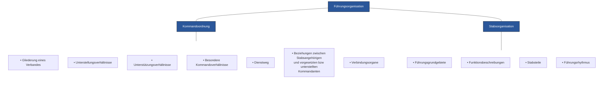

*Abb. 24: Begriffshierarchie Führungsorganisation*

## 6.2 Kommandoordnung

309 Die Kommandoordnung regelt die Gliederung eines Verbandes, die Unterstellungs-, Unterstützungs- und besonderen Kommandoverhältnisse sowie die Dienst- und Fachdienstwege.

### 6.2.1 Gliederung eines Verbandes

310 Unterschieden werden Grundgliederung und Einsatzgliederung:
* Die Grundgliederung ist die von einer bestimmten Aktion unabhängige und durch die Armeeorganisation vorgegebene Zusammensetzung eines Verbandes;
* Die Einsatzgliederung ist die für eine bestimmte Aktion gewählte und durch die Kommandoordnung bestimmte Zusammensetzung der Kräfte bzw Mittel.

61

Reglement 50.040 d Führung und Stabsorganisation 17

### 6.2.2 Unterstellungsverhältnisse

311 Unterstellungsverhältnisse wiederspiegeln die Beziehungen zwischen den vorgesetzten und unterstellten Kommandanten der in der Grund- oder Einsatzgliederung zusammengesetzten Verbände. Sie sind deshalb bestimmend für die Festlegung der Verantwortungen und Kompetenzen der einzelnen Kommandanten mit ihren Stäben sowie für die Bestimmung der Dienst- und Fachdienstwege.

312 Durch die Unterstellung wird die Kommandogewalt über einen Verband an einen Kommandanten übertragen. Die Kommandogewalt umfasst die Führungsverantwortung, die Einsatzkompetenz (inklusive Befehlsgewalt), die logistische Verantwortung, die Ausbildungsverantwortung und die Disziplinarstrafgewalt.

313 Die Unterstellungsverhältnisse der militärischen Verbände im Rahmen der Unterstützung ziviler Behörden werden im politischen Entscheidungsfindungsprozess vor dem Truppenaufgebot definiert.

<table>
  <thead>
    <tr>
        <th>Kompetenz und Verantwortung</th>
        <th colspan="3">Unterstellungsverhältnisse</th>
        <th colspan="3">Unterstützungsverhältnisse</th>
    </tr>
    <tr>
        <th></th>
        <th>Organische Unterstellung</th>
        <th>Einsatzunterstellung</th>
        <th>Zuweisung</th>
        <th>Allgemein-Unterstützung (AU)</th>
        <th>Direkt-Unterstützung (DU)</th>
        <th>Indirekt-Unterstützung (IU)</th>
    </tr>
  </thead>
  <tbody>
    <tr>
        <td>Führungsverantwortung<br/>(inkl Aktionsplanung)</td>
        <td>&lt;mark style="background-color: blue"&gt; </mark></td>
        <td>&lt;mark style="background-color: blue"&gt; </mark></td>
        <td>&lt;mark style="background-color: blue"&gt; </mark></td>
        <td rowspan="4">Leistung eines unterstützenden Verbandes zugunsten mehrerer Verbände, die bei der vorgesetzten Kommandostelle beantragt werden kann.</td>
        <td rowspan="4">Durch die vorgesetzte Kommandostelle festgelegte prioritäre Verfügbarkeit der Leistung eines unterstützenden Verbandes für eine bestimmte Aktion oder Zeit.</td>
        <td rowspan="4">Leistung eines unterstützenden Verbandes zugunsten mehrerer Verbände, die ohne Antrag bei der vorgesetzten Kommandostelle erbracht wird.</td>
    </tr>
    <tr>
        <td>Einsatzkompetenz<br/>(inkl Befehlsgewalt)</td>
        <td>&lt;mark style="background-color: blue"&gt; </mark></td>
        <td>&lt;mark style="background-color: blue"&gt; </mark></td>
        <td>&lt;mark style="background-color: blue"&gt; </mark></td>
    </tr>
    <tr>
        <td>Logistische Verantwortung</td>
        <td>&lt;mark style="background-color: blue"&gt; </mark></td>
        <td>&lt;mark style="background-color: blue"&gt; </mark></td>
        <td>&lt;mark style="background-color: blue"&gt; </mark></td>
    </tr>
    <tr>
        <td>Ausbildungs-verantwortung</td>
        <td>&lt;mark style="background-color: blue"&gt; </mark></td>
        <td>&lt;mark style="background-color: blue"&gt; </mark></td>
        <td rowspan="2">diagonal_split</td>
    </tr>
    <tr>
        <td>Disziplinarstrafgewalt</td>
        <td>&lt;mark style="background-color: blue"&gt; </mark></td>
        <td>diagonal_split</td>
        <td colspan="3">**Besondere Kommandoverhältnisse**</td>
    </tr>
    <tr>
        <td>Kompetenz für<br/>- interne Organisation<br/>- Personalplanung</td>
        <td>&lt;mark style="background-color: blue"&gt; </mark></td>
        <td>[blank]</td>
        <td>[blank]</td>
        <td colspan="3">Übertragung spezieller Verpflichtungen, Verantwortungen und Kompetenzen auf eine andere Führungsstufe ohne Änderung der Unterstellungsverhältnisse.</td>
    </tr>
  </tbody>
</table>

> [!NOTE]
> <mark> </mark> Kompetenz / Verantwortung gegeben
> diagonal_split Kompetenz / Verantwortung ist in der Regel festzulegen bzw zu präzisieren

Abb. 25: Unterstellungs- und Unterstützungsverhältnisse

### Organische Unterstellung

314 Der Kommandant verfügt über die Führungsverantwortung, die Einsatzkompetenz, die logistische Verantwortung, die Ausbildungsverantwortung, die Disziplinarstrafgewalt und die Kompetenz für die interne Organisation und Personalplanung.

62

Reglement 50.040 d Führung und Stabsorganisation 17

### Einsatzunterstellung

315 Für eine bestimmte Aktion kann ein Verband aus seiner Grundgliederung herausgenommen und einem anderen Kommandanten unterstellt werden. Dieser neue Kommandant verfügt über die Führungsverantwortung, die Einsatzkompetenz, die logistische Verantwortung und die Disziplinarstrafgewalt. Die Ausbildungsverantwortung muss im Einzelfall geregelt werden.

316 Der organisch vorgesetzte Kommandant bleibt – sofern nicht anders geregelt – weiterhin zuständig für:
* interne Organisation und Personalplanung;
* administrative Belange.

### Zuweisung

317 Mit der Zuweisung wird die Einsatzkompetenz über einen Verband an einen Kommandanten übertragen, das heisst die Kompetenz, über die Leistung zugewiesener Mittel zu verfügen und dazu Befehle zu erteilen.

318 Der organisch vorgesetzte Kommandant bleibt – sofern nicht anders geregelt – weiterhin zuständig für:
* Disziplinarstrafgewalt;
* interne Organisation und Personalplanung;
* administrative Belange.

### 6.2.3 Unterstützungsverhältnisse

**Allgemeinunterstützung (AU)**

319 Allgemeinunterstützung ist die Leistung eines unterstützenden Verbandes zugunsten mehrerer (unterstützten) Verbände, die bei der vorgesetzten Kommandostelle beantragt werden kann (z B Allgemeinunterstützung eines Geniebataillons zugunsten unterstellter Truppenkörper einer mechanisierten Brigade in der Vorbereitungsphase einer Verzögerungsaktion).

320 Die vorgesetzte Kommandostelle legt die Prioritäten fest und erteilt dem unterstützenden Verband die Befehle.

**Direktunterstützung (DU)**

321 Direktunterstützung ist die durch die vorgesetzte Kommandostelle festgelegte prioritäre Verfügbarkeit der Leistung eines unterstützenden Verbandes für eine bestimmte Aktion oder Zeit (z B Direktunterstützung einer Panzersappeurkompanie zugunsten eines Panzerbataillons in der Hauptphase eines Angriffs). Der unterstützte Verband stellt seine Begehren direkt an den unterstützenden.

63

Reglement 50.040 d Führung und Stabsorganisation 17

322 Der unterstützte Verband:
* ist beratend zu betreuen;
* steht in keinem Vorgesetztenverhältnis zum unterstützenden Verband.

323 Der unterstützende Verband ist für die Verbindungen (Erstellen, Betreiben, Unterhalten) verantwortlich.

**Indirektunterstützung (IU)**

324 Indirektunterstützung ist die Leistung eines unterstützenden Verbandes zugunsten mehrerer (unterstützten) Verbände, die ohne Antrag bei der vorgesetzten Kommandostelle erbracht wird (z B Indirektunterstützung einer leichten Fliegerabwehrabteilung zugunsten unterstellter Infanteriebataillone einer Territorialdivision beim Schutz kritischer Infrastruktur).

### 6.2.4 Besondere Kommandoverhältnisse

325 Bei besonderen Kommandoverhältnissen werden spezielle Verpflichtungen, Verantwortungen und Kompetenzen auf eine andere Führungsstufe ohne Änderung der Unterstellungsverhältnisse übertragen.

326 Vor allem kleine Verbände verfügen oft nicht über eigene fachspezifische Mittel. Die Verpflichtung zur fachspezifischen Betreuung kann in diesem Fall einem Verband gleicher oder höherer Stufe übertragen werden (z B die logistische Verantwortung für den einer Infanteriekompanie einsatzunterstellten Panzergrenadierzug bleibt bei dem vorgesetzten Panzergrenadierbataillon).

### 6.2.5 Dienstweg

327 Der Dienstweg ergibt sich aus der Kommandoordnung und führt über die Führungsstufen von Kommandant zu Kommandant.

328 Befehle werden auf dem Dienstweg erteilt. Der Kommandant befiehlt Aktionen unterstellter, zugewiesener oder unterstützender Verbände persönlich. Kann er dies nicht selber vornehmen, überträgt er diese Aufgabe an Stabsangehörige und gibt diese Delegation der Befehlsgewalt formell bekannt. Er präzisiert dazu, wenn nötig, den zeitlichen Umfang, das Sachgebiet und die betroffenen Verbände.

329 Stabsangehörige erhalten vom Kommandanten die Befugnis, direkt Befehle und Weisungen zu erteilen, oder der Kommandant überträgt die Befehlsgewalt über die an der Aktion beteiligten Verbände an Stabsangehörige (z B Flussübergangskommando). Im Auftrag ihres Kommandanten befolgen Stabsangehörige ebenfalls den Dienstweg. Kommandanten und ihre Führungsstufe werden daher nur ausnahmsweise übersprungen. In einem

64

Reglement 50.040 d Führung und Stabsorganisation 17

solchen Fall sind die betroffenen Kommandanten so rasch wie möglich zu orientieren.

330 An Stabsangehörige delegierte Befehlsgewalt umfasst nur jene Bereiche, die zur Erfüllung der gestellten Aufgabe nötig sind. Niemals eingeschlossen sind Disziplinarstrafgewalt, interne Organisation und administrative Belange.

**Fachdienstweg**

331 Der Fachdienstweg ergibt sich aus der Kommandoordnung und führt von Stab zu Stab (bzw Führungsgehilfe Stufe Einheit) oder von Dienstchef zu Dienstchef.

332 Auf dem Fachdienstweg werden fachdienstliche Informationen ausgetauscht und Fachbefehle erteilt.

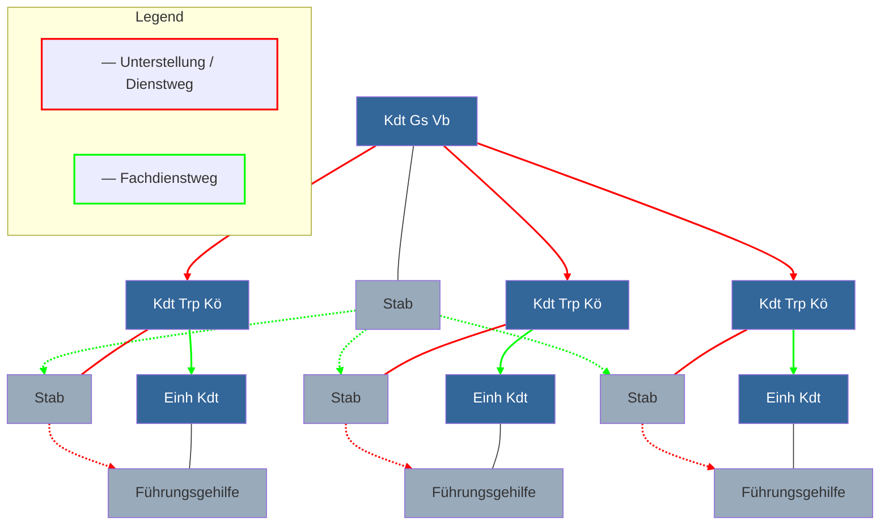
Abb. 26: Dienstweg bzw Fachdienstweg (taktische Führungsstufe)

333 Für zeitkritische Aktionen kennen einige Verbände der Armee besondere Wege und Verfahren. Es wird dabei zwischen der Kommandoführung (gemäss Einsatzgliederung) und der zentralen Einsatzleitung (unter Umgehung der Einsatzgliederung) unterschieden. Bei der zentralen Einsatzleitung geht es um die direkte Steuerung von IKT Mitteln, Sensoren und Effektoren durch Einsatzzentralen (FU, Luftwaffe).

### 6.2.6 Beziehungen zwischen Stabsangehörigen und vorgesetzten bzw unterstellten Kommandanten

334 Stabsangehörige unterstützen die unterstellten Kommandanten in der Ausführung ihrer Aufgaben durch zeitgerechte und präzise Information über Lageentwicklung und Stand der (Führungs-) Tätigkeiten der eigenen Führungsstufe.

65

Reglement 50.040 d Führung und Stabsorganisation 17

335 Stabsangehörige versorgen die unterstellten Kommandanten mit weiteren, entscheidungsbeeinflussenden Informationen und stehen als beratende Organe zur Verfügung. Um ein Höchstmass an vertikale und horizontale Synchronisation zu erlangen, unterhalten Stabsangehörige engen Kontakt zu den Stabsangehörigen vorgesetzter, unterstellter und benachbarter Kommandostellen.

336 Das Verhältnis zwischen Stabsangehörigen und vorgesetzten bzw unterstellten Kommandanten wird bestimmt:
* seitens der Stabsangehörigen durch das Bewusstsein ihrer dienenden Aufgabe:
  - Stabsangehörige verzichten auf Eigenmächtigkeiten;
  - Stabsangehörige handeln in denjenigen Bereichen im Auftrag des Kommandanten, wo sie ständig oder zeitlich beschränkt über delegierte Kompetenzen verfügen;
* seitens der vorgesetzten bzw unterstellten Kommandanten durch die Einsicht in die Gesetzmässigkeiten und die Notwendigkeit der Stabsarbeit sowie die Kenntnis der Funktionen und Kompetenzen der Stabsangehörige.

337 Stabsangehörige überwachen auf Befehl ihres Kommandanten die Umsetzung und Ausführung seines Entschlusses. Sie haben gegenüber unterstellten Kommandanten jedoch keine Befugnis, die Ausführung von Befehlen und Weisungen zu erzwingen.

338 Ist ein Stabsangehöriger der Auffassung, dass ein unterstellter Kommandant nicht im Sinne des Vorgesetzten handelt, so hat er den unterstellten Kommandanten auf diesen Sachverhalt aufmerksam zu machen. Bei weiterhin unveränderter Sachlage hat er seinen Kommandanten zu informieren.

339 Im Namen ihres Kommandanten treten die Stabsangehörigen auf, um:
* unterstellten Kommandanten Befehle zu übermitteln;
* die Umsetzung von Vorgaben zu kontrollieren;
* unterstellte Kommandanten in ihren (Führungs-) Tätigkeiten zu unterstützen;
* vorgesetzte und unterstellte Kommandanten zu beraten;
* mit vorgesetzten bzw unterstellten Kommandanten Informationen auszutauschen.

66

Reglement 50.040 d Führung und Stabsorganisation 17

### 6.2.7 Verbindungsorgane

340 Verbindungsorgane spielen eine wesentliche Rolle in der koordinierten Führung. Sie müssen die Möglichkeiten des eigenen Verbandes im Rahmen der Synchronisation der Aktion kompetent beim vorgesetzten Kommandanten und dessen Stab sowie bei zivilen Dienststellen einbringen können.

341 Verbindungsorgane sind:
* Verbindungsstäbe;
* Verbindungsoffiziere;
* Kuriere bzw Melder.

342 Die kantonalen Territorialverbindungsstäbe (KTVS) der Stäbe der Territorialdivisionen enthalten vorbereitete Verbindungsoffiziere im Hinblick auf die zivil-militärische Zusammenarbeit mit den zivilen Behörden.

343 Verbindungsoffiziere werden nach Bedarf von Stab zu Stab gleicher, höherer oder tieferer Führungsstufe oder zu militärischen und zivilen Dienststellen entsandt. Ihre Kompetenzen werden vom Kommandanten festgelegt.

344 Verbindungsoffiziere können folgende Aufgaben erfüllen:
* den ständigen Informationsaustausch zwischen Stäben bzw zivilen Partnern erleichtern und aufrechterhalten;
* während einer Aktion einen Verband begleiten und die Lageentwicklung melden;
* den Informationsaustausch zwischen Kommandanten ermöglichen, wenn dies persönlich, auf schriftlichem Wege oder durch Verbindungsmittel nicht möglich ist;
* im Stab des vorgesetzten Kommandanten an der Entscheidungsfindung für Aktionen mit Beteiligung ihres Verbandes mitarbeiten.

345 Verbindungsstäbe und Verbindungsoffiziere müssen daher:
* die Einsatzverfahren und die Fähigkeiten ihrer Verbände sowie die aktuelle Lage und den Aktionsplan ihres Verbandes kennen;
* mit den Absichten und Denkweisen ihres Kommandanten vertraut sein;
* bei Bedarf mit entsprechenden Verbindungsmitteln ausgestattet werden.

346 Kuriere und Melder überbringen Befehle und Meldungen, die auf anderen Wegen nicht übermittelt werden können oder sollen.

67

Reglement 50.040 d Führung und Stabsorganisation 17

## 6.3 Stabsorganisation

347 Stäbe sind in der Grundgliederung in Führungsgrundgebiete gegliedert.

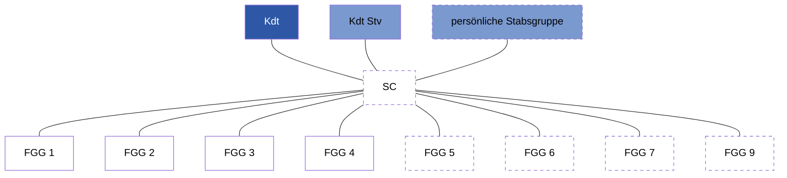
*Abb. 27: Grundgliederung Stab (schematische Darstellung)*

348 In der Einsatzgliederung ist die Stabsgliederung von Lage, Auftrag und Anspruch des Kommandanten auf Unterstützung abhängig.

349 Die gewachsene Stabsorganisation wird nicht unnötig auseinandergerissen.

### 6.3.1 Führungsgrundgebiete

350 Führungsgrundgebiete sind fachlich zusammenhängende Aufgabenbereiche, nach denen ein Stab organisatorisch gegliedert wird. Sie sind auf allen Führungsstufen mit einheitlichen Aufgabenbereichen vorhanden und dienen der Grundgliederung sowie Grundausbildung des Stabes.

351 Übersicht über die Aufgaben

<table>
  <thead>
    <tr>
        <th>Führungsgrundgebiete</th>
        <th>Aufgaben</th>
        <th></th>
    </tr>
  </thead>
  <tbody>
    <tr>
        <td>1</td>
        <td>Personelles</td>
        <td>Das Führungsgrundgebiet Personelles führt den Personaleinsatz innerhalb des Verbandes, den Seelsorgedienst für alle Unterstellten und die einsatzrechtlichen Belange.</td>
    </tr>
    <tr>
        <td>2</td>
        <td>Nachrichtendienst</td>
        <td>Das Führungsgrundgebiet Nachrichtendienst<br/>– führt das Nachrichtenzentrum;<br/>– führt die nachrichtendienstlichen Organe (Beschaffung, Auswertung und Verbreitung) des Verbandes;<br/>– führt den Nachrichtenverbund;<br/>– verarbeitet die gewonnenen Informationen im Lagebild;<br/>– unterstützt mit seinen Produkten die Führung.</td>
    </tr>
    <tr>
        <td>3</td>
        <td>Operationen bzw Einsatz</td>
        <td>Das Führungsgrundgebiet Operationen bzw Einsatz plant, führt und synchronisiert die laufende Aktion. Es beurteilt den Zustand sowie die Fähigkeiten der unterstellten Kräfte bzw Mittel. Dazu gehört grundsätzlich auch der Territorialdienst (zivil-militärische Zusammenarbeit Inland).</td>
    </tr>
  </tbody>
</table>

68

Reglement 50.040 d Führung und Stabsorganisation 17

<table>
  <thead>
    <tr>
        <th>Führungsgrundgebiete</th>
        <th>Aufgaben</th>
        <th></th>
    </tr>
  </thead>
  <tbody>
    <tr>
        <td>4</td>
        <td>Logistik</td>
        <td>Das Führungsgrundgebiet Logistik führt die logistische Unterstützung der Aktionen (Nachschub, Instandhaltung, Sanität, Verkehr und Transport, Infrastruktur). Zudem führt das Führungsgrundgebiet Logistik die Transportzentrale.</td>
    </tr>
    <tr>
        <td>5</td>
        <td>Planung</td>
        <td>Das Führungsgrundgebiet Planung plant (Folge-) Aktionen und beurteilt anhand der im Voraus bestimmten Kriterien den Erfolg. Es plant die Grund- und Einsatzbereitschaft des Verbandes.</td>
    </tr>
    <tr>
        <td>6</td>
        <td>Führungsunterstützung</td>
        <td>Das Führungsgrundgebiet Führungsunterstützung stellt die Führungsfähigkeit sicher und führt die Bereiche Führungsdienst und Führungsinfrastruktur.</td>
    </tr>
    <tr>
        <td>7</td>
        <td>Ausbildung</td>
        <td>Das Führungsgrundgebiet Ausbildung führt die Ausbildung des Verbandes zur Erstellung von Grund- und Einsatzbereitschaft und stellt über die Aktionsnachbereitung die Auswertung der Aktion sicher. Erfahrungen und Lehren fliessen wiederum in die Ausbildung.</td>
    </tr>
    <tr>
        <td>9</td>
        <td>Zivil-militärische Zusammenarbeit Ausland</td>
        <td>Das Führungsgrundgebiet zivil-militärische Zusammenarbeit Ausland führt die Zusammenarbeit mit den zivilen Leistungsbezügern im Ausland. Es beurteilt die zivile Lage und erstellt und hält die Verbindung mit den ausländischen Partnern.</td>
    </tr>
  </tbody>
</table>
*Abb. 28: Aufgabenbereiche der Führungsgrundgebiete*

352 Zusätzliche Führungsgrundgebiete oder Stabsgruppen sind, abhängig von Führungsstufe und konkreter Aktion, denkbar. Diese beraten den Kommandanten in inhaltlich geschlossenen Bereichen (z B Rechtsgrundlagen oder Doktrin) oder führen in dessen Auftrag bestimmte Aufgaben (z B Kommunikation) ausserhalb eines Führungsgrundgebietes.

353 Abhängig von Führungsstufe und Operationsraum können einzelne Führungsgrundgebiete zusammengelegt werden. Die Führung des Territorialdienstes (zivil-militärische Zusammenarbeit [ZMZ] Inland) wird in einzelnen Stäben Grosser Verbände durch andere Führungsgrundgebiete übernommen.

69

Reglement 50.040 d Führung und Stabsorganisation 17

354 Die Bezeichnung der Führungsgrundgebiete wird nach Führungsstufen und/oder Operationsräumen unterschieden:
* C (Combined) = multinational;
* J (Joint) = operationsraumübergreifend (Kdo Op);
* A (Air) = Luft (LW);
* G (Ground) = Boden (Gs Vb inkl KSK, Log Br und FU Br);
* S (Staff) = Truppenkörper.

<table>
  <thead>
    <tr>
        <th rowspan="2">Führungsgrundgebiete</th>
        <th colspan="8">Stäbe der einzelnen Führungsstufen</th>
        <th></th>
    </tr>
    <tr>
        <th>J</th>
        <th>A</th>
        <th colspan="5">G</th>
        <th>S</th>
        <th></th>
    </tr>
    <tr>
        <th></th>
        <th>Stab Kdo Op</th>
        <th>Stab LW</th>
        <th>Stab HE/<br/>Stab Mech Br</th>
        <th>Stab Ter Div</th>
        <th>Stab Kdo MP</th>
        <th>Stab FU Br</th>
        <th>Stab Log Br</th>
        <th>Stab Trp Kö</th>
        <th></th>
    </tr>
  </thead>
  <tbody>
    <tr>
        <td>1</td>
        <td>Personelles</td>
        <td>[x]</td>
        <td>[x]</td>
        <td>[x]</td>
        <td>[x]</td>
        <td>[x]</td>
        <td>[x]</td>
        <td>[x]</td>
        <td>[x]</td>
    </tr>
    <tr>
        <td>2</td>
        <td>Nachrichtendienst</td>
        <td>[x]</td>
        <td>[x]</td>
        <td>[x]</td>
        <td>[x]</td>
        <td>[x]</td>
        <td>[x]</td>
        <td>[x]</td>
        <td>[x]</td>
    </tr>
    <tr>
        <td>3</td>
        <td>Operationen bzw Einsatz</td>
        <td>[x]</td>
        <td>[x]</td>
        <td>[x]</td>
        <td>[x]</td>
        <td>[x]</td>
        <td>[x]</td>
        <td>[x]</td>
        <td>[x]</td>
    </tr>
    <tr>
        <td>4</td>
        <td>Logistik</td>
        <td>[x]</td>
        <td>[x]</td>
        <td>[x]</td>
        <td>[x]</td>
        <td>[x]</td>
        <td>[x]</td>
        <td>[x]</td>
        <td>[x]</td>
    </tr>
    <tr>
        <td>5</td>
        <td>Planung</td>
        <td>[x]</td>
        <td>[x]</td>
        <td>[x]</td>
        <td>[x]</td>
        <td>[x]</td>
        <td>[x]</td>
        <td>[x]</td>
        <td>[x]</td>
    </tr>
    <tr>
        <td>6</td>
        <td>Führungsunterstützung</td>
        <td>[x]</td>
        <td>[x]</td>
        <td>[x]</td>
        <td>[x]</td>
        <td>[x]</td>
        <td>[x]</td>
        <td>[x]</td>
        <td>[x]</td>
    </tr>
    <tr>
        <td>7</td>
        <td>Ausbildung</td>
        <td>[x]</td>
        <td>[x]</td>
        <td>[x]</td>
        <td>[x]</td>
        <td>[x]</td>
        <td>[x]</td>
        <td>[x]</td>
        <td>[x]</td>
    </tr>
    <tr>
        <td>9</td>
        <td>ZMZ Ausland</td>
        <td>[x]</td>
        <td>[ ]</td>
        <td>[ ]</td>
        <td>[ ]</td>
        <td>[x]</td>
        <td>[ ]</td>
        <td>[ ]</td>
        <td>[ ]</td>
    </tr>
    <tr>
        <td></td>
        <td>KTVS</td>
        <td>[ ]</td>
        <td>[ ]</td>
        <td>[ ]</td>
        <td>[x]</td>
        <td>[ ]</td>
        <td>[ ]</td>
        <td>[ ]</td>
        <td>[ ]</td>
    </tr>
  </tbody>
</table>

International besetzte Stäbe können weitere Führungsgrundgebiete (z B FGG 8: Finanzen) aufweisen.
Einzelne Führungsgrundgebiete können führungsstufenabhängig zusätzliche Aufgaben übernehmen.

<description>
Dashed blue lines in the table indicate possible merging of functional areas (FGG):
- In the "Stab Kdo Op" column, FGG 3, 5, 7, and 9 are grouped together.
- In the "Stab Kdo MP" and "Stab FU Br" columns, FGG 3, 5, and 7 are grouped together.
- In the "Stab Trp Kö" column, FGG 3, 4, 5, 6, and 7 are grouped together.
</description>

-------- mögliche Zusammenlegung der FGG

*Abb. 29: Gliederung der Führungsgrundgebiete*

### 6.3.2 Funktionsbeschreibung

355 Um den Kommandanten in seiner Aufgabe zu unterstützen, sind ihm führungsstufenabhängig unterstellt:
* **Kommandant-Stellvertreter**, der den Kommandanten in allen Aufgaben und Kompetenzen vertritt, wenn dieser nicht erreichbar ist und das Warten auf die Rückkehr des Kommandanten nicht verantwortet werden kann;
* **Persönliche Stabsgruppe**, d h eine Anzahl besonders qualifizierter Führungsgehilfen, die unter der direkten Führung des Kommandanten arbeitet;
* **Stabschef**, der die Arbeit aller Führungsgrundgebiete und Stabsteile mit ihren Chefs koordiniert und kontrolliert.

356 Über die Expertise der Führungsgrundgebiete hinaus kann es erforderlich sein, spezielle Aufgaben durch besondere Stabsangehörige wahrnehmen zu lassen. Diese können in der persönlichen Stabsgruppe zusammengefasst und unmittelbar dem Kommandanten unterstellt sein.

70

Reglement 50.040 d Führung und Stabsorganisation 17

### 357 Kommandant

<table>
  <tbody>
    <tr>
        <td>Aufgabe</td>
        <td>Der Kommandant setzt seinen Verband zur Auftragserfüllung ein.</td>
    </tr>
    <tr>
        <td>Verantwortung</td>
        <td>Er allein ist verantwortlich für Führung, Ausbildung und Erziehung seines Verbandes. Insbesondere verantwortet er das rechtmässige, korrekte Verhalten aller Unterstellten, Moral, Gesundheit und Wohlergehen seiner Truppe. Die Personalplanung und die Kommunikation mit seinem Verband liegen ebenso in seiner Verantwortung.</td>
    </tr>
    <tr>
        <td>Kompetenzen</td>
        <td>Der Kommandant führt Aktionen, kann die Verantwortung für die Lageverfolgung übernehmen und lässt sich dazu von seinem Stab beraten. Er ist der Inhaber der Kommandogewalt über seinen Verband und befehligt alle Unterstellten, um die Ziele zu erreichen.</td>
    </tr>
    <tr>
        <td>Besonderes</td>
        <td>Der Kommandant kann Aufgaben und Kompetenzen delegieren (nicht aber die Verantwortung).</td>
    </tr>
  </tbody>
</table>

### 358 Kommandant-Stellvertreter

<table>
  <tbody>
    <tr>
        <td>Aufgabe</td>
        <td>Der Kommandant-Stellvertreter übernimmt Aufgaben nach Vorgabe des Kommandanten. Abhängig von der Führungsstufe nimmt er gleichzeitig die Funktion des Stabschefs wahr.</td>
    </tr>
    <tr>
        <td>Verantwortung</td>
        <td>Der Kommandant-Stellvertreter hält sich bei seinem Kommandanten über alle anstehenden Arbeiten unaufgefordert auf dem Laufenden und verfügt über die notwendigen Kenntnisse. Der Kommandant-Stellvertreter hält sich bereit, die Verantwortung für die Lageverfolgung oder eine neue Aktionsplanung zu übernehmen. Er führt in der Regel das Risikomanagement und die Aktionsnachbereitung.</td>
    </tr>
    <tr>
        <td>Kompetenzen</td>
        <td>Der Kommandant-Stellvertreter vertritt den Kommandanten in allen Aufgaben und Kompetenzen, wenn dieser nicht erreichbar ist und das Warten auf die Rückkehr des Kommandanten nicht verantwortet werden kann.</td>
    </tr>
    <tr>
        <td>Besonderes</td>
        <td>Der Kommandant bezeichnet weitere Aufgaben und Kompetenzen seines Stellvertreters. Insbesondere regelt er dessen Beziehungen zum Stabschef, zu den Stabsmigliedern und zu den unterstellten Kommandanten.<br/>Auf Stufe Truppenkörper vertritt der Kommandant-Stellvertreter einerseits den Kommandanten und steuert, koordiniert und kontrolliert andererseits die Arbeit des Stabes (als Stabschef).</td>
    </tr>
  </tbody>
</table>

### 359 Stabschef

<table>
  <tbody>
    <tr>
        <td>Aufgabe</td>
        <td>Der Stabschef ist für die Stabssteuerung zuständig. Er ist erster und engster Berater des Kommandanten und diesem gegenüber für die Funktionsfähigkeit des Stabes verantwortlich.</td>
    </tr>
    <tr>
        <td>Verantwortung</td>
        <td>Der Stabschef hält sich bei seinem Kommandanten über alle anstehenden Arbeiten unaufgefordert auf dem Laufenden und verfügt über die notwendigen Kenntnisse. Der Stabschef hält sich bereit, die Verantwortung für die Lageverfolgung oder eine neue Aktionsplanung zu übernehmen.</td>
    </tr>
    <tr>
        <td>Kompetenzen</td>
        <td>Der Stabschef führt den Stab und die Stabsarbeit.</td>
    </tr>
    <tr>
        <td>Besonderes</td>
        <td>Der Stabschef fällt bei Unerreichbarkeit von Kommandant und Kommandant-Stellvertreter die notwendigen Entscheide im Rahmen der laufenden Aktion.</td>
    </tr>
  </tbody>
</table>

71

Reglement 50.040 d Führung und Stabsorganisation 17

### 360 Chef Führungsgrundgebiet (Unterstabschef)

<table>
  <tbody>
    <tr>
        <td>Aufgabe</td>
        <td>Der Chef Führungsgrundgebiet führt sein Führungsgrundgebiet und berät den Kommandanten und den Stabschef.</td>
    </tr>
    <tr>
        <td>Verantwortung</td>
        <td>Der Chef Führungsgrundgebiet leitet die Arbeiten in seinem Führungsgrundgebiet und verantwortet die Aus- und Weiterbildung der unterstellten Dienstchefs. Er koordiniert die Arbeiten in seinem Führungsgrundgebiet mit den anderen Chefs Führungsgrundgebiet. Der Chef Führungsgrundgebiet hält sich bereit, einen Stabsteil zu führen oder Projekte/besondere Aufgaben zu übernehmen.</td>
    </tr>
    <tr>
        <td>Kompetenzen</td>
        <td>Der Chef Führungsgrundgebiet führt sein Führungsgrundgebiet und die damit verbundenen Arbeiten.</td>
    </tr>
    <tr>
        <td>Besonderes</td>
        <td>Der Chef Führungsgrundgebiet kann vom Kommandanten oder Stabschef Entscheidungskompetenz und Befehlsgewalt delegiert erhalten. Aufgrund seiner Ausbildung versteht er seinen Aufgabenbereich im Gesamtzusammenhang (Generalist).</td>
    </tr>
  </tbody>
</table>

### 361 Dienstchef

<table>
  <tbody>
    <tr>
        <td>Aufgabe</td>
        <td>Der Dienstchef ist ein Führungsgehilfe mit der Verantwortung für seinen Dienst oder Fachbereich (z B ABC-Abwehr, Genie, Artillerie).</td>
    </tr>
    <tr>
        <td>Verantwortung</td>
        <td>Der Dienstchef verantwortet seinen Dienst oder Fachbereich im entsprechenden Führungsgrundgebiet gegenüber seinem Vorgesetzten und erstellt für seinen Dienst oder Fachbereich Konzepte und Befehle. Er führt die Ausbildungskontrolle seines Dienst oder Fachbereichs und stellt die fachtechnische Aus- und Weiterbildung der unterstellten Verbände sicher.</td>
    </tr>
    <tr>
        <td>Kompetenzen</td>
        <td>Der Dienstchef führt die technische Ausbildung für seinen Dienst oder Fachbereich und berät unterstellte Spezialisten im Einsatz und in der Ausbildung.</td>
    </tr>
    <tr>
        <td>Besonderes</td>
        <td>Der Dienstchef kann als Stellvertreter seines Chefs des Führungsgrundgebietes eingesetzt werden. Aufgrund seiner Ausbildung kennt er seinen Dienst oder Fachbereich in der ganzen Tiefe (Spezialist).</td>
    </tr>
  </tbody>
</table>

### 362 Führungsgehilfe

<table>
  <tbody>
    <tr>
        <td>Aufgabe</td>
        <td>Der Führungsgehilfe ist Berater des Chefs eines Führungsgrundgebietes oder eines Dienstchefs.</td>
    </tr>
    <tr>
        <td>Verantwortung</td>
        <td>Der Führungsgehilfe arbeitet im Auftrag seines Vorgesetzten.</td>
    </tr>
    <tr>
        <td>Kompetenzen</td>
        <td>Der Führungsgehilfe erhält Kompetenz(en) nach Massgabe von Aufgabe, Erfahrung, Eignung, Gelegenheit und/oder Notwendigkeit.</td>
    </tr>
    <tr>
        <td>Besonderes</td>
        <td>Der Führungsgehilfe kann als Stellvertreter seines Dienstchefs eingesetzt werden.<br/>Abhängig von der Führungsstufe ist es angezeigt, einzelne Führungsgehilfen in einer persönlichen Stabsgruppe direkt dem Kommandanten zu unterstellen, z B den Offizier Recht, den Chef Kommunikation.</td>
    </tr>
  </tbody>
</table>

72

Reglement 50.040 d Führung und Stabsorganisation 17

### Generalstabsoffizier

363 Der Generalstabsoffizier ist ein Führungsgehilfe mit besonderer Selektion und Ausbildung und verfügt über umfassende militärische Kenntnisse und Verständnis für grössere Zusammenhänge.

364 In Stäben ab Grosser Verband sind bestimmte Funktionen für Generalstabsoffiziere vorgesehen. Sie sind befähigt, als Stabschefs, Unterstabschefs, Chefs von Stabsteilen, Stabsgruppen oder Arbeitsgruppen, Zielvorgaben und Aufträge ihres Kommandanten umzusetzen und auszuführen.

### 6.3.3 Stabsteile

365 Die Gliederung in Führungsgrundgebiete erlaubt, den Stab mit einfachen Massnahmen für bestimmte Aufgaben oder Aktionen zu gliedern, d h von der Grundgliederung in eine Einsatzgliederung zu überführen. Diese Umgliederung führt von Führungsgrundgebieten zu Stabsteilen.

366 Ein Stabsteil wird von einem Chef geführt (in der Regel der Chef eines Führungsgrundgebietes) und umfasst Vertreter mehrerer Führungsgrundgebiete. Der Stabschef koordiniert und synchronisiert die Tätigkeiten der verschiedenen Stabsteile.

367 Den Entscheid für die Einsatzgliederung fällt der Stabschef in Rücksprache mit dem Kommandanten als Resultat der Problemerfassung.

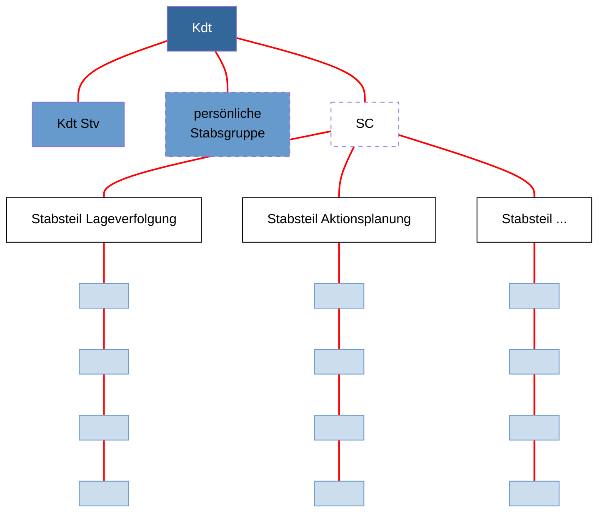

*Abb. 30: Einsatzgliederung eines Stabes mit Stabsteilen (schematische Darstellung)*

73

Reglement 50.040 d Führung und Stabsorganisation 17

368 Lage, Auftrag und Führungsstufe bestimmen Umfang und Anpassung des Stabes an die verschiedenen gestellten Aufgaben (z B Lageverfolgung, Aktionsplanung und Aktionsnachbereitung). Die Stabsgliederung muss immer die Bewältigung zusätzlicher Aufgaben ermöglichen (z B Folgeplanung).

### 6.3.4 Führungsrhythmus

369 Der Kommandant regelt über seine Verfügbarkeit den Führungsrhythmus in der Aktion. Der darin enthaltene Entscheidungszyklus ist abhängig von Schwierigkeitsgrad und Anzahl einbezogener oder betroffener Beteiligten über die eingesetzten Führungsstufen.

370 Die führungsstufenübergreifende zeitliche Steuerung der (Führungs-) Tätigkeiten ermöglicht den Kommandanten und seinen Stab, die eigenen (Führungs-) Tätigkeiten mit denjenigen der Vorgesetzten und Unterstellten abzugleichen.

371 Eigene fortwährende Aktionsführung, koordinierende Aktionsführung und weiterführende Aktionsplanung sowie Zeitpunkte und Art der Rapporte, Gruppenarbeiten und Ablösungen werden zur Übereinstimmung gebracht. Teilstäbe und Arbeitsgruppen können ihre (Führungs-) Tätigkeiten aufeinander abstimmen, Vorgesetzte und Unterstellte ihre Aktionsplanung im Rahmen des gesamtheitlichen Ansatzes zeitgerecht abgleichen.

372 Abhängig von Führungsstufe und Aktion wird der Zeitablauf in regelmässige Abschnitte unterteilt (Stunden, Tage, Wochen). Der einmal festgelegte Führungsrhythmus wird nur geändert, wenn die Aktion das verlangt. Der Kommandant entscheidet, ob alle bestimmten abgleichenden Tätigkeiten wahrgenommen werden.


**Legende**
— Vorgesetzter <mark>——</mark> Kommandant/Stv <mark>——</mark> Stab/SC <mark>——</mark> Unterstellte ● Gruppenarbeit ● Rapport

*Abb. 31: Führungsrhythmus (Prinzipdarstellung)*

74

Reglement 50.040 d Führung und Stabsorganisation 17

# 7 Führungsunterstützung

373 Führungsunterstützung ist die Gesamtheit der Mittel und Verfahren zur Sicherstellung der Führungsfähigkeit. Sie umfasst den Führungsdienst und die Führungsinfrastruktur. Die Führungsunterstützung lässt sich folglich nicht auf rein technische Aspekte beschränken.

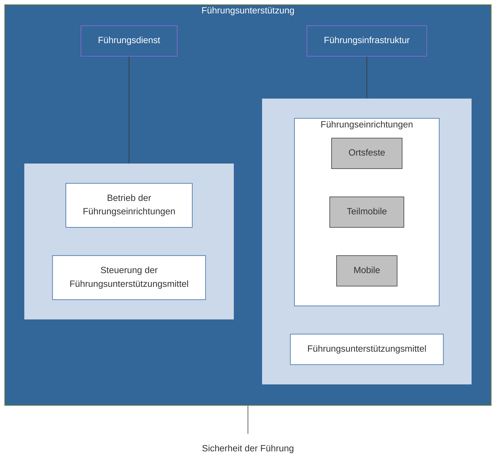
*Abb. 32: Gliederung der Führungsunterstützung*

## 7.1 Führungsdienst

374 Führungsdienst ist die Gesamtheit der organisatorischen und technischen Massnahmen, die es dem Kommandanten und seinem Stab ermöglichen, ihren Verband zu führen.

375 Der Führungsdienst stellt mittels Supportleistungen den reibungslosen Ablauf der militärischen Führung sicher. Er umfasst den Betrieb der Führungseinrichtungen und die Steuerung der Führungsunterstützungsmittel.

376 Führungsunterstützende Tätigkeiten sind:
* Bereitstellen des technischen Umfeldes (Räumlichkeiten, Verbindungen und Anderes);
* Steuerung der Gesamtheit aller Tätigkeiten;
* Steuerung von Informationseingang, Informationsverbreitung und Informationsausgang im Führungsraum, beinhaltend:
    - physischer und elektronischer Informations- und Dokumentenfluss innerhalb des Stabes und nach aussen;

75

Reglement 50.040 d Führung und Stabsorganisation 17

*   – Führen des Dokumentenmanagements (Organisation Akten- und Datenmanagement inkl Triage und Datenschutz);
*   Erbringen von umfassenden Dienstleistungen für optimale Rahmenbedingungen der Stabsarbeit (z B Büroinformatikmittel, Kanzlei, Disposition von Arbeits- und Rapporträumen, Sicherstellen der Erreichbarkeit des Stabes).

377 Bei der Beurteilung der Lage im Bereich Führungsdienst wird insbesondere berücksichtigt:
*   alle verfügbare Führungsunterstützungsmittel und Verbindungsorgane;
*   die Bedrohung im Elektromagnetischen Raum bezogen auf die eingesetzten funkbasierten Führungsunterstützungsmittel;
*   die Bedrohung im Cyber-Raum bezogen auf die eingesetzten Führungsunterstützungsmittel.

378 Die stabsinterne Umsetzung des Führungsdienstes (**interner Führungsdienst**) gewährleistet den reibungslosen und koordinierten Ablauf der (Führungs-) Tätigkeiten im Stab und kann in der Stabsdienstordnung geregelt werden. Der **externe Führungsdienst** stellt die Führung über die Führungsstufen wie auch mit externen Partnern sicher und wird in der Befehlsausgabe geregelt.

379 Der Führungsdienst erarbeitet im Rahmen seiner Eventualplanung die notwendigen Vorkehrungen, damit bei einem Totalausfall der wesentlichen Führungsunterstützungsmittel und Führungseinrichtungen die Führung sichergestellt werden kann. Er stellt die dafür notwendige Ausbildung sicher.

## 7.2 Führungsinfrastruktur

380 Führungsinfrastruktur ist die Gesamtheit der Führungseinrichtungen und Führungsunterstützungsmittel, die der Kommandant und sein Stab zur Führung ihres Verbandes benötigen. Sie ist die notwendige materielle Voraussetzung für die Führungsfähigkeit.

### 7.2.1 Führungseinrichtungen

381 Die Führungsinfrastruktur wird modular aufgebaut und setzt sich sowohl aus ortsfesten als auch teilmobilen und mobilen Führungseinrichtungen zusammen.

382 Führungseinrichtungen verlangen einsatzbezogene Schutzmassnahmen. Die Aufklärungsfähigkeit moderner Gegner verlangt umfassende Tarn- und Täuschungsmassnahmen, denen sowohl bei Verschiebungen als auch beim Betrieb der Führungseinrichtungen besondere Beachtung gebührt. Schutz

76

Reglement 50.040 d Führung und Stabsorganisation 17

ausserhalb von Anlagen wird auch durch Auflockerung (Verteilung von Einrichtungen im Gelände) erreicht.

383 Der Kommandant entscheidet aufgrund von Auftrag, Lage, Erfahrung und persönlicher Befindlichkeit sowie nach Massgabe der technischen Möglichkeiten, aus welcher Führungseinrichtung geführt wird.

384 Solange redundante Verbindungen zu Vorgesetzten, Nachbarn, Partnern und Unterstellten aufgebaut werden können, soll aus der bestmöglichen, geschützten Führungseinrichtung geführt werden.

385 Die Führungsunterstützungsmittel werden in der Regel erst nach Bereitstellung der Führungseinrichtungen installiert.

**Ortsfeste Führungseinrichtungen**

386 Führungseinrichtungen in vorbereiteten Anlagen bezeichnet man als ortsfest. In diesen sind Führungsunterstützungsmittel teilweise fest eingebaut und damit permanent verfügbar. Ortsfeste Führungseinrichtungen werden Verbänden zugewiesen.

**Teilmobile Führungseinrichtungen**

387 Führungseinrichtungen in nicht vorbereiteter Infrastruktur sind mit verbandseigener Ausrüstung einzurichten, zu vernetzen und zu verstärken. Sie stehen erst nach Aufbau und Inbetriebnahme zur Verfügung. Planung und Umsetzung erfolgen eigenständig durch die Verbände.

**Mobile Führungseinrichtungen**

388 Mobile Führungseinrichtungen sind mit motorisierten oder mechanisierten Mitteln ausgerüstete Führungs- oder Kommandantenstaffeln. Aufgrund ihrer Gesamtausrüstung sind sie in der Lage, selbständig zu verschieben und während der Verschiebung oder nach kurzer Zeit am neuen Standort die Führung wahrzunehmen.

389 Weil in der Bewegung keine breitbandigen Verbindungsmittel zur Verfügung stehen, bestehen bezüglich der elektronischen Erstellung und Nachführung von Lagedarstellungen Einschränkungen.

390 Mobile Führungseinrichtungen oder Teile davon können auch in Kombination mit ortsfesten oder teilmobilen Führungseinrichtungen eingesetzt werden.

77

Reglement 50.040 d Führung und Stabsorganisation 17

## Hauptquartier


*Abb. 33: Elemente des Hauptquartiers*

391 Das Hauptquartier auf Stufe Grosser Verband besteht aus:
* Kommandoposten;
* Führungsunterstützungsmitteln;
* Betriebseinrichtungen und Unterkünften;
* externen Einrichtungen;
* Schutzelementen.

392 Die Organisation des Hauptquartiers ermöglicht dem Stab, über längere Zeit darin zu leben und zu arbeiten. Ein Hauptquartier unterscheidet äussere und innere Organisation.

393 Für die **innere Organisation** ist der Unterstabschef Führungsunterstützung nach Weisung des Stabschefs verantwortlich. Zur inneren Organisation gehören:
* technische Vernetzung (Strom, Netzwerk) der Einrichtungen (Räume, Geräte);
* Einrichtung der Arbeitsräume;

78

Reglement 50.040 d Führung und Stabsorganisation 17

*   Schutz und Sicherheit;
*   Steuerung des Informationsflusses im Stab und nach aussen (Triage);
*   Steuerung der inneren Betriebsabläufe (KP-Betriebsbereitschaftsgrade, Zutrittskontrolle, Verpflegung, Führungsrhythmus usw).

Dienstbetrieblich führt der Kommandant der Führungsunterstützungs-, Hauptquartier- bzw Stabsformation seinen Verband.

394 Für die **äussere Organisation** ist der Kommandant der zuständigen Führungsunterstützungs-, Hauptquartier- bzw Stabsformation nach Weisung des Kommandanten des Grossen Verbands verantwortlich. Zur äusseren Organisation gehören:
*   Einweisung, Verkehrsregelung und Empfang;
*   Fahrzeugparkplatz, Helikopter-Landeplatz, Begleitung in die Kommandoposten;
*   Tarnung, Schutz und Ordnung im Raum des Hauptquartiers, Vor- und Zutrittskontrollen zu den Kommandoposten (Aussenschutz);
*   Logistik und Sanität;
*   Alarmorganisation und -dispositiv zum Schutz des Hauptquartiers.

395 Der Standort des Hauptquartiers wird festgelegt nach Massgabe von:
*   Bedrohung und Gefahren;
*   Art, Umfang und Dauer der Aktion;
*   Einsatzraum und Gelände;
*   Bedingungen für die Informations- und Kommunikationssysteme;
*   Verkehrslage;
*   Auflockerungs- und Schutzmöglichkeiten;
*   Lebens- und Arbeitsbedingungen für Führungs- und Betriebspersonal;
*   zur Verfügung stehender standortbezogener Infrastruktur.

**Kommandoposten**

396 Der Kommandoposten ist eine ortsfeste oder teilmobile Führungseinrichtung, die dem Kommandanten und seinem Stab Schutz und günstige Bedingungen für die Führung ihres Verbandes verschafft. Dessen Organisation muss es dem Stab ermöglichen, über längere Zeit darin zu leben und zu arbeiten. Der Kommandoposten ist beim Grossen Verband Teil des Hauptquartiers.

79

Reglement 50.040 d Führung und Stabsorganisation 17

397 Im Kommandoposten arbeiten:
* der Kommandant und sein Stab;
* Verbindungsorgane des vorgesetzten Verbandes, der unterstellten Verbände und der Partnerorganisationen;
* Betriebspersonal.

398 Im Kommandoposten verfügt der Stab für die Führung der Aktion über die notwendige Infrastruktur, die Informationen sowie die entsprechenden personellen und materiellen Mittel (Führungsunterstützungsmittel).


Abb. 34: Elemente des Kommandopostens (schematische Darstellung)

399 Der Kommandoposten besteht aus:
* Führungsraum;
* Nachrichtenzentrum;
* Rapportraum;
* Arbeitsräumen des Kommandanten und der Führungsgrundgebiete bzw Stabsteile;
* Arbeitsraum des Chefs Triage;
* Kanzlei;
* Führungsunterstützungsmitteln;
* Betriebseinrichtungen und Unterkünften.

80

Reglement 50.040 d Führung und Stabsorganisation 17

### Führungsraum

400 Der Führungsraum ist der Teil des Kommandopostens, in dem die Lage verfolgt und die Aktion geführt wird. Zweck des Führungsraumes ist es, dauernd und umfassend die Lage verfolgen und Steuerungsmassnahmen auslösen zu können.

401 Der Führungsraum befindet sich im eigentlichen Führungsteil des Kommandopostens. Dieser Teil ist durch eine einschränkendere Zutrittsregelung gegenüber den übrigen Teilen des Kommandopostens abgegrenzt.

402 Die Besetzung des Führungsraumes ist abhängig vom Kommandanten, von der zu erfüllenden Aufgabe, von der Lage im Einsatzraum und dem Durchhaltebedürfnis.

### Nachrichtenzentrum

403 Das Nachrichtenzentrum ist sowohl Führungs- als auch Produktionszentrum des Nachrichtendienstes. In ihm wird die Lage nachrichtendienstlich verfolgt und laufen Nachrichten und Informationen von Quellen und Sensoren zusammen. Von ihm laufen nachrichtendienstliche Produkte und Aufträge zu diesen zurück. Es ist die Schnittstelle vom Nachrichtendienst zur Führung der Aktion im Führungsraum.

### Führungsstaffel

404 Die Führungsstaffel ist die mobile Führungseinrichtung mit reduzierten Führungsunterstützungsmitteln, die dem Kommandanten und einem ausgesuchten Stabsteil ermöglicht, die Aktion während der Bewegung zu führen.

405 Die Führungsstaffel gestattet die geschützte, selbständige Verschiebung. Der Kommandant nützt dies, um ohne personelle Ablösung die laufende Aktion aus diesen Fahrzeugen heraus zu führen.

406 Die Führungsstaffel wird beim Übergang zum beweglichen Einsatz aus dem Kommandoposten ausgegliedert. Nach kurzer Anlaufzeit, während der die Führung noch durch den Kommandoposten gewährleistet wird, übernimmt die Führungsstaffel die Führung.

407 Der Kommandoposten als solcher bleibt entweder bestehen und wird mit reduziertem Personal als rückwärtiger Kommandoposten zur Unterstützung der laufenden Aktion und zur Folgeplanung genutzt, oder er wird abgebaut und verschoben.

408 Die Führungsstaffel als Einrichtung wird durch einen speziell bezeichneten Chef befehligt. Dieser ist – in Absprache mit dem Kommandanten – verantwortlich für:
* die technisch-taktische Abwicklung des Marsches auf der Führungsachse;
* die Sicherstellung der Führungsfähigkeit im gesicherten Halt an den vom Kommandanten vorbezeichneten oder situativ angeordneten Standorten.

81

Reglement 50.040 d Führung und Stabsorganisation 17

409 Sollte die Führungsstaffel in ein Gefecht verwickelt werden, wird die Kampfführung durch den Chef der eskortierenden Schutzelemente übernommen.

410 Die Positionierung der Führungsstaffel ist ein Kompromiss zwischen:
* Führung von vorne;
* Sicherstellung der technischen Verbindungen;
* Einblick in den Hauptabschnitt der Aktion;
* Schutz und Tarnung;
* günstigen Arbeitsverhältnissen.

**Kommandantenstaffel**

411 Die Kommandantenstaffel ist die mobile Führungseinrichtung, die es nach kurzer Vorbereitung dem Kommandanten ermöglicht, sich von wenigen Führungsgehilfen begleitet zu verschieben, wenn die Lage dies für die gesamte Führungsstaffel verunmöglicht oder nicht erfordert.

412 Die Kommandantenstaffel soll dem Kommandanten und seinen Bedürfnissen entsprechen. Sie hat zum Zweck, dem Kommandanten das Verlassen des Kommandopostens bzw der Führungsstaffel zu ermöglichen, um im Rahmen der Führung:
* den direkten Kontakt mit dem Vorgesetzten zu ermöglichen;
* den direkten Kontakt mit den unterstellten und benachbarten Kommandanten sowie den Partnern herzustellen;
* einen persönlichen Eindruck vom Einsatzraum, dem tatsächlichen Verlauf der Aktion und der Truppe zu erhalten.

**Verschiebung von Führungseinrichtungen**

413 Die Verschiebung des Hauptquartiers bzw Kommandopostens erfolgt möglichst ohne oder mit nur minimalem Unterbruch der Stabsarbeit. Es ist anzustreben, dass während der Verschiebungsphase die Führungsfähigkeit und die Lageverfolgung stets – wenn auch reduziert – aufrechterhalten bleiben.

414 Die Verschiebung von Führungseinrichtungen erfordert eine sorgfältige Beurteilung der Lage und richtet sich nach folgenden Kriterien:
* aktueller Führungsbedarf;
* konkrete Bedrohung und Gefahren;
* Verfügbarkeit der Führungsunterstützungsmittel;
* Absicht des Kommandanten.

415 Als Führungswechsel wird die Übergabe der Führungsverantwortung von einem Führungsstandort zum folgenden bezeichnet. Führungswechsel finden geführt statt und – wenn immer möglich – nach im Voraus bestimmtem Zeitplan.

82

Reglement 50.040 d Führung und Stabsorganisation 17

416 Der geplante, allfällig entstehende, (technische) Führungsunterbruch muss von kurzer Dauer sein.

### 7.2.2 Führungsunterstützungsmittel

417 Die Führungsunterstützungsmittel sind Teil der Führungsinfrastruktur. Sie ermöglichen die Nutzung von Diensten (Services) und Anwendungen und stellen Daten bereit. Die Führungsunterstützungsmittel umfassen Führungsinformationssysteme, Fachsysteme, allgemeine Büroinformatikmittel und Verbindungsmittel:
* Führungsinformationssysteme unterstützen den Kommandanten und seinen Stab in ihren Führungsaufgaben, insbesondere beim Zusammenführen, Aufbereiten, Interpretieren, Präsentieren sowie Verbreiten von Informationen;
* Fachsysteme ermöglichen die Unterstützung fachspezifischer Aufgaben oder die Führung des Mitteleinsatzes. Informationsbeschaffungssysteme sind eine besondere Form der Fachsysteme;
* Allgemeine Büroinformatikmittel sind Mittel, um Dokumente im Rahmen einer reinen Büroanwendung zu erstellen, zu bearbeiten, auszutauschen und zu verwalten. Sie können für die Führung genutzt werden, solange ihre üblicherweise nicht speziell gehärtete Ausgestaltung (Endgeräte, Dienste) dies zulässt;
* Verbindungsmittel umfassen die technischen Anteile der Mittel zur Informationsübertragung. Der Kommandant setzt alles daran, die Verbindungen zu seinen Unterstellten sicherzustellen.

418 Einzelne Anwendungen (Fachanwendungen und allgemeine Büroanwendungen) können je nach Anforderungen auf Führungsinformationssystemen, Fachsystemen oder allgemeinen Büroinformatikmitteln zur Verfügung gestellt werden.

419 Zur Gewährleistung der Führungsfähigkeit sind für den ungehinderten Fluss von Informationen armeeeigene, leistungsfähige und geschützte Führungsunterstützungsmittel mit hoher Verfügbarkeit und Redundanz notwendig. Gleichzeitig werden alle vorhandenen und in der aktuellen Aktion verfügbaren kommerziellen Ressourcen genutzt. Dabei ist der Einhaltung der Informationsschutzvorschriften besondere Beachtung zu schenken.

420 Führungsunterstützungsmittel sind in übergeordnete Dienste (Services) eingebunden. Jede technische oder örtliche Veränderung beeinflusst die Anbindung direkt und verändert die Fähigkeit des Gesamtsystems. Daher erfordert der Einsatz von Führungsunterstützungsmitteln eine umsichtige integrale Planung unter Miteinbezug aller beteiligten Stellen.

83

Reglement 50.040 d Führung und Stabsorganisation 17

## 7.3 Sicherheit der Führung

421 Der Kommandant und sein Stab müssen sich bewusst sein, dass die Führung mit ihren Einrichtungen jederzeit ein Ziel gegnerischer Handlungen sein kann. Daher ist es entscheidend, den Schutz der eigenen Führung in den Bereichen Informations-, Personen-, System-, Betriebs- und Anwendungssicherheit mit hoher Priorität durchzusetzen.

422 Es geht deshalb darum, Fragen zu stellen und die Konsequenzen aus negativen oder unzureichenden Antworten rasch und jederzeit in Massnahmen umzusetzen:

*   **Informationssicherheit:** Wie sicher sind die eigenen Informationen? Entspricht der Schutz von Datenträgern, Printmedien und Datenverarbeitungsgeräten dem geforderten Schutz der Informationen? Sind Vertraulichkeit, Integrität, Verfügbarkeit und Nachvollziehbarkeit entsprechend der Anforderungen gewährleistet?
*   **Personensicherheit:** Sind die Personen und ihr Umfeld so geschützt, dass sie ihre Arbeit zielgerichtet erfüllen können, ohne Erpressung und ohne selber manipuliert zu werden? Ist ihre Integrität, Loyalität und Authentizität gewährleistet?
*   **Systemsicherheit:** Wird der Grundschutz Bund eingehalten? Sind die eigenen Systeme (Informations- und Kommunikationssysteme) jederzeit funktionstüchtig, bedient, gewartet und angemessen geschützt?
*   **Betriebssicherheit:** Ist die Infrastruktur für die Auftragserfüllung geeignet? Kann der nötige Schutzbedarf für Personal und Sachwerte sichergestellt werden? Entspricht die Verfügbarkeit von Strom, Wasser, Luft und Kommunikationsmitteln den Anforderungen für die geplante Aktion?
*   **Anwendungssicherheit** (operationelle Sicherheit): Sind die eigenen Tätigkeiten so geschützt, dass der Gegner diese nicht oder nur mit unverhältnismässig hohem Aufwand identifizieren und orten sowie die eigene Absicht nicht aufgrund einzelner Informationen (auch nicht KLASSIFIZIERTER) rekonstruieren kann?

84

Reglement 50.040 d Führung und Stabsorganisation 17

# Anhang 1

## Befehlsstruktur und Befehlsart

Unabhängig von der Art oder der Führungsstufe sind Befehle in ihrer allgemeinen Struktur immer gleich. Sie sind grundsätzlich in fünf Punkte gegliedert.

### Befehlsstruktur

#### 1 Orientierung

Die Orientierung erläutert den Unterstellten das für die Auftragserfüllung relevante Umfeld. Führungsstufenbezogen aufbereitet wird hier über die Lage, die Absicht und Vorgaben der vorgesetzten Kommandostelle, den eigenen Auftrag und die eigenen Kräfte bzw Mittel sowie diejenigen der Nachbarn und Partner orientiert. Der Kommandant gibt hier mit eigenen Worten sein Verständnis des erhaltenen Auftrags bekannt.

#### 2 Absicht

Die Absicht ist der zentrale Teil des Befehls und beschreibt den räumlich-zeitlichen Ablauf und damit das Zusammenwirken der Kräfte bzw Mittel über den gesamten Ablauf der Aktion.

Die Absicht zeigt den Unterstellten den angestrebten Endzustand einer Aktion auf sowie die Zusammenhänge der einzelnen Teilaktionen und die Koordination der Einsatzunterstützung.

Für die Formulierung seiner Absicht verwendet der Kommandant klar definierte und einheitlich verstandene Begriffe.

Der Kommandant erläutert in der Regel anhand einer Darstellung seine Absicht und gibt die wesentlichen Überlegungen bekannt, die zu seinem Entschluss geführt haben.

#### 3 Auftrag

Die Formulierung der Aufträge richtet sich nach folgenden Grundsätzen:

*   Sie stützt sich auf klar definierte und einheitlich verstandene Begriffe;
*   Gemäss dem Prinzip der Auftragstaktik ist eine maximale Handlungsfreiheit einzuräumen;
*   Während die Absicht in der Regel die gesamte Aktion beschreibt, können Aufträge oft nur für die erste Phase erteilt werden;
*   Bei länger dauernden Aktionen wird durch die gestaffelte Befehlsausgabe mit Teilaufträgen die Flexibilität und Handlungsfreiheit erhöht.

85

Reglement 50.040 d Führung und Stabsorganisation 17

### 4 Besondere Anordnungen

Durch besondere Anordnungen werden organisatorische, technische und rechtliche Einzelheiten geregelt, die für alle Unterstellten von Bedeutung sind. Diese umfassen:
* alle Bereiche der Einsatzunterstützung und Logistik;
* Anordnungen über Einzelheiten, die für das Verhalten und Zusammenwirken der Kräfte bzw Mittel von Bedeutung sind, wie Bereitschaftsgrade, Integrale Sicherheit, Schutz eigener Kräfte bzw Mittel, Zeitplan, zivil-militärische Zusammenarbeit, usw.

### 5 Standorte der Führungseinrichtungen

Der Kommandant gibt bekannt, von wo aus er grundsätzlich die Aktion zu führen beabsichtigt. Dazu gehören:
* örtliche und zeitliche Angaben über Kommandoposten und Führungsstaffel bzw Kommandantenstaffel;
* vorgesehene Erreichbarkeit des Kommandanten.

86

Reglement 50.040 d Führung und Stabsorganisation 17

## Befehlsarten

Der Befehl mit seinen Beilagen ist das Endprodukt der Stabsarbeit. Er löst verlangte Aktionen aus und bestimmt dadurch direkt das Verhalten der Unterstellten.

Grafische Darstellungen haben in der Regel keinen eigenen, zwingenden Charakter. Dazu sind sie dem Dokument (Befehl, Weisung oder Befehlspaket), auf welches sie sich beziehen und dessen grafische und synthetische Visualisierung sie vermitteln, untergeordnet. Ihre Aussagen sind beschreibend.

Abhängig von Führungsstufe, Bearbeitungstiefe und zur Verfügung stehender Zeit, werden verschiedene Befehlsarten mündlich oder schriftlich verwendet:

*   **Befehl**
    Mündliche oder schriftliche Anordnung, die ein militärischer Vorgesetzter einem Unterstellten erteilt, um Aktionen auszulösen.
*   **Operations- bzw Einsatzbefehl**
    Befehl eines Kommandanten der operativen bzw taktischen Führungsstufe an unterstellte Kommandanten zum Zwecke der Koordination der Durchführung einer Aktion (Operation bzw Einsatz).
*   **Teilbefehl**
    Elemente eines Operations- bzw Einsatzbefehls, die Auszüge, Ergänzungen oder Änderungen sein können.
*   **Vorbefehl**
    Befehl oder Teilbefehl, der günstige Voraussetzungen für eine spätere Aktion schafft.
*   **Einzelbefehl**
    Befehl oder Teilbefehl, der sich an einen einzelnen Unterstellten bzw Dienst oder Fachbereich richtet.
*   **Weisung**
    Vorgabe der militärstrategischen Führungsstufe, welche die von der strategischen Führungsstufe gewählte und genehmigte Option enthält und die Aktionsplanung der operativen Führungsstufe in den endgültigen verbindlichen Rahmen stellt.
*   **Option**
    Grundsätzliche Handlungsmöglichkeit auf militärstrategischer Führungsstufe, die aufzeigt, für welchen Zweck, mit welchen Zielen, auf welchen Wegen und mit welchen Mitteln die Armee eingesetzt wird.

87

Reglement 50.040 d Führung und Stabsorganisation 17

# Anhang 2

## Einsatz- und Verhaltensregeln

### Einleitung

Gemäss Bundesverfassung bildet das Recht die Grundlage und Schranke des staatlichen Handelns (Legalitätsprinzip; Art. 5 BV). Dies gilt auch für die Einsätze der Armee. Sie müssen sich auf eine Rechtsgrundlage stützen und dürfen rechtliche Schranken nicht überschreiten. Diese Grundlage wird sowohl durch Völkerrecht als auch Landesrecht bestimmt.

Die Armee und ihre Angehörigen handeln nie im rechtsfreien Raum. Die Rechtmässigkeit sichert die rechtlich unanfechtbare Ausführung der Aufträge der Armee. Rechtliche Grundlagen können die Absicht des Kommandanten im Ganzen oder in Teilbereichen einschränken. Vorgesetzte sind dafür verantwortlich, dass die unterstellte Truppe in Erfüllung ihres Auftrages rechtmässig handelt. Rechtliche Erwägungen sind deshalb immer Bestandteil der militärischen Führungsprozesse. Aus diesem Grund ist auf militärstrategischer und operativer Stufe der Einbezug von juristischen Beratern ab Beginn der Aktionsplanung zwingend.

Das Einsatzrecht ist die Gesamtheit der landes- und völkerrechtlichen Regeln, die den Einsatz von Streitkräften und insbesondere die Anwendung von Zwang und Gewalt definieren. Es beinhaltet alle für einen bestimmten Einsatz relevanten nationalen und internationalen Rechtsquellen sowie die darauf gestützten Anordnungen des Bundes und der involvierten Kantone und Gemeinden.

Durch das Einsatzrecht wird das Handeln jedes einzelnen Beteiligten bis auf Stufe Soldat legitimiert, aber auch limitiert. Die Rechtsquellen und die darauf basierenden Anordnungen bestimmen somit den Handlungsspielraum jedes Einzelnen während eines Einsatzes. Teil dieser Grundlagen bilden die Einsatzregeln, die in der Form eines Befehls erlassen werden.

### Einsatzregeln

Einsatzregeln sind national und international für einen bestimmten Einsatz festgelegte und zwischen den beteiligten Nationen bzw. Sicherheitsbehörden abgestimmte Richtlinien, die den Einsatz der Truppe im Einsatzraum regeln, insbesondere die Anwendung von Gewalt und Zwangsmassnahmen einschliesslich des Waffengebrauchs.

Einsatzregeln sind das Ergebnis einer sorgfältigen Beurteilung von drei Faktoren:

88

Reglement 50.040 d Führung und Stabsorganisation 17

* die Politik definiert die strategischen Ziele und die politischen Rahmenbedingungen für den Einsatz der Armee oder Teilen davon;
* die Armee zeigt auf, welche personellen und materiellen Mittel und Möglichkeiten den eingesetzten Kräften bzw Mittel zur Verfügung stehen;
* das Recht zeigt die geltenden rechtlichen Möglichkeiten und Schranken auf, welche während des Einsatzes zu beachten sind.

Einsatzregeln definieren in Raum und Zeit, was politisch gemacht werden soll, militärisch gemacht werden kann und rechtlich gemacht werden darf.

### Struktur der Einsatzregeln

Die im Operationsbefehl enthaltenen Einsatzregeln bestehen aus zwei Teilen, die in Tabellenform zusammengefügt werden – dem Regelkatalog sowie der Zuständigkeitsmatrix.

Der Regelkatalog ist fixer Bestandteil des Operationsbefehls und damit grundsätzlich nicht veränderbar. Er gilt während des ganzen Einsatzes, im gesamten Einsatzraum und für alle involvierten Angehörige der Armee gleichermassen. Anpassungen können auf dem Dienstweg beantragt werden. Dies bedingt jedoch eine Revision des Operationsbefehls und verlangt die erneute Genehmigung durch die zuständigen politischen und militärischen Stellen.

Die Zuständigkeitsmatrix regelt die Freigabekompetenz für jede Einsatzregel aus dem Regelkatalog. Wer die Freigabekompetenz besitzt, kann über eine Regel verfügen. Er kann von dieser Gebrauch machen, sie teilweise einschränken oder aber auf deren Anwendung verzichten. Nicht zulässig ist eine Ausdehnung oder Abänderung der Regel.

Die Zuständigkeitsmatrix wird von der operativen Führungsstufe bewirtschaftet und dient als zentrales Führungsinstrument. Die Kompetenzen müssen in jeder Phase des Einsatzes permanent überprüft und, falls erforderlich, angepasst werden. Jede Führungsstufe kann auf dem Dienstweg für sich die Freigabekompetenz beantragen.

### Form der Einsatzregeln

Die Einsatzregeln sind in thematische Serien gegliedert und fortlaufend nummeriert. Die Gliederung und Nummerierung sind verbindlich.

Jede Serie kann bis zu 26 Regeln enthalten. Werden mehrere Regeln mit gleichen Nummern erstellt, sind diese mit Buchstaben zu bezeichnen.

89

Reglement 50.040 d Führung und Stabsorganisation 17

Die Serien und deren Regeln stehen häufig in einem gegenseitigen Wechselverhältnis. Die Bemerkung zu Beginn jeder Serie gibt dazu die notwendigen Hinweise.

Die erste Regel jeder Serie beinhaltet immer ein generelles Verbot. Wird diese Regel aufgeführt, bleiben alle nachfolgenden Regeln der gleichen Serie oder unter Umständen auch anderer Serien ausgeschlossen.

Es können mehrere Regeln einer Serie aufgeführt werden, wobei sie sich gegenseitig ergänzen und bedingen, aber nicht ausschliessen dürfen. Dieses Wechselverhältnis wirkt auch zwischen den einzelnen Serien der Liste.

Die Berechtigung zur Gewaltanwendung muss immer ausdrücklich erteilt werden. Macht eine Regel keine Aussage zur Gewaltanwendung, so ist diese verboten.

## Genehmigung von Einsatzregeln

Die Einsatzregeln werden im Rahmen des Operationsbefehls durch den operativen Kommandanten erlassen und durch den Chef der Armee genehmigt.

Einsatzregeln werden von der militärstrategischen Führungsstufe veranlasst, von der operativen Führungsstufe als notwendiger Bestandteil des Operationsbefehls erstellt und der vorgesetzten politischen Stufe sowie den beteiligten Partnern zur Genehmigung unterbreitet. Von den taktischen Führungsstufe müssen sie allenfalls bedarfsgerecht in die Einsatzbefehle integriert werden. Es werden keine eigenen oder zusätzlichen Einsatzregeln erstellt.

Im Interesse einer politischen Legitimierung der Einsatzregeln werden diese zusätzlich dem zuständigen Departementschef unterbreitet.

Erfolgt der Einsatz subsidiär oder gebieten es die Umstände, so ist der zuständigen zivilen Behörde ein Widerspruchsrecht einzuräumen. Allfällige Differenzen müssen vor der Unterzeichnung des Operationsbefehls bereinigt werden.

## Anpassung von Einsatzregeln

Anpassungen des Regelkataloges werden auf dem Dienstweg beantragt. Sie ziehen zwangsläufig eine Abänderung des Operationsbefehls nach sich und werden daher nur eingeleitet, wenn sich die Umstände oder wesentliche entscheidende Faktoren verändert haben. Anpassungen werden von der operativen Führungsstufe ausgearbeitet, vom operativen Kommandanten genehmigt und über den Führungsraum umgesetzt.

90

Reglement 50.040 d Führung und Stabsorganisation 17

Die Freigabekompetenz für eine Einsatzregel kann auf dem Dienstweg beantragt werden. Die Aufgaben der Kompetenzverschiebung und der entsprechenden Übermittlung sind im Führungsraum wahrzunehmen.

**Verhaltensregeln**

Verhaltensregeln sind Anordnungen des direkten militärischen Vorgesetzten auf taktischer Führungsstufe, die Vorschriften zu Fragen der Ausrüstung, des Verhaltens und der Sicherheit enthalten.

Verhaltensregeln legen die Art und Weise fest, wie sich die Truppe gegenüber den zivilen Behörden, der Bevölkerung und verschiedenen Akteuren zu verhalten hat.

Verhaltensregeln werden auf taktischer Führungsstufe erarbeitet. Sie unterliegen keinen Formvorschriften.

Das übergeordnete Recht, bestehende Befehle und Handlungsrichtlinien vorgesetzter Stellen sowie gültige Reglemente und Dokumente sind dabei vorbehaltlos zu beachten.

**Genehmigung von Verhaltensregeln**

Verhaltensregeln werden im Rahmen des Einsatzbefehles durch den taktischen Kommandanten (Einsatzverband [Boden/Luft/Mechanisierte Brigade]/Territorialdivision) erlassen. Sie sind durch die operative Führungsstufe vor ihrer Inkraftsetzung zu genehmigen.

Erfolgt der Einsatz subsidiär oder gebieten es die Umstände, sind auch Verhaltensregeln durch die zuständige zivile Behörde zu genehmigen. Diese Genehmigung ist vor der Unterzeichnung des Einsatzbefehls einzuholen.

**Taschenkarten**

Einsatz- und Verhaltensregeln haben Befehlscharakter. Sie werden den Angehörigen der Armee in ihrer Muttersprache und in konzentrierter Form als persönliche Taschenkarte abgegeben. Die rechtlichen Rahmenbedingungen des konkreten Einsatzes sind darin klar und verständlich darzustellen.

Damit Taschenkarten im Einsatz ihren Nutzen erreichen, muss das Verständnis für deren Inhalt während der einsatzbezogenen Ausbildung geschaffen werden.

91

Reglement 50.040 d Führung und Stabsorganisation 17

# Anhang 3

## Risikomanagement

### Begriff
Risikomanagement ist ständiges Erkennen, Bewerten, Beurteilen, Bewältigen und Überwachen möglicher Risiken, um diese auf ein vertretbares Mass zu reduzieren.

### Einleitung
Risiken sind von der Bedrohung, den Gefahren und weiteren Faktoren abhängige Ereignisse und Entwicklungen, die mit einer gewissen Wahrscheinlichkeit eintreten und Auswirkungen auf die Zielerreichung und die Auftragserfüllung haben können.

Das Risikomanagementkonzept wird mit Hilfe einer Tabelle erstellt. Darin werden horizontal die Schritte des Risikomanagements (Risikoerkennung, -bewertung, -beurteilung und -bewältigung) geordnet. Die Risiken werden vertikal nach Faktoren zugeordnet.

<table>
  <thead>
    <tr>
        <th colspan="2">Risikoerkennung</th>
        <th colspan="5">Risikobewertung</th>
        <th colspan="6">Risikobeurteilung und -bewältigung</th>
    </tr>
    <tr>
        <th>Faktor</th>
        <th>Risiko</th>
        <th>Ursache</th>
        <th>Auswirkungen</th>
        <th>Eintretenswahrscheinlichkeit</th>
        <th>Schadenausmass</th>
        <th>Risikohöhe / Farbencode</th>
        <th>Priorität</th>
        <th>Tragbarkeit: Ja/Nein</th>
        <th>Massnahmen</th>
        <th>Restrisiko / Farbencode</th>
        <th>Tragbarkeit Restrisiko: Ja/Nein</th>
        <th>Begründung</th>
    </tr>
  </thead>
  <tbody>
    <tr>
        <td>    </td>
        <td>    </td>
        <td>    </td>
        <td>    </td>
        <td>    </td>
        <td>    </td>
        <td>    </td>
        <td>    </td>
        <td>    </td>
        <td>    </td>
        <td>    </td>
        <td>    </td>
        <td>    </td>
    </tr>
    <tr>
        <td>    </td>
        <td>    </td>
        <td>    </td>
        <td>    </td>
        <td>    </td>
        <td>    </td>
        <td>    </td>
        <td>    </td>
        <td>    </td>
        <td>    </td>
        <td>    </td>
        <td>    </td>
        <td>    </td>
    </tr>
  </tbody>
</table>
*Abb. 35: Risikomanagementkonzept*

92

Reglement 50.040 d Führung und Stabsorganisation 17

### Schritte des Risikomanagements

#### 1 Risiken identifizieren (Erkennung)

Bei der Problemerfassung und der Beurteilung der Lage werden Risiken erkannt. Zwei Schlüsselfragen müssen beantwortet werden:
* Welche Ereignisse und Entwicklungen (eigene Aktionen oder Unterlassungen) könnten die Zielerreichung oder die Auftragserfüllung gefährden oder beeinflussen?
* Welche eigenen Aktionen oder Unterlassungen könnten negative Auswirkungen auf das Umfeld und für die Armee selbst haben?

Risikoerkennung ist der entscheidende Schritt des Risikomanagements. Was hier vergessen geht, kann über Erfolg oder Misserfolg der Aktion entscheiden. Das systematische Vorgehen bei der Beantwortung der beiden Fragen erhöht die Wahrscheinlichkeit, sämtliche möglichen Risiken zu identifizieren.

#### 2 Risiken analysieren und bewerten (Bewertung)

Bei der Beurteilung der Lage werden die identifizierten Risiken analysiert und bewertet. Qualitative und quantitative Aussagen betreffend Eintretenswahrscheinlichkeit und Schadenausmass (Auswirkungen) der Risiken werden festgehalten. Dazu wird die Risikomatrix oder eine vergleichbare Übersicht erstellt.

Bei der Risikobewertung sind die Ursachen und die damit verbundenen Auswirkungen der Risiken in knapper Form darzustellen. Die Analysemethode Aussage – Erkenntnis – Konsequenz garantiert dabei eine gewisse Schlüssigkeit bei der Szenariobildung. Idealerweise werden diejenigen Risiken zu einem Szenario zusammengefasst, welche in einer Beziehung zueinander stehen.

Bei der Risikobewertung geht es um die Abschätzung der Höhe der Risiken, d h des Produkts von deren Eintretenswahrscheinlichkeit und deren Schadenausmass. Sind die einzelnen Werte ermittelt, werden diese in die Risikomatrix eingetragen und dabei die Höhe der Risiken abgeschätzt.

Aufgrund deren Höhe können die Risiken anhand der zu erstellenden Risikolandschaft (Übersicht über die Risiken) priorisiert werden. Die Resultate der Risikoerkennung und -bewertung werden anlässlich des Beurteilungsrapports präsentiert.

93

Reglement 50.040 d Führung und Stabsorganisation 17

# 3 Risiken beurteilen (Beurteilung)

Die Risikomatrix erlaubt es, die Höhe der Risiken zu beurteilen und Prioritäten für die Erarbeitung der Massnahmen zu deren Bewältigung festzulegen:
* Im grünen Bereich befinden sich tief eingestufte Risiken, welche keine besonderen Massnahmen (abgesehen von der Überwachung) nötig machen;
* Im gelben Bereich befinden sich Risiken der mittleren Stufe, die Massnahmen erfordern;
* Im roten Bereich befinden sich hoch eingestufte Risiken, weil sie eine hohe Eintretenswahrscheinlichkeit und ein grosses Schadensausmass aufweisen. Deshalb sind sie prioritär zu bewältigen. Massnahmen sind unerlässlich.


<table>
  <thead>
    <tr>
        <th></th>
        <th colspan="2"></th>
        <th>Beurteilung</th>
    </tr>
  </thead>
  <tbody>
    <tr>
        <td rowspan="2">hohes Risiko</td>
        <td>&lt;mark style="background-color: red"&gt;hohes Risiko</mark></td>
        <td>Das Risiko ist untragbar. Es muss überwacht und vom vorgesetzten Kommandostelle bekannt gemacht werden. Massnahmen müssen prioritär erarbeitet und umgesetzt werden. Wenn die eigenen Mittel für dessen Bewältigung nicht ausreichen, muss dessen Übertragung an die vorgesetzte Kommandostelle beantragt werden.</td>
        <td></td>
    </tr>
    <tr>
        <td rowspan="2">mittleres Risiko</td>
        <td>&lt;mark style="background-color: yellow"&gt;mittleres Risiko</mark></td>
        <td>Das Risiko ist erheblich. Es muss überwacht und vom vorgesetzten Kommandostelle bekannt gemacht werden. Massnahmen werden erarbeitet und wo sinnvoll umgesetzt.</td>
    </tr>
    <tr>
        <td rowspan="2">tiefes Risiko</td>
        <td>&lt;mark style="background-color: green"&gt;tiefes Risiko</mark></td>
        <td>Das Risiko ist tragbar. Es wird überwacht und wo sinnvoll werden Massnahmen ergriffen.</td>
    </tr>
  </tbody>
</table>

**Legende**
sh = sehr hoch / ho = hoch / we = wesentlich / mo = moderat / ge = gering / sg = sehr gering
sw = sehr wahrscheinlich / wa = wahrscheinlich / mö = möglich / se = selten / un = unwahrscheinlich / su = sehr unwahrscheinlich

*Abb. 36: Risikomatrix*

Die Beurteilung, welche Risiken der Kommandant als tragbar und welche als untragbar erachtet, ist zu begründen und im Risikomanagementkonzept festzuhalten. Dem Kommandanten muss daher eine sachlich begründete Argumentation unterbreitet werden.

Bei der Entschlussfassung entscheidet der Kommandant im Umgang mit Risiken darüber, welche er zu tragen bereit ist. Risiken, die untragbar sind, deuten darauf hin, dass möglicherweise unerfüllbare Teilaufträge vorliegen. Diese müssen unter Einbezug der vorgesetzten Kommandostelle bewältigt werden.

94

Reglement 50.040 d Führung und Stabsorganisation 17

## 4 Risiken bewältigen (Bewältigung)

Ab der Beurteilung der Lage werden Massnahmen zur Bewältigung der Risiken erarbeitet:

*   **Vermeiden:** Das Risiko kann nur durch Verzicht auf die Aktion bewältigt werden;
*   **Vermindern:** Das Risiko kann nur durch präventive Massnahmen bewältigt werden, die dessen Eintretenswahrscheinlichkeit und/oder Schadenausmass reduzieren;
*   **Überwälzen:** Das Risiko wird der vorgesetzten Kommandostelle übertragen, wenn diese dem Antrag entspricht. Dies ist jedoch nur sinnvoll, wenn diese über die notwendigen Mittel oder Möglichkeiten verfügt, um das Risiko zu bewältigen oder zu reduzieren.

Anlässlich des Entschlussfassungsrapports werden die Restrisiken präsentiert und der Kommandant entscheidet über die Massnahmen, mit denen er die Risiken bewältigen will.

Bei der Planentwicklung werden sämtliche Risiken und Massnahmen explizit in den Unterstützungskonzepten zum Operations- bzw Einsatzplan erfasst. Falls es der Kommandant für angemessen hält, können die aus seiner Sicht wichtigsten Risiken noch gesondert im Operations- bzw Einsatzbefehl aufgeführt werden.

## 5 Risiken überwachen (Überwachung)

Bei der Lageverfolgung wird eine Übersicht zur Überwachung der Risiken und der Massnahmen zu deren Bewältigung geführt.

<table>
  <thead>
    <tr>
        <th>Erkennung</th>
        <th>Bewertung</th>
        <th>Bewältigung</th>
        <th>Restrisiko</th>
    </tr>
  </thead>
  <tbody>
    <tr>
        <td>*Risiko 1: Beschreibung*</td>
        <td>🟢 🟡 🔴</td>
        <td>*Massnahme 1: Beschreibung*</td>
        <td>🟢 🟡 🔴</td>
    </tr>
    <tr>
        <td>*Risiko 2: Beschreibung*</td>
        <td>🟢 🟡 🔴</td>
        <td>*Massnahme 2: Beschreibung*</td>
        <td>🟢 🟡 🔴</td>
    </tr>
    <tr>
        <td>...</td>
        <td>...</td>
        <td>...</td>
        <td>...</td>
    </tr>
  </tbody>
</table>

*Abb. 37: Risikoüberwachung (mögliche Darstellung einer Übersicht)*

Anlässlich des Lagerapports wird berichtet, ob und wie sich die Risikolandschaft verändert hat. Dabei muss geprüft werden, ob die Risiken in Bezug auf die Lageentwicklung noch tragbar sind.

95

Reglement 50.040 d Führung und Stabsorganisation 17

# Anhang 4

## Kriegsspiel/Synchronisierungsrapport

### Einleitung

Das Kriegsspiel ist die älteste Simulationsmethode. Es geht darum, durch die Was-Wäre-Wenn-Analyse Aktions- und Reaktionsmuster sowie Konsequenzen und Wechselwirkungen aufzuzeigen. Auftrags- und führungsstufenbezogen kann es angezeigt sein, den Begriff Synchronisierungsrapport zu verwenden.

Eigene Möglichkeiten (Varianten) bzw der Entschluss des Kommandanten werden abhängig von der zur Verfügung stehenden Zeit analysiert. Es geht darum, herauszuarbeiten, ob die Varianten bzw der Entschluss unter den angenommenen Rahmenbedingungen zum Erfolg führen können und/oder welche Anpassungen dazu vorgenommen werden müssen.

Das Kriegsspiel ermöglicht die begleitende Analyse von Varianten, die nachträgliche Validierung des Entschlusses sowie begleitend zur Aktionsplanung die Optimierung und Verfeinerung von Varianten bis hin zur Anpassung des Aktionsplanes. Damit soll diejenige Variante gefunden werden, die der Auftragserfüllung mit dem bestmöglichen Kräfte- bzw Mitteleinsatz und einem Minimum an Verlusten am Nächsten kommt. Die Analyse liefert dem Kommandanten und seinem Stab Anhaltspunkte:

*   zur Erlangung einer möglichst realistischen Vorstellung über den tatsächlichen Verlauf der Aktion;
*   welches die Voraussetzungen und die notwendigen Ressourcen zur Sicherstellung des Erfolgs sein müssen;
*   wie die eigenen Kräfte bzw Mittel gegenüber denjenigen der anderen Akteure maximiert werden können, indem eigene Kräfte bzw Mittel und Partner geschützt bleiben und die Kollateralschäden minimiert werden;
*   wie Lageentwicklungsmöglichkeiten vorgegriffen werden kann;
*   für die Festlegung idealer räumlicher und zeitlicher Verhältnisse für den Kräfte- bzw Mitteleinsatz;
*   für den optimalen Einsatz der Nachrichtenbeschaffungsmittel;
*   für die Festlegung der Koordinationsmassnahmen zur Synchronisation der Aktion;
*   um zu bestimmen, welche Variante die grösste Flexibilität verleiht.

96

Reglement 50.040 d Führung und Stabsorganisation 17

## Prinzipien

Jeder Schritt des Kriegsspiels beruht auf eindeutigen Annahmen, die beschrieben sein müssen.

Die einzelnen Phasen der Aktion sind zu visualisieren. Jede Phase wird unter Einbezug der Faktoren Kräfte, Raum, Zeit und Informationen im Laufe eines iterativen Prozesses von Aktionen, Reaktionen und Gegenaktionen detailliert dargestellt. Die Analyse hebt mögliche kritische Ereignisse bzw Punkte hervor und ermöglicht, Risiken zu minimieren.

Taktische Urteilsfähigkeit und persönliche Erfahrung der Teilnehmer sind wichtig. Für diese gelten folgende allgemeine Regeln:
* Die angreifenden Akteure beginnen;
* Objektiv und sachlich bleiben und sich nicht von äusseren oder inneren Gegebenheiten beeinflussen lassen;
* Alle Chancen und Risiken gewissenhaft nachführen;
* Sich der Machbarkeit der Variante vergewissern;
* Voreilige Schlüsse vermeiden.

Die Verantwortung ist klar zu regeln. In der Regel ist sie wie folgt verteilt:

<table>
  <tbody>
    <tr>
        <td>Stabschef</td>
        <td>* ist für die Wahl der Methode des Kriegsspiels verantwortlich;<br/>* koordiniert die Tätigkeiten des Stabes;<br/>* stellt die Einhaltung des Zeitplans und die Zielerreichung sicher;<br/>* wirkt als Schiedsrichter.</td>
    </tr>
    <tr>
        <td>Chef FGG 1</td>
        <td>* analysiert die Auswirkungen auf das Personal;<br/>* analysiert die Auswirkungen auf die Bevölkerung und die geschützten Objekte sowie auf das Verhalten der Bevölkerung;<br/>* analysiert, wie die Einsatzunterstützung und die Logistik in personellen Belangen unterstützt werden können.</td>
    </tr>
    <tr>
        <td>Chef FGG 2</td>
        <td>* übernimmt die Rolle des Gegners bzw der Gegenseite und weiterer Akteure (nachfolgend: fremder Akteure);<br/>* führt, abhängig von eigenen Reaktionen, Gegenaktionen fremder Akteure durch und projiziert die Verluste;<br/>* registriert alle Aktionen und Gegenaktionen fremder Akteure sowie deren Stärken und Schwächen;<br/>* versucht die Ziele fremder Akteure zu erreichen, damit die Varianten in ihren letzten Konsequenzen analysiert werden.</td>
    </tr>
  </tbody>
</table>

97

Reglement 50.040 d Führung und Stabsorganisation 17

<table>
  <tbody>
    <tr>
        <td>Chef FGG 3/5</td>
        <td>* übernimmt die Rolle der eigenen Verbände;<br/>* übernimmt die Rolle der vorgesetzten Kommandostelle, der Nachbarverbände, der Partner und der Bevölkerung;<br/>* vergewissert sich, dass alle Varianten durchgespielt werden und registriert alle positiven und negativen Aspekte;<br/>* erkennt mögliche Risiken und schlägt Massnahmen zu deren Bewältigung vor.</td>
    </tr>
    <tr>
        <td>Chef FGG 4</td>
        <td>* analysiert die Machbarkeit der Varianten im Bereich der Logistik, hebt kritische Punkte hervor und optimiert den Ressourceneinsatz;<br/>* erarbeitet und analysiert die räumliche und zeitliche Machbarkeit aller logistischen Leistungen;<br/>* erkennt mögliche Risiken und schlägt Massnahmen zu deren Bewältigung vor.</td>
    </tr>
    <tr>
        <td>Chef FGG 6</td>
        <td>* analysiert die Machbarkeit der Varianten im Bereich der Führungsunterstützung, hebt kritische Punkte hervor und optimiert den Ressourceneinsatz;<br/>* erarbeitet und analysiert die räumliche und zeitliche Machbarkeit aller führungsunterstützenden Leistungen;<br/>* erkennt mögliche Risiken und schlägt Massnahmen zu deren Bewältigung vor;<br/>* stellt die Journalführung sicher.</td>
    </tr>
  </tbody>
</table>

### Schritte des Kriegsspiels

<table>
  <thead>
    <tr>
        <th>1</th>
        <th>**Vorbereitung aller notwendigen Dokumente und des Materials**</th>
    </tr>
    <tr>
        <th>2</th>
        <th>**Festlegung aller Mittel der eigenen Kräfte unter Beachtung ihrer Auflagen**<br/>Diese Liste bleibt für die Analyse aller Varianten dieselbe.</th>
    </tr>
    <tr>
        <th>3</th>
        <th>**Anordnung aller Arbeitsannahmen**</th>
    </tr>
    <tr>
        <th>4</th>
        <th>**Festlegung aller kritischen Ereignisse bzw Punkte, die einen Entscheid erfordern**<br/>Je weniger Zeit zur Verfügung steht, desto mehr beschränkt man sich auf das Wesentliche.</th>
    </tr>
    <tr>
        <th>5</th>
        <th>**Festlegung der Bewertungs- bzw Entscheidungskriterien**<br/>Z B:<br/>* taktische Grundsätze;<br/>* doktrinelle Grundlagen;<br/>* Handlungsrichtlinien des Kommandanten;<br/>* Höhe der Risiken;<br/>* logistische Machbarkeit.</th>
    </tr>
  </thead>
</table>

98

Reglement 50.040 d Führung und Stabsorganisation 17

<table>
    <tr>
        <th>6</th>
        <th>**Auswahl einer der drei empfohlenen Methoden des Kriegsspiels**</th>
    </tr>
    <tr>
        <td></td>
        <td>*Methode des Gürtels (Quer-Analyse):*&lt;br/&gt;Ergibt den grössten Nutzen, wenn eine deutliche Abfolge von Geländetypen bzw -kammern vorliegt.&lt;br/&gt;Die Form des Gürtels hängt in diesem Fall von der Geländeanalyse ab. Das Vorgehen ist sequentiell; dabei wird Geländetyp bzw -kammer um Geländetyp bzw -kammer inkl den Wirkungen aus den anderen Operationsräumen analysiert.&lt;br/&gt;Diese Methode ist für das Kriegsspiel unter grossem Zeitdruck geeignet.</td>
        <td></td>
    </tr>
    <tr>
        <td></td>
        <td>*Methode der Alleen (Längs-Analyse):*&lt;br/&gt;Eine Variante wird in der ganzen Tiefe auf der Grundlage der als schwergewichtig bezeichneten Aktion analysiert.&lt;br/&gt;Es handelt sich dabei um die beste Methode für offensive Aktionen oder bei der Verteidigung, wenn das Gelände die Aktion kanalisiert. Die Wirkungen aus den anderen Operationsräumen sind zu integrieren.</td>
        <td></td>
    </tr>
    <tr>
        <td></td>
        <td>*Methode der Schachteln (punktuelle oder aktionsbezogene Analyse):*&lt;br/&gt;Mit dieser Methode wird die Detailanalyse eines als kritisch bezeichneten Raums vorgenommen, z B eines Luftlanderaums, eines Flussübergangs oder eines Kampfraums im überbauten Gelände.&lt;br/&gt;Sie kann im Rahmen der beiden anderen Methoden angewandt werden, um einen Raum zu analysieren, der besondere Schwierigkeiten bietet. Die Wirkungen aus den anderen Operationsräumen sind zu integrieren.</td>
        <td></td>
    </tr>
</table>

99

Reglement 50.040 d Führung und Stabsorganisation 17

<table>
    <tr>
        <th>**7**</th>
        <th>**Realisierung des Kriegsspiels**</th>
    </tr>
    <tr>
        <td></td>
        <td>Es handelt sich um einen Zyklus:&lt;br/&gt;\* von Aktionen bzw Handlungen (angreifender Akteure);&lt;br/&gt;\* von Reaktionen (anderer Akteure);&lt;br/&gt;\* von Gegenaktionen.&lt;br/&gt;Jede Aktion wird festgehalten. Alles was denkbar ist, muss analysiert werden.&lt;br/&gt;Mit dem Kriegsspiel können:&lt;br/&gt;\* Varianten verfeinert;&lt;br/&gt;\* Schlüsselelemente identifiziert;&lt;br/&gt;\* Wirkungen in allen Operationsräumen gewährt;&lt;br/&gt;\* Einsatzunterstützung und logistische Leistungserbringung analysiert;&lt;br/&gt;\* Zeiten und Verluste geschätzt;&lt;br/&gt;\* die Synchronisationsmatrix, die als Führungsgrundlage dient, bearbeitet werden.</td>
    </tr>
    <tr>
        <td>**8**</td>
        <td>**Registrierung der Resultate und Bearbeitung der Synchronisationsmatrix**</td>
    </tr>
    <tr>
        <td></td>
        <td>Bei der Registrierung handelt es sich um kurze Notizen bezüglich der kritischen Ereignisse bzw Punkte, die sich operationsraum- bzw führungsstufenabhängig auf bestimmte Räume beziehen. Jedes kritisches Ereignis bzw jeder kritische Punkt hat eine Referenznummer oder eine Nummernfolge zur Gruppierung von untereinander verbundenen Aktionen. Damit können anschliessend die Varianten aufgrund ihrer Stärken und Schwächen bzw Chancen und Risiken analysiert sowie das Konzept, der Plan und schliesslich der Befehl erstellt werden.&lt;br/&gt;&lt;br/&gt;```tsv&lt;br/&gt;[thead]Referenz-nummer	Aktionen	Reaktionen	Gegen-aktionen	Elemente	Zeit	Entscheidender Punkt	BNB Kdt	Kontrollmassnahmen	Bemerkungen&lt;br/&gt;...	...	...	...	...	...	...	...	...	...&lt;br/&gt;```&lt;br/&gt;&lt;br/&gt;Die Synchronisationsmatrix dient der räumlich-zeitlichen Koordination der Aktion in Bezug auf die Lageentwicklungsmöglichkeiten. Sie hat den Vorteil, in einer grafischen Darstellung der Varianten oder des Entschlusses wiedergegeben werden zu können. Mit der tabellarischen Darstellung können die als notwendig erachteten Elemente hinzugefügt werden.</td>
    </tr>
</table>*Abb. 38: Schritte des Kriegsspiels*

100

Reglement 50.040 d Führung und Stabsorganisation 17

# **Notizen**

101

Reglement 50.040 d Führung und Stabsorganisation 17

# Notizen

102

Reglement 50.040 d Führung und Stabsorganisation 17

# Notizen

103

Reglement 50.040 d Führung und Stabsorganisation 17

**Impressum**

*   **Herausgeber**: Schweizer Armee
*   **Verfasser**: A STAB, Militärdoktrin
*   **Premedia**: Zentrum digitale Medien der Armee DMA
*   **Vertrieb**: Bundesamt für Bauten und Logistik BBL
*   **Copyright**: VBS/DDPS
*   **Auflage**: 1000 11.2023
*   **Internet**: https://www.lmsvbs.ch
*   **Reglement**: 50.040 d
*   **SAP**: 2565.7048

Inhalt gedruckt auf 100% Altpapier, aus FSC-zertifizierten Rohstoffen

104