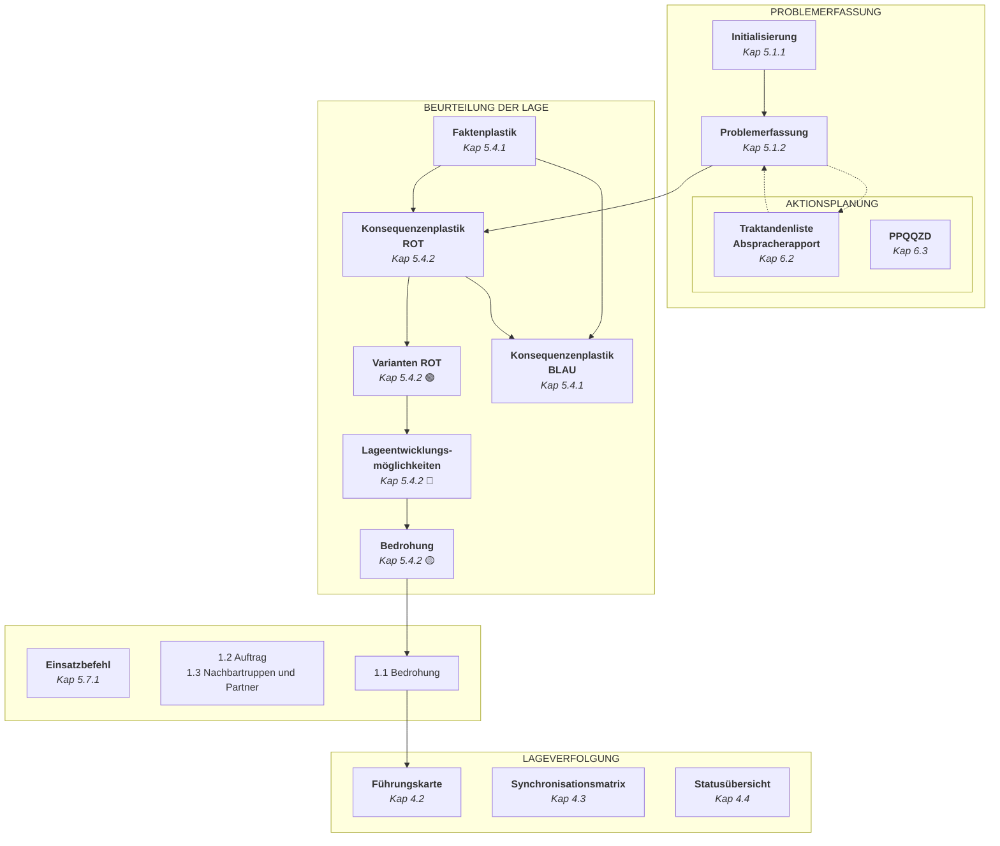
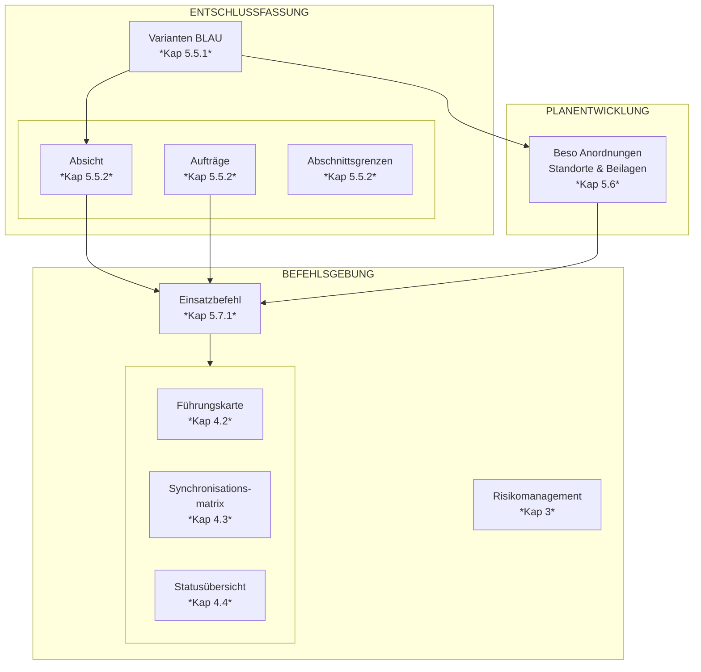
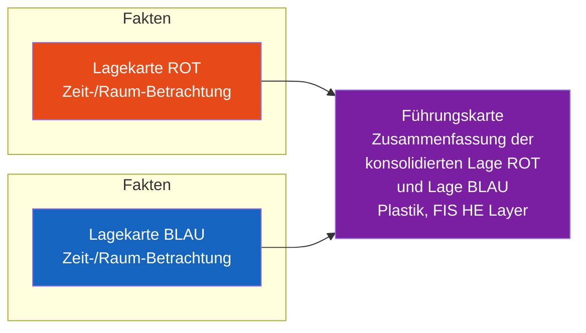
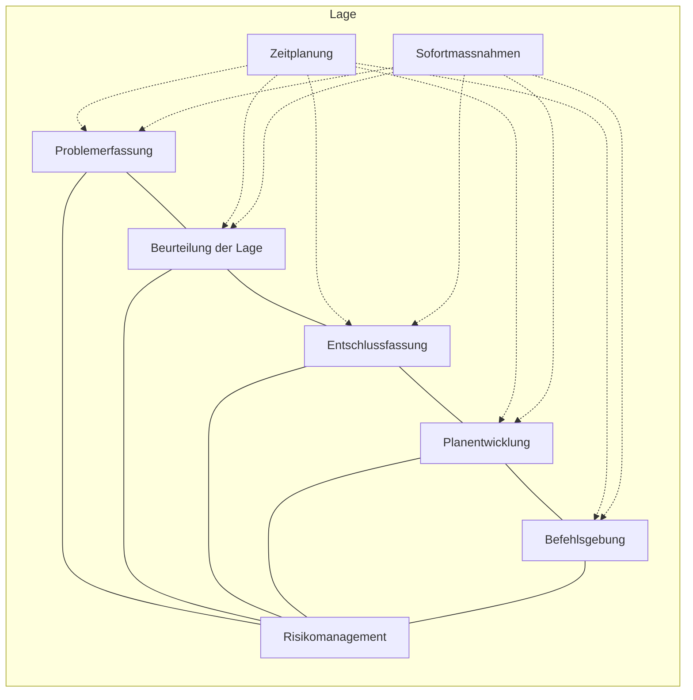
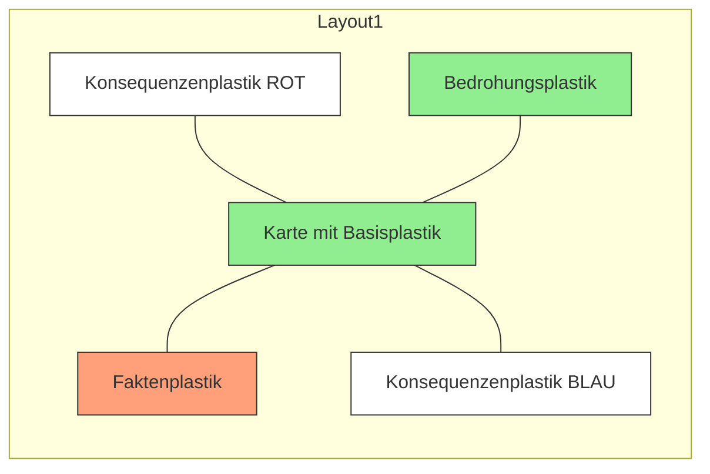
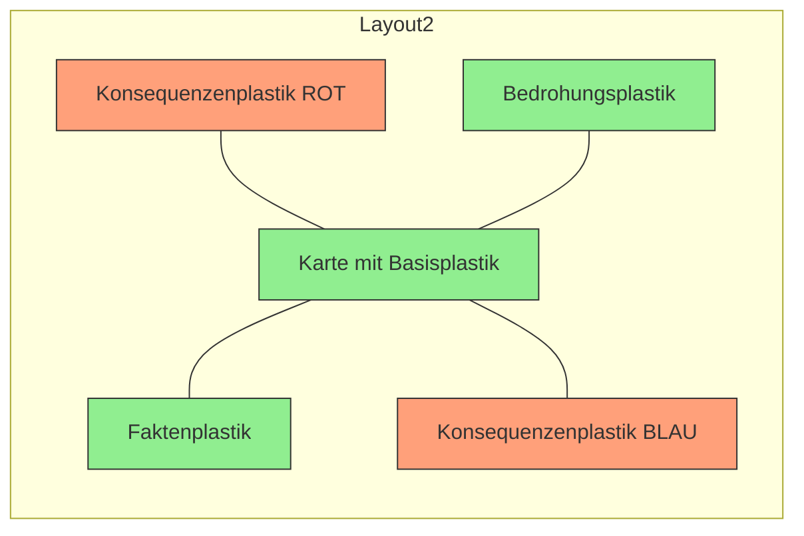
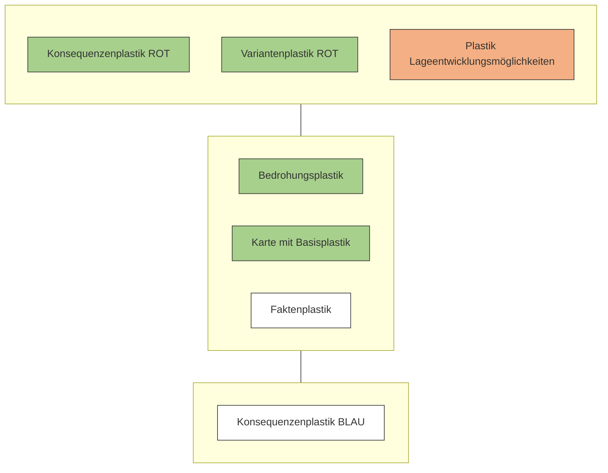
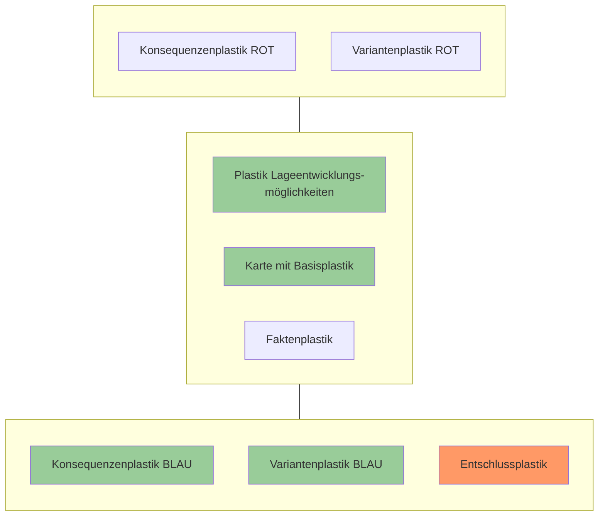
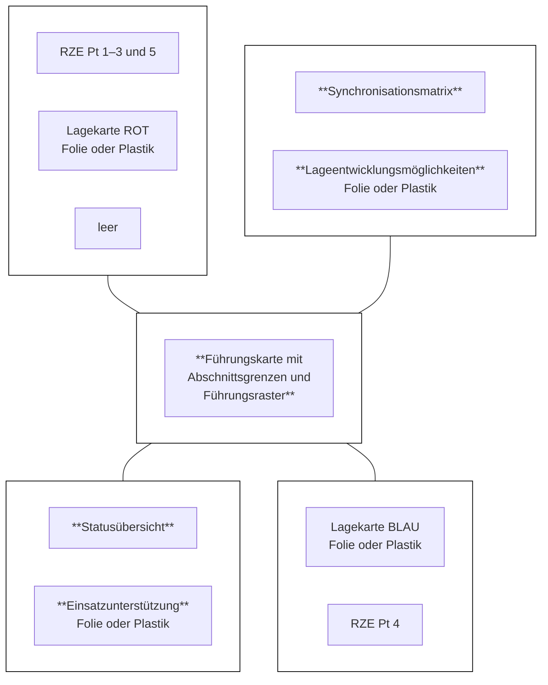

Schweizerische Eidgenossenschaft
Confédération suisse
Confederazione Svizzera
Confederaziun svizra

**Schweizer Armee**

Arbeitshilfe 52.080 d

# Behelf Führung Einheit (BFE)

Teil 1: Einsatz


Stand am 01.01.2020 [colspan=2] SAP 2553.6265


Schweizerische Eidgenossenschaft
Confédération suisse
Confederazione Svizzera
Confederaziun svizra

**Schweizer Armee**

Arbeitshilfe 52.080 d

# Behelf Führung Einheit (BFE)

Teil 1: Einsatz

Stand am 01.01.2020

Arbeitshilfe 52.080 d Behelf Führung Einheit (BFE)

# Verteiler

* Elektronische Publikation (via LMS Bund)

Persönliche Exemplare
* Lehrgangsteilnehmer FLG Einh (via Zentralschule)
* Einh Kdt, Einh Kdt Stv
* Kdt Trp Kö, Trp Kö Kdt Stv, C FGG, Ber Of
* Alle BO
* BO Anwärter (MILAK)
* BU (nur BU E3/C Fachbereich Stufe Einh) via Schulkommando
* Weitere Interessenten auf Antrag an Kdt ZS

## Referenzierte Militärische Vorschriften

<table>
  <tbody>
    <tr>
        <td>50.040</td>
        <td>Führung und Stabsorganisation der Armee 17 (FSO 17, zweite überarbeitete Auflage)</td>
    </tr>
    <tr>
        <td>51.019</td>
        <td>Grundschulung 17 (GS 17)</td>
    </tr>
    <tr>
        <td>51.030</td>
        <td>Taktische Führung 17 (TF 17)</td>
    </tr>
    <tr>
        <td>51.205</td>
        <td>Militärische Katastrophenhilfe aller Truppen</td>
    </tr>
    <tr>
        <td>52.075</td>
        <td>Behelf Führung Truppenkörper (BFT 17)</td>
    </tr>
    <tr>
        <td>52.002.01</td>
        <td>Militärische Schriftstücke/Darstellungen</td>
    </tr>
    <tr>
        <td>53.005.01</td>
        <td>Einsatz der Infanterie/Teil 1: Führung und Einsatz des Bataillons</td>
    </tr>
    <tr>
        <td>53.005.02</td>
        <td>Einsatz der Infanterie/Teil 2: Führung und Einsatz der Kompanie</td>
    </tr>
    <tr>
        <td>54.031</td>
        <td>Die Kompanien im Panzerbataillon</td>
    </tr>
  </tbody>
</table>

II

Arbeitshilfe 52.080 d Behelf Führung Einheit (BFE)

# Inhaltsverzeichnis

Seite

**1 Einführung** 1
1.1 Zweckbestimmung 1
1.2 Aufbau 2
1.3 Führungs- und Informationssystem Heer (FIS HE) 3

**2 Allgemeines** 5
2.1 Führungsprozesse 5
2.2 Führungsrhythmus 8

**3 Risikomanagement** 13

**4 Lageverfolgung** 16
4.1 Die drei Produkte der Führung 16
4.2 Führungskarte 18
4.3 Synchronisationsmatrix 21
4.4 Statusübersicht 24

**5 Aktionsplanung** 26
5.1 Führungstätigkeit: Problemerfassung 26
5.1.1 Initialisierung 26
5.1.2 Problemerfassung 31
5.2 Führungstätigkeit: Sofortmassnahmen 34
5.3 Führungstätigkeit: Zeitplanung 36
5.4 Führungstätigkeit: Beurteilung der Lage 37
5.4.1 Vernetzte Faktorenanalyse 37
5.4.2 Herleitung und Erarbeitung der Bedrohung 45
5.4.3 Mittelbedarfsrechnung/Leistungskatalog (Bedrohung für die KI) 49
5.5 Führungstätigkeit: Entschlussfassung 52
5.5.1 Herleitung und Erarbeitung von eigenen Möglichkeiten 52
5.5.2 Entschluss 55
5.5.3 Mittelbedarfsrechnung/Leistungskatalog (Entschluss für die KI) 60
5.6 Führungstätigkeit: Planentwicklung 61
5.7 Führungstätigkeit: Befehlsgebung 68
5.7.1 Einsatzbefehl der Einheit 68
5.7.2 Befehlsgebung 70

**6 Vorgehen bei Aufträgen mit Absprachebedürfnissen** 73
6.1 Ablauf 73
6.2 Abspracherapport 74
6.3 PPQQZD 77

**7 Aktionsnachbereitung** 79

**8 Führungsunterstützung** 80
8.1 Stationärer Einsatz 80
8.1.1 Stationäre Führungseinrichtung 80
8.1.2 Führungswand 82
8.2 Mobiler Einsatz 84
8.2.1 Mobile Führungseinrichtung 84

III

Arbeitshilfe 52.080 d Behelf Führung Einheit (BFE)

8.2.2 Führungsbrett 85
**9 Erkundungen** 88
**10 Formulare** 92
**11 Abkürzungsverzeichnis** 93

IV

Arbeitshilfe 52.080 d Behelf Führung Einheit (BFE)

# Abbildungsverzeichnis

<table>
    <tr>
        <th></th>
        <th></th>
        <th>Seite</th>
    </tr>
    <tr>
        <td>Abb 1:</td>
        <td>Aufbau des BFE nach Kapiteln</td>
        <td>2</td>
    </tr>
    <tr>
        <td>Abb 2:</td>
        <td>Produktematrix FIS HE</td>
        <td>4</td>
    </tr>
    <tr>
        <td>Abb 3:</td>
        <td>Produkte aus den Kernprozessen der Führung – Stufe Einheit</td>
        <td>6</td>
    </tr>
    <tr>
        <td>Abb 4:</td>
        <td>Beispiel für ein Führungsrad (Struktur)</td>
        <td>8</td>
    </tr>
    <tr>
        <td>Abb 5:</td>
        <td>Angepasste Traktandenliste Einh Rapport für den Einh Rapport im Einsatz (Umsetzung)</td>
        <td>11</td>
    </tr>
    <tr>
        <td>Abb 6:</td>
        <td>Karte «Umgang mit Risiken» (Struktur)</td>
        <td>13</td>
    </tr>
    <tr>
        <td>Abb 7:</td>
        <td>Eintrag Risikomanagement im Notizheft des Einh Kdt (Umsetzung)</td>
        <td>15</td>
    </tr>
    <tr>
        <td>Abb 8:</td>
        <td>Prozess der Lageverfolgung (Struktur)</td>
        <td>17</td>
    </tr>
    <tr>
        <td>Abb 9:</td>
        <td>Prinzip für das Erstellen der Führungskarte (Struktur)</td>
        <td>18</td>
    </tr>
    <tr>
        <td>Abb 10:</td>
        <td>Führungskarte (Umsetzung)</td>
        <td>19</td>
    </tr>
    <tr>
        <td>Abb 11:</td>
        <td>Synchronisationsmatrix (Struktur)</td>
        <td>21</td>
    </tr>
    <tr>
        <td>Abb 12:</td>
        <td>Synchronisationsmatrix (Umsetzung)</td>
        <td>22</td>
    </tr>
    <tr>
        <td>Abb 13:</td>
        <td>Mögliche Statusübersicht einer Einheit (Umsetzung)</td>
        <td>25</td>
    </tr>
    <tr>
        <td>Abb 14:</td>
        <td>Initialisierungsphase zu Beginn der Führungstätigkeiten (Struktur)</td>
        <td>26</td>
    </tr>
    <tr>
        <td>Abb 15:</td>
        <td>Auszug aus einem bearbeiteten Ei Bf Trp Kö (Umsetzung)</td>
        <td>28</td>
    </tr>
    <tr>
        <td>Abb 16:</td>
        <td>Übersichtskarte (Umsetzung)</td>
        <td>29</td>
    </tr>
    <tr>
        <td>Abb 17:</td>
        <td>Planungskarte (Umsetzung)</td>
        <td>30</td>
    </tr>
    <tr>
        <td>Abb 18:</td>
        <td>Problemerfassung (Struktur)</td>
        <td>31</td>
    </tr>
    <tr>
        <td>Abb 19:</td>
        <td>Problemerfassung (Umsetzung)</td>
        <td>33</td>
    </tr>
    <tr>
        <td>Abb 20:</td>
        <td>Eintrag von Sofortmassnahmen im Gefechtsjournal (Umsetzung)</td>
        <td>34</td>
    </tr>
    <tr>
        <td>Abb 21:</td>
        <td>Eintrag von Pendenzen im Notizheft (Umsetzung)</td>
        <td>35</td>
    </tr>
    <tr>
        <td>Abb 22:</td>
        <td>Eisenhower-Prinzip</td>
        <td>35</td>
    </tr>
    <tr>
        <td>Abb 23:</td>
        <td>Ausschnitt Synchronisationsmatrix mit internem Zeitplan des Einh Kdt (Umsetzung)</td>
        <td>36</td>
    </tr>
    <tr>
        <td>Abb 24:</td>
        <td>Prinzip für die Erarbeitung des Faktenplastik (Struktur)</td>
        <td>38</td>
    </tr>
    <tr>
        <td>Abb 25:</td>
        <td>Prinzip für die Erarbeitung von Konsequenzenplastik ROT und BLAU (Struktur)</td>
        <td>38</td>
    </tr>
    <tr>
        <td>Abb 26:</td>
        <td>Faktorengruppe der Beurteilung der Lage (Umsetzung)</td>
        <td>40</td>
    </tr>
    <tr>
        <td>Abb 27:</td>
        <td>Faktenplastik (Umsetzung)</td>
        <td>41</td>
    </tr>
    <tr>
        <td>Abb 28:</td>
        <td>Überlagerung Konsequenzenplastik ROT und BLAU am Ende der BdL (Umsetzung)</td>
        <td>42</td>
    </tr>
    <tr>
        <td>Abb 29:</td>
        <td>Formular «Auftragsanalyse» für die Stufe Trp Kö / Gs Vb</td>
        <td>43</td>
    </tr>
    <tr>
        <td>Abb 30:</td>
        <td>Legende für den Faktenplastik</td>
        <td>44</td>
    </tr>
    <tr>
        <td>Abb 31:</td>
        <td>Prinzip für die Erarbeitung des Variantenplastiks ROT (Struktur)</td>
        <td>45</td>
    </tr>
    <tr>
        <td>Abb 32:</td>
        <td>Prinzip für die Erarbeitung des Plastiks Lageentwicklungsmöglichkeiten (Struktur)</td>
        <td>46</td>
    </tr>
    <tr>
        <td>Abb 33:</td>
        <td>Konsequenzenplastik ROT mit Variantenplastik ROT (Umsetzung)</td>
        <td>47</td>
    </tr>
    <tr>
        <td>Abb 34:</td>
        <td>Plastik Lageentwicklungsmöglichkeiten (Umsetzung)</td>
        <td>47</td>
    </tr>
    <tr>
        <td>Abb 35:</td>
        <td>Tabelle der 7W-Fragen (Umsetzung)</td>
        <td>48</td>
    </tr>
    <tr>
        <td>Abb 36:</td>
        <td>Mittelbedarfsrechnung (Struktur)</td>
        <td>49</td>
    </tr>
    <tr>
        <td>Abb 37:</td>
        <td>Konsequenzen ROT und BLAU nach der objektbezogenen BdL (Umsetzung)</td>
        <td>51</td>
    </tr>
    <tr>
        <td>Abb 38:</td>
        <td>Prinzip für die Erarbeitung des Variantenplastiks BLAU (Struktur)</td>
        <td>52</td>
    </tr>
    <tr>
        <td>Abb 39:</td>
        <td>Plastik Lageentwicklungsmöglichkeiten mit Konsequenzenplastik BLAU (Umsetzung)</td>
        <td>53</td>
    </tr>
</table>

V

Arbeitshilfe 52.080 d Behelf Führung Einheit (BFE)

Abb 40: Konsequenzenplastik BLAU mit Variantenplastik BLAU (Umsetzung) 54
Abb 41: Gegenüberstellung von Varianten 55
Abb 42: Prinzip für die Erarbeitung des Entschlussplastiks (Struktur) 56
Abb 43: Entschlussplastik inklusive Reserveeinsätze (Umsetzung) 56
Abb 44: Abschnittsgrenzen (Umsetzung) 57
Abb 45: Führungsraster (Umsetzung) 59
Abb 46: Entschlussskizze für eine Kl (Umsetzung) 60
Abb 47: Aufbau der Titelstruktur für Besondere Anordnungen & Standorte im Ei Bf (Struktur) 62
Abb 48: Markierte Teile der Besonderen Anordnungen aus dem Ei Bf Trp Kö (Umsetzung) 65
Abb 49: Heruntergebrochene «Besondere Anordnungen» der Stufe Einh (Umsetzung) 66
Abb 50: Plastik Einsatzunterstützung in der Erarbeitung (Umsetzung) 67
Abb 51: Einsatzbefehl der Einheit (Struktur) 68
Abb 52: Beispiel eines Geländemodells (Umsetzung) 70
Abb 53: Traktandenliste eines Abspracherapports 76
Abb 54: Leistungsprofil PPQQZD (Struktur) 77
Abb 55: Auszug eines möglichen Leistungsprofils PPQQZD einer Rttg Kp (Umsetzung) 78
Abb 56: Stationäre Führungseinrichtung einer Einh (Struktur) 80
Abb 57: Möglicher Aufbau einer Führungswand (Struktur) 83
Abb 58: Führungsbrett (Struktur) 86
Abb 59: Beispiel eines Führungsbretts (Umsetzung) 87
Abb 60: Erkundungsplan im Notizheft des Einh Kdt (Struktur) 88
Abb 61: Erkundungsplan im Notizheft des Einh Kdt (Umsetzung) 89

VI

Arbeitshilfe 52.080 d Behelf Führung Einheit (BFE)

# Register

<table>
  <thead>
    <tr>
        <th></th>
        <th colspan="2">Kapitel</th>
        <th>Nummer</th>
    </tr>
  </thead>
  <tbody>
    <tr>
        <td>&lt;mark style="background-color: gray"&gt;**Einführung**</mark></td>
        <td>1</td>
        <td colspan="2"></td>
    </tr>
    <tr>
        <td>&lt;mark style="background-color: gray"&gt;**Allgemeines**</mark></td>
        <td>2</td>
        <td colspan="2"></td>
    </tr>
    <tr>
        <td>&lt;mark style="background-color: red"&gt;**Risikomanagement**</mark></td>
        <td>3</td>
        <td colspan="2"></td>
    </tr>
    <tr>
        <td>&lt;mark style="background-color: blue"&gt;**Lageverfolgung**</mark></td>
        <td>4</td>
        <td colspan="2"></td>
    </tr>
    <tr>
        <td>&lt;mark style="background-color: blue"&gt;**Aktionsplanung**</mark></td>
        <td>5</td>
        <td colspan="2"></td>
    </tr>
    <tr>
        <td>&lt;mark style="background-color: blue"&gt;**Vorgehen bei Aufträgen<br/>mit Absprachebedürfnissen**</mark></td>
        <td>6</td>
        <td colspan="2"></td>
    </tr>
    <tr>
        <td>&lt;mark style="background-color: green"&gt;**Aktionsnachbereitung**</mark></td>
        <td>7</td>
        <td colspan="2"></td>
    </tr>
    <tr>
        <td>&lt;mark style="background-color: green"&gt;**Führungsunterstützung**</mark></td>
        <td>8</td>
        <td colspan="2"></td>
    </tr>
    <tr>
        <td>&lt;mark style="background-color: green"&gt;**Erkundungen**</mark></td>
        <td>9</td>
        <td colspan="2"></td>
    </tr>
    <tr>
        <td>&lt;mark style="background-color: gray"&gt;**Formulare**</mark></td>
        <td>10</td>
        <td colspan="2"></td>
    </tr>
    <tr>
        <td>&lt;mark style="background-color: gray"&gt;**Abkürzungsverzeichnis**</mark></td>
        <td>11</td>
        <td colspan="2"></td>
    </tr>
  </tbody>
</table>

VII

Arbeitshilfe 52.080 d Behelf Führung Einheit (BFE)

VIII

Arbeitshilfe 52.080 d Behelf Führung Einheit (BFE)

# 1 Einführung

## 1.1 Zweckbestimmung

Der Kommandant Zentralschule als Herausgeber erlässt die Arbeitshilfe 52.080 «Behelf Führung Einheit» (BFE) als Anleitung für die Aktionsplanung und Lageverfolgung der Stufe Einheit (Einh).

Der BFE dient der konkreten und praxisorientierten Umsetzung der im Reglement 50.040 «Führung und Stabsorganisation der Armee 17» (FSO 17) definierten Grundsätze, Vorgaben und Leitlinien. Zudem soll er sicherstellen, dass der nahtlose Anschluss an die vorgesetzte Stufe/an den Behelf Führung Truppenkörper 17 (BFT 17) ermöglicht ist.

Einheitskommandanten (Einh Kdt) stehen vor der Herausforderung, ein (taktisches) Problem systematisch einer Lösung zuzuführen. Erschwerend erfolgt die Planung in der Regel unter Zeitdruck. Deshalb sind das Zeitmanagement, die Effizienz und Effektivität erfolgsentscheidend. Um sich bei der Lösungserarbeitung eines Problems in der geforderten Zeit um den Inhalt («WAS») kümmern zu können, muss die systematische Vorgehensweise («WIE») geklärt sein. Der BFE beschreibt, wie ein Einh Kdt diese Problematik systematisch lösen kann.

**Der BFE ist ausdrücklich ein Behelf!**

In den Lehrgängen und Kursen der Zentralschule (ZS) wird im Interesse einer einheitlichen Ausbildung grundsätzlich nicht von der Modellvorstellung dieses Behelfs abgewichen.

Der Einh Kdt arbeitet primär alleine, weshalb die Arbeit mit Formularen auf ein Minimum reduziert wurde und hauptsächlich methodischen Zwecken in der Grundausbildung an der Zentralschule dient. Ziel ist es, die Führungsprozesse des Einh Kdt zu verinnerlichen.

In der Ausbildung und im Einsatz steht es den Einh Kdt aufgrund spezifischer Bedürfnisse eines Auftrages, der Situation, der zur Verfügung stehenden Zeit sowie weiteren Faktoren frei, die Verantwortlichkeitsregelung, die Arbeitsprozesse und die daraus resultierenden Produkte, welche in diesem Behelf aufgeführt sind, anzupassen.

1

Arbeitshilfe 52.080 d Behelf Führung Einheit (BFE)

## 1.2 Aufbau

Im Sinne der Einheitlichkeit und Durchlässigkeit orientiert sich der BFE bezüglich Aufbau am Regl FSO 17 sowie an der Arbeitshilfe 52.075 «Behelf Führung Truppenkörper 17» (BFT 17). Die Abb 1 zeigt die Struktur des BFE.

```description
A diagram showing the structure of the BFE organized into 11 numbered chapters. 
- Chapters 1 (Einführung), 2 (Allgemeines), and 3 (Risikomanagement) are at the top.
- A vertical purple arrow on the right is labeled "Methode" with gear icons.
- A central blue section labeled "Produkte der Führung" contains Chapter 4 (Lageverfolgung) and Chapter 5 (Aktionsplanung), showing various charts, maps, and process steps (Problemerfassung, Beurteilung der Lage, Entschlussfassung, Planentwicklung, Befehlsgebung).
- Chapters 6 (Vorgehen bei Aufträgen mit Absprachebedürfnissen), 7 (Aktionsnachbereitung), and 8 (Führungsunterstützung) form the next row.
- Chapters 9 (Erkundungen), 10 (Formulare), and 11 (Abkürzungsverzeichnis) form the bottom row.
```

*Abb 1: Aufbau des BFE nach Kapiteln*

Im BFE wird methodisch aufgezeigt, wie die relevanten Produkte innerhalb der Führungsprozesse erarbeitet werden. Der BFE berücksichtigt absichtlich keine truppengattungsspezifischen Aspekte. Fachspezifische Themen werden in den entsprechenden Reglementen und Arbeitshilfen behandelt.

2

Arbeitshilfe 52.080 d Behelf Führung Einheit (BFE)

Die Unterkapitel präsentieren sich immer nach dem gleichen Aufbau:

<mark>**1 Einführung**</mark>

*    **Grundlagen**: Listet die Grundlagen auf, die für dieses Unterkapitel massgebend sind.
*    **Worum geht es?**: Definiert den Zweck oder das zu erreichende Resultat.
*    **Struktur**: Beschreibt ein Formular und seinen Aufbau oder listet das benötigte Material bzw Werkzeug auf.
*    **Umsetzung**: Beschreibt die Vorgehensweise zum Erstellen des Produktes und für welche Schritte es weiterverwendet wird.
*    **... für die Praxis**: Erwähnt praktische Erfahrungen aus Dienstleistungen, Übungen und Einsätzen, welche die Arbeit erleichtern können.

Aus Gründen der besseren Lesbarkeit wird auf die gleichzeitige Verwendung weiblicher und männlicher Sprachformen verzichtet. Sämtliche Personenbezeichnungen gelten für beide Geschlechter.

## 1.3 Führungs- und Informationssystem Heer (FIS HE)

Das Führungs- und Informationssystem Heer (FIS HE) unterstützt die Lageverfolgung (LV), die Aktionsplanung inklusive der Befehlsgebung. Richtig eingesetzt erlaubt es, die Geschwindigkeit, die Präzision und Flexibilität beim Verbreiten von Informationen zu erhöhen.

Der Einbezug von FIS HE wird im BFE dort erwähnt, wo die Umsetzung auf Stufe Einh bekannt ist (z B Plastik = Layer). Die diesbezüglichen Ausführungen ersetzen aktuelle FIS HE Vorschriften nicht.

Die im BFE eingefügten Hinweise zum Einsatz von FIS HE folgen dem Grundsatz, dass FIS HE prioritär dort eingesetzt wird, wo eine Beschleunigung oder Vereinfachung erzielt werden kann, also zur Lageverfolgung und allenfalls zur Befehlsgebung. Um dies zu ermöglichen, müssen bestimmte Produkte während der Aktionsplanung in das FIS HE eingearbeitet werden.

Die Anwendung von FIS HE entlang der Führungsprozesse erfolgt durch einen produkteorientierten Ansatz. Die Abb 2 zeigt die führungsstufenübergreifenden Verbindungen der jeweiligen Produkte und Abhängigkeiten. Sie zeigt, welche Stufe das Produkt erstellt, in welche Richtungen es Einfluss nimmt und wo es geführt wird. Die Stufe Zug ist im Prozess von FIS HE nicht abgebildet, da auf dieser Stufe keine entsprechenden Systeme vorhanden sind.

3

Arbeitshilfe 52.080 d
Behelf Führung Einheit (BFE)

# Produktematrix FIS HE

Abb 2: Produktematrix FIS HE

<table>
  <thead>
    <tr>
        <th>Arbeitsschritt</th>
        <th>Produkt</th>
        <th colspan="3">vorgesetzte Kdo Stufe</th>
        <th>Legende</th>
        <th></th>
    </tr>
    <tr>
        <th></th>
        <th rowspan="2"></th>
        <th>XX</th>
        <th>X</th>
        <th>II</th>
        <th>I</th>
        <th rowspan="2"></th>
    </tr>
  </thead>
  <tbody>
    <tr>
        <td rowspan="6">Lageverfolgung</td>
        <td>... Na Karte</td>
        <td colspan="3"></td>
        <td>&lt;mark style="background-color: blue"&gt; </mark> Layer</td>
    </tr>
    <tr>
        <td>Fhr Karte ND, inkl FLET</td>
        <td>&lt;mark style="background-color: blue"&gt; </mark></td>
        <td>&lt;mark style="background-color: blue"&gt; </mark></td>
        <td colspan="2"></td>
        <td>&lt;mark style="background-color: orange"&gt; </mark> Datenbankobjekte</td>
    </tr>
    <tr>
        <td>Lageentwicklungsmögl ROT</td>
        <td>&lt;mark style="background-color: orange"&gt; </mark></td>
        <td>&lt;mark style="background-color: orange"&gt; </mark></td>
        <td colspan="2"></td>
        <td>&lt;mark style="background-color: grey"&gt; </mark> Replikation</td>
    </tr>
    <tr>
        <td>Angepasste EP 1-n</td>
        <td>&lt;mark style="background-color: orange"&gt; </mark></td>
        <td>&lt;mark style="background-color: orange"&gt; </mark></td>
        <td colspan="2"></td>
        <td></td>
    </tr>
    <tr>
        <td>Fhr Karte BLAU, inkl FLOT</td>
        <td>&lt;mark style="background-color: blue"&gt; </mark></td>
        <td>&lt;mark style="background-color: blue"&gt; </mark></td>
        <td>&lt;mark style="background-color: blue"&gt; </mark></td>
        <td></td>
        <td></td>
    </tr>
    <tr>
        <td>Statusübersicht (bewirtschaften)</td>
        <td>&lt;mark style="background-color: blue"&gt; </mark></td>
        <td>&lt;mark style="background-color: blue"&gt; </mark></td>
        <td colspan="2"></td>
        <td></td>
    </tr>
    <tr>
        <td rowspan="5">Analyse der Faktorengruppe</td>
        <td>... Umwelt</td>
        <td>&lt;mark style="background-color: orange"&gt; </mark></td>
        <td>&lt;mark style="background-color: orange"&gt; </mark></td>
        <td colspan="2"></td>
        <td></td>
    </tr>
    <tr>
        <td>Konsequenzen ROT</td>
        <td>&lt;mark style="background-color: orange"&gt; </mark></td>
        <td>&lt;mark style="background-color: orange"&gt; </mark></td>
        <td colspan="2"></td>
        <td></td>
    </tr>
    <tr>
        <td>Konsequenzen BLAU</td>
        <td>&lt;mark style="background-color: orange"&gt; </mark></td>
        <td>&lt;mark style="background-color: orange"&gt; </mark></td>
        <td colspan="2"></td>
        <td></td>
    </tr>
    <tr>
        <td>Schlüsselgelände ROT</td>
        <td>&lt;mark style="background-color: orange"&gt; </mark></td>
        <td>&lt;mark style="background-color: orange"&gt; </mark></td>
        <td colspan="2"></td>
        <td></td>
    </tr>
    <tr>
        <td>Schlüsselgelände BLAU</td>
        <td>&lt;mark style="background-color: orange"&gt; </mark></td>
        <td>&lt;mark style="background-color: orange"&gt; </mark></td>
        <td colspan="2"></td>
        <td></td>
    </tr>
    <tr>
        <td rowspan="3">Bedrohung/ Lageentwicklungsmöglichkeit(-en)</td>
        <td>Bestimmende (planned)</td>
        <td>&lt;mark style="background-color: orange"&gt; </mark></td>
        <td>&lt;mark style="background-color: orange"&gt; </mark></td>
        <td colspan="2"></td>
        <td></td>
    </tr>
    <tr>
        <td>Weitere</td>
        <td>&lt;mark style="background-color: orange"&gt; </mark></td>
        <td>&lt;mark style="background-color: orange"&gt; </mark></td>
        <td colspan="2"></td>
        <td></td>
    </tr>
    <tr>
        <td>In allen Fällen</td>
        <td>&lt;mark style="background-color: orange"&gt; </mark></td>
        <td>&lt;mark style="background-color: orange"&gt; </mark></td>
        <td colspan="2"></td>
        <td></td>
    </tr>
    <tr>
        <td>Ei Konzept</td>
        <td>Entschluss</td>
        <td>&lt;mark style="background-color: orange"&gt; </mark></td>
        <td>&lt;mark style="background-color: orange"&gt; </mark></td>
        <td colspan="2"></td>
        <td></td>
    </tr>
    <tr>
        <td rowspan="2">Ei Plan</td>
        <td>Abschnittsgrenzen</td>
        <td>&lt;mark style="background-color: blue"&gt; </mark></td>
        <td>&lt;mark style="background-color: blue"&gt; </mark></td>
        <td colspan="2"></td>
        <td></td>
    </tr>
    <tr>
        <td>Einsatzgliederung</td>
        <td>&lt;mark style="background-color: blue"&gt; </mark></td>
        <td>&lt;mark style="background-color: blue"&gt; </mark></td>
        <td>&lt;mark style="background-color: blue"&gt; </mark></td>
        <td></td>
        <td></td>
    </tr>
    <tr>
        <td>EP</td>
        <td>EP 1-n</td>
        <td>&lt;mark style="background-color: orange"&gt; </mark></td>
        <td>&lt;mark style="background-color: orange"&gt; </mark></td>
        <td colspan="2"></td>
        <td></td>
    </tr>
    <tr>
        <td rowspan="3">NDK</td>
        <td>ND Raumordnung – NBR</td>
        <td>&lt;mark style="background-color: orange"&gt; </mark></td>
        <td>&lt;mark style="background-color: orange"&gt; </mark></td>
        <td colspan="2"></td>
        <td></td>
    </tr>
    <tr>
        <td>ND Raumordnung – BNB</td>
        <td>&lt;mark style="background-color: blue"&gt; </mark></td>
        <td>&lt;mark style="background-color: blue"&gt; </mark></td>
        <td colspan="2"></td>
        <td></td>
    </tr>
    <tr>
        <td>ND Raumordnung – Irm</td>
        <td>&lt;mark style="background-color: orange"&gt; </mark></td>
        <td>&lt;mark style="background-color: orange"&gt; </mark></td>
        <td colspan="2"></td>
        <td></td>
    </tr>
    <tr>
        <td>Ter Aufgaben/ZMZ</td>
        <td>Ter D Belange</td>
        <td>&lt;mark style="background-color: blue"&gt; </mark></td>
        <td>&lt;mark style="background-color: blue"&gt; </mark></td>
        <td colspan="2"></td>
        <td></td>
    </tr>
    <tr>
        <td rowspan="2">FFK</td>
        <td>Fe Rm/Beso Rm</td>
        <td>&lt;mark style="background-color: blue"&gt; </mark></td>
        <td>&lt;mark style="background-color: blue"&gt; </mark></td>
        <td colspan="2"></td>
        <td></td>
    </tr>
    <tr>
        <td>Art Bwrm</td>
        <td>&lt;mark style="background-color: orange"&gt; </mark></td>
        <td>&lt;mark style="background-color: orange"&gt; </mark></td>
        <td colspan="2"></td>
        <td></td>
    </tr>
    <tr>
        <td rowspan="2">BHFK</td>
        <td>BHF</td>
        <td>&lt;mark style="background-color: orange"&gt; </mark></td>
        <td>&lt;mark style="background-color: orange"&gt; </mark></td>
        <td colspan="2"></td>
        <td></td>
    </tr>
    <tr>
        <td>Reservierte Strassen</td>
        <td>&lt;mark style="background-color: blue"&gt; </mark></td>
        <td>&lt;mark style="background-color: blue"&gt; </mark></td>
        <td colspan="2"></td>
        <td></td>
    </tr>
    <tr>
        <td>LOK</td>
        <td>Log Punkte</td>
        <td>&lt;mark style="background-color: blue"&gt; </mark></td>
        <td>&lt;mark style="background-color: blue"&gt; </mark></td>
        <td></td>
        <td>&lt;mark style="background-color: blue"&gt; </mark></td>
        <td></td>
    </tr>
    <tr>
        <td rowspan="2">FU Konzepte (HQ und Tm)</td>
        <td>Fhr Einrichtungen/Fhr Achsen</td>
        <td>&lt;mark style="background-color: orange"&gt; </mark></td>
        <td>&lt;mark style="background-color: orange"&gt; </mark></td>
        <td colspan="2"></td>
        <td></td>
    </tr>
    <tr>
        <td>Tm Planung</td>
        <td>&lt;mark style="background-color: blue"&gt; </mark></td>
        <td>&lt;mark style="background-color: blue"&gt; </mark></td>
        <td colspan="2"></td>
        <td></td>
    </tr>
    <tr>
        <td>Fhr Fähigkeit</td>
        <td>Statusübersicht (erstellen)</td>
        <td>&lt;mark style="background-color: blue"&gt; </mark></td>
        <td>&lt;mark style="background-color: blue"&gt; </mark></td>
        <td colspan="2"></td>
        <td></td>
    </tr>
  </tbody>
</table>

4

Arbeitshilfe 52.080 d Behelf Führung Einheit (BFE)

# 2 Allgemeines

## 2.1 Führungsprozesse

Die FSO 17 beschreibt vier Führungsprozesse, wobei diese noch in Kernprozesse und Unterstützungsprozesse unterteilt werden:

*   Lageverfolgung Kernprozess
*   Aktionsplanung Kernprozess
*   Aktionsnachbereitung Unterstützungsprozess
*   Stabssteuerung Unterstützungsprozess

Da der Einh Kdt über keinen Stab verfügt, wird der Prozess der Stabssteuerung für ihn irrelevant. Er muss jedoch in seiner Einh die Führungsabläufe regeln.

**Lageverfolgung (LV)**
(Kapitel 4)
*   Die Lageverfolgung ist ein dauernder Prozess und muss auch während den Führungstätigkeiten der Aktionsplanung geführt werden.
*   In der Lageverfolgung erlauben die drei Produkte der Führung (vgl Kap 4) die Feststellung des SOLL-/IST-Zustandes und die Festlegung von Steuerungsmassnahmen (Deltamanagement).
*   Gesteuert wird die Lageverfolgung direkt durch den Einh Kdt.
*   In der Führung der Einsätze und der Lageverfolgung verfügt er lediglich über die Mittel des Kommandozuges (Kdo Z).

**Aktionsplanung (AP)**
(Kapitel 5)
*   Für die Aktionsplanung ist der Einh Kdt grundsätzlich alleine verantwortlich. Er arbeitet sich schrittweise durch den Prozess der Aktionsplanung.
*   Während der Aktionsplanung des Einh Kdt übernimmt der Einh Kdt Stv kurzfristig dessen Tätigkeit in der Führung der Einh.

**Aktionsnachbereitung (AN)**
(Kapitel 7)
*   Die Aktionsnachbereitung ist ein Prozess, der parallel zur Lageverfolgung und Aktionsplanung läuft.
*   Die Aktionsnachbereitung wird in der Regel durch den Stab des Trp Kö ausgelöst und nachgeführt. In diesem Fall sind die Einh Kdt lediglich in der Pflicht, die geforderten Informationen für den Schlussbericht des Trp Kö zu liefern.

Die Lageverfolgung und die Aktionsplanung zählen zu den Kernprozessen. Die Abb 3 zeigt chronologisch innerhalb der beiden Kernprozesse die resultierenden bzw benötigten Produkte. Mit den Pfeilen ist angedeutet, welche Produkte als Grundlage für nachfolgende Produkte dienen. Die Ziffern in den Kästchen geben die jeweiligen Kapitelnummern im BFE an.

5

Arbeitshilfe 52.080 d Behelf Führung Einheit (BFE)

# Produkte aus den Hauptprozessen



<description>
The diagram shows the relationship between different products of the main leadership processes. It is divided into vertical columns: "PROBLEMERFASSUNG" (green) and "BEURTEILUNG DER LAGE" (red/brown). Horizontal sections include "AKTIONSPLANUNG" (grey sidebar), a section for "Einsatzbefehl", and "LAGEVERFOLGUNG" (grey sidebar). Colored dots indicate the type of product: Yellow for "Textbaustein (für Ei Bf)", Red for "Beilage", and Green for "Entscheid".
</description>

🟡 Textbaustein (für Ei Bf)    🔴 Beilage    🟢 Entscheid

Abb 3: Produkte aus den Kernprozessen der Führung – Stufe Einheit

6

Arbeitshilfe 52.080 d Behelf Führung Einheit (BFE)

# (Aufbau Kapitel 4 & 5 des BFE)



<description>
The diagram shows a workflow divided into three main columns: ENTSCHLUSSFASSUNG (light blue background), PLANENTWICKLUNG (light purple background), and BEFEHLSGEBUNG (darker blue-grey background). 

In ENTSCHLUSSFASSUNG:
- A box "Varianten BLAU (Kap 5.5.1)" with a green dot.
- Below it, a grouped box containing "Absicht (Kap 5.5.2)" with a yellow dot, "Aufträge (Kap 5.5.2)" with a yellow dot, and "Abschnittsgrenzen (Kap 5.5.2)" with a red dot.

In PLANENTWICKLUNG:
- A box "Beso Anordnungen, Standorte & Beilagen (Kap 5.6)" with a yellow and a red dot.

In BEFEHLSGEBUNG:
- A box "Einsatzbefehl (Kap 5.7.1)".
- A dashed box containing "Führungskarte (Kap 4.2)", "Synchronisationsmatrix (Kap 4.3)", and "Statusübersicht (Kap 4.4)".
- At the bottom, a green box "Risikomanagement (Kap 3)".

Arrows indicate the flow from Varianten BLAU to the Absicht/Aufträge group and to Beso Anordnungen. Further arrows lead from these groups into the Einsatzbefehl, and from there to the map/matrix/status group.

On the right side, there is a vertical grey tab labeled "2 Allgemeines".
</description>

<table>
    <tr>
        <th>ENTSCHLUSSFASSUNG</th>
        <th>PLANENTWICKLUNG</th>
        <th>BEFEHLSGEBUNG</th>
    </tr>
    <tr>
        <td>2. Absicht&lt;br/&gt;3. Aufträge</td>
        <td>4. Besondere Anordnungen&lt;br/&gt;5. Standorte</td>
        <td>**Einsatzbefehl**&lt;br/&gt;*Kap 5.7.1*</td>
    </tr>
    <tr>
        <td></td>
        <td></td>
        <td>**Führungskarte**&lt;br/&gt;*Kap 4.2*</td>
    </tr>
    <tr>
        <td></td>
        <td></td>
        <td>**Synchronisationsmatrix**&lt;br/&gt;*Kap 4.3*</td>
    </tr>
    <tr>
        <td></td>
        <td></td>
        <td>**Statusübersicht**&lt;br/&gt;*Kap 4.4*</td>
    </tr>
    <tr>
        <td></td>
        <td></td>
        <td>**Risikomanagement**&lt;br/&gt;*Kap 3*</td>
    </tr>
</table>

7

Arbeitshilfe 52.080 d Behelf Führung Einheit (BFE)

## 2.2 Führungsrhythmus


### Grundlagen
* FSO 17, Pt 6.3.4
* BFT 17, Pt 2.6
* Einsatz der Infanterie/Teil 2: Führung und Einsatz der Kompanie, Abb 272


### Worum geht es?
Die Tätigkeiten der Stufe Einh müssen führungsstufenübergreifend zeitlich abgestimmt werden. Dazu muss der Melde- und Rapportrhythmus synchronisiert werden.


### Struktur
Der Führungsrhythmus wird in einem 24-Stunden-Rad dargestellt und bildet von innen nach aussen die Stufen der Führung von der vorgesetzten Stufe zu den Unterstellten ab (Abb 4).


**Abb 4: Beispiel für ein Führungsrad (Struktur)**

Die Abbildung zeigt auf Stufe Zug wie der 24h/7d-Rhythmus mit einer ersten Ablösung (Einsatz) und einer zweiten Ablösung (Reserve/Ruhe/Ausbildung) bestritten wird. In länger dauernden Einsätzen kann zusätzlich mit einer dritten Ablösung (Urlaub) gearbeitet werden.

8

Arbeitshilfe 52.080 d Behelf Führung Einheit (BFE)

Folgende Berichte und Rapporte sind Bestandteil des Einsatzes auf Stufe Einh oder haben einen Einfluss darauf:

**Einsatzbericht: (Frontrapport)**
Der Einsatzbericht enthält nach Vorgaben des einsatzführenden Kommandos Angaben über die Tätigkeiten der vergangenen Phase. Er beinhaltet eine Zusammenfassung des Einsatzes (Bestand, Transportkilometer, Flugstunden usw), den Verbrauch von Gütern, mögliche Bedürfnisse und besondere Angaben. Auf Stufe Einh beinhaltet er auch Meldungen über die Lage. Er wird in der Regel zweimal täglich erstellt. Die Einh sind diesbezüglich in der Pflicht, die geforderten Informationen pünktlich und vollständig dem Trp Kö gemäss Führungsrhythmus zu melden.

**Lagebericht:**
Der Lagebericht deckt Nachrichtenbedürfnisse des Trp Kö ab. Er richtet sich an die Nachrichtendienstorgane und wird auf Stufe Trp Kö erstellt und ausgewertet. Der Lagebericht wird situativ vom Trp Kö versendet oder eingefordert. Die Einh muss die relevanten Informationen auswerten und an die Unterstellten weiterleiten oder die geforderten Nachrichtenbedürfnisse dem Trp Kö melden.

**Einheitsrapport (im Einsatz):**
Der Einheitsrapport findet unter der Verantwortung des Einh Kdt statt. Anwesend sind die höheren Kader der Einh und weitere Funktionsträger (Schlüsselfunktionen der Einh) nach Bedarf. In einem länger dauernden Einsatz wird dieser Rapport auch benötigt, um Informationen aus Übergaben bei Ablösungen verarbeiten zu können.
(Traktandenliste Einh Rapport im Einsatz – Abb 5).

**Dienstrapport:**
Der Dienstrapport auf Stufe Einh findet unter der Verantwortung des Einh Kdt (oder dessen Stv) statt. Teilnehmer sind Einh Fw, Einh Four sowie weitere Funktionsträger (Schlüsselfunktionen der Einh) nach Bedarf.

### Umsetzung

Die Termine der vorgesetzten Stufe bilden den Ausgangspunkt der Planung, welche zeitlich zurückgerechnet werden. Ausgehend vom Termin zur Abgabe der Meldung an die vorgesetzte Stufe müssen Termine für die unterstellten Züge bestimmt werden. Diese hängen davon ab, wie viel Zeit die Einh benötigt, um aus den eingegangenen Meldungen Einsatzberichte für die vorgesetzte Stufe zu erstellen. Als Führungsmittel verwendet der Einh Kdt dazu den Einh Rapport im Einsatz.

<description>
On the right margin, there is a vertical navigation bar with the following sections:
1 Einführung
2 Allgemeines (This section is highlighted in grey)
3 Risiko-management
4 Lage-verfolgung
5 Aktions-planung
6 Vorgehen bei unklarem Auftrag
7 Aktions-nachbereitung
8 Führungs-unterstützung
9 Erkundung
10 Formulare
11 Sachregister
</description>

9

Arbeitshilfe 52.080 d Behelf Führung Einheit (BFE)

Im Beispiel von Abb 4 muss der Einh Kdt den Einsatzbericht um 0730 Uhr an den Trp Kö senden. Aus diesem Grund finden in den vorangehenden 90 Minuten die Ablösung am Obj und der Einh Rapport statt, um die Informationen aus der vergangenen Schicht für den Einsatzbericht zusammenzutragen.

Für die Einsatzzüge ist der Ablöserhythmus von 12 Stunden entscheidend für ihre Durchhaltefähigkeit. Es fallen diverse Regiezeiten an, welche die Ruhezeit verkürzen. Dazu zählen:
*   Einsatzvorbereitung - EV (Körperpflege, Vpf, materielle Vorbereitung, Einsatzbriefing);
*   Ablösung am Obj (Mat Kontrollen, Chargenübergaben, Informationsaustausch);
*   Wiedererstellen der Einsatzbereitschaft – WEB (Debriefing, PD, Vpf, usw).

In der verbleibenden Zeit können Ausbildungssequenzen oder Freizeit eingeplant werden.

Wenn Lageberichte der vorgesetzten Stelle eintreffen, werden diese ausgewertet und fliessen in die Lageverfolgung der Unterstellten ein.

**Einh Rapport im Einsatz**
Um dieses Dienstrad effizient umsetzen zu können, ist der Einheitsrapport im Einsatz notwendig. Die folgende Tabelle (Abb 5) zeigt eine mögliche Traktandenliste für diesen Rapport.

10

Arbeitshilfe 52.080 d Behelf Führung Einheit (BFE)

<table>
  <thead>
    <tr>
        <th>Einh Rap im Einsatz – Traktandenliste</th>
        <th colspan="2">Datum/Zeit</th>
        <th>    </th>
        <th></th>
    </tr>
    <tr>
        <th></th>
        <th colspan="2">Standort</th>
        <th>    </th>
        <th></th>
    </tr>
    <tr>
        <th>Nr</th>
        <th>Inhalt</th>
        <th>Wer</th>
        <th>E</th>
        <th>Produkte (mögliche Auswahl)</th>
    </tr>
  </thead>
  <tbody>
    <tr>
        <td>1</td>
        <td>**Einführung**</td>
        <td></td>
        <td></td>
        <td></td>
    </tr>
    <tr>
        <td></td>
        <td>• Ziel</td>
        <td>Einh Kdt</td>
        <td></td>
        <td>• ...</td>
    </tr>
    <tr>
        <td></td>
        <td>• Sofortmassnahmen und Pendenzen</td>
        <td>Gef Ord</td>
        <td></td>
        <td>• Übersicht Sofortmassnahmen<br/>• Übersicht Pendenzen</td>
    </tr>
    <tr>
        <td>2</td>
        <td>**Rückblick**</td>
        <td></td>
        <td></td>
        <td></td>
    </tr>
    <tr>
        <td rowspan="8">Letzte Phase/Ablösung<br/>(Führungsrhythmus/Führungsrad)</td>
        <td>Ereignisse im Ei während der letzten Phase<br/>• ROT<br/>• BLAU<br/>• Dienste</td>
        <td>Ei Zfhr (alt) /<br/>(C EZ alt)</td>
        <td></td>
        <td>• Synchronisationsmatrix/Gefechtsjournal<br/>• Lagekarte ROT &amp; Lagebericht(e) Trp Kö<br/>• Lagekarte BLAU<br/>• Statusübersicht (Pers/Log/FU)</td>
    </tr>
    <tr>
        <td>• Reserve (Ausbildung)/Ruhe<br/>*(sofern notwendig)*</td>
        <td>Res Zfhr (alt)</td>
        <td></td>
        <td>• Ausb Bf Einh<br/>• Ausbildungskontrolle</td>
    </tr>
    <tr>
        <td>• Dienstbetrieb/Termine/Kontrollen</td>
        <td>Einh Fw/<br/>Einh Four/<br/>Einh Kdt Stv</td>
        <td></td>
        <td>• Tagesbefehl<br/>• Terminliste<br/>• gem Vorgaben Kontr Pt des Einh Kdt</td>
    </tr>
    <tr>
        <td>• Pers (Entlassungen/Disp/Problemfälle)</td>
        <td>Einh Fw</td>
        <td></td>
        <td>• Einsatzorganigramm (namentlich)</td>
    </tr>
    <tr>
        <td>• Einsatzbericht an Trp Kö</td>
        <td>C EZ (alt)</td>
        <td>X</td>
        <td>• Entwurf Vorlage Einsatzbericht</td>
    </tr>
    <tr>
        <td>• Massnahmen (Ja/Nein)</td>
        <td>Einh Kdt</td>
        <td>X</td>
        <td>• ...</td>
    </tr>
    <tr>
        <td>3</td>
        <td>**Ausblick**</td>
        <td></td>
        <td></td>
        <td></td>
    </tr>
    <tr>
        <td rowspan="6">Nächste Phase/Ablösung<br/>(gem Führungsrhythmus/Führungsrad)</td>
        <td>• Erwartete Aktionen für nächste Ablösung (ROT)</td>
        <td>Ei Zfhr (alt) /<br/>(C EZ alt)</td>
        <td>X</td>
        <td>• (Entwurf) Lageentwicklungsmöglichkeiten<br/>• Lagebericht(e) Trp Kö<br/>• Synchronisationsmatrix (Teil Bedrohung)</td>
    </tr>
    <tr>
        <td></td>
        <td>• eigener Einsatz<br/>• BLAU<br/>• Dienste</td>
        <td>Ei Zfhr (neu) /<br/>(C EZ neu)</td>
        <td></td>
        <td>• Synchronisationsmatrix (Teil BLAU)<br/>• Lagekarte (BLAU)<br/>• Statusübersicht (Pers/Log/FU)</td>
    </tr>
    <tr>
        <td></td>
        <td>• Reserve (Ausbildung)/Ruhe<br/>*(sofern notwendig)*</td>
        <td>Res Zfhr (alt)</td>
        <td></td>
        <td>• Ausbildungsbefehl Einh<br/>• Ausbildungskontrolle</td>
    </tr>
    <tr>
        <td></td>
        <td>• Dienstbetrieb/Termine</td>
        <td>Einh Fw/<br/>Einh Four/</td>
        <td></td>
        <td>• (Wochenarbeitsbefehl)<br/>• Tagesbefehl<br/>• Terminliste</td>
    </tr>
    <tr>
        <td></td>
        <td>• Pers (Einrückende/Disp/Detachierte)</td>
        <td>Einh Fw</td>
        <td></td>
        <td>• Einsatzorganigramm (namentlich)</td>
    </tr>
    <tr>
        <td></td>
        <td>• Kontrollpunkte/(Ausb Schwergewichte)</td>
        <td>Einh Kdt</td>
        <td>X</td>
        <td>• Checkliste Kontrollpunkte des Einh Kdt<br/>• (Ausb Bf Einh/Ausbildungskontrolle)</td>
    </tr>
    <tr>
        <td rowspan="6">Die nächsten 3 Tage<br/>(durchsprechen/befehlen)</td>
        <td>• Einsatz<br/>• ROT<br/>• BLAU<br/>• Dienste</td>
        <td>Chef EZ (alt) /<br/>Einh Kdt</td>
        <td></td>
        <td>• Synchro-Matrix/Lagebericht Trp Kö<br/>• (Lageentwicklungsmöglichkeiten Trp Kö)<br/>• Lagekarte BLAU<br/>• Statusübersicht (Pers/Log/FU)</td>
    </tr>
    <tr>
        <td>• Ausbildung</td>
        <td>Einh Kdt</td>
        <td></td>
        <td>• Ausb Bf Einh<br/>• Ausbildungskontrolle</td>
    </tr>
    <tr>
        <td>• Dienstbetrieb/Termine</td>
        <td>Einh Fw/<br/>Einh Four</td>
        <td></td>
        <td>• (Wochenarbeitsbefehl)<br/>• Tagesbefehle (Entwürfe zur Unterschrift)<br/>• Terminliste</td>
    </tr>
    <tr>
        <td>• Pers (Einrückende/Disp/Detachierte)</td>
        <td>Einh Fw</td>
        <td></td>
        <td>• Einsatzorganigramm (namentlich)</td>
    </tr>
    <tr>
        <td>• Schwergewichte der nächsten 3 Tage</td>
        <td>Einh Kdt</td>
        <td></td>
        <td>• Synchronisationsmatrix<br/>• Wochenarbeitsbefehl/Tagesbefehl</td>
    </tr>
    <tr>
        <td>4</td>
        <td>**Weiteres Vorgehen**</td>
        <td></td>
        <td></td>
        <td></td>
    </tr>
    <tr>
        <td></td>
        <td>• Sofortmassnahmen und Pendenzen</td>
        <td>Gef Ord</td>
        <td>X</td>
        <td>• Übersicht SOMA/Pendenzen</td>
    </tr>
    <tr>
        <td></td>
        <td>• Umfrage</td>
        <td>Alle</td>
        <td></td>
        <td>• ...</td>
    </tr>
    <tr>
        <td></td>
        <td>• Kontrollfragen *(sofern notwendig)*</td>
        <td>Einh Kdt</td>
        <td></td>
        <td>• ...</td>
    </tr>
    <tr>
        <td></td>
        <td>• Nächster Rapport und Abschluss</td>
        <td>Einh Kdt</td>
        <td></td>
        <td>• Synchronisationsmatrix/Tagesbefehl</td>
    </tr>
  </tbody>
</table>

*Abb 5: Angepasste Traktandenliste Einh Rapport für den Einh Rapport im Einsatz (Umsetzung)*

Der Einh Rapport im Einsatz soll dem Einh Kdt bzw dem jeweiligen Kader auf Stufe Einh die nötige Übersicht verschaffen und ihm allfälligen Handlungsbedarf bezüglich der Zielerreichung aufzeigen. Der Aufbau und Ablauf dient ebenfalls dem Zweck, dass am Ende des Rapports die Einh über

<description>
Vertical sidebar on the right side of the page containing navigation numbers and section titles:
1 Einführung
2 Allgemeines
3 Risikomanagement
4 Lageverfolgung
5 Aktionsplanung
6 Auftrag bei unklarem Vorgehen
7 Aktionsnachbereitung
8 Führungsunterstützung
9 Erkundung
10 Formulare
11 Sachregister
</description>

11

Arbeitshilfe 52.080 d Behelf Führung Einheit (BFE)

den Einsatzbericht verfügt, den sie gemäss Führungsrhythmus an den Trp Kö senden muss. Die Traktandenliste muss je nach Lage angepasst werden.

Folgende AdA sind mögliche Teilnehmer an diesem Rapport:
*   **Führung:** Einh Kdt / Einh Kdt Stv:
*   **Einsatz:** Ei Zfhr / Chef EZ (Kdo Grfhr)
*   **Res / Ausb:** Res Zfhr
*   **Support / Log:** Einh Fw, Einh Four, Log Uof, Mat C, Mun C, Trsp Uof, Gef Ord;
*   **Andere:** Leistungsbezüger, AdA vorgesetzte Stufe, Verbindungsoffiziere.

Dieser Rapport findet im Führungsraum statt, wo sämtliche notwendigen Informationen auf der Führungswand ersichtlich sind. Wird der Rapportraum als Durchführungsort gewählt, muss die Führungswand für die Dauer des Rapportes in den Rapportraum verschoben werden.

Gemäss dem abgebildeten Führungsrad findet der Einh Rapport parallel zum WEB statt. Die Phase WEB wird deshalb durch den Zfhr Stv geführt, da der Zfhr sich am Einh Rap im Einsatz befindet.


... für die Praxis
*   Das Tagesgeschäft und der Dienstbetrieb gehen auch im Einsatz weiter. Die diversen Rapporte (FD Rap mit dem Stab Trp Kö, Log Absprachen, Einh Rap, Dienstrapport, Einh Fw Rap, Einh Four Rap usw) werden je nach Bedarf in den Führungsrhythmus des Einsatzes eingebettet.
*   Der Führungsrhythmus stellt nicht nur die zeitliche Führungsfähigkeit sicher, sondern auch die Durchhaltefähigkeit (DHF). Aus diesem Grund müssen für alle weiteren Schlüsselfunktionäre (Einh Fw, Einh Four, Kü C, Mat C, Mun C, V+T Uof, usw) Stellvertreter definiert werden.
*   Bei länger dauernden Einsätzen oder Einsätzen mit einem «24h/7d-Rhythmus» muss die Ablösung der Führung und vor allem die Kompetenzregelung für Entscheide geplant und sichergestellt werden.
*   Beim Einh Rap im Einsatz wurde auf das Risikomanagement bewusst verzichtet. Dieser Punkt kann jedoch beliebig auf der Traktandenliste ergänzt werden.
*   Wenn ein Kdt einen Lagebericht von den Unterstellten einfordert, kann dieser z B folgenden Punkte beinhalten:
    - Lage ROT;
    - Lage BLAU;
    - Auftragserfüllung (Handlungsfreiheit/Reserve eingesetzt?);
    - Führungsfähigkeit;
    - Lageentwicklungsmöglichkeiten.
*   Auch in laufenden Einsätzen kann mittels Tagesbefehl geführt werden. Als Zeitpunkt für die Verteilung des Tagesbefehls eignet sich der Einh Rap im Einsatz.

12

Arbeitshilfe 52.080 d Behelf Führung Einheit (BFE)

# 3 Risikomanagement


## Grundlagen
* FSO 17, Abb 10, Zif 115–117, Anhang 3
* BFT 17, Pt 3

## Worum geht es?
Durch das Risikomanagement werden bedrohungs- und gefahrenbedingte Risiken erkannt und identifiziert, welche Auswirkungen auf die Erreichung des Zieles oder die Erfüllung des Auftrages haben können. Es geht dabei primär um Risiken, die in der Aktionsplanung wie auch der Lageverfolgung nicht immer direkt als solche erkannt werden, da sie in ihrer Ausprägung indirekt auf die Erreichung des Zieles oder die Erfüllung des Auftrages wirken.


## Struktur
* Dok 06.100 – Umgang mit Risiken
* Notizheft des Einh Kdt

<description>
A rectangular card titled "Umgang mit Risiken" (Dok 06.100 d / SAP 2526.0861) containing text and a risk matrix.
</description>

> **Schweizerische Eidgenossenschaft**
> **Confédération suisse**
> **Confederazione Svizzera**
> **Confederaziun svizra**
> **Schweizer Armee**
>
> ### Umgang mit Risiken
> Risiken sind allgegenwärtig. Sie sollen weder bagatellisiert, noch dramatisiert werden. Objektiver Umgang ist eine entscheidende Führungsaufgabe. Als Vorgesetzte/r übernehmen Sie mit jeder Auftragserteilung auch Risikoverantwortung für andere!
>
> Beherrschen Sie Ihre Risiken mit folgenden Schritten:
>
> **1 Erkennung**
> Sämtliche Risiken welche mit dem Auftrag in Verbindung stehen müssen identifiziert werden. Was kann geschehen in den Bereichen **Mensch, Material, Methode, Mitwelt?**
>
> **2 Bewertung**
> Erkannte Risiken werden gemäss nachstehender Matrix bewertet. Dabei werden einerseits die Eintretenswahrscheinlichkeit und andererseits das Schadensausmass beurteilt. Das Schadensausmass soll nach folgenden Kriterien beurteilt werden: Schadenpotenzial (Vielfalt, Ausmass etc), Langfristigkeit der Schäden, Auswirkungen auf Dritte, Imageschaden (weitere Kriterien gemäss Risikobereich). Platzieren Sie die Risiken (mindestens in Gedanken) auf der Matrix!
>
> <table>
  <thead>
    <tr>
        <th>Schadensausmass</th>
        <th>unwahrscheinlich</th>
        <th>möglich</th>
        <th>wahrscheinlich</th>
        <th>sehr wahrscheinlich</th>
        <th>Eintretenswahrscheinlichkeit</th>
    </tr>
  </thead>
  <tbody>
    <tr>
        <td>Katastrophal</td>
        <td>gelb</td>
        <td>rot</td>
        <td>rot</td>
        <td>rot</td>
        <td></td>
    </tr>
    <tr>
        <td>Gross</td>
        <td>gelb</td>
        <td>gelb</td>
        <td>rot</td>
        <td>rot</td>
        <td></td>
    </tr>
    <tr>
        <td>Mittel</td>
        <td>grün</td>
        <td>gelb</td>
        <td>gelb</td>
        <td>rot</td>
        <td></td>
    </tr>
    <tr>
        <td>Klein</td>
        <td>grün</td>
        <td>grün</td>
        <td>gelb</td>
        <td>gelb</td>
        <td></td>
    </tr>
  </tbody>
</table>
>
> **3 Bewältigung**
> Risiken welche nicht getragen werden können, sind mit geeigneten Massnahmen zu vermeiden oder zu vermindern. Dabei kann die Eintretenswahrscheinlichkeit und/oder das potentielle Schadensausmass verringert werden.
>
> Kernrisiken (Bereich oben rechts, rot)
> – Auftrag prüfen! Alternativen suchen.
> – Bewältigungsmassnahmen definieren und umsetzen.
> – Falls Risiko getragen werden muss: Notfallmassnahmen definieren und bereithalten.
> – Genehmigung durch übergeordnete Stufe notwendig.
>
> Kritische Risiken (Bereich Mitte, gelb)
> – Bewältigungsmassnahmen definieren und umsetzen
> – Falls Risiko getragen werden muss/kann: Notfallmassnahmen definieren und bereithalten.
>
> Unkritische Risiken (Bereich unten links, grün)
> – Risiken eingehen, jedoch im Auge behalten.
>
> **4 Überwachung**
> Die Ausführung und Wirksamkeit der eingeleiteten Massnahmen muss dauernd überprüft werden.
>
> Da sowohl Rahmenbedingungen wie auch interne Gegebenheiten einem steten Wandel unterworfen sind, müssen obige Schritte bei jedem neuen Auftrag – egal ob neuartig oder identisch – aber auch bei länger andauerndem Einsatz stets wieder neu durchlaufen werden.
>
> Es gelten folgende Grundsätze:
> • Keine unnötigen Risiken eingehen.
> • Nur Handlungen im Zusammenhang mit dem Kernauftrag.
> • Notwendige Risiken mit vertretbarem Aufwand im Hinblick auf den erwarteten Nutzen auf ein sinnvolles Mass verringern.
> • Strikte Einhaltung der Sicherheitsvorschriften.
> • Anwendung des gesunden Menschenverstands und Einbezug einer 2. Meinung von einem erfahrenen Kameraden.
>
> **Der sinnvolle Umgang mit Risiken ist eine Chance!**
> Stab CdA, September 2008
>
> Stand am 01.11.2008 Dok 06.100 d / SAP 2526.0861

*Abb 6: Karte «Umgang mit Risiken» (Struktur)*

Risikomanagement begleitet alle Führungsprozesse und kann auf der Stufe Einh analog der Karte «Umgang mit Risiken» (Dok 06.100) durchgeführt werden.

<description>
Vertical red tab on the right edge of the page with white text.
</description>

**3 Risikomanagement**

13

Arbeitshilfe 52.080 d Behelf Führung Einheit (BFE)


### Umsetzung

**Risikobereiche**
*   Hohe Risiken im roten Bereich der Risikomatrix sind kritisch und stellen eine erhebliche Gefahr dar. Sie sind prioritär zu behandeln und Massnahmen sind unerlässlich.
*   Mittlere Risiken im gelben Bereich stellen eine ernstzunehmende Gefahr dar. Sie sind ebenfalls mit Massnahmen in einen vertretbaren Risikobereich zu bringen.
*   Tiefe Risiken im grünen Bereich sind akzeptabel (Restrisiko) und werden lediglich überwacht. Wo es sinnvoll ist, können auch Massnahmen angeordnet werden.

**Arbeitsschritte der Risikoanalyse**
1.  Tabelle mit zwei Spalten «Risiken» und «Massnahmen» (vgl Abb 7) im Notizheft des Einh Kdt zeichnen.
2.  Eruieren und Auflisten aller identifizierten Risiken im Spaltenblock «Risiken».
3.  Beurteilung der Risiken nach Schadenausmass und Eintretenswahrscheinlichkeit mit Hilfe der Karte «Umgang mit Risiken».
4.  Eruieren und Auflisten von Massnahmen, die getroffen werden können für Risiken, welche sich im «roten» bzw «gelben» Risikobereich angesiedelt haben. Der Einh Kdt entscheidet, welches Restrisiko er tragen will.

**Massnahmen**
*   Massnahmen müssen dazu führen, dass die Eintrittswahrscheinlichkeit und/oder das Schadenausmass verringert wird. Ziel ist es, hohe und mittlere Risiken in vertretbare Restrisiken im grünen Bereich umzuwandeln.
*   Die festgelegten Massnahmen zur Bewältigung von einzelnen Risiken sind wichtige Auflagen für die besonderen Anordnungen und müssen systematisch unter den einzelnen Titeln in diesem Abschnitt des Einsatzbefehls der Einh (Ei Bf Einh) eingearbeitet werden.

14

Arbeitshilfe 52.080 d Behelf Führung Einheit (BFE)

<table>
    <tr>
        <td></td>
        <td></td>
        <td></td>
        <td></td>
        <td>Risiken</td>
        <td></td>
        <td></td>
        <td></td>
        <td></td>
        <td></td>
        <td></td>
        <td></td>
        <td></td>
        <td></td>
        <td></td>
        <td></td>
        <td></td>
        <td></td>
        <td></td>
        <td></td>
        <td></td>
        <td>Massnahmen</td>
        <td></td>
        <td></td>
        <td></td>
        <td></td>
        <td></td>
        <td></td>
        <td></td>
        <td></td>
        <td></td>
        <td></td>
        <td></td>
        <td></td>
        <td></td>
    </tr>
    <tr>
        <td></td>
        <td></td>
        <td></td>
        <td></td>
        <td></td>
        <td></td>
        <td></td>
        <td></td>
        <td></td>
        <td></td>
        <td></td>
        <td></td>
        <td></td>
        <td></td>
        <td></td>
        <td></td>
        <td></td>
        <td></td>
        <td></td>
        <td></td>
        <td></td>
        <td></td>
        <td></td>
        <td></td>
        <td></td>
        <td></td>
        <td></td>
        <td></td>
        <td>Desinfestionsmittel in</td>
        <td></td>
        <td>WC und</td>
        <td></td>
        <td></td>
        <td></td>
        <td></td>
    </tr>
    <tr>
        <td></td>
        <td>1</td>
        <td></td>
        <td></td>
        <td></td>
        <td></td>
        <td>Grippewelle</td>
        <td></td>
        <td></td>
        <td></td>
        <td></td>
        <td></td>
        <td></td>
        <td></td>
        <td></td>
        <td>1</td>
        <td></td>
        <td></td>
        <td></td>
        <td>Duschen</td>
        <td></td>
        <td></td>
        <td></td>
        <td></td>
        <td></td>
        <td></td>
        <td></td>
        <td></td>
        <td></td>
        <td></td>
        <td></td>
        <td></td>
        <td></td>
        <td></td>
        <td></td>
    </tr>
    <tr>
        <td></td>
        <td></td>
        <td></td>
        <td></td>
        <td></td>
        <td></td>
        <td></td>
        <td></td>
        <td></td>
        <td></td>
        <td></td>
        <td></td>
        <td></td>
        <td></td>
        <td></td>
        <td></td>
        <td></td>
        <td></td>
        <td></td>
        <td></td>
        <td></td>
        <td></td>
        <td></td>
        <td></td>
        <td></td>
        <td></td>
        <td></td>
        <td></td>
        <td></td>
        <td></td>
        <td></td>
        <td></td>
        <td></td>
        <td></td>
        <td rowspan="2"></td>
    </tr>
    <tr>
        <td></td>
        <td>2</td>
        <td></td>
        <td></td>
        <td></td>
        <td></td>
        <td></td>
        <td></td>
        <td>Unfälle/verschneite</td>
        <td></td>
        <td></td>
        <td></td>
        <td></td>
        <td></td>
        <td></td>
        <td>2</td>
        <td></td>
        <td></td>
        <td></td>
        <td>Repetition Schneeketten</td>
        <td></td>
        <td></td>
        <td></td>
        <td></td>
        <td></td>
        <td></td>
        <td></td>
        <td></td>
        <td></td>
        <td></td>
        <td></td>
        <td></td>
        <td></td>
        <td></td>
    </tr>
    <tr>
        <td></td>
        <td></td>
        <td></td>
        <td></td>
        <td></td>
        <td></td>
        <td></td>
        <td>Fahrbahnen</td>
        <td></td>
        <td></td>
        <td></td>
        <td></td>
        <td></td>
        <td></td>
        <td></td>
        <td></td>
        <td></td>
        <td></td>
        <td></td>
        <td></td>
        <td></td>
        <td></td>
        <td></td>
        <td></td>
        <td>montieren an Rad</td>
        <td></td>
        <td></td>
        <td></td>
        <td>Fz</td>
        <td></td>
        <td></td>
        <td></td>
        <td></td>
        <td></td>
        <td></td>
    </tr>
    <tr>
        <td></td>
        <td>3</td>
        <td></td>
        <td></td>
        <td></td>
        <td></td>
        <td></td>
        <td>Verkehrsstau</td>
        <td></td>
        <td></td>
        <td></td>
        <td></td>
        <td></td>
        <td></td>
        <td></td>
        <td>3</td>
        <td></td>
        <td></td>
        <td></td>
        <td></td>
        <td>Rotationen und Ablösungen</td>
        <td></td>
        <td></td>
        <td></td>
        <td></td>
        <td></td>
        <td></td>
        <td></td>
        <td></td>
        <td></td>
        <td></td>
        <td></td>
        <td></td>
        <td></td>
        <td></td>
    </tr>
    <tr>
        <td></td>
        <td></td>
        <td></td>
        <td></td>
        <td></td>
        <td></td>
        <td></td>
        <td></td>
        <td></td>
        <td></td>
        <td></td>
        <td></td>
        <td></td>
        <td></td>
        <td></td>
        <td></td>
        <td></td>
        <td></td>
        <td></td>
        <td></td>
        <td>ausserhalb der Stosszeiten</td>
        <td></td>
        <td></td>
        <td></td>
        <td></td>
        <td></td>
        <td></td>
        <td></td>
        <td></td>
        <td></td>
        <td></td>
        <td></td>
        <td></td>
        <td></td>
        <td></td>
    </tr>
    <tr>
        <td></td>
        <td></td>
        <td></td>
        <td></td>
        <td></td>
        <td></td>
        <td></td>
        <td>Lieferengpass für</td>
        <td></td>
        <td></td>
        <td></td>
        <td></td>
        <td></td>
        <td></td>
        <td></td>
        <td></td>
        <td></td>
        <td></td>
        <td></td>
        <td></td>
        <td></td>
        <td></td>
        <td></td>
        <td></td>
        <td></td>
        <td></td>
        <td></td>
        <td></td>
        <td></td>
        <td></td>
        <td></td>
        <td></td>
        <td></td>
        <td></td>
        <td></td>
    </tr>
    <tr>
        <td></td>
        <td>4</td>
        <td></td>
        <td></td>
        <td></td>
        <td></td>
        <td></td>
        <td>Logistikmittel</td>
        <td></td>
        <td></td>
        <td></td>
        <td></td>
        <td></td>
        <td></td>
        <td></td>
        <td>4</td>
        <td></td>
        <td></td>
        <td></td>
        <td></td>
        <td>Depotbildung</td>
        <td></td>
        <td></td>
        <td></td>
        <td></td>
        <td></td>
        <td></td>
        <td></td>
        <td></td>
        <td></td>
        <td></td>
        <td></td>
        <td></td>
        <td></td>
        <td></td>
    </tr>
    <tr>
        <td></td>
        <td></td>
        <td></td>
        <td></td>
        <td></td>
        <td></td>
        <td></td>
        <td></td>
        <td></td>
        <td></td>
        <td></td>
        <td></td>
        <td></td>
        <td></td>
        <td></td>
        <td></td>
        <td></td>
        <td></td>
        <td></td>
        <td></td>
        <td>Redundante Fhr Mittel</td>
        <td></td>
        <td></td>
        <td></td>
        <td></td>
        <td></td>
        <td></td>
        <td></td>
        <td></td>
        <td></td>
        <td></td>
        <td></td>
        <td></td>
        <td></td>
        <td></td>
    </tr>
    <tr>
        <td></td>
        <td><s>5</s></td>
        <td></td>
        <td></td>
        <td></td>
        <td></td>
        <td></td>
        <td>Stromausfall bei</td>
        <td></td>
        <td></td>
        <td></td>
        <td></td>
        <td></td>
        <td></td>
        <td></td>
        <td><s>5</s></td>
        <td></td>
        <td></td>
        <td></td>
        <td></td>
        <td></td>
        <td><s>(Plastik/Karte, Meldeläufer,</s></td>
        <td></td>
        <td></td>
        <td></td>
        <td></td>
        <td></td>
        <td></td>
        <td></td>
        <td></td>
        <td></td>
        <td></td>
        <td></td>
        <td></td>
        <td></td>
    </tr>
    <tr>
        <td></td>
        <td></td>
        <td></td>
        <td></td>
        <td></td>
        <td></td>
        <td></td>
        <td>Infrastrukturen</td>
        <td></td>
        <td></td>
        <td></td>
        <td></td>
        <td></td>
        <td></td>
        <td></td>
        <td></td>
        <td></td>
        <td></td>
        <td></td>
        <td></td>
        <td>Aggregate)</td>
        <td></td>
        <td></td>
        <td></td>
        <td></td>
        <td></td>
        <td></td>
        <td></td>
        <td></td>
        <td></td>
        <td></td>
        <td></td>
        <td></td>
        <td></td>
        <td></td>
    </tr>
    <tr>
        <td></td>
        <td></td>
        <td></td>
        <td></td>
        <td></td>
        <td></td>
        <td></td>
        <td>Fehlverhalten</td>
        <td></td>
        <td></td>
        <td></td>
        <td></td>
        <td></td>
        <td></td>
        <td></td>
        <td></td>
        <td></td>
        <td></td>
        <td></td>
        <td></td>
        <td></td>
        <td>Sensibilisierung und</td>
        <td></td>
        <td></td>
        <td></td>
        <td></td>
        <td></td>
        <td></td>
        <td></td>
        <td></td>
        <td></td>
        <td></td>
        <td></td>
        <td></td>
        <td></td>
    </tr>
    <tr>
        <td></td>
        <td>6</td>
        <td></td>
        <td></td>
        <td></td>
        <td>bezüglich Einsatz</td>
        <td></td>
        <td></td>
        <td></td>
        <td></td>
        <td></td>
        <td></td>
        <td></td>
        <td></td>
        <td></td>
        <td>6</td>
        <td></td>
        <td></td>
        <td></td>
        <td>Schulung durch Kdt</td>
        <td></td>
        <td></td>
        <td></td>
        <td></td>
        <td></td>
        <td></td>
        <td></td>
        <td></td>
        <td></td>
        <td></td>
        <td></td>
        <td></td>
        <td></td>
        <td></td>
        <td></td>
    </tr>
    <tr>
        <td></td>
        <td>7</td>
        <td></td>
        <td></td>
        <td></td>
        <td></td>
        <td></td>
        <td></td>
        <td></td>
        <td></td>
        <td></td>
        <td></td>
        <td></td>
        <td></td>
        <td></td>
        <td>7</td>
        <td></td>
        <td></td>
        <td></td>
        <td></td>
        <td></td>
        <td></td>
        <td></td>
        <td></td>
        <td></td>
        <td></td>
        <td></td>
        <td></td>
        <td></td>
        <td></td>
        <td></td>
        <td></td>
        <td></td>
        <td></td>
        <td></td>
    </tr>
</table>


*Abb 7: Eintrag Risikomanagement im Notizheft des Einh Kdt (Umsetzung)*


### ... für die Praxis
* Um Risikomanagement systematisch in die Aktionsplanung einzubeziehen, eignen sich folgende Zeitpunkte:
    - vor dem Beginn der BdL;
    - vor der Erarbeitung der Lageentwicklungsmöglichkeiten;
    - vor der Erarbeitung der eigenen Varianten;
    - vor der Erarbeitung der besonderen Anordnungen.
* Um Risiken zu eruieren, können die Führungsgrundgebiete (Personelles, Nachrichtendienst, Einsatz, Logistik und Führungsunterstützung) durchgearbeitet werden.
* Das Risikomanagement der vorgesetzten sowie der unterstellten Stufe soll in den Prozess eingebunden werden. Absprachen diesbezüglich sollten im Dialog regelmässig stattfinden.
* Im Falle eines Abspracherapports, in dem Risikomanagement ein Traktandum ist, kann auch das Formular Risikoraster (auf LMS: BFT17 Formular 022.00) verwendet werden. Dies erleichtert die allfällige Präsentation. Das Formular entspricht der gleichen Vorgehensweise, wie hier beschrieben wurde.

15

Arbeitshilfe 52.080 d Behelf Führung Einheit (BFE)

# 4 Lageverfolgung

## 4.1 Die drei Produkte der Führung


**Grundlagen**
* BFT 17, Pt 4


**Worum geht es?**
In der Lageverfolgung (LV) geht es darum, die Lage und deren Entwicklung laufend zu erfassen und bei festgestellten Abweichungen Massnahmen zu ergreifen oder eine neue Planung auszulösen.


**Struktur**
Lageverfolgung bedeutet das Überwachen der Faktoren Kraft, Raum, Zeit und Information, woraus die drei Produkte der Führung abgeleitet sind:

**Führungskarte:**
(Kraft, Raum, Information)
Die Führungskarte zeigt dem Einh Kdt das Gesamtbild der Lage ROT und BLAU.

**Synchronisationsmatrix:**
(Kraft, Zeit, Information)
Die Synchronisationsmatrix bildet den geplanten und tatsächlichen Verlauf der Aktion ab. Sie zeigt dem Einh Kdt auf, wo für ihn Handlungsbedarf besteht.

**Statusübersicht:**
(Kraft, Zeit)
Die Statusübersicht zeigt dem Einh Kdt seine Handlungsfreiheit auf

Die Lageverfolgung ist ein Regelkreis, in dem die Schritte Lageerfassung, Lagevergleich und Lagebewertung durchgeführt werden. Diese drei Schritte laufen beim Einh Kdt als Ganzes ab. Sie sind in der Abb 8 aufgeführt.

1. **Lageerfassung:** Bei der Lageerfassung geht es darum, ein aktuelles Bild über die Lage ROT, der Lage BLAU sowie der Umwelt zu erhalten.
2. **Lagevergleich:** Grundlage für den Lagevergleich ist der SOLL-Zustand, welcher in der Aktionsplanung definiert und in der Synchronisationsmatrix ersichtlich ist. Dieser wird mit dem IST-Zustand verglichen und somit eine mögliche Abweichung (DELTA) festgestellt.
3. **Lagebewertung:** Zuletzt wird mit der Lagebewertung der für den weiteren Verlauf des Einsatzes nötige Handlungsbedarf bezeichnet. Die Statusübersicht macht die mögliche Handlungsfreiheit ersichtlich.

16

Arbeitshilfe 52.080 d Behelf Führung Einheit (BFE)

# Lageverfolgung


```description
The image shows a circular diagram titled "Lageverfolgung" with "Lage" in the center. Around the center are three curved arrows forming a circle: 
1. Lageerfassung (red arrow)
2. Lagevergleich (orange arrow)
3. Lagebewertung (light orange arrow)
In the center, under "Lage", there is a diagram showing two overlapping triangles: a green one labeled "Planung" (Soll) and a blue one labeled "Realität" (Ist).

Below the main circle, three scenarios are depicted based on the "Delta" (difference) between Planung and Realität:
- Delta gering: The triangles overlap significantly. Action: "Aktion weiterführen".
- Delta mittel: The triangles overlap partially. Action: "EP (Reserveeinsatz) • geplant • nicht geplant".
- Delta gross: The triangles do not overlap. Action: "Neuer Entschluss".
```

*Abb 8: Prozess der Lageverfolgung (Struktur)*

### Umsetzung
Am Führungsstandort des Einh Kdt werden die drei Produkte der Führung laufend aktualisiert. Diese Arbeit macht der Einh Kdt alleine oder er lässt sich durch Gef Ord dabei unterstützen.

Der Einh Kdt kann durch die permanente Überwachung feststellen, ob die Planung von der Realität abweicht. Je nach Grösse der Abweichung werden Steuerungsmassnahmen (DELTA-Management) durch den Einh Kdt ausgelöst.

**Delta gering:** Die Aktion wird mit kleinen Anpassungen weitergeführt.

**Delta mittel:** Reserveeinsätze auf Stufe Einh werden ausgelöst, allfällige Eventualplanungen (EP) angepasst oder neu geplant und anschliessend befohlen.

**Delta gross:** Es muss auf Befehl oder nach Rücksprache mit dem Kdt Trp Kö ein neuer Entschluss gefasst und befohlen werden.

### ... für die Praxis
* Auch wenn auf Stufe Einh in der Regel direkt befohlen wird, soll sich der Einh Kdt die nötige Zeit nehmen, um sich einen fundierten Überblick zu verschaffen.


<description>
On the right margin, there is a vertical blue tab with the text:
4
Lage-
verfolgung

On the left margin, there are two icons:
1. A circular gear-like icon with arrows.
2. A red triangle warning sign with an exclamation mark.

The right margin also contains a list of navigation topics (partially visible or implied by the structure):
5 Aktionsplanung
6 Vorgehen bei unklarem Auftrag
7 Aktionsnachbereitung
8 Führungsunterstützung
9 Erkundung
10 Formulare
11 Sachregister
</description>

17

Arbeitshilfe 52.080 d Behelf Führung Einheit (BFE)

* Auf Stufe Trp Kö wird in der LV bei Bedarf (deutliche Lageveränderung) ein Lagerapport einberufen. Dieser Schritt entfällt auf Stufe Einh, da die zeitlichen und personellen Rahmenbedingungen dies nicht zulassen.

## 4.2 Führungskarte


### Grundlagen
* ANDA, Zif 177
* BFT 17, Pt 4.2.1


### Worum geht es?
Durch die Führungskarte wird das aktuelle Standbild der Lage im eigenen Raum inkl angrenzenden Räumen abgebildet und als Gesamtübersicht dargestellt.


### Struktur
Grundsätzlich führt der Einh Kdt die Lage ROT und BLAU selber nach. Dies gilt vor allem für den Fall von mobilen (Kampf-)Einsätzen. In statischen, länger dauernden Einsätzen mit Ablösungen wird der Einh Kdt jedoch gezwungen, allenfalls separate Karten zu führen bzw führen zu lassen. Die Lagekarten ROT und BLAU müssen in diesem Fall von Zfhr (z B Chef EZ) und Ordonnanzen nachgeführt werden. Das Prinzip ist jedoch bei beiden Varianten das Gleiche. Die Abb 9 zeigt schematisch das Vorgehen zur Erstellung der Führungskarte. Durch Überlagerung der Lagekarten ROT und BLAU wird der IST-Zustand zu einem bestimmten Zeitpunkt angezeigt. Durch dieses Vorgehen wird die eigentliche Führungskarte erstellt.


*Abb 9: Prinzip für das Erstellen der Führungskarte (Struktur)*

18

Arbeitshilfe 52.080 d Behelf Führung Einheit (BFE)

<description>
A decorative icon showing a gear with four arrows pointing outwards from the center.
</description>

### Umsetzung
Auf der Lagekarte ROT werden alle Meldungen der Unterstellten und Verdichtungen des Trp Kö über ROT eingetragen. Auf der Lagekarte BLAU werden die jeweiligen Standorte der eigenen Verbände erfasst.

Das Übereinanderlegen zur eigentlichen Führungskarte muss dann durchgeführt werden, wenn es zu Ablösungen (Zeitpunkt für einen Einheitsrapport im Einsatz) kommt oder die Lage es erfordert. Dieser Zeitpunkt wird vom Einh Kdt bestimmt.

**Arbeitsschritte für das Zusammenführen der Lagekarten zur Führungskarte**
1. Die Lagekarte BLAU (eigene Truppen und Partner) wird zu einem bestimmten Zeitpunkt minimal konsolidiert (Stand BLAU zum Zeitpunkt X). Ebenfalls ist die FLOT (forward line of own troops) einzuzeichnen. Dies ergibt den Plastik BLAU respektive den FIS HE Layer BLAU.
2. Sämtliche Meldungen über ROT, welche auf der Lagekarte ROT erfasst werden, werden zu einem bestimmten Zeitpunkt minimal konsolidiert (Stand ROT zum Zeitpunkt X). Ebenfalls ist die FLET (forward line of enemy troops) einzuzeichnen. Dies ergibt den Plastik ROT respektive den FIS HE Layer ROT.
3. Aus der Überlagerung der konsolidierten Lagekarten ROT und BLAU bzw der Überlagerung der Layer ergibt sich nun die Führungskarte mit der Gesamtübersicht.

Die Abb 10 zeigt ein mögliches Beispiel einer Führungskarte, welche der Einh Kdt im Einsatz selber führt. In diesem Beispiel wurden die Lagekarten ROT und BLAU übereinandergelegt. Eine Konsolidierung fand noch nicht statt und die FLOT/FLET wurden noch nicht eingetragen.


*Abb 10: Führungskarte (Umsetzung)*

<description>
A blue vertical tab on the right edge of the page contains the text:
4
Lage-
verfolgung
</description>

19

Arbeitshilfe 52.080 d Behelf Führung Einheit (BFE)


... für die Praxis
* Wenn separate Lagekarten geführt werden, ist eine einsatzbezogene Ausbildung (EBA) für Zfhr und Ordonnanzen notwendig. Der S2 des Trp Kö kann/muss diesbezüglich für die Ausbildungsunterstützung der ND Organe auf Stufe Einh einbezogen werden.
* Der Einsatz von Gefechtsordonnanzen ist im Einsatz unerlässlich und erfordert eine adäquate Ausbildung. Der Einh Kdt muss diesem Aspekt ausreichend Beachtung schenken.

20

Arbeitshilfe 52.080 d Behelf Führung Einheit (BFE)

# 4.3 Synchronisationsmatrix


### Grundlagen
* FSO 17, Pt 3.3, Abb 5
* FSO 17, Pt 4.2.5, Abb 18, Zif 220–223
* BFT 17, Pt 4.2.2


### Worum geht es?
Die Synchronisationsmatrix wird von der Stufe Trp Kö erstellt und zur Verfeinerung als Beilage zum Ei Bf Trp Kö den Einh Kdt abgegeben. Sie dient dazu, aufgrund von festgestellten zeitlichen Abweichungen den Handlungsbedarf festzustellen und wo nötig, eine zur Auftragserfüllung notwendige Synchronisation herbeizuführen.


### Struktur


<table>
    <thead>
    <tr>
        <th colspan="2">Tag/Phase</th>
        <th colspan="40">TT.MM.JJJJ</th>
        <th rowspan="3"></th>
    </tr>
    <tr>
        <th colspan="2">Zeit/Zeit (H+) Prio</th>
        <th colspan="2">0000</th>
        <th colspan="2">0100</th>
        <th colspan="2">0200</th>
        <th colspan="2">0300</th>
        <th colspan="2">0400</th>
        <th colspan="2">0500</th>
        <th colspan="2">0600</th>
        <th colspan="2">0700</th>
        <th colspan="2">0800</th>
        <th colspan="2">0900</th>
        <th colspan="2">1000</th>
        <th colspan="2">1100</th>
        <th colspan="2">1200</th>
        <th colspan="2">1300</th>
        <th colspan="2">1400</th>
        <th colspan="2">1500</th>
        <th colspan="2">1600</th>
        <th colspan="2">1700</th>
        <th colspan="2">1800</th>
        <th colspan="2">1900</th>
    </tr>
    <tr>
        <th>Teilproblem A</th>
        <th></th>
        <th></th>
        <th></th>
        <th></th>
        <th></th>
        <th></th>
        <th></th>
        <th></th>
        <th></th>
        <th></th>
        <th></th>
        <th></th>
        <th></th>
        <th></th>
        <th></th>
        <th></th>
        <th></th>
        <th></th>
        <th></th>
        <th></th>
        <th></th>
        <th></th>
        <th></th>
        <th></th>
        <th></th>
        <th></th>
        <th></th>
        <th></th>
        <th></th>
        <th></th>
        <th></th>
        <th></th>
        <th></th>
        <th></th>
        <th></th>
        <th></th>
        <th></th>
        <th></th>
        <th></th>
        <th></th>
        <th></th>
    </tr>
    </thead>
    <tr>
        <td>Intern Teilproblem B</td>
        <td></td>
        <td></td>
        <td></td>
        <td></td>
        <td></td>
        <td></td>
        <td></td>
        <td></td>
        <td></td>
        <td></td>
        <td></td>
        <td></td>
        <td></td>
        <td></td>
        <td></td>
        <td></td>
        <td></td>
        <td></td>
        <td></td>
        <td></td>
        <td></td>
        <td></td>
        <td></td>
        <td></td>
        <td></td>
        <td></td>
        <td></td>
        <td></td>
        <td></td>
        <td></td>
        <td></td>
        <td></td>
        <td></td>
        <td></td>
        <td></td>
        <td></td>
        <td></td>
        <td></td>
        <td></td>
        <td></td>
        <td></td>
        <td></td>
    </tr>
    <tr>
        <td>Teilproblem C</td>
        <td></td>
        <td></td>
        <td></td>
        <td></td>
        <td></td>
        <td></td>
        <td></td>
        <td></td>
        <td></td>
        <td></td>
        <td></td>
        <td></td>
        <td></td>
        <td></td>
        <td></td>
        <td></td>
        <td></td>
        <td></td>
        <td></td>
        <td></td>
        <td></td>
        <td></td>
        <td></td>
        <td></td>
        <td></td>
        <td></td>
        <td></td>
        <td></td>
        <td></td>
        <td></td>
        <td></td>
        <td></td>
        <td></td>
        <td></td>
        <td></td>
        <td></td>
        <td></td>
        <td></td>
        <td></td>
        <td></td>
        <td></td>
        <td></td>
    </tr>
    <tr>
        <td colspan="2">staatliche Akteure (Vb Angabe)</td>
        <td></td>
        <td></td>
        <td></td>
        <td></td>
        <td></td>
        <td></td>
        <td></td>
        <td></td>
        <td></td>
        <td></td>
        <td></td>
        <td></td>
        <td></td>
        <td></td>
        <td></td>
        <td></td>
        <td></td>
        <td></td>
        <td></td>
        <td></td>
        <td></td>
        <td></td>
        <td></td>
        <td></td>
        <td></td>
        <td></td>
        <td></td>
        <td></td>
        <td></td>
        <td></td>
        <td></td>
        <td></td>
        <td></td>
        <td></td>
        <td></td>
        <td></td>
        <td></td>
        <td></td>
        <td></td>
        <td></td>
        <td rowspan="5">5</td>
    </tr>
    <tr>
        <td colspan="2">staatliche Akteure (Vb Angabe)</td>
        <td></td>
        <td></td>
        <td></td>
        <td></td>
        <td></td>
        <td></td>
        <td></td>
        <td></td>
        <td></td>
        <td></td>
        <td></td>
        <td></td>
        <td></td>
        <td></td>
        <td></td>
        <td></td>
        <td></td>
        <td></td>
        <td></td>
        <td></td>
        <td></td>
        <td></td>
        <td></td>
        <td></td>
        <td></td>
        <td></td>
        <td></td>
        <td></td>
        <td></td>
        <td></td>
        <td></td>
        <td></td>
        <td></td>
        <td></td>
        <td></td>
        <td></td>
        <td></td>
        <td></td>
        <td></td>
        <td></td>
    </tr>
    <tr>
        <td colspan="2">staatliche Akteure (Vb Angabe)</td>
        <td></td>
        <td></td>
        <td></td>
        <td></td>
        <td></td>
        <td></td>
        <td></td>
        <td></td>
        <td></td>
        <td></td>
        <td></td>
        <td></td>
        <td></td>
        <td></td>
        <td></td>
        <td></td>
        <td></td>
        <td></td>
        <td></td>
        <td></td>
        <td></td>
        <td></td>
        <td></td>
        <td></td>
        <td></td>
        <td></td>
        <td></td>
        <td></td>
        <td></td>
        <td></td>
        <td></td>
        <td></td>
        <td></td>
        <td></td>
        <td></td>
        <td></td>
        <td></td>
        <td></td>
        <td></td>
        <td></td>
    </tr>
    <tr>
        <td colspan="2">nicht staatliche Akteure F</td>
        <td></td>
        <td></td>
        <td></td>
        <td></td>
        <td></td>
        <td></td>
        <td></td>
        <td></td>
        <td></td>
        <td></td>
        <td></td>
        <td></td>
        <td></td>
        <td></td>
        <td></td>
        <td></td>
        <td></td>
        <td></td>
        <td></td>
        <td></td>
        <td></td>
        <td></td>
        <td></td>
        <td></td>
        <td></td>
        <td></td>
        <td></td>
        <td></td>
        <td></td>
        <td></td>
        <td></td>
        <td></td>
        <td></td>
        <td></td>
        <td></td>
        <td></td>
        <td></td>
        <td></td>
        <td></td>
        <td></td>
    </tr>
    <tr>
        <td colspan="2">nicht staatliche Akteure G</td>
        <td></td>
        <td></td>
        <td></td>
        <td></td>
        <td></td>
        <td></td>
        <td></td>
        <td></td>
        <td></td>
        <td></td>
        <td></td>
        <td></td>
        <td></td>
        <td></td>
        <td></td>
        <td></td>
        <td></td>
        <td></td>
        <td></td>
        <td></td>
        <td></td>
        <td></td>
        <td></td>
        <td></td>
        <td></td>
        <td></td>
        <td></td>
        <td></td>
        <td></td>
        <td></td>
        <td></td>
        <td></td>
        <td></td>
        <td></td>
        <td></td>
        <td></td>
        <td></td>
        <td></td>
        <td></td>
        <td></td>
    </tr>
    <tr>
        <td colspan="2">Bedrohung nicht staatliche Akteure H</td>
        <td></td>
        <td></td>
        <td></td>
        <td></td>
        <td></td>
        <td></td>
        <td></td>
        <td></td>
        <td></td>
        <td></td>
        <td></td>
        <td></td>
        <td></td>
        <td></td>
        <td></td>
        <td></td>
        <td></td>
        <td></td>
        <td></td>
        <td></td>
        <td></td>
        <td></td>
        <td></td>
        <td></td>
        <td></td>
        <td></td>
        <td></td>
        <td></td>
        <td></td>
        <td></td>
        <td></td>
        <td></td>
        <td></td>
        <td></td>
        <td></td>
        <td></td>
        <td></td>
        <td></td>
        <td></td>
        <td></td>
        <td></td>
    </tr>
    <tr>
        <td colspan="2">weitere Akteure L</td>
        <td></td>
        <td></td>
        <td></td>
        <td></td>
        <td></td>
        <td></td>
        <td></td>
        <td></td>
        <td></td>
        <td></td>
        <td></td>
        <td></td>
        <td></td>
        <td></td>
        <td></td>
        <td></td>
        <td></td>
        <td></td>
        <td></td>
        <td></td>
        <td></td>
        <td></td>
        <td></td>
        <td></td>
        <td></td>
        <td></td>
        <td></td>
        <td></td>
        <td></td>
        <td></td>
        <td></td>
        <td></td>
        <td></td>
        <td></td>
        <td></td>
        <td></td>
        <td></td>
        <td></td>
        <td></td>
        <td></td>
        <td rowspan="4">6</td>
    </tr>
    <tr>
        <td colspan="2">weitere Akteure M</td>
        <td></td>
        <td></td>
        <td></td>
        <td></td>
        <td></td>
        <td></td>
        <td></td>
        <td></td>
        <td></td>
        <td></td>
        <td></td>
        <td></td>
        <td></td>
        <td></td>
        <td></td>
        <td></td>
        <td></td>
        <td></td>
        <td></td>
        <td></td>
        <td></td>
        <td></td>
        <td></td>
        <td></td>
        <td></td>
        <td></td>
        <td></td>
        <td></td>
        <td></td>
        <td></td>
        <td></td>
        <td></td>
        <td></td>
        <td></td>
        <td></td>
        <td></td>
        <td></td>
        <td></td>
        <td></td>
        <td></td>
    </tr>
    <tr>
        <td colspan="2">Umfeld</td>
        <td></td>
        <td></td>
        <td></td>
        <td></td>
        <td></td>
        <td></td>
        <td></td>
        <td></td>
        <td></td>
        <td></td>
        <td></td>
        <td></td>
        <td></td>
        <td></td>
        <td></td>
        <td></td>
        <td></td>
        <td></td>
        <td></td>
        <td></td>
        <td></td>
        <td></td>
        <td></td>
        <td></td>
        <td></td>
        <td></td>
        <td></td>
        <td></td>
        <td></td>
        <td></td>
        <td></td>
        <td></td>
        <td></td>
        <td></td>
        <td></td>
        <td></td>
        <td></td>
        <td></td>
        <td></td>
        <td></td>
    </tr>
    <tr>
        <td colspan="2">…</td>
        <td></td>
        <td></td>
        <td></td>
        <td></td>
        <td></td>
        <td></td>
        <td></td>
        <td></td>
        <td></td>
        <td></td>
        <td></td>
        <td></td>
        <td></td>
        <td></td>
        <td></td>
        <td></td>
        <td></td>
        <td></td>
        <td></td>
        <td></td>
        <td></td>
        <td></td>
        <td></td>
        <td></td>
        <td></td>
        <td></td>
        <td></td>
        <td></td>
        <td></td>
        <td></td>
        <td></td>
        <td></td>
        <td></td>
        <td></td>
        <td></td>
        <td></td>
        <td></td>
        <td></td>
        <td></td>
        <td></td>
    </tr>
    <tr>
        <td colspan="2">Partner zivile Behörden</td>
        <td></td>
        <td></td>
        <td></td>
        <td></td>
        <td></td>
        <td></td>
        <td></td>
        <td></td>
        <td></td>
        <td></td>
        <td></td>
        <td></td>
        <td></td>
        <td></td>
        <td></td>
        <td></td>
        <td></td>
        <td></td>
        <td></td>
        <td></td>
        <td></td>
        <td></td>
        <td></td>
        <td></td>
        <td></td>
        <td></td>
        <td></td>
        <td></td>
        <td></td>
        <td></td>
        <td></td>
        <td></td>
        <td></td>
        <td></td>
        <td></td>
        <td></td>
        <td></td>
        <td></td>
        <td></td>
        <td></td>
        <td></td>
    </tr>
    <tr>
        <td colspan="2">Zivilbevölkerung</td>
        <td></td>
        <td></td>
        <td></td>
        <td></td>
        <td></td>
        <td></td>
        <td></td>
        <td></td>
        <td></td>
        <td></td>
        <td></td>
        <td></td>
        <td></td>
        <td></td>
        <td></td>
        <td></td>
        <td></td>
        <td></td>
        <td></td>
        <td></td>
        <td></td>
        <td></td>
        <td></td>
        <td></td>
        <td></td>
        <td></td>
        <td></td>
        <td></td>
        <td></td>
        <td></td>
        <td></td>
        <td></td>
        <td></td>
        <td></td>
        <td></td>
        <td></td>
        <td></td>
        <td></td>
        <td></td>
        <td></td>
        <td rowspan="5">7</td>
    </tr>
    <tr>
        <td colspan="2">Ter/ziv</td>
        <td></td>
        <td></td>
        <td></td>
        <td></td>
        <td></td>
        <td></td>
        <td></td>
        <td></td>
        <td></td>
        <td></td>
        <td></td>
        <td></td>
        <td></td>
        <td></td>
        <td></td>
        <td></td>
        <td></td>
        <td></td>
        <td></td>
        <td></td>
        <td></td>
        <td></td>
        <td></td>
        <td></td>
        <td></td>
        <td></td>
        <td></td>
        <td></td>
        <td></td>
        <td></td>
        <td></td>
        <td></td>
        <td></td>
        <td></td>
        <td></td>
        <td></td>
        <td></td>
        <td></td>
        <td></td>
        <td></td>
    </tr>
    <tr>
        <td colspan="2">vorges Stufe</td>
        <td></td>
        <td></td>
        <td></td>
        <td></td>
        <td></td>
        <td></td>
        <td></td>
        <td></td>
        <td></td>
        <td></td>
        <td></td>
        <td></td>
        <td></td>
        <td></td>
        <td></td>
        <td></td>
        <td></td>
        <td></td>
        <td></td>
        <td></td>
        <td></td>
        <td></td>
        <td></td>
        <td></td>
        <td></td>
        <td></td>
        <td></td>
        <td></td>
        <td></td>
        <td></td>
        <td></td>
        <td></td>
        <td></td>
        <td></td>
        <td></td>
        <td></td>
        <td></td>
        <td></td>
        <td></td>
        <td></td>
    </tr>
    <tr>
        <td colspan="2">Stufe/Nachbarn Nachbar Vb A</td>
        <td></td>
        <td></td>
        <td></td>
        <td></td>
        <td></td>
        <td></td>
        <td></td>
        <td></td>
        <td></td>
        <td></td>
        <td></td>
        <td></td>
        <td></td>
        <td></td>
        <td></td>
        <td></td>
        <td></td>
        <td></td>
        <td></td>
        <td></td>
        <td></td>
        <td></td>
        <td></td>
        <td></td>
        <td></td>
        <td></td>
        <td></td>
        <td></td>
        <td></td>
        <td></td>
        <td></td>
        <td></td>
        <td></td>
        <td></td>
        <td></td>
        <td></td>
        <td></td>
        <td></td>
        <td></td>
        <td></td>
    </tr>
    <tr>
        <td colspan="2">Nachbar Vb B</td>
        <td></td>
        <td></td>
        <td></td>
        <td></td>
        <td></td>
        <td></td>
        <td></td>
        <td></td>
        <td></td>
        <td></td>
        <td></td>
        <td></td>
        <td></td>
        <td></td>
        <td></td>
        <td></td>
        <td></td>
        <td></td>
        <td></td>
        <td></td>
        <td></td>
        <td></td>
        <td></td>
        <td></td>
        <td></td>
        <td></td>
        <td></td>
        <td></td>
        <td></td>
        <td></td>
        <td></td>
        <td></td>
        <td></td>
        <td></td>
        <td></td>
        <td></td>
        <td></td>
        <td></td>
        <td></td>
        <td></td>
    </tr>
    <tr>
        <td colspan="2">Nachbar Vb C</td>
        <td></td>
        <td></td>
        <td></td>
        <td></td>
        <td></td>
        <td></td>
        <td></td>
        <td></td>
        <td></td>
        <td></td>
        <td></td>
        <td></td>
        <td></td>
        <td></td>
        <td></td>
        <td></td>
        <td></td>
        <td></td>
        <td></td>
        <td></td>
        <td></td>
        <td></td>
        <td></td>
        <td></td>
        <td></td>
        <td></td>
        <td></td>
        <td></td>
        <td></td>
        <td></td>
        <td></td>
        <td></td>
        <td></td>
        <td></td>
        <td></td>
        <td></td>
        <td></td>
        <td></td>
        <td></td>
        <td></td>
        <td></td>
    </tr>
    <tr>
        <td colspan="2">vorges</td>
        <td></td>
        <td></td>
        <td></td>
        <td></td>
        <td></td>
        <td></td>
        <td></td>
        <td></td>
        <td></td>
        <td></td>
        <td></td>
        <td></td>
        <td></td>
        <td></td>
        <td></td>
        <td></td>
        <td></td>
        <td></td>
        <td></td>
        <td></td>
        <td></td>
        <td></td>
        <td></td>
        <td></td>
        <td></td>
        <td></td>
        <td></td>
        <td></td>
        <td></td>
        <td></td>
        <td></td>
        <td></td>
        <td></td>
        <td></td>
        <td></td>
        <td></td>
        <td></td>
        <td></td>
        <td></td>
        <td></td>
        <td></td>
    </tr>
    <tr>
        <td colspan="2">LW (Bsp IU Flab K Gr)</td>
        <td></td>
        <td></td>
        <td></td>
        <td></td>
        <td></td>
        <td></td>
        <td></td>
        <td></td>
        <td></td>
        <td></td>
        <td></td>
        <td></td>
        <td></td>
        <td></td>
        <td></td>
        <td></td>
        <td></td>
        <td></td>
        <td></td>
        <td></td>
        <td></td>
        <td></td>
        <td></td>
        <td></td>
        <td></td>
        <td></td>
        <td></td>
        <td></td>
        <td></td>
        <td></td>
        <td></td>
        <td></td>
        <td></td>
        <td></td>
        <td></td>
        <td></td>
        <td></td>
        <td></td>
        <td></td>
        <td></td>
        <td rowspan="4">8</td>
    </tr>
    <tr>
        <td colspan="2">Aufkl</td>
        <td></td>
        <td></td>
        <td></td>
        <td></td>
        <td></td>
        <td></td>
        <td></td>
        <td></td>
        <td></td>
        <td></td>
        <td></td>
        <td></td>
        <td></td>
        <td></td>
        <td></td>
        <td></td>
        <td></td>
        <td></td>
        <td></td>
        <td></td>
        <td></td>
        <td></td>
        <td></td>
        <td></td>
        <td></td>
        <td></td>
        <td></td>
        <td></td>
        <td></td>
        <td></td>
        <td></td>
        <td></td>
        <td></td>
        <td></td>
        <td></td>
        <td></td>
        <td></td>
        <td></td>
        <td></td>
        <td></td>
    </tr>
    <tr>
        <td colspan="2">Sensoren evtl SKdt/Beob</td>
        <td></td>
        <td></td>
        <td></td>
        <td></td>
        <td></td>
        <td></td>
        <td></td>
        <td></td>
        <td></td>
        <td></td>
        <td></td>
        <td></td>
        <td></td>
        <td></td>
        <td></td>
        <td></td>
        <td></td>
        <td></td>
        <td></td>
        <td></td>
        <td></td>
        <td></td>
        <td></td>
        <td></td>
        <td></td>
        <td></td>
        <td></td>
        <td></td>
        <td></td>
        <td></td>
        <td></td>
        <td></td>
        <td></td>
        <td></td>
        <td></td>
        <td></td>
        <td></td>
        <td></td>
        <td></td>
        <td></td>
    </tr>
    <tr>
        <td colspan="2"></td>
        <td></td>
        <td></td>
        <td></td>
        <td></td>
        <td></td>
        <td></td>
        <td></td>
        <td></td>
        <td></td>
        <td></td>
        <td></td>
        <td></td>
        <td></td>
        <td></td>
        <td></td>
        <td></td>
        <td></td>
        <td></td>
        <td></td>
        <td></td>
        <td></td>
        <td></td>
        <td></td>
        <td></td>
        <td></td>
        <td></td>
        <td></td>
        <td></td>
        <td></td>
        <td></td>
        <td></td>
        <td></td>
        <td></td>
        <td></td>
        <td></td>
        <td></td>
        <td></td>
        <td></td>
        <td></td>
        <td></td>
    </tr>
    <tr>
        <td colspan="2">Zug W</td>
        <td></td>
        <td></td>
        <td></td>
        <td></td>
        <td></td>
        <td></td>
        <td></td>
        <td></td>
        <td></td>
        <td></td>
        <td></td>
        <td></td>
        <td></td>
        <td></td>
        <td></td>
        <td></td>
        <td></td>
        <td></td>
        <td></td>
        <td></td>
        <td></td>
        <td></td>
        <td></td>
        <td></td>
        <td></td>
        <td></td>
        <td></td>
        <td></td>
        <td></td>
        <td></td>
        <td></td>
        <td></td>
        <td></td>
        <td></td>
        <td></td>
        <td></td>
        <td></td>
        <td></td>
        <td></td>
        <td></td>
        <td></td>
    </tr>
    <tr>
        <td colspan="2">Zug X</td>
        <td></td>
        <td></td>
        <td></td>
        <td></td>
        <td></td>
        <td></td>
        <td></td>
        <td></td>
        <td></td>
        <td></td>
        <td></td>
        <td></td>
        <td></td>
        <td></td>
        <td></td>
        <td></td>
        <td></td>
        <td></td>
        <td></td>
        <td></td>
        <td></td>
        <td></td>
        <td></td>
        <td></td>
        <td></td>
        <td></td>
        <td></td>
        <td></td>
        <td></td>
        <td></td>
        <td></td>
        <td></td>
        <td></td>
        <td></td>
        <td></td>
        <td></td>
        <td></td>
        <td></td>
        <td></td>
        <td></td>
        <td></td>
    </tr>
    <tr>
        <td colspan="2">Zug Y</td>
        <td></td>
        <td></td>
        <td></td>
        <td></td>
        <td></td>
        <td></td>
        <td></td>
        <td></td>
        <td></td>
        <td></td>
        <td></td>
        <td></td>
        <td></td>
        <td></td>
        <td></td>
        <td></td>
        <td></td>
        <td></td>
        <td></td>
        <td></td>
        <td></td>
        <td></td>
        <td></td>
        <td></td>
        <td></td>
        <td></td>
        <td></td>
        <td></td>
        <td></td>
        <td></td>
        <td></td>
        <td></td>
        <td></td>
        <td></td>
        <td></td>
        <td></td>
        <td></td>
        <td></td>
        <td></td>
        <td></td>
        <td></td>
    </tr>
    <tr>
        <td colspan="2">unstel Vb</td>
        <td></td>
        <td></td>
        <td></td>
        <td></td>
        <td></td>
        <td></td>
        <td></td>
        <td></td>
        <td></td>
        <td></td>
        <td></td>
        <td></td>
        <td></td>
        <td></td>
        <td></td>
        <td></td>
        <td></td>
        <td></td>
        <td></td>
        <td></td>
        <td></td>
        <td></td>
        <td></td>
        <td></td>
        <td></td>
        <td></td>
        <td></td>
        <td></td>
        <td></td>
        <td></td>
        <td></td>
        <td></td>
        <td></td>
        <td></td>
        <td></td>
        <td></td>
        <td></td>
        <td></td>
        <td></td>
        <td></td>
        <td rowspan="4">9</td>
    </tr>
    <tr>
        <td colspan="2">AU Vb (von – bis)</td>
        <td></td>
        <td></td>
        <td></td>
        <td></td>
        <td></td>
        <td></td>
        <td></td>
        <td></td>
        <td></td>
        <td></td>
        <td></td>
        <td></td>
        <td></td>
        <td></td>
        <td></td>
        <td></td>
        <td></td>
        <td></td>
        <td></td>
        <td></td>
        <td></td>
        <td></td>
        <td></td>
        <td></td>
        <td></td>
        <td></td>
        <td></td>
        <td></td>
        <td></td>
        <td></td>
        <td></td>
        <td></td>
        <td></td>
        <td></td>
        <td></td>
        <td></td>
        <td></td>
        <td></td>
        <td></td>
        <td></td>
    </tr>
    <tr>
        <td colspan="2">DU Vb</td>
        <td></td>
        <td></td>
        <td></td>
        <td></td>
        <td></td>
        <td></td>
        <td></td>
        <td></td>
        <td></td>
        <td></td>
        <td></td>
        <td></td>
        <td></td>
        <td></td>
        <td></td>
        <td></td>
        <td></td>
        <td></td>
        <td></td>
        <td></td>
        <td></td>
        <td></td>
        <td></td>
        <td></td>
        <td></td>
        <td></td>
        <td></td>
        <td></td>
        <td></td>
        <td></td>
        <td></td>
        <td></td>
        <td></td>
        <td></td>
        <td></td>
        <td></td>
        <td></td>
        <td></td>
        <td></td>
        <td></td>
    </tr>
    <tr>
        <td colspan="2">zugewiesene Vb (von – bis)</td>
        <td></td>
        <td></td>
        <td></td>
        <td></td>
        <td></td>
        <td></td>
        <td></td>
        <td></td>
        <td></td>
        <td></td>
        <td></td>
        <td></td>
        <td></td>
        <td></td>
        <td></td>
        <td></td>
        <td></td>
        <td></td>
        <td></td>
        <td></td>
        <td></td>
        <td></td>
        <td></td>
        <td></td>
        <td></td>
        <td></td>
        <td></td>
        <td></td>
        <td></td>
        <td></td>
        <td></td>
        <td></td>
        <td></td>
        <td></td>
        <td></td>
        <td></td>
        <td></td>
        <td></td>
        <td></td>
        <td></td>
    </tr>
</table>


*Abb 11: Synchronisationsmatrix (Struktur)*

Die Synchronisationsmatrix (Abb 11) ist eine graphische und textliche Darstellung des Verlaufs der Aktion. Die zeitliche Unterteilung entlang der x-Achse ist abhängig von der zu behandelnden Zeitskala.

<description>
On the right margin, there are several navigation tabs oriented vertically:
- 4 Lageverfolgung (highlighted in blue)
- Aktionsplanung
- Vorgehen bei unklarem Auftrag
- Aktionsnachbereitung
- Führungsunterstützung
- Erkundung
- 10 Formulare
- 11 Sachregister
</description>

21

Arbeitshilfe 52.080 d Behelf Führung Einheit (BFE)

### Umsetzung

In Abb 12 ist dargestellt, aus welchen Bereichen die verschiedenen Angaben stammen. Die Synchronisationsmatrix ist nichts anderes als die Zusammenführung der internen und externen Zeitplanung (siehe Kap 5.3) und der räumlich-zeitlichen Darstellung der Aktivitäten aller direkt und indirekt Beteiligten. Sie wird ab Beginn der Aktionsplanung erstellt und laufend nachgeführt. Dies gilt auch für die Lageverfolgung.


**Abb 12: Synchronisationsmatrix (Umsetzung)**

<table>
  <thead>
    <tr>
        <th>Bereich</th>
        <th>Inhalt / Details</th>
        <th>Referenznummer</th>
    </tr>
  </thead>
  <tbody>
    <tr>
        <td>Problemerfassung Teilprobleme</td>
        <td>Teilproblem A, Teilproblem B, Teilproblem C</td>
        <td>2</td>
    </tr>
    <tr>
        <td>Akteure</td>
        <td>staatliche Akteure, nicht staatliche Akteure, weitere Akteure, Umfeld</td>
        <td>3</td>
    </tr>
    <tr>
        <td>Externe Partner, Zivil, ...</td>
        <td>zivile Behörden, Zivilbevölkerung</td>
        <td>1</td>
    </tr>
    <tr>
        <td>Vorgesetzte Stufe / Nachbarn</td>
        <td>vorges Stufe, Nachbar Vb A, Nachbar Vb B, Nachbar Vb C, vorges LW, Sensoren (Aufkl, evtl SKdt/Beob), unterst Vb (AU Vb, DU Vb, zugewiesene Vb)</td>
        <td>1</td>
    </tr>
    <tr>
        <td>Eigene Mittel</td>
        <td>Einsatzplanung der eigenen Kräfte</td>
        <td>4</td>
    </tr>
    <tr>
        <td>Rapporte und Dialoge</td>
        <td>Zeitliche Planung von Besprechungen</td>
        <td>1</td>
    </tr>
    <tr>
        <td>Sensoren</td>
        <td>Einsatz von Aufklärungsmitteln</td>
        <td>5</td>
    </tr>
    <tr>
        <td>Entschluss Unterstellte Vb</td>
        <td>Umsetzung der Befehle durch unterstellte Verbände</td>
        <td>6</td>
    </tr>
    <tr>
        <td>Rapporte</td>
        <td>Allgemeine Berichterstattung</td>
        <td>1</td>
    </tr>
    <tr>
        <td>Lageentwicklungsmöglichkeit</td>
        <td>Antizipation zukünftiger Ereignisse</td>
        <td>3</td>
    </tr>
    <tr>
        <td>Abspracherapporte Externe</td>
        <td>Koordination mit Partnern</td>
        <td>1</td>
    </tr>
    <tr>
        <td>Reserveeinsätze (Eventualplanung)</td>
        <td>Planung für unvorhergesehene Ereignisse</td>
        <td>4</td>
    </tr>
  </tbody>
</table>

Die Synchronisationsmatrix kann auf verschiedene Arten (elektronisch oder mit Papier und Folie) erstellt und geführt werden (vgl Abb 23 in Kap 5.3). Die Arbeitsschritte zur Erstellung und Führung bleiben dabei die gleichen. Vorgängig muss jedoch die Vorlage des Trp Kö auf die Einh angepasst werden (auf Stufe Zug herunterbrechen).

**Arbeitsschritte**
1. Löschen/Weglassen von nicht relevanten Einträgen der Stufe Trp Kö und Eintrag sämtlicher bereits bekannter Fixpunkte und Rapporte während der Initialisierung.
2. Eintrag der Teilprobleme nach Erstellen der Problemerfassung und Erfassung des Zeitplans für deren Bearbeitung.
3. Verfeinerung der Bedrohung bis Stufe Zug nach der Beurteilung der Lage.
4. Verfeinerung des eigenen Einsatzes bis Stufe Zug nach der Entschlussfassung.

22

Arbeitshilfe 52.080 d Behelf Führung Einheit (BFE)

5. Eintrag der Detailplanung von Sensoren (z B Späher), nach der Planentwicklung.
6. Allenfalls Verfeinerung des Entschlusses Stufe Einh mit den Entschlüssen der Zfhr (z B Ablöseplanungen innerhalb der Züge).


... für die Praxis
* Wenn die Synchronisationsmatrix in elektronischer Form geführt wird, ist eine adäquate Infrastruktur notwendig (Wand, Beamer, Strom usw). Anpassungen gehen schnell und effizient.
* Wenn die Synchronisationsmatrix als Papierversion mit Folien, Filzstiften und Klebestreifen geführt wird, hat dies den Vorteil, dass bei System- und Stromausfällen kein Daten- bzw kein Informationsverlust erfolgen kann.
* Die Synchronisationsmatrix kann als Beilage zum Ei Bf Einh abgegeben werden. Somit können die Zfhr ihre Feinplanung (z B Ablöseplanungen) dem Führungsrhythmus der Einh anpassen.
* Die Synchronisationsmatrix eignet sich ebenfalls für die Planung und Führung eines ADF.

<description>
On the right margin, there is a vertical navigation bar with tabs. The active tab is blue with white text: "4 Lageverfolgung". Other visible tabs (partially or fully) include:
1 Einführung
2 Allgemeines
3 Risikomanagement
4 Lageverfolgung
5 Aktionsplanung
6 Vorgehen bei unklarem Auftrag
7 Aktionsnachbereitung
8 Führungsunterstützung
9 Erkundung
10 Formulare
11 Sachregister
</description>

23

Arbeitshilfe 52.080 d Behelf Führung Einheit (BFE)

## 4.4 Statusübersicht


**Grundlagen**
* BFT 17, Pt 4.2.3
* Regl 54.031, Die Kompanien im Panzerbataillon, Anh 6


**Worum geht es?**
Die Statusübersicht zeigt durch Meldungen und Beurteilungen von festgelegten Kriterien zu einem bestimmten Zeitpunkt die vorhandene Handlungsfreiheit des Kdt auf.


**Struktur**
Die Statusübersicht ist in der Regel eine Tabelle, welche sich aus den unterstellten Verbänden und Mitteln der Bereiche Einsatz, Führung und Unterstützung zusammensetzt. Sie ist keine reine Mitteltabelle. Die Mitteltabelle ist lediglich eine der Grundlagen, um die Statusübersicht zu erstellen. Aufgrund der hohen Diversität der Truppengattungen auf Stufe Einh verzichtet der BFE darauf, mit einer fixen Vorlage zu arbeiten.

24

Arbeitshilfe 52.080 d Behelf Führung Einheit (BFE)


## Umsetzung
Der Einh Kdt übernimmt die Statusübersicht des Trp Kö und passt diese für seine Formation an (herunterbrechen auf Stufe Zug). So ist sichergestellt, dass er die massgebenden Kriterien berücksichtigt und diejenigen Daten erhoben werden, welche für den Trp Kö relevant sind.

### Statusübersicht (Einh)

```description
Legend for status circles:
- Empty circle: Keine Probleme
- Quarter-filled circle: Kleine Probleme
- Half-filled circle: Mittlere Probleme
- Three-quarters filled circle: Grosse Probleme
- Fully filled circle: Auftragserfüllung nicht mehr möglich
```

<table>
  <thead>
    <tr>
        <th>Status, Bedürfnisse</th>
        <th>Formation</th>
        <th>    </th>
        <th>    </th>
        <th>    </th>
        <th>    </th>
        <th>    </th>
        <th>    </th>
        <th>    </th>
        <th>    </th>
        <th>Total</th>
        <th></th>
    </tr>
    <tr>
        <th>Personelles/Führung</th>
        <th>KP BG:</th>
        <th>min<br/>norm<br/>voll</th>
        <th>    <br/>    <br/>    </th>
        <th>    <br/>    <br/>    </th>
        <th>    <br/>    <br/>    </th>
        <th>    <br/>    <br/>    </th>
        <th>    <br/>    <br/>    </th>
        <th>    <br/>    <br/>    </th>
        <th>    <br/>    <br/>    </th>
        <th>    <br/>    <br/>    </th>
        <th>    <br/>    <br/>    </th>
    </tr>
  </thead>
  <tbody>
    <tr>
        <td>Bestand (Of/Uof/Sdt)</td>
        <td></td>
        <td>    /    /    </td>
        <td>    /    /    </td>
        <td>    /    /    </td>
        <td>    /    /    </td>
        <td>    /    /    </td>
        <td>    /    /    </td>
        <td>    /    /    </td>
        <td>    /    /    </td>
        <td>    /    /    </td>
        <td></td>
    </tr>
    <tr>
        <td>Tote</td>
        <td></td>
        <td>    /    /    </td>
        <td>    /    /    </td>
        <td>    /    /    </td>
        <td>    /    /    </td>
        <td>    /    /    </td>
        <td>    /    /    </td>
        <td>    /    /    </td>
        <td>    /    /    </td>
        <td>    /    /    </td>
        <td></td>
    </tr>
    <tr>
        <td>Vermisste</td>
        <td></td>
        <td>    /    /    </td>
        <td>    /    /    </td>
        <td>    /    /    </td>
        <td>    /    /    </td>
        <td>    /    /    </td>
        <td>    /    /    </td>
        <td>    /    /    </td>
        <td>    /    /    </td>
        <td>    /    /    </td>
        <td></td>
    </tr>
    <tr>
        <td>Verwundete/Krank</td>
        <td></td>
        <td>    /    /    </td>
        <td>    /    /    </td>
        <td>    /    /    </td>
        <td>    /    /    </td>
        <td>    /    /    </td>
        <td>    /    /    </td>
        <td>    /    /    </td>
        <td>    /    /    </td>
        <td>    /    /    </td>
        <td></td>
    </tr>
    <tr>
        <td>Urlaube</td>
        <td></td>
        <td>    /    /    </td>
        <td>    /    /    </td>
        <td>    /    /    </td>
        <td>    /    /    </td>
        <td>    /    /    </td>
        <td>    /    /    </td>
        <td>    /    /    </td>
        <td>    /    /    </td>
        <td>    /    /    </td>
        <td></td>
    </tr>
    <tr>
        <td>Total einsatzbereit</td>
        <td></td>
        <td>    /    /    </td>
        <td>    /    /    </td>
        <td>    /    /    </td>
        <td>    /    /    </td>
        <td>    /    /    </td>
        <td>    /    /    </td>
        <td>    /    /    </td>
        <td>    /    /    </td>
        <td>    /    /    </td>
        <td></td>
    </tr>
    <tr>
        <th>Verbindungen</th>
        <th>TBG:</th>
        <th>ein<br/>RX<br/>aus</th>
        <th>    <br/>    <br/>    </th>
        <th>    <br/>    <br/>    </th>
        <th>    <br/>    <br/>    </th>
        <th>    <br/>    <br/>    </th>
        <th>    <br/>    <br/>    </th>
        <th>    <br/>    <br/>    </th>
        <th>    <br/>    <br/>    </th>
        <th>    <br/>    <br/>    </th>
        <th>    <br/>    <br/>    </th>
    </tr>
    <tr>
        <td>Fhr Netz Trp Kö</td>
        <td></td>
        <td>    </td>
        <td>    </td>
        <td>    </td>
        <td>    </td>
        <td>    </td>
        <td>    </td>
        <td>    </td>
        <td>    </td>
        <td>    </td>
        <td></td>
    </tr>
    <tr>
        <td>Fhr Netz Einh</td>
        <td></td>
        <td>    </td>
        <td>    </td>
        <td>    </td>
        <td>    </td>
        <td>    </td>
        <td>    </td>
        <td>    </td>
        <td>    </td>
        <td>    </td>
        <td></td>
    </tr>
    <tr>
        <td>Log Netz Einh</td>
        <td></td>
        <td>    </td>
        <td>    </td>
        <td>    </td>
        <td>    </td>
        <td>    </td>
        <td>    </td>
        <td>    </td>
        <td>    </td>
        <td>    </td>
        <td></td>
    </tr>
    <tr>
        <td>FIS HE</td>
        <td></td>
        <td>    </td>
        <td>    </td>
        <td>    </td>
        <td>    </td>
        <td>    </td>
        <td>    </td>
        <td>    </td>
        <td>    </td>
        <td>    </td>
        <td></td>
    </tr>
    <tr>
        <td>Telefon</td>
        <td></td>
        <td>    </td>
        <td>    </td>
        <td>    </td>
        <td>    </td>
        <td>    </td>
        <td>    </td>
        <td>    </td>
        <td>    </td>
        <td>    </td>
        <td></td>
    </tr>
    <tr>
        <th>Fz/Waf/Mat</th>
        <th></th>
        <th>    </th>
        <th>    </th>
        <th>    </th>
        <th>    </th>
        <th>    </th>
        <th>    </th>
        <th>    </th>
        <th>    </th>
        <th>    </th>
        <th></th>
    </tr>
    <tr>
        <td>Hauptsysteme total</td>
        <td></td>
        <td>    </td>
        <td>    </td>
        <td>    </td>
        <td>    </td>
        <td>    </td>
        <td>    </td>
        <td>    </td>
        <td>    </td>
        <td>    </td>
        <td></td>
    </tr>
    <tr>
        <td>Hauptsysteme defekt</td>
        <td></td>
        <td>    </td>
        <td>    </td>
        <td>    </td>
        <td>    </td>
        <td>    </td>
        <td>    </td>
        <td>    </td>
        <td>    </td>
        <td>    </td>
        <td></td>
    </tr>
    <tr>
        <td>Hauptsysteme ausgefallen</td>
        <td></td>
        <td>    </td>
        <td>    </td>
        <td>    </td>
        <td>    </td>
        <td>    </td>
        <td>    </td>
        <td>    </td>
        <td>    </td>
        <td>    </td>
        <td></td>
    </tr>
    <tr>
        <th>Ns (benötigt)</th>
        <th></th>
        <th>    </th>
        <th>    </th>
        <th>    </th>
        <th>    </th>
        <th>    </th>
        <th>    </th>
        <th>    </th>
        <th>    </th>
        <th>    </th>
        <th></th>
    </tr>
    <tr>
        <td>Betriebsstoff</td>
        <td></td>
        <td>    </td>
        <td>    </td>
        <td>    </td>
        <td>    </td>
        <td>    </td>
        <td>    </td>
        <td>    </td>
        <td>    </td>
        <td>    </td>
        <td></td>
    </tr>
    <tr>
        <td>Munition Hauptwaffen</td>
        <td></td>
        <td>    </td>
        <td>    </td>
        <td>    </td>
        <td>    </td>
        <td>    </td>
        <td>    </td>
        <td>    </td>
        <td>    </td>
        <td>    </td>
        <td></td>
    </tr>
    <tr>
        <td>Munition Ustü Waffen</td>
        <td></td>
        <td>    </td>
        <td>    </td>
        <td>    </td>
        <td>    </td>
        <td>    </td>
        <td>    </td>
        <td>    </td>
        <td>    </td>
        <td>    </td>
        <td></td>
    </tr>
    <tr>
        <td>Munition pers Waffen</td>
        <td></td>
        <td>    </td>
        <td>    </td>
        <td>    </td>
        <td>    </td>
        <td>    </td>
        <td>    </td>
        <td>    </td>
        <td>    </td>
        <td>    </td>
        <td></td>
    </tr>
    <tr>
        <td>Ns Kl VIII (San/Med)</td>
        <td></td>
        <td>    </td>
        <td>    </td>
        <td>    </td>
        <td>    </td>
        <td>    </td>
        <td>    </td>
        <td>    </td>
        <td>    </td>
        <td>    </td>
        <td></td>
    </tr>
    <tr>
        <td>Ns Kl IX (Ersatzteile)</td>
        <td></td>
        <td>    </td>
        <td>    </td>
        <td>    </td>
        <td>    </td>
        <td>    </td>
        <td>    </td>
        <td>    </td>
        <td>    </td>
        <td>    </td>
        <td></td>
    </tr>
    <tr>
        <th>Bereitschaftsgrade</th>
        <th></th>
        <th>    </th>
        <th>    </th>
        <th>    </th>
        <th>    </th>
        <th>    </th>
        <th>    </th>
        <th>    </th>
        <th>    </th>
        <th>    </th>
        <th></th>
    </tr>
    <tr>
        <td>Marschbereitschaftsgrad</td>
        <td></td>
        <td>    </td>
        <td>    </td>
        <td>    </td>
        <td>    </td>
        <td>    </td>
        <td>    </td>
        <td>    </td>
        <td>    </td>
        <td>    </td>
        <td></td>
    </tr>
    <tr>
        <td>ABC Bereitschaftsgrad</td>
        <td></td>
        <td>    </td>
        <td>    </td>
        <td>    </td>
        <td>    </td>
        <td>    </td>
        <td>    </td>
        <td>    </td>
        <td>    </td>
        <td>    </td>
        <td></td>
    </tr>
    <tr>
        <td>Gefechtsbereitschaftsgrad</td>
        <td></td>
        <td>    </td>
        <td>    </td>
        <td>    </td>
        <td>    </td>
        <td>    </td>
        <td>    </td>
        <td>    </td>
        <td>    </td>
        <td>    </td>
        <td></td>
    </tr>
    <tr>
        <td>Verminungsbereitschaftsgrad</td>
        <td></td>
        <td>    </td>
        <td>    </td>
        <td>    </td>
        <td>    </td>
        <td>    </td>
        <td>    </td>
        <td>    </td>
        <td>    </td>
        <td>    </td>
        <td></td>
    </tr>
    <tr>
        <td>Hindernisbereitschaftsgrad</td>
        <td></td>
        <td>    </td>
        <td>    </td>
        <td>    </td>
        <td>    </td>
        <td>    </td>
        <td>    </td>
        <td>    </td>
        <td>    </td>
        <td>    </td>
        <td></td>
    </tr>
    <tr>
        <td>Feuerbereitschaftsgrad</td>
        <td></td>
        <td>    </td>
        <td>    </td>
        <td>    </td>
        <td>    </td>
        <td>    </td>
        <td>    </td>
        <td>    </td>
        <td>    </td>
        <td>    </td>
        <td></td>
    </tr>
    <tr>
        <th>Gesamtstatus:</th>
        <th></th>
        <th>    </th>
        <th>    </th>
        <th>    </th>
        <th>    </th>
        <th>    </th>
        <th>    </th>
        <th>    </th>
        <th>    </th>
        <th>    </th>
        <th></th>
    </tr>
  </tbody>
</table>

*Abb 13: Mögliche Statusübersicht einer Einheit (Umsetzung)*


### ... für die Praxis
* Es liegt in der Verantwortung der jeweiligen Trp Kö, eine Statusübersicht zu erstellen und seinen Einh zur Verfügung zu stellen. Somit werden die relevanten truppengattungsspezifischen Meldungen eruiert.
* Es steht dem Einh Kdt frei, weitere erfolgsrelevante Punkte auf seiner Statusübersicht zu ergänzen. Es sollen jedoch nur jene Punkte gemessen bzw erhoben werden, welche für die Einsatzführung zwingend notwendig sind.

<description>
Vertical blue sidebar on the right with the text "4 Lageverfolgung" rotated 90 degrees.
</description>

25

Arbeitshilfe 52.080 d Behelf Führung Einheit (BFE)

# 5 Aktionsplanung

## 5.1 Führungstätigkeit: Problemerfassung

### 5.1.1 Initialisierung


**Grundlagen**
* FSO 17, Pt 4.2, Abb 10
* BFT 17, Pt 5.3.2


**Worum geht es?**
Der Prozess der Aktionsplanung dient dazu, ein Problem systematisch und rationell einer Lösung zuzuführen. Dafür werden die Führungstätigkeiten in Abb 14 angewendet. Ziel ist es, dass die unterstellten Kader möglichst zeitverzugslos befohlen werden können und die Führung des Einsatzes zeitgerecht ermöglicht wird. Die Tiefe und Ausprägung der Führungstätigkeiten sind abhängig von Lage, Auftrag, Mittel und der zur Verfügung stehenden Zeit. Als Grundsatz gilt: Was in der Aktionsplanung nicht seriös vorbereitet wird, bleibt als Altlast in der Lageverfolgung bestehen.

Die Phase der Führungstätigkeit Problemerfassung ist der Ausgangspunkt der Aktionsplanung. Mit der Initialisierung wird der Prozess gestartet und die ersten vorbereitenden Schritte der Planung eingeleitet. Die Initialisierung dient dem Einh Kdt vor allem dazu, den Einstieg in die anstehende Aktionsplanung zu vereinfachen.

> **Vorbereitende Schritte der Initialisierung**
> * Lesen und bearbeiten des Einsatzbefehls
> * Erstellen der Übersichtskarte
> * Erstellen der Planungskarte



<table>
  <thead>
    <tr>
        <th></th>
        <th>Prozessschritt</th>
        <th>Nummerierung</th>
        <th>Begleitende Tätigkeiten</th>
    </tr>
  </thead>
  <tbody>
    <tr>
        <td>Lage</td>
        <td>Problemerfassung</td>
        <td>1</td>
        <td>Zeitplanung<br/>Sofortmassnahmen<br/>Risikomanagement</td>
    </tr>
    <tr>
        <td>Lage</td>
        <td>Beurteilung der Lage</td>
        <td>2</td>
        <td>Zeitplanung<br/>Sofortmassnahmen<br/>Risikomanagement</td>
    </tr>
    <tr>
        <td>Lage</td>
        <td>Entschlussfassung</td>
        <td>3</td>
        <td>Zeitplanung<br/>Sofortmassnahmen<br/>Risikomanagement</td>
    </tr>
    <tr>
        <td>Lage</td>
        <td>Planentwicklung</td>
        <td>4</td>
        <td>Zeitplanung<br/>Sofortmassnahmen<br/>Risikomanagement</td>
    </tr>
    <tr>
        <td>Lage</td>
        <td>Befehlsgebung</td>
        <td>5</td>
        <td>Zeitplanung<br/>Sofortmassnahmen<br/>Risikomanagement</td>
    </tr>
  </tbody>
</table>

**Abb 14: Initialisierungsphase zu Beginn der Führungstätigkeiten (Struktur)**

26

Arbeitshilfe 52.080 d Behelf Führung Einheit (BFE)


### Struktur
Folgende Unterlagen werden für die Initialisierung benötigt:
* Ei Bf Trp Kö inklusive Beilagen/Anhänge;
* LK 1:50 000 (Blatt des jeweiligen Einsatzraumes Stufe Trp Kö);
* Folien/Plastik;
* Feste Unterlagen (Karton, Styropor, Holz usw);
* Leuchtstifte (ROT/BLAU/GELB/GRÜN);
* Folienstifte (BLAU/ROT/SCHWARZ/GRÜN).


### Umsetzung
Bei einem neuen Auftrag müssen zuerst vorhandene Unterlagen auf den aktuellsten Stand gebracht werden bzw gewisse Produkte bearbeitet oder neu erstellt werden. Der Einh Kdt beginnt nun mit den vorbereitenden Schritten der Initialisierung.

#### 1. Lesen und Bearbeiten des kompletten Ei Bf Trp Kö
Folgende Arbeiten führen den Einh Kdt durch den ersten Arbeitsschritt:

1. **Markieren mit blauem Leuchtstift:**
   
   * Teile der Absicht und des Auftrages im Ei Bf Trp Kö, die den eigenen Verband betreffen.
   * Erhaltener Auftrag inklusive Teile der Absicht und der Aufträge in den Eventualplanungen, die den eigenen Verband betreffen.

2. **Markieren mit grünem Leuchtstift:**
   
   * Passagen des Ei Bf Trp Kö, die direkt in den Ei Bf Einh übernommen werden (z B Nachbartruppen und Partner, die meinen Verband betreffen).

3. **Markieren mit rotem Leuchtstift:**
   
   * Teile der Bedrohung im Ei Bf Trp Kö inklusive Eventualplanungen, die den eigenen Verband betreffen.

4. **Markieren mit gelbem Leuchtstift:**
   
   * Besondere Anordnungen im Ei Bf Trp Kö, die den eigenen Verband betreffen.

5. **Übertrag finaler Textbausteine**
   
   * Textbausteine im Ei Bf Trp Kö können in den Ei Bf Einh eingebaut werden (z B Deckname, Kartenmassstab, Nachbartruppen und Partner, erhaltener Auftrag, «Geht an», «z K an» usw).

<description>
Vertical navigation bar on the right side with the following sections:
1 Einführung
2 Allgemeines
3 Risiko-management
4 Lage-verfolgung
5 Aktions-planung (highlighted in blue)
6 Vorgehen bei unklarem Auftrag
7 Aktions-nachbereitung
8 Führungs-unterstützung
9 Erkundung
10 Formulare
11 Sachregister
</description>

27

Arbeitshilfe 52.080 d Behelf Führung Einheit (BFE)

<description>
The following content is presented within a framed box, representing a document excerpt. Some parts of the text are highlighted in cyan and green.
</description>

**2 Absicht**
Ich will
* Nachrichten über den Gn im Rm GEMPENACH – GURBRÜ frühzeitig beschaffen;
* <mark>einen gn Stoss über die Saane - Aare Linie im Rm GÜMMENEN - MARFELDINGEN - NIEDERRIED verhindern;</mark>
* mich bereithalten, zu halten und sperren hinter der Verteidigungsstellungen und durchgebrochenen Gn zu vernichten;
* mit dem Fe der Art in
    - 1. Prio den Gn westlich der Saane zerschlagen;
    - <mark>2. Prio den Kampf der Sperren und Stützpunkte unterstützen.</mark>

**3 Aufträge**

**3.1 Inf Stabskp 16**
+ 1 San Z (MSE 2)
AU Pz Sap Kp 11/1
* Bezieht und betreibt Bat KP im Rm FRIESWIL.
* Betreibt RLST im Rm FRIESWIL und stellt log Bedürfnisse des Bat sicher.

**3.2 <mark>Inf Kp 16/1</mark>**
<mark>+ Mw Z 1 aus Inf Ustü Kp 16/4</mark>
<mark>+ Späher Gr 1 aus Inf Ustü Kp 16/4</mark>
<mark>+ 1 Infra Gr aus Infra Bat 1</mark>
<mark>AU Pz Sap Kp 11/1</mark>
* <mark>Sperrt den Eintritt nach DETLIGEN – FRIESWIL.</mark>

**3.3 <mark>Inf Kp 16/2</mark>**
<mark>+ Mw Z 2 aus Inf Ustü Kp 16/4</mark>
<mark>+ Späher Gr 2 aus Inf Ustü Kp 16/4</mark>
<mark>+ 1 Infra Gr aus Infra Bat 1</mark>
<mark>AU Pz Sap Kp 11/1</mark>
* <mark>Sperrt die Eintritte auf Höhe MÜHLIHOLZ - MARFELDINGEN.</mark>

Abb 15: Auszug aus einem bearbeiteten Ei Bf Trp Kö (Umsetzung)

28

Arbeitshilfe 52.080 d Behelf Führung Einheit (BFE)

## 2. Erstellen der Übersichtskarte
Folgende Arbeiten führen den Einh Kdt durch den zweiten Arbeitsschritt:
1. Kartenausschnitt (LK 1:50 000) wählen und auf feste Unterlage kleben.
2. Plastik «Abschnittsgrenzen» und Absicht (Text) des Trp Kö aufkleben.
3. Plastik «Bestimmende und weitere Lageentwicklungsmöglichkeiten» des Trp Kö aufkleben.


*Abb 16: Übersichtskarte (Umsetzung)*

<description>
The image contains a text box overlaying the map with the following content:
**Absicht**
Ich will
* Nachrichten über den Gn im Rm GEMPENACH – GURBRÜ frühzeitig beschaffen;
* <mark>einen gn Stoss über die Saane - Aare Linie im Rm GÜMMENEN - MAREL - DINGEN - NIEDERRIED verhindern;</mark>
* mich bereithalten, zu halten und sperren hinter der Verteidigungsstellungen und durchgebrochenen Gn zu vernichten;
* mit dem Fe der Art in
  - 1. Prio den Gn westlich der Saane zerschlagen;
  - 2. Prio den Kampf der Sperren und Stützpunkte unterstützen.
There is a yellow box with the number 2 next to the last bullet points.
</description>

<description>
On the right margin, there is a blue vertical tab:
**5 Aktions-planung**
</description>

29

Arbeitshilfe 52.080 d Behelf Führung Einheit (BFE)

### 3. Erstellen der Planungskarte
Folgende Arbeiten führen den Einh Kdt durch den dritten Arbeitsschritt:

1. Kartenausschnitt (Massstab nach Bedarf) definieren und auf feste Unterlage kleben.
2. Folie/Plastik direkt auf die Karte aufkleben (wird zum Basisplastik).
    * Abschnittsgrenzen der Einh mit schwarzem Folienstift einzeichnen.
    * Auftrag darauf notieren bzw aufkleben.
    * Eigene Mittel aufzeichnen/aufkleben.
3. Folie/Plastik am linken Rand der Karte à la Klappsystem befestigen (wird zum Bedrohungsplastik).
    * Relevanter Teil der Bedrohung des Trp Kö mit rotem Folienstift einzeichnen.
    * Akteure aufzeichnen/aufkleben.
4. Folie/Plastik am rechten Rand der Karte à la Klappsystem befestigen (wird zum Faktenplastik).
5. Folie/Plastik am oberen Rand der Karte à la Klappsystem befestigen (wird zum Konsequenzenplastik ROT).
6. Folie/Plastik am unteren Rand der Karte à la Klappsystem befestigen (wird zum Konsequenzenplastik BLAU).


*Abb 17: Planungskarte (Umsetzung)*

 ... für die Praxis
* Das Erstellen der Planungskarte ist die Grundlage für die Führungskarte, welche in der Lageverfolgung verwendet werden soll.
* Um Zeit zu sparen, können bereits erste Sofortmassnahmen ausgelöst werden (z B Überprüfung bzw Aktualisierung des PPQQZD (vgl Kap 6.3).

30

Arbeitshilfe 52.080 d Behelf Führung Einheit (BFE)

# 5.1.2 Problemerfassung


### Grundlagen
* FSO 17, Pt 4.2.1
* BFT 17, Pt 5.3.4


### Worum geht es?
Es geht darum, das Verständnis für die zu lösenden Aufgabe zu erlangen und eine organisatorische Auslegeordnung der anstehenden Aufgaben zu erhalten. Die Problemerfassung dient dazu, die Gesamtübersicht über die anstehenden Aufgaben zu erhalten, welche ein Auftrag auslöst. Der Fokus liegt nicht auf der taktischen Lösung des Problems. Dazu dient die Beurteilung der Lage.


### Struktur
* Formular Problemerfassung
* Synchronisationsmatrix (interner und externer Zeitplan)

<table>
  <thead>
    <tr>
        <th>Problemerfassung</th>
        <th>Wer</th>
        <th>Stand</th>
        <th colspan="3"></th>
    </tr>
    <tr>
        <th colspan="3"></th>
        <th>    </th>
        <th>    </th>
        <th>    </th>
    </tr>
  </thead>
  <tbody>
    <tr>
        <td>Problemdarstellung/-entdeckung</td>
        <td colspan="2">&lt;mark style="background-color: lightblue"&gt;**Visualisierung – Worum geht es?** (möglichst klares Bild der gesamten Aufgabe)<br/>Aufgaben, Ziele, Chancen, Gefahren/Risiken.<br/>Angaben über beteiligte Kräfte (eigene Vb/Mittel, staatliche und nicht staatliche Akteure), eingesetzte Räume und Zeitangaben.<br/>Mögliche Ordnungskriterien:<br/>Zeitbezogen, Auftragbezogen oder Lagebezogen;<br/>→ Zerlegung Gesamtaufgabe in eine überschaubare Zahl von Teilprobleme (Reduktion der Komplexität).</mark></td>
        <td colspan="3"></td>
    </tr>
    <tr>
        <td rowspan="4">Problemklärung</td>
        <td>Teilaufgaben</td>
        <td>&lt;mark style="background-color: lightblue"&gt;1</mark></td>
        <td>&lt;mark style="background-color: lightblue"&gt;2</mark></td>
        <td>    </td>
        <td></td>
    </tr>
    <tr>
        <td>Aufgabenumschreibung</td>
        <td colspan="2">&lt;mark style="background-color: lightblue"&gt;**Um was geht es in diesem Teilproblem?**<br/>Auflistung der Aufgaben (Ziele, Zweck), welche dieses Teilproblem/diese Teilaufgabe betreffen.</mark></td>
        <td colspan="2"></td>
    </tr>
    <tr>
        <td>Handlungsrichtlinien</td>
        <td colspan="2">&lt;mark style="background-color: lightblue"&gt;**Was will der Chef?**<br/>Erste Lösungsansätze des Kommandanten wie dieses Teilproblem/diese Teilaufgabe gelöst wird (wer, was, wann, wo, wie).<br/>→ Zeitpunkt Integration der Unterstellten</mark></td>
        <td colspan="2"></td>
    </tr>
    <tr>
        <td>Produkte</td>
        <td colspan="2">&lt;mark style="background-color: lightblue"&gt;**Was muss gemacht werden?**<br/>Zu erstellende Produkte</mark></td>
        <td colspan="2"></td>
    </tr>
    <tr>
        <td rowspan="2">Problembeurteilung</td>
        <td>Prioritäten</td>
        <td colspan="2">&lt;mark style="background-color: lightblue"&gt;**Was wird zuerst erarbeitet und was nachher?**</mark></td>
        <td colspan="2"></td>
    </tr>
    <tr>
        <td>Aufgabenzuteilung</td>
        <td colspan="2">&lt;mark style="background-color: lightblue"&gt;**Organisatorische Zuständigkeit** (Kdt, Kdt Stv, Zfhr, Einh Fw/Ein Four/Spezialfunktionen)</mark></td>
        <td colspan="2"></td>
    </tr>
  </tbody>
</table>

*Abb 18: Problemerfassung (Struktur)*

Das Formular Problemerfassung (PE) in Abb 18 ist in die drei Teilschritte – Problementdeckung, Problemklärung und Problembeurteilung – unterteilt. In der Problementdeckung ist Raum für die Visualisierung des Problems. Der Block Problemklärung listet horizontal die Teilprobleme auf, darunter stehen die Aufgabenumschreibung, die Handlungsrichtlinien und die zu erarbeitenden Produkte zum Teilproblem. In den beiden untersten Linien der Problembeurteilung werden die Prioritäten der Teilprobleme

<description>
Vertical blue sidebar on the right edge of the page with white text "5 Aktionsplanung" and a list of navigation numbers and topics:
1 Einführung
2 Allgemeines
3 Risikomanagement
4 Lageverfolgung
5 Aktionsplanung (highlighted)
6 Auftrag bei unklarem Vorgehen
7 Aktionsnachbereitung
8 Führungsunterstützung
9 Erkundung
10 Formulare
11 Sachregister
</description>

31

Arbeitshilfe 52.080 d Behelf Führung Einheit (BFE)

und die vorgesehene Erledigungsinstanz zu deren Bearbeitung aufgeführt.

### Umsetzung

**Arbeitsschritte**
1. Zeichnen der Problemdarstellung (Worum geht es? Wo bin ich und wo muss ich hin? Wann wird von mir eine Leistung gefordert? Was ist der IST-Zustand und was ist der SOLL-Zustand?). Dies geschieht in der Regel entlang einer Zeitachse.
2. Das gesamte Problem in Teilprobleme unterteilen und diese benennen.
3. Die Aufgaben pro Teilproblem mittels Einsatzverfahren beschreiben (Standards).
4. Handlungsrichtlinien der vorgesetzten Stufe einarbeiten (Übertrag von markierten Passagen aus dem Ei Bf Trp Kö) und allenfalls eigene, zusätzliche Handlungsrichtlinien formulieren. Dabei stellen sich folgende Fragen:
    * Wo und welche Auflagen gibt es (vorgesetzte oder externe Handlungsrichtlinien)?
    * Was sind erste Lösungsansätze (eigene, interne Handlungsrichtlinien)?
    * Wann werden die Unterstellten in die Aktionsplanung einbezogen?
5. Aufführen, welche Produkte pro Teilproblem zu erstellen sind. Dabei geht es vor allem um die Endprodukte wie z B den Ei Bf Einh, Bf für die Mobilisation, Bf für den Berrm, Bf für die Kampfvorbereitung (KAVOR), Bf für die Vs, Bf für die EBA usw. Aber auch Zwischenprodukte wie Lektionenpläne und diverse Konzepte können als Produkt definiert werden.
6. Festlegen der Prioritäten und der Erledigungsinstanzen (Delegation). Die Aufgaben werden nach Wichtigkeit und Dringlichkeit analysiert und anschliessend mit einer Zahl beurteilt (Prio 1, Prio 2, usw). Die Erledigungsinstanz muss auf die Prioritäten abgestimmt sein. In der gleichen Priorität darf eine Erledigungsinstanz nicht mehrere Male vorkommen.
7. Erstellen des internen Zeitplanes für die AP (Übertrag auf die Synchronisationsmatrix).
8. Erstellen des externen Zeitplanes (Übertrag bereits bekannter Termine und Ereignisse auf die Synchronisationsmatrix).
9. Anordnen von Sofortmassnahmen und notieren/erledigen von Pendenzen (vgl Kap 5.2).

32

Arbeitshilfe 52.080 d Behelf Führung Einheit (BFE)

# Problemerfassung

**Wer**: Kdt Inf Kp Ib/2
**Stand**:     

<table>
  <thead>
    <tr>
        <th>Problemdarstellung/-entdeckung</th>
        <th colspan="4"></th>
        <th></th>
    </tr>
    <tr>
        <th>Teilaufgaben</th>
        <th>&lt;mark style="background-color: pink"&gt;Berrm Verlasse + Neubezug inkl Vs in Ei RM</mark></th>
        <th>&lt;mark style="background-color: lightblue"&gt;Kavor Ei</mark></th>
        <th>&lt;mark style="background-color: lightgreen"&gt;Einsatz</mark></th>
        <th>&lt;mark style="background-color: lightblue"&gt;Reorg</mark></th>
        <th></th>
    </tr>
  </thead>
  <tbody>
    <tr>
        <td rowspan="3">Problemklärung</td>
        <td>Aufgabenumschreibung</td>
        <td>*– Abgabe Berrm Richigen*<br/>*– Bezug Berrm B'Ried*<br/>*– Takt Vs Ei RM*<br/>*– Koord mit Orts GM*</td>
        <td>*– Stellungsbau*<br/>*– Hindernisbau*<br/>*– Minenfeld anlegen*<br/>*– Spro, Tri Spr Log 88 vorbereiten, sichern*<br/>*– Mun Depot anlegen*<br/>*– Mg, Mw einlesen*</td>
        <td>*– Erkundung*<br/>*– Entschlussfassung (Grundentscheid auf Karte)*<br/>*– Ei Plan erstellen*<br/>*– Bf Gebung*</td>
        <td>*– Abgaben Ukft*<br/>*– Abgabe Mat/Fz*<br/>*– Entlassung Trp*<br/>*– Rückbau Reversible Hind*</td>
    </tr>
    <tr>
        <td>Handlungsrichtlinien</td>
        <td>*– Perm Eigenschutz*<br/>*– Kontaktaufnahme Orts Qm bis X+ 1200*<br/>*– Vs auf 2 Achsen*<br/>*– Vs ab X+1, 1200*<br/>*– OTF Bestand*<br/>*– Mbg 1 auf 6h*</td>
        <td>*– Eigenschutz*<br/>*– 72h Kavor*<br/>*– 48h Einex (je 1/2 Tag Gr-Kp)*<br/>*– X+2, Nami, Dispo Begehung mit Bat Kdt*<br/>*– Zus Mat/Mun (Minen) Bestellung bei S4*</td>
        <td>*– Eigenschutz*<br/>*– Vorhandene Vtg Infra miteinbeziehen*<br/>*– X+2, 0800 Bf Ger mit Bat Kdt*<br/>*– X+6, 1200 Beginn Einsatz*<br/>*– Zus: 1MwZ + 1 Beob Gr + 1 infra Gr unstel*</td>
        <td>*Eigenschutz*</td>
    </tr>
    <tr>
        <td>Produkte</td>
        <td>*Erk Protokoll*<br/>*Vs Bf (5 Pt)*<br/>*Konzepte: Verladen/Abgabe und Bezug*</td>
        <td>*Bf Kavor (5 Pt), Krokki*<br/>*Dispo, Minenplan*</td>
        <td>*Ei Bf (5 Pt)*<br/>*Beilagen: Abschn Gz Hind Fhr*</td>
        <td>*Wema Konzept*</td>
    </tr>
    <tr>
        <td rowspan="2">Problembeurteilung</td>
        <td>Prioritäten</td>
        <td>&lt;span style="color: red"&gt;2&lt;/span&gt;</td>
        <td>&lt;span style="color: red"&gt;2&lt;/span&gt;</td>
        <td>&lt;span style="color: red"&gt;1&lt;/span&gt;</td>
        <td>&lt;span style="color: red"&gt;3&lt;/span&gt;</td>
    </tr>
    <tr>
        <td>Aufgabenzuteilung</td>
        <td>*Kdt Stv*</td>
        <td>*Kdt*</td>
        <td>*Kdt/Zfhr*</td>
        <td>*Kdt*</td>
    </tr>
  </tbody>
</table>

*Abb 19: Problemerfassung (Umsetzung)*


### ... für die Praxis

* Jedes Teilproblem löst in der Regel eine eigene Aktionsplanung aus (eventuell in einem abgekürzten Verfahren).
* Sofortmassnahmen und Pendenzen werden je nach Situation bereits ab Erhalt des neuen Auftrages ausgelöst bzw generiert.
* Wenn wenig Zeit vorhanden ist, können/sollen Teilprobleme zwecks Reduktion von Zeitverlust delegiert werden (vgl dazu Eisenhower-Prinzip in Kap 5.2).

<description>
Blue vertical sidebar on the right with white text: "5 Aktionsplanung"
</description>

33

Arbeitshilfe 52.080 d Behelf Führung Einheit (BFE)

## 5.2 Führungstätigkeit: Sofortmassnahmen


### Grundlagen
* FSO 17, Pt 4.2.2
* BFT 17, Pt 5.3.7


### Worum geht es?
Es geht darum, zwischen den eigentlichen Sofortmassnahmen und entstehenden Pendenzen zu unterscheiden und somit die Führungsfähigkeit durch gezielte Steuerung über die Umsetzung zu erhöhen.


### Struktur
* Gefechtsjournal (Formular 06.070)
* Notizheft (beliebige Form)


### Umsetzung
Sofortmassnahmen (SOMA) sind Anordnungen bzw Befehle, welche zum Ziel haben, die eigene Handlungsfreiheit zu wahren oder sogar zu erhöhen, um sich damit günstige Voraussetzungen zu schaffen und Zeit zu sparen. Sie werden im persönlichen Gefechtsjournal des Einh Kdt (Formular 06.070 dfi) notiert.

<table>
  <thead>
    <tr>
        <th>Ereignis / Befehl</th>
        <th>Evénement / Ordre</th>
        <th>Avvenimento / Ordine</th>
        <th colspan="2">Erledigung</th>
        <th>Liquidation</th>
        <th>Liquidazione</th>
    </tr>
    <tr>
        <th>Datum / Zeit<br/>Date / Heure<br/>Data / Ora</th>
        <th>Wer, Was, Wo, Wie?<br/>Qui, Quoi, Où, Comment?<br/>Chi, Che cosa, Dove, Come?</th>
        <th>Visum<br/>Visa<br/>Visto</th>
        <th>Massnahme, Weitermeldung usw.<br/>Mesures, Annonce, etc<br/>Misura, Avviso, ecc</th>
        <th>Zeit<br/>Heure<br/>Ora</th>
        <th>Visum<br/>Visa<br/>Visto</th>
        <th></th>
    </tr>
  </thead>
  <tbody>
    <tr>
        <td>20.05 / 1915</td>
        <td>*Auftrag Kdt Stv: Erkundung Strasse Cham-Zug*</td>
        <td></td>
        <td>*Baustelle bei der Kreuzung Alpenblick*</td>
        <td>2320</td>
        <td></td>
        <td></td>
    </tr>
    <tr>
        <td>[blank]</td>
        <td>*(Hauptstrasse als Hauptroute)*</td>
        <td>[blank]</td>
        <td>*Umfahrung via Steinhausen → Mdg an Bat*</td>
        <td>[blank]</td>
        <td>[blank]</td>
        <td></td>
    </tr>
    <tr>
        <td>20.05 / 2105</td>
        <td>*Erhöhung auf MBG 3 gemäss Bf Bat Kdt*</td>
        <td></td>
        <td>*Meldung an Bat: MBG 3 erreicht*</td>
        <td>2210</td>
        <td></td>
        <td></td>
    </tr>
    <tr>
        <td>[blank]</td>
        <td>[blank]</td>
        <td>[blank]</td>
        <td>[blank]</td>
        <td>[blank]</td>
        <td>[blank]</td>
        <td></td>
    </tr>
    <tr>
        <td>[blank]</td>
        <td>[blank]</td>
        <td>[blank]</td>
        <td>[blank]</td>
        <td>[blank]</td>
        <td>[blank]</td>
        <td></td>
    </tr>
    <tr>
        <td>[blank]</td>
        <td>[blank]</td>
        <td>[blank]</td>
        <td>[blank]</td>
        <td>[blank]</td>
        <td>[blank]</td>
        <td></td>
    </tr>
  </tbody>
</table>
*Abb 20: Eintrag von Sofortmassnahmen im Gefechtsjournal (Umsetzung)*

### Mögliche Sofortmassnahmen
<mark>**O**</mark> – Orientierung der Unterstellten
<mark>**E**</mark> – Erkundung, Aufklärung, Informations- und Nachrichtenbeschaffung
<mark>**B**</mark> – Weisungen für die Befehlsgebung
<mark>**A**</mark> – Alarmierung
<mark>**S**</mark> – Sicherung
<mark>**V**</mark> – Verbindungsaufnahme
<mark>**I**</mark> – Inmarschsetzung bzw Anhalten von Verbänden
<mark>**V**</mark> – Taktische und logistische Vorausaktionen

34

Arbeitshilfe 52.080 d Behelf Führung Einheit (BFE)

Neben Sofortmassnahmen gibt es aber auch noch Pendenzen. Pendenzen sind zu erledigende Aufgaben, welche in der Regel mit einem Termin für die Erledigung fixiert sind. Eine Pendenz wird im Notizheft des Einh Kdt notiert und nachgeführt. Das Notizheft des Einh Kdt hilft ihm, Pendenzen und Notizen jeglicher Art zu notieren, damit auch unwichtige Dinge nicht einfach vergessen gehen oder liegen bleiben (vgl dazu Abb 21).


*Abb 21: Eintrag von Pendenzen im Notizheft (Umsetzung)*

... für die Praxis

* Gewisse Pendenzen können/müssen jedoch im Gefechtsjournal notiert werden, wenn sie aufgrund ihrer Wichtigkeit für die Einsatzführung bzw bei Chargenübergaben relevant werden (z B Resultate aus Absprachen mit zivilen Behörden oder Nachbartruppen und Partner, Meldungen an die vorgesetzte Stelle usw).
* Eine Pendenz wird nicht automatisch zur SOMA, weil sie längere Zeit nicht bearbeitet wurde. Sie wird lediglich zu einer dringenden Pendenz. Die Dringlichkeit ist nicht das Kriterium für eine SOMA. Eine SOMA ist eine Anordnung und hat immer Befehlscharakter.
* Um Pendenzen gezielt und effizient abzubauen, eignet sich das Eisenhower-Prinzip.

<table>
  <thead>
    <tr>
        <th>Wichtig / Dringend</th>
        <th>Nicht Dringend</th>
        <th>Dringend</th>
    </tr>
  </thead>
  <tbody>
    <tr>
        <td>Wichtig</td>
        <td>**B-Aufgaben**<br/>Terminieren für spätere Erledigung oder kontrolliert delegieren</td>
        <td>**A-Aufgaben**<br/>Sofort selber erledigen</td>
    </tr>
    <tr>
        <td>Nicht Wichtig</td>
        <td>**D-Aufgaben**<br/>«Auf der Seite lassen»</td>
        <td>**C-Aufgaben**<br/>Nachrangig erledigen oder kontrolliert delegieren</td>
    </tr>
  </tbody>
</table>
*Abb 22: Eisenhower-Prinzip*

**5 Aktionsplanung**
35

Arbeitshilfe 52.080 d Behelf Führung Einheit (BFE)

# 5.3 Führungstätigkeit: Zeitplanung


**Grundlagen**
* FSO 17, Pt 4.2.3
* BFT 17, Pt 4.2.2


**Worum geht es?**
Es geht darum, während der Aktionsplanung verschiedene Zeitpläne aufeinander abzustimmen und auf einem Produkt der Führung (Synchronisationsmatrix) zusammenzufassen. Dies liefert später die Grundlage für die Lageverfolgung.


**Struktur**
Für die Zeitplanung wird kein separates Formular gebraucht. Die Zeitplanung wird auf der erhaltenen Synchronisationsmatrix des Trp Kö eingearbeitet.


**Umsetzung**
Bei der Zeitplanung werden zwei verschiedene Zeitpläne unterschieden:
* Interner Zeitplan;
* Externer Zeitplan.

Der interne Zeitplan berücksichtigt im Rahmen der Aktionsplanung die Teilprobleme. Ausgangspunkt für die Erstellung des internen Zeitplans ist der Zeitpunkt, wann die Aktion beginnen soll. Daraus können mit der ¼ Regel die weiteren Eckwerte bestimmt und anschliessend verfeinert werden.

Der externe Zeitplan berücksichtigt die bestimmende Lageentwicklungsmöglichkeit, die Tätigkeiten mit Dritten (z B vorgesetzte Stufe, Partner) sowie die Umsetzung der eigenen Planung (z B wann müssen die Unterstellten über den Ei Bf Einh verfügen, dass sie zeitgerecht gemäss Auftrag ihre Mittel einsetzen können?). Die zeitlichen Verhältnisse aus der vernetzten Faktorenanalyse (Kap 5.4.1) sind ein massgebender Bestandteil.

<table>
  <thead>
    <tr>
        <th>Tag/Phase</th>
        <th colspan="11"></th>
        <th colspan="3"></th>
    </tr>
    <tr>
        <th>Zeit/Zeit (H+) Prio</th>
        <th>0600</th>
        <th>0700</th>
        <th>0800</th>
        <th>0900</th>
        <th>1000</th>
        <th>1100</th>
        <th>1200</th>
        <th>1300</th>
        <th>1400</th>
        <th>1500</th>
        <th>1600</th>
        <th colspan="3"></th>
    </tr>
  </thead>
  <tbody>
    <tr>
        <td rowspan="3">Intern</td>
        <td>Teilproblem A</td>
        <td>&lt;mark style="background-color: blue"&gt;Einsatz</mark></td>
        <td colspan="2"></td>
        <td>&lt;mark style="background-color: green"&gt;FP</mark></td>
        <td>&lt;mark style="background-color: green"&gt;K</mark></td>
        <td>&lt;mark style="background-color: green"&gt;Bed</mark></td>
        <td>&lt;mark style="background-color: green"&gt;E</mark></td>
        <td>&lt;mark style="background-color: green"&gt;Beso</mark></td>
        <td></td>
        <td>&lt;mark style="background-color: green"&gt;Beso</mark></td>
        <td></td>
        <td>&lt;mark style="background-color: green"&gt;Bf</mark></td>
        <td></td>
    </tr>
    <tr>
        <td>Teilproblem B</td>
        <td>&lt;mark style="background-color: yellow"&gt;1</mark></td>
        <td colspan="2"></td>
        <td>&lt;mark style="background-color: yellow"&gt;2</mark></td>
        <td>&lt;mark style="background-color: yellow"&gt;3</mark></td>
        <td>&lt;mark style="background-color: yellow"&gt;4</mark></td>
        <td>&lt;mark style="background-color: yellow"&gt;5</mark></td>
        <td>&lt;mark style="background-color: yellow"&gt;6</mark></td>
        <td></td>
        <td>&lt;mark style="background-color: yellow"&gt;6</mark></td>
        <td></td>
        <td>&lt;mark style="background-color: yellow"&gt;7</mark></td>
        <td></td>
    </tr>
    <tr>
        <td>Teilproblem C</td>
        <td colspan="11"></td>
        <td colspan="2"></td>
    </tr>
  </tbody>
</table>

*Abb 23: Ausschnitt Synchronisationsmatrix mit internem Zeitplan des Einh Kdt (Umsetzung)*

**Legende**
1. Auflistung des Teilproblems;
2. Arbeit am Faktenplastik;
3. Arbeit an den Konsequenzenplastiks;
4. Erarbeitung der Bedrohung;
5. Erarbeitung Entschluss;

36

Arbeitshilfe 52.080 d Behelf Führung Einheit (BFE)

6. Erstellen der besonderen Anordnungen inklusive Plastik Einsatzunterstützung;
7. Finalisieren des Einsatzbefehls Einh.

Der Einh Kdt hat in diesem Beispiel die Variante «Papier und Folie» für das Erstellen des Zeitplans (intern und extern) gewählt.

### ... für die Praxis

* Um die zur Verfügung stehende Zeit optimal zu nutzen, hat es sich bewährt, den internen Zeitplan anhand des Prozesses für die Aktionsplanung an die zu erstellenden Produkte zu knüpfen (vgl dazu Abb 3).

## 5.4 Führungstätigkeit: Beurteilung der Lage
### 5.4.1 Vernetzte Faktorenanalyse


#### Grundlagen
* FSO 17, Pt 4.2.4, Zif 146–179
* BFT 17, Pt 5.4


#### Worum geht es?
Ziel ist es, die Faktoren der Faktorengruppe systematisch zu analysieren, die Schlüsselbereiche ROT und BLAU sowie Konsequenzen für ROT und BLAU abzuleiten.


#### Struktur
* Ei Bf Trp Kö
* Übersichtskarte & Planungskarte
* Folien (werden zum Faktenplastik und Konsequenzenplastik ROT und BLAU)
* Folienstifte (BLAU / ROT / SCHWARZ / GRÜN)

Es werden insgesamt drei Produkte in dieser Arbeitsphase erstellt. Im ersten Teil dieser Arbeitsphase erstellt der Einh Kdt in zwei Arbeitsschritten (Aussagen sammeln & Erkenntnisse gewinnen) das rötlich markierte Produkt auf seiner Planungskarte. Die grünlich markierten Produkte dienen ihm als Unterstützung in der Arbeit.

<description>
On the right margin, there is a vertical navigation bar with the following sections:
1 Einführung
2 Allgemeines
3 Risikomanagement
4 Lageverfolgung
5 Aktionsplanung (This section is highlighted in blue)
6 Vorgehen bei unklarem Auftrag
7 Aktionsnachbereitung
8 Führungsunterstützung
9 Erkundung
10 Formulare
11 Sachregister
</description>

37

Arbeitshilfe 52.080 d Behelf Führung Einheit (BFE)



*Abb 24: Prinzip für die Erarbeitung des Faktenplastiks (Struktur)*

Im zweiten Teil dieser Arbeitsphase erstellt der Einh Kdt in einem Arbeitsschritt (Konsequenzen ableiten) die rötlich markierten Produkte auf seiner Planungskarte. Die grünlich markierten Produkte dienen ihm als Unterstützung in der Arbeit.



*Abb 25: Prinzip für die Erarbeitung von Konsequenzenplastik ROT und BLAU (Struktur)*

38

Arbeitshilfe 52.080 d Behelf Führung Einheit (BFE)


### Umsetzung
Kerntätigkeit der Beurteilung der Lage (BdL) ist das Analysieren der Faktoren, Auftrag, Umwelt, Gegnerische Mittel, Eigene Mittel und Zeitverhältnisse (AUGEZ). Die Analyse erfolgt nach den drei Schritten des Analyseschemas «Aussage – Erkenntnis – Konsequenz» – AEK.

Die Übersichtskarte mit den Abschnittsgrenzen und der Bedrohung des Trp Kö dient dem Einh Kdt als Grundlage, den Einsatz des Trp Kö zu verstehen und im Gesamtrahmen zu denken. Der Bedrohungsplastik mit den für die Einh relevanten Teilen dient als Grundlage für die Aktionen der Akteure in seinem Einsatzraum.

**Arbeitsschritt 1 – Aussagen sammeln**
In der Phase der Initialisierung hat der Einh Kdt den ganzen Ei Bf Trp Kö inklusive Beilagen und Anhänge studiert, die relevanten Punkte markiert und die Planungskarte so wie die Übersichtskarte für den Start in die BdL vorbereitet. Die gesammelten Fakten (Aussagen) aus den «Besonderen Anordnungen» kann er nun auf dem Faktenplastik der Planungskarte einzeichnen (z B KI, Trp Stao, Hindernisse, Fe Rm, Pat SaL, Log Pt, usw). Um weitere Fakten zu erhalten, dient dem Einh Kdt folgender Fragekatalog:

**Auftrag**
* Welche Bedeutung/Rolle hat meine Einheit im Gesamtrahmen des Truppenkörpers?
* Was ist die erwartete Leistung meiner Einheit (minimal/maximal)?
* Wo habe ich im Rahmen der Auftragserfüllung Handlungsspielraum (frei/gebunden)?
* Wer kann mich wie unterstützen?

**Umwelt**
* Wo kann gefahren werden?
* Wo wird man gebremst (Gewässer, Engnisse und Hindernisse)?
* Wie sieht die Geländekammerung aus und wo sind dominierende Höhen?
* Gibt es Witterungseinflüsse?
* Wie verhält sich die Zivilbevölkerung?
* Wo gibt es militärische und zivile Infra (Trp Stao und KI)?
* Welche Geländeteile zählen zu den Schlüsselbereichen (ROT & BLAU)

**Gegnerische Mittel**
* Was wollen die Akteure mit ihren Aktionen erreichen (Absicht / Motivation)?
* Über welche Anzahl Mittel, Systeme verfügen die Akteure und wie gross sind deren Reichweiten?
* Welche Einsatzverfahren wenden die Akteure an?
* Welche Verbände / Systeme / Personen zählen zu den Schlüsselbereichen?

<description>
Blue vertical tab on the right edge of the page with white text "5 Aktions-planung" rotated 90 degrees.
</description>

39

Arbeitshilfe 52.080 d Behelf Führung Einheit (BFE)

**Eigene Mittel**
* Über welche Anzahl Mittel, Systeme und Reichweiten von Waffen verfüge ich und wo kann ich sie einsetzen?
* Welche Einsatzverfahren können angewendet werden?
* Welche Verbände/Systeme/Personen zählen zu den Schlüsselbereichen?

**Zeitverhältnisse**
* Wie kann sich die Lage in der gegebenen Zeitspanne verändern?
* In welcher Zeit können die Mittel ROT und BLAU zum Einsatz kommen?
* Können Ziele und Aufgaben zeitlich in der Synchronisationsmatrix festgelegt werden?

**Arbeitsschritt 2 – Erkenntnisse gewinnen (Vernetzung)**
Um Erkenntnisse zu gewinnen, können und müssen die einzelnen Aussagen aus der Beantwortung des Fragekatalogs miteinander verknüpft werden (vgl Abb 26). Dieser Vorgang ist zentral für die vernetzte Faktorenanalyse.


*Abb 26: Faktorengruppe der Beurteilung der Lage (Umsetzung)*

Der Schritt der Erkenntnisgewinnung läuft hauptsächlich gedanklich ab. Wenn Erkenntnisse räumlich oder zeitlich fixiert werden können, zeichnet der Einh Kdt diese wiederum auf dem Faktenplastik als weitere Fakten ein (z B Schlüsselbereiche, unzugängliche Gebiete und Passagen für Mensch und Fz usw).

Beispiele von Erkenntnissen (gedanklich):
* Aufgrund des Geländes und der Einsatzdistanzen liegen Feuerstellungen für Unterstützungsfeuer des Gegners auf der westlichen Seite des Einsatzraumes.
* Ich habe einen Fluss, der meinen Raum in E und W teilt, muss aber in beiden Geländekammern kämpfen können.

40

Arbeitshilfe 52.080 d Behelf Führung Einheit (BFE)

Am Ende von Schritt 2 verfügt der Einh Kdt über alle Fakten (Aussagen und Erkenntnisse), um Schritt 3 anzugehen – Konsequenzen für ROT und BLAU daraus abzuleiten.


*Abb 27: Faktenplastik (Umsetzung)*

**Legende**
1. Passage obligé
2. Schlüsselgelände ROT
3. Schlüsselgelände BLAU
4. Unpassierbare Stelle für Fz
5. Sprengbereitschaftsgrad
6. Strassen, welche die Akteure benutzen können
7. Feuerraum (hier UF)
8. Objekt mit Kulturgüterschutz

**Arbeitsschritt 3 – Konsequenzen ableiten**
Der Übergang zur Ableitung von Konsequenzen ist aufgrund des Fragekatalogs und der Arbeitstechnik fliessend. Dabei gilt es, Folgendes zu beachten:
* Konsequenzen werden nach Kraft, Raum, Zeit und Information (KRZI) eingezeichnet.
* Konsequenzen für ROT basieren auf den Fakten (Aussagen und Erkenntnisse) und haben immer eine Konsequenz BLAU zur Folge (Prinzip: «Aus ROT mach BLAU»!). Sie werden auf dem Konsequenzenplastik ROT eingetragen.
* Konsequenzen für BLAU basieren hauptsächlich auf den Konsequenzen ROT, können aber ebenfalls aus den Fakten abgeleitet werden, ohne eine Konsequenz ROT als Grundlage zu haben (z B aufgrund von


<description>
Am rechten Rand befindet sich ein vertikaler blauer Balken mit der Aufschrift "5 Aktionsplanung".
</description>

41

Arbeitshilfe 52.080 d Behelf Führung Einheit (BFE)

zwei Geländekammern bin ich gezwungen, dezentrale Reserven zu bilden). Sie werden auf dem Konsequenzenplastik BLAU eingetragen.
* Bei den Konsequenzen BLAU ist jeweils bereits jetzt zu überlegen, ob diese für den Entschluss, für Reserveeinsätze oder für besondere Anordnungen relevant werden. Dies kommt bei der Erarbeitung von eigenen Möglichkeiten zum Tragen (vgl Kap 5.5.1).

### Schlüsselbereiche
Schlüsselbereiche ROT müssen ebenfalls mit Konsequenzen BLAU abgedeckt werden.

Beispiel: Schlüsselgelände kann entweder mit Truppen oder Feuer belegt werden.
Schlüsselverbände/Schlüsselfahrzeuge/Schlüsselsysteme können durch Änderungen von Zielprioritäten in der Feuerführung effizient bekämpft werden.

### Arbeitstechnik
* Konsequenzen für ROT werden mit rotem Stift auf den Konsequenzenplastik ROT eingetragen.
* Konsequenzen für BLAU werden mit blauem Stift auf den Konsequenzenplastik BLAU eingetragen.


Abb 28: Überlagerung Konsequenzenplastik ROT und BLAU am Ende der BdL (Umsetzung)

 ... für die Praxis
* In dieser Phase der Planung ist es irrelevant, ob die Summe der gezogenen Konsequenzen die zur Verfügung stehenden Mittel überschreitet.

42

Arbeitshilfe 52.080 d Behelf Führung Einheit (BFE)

*   Ein Schlüsselverband/-system ROT hat Priorität in der Bekämpfung und kann entweder durch Reserven (Eventualplanung) oder Prioritätenänderung von Waffensystemen bekämpft werden.
*   Im Rahmen der Beurteilung der Lage werden die Konsequenzen ROT wie auch BLAU fortlaufend aufgezeichnet. Wichtig dabei ist, dass dies auf den dafür vorbereiteten Folien ROT und BLAU passiert. Dies garantiert am Ende der BdL eine bessere Übersicht, wenn die Lageentwicklungsmöglichkeiten generiert werden.
*   Die BdL kann auch mit den Denkvorgängen 1 & 2 unterstützt werden:
    *   **Denkvorgang 1:** Was kann der Gegner unter Berücksichtigung der Umwelt mit welchen Mitteln in welcher Zeit tun, um mich am Erfüllen des Auftrages zu hindern?
    *   **Denkvorgang 2:** Was kann ich unter Berücksichtigung der Umwelt mit welchen Mitteln in welcher Zeit und in Bezug auf die gegnerischen Möglichkeiten tun, um meinen Auftrag zu erfüllen?
*   Das unten abgebildete Formular wird auf den Stufen Trp Kö bzw Gs Vb von den jeweiligen Kommandanten verwendet, um ihren Auftrag zu analysieren. Dabei wird auch das Analyseschema «AEK» angewendet und die anderen vier Faktoren der BdL mit einbezogen. Die Auftragsanalyse auf Stufe Gs Vb bzw Trp Kö stellt somit eine «Mini-BdL» mit den wichtigsten Konsequenzen des jeweiligen Kommandanten dar, um damit Vorgaben für die Stabsarbeit zu definieren. Dieses Formular kann auch durch den Einh Kdt verwendet werden, um seinen Auftrag umfassend auszuwerten und die wichtigsten Konsequenzen für die Erarbeitung der Varianten herauszuschälen.

<description>
Blue vertical tab on the right side of the page with white text rotated 90 degrees counter-clockwise.
</description>

> **5 Aktions-planung**

### Auftragsanalyse «...»

<table>
  <thead>
    <tr>
        <th colspan="2">Auftragsanalyse «...»</th>
        <th>Wer     </th>
        <th>Stand     </th>
    </tr>
    <tr>
        <th></th>
        <th>Aussagen</th>
        <th>Erkenntnisse</th>
        <th>Konsequenzen</th>
    </tr>
  </thead>
  <tbody>
    <tr>
        <td>**1. Bedeutung der Aufgabe im Gesamtrahmen**</td>
        <td>    </td>
        <td>    </td>
        <td>    </td>
    </tr>
    <tr>
        <td>**2. Erwartete Leistung des Verbandes**</td>
        <td>    </td>
        <td>    </td>
        <td>    </td>
    </tr>
    <tr>
        <td>**3. Handlungsspielraum**</td>
        <td>gebunden: <br/> <br/> frei:</td>
        <td>    </td>
        <td>    </td>
    </tr>
    <tr>
        <td>**4. Unterstützung**</td>
        <td>    </td>
        <td>    </td>
        <td>    </td>
    </tr>
  </tbody>
</table>

*Abb 29: Formular «Auftragsanalyse» für die Stufe Trp Kö / Gs Vb*

43

Arbeitshilfe 52.080 d Behelf Führung Einheit (BFE)

*   Zur graphischen Umsetzung und zwecks armeeeinheitlicher Darstellung hat es sich bewährt, die folgenden Darstellungsarten zu verwenden.

<table>
  <thead>
    <tr>
        <th>Symbol</th>
        <th>Bezeichnung</th>
        <th>Symbol</th>
        <th>Bezeichnung</th>
    </tr>
  </thead>
  <tbody>
    <tr>
        <td></td>
        <td>**Strassen**</td>
        <td></td>
        <td>**offenes Gelände**</td>
    </tr>
    <tr>
        <td></td>
        <td>**Drehscheiben**</td>
        <td></td>
        <td>**bedecktes Gelände**</td>
    </tr>
    <tr>
        <td></td>
        <td>**Brücken, Pässe**</td>
        <td></td>
        <td>**überbautes Gebiet, Ortschaften**</td>
    </tr>
    <tr>
        <td></td>
        <td>**Ein- und Austritte, Passages obligés**</td>
        <td></td>
        <td>**gekammertes Gelände**</td>
    </tr>
    <tr>
        <td></td>
        <td>**Eisenbahnlinien**</td>
        <td></td>
        <td>**Ausdehnung**</td>
    </tr>
    <tr>
        <td></td>
        <td>**Reservierte Verkehrsträger**</td>
        <td></td>
        <td>**ziv Objekte**</td>
    </tr>
    <tr>
        <td></td>
        <td>**Flüsse**</td>
        <td></td>
        <td>**Flüchtlinge**</td>
    </tr>
    <tr>
        <td></td>
        <td>**Seen**</td>
        <td></td>
        <td>**Nebel**</td>
    </tr>
    <tr>
        <td></td>
        <td>**Sümpfe**</td>
        <td></td>
        <td>**Schlüsselgelände ROT**</td>
    </tr>
    <tr>
        <td></td>
        <td>**Berge, Hügelzüge**</td>
        <td></td>
        <td>**Schlüsselgelände BLAU**</td>
    </tr>
    <tr>
        <td>[ ] 636580</td>
        <td>**Sperrstellen**</td>
        <td rowspan="2"></td>
        <td rowspan="2">**Höhenprofil**</td>
    </tr>
    <tr>
        <td>○</td>
        <td>**Weitere wichtige Pt / Einrichtungen nach Bedarf (Farbgebung nach Bedarf, Legende anfügen)**</td>
    </tr>
  </tbody>
</table>

*Abb 30: Legende für den Faktenplastik*

44

Arbeitshilfe 52.080 d Behelf Führung Einheit (BFE)

## 5.4.2 Herleitung und Erarbeitung der Bedrohung


**Grundlagen**
* FSO 17, Pt 4.2.4, Zif 180 – 191
* BFT 17, Pt 5.4.11


**Worum geht es?**
Bei der Herleitung der Bedrohung geht es darum, den Plastik Lageentwicklungsmöglichkeiten zu zeichnen und den Textbaustein des Ei Bf Einh für die Bedrohung zu generieren.


**Struktur**
* Planungskarte mit Konsequenzenplastik ROT
* Ei Bf Einh (Vorlage/Draft)
* Folien (werden zum Variantenplastik ROT und Plastik Lageentwicklungsmöglichkeiten)
* Roter Folienstift

Es werden drei Produkte in dieser Arbeitsphase erstellt. Im ersten Teil dieser Arbeitsphase arbeitet der Einh Kdt am rötlich markierten Produkt seiner Planungskarte. Die grünlich markierten Produkte dienen ihm als Unterstützung in der Arbeit.

<description>
Diagram showing a central square "Karte mit Basisplastik" (green) surrounded by other squares. Above it is "Konsequenzenplastik ROT" (green) and "Variantenplastik ROT" (red/orange). To the left is "Bedrohungsplastik" (green). To the right is "Faktenplastik" (white). Below is "Konsequenzenplastik BLAU" (white).
</description>

*Abb 31: Prinzip für die Erarbeitung des Variantenplastiks ROT (Struktur)*

Im zweiten Teil dieser Arbeitsphase arbeitet der Einh Kdt am rötlich markierten Produkt seiner Planungskarte. Die grünlich markierten Produkte dienen ihm als Unterstützung in der Arbeit. Im zweiten Spaltenblock erhalten die Produkte eine eindeutige, standardisierte Bezeichnung und die Form des Endproduktes wird vorgegeben.

<description>
Vertical blue tab on the right edge of the page with white text.
</description>
**5 Aktionsplanung**

45

Arbeitshilfe 52.080 d Behelf Führung Einheit (BFE)



*Abb 32: Prinzip für die Erarbeitung des Plastiks Lageentwicklungsmöglichkeiten (Struktur)*

Im dritten Teil dieser Arbeitsphase erarbeitet der Einh Kdt die Textbausteine für die Bedrohung und baut die finalen Produkte in den Ei Bf Einh ein.

### Umsetzung
 Aufgrund des Konsequenzenplastiks ROT ist der Einh Kdt nun in der Lage, Varianten der Bedrohung auszuarbeiten. Diese Varianten heissen Lageentwicklungsmöglichkeiten.

**Arbeitsschritte für den ersten Teil**
1. Folie auf der Planungskarte fixieren (wird zum Variantenplastik ROT).
2. Varianten werden durch Einkreisen von Konsequenzen und Zuteilen von Nummern an die jeweiligen Konsequenzen generiert (vgl Abb 33).
3. Beurteilung von Gefährlichkeit und Wahrscheinlichkeit jeder Variante (gedanklich).
   Bei der Beurteilung sind die Stärken, Schwächen und Schlüsselbereiche für ROT zu berücksichtigen und gedanklich Einsatzverfahren über das Vorgehen ins Gelände/auf die Karte zu legen.
4. Entscheid für eine Variante (gedanklich).
   Aufgrund der Beurteilung bestimmt der Einh Kdt, wie er die Bedrohung sieht und welchen Gefechtsstandard die Akteure dabei anwenden. Diese Variante wird als «Bestimmende Lageentwicklungsmöglichkeit» bezeichnet. Alle anderen Varianten, welche nicht Teil der «Bestimmenden Lageentwicklungsmöglichkeit» sind, werden jetzt als «Weitere Lageentwicklungsmöglichkeiten» bezeichnet.

46

Arbeitshilfe 52.080 d Behelf Führung Einheit (BFE)


*Abb 33: Konsequenzenplastik ROT mit Variantenplastik ROT (Umsetzung)*

**Arbeitsschritte für den zweiten Teil**
1. Folie auf die Planungskarte aufkleben (wird zum Plastik «Lageentwicklungsmöglichkeiten»).
2. Lageentwicklungsmöglichkeiten auf Folie zeichnen.
Die «Bestimmende Lageentwicklungsmöglichkeit» wird mit ausgezogenen Linien gezeichnet. Für «Weitere Lageentwicklungsmöglichkeiten» werden gestrichelte Linien verwendet (vgl Abb 34).


*Abb 34: Plastik Lageentwicklungsmöglichkeiten (Umsetzung)*

<description>
Rechter Seitenrand mit vertikalem Register:
1 Einführung
2 Allgemeines
3 Risiko-management
4 Lage-verfolgung
5 Aktions-planung (Blau hervorgehoben)
6 Vorgehen bei unklarem Auftrag
7 Aktions-nachbereitung
8 Führungs-unterstützung
9 Erkundung
10 Formulare
11 Sachregister
</description>

47

Arbeitshilfe 52.080 d Behelf Führung Einheit (BFE)

**Arbeitsschritte für den dritten Teil**
1. Textbaustein «Bedrohung» entwickeln.
   Der Textbaustein für die «Bestimmende Lageentwicklungsmöglichkeit» und «Weitere Lageentwicklungsmöglichkeiten» kann mittels der 7W-Fragen generiert werden (vgl Abb 35). Im Zentrum steht dabei die Beschreibung, wie die Akteure im Raum der Einh vorgehen (Beschreibung des Einsatzverfahrens).
2. Übertrag der Bedrohung auf die Synchronisationsmatrix (Verfeinerung bis auf Stufe Zug).
3. Einarbeitung der Bedrohung in den Einsatzbefehl Einh/auf das Räumlich-Zeitliche Einsatzkonzept (vgl Kap 5.7.1).

<table>
  <thead>
    <tr>
        <th>W-Frage</th>
        <th>Formulierung</th>
    </tr>
  </thead>
  <tbody>
    <tr>
        <td>WANN?</td>
        <td>«... innert 3, 6, 9, 12 h, innert Tagen, h, nach Erreichen von ..., nach Überwinden von ... usw ...»</td>
    </tr>
    <tr>
        <td>WOHER?</td>
        <td>«aus einem Bereitstellungsraum ...»<br/>«aus einem Brückenkopf im Raum ...»</td>
    </tr>
    <tr>
        <td>WOMIT?</td>
        <td>«... mit 2 Mech Inf Kp nebeneinander, je 1– 2 Mech Inf Z in Front, ...»</td>
    </tr>
    <tr>
        <td>WO DURCH?</td>
        <td>«über ein Zwischenziel im Raum ... nach»</td>
    </tr>
    <tr>
        <td>WOHIN?</td>
        <td>«... an die ... Übergänge», «... ins taktische Ziel ... stossen, ...»</td>
    </tr>
    <tr>
        <td>WOZU?</td>
        <td>«um unsere Angriffsverbände im Rm ... zu binden»</td>
    </tr>
    <tr>
        <td>WIE WEITER?</td>
        <td>«... nach Erreichen des ZZ/AZ im Raum ...»<br/>«... nach Erkämpfen bzw Überschreiten von ...»<br/>«... Richtung... oder Richtung ... weiter stossen, um anschliessend ...»<br/>«... den Austritt sichern, um anschliessend ...»<br/>«... nach Zuführen von weiteren ...»</td>
    </tr>
  </tbody>
</table>
*Abb 35: Tabelle der 7W-Fragen (Umsetzung)*

Der Textbaustein für «In allen Fällen» wird wie folgt entwickelt. Die markierten Teile von «In allen Fällen» im Ei Bf Trp Kö werden heruntergebrochen (vgl dazu Tabelle unten und das Prinzip der Passage «Herunterbrechen eines Textbausteins und einer Tabelle» in Kap 5.6).

<table>
  <thead>
    <tr>
        <th>Vorgabe Textbaustein Trp Kö</th>
        <th>Lösung Textbaustein Einh</th>
    </tr>
  </thead>
  <tbody>
    <tr>
        <td>Die Akteure können durch den Einsatz von B- und C-Kampfstoffen &lt;mark style="background-color: red"&gt;im ganzen Eirm</mark> unsere Truppe binden, behindern oder schwächen.</td>
        <td>Die Akteure können durch den Einsatz von B- und C-Kampfstoffen &lt;mark style="background-color: red"&gt;in MARFELDINGEN</mark> unsere Truppe binden, behindern oder schwächen.</td>
    </tr>
  </tbody>
</table>


... für die Praxis
* Je nach Einsatz und Anzahl der Konsequenzen ROT ist es sinnvoll, pro Variante eine Folie zu erstellen. Dies erhöht die Übersicht und eine allfällige Präsentation an den Trp Kö Kdt für einen taktischen Dialog ist so bereits in den Grundzügen vorbereitet.
* Textbausteine für die Bedrohung können auch vom S2 des Trp Kö übernommen und verfeinert werden. Dieses Vorgehen ersetzt jedoch auf keinen Fall die Beurteilung der Lage.

48

Arbeitshilfe 52.080 d Behelf Führung Einheit (BFE)

* Die Bedrohung am Truppenstandort ist immer einzubeziehen, weil der eigene Standort auch im Einsatz geschützt werden muss.

## 5.4.3 Mittelbedarfsrechnung/Leistungskatalog (Bedrohung für die KI)

### Grundlagen

* BFT 17, Pt 5.4.13

### Worum geht es?

Im Rahmen der Unterstützung von zivilen Behörden werden vor allem kritische Infrastrukturen (KI) geschützt. Der Einh Kdt erhält den Schutzauftrag für diese KI in Form einer Mittelbedarfsrechnung oder eines Leistungskatalogs. Dieses Dokument gilt es nun zu verfeinern.

### Struktur

Der Leistungskatalog ist eine Zusammenstellung (Katalog) aller zu erbringenden Leistungen (mehrere Mittelbedarfsrechnungen). Der Einh Kdt erhält das Produkt in der Regel in folgender Form:

<table>
  <thead>
    <tr>
        <th>Nr</th>
        <th>Kritische Infrastruktur</th>
        <th colspan="3">Bedrohung</th>
        <th>Besonderes/Anträge</th>
        <th colspan="3"></th>
    </tr>
    <tr>
        <th></th>
        <th></th>
        <th>Bestimmende</th>
        <th>Weitere</th>
        <th>In allen Fällen</th>
        <th></th>
        <th colspan="3"></th>
    </tr>
  </thead>
  <tbody>
    <tr>
        <td rowspan="2">Nummer</td>
        <td>Beschreibung mit Koordinaten<br/>Foto/Kartenauszug</td>
        <td colspan="2" rowspan="2">Symbole</td>
        <td>Lageentwicklungsmöglichkeiten<br/>Bestimmende Lageentwicklungsmöglichkeit<br/>Weitere Lageentwicklungsmöglichkeiten<br/>In allen Fällen</td>
        <td>Wichtige Punkte<br/>• Offene Punkte<br/>• Anträge<br/>• Besonderes<br/>• Integration mit anderen KI</td>
        <td colspan="3"></td>
    </tr>
    <tr>
        <th>Prio</th>
        <th>Auflagen/Dringlichkeit</th>
        <th>Leistung</th>
        <th>Anzahl AdA/Verband</th>
        <th>Wirkung</th>
        <th>Beginn</th>
        <th>Einsatzdauer</th>
        <th>Logistik</th>
        <th>Fhr Ustü</th>
    </tr>
    <tr>
        <td>P</td>
        <td></td>
        <td>P</td>
        <td>Q</td>
        <td>Q</td>
        <td>Z</td>
        <td>D</td>
        <td colspan="2"></td>
    </tr>
    <tr>
        <td rowspan="2">Priorität</td>
        <td>Spezifikationen bezüglich Dringlichkeit und Auflagen für die KI</td>
        <td colspan="5">Zu erbringende Leistung aufgrund festgelegter Bedrohung<br/>• Produkt (erwartete Leistung)<br/>• Quantität (Menge/Anzahl)<br/>• Qualität (angestrebte Wirkung – z.B. Schutzgrad, Gefechtsleistung)<br/>• Zeitpunkt (Beginn der erwarteten Leistung)<br/>• Dauer (geschätzte Einsatzdauer)</td>
        <td colspan="2">Bewertung der Bedürfnisse für die Ustü<br/>• Material<br/>• Transport<br/>• Verbindungen</td>
    </tr>
  </tbody>
</table>

Abb 36: Mittelbedarfsrechnung (Struktur)

### Legende
Eine Mittelbedarfsrechnung eines Trp Kö beinhaltet alle notwendigen Angaben zu einer KI. Farblich werden die Bereiche in den Tabellenüberschriften hinterlegt.
* Im schwarzen Bereich (Nr, Lage der KI, Priorität, Auflagen und Dringlichkeit) sind die von den zivilen Instanzen vorgegebenen Eckwerte aufgeführt.
* Im blauen Bereich ist die Leistung nach Produkt – Quantität – Qualität – Zeitpunkt und Dauer (kurz PQQZD) definiert. Das fehlende P (Prioritäten) für das eigentliche PPQQZD ist im schwarzen Bereich zu finden.

49

Arbeitshilfe 52.080 d Behelf Führung Einheit (BFE)

* Im roten Bereich sind die Möglichkeiten der Akteure beschrieben.
* Im grauen Bereich sind offene Punkte sowie die Bedürfnisse an Unterstützungsleistungen aufgeführt.


### Umsetzung
Der Leistungskatalog dient dem Einh Kdt als Grundlage für seine Planung. Er überprüft den Inhalt für die entsprechenden KI. Sollte er zum Ergebnis kommen, dass er die Bedrohung bzw den Mittelansatz an der KI anders sieht, muss er den Dialog mit dem Kdt Trp Kö und dem S2 suchen und die Differenzen bereinigen. Dies kann bedeuten, dass die Bedrohung und somit auch der dafür geplante Mittelansatz (Personal) an der KI allenfalls angepasst werden.

### Spezialfall
Der Einh Kdt muss auch in der Lage sein, die Bedrohung, den Kräfte- und Mittelansatz für eine KI selber zu analysieren und zu bestimmen. Diverse Gründe können dazu führen, dass diese Arbeit durch den Einh Kdt geplant werden muss, wie z B:
* fehlende Vorgaben der vorgesetzten Kdo Stelle;
* eine KI muss unverhofft geschützt werden;
* schützen des eigenen Stao bzw der eigenen Ukft (im Einsatz wie Ausbildungsdienst);
* die Einh ist selbständig ohne Trp Kö im Dienst.

Eine Analyse der Bedrohung und des Mittelansatzes sollte zwingend direkt vor Ort an der KI geschehen. Dazu macht der Einh Kdt eine «objektbezogene» BdL (vgl Abb 37). Das Vorgehen ist gleich, wie in Kap 5.4.1 und 5.4.2. Am Ende der «objektbezogenen» BdL verfügt der Einh Kdt über den Plastik Lageentwicklungsmöglichkeiten für die betreffende KI und den Textbaustein für die Bedrohung. Der Textbaustein kann nun in eine leere Vorlage einer Mittelbedarfsrechnung eingebaut werden.

50

Arbeitshilfe 52.080 d Behelf Führung Einheit (BFE)


*Abb 37: Konsequenzen ROT und BLAU nach der objektbezogenen BdL (Umsetzung)*

<description>
A red warning triangle icon with an exclamation mark is positioned to the left of the following text block.
</description>

### ... für die Praxis
* Der Einh Kdt kann nach der selbständigen Beurteilung der Bedrohung, diese zur Verifikation/Genehmigung der vorgesetzten Kdo Stelle zukommen lassen.
* Die Mittelbedarfsrechnung/Der Leistungskatalog kann und soll auch für den Schutz des Truppenstandortes im Ausbildungsdienst verwendet werden.

<description>
On the right margin, there is a blue vertical tab with the number 5 and the text "Aktions-planung" rotated 90 degrees counter-clockwise.
</description>

51

Arbeitshilfe 52.080 d Behelf Führung Einheit (BFE)

## 5.5 Führungstätigkeit: Entschlussfassung

### 5.5.1 Herleitung und Erarbeitung von eigenen Möglichkeiten


#### Grundlagen
* FSO 17, Pt 4.2.5 & Zif 206
* TF 17, Zif 5008
* BFT 17, Pt 5.5.2


#### Worum geht es?
Bei der Erarbeitung von eigenen Möglichkeiten geht es darum, machbare Varianten für den eigenen Mitteleinsatz zu generieren, welche auf die in der BdL entwickelten Lageentwicklungsmöglichkeiten ausgerichtet sind.


#### Struktur
* Planungskarte mit Plastik Lageentwicklungsmöglichkeiten und Konsequenzenplastik BLAU
* Folie (wird zum Variantenplastik BLAU)
* Blauer Folienstift

In der folgenden Arbeitsphase arbeitet der Einh Kdt am rötlich markierten Produkt seiner Planungskarte. Die grünlich markierten Produkte dienen ihm als Unterstützung in der Arbeit. Vorgängig hat er den Bedrohungsplastik von der Planungskarte entfernt und durch den Plastik Lageentwicklungsmöglichkeiten ersetzt.

```description
Diagram showing the arrangement of different plastic overlays on a map. 
- Top center: A white box labeled "Konsequenzenplastik ROT" and "Variantenplastik ROT".
- Middle row: 
    - Left: A green box labeled "Plastik Lageentwicklungsmöglichkeiten".
    - Center: A green box labeled "Karte mit Basisplastik".
    - Right: A white box labeled "Faktenplastik".
- Bottom center: A box with a green top section labeled "Konsequenzenplastik BLAU" and a larger reddish-orange bottom section labeled "Variantenplastik BLAU".
```

Abb 38: Prinzip für die Erarbeitung des Variantenplastiks BLAU (Struktur)

52

Arbeitshilfe 52.080 d Behelf Führung Einheit (BFE)

### Umsetzung

Aufgrund des Konsequenzenplastiks BLAU verfügt der Einh Kdt über mehrere Optionen, wie er auf die Lageentwicklungsmöglichkeiten antworten kann. Von zentraler Bedeutung sind:
* Die bestimmende Lageentwicklungsmöglichkeit ist Basis für den Einsatz der Hauptmittel.
* Die weiteren Lageentwicklungsmöglichkeiten sind die Basis für den Einsatz von Reserven.
* Die Bedrohung aus «In allen Fällen» wird über die besonderen Anordnungen abgedeckt (vgl Kap 5.6).


*Abb 39: Plastik Lageentwicklungsmöglichkeiten mit Konsequenzenplastik BLAU (Umsetzung)*

**Arbeitsschritte**
1. Folie auf der Planungskarte fixieren (wird zum Variantenplastik BLAU).
2. Varianten generieren:
    * Varianten werden durch Einkreisen von Konsequenzen BLAU und Zuteilen von Nummern an die jeweiligen Konsequenzen generiert, welche auf die bestimmende Lageentwicklungsmöglichkeit ausgerichtet sind (vgl Abb 40).
    * Konsequenzen, welche für die weiteren Lageentwicklungsmöglichkeiten in Frage kommen, werden eingekreist und mit «Res» markiert. Auch hier ist es möglich, durch Nummernzuteilung Varianten zu generieren.

<description>
On the right margin, there is a blue vertical tab with the text "5 Aktionsplanung".
</description>

53

Arbeitshilfe 52.080 d Behelf Führung Einheit (BFE)

* Konsequenzen wie Feuerräume, Hindernisse usw werden ebenfalls eingekreist und mit «Beso» markiert. Sie werden in der Phase der Planentwicklung bearbeitet (vgl Kap 5.6).

3. Bewertung (gedanklich) der Varianten nach den Prinzipien der Einsatzgrundsätze.
* Ausrichten auf das Ziel;
* Schwergewichtsbildung;
* Einfachheit;
* Sicherheit;
* Ökonomie der Kräfte;
* Einheitlichkeit des Handelns;
* Flexibilität;
* Freiheit des Handelns;
* Überraschung;
* Verhältnismässigkeit.


*Abb 40: Konsequenzenplastik BLAU mit Variantenplastik BLAU (Umsetzung)*

Echte Varianten unterscheiden sich unter anderem in Bezug auf die Verwendung der Reserven, der Organisation und/oder das Schwergewicht (ROS). Dies gilt ebenfalls für die Varianten ROT.


... für die Praxis
* Je nach Einsatz und Anzahl der Konsequenzen BLAU ist es sinnvoll, pro Variante eine Folie zu erstellen. Dies erhöht die Übersicht und eine

54

Arbeitshilfe 52.080 d Behelf Führung Einheit (BFE)

allfällige Präsentation an den Trp Kö Kdt für einen taktischen Dialog ist so bereits in den Grundzügen vorbereitet.

*   Reserveeinsätze können z B wie folgt aussehen:
    - Durchgebrochenen Gegner vernichten;
    - Gegenangriff vor Sperren;
    - Neue Sperrstellungen weiter hinten errichten mit parallelem Rückzug der anderen kämpfenden Kräfte auf die gleiche Höhe;
    - Abwehr von weiteren Bedrohungen (Luftlandungen, Umgehungen usw);
    Dabei sollte wenn immer möglich angestrebt werden, dass sich der Einsatz der Mittel BLAU auf den schwächsten Punkt von ROT konzentriert und gleichzeitig Massierungen verhindert werden.
*   Um Unterschiede zwischen den einzelnen Variante besser zu erkennen, kann auch die Methode von nebeneinanderhängenden Prinzipskizzen der einzelnen Varianten gewählt werden (vgl Abb 41).


*Abb 41: Gegenüberstellung von Varianten*

### 5.5.2 Entschluss


**Grundlagen**
*   FSO 17, Pt 4.2.5, Zif 210 – 216
*   BFT 17, Pt 5.5.10
*   Einsatz der Infanterie – Teil 1: Führung und Einsatz des Bataillons, Zif 255


**Worum geht es?**
Es geht darum, aus den entwickelten Varianten BLAU einen Entschluss für den Einsatz zu erarbeiten und die Absicht und Aufträge zu formulieren.


**Struktur**
*   Planungskarte mit Plastik Lageentwicklungsmöglichkeiten und Variantenplastik BLAU
*   Folie (wird zum Entschlussplastik)
*   Folienstifte (BLAU, SCHWARZ)

In der folgenden Arbeitsphase arbeitet der Einh Kdt am rötlich markierten Produkt seiner Planungskarte. Die grünlich markierten Produkte dienen ihm als Unterstützung in der Arbeit.

<description>
Rechter Seitenrand mit vertikalem Register:
1 Einführung
2 Allgemeines
3 Risiko-management
4 Lageverfolgung
5 Aktionsplanung (hervorgehoben in Blau)
6 Vorgehen bei unklarem Auftrag
7 Aktionsnachbereitung
8 Führungsunterstützung
9 Erkundung
10 Formulare
11 Sachregister
</description>

55

Arbeitshilfe 52.080 d Behelf Führung Einheit (BFE)



*Abb 42: Prinzip für die Erarbeitung des Entschlussplastiks (Struktur)*

### Umsetzung

Der Einh Kdt entscheidet sich für eine Variante und arbeitet diese zum fertigen Entschluss (Entschlussplastik) aus (Abb 43). Den Entschlussplastik benötigt er für das Formulieren der Absicht.


*Abb 43: Entschlussplastik inklusive Reserveeinsätze (Umsetzung)*

56

Arbeitshilfe 52.080 d Behelf Führung Einheit (BFE)

Da aufgrund des Konsequenzenplastik BLAU bereits Konsequenzen für die weiteren Lageentwicklungsmöglichkeiten vorhanden sind, können diese direkt zu Einsätzen der Reserve (Eventualplanungen) ausgearbeitet und gestrichelt dargestellt werden (analog Plastik Lageentwicklungsmöglichkeiten). Diese Reserveeinsätze müssen folgende Fälle abdecken:

*   Alle Varianten der weiteren Lageentwicklungsmöglichkeiten;
*   Minimale Auftragserfüllung (z B ein Hauptverband kann den Auftrag nicht mehr erfüllen);
*   Maximale Auftragserfüllung (alle Hauptverbände erfüllen ihren Auftrag und es kann eine Chance genutzt werden).

Daraus resultiert, dass am Ende eines Einsatzes die Reserve auf jeden Fall eingesetzt wird (Prinzip «all in»).

Aufgrund des Entschlussplastiks kann der Einh Kdt den Plastik «Abschnittsgrenzen» zeichnen und seine Absicht mit den dazugehörigen Aufträgen formulieren. Zudem kann er den Verlauf der Aktion seiner eigenen Mittel auf der Synchronisationsmatrix nachtragen.


*Abb 44: Abschnittsgrenzen (Umsetzung)*

**Merkpunkte für das Formulieren der Absicht**
*   Es sollten keine taktischen Standardabläufe in der Absicht eingebaut werden. Verben wie sperren, halten usw generieren anschliessend bei der Formulierung von Aufträgen Schwierigkeiten für die Direktunterstellten, die Bedeutung der Aufgabe im Gesamtrahmen zu verstehen.

<description>
Am rechten Seitenrand befindet sich ein blaues Register-Tab mit der vertikalen Aufschrift "5 Aktionsplanung".
</description>

57

Arbeitshilfe 52.080 d Behelf Führung Einheit (BFE)

Besser ist, sich der Verben in der Definition eines Begriffes zu bedienen.
* Die Absicht verfügt über eine räumliche und eine zeitliche Komponente. Die zeitliche Komponente muss nicht zwingend im Textbaustein der Absicht ersichtlich sein. Jedoch muss die Absicht die Phasen der Synchronisationsmatrix der vorgesetzten Kdo Stelle berücksichtigen und auf diese ausgerichtet sein. Somit entstehen nicht unterschiedliche Phasen auf den einzelnen Führungsebenen.

Für die Formulierung eignet sich deshalb folgende Variante:

> Ich will
> * im Rm A die Stärke und die Stossrichtung des Gegners frühzeitig erkennen;
> * auf Höhe B den Gegner aufhalten;
> * einen Durchbruch des Gegners bei der Kreuzung C verhindern;
> * mich bereithalten, um in
>   1. Priorität durchgebrochenen Gegner auf Höhe D zu stoppen;
>   2. Priorität aufgelaufenen Gegner vor der Sperre B mit Mw Fe zu zerschlagen.

**Merkpunkte für das Formulieren von Aufträgen**
* Aufträge dürfen keine Wiederholung der Absicht sein.
* Es sollen taktische Verben verwendet werden, um das Einsatzverfahren zu definieren, das angewendet werden soll.
* Aufträge müssen wiederholt werden können. Die Formulierung muss deshalb sehr einfach sein. Sie darf nicht aus x-beliebig vielen Bullets bestehen. Die Merkfähigkeit einer Person beschränkt sich auf 3 – 5 Bullets. Da auf Stufe Einh mündlich befohlen wird, ist diesem Punkt besonders Rechnung zu tragen.

Die Formulierung von Aufträgen könnte wie folgt aussehen:

<table>
  <tbody>
    <tr>
        <td>Kdo Zug</td>
        <td>* Stellt die Führung mittels KP im Rm E sicher.</td>
    </tr>
    <tr>
        <td rowspan="2"></td>
        <td>* Hält sich bereit, einen Gef Stand im Rm F zu beziehen.</td>
    </tr>
    <tr>
        <td>* Stellt die Logistik aus dem Rm G sicher.</td>
    </tr>
    <tr>
        <td>Inf Zug 1</td>
        <td>* Sperrt auf Höhe B.</td>
    </tr>
    <tr>
        <td>Inf Zug 2</td>
        <td>* Hält die Kreuzung C.</td>
    </tr>
    <tr>
        <td>Inf Zug 3</td>
        <td>* Hält sich bereit,</td>
    </tr>
    <tr>
        <td rowspan="2"></td>
        <td>- den Gegner im Engnis D zu sperren.</td>
    </tr>
    <tr>
        <td>- den Gegner vor der Sperre B zu vernichten.</td>
    </tr>
    <tr>
        <td>Mw Zug 4</td>
        <td>* Stellt FBG 10 ab Zeitpunkt X sicher.</td>
    </tr>
    <tr>
        <td rowspan="2"></td>
        <td>* Hält sich bereit,</td>
    </tr>
    <tr>
        <td>- in einer 1. Phase in die Fe Rm a – c zu wirken.</td>
    </tr>
    <tr>
        <td rowspan="4"></td>
        <td>- in einer 2. Phase in die Fe Rm d – f zu wirken.</td>
    </tr>
  </tbody>
</table>

58

Arbeitshilfe 52.080 d Behelf Führung Einheit (BFE)

**Beilage Führungsraster**
Um die Führung während des Einsatzes sicherzustellen, wird in der Regel ein Führungsraster als Beilage zum Ei Bf Trp Kö abgegeben. Dieses Raster muss vom Einh Kdt übernommen werden. Um das Problem von unterschiedlichen Kartenmassstäben in der Führung zu lösen, kann der Einh Kdt den Führungsraster des Trp Kö verfeinern (vgl Abb 45).


Abb 45: Führungsraster (Umsetzung)

<mark>**5 Aktions-planung**</mark>


... für die Praxis
* Bei länger dauernden Einsätzen ist die Durchhaltefähigkeit von entscheidender Bedeutung und wird in der Regel bereits vom Trp Kö befohlen. Bei der Formulierung der Absicht kann ein grobes Dienstrad (Anzahl Ablösungen wie: Einsatz/Ruhe/Reserve/Urlaub) bereits durch den Einh Kdt formuliert werden.
* Detaillierte Diensträder (vgl Kap 2.2) werden in den besonderen Anordnungen via Synchronisationsmatrix vom Einh Kdt festgelegt (vgl Kap 4.3).

59

Arbeitshilfe 52.080 d Behelf Führung Einheit (BFE)

## 5.5.3 Mittelbedarfsrechnung/Leistungskatalog (Entschluss für die KI)


**Grundlagen**
* BFT 17, Pt 5.5.3


**Worum geht es?**
Es geht darum, den geplanten Kräfte- und Mittelansatz taktisch sinnvoll auf der KI einzusetzen und die Grundlage für die Befehlsgebung an die Direktunterstellten zu erstellen.


**Struktur**
Auszug aus dem Leistungskatalog des Trp Kö oder bereits durch den Einh Kdt bearbeitete Vorlage einer Mittelbedarfsrechnung.


**Umsetzung**
Aufgrund der verifizierten Plausibilität oder der eigenständig generierten Bedrohung für die KI erstellt der Einh Kdt nun eine Entschlussskizze, in der er den Kräfteansatz und die Mittel unter Berücksichtigung der Auflagen des Betreibers der KI einsetzt oder Varianten aus den Konsequenzen BLAU zu einem Entschluss umsetzt. Auf der Mittelbedarfsrechnung definiert er nun in der Spalte «Anzahl AdA/Verband» (Quantität) bei jeder KI die jeweiligen Verbände (Zug, Gruppe, Trupp) bzw Anzahl AdA, welche den Schutzauftrag wahrnehmen müssen.


*Abb 46: Entschlussskizze für eine KI (Umsetzung)*

60

Arbeitshilfe 52.080 d Behelf Führung Einheit (BFE)

Aus der finalisierten Mittelbedarfsrechnung der KI und der Entschluss-skizze kann der Einh Kdt nun einen Einsatzbefehl für den Schutz der KI erstellen (analog Wachtdienstbefehl).


**... für die Praxis**
* Vorlagen für die Mittelbedarfsrechnung, den Wachtdienstbefehl und den Ei Bf für den Schutz der KI sind auf dem LMS bei den Formularen des BFE abrufbar.
* Die Mittelbedarfsrechnungen / Der Leistungskatalog der Stufe Einh können auch als Auftragsblatt für die Zfhr/Grfhr abgegeben werden. Hier muss jedoch beachtet werden, dass dieses Dokument nicht ausreicht, um Ablösungen an einer KI zu vollziehen. Dazu wird der Einsatzbefehl für den Schutz der KI benötigt.

## 5.6 Führungstätigkeit: Planentwicklung


**Grundlagen**
* FSO 17, Pt 4.2.6
* BFT 17, Pt 5.6


**Worum geht es?**
Es geht darum, die für die Durchführung der Aktion notwendigen Massnahmen zur Unterstützung und Steuerung des Einsatzes von der Stufe Trp Kö auf die Stufe Einh herunter-zu-brechen oder bei Bedarf neu zu planen. Sie müssen auf den Entschluss des Einh Kdt abgestimmt werden. Ebenfalls wird die Bedrohung aus «In allen Fällen» und die Massnahmen aus dem Risikomanagement damit abgedeckt. Es resultieren «Besondere Anordnungen», «Standorte» und diverse Beilagen.

<description>
A vertical blue tab on the right edge of the page contains the text "5 Aktionsplanung" rotated 90 degrees counter-clockwise.
</description>

61

Arbeitshilfe 52.080 d Behelf Führung Einheit (BFE)


### Struktur
Der unten abgebildete Aufbau wird vom Ei Bf Trp Kö übernommen. Die Abb 47 zeigt zudem, was bei den einzelnen Untertiteln für ein Produkt generiert werden soll.

<table>
  <thead>
    <tr>
        <th>Titel der besonderen Anordnungen</th>
        <th>Outputs für Einsatzbefehl der Einheit</th>
        <th></th>
    </tr>
  </thead>
  <tbody>
    <tr>
        <td>4.1</td>
        <td>Rahmenbereiche</td>
        <td>–</td>
    </tr>
    <tr>
        <td>4.1.1</td>
        <td>Recht / ROE, ROB</td>
        <td>Beilage 5 (Textbaustein auch möglich)</td>
    </tr>
    <tr>
        <td>4.1.2</td>
        <td>Kommunikation</td>
        <td>Textbaustein</td>
    </tr>
    <tr>
        <td>4.1.3</td>
        <td>Personalwesen</td>
        <td>Textbaustein</td>
    </tr>
    <tr>
        <td>4.1.4</td>
        <td>Integrale Sicherheit</td>
        <td>Textbaustein</td>
    </tr>
    <tr>
        <td>4.2</td>
        <td>Nachrichtendienst</td>
        <td>–</td>
    </tr>
    <tr>
        <td>4.2.1</td>
        <td>Besondere Nachrichtenbedürfnisse</td>
        <td>Textbaustein</td>
    </tr>
    <tr>
        <td>4.2.2</td>
        <td>ND Raumordnung</td>
        <td>Eintrag auf Beilage 4</td>
    </tr>
    <tr>
        <td>4.3</td>
        <td>Einsatz</td>
        <td>–</td>
    </tr>
    <tr>
        <td>4.3.1</td>
        <td>Abschnittsgrenzen</td>
        <td>Beilagen 2 &amp; 3</td>
    </tr>
    <tr>
        <td>4.3.2</td>
        <td>Territoriale Aufgaben / ZMZ</td>
        <td>Eintrag auf Beilage 4 &amp; Textbaustein</td>
    </tr>
    <tr>
        <td>4.3.3</td>
        <td>Eventualplanung</td>
        <td>Text</td>
    </tr>
    <tr>
        <td>4.3.4</td>
        <td>Feuerunterstützung</td>
        <td>Eintrag auf Beilage 4 &amp; Tabelle</td>
    </tr>
    <tr>
        <td>4.3.5</td>
        <td>Bewegungs- und Hindernisführung</td>
        <td>Eintrag auf Beilage 4 &amp; Tabellen</td>
    </tr>
    <tr>
        <td>4.3.6</td>
        <td>ABC</td>
        <td>Eintrag auf Beilage 4, Textbaustein &amp;<br/>Tabelle</td>
    </tr>
    <tr>
        <td>4.3.7</td>
        <td>Truppenschutzmassnahmen</td>
        <td>Textbaustein</td>
    </tr>
    <tr>
        <td>4.3.9</td>
        <td>Leistungskatalog mit Ei Bf für die KI</td>
        <td>Beilage 6</td>
    </tr>
    <tr>
        <td>4.3.9</td>
        <td>Synchronisationsmatrix</td>
        <td>Beilage 7</td>
    </tr>
    <tr>
        <td>4.4</td>
        <td>Logistik</td>
        <td>–</td>
    </tr>
    <tr>
        <td>4.4.1</td>
        <td>Nachschub</td>
        <td>Eintrag auf Beilage 4, Textbaustein &amp;<br/>Tabelle</td>
    </tr>
    <tr>
        <td>4.4.2</td>
        <td>Instandhaltung</td>
        <td>Eintrag auf Beilage 4, Textbaustein &amp;<br/>Tabelle</td>
    </tr>
    <tr>
        <td>4.4.3</td>
        <td>Sanitätsdienst</td>
        <td>Eintrag auf Beilage 4, Textbaustein &amp;<br/>Tabelle</td>
    </tr>
    <tr>
        <td>4.4.4</td>
        <td>Verkehr und Transport</td>
        <td>Eintrag auf Beilage 4, Textbaustein &amp;<br/>Tabelle</td>
    </tr>
    <tr>
        <td>4.4.5</td>
        <td>Infrastruktur</td>
        <td>Eintrag auf Beilage 4, Textbaustein &amp;<br/>Tabelle</td>
    </tr>
    <tr>
        <td>4.4.6</td>
        <td>Logistisches Meldewesen</td>
        <td>Textbaustein &amp; Tabelle</td>
    </tr>
    <tr>
        <td>4.5</td>
        <td>Durchhaltefähigkeit (Diensträder)</td>
        <td>Tabelle</td>
    </tr>
    <tr>
        <td>4.6</td>
        <td>Führungsunterstützung</td>
        <td>Beilage 8 &amp; Tabelle</td>
    </tr>
    <tr>
        <td>4.7</td>
        <td>Ausbildung</td>
        <td>Beilage 9</td>
    </tr>
    <tr>
        <td>5</td>
        <td>Standorte</td>
        <td>Tabelle</td>
    </tr>
  </tbody>
</table>

*Abb 47: Aufbau der Titelstruktur für Besondere Anordnungen & Standorte im Ei Bf (Struktur)*

62

Arbeitshilfe 52.080 d Behelf Führung Einheit (BFE)


### Umsetzung
Die folgenden Tabellen zeigen, wie die markierten Inhalte aus dem Ei Bf Trp Kö inklusive Beilagen und Anhänge bearbeitet werden können. Falls unter einem Punkt kein Output generiert wird, ist dieser zu streichen. Beilagen werden entweder vom Trp Kö übernommen oder durch den Einh Kdt neu erstellt.

### Rahmenbereiche

<table>
  <thead>
    <tr>
        <th>Input aus Ei Bf Trp Kö</th>
        <th>Arbeitsschritte</th>
    </tr>
  </thead>
  <tbody>
    <tr>
        <td>Recht (ROE, ROB)</td>
        <td>1:1 als Beilage (Pocket Card) oder Text übernehmen.</td>
    </tr>
    <tr>
        <td>Kommunikation</td>
        <td>Markierte Teile übernehmen und herunterbrechen.</td>
    </tr>
    <tr>
        <td>Personalwesen</td>
        <td>Markierte Teile übernehmen und herunterbrechen.</td>
    </tr>
    <tr>
        <td>Integrale Sicherheit</td>
        <td>Markierte Teile übernehmen und herunterbrechen.</td>
    </tr>
  </tbody>
</table>

### Nachrichtendienst

<table>
  <thead>
    <tr>
        <th>Input aus Ei Bf Trp Kö</th>
        <th>Arbeitsschritte</th>
    </tr>
  </thead>
  <tbody>
    <tr>
        <td>Besondere Nachrichtenbedürfnisse</td>
        <td>Markierte Teile übernehmen und Sensoren zuordnen.</td>
    </tr>
    <tr>
        <td>ND Raumordnung</td>
        <td>ND Räume auf den Plastik «Einsatzunterstützung» eintragen.</td>
    </tr>
  </tbody>
</table>

### Einsatz

<table>
  <thead>
    <tr>
        <th>Input aus Ei Bf Trp Kö</th>
        <th>Arbeitsschritte</th>
    </tr>
  </thead>
  <tbody>
    <tr>
        <td>Abschnittsgrenzen</td>
        <td>In der Entschlussfassung bereits erstellt.</td>
    </tr>
    <tr>
        <td>Territoriale Aufgaben / ZMZ</td>
        <td>Markierte Teile übernehmen, herunterbrechen und markierte Infrastruktur auf den Plastik «Einsatzunterstützung» eintragen.</td>
    </tr>
    <tr>
        <td>Eventualplanung</td>
        <td>Kriterien für die Auslösung eines Reserveeinsatzes definieren.</td>
    </tr>
    <tr>
        <td>Feuerunterstützung</td>
        <td>Fe Rm den Sensoren zuordnen, Unterstellung festlegen, Zielprioritäten definieren und Fe Rm auf den Plastik «Einsatzunterstützung» eintragen.</td>
    </tr>
    <tr>
        <td>Bewegungs- und Hindernisführung</td>
        <td>Markierte Teile übernehmen, herunterbrechen (auf die Züge verteilen) und eigene Hindernisse auf Plastik «Einsatzunterstützung» eintragen.</td>
    </tr>
    <tr>
        <td>ABC</td>
        <td>Markierte Teile übernehmen und den Standort der ABC-Deko-Stelle auf den Plastik «Einsatzunterstützung» eintragen.</td>
    </tr>
    <tr>
        <td>Truppenschutzmassnahmen</td>
        <td>Markierte Teile übernehmen und herunterbrechen.</td>
    </tr>
    <tr>
        <td>Leistungskatalog mit Ei Bf für die KI</td>
        <td>In der Entschlussfassung bereits erstellt.</td>
    </tr>
    <tr>
        <td>Synchronisationsmatrix</td>
        <td>Wird fortlaufend angepasst.</td>
    </tr>
  </tbody>
</table>

<description>
On the right margin, there is a blue vertical tab with white text: "5 Aktionsplanung".
</description>

63

Arbeitshilfe 52.080 d Behelf Führung Einheit (BFE)

## Logistik

<table>
  <thead>
    <tr>
        <th>Input aus Ei Bf Trp Kö</th>
        <th>Arbeitsschritte</th>
    </tr>
  </thead>
  <tbody>
    <tr>
        <td>Nachschub</td>
        <td>Markierte Teile herunterbrechen, eigene Ns<br/>Bedürfnisse hinzufügen und Log Pt auf den Plastik<br/>«Einsatzunterstützung» einzeichnen.</td>
    </tr>
    <tr>
        <td>Instandhaltung</td>
        <td>Markierte Teile herunterbrechen, eigene Ih-Bedürf-<br/>nisse hinzufügen und den Stao der Werkstatt auf<br/>den Plastik «Einsatzunterstützung» einzeichnen.</td>
    </tr>
    <tr>
        <td>Sanitätsdienst</td>
        <td>Markierte Teile herunterbrechen, Pat SaL des Trp Kö<br/>auf den Plastik «Einsatzunterstützung» eintragen<br/>und die eigene Pat SaL auf dem Plastik «Einsatzun-<br/>terstützung» ergänzen.</td>
    </tr>
    <tr>
        <td>Verkehr und Transport</td>
        <td>Markierte Teile herunterbrechen, reservierte Stra-<br/>ssen des Trp Kö auf den Plastik «Einsatzunterstüt-<br/>zung» eintragen und eigene reservierte Strassen auf<br/>dem Plastik «Einsatzunterstützung» ergänzen.</td>
    </tr>
    <tr>
        <td>Infrastruktur</td>
        <td>Markierte Teile herunterbrechen, vorgegebene Infra<br/>des Trp Kö auf den Plastik «Einsatzunterstützung»<br/>eintragen und eigene Infra auf dem Plastik «Einsatz-<br/>unterstützung» ergänzen.</td>
    </tr>
    <tr>
        <td>Logistisches Meldewesen</td>
        <td>Markierte Teile übernehmen und herunterbrechen.</td>
    </tr>
  </tbody>
</table>

## Durchhaltefähigkeit, Führungsunterstützung, Ausbildung und Standorte

<table>
  <thead>
    <tr>
        <th>Input aus Ei Bf Trp Kö</th>
        <th>Arbeitsschritte</th>
    </tr>
  </thead>
  <tbody>
    <tr>
        <td>Durchhaltefähigkeit<br/>(Diensträder)</td>
        <td>Markierte Teile des Ablöserhythmus übernehmen,<br/>herunterbrechen und auf die Synchronisationsmat-<br/>rix übertragen.</td>
    </tr>
    <tr>
        <td>Führungsunterstützung</td>
        <td>Markierte Teile übernehmen, eigene Netze hinzufü-<br/>gen und Adressnetzplan überprüfen.</td>
    </tr>
    <tr>
        <td>Ausbildung</td>
        <td>Markierte Teile übernehmen und herunterbrechen.</td>
    </tr>
    <tr>
        <td>Standorte</td>
        <td>Markierte Teile übernehmen und eigene Führungs-<br/>einrichtung hinzufügen.</td>
    </tr>
  </tbody>
</table>

64

Arbeitshilfe 52.080 d Behelf Führung Einheit (BFE)

### Herunterbrechen eines Textbausteins und einer Tabelle
Die Abb 48 und 49 zeigen ein Beispiel für das Herunterbrechen der Informationen aus dem Ei Bf Trp Kö auf die Stufe Einheit. Für das Verständnis wurden den jeweiligen Passagen die Nummern 1–5 zugeordnet.

<table>
    <tr>
        <th>**Zuweisung der SKdt und Späher**</th>
        <th></th>
        <th></th>
        <th></th>
        <th></th>
    </tr>
    <tr>
        <td>**SKdt/&lt;br/&gt;Mw Beob**</td>
        <td>**Fe Rm**</td>
        <td>**Verantwortliche&lt;br/&gt;Trp**</td>
        <td>**Unstel**</td>
        <td>**Besondere&lt;br/&gt;Anordnungen**</td>
    </tr>
    <tr>
        <td>SKdt (mech)</td>
        <td>AA, AB, BB, BC,&lt;br/&gt;BD, CC</td>
        <td>Ei Vb Pz Br 1</td>
        <td></td>
        <td></td>
    </tr>
    <tr>
        <td>SKdt 1/1 (mot)</td>
        <td>aa, ac, af</td>
        <td>[rowspan=2] Inf Ustü Kp 16/4</td>
        <td></td>
        <td></td>
    </tr>
    <tr>
        <td>SKdt 2/1 (mot)</td>
        <td>ba, bb, bc, bd</td>
        <td></td>
        <td></td>
        <td></td>
    </tr>
    <tr>
        <td>Späher Gr 1/16</td>
        <td>ac, ae, af, ax</td>
        <td>Inf Kp 16/1</td>
        <td></td>
        <td></td>
    </tr>
    <tr>
        <td>&lt;mark style="background-color: yellow"&gt;Späher Gr 2/16&lt;/mark&gt;</td>
        <td>&lt;mark style="background-color: yellow"&gt;bd, bf, bx&lt;/mark&gt;</td>
        <td>&lt;mark style="background-color: yellow"&gt;Inf Kp 16/2&lt;/mark&gt;</td>
        <td></td>
        <td></td>
        <td>(1)</td>
    </tr>
    <tr>
        <td>Späher Gr 3/16</td>
        <td>da, db, dd, de</td>
        <td>Inf Kp 16/3</td>
        <td></td>
        <td></td>
    </tr>
    <tr>
        <td>Späher Gr 2/70</td>
        <td>ca, cb, cc</td>
        <td>Inf Kp 70/2</td>
        <td></td>
        <td></td>
    </tr>
</table>**Bewegungs- und Hindernisführung**

**Sperrstellen und Hindernisbau**
<table>
  <thead>
    <tr>
        <th>Sperrstelle</th>
        <th>Daten</th>
        <th>Objekte</th>
        <th>Formation</th>
        <th>Deleg/Auflagen</th>
        <th>Depot</th>
    </tr>
  </thead>
  <tbody>
    <tr>
        <td rowspan="7"> DIF001-100</td>
        <td>    </td>
        <td></td>
        <td>Inf Kp 16/1</td>
        <td>D+/BG 2</td>
        <td>Mühleberg</td>
    </tr>
    <tr>
        <td>Gümmenen</td>
        <td>    </td>
        <td>    </td>
        <td>    </td>
        <td>    </td>
    </tr>
    <tr>
        <td>    </td>
        <td></td>
        <td>Inf Kp 16/1</td>
        <td>D+/Tri Spr Ldg 88 bei unmittelbarer Bedrohung</td>
        <td>-/-</td>
    </tr>
    <tr>
        <td>Gümmenen</td>
        <td>    </td>
        <td>    </td>
        <td>    </td>
        <td>    </td>
    </tr>
    <tr>
        <td>&lt;mark style="background-color: yellow"&gt;Marfeldingen</mark></td>
        <td>&lt;mark style="background-color: yellow"&gt;</mark></td>
        <td>&lt;mark style="background-color: yellow"&gt;Inf Kp 16/2</mark></td>
        <td>&lt;mark style="background-color: yellow"&gt;D+/BG 2</mark></td>
        <td>&lt;mark style="background-color: yellow"&gt;Buttenried</mark></td>
    </tr>
    <tr>
        <td>&lt;mark style="background-color: yellow"&gt;Marfeldingen</mark></td>
        <td>&lt;mark style="background-color: yellow"&gt;</mark></td>
        <td>&lt;mark style="background-color: yellow"&gt;Inf Kp 16/2</mark></td>
        <td>&lt;mark style="background-color: yellow"&gt;D+/BG 2</mark></td>
        <td>&lt;mark style="background-color: yellow"&gt;Hi Mat beim Objekt</mark></td>
    </tr>
    <tr>
        <td>&lt;mark style="background-color: yellow"&gt;Mühleberg</mark></td>
        <td>&lt;mark style="background-color: yellow"&gt;</mark></td>
        <td>&lt;mark style="background-color: yellow"&gt;Inf Kp 16/2</mark></td>
        <td>&lt;mark style="background-color: yellow"&gt;D+/Tri Spr Ldg 88 bei unmittelbarer Bedrohung</mark></td>
        <td>&lt;mark style="background-color: yellow"&gt;-/-</mark></td>
    </tr>
    <tr>
        <td rowspan="3"> DIF001-300</td>
        <td>    </td>
        <td></td>
        <td>Inf Kp 16/3</td>
        <td>D+/BG 2</td>
        <td>Detligen</td>
    </tr>
    <tr>
        <td>Niederried</td>
        <td>    </td>
        <td>    </td>
        <td>    </td>
        <td>    </td>
    </tr>
    <tr>
        <td>Detligen</td>
        <td></td>
        <td>Inf Kp 16/3</td>
        <td>D+/BG 2</td>
        <td>Detligen</td>
    </tr>
  </tbody>
</table>
(2)

<mark>**Datenblätter**</mark>
<mark>Die Datenblätter der zugeteilten Sperrstellen (VERTRAULICH) können von den Kp Kdt beim Kdo Inf Bat 16 eingesehen werden.</mark> (3)

<mark>**Verminungen**</mark>
*   <mark>Für den Einsatzraum W der Saane gilt die Verminungsbefugnis D (BG 3);</mark>
*   <mark>Für den Einsatzraum O der Saane gilt die Verminungsbefugnis D+/BG 2.</mark> (4)

Die Nummerzuteilung ist wie folgt geregelt:
<table>
  <tbody>
    <tr>
        <td>Inf Kp 16/1</td>
        <td>16 100–16 120</td>
    </tr>
    <tr>
        <td>&lt;mark style="background-color: yellow"&gt;Inf Kp 16/2</mark></td>
        <td>&lt;mark style="background-color: yellow"&gt;16 200–16 220</mark></td>
    </tr>
    <tr>
        <td>Inf Kp 16/3</td>
        <td>16 300–16 320</td>
    </tr>
    <tr>
        <td>Inf Kp 70/2</td>
        <td>70 200–70 220</td>
    </tr>
  </tbody>
</table>
(5)

*Abb 48: Markierte Teile der Besonderen Anordnungen aus dem Ei Bf Trp Kö (Umsetzung)*

```description
On the right side of the page, there is a vertical blue navigation bar with the text "5 Aktionsplanung" rotated 90 degrees. Next to the main content, there are several numbered labels (1 to 11) corresponding to a sidebar menu:
1 Einführung
2 Allgemeines
3 Risiko-management
4 Lage-verfolgung
5 Aktions-planung
6 Vorgehen bei unklarem Auftrag
7 Aktions-nachbereitung
8 Führungs-unterstützung
9 Erkundung
10 Formulare
11 Sachregister
```

65

Arbeitshilfe 52.080 d Behelf Führung Einheit (BFE)

<description>
The following content is contained within a rectangular box, representing a document excerpt with numbered yellow circular annotations (1-5) on the right side.
</description>

### Zuweisung der Späher für das Mw Feuer
<table>
  <thead>
    <tr>
        <th>Mw Beob</th>
        <th>Fe Rm</th>
        <th>Unstel</th>
        <th>Zielprioritäten</th>
    </tr>
  </thead>
  <tbody>
    <tr>
        <td>Späher Trp 201</td>
        <td>bd</td>
        <td>Kdo Z (Einh Kdt)</td>
        <td>1. Brückenlegesysteme (zerschlagen)<br/>2. Fe Ustü durch Kampfpanzer (blenden)<br/>3. Ausgebotete Inf (zerschlagen)</td>
    </tr>
    <tr>
        <td>Späher Trp 202</td>
        <td>bf</td>
        <td>Kdo Z (Einh Kdt)</td>
        <td>1. Ausgebotete Inf (zerschlagen)<br/>2. Fe ustü durch Kampfpanzer (blenden)</td>
    </tr>
    <tr>
        <td>Späher Trp 203</td>
        <td>bx</td>
        <td>Kdo Z (Einh Kdt)</td>
        <td>1. Fe ustü durch Kampfpanzer (blenden)<br/>2. Ausgebotete Inf (zerschlagen)</td>
    </tr>
  </tbody>
</table>
<mark>1</mark>

### Sperrstellen und Hindernisbau
<table>
  <thead>
    <tr>
        <th>Koordinaten</th>
        <th>Objekte</th>
        <th>Formation</th>
        <th>Auflagen</th>
        <th>Depot</th>
    </tr>
  </thead>
  <tbody>
    <tr>
        <td>X XXX XXX/X XXX XXX<br/>Marfeldingen</td>
        <td>Sperrstelle</td>
        <td>Inf Zug 1</td>
        <td>D+/BG 2</td>
        <td>Buttenried</td>
    </tr>
    <tr>
        <td>X XXX XXX/X XXX XXX<br/>Marfeldingen</td>
        <td>Drahthindernis</td>
        <td>Inf Zug 2</td>
        <td>D+/BG 2</td>
        <td>Hi Mat beim Objekt</td>
    </tr>
    <tr>
        <td>X XXX XXX/X XXX XXX<br/>Mühleberg</td>
        <td>Trichtersprengladung</td>
        <td>Inf Zug 3</td>
        <td>D+/Zündung bei unmittelbarer Bedrohung</td>
        <td>–</td>
    </tr>
  </tbody>
</table>
<mark>2</mark>

### Datenblätter
Dieser Punkt kann gestrichen werden, weil er für die Unterstellten nicht relevant ist. <mark>3</mark>

### Verminungen
* Für den Einsatzraum W der Saane gilt die Verminungsbefugnis D (BG 3);
* Für den Einsatzraum O der Saane gilt die Verminungsbefugnis D+/BG 2.
<mark>4</mark>

Die Nummerzuteilung ist wie folgt geregelt:
<table>
  <thead>
    <tr>
        <th>Formation</th>
        <th>Nummer</th>
    </tr>
  </thead>
  <tbody>
    <tr>
        <td>Kdo Z</td>
        <td>16200–16202</td>
    </tr>
    <tr>
        <td>Inf Z 1</td>
        <td>16203–16207</td>
    </tr>
    <tr>
        <td>Inf Z 2</td>
        <td>16208–16212</td>
    </tr>
    <tr>
        <td>Inf Z 3</td>
        <td>16213–16217</td>
    </tr>
    <tr>
        <td>Mw Z 4</td>
        <td>16218–16220</td>
    </tr>
  </tbody>
</table>
<mark>5</mark>

*Abb 49: Heruntergebrochene «Besondere Anordnungen» der Stufe Einh (Umsetzung)*

Die aus diesen Arbeitsschritten generierten Textbausteine und Tabellen werden nun in den Ei Bf Einh eingearbeitet.

### Erstellen von Beilagen
Auch auf Stufe Einh werden zu den «Besonderen Anordnungen» diverse Beilagen abgegeben. Diese werden in Kap 5.7.1 detailliert aufgeführt. Die meisten Beilagen werden analog der Textbausteine und Tabellen erstellt oder direkt übernommen.

Die Beilage «Einsatzunterstützung» hat einen besonderen Stellenwert. Sie dient dazu, Informationen aus dem Ei Bf Einh, welche auf der Karte dargestellt werden können, übersichtlich auf einer Beilage (Folie/Plastik) zusammenzufassen. Das Vorgehen ist in den vorangegangenen Tabellen der Umsetzung beschrieben, welche auch das Vorgehen für die Textbausteine und Tabellen beinhaltet. Die Abb 50 zeigt ein mögliches Beispiel, wie die Beilage «Einsatzunterstützung» am Ende aussehen kann.

66

Arbeitshilfe 52.080 d Behelf Führung Einheit (BFE)


*Abb 50: Plastik Einsatzunterstützung in der Erarbeitung (Umsetzung)*

Der abgebildete Plastik ist noch unvollständig. Ergänzt werden können z B noch:
* Werkstatt des Trp Kö;
* Reservierte Strassen;
* Infrastruktur (z B eigener Truppenstandort, Einsatzinfrastruktur usw);
* usw.

Die Liste ist nicht abschliessend. Der Einh Kdt entscheidet am Ende, was er noch auf diesem Plastik abbilden will und muss.

### ... für die Praxis


* Die Vorlagen für einen Ei Bf Einh und für Führungsraster sind auf dem LMS verfügbar.
* Durch das Verwenden von Detailkarten auf dem Führungsraster kann das Problem der verschiedenen Kartenmassstäbe auf der Stufe Trp Kö und Einh gelöst werden (vgl dazu Abb 45).
* Der Plastik «Einsatzunterstützung» kann vor allem für das Befehlen am Geländemodell als Gedankenstütze dienen.

<description>
Rechter Seitenrand mit einem blauen Registertab:
5
Aktions-planung
</description>

67

Arbeitshilfe 52.080 d Behelf Führung Einheit (BFE)

## 5.7 Führungstätigkeit: Befehlsgebung

### 5.7.1 Einsatzbefehl der Einheit


**Grundlagen**
* FSO 17, Pt 5.7.2 & 5.7.3
* BFT 17, Pt 5.5.12 & 5.7.2
* Regl 54.031, Die Kompanien im Panzerbataillon, Zif 53


**Worum geht es?**
Der Ei Bf Einh fasst die finalen Produkte aus der Aktionsplanung zusammen.


**Struktur**
Der Ei Bf Einh ist nach dem Schema des 5-Punkte-Befehls aufgebaut. Die meisten Beilagen entstehen beim Punkt «Besondere Anordnungen».

<table>
  <thead>
    <tr>
        <th>Punkte aus dem 5-Punkte-Befehl</th>
        <th>Beilagen</th>
        <th></th>
    </tr>
  </thead>
  <tbody>
    <tr>
        <td>1</td>
        <td>Orientierung</td>
        <td>–</td>
    </tr>
    <tr>
        <td>1.1</td>
        <td>Bedrohung</td>
        <td>1. Lageentwicklungsmöglichkeiten<br/>(Plastik)</td>
    </tr>
    <tr>
        <td>1.1.1</td>
        <td>Bestimmende Lageentwicklungs-möglichkeit</td>
        <td>–</td>
    </tr>
    <tr>
        <td>1.1.2</td>
        <td>Weitere Lageentwicklungsmög-lichkeiten</td>
        <td>–</td>
    </tr>
    <tr>
        <td>1.1.3</td>
        <td>In allen Fällen</td>
        <td>–</td>
    </tr>
    <tr>
        <td>1.2</td>
        <td>Erhaltener Auftrag</td>
        <td>–</td>
    </tr>
    <tr>
        <td>1.3</td>
        <td>Nachbartruppen und Partner</td>
        <td>–</td>
    </tr>
    <tr>
        <td>2</td>
        <td>Absicht</td>
        <td>2. Abschnittsgrenzen (Plastik)<br/>3. Führungsraster (Plastik)</td>
    </tr>
    <tr>
        <td>3</td>
        <td>Aufträge</td>
        <td>–</td>
    </tr>
    <tr>
        <td>3.1</td>
        <td>Kdo Zug</td>
        <td>–</td>
    </tr>
    <tr>
        <td>3.2</td>
        <td>...</td>
        <td>–</td>
    </tr>
    <tr>
        <td>4</td>
        <td>Besondere Anordnungen<br/>(Untertitel sind in Kap. 5.6 aufge-listet)</td>
        <td>4. Einsatzunterstützung (Plastik)<br/>5. Pocket Card ROE / ROB<br/>6. Leistungskatalog mit Ei Bf für die Kl<br/>7. Synchronisationsmatrix<br/>8. Adressnetzplan<br/>9. Ausbildung</td>
    </tr>
    <tr>
        <td>5</td>
        <td>Standorte (siehe Kap. 5.6)</td>
        <td></td>
    </tr>
  </tbody>
</table>
*Abb 51: Einsatzbefehl der Einheit (Struktur)*

Die hier abgebildete Struktur eines Ei Bf Einh mit seinen Beilagen ist nur eine grobe Richtlinie. Der Einh Kdt entscheidet je nach Auftrag und Situation über dessen Anpassung.

68

Arbeitshilfe 52.080 d Behelf Führung Einheit (BFE)

Für die Erstellung eines Ei Bf Einh gelten folgende Grundsätze:
* Der Ei Bf Einh soll nur das regeln, was nicht bereits durch Reglemente abgedeckt wird.
* Wenn ein schriftlicher Ei Bf Einh erstellt wird, der verteilt werden soll, richtet sich sein Layout nach den Reglementen der Serie 52.002 Militärische Schriftstücke.

Der schriftliche Ei Bf Einh wird vor allem für statische Einsätze gebraucht, in denen der Einh Kdt nicht permanent im Lead sein kann. Er kann auch in Form eines Räumlich-Zeitlichen Einsatzkonzepts (RZE) als Bestandteil des Führungsbretts (vgl Kap 8.2.2) dargestellt werden.

### Umsetzung

Fertige Produkte werden während der ganzen Aktionsplanung fortlaufend in den Ei Bf Einh eingebaut.

**Zusammenfassung der Arbeitsschritte während der laufenden Aktionsplanung**
1. «DECKNAME», Erhaltener Auftrag, Nachbarverbände und Partner können bereits in der Initialisierung von der vorgesetzten Kommandostelle in die Vorlage eingebaut werden.
2. Aus der Beurteilung der Lage werden die Textbausteine der Bedrohung und die Beilage «Lageentwicklungsmöglichkeiten» übernommen.
3. Aus der Entschlussfassung werden die Absicht, die Aufträge und die Beilage «Abschnittsgrenzen» übernommen. Von der Stufe Trp Kö übernimmt der Einh Kdt das Führungsraster. Bei Schutzaufgaben für KI kommt noch für jede KI ein separates Führungsraster hinzu, welches ebenfalls vom Trp Kö vorgegeben wird. Die endgültige Version wird nach der Planentwicklung fertiggestellt.
4. Aus der Planentwicklung werden die Textbausteine für die besonderen Anordnungen und die Standorte plus diverse Beilagen übernommen.

### ... für die Praxis

* Von zentraler Bedeutung für die Führung des Einsatzes sind die Führungsraster. Diese müssen vom Trp Kö festgelegt werden. Der Einh Kdt kann bei Schutzaufgaben für KI die Führungsraster für seine KI dem Trp Kö vorschlagen, darf aber erst damit führen, wenn sie vom Trp Kö bewilligt wurden.
* Für eine allfällige Vervielfältigung des Ei Bf Einh oder der Beilagen ist genügend Zeit für die Ordonnanzen einzuplanen.
* Das Führungsbrett eignet sich sehr für die Befehlsgebung und kann auch für allfällige Präsentationen an den Kdt Trp Kö verwendet werden.

<description>
Blue vertical tab on the right edge of the page with white text: "5 Aktionsplanung"
</description>

69

Arbeitshilfe 52.080 d Behelf Führung Einheit (BFE)

## 5.7.2 Befehlsgebung


**Grundlagen**
* FSO 17, Pt 4.2.7
* BFT 17, Pt 5.7.3


**Worum geht es?**
Ziel ist es, durch eine methodisch und kommunikativ geschickte Befehlsgebung, das Verständnis für die Absicht des Einh Kdt und den Einsatz zu fördern.


**Struktur**
* Ei Bf Einh oder ganzes Führungsbrett
* Signaturenkärtchen für ROT und BLAU
* Geländemodell
* Zeigestock


**Umsetzung**
Die Befehlsgebung ist der zentrale Punkt der Aktionsplanung. Sie ist entscheidend für eine erfolgreiche Umsetzung der Planung. Für deren Durchführung eignet sich am besten ein Geländemodell (vgl Abb 52), auf dem der Ablauf der Aktion befohlen werden kann.

**Arbeitsschritte**
1. Erstellen des Geländemodells;
2. Erstellen der taktischen Kärtchen und Verbandskärtchen (ROT und BLAU);
3. Probedurchlauf (Rehearsal);
4. Befehlsgebung an die Unterstellten.


*Abb 52: Beispiel eines Geländemodells (Umsetzung)*

70

Arbeitshilfe 52.080 d Behelf Führung Einheit (BFE)

**Anforderungen an ein Geländemodell**
* Das Modell ist durch einen Rahmen abgegrenzt. Dabei ist auch das Vorgelände zu berücksichtigen.
* Die Nordrichtung ist auf dem Modell ersichtlich.
* Das Modell soll so gross sein, dass man sich im Idealfall darin bewegen kann.
* Das Modell ist mit einem Führungsrastergitternetz mit Schnur ergänzt.
* Anhöhen bzw Berge sind modelliert und beschriftet (3D-Effekt).
* Geländeteile (Wälder, Ortschaften, Einzelgebäude) sind dargestellt und beschriftet.
* Achsen (Strassen, Bahnen, Gewässer usw) sind der Grösse nach dargestellt und beschriftet.
* Abschnittsgrenzen Stufe Einh und Zug sind dargestellt.

**Ablauf bei einer mündlichen Befehlsgebung am Geländemodell**
1. Einführung des Geländemodells (Geländetaufe) und geographisch-taktische Orientierung SNORDA.
2. Bedrohung visualisieren durch Auflegen der taktischen Kärtchen ROT und Verbandskärtchen ROT auf das Geländemodell.
3. Absicht visualisieren durch Auflegen der taktischen Kärtchen BLAU auf das Geländemodell.
4. Absicht sinngemäss erklären lassen durch einen Unterstellten.
5. Aufträge erteilen mittels Auflegen der Verbandskärtchen BLAU auf das Geländemodell.
6. Aufträge wortwörtlich wiederholen lassen.
7. Besondere Anordnungen und Standorte auf dem Geländemodell zeigen.
8. Kontrollfragen über den Ablauf des Einsatzes und die besonderen Anordnungen stellen.

<mark>**5 Aktions-planung**</mark>

**Beispiele für Kontrollfragen**
* Was ist ihre Bedeutung der Aufgabe im Gesamtrahmen der Einh?
* Wann hat die Einh ihren Auftrag erfüllt?
* Wann haben sie ihren Auftrag erfüllt?
* Wo befinden sich die Bereitstellungsräume für den Reservezug?
* Wie kommt ein Verwundeter vom Ort der Verwundung ins Basisspital?
* Wie und durch wen erfolgt der Nachschub von Munition und Betriebsstoffen zu den Zügen?
* Auf welchem Netz ist die Verbindung zum Mw Zfhr sichergestellt?

71

Arbeitshilfe 52.080 d Behelf Führung Einheit (BFE)


### ... für die Praxis
* Der Reihenfolge der Signaturenkärtchen kommt eine besondere Bedeutung für eine fliessende und verständliche Befehlsgebung zu. Diese müssen vorgängig sauber geordnet werden.
* Um die Verständlichkeit und den Visualisierungseffekt zu erhöhen, ist für die Befehlsgebung ein Stock bzw Zeigestab zu verwenden.
* Um sich Handlungsfreiheit zu verschaffen, ist der Einsatz von Gefechtsordonnanzen beim Auflegen von Signaturenkärtchen auf das Geländemodell von Vorteil. Dies erfordert jedoch eine saubere Vorbereitung beim Probedurchlauf (Rehearsal).
* Am Ende der Befehlsgebung kann mit den Unterstellten ein Kriegsspiel (Wargame) auf dem Geländemodell durchgespielt werden. Dies erhöht das Verständnis für die Absicht des Einh Kdt.

72

Arbeitshilfe 52.080 d Behelf Führung Einheit (BFE)

# 6 Vorgehen bei Aufträgen mit Absprachebedürfnissen

## 6.1 Ablauf


### Grundlagen
* Dok 51.205 Mil Kata Hi aller Truppen
* BFT 17, Pt 6.1 und 6.2


### Worum geht es?
In der Regel führt die Stufe Trp Kö Abspracherapporte mit Leistungsbezügern (LB) durch und klärt die zu erwartende militärische Leistung. Wenn der militärische Auftrag bzw die militärische Leistungserbringung durch die Stufe Trp Kö nicht abgesprochen werden konnte (kein Abspracherapport stattgefunden), muss die Aktionsplanung der Stufe Einh mit mindestens zwei Abspracherapporten (ASR) mit den Leistungsbezügern (LB) ergänzt werden.
* **ASR 1:** Klärung des militärischen Auftrages.
* **ASR 2:** Validierung der militärischen Leistung im Rahmen der Erarbeitung der eigenen Varianten oder der Erkundung (vgl Kap 9).

Gründe für eine absprachebedingte militärische Leistungserbringung können sein:
* Zuweisung für Einsätze an militärische Partner (Schutz militärischer KI);
* Zuweisungen für Einsätze zur Unterstützung ziviler Behörden (Schutz ziviler KI);
* Hilfseinsätze nach Katastrophen zu Gunsten der zivilen Behörden;
* Spontanhilfe.

Dieses Kapitel beschreibt die Vorgehensweise bezüglich des ASR 1 im Rahmen der Aktionsplanung und erklärt das Leistungsprofil in der Form PPQQZD.


### Struktur
In Ausnahmefällen erhält der Einh Kdt einen Zuweisungsbefehl (z B Rettungskompanie). In diesem werden das Unterstellungsverhältnis, die Kontaktperson, die Zeit und der Ort des Abspracherapportes und weitere Rahmenbedingungen bekanntgegeben. Die Einh oder Teile davon werden meistens auf einen bestimmten Zeitpunkt einem Leistungsbezüger zeitlich beschränkt oder bis auf weiteres zugewiesen.

<description>
Am rechten Rand befindet sich ein vertikales Inhaltsverzeichnis mit Nummern und Begriffen. Ein blau hervorgehobener Kasten markiert den aktuellen Abschnitt.
1 Einführung
Allgemeines
2
3 Risikomanagement
4 Lageverfolgung
5 Aktionsplanung
6 Vorgehen bei Aufträgen mit Absprachebedürfnissen [hervorgehoben]
7 Aktionsnachbereitung
8 Führungsunterstützung
9 Erkundung
10 Formulare
11 Sachregister
</description>

73

Arbeitshilfe 52.080 d Behelf Führung Einheit (BFE)


### Umsetzung
Das Vorgehen kann wie folgt ausgeführt werden:
1. Die Vorbereitung zum Abspracherapport befehlen. Folgende Punkte sind vorzubereiten:
   a. Aktuelle Bedrohungslage;
   b. Problemerfassung Einh Kdt;
   c. Traktandenliste Abspracherapport (siehe Kap 6.2);
   d. Aktualisierung des PPQQZD (siehe Kap 6.3);
   e. Weiteres Vorgehen (Teilnehmer Abspracherapport).
2. Vorbereitung des Abspracherapportes inklusive eines Rehearsals.
3. Teilnahme am Abspracherapport mit dem Leistungsbezüger.

Weitere Schritte erfolgen gemäss dem Prozess der Aktionsplanung, wobei der Einbezug des Leistungsbezügers bei der Erarbeitung der eigenen Varianten von entscheidender Bedeutung ist.


### ... für die Praxis
* Nach dem Abspracherapport muss Klarheit über den militärischen Auftrag bezüglich der geforderten militärischen Leistung herrschen.
* Bei den Varianten (eigene Möglichkeiten) soll der Leistungsbezüger die militärische Leistung in Bezug auf die Erwartungen und Machbarkeit beurteilen.
* Der Variantenentscheid der militärischen Umsetzung obliegt immer dem militärischen Kdt (Führungsverantwortung des militärischen Kdt).
* Wenn der vorgesetzte Kdt für einen solchen Einsatz nicht dem organisch vorgesetzten Kdt Trp Kö entspricht, soll dieser im Rahmen der Vorbereitung des Abspracherapportes inkl Rehearsal miteinbezogen werden (Absprache und 2. Meinung).
* Die Steuerung des Einsatzes erfolgt in enger Zusammenarbeit mit dem Leistungsbezüger.

## 6.2 Abspracherapport


### Grundlagen
* Dok 51.205 Mil Kata Hi aller Truppen
* Regl 62.100 Rttg Bat
* BFT 17, Pt 6.2.1


### Worum geht es?
Der Einh Kdt klärt mit dem Leistungsbezüger den Auftrag und definiert die zu erbringenden Leistungen mit Art, Ort und Dringlichkeit.

74

Arbeitshilfe 52.080 d Behelf Führung Einheit (BFE)


### Struktur
*   Mögliche Traktandenliste (Abb 53)
*   Teilnehmer: Kdt/Stv/Einh Fw/Einh Four/Zfhr/Schlüsselfunktionen der Einh


### Umsetzung
Für die Durchführung des Abspracherapports gelten folgende Grundsätze:
*   Die Führung des Abspracherapports liegt in der Verantwortung der zivilen Partner. Sollte keine Traktandenliste vorliegen, kann dem zivilen Einsatzleiter eine Traktandenliste wie in Abb 53 vorgeschlagen werden.
*   Falls die erwarteten Leistungen der zivilen Instanzen das Leistungsprofil der Einh übersteigen, muss der Einh Kdt dem zivilen Einsatzleiter mögliche Lösungen vorschlagen. In den Lösungen zeigt er auf,
    - was er ausführen kann,
    - was allenfalls später gemacht werden kann,
    - und was nicht gemacht werden kann.
    Zudem muss der Einh Kdt aufzeigen, mit welchen gegenseitigen Abhängigkeiten diese Lösungen erfolgen können.
*   Der zivile Einsatzleiter hat die Prioritäten der Leistungen festzulegen resp. anzupassen. Für jede Leistung sollte durch den zivilen Einsatzleiter Art, Ort und Dringlichkeit festgelegt werden. Ist eine Leistung noch nicht klar definiert, muss der Einh Kdt nachfragen.
*   Weiter werden die Rahmenbedingungen zur Zusammenarbeit im Einsatz abgesprochen (Punkt 4 und 5 des Abspracherapports).


### ... für die Praxis
*   Definitionen wie zum Beispiel überwachen, sichern oder bewachen sollen inhaltlich mit den zivilen Partnern synchronisiert werden. Entscheidend für die Leistungserbringung ist, dass alle beteiligten Organisationen von der gleichen Einsatzleistung ausgehen.
*   Hilfreiche Tipps für einen zielführenden Abspracherapport mit dem Leistungsbezüger sind:
    1.  Angebot bzw Anfrage von Leistungen und nicht der Bedarf an Mitteln oder Truppen.
    2.  Die Leistungen sind klar definiert und schriftlich festgehalten.
    3.  Die Absprachen für die Zusammenarbeit sind vollumfänglich getätigt.
    4.  Die Verbindungen vom Einsatzleiter zum Einh Kdt sind sichergestellt.
    5.  Der nächste gemeinsame Rapport (meistens Präsentation der Varianten) ist definiert und örtlich/zeitlich fixiert.

<description>
On the right margin, there is a vertical navigation bar with the following sections:
1 Einführung
2 Allgemeines
3 Risiko-management
4 Lageverfolgung
5 Aktionsplanung
6 Vorgehen bei Aufträgen mit Absprachebedürfnissen (This section is highlighted in blue)
7 Aktionsnachbereitung
8 Führungsunterstützung
9 Erkundung
10 Formulare
11 Sachregister
</description>

75

Arbeitshilfe 52.080 d Behelf Führung Einheit (BFE)

**Abspracherapport (ASR) – Traktandenliste**

**Datum/Zeit**:     
**Standort**:     

<table>
  <thead>
    <tr>
        <th>Nr</th>
        <th>Inhalt</th>
        <th>Wer</th>
        <th>E</th>
        <th>Produkte (mögliche Auswahl)</th>
    </tr>
  </thead>
  <tbody>
    <tr>
        <td>1</td>
        <td>**Einführung**</td>
        <td colspan="3"></td>
    </tr>
    <tr>
        <td></td>
        <td>* Vorstellung Rapportteilnehmer</td>
        <td>Chefs</td>
        <td></td>
        <td>* –</td>
    </tr>
    <tr>
        <td></td>
        <td>* Ziel (Klarheit bezüglich der mil Leistung / Klärung des Bedarfes = klarer Auftrag</td>
        <td>Chef Rap</td>
        <td></td>
        <td>* –</td>
    </tr>
    <tr>
        <td></td>
        <td>*</td>
        <td></td>
        <td></td>
        <td></td>
    </tr>
    <tr>
        <td>2</td>
        <td>**Lage und Bedarf**</td>
        <td colspan="3"></td>
    </tr>
    <tr>
        <td></td>
        <td>* Aktuelle Lage (Bedrohung)</td>
        <td>LB</td>
        <td></td>
        <td>* –</td>
    </tr>
    <tr>
        <td></td>
        <td>* Orientierung über bereits im Einsatz stehende Mittel (welche Kräfte sind wann/ wo eingesetzt)</td>
        <td>LB</td>
        <td></td>
        <td>* Übersichtskarte der Mittel und Formationen inkl Einsatzprioritäten</td>
    </tr>
    <tr>
        <td></td>
        <td>* Bedarf Leistungsbezüger inkl Prioritäten</td>
        <td>LB</td>
        <td></td>
        <td>* Leistungskatalog</td>
    </tr>
    <tr>
        <td></td>
        <td>*</td>
        <td></td>
        <td></td>
        <td></td>
    </tr>
    <tr>
        <td>3</td>
        <td>**Einsatz**</td>
        <td colspan="3"></td>
    </tr>
    <tr>
        <td></td>
        <td>* Erhaltener Auftrag (Zuweisungsbefehl) / Situierung Einh (Wo stehen wir?)</td>
        <td>Kdt</td>
        <td></td>
        <td>* Bf vorges Stufe<br/>* Organigramm der Einh<br/>* Lagekarte BLAU (Standorte)<br/>* Statusübersicht (Zustand)</td>
    </tr>
    <tr>
        <td></td>
        <td>* Mögliche Leistungen der Einh (angepasst auf Bedarf LB und Zustand der Einh)</td>
        <td>Kdt/LB</td>
        <td></td>
        <td>* Leistungsprofil nach PPQQZD</td>
    </tr>
    <tr>
        <td></td>
        <td>* Diskussion / Eventuell Unterbruch, Erkundung im Gelände</td>
        <td>Kdt/LB</td>
        <td></td>
        <td>* –</td>
    </tr>
    <tr>
        <td></td>
        <td>* Festlegen der Leistungen nach Art – Ort – Dringlichkeit</td>
        <td>Kdt/LB</td>
        <td>X</td>
        <td>* Leistungskatalog (bereinigt)<br/>* Schriftlicher Auftrag</td>
    </tr>
    <tr>
        <td></td>
        <td>*</td>
        <td></td>
        <td></td>
        <td></td>
    </tr>
    <tr>
        <td>4</td>
        <td>**Besondere Aspekte**</td>
        <td colspan="3"></td>
    </tr>
    <tr>
        <td></td>
        <td>* Festlegen Kommandoordnung und Kompetenzen (Leistungsbezüger; Einh; Vrb Of)</td>
        <td>LB/Kdt</td>
        <td></td>
        <td>* Organigramm der Einh<br/>* (Kompetenzübersicht)</td>
    </tr>
    <tr>
        <td></td>
        <td>* Benötigte Ausbildung (EBA)</td>
        <td>LB/Kdt</td>
        <td></td>
        <td>* Ber Controlling der Einh</td>
    </tr>
    <tr>
        <td></td>
        <td>* Log Absprachen (Mat, Mun, Ukft, Vpf, Trsp, San, Ns, Ih, Kartenmaterial, Pläne...)</td>
        <td>LB/Kdt</td>
        <td></td>
        <td>* Mat &amp; Mun Etat (ev ganze Mitteltabelle)<br/>* Ukft Verzeichnis<br/>* Unterlagen VT Zentrale</td>
    </tr>
    <tr>
        <td></td>
        <td>* Standorte der Führungseinrichtungen / Kontaktstellen und Verbindungsmittel</td>
        <td>LB/Kdt</td>
        <td></td>
        <td>* Lagekarte BLAU<br/>* Adressnetzplan</td>
    </tr>
    <tr>
        <td></td>
        <td>* Führungsrhythmus (Nachrichtenaustausch, Ablösungen, Rapporte)</td>
        <td>LB/Kdt</td>
        <td></td>
        <td>* Führungsrad<br/>* Synchronisationsmatrix</td>
    </tr>
    <tr>
        <td></td>
        <td>* Risikomanagement</td>
        <td>Kdt</td>
        <td></td>
        <td>* Notizheft mit Risikomanagement</td>
    </tr>
    <tr>
        <td></td>
        <td>* Anträge</td>
        <td>Kdt</td>
        <td></td>
        <td>* (Sofortmassnahmen und Pendenzen)</td>
    </tr>
    <tr>
        <td></td>
        <td>*</td>
        <td></td>
        <td></td>
        <td></td>
    </tr>
    <tr>
        <td>5</td>
        <td>**Weiteres Vorgehen**</td>
        <td colspan="3"></td>
    </tr>
    <tr>
        <td></td>
        <td>* Zusammenfassung und weiteres Vorgehen</td>
        <td>LB/Kdt</td>
        <td></td>
        <td>* Protokoll dieses Rap<br/>* Sofortmassnahmen und Pendenzen</td>
    </tr>
    <tr>
        <td></td>
        <td>* Umfrage</td>
        <td></td>
        <td></td>
        <td></td>
    </tr>
    <tr>
        <td></td>
        <td>* Nächster gemeinsamer Rapport (Datum, Zeit, Ort, Erläuterung Traktandenliste)</td>
        <td>LB/Kdt</td>
        <td></td>
        <td>* Traktandenliste</td>
    </tr>
    <tr>
        <td></td>
        <td>*</td>
        <td></td>
        <td></td>
        <td>*</td>
    </tr>
  </tbody>
</table>

Abb 53: Traktandenliste eines Abspracherapports

76

Arbeitshilfe 52.080 d Behelf Führung Einheit (BFE)

# 6.3 PPQQZD


### Grundlagen
* TF 17, Pt 9.3.2
* Dok 51.205 Mil Kata Hi aller Truppen, Pt 5.2.2 & Anh 1
* Regl 62.100 Rttg Bat
* BFT 17, Pt 6.2.2


### Worum geht es?
Es geht darum, das Leistungsvermögen des Verbandes übersichtlich nach Art und Kapazitäten erläutern zu können.


### Struktur
Das Leistungsprofil wird in tabellarischer Form dargestellt (Abb 54). Die sechs Angaben sind:
**P Priorität:** Folgt aus der Priorisierung der Leistungen durch den Leistungsbezüger.
**P Produkt:** Mögliche Tätigkeit (z B Schutz von KI, Trsp, Wassertransport, ...).
**Q Quantität:** Art und Anzahl an verfügbaren Mitteln (z B 3 Inf Züge, ...).
**Q Qualität:** Qualitative Umschreibung des Produktes (z B Schutzgrad, ...).
**Z Zeitpunkt:** Beginn der erwarteten Leistung
**D Dauer:** Geschätzte Einsatzdauer.

<table>
  <thead>
    <tr>
        <th colspan="2">Leistungsprofil PPQQZD</th>
        <th colspan="2">Wer</th>
        <th colspan="2">Stand</th>
    </tr>
    <tr>
        <th>Priorität</th>
        <th>Produkt</th>
        <th>Quantität</th>
        <th>Qualität</th>
        <th>Zeitpunkt</th>
        <th>Dauer</th>
    </tr>
  </thead>
  <tbody>
    <tr>
        <td>    </td>
        <td>    </td>
        <td>    </td>
        <td>    </td>
        <td>    </td>
        <td>    </td>
    </tr>
    <tr>
        <td>    </td>
        <td>    </td>
        <td>    </td>
        <td>    </td>
        <td>    </td>
        <td>    </td>
    </tr>
    <tr>
        <td>    </td>
        <td>    </td>
        <td>    </td>
        <td>    </td>
        <td>    </td>
        <td>    </td>
    </tr>
    <tr>
        <td>    </td>
        <td>    </td>
        <td>    </td>
        <td>    </td>
        <td>    </td>
        <td>    </td>
    </tr>
    <tr>
        <td>    </td>
        <td>    </td>
        <td>    </td>
        <td>    </td>
        <td>    </td>
        <td>    </td>
    </tr>
    <tr>
        <td>    </td>
        <td>    </td>
        <td>    </td>
        <td>    </td>
        <td>    </td>
        <td>    </td>
    </tr>
    <tr>
        <td>    </td>
        <td>    </td>
        <td>    </td>
        <td>    </td>
        <td>    </td>
        <td>    </td>
    </tr>
    <tr>
        <td>    </td>
        <td>    </td>
        <td>    </td>
        <td>    </td>
        <td>    </td>
        <td>    </td>
    </tr>
    <tr>
        <td>    </td>
        <td>    </td>
        <td>    </td>
        <td>    </td>
        <td>    </td>
        <td>    </td>
    </tr>
  </tbody>
</table>
*Abb 54: Leistungsprofil PPQQZD (Struktur)*

<description>
On the right margin, there is a vertical navigation bar with the following sections:
1 Einführung
2 Allgemeines
3 Risiko-management
4 Lage-verfolgung
5 Aktions-planung
6 Vorgehen bei Aufträgen mit Absprache-bedürfnissen (This section is highlighted in blue)
7 Aktions-nachberei-tung
8 Führungs-unterstützung
9 Erkundung
10 Formulare
11 Sachregister
</description>

77

Arbeitshilfe 52.080 d Behelf Führung Einheit (BFE)


## Umsetzung

* Die Spalte «Quantität» ist durch den Einh Kdt zu beurteilen. Die übrigen Informationen der anderen Spalten definiert in der Regel der Leistungsbezüger. Dazu wird der Leistungsbezüger allenfalls auf die Hilfe des Einh Kdt angewiesen sein.
* Der Kdt Stv verantwortet die Aktualisierung des Leistungsprofils. Dies kann über den Einh Rapport oder den Dienstrapport erfolgen.
* Alle höh Kader tragen während der Dienstleistung zwecks Aktualisierung mögliche Leistungen aus ihrem Bereich ein (via Einh Rapport bzw Dienstrapport).

### Leistungsprofil PPQQZD

<table>
  <thead>
    <tr>
        <th>Priorität</th>
        <th>Produkt</th>
        <th colspan="2">Quantität</th>
        <th>Qualität</th>
        <th>Zeitpunkt</th>
        <th>Dauer</th>
    </tr>
    <tr>
        <th colspan="2"></th>
        <th>Anzahl AdA</th>
        <th>Vb</th>
        <th colspan="3"></th>
    </tr>
  </thead>
  <tbody>
    <tr>
        <td rowspan="2">1</td>
        <td>*Überschwemmung Zone Schachen*</td>
        <td>40 AdA</td>
        <td>1 Zug</td>
        <td>*Wasser abpumpen und Geländeverstärkung erstellen*</td>
        <td>*H + 4 Stunden*</td>
        <td>*H + 16 Stunden*</td>
    </tr>
    <tr>
        <td rowspan="2">2</td>
        <td>*Unterstützung Rettungsdienst Zone Watten*</td>
        <td>8 AdA</td>
        <td>1 Gruppe</td>
        <td>*Personentransport von ca 120 Personen Materialtransport*</td>
        <td>*H + 4 Stunden*</td>
        <td>*Je nach Bedarf der Züge, nach Absprache*</td>
    </tr>
    <tr>
        <td rowspan="2">1</td>
        <td>*Unterstützung Rettungsdienst Zone Reiti*</td>
        <td>8 AdA</td>
        <td>1 Gruppe</td>
        <td>*Beleuchtung und Stromversorgung auf drei Schadenplätzen*</td>
        <td>*H + 4 Stunden*</td>
        <td>*H + 28 Stunden*</td>
    </tr>
    <tr>
        <td rowspan="2">1</td>
        <td>*Unterstützung Rettungsdienst Wildegg*</td>
        <td>40 AdA</td>
        <td>1 Zug</td>
        <td>*Suche nach Verschütteten auf zwei Schadenplätzen*</td>
        <td>*H + 2 Stunden*</td>
        <td>*H + 28 Stunden*</td>
    </tr>
    <tr>
        <td rowspan="2">2</td>
        <td>*Unterstützung Rettungsdienst Zone Balmis*</td>
        <td>8 AdA</td>
        <td>1 Gruppe</td>
        <td>*Einsätze Atemschutz – Erkundung – Rettungen – statische Einsätze*</td>
        <td>*H + 4 Stunden*</td>
        <td>*H + 16 Stunden*</td>
    </tr>
    <tr>
        <td rowspan="2">1</td>
        <td>*Brandbekämpfung Zone Siebnen*</td>
        <td>20 AdA</td>
        <td>1 Halbzug</td>
        <td>*Löscheinsatz und Wassertransport auf einem Schadenplatz*</td>
        <td>*H + 4 Stunden*</td>
        <td>*H + 28 Stunden*</td>
    </tr>
    <tr>
        <td></td>
        <td colspan="5"></td>
    </tr>
    <tr>
        <td></td>
        <td colspan="6"></td>
    </tr>
  </tbody>
</table>

*Abb 55: Auszug eines möglichen Leistungsprofils PPQQZD einer Rttg Kp (Umsetzung)*


### ... für die Praxis

* Es empfiehlt sich, ein standardisiertes Leistungsprofil zu Beginn einer Dienstleistung zu erstellen bzw anzupassen (Bestand, Auflagen, Örtlichkeiten usw). Es basiert auf den Vorgaben für die Bereitschaft der Formation (VBF) und ist regelmässig zu überprüfen bzw zu aktualisieren. Wichtig ist, dass dieses «Standard PPQQZD» besonders nach dem Einrückungstag in den Dienst angepasst wird.
* Dem Leistungsbezüger ist bildlich darzustellen, welche Art von Leistung mit welcher Kapazität erbracht werden kann. Dabei ist eine für zivile Instanzen verständliche Sprache zu wählen.

78

Arbeitshilfe 52.080 d Behelf Führung Einheit (BFE)

# 7 Aktionsnachbereitung


**Grundlagen**
* FSO 17, Pt 3.5
* BFT 17, Pt 7


**Worum geht es?**
Die Aktionsnachbereitung ist ein zur Aktionsplanung und zur Lageverfolgung parallel verlaufender Prozess. Sie dient dem Einh Kdt dazu, einen erfolgten oder allenfalls noch laufenden Einsatz systematisch zu analysieren und daraus Lehren für zukünftige Einsätze und Erfahrungen für laufende Einsätze zu gewinnen. Die Lehren und Erfahrungen werden am Ende der Aktion im Schlussbericht des Trp Kö zusammengefasst.


**Struktur**
Es wird unterschieden zwischen Erfahrung und Lehren.

**Erfahrungen** sind Erkenntnisse aus noch laufenden Einsätzen. Die abgeleiteten Konsequenzen werden während der Lageverfolgung zur Steuerung des Einsatzes einfliessen. Erfahrungen werden auch in die Folgeplanung einbezogen.

**Lehren** sind Massnahmen, welche nach dem Einsatz aus der Auswertung der Erfahrungen für zukünftige Einsätze getroffen werden.


**Umsetzung**
Die Aktionsnachbereitung wird bereits während der Aktionsplanung initialisiert und soll wie folgt ablaufen:
1. Der Einh Kdt führt in der Regel ein Kdt Tagebuch (Formular 06.014.01), in welchem er seine persönlichen Eindrücke und Erfahrungen festhält.
2. Das Tagebuch und weitere Feststellungen sämtlicher AdA (v a höhere Kader) dienen als Grundlage für die zwei Phasen der nun folgenden Auswertung.
   Aus dem SOLL-IST-Vergleich wird die Bilanz gezogen:
   - Was hätte geschehen sollen? («SOLL»);
   - Was ist wirklich geschehen? («IST»).
   Erkenntnisse und Massnahmen werden eruiert:
   - Warum entstanden Abweichungen, Unterschiede?
   - Was können wir daraus für Erfahrungen und Lehren ableiten?
3. Zum Schluss füllt der Einh Kdt in Zusammenarbeit mit seinen höheren Kadern die Vorlage des Trp Kö (Raster) für den Schlussbericht des Trp Kö aus.


**... für die Praxis**
* Die Vorlage (Raster) für den Schlussbericht wird anlässlich der Befehlsgebung des Trp Kö an die unterstellten Einh Kdt abgegeben.

<description>
On the right side of the page, there is a vertical navigation bar with the following sections:
1 Einführung
2 Allgemeines
3 Risikomanagement
4 Lageverfolgung
5 Aktionsplanung
6 Vorgehen bei unklarem Auftrag
7 Aktionsnachbereitung (highlighted in green)
8 Führungsunterstützung
9 Erkundung
10 Formulare
11 Sachregister
</description>

79

Arbeitshilfe 52.080 d Behelf Führung Einheit (BFE)

# 8 Führungsunterstützung

## 8.1 Stationärer Einsatz

### 8.1.1 Stationäre Führungseinrichtung


**Grundlagen**
* FSO 17, Pt 7
* BFT 17, Pt 8


**Worum geht es?**
Die stationäre Führungsinfrastruktur auf Stufe Einh bietet Schutz sowie geeignete Bedingungen für die eigentliche Führung der Einh. Die Organisation muss es ermöglichen, über längere Zeit darin effizient zu arbeiten.


**Struktur**
Die stationäre Führungseinrichtung wird in einen äusseren und einen inneren Bereich aufgeteilt (Abb 56).

Im äusseren Bereich befinden sich die für den Betrieb notwendigen Räumlichkeiten der Wache sowie Räume der Logistik wie z B Verpflegung, Unterkunft, Magazine, Fz Park usw.

Der innere Bereich – der eigentliche Kommandoposten (KP) – beinhaltet die Arbeitsbereiche der höheren Kader und der Führungselemente des Kdo Zuges inklusive des Dienstpersonals (D Pers). Der innere Bereich beinhaltet folgende Arbeitsbereiche für die Kdo Tätigkeiten:
* Bereich zum Führen;
* Bereich zum Planen;
* Bereich zum Entscheiden;
* Kanzlei.

```description
Diagram showing the structure of a stationary command facility. It is divided into an "Innerer Bereich" (Inner Area) for command activities and an "Äusserer Bereich" (Outer Area) for operations.

Innerer Bereich (Kommandotätigkeiten):
- Führen: Führungsraum (namentlich EZ, TOC, LVZ) - Green box
- Arbeitsraum (Einh Kdt) - Blue box
- Entscheiden: Rapportraum - Yellow/Grey box
- Planen: Arbeitsräume (Höh Kader und D Pers) - Blue box
- Administration: Kanzlei («Das KP») - Purple box

Äusserer Bereich (Betrieb):
- Eingangskontrolle
- Wache (Schutz des eigenen Standortes) - Vertical box on the right
- Logistik (Verpflegung / Unterkunft / Magazine / Fz Park) - Bottom horizontal bar
```

**Abb 56: Stationäre Führungseinrichtung einer Einh (Struktur)**

80

Arbeitshilfe 52.080 d Behelf Führung Einheit (BFE)

In den einzelnen Räumen werden folgende Tätigkeiten ausgeführt:

**Führungsraum: Führen**
Hier wird die Führung der laufenden Aktion sichergestellt. Dieser Raum heisst Einsatzzentrale (EZ). Andere Namen sind Tactical Operation Center (TOC) oder Lageverfolgungszentrum (LVZ). In diesem Raum wird auch die Führungswand der Einh aufgehängt (vgl Kap 8.1.2).

**Rapportraum: Entscheiden**
Im Rapportraum werden die Entscheide getroffen (primär für Einh Rapport und Dienstrapport).

**Arbeitsräume: Planen**
In diesen Räumen werden Aktionsplanungen ausgearbeitet oder bestehende Planungsdokumente angepasst.

**Kanzlei: Administration**
Die Kanzlei ist das Büro der Einh und wird durch den Einh Four geführt. Umgangssprachlich wird sie als «das KP» bezeichnet. In der Kanzlei werden schriftliche Arbeiten und Endprodukte (Kopien, Plastiks, Briefe, ...) erstellt, vervielfältigt und versendet.


### Umsetzung
**Organisation**
* Die stationäre Führungseinrichtung sollte im Tagesgeschäft so eingerichtet sein, dass die Arbeit der Kader so schnell wie möglich für die Aktionsplanung aufgenommen werden kann. Die täglichen Arbeitsweisen sollten eingespielt sein und nicht grundlegend geändert werden.
* Der Kdt Stv ist für die Sicherheit und Logistik im äusseren Bereich verantwortlich.

**Führungsunterstützungsmittel**
* Die Telematikmittel sind redundant zu installieren: Telefon, Funk sowie Fax und Internet.
* Es ist genügend Platz für FIS HE und KP-Netz Systeme vorzusehen. Im Führungsraum müssen dafür genügend grosse Projektionsflächen zur Verfügung stehen.
* Die Installationen müssen innert nützlicher Frist abgebaut und transportfähig gemacht werden können.

... für die Praxis

* Wenn immer möglich soll für den Einh Kdt ein abschliessbarer Arbeitsraum zur Verfügung gestellt werden.

<description>
On the right margin, there is a vertical green tab with white text:
8
Führungs-
unterstützung
</description>

81

Arbeitshilfe 52.080 d Behelf Führung Einheit (BFE)

* Der Führungsraum muss nicht zwingend Bestandteil der stationären Führungseinrichtung sein, sondern wird je nach Situation an dem Stao in Betrieb genommen, von wo aus der Einh Kdt führen will oder muss.
* Auch im Führungsraum werden gerade auf Stufe Einh Entscheide getroffen. Bei festgestelltem Handlungsbedarf wird nicht ein Lagerapport wie auf Stufe Trp Kö durchgeführt. Der Lagerapport auf Stufe Einh ist primär ein «Köpfezusammenstecken» von verfügbaren Kadern im Führungsraum.

### 8.1.2 Führungswand


**Grundlagen**
* FSO 17, Pt 5.7.3
* BFT 17, Pt 5.2


**Worum geht es?**
Eine Führungswand zu erstellen macht auf der Stufe Einheit dann Sinn, wenn sie während der Lageverfolgung in einer stationären Führungseinrichtung über einen längeren Zeitraum verwendet werden kann. Hier ergänzt sie durch weitere Informationsträger die drei Produkte der Führung, welche in der Führungswand integriert sind.


**Struktur**
Die Führungswand wird mit der Übersichtskarte (vgl Kap 5.1.1), den drei Produkten der Führung (vgl Kap 4) und diversen Einschubblättern der vorgesetzten und der eigenen Stufe zusammengestellt. Ein möglicher Aufbau ist in Abb 57 ersichtlich. Auf der Führungswand sind alle relevanten Informationen auf einen Blick verfügbar. Sie soll einsatz- und truppengattungsspezifisch angepasst werden. Sie wird im Führungsraum der Einh aufgehängt.

82

Arbeitshilfe 52.080 d Behelf Führung Einheit (BFE)

<table>
  <thead>
    <tr>
        <th>«––––»<br/>Führungswand</th>
        <th>1</th>
        <th>Erhaltener<br/>Auftrag</th>
        <th>2</th>
        <th rowspan="4">Übersichtskarte 1:50000<br/><br/>**Plastik (vorgesetzte Stufe)**<br/>* Raumordnung/ Abschnittsgrenzen<br/>* Bestimmende Lageentwicklungsmöglichkeiten<br/>* Weitere Lageentwicklungsmöglichkeiten</th>
        <th>0</th>
        <th>Wochenarbeitsbefehle</th>
        <th>13</th>
        <th>Tagesbefehl<br/>(heute)</th>
        <th>14</th>
    </tr>
  </thead>
  <tbody>
    <tr>
        <td>Leistungsprofil<br/>PPQQZD</td>
        <td>3</td>
        <td>Problemerfassung</td>
        <td>4</td>
        <td>Tagesbefehl<br/>(Folgetag)</td>
        <td>15</td>
        <td>Terminliste</td>
        <td>16</td>
        <td></td>
    </tr>
    <tr>
        <td>Katalog der Akteure</td>
        <td>5</td>
        <td>Absicht</td>
        <td>6</td>
        <td>Liste BNB</td>
        <td>17</td>
        <td>Vorlagen Meldewesen</td>
        <td>18</td>
        <td></td>
    </tr>
    <tr>
        <td>Aufträge</td>
        <td>7</td>
        <td>Leistungskatalog</td>
        <td>8</td>
        <td rowspan="4">Führungskarte (eigener Massstab)<br/><br/>**Plastik (eigene Stufe)**<br/>* Lageentwicklungsmöglichkeiten<br/>* Abschnittsgrenzen<br/>* Führungsraster (oder Detailkartenausschnitte)<br/>* Einsatzunterstützung</td>
        <td>19</td>
        <td>Ausbildungskontrolle</td>
        <td>21</td>
        <td>Risikomanagement</td>
        <td>22</td>
    </tr>
    <tr>
        <td>Auszüge aus den<br/>besonderen Anordnungen</td>
        <td>9</td>
        <td>Einsatzorganigramm<br/>(namentlich)</td>
        <td>10</td>
        <td>Sofortmassnahmen</td>
        <td>21</td>
        <td>Pendenzen</td>
        <td>22</td>
        <td></td>
    </tr>
    <tr>
        <td>ROE</td>
        <td>11</td>
        <td>ROB</td>
        <td>12</td>
        <td>Layout der stationären<br/>Führungseinrichtung</td>
        <td>23</td>
        <td>Alarmierungsschema</td>
        <td>24</td>
        <td></td>
    </tr>
    <tr>
        <td>Synchronisationsmatrix<br/>(inklusive Ablöseplanungen)</td>
        <td colspan="2"></td>
        <td>25</td>
        <td>Statusübersicht<br/>(eventuell als Plakat dargestellt)</td>
        <td>26</td>
        <td>Führungsrhythmus<br/>(Führungsrad)</td>
        <td>27</td>
        <td>Einsatzbefehl<br/><br/>Ei Bf pro Kl<br/><br/>Wachtdienstbefehl</td>
        <td>28</td>
    </tr>
  </tbody>
</table>

*Abb 57: Möglicher Aufbau einer Führungswand (Struktur)*


## Umsetzung

Da der Einh Kdt jedes Produkt in Eigenregie erstellt, muss das Erstellen der Führungswand spätestens am Ende der Aktionsplanung durch den Einh Kdt angeordnet werden. Die Produkte werden vom Ei Bf Einh und Ei Bf Trp Kö genommen und in die Führungswand übertragen. Produkte der vorgesetzten Stufe können auch schon ab Beginn der Aktionsplanung eingearbeitet werden.

Am Ende der Aktionsplanung existieren jedoch einige Produkte in einer Form, welche sich nicht eignen, um in eine Führungswand integriert zu werden. Dazu zählen z B die angeordneten Sofortmassnahmen, die abgearbeiteten Pendenzen, das Risikomanagement usw. Aus diesem Grund sind diese Produkte auf die Lageverfolgung auszurichten. Das heisst, dass z B nur neu angeordnete Sofortmassnahmen und offene bzw neue Pendenzen auf der Führungswand geführt werden. Die identifizierten Risiken aus dem Risikomanagement müssen aus den Planungsnotizen des Einh Kdt in die Führungswand einfliessen. Während der Lageverfolgung sind die Abweichungen von der ursprünglichen Planung fortlaufend anzupassen.


### ... für die Praxis

* Die Führungswand kann bedarfs- und truppengattungsbezogen mit Produkten ergänzt bzw nicht benötigte Produkte sollen entfernt werden.
* Als weitere mögliche Bestandteile der Führungswand können folgende Produkte verwendet werden:

<description>
Vertical green sidebar on the right edge of the page with white text rotated 90 degrees counter-clockwise.
</description>

> **8 Führungs-unterstützung**

83

Arbeitshilfe 52.080 d Behelf Führung Einheit (BFE)

- Einsatzzeitkontrolle für Motorfahrzeugführer;
- Verbindungsschemas;
- Wetterlage und Wetterprognosen;
- Adressnetzpläne;
- Telefonverzeichnisse;
- diverse Checklisten.
* Um Zeit zu sparen, können die Unterstellten laufend über den aktuellen Stand der Planung orientiert werden. Dazu eignen sich Zeitpunkte, an denen der Einh Kdt jeweils einen Input für den Ei Bf Einh fertiggestellt hat. Solche Inputs können dann fortlaufend in die Führungswand eingearbeitet werden.
* Die Führungswand kann auch für die Führung im Ausbildungsdienst verwendet werden.

## 8.2 Mobiler Einsatz

### 8.2.1 Mobile Führungseinrichtung


**Grundlagen**
* FSO 17, Pt 7.2.1
* BFT 17, Pt 8.3 & 8.4


**Worum geht es?**
Bei der mobilen Führungsinfrastruktur wird zwischen Gefechtsstand und Kommandofahrzeug unterschieden:

**Gefechtsstand: (Gefstd)**
Als Gefechtsstand wird eine mobile, improvisierte Führungseinrichtung bezeichnet. Er ist für die kurzfristige Führung der Einh gedacht z B bei einem gesicherten Halt.

**Kommandofahrzeug: (Kdo Fz)**
Das Kdo Fz stellt die Führung bei einem beweglichen Einsatz sicher. Der Einh Kdt nutzt dieses, um den laufenden Einsatz möglichst nahe bei seinen Unterstellten zu führen und einen persönlichen Eindruck vom Einsatzraum, dem tatsächlichen Verlauf des Einsatzes und der Truppe zu erhalten.


**Struktur**
* Besatzung: Kdt, höh Kader und Gef Ord je nach Einsatz und Lage.
* Die Verbindung mit Funk bzw die Funkintegration ist sichergestellt.


**Umsetzung**
Für beide mobilen Führungseinrichtungen gelten die gleichen Rahmenbedingungen:
* Eine mobile Führungseinrichtung wird beim Übergang vom stationären zum mobilen Einsatz (z B Verschiebung oder Gefecht) aus der stationären Führungseinrichtung ausgegliedert.

84

Arbeitshilfe 52.080 d Behelf Führung Einheit (BFE)

* Sie soll den direkten Kontakt mit dem Vorgesetzten, den Unterstellten und benachbarten Kdt ermöglichen.
* Nach kurzer Anlaufzeit, während die Führung noch durch die stationäre Führungsinfrastruktur gewährleistet wird, übernimmt der Einh Kdt ab Gefstd bzw Kdo Fz die Führung. Die stationäre Führungsinfrastruktur als solche bleibt entweder bestehen und wird mit reduziertem Personal als «rückwärtige Führung» betrieben oder sie wird abgebaut und verschoben.


... für die Praxis
* Die Marschstrasse (Führungsachse), mögliche Standorte für Gefstd sowie einen allfällig neuen Standort und die Einweisung müssen vorgängig im Laufe der Aktionsplanung erkundet werden.
* Die Besatzung des Kdo Fz muss mindestens 30 Minuten vor Abfahrt das Marschziel und die Route kennen.
* Der Schutz darf nicht vernachlässigt werden und hat somit auch einen Einfluss auf den Standort der Führung. Es bietet sich daher einer der Einsatzzüge oder eine Reserveformation als Schutz der mobilen Führungseinrichtung an.

### 8.2.2 Führungsbrett


**Grundlagen**
* Regl 54.031, Die Kompanien im Panzerbataillon, Pt 2.3.1


**Worum geht es?**
Es geht darum, alle relevanten Produkte der Aktionsplanung übersichtlich und praktikabel vorzubereiten. Das Führungsbrett des Einh Kdt ist eine Zusammenfassung sämtlicher notwendigen Führungsunterlagen in reduzierter Form. Das Führungsbrett des Einh Kdt eignet sich für die Führung eines Einsatzes in einer mobilen Führungseinrichtung.


**Struktur**
Folgende Unterlagen aus der Aktionsplanung werden für das Führungsbrett benötigt:
* Die 3 Produkte der Führung (Führungskarte/Synchronisationsmatrix/Statusübersicht);
* Ei Bf Einh;
* Plastik «Abschnittsgrenzen», Plastik «Führungsraster», Plastik «Einsatzunterstützung» und Plastik «Lageentwicklungsmöglichkeiten»;
* Folienstifte (SCHWARZ/ROT/BLAU/GRÜN);
* Stabile Unterlage (Karton, Kunststoff, Holz usw);
* Plastik/Folien/Klebeband und Schnur;
* Signaturenschablone.

<description>
Vertical navigation bar on the right side with section numbers and titles. Section 8 "Führungsunterstützung" is highlighted in green.
</description>

85

Arbeitshilfe 52.080 d Behelf Führung Einheit (BFE)



Abb 58: Führungsbrett (Struktur)


### Umsetzung
Der Aufbau des Führungsbretts funktioniert gleich wie der Aufbau der Planungskarte (vgl dazu Kap 5.1.1). Im Zentrum steht dabei das Klappsystem mit den verschiedenen Plastiks. Die Planungskarte wird nun mit den folgenden Arbeitsschritten zum Führungsbrett ausgebaut.

**Arbeitsschritte**
1. An der Planungskarte sind sämtliche Plastiks zu entfernen und die verbliebene Karte auf einer stabilen Unterlage zu befestigen.
2. Plastik «Abschnittsgrenzen» und «Führungsraster» auf der Karte befestigen.
3. Ei Bf Einh als RZE oben und unten an der Karte fixieren.
4. Statusübersicht rechts und Synchronisationsmatrix links der Karte fixieren.
5. Plastik «Einsatzunterstützung» rechts und Plastik «Lageentwicklungsmöglichkeiten» links der Karte fixieren.
6. Leere Plastiks «Lage ROT» und «Lage BLAU» oben und unten an der Karte fixieren.
7. Taktische Symbole für ROT und BLAU erstellen und die Symbole auf die jeweilige Lagekarte kleben (oder einstecken – je nach gewähltem System).
8. Stifte ROT und BLAU zusammenkleben (Enden jeweils entgegengesetzt)/Stifte SCHWARZ und GRÜN zusammenkleben (Enden jeweils entgegengesetzt).
9. Schnur mit Klebeband an die Signaturenschablone und die Stifte kleben.

86

Arbeitshilfe 52.080 d Behelf Führung Einheit (BFE)


*Abb 59: Beispiel eines Führungsbretts (Umsetzung)*

Auf dem abgebildeten Führungsbrett sind die Plastik für die Lage ROT und BLAU bereits auf die Karte geklappt und zur besseren Darstellung bereits mit ROTEN und BLAUEN Symbolen versehen. Auch wurde in diesem Beispiel noch kein Führungsraster aufgeklebt.


... für die Praxis
* Das Führungsbrett sollte wenn immer möglich spritz- und windsicher vorbereitet sein.
* Die SKdt-Tasche eignet sich bestens für das Erstellen des Führungsbretts und als Transportsystem für die Führungsunterlagen. Sie ist bei der LBA verfügbar und kann bei Bedarf am URE bestellt werden.

<description>
A green vertical tab on the right edge of the page contains the text "8 Führungsunterstützung".
</description>

87

Arbeitshilfe 52.080 d Behelf Führung Einheit (BFE)

# 9 Erkundungen


### Grundlagen
* GS 17, Zif 92
* BFT 17, Pt 9


#### Worum geht es?
Es geht darum, Informationen über Rahmenbedingungen, Umwelt, Ereignisse und Gefahren bezüglich Raum, Thema, Ausmass und Auswirkungen zu beschaffen. Damit können technische Machbarkeiten oder taktische Entschlüsse überprüft werden. Jeder militärische Führer hat sich – wenn immer möglich – durch persönlichen Blick ins Gelände ein Bild von den Bedingungen zu machen, unter denen seine Truppe ihren Auftrag erfüllen soll.


#### Struktur
Die Abb 60 zeigt eine vom Einh Kdt in seinem Notizheft gezeichnete Tabelle für die Erkundung. Die Tabelle benötigt lediglich vier Spalten, in denen die Verweildauer an einem Standort geplant ist und die jeweiligen Kontrollpunkte/Fragen und Ergebnisse dazu vermerkt werden. Somit verfügt der Einh Kdt am Ende der Erkundung über ein Erkundungsprotokoll.


*Abb 60: Erkundungsplan im Notizheft des Einh Kdt (Struktur)*


#### Umsetzung
**Vor der Erkundung (Vorbereitungsarbeiten)**
* Erkundungsplan erstellt, so dass pro Standort jeweils die Kontrollpunkte geklärt werden können;
* Karte plastifiziert und mit Bedrohung und Abschnittsgrenzen versehen/leere Folie(n) zwecks Aufzeichnen aufgeklebt;
* Entschlussskizze, formulierte Absicht, Aufträge an Zfhr erstellt;
* Leistungskatalog vorhanden;
* Fotokamera, elektronische Hilfsmittel usw vorhanden und einsatzbereit;
* Feldstecher, Bussole/Sitometer vorhanden und einsatzbereit;
* Kartenmassstab und Zeichnungsmaterial (wasserfest) vorhanden und einsatzbereit.

88

Arbeitshilfe 52.080 d Behelf Führung Einheit (BFE)

**Während der Erkundung (Fragen an den einzelnen Standorten)**
* Was die Akteure tatsächlich machen bzw wie tritt die Bedrohung jetzt effektiv in Erscheinung (Lageentwicklungsmöglichkeiten)?
* Was ist die vorgesehene Antwort von BLAU (Entschluss) auf Bedrohung?
* Welche Aspekte müssen durch die besonderen Anordnungen (Partner, Kulturgüterschutz, ROE, …) abgedeckt werden?

**Nach der Erkundung**
Als Resultat der Erkundung sind die Feststellungen in die Aktionsplanung zu integrieren bzw sind die bestehenden Produkte der Aktionsplanung anzupassen.


<table>
    <tr>
        <td></td>
        <td></td>
        <td></td>
        <td></td>
        <td></td>
        <td></td>
        <td></td>
        <td></td>
        <td></td>
        <td></td>
        <td></td>
        <td></td>
        <td></td>
        <td></td>
        <td></td>
        <td>Kontrollpunkte</td>
        <td></td>
        <td></td>
        <td></td>
        <td></td>
        <td>/</td>
        <td></td>
        <td></td>
        <td></td>
        <td></td>
        <td></td>
        <td></td>
        <td></td>
        <td></td>
        <td></td>
        <td></td>
        <td></td>
        <td></td>
        <td></td>
        <td></td>
    </tr>
    <tr>
        <td></td>
        <td></td>
        <td>Zeit</td>
        <td></td>
        <td></td>
        <td></td>
        <td>Stao</td>
        <td></td>
        <td></td>
        <td></td>
        <td></td>
        <td></td>
        <td></td>
        <td>Fragen</td>
        <td></td>
        <td></td>
        <td></td>
        <td></td>
        <td></td>
        <td></td>
        <td></td>
        <td></td>
        <td></td>
        <td></td>
        <td></td>
        <td>Ergebnis</td>
        <td></td>
        <td></td>
        <td></td>
        <td></td>
        <td></td>
        <td></td>
        <td></td>
        <td></td>
        <td></td>
    </tr>
    <tr>
        <td></td>
        <td></td>
        <td>1330-
1400</td>
        <td></td>
        <td></td>
        <td></td>
        <td></td>
        <td>Hasleren</td>
        <td></td>
        <td></td>
        <td></td>
        <td></td>
        <td></td>
        <td></td>
        <td>Hindernisse</td>
        <td></td>
        <td></td>
        <td></td>
        <td>Standort für</td>
        <td></td>
        <td></td>
        <td></td>
        <td></td>
        <td></td>
        <td>Höhe Wald planen</td>
        <td></td>
        <td></td>
        <td></td>
        <td></td>
        <td></td>
        <td>Hindernisse auf</td>
        <td></td>
        <td></td>
        <td></td>
        <td></td>
    </tr>
    <tr>
        <td></td>
        <td></td>
        <td>1400-
1415</td>
        <td></td>
        <td></td>
        <td></td>
        <td></td>
        <td>Achse</td>
        <td></td>
        <td></td>
        <td></td>
        <td></td>
        <td></td>
        <td>des Gn</td>
        <td></td>
        <td>Anmarschachse</td>
        <td></td>
        <td></td>
        <td></td>
        <td></td>
        <td></td>
        <td></td>
        <td></td>
        <td></td>
        <td></td>
        <td>Hasleren</td>
        <td>Beob Po nördlich</td>
        <td></td>
        <td></td>
        <td></td>
        <td></td>
        <td></td>
        <td></td>
        <td></td>
        <td></td>
    </tr>
    <tr>
        <td></td>
        <td></td>
        <td>1415-</td>
        <td></td>
        <td></td>
        <td></td>
        <td></td>
        <td></td>
        <td></td>
        <td></td>
        <td></td>
        <td></td>
        <td></td>
        <td>Stao für Reserve</td>
        <td></td>
        <td></td>
        <td></td>
        <td></td>
        <td></td>
        <td></td>
        <td></td>
        <td></td>
        <td></td>
        <td></td>
        <td></td>
        <td></td>
        <td></td>
        <td></td>
        <td></td>
        <td></td>
        <td></td>
        <td></td>
        <td></td>
        <td></td>
        <td></td>
    </tr>
    <tr>
        <td></td>
        <td></td>
        <td>1445</td>
        <td></td>
        <td></td>
        <td></td>
        <td></td>
        <td>Gislen</td>
        <td></td>
        <td></td>
        <td></td>
        <td></td>
        <td></td>
        <td></td>
        <td>(Infra)?</td>
        <td></td>
        <td></td>
        <td></td>
        <td></td>
        <td></td>
        <td></td>
        <td></td>
        <td></td>
        <td></td>
        <td>i.o.</td>
        <td></td>
        <td></td>
        <td></td>
        <td></td>
        <td></td>
        <td></td>
        <td></td>
        <td></td>
        <td></td>
        <td></td>
    </tr>
    <tr>
        <td></td>
        <td></td>
        <td>1445-</td>
        <td></td>
        <td></td>
        <td></td>
        <td></td>
        <td></td>
        <td></td>
        <td></td>
        <td></td>
        <td></td>
        <td></td>
        <td></td>
        <td></td>
        <td>Anmarschachse</td>
        <td></td>
        <td></td>
        <td></td>
        <td></td>
        <td></td>
        <td></td>
        <td></td>
        <td></td>
        <td></td>
        <td></td>
        <td>Alternativroute</td>
        <td></td>
        <td></td>
        <td></td>
        <td></td>
        <td></td>
        <td></td>
        <td></td>
        <td></td>
    </tr>
    <tr>
        <td></td>
        <td></td>
        <td>1500</td>
        <td></td>
        <td></td>
        <td></td>
        <td></td>
        <td>Achse</td>
        <td></td>
        <td></td>
        <td></td>
        <td></td>
        <td></td>
        <td>Reserve</td>
        <td></td>
        <td></td>
        <td></td>
        <td></td>
        <td></td>
        <td></td>
        <td></td>
        <td></td>
        <td></td>
        <td></td>
        <td>planen</td>
        <td></td>
        <td></td>
        <td></td>
        <td></td>
        <td></td>
        <td></td>
        <td></td>
        <td></td>
        <td></td>
        <td></td>
    </tr>
</table>


*Abb 61: Erkundungsplan im Notizheft des Einh Kdt (Umsetzung)*


**... für die Praxis**
* Für die Vorbereitung soll genügend Zeit investiert werden. Fehlendes Material, leere Batterien und Akkus von elektronischen Geräten können eine Erkundung verzögern.
* Die Erkundung soll wenn immer möglich gleichzeitig für die Planung der Ausbildung und die Einsatzvorbereitung genutzt werden.
* Verschiebungszeiten müssen im Erkundungsplan zwingend berücksichtigt werden.
* Während der Erkundung soll primär auf den Strassen verschoben werden, auf denen ein Akteur erwartet wird oder die eigenen Verbände verschieben sollen.
* Nach Möglichkeit sind die Zfhr und weitere Schlüsselfunktionen an die Erkundung mitzunehmen.
* Es ist empfehlenswert, die Erkundung an jedem Standort mit einer geographisch-taktischen Orientierung nach dem Prinzip SNORDA zu beginnen. Nachfolgend ist ein mögliches Beispiel einer solchen Orientierung aufgeführt. Unter dem Punkt der «Dominierenden Höhen» ist es zudem je nach Lage sinnvoll, Höhen für Schiessstellungen zu erwähnen.


<description>
On the right margin, there is a green vertical tab with the number 9 and the word "Erkundung" written vertically.
</description>

89

Arbeitshilfe 52.080 d Behelf Führung Einheit (BFE)

**Geographisch-taktische Orientierung im Gelände**
Die geographischen Elemente werden zusammen mit der taktischen Orientierung in einer Präsentation vorgetragen. Um sich wirklich mit dem Gelände zu identifizieren, wird die Orientierung ohne Karte durchgeführt! Nachfolgend ist eine mögliche Lösung für eine Inf Kp im Rahmen eines Bataillonseinsatzes in der Verteidigung aufgeführt.

**S Standort**
Wir befinden uns auf der Anhöhe «OBERSTEIN» Pt 865 südlich GIMMERN in der Mitte des Einsatzraumes unserer Kp, welche den Auftrag hat, einen gegnerischen Stoss aus Ritg Norden zwischen TULE und RINTEL entlang der A12 zu verhindern. Wir sind dabei die mittlere Kp des Bataillons.

**N Nordrichtung**
Norden liegt Richtung meine Hand (Richtung GIMMERN zeigen). Rund 3 km nördlich von uns befindet sich der Einsatzraum der Inf Kp X, welche den Auftrag hat, einen gegnerischen Stoss auf der Achse STEINEN – TALACKER zu verhindern.

**O Ortschaften**
Vor uns liegt wie erwähnt GIMMERN und dahinter die Ortschaften ARLSBURG und SALEZ. In SALEZ befindet sich der Bat KP, in ARLSBURG befindet sich die Stabskp. Östlich von uns liegt die Ortschaft GRABENACKER und westlich die Dörfer BERGWILER und KRÄTTIGEN. Vor ALSBURG liegt EGGISTEIN. Dort hält die Inf Kp 1. In GRABENACKER hält die Inf Kp 2 – unsere Kp – und wird aus dem gleichen Raum heraus von der Mö Bttr 4 unterstützt. In der Verlängerung von BERGWEILER liegt RECKLINGEN. Die Ortschaft ist gerade nicht mehr sichtbar. Dort sperrt die Inf Kp 3. Nordöstlich von KRATTIGEN überwacht die Stabskp mit ihren Sensoren das Zwischengelände nördlich der A12.

**R Räume**
Vor uns liegt eine Wasserscheide. Rechterhand fliesst das Wasser in den Reggersee, danach weiter nordwärts in die BRACHE. Westlich führt die BRACHE zuerst Richtung SW, später dreht sie Ritg NE, etwa 20 km nördlich von uns beginnt die eigentliche BRACHE-Ebene. Dort steht das Pz Bat X mit dem Auftrag, einen gegnerischen Stoss aus Nordosten entlang der A1 zu verhindern.

**D Dominierende Höhen**
Nord-nordöstlich erkennen wir in 9 km Entfernung die Anhöhe des bewaldeten ROSENBERG (ca 1200 m). In ost-nordöstlich Richtung erkennen wir in 17 km Entfernung die Anhöhe des WILDSTOCKS (ca 1700 m). Zirka südlich von uns befindet sich in einer Entfernung von 8 km der SPATENSTOCK (ca 1800 m). Westlich von uns befindet sich in einer Entfernung von 25 km der ROTSPITZ (ca 800 m).

**A Achsen**
Zu unseren Füssen führt die Achse von GIMMERN her über ALRSBURG, über SALEZ Richtung BURGLAND und zwar mit der A23, der

90

Arbeitshilfe 52.080 d Behelf Führung Einheit (BFE)

Kantonsstrasse und der SBB. Von ALRSBURG führt eine 2. Klasse Strasse über den TIEFENPASS nach BILTEN im IMMERTTAL. Ebenfalls von ALRSBURG aus führt eine 1. Klasse Strasse zuerst in südlicher, danach in östlicher Richtung über TRIMMBACH nach WESEX und TIERSTEIN. Dort befindet sich das Geb Inf Bat 24 mit dem Auftrag, die beiden letztgenannten Achsen zu sperren und sich gleichzeitig zu Gunsten unseres Bat bereitzuhalten.

<description>
On the right side of the page, there is a vertical green tab with white text.
</description>

<table>
    <tr>
        <td>9&lt;br/&gt;**Erkundung**</td>
    </tr>
</table>

91

Arbeitshilfe 52.080 d Behelf Führung Einheit (BFE)

# 10 Formulare

Alle in diesem Behelf erwähnten Formulare, Vorlagen und Traktandenlisten sind elektronisch auf LMS unter folgendem Link verfügbar: http://www.lmsvbs.admin.ch

Es handelt sich dabei um folgende Dokumente:

**Vorlagen Formulare**
* Synchronisationsmatrix
* Statusübersicht
* Problemerfassung
* Leistungsprofil PPQQZD
* Mittelbedarfsrechnung
* Führungsraster

**Vorlagen für Befehle**
* Einsatzbefehl (Einh)
* Einsatzbefehl für den Schutz der KI
* Wachtdienstbefehl
* Räumlich-zeitliches Einsatzkonzept (RZE)

**Vorlagen Traktandenlisten**
* Traktandenliste Einheitsrapport im Einsatz
* Traktandenliste Abspracherapport

Diese Dokumente sind lediglich Hilfsmittel und werden an der Zentralschule in den Lehrgängen unterrichtet. Die Einh Kdt können diese gemäss Auftrag und Lage anpassen.

92

Arbeitshilfe 52.080 d Behelf Führung Einheit (BFE)

# 11 Abkürzungsverzeichnis

*   **Abb** Abbildung
*   **ABC** Atomar-Biologisch-Chemisch
*   **AdA** Angehöriger der Armee
*   **AN** Aktionsnachbereitung
*   **Anh** Anhang
*   **AP** Aktionsplanung
*   **Art** Artillerie
*   **ASR** Abspracherapport
*   **AU** Allgemeinunterstützung
*   **AUGEZ** Auftrag, Umwelt, Gegnerische Mittel, Eigene Mittel, Zeitverhältnisse
*   **Ausb** Ausbildung
*   **BdL** Beurteilung der Lage
*   **Ber** Bereitschaft
*   **Berrm** Bereitschaftsraum
*   **Bf** Befehl
*   **BFE** Behelf Führung Einheit
*   **BFT 17** Behelf Führung Truppenkörper 17
*   **BG** Bereitschaftsgrad
*   **C EZ** Chef Einsatzzentrale
*   **D Pers** Dienstpersonal
*   **DHF** Durchhaltefähigkeit
*   **Disp** Dispensierte
*   **EBA** Einsatzbezogene Ausbildung
*   **Ei** Einsatz
*   **Einh Four** Einheitsfourier
*   **Einh Fw** Einheitsfeldweibel
*   **Einh Rap** Einheitsrapport
*   **Einh** Einheit
*   **Eirm** Einsatzraum
*   **EP** Eventualplanung
*   **EV** Einsatzvorbereitung
*   **EZ** Einsatzzentrale
*   **FBG** Feuerbereitschaftsgrad
*   **FD Rap** Fachdienstrapport
*   **Fe** Feuer
*   **Fhr** Führung
*   **FIS HE** Führungs- und Informationssystem Heer
*   **FLET** Forward line of enemy troops
*   **FLOT** Forward line of own troops
*   **FSO 17** Führung und Stabsorganisation 17
*   **FU** Führungsunterstützung
*   **Fz** Fahrzeug
*   **Gef Ord** Gefechtsordonnanz
*   **Gefstd** Gefechtsstand
*   **Gr** Gruppe
*   **Grfhr** Gruppenführer

<description>
The right margin contains a vertical navigation index with the following sections:
1 Einführung Allgemeines
2 Risikomanagement
3 Lageverfolgung
4 Aktionsplanung
5 Vorgehen bei unklarem Auftrag
6 Aktionsnachbereitung
7 Führungsunterstützung
8 Erkundung
9 Formulare
10 Formulare (highlighted in dark grey)
11 Abkürzungsverzeichnis (highlighted in dark grey)
</description>

93

Arbeitshilfe 52.080 d Behelf Führung Einheit (BFE)

**Ih** Instandhaltung
**Inf Kp** Infanteriekompanie
**Infra** Infrastruktur
**Kap** Kapitel
**Kdo Z** Kommandozug
**Kdo** Kommando
**Kdt** Kommandant
**KI** Kritische Infrastruktur
**Kontr Pt** Kontrollpunkt
**KP** Kommandoposten
**Kp** Kompanie
**KRZI** Kraft, Raum, Zeit, Information
**Kü C** Küchenchef
**LB** Leistungsbezüger
**LBA** Logistikbasis der Armee
**LK** Landeskarte
**LMS** Learning Management System
**Log** Logistik
**LV** Lageverfolgung
**LVZ** Lageverfolgungszentrum
**Mat C** Materialchef
**MBG** Marschbereitschaftsgrad
**mech** mechanisiert
**Mil Kata Hi** Militärische Katastrophenhilfe
**MSE** Modulares sanitätsdienstliches Element
**Mun C** Munitionschef
**Mw Z** Minenwerferzug
**ND** Nachrichtendienst
**Ns Kl** Nachschubklasse
**Ns** Nachschub
**Obj** Objekt
**Of** Offizier
**Pat SaL** Patientensammellinie
**Patr** Patrouille
**PD** Parkdienst
**PE** Problemerfassung
**Pers** Personelles / Personal
**PPQQZD** Priorität, Produkt, Qualität, Quantität, Zeitverhältnisse, Durchhaltefähigkeit
**Prio** Priorität
**Rap** Rapport
**Regl** Reglement
**Res** Reserve
**Rm** Raum
**ROB** Rules of behavior
**ROE** Rules of engagement
**ROS** Reserve, Organisation, Schwergewicht
**Rttg** Rettung
**RZE** Räumlich-zeitliches Einsatzkonzept
**San** Sanität

94

Arbeitshilfe 52.080 d Behelf Führung Einheit (BFE)

**Sdt** Soldat
**SKdt** Schiesskommandant
**SNORDA** Standort, Nordrichtung, Ortschaften, Räume, Dominierende Höhen, Achsen
**SOMA** Sofortmassnahme
**Stao** Standort
**Stv** Stellvertreter
**Ter D** Territorialdienst
**TOC** Tactical Operation Center
**Tri Spr Ldg** Trichtersprengladung
**Trp Kö** Truppenkörper
**Trp** Truppe
**Trsp** Transport
**Ukft** Unterkunft
**Uof** Unteroffizier
**URE** Unterstützungsrapport Einheit
**Vb** Verband
**VBF** Vorgaben für die Bereitschaft der Formationen
**vorges Kdo Stel** vorgesetzte Kommandostelle
**Vpf** Verpflegung
**Vrb Of** Verbindungsoffizier
**WEB** Wiedererstellen der Einsatzbereitschaft
**Zfhr** Zugführer
**Zif** Ziffer
**ZMZ** Zivil-militärische Zusammenarbeit
**ZS** Zentralschule
**ZUKO** Zutrittskontrolle

<description>
A vertical grey tab on the right edge of the page contains the number 11 and the text "Abkürzungsverzeichnis" rotated 90 degrees counter-clockwise.
</description>
95

Arbeitshilfe 52.080 d Behelf Führung Einheit (BFE)

**Impressum**

*   **Herausgeber**: Schweizer Armee
*   **Verfasser**: Kdo Ausb, HKA
*   **Premedia**: Zentrum elektronische Medien ZEM
*   **Vertrieb**: Bundesamt für Bauten und Logistik BBL
*   **Copyright**: VBS/DDPS
*   **Auflage**: 2050 01.2020
*   **Internet**: https://www.lmsvbs.admin.ch
*   **Arbeitshilfe**: 52.080 d
*   **SAP**: 2553.6265

Inhalt gedruckt auf 100% Altpapier, aus FSC-zertifizierten Rohstoffen

96