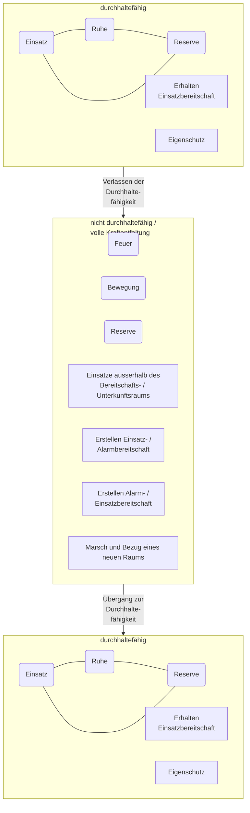
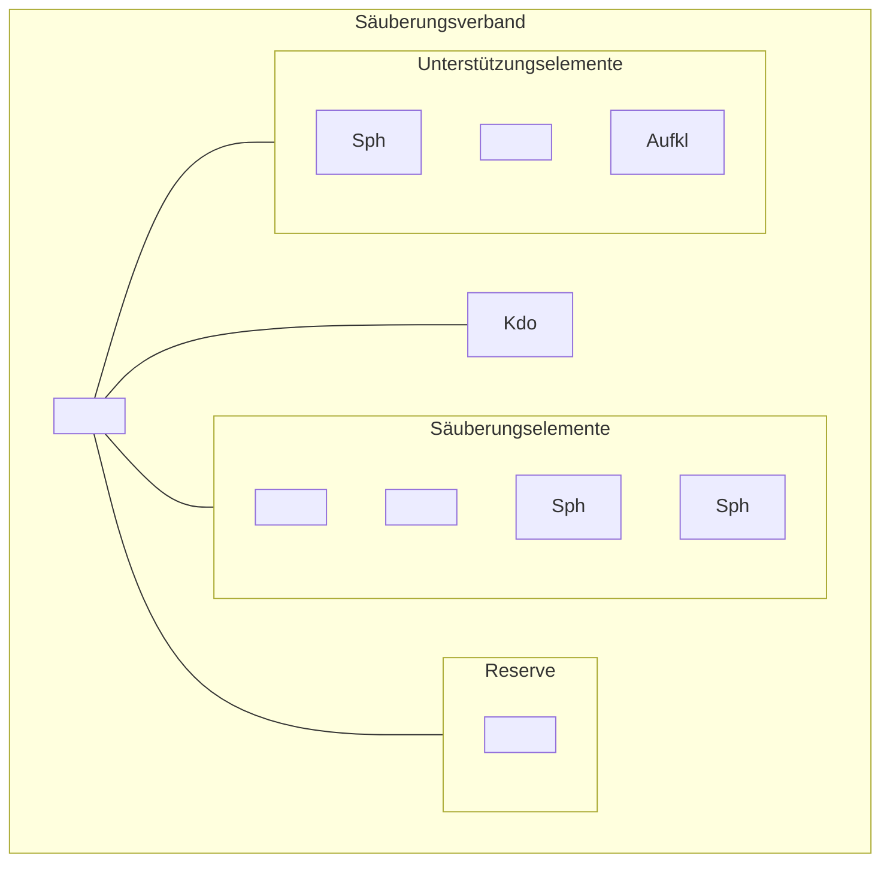
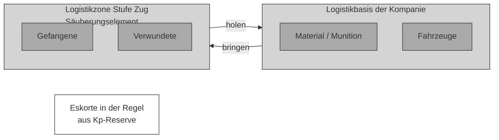

Schweizerische Eidgenossenschaft
Confédération suisse
Confederazione Svizzera
Confederaziun svizra

**Schweizer Armee**

Arbeitshilfe 53.005.23 d

# Einsatzverfahren der Infanteriekompanie

(Ei Verf Inf Kp)


Stand am 01.01.2023
SAP 2583.9475


Schweizerische Eidgenossenschaft
Confédération suisse
Confederazione Svizzera
Confederaziun svizra

**Schweizer Armee**

Arbeitshilfe 53.005.23 d

# Einsatzverfahren der Infanteriekompanie

(Ei Verf Inf Kp)

Stand am 01.01.2023

Arbeitshilfe 53.005.23 d Einsatzverfahren der Infanteriekompanie

# Verteiler

Persönliche Exemplare
* Berufsoffiziere und –unteroffiziere der Infanterie
* Offiziere und höhere Unteroffiziere der Infanterie (ohne Berufsmilitär)

Unpersönliche Exemplare
* keine

II

Arbeitshilfe 53.005.23 d Einsatzverfahren der Infanteriekompanie

# Bemerkungen

1 Die vorliegende Arbeitshilfe ist Teil des Sammelbandes ‹Die Infanterie› und liefert detaillierte Kenntnisse über die Führung und Organisation eines Infanteriebataillons im Einsatz.

2 Zugunsten der Lesbarkeit wird in dieser Arbeitshilfe das generische Maskulin verwendet.

## Inhalt und Gliederung

3 In der vorliegenden Arbeitshilfe wird jedes Einsatzverfahren umfangreich und detailliert beschrieben. Die ausführlichen Erklärungen dienen der Vertiefung in die Materie und beschreiben Standardverhalten. In der Anwendung kann dementsprechend aufgrund einer Lagebeurteilung von diesen Standardverhalten abgewichen werden.

4 Jedes Kapitel ist gegliedert in:
* Grundsätzliches;
* Die drei Phasen des Einsatzverfahrens.

## Ansprechgruppen

5 Die Arbeitshilfe wurde für Taktiker, also für die Anwendung auf der taktische Stufe, geschrieben.

6 Die Arbeitshilfe soll vor allem von drei Ansprechgruppen benutzt werden:
* Verbandsführer/Stabsoffiziere und -unteroffiziere in der Anlern- und Festigungsstufe der Führungsausbildung;
* Berufsmilitär in Kader- und Rekrutenschulen;
* Projektleiter für Neubeschaffungen/Weiterentwicklung.

III

Arbeitshilfe 53.005.23 d Einsatzverfahren der Infanteriekompanie

## Anwendung im Lernprozess


*Abbildung 1: Schema zum Lernprozess*

7 Die Arbeitshilfe soll dem Verbandsführer/Stabsoffizier helfen, ein Einsatzverfahren zu begreifen und zu verinnerlichen.

8 Anlern- und Festigungsstufe der Führungsausbildung müssen zwingend im angeleiteten Unterricht erfolgen. Dabei sind folgende drei Schritte anzuwenden:
* Angeleitetes Erarbeiten des Verfahrens;
* Überprüfung des Erlernten durch selbständiges Erläutern der Abbildungen;
* Umlegen der Abbildungen in ein Mustergelände.

9 Die Anwendungsstufe der Führungsausbildung erfolgt im Rahmen der Verbandsausbildung. Erst in dieser Phase der Ausbildung soll bewusst vom Einsatzverfahren abgewichen werden.

IV

Arbeitshilfe 53.005.23 d Einsatzverfahren der Infanteriekompanie

# Abbildung 2: Portfolio der Einsatzverfahren der Infanterie (nicht abschliessend)

```description
The image is a complex matrix diagram showing the portfolio of infantry deployment procedures across different operational situations (Normal, Special, and Extraordinary). It uses a color-coded system (green for procedures, black circles for codes) and categorizes them under different types of military actions (Protective Actions, Combatting Armed Groups, and Defense against Terrestrial Advance).
```

### Lage-Kategorien (Situational Categories)

*   **Normale Lage**: Bewältigung von Katastrophen, Notlagen und Aufgaben nationaler Bedeutung. (Subsidiärer Einsatz der Armee)
*   **Besondere Lage**: Prävention und Abwehr von Bedrohungen der inneren Sicherheit.
*   **Ausserordentliche Lage**: Prävention und Abwehr eines bewaffneten Angriffs; Bewältigung von konkreten, zeitlich anhaltenden, landesweiten und nur mit militärischen Mitteln bekämpfbaren Bedrohungen der territorialen Integrität, der gesamten Bevölkerung oder der Ausübung der Staatsgewalt. (Originärer Einsatz der Armee)

### Einsatzverfahren (Deployment Procedures)

**Schützende Aktionen**
*   **B.07** Unterstützungs- und Sicherungseinsätze
*   **K.02** Schutz eines Objekts / Eigenschutz
*   **Z.17** Verhalten bei / nach einem Lufttransport

**Bekämpfung bewaffneter Gruppen**
*   **B.01** Marsch
*   **B.02** Bereitschaftsraum
*   **B.03** Nachrichtenbeschaffung
*   **B.04** Bekämpfung bewaffneter Gruppen
*   **K.01** Marsch und Bezug eines neuen Raums
*   **K.03** Raumüberwachung
*   **K.04** Angriff nach einem Begegnungsgefecht
*   **K.05** Abriegeln und Durchsuchen eines Geländeteils
*   **K.06** Durchsuchen einer urbanen Zone / Ortschaft
*   **Z.01** Verhalten auf dem Marsch (inkl. gesicherter Halt)
*   **Z.02** Verhalten im Begegnungsgefecht / gegnerischen Hinterhalt
*   **Z.03** Verhalten auf der Patrouille
*   **Z.04** Offenhalten einer Bewegungslinie
*   **Z.05** Eskorte als Konvoischutz
*   **Z.06** Verifikation einer Nachricht
*   **Z.07** Durchsuchen eines mehrstöckigen Gebäudes
*   **Z.08** Geländedurchsuchung
*   **Z.09** Trennen von Akteuren
*   **Z.10** Taktischer Checkpoint
*   **Z.11** Evakuation einer urbanen Zone
*   **Z.13** Eskalation und Deeskalation mit Feuer

**Abwehr eines terrestrischen Vorstosses**
*   **B.05** Angriff im überbauten Gelände
*   **B.06** Verteidigung eines Raums
*   **K.07** Einbruch in ein überbautes Gelände
*   **K.08** Angriff entlang einer Bewegungslinie im überbauten Gelände
*   **K.09** Bezug einer Sperrstellung im überbauten Gelände
*   **K.10** Kampf in einer Sperrstellung im überbauten Gelände
*   **K.11** Angriff ohne Verzahnung
*   **Z.12** Vorgehen entlang einer Strasse
*   **Z.14** Bezug einer Sperre
*   **Z.15** Stützpunkt im überbauten Gelände
*   **Z.16** Überfallartige Aktionen

V

Arbeitshilfe 53.005.23 d Einsatzverfahren der Infanteriekompanie

VI

Arbeitshilfe 53.005.23 d Einsatzverfahren der Infanteriekompanie

# Inhaltsverzeichnis

**1 Marsch und Bezug eines neuen Raums (K.01)** 1
1.1 Grundsätzliches 1
1.2 Das Erstellen der Marschbereitschaft im alten Raum 3
1.3 Die Führung auf dem Marsch 7
1.4 Der Bezug des neuen Raums 13

**2 Schutz eines Objekts / Eigenschutz (K.02)** 19
2.1 Grundsätzliches 19
2.2 Der Bezug eines Objekts 24
2.3 Die Organisation der Durchhaltefähigkeit im kleinen Dienstrad 27
2.4 Die Übernahme zusätzlicher Aufgaben im grossen Dienstrad 34

**3 Raumüberwachung (K.03)** 38
3.1 Grundsätzliches 38
3.2 Das Beschaffen von Nachrichten 41
3.3 Das Verifizieren von Nachrichten 45
3.4 Das Sichern von Nachrichten 49

**4 Angriff nach einem Begegnungsgefecht (K.04)** 53
4.1 Grundsätzliches 53
4.2 Das Binden des Gegners und das Schaffen eines Anschlussraums 56
4.3 Die Erweiterung des Kontaktraums zur Angriffsgrundstellung 60
4.4 Der Angriff aus der Flanke 62

**5 Abriegeln und Durchsuchen eines Geländeteils (K.05)** 67
5.1 Grundsätzliches 67
5.2 Das Abriegeln des Fluchtraums und der Flanken 72
5.3 Das Nehmen und Vorbereiten des Anschlussraums 78
5.4 Die Durchsuchung und deren logistische Entlastung 81

**6 Durchsuchen einer urbanen Zone / Ortschaft (K.06)** 86
6.1 Grundsätzliches 86
6.2 Die Vorbereitung des Durchsuchungsraums 95
6.3 Die Durchsuchung und das Sicherstellen der Logistik entlang von zwei Bewegungslinien 100
6.4 Das Abriegeln von Friktionen während der Durchsuchung 103

**7 Einbruch in ein überbautes Gelände (K.07)** 106
7.1 Grundsätzliches 106
7.2 Eintritt in den Einbruchsraum sicherstellen 111
7.3 Die Erweiterung des Einbruchsraums in der Tiefe 116
7.4 Das Etablieren der geschützten Kernzone für Folgeverbände 119

VII

Arbeitshilfe 53.005.23 d Einsatzverfahren der Infanteriekompanie

**8 Angriff entlang einer Bewegungslinie im überbauten Gelände (K.08)** **123**
8.1 Grundsätzliches 123
8.2 Das Passieren des Einbruchsraums 128
8.3 Das Gewinnen von Tiefe im Raum 130
8.4 Das Nehmen des Angriffsziels 135

**9 Bezug einer Sperrstellung im überbauten Gelände (K.09)** **139**
9.1 Grundsätzliches 139
9.2 Die Annäherung in den Verteidigungsraum des Bataillons 143
9.3 Die Kampfvorbereitungen im rückwärtigen Raum und in der Hauptzone des Verteidigungsraums 147
9.4 Die Kampfvorbereitungen im Vorgelände und in der Nebenzone des Verteidigungsraums 154

**10 Kampf in einer Sperrstellung im überbauten Gelände (K.10)** **161**
10.1 Grundsätzliches 161
10.2 Das Binden des Gegners im überbauten Gelände durch die Stützpunktelemente 165
10.3 Der hinhaltende Kampf der Kompanie im Vorgelände 171
10.4 Der Rückzug in den Verteidigungsraum und das Öffnen des Vorgelände für Angriffe des Bataillons 175

**11 Angriff ohne Verzahnung (K.11)** **178**
11.1 Grundsätzliches 178
11.2 Die Zuweisung der Sensoren und der Bezug des Bereitstellungsraums 182
11.3 Die bewegliche Kampfführung innerhalb des zugewiesenen Sektors 184
11.4 Die Reorganisation vor Ort oder die Rückkehr in den rückwärtigen Bataillonsraum 190

VIII

Arbeitshilfe 53.005.23 d Einsatzverfahren der Infanteriekompanie

# Abbildungsverzeichnis

Abbildung 1: Schema zum Lernprozess IV
Abbildung 2: Portfolio der Einsatzverfahren der Infanterie (nicht abschliessend) V
Abbildung 3: Der grössere Rahmen des Einsatzverfahrens 1
Abbildung 4: Die drei Phasen des Einsatzverfahrens Marsch und Bezug eines neuen Raums (K.01) 3
Abbildung 5: Zentrale und dezentrale Führungsorganisation 4
Abbildung 6: Checkliste für das Erstellen der Alarmbereitschaft 5
Abbildung 7: Mögliche Erkundungs-/Aufklärungsaufträge für Vorausaktionen 6
Abbildung 8: Die räumlichen Elemente des Marsches 8
Abbildung 9: Offene und geschlossene Kolonne 10
Abbildung 10: Rundumsicherung auf dem Marsch 11
Abbildung 11: Beseitigung und Umgehung einer Blockade 12
Abbildung 12: Erkennungsmerkmale der Züge (Beispiel) 14
Abbildung 13: Die Vorbereitung des neuen Raums durch das Vorausdetachement 14
Abbildung 14: Die Auskolonnierung auf Stufe Zug 15
Abbildung 15: Checkliste für das Erstellen der Alarmbereitschaft 15
Abbildung 16: Abmarschplanung auf Stufe Kompanie 16
Abbildung 17: Checkliste Erstellen der Einsatzbereitschaft 17
Abbildung 18: Regelung der Verantwortungen im dezentralen Dispositiv 17
Abbildung 19: Zonen mit Polizeibefugnissen der Truppe 19
Abbildung 20: Räumliche Elemente des Objektschutzes / Arten von Schutzzonen 22
Abbildung 21: Die drei Phasen des Schutz eines Objekts / Eigenschutz (K.02) 24
Abbildung 22: Die drei Schritte beim Bezug eines Objekts 25
Abbildung 23: Die Vorbereitung der Evakuation (Eventualplanung) 27
Abbildung 24: Der Zwei- und Dreischichtenbetrieb 28
Abbildung 25: Organisation und Führung des Einsatzelements 29
Abbildung 26: Organisation des Reserveelements 30
Abbildung 27: Führung des Reserveelements 31
Abbildung 28: Möglichkeiten für Regiearbeiten 32
Abbildung 29: Dienstrad und Ablöserhythmus 33
Abbildung 30: Dienstbetriebliche Organisation in der Dreier- und Vierergliederung 34
Abbildung 31: Überlagerung des Objektschutzes durch einen zweiten Auftrag 36

IX

Arbeitshilfe 53.005.23 d Einsatzverfahren der Infanteriekompanie

Abbildung 32: Organisation der Kompanie für die Raumüberwachung 39
Abbildung 33: Die drei Phasen/Intensitätsstufen des Einsatzverfahrens Raumüberwachung (K.03) 40
Abbildung 34: Beschaffen von Nachrichten mit Patrouillen und temporären Checkpoints 42
Abbildung 35: Gleichzeitiges provozieren und registrieren durch das Einsatzelement 44
Abbildung 36: Das Raumüberwachungskonzept auf Stufe Kompanie (Beispiel) 45
Abbildung 37: Möglichkeiten und Intensität beim Verifizieren von Nachrichten 46
Abbildung 38: Die Elemente beim Verifizieren von Nachrichten 47
Abbildung 39: Der Switch der Elemente, um keine Zeit zu verlieren 48
Abbildung 40: Die Elemente beim Sichern von Nachrichten 50
Abbildung 41: Räumliche Koordination der Aktion (Führung) 51
Abbildung 42: Das Begegnungsgefecht als Impuls 53
Abbildung 43: Die drei Phasen des Einsatzverfahrens Angriff nach einem Begegnungsgefecht (K.04) 55
Abbildung 44: Das Schema der vier F und die angestrebten taktischen Leistungen 56
Abbildung 45: Die räumlichen Elemente des Kampfraums 57
Abbildung 46: Die minimalen taktischen Leistungen im Kontaktraum 58
Abbildung 47: Die beiden Möglichkeiten des weiteren Gefechtsverlaufs 59
Abbildung 48: Das Andocken an den Kampfraum 61
Abbildung 49: Die Prioritäten nach Eintreffen der Kompanie im Kampfraum 62
Abbildung 50: Mögliche Angriffsgrundstellungen und -richtungen 63
Abbildung 51: Die Vorbereitung des Flankenangriffs 64
Abbildung 52: Die Portionierung des Angriffsziels 65
Abbildung 53: Der Angriff aus der Flanke 65
Abbildung 54: Möglicher Verlauf des Gefechts / Koordinationsbedarf auf Stufe Kompanie 66
Abbildung 55: Räumliche Elemente am Beispiel Gebirgsgelände 68
Abbildung 56: Räumliche Elemente am Beispiel eines aufgelockerten überbauten Raums 68
Abbildung 57: Räumliche Elemente und Kräftegliederung 69
Abbildung 58: Die drei Phasen des Einsatzverfahrens Abriegeln und Durchsuchen eines Geländeteils (K.05) 72
Abbildung 59: Die räumlichen Elemente des Fluchtraums 73
Abbildung 60: Das Zusammenspiel von Abriegelung und Flankenschutz 74
Abbildung 61: Die zwei Varianten des Abriegelns 75

X

Arbeitshilfe 53.005.23 d Einsatzverfahren der Infanteriekompanie

**Abbildung 62:** Der Einsatz von Bogenfeuer 76
**Abbildung 63:** Abriegeln des Fluchtraums in verschiedenen Geländetypen (Beispiele) 77
**Abbildung 64:** Die räumlichen Elemente des Anschlussraums 79
**Abbildung 65:** Nehmen des Anschlussraums in verschiedenen Geländetypen (Beispiele) 80
**Abbildung 66:** Die räumlichen Elemente des Durchsuchungsraums 82
**Abbildung 67:** Beurteilung der Durchsuchungsrichtung 83
**Abbildung 68:** Vorgehen im Durchsuchungsraum in verschiedenen Geländetypen (Beispiele) 84
**Abbildung 69:** Die beiden überbauten Geländetypen 87
**Abbildung 70:** Die räumlichen Elemente am Beispiel einer Ortschaft 88
**Abbildung 71:** Die Raumverantwortung 89
**Abbildung 72:** Die Koordinationsaufgaben 90
**Abbildung 73:** Die Möglichkeiten des Bogenfeuers 92
**Abbildung 74:** Die Orientierungshilfen der Führung 93
**Abbildung 75:** Die drei Phasen des Einsatzverfahrens Durchsuchen einer urbanen Zone/Ortschaft (K.06) 95
**Abbildung 76:** Das Etablieren des Sensor-Wirkungsverbunds 96
**Abbildung 77:** Die Grobplanung des Anschlussraums 97
**Abbildung 78:** Die Feinplanung des Anschlussraums 98
**Abbildung 79:** Die Überwachung des Fluchtraums mit Sensoren 99
**Abbildung 80:** Der Einsatz eines Infanteriezuges im Fluchtraum (Beispiel) 99
**Abbildung 81:** Die räumlichen Elemente des Durchsuchungsraums 101
**Abbildung 82:** Die Koordinationsmassnahmen zur Führung der Durchsuchungselemente 101
**Abbildung 83:** Der Koordinationsbedarf für den Kompaniekommandanten (Beispiel) 102
**Abbildung 84:** Das Sichern einer Phasenlinie auf Stufe Zug 103
**Abbildung 85:** Der Übergang zum Angriff 104
**Abbildung 86:** Das Schlauchprinzip 105
**Abbildung 87:** Der Bataillonsrahmen 107
**Abbildung 88:** Die räumlichen Elemente beim Einbruch in ein überbautes Gelände 108
**Abbildung 89:** Die Abrieglung durch das Bataillon 109
**Abbildung 90:** Die drei Phasen des Einsatzverfahrens des Einbruchs in ein überbautes Gelände (K.07) 111
**Abbildung 91:** Annäherung und Übergang zum Stoss 112
**Abbildung 92:** Das Nehmen des Ortsrands im Einbruchsstreifen 114
**Abbildung 93:** Das Erreichen der ersten Querstrasse im Einbruchsstreifen 115

XI

Arbeitshilfe 53.005.23 d Einsatzverfahren der Infanteriekompanie

**Abbildung 94:** Die Möglichkeiten zur Beeinflussung des Gefechts nach dem Nehmen des Einbruchsraums 116
**Abbildung 95:** Die Koordination der Säuberung im Einbruchsstreifen 117
**Abbildung 96:** Das Vorgehen in der Säuberungsraum im Einbruchsstreifen 119
**Abbildung 97:** Die Umgliederung des Einbruchsverbands 121
**Abbildung 98:** Der Endausbau des Einbruchsraums (mögliche Lösung) 121
**Abbildung 99:** Der Bataillonsrahmen 123
**Abbildung 100:** Die räumlichen Elemente beim Angriff entlang einer Bewegungslinie 125
**Abbildung 101:** Die Einsatzgliederung des Säuberungsverbands (mögliche Lösung) 126
**Abbildung 102:** Die drei Phasen des Einsatzverfahrens des Angriffs entlang einer Bewegungslinie im überbauten Gelände (K.07) 127
**Abbildung 103:** Das Einfliessen in den Einbruchsraum 128
**Abbildung 104:** Die Ablösung des Einbruchsverbands 129
**Abbildung 105:** Das Gewinnen von Tiefe über Zwischenziele 130
**Abbildung 106:** Der Ausbruch aus der Angriffsgrundstellung 131
**Abbildung 107:** Das Nehmen eines Zwischenziels (Beispiel) 132
**Abbildung 108:** Das Prinzip der Evakuation von Verwundeten und Gefangenen 133
**Abbildung 109:** Die Kombination von Hol- und Bringprinzip zu Gunsten der Frontverbände 134
**Abbildung 110:** Möglichkeiten für das Nehmen des Angriffsziels 136
**Abbildung 111:** Der Kompanie-Angriffsstreifen kurz vor dem Stoss ins Angriffsziel (Beispiel) 137
**Abbildung 112:** Das Nehmen des Angriffsziels (Beispiel) 138
**Abbildung 113:** Der Bataillonsrahmen 139
**Abbildung 114:** Räumliche Elemente beim Bezug einer Sperrstellung 140
**Abbildung 115:** Einsatzgliederung des Sperrverbands (mögliche Lösung) 142
**Abbildung 116:** Die drei Phasen des Einsatzverfahrens des Bezugs einer Sperrstellung im überbauten Gelände (K.09) 143
**Abbildung 117:** Vorleistungen des Bataillons / Annäherung des Sperrverbands 144
**Abbildung 118:** Verhalten gegenüber der Zivilbevölkerung im Kampfraum 146
**Abbildung 119:** Das Eintreffen des Sperrverbands im Verteidigungsraum des Bataillons 147
**Abbildung 120:** Die Schwergewichte im rückwärtigen Raum 149
**Abbildung 121:** Die Einsatzmöglichkeiten im Verteidigungsraum des Bataillons 150

XII

Arbeitshilfe 53.005.23 d Einsatzverfahren der Infanteriekompanie

**Abbildung 122:** Die Schwergewichte der statischen und beweglichen Kampfführung 150
**Abbildung 123:** Räumliche Elemente beim Bezug der beiden Stützpunkte 151
**Abbildung 124:** Binden, kanalisieren und abnützen des Gegners im überbauten Gelände 155
**Abbildung 125:** Kampfvorbereitungen für den Einsatz der Stützpunktelemente im Vorgelände 156
**Abbildung 126:** Kampfvorbereitungen für den Einsatz der Kompaniereserve im Vorgelände 157
**Abbildung 127:** Kampfvorbereitungen für den Einsatz des Bataillons im Vorgelände 158
**Abbildung 128:** Kampfvorbereitungen für den Einsatz der Kompaniereserve in der Nebenzone 159
**Abbildung 129:** Der Bataillonsrahmen 161
**Abbildung 130:** Räumliche Elemente beim Kampf in einer Sperrstellung 162
**Abbildung 131:** Bereitstellung des Sperrverbands nach den Kampfvorbereitungen 163
**Abbildung 132:** Die drei Phasen des Einsatzverfahrens des Kampfs in einer Sperrstellung im überbauten Gelände (K.10) 165
**Abbildung 133:** Die Schwergewichtsverlagerung bei Kampfbeginn (Beispiel) 166
**Abbildung 134:** Die Kampfaufnahme im Vorgelände 167
**Abbildung 135:** Die Koordination der Bewegungszonen und Stellungsräume 168
**Abbildung 136:** Feuerräume und gefährdete Zonen 169
**Abbildung 137:** Urbanes Führungsraster zur Führung und Koordination der beweglichen Kampfführung im Vorgelände (Beispiel) 170
**Abbildung 138:** Übersichtsmatrix für den Einsatz des Mörserfeuers 170
**Abbildung 139:** Die räumlichen Elemente bei der beweglichen Kampfführung auf Stufe Kompanie 172
**Abbildung 140:** Der Koordinationsbedarf auf Stufe Kompanie 173
**Abbildung 141:** Detailansicht bewegliche Kampfführung (am Beispiel Nebenzone links) 174
**Abbildung 142:** Die Bedeutung des Vorgeländes im Gesamtrahmen des Bataillons 175
**Abbildung 143:** Das Dispositiv des Sperrverbands im reduzierten Verteidigungsraum des Bataillons 177
**Abbildung 144:** Der Bataillonsrahmen 178
**Abbildung 145:** Räumliche Elemente beim Angriff ohne Verzahnung 179
**Abbildung 146:** Einsatzgliederung für den Angriff ohne Verzahnung (mögliche Lösung) 180

XIII

Arbeitshilfe 53.005.23 d Einsatzverfahren der Infanteriekompanie

Abbildung 147: Die drei Phasen des Einsatzverfahrens des Angriffs ohne Verzahnung (K.11) 182
Abbildung 148: Der Marsch in den Bereitstellungsraum 183
Abbildung 149: Räumliche Organisation des Bereitstellungsraums (mögliche Lösung) 184
Abbildung 150: Kräftegliederung für die bewegliche Kampfführung 185
Abbildung 151: Der gleichzeitige Einsatz beider Züge in zwei Vernichtungsräumen 186
Abbildung 152: Der gleichzeitige Einsatz beider Züge in einem Vernichtungsraum 187
Abbildung 153: Der gestaffelte Einsatz der beiden Züge 188
Abbildung 154: Der Feuerkampf des Zuges mit weitreichender Panzerabwehr 189
Abbildung 155: Das Zurücknehmen der Angriffselemente 191
Abbildung 156: Die Möglichkeiten der logistischen Reorganisation 192

XIV

Arbeitshilfe 53.005.23 d Einsatzverfahren der Infanteriekompanie

# 1 Marsch und Bezug eines neuen Raums (K.01)

## 1.1 Grundsätzliches

10 Eine Kompanie ist über längere Zeit durchhaltefähig, wenn sie Sicherung, Ablösung und Dienstbetrieb zentral steuert, so dass immer mindestens ein Element ruhen kann (Rotation der einzelnen Elemente zwischen Einsatz, Reserve und Ruhe). Diese Organisationsform, in der die Kompanie ihre volle Kampfkraft nicht konzentriert zum Tragen bringen kann, kommt vor allem im Objektschutz und im Bereitschaftsraum zum Tragen.

11 Kommt die Kompanie als Ganzes zum Einsatz, so muss sie die Durchhaltefähigkeit verlassen (Möglichkeit des gleichzeitigen Einsatzes von Feuer, Bewegung und Reserve).

12 Das folgende Einsatzverfahren regelt die Mechanik des Übergangs zwischen diesen beiden Zuständen am Beispiel des Marsches und des Bezugs eines neuen Raums (Bereitschafts- resp Bereitstellungsraum).



*Abbildung 3: Der grössere Rahmen des Einsatzverfahrens*

13 Der Marsch sowie der Bezug eines neuen Raums werden durch das Bataillon ausgelöst und gesteuert.

1

Arbeitshilfe 53.005.23 d Einsatzverfahren der Infanteriekompanie

14 Die Kompanie ist im alten Raum dafür zuständig, dass sie auf den befohlenen Zeitpunkt über den befohlenen Einkolonnierungspunkt (EKP) in den Bataillonsmarsch einfliessen kann. Das Bataillon koordiniert den Marsch mittels Marschstrassen, Weg- und Fixpunkten, Phasenlinien und taktischen Vorausaktionen. Nach dem Passieren des befohlenen Auskolonnierungspunkts (AKP) ist die Kompanie dafür verantwortlich, den befohlenen neuen Kompanieraum zu beziehen.

15 Die Verweildauer in einem Raum ist lageabhängig. Die Kompanie muss jederzeit alarmiert, unabhängig vom jeweiligen Bereitschaftsgrad möglichst rasch in Marsch gesetzt werden können und in der Lage sein, den Standort zu halten.

16 Eine Infanteriekompanie benötigt eine Ortschaft von ca 20 grösseren Gebäuden, worin die Fahrzeuge eingestellt werden können. Je nach Lage ist es auch möglich, Teile oder die ganze Kompanie in einer oder in mehreren Tiefgaragen oder Industriehallen zu zentralisieren.

17 Bei der Wahl eines Kompanieraums müssen folgende Kriterien berücksichtigt werden:
* Rascher Abmarsch in alle möglichen Einsatzrichtungen;
* zweckmässige Tarnung und Auflockerung;
* Sicherung mit geringen Mitteln;
* möglichst gute Unterkunft;
* einfache, rationelle Versorgung.

18 Im Kompanieraum gilt grundsätzlich der Telematikbereitschaftsgrad SE-Ein, damit die Funkgeräte synchronisiert bleiben. Gefunkt wird nur bei besonderen Ereignissen wie Kontakt mit dem Gegner, Luftlandung oder ABC-Ereignissen. Ansonsten werden die Verbindungen durch Feldtelefon oder fest installierte Telefon-, Fax- und Internetleitungen sichergestellt.

**Die drei Phasen des Einsatzverfahrens**

19 Im Einsatzverfahren werden drei Phasen unterschieden:
1. Erstellen der Marschbereitschaft im alten Raum;
2. Führung auf dem Marsch;
3. Bezug des neuen Raums.

2

Arbeitshilfe 53.005.23 d
Einsatzverfahren der Infanteriekompanie


*Abbildung 4: Die drei Phasen des Einsatzverfahrens Marsch und Bezug eines neuen Raums (K.01)*

## 1.2 Das Erstellen der Marschbereitschaft im alten Raum

**Der Übergang in die dezentrale Führungsstruktur**

20 Das Erstellen der Marschbereitschaft umfasst alle Massnahmen, um den Raum rasch und geordnet verlassen zu können. Sie umfasst
* das Erstellen der Einsatzbereitschaft;
* das Erstellen der Alarmbereitschaft.

21 Um die Marschbereitschaft zu erstellen ist es notwendig, die zentrale, auf Stufe Kompanie geführte Führungs- und Sicherungsorganisation zu verlassen und eine dezentrale, auf Stufe Zug geführte und gesicherte Organisation einzunehmen.

22 Die Kompanie wird bezüglich ihrer Aufgabe im neuen Raum so gegliedert, dass die Zugführer noch vor dem Marsch über die ihnen zugeteilten Truppen und Mittel verfügen.

23 Die Einsatzbereitschaft der Züge sowie Neuunterstellungen werden normalerweise noch in der zentral gesicherten Organisation erstellt. Dazu werden

3

Arbeitshilfe 53.005.23 d Einsatzverfahren der Infanteriekompanie

die Bedürfnisse der Nachschubklassen II (Grundausrüstung), V (Munition), VI (Persönliches Material + Feldpost) und VII (Fahrzeuge/Waffen/Geräte) abgedeckt. Fahrzeuge, Waffen und Geräte werden unterhalten und instand gestellt. Die Munition ist so zu verteilen, dass die Züge für den anstehenden Marsch und den Bezug des neuen Raums über eine möglichst grosse, der Bedrohungslage angepasste Munitionsautonomie verfügen.


*Abbildung 5: Zentrale und dezentrale Führungsorganisation*

24 Zum Erstellen der Alarmbereitschaft werden die Sicherungselemente auf Stufe Kompanie eingezogen. Der Kompaniekommandant reduziert die taktische Schutzleistung und weist jedem Infanteriezug einen Sektor des Raums zur Überwachung zu. Jeder Zug reduziert in seinem Sektor vorhandene Schutzbauten und Härtungen auf ein Minimum.

25 Nach Auslösung der Dezentralisierung durch den Kompaniekommandanten gehen die Zugführer nach folgender Checkliste vor und melden deren Vollzug.

<table>
    <tr>
        <td>(1)</td>
        <td>&lt;mark style="background-color: lightgray"&gt;Nahsicherung Stufe Zug aufbauen;&lt;/mark&gt;</td>
    </tr>
    <tr>
        <td>(2)</td>
        <td>&lt;mark style="background-color: lightgray"&gt;Beobachtung in die nächste Geländekammer sicherstellen;&lt;/mark&gt;</td>
    </tr>
    <tr>
        <td>(3)</td>
        <td>&lt;mark style="background-color: lightgray"&gt;Reserve auf Stufe Zug bezeichnen;&lt;/mark&gt;</td>
    </tr>
    <tr>
        <td>(4)</td>
        <td>&lt;mark style="background-color: lightgray"&gt;Einweisung ins Zugsdispositiv sicherstellen;&lt;/mark&gt;</td>
    </tr>
</table>

4

Arbeitshilfe 53.005.23 d Einsatzverfahren der Infanteriekompanie

<table>
  <tbody>
    <tr>
        <td>(5)</td>
        <td>Fahrzeuge in Abfahrtrichtung marschbereit machen;</td>
    </tr>
    <tr>
        <td>(6)</td>
        <td>Verbindungen innerhalb des Zuges, zum Nachbarverband und zur Kompanie überprüfen;</td>
    </tr>
    <tr>
        <td>(7)</td>
        <td>Alarmierung innerhalb des Zuges sicherstellen;</td>
    </tr>
    <tr>
        <td>(8)</td>
        <td>Letzte Funktionskontrollen an Fahrzeugen, Waffen und Geräten durchführen;</td>
    </tr>
    <tr>
        <td>(9)</td>
        <td>Befehlsausgabe / taktischen Dialog mit Unterstellten durchführen;</td>
    </tr>
    <tr>
        <td>(10)</td>
        <td>Marschbereitschaft an Kompanie übermitteln.</td>
    </tr>
  </tbody>
</table>
*Abbildung 6: Checkliste für das Erstellen der Alarmbereitschaft*

26 Der Abmarsch muss für alle Richtungen vorbereitet werden. Die Kompanie muss bereit sein, ihren Raum auf Stichwort über Einkolonnierungspunkte zu verlassen. Normalerweise wird immer dieselbe Marschgliederung gewählt, egal in welche Richtung abmarschiert wird.

27 Der neu zu beziehende Raum ist bezüglich Logistikbedürfnissen zu analysieren. Dies gilt insbesondere für die Nachschubklassen I (Verpflegung), III (Betriebsstoffe) und IV (Bau- und Geniematerial). Allenfalls ist die Verpflegungs- und Treibstoffautonomie zu erhöhen. Die Kompanie meldet dem Bataillon, welche Leistungen nicht selber erbracht werden können. Diese Bedürfnisse sind wenn immer möglich vor Marschbeginn abzudecken.

**Die Vorausaktionen**

28 Werden vom Bataillon Elemente der Kompanie für taktische Vorausaktionen benötigt, stellt der Kompaniekommandant sicher, dass diese über die notwendigen Funknetze verfügen und für ihre Aufgabe richtig ausgerüstet sind. Er berücksichtigt für die Marschgliederung, dass ihm diese Elemente während dem Marsch nicht zur Verfügung stehen.

29 Das Bataillon führt alle Vorausaktionen, die mehreren Kompanien zur Verfügung gestellt werden. Die sind insbesondere
* Sicherstellung der Übermittlung auf der Marschachse und im neuen Raum;
* Aufklärung, Sicherung und Überwachung der Marschachse (Marschstrassen und Rochademöglichkeiten);
* Nachrichtenbeschaffung und Überwachung im neuen Raum;
* Bereitstellung von Mitteln als Bataillonsreserven.

30 Die Kompanie führt alle Vorausaktionen, die der Erkundung, Aufklärung, Sicherung, Überwachung und Einweisung im neuen Raum dienen.

31 Der Kompaniekommandant bestimmt in der Regel einen Infanteriezug als Erkundungs- und Aufklärungselement und erhöht dessen Marschbereit-

5

Arbeitshilfe 53.005.23 d
Einsatzverfahren der Infanteriekompanie

schaft so, dass er mit genügend zeitlichem Vorsprung vor der Kompanie abmarschieren kann.

32 Je nach Situation können weitere massgeschneiderte Vorausdetachemente gebildet werden, um im neuen Raum Absprachen mit zivilen Behörden zu führen oder Führungs- und Logistikinfrastruktur vorzubereiten (z B Teile der Kommandantenstaffel mit dem Stellvertreter des Kompaniekommandanten, Feldweibel und/oder Fourier, usw). Diese werden lagebezogen durch einen Infanteriehalbzug eskortiert oder verschieben unerkannt als normale Verkehrsteilnehmer in zivilen Umfeld.

33 Technische Vorausaktionen im neuen Raum betreffen die Erkundung
* von mehreren Zu- und Wegfahrten;
* des Auskolonnierungspunkts aus dem Bataillonsmarsch;
* der Orte für die Einweisung der Züge;
* der Räume für die Infanteriezüge (pro Zug in der Regel eine Strasse mit vier Häusern, pro Gruppe ein Haus mit einem geschützten Raum und einer Möglichkeit für das Abstellen des Einsatzfahrzeugs);
* des Standorts des Kommandozuges und des allenfalls unterstellten Mörser-/Späherzuges, des Kommandopostens und der Logistik (in der Regel 2–3 Häuser oder eine Tiefgarage im Zentrum des Dispositivs).


```description
Die Abbildung zeigt eine Luftaufnahme eines Siedlungsgebiets mit überlagerten grafischen Elementen:
- Weiße gestrichelte Kreise markieren verschiedene Zonen im Dorf.
- Grüne Gebäudemodelle heben spezifische Häuser hervor.
- Graue Pfeile markieren Zu- und Wegfahrten.
- Weiße Kreise auf den Wegen markieren Einweisungsorte.
- Ein Pfeil am rechten Rand zeigt auf den "AKP" (Auskolonierungspunkt).
- Textfelder ordnen den grafischen Elementen Begriffe zu: "Standort Kommandozug / unterstellte Züge", "Standort Infanteriezug", "Zu- und Wegfahrten", "Auskolonierungspunkt" und "Einweisungsorte für Züge".
```

*Abbildung 7: Mögliche Erkundungs-/Aufklärungsaufträge für Vorausaktionen*

6

Arbeitshilfe 53.005.23 d
Einsatzverfahren der Infanteriekompanie

34 Das Vorausdetachement beantragt beim Kompaniekommandanten allenfalls einen anderen Raum und bestimmt die Art der Einweisung vor Ort (Verkehrsregelung mit Fanions, Setzen von Jalons, Abgabe von Krokis, usw).

35 Taktische Vorausaktionen im neuen Raum betreffen
* Aufklärung, Durchsuchung und allenfalls Abriegelung;
* Überwachen des taktisch zusammenhängenden Geländes;
* minimale Sicherung.

36 Bei einer möglichen Gewalteskalation muss das Vorausdetachement so gegliedert sein, dass es im Fall eines Gefechts während dem Bezug des neuen Raums für die Kompanie günstigen Voraussetzungen für das Führen eines Begegnungsgefechts schaffen kann.

37 Das Vorausdetachement verschiebt über die der Kompanie zugeteilte Marschstrasse in den neuen Raum. Der Kompaniekommandant koordiniert den Marsch seines Vorausdetachements mit dem Bataillon, um sicherzustellen, dass es zu keinen Friktionen mit Vorausaktionen des Bataillons oder mit anderen marschierenden Kompanien kommt.

38 Der als Vorausdetachement bestimmte Infanteriezug wird zur Kompaniereserve, sobald die Kompanie im neuen Raum eingetroffen ist und eingewiesen wurde. Er überwacht weiterhin das taktisch zusammenhängende Gelände des Kompanieraums und hält sich bereit, um gemäss Eventualplanung des Kompaniekommandanten eingesetzt zu werden. Sobald die Züge ihre Dispositive selbst sichern können, bezieht er auf Befehl des Kompaniekommandanten den ihm zugewiesenen Standort im neuen Raum.

## 1.3 Die Führung auf dem Marsch

39 Beim Marsch geht es darum, die Kompanie unter Aufrechterhaltung der Verbindungen von einem alten Raum in einen neuen zu verschieben. Die Kompanie muss sich auf der Verschiebung selbst vor Überraschungen schützen und blockiertes Gelände rasch umfahren können. Der Marsch kann aufgesessen oder abgesessen erfolgen.

40 Der Marsch erfolgt meistens im Bataillonsverband. Die Kompanie wird dafür eine oder mehrere Marschstrassen zugewiesen.

41 Der Marsch wird in der Regel auf der Landeskarte 1:50'000 geführt. Er erfolgt auf Strassen oder Wegen, dem Gelände und der Witterung angepasst und wird mittels vom Bataillon vorgegebenen Weg- und Fixpunkten sowie Phasenlinien koordiniert, welche die Führung des Bataillonsmarsches mit mehreren Kompanien gleichzeitig erlauben.

7

Arbeitshilfe 53.005.23 d Einsatzverfahren der Infanteriekompanie

42 Wegpunkte dienen der Bestimmung des Standortes sowie der Führung und Koordination des Marsches. Fixpunkte sind genau bezeichnete Orte, die die Kompanie zu einer bestimmten Zeit zu erreichen oder zu überschreiten hat.

43 Der Marsch beginnt mit dem Überschreiten des Einkolonnierungspunkts und endet mit dem Überschreiten des Auskolonnierungspunkts. Die Zugführer führen ihre Züge auf Sicht. Sie melden dem Kompaniekommandanten, sobald das letzte Element des Zuges einen Weg- oder Fixpunkt überschritten hat. Der Kompaniekommandant meldet dem Bataillonskommandanten, sobald das letzte Element der Kompanie einen Weg- oder Fixpunkt überschritten hat.

44 Der Einkolonnierungspunkt des Bataillonsmarsches ist durch die Kompaniespitze zur Fixzeit gemäss Marschtabelle zu überschreiten. Organisation und Führung der Bewegung bis zum Einkolonnierungspunkt liegen in der Verantwortung der Kompanie. Allenfalls ist auf Stufe Kompanie ein zusätzlich vorgelagerter Einkolonnierungspunkt für die Züge zu definieren.

45 Der Auskolonnierungspunkt des Bataillons beendet den durch das Bataillon geführten Marsch. Ab hier trägt die Kompanie die Verantwortung für die Führung bis zum Erreichen des Marschzieles. Für die Auskolonnierung der Züge im neuen Raum ist allenfalls ein zusätzlicher nachgelagerter Auskolonnierungspunkt zu definieren.

46 Der Kompaniekommandant wählt seinen Standort innerhalb der Marschformation dort, wo er die geschlossene Formation der Kompanie am besten überblicken und führen kann.


Abbildung 8: Die räumlichen Elemente des Marsches

8

Arbeitshilfe 53.005.23 d
Einsatzverfahren der Infanteriekompanie

## Die Marschformationen

47 Die Marschformation richtet sich nach den Umweltverhältnissen (Strassenzustand, Sicht, Witterung) und nach dem aktuellen Lagebild (gegnerische Bedrohung, Zustand der Zivilbevölkerung, mögliche Friktionsquellen).

48 Die Infanteriekompanie verschiebt grundsätzlich in Kolonne. Dabei eskortieren die Infanteriezüge den Kommandozug und allenfalls zusätzlich unterstellte Züge (Mörser, Späher).

49 Der vorderste Infanteriezug der geschlossenen Kompaniekolonne wird als Spitzenzug bezeichnet. Dieser übernimmt auf dem Marsch planbare taktische Vorausaktionen und erlaubt dem Kompaniekommandanten während dem Marsch rasch auf unerwartete Friktionen zu reagieren und so Voraussetzungen für ein Agieren der restlichen Marschkolonne zu schaffen. Der Spitzenzug ist jederzeit bereit, den Abstand zum Rest der Kompanie im Sinn einer Reaktionszeit zu vergrössern.

50 Aufgaben des Spitzenzuges während dem Marsch können sein:
* Erkennen und Melden von Blockaden;
* Erkunden und Aufklären einer Rochade;
* Erkunden, Öffnen und Offenhalten einer Passage obligé;
* Abriegeln eines Geländeteils;
* Binden des Gegners beim Begegnungsgefecht;
* usw.

51 Es wird zwischen der offenen und der geschlossenen Kolonne unterschieden. Die offene Kolonne ist nur möglich, wenn ausschliesslich taktische Elemente marschieren und somit keine Elemente eskortiert werden müssen. Sie wird in der Regel bei Tageslicht angewendet oder in der Nacht, wenn mit Tarnlicht und Restlichtverstärkern verschoben wird. Die Verbindung zwischen den Zügen besteht über das Funknetz. Der Vorteil dieser Formation liegt in der hohen Reaktionsfähigkeit aufgrund der grossen Abstände.

9

Arbeitshilfe 53.005.23 d
Einsatzverfahren der Infanteriekompanie


*Abbildung 9: Offene und geschlossene Kolonne*

52 Die geschlossene Kolonne ist zwingend, wenn in der Kolonne Elemente marschieren, die sich nicht selber schützen können und darum eskortiert werden müssen. Die geschlossene Kolonne wird in der Regel bei eingeschränkten Sichtverhältnissen angewendet. Die Verbindung zwischen den Zügen besteht über das Funknetz und zusätzlich auch visuell. Der Vorteil dieser Formation liegt in der raschen Verschiebungszeit.

53 Auf dem Marsch ist die Kompanie erhöhten Risiken ausgesetzt. Der Kompaniekommandant trägt diesem Umstand Rechnung, indem er
* eine der Lage und Umwelt angepasste Marschformation wählt;
* rasch und geschlossen verschiebt;
* die Rundumsicherung bis auf Stufe Zug standardisiert;
* die Prinzipien der Tarnung sowie Geräusch- und Lichtdisziplin einhält;
* einen Spitzenzug für unerwartete Friktionen ausscheidet.

10

Arbeitshilfe 53.005.23 d Einsatzverfahren der Infanteriekompanie


*Abbildung 10: Rundumsicherung auf dem Marsch*

### Der Marsch ohne Gefechtsfahrzeuge

54 Die Infanteriekompanie muss in der Lage sein, ohne Gefechtsfahrzeuge zu verschieben. Im Gebirgsgelände wird zu Fuss verschoben oder die Gefechtsfahrzeuge werden durch ungepanzerte Kleinfahrzeuge oder Lufttransportmittel (Helikopter) ersetzt, um der Breite und Tragfähigkeit von Strassen, Wegen und Brücken gerecht zu werden.

55 Der Verlust der Vorteile der Gefechtsfahrzeuge und deren Bordwaffen muss im Gebirgs- wie auch im überbauten Gelände wie folgt kompensiert werden:
* Schutz: Rundumsicherung in der Marschformation bis auf Stufe Gruppe, Ausnützen der Deckungs- und Tarnungsmöglichkeiten vor allem im überbauten Gelände;
* Geschwindigkeit: Schaffen von Reaktionszeit durch dem Gelände angepasste Marschformationen, Vorausdetachemente und Sicherungselemente entlang des Marschstreifens und vor allem an Passages obligés;
* Feuer: Kompensation der Bordwaffen durch leichte Maschinengewehre (Feuergeschwindigkeit) und Waffen mit Sprengwirkung (Panzerabwehrwaffen, Gewehrgranaten).

11

Arbeitshilfe 53.005.23 d
Einsatzverfahren der Infanteriekompanie

56 Beim Marsch mit Lufttransportmitteln (Helikopter) und ungepanzerten Kleinfahrzeugen muss darauf geachtet werden, dass im Spitzenfahrzeug oft mehr Feuerkraft bereit gestellt werden muss als in den nachfolgenden Fahrzeugen (Sicherung von Landezonen, Reaktion auf unerwartete Friktionen).

57 Muss die Kompanie in einen Raum verschieben, der für Gefechtsfahrzeuge nicht, noch nicht oder nicht mehr zugänglich ist, so wird mit diesen so nahe wie möglich an diesen Raum heran verschoben, um möglichst lange über die Feuerkraft der Bordwaffen zu verfügen. Die zurück bleibenden Gefechtsfahrzeuge müssen durch Truppen gesichert und so rasch als möglich nachgeführt werden.

**Das Verhalten bei blockierter Marschstrasse**

58 Eine Blockade der Marschstrasse wird durch den Spitzenzug aufgefangen. Dieser sichert sofort das taktisch zusammenhängende Gelände des Ereignisses/Gefechts und erstattet Meldung an den Rest der marschierenden Kompanie.

59 Die durch die Blockade nicht betroffenen Elemente der Kompanie beziehen zugsweise gesicherte Halte an der Marschstrasse. Die Marschreihenfolge wird beibehalten.


Abbildung 11: Beseitigung und Umgehung einer Blockade

12

Arbeitshilfe 53.005.23 d Einsatzverfahren der Infanteriekompanie

60 Der Zugführer des Spitzenzuges orientiert den Kompaniekommandanten über die Lage am Ort der Blockade (Gegner / Grund der Behinderung, Zustand eigener Truppen, getroffene Massnahmen). Erfolgt der Marsch im Bataillonsrahmen, beantragt der Kompaniekommandant beim Bataillon, die Blockade entweder zu beseitigen oder zu umfahren. Der Bataillonskommandant koordiniert das weitere Vorgehen der betroffenen Kompanie mit dem gesamten Bataillonsmarsch (z B Einleiten von Rochaden auf andere Marschstrassen).

61 Bei einer Beseitigung der Blockade öffnet der Spitzenzug die Marschstrasse, sichert diese beim Passieren für den Rest der Kompanie und wird anschliessend zum letzten Element der Kompanie. Der Kompaniekommandant regelt die neue Marschreihenfolge.

62 Eine Umgehung der Blockade wird durch das Bataillon durch die Zuteilung einer Rochade und eines entsprechenden Zeitfensters für deren Benützung geregelt. Der Kompaniekommandant regelt die neue Marschreihenfolge. Der durch die Blockade gebundene Infanteriezug löst sich von dieser und wird zum letzten Element der Kompanie.

63 In allen Fällen kann es nötig werden, Kräfte am Ort der Blockade zurückzulassen, um den Ort zu sichern oder dort den Kampf zu führen.

## 1.4 Der Bezug des neuen Raums

64 Beim Bezug des neuen Raums unterscheidet man folgende Schritte:
* Auskolonnierung der Züge aus dem Kompaniemarsch;
* Erstellen der Alarmbereitschaft;
* Erstellen der Einsatzbereitschaft;
* Zentralisierung und Übergang in den Objektschutz/Eigenschutz (Einsatzverfahren K.02).

65 Die Kompanie basiert im neuen Raum auf den taktischen und technischen Vorausaktionen ihres Vorausdetachements. Dieses weist die eintreffenden Züge über den Kompanieauskolonnierungspunkt und die Zugsauskolonnierungspunkte in die Zugsdispositive ein.

66 Jeder Zug verfügt über ein Erkennungsmerkmal, so dass die Einweisposten des Vorausdetachements diesen frühzeitig erkennen und mit diesem optisch kommunizieren können.

13

Arbeitshilfe 53.005.23 d Einsatzverfahren der Infanteriekompanie

<table>
  <thead>
    <tr>
        <th>Zug</th>
        <th>Tagesmarkierung</th>
        <th>Nachtmarkierung</th>
    </tr>
  </thead>
  <tbody>
    <tr>
        <td>Kdo Zug</td>
        <td>Schwarze Farbe</td>
        <td>X</td>
    </tr>
    <tr>
        <td>AMBOS</td>
        <td>Grüne Farbe</td>
        <td>I</td>
    </tr>
    <tr>
        <td>BIVIO</td>
        <td>Orange Farbe</td>
        <td>II</td>
    </tr>
    <tr>
        <td>CANALE</td>
        <td>Gelbe Farbe</td>
        <td>–</td>
    </tr>
    <tr>
        <td>DIMITRI</td>
        <td>Blaue Farbe</td>
        <td>=</td>
    </tr>
    <tr>
        <td>EMIL</td>
        <td>Rote Farbe</td>
        <td>T</td>
    </tr>
  </tbody>
</table>
*Abbildung 12: Erkennungsmerkmale der Züge (Beispiel)*

67 Die Tagesmarkierungen sind mit Fanions, farbigem Stoff oder anderen gut sichtbaren Gegenständen sicherzustellen. Die Nachtmarkierungen werden mit Leuchtstäben sichergestellt. Dabei entspricht eine Linie einem Leuchtstab.


*Abbildung 13: Die Vorbereitung des neuen Raums durch das Vorausdetachement*

68 Die Züge beziehen ihre Räume ab Zugsauskolonnierungspunkt selbständig nach dem Prinzip «der Vorderste am nächsten». Die Führung geschieht auf Sicht: Die vorderste Gruppe verlässt die Strasse dort, wo sie ihr Gefechtsfahrzeug möglichst ideal ausstellen und wenden kann. Die folgenden Gruppen überschlagen und verfahren nach demselben Prinzip. Auf diese Weise muss ein Minimum an Anweisungen über Funk erteilt werden.

14

Arbeitshilfe 53.005.23 d Einsatzverfahren der Infanteriekompanie


*Abbildung 14: Die Auskolonnierung auf Stufe Zug*

### Das Erstellen der Alarmbereitschaft

69 Beim Erstellen der Alarmbereitschaft werden alle Massnahmen getroffen, um den Raum im Fall eines neuen Auftrags rasch und geordnet wieder verlassen zu können.

Nachstehende Arbeiten sind bis maximal 60 Minuten nach Eintreffen im neuen Raum durch die Zugführer abzuschliessen:

* (1) Nahsicherung Stufe Zug aufbauen;
* (2) Fahrzeuge in Abfahrtrichtung marschbereit machen;
* (3) Beobachtung in die nächste Geländekammer sicherstellen;
* (4) Verbindungen innerhalb des Zuges, zum Nachbarverband und zur Kompanie überprüfen;
* (5) Reserve auf Stufe Zug bezeichnen;
* (6) Einweisung ins Zugsdispositiv sicherstellen;
* (7) Alarmierung innerhalb des Zuges sicherstellen;
* (8) Funktionskontrollen an Fahrzeugen, Waffen und Geräten durchführen;
* (9) Marschbereitschaft an Kompanie übermitteln;
* (10) Frontrapport (Zustandsmeldungen, Kroki mit Standorten) an Kompanie übermitteln.

*Abbildung 15: Checkliste für das Erstellen der Alarmbereitschaft*

15

Arbeitshilfe 53.005.23 d Einsatzverfahren der Infanteriekompanie

70 Sind die Tätigkeiten auf Stufe Zug abgeschlossen, melden die Zugführer persönlich deren Vollzug an den Kompaniekommandanten. Gleichzeitig sind Zustandsmeldungen über Bestand und Versorgungssituation (Frontrapport) sowie ein Plan des Zugsdispositivs (Kroki) an die Kommandogruppe zu übergeben.

![Abmarschplanung auf Stufe Kompanie: Ein Diagramm zeigt einen zentralen Bereich mit mehreren grünen Kreisen, die als "Zugsräume" bezeichnet werden. Von diesem zentralen Bereich führen Wege zu vier Ausfallpunkten in die Himmelsrichtungen, die jeweils mit einem weißen Kreis ("Einkolonierungspunkt Kompanie"), einem grünen Dreieck und einem grauen Pfeil markiert sind. Die Richtungen sind mit Codenamen beschriftet: Norden ist "NOVEMBER" (Stichwort für Abmarsch Richtung NORD), Osten ist "OSCAR", Süden ist "SIERRA" und Westen ist "WHISKY".](image)

*Abbildung 16: Abmarschplanung auf Stufe Kompanie*

71 Der Kompaniekommandant plant den Abmarsch in alle Richtungen und bestimmt die Kompanieeinkolonnierungspunkte, über die der Raum verlassen werden soll. Normalerweise wird immer dieselbe Marschgliederung gewählt, egal in welche Richtung abmarschiert wird.

### Das Erstellen der Einsatzbereitschaft

72 Beim Erstellen der Einsatzbereitschaft werden alle Massnahmen getroffen, um sowohl die volle Gefechtsbereitschaft der Kompanie zu erstellen wie auch die Eventualplanungen für Einsätze innerhalb und ausserhalb des Raums voranzutreiben.

73 Nachstehende Arbeiten sind bis maximal 180 Minuten nach Eintreffen im neuen Raum durch die Zugführer abzuschliessen:

16

Arbeitshilfe 53.005.23 d Einsatzverfahren der Infanteriekompanie

(1) Dispositiv optimieren (Standort Fahrzeuge, Unterkunft, Tarnung);
(2) Führungsinfrastruktur in geschütztem Raum erstellen;
(3) Redundanzen bezüglich Verbindung schaffen (Funk, Feldtelefon, Meldeläufer);
(4) Truppe verpflegen und sanitätsdienstlich versorgen;
(5) Einsatzbereitschaft an Fahrzeugen, Waffen und Geräten erstellen;
(6) Logistische Anträge an Kompaniekommandanten übermitteln;
(7) Sicherung optimieren und wo sinnvoll minimal härten;
(8) Zwischengelände bis zum nächsten Zugsraum überwachen;
(9) Durchhaltefähigkeit der Reserven mittels Ablösungen sicherstellen.
(10) Eventualplanung für Reserven befehlen und einexerzieren.

*Abbildung 17: Checkliste Erstellen der Einsatzbereitschaft*


*Abbildung 18: Regelung der Verantwortungen im dezentralen Dispositiv*

74 Sämtliche Züge verbleiben im Marschbereitschaftsgrad 4 in dezentral gesicherten Zugsdispositiven.

75 Der Kompaniekommandant legt in Absprache mit den Zugführern die Verantwortungssektoren der Züge fest und regelt somit die Überwachung der truppenleeren Zonen des neuen Raums. Die Eventualplanung für Einsätze

17

Arbeitshilfe 53.005.23 d Einsatzverfahren der Infanteriekompanie

innerhalb des bezogenen Raums wird vorangetrieben, befohlen und einexerziert.

76 Der Kompaniekommandant plant den Übergang in das Erhalten der Einsatzbereitschaft (Zentralisierung der Kompanie). Mit dem Übergang in die auf Stufe Kompanie geführten Tätigkeiten (Sicherung, Ablösung, Dienstbetrieb) beginnt das im Kapitel 2 beschriebene Einsatzverfahren «Schutz eines Objekts / Eigenschutz».

18

Arbeitshilfe 53.005.23 d
Einsatzverfahren der Infanteriekompanie

# 2 Schutz eines Objekts / Eigenschutz (K.02)

## 2.1 Grundsätzliches

77 Beim Objektschutz geht es um ein räumliches und kräftemässiges Zentralisieren der Kompanie. Ablösung und Dienstbetrieb werden zentral gesteuert und ermöglichen es, einen Schutzauftrag über eine längere Zeit zu erfüllen. Die Einsatzbereitschaft der Kompanie ist reduziert, kann aber jederzeit durch Alarmierung erhöht werden.

78 Merkmale des Objektschutzes sind:
* Lange Einsatzdauer;
* Routine und Eintönigkeit;
* meistens restriktive Einsatzregeln;
* praktisch unbeschränkte Handlungsfreiheit des Gegners.

79 Deshalb geht es im Objektschutz darum,
* bei der Ökonomie der Kräfte ein Führungsschwergewicht zu setzen,
* der Truppe genügend psycho-hygienische Massnahmen zu ermöglichen (Einsatzvorbereitung, Einsatznachbearbeitung, Ausgleich zum Einsatzalltag).

80 Grundsätzlich unterscheidet man zwei Formen des Objektschutzes:
* Objektschutz im Rahmen eines intakten zivilen Umfelds;
* Objektschutz im Rahmen eines militärischen Umfelds.


Abbildung 19: Zonen mit Polizeibefugnissen der Truppe

19

Arbeitshilfe 53.005.23 d Einsatzverfahren der Infanteriekompanie

81 Beim Objektschutz in einem intakten zivilen Umfeld beschränken sich die Polizeibefugnisse der Truppe und die militärische Raumverantwortung auf klar definierte und eindeutig gekennzeichnete Schutzzonen im Objekt selbst. Die Schutzaufgaben werden meistens zusammen mit bereits bestehenden Sicherheitsorganen des Objektbetreibers sichergestellt. Die Nachrichtenbeschaffung im Interessenraum des Objekts erfolgt ausschliesslich durch zivile Organe. Ziel dieser Form des Objektschutzes ist es, den Betrieb des Objekts aufrecht zu erhalten.

82 Beim Objektschutz in einem militärischen Umfeld werden die Polizeibefugnisse der Truppe und die militärische Raumverantwortung in Absprache mit den zivilen Behörden auch auf den Interessenraum des Objekts ausgedehnt. Die Nachrichtenbeschaffung erfolgt in einem zivil-militärischen Verbund (militärische Patrouillentätigkeit und Raumüberwachung) und dient primär dazu, dem militärischen Schutzverband im Bedrohungsfall genügend Reaktionszeit zu verschaffen. Die zu schützenden Objekte dienen primär militärischen Zwecken (Truppenunterkunft, Bereitschaftsraum, logistische Einrichtung).

83 Beide Formen des Objektschutzes können parallel laufen. Der militärische Verantwortungsbereich sowie zivil-militärische Schnittstellen werden im Dialog mit der zivilen Behörde geregelt und mit massgeschneiderten Einsatzregeln gesteuert.

**Die Intensität der taktischen Schutzleistung**

84 Die Intensität der taktischen Schutzleistung definiert, wie stark die Truppe personell, zeitlich und räumlich am Objekt gebunden ist.

85 Im Objektschutz unterscheidet man zwei Intensitäten der taktischen Schutzleistung:
* Überwachen;
* bewachen.

86 Beim Überwachen geht es darum, an einem Objekt wiederholt die Tätigkeiten und Veränderungen durch Beobachtungsposten, Patrouillen und/oder technische Mittel festzustellen. Dadurch verschafft sich der taktische Führer Reaktionszeit und schützt sich vor Überraschungen.

87 Beim Bewachen geht es darum, Personen und Objekte durch Härten und ständig anwesende Mittel zu schützen. Dadurch verschafft sich der taktische Führer die Dominanz über den Raum. Bewacht wird grundsätzlich mit offenen Checkpoints und diskreten Beobachtungsposten im Wirkungsverbund.

88 Mit bereitgestellten Reserven verschafft sich der taktische Führer Handlungsfreiheit, die Möglichkeit zur Eskalation und zum Erhalten/Wiedererlangen der Überlegenheit.

20

Arbeitshilfe 53.005.23 d Einsatzverfahren der Infanteriekompanie

### Die Schutzzonen

89 Schutzzonen sind räumlich und rechtlich klar voneinander abgegrenzte Gelände-/Gebäudeteile innerhalb eines Objekts. Sie helfen mit, den Kern / die Kernteile eines Objekts zu schützen, indem sie genügend Raum für frühzeitige Kontrollen und zeitgerechtes Reagieren schaffen.

90 Die Polizeibefugnisse der Truppe und die militärische Verantwortung beschränken sich in der Regel auf klar definierte Gelände-/Gebäudeteile. Schutzzonen schaffen die Möglichkeit, diese rechtlichen Gegebenheiten räumlich zu definieren und sind deshalb deutlich zu markieren.

91 Es werden folgende vier Arten von Schutzzonen unterschieden:
* Kernzone;
* Innere Schutzzone;
* Äussere Schutzzone;
* Temporäre Schutzzonen.

92 In der Kernzone befindet sich der funktionsentscheidende Teil eines Objektes, Gebäudes oder einer Anlage. Verantwortlich für den Schutz der Kernzone ist in der Regel der Objektbetreiber.

93 Die innere Schutzzone umgibt die Kernzone und umfasst in der Regel die Geländeteile, aus denen direkt auf die Kernzone eingewirkt werden kann. Die Verantwortung für den Schutz ist zwischen dem Objektbetreiber und dem eingesetzten Verband zu regeln.

94 Die äussere Schutzzone grenzt das zu schützende Objekt (inkl taktisch zusammenhängendes Gelände) vom Interessenraum ab. Im Idealfall ist sie bereits durch bauliche Massnahmen gehärtet. Die Verantwortung für den Schutz liegt beim eingesetzten Verband.

95 Eine temporäre Schutzzone wird geschaffen, wenn geplant oder aufgrund einer Lageentwicklung Objekte oder Geländeteile kurzfristig geschützt werden müssen. Beispiele für temporäre Schutzzonen können sein:
* Schutz eines Bereitstellungsraums von Spezialisten / einer Eingreifreserve (Polizei, Militärpolizei, KSK, Bataillonsreserve);
* Ein zu durchsuchender Raum / zu durchsuchendes Objekt;
* Transport von Schlüsselgütern des Objektbetreibers;
* Kontrolle von Warenanlieferungen, zusätzlich zu öffnende Zufahrten, usw.

21

Arbeitshilfe 53.005.23 d Einsatzverfahren der Infanteriekompanie


*Abbildung 20: Räumliche Elemente des Objektschutzes / Arten von Schutzzonen*

96 Ob sämtliche Arten von Schutzzonen nötig sind, ergibt sich aus der Lagebeurteilung. Kriterien zur Festlegung von Schutzzonen können sein:
* Bereits bestehende Härtungen sowie die Möglichkeiten, ohne grossen Aufwand weitere Härtungen zu erstellen;
* die taktische Notwendigkeit zur Triage durch Zufahrts-/Zutrittskontrollen;
* die sinnvolle Regelungen von Verantwortungsbereichen (z B zwischen zivilen und militärischeren Organen);
* rechtliche Einschränkungen (Grenze zwischen unterschiedlichen Einsatzregeln).

97 Beim Schutz militärischer Objekte wird meist nur eine äussere Schutzzone und eine Kernzone definiert.

**Das Härten von Objekten**

98 Das Härten von Objekten (Techniken, vorhandene Baumaterialen, Bausätze, Wachttürme, Schutzwirkung, usw) ist in der Dokumentation 51.091 «Schutz- und Wachttechnik / Härten von Objekten» beschrieben.

99 Beim Härten von Objekten ist besonders darauf zu achten, dass die Kompanie im Objekt nicht eingeschlossen werden kann. Aus diesem Grund ist

22

Arbeitshilfe 53.005.23 d Einsatzverfahren der Infanteriekompanie

es wichtig, dass das Objekt über mehrere Zu-/Ausgänge betreten/verlassen werden kann. Vorgesehene Notausgänge sind so zu härten, dass sie rasch von innen her geöffnet werden können.

100 Im Objektschutz sind die Standorte von statischen und sichtbaren Elementen am meisten gefährdet. Grundsätzlich sind Checkpoints, Beobachtungsposten, usw bezüglich Schutzgrad so zu härten, dass daraus ein Feuergefecht geführt/überlebt werden kann.

**Der Einsatz von technischen Überwachungssystemen und Personenkontroll-Containern**

101 Technische Überwachungssysteme dienen der Frühwarnung und unterstützen die rechtzeitige Alarmierung und den konzentrierten Einsatz der Truppe bei erkannten Friktionen/Übergriffen auf das Objekt.

102 Technische Überwachungssysteme können die physische Präsenz der Truppe nicht ersetzen (z B Kontroll- oder Beobachtungstätigkeiten). Der Einsatz von Sensoren und Überwachungskameras hilft jedoch, vor allem Reserven punktgenau einzusetzen sowie gezielt die physische Verifikation von Feststellungen einzuleiten.

103 Technische Überwachungssysteme werden in der Regel durch Spezialisten bedient. Diese sind mit dem Kommandoposten der Kompanie eng zu vernetzen.

104 Personenkontroll-Container dienen dazu, den unnötigen physischen Kontakt bei Kontrollen und Identifikationen zu vermeiden (Personen und Gepäck). Sie sind in die Checkpoints (Zutrittskontrollen) zu integrieren. Die Spezialisten werden lokal unterstellt.

**Die drei Phasen des Einsatzverfahrens**

105 Im Einsatzverfahren werden drei Phasen unterschieden:
1. Bezug eines Objekts;
2. Organisation der Durchhaltefähigkeit im kleinen Dienstrad;
3. Übernahme zusätzlicher Aufgaben im grossen Dienstrad.

23

Arbeitshilfe 53.005.23 d Einsatzverfahren der Infanteriekompanie

![Diagramm der drei Phasen des Schutzes eines Objekts / Eigenschutz (K.02). Es zeigt einen zyklischen Prozess mit drei nummerierten Phasen: 1. Bezug eines Objekts (dargestellt durch einen grossen Pfeil, der auf ein "Zu schützendes Objekt / Standort" zeigt), 2. Organisation der Durchhaltefähigkeit im kleinen Dienstrad (ein Kreislauf zwischen "Einsatz", "Ruhe" und "Reserve"), und 3. Übernahme zusätzlicher Aufgaben im grossen Dienstrad (erweitert den Kreislauf um ein "Viertes Element" mit "Aufgaben ausserhalb des Objekts").](image)

*Abbildung 21: Die drei Phasen des Schutz eines Objekts / Eigenschutz (K.02)*

## 2.2 Der Bezug eines Objekts

106 Für den Bezug eines Objekts können die in Kapitel 1 beschriebenen Verfahrensweisen für taktische Vorausaktionen und den Bezug eines neuen Raums situations- und lagegerecht angewendet werden.

107 Der Bezug eines Objekts wird in drei Schritten durchgeführt:
* Taktische Vorausaktionen am Objekt und im Bereitstellungsraum;
* Bezug des Bereitstellungsraum durch das Gros der Kompanie;
* Gestaffelter Bezug des durchsuchten und gesicherten Objekts.

24

Arbeitshilfe 53.005.23 d Einsatzverfahren der Infanteriekompanie


*Abbildung 22: Die drei Schritte beim Bezug eines Objekts*

108 Um den Bezug eines Objekts durch das Gros der Kompanie sicherzustellen, werden im Rahmen einer taktischen Vorausaktion Massnahmen eingeleitet, die Klarheit über die Lage bezüglich Umwelt und Bedrohung am Objekt schaffen. Der Kompaniekommandant scheidet dafür ein Vorausdetachement aus (in der Regel ein Infanteriezug, der weitere benötigte Elemente eskortieren kann).

109 Je nach Lage führt das Vorausdetachement am Objekt folgende Aktionen durch:
* Kontaktaufnahme mit Objektbetreiber oder Verantwortungsträgern vor Ort;
* Durchsuchen des Objekts oder von der Truppe zugewiesenen Objektteilen, um sicherzustellen, dass sich niemand unbefugt dort aufhält und um auszuschliessen, dass keine unbekannten Gefahren/Bedrohungen vom Objekt ausgehen;
* Sicherung des taktisch zusammenhängenden Geländes des Objekts (minimal Überwachung, maximal physische Inbesitznahme der Zu- und Wegfahrten).

110 Der Kompaniekommandant bestimmt einen Bereitstellungsraum in genügend grosser Distanz zum Objekt. Das Vorausdetachement erkundet den Be-

25

Arbeitshilfe 53.005.23 d Einsatzverfahren der Infanteriekompanie

reitstellungsraum und stellt die Einweisung in diesen ab Auskolonnierungspunkt aus dem Kompaniemarsch sicher.

111 Das durch das Vorausdetachement gesicherte Objekt wird aus dem Bereitstellungsraum heraus gestaffelt bezogen. Dabei werden immer nur so viele Kräfte an das Objekt herangeführt, wie definierte Arbeiten am Objekt anstehen. Die im Bereitstellungsraum verbleibenden Kräfte dienen beim Bezug als Reserve für unvorhergesehene Ereignisse/Friktionen.

112 Für die Bezugsphase arbeitet die Kompanie in einer Dreiergliederung. Das Vorausdetachement sichert das Objekt, das Gros der Kompanie erstellt die für Führung, Durchhaltefähigkeit und Auftragserfüllung nötige Infrastruktur sowie die Härtungen am Objekt, mindestens ein Halbzug wird als Reserve bereit gehalten.

113 Am Objekt werden folgende technischen Arbeiten priorisiert:
* Ausbau der Führungsinfrastruktur (inkl Vernetzung mit ziviler Infrastruktur);
* Erstellen von Schutzbauten und Härtungen (Ausbau der Checkpoints, Schliessen von unnötigen Zugängen, Verstärken von Zwischengelände);
* Ausbau der Unterkunftsinfrastruktur (Ruheräume, sanitäre Einrichtungen).

114 Nach Möglichkeit soll die gesamte Kompanie im taktisch zusammenhängenden Gelände des Objekts konzentriert werden. Jede dezentrale Objektschutzlösung (Trennung von Objekt und Unterkunftsraum) bindet weitere Kräfte für Schutz und Eskorte und führt zu einer Verminderung der taktischen Schutzleistung am Objekt selbst.

**Die Planung der Evakuation**

115 Nach dem vollständigen Bezug des Objekts wird dessen Evakuation geplant und allenfalls einexerziert.

116 Der Kompaniekommandant nutzt die räumlichen Elemente des Objektbezugs, um die Evakuation aus dem Objekt heraus sicherzustellen. Der Bereitstellungsraum wird dabei zum Evakuationsraum. Dieses Verfahren hat den Vorteil, dass Vorgesetzte und Mannschaft bereits kurz nach dem Bezug des Objekts mit dem Notfallszenario einer möglichen Evakuation konfrontiert werden können.

117 Bei der Evakuation geht es darum, innert kürzester Zeit Personal, Schlüsselmaterial und Fahrzeuge vom Objekt zu entfernen. Bei der Planung sind insbesondere die Gefahren zu berücksichtigen, die vom Objekt selber ausgehen (z B Chemikalien, Brandgefahr, usw).

26

Arbeitshilfe 53.005.23 d
Einsatzverfahren der Infanteriekompanie


*Abbildung 23: Die Vorbereitung der Evakuation (Eventualplanung)*

118 Der Kompaniekommandant sieht in seiner Eventualplanung ein Schutzdispositiv vor, das die Evakuation sowie den vorgesehenen Raum nach der Evakuation schützt. Dieses Dispositiv dient einerseits dazu, das Objekt aus grösserer Distanz weiter zu schützen, andererseits muss es den Einsatz von Spezialkräften und/oder Blaulichtorganisationen ermöglichen. Der Evakuationsraum muss auch Zivilpersonen, Gefangene und Verwundete aufnehmen können.

119 Solange es die Situation zulässt, ist ein Element unmittelbar am Objekt zu dessen Schutz zu belassen. Der Kompaniekommandant hält eine Reserve bereit, die sowohl zu Gunsten des Objekts wie auch zu Gunsten des Evakuationsraums eingesetzt werden kann (z B Eskorte von Blaulichtorganisationen).

## 2.3 Die Organisation der Durchhaltefähigkeit im kleinen Dienstrad

120 Damit eine Kompanie im Einsatz über längere Zeit durchhaltefähig bleibt, arbeiten die Infanteriezüge im Dreischichtbetrieb. Die Kompanie wird in ein Einsatzelement, ein Reserveelement und ein Ruheelement gegliedert, die sich in einem vorgegebenen Dienstrad ablösen. Um die Rotation zu erleich-

27

Arbeitshilfe 53.005.23 d Einsatzverfahren der Infanteriekompanie

tern, sollen Bestände und Funktionen in allen drei Elementen angeglichen werden.

121 Die Grösse des Einsatzelements bestimmt die mögliche taktische Schutzleistung. Je kleiner das Einsatzelement, desto geringer ist die Schutzleistung, desto früher müssen Reserven eingesetzt werden, desto massiver muss physische Schutzleistung durch Härtungen kompensiert werden.

**Logistik- und Führungselemente**

122 Der Schlüssel zur Durchhaltefähigkeit der Kompanie bildet eine funktionierende Führung und Logistik. Der Kompaniekommandant analysiert den Einsatz der Spezialisten im Kommandozug (Hptfw, Four, Kü Chef, Büro Ord, Trp Köche, usw), plant diesen im Detail und verstärkt den Kommandozug bei Bedarf mit Soldaten aus den Infanteriezügen.

123 Die Spezialisten des Kommandozuges werden in einem besonderen Dienstrad geführt. Sie wechseln im Zweischichtenbetrieb zwischen Einsatz und Ruhe.


*Abbildung 24: Der Zwei- und Dreischichtenbetrieb*

**Das Einsatzelement**

124 Das Einsatzelement erfüllt die verlangte taktische Schutzleistung im Courant normal über eine klar definierte Zeitspanne.

125 Es besteht aus einer Vielzahl von Kleindetachementen (Trupp, Gruppe), die lokal begrenzt Kontroll- und Überwachungsaufgaben wahrnehmen. Jedes

28

Arbeitshilfe 53.005.23 d Einsatzverfahren der Infanteriekompanie

Kleindetachement ist direkt mit dem Kommandoposten verbunden (Funk und/oder Feldtelefon).

126 Der Zugführer des Einsatzelements betreibt im Courant normal als Einsatzleiter den Kommandoposten im Namen des Kompaniekommandanten. Zu diesem Zweck stehen ihm Teile der Kommandogruppe für den Betrieb des Übermittlungsnetzes und der Meldesammelstelle zur Verfügung, die mit Soldaten aus dem Einsatzelement verstärkt werden.

127 Die Gruppenführer des Einsatzelementes führen nicht zwingend organische Gruppen, sondern Detachemente, deren Zusammenfassung örtlich oder inhaltlich Sinn macht.

128 Das Einsatzelement scheidet keine expliziten Reserven aus. Diese fehlende Handlungsfreiheit wird durch das Reserveelement auf Stufe Kompanie kompensiert.

129 Der Entschluss für den Schutz des Objekts bleibt über lange Zeit der gleiche. Aus diesem Grund werden grosse Teile des im Einsatzelement eingesetzten Korpsmaterials (Wärmebildgeräte, Übermittlungsmittel, Restlichtverstärker, usw) sowie sämtliche Führungsunterlagen (Funkdokumente, Rufnamenliste) bei einer Ablösung am Ort des Einsatzes an das nächste Einsatzelement übergeben. Bei der Ablösung wechseln auch der Einsatzleiter und dessen Führungselemente.


Abbildung 25: Organisation und Führung des Einsatzelements

29

Arbeitshilfe 53.005.23 d Einsatzverfahren der Infanteriekompanie

### Das Reserveelement

130 Mit dem Reserveelement wird im Objektschutz die fehlende Handlungsfreiheit des Einsatzelementes kompensiert.

131 Das Reserveelement wird im Objektschutz in einer abgestuften Bereitschaft wie folgt bereit gehalten:
* Ein Alarmelement im Marschbereitschaftsgrad 4 kann sofort zur Verstärkung oder Entlastung des Einsatzelements eingesetzt werden (z B Abführen von festgenommenen Personen, Kontrolle von temporären Schutzzonen, Verifizierung von Beobachtungen, usw);
* Ein Element wird in tieferer Bereitschaft gehalten und nutzt die Zeit für Tätigkeiten, die der Durchhaltefähigkeit dienen (Ausbildung/Verarbeitung von Lehren aus dem Einsatz, Funktionskontrollen, Parkdienst, Körperpflege, warme Verpflegung, usw).

132 Der Zugführer des Reserveelements regelt die interne Ablösung und stellt nach einem Einsatz des Alarmelements sicher, dass das andere Element in den Marschbereitschaftsgrad 4 versetzt wird.


Abbildung 26: Organisation des Reserveelements

30

Arbeitshilfe 53.005.23 d Einsatzverfahren der Infanteriekompanie


*Abbildung 27: Führung des Reserveelements*

133 Eingesetzte Teile des Reserveelements werden normalerweise im Sinn der Einheitlichkeit der Aktion mindestens temporär dem Zugführer des Einsatzelements (= Einsatzleiter) unterstellt und auf dem Funknetz des Einsatzelements geführt.

134 Erfordert die Lage den Einsatz des Gros oder der ganzen Reserve, so wird diese durch deren Zugführer geführt.

135 Erhält die eingesetzte Reserve eine eigene Raumverantwortung innerhalb des Objekts, so werden ihr die dort anwesenden Detachemente des Einsatzelements unterstellt.

136 Die Reserve wird immer durch den verantwortlichen Einsatzleiter eingesetzt. Dieser orientiert den Kompaniekommandanten, damit dieser die notwendigen Sofortmassnahmen zur Sicherstellung der Durchhaltefähigkeit einleiten und allenfalls neue Reserven ausscheiden kann.

### Das Ruhelement

137 Das Ruheelement stellt die Durchhaltefähigkeit der Kompanie sicher.

138 Die Dauer der effektiven Ruhezeit (Schlafen ohne Regiezeiten) ist ausschlaggebend für das Festlegen des Ablöserhythmus auf Stufe Kompanie.

31

Arbeitshilfe 53.005.23 d Einsatzverfahren der Infanteriekompanie

139 Das Ruheelement nutzt die Zeit unter Leitung des Zugführers für Tätigkeiten, die der Durchhaltefähigkeit dienen. Dabei ist zu beachten, dass so viel Regiearbeiten wie möglich (Ausbildung, Parkdienst, Körperpflege, Verpflegung, usw) in die Dienstzeit als Reserve geschoben wird, da diese sonst den Ablöserhythmus unnötig vergrössern.

140 Im Sinn einer Alarmierung muss die Kompanie in der Lage sein, ihr Ruheelement zu alarmieren und abmarschbereit zu machen. Zu diesem Zweck ist sicherzustellen, dass vor der Ruhephase
* die persönliche Alarmpackung erstellt wird;
* Einsatzmunition auf die Einsatzfahrzeuge verteilt wird;
* eine Tagesnotration und genügend Trinkwasser pro Mann abgabebereit sind;
* Transportfahrzeuge leer für logistische Bedürfnisse und Transportfahrzeuge mit Munitionsnachschub beladen bereit stehen.


<table>
  <thead>
    <tr>
        <th></th>
        <th>keine Regiearbeiten möglich</th>
        <th>Regiearbeiten möglich</th>
        <th></th>
    </tr>
    <tr>
        <th>Einsatzbereitschaft</th>
        <th>Einsatzelement</th>
        <th colspan="2">Haupttätigkeit: Sicherstellen der taktischen Schutzleistung</th>
    </tr>
    <tr>
        <th>Reserveelement</th>
        <th>Haupttätigkeit: Verstärken und Entlasten des Einsatzelements</th>
        <th>[blank]</th>
        <th></th>
    </tr>
    <tr>
        <th>Ruheelement</th>
        <th>Haupttätigkeit: Schlafen (und damit Sicherstellen der Durchhaltefähigkeit der Kompanie)</th>
        <th>[blank]</th>
        <th></th>
    </tr>
    <tr>
        <th>Grundlage für die Berechnung des Ablösungsrhytmus</th>
        <th>Einsatzdauer</th>
        <th>[blank]</th>
        <th></th>
    </tr>
  </thead>
</table>

*Abbildung 28: Möglichkeiten für Regiearbeiten*

### Ablösungen und Dienstrad

141 Das Festlegen eines zweckmässigen, realistischen Ablöserhythmus ist von entscheidender Bedeutung für das Erhalten der Durchhaltefähigkeit. Der Ablöserhythmus wird durch das Ruheelement bestimmt und ist von folgenden Faktoren abhängig:

32

Arbeitshilfe 53.005.23 d Einsatzverfahren der Infanteriekompanie

*   Effektive Ruhezeit (Schlafen);
*   Zeit für Einsatzvorbereitung und -nachbearbeitung;
*   Dauer der Ablösungen vor Ort (inkl Verschiebung);
*   andere dienstbetriebliche Arbeiten (Körperpflege, usw).

142 Dienstbetriebliche Arbeiten dürfen nicht vollumfänglich auf das Ruheelement abgewälzt werden, sondern müssen vor allem im Reserveelement erledigt werden. Der Kompaniekommandant plant aufgrund der effektiven Zeitverhältnisse im Detail, welches Element in welcher Phase welche Tätigkeiten zum Erhalt der Durchhaltefähigkeit durchführt.

143 Durch eine überlegte Reihenfolge der Ablösungen können Regiezeiten verkürzt oder besser genutzt werden. So ist es beispielsweise sinnvoll, vom Einsatzelement zum Reserveelement zu wechseln und hier die meist längere Einsatznachbearbeitung (Debriefing) und den längeren Parkdienst durchzuführen.


Abbildung 29: Dienstrad und Ablöserhythmus

33

Arbeitshilfe 53.005.23 d Einsatzverfahren der Infanteriekompanie

## 2.4 Die Übernahme zusätzlicher Aufgaben im grossen Dienstrad

144 Übernimmt die Kompanie parallel zum Objektschutz zusätzliche Aufgaben, so muss sie ihre dienstbetriebliche Organisation von einer Dreier- in eine Vierergliederung ändern.

145 Das vierte Element kann durch Verkleinerung der drei bisherigen Elemente oder durch Unterstellung eines neuen Zuges durch das Bataillon gebildet werden. Im ersten Fall muss die bisherige taktische Schutzleistung angepasst, das heisst reduziert oder durch technische Mittel kompensiert werden.

146 Um die Durchhaltefähigkeit in der Vierergliederung zu erhalten, wird der Dienstbetrieb in einem kleinen und einem grossen Dienstrad mit zwei unterschiedlich langen Ablösezyklen organisiert.

147 Im kleinen Dienstrad wird die Organisation der Dreiergliederung weitergeführt. Das Element, das sich im grossen Dienstrad befindet, erledigt seine Tätigkeit in der Regel über mehrere Tage, bevor es durch ein anderes Element ersetzt und wieder im kleinen Dienstrad integriert wird.


Abbildung 30: Dienstbetriebliche Organisation in der Dreier- und Vierergliederung

34

Arbeitshilfe 53.005.23 d Einsatzverfahren der Infanteriekompanie

148 Als zusätzliche Aufgaben parallel zum Objektschutz (also in der reduzierten Einsatzbereitschaft der Kompanie) sind denkbar:
* Bildung eines Urlaubselements zur Sicherstellung der langfristigen Durchhaltefähigkeit;
* Zusätzlicher Objektschutzauftrag;
* Taktischer Hauptauftrag zusätzlich zum Objektschutz.

**Urlaub als Zusatzauftrag**
* Bei Einsatzformen von geringer Abwechslung muss der Truppe bei längerer Einsatzdauer, solange es die Lage erlaubt, die Möglichkeit gegeben werden, über eine angemessene Zeitdauer aus dem monotonen Einsatzrhythmus auszusteigen.
* Im Objektschutz hat das Bataillon zwei Möglichkeiten, die Durchhaltefähigkeit über eine längere Zeitdauer sicherzustellen und gleichzeitig die taktische Schutzleistung «bewachen» aufrecht zu erhalten: Es kann eine Kompanie als Ganzes ablösen (z B durch eine bisherige Reservekompanie) oder der Kompanie genügend zusätzliche Kräfte unterstellen, damit diese in Vierergliederung ein Urlaubselement bilden kann, das im grossen Dienstrad geführt wird.
* Die Urlaubsdauer muss mindestens zwei Tage betragen, da sonst der Zweck, die moralische und psychologische Durchhaltefähigkeit von Kader und Mannschaft sicherzustellen, nicht garantiert werden kann.
* Der Kompaniekommandant stellt sicher, dass das Urlaubselement jederzeit alarmiert werden kann.

**Zusätzlicher Objektschutzauftrag**
149 Erhält die Kompanie einen Objektschutzauftrag zusätzlich zum Hauptschutzauftrag, so setzt der Kompaniekommandant dafür sein viertes Element ein. Dieses wird halbzugsweise in einem Einsatz- und einem Ruheelement geführt und kann somit ausserhalb des kleinen Dienstrads immer sofort in Halbzugsstärke eingesetzt und falls nötig durch das Reserveelement unterstützt werden.

35

Arbeitshilfe 53.005.23 d Einsatzverfahren der Infanteriekompanie


*Abbildung 31: Überlagerung des Objektschutzes durch einen zweiten Auftrag*

### Taktischer Hauptauftrag zusätzlich zum Objektschutz

150 Kompanien in reduzierter Einsatzbereitschaft können Hauptaufträge ausserhalb von zu schützenden Objekten nur dann übernehmen, wenn es beim Schutzauftrag um den Schutz des Bereitschaftsraums / der Kompaniebasis geht.

151 Der Kompaniekommandant bildet zwei Einsatzelemente. Das Einsatzelement für den Hauptauftrag wird im kleinen, das Schutzelement für den Bereitschaftsraum / die Kompaniebasis autonom im grossen Dienstrad geführt (ein Einsatzelement, ein Ruheelement).

### Der Einsatz der Reserve bei Vierergliederung

152 Der Kompaniekommandant führt das Reserveelement im Objektschutz dienstbetrieblich immer im kleinen Dienstrad.

153 In der Vierergliederung der Kompanie hält sich das Reserveelement bereit, sowohl das Einsatzelement in kleinen, wie auch dasjenige im grossen Dienstrad zu unterstützen.

154 Nach dem Einsatz von mehr als der Hälfte des Reserveelements bildet der Kompaniekommandant neue Reserven. Er hat dazu folgende zwei Möglichkeiten:

36

Arbeitshilfe 53.005.23 d Einsatzverfahren der Infanteriekompanie

* Erhöhung des Bereitschaftsgrads im Element des grossen Dienstrads;
* Erhöhung des Bereitschaftsgrads im Ruheelement des kleinen Dienstrad.

155 Jede neue Reservebildung hat zur Folge, dass die Durchhaltefähigkeit der Kompanie nicht mehr gegeben ist.

37

Arbeitshilfe 53.005.23 d Einsatzverfahren der Infanteriekompanie

# 3 Raumüberwachung (K.03)

## 3.1 Grundsätzliches

156 Die Raumüberwachung ist Teil der militärischen Nachrichtenbeschaffung. Sie dient dazu,
* zeitgerecht und im Verbund Nachrichten aktiv zu beschaffen, zu verifizieren und zu sichern;
* Absichten, Vorgehensweisen und Kommandostrukturen des Gegners aufzudecken;
* in möglichen Kampfräumen vor deren Bezug entscheidende Infrastruktur zu schützen, Passages obligés zu überwachen und gegnerische Vorausaktionen zu erkennen;
* Handlungsspielraum für eine geordnete Kampfaufnahme/Intervention von Folgekräften zu ermöglichen.

157 Raumüberwachungsaufträge sind geprägt von grossen Einsatzräumen und unklaren Lagen.

158 Bei der Raumüberwachung kommen offene und diskrete Verfahren zum Einsatz:
* Die Mittel der Stufe Bataillon werden primär diskret eingesetzt (Aufklärer und Späher des Sensor-Wirkungsverbunds);
* Die Mittel der Kompanie werden primär offen eingesetzt (Patrouillen, Checkpoints);
* Die Kompanie ist jederzeit in der Lage, auch Leistungen im Verbund mit den diskreten Sensoren des Bataillons oder mit eigenen diskreten Sensoren (Beobachtungsposten) zu erbringen.

38

Arbeitshilfe 53.005.23 d Einsatzverfahren der Infanteriekompanie


*Abbildung 32: Organisation der Kompanie für die Raumüberwachung*

159 Die Raumüberwachung auf Stufe Kompanie findet aus einem geschützten Bereitschaftsraum / einer geschützten Kompaniebasis heraus statt. Die Kompanie agiert wie im Objekt- bzw. Eigenschutz in der reduzierten Einsatzbereitschaft. Die im Kapitel 2 beschriebenen Verfahren zur Sicherstellung der Durchhaltefähigkeit (grosses und kleines Dienstrad, Ablöserhythmen, usw) behalten ihre Gültigkeit.

160 Für die Raumüberwachung setzt die Kompanie ihr Einsatzelement ein. Das im kleinen Dienstrad geführte Reserveelement garantiert die rasche Eskalierbarkeit im zugeteilten Nachrichtenbeschaffungsraum.

161 Als Einsatzelement in der Raumüberwachung agiert ein Infanteriezug. Daraus ergeben sich die taktischen Leistungen, welche die Kompanie erbringen kann:
* Mit zwei Halbzügen gleichzeitig patrouillieren;
* oder mit zwei Halbzügen gleichzeitig je einen technischen Checkpoint betreiben;
* oder mit einem Halbzug offen kontrollieren, mit dem andern Reaktionen aus dieser Kontrolle auffangen (taktischer Checkpoint);
* oder mit einem Zug einen Raum abriegeln und somit eine Nachrichtenquelle sichern;
* oder je nach Gelände 4–8 Beobachtungsposten im statischen Einsatz betreiben.

39

Arbeitshilfe 53.005.23 d Einsatzverfahren der Infanteriekompanie

162 Für die Raumüberwachung erlässt das Bataillon Ergänzungsbefehle zum Einsatzbefehl (Grundbefehl). Der Kompanie wird ein Nachrichtenbeschaffungsraum zugewiesen, in dem definierte Nachrichten beschafft, verifiziert oder gesichert werden müssen.

163 Der vom Bataillon vorgegebene Patrouillenrhythmus und die Kontrolltätigkeiten im Raum sind Teil des nachrichtendienstlichen Konzepts auf Stufe Bataillon und garantieren, dass im ganzen Bataillonsraum eine einheitliche Grundlast etabliert wird, auf der später weitere militärische Aktionen durchgeführt werden können.

164 Als Grundlast werden alle militärischen Bewegungen bezeichnet, die von den im Raum anwesenden Akteuren nach einer Angewöhnungsphase als normal empfunden werden (Courant normal). Dazu gehören unregelmässig durchgeführte Patrouillenfahrten, eskortierte logistische Transporte und Führungsstaffeln, usw.

165 Alle für die militärische Auftragserfüllung nötigen Kräftekonzentrationen nutzen später nach Möglichkeit die etablierte Grundlast. Diese dient somit zur Verschleierung/Tarnung von militärischen Absichten und stellt sicher, dass der Gefechtsgrundsatz der Überraschung eingehalten werden kann.

**Die drei Phasen des Einsatzverfahrens**

166 Im Einsatzverfahren werden drei Phasen/Intensitätsstufen unterschieden:
1. Nachrichten beschaffen;
2. Nachrichten verifizieren;
3. Nachrichten sichern.


Abbildung 33: Die drei Phasen/Intensitätsstufen des Einsatzverfahrens Raumüberwachung (K.03)

40

Arbeitshilfe 53.005.23 d Einsatzverfahren der Infanteriekompanie

## 3.2 Das Beschaffen von Nachrichten

167 Beim Beschaffen von Nachrichten geht es darum, in einem definierten Raum Indizien zu provozieren / zu finden und Veränderungen zu registrieren.

168 Auf Stufe Kompanie kommen für das Beschaffen von Nachrichten folgende Elemente zum Tragen:
* Patrouillen (motorisiert und abgesessen);
* temporäre Checkpoints;
* diskrete Beobachtungsposten.

169 Grundlage für das Beschaffen von Nachrichten ist ein vorgängig erkundeter und in seinen Grunddaten bekannter Raum (Ist-Zustand), in dem die offen vorgehenden Beschaffungsorgane der Kompanie bewusst Reize und Impulse setzen können, um Veränderungen im Raum zu provozieren (vgl dazu Arbeitshilfe 53.005.21 «Einsatzverfahren des Infanteriebataillons», Kapitel 3.3).

Die offen operierenden Beschaffungsorgane der Kompanie werden mit diskreten Sensoren gepaart, welche die provozierten Veränderungen im Raum registrieren. Diskrete Sensoren können durch Spezialisten des Bataillons (Aufklärer, Späher) zur Verfügung gestellt werden. Die Kompanie muss aber auch in der Lage sein, die Kombination von offenem und diskretem Verfahren mit eigenen Mitteln sicherzustellen.

170 Die Kompanie setzt für das Beschaffen von Nachrichten ihr Einsatzelement ein. Der Einsatz erfolgt konzentriert, also mit beiden Halbzügen im taktisch zusammenhängenden Gelände eines Nachrichtenbeschaffungsraums. Es gilt, eine Zersplitterung der beschränkt zur Verfügung stehenden Kräfte zu vermeiden.

**Das Beschaffen von Nachrichten mit Patrouillen**

171 Patrouillen sind offen vorgehende Mittel zur Provokation von Nachrichten. Das Feststellen von Veränderungen oder das Auffinden von Indizien direkt bei der Patrouillentätigkeit ist die Ausnahme. Hier können höchstens Verdachtsmomente festgestellt werden, die später gezielt verifiziert werden müssen.

172 Die durch Patrouillen erzeugten Provokationen im Raum werden in den meisten Fällen erst durch diskrete Sensoren registriert, wenn die Patrouille den Raum bereits wieder verlassen hat.

41

Arbeitshilfe 53.005.23 d Einsatzverfahren der Infanteriekompanie


*Abbildung 34: Beschaffen von Nachrichten mit Patrouillen und temporären Checkpoints*

173 Bei der abgesessenen Patrouille kommt es in Form der Gesprächsaufklärung zum direkten physischen Kontakt mit Personen im zivilen Umfeld. Hier ist es entscheidend, dass die Gesprächsführer (Zug- und Gruppenführer) sich bewusst sind, dass das Gespräch Mittel zum Zweck ist, um Indizien zum Beispiel für Verunsicherung, Einschüchterung, usw zu registrieren.

174 Beim Beschaffen von Nachrichten sollen möglichst beide Halbzüge parallel, jedoch immer im gleichen taktisch zusammenhängenden Gelände eingesetzt werden (keine Trennung durch Hindernisse wie Flüsse, Autobahnen, Bahnlinien, usw).

175 Die Patrouillen arbeiten mit diskreten Sensoren zusammen, mit denen sie (mindestens temporär) auch funktechnisch verbunden sind.

176 Das Vorgehen des Einsatzelements auf der Patrouille wird in der Arbeitshilfe 53.005.25 «Einsatzverfahren des Infanteriezuges», Kapitel 2 beschrieben.

**Das Beschaffen von Nachrichten mit taktischen Checkpoints**

177 Taktische Checkpoints werden direkt aus der Patrouillenfahrt heraus bezogen und dienen dazu, durch unerwartete offene Kontrollen Akteure im Raum zu Reaktionen zu zwingen.

42

Arbeitshilfe 53.005.23 d Einsatzverfahren der Infanteriekompanie

178 Ein taktischer Checkpoint erzielt maximal 20 Minuten lang die angestrebte Wirkung. Diese Zeit benötigen Akteure im Raum, um sich an die Kontrolltätigkeit zu gewöhnen und ihre Reaktionen dieser anzupassen. Danach verliert die Kontrolle ihre Nachrichten generierende Wirkung.

179 Der taktische Checkpoint muss mit einem diskreten Nachrichtenorgan gepaart werden, das Reaktionen auf die Kontrolltätigkeit entweder als Meldung weitergibt (registrieren) oder das auf die provozierte Reaktion direkt mit einem Zugriff antwortet (verifizieren).

180 Das Vorgehen des Einsatzelements beim Checkpoint wird in der Arbeitshilfe 53.005.25 «Einsatzverfahren des Infanteriezuges», Kapitel 3 beschrieben.

**Das Beschaffen von Nachrichten mit Beobachtungsposten**

181 Beobachtungsposten sind diskrete Nachrichtenbeschaffungsorgane. Diese können sowohl durch Spezialisten des Bataillons (Aufklärer, Späher) oder durch Kleindetachemente der Kompanie alimentiert werden.

182 Eine Infanteriegruppe kann je nach Zugänglichkeit des Geländes 1–2 durchhaltefähige Beobachtungsposten bilden. Das geschützte Gefechtsfahrzeug kann als Relais eingesetzt werden, um die Funkverbindung vom Beobachtungsposten zur Kompanie zu garantieren.

183 Eine besondere Form des Beobachtungspostens entsteht durch den Beobachtungshalt einer motorisierten Patrouille. Die Patrouille verlässt für eine definierte Zeitspanne die Patrouillenstrecke, tarnt ihre Gefechtsfahrzeuge und bildet ad hoc 1–2 diskrete Beobachtungsposten.

184 Der Beobachtungshalt kann genutzt werden, um während einer begrenzten Zeitspanne Nachrichten zu provozieren und diese gleichzeitig zu registrieren. Die Beobachtungsposten dienen dabei als temporäre Sensoren.

43

Arbeitshilfe 53.005.23 d Einsatzverfahren der Infanteriekompanie


*Abbildung 35: Gleichzeitiges provozieren und registrieren durch das Einsatzelement*

### Das Raumüberwachungskonzept

185 Die Hauptleistung des Kompaniekommandanten beim Beschaffen von Nachrichten besteht darin, die Vorgaben des Bataillons in einem Raumüberwachungskonzept zu verarbeiten.

186 Im Raumüberwachungskonzept definiert der Kompaniekommandant, welche Nachrichten wann, wie lange, wo, wie und womit generiert werden sollen. Insbesondere werden geplant:
* Rhythmus und Strecke für motorisierte Patrouillen;
* Ort und Dauer für Beobachtungshalte von motorisierten Patrouillen;
* Ort und Dauer für abgesessene Patrouillen zur Gesprächsaufklärung;
* Ort und Dauer für Kontrolltätigkeiten mit temporären Checkpoints;
* Einsatz von Beobachtungsposten über längere Zeitdauer;
* Paarung von offenem und diskretem Vorgehen (provozieren und registrieren).

187 Aufgrund der beschränkten Mittel ist es nicht möglich, im ganzen zugewiesenen Raum flächendeckend Nachrichten zu beschaffen. Es müssen örtlich und zeitlich Schwergewichte gebildet werden. Grundsätzlich wird das Einsatzelement einer Kompanie im gleichen taktisch zusammenhängenden

44

Arbeitshilfe 53.005.23 d
Einsatzverfahren der Infanteriekompanie

Gelände eingesetzt, um auf unvorhergesehene Ereignisse/Friktionen sofort eskalierend reagieren zu können.


<table>
  <thead>
    <tr>
        <th>Wer</th>
        <th>Was (Na Bedürfnisse)</th>
        <th>Wo</th>
        <th>Wie (Verfahren)</th>
        <th>Womit (Mittel)</th>
        <th>Wie lange</th>
        <th>Beso</th>
    </tr>
  </thead>
  <tbody>
    <tr>
        <td>1 Trp von Z 1</td>
        <td>Welche Güter werden umgeschlagen?</td>
        <td>Rm HI 4-5</td>
        <td>Beob Po</td>
        <td>1 Trp</td>
        <td>1230-1730</td>
        <td>Hin: mit Patr 1200<br/>Rück: mit Patr 1700<br/>PUP: HC 2</td>
    </tr>
    <tr>
        <td>Patr 1200</td>
        <td>Personalien Lenker roter VW Golf BE ...</td>
        <td>Rm March - Hof</td>
        <td>Patr</td>
        <td>HZ</td>
        <td>1200-1300</td>
        <td>Absetzen Trp von Z 1 bei Pt HC 2</td>
    </tr>
    <tr>
        <td>Patr 1300</td>
        <td>Funktionstüchtigkeit Lastseilbahn</td>
        <td>HN 11</td>
        <td>Patr</td>
        <td>HZ</td>
        <td>1300-1400</td>
        <td>Kontakt Nr. 079 ...</td>
    </tr>
    <tr>
        <td>Patr 1300</td>
        <td>Bstelrm für HZ bei HC 12 möglich</td>
        <td>HC 9</td>
        <td>Patr</td>
        <td>HZ</td>
        <td>1300-1400</td>
        <td></td>
    </tr>
    <tr>
        <td>Patr 1700</td>
        <td>Kennzeichen der Fz der Messeteilnehmer</td>
        <td>HQ 9/10</td>
        <td>TCP</td>
        <td>HZ</td>
        <td>1715-1745</td>
        <td>Aufnahme Trp von Z 1 bei PUP HC 2</td>
    </tr>
  </tbody>
</table>

Abbildung 36: Das Raumüberwachungskonzept auf Stufe Kompanie (Beispiel)

## 3.3 Das Verifizieren von Nachrichten

188 Beim Verifizieren von Nachrichten geht es je nach geforderter Intensität darum,
* eine Beobachtung/Meldung zu bestätigen (Herstellen einer Redundanz);
* an einem definierten Ort eine Kontrolle durchzuführen (Checkpoint);
* einen Geländeteil / ein Gebäude zu durchsuchen.

189 Die Aktion wird durch das Bataillon befohlen, da sie Reaktionen im ganzen Nachrichtenbeschaffungsraum provozieren kann.

190 Die Aktion wird wie ein Angriff geplant und geführt: Bereitstellung von Kräften/Mitteln zur Abriegelung/Unterstützung, Definition von Führungslinien, Vorgehen des Einsatzelements mit Feuer(bereitschaft) und Bewegung. Die mögliche Eskalation zum Begegnungsgefecht muss in der Eventualplanung berücksichtig werden.

191 Für die Verifikation von Nachrichten müssen vier Elemente koordiniert zusammenspielen:
* Der eigentliche Verifikationsauftrag wird durch das Einsatzelement der Kompanie durchgeführt. Dieses wird vom bisherigen Beschaffungsauftrag entbunden und konzentriert als ganzer Zug für die Verifikation eingesetzt;

45

Arbeitshilfe 53.005.23 d Einsatzverfahren der Infanteriekompanie

* Aus dem Reserveelement der Kompanie muss mindestens ein Halbzug für die unmittelbare Unterstützung des Einsatzelements ausgeschieden und so bereit gehalten werden, dass seine Fahrzeit zum Verifikationsgelände 10 Minuten nicht übersteigt;
* Mindestens ein diskreter Sensor der Stufe Bataillon oder Kompanie muss bereit stehen, um das Einsatzelement mit Informationen zu versorgen und später Reaktionen auf die Verifikation zu registrieren;
* Um die Eskalation jederzeit sicherzustellen, sollte am Verifikationsort nach Möglichkeit Präzisionsfeuer bereit gestellt werden.


*Abbildung 37: Möglichkeiten und Intensität beim Verifizieren von Nachrichten*

46

Arbeitshilfe 53.005.23 d Einsatzverfahren der Infanteriekompanie


*Abbildung 38: Die Elemente beim Verifizieren von Nachrichten*

### Das Einsatzelement

192 Der Kompaniekommandant erteilt den Verifikationsauftrag an den Zugführer des Einsatzelements meistens über Funk. In seltenen Fällen wird das Einsatzelement zur Auftragserteilung in den Bereitschaftsraum zurückgenommen. Dies ist immer dann nötig, wenn der Verifikationsauftrag komplex ist und darum am Geländemodell durchgesprochen und einexerziert werden muss.

193 Unter Zeitdruck kann der Kompaniekommandant für die Verifikation einer Nachricht auch das Reserveelement der Kompanie einsetzen und das bisher für die Nachrichtenbeschaffung eingesetzte Element als Reserve bestimmen (Switch der Elemente). Letzteres kann somit gleichzeitig als Sensor für die Registrierung der Reaktionen eingesetzt werden.

194 Das Vorgehen des Einsatzelements bei der Verifikation einer Nachricht wird in der Arbeitshilfe 53.005.25 «Einsatzverfahren des Infanteriezuges», Kapitel 6 beschrieben.

47

Arbeitshilfe 53.005.23 d Einsatzverfahren der Infanteriekompanie


*Abbildung 39: Der Switch der Elemente, um keine Zeit zu verlieren*

### Die Unterstützung des Einsatzelements

195 Der Kompaniekommandant regelt, wie er das Einsatzelement mit Reserven, Präzisionsfeuer von Spähern, Sanität und Logistik unterstützt.

196 Diskrete Sensoren des Bataillons oder der Kompanie werden vor Aktionsbeginn ins Verifikationsgelände gebracht. Ihre Standorte sind dem Kp Kdt bekannt. Sensoren des Bataillons sind funktechnisch so vorzubereiten, dass sie vom Bataillons-Aufklärungs- auf das Kompanie-Führungsnetz wechseln können.

197 Diskrete Sensoren werden bei der Verifikation für drei Aufgaben eingesetzt:
* Vor der Aktion überwachen sie den Raum, um das aktuelle Lagebild zu ermitteln und der Kompanie zur Verfügung zu stellen;
* Während der Verifikation überwachen sie das taktisch zusammenhängende Gelände des Raums und sind je nach ihrer Fähigkeit als Effektor bereit, bei einer Eskalation der Lage den Raum abzuriegeln;
* Nach der Verifikation registrieren sie die durch die Verifikation ausgelösten Folgeaktivitäten im Raum.

198 In den Bereitstellungsraum der Reserve werden minimale Mittel für den Transport von Verwundeten und Gefangenen integriert. Die Reserve hält sich bereit, diese Mittel ins Verifikationsgelände oder zurück in den Bereitschaftsraum / die Kompaniebasis zu eskortieren.

48

Arbeitshilfe 53.005.23 d Einsatzverfahren der Infanteriekompanie

199 In der Eventualplanung setzt der Kompaniekommandant zwei Schwergewichte:
* Er plant, wie bei einer Eskalation (z B Begegnungsgefecht) Sensoren und Effektoren zusammenspielen, um Gelände abzuriegeln, dieses in Besitz zu nehmen oder das Einsatzelement zu unterstützen. Dabei stehen die direkte Unterstützung durch Präzisionsfeuer sowie das physische Abriegeln von Gelände durch die Reserve im Vordergrund. Bogenfeuer kommt wegen der Gefahr der Eigengefährdung und der Kleinräumigkeit des Einsatzes kaum zum Tragen;
* Er plant, wie anfallende logistische Belastungsspitzen (Einrichtung und Schutz vorgelagerter Sammelräume, Eskorten, Zuführung von Spezialisten, usw) bewältigt werden sollen. Dabei steht die Triage von Verwundeten und Gefangenen im Vordergrund.

200 Kommt es bei der Verifikation zum Begegnungsgefecht, so wird das taktisch zusammenhängende Gelände besetzt und das Verifikationsgelände abgeriegelt. Sobald der Gefechtsraum dominiert wird, werden die Nachrichten gesichert.

## 3.4 Das Sichern von Nachrichten

201 Beim Sichern von Nachrichten geht es darum, einen definierten Raum abzuriegeln und dadurch die Voraussetzungen zu schaffen, dass darin generierte Nachrichten nicht verloren gehen und einer vollständigen Auswertung überführt werden.

202 Die Aktion wird durch das Bataillon befohlen, da sie Reaktionen im ganzen Nachrichtenbeschaffungsraum provozieren kann. Der definierte Abriegelungsraum wird rechtlich zur Redbox.

203 Die Kompanie schafft durch das Abriegeln des Raums Voraussetzungen, damit externe Kräfte in diesem gezielte Aktionen durchführen können. Die mit der Abriegelung betraute Kompanie bezieht physisch einen äusseren Ring, über den alle künftigen Bewegungen in und aus dem Raum stattfinden und dort kontrolliert werden.

204 Für die Aktion werden Sensoren des Bataillons, die sich bereits im Raum befinden, der Kompanie zugewiesen und auf dem Kompanie-Führungsnetz geführt.

205 Beim Abriegeln eines Nachrichtenraums gelangt das Gros der Kompanie zum Einsatz, so dass deren Durchhaltefähigkeit nicht mehr gegeben ist:
* Ein Einsatzelement (1–2 Infanteriezüge) wird benötigt, um die Zufahrten zum definierten Raum mit Checkpoints sowie das Zwischengelände mit Beobachtungsposten zu überwachen;

49

Arbeitshilfe 53.005.23 d Einsatzverfahren der Infanteriekompanie

* Dezentrale Reserveelemente und direkt oder indirekt wirkende Effektoren werden benötigt, um das Einzelelement taktisch zu verstärken und logistisch zu entlasten;
* Diskrete Sensoren stellen sicher, dass durch das Abriegeln ausgelöste Reaktionen im Raum registriert werden.

206 Der Kompaniekommandant führt den Einsatz vor Ort aus der Kommandantenstaffel.


*Abbildung 40: Die Elemente beim Sichern von Nachrichten*

### Das Einsatzelement

207 Der Kompaniekommandant erteilt den Abriegelungsauftrag an den/die Zugführer des Einsatzelements im Bereitschaftsraum / in der Kompaniebasis. Die Aktion wird am Geländemodell durchgesprochen und anschliessend einexerziert.

208 Je nach Grösse des Abriegelungsraums können für das Einsatzelement folgende Führungsvarianten gewählt werden:
* Das gesamte Einsatzelement steht unter der einheitlichen Führung eines Zugführers;
* Der Abriegelungsraum wird mit Zugsabschnittsgrenzen in zwei Sektoren geteilt, die je einem Zugführer übergeben werden.

50

Arbeitshilfe 53.005.23 d
Einsatzverfahren der Infanteriekompanie

209 Die Führungsorganisation im Abriegelungsraum darf nicht durch technische Logik (z B getrennte Führung von Checkpoints und Überwachungsorganen) beeinflusst werden, weil sonst das kleinräumige Zusammenspiel von Sensoren und Effektoren unnötig kompliziert wird.


*Abbildung 41: Räumliche Koordination der Aktion (Führung)*

### Die Unterstützung des Einsatzelements

210 Der Kompaniekommandant regelt, wie er das Einsatzelement mit Reserven, Unterstützungsfeuer, Sanität und Logistik unterstützt.

211 Die Sensoren der Stufen Kompanie und Bataillon werden auf dem Kompanie-Führungsnetz geführt. Sie erhalten für die Aktion massgeschneiderte Aufgaben:
* Die Sensoren des Bataillons dienen ausschliesslich der Registrierung von ausgelösten Reaktionen sowie der Feuerführung des Bogenfeuers in vorher ausgeschiedenen Feuerzonen;
* Die Sensoren der Kompanie werden ausschliesslich im Abriegelungsraum eingesetzt und dienen der Überwachung des Zwischengeländes sowie der direkten Unterstützung des Einsatzelements (z B Effektorentätigkeit als Präzisionsschütze).

212 Das Reserveelement wird dezentral bereit gestellt. Raumaufteilung und Führung können analog dem Einsatzelement gewählt werden.

51

Arbeitshilfe 53.005.23 d Einsatzverfahren der Infanteriekompanie

213 In den Bereitstellungsraum der Reserve werden Mittel für das Sicherstellen der sanitätsdienstlichen Versorgung sowie den Transport von Verwundeten und Gefangenen integriert.

214 Der Einsatz der Reserve erfolgt primär ausserhalb des Abriegelungsraums. Sie wird durch die dort tätigen Sensoren anstelle von Feuer für das Auffangen von Reaktionen (Fluchtverhinderung/Kontrolle) eingesetzt.

215 Im logistischen Bereich entlastet die Reserve das Einsatzelement, indem sie an den Checkpoints primär Verwundete/Gefangene übernimmt und diese eskortiert an einen durch den Kompaniekommandanten festgelegten Ort bringt. Gleichzeitig wird das Einsatzelement an den Checkpoints im Bringprinzip versorgt.

216 Wird die Reserve innerhalb des Abriegelungsraums zur taktischen Unterstützung des Einsatzelements eingesetzt, so wird sie diesem in der Regel für die Dauer der Aktion unterstellt.

217 Verfügt die Kompanie über unterstelltes Bogenfeuer (Mörser), so werden ab Bezug des Abriegelungsraums mindestens zwei Werfer in erhöhter Bereitschaft gehalten.

218 In der Eventualplanung setzt der Kompaniekommandant zwei Schwergewichte:
* Er plant das Zusammenspiel von Sensoren und Effektoren ausserhalb und innerhalb des Abriegelungsraums zur direkten und indirekten Unterstützung des Einsatzelements. Er berücksichtigt dabei, dass für den Einsatz von Bogenfeuer Feuerzonen ausgeschieden werden müssen, die wegen der Gefahr von Eigengefährdung und unbeabsichtigten Kollateralschäden permanent überwacht werden müssen;
* Er plant in enger Koordination mit dem Bataillon, wie allenfalls kompanieexterne Kräfte den Raum passieren, um im abgeriegelten Raum weitere Aktionen durchzuführen.

**Das Sichern von Nachrichten nach einem Begegnungsgefecht**

219 Jedes Begegnungsgefecht ist eine Nachrichtenquelle.

220 Vor allem bei Einsätzen im tiefen Gewaltspektrum, bei dem der Gegner nur ungenau gefasst werden kann, hinterlässt jedes Begegnungsgefecht enorm wichtige Hinweise auf dessen Vorgehensweisen, seine Bewaffnung und seine Gewaltbereitschaft. Die Auswertung dieser Informationen ermöglicht eine Anpassung unserer eigenen Verhaltensweisen und der Einsatzregeln sowie eine gezielte Einsatzvorbereitung.

52

Arbeitshilfe 53.005.23 d
Einsatzverfahren der Infanteriekompanie

# 4 Angriff nach einem Begegnungsgefecht (K.04)

## 4.1 Grundsätzliches

221 Treffen eigene Truppen unerwartet auf gegnerische Verbände, so entsteht ein Begegnungsgefecht (FIND). Das Aufeinandertreffen erfolgt in der Regel für beide Parteien überraschend. Ein vom Gegner vorbereiteter Hinterhalt wird von eigenen Verbänden (z B einer Patrouille) als Begegnungsgefecht behandelt.

222 Das Begegnungsgefecht überlagert laufende Ereignisse und Aktionen. Der betroffene eigene Verband hat immer automatisch den Auftrag, den Gegner zu binden und den Kampfraum abzuriegeln. Er wird zur Reaktion gezwungen und kann nur durch rasches Handeln die Initiative zurückgewinnen.

223 Jedes Begegnungsgefecht generiert eine Echtzeitnachricht. Es ist darum entscheidend, dass der Kampfraum auch nach den Kampfhandlungen abgeriegelt bleibt und der Nachrichtenauswertung zugeführt wird (vgl dazu Kapitel 3.4 «Sichern von Nachrichten»).


Abbildung 42: Das Begegnungsgefecht als Impuls

53

Arbeitshilfe 53.005.23 d Einsatzverfahren der Infanteriekompanie

224 Ein Begegnungsgefecht bindet immer nur Teile der Kompanie. Während der direkt betroffene Teilverband (meistens ein Zug / Halbzug) das Gefecht aufnimmt und den Gegner bindet (FIX), hat die Kompanie die Möglichkeit, dem Gefecht eine Richtung zu geben.

225 Um dem Gefecht eine Richtung zu geben, sind folgende Punkte entscheidend:
* Der vom Begegnungsgefecht betroffene Verband muss der Kompanie zuverlässige Nachrichten über Stärke, Schwergewicht und Absicht des Gegners sowie den Zustand der mit dem Gegner verzahnten eigenen Truppen liefern;
* Der betroffene Verband muss den Gegner binden (Gegnerische Kräfte bzw Mittel im Raum bzw Geländeteil festhalten, um deren Verwendung an einer anderen Stelle zu verhindern);
* Der Kompaniekommandant muss rasch realistische Chancen erkennen, um den Kampfraum abzuriegeln, den betroffenen Verband aus dem Gefecht zu lösen oder den Gegner anzugreifen.

226 Eine Kompanie greift nach einem Begegnungsgefecht in der Regel nur dann an, wenn sie verhindern muss, dass das ins Begegnungsgefecht geratene Element aufgerieben wird oder die durch das Begegnungsgefecht generierte Nachricht für das Bataillon hohe Priorität hat. Der Kompaniekommandant sucht nach seiner Lagebeurteilung und vor einem Angriff den taktischen Dialog mit dem Bataillonskommandanten. Dieser entscheidet, ob die Kompanie angreift, sich vom Gegner löst oder das Gelände für weitere Aktionen des Bataillons sichert.

227 Rechtlich wird der Raum eines Begegnungsgefechts (inkl taktisch zusammenhängendes Gelände) automatisch zur Redbox. Der betroffene Verband hat das Recht, Gewalt so weit anzuwenden, dass die Überlegenheit im Kontaktraum hergestellt werden kann.

**Die drei Phasen des Einsatzverfahrens**

228 Im Einsatzverfahren werden drei Phasen unterschieden:
1. Binden des Gegners und Schaffen eines Anschlussraums (FIX);
2. Erweiterung des Kontaktraums zur Angriffsgrundstellung (FLANK);
3. Angriff aus der Flanke (FIGHT).

54

Arbeitshilfe 53.005.23 d Einsatzverfahren der Infanteriekompanie


*Abbildung 43: Die drei Phasen des Einsatzverfahrens Angriff nach einem Begegnungsgefecht (K.04)*

229 Das Schema der vier F (FIND, FIX, FLANK, FIGHT) regelt die Reihenfolge der Tätigkeiten im Begegnungsgefecht vom überraschenden Zusammentreffen mit dem Gegner bis zum Angriff auf denselben. Zwischen den einzelnen Schritten muss eine taktische Lagebeurteilung vorgenommen werden.

230 Das Verfahren darf darum nicht automatisiert werden. Der nächste Schritt darf nur angegangen werden, wenn dies das Kraft-Raum-Zeit-Kalkül im Gefecht zulässt, also zu unseren Gunsten ausfällt

55

Arbeitshilfe 53.005.23 d Einsatzverfahren der Infanteriekompanie


<table>
  <thead>
    <tr>
        <th></th>
        <th>FIND</th>
        <th>FIX</th>
        <th>FLANK</th>
        <th>FIGHT</th>
    </tr>
    <tr>
        <th></th>
        <th>Lagebeurteilung</th>
        <th colspan="3"></th>
    </tr>
  </thead>
  <tbody>
    <tr>
        <td>Überraschend auf Gegner stossen</td>
        <td>Den Gegner binden, das taktisch zusammenhängende Gelände des Kontaktraums minimal sichern</td>
        <td>Das taktisch zusammenhängende Gelände des Kampfraums sichern, die Angriffsgrundstellung nehmen und sichern</td>
        <td>Das Angriffsziel portionieren, den Gegner aus der Flanke angreifen</td>
        <td></td>
    </tr>
  </tbody>
</table>

*Abbildung 44: Das Schema der vier F und die angestrebten taktischen Leistungen*

## 4.2 Das Binden des Gegners und das Schaffen eines Anschlussraums

231 Räumlich kann der Kampfraum beim Begegnungsgefecht in folgende Elemente gegliedert werden:
* Im Kontaktraum treffen die beiden Parteien aufeinander. Er zerfällt in eine Zone mit eigener und in eine Zone mit gegnerischer Präsenz/Dominanz;
* Über den Anschlussraum werden eigenen Truppen zur Verstärkung oder Entlastung aufgenommen;
* Über eine zur Angriffsgrundstellung erweiterte Flanke des taktisch zusammenhängenden Geländes wird der Angriff in den Kontaktraum vorgetragen;
* Der Abriegelungsraum wird mit Feuer gesichert und umfasst das nicht als Angriffsgrundstellung verwendete taktisch zusammenhängende Gelände des Kampfraums.

232 Das Begegnungsgefecht zwingt den betroffenen Verband zu einer Aktion nach nur kurzer Vorbereitung. Ort und Zeitpunkt der Aktion sind aufgezwungen. Die eigene Handlungsfreiheit ist eingeschränkt.

56

Arbeitshilfe 53.005.23 d Einsatzverfahren der Infanteriekompanie

233 Der betroffene Verband liefert sich mit dem Gegner einen Wettstreit um Schlüsselgelände im Kontaktraum. Beide Parteien versuchen, eine günstige Ausgangslage für Folgeaktionen zu schaffen.


Abbildung 45: Die räumlichen Elemente des Kampfraums

### Die ersten Aktionen im Kontaktraum

234 Unmittelbar nach dem Kontakt mit dem Gegner geht es darum, diesen mit Feuer zu binden, ihn also am Ort des Gefechts zu behalten. Der betroffene Verbandsführer setzt dafür die stärkste ihm rasch zur Verfügung stehende Waffe ein (auf Stufe Infanteriezug die Bordwaffen der Gefechtsfahrzeuge).

235 In jedem Verband sind Sofortaktionstechniken definiert, die bei Kontakt mit dem Gegner sofort automatisch ausgelöst werden. Es ist Aufgabe des Verbandsführers, diese zu kanalisieren und zu koordinieren. Dies kann nur durch den Einsatz einer direkt geführten starken Waffe geschehen, die allen beteiligten Verbandsangehörigen klar macht, dass der Chef das Gefecht persönlich beeinflussen kann

236 Beim Binden des Gegners fasst der betroffene Verbandsführer das Feuer seiner Hauptwaffen aus mehreren Stellungen zusammen (Grundsätze der Verteidigung). Er berücksichtigt, dass der Gegner ihn ebenfalls aus mehreren Stellungen bekämpft.

57

Arbeitshilfe 53.005.23 d Einsatzverfahren der Infanteriekompanie

237 In einem zweiten Schritt geht es darum, das taktisch zusammenhängende Gelände des Kontaktraums zu erfassen und dieses minimal mit Feuer zu sichern (dominante Anhöhen, Fassaden, Ein- und Ausgänge aus dem Raum).

238 Der vom Begegnungsgefecht betroffene Verbandsführer entscheidet, über welchen Raum nachfliessende Kräfte der Kompanie in den Kampfraum gelangen sollen und stellt den Zugang zu diesem sicher (Sicherung der Passages obligés, Einweisung).


*Abbildung 46: Die minimalen taktischen Leistungen im Kontaktraum*

239 Um eine Lagebeurteilung durchzuführen, muss der Kompaniekommandant mit folgenden Informationen versorgt werden:
* Wo genau verläuft die Trennlinie zwischen eigenen und gegnerischen Verbänden?
* Welche Geländeteile werden physisch gehalten, welche nur mit Feuer gesichert?
* Wo sind Zonen, in die beobachtet und ohne Eigengefährdung Bogenfeuer geschossen werden kann?
* Wo sind eigene Truppen vom Gros des betroffenen Verbands getrennt worden oder in gegnerische Hände gefallen?
* Wo gibt es Verwundete, die nicht geborgen/versorgt werden konnten?
* Wie viele AdA sind nicht mehr einsatzfähig?

58

Arbeitshilfe 53.005.23 d
Einsatzverfahren der Infanteriekompanie

*   Welches ist der psychische Zustand der Truppe?
*   Wie viele Schlüsselwaffen und -fahrzeuge sind nicht mehr einsatzfähig?
*   Welches ist das dringlichste logistische Bedürfnis?
*   Über welchen gesicherten Punkt kann die Kompanie in den Kontaktraum gelangen?
*   Wo befindet sich der Vorgesetzte vor Ort?

240 Aufgrund des übermittelten Lageberichts plant der Kompaniekommandant den weiteren Gefechtsverlauf. Dabei geht es primär um die Frage, ob der betroffene Verband verstärkt werden muss, weil er den Kontaktraum noch nicht dominiert (taktisch zusammenhängendes Gelände noch nicht im Besitz) oder ob er durch einen Angriff entlastet werden kann.

241 Nach dem Fassen des Grundentschlusses sucht der Kompaniekommandant den taktischen Dialog mit dem Bataillonskommandanten, um sein Handeln im Gesamtrahmen des Bataillons abzustimmen.


```description
Abbildung 47 zeigt ein taktisches Schema in einem grauen Kasten. 
Oben steht: "Taktisch zusammenhängendes Gelände des Kontaktraums minimal gesichert:". Ein Pfeil von rechts mit der Beschriftung "Entlasten" weist in ein gestrichelt umrandetes Feld ("Taktisch zusammenhängendes Gelände"), das den "Raum des Gegners" enthält. 
Darunter befindet sich eine grüne Fläche, die den "Raum der eigenen Truppen" darstellt. 
Ganz unten steht: "Gegner gebunden, taktisch zusammenhängendes Gelände des Kontaktraums nicht gesichert:". Ein Pfeil von unten mit der Beschriftung "Verstärken" weist nach oben in den Bereich der eigenen Truppen.
```

*Abbildung 47: Die beiden Möglichkeiten des weiteren Gefechtsverlaufs*

59

Arbeitshilfe 53.005.23 d
Einsatzverfahren der Infanteriekompanie

## 4.3 Die Erweiterung des Kontaktraums zur Angriffsgrundstellung

242 Der Besitz des taktisch zusammenhängenden Geländes des Kontaktraums bildet den Schlüssel für das weitere Vorgehen im Raum. Der Kompaniekommandant entscheidet,
* ob er das gebundene Element mit weiteren Kräften für das Nehmen oder mit Bogenfeuer für das Abriegeln weiterer Geländeteile verstärken/unterstützen muss;
* ob er direkt und ohne weitere Verstärkung des gebundenen Elements zu dessen taktischer und/oder logistischer Entlastung übergehen kann.

243 Die zur Verstärkung oder Entlastung vorgesehenen Truppen verschieben als geschlossenes Marschpaket über einen möglichst sicheren und kurzen Weg in den Kampfraum. Um am Marschziel sofort operationell zu sein, ist folgende Gliederung anzustreben:
* Ein Infanteriezug für die sofortige Verstärkung des gebundenen Elements (Nehmen von zusätzlichem Gelände, Sicherungsaufgaben);
* ein Infanteriezug als Eskorte der Logistik- und Führungselemente, der am Marschziel als erste Reserve oder für Folgeaufgaben zur Verfügung steht;
* ein Logistikelement mit Fahrzeugen für den Transport von Verwundeten, Gefangenen und Nachschub für den gebundenen Verband;
* eine Sanitätspatrouille für die Triage vor Ort;
* die Kommandantenstaffel und Spezialisten des kompanieeigenen Sensor-Wirkungsverbunds.

244 Verfügt die Kompanie über eigenes unterstelltes Bogenfeuer, so wird dieses vor Verschiebungsbeginn im Bereitschaftsraum bereitgestellt. Allenfalls muss ein vorgelagerter Stellungsraum bezogen werden.

245 Vor Erreichen des Kampfraums wird ein Bereitstellungsraum bezogen. Dieser wird mit einer taktischen Vorausaktion erkundet, aufgeklärt und gesichert. Die Verweildauer im Bereitstellungsraum soll auf ein Minimum reduziert werden.

246 Aus dem Bereitstellungsraum heraus wird das Andocken an den Kontaktraum über den vereinbarten, gesicherten Anschlussraum mit einem Vorausdetachement getätigt. Dieses besteht minimal aus jenen Truppen, die für die Verstärkung des Kontaktraums dringend benötigt werden, sowie aus Teilen der Kommandantenstaffel, um die Führung vor Ort zu übernehmen (Kontaktaufnahme mit dem Vorgesetzten des gebundenen Verbands, Einblick ins Gelände, Entscheid über den weiteren Aktionsverlauf).

60

Arbeitshilfe 53.005.23 d
Einsatzverfahren der Infanteriekompanie


*Abbildung 48: Das Andocken an den Kampfraum*

247 Der Kompaniekommandant entscheidet, welche weiteren Elemente aus dem Bereitstellungsraum in den Kontaktraum nachgeführt werden, um diesen minimal zur Logistikzone, maximal zu einem Teil der künftigen Angriffsgrundstellung zu erweitern.

248 Nach einer Lagebeurteilung vor Ort setzt der Kompaniekommandant im Kampfraum folgende Prioritäten:
* Sicherstellen der Einweisung und der Aufgabenverteilung für die gestaffelt einfliessenden Verbände;
* Sicherung des taktisch zusammenhängenden Geländes (Verstärkung des gebundenen Elements, Nehmen von bisher nur mit Feuer gesicherten Geländeteilen, Zuweisung von Räumen für Bogenfeuer);
* Organisation der Logistikzone vor Ort (Verwundete, Gefangene, Nachschub/Rückschub, psychologische Betreuung, usw);
* Planung des Angriffs (Erweiterung der Angriffsgrundstellung in die Flanke, Angriffsunterstützung, Abriegelung, usw).

61

Arbeitshilfe 53.005.23 d Einsatzverfahren der Infanteriekompanie


Abbildung 49: Die Prioritäten nach Eintreffen der Kompanie im Kampfraum

## 4.4 Der Angriff aus der Flanke

249 Der Angriff im Begegnungsgefecht darf nur erfolgen, wenn
* der Gegner durch Feuer gebunden ist;
* das taktisch zusammenhängende Gelände des Kampfraums gesichert und der Gegner damit abgeriegelt ist, also das Gelände weder verlassen, noch über dieses verstärkt werden kann.

250 Alle möglichen Angriffsgrundstellungen für einen Angriff in den Kontaktraum liegen im taktisch zusammenhängenden Gelände des Kampfraums. Grundsätzlich sind folgende Varianten möglich:
* Ein Angriff aus der rechten oder linken Flanke hat den Vorteil, dass er für den Gegner überraschend erfolgt, für ihn eine zweite Front öffnet und ihn damit zwingt, seine Kräfte zu teilen;
* Ein Angriff aus dem Rücken hat zwar den Vorteil der Überraschung, ist technisch aber unter Zeitdruck schwierig, da gebundene eigene Truppen und angreifender Verband sich nicht ohne Eigengefährdung gegenseitig unterstützen können;
* Ein frontaler Angriff über die bereits durch die gebundenen eigenen Truppen eröffnete Front erscheint von der Ökonomie der Kräfte zwar

62

Arbeitshilfe 53.005.23 d
Einsatzverfahren der Infanteriekompanie

günstig (Feuerunterstützung steht bereits), hat aber psychologisch den Nachteil, dass die neu ins Gefecht eingreifenden Truppen durch verwundete eigene Verbände stossen müssen.


```description
Das Diagramm zeigt ein zentrales Feld "Angriffsziel". Darum herum sind vier rechteckige Blöcke angeordnet, die verschiedene Angriffsgrundstellungen repräsentieren:
- Oben: "Technisch schwierig koordinierbar"
- Unten: "Psychologisch schwierig führbar"
- Links: "Taktisch günstig"
- Rechts: "Taktisch günstig"
Pfeile weisen von den seitlichen Blöcken auf das Angriffsziel. Ein Textfeld in der Mitte oben besagt: "Taktisch zusammenhängendes Gelände mit allen möglichen Angriffsgrundstellungen".
```

*Abbildung 50: Mögliche Angriffsgrundstellungen und -richtungen*

251 Damit ein zusammenhängendes Gefecht garantiert werden kann, muss der angreifende Verband über den gesicherten, zur Logistikzone erweiterten Kontaktraum zur Aktion ansetzen. Dessen vordere Begrenzung bildet eine Führungslinie.

252 Der Angriff im Begegnungsgefecht soll wenn immer möglich aus einer Flanke heraus geführt werden. Dazu muss in der gewählten Flanke zuerst eine Angriffsgrundstellung physisch genommen werden (FLANK). Der Kompaniekommandant setzt dafür einen Infanteriezug ein, der in zwei Halbzügen mit Feuer und Bewegung vorgehen kann. Er setzt das durch das Begegnungsgefecht gebundene Element sowie Bogenfeuer dazu ein, um die Aktion abzuriegeln.

253 Nach dem Erreichen und dem Sichern der Angriffsgrundstellung wird die Unterstützung des eigentlichen Angriffs vorbereitet. Durch vertikales und horizontales Portionieren des Angriffsziels entsteht ein erstes Zwischenziel für den Angriff. Der Kompaniekommandant setzt dazu das Sicherungselement aus der Angriffsgrundstellung und das durch das Begegnungsgefecht gebundene Element aus der Logistikzone heraus ein.

63

Arbeitshilfe 53.005.23 d Einsatzverfahren der Infanteriekompanie

254 Der Angriff aus der Flanke wird mit Feuer und Bewegung geführt. Dazu wird in der Regel ein Infanteriezug eingesetzt. Mit zunehmender Tiefe des Angriffsverlaufs wird das Abriegelungsfeuer in das taktisch zusammenhängende Gelände des Kampfraums zurück genommen (Vermeiden der Eigengefährdung).

255 Der Angriff wird nach den Grundsätzen der Verhältnismässigkeit geführt. Der Kompaniekommandant entscheidet, ob ein Teil des abgeriegelten Raums als Fluchtraum für den Gegner geöffnet werden soll. Voraussetzung dazu ist eine Absprache mit dem Bataillon, damit Truppen bereit gestellt werden, um Fluchtbewegungen später abzufangen. Das Öffnen eines Fluchtraums dient einerseits der Deeskalation im Kontaktraum, andererseits dem Schaffen von eindeutigen Lagen für die angreifende Truppe («wer bleibt, kämpft»).


*Abbildung 51: Die Vorbereitung des Flankenangriffs*

64

Arbeitshilfe 53.005.23 d Einsatzverfahren der Infanteriekompanie


*Abbildung 52: Die Portionierung des Angriffsziels*


*Abbildung 53: Der Angriff aus der Flanke*

65

Arbeitshilfe 53.005.23 d
Einsatzverfahren der Infanteriekompanie

256 Nach dem Angriff bleibt der gesamte Kampfraum abgeriegelt. Die bisher nur mit Feuer gesicherten Zonen werden durchsucht, nachrichtendienstlich auswertbare Indizien gekennzeichnet und gesichert.

257 Nach erfolgtem Angriff plant und befiehlt der Kompaniekommandant folgende Tätigkeiten:
* Reservebildung vor Ort;
* Priorisierung der Geländedurchsuchung;
* Sicherstellen der Einweisung für Folgeverbände des Bataillons und/oder Spezialisten der Spurensicherung;
* Zentralisierung, Sicherung und Triage von Verwundeten und Gefangenen;
* Organisation des Abtransports resp des Ausfliegens von Verwundeten und Gefangenen (Bestimmen der Eskorte, Sicherung von Landezonen, usw);
* logistische Versorgung vor Ort.

258 Bevor der Kampfraum verlassen werden kann, müssen in diesem die Spuren des Gefechts so gut wie möglich beseitigt werden. Dies kann in der Regel erst erfolgen, wenn die Spezialisten die Spurensicherung abgeschlossen haben. Diese Massnahme verhindert, dass im Kampfraum nachträglich medienwirksame Bilder für gegnerische Propagandazwecke genutzt werden können.

259 Die abschliessende Abbildung zeigt den möglichen Verlauf des gesamten Gefechts (Annahme: Angriff erfolgt aus der linken Flanke). Aus ihr wird der Koordinationsbedarf bezüglich physischer Präsenz und Feuer auf Stufe Kompanie ersichtlich.


```description
Das Diagramm zeigt vier Phasen (1 bis 4) eines Gefechtsverlaufs in einer Matrix-Darstellung. 
Phase 1: Zeigt die räumliche Gliederung mit "Flanke links", "Angriffsstreifen", "Angriffsziel", "Flanke rechts", "Tiefe des Raums", "Kontaktraum eigene Truppen", "Anschlussraum" und "Marschstreifen Basis - Kampfraum".
Phase 2: Zeigt die Verschiebung von Einheiten (graue Kreise) im Raum.
Phase 3: Visualisiert "Bogenfeuer" und das "portionieren" von Kräften.
Phase 4: Zeigt "Feuer und Bewegung", weiteres "portionieren" und einen "Möglichen Fluchtraum".
Am unteren Rand sind "Eskorte" sowie eine Legende für "physische Präsenz" (grüne Balken) und "Feuer" (graue Balken) aufgeführt.
```

Abbildung 54: Möglicher Verlauf des Gefechts / Koordinationsbedarf auf Stufe Kompanie

66

Arbeitshilfe 53.005.23 d
Einsatzverfahren der Infanteriekompanie

# 5 Abriegeln und Durchsuchen eines Geländeteils (K.05)

## 5.1 Grundsätzliches

260 Beim Abriegeln und Durchsuchen eines Geländeteils handelt es sich um eine vorbereitete, durch das Bataillon ausgelöste Aktion. Die Kompanie wird als Ganzes eingesetzt. Je nach Beschaffenheit des zu durchsuchenden Geländes werden ihr weitere Mittel für Sicherungsaufgaben und Logistik unterstellt.

261 Die Geländedurchsuchung ist Teil der Nachrichtenbeschaffung (vgl dazu Arbeitshilfe «Einsatzverfahren des Infanteriebataillons», Kapitel 3.3 und 3.4). Die Aktion ist geprägt von nur teilweise geklärter Gesamtlage im zu durchsuchenden Geländeteil und der Möglichkeit überraschend eskalierender Gewalt. Sie wird nach den Grundsätzen des Angriffs angegangen und durchgeführt.

262 Taktisch geht es bei der Geländedurchsuchung darum,
* die Kräfte diskret bereitzustellen;
* den Geländeteil überraschend abzuriegeln;
* bei der Durchsuchung entschlossen vorzugehen;
* jederzeit eskalieren zu können.

**Räumliche Elemente**

263 Beim Abriegeln und Durchsuchen eines Geländeteils wird zwischen vier Räumen unterschieden, die zusammen den möglichen Kampfraum bilden:
* Anschlussraum;
* Durchsuchungsraum;
* Fluchtraum;
* Stellungs- und Bewegungsraum der Sensoren und Effektoren.

67

Arbeitshilfe 53.005.23 d Einsatzverfahren der Infanteriekompanie


*Abbildung 55: Räumliche Elemente am Beispiel Gebirgsgelände*


*Abbildung 56: Räumliche Elemente am Beispiel eines aufgelockerten überbauten Raums*

68

Arbeitshilfe 53.005.23 d
Einsatzverfahren der Infanteriekompanie

264 Mit dem Anschlussraum wird der Zugang zum Durchsuchungsraum sichergestellt. Er beinhaltet die Bewegungslinie, die es der Kompanie ermöglicht, zusätzliche Kräfte in den Durchsuchungsraum zubringen oder Kräfte aus diesem zu entfernen. Im Anschlussraum befindet sich die Angriffsgrundstellung für die Hauptaktion. Sein taktisch zusammenhängendes Gelände muss gemäss den Grundsätzen der Verteidigung dominiert werden.

265 Im Durchsuchungsraum findet die Hauptaktion statt. Die Durchsuchung selbst generiert dauernd neue Nachrichten, die in einem engen Zusammenspiel von offenen und diskreten Kräften vor Ort beurteilt und mit aktivem Handeln weiter verifiziert werden müssen.

266 Der Fluchtraum ist der Raum, in den die durch die Durchsuchung ausgelösten Bewegungen getrieben werden. Er wird so nahe wie möglich am Durchsuchungsraum abgeriegelt, um einem möglichen Gegner möglichst wenig Zeit zur Reorganisation zu geben und um die Kompanieaktion möglichst kompakt zu halten.

267 Anschluss-, Durchsuchungs- und Fluchtraum sind in der Regel drei aufeinander folgende Geländekammern, die im bedeckten Infanteriegelände nicht selten durch Passages obligés voneinander getrennt sind. In überbauten Zonen ist der Anschlussraum meistens in die Länge gezogen, muss schlauchartig geöffnet und mit grossem personellem Aufwand offen gehalten werden. Durchsuchungs- und Fluchtraum liegen im überbauten Gelände in der Regel ringförmig zueinander. Bei Durchsuchungen in Industriearealen kann der Durchsuchungsraum für eine Kompanie aus einem grossen, mehrstöckigen Gebäude bestehen, das komplett durch den Fluchtraum umschlossen wird.

```description
Diagram showing the spatial elements and force structure. It features a large light gray rectangle labeled "Stellungs- und Bewegungsraum Sensoren / Effektoren" at the top. Inside, there are three vertical colored zones: a light gray "Anschlussraum" on the left, a medium gray "Durchsuchungsraum" in the middle, and a green "Fluchtraum" on the right. 

Within these zones are boxes representing elements:
- In the Anschlussraum: "Unterstützungselement" (with three dots above it). To its left is an oval labeled "8.1 cm Mö".
- In the Durchsuchungsraum: "Durchsuchungselement" (with three dots above it).
- In the Fluchtraum: "Abriegelungselement" (with three dots above it).

A white arrow labeled "Durchsuchungsrichtung" points from the Anschlussraum through the Durchsuchungsraum towards the Fluchtraum. A green triangle symbol is located at the bottom right of the main frame.
```

Abbildung 57: Räumliche Elemente und Kräftegliederung

69

Arbeitshilfe 53.005.23 d Einsatzverfahren der Infanteriekompanie

268 Im Stellungs- und Bewegungsraum der Sensoren und Effektoren werden die nachrichtendienstliche Unterstützung sowie die Feuerunterstützung der Gesamtaktion sichergestellt. Vor allem an den Flanken des Durchsuchungsraums werden Sensoren eingesetzt, die jederzeit und sofort in der Lage sind, mit ihren direkt oder indirekt schiessenden Effektoren auf die Aktion Einfluss zu nehmen.

**Die eingesetzten Elemente der Kompanie**

269 Der Kompaniekommandant gliedert seine Kompanie für das Abriegeln und Durchsuchen eines Geländeteils in drei Elemente:
* Das Unterstützungselement (Reserve, Führung, Logistik);
* das Durchsuchungselement;
* das Abriegelungselement.

270 Das Unterstützungselement wird im Anschlussraum eingesetzt und schafft die Voraussetzungen für die Hauptaktion. Es öffnet und sichert im Anschlussraum die Bewegungslinie und die Angriffsgrundstellung für das Durchsuchungselement, etabliert die vorgeschobene Führung und Logistik und bildet nach dem Passieren des Durchsuchungselements eine Reserve zur direkten Einflussnahme in der Hauptaktion.

271 Das Durchsuchungselement wird für die Hauptaktion im Durchsuchungsraum eingesetzt. Es operiert gemäss den Grundsätzen des Angriffs aus einer Angriffsgrundstellung im Anschlussraum. Die Grösse des Durchsuchungselements hängt von der geländemässigen Beschaffenheit des Durchsuchungsraums sowie von der Bedrohung in diesem ab. Übersteigt die Grösse den Bestand eines Infanteriezuges, muss das Bataillon der Kompanie in der Regel weitere Kräfte unterstellen.

272 Das Abriegelungselement wird zur Abriegelung des Fluchtraums eingesetzt.

**Unterstellte oder zugewiesene Mittel des Bataillons**

273 Mittel des Bataillons werden dann unterstellt, wenn deren physische Präsenz und rasche Verfügbarkeit für den Erfolg der Aktion taktisch unerlässlich sind. Beispiele dafür sind:
* Einsatz von zwei Infanteriezügen im Durchsuchungsraum;
* zusätzliche Kräfte zur Reservebildung;
* Verstärkung im Bereich der Eskorte;
* Unterstellung eines Mörserzuges;
* usw.

274 Die Spezialisten der Stufe Bataillon (Späher, allenfalls Aufklärer) werden vor der eigentlichen Kompanieaktion als taktische Vorausaktion eingesetzt,

70

Arbeitshilfe 53.005.23 d
Einsatzverfahren der Infanteriekompanie

überwachen den Raum und versorgen das Bataillon und die Kompanie mit Nachrichten.

275 Die Sensoren werden der Kompanie mit Aktionsbeginn temporär zugewiesen. Sie erfassen vor allem jene Nachrichten, die im Durchsuchungsraum durch die physische Präsenz des Durchsuchungselements dauernd generiert werden und geben diese an das Abriegelungselement im Fluchtraum weiter, was der Kompanie ermöglicht, dort lage- und zeitgerecht Aktionen auszulösen.

**Die drei Phasen des Einsatzverfahrens**

276 Im Einsatzverfahren werden drei Phasen unterschieden:
1. Abriegeln des Fluchtraums und der Flanken;
2. Nehmen und Vorbereiten des Anschlussraums;
3. Durchsuchung und deren logistische Entlastung.

277 Schlüssel zum Erfolg der Durchsuchung bildet das funktionierende Zusammenspiel zwischen Generieren und Auswerten von Nachrichten, also die Möglichkeit
* den Durchsuchungsraum gleichzeitig vorne und hinten zu schliessen;
* rasch den dadurch ausgelösten Schock mit der eigentlichen Durchsuchung noch stärker zu betonen.

278 Die Kompanie bezieht vor Aktionsbeginn einen (dezentralen) Bereitstellungsraum, der es erlaubt, die beiden ersten Phasen des Einsatzverfahrens parallel anzugehen. Der Bezug soll vor allem im zivilen Umfeld unter Ausnützung der etablierten Grundlast erfolgen.

279 Der Kompaniekommandant führt die gesamte Aktion in Kraft, Raum und Zeit mit einer Synchromatrix. Nur so ist es möglich, den zeitraubenden Bezug des Bereitstellungsraums oder anderer taktischer Vorausaktionen (z B das Einfliessen von Sensoren), den Übergang zur notwendigen Geschwindigkeit beim Bezug des Anschluss- und des Fluchtraums, sowie das spätere Zusammenspiel zwischen dem Generieren und dem Auswerten von Nachrichten zu steuern.

71

Arbeitshilfe 53.005.23 d
Einsatzverfahren der Infanteriekompanie


*Abbildung 58: Die drei Phasen des Einsatzverfahrens Abriegeln und Durchsuchen eines Geländeteils (K.05)*

## 5.2 Das Abriegeln des Fluchtraums und der Flanken

280 Im Fluchtraum werden folgende räumliche Elemente unterschieden:
* Warnzone;
* Kontrollzone;
* Zwangszonen;
* Evakuationszone.

281 Die Warnzone bildet den Übergang zwischen dem Durchsuchungsraum und dem Fluchtraum. Hier werden mit diskreten Organen die während der Durchsuchung generierten Nachrichten so verdichtet, dass im Fluchtraum Aktionen zu deren Auffangen bereitgestellt und ausgelöst werden können.

282 An einer im Gelände definierten Warnlinie werden die von den Sensoren in den Flanken gemeldeten Informationen ein letztes Mal verifiziert und in eine eindeutige Beschreibung der Fluchtsubjekte überführt (Anzahl Personen, Fahrzeuge, Geschwindigkeit, Waffen, usw).

283 In der Kontrollzone werden die Flüchtenden durch temporäre Checkpoints gezwungen, ihre Absichten zu zeigen. Die Checkpoints sind in Passages obligés zu legen. Deren taktisch zusammenhängendes Gelände ist zu sichern.

72

Arbeitshilfe 53.005.23 d Einsatzverfahren der Infanteriekompanie

284 In den Zwangszonen wird auf Reaktionen der Flüchtenden reagiert. In ihnen sind mögliche Stellungsräume für Flachbahnwaffen, beobachtbare Planfeuer für Bogenwaffen sowie mögliche Räume für Angriffe/Festnahmen vorbereitet.

285 In/aus der Zwangszone vorne kann die Kontrollzone entlastet, in/aus der Zwangszone hinten kann diese verstärkt werden.

286 Die Evakuationszone dient dem Verlassen des Fluchtraums und der Aufnahme weiterer Kräfte während der Aktion. Ab hier werden eskortierte Rücktransporte von Gefangenen und Verwundeten sichergestellt sowie Spezialisten für Spurensicherung, usw in die Tiefe des Fluchtraums zugeführt.

287 Im zentralen Bereitstellungsraum hält sich das Abriegelungselement für seine Aufgaben im Fluchtraum bereit. An diesen angedockt befindet sich der Raum für die Logistik, in dem ungepanzerte Transportfahrzeuge sowie ein Sanitätselement bereit gehalten werden.


Abbildung 59: Die räumlichen Elemente des Fluchtraums

### Das Zusammenspiel von Abriegelung und Flankenschutz im Fluchtraum

288 Das Abriegeln des Fluchtraums und der Schutz der Flanken ab Durchsuchungsraum verhindern, dass die durch die Durchsuchung generierten Nachrichten verloren gehen.

73

Arbeitshilfe 53.005.23 d Einsatzverfahren der Infanteriekompanie

289 An den Flanken des Durchsuchungsraums werden Sensoren/Effektoren des kompanieeigenen Sensor-Wirkungsverbunds eingesetzt und auf dem Kompanie-Führungsnetz geführt.

290 Das im Fluchtraum eingesetzte Abriegelungselement ergänzt die Sensoren der Kompanie mit eigenen Sensoren, welche die Warnlinie in der Warnzone bedienen (Führung auf dem Zugs-Führungsnetz).

291 Der Flankenschutz für die eigentliche Durchsuchung wird durch das Durchsuchungselement sichergestellt. Er wird mit dem Verlauf der Durchsuchung in die Tiefe des Raums getragen.


Abbildung 60: Das Zusammenspiel von Abriegelung und Flankenschutz

### Das Zusammenspiel zwischen Sensoren, Reserve und Bogenfeuer

292 Für das Abriegeln im Fluchtraum können zwei Varianten gewählt werden:
* Variante 1: Zusammenspiel von diskreten Sensoren mit offenen Kontroll- und diskreten Reserven;
* Variante 2: Zusammenspiel von diskreten Sensoren mit diskreten Reserven.

293 Die offen agierenden Kontrollkräfte (Checkpoints) dienen dazu, Bewegungen in Räume zu lenken, wo diese durch diskrete Kräfte aufgefangen werden können.

74

Arbeitshilfe 53.005.23 d Einsatzverfahren der Infanteriekompanie

294 Die Abriegelung durch ein Zusammenspiel von diskreten Sensoren und diskret bereitgestellten Reserven ermöglicht das grösste Überraschungsmoment, indem Ort, Zeit und Kräfteansatz unseres Agierens frei gewählt werden können. Mögliche Ziele werden durch die Sensoren an die Reserve zugewiesen und durch diese abgefangen.


*Abbildung 61: Die zwei Varianten des Abriegelns*

295 Alle Sensoren im Fluchtraum werden auf dem Kompanie-Führungsnetz geführt. Sie sind in der Lage,
* Fluchtbewegungen an die Reserve zu melden;
* als Effektoren mit Präzisionsfeuer die Aktionen direkt zu beeinflussen (Späher);
* Bogenfeuer zu leiten.

296 Bogenfeuer von Mörsern wird im Fluchtraum eingesetzt
* zur Abriegelung von Flanken (verhindern, dass nur schlecht zugängliche Flanken betreten werden und so ungewollt lang andauernde Gefechte entstehen);
* zur Eskalation direkt in der Zwangszone;
* zur Täuschung;
* oder zur Machtdemonstration (den Gegner zwingen, von einer weiteren Eskalation abzusehen).

75

Arbeitshilfe 53.005.23 d Einsatzverfahren der Infanteriekompanie

297 Bogenfeuer oder Präzisionsfeuer von Spähern müssen beim Kompaniekommandanten beantragt und durch ihn bewilligt werden. Vorbereitete Feuerzonen helfen mit, ungewollte Kollateralschäden im engen Fluchtraum zu verhindern und die Sicherheitsdistanzen für eigene Truppen zu gewährleisten.

298 Im Gebirgs- und Zwischengelände steht für ein Auffangen der gegnerischen Fluchtbewegungen mehr Zeit zur Verfügung, weil der Fluchtweg in einen für den Gegner sicheren Raum länger ist. Im Gegensatz zu einer überbauten Zone kann der Gegner nicht in Gebäuden Deckung suchen, sondern findet im bewaldeten oder bedeckten Gelände lediglich Tarnung, welche die Wirkung von Flachbahn- oder Bogenfeuer im Sinn von Querschlägern sogar noch erhöht. Machtdemonstration und Täuschung durch Bogenfeuer kann dazu führen, dass der Gegner Räume gar nicht erst betritt und dadurch eher bereit ist, seine Chancenlosigkeit einzusehen und sich zu ergeben.

299 Im Gebirgs- und Zwischengelände können Reserven eingesetzt werden, um
* punktgenau mit Überlegenheit den Gegner zur Deeskalation zu zwingen (Zugriff);
* punktgenau mit Flachbahnfeuer zu eskalieren (Angriff, Überfall, Hinterhalt).


Abbildung 62: Der Einsatz von Bogenfeuer

76

Arbeitshilfe 53.005.23 d
Einsatzverfahren der Infanteriekompanie


*Abbildung 63: Abriegeln des Fluchtraums in verschiedenen Geländetypen (Beispiele)*

300 Im überbauten Gelände/Industriegelände steht für ein Auffangen der gegnerischen Fluchtbewegungen nur wenig Zeit zur Verfügung, weil der Fluchtweg in einen für den Gegner sicheren Raum kurz ist. Er kann in Gebäuden Deckung suchen, sich organisieren, mit Feuer aus mehreren Stellungen überraschend zuschlagen und dabei die Gefährdung für ungedeckte Truppen durch Splitter ausnützen (bewusstes Provozieren von Kollateralschäden).

301 Der Gegner kann im überbauten Gelände nur unter Inkaufnahme von Kollateralschäden mit Bogenfeuer zur Reaktion gezwungen werden. In den meisten Fällen müssen Reserven zur systematischen Durchsuchung eingesetzt werden. Die Flanken müssen vorgängig (auch im Sinn der Kampfvorbereitungen) physisch abgeriegelt werden. Die Zahl der dazu benötigten Sensoren und Kleindetachemente ist gross.

**Führung und Logistik im Fluchtraum**

302 Im Fluchtraum wird im Normalfall ein Teil der Kommandantenstaffel der Kompanie eingesetzt. Auf diese Weise wird es möglich, dass sich der Zugführer des Abriegelungselements auf die Einsatzführung seiner Elemente konzentrieren kann.

77

Arbeitshilfe 53.005.23 d Einsatzverfahren der Infanteriekompanie

303 Die reduzierte Kommandantenstaffel (meistens unter Führung des Stellvertreters des Kompaniekommandanten) stellt sicher, dass
* die Nachrichten der Sensoren aus dem Durchsuchungsraum ausgewertet und in Form von Aufträgen an den Zugführer des Abriegelungselements weitergeleitet werden;
* die nur knapp zur Verfügung stehenden Kräfte des Abriegelungselements auf Schlüsselziele eingesetzt werden;
* die Logistik bezüglich Gefangenen und Verwundeten sowie deren eskortierte Abtransporte koordiniert werden;
* die Nachsorge mit Spezialisten sichergestellt wird.

304 Die nur beschränkt zur Verfügung stehenden Kräfte im Fluchtraum müssen auf die Hauptaktion der Durchsuchung abgestimmt zum Einsatz gebracht werden. Jeder Einsatz führt zwangsweise zum Binden des Abriegelungselements und damit zu einem Verlust von Handlungsfreiheit auf Stufe Kompanie.

305 Die Logistik im Fluchtraum wird über eine gesicherte Logistikzone getätigt. Gefangene und Verwundete werden von dort auf Befehl des Kompaniekommandanten geholt und eskortiert abtransportiert.

306 Die Zuführung von Spezialisten in den Fluchtraum kann erst erfolgen, wenn Kampfhandlungen im Raum abgeschlossen sind. Sie erfolgt auf Befehl des Kompaniekommandanten und bezweckt, Spuren des Gefechts nachrichtendienstlich auszuwerten oder vorher durch die Truppe markierte, unbekannte Munition zu identifizieren resp zu entschärfen.

## 5.3 Das Nehmen und Vorbereiten des Anschlussraums

307 Im Anschlussraum werden folgende räumliche Elemente unterschieden:
* Eintrittszone;
* geschützte Kernzone;
* Austrittszone.

78

Arbeitshilfe 53.005.23 d <u>Einsatzverfahren der Infanteriekompanie</u>


*Abbildung 64: Die räumlichen Elemente des Anschlussraums*

308 Die Eintrittszone ist ein gesicherter, allenfalls nur überwachter Korridor, durch den die Kernzone betreten resp verlassen werden kann (eskortierte Transporte, Spezialisten, usw).

309 Die geschützte Kernzone ist die eigentliche Operationsbasis, aus der heraus die gesamte Durchsuchung geführt und unterstützt wird (Angriffsgrundstellung für das Durchsuchungselement, Räume für Logistik und Führung). Hier befinden sich auch die Reserveelemente der Kompanie.

310 Über die Austrittszone wird die eigentliche Durchsuchung eingeleitet. Ihre vordere Begrenzung bildet die Ablauflinie für das Durchsuchungselement. Über die Austrittszone wird das Durchsuchungselement allenfalls taktisch/technisch verstärkt resp logistisch entlastet.

**Die Sicherung der geschützten Kernzone und das Offenhalten von Passages obligés**

311 Im Anschlussraum muss das taktisch zusammenhängende Gelände dominiert werden. Eingänge und Passages obligés werden physisch genommen oder mit bereit gestelltem Feuer für eigene Bewegungen offen gehalten.

312 In der Regel setzt der Kompaniekommandant im gesamten Anschlussraum einen Infanteriezug ein. Diese beschränkten Mittel sind nicht in der Lage, über längere Zeit das Gelände zu halten. Deswegen ist es entscheidend,

79

Arbeitshilfe 53.005.23 d Einsatzverfahren der Infanteriekompanie

dass unmittelbar nach einer ersten Sicherung das Durchsuchungselement in die Angriffsgrundstellung nachgeführt wird und mit der Hauptaktion beginnt. Nur so sind genügend Kräfte im Raum, um bei Friktionen sofort ein Schwergewicht zu bilden.

313 Der Flankenschutz wird durch Sensoren übernommen. Diese werden durch die Kompanie geführt, da sie sowohl im Anschluss- wie auch im Durchsuchungsraum mit Präzisions- und/oder Bogenfeuer Einfluss nehmen können.

314 Der im Anschlussraum eingesetzte Infanteriezug benötigt in der Regel alle Kräfte zur Sicherung und zum Offenhalten. Bis zum Überschreiten der Ablauflinie in der Austrittszone bildet das künftige Durchsuchungselement die Reserve in der Hand des Kompaniekommandanten. Nach Aktionsbeginn im Durchsuchungsraum scheidet das Unterstützungselement in der Regel einen Halbzug als Reserve aus.


*Abbildung 65: Nehmen des Anschlussraums in verschiedenen Geländetypen (Beispiele)*

315 Der Anschlussraum in einer überbauten Zone oder in einem Industrieareal beinhaltet in der Regel nur eine lang gezogene Bewegungslinie. Ihr Offenhalten ist sehr kräfteintensiv und erfordert die physische Präsenz von Detachementen des Unterstützungselements an jedem seitlichen Zugang zur Bewegungslinie. Um überhaupt den Durchsuchungsraum zu erreichen, müssen bereits erste Gebäude im Anschlussraum durchsucht werden.

80

Arbeitshilfe 53.005.23 d Einsatzverfahren der Infanteriekompanie

### Führung und Logistik im Anschlussraum

316 Der Kompaniekommandant wählt seinen Standort im Anschlussraum, weil er von hier die Gesamtaktion taktisch und logistisch am besten beeinflussen kann.

317 Im Anschlussraum wird im Normalfall ein Teil der Kommandantenstaffel der Kompanie eingesetzt. Von hier aus wird sichergestellt, dass
* die Einheitlichkeit der Aktionen in Durchsuchungs- und Fluchtraum gewährleistet ist;
* die Logistik bezüglich Gefangenen und Verwundeten sowie deren eskortierte Abtransporte aus dem Durchsuchungsraum sowohl in den Anschluss- wie in den Fluchtraum koordiniert abläuft;
* die Nachsorge mit Spezialisten sichergestellt wird.

318 Die Logistik im Anschlussraum wird aus der geschützten Kernzone heraus sicher gestellt. Die Evakuation von Gefangenen und Verwundeten aus dem Durchsuchungsraum erfolgt im Holprinzip, Nachschub an Material und Munition in den Durchsuchungsraum im Bringprinzip.

319 Für den logistischen Austausch zwischen Anschluss- und Durchsuchungsraum werden Detachemente des Unterstützungselements eingesetzt.

320 In der geschützten Kernzone werden genügend ungepanzerte Transportfahrzeuge sowie eine Sanitätspatrouille bereit gestellt, die auf Befehl des Kompaniekommandanten im Normalfall eskortiert die Logistikzonen des Durchsuchungsraums bedienen.

321 Spezialisten werden in der geschützten Kernzone bereit gehalten, um bei Bedarf das Durchsuchungselement vor Ort bei der Identifikation von Munition, usw zu unterstützen.

## 5.4 Die Durchsuchung und deren logistische Entlastung

322 Im Durchsuchungsraum werden folgende räumlichen Elemente unterschieden:
* Durchsuchungsstreifen;
* Phasenlinien;
* Logistikzonen.

81

Arbeitshilfe 53.005.23 d
Einsatzverfahren der Infanteriekompanie


*Abbildung 66: Die räumlichen Elemente des Durchsuchungsraums*

323 Phasenlinien dienen dazu, den Durchsuchungsraum in der Tiefe zu gliedern. Sie dürfen nur auf Befehl des Kompaniekommandanten überschritten werden.

324 Durchsuchungstreifen dienen dazu, die Verantwortungsbereiche mehrerer Durchsuchungsdetachemente voneinander abzugrenzen.

325 Logistikzonen sind im Durchsuchungsraum ausgeschiedene Räume, in denen nach dem Hol- resp Bringprinzip das Durchsuchungselement durch das Unterstützungselement logistisch entlastet resp verstärkt wird (Gefangene, Verwundete, Munition, Material). Sie werden temporär während der Aktion ausgeschieden oder bereits in den Aktionsvorbereitungen bezeichnet.

**Die Technik des Durchsuchens**

326 Die Durchsuchung wird nach Möglichkeit immer in Richtung der Verengung des Durchsuchungsraums durchgeführt. Dadurch wird der Durchsuchungsraum immer enger, was der Abnützung der Durchsuchungskräfte bei fortschreitender Durchsuchung Rechnung trägt und den Gegner in seinen Fluchtbewegungen kanalisiert.

82

Arbeitshilfe 53.005.23 d Einsatzverfahren der Infanteriekompanie


*Abbildung 67: Beurteilung der Durchsuchungsrichtung*

327 Bei der Durchsuchung eines Industrieareals werden die in der Regel mehrstöckigen Gebäuden von unten nach oben durchsucht.

328 Sobald der Anschlussraum dominiert wird, überschreitet das Durchsuchungselement die Ablauflinie. Die Durchsuchung wird nach den Grundsätzen des Angriffs geführt. Dabei wird von Zwischenziel zu Zwischenziel vorgegangen, bis der gesamte Raum durchsucht ist.

329 Zwischen jeder Phasenlinie definiert der Zugführer eine Logistikzone und meldet dem Kompaniekommandanten deren Standort. Sie wird nach Anfall von Verwundeten oder Gefangenen mit minimalen Kräften gesichert. Die Einweisung eines Logistikelements aus dem Anschlussraum wird vorbereitet.

330 Fluchtbewegungen des Gegners oder der Zivilbevölkerung werden auf dem Kompanie-Führungsnetz gemeldet. Der Kompaniekommandant entscheidet,
* welcher Sensor die Nachricht weiter verfolgt;
* ob und wie im Fluchtraum zugegriffen wird;
* ob und welche Massnahmen mit Feuer zur Kanalisation, zur Täuschung oder zur Machtdemonstration ergriffen werden.

83

Arbeitshilfe 53.005.23 d Einsatzverfahren der Infanteriekompanie


*Abbildung 68: Vorgehen im Durchsuchungsraum in verschiedenen Geländetypen (Beispiele)*

### Der Einsatz der Sensoren im Durchsuchungsraum

331 Die Aufklärung des Durchsuchungsraums erfolgt als taktische Vorausaktion. In der Regel werden dafür Spezialisten des Bataillons diskret eingesetzt. Basierend auf den Aufklärungsergebnissen plant der Kompaniekommandant die gesamte Aktion.

332 Die Aufklärungskräfte des Bataillons sind funktechnisch so vorbereitet, dass sie vom Bataillons-Aufklärungsnetz auf das Kompanie-Führungsnetz wechseln können. Für die Dauer der Aktion werden sie der Kompanie zugewiesen.

333 Vor Beginn der eigentlichen Durchsuchung ermitteln die Sensoren primär den Status Quo im Durchsuchungsraum. Dadurch wird sichergestellt, dass Überraschungen für das Durchsuchungselement auf ein Minimum reduziert werden können.

334 Nach Beginn der Durchsuchung liefern die Sensoren primär Informationen über durch die Durchsuchung ausgelöste Bewegungen in den Fluchtraum. Diese wiederum bilden die Entscheidungsgrundlagen für den Kompaniekommandanten, um das Abriegelungselement optimal auf die Hauptaktion abzustimmen.

84

Arbeitshilfe 53.005.23 d Einsatzverfahren der Infanteriekompanie

335 Auf Befehl des Kompaniekommandanten können die Sensoren selbst zu Effektoren werden oder mit solchen gepaart werden (Mörser). Sie können die Hauptaktion unterstützen,
* indem sie den Gegner mit Feuer binden;
* indem sie mit Feuer täuschen und den Gegner zur Deeskalation zwingen;
* indem sie Reserven in ein Zielobjekt einweisen.

336 Sensoren können nur selten während der laufenden Aktion ihre Standorte wechseln, ohne ihre Tarnung zu verlieren oder ohne Lücken im Informationsfluss zu schaffen. Eine gute Standortplanung mit sich überschneidenden Beobachtungssektoren kann diesen Nachteil auffangen.

**Führung und Logistik im Durchsuchungsraum**

337 Der Kompaniekommandant führt die Aktion in der Regel aus der Kommandantenstaffel im Anschlussraum. Im Durchsuchungsraum selbst führt der Zugführer des Durchsuchungselements.

338 Das Unterstützungselement entlastet das Durchsuchungselement auf Befehl des Kompaniekommandanten von Verwundeten und Gefangenen, sobald eine Phasenlinie gesichert ist. Diese werden in Logistikzonen zentralisiert und dort bis zur Übernahme mit minimalen Kräften gesichert.

339 Der Kompaniekommandant koordiniert bei Bedarf die Versorgung des Durchsuchungselements mit Material und Munition sowie den Einsatz von Spezialisten bezüglich Identifikation von unbekannter Munition, usw.

85

Arbeitshilfe 53.005.23 d
Einsatzverfahren der Infanteriekompanie

# 6 Durchsuchen einer urbanen Zone / Ortschaft (K.06)

## 6.1 Grundsätzliches

340 Das Durchsuchen von überbautem Gelände ist geprägt von
* Präsenz der Zivilbevölkerung;
* Unübersichtlichkeit der Lage;
* nur langsamem Erreichen von Tiefe im Raum;
* eingeschränktem Einsatz der Gefechtsfahrzeuge;
* grossem Truppenbedarf;
* hohem Koordinationsbedarf.

341 Grundsätzlich unterscheidet man zwei Typen von überbautem Gelände:
* Die in sich geschlossene Ortschaft als übersichtlich vom nicht überbauten Gelände getrennte Einheit;
* die urbane Zone als Teil einer grösseren Ortschaft.

342 Bei der in sich geschlossenen Ortschaft können Sensoren und Effektoren zur Unterstützung der Durchsuchung in den Flanken des nicht überbauten Geländes (z B auf dominanten Anhöhen mit gutem Überblick) unmittelbar vor der Durchsuchung etabliert werden. Alle für die physische Abriegelung und Durchsuchung benötigten Kräfte gelangen linear von einer Seite (im Normalfall von der Schmalseite der Ortschaft) zum Einsatz.

343 Bei einer urbanen Zone inmitten einer grösseren Ortschaft müssen Sensoren über die etablierte Grundlast über eine längere Zeitspanne infiltrieren. Die für die physische Abriegelung und Durchsuchung benötigten Kräfte gelangen in der Regel aus mindestens zwei Richtungen dezentral und eskortiert in den Raum.

86

Arbeitshilfe 53.005.23 d
Einsatzverfahren der Infanteriekompanie


*Abbildung 69: Die beiden überbauten Geländetypen*

### Räumliche Elemente

344 Beim Einsatzverfahren «Durchsuchen einer urbanen Zone/Ortschaft» unterscheidet man drei Räume:
* Anschlussraum;
* Durchsuchungsraum;
* Fluchtraum.

345 Im Anschlussraum nehmen die Unterstützungselemente die für Führung, Logistik und Angriffsgrundstellung benötigten Gebäude in Besitz und evakuieren diese. Der in Durchsuchungsrichtung vordere Teil der evakuierten Zone wird zur Angriffsgrundstellung für die Durchsuchungskräfte. Die Zugänge zu dieser werden offen gehalten.

346 Beim Durchsuchen gehen die Durchsuchungselemente im Durchsuchungsraum parallel und linear vor.

347 Im Fluchtraum werden die durch die Durchsuchung generierten Fluchtbewegungen durch die Abriegelungselemente überwacht und allenfalls aufgefangen.

87

Arbeitshilfe 53.005.23 d Einsatzverfahren der Infanteriekompanie


*Abbildung 70: Die räumlichen Elemente am Beispiel einer Ortschaft*

### Mittel- und Kräfteansatz

348 Das Durchsuchen einer urbanen Zone/Ortschaft ist sehr kräfteintensiv. Die Kompanie muss je nach Grösse der Ortschaft über zusätzliche Infanteriezüge verfügen. Das Gros der Kräfte geht für die Evakuation und die Durchsuchung abgesessen vor.

349 Zum Nehmen und Evakuieren des Anschlussraums werden in der Regel ein bis zwei Infanteriezüge benötigt, die später dessen Sicherung und die Reservebildung übernehmen. Um den Fluss der Durchsuchung zu gewährleisten, ist die Bildung einer Reserve in Zugsstärke zur unmittelbaren Verstärkung/Entlastung der Durchsuchungselemente anzustreben.

350 Um die Handlungsfähigkeit und Eskalierbarkeit auf Stufe Kompanie zu gewährleisten, sollte die Durchsuchung auf mindestens zwei Bewegungslinien parallel erfolgen. Auf jeder Bewegungslinie wird ein Infanteriezug eingesetzt.

351 Soll im Fluchtraum physisch reagiert werden, muss hier ein Infanteriezug eingesetzt werden. Steht dieser nicht zur Verfügung, wird der Fluchtraum mittels Sensoren überwacht, welche die Informationen an Kräfte des Bataillons weitergeben.

88

Arbeitshilfe 53.005.23 d Einsatzverfahren der Infanteriekompanie

352 Einer Kompanie wird ein Raum mit zwei parallel verlaufenden Bewegungslinien (inkl der diese begrenzenden Gebäude) sowie mit mehreren zu diesen rechtwinklig verlaufenden Querstrassen (mögliche Phasenlinien) zugeteilt. Der Raum vor der Ablauflinie sollte mehrere Gebäude für Führung und Logistik sowie nach Möglichkeit bereits eine Querstrasse enthalten (Rochade).

353 Auf Stufe Kompanie werden folgende Aufgaben übernommen:
* Koordination von Nehmen, Evakuieren und Sichern des Anschlussraums mit dem Beginn der eigentlichen Durchsuchung;
* Koordination der beiden Durchsuchungselemente entlang von zwei Bewegungslinien;
* Koordination von Durchsuchung und Auffangen der ausgelösten Reaktionen im Fluchtraum;
* Sicherstellen der Logistik;
* Bereitstellen von Reserven zur Verstärkung und Entlastung der Durchsuchung.

354 Einem Zug wird zur Durchsuchung eine Strasse mit den diese links und rechts begrenzenden Häuserzeilen zugeteilt. Eine Strasse bildet immer das Zentrum eines Durchsuchungsstreifens und ist nie Abschnittsgrenze zwischen zwei Zügen


*Abbildung 71 Die Raumverantwortung*

89

Arbeitshilfe 53.005.23 d Einsatzverfahren der Infanteriekompanie


*Abbildung 72: Die Koordinationsaufgaben*

355 Auf Stufe Zug werden bei der Durchsuchung folgende Aufgaben übernommen:
* Koordination des abgesessenen Vorgehens zweier Halbzüge entlang der Häuserzeilen beidseits einer Strasse;
* Sicherstellen des Abriegelns in der Tiefe der Strasse.

356 Der abgesessene Halbzug bildet die Einheit für das Durchsuchen der eine Strasse begrenzenden Häuserzeile. Die beiden Gruppen gehen dabei von Haus zu Haus mit Feuer(bereitschaft) und Bewegung vor.

357 Die abgesessene Gruppe bildet die Einheit für das technische Durchsuchen im Innern eines Hauses. Sie wird für das Angehen einer Fassade von der zweiten Gruppe des Halbzuges unterstützt.

**Ausrüstung und Fahrzeuge**

358 Die Truppe muss beim Durchsuchen von überbautem Gelände bei jeder Tageszeit nachtkampftauglich sein, damit sie dunkle Räume, Kellergeschosse und Tiefgaragen auch bei fehlenden oder ausgeschalteten Lichtquellen durchsuchen kann.

359 Im überbauten Gelände sind Fahrzeuge in ihrer Manövrierfähigkeit eingeschränkt. Bevor ein Fahrzeug nachgezogen wird, müssen dessen mindes-

90

Arbeitshilfe 53.005.23 d Einsatzverfahren der Infanteriekompanie

tens teilgedeckter Standort und dessen Verwendung bestimmt sowie das taktisch zusammenhängende Gelände gesichert sein.

360 Gefechtsfahrzeuge werden bei der Durchsuchung primär mitgeführt, weil ihre eskalationsfähigen Bordwaffen zur Abriegelung von Strassen in der Tiefe benötigt werden. Weil Reaktionsfähigkeit und technische Wirkmöglichkeiten der Bordwaffen auf kurze Distanz und nach oben stark begrenzt sind, werden Gefechtsfahrzeuge immer nur bis auf die Höhe von bereits durchsuchten Gebäuden nachgezogen.

**Präzisions- und Bogenfeuer**

361 Bereit gestelltes Präzisions- und Bogenfeuer ergänzen sich bei Durchsuchungsaktionen im Sinn der Eskalationsfähigkeit.

362 Späher werden entweder mit den Durchsuchungselementen mitgeführt und unterstützen diese aus rückwärtigen Stellungen entlang der Bewegungslinien oder sie werden am Rand des Durchsuchungsraums als Sensoren mitgeführt. Im letzten Fall verschieben sie an die folgende Phasenlinie (meistens eine Querstrasse zur Bewegungslinie), bevor die Durchsuchungskräfte einen Durchsuchungssektor betreten. Von dort können sie den hinteren Rand des Durchsuchungssektors abriegeln und gleichzeitig das Überschreiten der Phasenlinie durch Zivilbevölkerung und/oder Gegner beobachten und in den Fluchtraum übermitteln.

363 An den Flanken mitgeführte Späher können jederzeit als Effektoren eingesetzt werden. Die Feuerkompetenz liegt im Normalfall beim Kompaniekommandanten. Werden die Späher bei den Durchsuchungselementen mitgeführt, so werden sie grundsätzlich diesen unterstellt. Die Zugführer setzt die Späher primär zur Abriegelung oder zur Neutralisation erkannter Ziele aus bereits durchsuchten Häusern heraus und aus erhöhten Standorten ein.

364 Aufgrund der hohen Gefahr von Kollateralschäden darf Bogenfeuer bei der Durchsuchung im überbauten Gelände nur im Sinn der bewussten, gewollten und überlegten Eskalation eingesetzt werden.

365 Bogenfeuer kann eingesetzt werden:
* Um eine Flanke, eine Höhe oder einen Zugang in die Ortschaft / aus dieser heraus abzuriegeln und zu dominieren;
* um gegnerische Scharfschützen zu blenden;
* zur Beleuchtung;
* ur Machtdemonstration und damit zur Warnung, dass mit der Gewalt jederzeit eskaliert werden kann.

366 Die Beleuchtung mit Bogenfeuer hat eine psychologische Wirkung auf den Gegner. Diese Machtdemonstration ist auch bei Tageslicht möglich. Sie

91

Arbeitshilfe 53.005.23 d Einsatzverfahren der Infanteriekompanie

kann nur mit Beleuchtungsgeschossen erfolgen, weil alle anderen Geschosse im Zielgebiet immer eine physische Wirkung haben.

![Abbildung 73: Die Möglichkeiten des Bogenfeuers. Die Illustration zeigt ein überbautes Gelände (Dorf/Stadt) umgeben von topografischen Höhenlinien. Verschiedene taktische Einsatzmöglichkeiten von Bogenfeuer sind markiert: "Flanke abriegeln" mit Nebel auf einem Hügel links, "Blenden von Scharfschützen" mit Nebel direkt vor Gebäuden, "Beleuchtung / Machtdemonstration" durch einen Leuchtstern über dem Zentrum, "Höhe dominieren" auf einem Hügel rechts oben und "Zugang abriegeln" auf einem Hügel rechts unten.](image)

*Abbildung 73: Die Möglichkeiten des Bogenfeuers*

367 Das Blenden mit Nebel im überbauten Gelände ist problematisch, weil dieser zwischen Gebäuden lange liegen bleibt und damit auch den eigenen Truppen Sicht und Identifikation erschwert. Nebelwurfgranaten verfügen nur über einen Momentanzünder und werden somit immer erst beim Aufschlagen im Ziel in Brand gesetzt. Sie können aus diesem Grund nicht zur Machtdemonstration eingesetzt werden. Nebel eignet sich gut zum Abriegeln von bewaldeten Flanken oder zum Blenden von Präzisionsschützen, die von ausserhalb des überbauten Geländes in dieses hinein wirken.

**Aspekte der Führung**

368 Der Zeitpunkt der Durchsuchung hängt grundsätzlich davon ab, wann die Nachrichten, welche durch die Durchsuchung generiert werden müssen, im Durchsuchungsraum vorhanden sind, bzw wann deren Vorhandensein vermutet wird. Eine Durchsuchung bei Dunkelheit hat den Vorteil, dass während der Nacht die Aktivitäten der Zivilbevölkerung reduziert sind. Dadurch gibt es für die Durchsuchung weniger Störfaktoren und Bewegungen des Gegners sind einfacher zu erkennen.

92

Arbeitshilfe 53.005.23 d Einsatzverfahren der Infanteriekompanie

369 Die Möglichkeiten beim verhältnismässigen Umgang mit der Zivilbevölkerung richten sich nach der Lage im Durchsuchungsraum und nach der Geschwindigkeit der Durchsuchung. Dem Eigentum der Zivilbevölkerung ist so gut wie möglich Sorge zu tragen. Je nach Situation wird die Zivilbevölkerung in zentralen oder dezentralen Räumen zusammengezogen und geschützt. Allenfalls werden Aufenthaltsräume in den Untergeschossen der zu durchsuchenden Häuser zugewiesen. Der Information kommt enorme Bedeutung zu.


*Abbildung 74: Die Orientierungshilfen der Führung*

370 Der Kompaniekommandant führt die Aktion grundsätzlich über
* Abschnittsgrenzen, welche die Durchsuchungstreifen der Züge definieren;
* Phasenlinien, welche die Aktion in der Tiefe gliedern;
* Zuweisung einzelner Gebäude, durch die temporäre Verantwortungsräume definiert werden.

371 Im Anschluss- und Fluchtraum werden grundsätzlich Häuser zu Verantwortungsräumen zusammengefasst. Im Durchsuchungsraum werden Bewegungslinien und die diese begrenzenden Häuser zu einem Durchsuchungstreifen zusammengefasst und die parallel vorgehenden Züge durch Phasenlinien in der Tiefe koordiniert.

93

Arbeitshilfe 53.005.23 d
Einsatzverfahren der Infanteriekompanie

372 Als Phasenlinien werden meistens rechtwinklig zu den Bewegungslinien verlaufende Querstrassen definiert.

373 Der Kompaniekommandant achtet darauf, dass die Front der parallel durchsuchenden Züge auf gleicher Höhe bleibt. Jedes Gebäude wird eindeutig einem Zug zugewiesen. Die Abschnittgrenze zwischen zwei Zügen verläuft nie mitten durch ein Gebäude.

374 Durchsuchte Gebäude bieten der Kompanie sichere Räume, in denen sie sich reorganisieren und bereitstellen kann. Jedes Nachziehen oder Zurückführen von Kräften geschieht nur über gesicherte Gebäude oder über eine Strasse, die von gesicherten Gebäuden umgeben ist. Die letzten gesicherten Gebäude bilden die Angriffsgrundstellung für Elemente, welche die Durchsuchung in die Tiefe tragen. Der Eindeutigkeit von Einweisung und von Bezeichnungen kommt enorme Bedeutung zu.

375 Der Kräfteverbrauch bei einer Durchsuchung ist enorm, weil immer wieder Sicherungskräfte nötig werden, welche die Zivilbevölkerung temporär schützen und Gefangene überwachen. Ein Garant für den Fluss der Durchsuchung bildet die Fähigkeit des Kompaniekommandanten, durchsuchende Kräfte mit Reserven bei Bedarf taktisch zu verstärken und logistisch zu entlasten. Zu diesem Zweck muss im Anschlussraum ein Infanteriezug ausgeschieden werden.

**Die drei Phasen des Einsatzverfahrens**

376 Im Einsatzverfahren werden drei Phasen unterschieden:
1. Vorbereitung des Durchsuchungsraums;
2. Durchsuchung und Sicherstellen der Logistik entlang von zwei Bewegungslinien;
3. Abriegeln von Friktionen während der Durchsuchung.

94

Arbeitshilfe 53.005.23 d Einsatzverfahren der Infanteriekompanie


<table>
  <thead>
    <tr>
        <th></th>
        <th>1</th>
        <th>2</th>
        <th>3</th>
    </tr>
    <tr>
        <th></th>
        <th>Vorbereitung des Durchsuchungsraums: Aufbau des Sensor-Wirkungsverbunds, Schaffen des Anschlussraums und Schliessen des Fluchtraums</th>
        <th>Durchsuchung und Sicherstellen der Logistik entlang von zwei Bewegungslinien mit Führung über Phasenlinien und Abschnittsgrenzen</th>
        <th>Abriegeln von Friktionen während der Durchsuchung und Übergang zur Führung mit Zuweisung von einzelnen Häusern</th>
    </tr>
  </thead>
</table>

*Abbildung 75: Die drei Phasen des Einsatzverfahrens Durchsuchen einer urbanen Zone/Ortschaft (K.06)*

## 6.2 Die Vorbereitung des Durchsuchungsraums

377 Bei der Vorbereitung des Durchsuchungsraums geht es darum,
* an den Flanken die Überwachung mit Sensoren und die Unterstützung der Durchsuchungselemente durch Effektoren zu etablieren;
* im Anschlussraum einen Zugang für die Durchsuchungselemente sicherzustellen und offen zu halten;
* im Fluchtraum Sensoren oder Kräfte bereitzustellen, um Reaktionen auf die Durchsuchung aufzufangen.

**Das Etablieren des Sensor-Wirkungsverbunds**

378 Das Etablieren des Sensor-Wirkungsverbunds wird vom Bataillon geführt. Die Sensoren haben folgende Aufgaben im Raum:
* Aufklärer werden im Rahmen der etablierten Grundlast eingesetzt, um den späteren Einsatzraum der Kompanie zu erkunden und aufzuklären;
* Späher werden in den Flanken zur Überwachung eingesetzt und bilden das Grundgerüst für eine spätere Unterstützung der Kompanie mit Effektorenleistungen;

95

Arbeitshilfe 53.005.23 d
Einsatzverfahren der Infanteriekompanie

![Diagram showing the "Principle of the shifting crane" for establishing a sensor-effect linkage. It depicts a tactical map with horizontal zones (Sensoren / Effektoren, Bewegungslinie N, Anschlussraum, Bewegungslinie S, Sensoren / Effektoren) and vertical lines (Ablauflinie, Phasenlinie 2, Phasenlinie 3, Phasenlinie 4). To the right is the Fluchtraum with a Warnlinie. Green triangles representing sensors/effectors move along the vertical phase lines. Horizontal arrows at the bottom indicate "Abriegeln" (sealing off) and "Registrieren" (registering).](image)

*Abbildung 76: Das Etablieren des Sensor-Wirkungsverbunds*

379 Der Bataillonskommandant regelt, ab wann die durch die Sensoren generierten Nachrichten der mit der Durchsuchung beauftragten Kompanie zur Verfügung gestellt werden und ab wann die Sensoren der Kompanie zur Auftragserfüllung zugewiesen/unterstellt werden. Mit der Zuweisung/Unterstellung wechseln alle Sensoren vom Bataillons-Aufklärungsnetz auf das Kompanie-Führungsnetz.

380 Der Kompaniekommandant setzt bei der Planung der Sensoren zwei Schwergewichte:
* Überwachung des Durchsuchungs- und des Fluchtraums mit Schwergewicht an der Warnlinie;
* Koordination der Abriegelung entlang der Phasenlinien («Prinzip des sich verschiebenden Krans»).

381 Die Sensoren werden während der laufenden Durchsuchungsaktion nach dem «Prinzip des sich verschiebenden Krans» eingesetzt: Der Kompaniekommandant bildet mit ihnen ein Schwergewicht an derjenigen Phasenlinie, die einen freigegebenen Durchsuchungssektor abschliesst. Er verschiebt das Schwergewicht, sobald die entsprechende Phasenlinie physisch gesichert ist.

96

Arbeitshilfe 53.005.23 d
Einsatzverfahren der Infanteriekompanie

382 Die Sensoren haben an den Phasenlinien der Durchsuchung die Aufgabe, gegen hinten abzuriegeln. Minimal sollen Bewegungen in Richtung Fluchtraum registriert, maximal mit Feuer unterbunden werden.

**Die Vorbereitung des Anschlussraums**

383 Der Kompaniekommandant plant den Anschlussraum so, dass sich in ihm genügend Gebäude für Kompanieführung, Logistik sowie Angriffsgrundstellung für die Durchsuchungselemente befinden (späterer Standort des Reservezuges).

384 Der Kompaniekommandant verschafft sich im Anschlussraum Handlungsfreiheit, indem er in diesem zwei Bewegungslinien sowie zwischen diesen eine Rochademöglichkeit bereits vor der Angriffsgrundstellung vorsieht.

385 Der Anschlussraum wird bereits in der Planung auf die Bedürfnisse der Durchsuchungsaktion ausgerichtet. Auf einer Bewegungslinie verschieben primär eigene Verbände in und aus dem Raum (taktische Verstärkung der Durchsuchungselemente). Auf der andern Bewegungslinie werden primär logistische Bewegungen durchgeführt (logistische Entlastung der Durchsuchungselemente).

```mermaid
graph TD
    subgraph Anschlussraum
        direction LR
        E[Eintrittszone] --> B1[Bewegungslinie 1]
        E --> B2[Bewegungslinie 2]
        
        subgraph Kernzone [Geschützte und evakuierte Kernzone]
            FL[Führung / Logistik]
            TP
<table>
  <thead>
    <tr>
      <th colspan="6" rowspan="9">Angriffs-
grundstellung</th>
    </tr>
  </thead>
  <tbody>
    <tr>
    </tr>
    <tr>
    </tr>
    <tr>
    </tr>
    <tr>
    </tr>
    <tr>
    </tr>
    <tr>
    </tr>
    <tr>
    </tr>
    <tr>
    </tr>
  </tbody>
</table>

        end
        
        B1 --> TP
        B2 --> TP
        
        TP --> A[Austrittszone]
    end
```

*Abbildung 77: Die Grobplanung des Anschlussraums*

97

Arbeitshilfe 53.005.23 d Einsatzverfahren der Infanteriekompanie

386 Im Anschlussraum werden zwei Infanteriezüge eingesetzt. Beide Züge evakuieren in einer ersten Phase die Gebäude entlang je einer Bewegungslinie und halten sich in einer zweiten Phase als Unterstützungselemente bereit
* für Sicherungsaufgaben im Anschlussraum;
* für die Verstärkung/Entlastung im Durchsuchungsraum (eigentliche Kompaniereserve).

387 Im Normalfall muss die Zivilbevölkerung den Anschlussraum verlassen, da sonst zu viele Kräfte zu deren Schutz gebunden würden. Dies geschieht mit Vorteil vor dem Einfliessen der Durchsuchungselemente. Der Kompaniekommandant plant die gestaffelte eskortierte Evakuation über die Eintrittszone.

388 Der Kompaniekommandant führt die gesamte Aktion aus der Kommandantenstaffel im Anschlussraum. Er hält sich bereit, in den Durchsuchungsraum zu verschieben um dort die laufende Aktion vor Ort zu beeinflussen.


**Legende:**
1. Hauptzugang für eigene Truppen
2. Hauptbewegungslinie für eigene Truppen
3. Raum für Führung und Logistik
4. Angriffsgrundstellung
5. Sicherungsdispositiv
6. Zentralisierung der Evakuation
7. Evakuationszone
8. Hauptausgang für Evakuation
9. Eskortierte Evakuation

*Abbildung 78: Die Feinplanung des Anschlussraums*

### Die Überwachung/Abriegelung des Fluchtraums

389 Da der Kräfteaufwand für die Durchsuchung und deren Unterstützung im überbauten Gelände enorm ist, kann der Fluchtraum der Kompanie vielfach nur mit Sensoren überwacht werden. Diese konzentrieren ihre Tätigkeit primär auf die Warnlinie, die sich in der Übergangszone zwischen Durchsuchungs- und Fluchtraum befindet. Sie übermitteln ihre Informationen auf dem Bataillons-Aufklärungsnetz in den Fluchtraum des Bataillons.

98

Arbeitshilfe 53.005.23 d Einsatzverfahren der Infanteriekompanie


*Abbildung 79: Die Überwachung des Fluchtraums mit Sensoren*


*Abbildung 80: Der Einsatz eines Infanteriezuges im Fluchtraum (Beispiel)*

99

Arbeitshilfe 53.005.23 d Einsatzverfahren der Infanteriekompanie

390 Kann im Fluchtraum ein Infanteriezug zur physischen Abriegelung und zum Auffangen der Fluchtbewegungen eingesetzt werden, so wird mit diesem ein Schwergewicht an einer Bewegungslinie gebildet. Auf diese Weise ist es möglich,
* dass ein Halbzug einen Checkpoint vorne etabliert und vom andern Halbzug hinten verstärkt wird;
* dass ein Halbzug einen Checkpoint hinten etabliert und vom andern Halbzug vorne entlastet wird.

391 Die Checkpoints werden im überbauten Gelände mit improvisierten Hindernissen verstärkt, die vor Ort beschafft werden. Die Gefechtsfahrzeuge werden abseits der Strasse so positioniert, dass sie entlang von Schussschneisen mit ihren Bordwaffen eskalierend Einfluss nehmen können.

## 6.3 Die Durchsuchung und das Sicherstellen der Logistik entlang von zwei Bewegungslinien

392 Die Durchsuchung erfolgt entlang von zwei Bewegungslinien. Die beiden Infanteriezüge werden durch den Kompaniekommandanten in ihrem Vorgehen in die Tiefe des Raums über Phasenlinien koordiniert. Diese werden entweder durch Querstrassen gebildet oder sie verbinden einzelne Häuser (vorderer Rand = Fassaden schwarz).

393 Jedem Infanteriezug wird eine Bewegungslinie mit den beiden diese begrenzenden Häuserzeilen zugeteilt. Die Häuserzeilen bilden das taktisch zusammenhängende Gelände der Strasse. Ein Gebäude, das die Häuserzeilen beider Bewegungslinien tangiert, muss eindeutig einem Durchsuchungsstreifen zugeteilt werden. Einzelne Häuser werden nie durch Abschnittsgrenzen geteilt.

394 In jedem Durchsuchungsstreifen werden Logistikzonen definiert, über welche die Durchsuchungselemente durch die Unterstützungselemente versorgt und entlastet werden. Der Kompaniekommandant bestimmt diese im taktischen Dialog vor Durchsuchungsbeginn oder lässt die Zugführer die Standorte während der Aktion selber bestimmen.

395 Die Hauptaufgaben des Kompaniekommandanten während einer friktionslos verlaufenden Durchsuchung (Courant normal) sind:
* Die Koordination der Abriegelung durch die Sensoren/Effektoren entlang von Querstrassen («Prinzip des sich verschiebenden Krans») mit der physischen Präsenz der beiden Durchsuchungselemente;
* die Koordination zwischen den beiden Durchsuchungselementen;
* die Koordination zwischen Durchsuchungs- und Unterstützungselementen bezüglich taktischer personeller Verstärkung und logistischer Entlastung.

396 Während der Durchsuchung kann es nötig werden, dass ein Durchsuchungselement durch temporäres Sichern und Offenhalten einem andern ermöglicht, ein nächstes Gebäude anzugehen und dieses zu durchsuchen.

100

Arbeitshilfe 53.005.23 d Einsatzverfahren der Infanteriekompanie

Spätestens zur Koordination solch komplexer Phasen verschiebt der Kompaniekommandant seinen Gefechtsstand nach vorne.


*Abbildung 81: Die räumlichen Elemente des Durchsuchungsraums*


**A** Anschlussraum
**B** Ablauflinie
**C** Durchsuchungsstreifen grau
**D** Durchsuchungsstreifen grün
**E** Phasenlinien 2-5
**F** Fluchtraum

*Abbildung 82: Die Koordinationsmassnahmen zur Führung der Durchsuchungselemente*

101

Arbeitshilfe 53.005.23 d Einsatzverfahren der Infanteriekompanie

397 Die Zugführer koordinieren den Einsatz in der Strasse zwischen den abgesessenen Halbzügen und den Bordwaffen der Gefechtsfahrzeuge. Die beiden Halbzüge gehen in je einer die Strasse begrenzenden Häuserzeile mit Feuer(bereitschaft) und Bewegung vor. Die Gefechtsfahrzeuge riegeln im gekreuzten Verfahren und unter Einhaltung der Sicherheitsdistanzen bezüglich Eigengefährdung die Gebäude in der Tiefe der Strasse ab.

398 Nach Erreichen einer Phasenlinie (meistens einer Querstrasse) wird diese gesichert. Dabei werden die beiden Eckhäuser vor der Strassenkreuzung physisch genommen, die beiden Eckhäuser nach der Kreuzung sowie die Querstrassen rechts und links mit Feuer gesichert. Die Gefechtsfahrzeuge werden an die Kreuzung vorgezogen und teilgedeckt in das Dispositiv einbezogen.

399 Während der Durchsuchung werden temporär evakuierte Zivilbevölkerung, Gefangene und Verwundete dezentral in den Gebäuden gesichert. Spätestens nach Erreichen einer Phasenlinie bestimmen die Zugführer Logistikzonen, in die eine Zentralisierung erfolgen muss, um die gebundenen Kleindetachemente zu entlasten.


Abbildung 83: Der Koordinationsbedarf für den Kompaniekommandanten (Beispiel)

102

Arbeitshilfe 53.005.23 d Einsatzverfahren der Infanteriekompanie


*Abbildung 84: Das Sichern einer Phasenlinie auf Stufe Zug*

## 6.4 Das Abriegeln von Friktionen während der Durchsuchung

400 Kommt es beim Durchsuchen einer urbanen Zone/Ortschaft zur einer Lage, die ein Durchsuchungselement nicht dominieren kann, so wird der Courant normal der Durchsuchung (Führung mit Abschnittsgrenzen und Phasenlinien) verlassen.

401 Der Kompaniekommandant wechselt vom linearen, auf einen Raum ausgerichteten, zu einem punktuellen, auf einzelne Gebäude ausgerichteten Verfahren. Ein Gebäude, aus dem Widerstand geleistet wird, wird zum Angriffsziel. Der Kompaniekommandant führt über die Zuweisung einzelner Gebäude und legt die Reihenfolge von deren Durchsuchung fest.

**Der Übergang von der Durchsuchung zum Angriff**

402 Im überbauten Gelände setzt sich das taktisch zusammenhängende Gelände bezüglich eines Angriffsziels zusammen aus den dieses umgebenden und den bereits durchsuchten Gebäuden, über die der Eintritt in den Raum und die Bewegungsfreiheit der Kompanie gewährleistet werden.

403 Das taktisch zusammenhängende Gelände muss vor einem Angriff physisch oder mit Feuer dominiert werden. Der Kompaniekommandant fasst seinen

103

Arbeitshilfe 53.005.23 d Einsatzverfahren der Infanteriekompanie

Entschluss so, dass mindestens jene Gebäude physisch dominiert werden, die räumlich vor dem Angriffsziel und auf derjenigen Seite liegen, über die das Angriffsziel abgeriegelt und angegangen werden soll.


*Abbildung 85: Der Übergang zum Angriff*

404 Der Kompaniekommandant bestimmt die Durchsuchungsreihenfolge der Gebäude so, dass er mit einem Durchsuchungselement sofort Tiefe gewinnt, um das Angriffsziel auf einer zweiten Seite mindestens mit Feuer abzuriegeln (Feuerkonzentration und Handlungsfreiheit).

405 Der so zur gesicherten Flanke erweiterte Raum lässt drei Möglichkeiten der Weiterentwicklung der Aktion zu:
* Machtdemonstration durch physische Abriegelung und Deeskalation der Lage;
* Zugriff mit Spezialeinsatzkräften;
* Angriff mit eigenen Kräften.

406 Nach der Abriegelung der Friktion sucht der Kompaniekommandant den taktischen Dialog mit dem Bataillon. Die selbständige Eskalation bildet die Ausnahme, ist jedoch dann gegeben, wenn eigene Truppen zum Feuergefecht gezwungen werden.

104

Arbeitshilfe 53.005.23 d
Einsatzverfahren der Infanteriekompanie

## Das Schlauchprinzip

407 Kommt es bei der Durchsuchung zu einer Friktion mit der Zivilbevölkerung (Blockade/Demonstration, Fluchtbewegungen entgegen der Durchsuchungsrichtung, usw), so kann diese erst behoben werden, wenn das taktisch zusammenhängende Gelände dominiert wird.

408 Die Durchsuchung wird über den Ort der Friktion hinaus weitergeführt, bis mindestens zwei weitere Gebäude jeder Häuserzeile in Durchsuchungsrichtung gesichert sind. Auf diese Weise ist sichergestellt, dass bei der Behebung der Friktion keine Flanken- und/oder Rückenbedrohung für eigene Truppen wie auch für die Zivilbevölkerung mehr besteht. Gleichzeitig wird verunmöglicht, dass sich die Friktion als gewollt und als Teil einer für den Gegner eskalierbaren Situation herausstellt.

409 Die Evakuation der Friktionsverursacher oder von durch die Friktion Betroffenen kann nun im «gesicherten Schlauch» nach hinten erfolgen, wo die Aufnahme durch eigene Truppen sichergestellt wird.


*Abbildung 86: Das Schlauchprinzip*

105

Arbeitshilfe 53.005.23 d
Einsatzverfahren der Infanteriekompanie

# 7 Einbruch in ein überbautes Gelände (K.07)

## 7.1 Grundsätzliches

410 Der Einbruch in ein überbautes Gelände ist Teil eines Bataillonsangriffs. Der Bataillonsrahmen wird in der Arbeitshilfe 53.005.21 «Einsatzverfahren des Infanteriebataillons», Kapitel 5 beschrieben.

411 Der Einbruch ist der schwierigste Teil eines Angriffs im überbauten Gelände. Es geht darum, einen Einbruchsraum in Besitz zu nehmen und in diesem die taktischen und logistischen Voraussetzungen für einen Angriff in die Tiefe des überbauten Geländes für Folgeverbände des Bataillons zu schaffen.

412 Während des Einbruchs ist mit folgender Bedrohung zu rechnen:
* Gegnerisches Bogenfeuer auf dominante Anhöhen vor und um die Ortschaft und weitreichendes gegnerisches Panzerabwehrfeuer aus den Flanken mit dem Zweck, die Unterstützung des Einbruchs zu verhindern und das Erreichen des Ortsrands zu verunmöglichen;
* gegnerische Gefechtsvorposten (Kleinverbände, Aufklärer) vor dem Ortsrand und zwischen Ortsrand und zweiter Häuserzeile mit dem Zweck, das Nehmen des Ortsrands zu verzögern;
* gegnerische Feuerüberfälle in Gruppen- bis Zugstärke ab der zweiten Häuserzeile bis zur zweiten Querstrasse mit dem Zweck, den Vorstoss der Einbruchselemente zu bremsen und diese zu teilen;
* Gegenangriffe gegnerischer Verbände aus den Flanken in den Einbruchsraum mit dem Zweck, das Nachfliessen von Folgeverbänden des Bataillons zu unterbinden.

413 Der Einbruch in ein überbautes Gelände muss
* über eine isolierte Schmalseite geführt werden, um möglichst wenig eigene Kräfte zu binden;
* rasch bis in die Tiefe der zweiten Häuserzeile erfolgen, um direkt schiessenden gegnerischen Waffen zu verunmöglichen, eigene nachstossende Kräfte vor Erreichen des Ortsrands zu binden;
* bis zur zweiten Querstrasse vorangetrieben werden, um genügend Tiefe für die geschützte Kernzone zu schaffen.

106

Arbeitshilfe 53.005.23 d Einsatzverfahren der Infanteriekompanie


*Abbildung 87: Der Bataillonsrahmen*

### Räumliche Elemente

414 Beim Einbruch in ein überbautes Gelände werden auf Stufe Kompanie folgende räumlichen Elemente unterschieden:
* Annäherungsraum;
* Einbruchsraum;
* Säuberungsraum;
* geschützte Kernzone.

107

Arbeitshilfe 53.005.23 d Einsatzverfahren der Infanteriekompanie


*Abbildung 88: Die räumlichen Elemente beim Einbruch in ein überbautes Gelände*

415 Bei der Annäherung wird der Einbruchsverband beim Erreichen des Ortsrands durch den Abriegelungsverband des Bataillons unterstützt und übernimmt kurz vor dem eigentlichen Einbruch in das überbaute Gelände selber die Feuerunterstützung.

416 Der Einbruchsraum besteht minimal aus den beiden ersten Häuserzeilen, maximal aus einer Fortsetzung des überbauten Geländes bis zur ersten Querstrasse. Ihr Überwinden bildet den Schlüssel für den Erfolg der Aktion.

417 Der Säuberungsraum beginnt bei der ersten Querstrasse. Ihre Tiefe wird durch den Platzbedarf der Folgeverbände des Bataillons bestimmt.

418 Die geschützte Kernzone ist als Angriffsgrundstellung für den Säuberungsverband zu verstehen, welcher nach der konsolidierten Säuberung geschützt wird.

419 Auf Stufe Kompanie wird der Einbruch über Phasenlinien in der Tiefe (in der Regel Querstrassen) und über Einbruchs- und Säuberungsstreifen in der Seite koordiniert und geführt.

**Mittel- und Kräfteansatz**

420 Um den Einbruch bezüglich Kraft und Zeit zu forcieren, müssen bezüglich Kräfteansatz folgende drei Voraussetzungen erfüllt sein:

108

Arbeitshilfe 53.005.23 d Einsatzverfahren der Infanteriekompanie

*   Der Einbruchsverband muss bis unmittelbar vor dem Übergang zum Häuser- und Ortskampf durch den Abriegelungsverband des Bataillons mit massivem Feuer unterstützt werden;
*   Der Einbruchsverband muss mit durchschlagsfähigen direkt schiessenden Waffensystemen, Geniemitteln und weit reichenden Unterstützungswaffen für Punkt- und Flächenfeuer verstärkt werden;
*   Die Feuerkompetenz für Bogenfeuer muss auf die unterste frontnahe Stufe delegiert werden.


Abbildung 89: Die Abrieglung durch das Bataillon

421 Die Abriegelung des Einbruchsraums durch das Bataillon erfolgt durch vertikale und horizontale Portionierung gleichzeitig (in Angriffsrichtung wirkende Waffen, quer zur Angriffsrichtung wirkende Sensoren/Effektoren). Der Abriegelungsverband des Bataillons verfügt dazu über die ganze Palette der Flachbahn- und Bogenwaffen und ist darum in der Lage, den Ortsrand in differenzierter Zielzuweisung mit Feuer zu belegen.

422 Für den Einbruch sollte die Kompanie mit Geniemitteln und mit einem Panzergrenadierzug verstärkt werden.

109

Arbeitshilfe 53.005.23 d Einsatzverfahren der Infanteriekompanie

### Einsatzvorbereitungen

423 Der Einbruchsverband führt im Bataillons-Bereitstellungsraum folgende Einsatzvorbereitungen durch:
* Aufnahme der neu unterstellten Verbände;
* Erstellen der Gefechtsbereitschaft inkl der Nachtkampftauglichkeit für den Häuser- und Ortskampf;
* Verschiebung der für die Aktion nicht benötigten Führungs- und Logistikelemente in die geschützte, zentrale Kernzone des Bataillons-Bereitstellungsraums;
* Erstellen der Führungsfähigkeit (Führungsdokumente, Funkverbindungen, Kommandantenstaffel);
* Bereitstellung der mitgeführten, massgeschneiderten Kompanie- und Zugslogistik zur Überwindung des Ortsrands;
* Bereitstellung der massgeschneiderten Kompanie- und Zugslogistik für den Verlauf der Säuberungsaktionen ab zweiter Häuserzeile, so dass diese durch das Bataillon rasch in den Einbruchsraum geliefert werden kann (Mittel für Sanitätsdienst und Gefangenentransport, zusätzliche Munition, Richtladungen, improvisierte Sprengladungen, Stacheldrahtwalzen, Sandsäcke, Leitern, Stemmbalken, Eindringwerkzeuge, Markierungsmaterial, Abschleppvorrichtungen, Verpflegung und Wasser, usw).

### Die drei Phasen des Einsatzverfahrens

424 Im Einsatzverfahren werden drei Phasen unterschieden:
1. Eintritt in den Einbruchsraum sicherstellen;
2. Erweiterung des Einbruchsraums;
3. Etablieren der geschützten Kernzone für Folgeverbände.

110

Arbeitshilfe 53.005.23 d
Einsatzverfahren der Infanteriekompanie


*Abbildung 90: Die drei Phasen des Einsatzverfahrens des Einbruchs in ein überbautes Gelände (K.07)*

## 7.2 Eintritt in den Einbruchsraum sicherstellen

425 Das Nehmen des Einbruchsraums erfolgt in vier Schritten:
* Annäherung des Einbruchsverbands in die Angriffsgrundstellung mit Unterstützung des Abriegelungsverbands des Bataillons;
* Verlagerung des Unterstützungsfeuers des Bataillons an die Flanken der beiden Bewegungslinien, Abriegelung der Tiefe beider Bewegungslinien durch den Einbruchsverband und Übergang zum Stoss;
* Absitzen der Infanteriezüge, Übergang zum Häuser- und Ortskampf und Nehmen des Ortsrands;
* Säubern der ersten beiden Häuserzeilen, Erreichen und Sichern der ersten Querstrasse und Bildung einer Reserve.

**Die Annäherung in die Angriffsgrundstellung**

426 Der Bataillonsangriff beginnt mit der koordinierten Feuereröffnung der direkt und indirekt schiessenden Unterstützungswaffen des Abriegelungsverbands zur Vorbereitung des Einbruchsraums sowohl am Ortsrand wie auch in der Tiefe des ersten Zwischenziels. Die Dauer des Vorbereitungsfeuers hängt von der Stärke des gegnerischen Widerstands ab.

111

Arbeitshilfe 53.005.23 d Einsatzverfahren der Infanteriekompanie

427 Unter dem Schutz dieses Feuers erfolgt die Annäherung der beiden Einsatzelemente des Einbruchsverbands in die Angriffsgrundstellung, die im Vorgelände der Ortschaft definiert wird. Die Züge verschieben je nach Gelände im Keil, im Breitkeil oder in Linie. Der Panzergrenadierzug ist bereit, bei Bedarf bereits vor Erreichen der Angriffsgrundstellung das Feuer in die Tiefe der Einbruchsstelle zu eröffnen.

### Der Übergang zum Stoss

428 Um die Gefährdung der eigenen Truppen zu verhindern, verlagert das Bataillon das Unterstützungsfeuer des Abriegelungsverbands an die Flanken der Einbruchsstelle, sobald die beiden Einsatzelemente des Einbruchsverbands die Ablauflinie überschreiten. Um die Feuerkontinuität zu gewährleisten, übernimmt der Panzergrenadierzug die direkte Unterstützung der Infanteriezüge an der Einbruchstelle aus der Bewegung heraus.

429 Nach dem Passieren der Angriffsgrundstellung wird die Geschwindigkeit der Infanteriezüge erhöht, um möglichst rasch aufgegessenen die Einbruchsstelle am Ortsrand zu erreichen. Der Stoss erfolgt im Breitkeil, die beiden Infanteriezüge in Front, der Panzergrenadierzug zur Feuerunterstützung zurückgestaffelt.

430 Die Bordwaffen der Gefechtsfahrzeuge werden aus der Bewegung heraus wie folgt eingesetzt:
* Die 30mm Kanonen der Raupenfahrzeuge riegeln die Tiefe der Einbruchsstelle ab zweiter Häuserzeile ab;
* die schweren Maschinengewehre der Radfahrzeuge konzentrieren ihr Feuer auf die Gebäude links und rechts der Einbruchsstelle.


```description
Die Abbildung 91 zeigt schematisch den Ablauf eines Angriffs auf eine Ortschaft in vier Phasen (1-4). 
Phase 1: Annäherung in Formationen wie Keil, Breitkeil oder Linie ab der Ablauflinie. Gezeigt sind Symbole für Kdo (-), Beobachter und Scharfschützen.
Phase 2: Übergang in den Breitkeil vor Erreichen des Ortsrandes.
Phase 3: Erreichen des Ortsrandes und Vorrücken zur Absitzlinie.
Phase 4: Einbruch in die Einbruchsstelle innerhalb der Häuserzeilen.
```

Abbildung 91: Annäherung und Übergang zum Stoss

112

Arbeitshilfe 53.005.23 d
Einsatzverfahren der Infanteriekompanie

### Das Nehmen des Ortsrands

431 Um die Einfachheit der Führung zu gewährleisten, werden folgende Verantwortungen definiert:
* Die Zugführer führen die abgesessenen Züge im Häuser- und Ortskampf;
* Die Späher werden durch die Zugführer geführt;
* Nach dem Absitzen werden die Gefechtsfahrzeuge der beiden Infanteriezüge durch die Kompanie über die Besatzerunteroffiziere geführt;
* Panzergrenadiere und Genie werden durch die Kompanie eingesetzt;
* Die Sensoren des Bataillons zur Abriegelung der folgenden Phasenlinien werden weiterhin auf dem Aufklärungsnetz durch das Bataillon geführt.

432 Beim Erreichen der ersten Häuserzeile an der Einbruchstellen sitzen die Infanteriezüge ab. Es werden zwei Infanteriezüge parallel in einem Säuberungsstreifen rechts und links eingesetzt. Die Zugführer beginnen unverzüglich mit der Säuberung der unmittelbar rechts und links der Bewegungslinie liegenden Gebäude (Vorgehen mit Feuer und Bewegung, überschlagender Einsatz der beiden Halbzüge).

433 Die Späher werden mit den Infanteriezügen nach vorne verschoben. Sie dienen der direkten Unterstützung des abgesessenen Vorgehens. Die Zuweisung von Stellungsräumen und Zielen erfolgt durch die Zugführer. Bei Eskalationsbedarf können die Späher sowie alle Zugführer Mörserfeuer beantragen und leiten. Die Erteilung der Feuerkompetenz erfolgt durch den Kompaniekommandanten oder durch dessen Stellvertreter.

113

Arbeitshilfe 53.005.23 d Einsatzverfahren der Infanteriekompanie

![Abbildung 92: Das Nehmen des Ortsrands im Einbruchsstreifen. The diagram shows a tactical maneuver for taking the edge of a town. It illustrates the transition from "Übernahme von Feuer und Bewegung" (taking over fire and movement) to "Absitzen, Beginn des Häuserkampfs" (dismounting, start of house-to-house fighting), then "Ortsrand genommen, Beginn des systematischen Vorgehens" (edge of town taken, start of systematic advance), and finally "Rochade genommen" (castling taken). It shows "Säuberungsstreifen links" and "Säuberungsstreifen rechts" (clearing strips left and right), "Abriegelung entlang der Bewegungslinie" (blocking along the line of movement), and "Abriegelung quer zur Bewegungslinie" (blocking across the line of movement) supported by "Sensoren Bataillon" and "Mit Feuer gesichert" (secured with fire).](image)

*Abbildung 92: Das Nehmen des Ortsrands im Einbruchsstreifen*

434 Die Gefechtsfahrzeuge der Infanteriezüge werden durch die Kompanie eingesetzt, um die Tiefe der Bewegungslinie abzuriegeln und die Infanteriezüge logistisch zu versorgen. Gefechtsfahrzeuge verschieben nur nach vorne, wenn ihnen am Verschiebungsziel eine Deckung abseits der Schusslinie (=Strasse) zugewiesen werden kann. Eine Verschiebung entgegen der Angriffsrichtung ist zu vermeiden. Der Kompaniekommandant oder sein Stellvertreter bestimmen, ob das Gefechtsfahrzeug nach getätigter Verschiebung dem Zug unterstellt oder weiterhin durch die Kompanie geführt wird.

435 Die Sensoren des Bataillons zur Abriegelung quer zur Bewegungslinie werden dem Einbruchsverband nicht unterstellt und weiterhin auf dem Bataillons-Aufklärungsnetz geführt.

**Der Stoss an die erste Querstrasse**

436 Die erste Phasenlinie innerhalb des überbauten Geländes liegt frühestens nach der zweiten Häuserzeile. Erst ihr Erreichen und die Abriegelung der Tiefe der beiden Bewegungslinien garantieren, dass weitere Verbände in die überbauten Zone nachgezogen werden können, ohne dem direkten gegnerischen Beschuss ausgesetzt zu sein.

437 Um die Geschwindigkeit der Gebäudesäuberung nicht zu bremsen, konzentrieren sich die beiden Infanteriezüge auf die unmittelbar links und rechts

114

Arbeitshilfe 53.005.23 d Einsatzverfahren der Infanteriekompanie

der Bewegungslinie liegenden Gebäude. Seitlich in der Tiefe der Ortschaft liegende Gebäude werden vorerst nur mit Feuer gesichert (Flankenschutz).

438 Nach dem Erreichen der zweiten Häuserzeile (minimale Tiefe des Einbruchsraums) wird der Stoss normalerweise sofort bis an die erste Querstrasse fortgesetzt. Die Eckhäuser der Kreuzung werden physisch gesichert, die Gefechtsfahrzeuge nachgezogen und zur Abriegelung eingesetzt.


*Abbildung 93: Das Erreichen der ersten Querstrasse im Einbruchsstreifen*

439 Der dritte Infanteriezug, der Panzergrenadierzug und das Genieelement werden rasch möglichst in den Einbruchsraum nachgezogen und bilden dort eine erste taktische Reserve auf Stufe Kompanie.

440 Die Kommandantenstaffel wird in der Regel sofort in den Einbruchsraum nachgezogen. In den ersten Häusern werden ein Verwundetensammelpunkt resp eine Gefangensammelstelle sowie ein erster Treffpunkt mit der Bataillonslogistik eingerichtet.

441 Die Kompanie verfügt nach dem sicherstellen des Eintritts in den Einbruchsraum über folgende Möglichkeiten, das Gefecht zu beeinflussen:
* Mit der Reserve kann jederzeit mit Feuer unterstützt oder physisch eingegriffen werden;
* Mit den Infanteriezügen kann physisch vor Ort lagegerecht eskalierend oder deeskalierend vorgegangen werden;

115

Arbeitshilfe 53.005.23 d Einsatzverfahren der Infanteriekompanie

* Mit den eigenen Sensoren kann jederzeit temporär und punktuell eskaliert werden;
* Bei Bedarf können weitere Kräfte aus dem Abriegelungsverband des Bataillons angefordert werden (Zuweisung oder Unterstellung).


*Abbildung 94: Die Möglichkeiten zur Beeinflussung des Gefechts nach dem Nehmen des Einbruchsraums*

## 7.3 Die Erweiterung des Einbruchsraums in der Tiefe

442 Die angestrebte Maximalleistung des Einbruchsverbands besteht darin, bis zur zweiten Querstrasse vorzustossen. Die zweite Querstrasse markiert den Staffelwechsel zwischen Einbruchsverband und den Säuberungsverbänden des Bataillons. Der Übergang vom Einbruchs- in den Säuberungsraum.

443 Mit dem Überschreiten der ersten Querstrasse beginnt die Erweiterung des Einbruchsraums. Auf die mit hoher Eskalation vorgetragene Einbruchsphase, die sich primär auf das rasche Nehmen der ersten beiden Häuserzeilen und auf das Zurückdrängen des Gegners fokussierte, folgt die Phase des dynamischen und zugleich systematischen Säuberns der Gebäude.

444 Innerhalb des Einbruchsstreifens werden auf Stufe Kompanie gesteuert:
* Koordination der laufenden Säuberungsaktion mit der Abriegelung durch die Sensoren/Effektoren des Bataillons;

116

Arbeitshilfe 53.005.23 d Einsatzverfahren der Infanteriekompanie

*   Koordination des parallelen Vorgehens der beiden Infanteriezüge in den Säuberungsstreifen entlang der Bewegungslinie;
*   Einsatz der Bordwaffen der Radfahrzeuge zur Abriegelung der Tiefe der Bewegungslinie;
*   Einsatz des Panzergrenadierzuges;
*   Einsatz des Genieelements;
*   logistische Verstärkung und Entlastung der Infanteriezüge;
*   Behandlung von Feuerbegehren der Infanteriezüge bezüglich Bogenfeuer.


```description
The image is a tactical diagram titled "Abbildung 95: Die Koordination der Säuberung im Einbruchsstreifen". It shows a central "Bewegungslinie" (line of movement) with two parallel "Säuberungsstreifen" (clearing strips) labeled "links" (left) and "rechts" (right). 

In the center, between the two strips, are boxes for "Einsatz Pz Gren Zug" and "Einsatz Geniemittel", with an arrow pointing forward along the movement line. At the end of the movement line is a box for "Einsatz Bogenwaffen".

Each clearing strip (left and right) contains:
- A silhouette of an armored wheeled vehicle with the label "Einsatz Bordwaffen".
- A box for "Logistikführung" with a double-headed arrow.
- A box for "Handling Logistikzone".
- A box for "Flankenschutz" with an arrow pointing forward.
- A box for "Einsatz Späher" above a tactical symbol (a box with an 'X' and three dots).
- A box for "Feuer und Bewegung" with an arrow pointing towards a triangle at the front.
```

Abbildung 95: Die Koordination der Säuberung im Einbruchsstreifen

445 Innerhalb des Einbruchsstreifens werden auf Stufe Zug gesteuert:
*   Koordination von Feuer und Bewegung zur Gewinnung von Tiefe innerhalb der Säuberungsstreifen;
*   Einsatz der Späher;
*   Sicherstellen des Flankenschutzes (Feuer und Hindernisse);
*   Definition und Sicherung von temporären Logistikzonen;
*   Integration von Radfahrzeugen in das Säuberungs-/Sicherungsdispositiv;
*   Stellen von Feuerbegehren für Bogenfeuer.

117

Arbeitshilfe 53.005.23 d Einsatzverfahren der Infanteriekompanie

## Das Vorgehen im Säuberungsraum

446 Die Infanteriezüge gehen beidseits der Bewegungslinien in den diese direkt begrenzenden Häuserzeilen vor. Weiter seitlich liegende Gebäude werden mit Feuer abgeriegelt, überwacht und im Nachgang auf Befehl des Kompaniekommandanten oder von dessen Stellvertreter genommen.

447 Die unterstellten Späher werden von den Zugführern primär zur direkten Unterstützung der Frontverbände in Säuberungsrichtung eingesetzt. Der Einsatz zum Flankenschutz bildet die Ausnahme.

448 Die Abriegelung der Flanken durch die Infanteriezüge ist sehr truppen- und materialintensiv. Sie erfolgt maximal mit Feuer, minimal mit Hindernissen und deren Überwachung.

449 Grössere Schussschneisen können durch die Bordwaffen der Radfahrzeuge abgeriegelt werden. Der betreffende Zugführer fordert das benötigte Fahrzeug bei der Kompanie an, sobald er über dessen genauen Standort und Feuersektor verfügt. Idealerweise wird das Nachziehen des Fahrzeugs gepaart mit dem Transport von zusätzlicher Munition oder von Spezialmaterial (z B Stacheldraht, Sandsäcke, Leitern, Richtladungen, usw).

450 Einmal nach vorne verschobene Fahrzeuge werden in der Regel den Zügen unterstellt. Der Kompaniekommandant oder dessen Stellvertreter koordinieren die Bewegungen der Fahrzeuge aus dem Einbruchs- in den Säuberungsraum. Fahrzeuge, deren Bordwaffen zur Abriegelung in der Tiefe der Bewegungslinie benötigt werden, verbleiben in der Regel auf Stufe Kompanie.

451 Hindernisse entlang der Bewegungslinie werden durch das Genieelement geräumt, Sprengfallen oder improvisierte Sprengladungen minimal für Spezialisten markiert, maximal an Ort und Stelle entschärft.

452 Um die Dynamik der Säuberungsaktion nicht durch unnötige Logistik zu bremsen, werden improvisierte Hindernisse in Schneisen zwischen den Gebäuden an der Aussenseite des Kompanie-Angriffsstreifens durch die Truppe während der laufenden Aktion primär mit bereits im überbauten Gelände vorhandenem Materialien erstellt (Autos, Container, usw) und nur minimal gesichert.

453 Gegnerische Gefechtsvorposten und Feuerüberfallstellungen in Angriffsrichtung werden durch die Infanteriezüge abgeriegelt und maximal sofort, minimal später durch die Kompaniereserve angegriffen.

454 Während dem Vorstoss können die Säuberungsverbände sowohl auf Gegner, wie auch auf Zivilbevölkerung stossen. Sie sind deswegen gezwungen, die Gewaltintensität rasch der Situation anzupassen. Später zu evakuieren-

118

Arbeitshilfe 53.005.23 d Einsatzverfahren der Infanteriekompanie

de Zivilpersonen werden innerhalb eines Gebäudes zentralisiert und minimal überwacht.

455 Die Bewegungslinie ist gleichzeitig Verwundetensammel- und Versorgungslinie. Verwundete werden in Gebäuden entlang der Verwundetensammellinie gesammelt und die Erstversorgung sichergestellt.


*Abbildung 96: Das Vorgehen in der Säuberungsraum im Einbruchsstreifen*

456 Die Zugführer bestimmen in ihren Säuberungsstreifen zwischen zwei Phasenlinien mindestens eine geschützte Logistikzone, in die Gefangene, Verwundete und unbeteiligte Zivilbevölkerung zentralisiert und in der sie zur Evakuation vorbereitet werden. Die Häuser werden aussen entsprechend markiert, die Sanitätspatrouillen von der Kompanie angefordert und eingewiesen.

## 7.4 Das Etablieren der geschützten Kernzone für Folgeverbände

457 Nach dem Erreichen der zweiten Querstrasse wird der Einbruchsraum gesichert.

**Der Übergang aus der Bewegung in den statischen Einsatz**

119

Arbeitshilfe 53.005.23 d Einsatzverfahren der Infanteriekompanie

458 Der Übergang aus der Bewegung in den statischen Einsatz verläuft in drei Schritten:
* Sichern der Bewegungslinie, Entlasten der Verbände von Sekundäraufgaben, die unnötig Kräfte binden;
* Erweiterung der Bewegungslinie an den äusseren Flanken des Kompanieraums;
* Verbreiterung des Einbruchsraum auf nach Möglichkeit zwei Bewegungslinien.

459 Alle Verbände entlang der Bewegungslinie werden durch Evakuationen nach hinten von Sicherungsaufgaben entlastet und wenn nötig logistisch versorgt. Die Zugführer optimieren die Dispositive und reorganisieren ihre Züge.

460 Der Kompaniekommandant oder dessen Stellvertreter legen fest, welche Gebäude in den Flanken zusätzlich durchsucht werden müssen, um eine zweite Bewegungslinie in Besitz zu nehmen. Dazu werden in erster Priorität der Infanteriezug der Reserve und der Panzergrenadierzug eingesetzt.

461 Die Kompanie übernimmt zu Gunsten des Bataillons folgende Aufgaben:
* Offenhalten der Bewegungslinie für Folgeverbände;
* Schutz von Einrichtungen des Bataillons in der geschützten Kernzone;
* Sicherstellen von Eskorteaufträgen zur Verstärkung und Entlastung der Folgeverbände;
* Betrieb von Sammel- und/oder Triagestellen.

462 Der Kompaniekommandant gliedert seine Kompanie wie folgt um:
* Zwei Infanteriezüge werden zur Sicherung des Dispositivs ausgeschieden. Normalerweise verbleiben dazu die Züge in den Räumen, die sie bereits aus der Säuberungsphase kennen;
* Ein Infanteriezug wird als bewegliches Element ausgeschieden (Kompaniereserve, Eskorte);
* Späher werden den Sicherungselementen als Sensoren unterstellt und auf Stufe Kompanie in möglichen Feuerzonen eingesetzt.

120

Arbeitshilfe 53.005.23 d Einsatzverfahren der Infanteriekompanie


*Abbildung 97: Die Umgliederung des Einbruchsverbands*


*Abbildung 98: Der Endausbau des Einbruchsraums (mögliche Lösung)*

121

Arbeitshilfe 53.005.23 d Einsatzverfahren der Infanteriekompanie

463 Je nach Lage und Auftrag des Bataillons wird die Kompanie mit weiteren Kräften verstärkt. Im Normalfall werden Panzergrenadiere und Genie für Folgeaufgaben des Bataillons benötigt.

464 Die Sicherungsverbände stellen die Einweisung für Folgeverbände des Bataillons über Passier- und Auskolonnierungspunkte an beiden Bewegungslinien sicher.

465 In Absprache mit dem Bataillon werden die Platzbedürfnisse für Einrichtungen des Bataillons definiert. Diese können umfassen:
* Stellungsräume für Mörserzüge;
* Bereitschaftsraum für die Bataillonsreserve;
* Räume für die vorgeschobene Bataillonsführung;
* Räume für die vorgeschobene Bataillonslogistik.

466 Die Angriffsgrundstellung der Säuberungsverbände des Bataillons für einen weiteren Stoss in die Tiefe wird nur so lange durch den Einbruchsverband gesichert, bis diese physisch dort eingetroffen sind und die Unterstützung der Aktion selbst übernehmen.

122

Arbeitshilfe 53.005.23 d
Einsatzverfahren der Infanteriekompanie

# 8 Angriff entlang einer Bewegungslinie im überbauten Gelände (K.08)

## 8.1 Grundsätzliches

467 Der Angriff entlang einer Bewegungslinie im überbauten Gelände ist Teil eines Bataillonsangriffs. Der Bataillonsrahmen wird in der Arbeitshilfe 53.005.21 «Einsatzverfahren des Infanteriebataillons», Kapitel 5 beschrieben.


Abbildung 99: Der Bataillonsrahmen

468 Auf Stufe Inf Bataillon werden folgende Vorleistungen zu Gunsten des Angriffs erbracht:
* Nehmen und Sichern des Einbruchsraums und damit der Angriffsgrundstellung;
* Einweisung resp Verkehrsführung durch den Einbruchsraum;
* Einweisung in die temporären Bereitstellungsräume als Vorbereitung für den koordinierten Staffelwechsel am vorderen Rand des Einbruchsraums;
* Abriegelung der unmittelbaren Kampfzone und der Tiefe durch den Sensor-Wirkungsverbund.

123

Arbeitshilfe 53.005.23 d Einsatzverfahren der Infanteriekompanie

469 Beim Angriff entlang einer Bewegungslinie im überbauten Gelände geht es darum, entweder überbautes Gelände in der Tiefe in Besitz zu nehmen und/oder gegnerische Kräfte im überbauten Gelände zu vernichten.

470 Während des Angriffs ist mit zunehmender Nähe zum Angriffsziel mit folgender Bedrohung zu rechnen:
* Gegnerisches Bogenfeuer auf erkannte Stellungen im Angriffsstreifen;
* gegnerische Gefechtsvorposten mit Scharfschützen und Beobachtern entlang der Bewegungslinie;
* vorbereitete und/oder rasch bezogene gegnerische Feuerüberfallstellungen in Gruppen bis Zugstärke entlang der Bewegungslinie zur Entlastung des Angriffsziels;
* direktes Feuer aus den gegnerischen Verteidigungsstellungen im Angriffsziel;
* Gegenangriff oder zurückgestaffelter Stützpunkt zur Verstärkung des Angriffsziels.

471 Mit zunehmender Nähe zum Angriffsziel nimmt die Bedrohung durch überfallartige Aktionen gegnerischer Reservekräfte, durch koordinierte gegnerische Hindernisführung und durch vorbereitete Angriffe aus den gegnerischen Verteidigungsstellungen heraus zu. Gleichzeitig reduziert sich mit zunehmender Verzahnung die Gefahr von gegnerischem Bogenfeuer.

**Räumliche Elemente**

472 Beim Angriff entlang einer Bewegungslinie im überbauten Gelände werden folgende räumlichen Elemente unterschieden:
* Angriffsgrundstellung in der geschützten Kernzone des Einbruchsraums;
* Säuberungsraum mit Zwischenzielen;
* Säuberungsstreifen;
* Angriffsziel.

473 Die Angriffsgrundstellung des Säuberungsverbands liegt am vorderen Rand der geschützten Kernzone des Einbruchsraums. Sie wird durch den Einbruchsverband bis zum Bezug durch den Säuberungsverband geschützt.

474 Die Säuberungsräume gliedern den Angriff in der Tiefe des Raums. Die Zwischenziele liegen meistens an Querstrassen.

475 Mit den beiden Säuberungsstreifen entlang der Bewegungslinie wird der Kompanieangriffsstreifen in Verantwortungssektoren für die beiden parallel stossenden Frontzüge gegliedert. Die Strasse selbst bildet die Schussschneise für Unterstützung und Abriegelung.

124

Arbeitshilfe 53.005.23 d
Einsatzverfahren der Infanteriekompanie

476 Das Angriffsziel wird durch eine Anzahl Gebäude definiert, die den Kräfteansatz für das Stosselement vorgeben.


*Abbildung 100: Die räumlichen Elemente beim Angriff entlang einer Bewegungslinie*

**Mittel- und Kräfteansatz**

477 Um den Angriffsschwung aufrecht zu erhalten, müssen drei Voraussetzungen erfüllt sein:
* Die Säuberung muss mit zwei Elementen parallel beidseits der Bewegungslinie forciert und auf der untersten Stufe unterstützt werden;
* Auf Stufe Kompanie müssen Reserven und Feuer ausgeschieden werden, um die im Häuser- und Ortskampf eingesetzten Säuberungselemente taktisch zu verstärken und logistisch zu entlasten;
* Die Kompanie muss über unterstellte Geniemittel zur Räumung und zum Offenhalten verfügen.

125

Arbeitshilfe 53.005.23 d Einsatzverfahren der Infanteriekompanie



*Abbildung 101: Die Einsatzgliederung des Säuberungsverbands (mögliche Lösung)*

478 Für den Angriff entlang einer Bewegungslinie im überbauten Gelände wird die Kompanie verstärkt. Sie besteht aus:
* Dem Kommandozug;
* zwei mit Spähern verstärkten Säuberungselementen;
* mindestens einem Infanteriezug als Kompaniereserve;
* Unterstützungselementen auf Stufe Kompanie (Späher/Aufklärer zur Abriegelung, Genie für Räumung und weitere Sappeuraufgaben).

**Einsatzvorbereitungen**

479 Der Säuberungsverband führt im Bataillons-Bereitstellungsraum folgende Einsatzvorbereitungen durch:
* Gliederung der Säuberungselemente inkl Aufnahme der neu unterstellten Verbände;
* Erstellen der Gefechtsbereitschaft inkl der Nachtkampftauglichkeit für den Häuser- und Ortskampf;
* Verschiebung der für die Aktion nicht benötigten Führungs- und Logistikelemente in die geschützte, zentrale Kernzone des Bataillons-Bereitstellungsraums;

126

Arbeitshilfe 53.005.23 d
Einsatzverfahren der Infanteriekompanie

*   Erstellen der Führungsfähigkeit (Führungsdokumente, Funkverbindungen, Kommandantenstaffel);
*   Bereitstellung der massgeschneiderten Kompanie- und Zugslogistik für den Verlauf der Säuberungsaktionen, so dass diese durch das Bataillon rasch aus der geschützten Kernzone des Einbruchsraums geliefert werden kann.

**Die drei Phasen des Einsatzverfahrens**

480 Im Einsatzverfahren werden drei Phasen unterschieden:
1.  Passieren des Einbruchsraums;
2.  Gewinnen von Tiefe im Raum;
3.  Nehmen des Angriffsziels.


*Abbildung 102: Die drei Phasen des Einsatzverfahrens des Angriffs entlang einer Bewegungslinie im überbauten Gelände (K.07)*

127

Arbeitshilfe 53.005.23 d Einsatzverfahren der Infanteriekompanie

## 8.2 Das Passieren des Einbruchsraums

481 Das Passieren des Einbruchsraums erfolgt in zwei Schritten:
* Einfliessen in den Einbruchsraum mit Unterstützung des Einbruchsverbands;
* Bezug der Angriffsgrundstellung und Staffelwechsel auf Stufe Bataillon.

**Das Einfliessen in den Einbruchsraum**

482 Auf Befehl des Bataillonskommandanten fliesst der Säuberungsverband (inklusive der mitgeführten Kompanielogistik) in den gesicherten Einbruchsraum ein. Der Einbruchsverband stellt sicher, dass die Kompanie über Einkolonnierungs-, Passier- und Auskolonnierungspunkte in ihre temporären Bereitstellungsräume eingewiesen wird.

483 Die Marschformation während des Einfliessens spiegelt die spätere taktische Absicht für die Säuberungsaktion. An der Spitze marschieren die beiden verstärkten Säuberungselemente, dahinter die Kompaniereserve, gefolgt von den Führungs- und Unterstützungselementen.

484 Die temporären Bereitstellungsräume befinden sich innerhalb der geschützten Kernzone des Einbruchsraums. Der Säuberungsverband sitzt ab und erstellt in durch den Einbruchsverband gesicherten Gebäuden die Bereitschaft für den Häuser- und Ortskampf.

485 Die Gefechtsfahrzeuge werden so aufgestellt und in Paketen bereit gehalten, dass sie später zur Abriegelung eingesetzt oder zur direkten Unterstützung den Säuberungselementen nachgeschoben werden können. Die Erkundung einer genügend grossen Ausstellfläche ist Sache des Einbruchsverbands.


Abbildung 103: Das Einfliessen in den Einbruchsraum

128

Arbeitshilfe 53.005.23 d
Einsatzverfahren der Infanteriekompanie

## Der Bezug der Angriffsgrundstellung

486 Mit dem Bezug der Angriffsgrundstellung beginnt der Staffelwechsel auf Stufe Bataillon zwischen dem Einbruchs- und dem Säuberungsverband. Dieser verläuft in drei Schritten:
1. Übernahme der Abriegelung in der Tiefe der Bewegungslinie;
2. Bereitstellen der Stosselemente für das Überschreiten der Ablauflinie;
3. physische Ablösung der Sicherungselemente an der Ablauflinie.

487 Der Kommandant des Säuberungsverbands übernimmt die Feuerverantwortung für die Abriegelung in die Tiefe der Strasse mit den Gefechtsfahrzeugen der Kompaniereserve und Späher vom Kommandanten des Einbruchsverbands. Dieser zieht seine Abriegelungselemente koordiniert zurück.

488 In beiden Säuberungsstreifen wird je ein Zug bereit gestellt. In jedem Säuberungsstreifen übernimmt jeweils der vordere Halbzug die direkte Feuerunterstützung, während der hintere sich für das Überschreiten der Ablauflinie vorbereitet.

489 An der Ablauflinie werden die Späher auf Stufe Kompanie eingesetzt. Die den beiden Säuberungselementen unterstellten Späher werden mit den hinteren Halbzügen mitgeführt, um nach dem Einbruch in die Säuberungsräume sofort über Abriegelungsfeuer zu verfügen.

490 Die abgelösten Infanteriezüge des Einbruchsverbands riegeln die Flanken oder in Absprache mit den Zugführern des Säuberungsverbands die oberen Stockwerke des nächsten Zwischenziels ab.


Abbildung 104: Die Ablösung des Einbruchsverbands

129

Arbeitshilfe 53.005.23 d Einsatzverfahren der Infanteriekompanie

## 8.3 Das Gewinnen von Tiefe im Raum

491 Der Stoss der Angriffsverbände erfolgt abgesessen und wird über quer zur Angriffsrichtung laufende Phasenlinien (Querstrassen) koordiniert, die gleichzeitig Zwischenziele sein können.

492 Da der abgesessene Einsatz im überbauten Gelände sehr kräfteintensiv ist, werden zwischen Angriffsgrundstellung und Angriffsziel in der Regel nicht mehr als zwei Zwischenziele definiert.


*Abbildung 105: Das Gewinnen von Tiefe über Zwischenziele*

### Einsatz und Führung der Gefechtsfahrzeuge

493 Nach dem Absitzen der Züge werden die Gefechtsfahrzeuge auf Stufe Kompanie geführt. Dadurch werden die Zugführer entlastet und können sich auf die Kernaufgabe des abgesessenen Häuserkampfs konzentrieren.

494 Die Strasse wird primär mit den Bordwaffen der Gefechtsfahrzeuge der Kompaniereserve und durch Späher in der Tiefe abgeriegelt. Die Fahrzeuge der beiden Säuberungselemente werden im Raum der Kompaniereserve zurück behalten und diesen erst auf Abruf in gesicherte Räume nachgeliefert.

495 Der Kompaniekommandant koordiniert Feuer und Bewegung der beiden Züge und lässt die Gefechtsfahrzeuge als Abriegelungselemente jeweils bis auf Höhe der Züge nachrücken. Im Ausnahmefall, vor allem um die Ab-

130

Arbeitshilfe 53.005.23 d Einsatzverfahren der Infanteriekompanie

riegelung auch in Kurven sicherzustellen, kann diese vorübergehend an einen Frontzug delegiert werden. Sobald die Kurve überwunden ist, wird die Abriegelung auf Stufe Kompanie nachgeführt und die Feuerverantwortung wieder übernommen.

496 Die Abriegelung von Querstrassen erfolgt durch die Gefechtsfahrzeuge der Züge sowie mindestens einem Infanteriebeobachter pro Sektor, der erkannte gegnerische Ziele an eine Bordwaffe zuweisen kann.


*Abbildung 106: Der Ausbruch aus der Angriffsgrundstellung*

497 Die Zugführer rufen ihre Fahrzeuge aus der Bereitstellung nur ab, wenn sie diesen einen sicheren Standort und lohnenden Feuersektor zuweisen können und/oder logistische Bedürfnisse (Munition, Hindernismaterial, Stacheldraht, Sandsäcke, Leitern, Richtladungen, usw) befriedigt werden müssen.

498 Sobald die Frontverbände eine nächste Querstrasse erreicht und gesichert haben, werden die Gefechtsfahrzeuge sowie Teile der Kompanielogistik nachgeführt.

**Die Mechanik des abgesessenen Angriffs**

499 Die Kompanie stösst im Breitkeil. Pro Strassenseite wird je ein Infanteriezug eingesetzt. Die beiden stossenden Züge unterstützen sich gegenseitig durch Abriegelung von seitlichen Fassaden nach dem gekreuzten Verfahren. Ein

131

Arbeitshilfe 53.005.23 d Einsatzverfahren der Infanteriekompanie

Überqueren der Strasse (=Feuerlinie) ist problematisch und darf nur in der Tiefe des gesicherten Korridors erfolgen.

500 Um den Stoss rasch nach vorne zu tragen, werden nur Gebäude physisch genommen, die für die Auftragserfüllung, die Vorwärtsbewegung oder zur Sicherheit der eigenen Truppe zwingend benötigt werden. Sekundäre Gebäude oder erkannte/vermutete gegnerische Stellungen werden nur mit Feuer abgeriegelt. Diese werden später durch die Kompaniereserve genommen und gesäubert oder für den Einsatz der Bataillonsreserve abgeriegelt.

501 Zwischen den Querstrassen müssen Infanterieelemente zurückgelassen werden, die offene Flanken, seitliche Querstrassen und Räume zwischen den Gebäuden sichern. Diese sind wenn immer möglich mit improvisierten Hindernissen (Autos, Container, Stacheldraht, Richtladungen, usw) zu entlasten. Hindernisse müssen in jedem Fall mit Feuer überlagert werden.


*Abbildung 107: Das Nehmen eines Zwischenziels (Beispiel)*

502 Entlang der Bewegungslinie werden Hindernisse durch die Panzersappeure geräumt, die durch die Zugführer bei der Kompanie angefordert werden können. Sprengfallen oder improvisierte Sprengladungen sind minimal zu markieren, maximal durch Sappeure zu entschärfen.

503 Die Kompanie nimmt ein vom Bataillon definiertes Zwischenziel vollständig, bevor sie weiter an Tiefe gewinnt. Der Kompaniekommandant bestimmt

132

Arbeitshilfe 53.005.23 d Einsatzverfahren der Infanteriekompanie

dazu temporäre Bewegungs- und Abriegelungsschwergewichte in den beiden Säuberungsstreifen. Er definiert, wann, wo und wozu das parallele Vorgehen der beiden Säuberungselemente gebrochen wird. Spätestens zur Führung solcher Schwergewichtsbildungen verlegt der Kommandant seinen Gefechtsstand nach vorne.

**Logistik und Umgang mit der Zivilbevölkerung während dem Angriff**

504 Die Bewegungslinie der Kompanie mit ihren beiden Säuberungsstreifen ist Verwundeten- und Gefangenensammel- sowie Versorgungslinie.

505 Die Kompanie stellt die Logistik für die Frontverbände in den Säuberungsstreifen mit einer Kombination aus Bring- und Holprinzip sicher.

506 Auf Stufe Kompanie werden organisiert:
* Versorgung der Frontverbände mit Material und Munition vor allem zur Bereinigung von Situationen im Häuser- und Ortskampf;
* Nachschieben von an der Front benötigten Gefechtsfahrzeugen (Bordwaffe);
* Rückführung von Verwundeten und Gefangenen aus den Logistikzonen und damit Entlastung der Frontverbände von Sekundäraufgaben;
* Eskorte für die logistischen Bewegungen.


```description
Das Diagramm zeigt den logistischen Ablauf der Evakuation. Von rechts nach links:
1. Zentralisierung Stufe Gr: Vier Pfeile zeigen auf eine zentrale Gruppe von Symbolen (Verwundete/Gefangene).
2. Zentralisierung Stufe Z: Ein Pfeil führt von der Gruppenebene zur Zugebene, wo ebenfalls vier Pfeile auf Symbole zeigen.
3. Logistikzone Stufe Zug: Ein breiter Pfeil führt von der Zugebene in eine Logistikzone, in der eine Triage stattfindet.
4. Evakuation Stufe Kp: Ein breiter Pfeil führt aus der Logistikzone nach links in den Säuberungsstreifen.
Der gesamte Prozess findet innerhalb einer markierten "Geschützten Zone (Schlauchprinzip)" statt. Legende: Grüne Ovale für Verwundete, weiße Ovale für Gefangene.
```

Abbildung 108: Das Prinzip der Evakuation von Verwundeten und Gefangenen

133

Arbeitshilfe 53.005.23 d Einsatzverfahren der Infanteriekompanie

507 Die Zugführer der Säuberungselemente definieren die Standorte der Logistikzonen sowie die logistischen Bedürfnisse an der Front und übermitteln diese der Kompanie. Die als Logistikzone definierten Gebäude werden aussen markiert.

508 Innerhalb von Gebäuden werden Personen, welche die Auftragserfüllung behindern zusammengezogen und mindestens überwacht.

509 Wegen den knappen Kräfteressourcen und der dauernden Gefahr der Gewalteskalation können die Frontverbände nur eine Trennung in Gefangene und Verwundete vornehmen. Eine Trennung in renitente und kooperierende Zivilpersonen findet nicht statt. Die vorläufige Festnahme ist die Regel.

510 Die Zugführer der Säuberungselemente befehlen, wann durch Zentralisierung eine Entlastung der Gruppen von Schutzaufgaben eingeleitet werden soll.

511 In den Logistikzonen erfolgt nach Möglichkeit eine Triage, bevor die Rückführung mit der Logistik auf Stufe Kompanie eingeleitet wird. Diese erfolgt in der Regel in Kampfpausen, zu Fuss und eskortiert durch Teile der Kompaniereserve. Für Verwundetentransporte sollten keine Gefechtsfahrzeuge eingesetzt werden, da dadurch auch deren Bordwaffen blockiert werden.



*Abbildung 109: Die Kombination von Hol- und Bringprinzip zu Gunsten der Frontverbände*

134

Arbeitshilfe 53.005.23 d Einsatzverfahren der Infanteriekompanie

512 Bei allen Evakuationen innerhalb der Kampfzone ist das Schlauchprinzip anzuwenden:
* Taktisch zusammenhängendes Gelände nehmen und sichern;
* Personen nur in diesem gesicherten Korridor (Schlauch) zurückführen;
* Bei der Evakuation in Frontnähe markierte Wege durch bereits gesäuberte Gebäude, weiter hinten die übersichtliche Strasse benützen.

513 Alle Angriffsaktionen im überbauten Gelände müssen durch Massnahmen zur Vertrauensbildung und Information begleitet werden. Bei den Frontverbänden werden Handlautsprecher mitgeführt, um auch über grössere Distanzen kommunizieren zu können. Sofort nach der Säuberung eines Gebäudes werden Zivilpersonen über Schutz- und Evakuierungsmöglichkeiten orientiert.

## 8.4 Das Nehmen des Angriffsziels

514 Beim Nehmen des Angriffsziels ergeben sich für den Säuberungsverband zwei grundsätzliche Möglichkeiten (Grundentschluss des Bataillonskommandanten oder angepasster Entschluss aufgrund einer Lageentwicklung):
* Die Kompanie nimmt das Angriffsziel mit eigenen Kräften (evtl nach der Unterstellung zusätzlicher Kräfte aus einer andern Kompanie des Bataillons);
* Die Kompanie schafft die Voraussetzungen für einen andern Verband (Spezialisten oder Bataillonsreserve).

515 Gründe für den Einsatz eines andern Verbands können sein:
* Der Säuberungsverband hat während der bisherigen Aktion seine Kräfte ausgegeben;
* Im Angriffsziel ist eine Lage entstanden, zu deren verhältnismässiger Bewältigung Spezialisten erforderlich sind (Sonderoperationskräfte, Militärpolizei, usw);
* Der Gegner ist im Angriffsziel so stark geworden, dass sich der Einsatz eines andern Kompanieverbands aufdrängt.

135

Arbeitshilfe 53.005.23 d Einsatzverfahren der Infanteriekompanie


*Abbildung 110: Möglichkeiten für das Nehmen des Angriffsziels*

516 In jedem Fall riegelt der Säuberungsverband das Angriffsziel ab, nimmt und sichert den Stellungsraum für den folgenden Angriff und hält sich bereit, diesen mit horizontaler und vertikaler Portionierung zu unterstützen.

517 Beim Angriff mit eigenen Kräften setzt der Kompaniekommandant seine Züge wie folgt ein:
* Ein Infanteriezug sichert den Stellungsraum in demjenigen Säuberungsstreifen, aus dem heraus der Angriff erfolgen soll und unterstützt diesen mit horizontaler Portionierung;
* Ein Infanteriezug stösst im andern Säuberungsstreifen am Angriffsziel vorbei und unterstützt den Angriff mit vertikaler Portionierung;
* Der Reservezug bezieht den gesicherten Stellungsraum und stösst von hier ins Angriffsziel;
* Späher/Aufklärer werden auf Stufe Kompanie als Sensoren geführt, um direkt im Angriffsziel Einfluss zu nehmen und um die Tiefe hinter dem Angriffsziel abzuriegeln.

518 Nach dem Nehmen des Angriffsziels riegelt die Kompanie dieses entlang der wegführenden Strassenzüge in der Tiefe und an den Flanken ab. Die bisher nur mit Feuer abgeriegelten Teile des taktisch zusammenhängenden Geländes werden abschnittsweise und systematisch durchsucht und geg-

136

Arbeitshilfe 53.005.23 d Einsatzverfahren der Infanteriekompanie

nerische Widerstandsnester gesäubert. In Absprache mit der vorgesetzten Kommandostelle wird die verbliebene Zivilbevölkerung über die aktuelle Lage orientiert.

519 Nach der Durchsuchung des Angriffsziels geht die Kompanie auf Befehl des Bataillons zur Verteidigung über. Der Kompaniekommandant konzentriert zwei Infanteriezüge möglichst an Strassenkreuzungen nach dem Prinzip des Stützpunkts. Dies ermöglicht es, sich rasch in alle Richtungen zu schützen.


*Abbildung 111: Der Kompanie-Angriffsstreifen kurz vor dem Stoss ins Angriffsziel (Beispiel)*

520 Der Kompaniekommandant zieht in Absprache mit dem Bataillon seine Kräfte gestaffelt aus dem Angriffsstreifen ab, regelt den neuen Standort der Kompanie-Logistikbasis und scheidet eine neue Reserve aus. Er legt Einkolonnierungs-, Passier- und Auskolonnierungspunkte für Folgeverbände fest.

137

Arbeitshilfe 53.005.23 d
Einsatzverfahren der Infanteriekompanie


*Abbildung 112: Das Nehmen des Angriffsziels (Beispiel)*

138

Arbeitshilfe 53.005.23 d
Einsatzverfahren der Infanteriekompanie

# 9 Bezug einer Sperrstellung im überbauten Gelände (K.09)

## 9.1 Grundsätzliches

521 Der Bezug einer Sperrstellung im überbauten Gelände ist Teil der Verteidigung auf Stufe Bataillon. Der Bataillonsrahmen wird in der Arbeitshilfe 53.005.21 «Einsatzverfahren des Infanteriebataillons», Kapitel 6 beschrieben.


```description
Diagram showing the battalion framework. It is divided into three main vertical sections: Rückwärtiger Raum, Kampfraum, and Vorgelände, all under the umbrella of Interessenraum. 
- Above the Kampfraum and Vorgelände are horizontal arrows labeled "Stoppen / verzahnen" and "Abnützen / teilen". 
- A vertical arrow labeled "Vernichten" points downwards between the Kampfraum and Vorgelände.
- Within the Rückwärtiger Raum are boxes for "Bereitstellungsraum" and "Stellungsraum der Bogenwaffen".
- Within the Kampfraum is a "Verteidigungsraum" containing "Rückwärtiger Raum der Kompanie", "Verteidigungsraum der Kompanie", and "Vorgelände der Kompanie".
- Within the Vorgelände are boxes for "Bereitstellungsräume" and "Stellungsräume".
```

Abbildung 113: Der Bataillonsrahmen

522 Beim Bezug einer Sperrstellung geht es darum, einen im überbauten Gelände verankerten Verteidigungsraum zu beziehen, somit das Schlüsselgelände des Bataillonsverteidigungsdispositivs möglichst rasch physisch zu besetzen, um einerseits die Kampfführung im Vorgelände zu ermöglichen und um andererseits den rückwärtigen Raum des Bataillons vom direkten Angriff des Gegners abzuschirmen.

* Kontakt mit irregulären Kräften, die Aktionen zu Gunsten des Gegners durchführen (Nachrichtenbeschaffung, Überfälle, begrenzte Angriffsaktionen, Anschläge, usw);
* Kontakt mit taktischen Vorausaktionen des Gegners (Aufklärung, Feuerleitorgane, Kampfelemente mit der Aufgabe, Kräfte zu binden und damit deren Absicht zu erkennen, usw);

139

Arbeitshilfe 53.005.23 d Einsatzverfahren der Infanteriekompanie

*   Behinderung durch Fluchtbewegungen der Zivilbevölkerung und/oder renitente Zivilbevölkerung, die den Raum nicht verlassen will.
*   Während dem Bezug einer Sperrstellung ist dabei mit folgender Bedrohung zu rechnen:

**Räumliche Elemente**

523 Beim Bezug einer Sperrstellung werden auf Stufe Kompanie folgende räumlichen Elemente unterschieden:
*   Annäherung;
*   rückwärtiger Raum;
*   Verteidigungsraum;
*   Vorgelände.

524 Die Annäherung führt durch einen Raum, in dem der Sperrverband mit geringem eigenem Sicherungsaufwand und mit Unterstützung des Bataillons (Offenhalten) entlang einer Bewegungslinie rasch an Tiefe im überbauten Gelände gewinnt.


*Abbildung 114: Räumliche Elemente beim Bezug einer Sperrstellung*

525 Der rückwärtige Raum bildet das Marschziel für die Annäherung und ist Bereitstellungsraum für den Bezug der Stützpunkte im Verteidigungsraum. In ihm etabliert der Sperrverband seine Reserven, seine Logistik sowie die

140

Arbeitshilfe 53.005.23 d Einsatzverfahren der Infanteriekompanie

Stellungsräume der Mörser. Der rückwärtige Raum liegt an einer Querstrasse und ermöglicht so dem Sperrverband, jederzeit zwischen zwei Bewegungslinien zu rochieren.

526 Der Verteidigungsraum ist der Kern der Sperrstellung. Er umfasst minimal zwei Zugsstützpunkte an Strassenkreuzungen frühestens an der zweiten Querstrasse des gegnerischen Einbruchsraums, aus denen sich die beiden Infanteriezüge gegenseitig unterstützen können.

527 Das Vorgelände umfasst die gegnerische Einbruchszone (zwei Häuserzeilen am Ortsrand sowie mindestens eine Möglichkeit zur Rochade) und dient dazu, den Gegner im überbauten Umfeld durch Verzahnung zu binden. Die Konfiguration des Raums (genügende Tiefe, Rochademöglichkeit) erlaubt es dem Sperrverband wie auch dem Bataillon, vor dem Verteidigungsraum Reserven zur hinhaltenden Kampfführung einzusetzen.

**Mittel- und Kräfteansatz**

528 Der Sperrverband muss bereits vor dem Bezug des Verteidigungsraum Stufe Bataillon so gegliedert werden, dass er später zur selbständigen Kampfführung im Schlüsselraum des Bataillons befähigt ist. Dies bedingt vor allem
* eine eigene Logistikbasis vor Ort;
* eine eigene, unterstellte Feuerunterstützung mit Bogenfeuer;
* genügend Mittel zur direkten Beeinflussung des Gefechts (Späher, Beobachtungsorgane für Bogenfeuer, Geniemittel);
* Priorisieren von Reserveeinsätzen, Feuerkompetenzen und logistischer Versorgung zu Gunsten des Sperrverbands auf Stufe Bataillon.

529 Für den Bezug des Verteidigungsraum Stufe Bataillon und den späteren Kampf in diesem wird die Kompanie verstärkt. Sie besteht aus
* dem Kommandozug;
* zwei Stützpunktelementen (Infanteriezüge)
* mindestens einem Infanteriezug als Kompaniereserve;
* einem 8.1cm Mörserzug;
* Späher;
* einem Genieelement.

141

Arbeitshilfe 53.005.23 d
Einsatzverfahren der Infanteriekompanie


*Abbildung 115: Einsatzgliederung des Sperrverbands (mögliche Lösung)*

### Einsatzvorbereitungen

530 Der Sperrverband führt im Bataillons-Bereitstellungsraum folgende Einsatzvorbereitungen durch:
* Einnahme der Einsatzgliederung;
* Erstellen der Führungsfähigkeit (Führungsdokumente, Funkverbindungen, Kommandantenstaffel);
* Bereitstellung der Kompanie- und Zugslogistik, die im Sperrriegel benötigt wird;
* allenfalls Aufnahme von zusätzlichen Versorgungsgütern zur Erhöhung der Autonomie;
* Erstellen der Gefechtsbereitschaft der Züge inklusive der Nachtkampftauglichkeit

### Die drei Phasen des Einsatzverfahrens

531 Im Einsatzverfahren werden drei Phasen unterschieden:
1. Annäherung in den Verteidigungsraum des Bataillons;
2. Kampfvorbereitungen im rückwärtigen Raum und in der Hauptzone des Verteidigungsraums;
3. Kampvorbereitungen im Vorgelände und in der Nebenzone des Verteidigungsraums.

142

Arbeitshilfe 53.005.23 d Einsatzverfahren der Infanteriekompanie

![Abbildung 116: Die drei Phasen des Einsatzverfahrens des Bezugs einer Sperrstellung im überbauten Gelände (K.09). Das Diagramm zeigt drei Zonen: einen weißen Bereich links mit der Beschriftung "Annäherungs", einen hellgrauen Bereich in der Mitte beschriftet als "Rückwärtiger Raum / Hauptzone Verteidigungsraum" und einen grünen Bereich rechts beschriftet als "Vorgelände / Nebenzone Verteidigungsraum". Ein großer grauer Pfeil mit der Nummer 1 führt von links in den mittleren Bereich. Im mittleren Bereich befindet sich die Nummer 2. Im rechten Bereich befinden sich zwei Kreise mit weißen Pfeilen, die nach oben, unten und rechts (mit der Nummer 3) zeigen.](image)

*Abbildung 116: Die drei Phasen des Einsatzverfahrens des Bezugs einer Sperrstellung im überbauten Gelände (K.09)*

## 9.2 Die Annäherung in den Verteidigungsraum des Bataillons

532 Durch den Sensor-Wirkungsverbund des Bataillons werden folgende taktische Vorleistungen zu Gunsten des Sperrverbands erbracht:
* Aufklärung im Annäherungsstreifen;
* Überwachung der Stützpunkte im Verteidigungsraum;
* Überwachung des Vorgeländes mit Sensoren, die nach dem Bezug des Verteidigungsraum des Bataillon dem Sperrverband im Sinn der einheitlichen Kampfführung unterstellt werden;
* allenfalls physisches Offenhalten von Bewegungslinien für die Annäherung.

533 Der Sperrverband erstellt im Bataillons-Bereitstellungsraum die Marschgliederung und integriert die neu unterstellten Kräfte (Mörser, Späher, Genie). Die Späher werden bereits vor Marschbeginn den beiden Stützpunktelementen unterstellt.

143

Arbeitshilfe 53.005.23 d
Einsatzverfahren der Infanteriekompanie

534 Vor Auslösung der Annäherung wird der Sperrverband in das Bataillons-Aufklärungsnetz integriert und erhält über dieses die aktuellsten Nachrichten des Sensor-Wirkungsverbunds.

535 Der Sperrverband verschiebt als geschlossenes Marschpaket auf einer Bewegungslinie in den Verteidigungsraum des Bataillons (vgl dazu Kapitel 1.3 «Die Führung auf dem Marsch»):
* An der Spitze der Kompanie verschiebt derjenige Infanteriezug, der nicht für den Bezug eines Stützpunkts vorgesehen ist und später als Reserve ausgeschieden wird;
* Eingerahmt von den beiden mit Spähern verstärkten Stützpunktelementen verschieben der Kommando- und der Mörserzug und das Genieelement.

536 An der letzten Querstrasse vor Erreichen des Verteidigungsraums (später zentrale Rochade im rückwärtigen Raum) wird der Spitzenzug zum Sicherungselement. Die beiden Stützpunktelemente passieren den Korridor und beginnen mit dem Bezug der Stützpunkte an den beiden dafür vorgesehenen Strassenkreuzungen.

![Diagramm zur Annäherung des Sperrverbands und Vorleistungen des Bataillons. Es zeigt drei Zonen: Rückwärtiger Raum, Verteidigungsraum und Vorgelände. Im rückwärtigen Raum sind Einheiten wie Kdo, Aufkl und 8.1cm Mö dargestellt, markiert mit den Phasen 1 (Öffnen / sichern), 2 (Durchstossen) und 3 (Nachziehen). Im Verteidigungsraum sind Späher (Sph) und die vorgesehenen Stützpunkte an Strassenkreuzungen markiert. Pfeile zeigen die Bewegungsrichtungen und Balken am unteren Rand markieren die Zeiträume für "Minimales Offenhalten" und "Überwachen".](image)

Abbildung 117: Vorleistungen des Bataillons / Annäherung des Sperrverbands

144

Arbeitshilfe 53.005.23 d Einsatzverfahren der Infanteriekompanie

537 Führungs- und Unterstützungselemente der Kompanie beziehen einen ersten gesicherten Halt. Im Idealfall werden ihnen im Raum bereits durch das Bataillon erkundete Standorte für Führung und Logistik zugewiesen.

538 Nach Erreichen ihrer befohlenen Marschziele sitzen die Infanteriezüge ab und durchsuchen als erstes die für die Kampfführung oder Bereitstellung vorgesehenen Gebäude. Die Besatzer der Gefechtsfahrzeuge sowie die Späher überwachen die Räume und bilden aus teilgedeckten und improvisierten Stellungen eine erste temporäre Reserve für eine allfällige Gewalteskalation.

539 Nach Ankunft am Marschziel wird nach folgender Priorisierung vorgegangen:
* Überwachung des Raums mit minimalen Kräften, um nicht überrascht zu werden;
* Schaffen von sicheren Zonen durch gezielte Durchsuchung;
* Optimieren des Grundentschlusses nach Eintreffen der Erkundungsresultate der Züge.

540 Wegen den knappen personellen Ressourcen wird die Mannschaft des Mörserzuges nach Erreichen des Marschziels in der Regel zuerst für Sicherungs- und Durchsuchungsaufgaben eingesetzt. Teile des Kaders erkunden die späteren Stellungsräume.

**Die Evakuation der Zivilbevölkerung im Kampfraum**

541 Beim Umgang mit noch anwesender Zivilbevölkerung gelten folgende Regeln:
* Kampfauftrag geht vor;
* Information mit Handlautsprechern über Ausweichkorridore seitlich des vorgesehenen Verteidigungsraum des Bataillon (Zonen werden durch das Bataillon vorgegeben und überwacht);
* Verzahnung von Zivilbevölkerung und Kampftruppen nach Möglichkeit vermeiden;
* Bei direktem Kontakt im Rahmen der Gebäudedurchsuchung Zivilbevölkerung in einer ersten Phase in einer Evakuierungszone (später Logistikzone) zugsweise sammeln und orientieren (Inhalte vom Bataillon vorgegeben);
* Renitente Zivilpersonen vorläufig festnehmen, um sich auf Hauptaufgaben konzentrieren zu können;
* Zur Nutzung von Gebäuden zur Kampfführung wenn nötig vom Recht der Notrequisition Gebrauch machen.

542 Der Kompaniekommandant regelt das Verhalten der Truppe bei anwesender Zivilbevölkerung im Kampfraum im Rahmen der Einsatzvorbereitungen mit seinen Unterführern. Er regelt im taktischen Dialog mit dem Bataillonskom-

145

Arbeitshilfe 53.005.23 d Einsatzverfahren der Infanteriekompanie

mandanten die Schnittpunkte zwischen Kompanie und Bataillon bei der geführten Evakuation der Zivilbevölkerung aus dem Kampfraum.

543 Bei der Evakuation der Zivilbevölkerung durch den Sperrverband kommt folgendes Verfahren zum Tragen:
* Bringprinzip bis Stufe Zug, Holprinzip ab Stufe Kompanie;
* Vorgesetzte Stufe bestimmt Zeitpunkt der Evakuation;
* Keine Triage in den Logistikzonen auf Stufe Zug (erfolgt erst in der Sammelstelle auf Stufe Kompanie);
* Zwischen den Stufen Kompanie und Zug Leerfahrten durch Kombination mit dem Heranführen von Logistikgütern vermeiden.

![Verhalten gegenüber der Zivilbevölkerung im Kampfraum: Diagramm zeigt den Prozess der Evakuation und des seitlichen Ausweichens zwischen den Stufen Zug, Kompanie und Bataillon. Ein Pfeil oben zeigt die "Regel: Seitliches Ausweichen aus dem Kampfraum" vom Zug weg. Ein zentraler Pfeil zeigt die "Ausnahme: Evakuation" vom Zug über die Logistikzone (LZ) zur Sammelstelle (Sst) im Bereich der Kompanie und weiter zum Bataillon. Unterhalb sind Aufgaben gelistet: Kompanie (Sammelstelle, Triage) und Zug (Logistikzone, Handlautsprecher, Vorläufige Festnahme, Notrequisition). Ein Doppelpfeil unten beschreibt das "Holprinzip mit Eskortenverantwortung der vorgesetzten Stelle".](image)

*Abbildung 118: Verhalten gegenüber der Zivilbevölkerung im Kampfraum*

### Die Übernahme der Raumverantwortung

544 Die Übergabe der Raumverantwortung zwischen Bataillon und Kompanie erfolgt schrittweise. In einer ersten Phase werden der rückwärtige Raum und die Hauptzone des Verteidigungsraums vom Sperrverband übernommen.

545 Die Sensoren des Sensor-Wirkungsverbunds Stufe Bataillon werden im Vorgelände sowie in der Nebenzone des Verteidigungsraum konzentriert. Der Bataillonskommandant entscheidet, welche Sensoren abgezogen und wel-

146

Arbeitshilfe 53.005.23 d
Einsatzverfahren der Infanteriekompanie

che dem Sperrverband unterstellt werden. Mit ihrer Unterstellung wechseln diese vom Bataillons-Aufklärungsnetz auf das Kompanie-Führungsnetz des Sperrverbands.


```description
Diagram showing the "Verteidigungsraum des Bataillons" (Battalion Defense Area) divided into three main zones: "Rückwärtiger Raum" (Rear Area), "Verteidigungsraum" (Defense Area) with "Hauptzone" (Main Zone) and "Nebenzone" (Secondary Zone), and "Vorgelände" (Forefield). 

In the Rear Area, there are symbols for Command (Kdo), Fire (Fhr), Logistics (Log), 8.1cm Mortars (8.1cm Mw), and a Reserve (R). Arrows indicate the movement of units from the Rear Area into two strongpoints within the Main Zone of the Defense Area. 

In the Secondary Zone and Forefield, there are symbols for observation posts (Sph) and reconnaissance (Aufkl). Legend at the bottom right indicates "Bat" (Battalion) and "Kp" (Company) levels.
```

Abbildung 119: Das Eintreffen des Sperrverbands im Verteidigungsraum des Bataillons

## 9.3 Die Kampfvorbereitungen im rückwärtigen Raum und in der Hauptzone des Verteidigungsraums

* Nach Erreichen des Einsatzraums und nach der Evakuation der Zivilbevölkerung geht es für den Sperrverband darum,
* die Führungsfähigkeit im rückwärtigen Raums zu erstellen;
* die beiden Stützpunkte in der Hauptzone des Verteidigungsraum zu beziehen und auszubauen.

546 Im rückwärtigen Raum werden die Arbeiten mit Schwergewicht auf Stufe Kompanie, in den beiden Stützpunkten des Verteidigungsraum auf Stufe Zug koordiniert.

### Das Erstellen der Führungsfähigkeit

547 Im rückwärtigen Raum sind folgende Leistungen zu erbringen:
* Einrichten eines geschützten Kommandopostens mit optimaler Führungsinfrastruktur;

147

Arbeitshilfe 53.005.23 d Einsatzverfahren der Infanteriekompanie

* Bereitstellungsräume für die Kommandantenstaffel in unmittelbarer Nähe des Kommandopostens;
* Etablieren eines genügend grossen Nachschubpunkts für das Bringprinzip der Bataillonslogistik mit der Möglichkeit, von hier aus die beiden Stützpunkte zu versorgen;
* Ausbau eines geschützten Sammelpunkts für Verwundete und einer geschützten Sammelstelle für Gefangene mit der Möglichkeit der Triage;
* Ausstellflächen für Eskortekräfte der Bataillonslogistik;
* Mindestens zwei Stellungsräume für den Mörserzug;
* Unterkunftsräume für Kompaniereserve, Mörser- und Kommandozug.

548 Vor Beginn der Ausbauarbeiten wird die gesamte noch anwesende Zivilbevölkerung evakuiert.

549 Der Schutz der Ausbauarbeiten erfolgt durch einen Halbzug des Reserve-Infanteriezuges sowie durch Kanoniere des Mörserzuges. Beide Züge lösen sich in einem festgelegten Rhythmus so ab, dass auf Stufe Kompanie immer eine bezeichnete Reserve an physischen Reaktionskräften und an Bogenfeuer bereitsteht.

550 Die Überwachung des Zwischengeländes während den Ausbauarbeiten wird durch die unterstellten Späher übernommen. Im Vorgelände wird die Überwachung durch die Sensoren des Bataillons sichergestellt.

551 Sofort nach Eintreffen der Kompanie im Raum liefert das Bataillon das im Bataillons-Bereitstellungsraum vorbereitete Hindernis- und Geniematerial. Die Kompanie stellt die Einweisung so sicher, dass das Material dezentral und möglichst nahe am Verbraucherstandort angeliefert werden kann.

552 Das Genieelement wird im rückwärtigen Raum und auf Anforderung der Zugführer beim Ausbau der Stützpunkte für Räum- und Sappeurarbeiten eingesetzt. Improvisierte Hindernisse werden mit den Gefechtsfahrzeugen nach dem Abschleppverfahren an die vorgesehenen Standorte gezogen.

553 Zur temporären Erhöhung der Effizienz und zur Erhöhung der Manpower bei den Ausbauarbeiten im rückwärtigen Abschnitt kann dem Sperrverband vom Bataillon ein Infanteriezug aus der Bataillonsreserve zugewiesen werden.

148

Arbeitshilfe 53.005.23 d
Einsatzverfahren der Infanteriekompanie


*Abbildung 120: Die Schwergewichte im rückwärtigen Raum*

554 Die Ausbauarbeiten im rückwärtigen Raum sollen wenn immer möglich durch den Stellvertreter des Kompaniekommandanten geführt und koordiniert werden. Der Kommandant nutzt die Zeit, um in der Hauptzone des Verteidigungsraum Einfluss zu nehmen und die Eventualplanung im Vorgelände voranzutreiben.

**Grundaufstellung und eigene Möglichkeiten im Verteidigungsraum des Bataillons**

555 In der Verteidigung geht es auf allen Stufen grundsätzlich darum, mit den drei Faktoren Breitenwirkung, Tiefenwirkung und Kräftekonzentration die optimale Kräfteentfaltung zu suchen.

556 Den Kern der Kräftekonzentration auf Stufe Kompanie bilden zwei Zugsstützpunkte, die sich gegenseitig unterstützen können und durch welche die Hauptzone des Verteidigungsraums definiert wird.

149

Arbeitshilfe 53.005.23 d Einsatzverfahren der Infanteriekompanie


Abbildung 121: Die Einsatzmöglichkeiten im Verteidigungsraum des Bataillons


Abbildung 122: Die Schwergewichte der statischen und beweglichen Kampfführung

150

Arbeitshilfe 53.005.23 d Einsatzverfahren der Infanteriekompanie

557 Im Verteidigungsraum ist es möglich, das Schwergewicht in die Nebenzone auszudehnen, indem ein vorbereiteter dritter Stützpunkt mindestens temporär partiell oder vollständig besetzt wird (Breitenwirkung).

558 Im Vorgelände können die Stützpunkte durch bewegliche Kampfführung auf Stufe Zug, Kompanie oder Bataillon entlastet oder im hinteren Teil des Verteidigungsraum auf Stufe Kompanie verstärkt werden (Tiefenwirkung).

559 Für den Kampf im Verteidigungsraum des Bataillons gilt:
* Bei Gefechtsbeginn stellt der Sperrverband primär die Kräftekonzentration und die Tiefenwirkung sicher. Die vorgesetzte Kommandostelle konzentriert sich primär auf den Kampf im Vorgelände des Bataillons;
* Während dem Gefecht verschiebt sich das Schwergewicht des Sperrverbands auf die Kräftekonzentration und die Breitenwirkung in der Hauptzone des Verteidigungsraums der Kompanie. Die vorgesetzte Kommandostelle übernimmt zunehmend die Einflussnahme im Vorgelände der Kompanie (z B durch Einsatz der Bataillonsreserve).

### Bezug und Ausbau der Stützpunkte

560 Gleichzeitig mit dem Erstellen der Führungsfähigkeit der Kompanie im rückwärtigen Raum beziehen die Stützpunktelemente ihre Stützpunkte.

561 Ein Zugsstützpunkt besteht jeweils aus einer im Gesamtrahmen bedeutenden Strassenkreuzung im überbauten Gelände sowie aus den vier umliegenden Gebäuden in Massivbauweise, die deren taktisch zusammenhängendes Gelände bilden.


Abbildung 123: Räumliche Elemente beim Bezug der beiden Stützpunkte

151

Arbeitshilfe 53.005.23 d Einsatzverfahren der Infanteriekompanie

562 Auf Stufe Kompanie sind die Standorte der beiden Zugsstützpunkte so zu wählen, dass sich diese minimal mit Feuer, maximal physisch angrenzend, gegenseitig unterstützen können.

563 Die beiden Infanteriezüge sichern sich beim Ausbau der Stützpunkte selbst, da der dritte Infanteriezug für Aufgaben im rückwärtigen Raum benötigt wird. Die Zugführer stellen die minimale Überwachung des Zwischengeländes sowie die Reaktionsmöglichkeit bei unerwarteter Gewalteskalation sicher. Sie setzen dafür primär ihre unterstellten Späher sowie die Bordwaffen ihrer Gefechtsfahrzeuge aus mindestens teilgedeckten Stellungen ein.

564 Mit der abgesessenen Mannschaft sind folgende Prioritäten zu setzen:
* Durchsuchen der vier Gebäude, die später als Stellungsräume im Stützpunkt dienen;
* Einweisung der Zivilbevölkerung in die definierten Ausweichkorridore;
* Evakuation der nicht ausweichwilligen Zivilbevölkerung in eine definierte Logistikzone ausserhalb des zukünftigen Stützpunkts (allenfalls vorläufige Festnahme);
* Festlegen und Durchsuchen des Zwischen- und unmittelbaren Vorgeländes des Stützpunkts, um Tiefe und Schussschneisen zu gewinnen;
* Ausbau der Infanteriestellungen in den vier Schlüsselgebäuden des Stützpunkts und härten des Zwischen- und Vorgeländes.

565 Im überbauten Gelände bildet jedes Gebäude für den Gegner ein Hindernis. Zusätzlich werden die beiden Stützpunkte mit improvisierten Hindernismitteln für eine nachhaltige Verteidigung verstärkt. Der Ausbaugrad hängt dabei von der zur Verfügung stehenden Zeit ab.

566 Beim Bezug der Stützpunkte durch die beiden Infanteriezüge werden die im Bereitstellungsraum des Bataillons verladenen aktiven (Richtladungen, Trichtersprengladungen, usw) und passiven Mittel (Stacheldraht, Sandsäcke, Drahtgitter, usw) auf nicht gepanzerten Fahrzeugen mitgeführt. Die Fahrzeuge werden anschliessend in den rückwärtigen Raum der Kompanie zurückgeschoben und bilden dort die Transportreserve des Kompaniekommandanten.

567 Innerhalb von Gebäuden werden folgende Massnahmen getroffen:
* Verstärkung von Stellungen durch mitgeführte Sandsäcke und/oder durch bereits im Haus vorhandene Materialien;
* zusätzliche Abstützung der Decken, falls im oberen Stockwerk Waffenstellungen benötigt werden;
* Verstärkung von Schutzräumen im Gebäudeinnern und/oder im Keller;

152

Arbeitshilfe 53.005.23 d Einsatzverfahren der Infanteriekompanie

*   Verhinderung von Wurfmöglichkeiten ins Gebäude durch Drahtgitter an den Fensteröffnungen;
*   Schaffen von zusätzlichen Bewegungsmöglichkeiten innerhalb der Gebäude durch Mauerdurchbrüche;
*   Schaffen von zusätzlichen Beobachtungs- und Schussmöglichkeiten durch Schlagen von Breschen in den Aussenmauern;
*   Einschränkungen der gegnerischen Bewegungs- und Zutrittsmöglichkeiten durch Stacheldraht und/oder bereits im Haus vorhandene Materialien;
*   usw.

568 Ausserhalb der Gebäude erfolgt die Erhöhung des Schutzwerts durch folgende Massnahmen:
*   Anbringen von Stacheldrahthindernissen an und zwischen den Gebäuden;
*   Schliessen des überbauten Zwischengeländes durch vor Ort verfügbare Güter (Container, Reifen, Mobiliar, zivile Fahrzeuge, Baumaterialien, usw);
*   Überlagerung der improvisierten Hindernisse mit Richtladungen;
*   Schaffen von Kratern durch Trichtersprengladungen;
*   usw.

569 Von den Zugführern dafür freigegebene Gefechtsfahrzeuge werden allenfalls dazu verwendet, um mit ihren Abschleppvorrichtungen schwere Hindernisse in die Strassen zu schleppen. Die Zugführer können beim Kompaniekommandanten Genieunterstützung anfordern oder im Sinn der Notrequisition zivile Baumaschinen aller Art nutzen.

570 Für die Gefechtsfahrzeuge der beiden Züge werden mindestens teilgedeckte Stellungen vorbereitet, um deren Bordwaffen gewinnbringend in das Dispositiv zu integrieren. Pro Zug werden im Normalfall zwei Fahrzeuge so positioniert, dass sie mit dem Feuer ihrer Bordwaffen den Strassenzug vor dem Stützpunkt abriegeln können. Die beiden andern riegeln entweder die vom Stützpunkt abgehenden Querstrassen ab oder wirken aus halbflankierenden Stellungen ebenfalls in den Strassenzug vor dem Stützpunkt.

571 Nach Abschluss der Ausbauarbeiten und dem Erstellen des Unterstützungsdispositivs für die Bordwaffen der Gefechtsfahrzeuge beginnen die beiden Infanteriezüge mit dem Einexerzieren der Haupt- und Wechselstellungen für die abgesessene Mannschaft.

153

Arbeitshilfe 53.005.23 d
Einsatzverfahren der Infanteriekompanie

## 9.4 Die Kampfvorbereitungen im Vorgelände und in der Nebenzone des Verteidigungsraums

572 Der Kompaniekommandant richtet sein Planungsschwergewicht auf das Erreichen und das Ausnützen der Tiefen- und Breitenwirkung des Verteidigungsraums des Bataillons. Dabei geht es um
* den Einsatz des Bogenfeuers;
* das Zusammenspiel der Stützpunkte mit der Kompaniereserve;
* die Kompetenzregelung zwischen Zug und Kompanie bezüglich beweglicher Kampfführung im Vorgelände;
* die Erweiterung der Hauptzone in die Nebenzone des Verteidigungsraums.

**Die Kampfvorbereitungen zum Erreichen und Ausnützen der Tiefenwirkung**

573 Bei den Kampfvorbereitungen zum Erreichen und Ausnützen der Tiefenwirkung geht es darum, den durch das überbauten Gelände und die Stützpunkte gebundenen Gegner im Vorgelände abzunützen und ihn dadurch zu zwingen, weitere Kräfte in das Vorgelände des Bataillons nachzuführen.

574 Die Kompanie erreicht ein Optimum bei der hinhaltenden Kampfführung,
* wenn der Gegner entlang der beiden Bewegungslinien so lange als möglich durch die beiden Stützpunktelemente abgenützt werden kann, die bewegliche Kampfführung also so lange als möglich auf Stufe Zug geführt wird;
* wenn die Kompaniereserve so spät als möglich in die bewegliche Kampfführung eingreifen muss und dem Gegner lokal so schwere Verluste beibringen kann, dass dieser gezwungen wird, seinerseits zur Verteidigung überzugehen;
* wenn nachstossende gegnerische Kräfte am Ortsrand durch Bogenfeuer minimal beim Eindringen verzögert werden können und somit aus dem Vorgelände des Bataillons bekämpft werden können.

154

Arbeitshilfe 53.005.23 d <u>Einsatzverfahren der Infanteriekompanie</u>


*Abbildung 124: Binden, kanalisieren und abnützen des Gegners im überbauten Gelände*

575 Der Kompaniekommandant plant die bewegliche Kampfführung im Vorgelände in drei Schritten:
* Bewegliche Kampfführung auf Stufe der beiden Stützpunktelemente;
* Bewegliche Kampfführung auf Stufe Kompanie (Einsatz der Reserve);
* Vollständiger Rückzug in den Verteidigungsraum, um die bewegliche Kampfführung auf Stufe Bataillon zu ermöglichen.

**Die Vorbereitung der beweglichen Kampfführung auf Stufe Zug**

576 Für die bewegliche Kampfführung auf Stufe der beiden Stützpunktelemente plant der Kompaniekommandant die Überwachung des vorderen Teils des Vorgeländes (Einbruchszone des Gegners in die Ortschaft) mit unterstellten Spähern. Gegnerische Bewegungen an den beiden Bewegungslinien sollen festgestellt und den beiden Stützpunktelementen als Nachrichten zur Verfügung gestellt werden. Die rechtzeitige Alarmierung kann durch Warnlinien sichergestellt werden.

577 Der Kompaniekommandant legt fest, bis zu welcher Linie (Häuser im überbauten Gelände) Bogenfeuer geschossen werden darf, um die bewegliche Kampfführung der beiden Stützpunktelemente nicht zu gefährden.

155

Arbeitshilfe 53.005.23 d Einsatzverfahren der Infanteriekompanie

578 Für die bewegliche Kampfführung auf Stufe Zug werden die Stützpunktelemente in zwei Halbzügen eingesetzt. Die beiden vorderen Häuser (in Richtung des Gegners) pro Stützpunkt bleiben besetzt. Die Gefechtsfahrzeuge mit ihren in die Kampfführung des Stützpunkts integrierten Bordwaffen verbleiben im statischen Dispositiv.


```description
Die Abbildung zeigt den Verteidigungsraum des Bataillons, unterteilt in drei Zonen:
1. Rückwärtiger Raum: Enthält Kdo, Fhr, Log und 8.1cm Mö Einheiten sowie eine Reserve (R).
2. Verteidigungsraum: Zeigt Infanterieeinheiten in Gebäuden, eine Reserve (R) und Wirkungsbereiche. Punkt 4 markiert das Zusammenspiel zwischen Stützpunktelementen und Kompaniereserve.
3. Vorgelände: Zeigt Aufklärer (Aufkl) und Späher (Sph) an einer Sicherheitslinie Bogenfeuer. Punkt 1 markiert die Überwachung der Bewegungslinien. Punkt 2 markiert das Zusammenspiel von Bogenfeuer und beweglicher Kampfführung. Punkt 3 markiert das Zusammenspiel von statischer und beweglicher Kampfführung.
```

*Abbildung 125: Kampfvorbereitungen für den Einsatz der Stützpunktelemente im Vorgelände*

579 Die zur beweglichen Kampfführung bestimmten Halbzüge werden abgesessen eingesetzt und bewegen sich nur durch die Häuser / innerhalb der Häuser. Entlang der beiden Bewegungslinien überwachen die den Stützpunktelementen unterstellten Späher das Gelände und stellen die Einweisung der für die bewegliche Kampfführung bestimmten Halbzüge in vorbereitete Überfallstellungen sicher.

580 Die bewegliche Kampfführung im Vorgelände wird auf Stufe Zug vorbereitet. Durch eine geschickte Hindernisführung mit improvisierten Mitteln soll der Gegner entlang der Strasse immer wieder kanalisiert werden. In den an die Strasse angrenzenden Gebäuden werden zahlreiche Überfallstellungen ausgebaut. Wenn es die Zeitverhältnisse erlauben, wird der bewegliche Kampf im Vorgelände einexerziert.

581 Zur Unterstützung der beweglichen Kampfführung auf Stufe Zug wird die Kompaniereserve in der Regel dezentral in zwei Halbzügen bereitgehalten.

156

Arbeitshilfe 53.005.23 d Einsatzverfahren der Infanteriekompanie

**Die Vorbereitung der beweglichen Kampfführung auf Stufe Kompanie**

582 Für die bewegliche Kampfführung auf Stufe Kompanie plant der Kompaniekommandant das Zurücknehmen der beiden Stützpunktelemente in den Verteidigungsraum und den Einsatz der Kompaniereserve im Vorgelände.

583 Die vorbehaltenen Entschlüsse konzentrieren sich dabei auf zwei Möglichkeiten:
* Einsatz je eines Reservehalbzuges entlang der beiden Bewegungslinien;
* Einsatz des ganzen Reservezuges entlang einer Bewegungslinie und Freigabe einer Feuerzone entlang der andern Bewegungslinie.


*Abbildung 126: Kampfvorbereitungen für den Einsatz der Kompaniereserve im Vorgelände*

584 Der Kompaniekommandant regelt den Einsatz der bisher den Stützpunktelementen unterstellten Späher. Beim Einsatz der Kompaniereserve im Vorgelände werden diese der Reserve unterstellt, sobald die Reserve entlang der betreffenden Bewegungslinie physisch präsent ist (ein Raum, ein Chef, ein Auftrag, ein Netz). Im Fall einer Feuerzone verbleiben die Späher in der Regel im Vorgelände und werden auf Stufe Kompanie als Sensoren geführt.

157

Arbeitshilfe 53.005.23 d
Einsatzverfahren der Infanteriekompanie

## Die Vorbereitung der beweglichen Kampfführung auf Stufe Bataillon

585 Für die bewegliche Kampfführung des Bataillons im Vorgelände der Kompanie plant der Kompaniekommandant das Zurücknehmen aller Kräfte der Kompanie in den Verteidigungsraum.

586 Der Kompaniekommandant berücksichtigt insbesondere
* die Möglichkeiten einer Integration von Teilen der Kompaniereserve zur direkten Einflussnahme im Stützpunktbereich;
* die Rücknahme der Späher und deren Führung auf Stufe Kompanie zur Unterstützung/Vorbereitung von Gegenangriffen im unmittelbaren Stützpunktbereich;
* das Festlegen einer Mörser-Feuerzone im unmittelbaren Stützpunktbereich.

587 Für seine Lagebeurteilung benötigt der Kompaniekommandant die Eventualplanung des Bataillons bezüglich dem Einsatz der Bataillonsreserve im Vorgelände des Bataillons.


*Abbildung 127: Kampfvorbereitungen für den Einsatz des Bataillons im Vorgelände*

158

Arbeitshilfe 53.005.23 d Einsatzverfahren der Infanteriekompanie

**Die Kampfvorbereitungen zum Erreichen und Ausnützen der Breitenwirkung**

588 Bei den Kampfvorbereitungen zum Erreichen und Ausnützen der Breitenwirkung geht es darum, die Hauptzone des Verteidigungsraums in die Nebenzone zu erweitern.

589 Für die Erweiterung der Hauptzone des Verteidigungsraums plant der Kompaniekommandant den Einsatz der Kompaniereserve in einem dritten Zugstützpunkt. Um Einfachheit und Einheitlichkeit der Aktion sicherzustellen, werden alle andern Infanterieelemente exklusive der Sensoren aus dem Vorgelände abgezogen.

590 Im Vorgelände muss das Zusammenspiel zwischen verbleibenden Überwachungselementen und der Möglichkeit, mit Bogenfeuer eine minimale Verzögerung des Gegners zu erwirken, sichergestellt werden (Festlegen der Sicherheitslinie für Bogenfeuer, Regelung der Feuerkompetenz).

591 Der Kompaniekommandant plant Möglichkeiten, wo neue Reserven geschaffen werden können. Diese müssen in einem der bestehenden Stützpunkte gebildet oder durch Zuführung weiterer Kräfte des Bataillons sichergestellt werden.


```description
Das Diagramm zeigt den Verteidigungsraum des Bataillons, unterteilt in drei Zonen:
1. Rückwärtiger Raum: Enthält Symbole für Kommando (Kdo), Führung (Fhr), Logistik (Log), 8.1cm Mörser (8.1cm Mö) und eine Reserve (R).
2. Verteidigungsraum: Zeigt drei Zugstützpunkte (dargestellt durch Kreise mit taktischen Zeichen für Infanterie). Ein Pfeil deutet die Verschiebung einer Reserve in einen neuen Stützpunkt an. Die Ziffern '2' markieren das Zusammenspiel zwischen Haupt- und Nebenzone. Die Ziffer '3' markiert das Schaffen neuer Reserven.
3. Vorgelände: Enthält Sensoren (Sph - Spähposten, Aufkl - Aufklärung) und eine markierte "Sicherheitslinie Bogenfeuer". Die Ziffer '1' markiert das Zusammenspiel von Überwachung und Feuerführung.
```

**1 Zusammenspiel Überwachung / Feuerführung Vorabschnitt und Bewegungen im Verteidigungsraum**
**2 Zusammenspiel alte Elemente in der Hauptzone und neue Elemente in der Nebenzone**
**3 Schaffen von neuen Reserven auf Stufe Kompanie**

*Abbildung 128: Kampfvorbereitungen für den Einsatz der Kompaniereserve in der Nebenzone*

159

Arbeitshilfe 53.005.23 d Einsatzverfahren der Infanteriekompanie

**Das Zusammenführen der Kampfvorbereitungen der Stufen Zug und Kompanie**

592 Vor der Befehlsausgabe bezüglich Eventualplanung auf Stufe Kompanie überprüft der Kompaniekommandant den Stand der Kampfvorbereitungen im rückwärtigen Raum und in der Hauptzone des Verteidigungsraums.

593 Der Kompaniekommandant erläutert den Zugführern seine Eventualplanung im taktischen Dialog. Nach Abschluss der Kampfvorbereitungen der Züge werden Schlüsselaktionen nach Möglichkeit mit der Truppe einexerziert.

594 Um der Komplexität der Aktionsvorbereitung gerecht zu werden, kann folgende personelle Verantwortung definiert werden:
* Der Stellvertreter der Kompaniekommandanten sowie je ein Offizier pro Zug führen die laufenden praktischen Arbeiten vor Ort;
* Der Kompaniekommandant sowie die Zugführer (inklusive der Kommandoorgane) beschäftigen sich mit Schergewicht mit der Eventualplanung.

160

Arbeitshilfe 53.005.23 d
Einsatzverfahren der Infanteriekompanie

# 10 Kampf in einer Sperrstellung im überbauten Gelände (K.10)

## 10.1 Grundsätzliches

595 Der Kampf in einer Sperrstellung im überbauten Gelände ist Teil der Verteidigung auf Stufe Bataillon. Der Bataillonsrahmen wird in der Arbeitshilfe 53.005.21 «Einsatzverfahren des Infanteriebataillons», Kapitel 6 beschrieben.


```description
Diagram showing the battalion framework (Bataillonsrahmen). 
At the top, an arrow labeled "Interessenraum" points to two horizontal double-headed arrows: "Stoppen / verzahnen" and "Abnützen / teilen". 
A vertical arrow labeled "Vernichten" points downwards between the "Kampfraum" and "Vorgelände".
The main area is divided into three large blocks:
1. "Rückwärtiger Raum" containing "Bereitstellungsraum" and "Stellungsraum der Bogenwaffen".
2. "Kampfraum" containing "Verteidigungsraum", which further contains "Rückwärtiger Raum der Kompanie", "Verteidigungsraum der Kompanie", and "Vorgelände der Kompanie".
3. "Vorgelände" containing "Bereitstellungsräume" and "Stellungsräume".
```

Abbildung 129: Der Bataillonsrahmen

596 Beim Kampf in einer Sperrstellung geht es darum, den Gegner im überbauten Gelände zu binden, ihn im hinhaltenden Kampf zu teilen und ihn zu zwingen, neue Kräfte in das Vorgelände des Bataillons nachzuführen, um diese dort zu zerschlagen.

**Räumliche Elemente**

597 Beim Kampf in einer Sperrstellung im überbauten Gelände werden folgende räumlichen Elemente unterschieden:
* Vorgelände;
* Verteidigungsraum;
* rückwärtiger Raum;
* Haupt- und Nebenzone.

161

Arbeitshilfe 53.005.23 d Einsatzverfahren der Infanteriekompanie

598 Das Vorgelände ist der Raum, in dem der Gegner mit beweglicher Kampfführung im überbauten Gelände gebunden und mit Angriffen aus Überfallstellungen abgenützt wird. Er umfasst die gegnerische Einbruchszone (zwei Häuserzeilen am Ortsrand sowie mindestens eine Möglichkeit zur Rochade).

599 Der Verteidigungsraum ist der Kern der Sperrstellung. Er umfasst minimal zwei Zugsstützpunkte an Strassenkreuzungen frühestens an der zweiten Querstrasse des gegnerischen Einbruchsraums, aus denen sich zwei Infanteriezüge gegenseitig unterstützen können.

600 Der rückwärtige Raum mit seiner geschützten Kernzone ist der Standort der Kompanielogistik sowie der Stellungsräume der Mörser. Der rückwärtige Raum liegt an einer Querstrasse und ermöglicht so dem Sperrverband, jederzeit zwischen den Bewegungslinien des Dispositivs zu rochieren.

601 Rückwärtiger Raum, Verteidigungsraum und Vorgelände bilden zusammen den Verteidigungsraum des Bataillons im überbauten Gelände und gliedern diesen vertikal.

602 Haupt- und Nebenzone gliedern den Verteidigungsraum horizontal und dienen dazu, das Schwergewicht der Kampfführung zu bestimmen. Die Hauptzone umfasst die beiden Stützpunkte des Verteidigungsraum sowie deren Vorgelände.


Abbildung 130: Räumliche Elemente beim Kampf in einer Sperrstellung

162

Arbeitshilfe 53.005.23 d Einsatzverfahren der Infanteriekompanie

### Mittel- und Kräfteansatz

603 Nach dem Bezug des Verteidigungsraum des Bataillons und den Kampfvorbereitungen ist der verstärkte Sperrverband wie folgt gegliedert:
* Kommandozug;
* zwei Stützpunktelemente (Infanteriezüge);
* mindestens ein Infanteriezug als Kompaniereserve;
* ein 8.1cm Mörserzug
* Späher;
* ein Genieelement.

604 Der Kommandozug betreibt in der geschützten Kernzone des rückwärtigen Raums die Logistikbasis der Kompanie. Dort befindet sich auch der Kommandoposten. Mindestens ein Teil der Kommandantenstaffel wählt vor Kampfbeginn den Standort bei einem Stützpunktelement in der Hauptzone des Verteidigungsraums.


**Abbildung 131: Bereitstellung des Sperrverbands nach den Kampfvorbereitungen**

605 Die beiden Stützpunktelemente halten je vier Gebäude an zwei zentralen Strassenkreuzungen in der Hauptzone des Verteidigungsraums. Die beiden Züge können sich gegenseitig unterstützen. Die Bordwaffen der Gefechtsfahrzeuge sind im Dispositiv der Stützpunkte integriert (Teildeckung). In

163

Arbeitshilfe 53.005.23 d Einsatzverfahren der Infanteriekompanie

den beiden hinteren Gebäuden hält sich je ein Halbzug bereit, im Vorgelände abgesessen den beweglichen Kampf zu führen. Die Untergeschosse der Gebäude sind so ausgebaut, dass die Mannschaft in ihnen ein mögliches gegnerisches Vorbereitungsfeuer überlebt. Die Beobachtung in das unmittelbare Vorgelände der Stützpunkte und die Alarmierbarkeit der Züge sind sichergestellt.

606 Die Kompaniereserve wird vor Kampfbeginn halbzugsweise dezentral im vorderen Teil des rückwärtigen Raums sowie im hinteren Teil der Hauptzone des Verteidigungsraums aufgestellt.

607 Der Mörserzug hat zwei Stellungsräume vorbereitet und hält sich vor Kampfbeginn in Untergeschossen von Gebäuden für einen Stellungsbezug oder für die Verteidigung der Kernzone des rückwärtigen Raums bereit.

608 Die Späher werden den Stützpunktelementen unterstellt. Sie überwachen die beiden Bewegungslinien im Vorgelände der Stützpunkte. Auf Stufe Kompanie zurückbehaltene Späher überwachen die Nebenzone des Verteidigungsraums und am vorderen Rand des Vorgeländes die Einbruchszone des Gegners.

609 Das Genieelement hat sich nach Einsätzen zur Unterstützung der Kampfvorbereitungen im Verteidigungsraum und Vorgelände in die geschützte Kernzone des rückwärtigen Raums zurückgezogen.

**Die drei Phasen des Einsatzverfahrens**

610 Im Einsatzverfahren werden drei Phasen unterschieden:
1. Binden des Gegners im überbauten Gelände durch die Stützpunktelemente;
2. hinhaltender Kampf der Kompanie im Vorgelände;
3. Rückzug in den Verteidigungsraum und Öffnen des Vorgeländes für Angriffe des Bataillons.

164

Arbeitshilfe 53.005.23 d
Einsatzverfahren der Infanteriekompanie


<table>
  <thead>
    <tr>
        <th></th>
        <th>Phase 1</th>
        <th>Phase 2</th>
        <th>Phase 3</th>
    </tr>
    <tr>
        <th></th>
        <th>Binden des Gegners im urbanen Gelände durch die Stützpunktelemente</th>
        <th>Hinhaltender Kampf der Kompanie im Vorgelände</th>
        <th>Rückzug in den Verteidigungsraum und Öffnen des Vorgeländes für Angriffe des Bataillons</th>
    </tr>
  </thead>
  <tbody>
    <tr>
        <td>Rückwärtiger Raum</td>
        <td>Aktiv</td>
        <td>Aktiv</td>
        <td>Aktiv</td>
    </tr>
    <tr>
        <td>Verteidigungsraum</td>
        <td>Inaktiv</td>
        <td>Inaktiv</td>
        <td>Inaktiv</td>
    </tr>
    <tr>
        <td>Vorgelände</td>
        <td>Inaktiv</td>
        <td>Inaktiv</td>
        <td>Inaktiv</td>
    </tr>
    <tr>
        <td>Legende</td>
        <td colspan="3">Bat (Grau) / Kp (Grün) / Zug (Hellgrau)</td>
    </tr>
  </tbody>
</table>

*Abbildung 132: Die drei Phasen des Einsatzverfahrens des Kampfs in einer Sperrstellung im überbauten Gelände (K.10)*

## 10.2 Das Binden des Gegners im überbauten Gelände durch die Stützpunktelemente

611 Spätestens beim Erkennen des gegnerischen Einbruchschwergewichts muss die Hauptzone des Verteidigungsraums festgelegt werden. Der Sperrverband hat dazu in der Tiefe der Ortschaft (frühestens nach der zweiten Querstrasse) Stützpunkte an Strassenkreuzungen vorbereitet. Zwei dieser Stützpunkte bilden zusammen mit ihrem Vorgelände die Hauptzone, in dem der Gegner im überbauten Gelände gebunden werden soll.

612 Der Sperrverband wird durch den Sensor-Wirkungsverbund des Bataillons, der seine Sensoren mit Schwergewicht im Vorgelände des Bataillons konzentriert hat, mit Nachrichten versorgt. Der Sperrverband selbst überwacht mit seinen Sensoren den unmittelbaren Einbruchsraum des Gegners. Nach dem Festlegen der Hauptzone des Verteidigungsraums werden alle Sensoren des Bataillons, die bisher die Nebenzone überwacht haben, dem Sperrverband unterstellt und auf dessen Kompanie-Führungsnetz geführt.

613 In der Regel kann die vorbereitete Hauptzone bezogen werden, da dessen Stützpunkte die für den gegnerischen Vorstoss entscheidenden Strassenkreuzungen im überbauten Gelände kontrollieren (Schlüsselgelände).

165

Arbeitshilfe 53.005.23 d Einsatzverfahren der Infanteriekompanie

614 Muss die Hauptzone verschoben, das heisst in die bisherige Nebenzone erweitert werden, so setzt der Kompaniekommandant dafür die Reserve ein. Er paart den neuen Stützpunkt mit dem direkt angrenzenden der alten Hauptzone und scheidet in der neuen Nebenzone eine Reserve aus.


*Abbildung 133: Die Schwergewichtsverlagerung bei Kampfbeginn (Beispiel)*

615 Die beiden Bewegungslinien im Vorgelände werden durch die zugseigenen Späher überwacht. Diese (oft verstärkten) Gefechtsvorposten sind in der Lage, das Feuer zu eröffnen, Schlüsselpersonen und/oder Schlüsselmittel des Gegners zu bekämpfen, sich rasch in den vorbereiteten Gebäuden zu verschieben, Überfallelemente der Stützpunktelemente in Stellungsräume ein- und diesen gegnerische Ziele zuzuweisen.

616 Für die bewegliche Kampfführung wird pro Bewegungslinie der Halbzug aus den beiden hinteren Häusern der Stützpunkte eingesetzt. Die beiden vorderen Häuser der Stützpunkte bleiben physisch besetzt.

617 Die Überfallelemente der beiden Stützpunktelemente führen ihren Einsatz abgesessen und sind so in der Lage, rasch ihre Stellungsräume zu wechseln. Sie koordinieren ihre Angriffe mit dem Feuer der Scharfschützengewehre der Gefechtsvorposten.

618 Die im Dispositiv der Stützpunkte integrierten Bordwaffen der Gefechtsfahrzeuge stehen für die bewegliche Kampfführung nicht zur Verfügung, da sie das

166

Arbeitshilfe 53.005.23 d Einsatzverfahren der Infanteriekompanie

Rückgrat des reduzierten Stützpunkts bilden. Die Entfernung der Überfallstellungen zu den Stützpunkten ist jedoch so zu wählen, dass die Rücknahme der Überfallelemente bei Bedarf durch die Bordwaffen unterstützt werden kann.


Abbildung 134: Die Kampfaufnahme im Vorgelände

### Die Koordination zwischen den beiden Stützpunktelementen

619 Die beiden Zugführer der Stützpunktelemente führen den beweglichen Kampf entlang ihrer zugewiesenen Bewegungslinie selbständig. In der Regel wird in der zweiten parallel zur Strasse verlaufenden Häuserzeile verschoben und in der ersten Stellung bezogen.

620 Für die Koordination zwischen den beiden Zugführern gelten folgende Regeln:
* Die Kampfführung in den beiden die Hauptzone begrenzenden Bewegungszonen erfordert nur wenig Koordination, da sie nur von je einem Zug benutzt werden;
* Die Kampfführung in den zwischen den beiden Bewegungslinien liegenden Bewegungszonen erfordert eine Absprache, da diese von beiden Zügen benutzt werden können und sich hier Bewegungszonen und Stellungsräume überschneiden;
* Für jeden beabsichtigten Überfall muss auch der dazu gehörende Feuerraum beachtet werden, da er zu einer Gefährdung eines gleichzeitig operierenden Elements führen kann.

167

Arbeitshilfe 53.005.23 d Einsatzverfahren der Infanteriekompanie

621 Zur Vereinfachung der Koordination der beweglichen Kampfführung dienen Führungsunterlagen, aus denen Bewegungszonen, Stellungsräume sowie gefährdete Zonen (Feuerräume für Flachbahn- und Bogenwaffen) ersichtlich sind.

622 Gefährdete Zonen, in denen Bewegungen nur nach Absprache oder nur nach Bewilligung durchgeführt werden dürfen, sind:
* Die ersten beiden Häuserzeilen der Einbruchsraum (Ortsrand);
* der Wirkungsbereich der aus den Stützpunkten heraus zu deren Verteidigung eingesetzten Waffen;
* der Wirkungsbereich der bei Feuerüberfällen eingesetzten Waffen.


Abbildung 135: Die Koordination der Bewegungszonen und Stellungsräume

623 Der Kompaniekommandant oder sein Stellvertreter verschieben einen Teil der Kommandantenstaffel in einen der beiden Stützpunkte, unterstützen die beiden Zugführer bei der Koordination der Kampfführung und übernehmen diese bei Bedarf.

624 Der Kompaniekommandant unterstützt die bewegliche Kampfführung mit Mörserfeuer
* im Bereich des Einbruchsraums (erste zwei Häuserzeilen), um zu verhindern, dass ein Zusammenschluss zwischen den im überbauten

168

Arbeitshilfe 53.005.23 d
Einsatzverfahren der Infanteriekompanie

Gelände gebundenen und nachstossenden gegnerischen Kräften erfolgen kann;
*   entlang einer Bewegungslinie, um diese temporär abzuriegeln und an der andern Bewegungslinie die bewegliche Kampfführung zu intensivieren;
*   entlang beider Bewegungslinien, um das Zurücknehmen der Überfallelemente in die Stützpunkte zu ermöglichen;
*   entlang beider Bewegungslinien, um den statischen Kampf der Stützpunkte zu unterstützen und/oder den Einsatz der Kompaniereserve im Vorgelände vorzubereiten.

625 Die Kompaniereserve wird in dieser Kampfphase vor allem bereit gehalten, um ein gegnerisches Ausweichen in der Nebenzone aufzufangen.


```description
Die Abbildung zeigt eine schematische Darstellung von Verteidigungszonen. Links befindet sich die "Hauptzone" mit zwei kreisförmigen "Stützpunkten". Davor liegt der "Verteidigungsraum" mit "Überfallstellungen" in der Mitte. Rechts befindet sich das "Vorgelände". Verschiedene ovale Flächen markieren Feuerräume: "Feuerraum im Vorgelände der Stützpunkte", "Feuerraum der Überfallelemente" und "Feuerraum der Einbruchszone". Ein Gitternetz aus Linien überlagert die Darstellung.
```

*Abbildung 136: Feuerräume und gefährdete Zonen*

169

Arbeitshilfe 53.005.23 d Einsatzverfahren der Infanteriekompanie


Abbildung 137: Urbanes Führungsraster zur Führung und Koordination der beweglichen Kampfführung im Vorgelände (Beispiel)


**Legende zu Abbildung 138:**
*   **[x] Stellungsraum**: [x]
*   **Gefährdeter Raum**: [dark grey rectangle]
*   **Feuerzone (8.1 cm Mw)**: [light green rectangle]

Abbildung 138: Übersichtsmatrix für den Einsatz des Mörserfeuers

170

Arbeitshilfe 53.005.23 d
Einsatzverfahren der Infanteriekompanie

## 10.3 Der hinhaltende Kampf der Kompanie im Vorgelände

626 Mit zunehmendem Druck des gegnerischen Einbruchs verringern sich die Möglichkeiten für die bewegliche Kampfführung auf Stufe Zug. Andererseits steigen die Chancen, mit Bogenfeuer den im überbauten Gelände gebundenen Gegner abzuriegeln und ihn dort anzugreifen, wo er zur Schwergewichtsbildung und zu koordinierten Aktionen ansetzt.

627 Der Kompaniekommandant nimmt seine beiden Stützpunktelemete in die Hauptzone des Verteidigungsraums zurück und geht mit diesen in den statischen Kampf über.

628 Die in die Stützpunkte integrierten Bordwaffen eröffnen das Feuer entlang der beiden Schussschneisen (Strassen) nun auf maximaler Reichweite. Erkannte gegnerische Gefechtsfahrzeuge werden in dafür eingerichteten Hinderniszonen bekämpft. Der Rand des taktisch zusammenhängenden Geländes der Stützpunkte wird zur Feuereröffnungslinie. Der Gegner wird gezwungen, die Bereitstellung für seine Angriffe ausserhalb der Maximaldistanz unserer Waffen zu wählen. Dies ermöglicht dem Sperrverband, einerseits das Mörserferfeuer ohne Eigengefährdung einzusetzen, andererseits Gegenangriffe mit der Kompaniereserve ohne Gefährdung durch Feuer aus den Stützpunkten durchzuführen.

629 Die bewegliche Kampfführung auf Stufe Kompanie wird durch folgende räumliche Elemente definiert:
* Zone der beiden Stützpunkte in der Hauptzone des Verteidigungsraums mit ihrem taktisch zusammenhängenden Gelände für den statischen Feuerkampf und die physische Abriegelung zwischen Verteidigungsraum und Vorgelände;
* Bereitstellungslinie für die Kompaniereserve hinter den Stützpunkten, die es erlaubt, rasch von einer Nebenzone in die andere zu wechseln;
* Versorgungslinie zwischen rückwärtigem Raum, der Bereitstellungslinie und den Stützpunkten, an der die statisch und beweglich kämpfenden Elemente der Kompanie mit Munition und/oder Material versorgt werden;
* zwei Bewegungszonen in den Nebenzonen des Verteidigungsraums bzw Vorgeländes ausserhalb der ehemaligen Bewegungszonen und Stellungsräume der Stützpunktelemente;
* Feuerzonen für Mörserferfeuer in den ehemaligen Bewegungszonen und Stellungsräumen der Stützpunktelemente (also entlang der beiden Bewegungslinien) sowie in der ganzen Breite der gegnerischen Einbruchszone.

171

Arbeitshilfe 53.005.23 d Einsatzverfahren der Infanteriekompanie

* Im Gegensatz zur beweglichen Kampfführung auf Stufe Zug wird auf Stufe Kompanie immer der ganze Reservezug eingesetzt. Im Vordergrund stehen nicht mehr Feuerüberfälle, sondern Gegenangriffe.
* Im Gegensatz zur beweglichen Kampfführung auf Stufe Zug verschiebt die Kompaniereserve wegen den grösseren Distanzen aufgesessen unter Eigenschutz der Bordwaffen. Die Gefechtsfahrzeuge werden entweder bei Kampfbeginn zum schockartigen Niederhalten des Gegners benutzt oder nach einem Kampfbeginn aus dem abgesessenem Einsatz heraus rasch in den gleichen Raum nachgeführt.
* Der zur beweglichen Kampfführung eingesetzte Reservezug wird von im Vorgelände eingesetzten Sensoren der Kompanie (Späher) in Bereitstellungsräume eingewiesen und durch diese bei Kampfbeginn unterstützt. Die Späher werden zu diesem Zweck auf Stufe Kompanie zusammengefasst und verbleiben als Nachrichtenbeschaffungsorgane im Vorgelände.


*Abbildung 139: Die räumlichen Elemente bei der beweglichen Kampfführung auf Stufe Kompanie*

172

Arbeitshilfe 53.005.23 d Einsatzverfahren der Infanteriekompanie


*Abbildung 140: Der Koordinationsbedarf auf Stufe Kompanie*

630 Der Kompaniekommandant koordiniert in dieser Phase des Gefechts folgende Aufgaben:
* Abstimmen der eigenen Nachrichtenbeschaffung im Vorgelände mit den Informationen des Sensor-Wirkungsverbunds aus dem Vorgelände des Bataillons;
* Überwachen des Vorgeländes mit Sensoren mit der Möglichkeit, diese vor Angriffen der Kompaniereserve zu deren Unterstützung zu konzentrieren;
* Zusammenspiel von physischem Abriegeln (Stützpunkte) und Abriegeln durch Feuer (Feuerzonen), um dadurch einerseits den Gegner in bestimmte Räume zu zwingen und diesen dort anzugreifen, oder um andererseits den Raum so zu portionieren, dass die darin eingeschlossenen gegnerischen Kräfte durch die Kompaniereserve in Kraft, Raum und Zeit bekämpft werden können;
* Sichern und Offenhalten von Korridoren, um dem Reservezug ein sicheres Verlassen des Verteidigungsraums zu ermöglichen;
* Koordination der Rücknahme der Kompaniereserve aus dem Vorgelände mit den Stützpunktelementen und allenfalls mit einer Erweiterung der Feuerzone;

173

Arbeitshilfe 53.005.23 d Einsatzverfahren der Infanteriekompanie

*   Führung der gesamten Logistik, so dass die Verbände nach Kampfphasen rasch wieder ihre Autonomie erlangen können;
*   Bilden von neuen Reserven.

631 Der Zugführer des zur beweglichen Kampfführung eingesetzten Infanteriezuges koordiniert primär folgende Aufgaben:
*   Vorgehen seiner beiden Halbzüge mit Feuer(bereitschaft) und Bewegung;
*   temporäre Integration von zugeteilten Sensoren in eine laufende Angriffsaktion;
*   Vorgehen von abgesessener Mannschaft und Einsatz der Bordwaffen der Gefechtsfahrzeuge.


Abbildung 141: Detailansicht bewegliche Kampfführung (am Beispiel Nebenzone links)

632 Die Gegenangriffe der Kompaniereserve haben primär zum Ziel, das Etablieren des gegnerischen Einbruchsraums sowie den dazu nötigen Staffelwechsel minimal zu verzögern, maximal zu verhindern. Durch den hinhaltenden Kampf wird der Gegner im überbauten Gelände gebunden, mit dem Sperrverband verzahnt. Seine Kräfte werden geteilt resp zersplittert.

174

Arbeitshilfe 53.005.23 d Einsatzverfahren der Infanteriekompanie

## 10.4 Der Rückzug in den Verteidigungsraum und das Öffnen des Vorgelände für Angriffe des Bataillons

633 Die Entscheidung im Verteidigungskampf auf Stufe Bataillon wird im Vorgelände des Bataillons durch den Einsatz der Bataillonsreserven mit Unterstützung des Sperrverbands und der Abnützungsverbände des Vorgeländes gesucht. Zu diesem Zweck werden die Spitzenverbände des Gegners im überbauten Gelände im Verteidigungsraum blockiert und seine nachstossenden Verbände im Vorgelände abgeriegelt. Die gegnerischen Kräfte werden so geteilt.

634 Das Vorgelände des Bataillons wird zum Schlüsselgelände, in dem das Bataillon durch Gegenangriffe der Reserveverbände die Entscheidung sucht. Er zerfällt in zwei Zonen mit je unterschiedlichen Kampfverfahren:
* Im überbauten Teil des Vorgeländes zwischen der gegnerischen Einbruchszone und dem Verteidigungsraum des Sperrverbands wird der Gegenangriff mit einer Infanteriekompanie geführt, die in der Lage ist, im Häuser- und Ortskampf an die beiden Bewegungslinien anzugreifen;
* Unmittelbar vor dem Einbruchsraum wird ein panzerstarker Verband eingesetzt, der in der Lage ist, am hinteren Rand des Vorgeländes das Begegnungsgefecht mit dem geschwächten Gegner zu suchen.

![Diagramm zur Bedeutung des Vorgeländes im Gesamtrahmen des Bataillons. Es zeigt die räumliche Gliederung in Einsatzraum, Rückwärtiger Raum und Kampfraum. Innerhalb des Kampfraums sind der Verteidigungsraum (mit Sperrverband und Verteidigungsraum der Kompanie) und das Vorgelände (mit Abnützungsverbänden und Vorgelände der Kompanie) dargestellt. Pfeile symbolisieren die Aktionen der Bataillonsreserve (Infanterie und Panzer) in Richtung des Gegners. Am unteren Rand sind die taktischen Ziele blockieren, vernichten, teilen und abriegeln visualisiert.](image)

*Abbildung 142: Die Bedeutung des Vorgeländes im Gesamtrahmen des Bataillons*

175

Arbeitshilfe 53.005.23 d Einsatzverfahren der Infanteriekompanie

635 Der Sperrverband wird auf Befehl des Bataillonskommandanten vollständig in den Verteidigungsraum des Bataillons zurückgenommen. Die beiden Stützpunkte in der Hauptzone werden vollständig besetzt und auf die Kampfführung in deren unmittelbarem Vorgelände ausgerichtet.

636 Der Kompaniekommandant bezieht mit seinem dritten Infanteriezug seitlich der beiden Stützpunkte halbzugsweise Sperrstellungen und verankert den Verteidigungsraum des Bataillons so in den Flanken der Hauptzone. Beide Halbzüge halten sich bereit, an einer der beiden Flanken ein Schwergewicht zu bilden.

637 Die beiden Stützpunktelemente halten sich bereit, innerhalb der Stützpunkte abgesessen begrenzte Gegenstösse zu führen. Die beiden vorderen Häuser beider Stützpunkte bilden dabei den Kern der Verteidigungsstellung.

638 Die Späher werden in den Stützpunkten oder in den Flankenstellungen integriert und je nach Entschluss des Kompaniekommandanten auf Stufe Kompanie oder Zug geführt. Sie werden eingesetzt, um
* im Verbund mit den Bordwaffen der Gefechtsfahrzeuge der Züge das Feuer zu eskalieren und zu deeskalieren;
* gegnerische Schlüsselziele zu bekämpfen;
* das Mörserferfeuer im unmittelbaren Vorgelände der Verteidigungsstellungen zu leiten.

639 Die Späher des Sperrverbands werden in dieser Phase des Gefechts in der Regel in den Sensor-Wirkungsverbund des Bataillons integriert und auf dem Bataillons-Aufklärungsnetz geführt. Sie verbleiben im überbauten Teil des Vorgeländes und übernehmen dort die Aufgabe, die infanteriestarke Bataillonsreserve einzuweisen und zu deren Gunsten das Bogenfeuer zu leiten.

176

Arbeitshilfe 53.005.23 d Einsatzverfahren der Infanteriekompanie

![Das Dispositiv des Sperrverbands im reduzierten Verteidigungsraum des Bataillons. Die Grafik zeigt die Aufteilung in Rückwärtiger Raum und Verteidigungsraum (Verantwortung Kompanie) sowie das Vorgelände (Verantwortung Bataillon). Dargestellt sind die Erweiterte Hauptzone, Schwergewichtsverlagerung, Sperrpunkte (Sph), Aufklärungsbereiche (Aufkl) und Feuerzonen. Taktische Symbole markieren Stellungen und Reserven (R). Pfeile indizieren Korridore, die offen gehalten werden müssen, um Flanken zu schützen und das Halten, Sperren und Abriegeln zu ermöglichen.](image)

*Abbildung 143: Das Dispositiv des Sperrverbands im reduzierten Verteidigungsraum des Bataillons*

640 Der Mörserzug verbleibt im rückwärtigen Raum des Bataillons, wird aber in die Bataillons-Feuerstaffel integriert. Der Sperrverband schützt den Stellungsraum, verfügt aber nur nach einem bewilligten Feuerbegehren über das Bogenfeuer.

641 Das Bataillon definiert zwischen Verteidigungsraum und Vorgelände die Abschnittsgrenzen zwischen der Bataillonsreserve und dem Sperrverband. Letzterer führt fortan im reduzierten Verteidigungsraum des Bataillons den zusammenhängenden statischen Verteidigungskampf aus Stützpunkten und Flankenstellungen, die sich gegenseitig mindestens entlang der Strassen unterstützen können.

642 Der Sperrverband hält sich jederzeit bereit, für die Annäherung der Bataillonsreserven Korridore durch seinen Raum sowohl in der Haupt- wie auch in der Nebenzone offen zu halten.

177

Arbeitshilfe 53.005.23 d Einsatzverfahren der Infanteriekompanie

# 11 Angriff ohne Verzahnung (K.11)

## 11.1 Grundsätzliches

643 Der Angriff ohne Verzahnung ist Teil der Verteidigung auf Stufe Bataillon. Der Bataillonsrahmen wird in der Arbeitshilfe 53.005.21 «Einsatzverfahren des Infanteriebataillons», Kapitel 6 beschrieben.

644 Angriff ohne Verzahnung bedeutet, dass der Angriffsverband den Kontakt mit dem Gegner auf einer Distanz sucht, die es diesem nicht erlaubt, das Gros seiner Waffen einzusetzen.

645 Das hier beschriebene Einsatzverfahren bedarf einer möglichst weitreichenden Panzerabwehrwaffe. Die Beschaffenheit des Vorgeländes muss der Reichweite des Waffensystems Rechnung tragen («Nicht weiter sehen, als man treffen will»).


```description
Diagram showing the battalion framework (Bataillonsrahmen). 
- Top level labels: Interessenraum, Stoppen verzahnen (arrow), Abnützen / teilen (arrow).
- Central vertical arrow labeled "Vernichten" pointing down into the Kampfraum.
- Main areas: Rückwärtiger Raum, Verteidigungsraum, and Vorgelände.
- Sub-areas within Rückwärtiger Raum: Bereitstellungsraum, Stellungsräume der Bogenwaffen.
- Sub-areas within Verteidigungsraum: Rückwärtiger Raum der Kompanie, Verteidigungsraum der Kompanie, Vorgelände der Kompanie.
- Sub-areas within Vorgelände: Bereitstellungsräume, Stellungsräume.
```

*Abbildung 144: Der Bataillonsrahmen*

646 Beim Angriff ohne Verzahnung geht es darum, gegnerische Kampf-, Kampfunterstützungs- und Logistikverbände im Vorgelände des Bataillons mit gezielten überfallartigen Angriffsaktionen auf grosse Distanz minimal abzunützen, maximal zu vernichten. Nach der Verzahnung des Gegners im Verteidigungsraum des überbauten Geländes soll so der Zusammenschluss mit Verstärkungskräften verhindert werden.

178

Arbeitshilfe 53.005.23 d Einsatzverfahren der Infanteriekompanie

647 Während dem Angriff ohne Verzahnung ist mit folgender Bedrohung zu rechnen:
* Kontakt mit taktischen Vorausaktionen des Gegners bei der Annäherung in die Bereitstellungsräume (Aufklärung, Feuerleitorgane, Kampfelemente);
* gegnerisches Bogenfeuer und direktes Feuer der Hauptkampfverbände auf erkannte Stellungsräume;
* begrenzte gegnerische Angriffe auf erkannte Stellungsräume.

**Räumliche Elemente**

648 Beim Angriff ohne Verzahnung werden folgende räumliche Elemente unterschieden:
* Sektoren für die bewegliche Kampfführung;
* ein für Gefechtsfahrzeuge befahrbares Wegnetz;
* Bereitstellungsräume;
* Stellungsräume;
* Logistikzonen.

649 Die Sektoren für die bewegliche Kampfführung gliedern das Vorgelände des Bataillons in vorbereitete, taktisch zusammenhängende begrenzte Räume, die durch den Sensor-Wirkungsverbund des Bataillons überwacht werden und die je nach Gefechtsverlauf einem Abnützungsverband für die bewegliche Kampfführung zugewiesen werden.


*Abbildung 145: Räumliche Elemente beim Angriff ohne Verzahnung*

179

Arbeitshilfe 53.005.23 d Einsatzverfahren der Infanteriekompanie

650 Mindestens ein Bereitstellungsraum pro Sektor erlaubt die letzte Organisation des Abnützungsverbands vor Beginn der Angriffsaktionen und dessen Aufnahme nach den Aktionen. In ihm können im Rahmen der Kampfvorbereitungen vorgelagerte Logistikzonen angelegt werden.

651 Mehrere Stellungsräume erlauben die Aufnahme je eines Zuges zur Kampfführung auf grosser Distanz. Das Gelände muss ein Absitzen in letzter Deckung sowie eine möglichst kurze Verschiebung für den abgesessenen Stellungsbezug erlauben. Die Stellungsorte der vier Gruppen müssen dabei so wählbar sein, dass sie durch den Gegner nur einzeln bekämpft werden können (Richtwert für die minimale Breite: 4x100 Meter). Für die Feuerzusammenfassung im Vernichtungsraum und ein gestaffeltes Lösen vom Gegner ist es nötig, dass sich die Züge aus zwei Stellungsräumen gegenseitig unterstützen können.

652 Ein für Gefechtsfahrzeuge befahrbares dichtes, durchgehendes und redundantes Wegnetz ist Voraussetzung für die bewegliche Kampfführung. Es erlaubt die rasche aufgesessene minimal getarnte, maximal gedeckte Verschiebung bis Stufe Zug zwischen Bereitstellungs- und Stellungsräumen.

653 Definierte Logistikzonen im rückwärtigen Raum des Bataillons oder vorgelagert zwischen oder in den Sektoren für die bewegliche Kampfführung erlauben es, die Abnützungsverbände rasch zu reorganisieren. Sie werden entweder im Rahmen der Kampfvorbereitungen eingerichtet oder während dem laufenden Gefecht durch Verbände des rückwärtigen Raums alimentiert. Die Abnützungsverbände bedienen sich im Holprinzip.

**Mittel- und Kräfteansatz**

654 Für den Angriff ohne Verzahnung wird die Kompanie so gegliedert, dass sie nur über die für Führung, Schutz und das rasches Herstellen eines Angriffsschwergewichts nötigen Mittel verfügt. Alle andern nötigen Mittel werden durch das Bataillon im Raum bereitgestellt und der Kompanie temporär zur Auftragserfüllung zur Verfügung gestellt.


Abbildung 146: Einsatzgliederung für den Angriff ohne Verzahnung (mögliche Lösung)

180

Arbeitshilfe 53.005.23 d Einsatzverfahren der Infanteriekompanie

655 Ein Abnützungsverband besteht aus
* dem reduzierten Kommandozug mit der Kommandantenstaffel;
* zwei Angriffselementen mit je einem Zug mit weitreichenden Panzerabwehrwaffen und einem Infanteriehalbzug.

656 Die weitreichenden Panzerabwehrwaffen müssen so beschaffen sein, dass sie von den Fahrzeugen getrennt in Stellung gebracht werden können.

### Einsatzvorbereitungen

657 Der Abnützungsverband führt im Bataillons-Bereitstellungsraum folgende Einsatzvorbereitungen durch:
* Gliederung der beiden Angriffselemente;
* Verschiebung der für die bewegliche Kampfführung nicht benötigten Führungs- und Logistikelemente in die geschützte Kernzone des Bataillons-Bereitstellungsraums;
* Erstellen der Führungsfähigkeit (Führungsdokumente, Funkverbindungen, Kommandantenstaffel);
* Erkunden der Bereitstellungs-, Stellungs- und Vernichtungsräume sowie der Bewegungslinien in den vorgesehenen Sektoren im Vorgelände des Bataillons (abhängig von den Zeitverhältnissen);
* Bereitstellung von massgeschneiderten Logistikpaketen, so dass diese entweder im rückwärtigen Raum gefasst oder durch das Bataillon in die vorgeschobenen Logistikzonen nachliefert werden können (Priorität weitreichende Panzerabwehr).

### Die Grundsätze des Feuerkampfs

658 Insbesondere beim Einsatz von Panzerabwehrwaffen sind die zehn Grundsätze des Feuerkampfs zu berücksichtigen:
1. Beobachter/Sensor sieht weiter;
2. Nicht weiter sehen als man treffen will;
3. Natürliche und künstliche Hindernisse ausnützen;
4. Kampfreichweite ausnützen;
5. Verteidigungsstarke Stellungen beziehen;
6. Überraschende Feuereröffnung sicherstellen;
7. Flankierenden Einsatz anstreben;
8. Feuerkonzentration anstreben;
9. Wechselstellungen vorsehen;
10. Kampf gemäss Feuerschablone.

181

Arbeitshilfe 53.005.23 d Einsatzverfahren der Infanteriekompanie

### Die drei Phasen des Einsatzverfahrens

659 Im Einsatzverfahren werden drei Phasen unterschieden:
1. Zuweisung der Sensoren und Bezug des Bereitstellungsraums;
2. Bewegliche Kampfführung innerhalb des zugewiesenen Sektors;
3. Reorganisation vor Ort oder Rückkehr in den rückwärtigen Bataillonsraum.

![Abbildung 147: Die drei Phasen des Einsatzverfahrens des Angriffs ohne Verzahnung (K.11). Das Diagramm zeigt drei nummerierte Phasen in einem taktischen Raum: 1. Zuweisung der Sensoren und Bezug des Bereitstellungsraums (zentraler ovaler Bereich), 2. Bewegliche Kampfführung innerhalb des zugewiesenen Sektors (unterer Bereich mit zwei rechteckigen Stellungen), 3. Reorganisation vor Ort oder Rückkehr in den rückwärtigen Bataillonsraum (linker Bereich mit Zylindersymbolen). Pfeile zeigen die Bewegungsflüsse zwischen diesen Räumen an.](image)

*Abbildung 147: Die drei Phasen des Einsatzverfahrens des Angriffs ohne Verzahnung (K.11)*

### 11.2 Die Zuweisung der Sensoren und der Bezug des Bereitstellungsraums

660 Durch den Sensor-Wirkungsverbund des Bataillons werden folgende taktische Vorleistungen zu Gunsten des Abnützungsverbands erbracht:
* Überwachung der Bereitstellungs- und Stellungsräume;
* Überwachung und Zielaufklärung in den Vernichtungsräumen;
* Bereitstellung der entsprechenden Effektoren (Mörser) im rückwärtigen Raum.

661 Das Bataillon bestimmt in Abstimmung mit der gegnerischen Lage vor dem Verteidigungsraum, in welchem Sektor ein Abnützungsverband die bewegliche Kampfführung aufnehmen soll. Beim Überschreiten der letzten Phasenlinie vor Betreten bis zum Verlassen des zugewiesenen Sektors werden

182

Arbeitshilfe 53.005.23 d Einsatzverfahren der Infanteriekompanie

die Sensoren der Kompanie zugewiesen. Sie wechseln für die Dauer der Zuweisung vom Bataillons-Aufklärungsnetz auf das Kompanie-Führungsnetz des Abnützungsverbands.

662 Die Sensoren werden von der Kompanie für folgende Zwecke genutzt:
* Überwachung des Bereitstellungsraums vor dessen Bezug und während der eigentlichen Kampfphase im vorderen Teil des Sektors;
* Überwachung der Stellungsräume vor und nach deren Bezug und während den Phasen von Stellungswechsel und/oder logistischer Reorganisation im Bereitstellungsraum;
* Abriegeln und direkte Unterstützung der Angriffselemente durch Scharfschützengewehre im Bereitschafts-/Stellungsraum und durch Mörserfeuer im Vernichtungsraum (Einsatz als Effektoren).

663 Der Abnützungsverband verschiebt geschlossen in den zugewiesenen Sektor für die bewegliche Kampfführung. Die Kompanie verschiebt mit dem Infanteriezug in Front, gefolgt von den beiden Zügen mit weitreichenden Panzerabwehrwaffen, in deren Mitte der reduzierte Kommandozug.

664 Vor Erreichen des Bereitstellungsraums übernimmt ein Infanteriehalbzug die Sicherung des letzten redundanten Zugangs, während der andere Halbzug direkt in den Bereitstellungsraum verschiebt und diesen sichert. Die Kompanie basiert dabei auf den Nachrichten der vom Bataillon zugewiesenen Sensoren.

665 Je nach vorgesehener Verweildauer und Kampfintensität führt die Kompanie Logistikgüter mit, die im Bereitstellungsraum gelagert werden (vorgelagerte Logistikzone direkt im Kampfraum). Für den Transport der Logistikgüter werden ungepanzerte Fahrzeuge eingesetzt.


Abbildung 148: Der Marsch in den Bereitstellungsraum

183

Arbeitshilfe 53.005.23 d Einsatzverfahren der Infanteriekompanie

666 Der Kompaniekommandant bestimmt im Bereitstellungsraum folgende räumlichen Elemente:
* Sicherungszonen der beiden Infanteriehalbzüge;
* Ort der Bereitstellung der Züge mit weitreichender Panzerabwehr;
* Logistikzone;
* Standort der rückwärtigen Kommandantenstaffel (inkl Sicherungsgruppe);
* Standort der vorgeschobenen Kommandantenstaffel.


*Abbildung 149: Räumliche Organisation des Bereitstellungsraums (mögliche Lösung)*

## 11.3 Die bewegliche Kampfführung innerhalb des zugewiesenen Sektors

667 Zur beweglichen Kampfführung wird die Kompanie in zwei Angriffselementen eingesetzt. Der Infanteriehalbzug übernimmt dabei die Aufgabe, den Zug mit weitreichender Panzerabwehr während der Verschiebung als Spitzenelement, während des Feuerkampfs als Flankenelement zu schützen. Der Zug mit weitreichender Panzerabwehr wird als abgesessenes Kampfelement aus den Stellungsräumen eingesetzt.

668 Zur beweglichen Kampfführung werden dem Abnützungsverband die Stellungs- und Vernichtungsräume durch das Bataillon zugewiesen. Der Kom-

184

Arbeitshilfe 53.005.23 d Einsatzverfahren der Infanteriekompanie

paniekommandant entscheidet zwischen folgenden zwei Varianten, auf welchen Wegen die Stellungsräume erreicht werden sollen:
*   Dezentrale Verschiebung der beiden Angriffselemente ab Bereitstellungsraum;
*   Geschlossene Verschiebung der ganzen Kompanie bis zu einer bestimmten Phasenlinie, anschliessend dezentraler Stellungsbezug.

669 Die Führung der Kompanie erfolgt aus einer rückwärtigen und einer vorgeschobenen Kommandantenstaffel. Die rückwärtige Kommandantenstaffel verbleibt im Bereitstellungsraum und wird durch die Sicherungsgruppe geschützt.

670 Die rückwärtige Kommandantenstaffel koordiniert alle Arbeiten im Bereitstellungsraum bis zu dessen Verlassen und ab dessen erneutem Bezug. Sie nimmt in der Abwesenheit der Truppe eskortierte Logistikelemente des Bataillons auf und koordiniert die Erhöhung der Autonomie für weitere Kampfphasen im gleichen oder für einen anschliessenden Wechsel in einen andern Sektor des Vorgeländes. Hier wird auch die Folgeplanung getätigt.


*Abbildung 150: Kräftegliederung für die bewegliche Kampfführung*

671 Die vorgeschobene Kommandantenstaffel (im Normalfall Standort des Kompaniekommandanten) führt die momentan laufende bewegliche Kampfführung im Sektor und koordiniert die beiden Angriffselemente und die Sensoren zwecks Feuerführung im Vernichtungsraum. Sie verschiebt zu ihrem Eigenschutz mit einem Angriffselement.

185

Arbeitshilfe 53.005.23 d Einsatzverfahren der Infanteriekompanie

672 Innerhalb des Sektors entscheidet der Kompaniekommandant selbständig, wie, wo und wann er den Abnützungskampf sucht. Er führt den Feuerkampf des zugewiesenen Sensor-Wirkungsverbunds (Mörser, Späher), den Stellungsbezug sowie den Feuerkampf der Angriffselemente.

673 Innerhalb des Sektors können die beiden Züge mit weitreichender Panzerabwehr grundsätzlich wie folgt eingesetzt werden:
* Gleichzeitiger Einsatz beider Züge in zwei verschiedenen Vernichtungsräumen;
* gleichzeitiger Einsatz beider Züge in einem Vernichtungsraum;
* gestaffelter Einsatz beider Züge.

**Der gleichzeitige Einsatz beider Züge in zwei Vernichtungsräumen**

674 Beim gleichzeitigen Einsatz beider Züge mit weitreichender Panzerabwehr in zwei Vernichtungsräumen erreicht der Abnützungsverband seine geländemässig optimalste Tiefenwirkung entlang der gegnerischen Bewegungslinie. Die Koordination von Annäherung und Stellungsbezug erfolgt über Phasenlinien.

675 Pro Stellungsraum wird je ein Infanteriehalbzug zum Flankenschutz eingesetzt. Nicht bezogene Stellungen werden durch Sensoren überwacht.

676 Soll der Kampf in beiden Vernichtungsräumen mit Bogenfeuer unterstützt/überlagert werden, so muss das Bataillon dem Abnützungsverband zwei Feuereinheiten als Effektoren zur Verfügung stellen.


Abbildung 151: Der gleichzeitige Einsatz beider Züge in zwei Vernichtungsräumen

186

Arbeitshilfe 53.005.23 d Einsatzverfahren der Infanteriekompanie

### Der gleichzeitige Einsatz beider Züge in einem Vernichtungsraum

677 Beim gleichzeitigen Einsatz beider Züge mit weitreichender Panzerabwehr in einem Vernichtungsraum erreicht der Abnützungsverband seine grösste Kräftekonzentration entlang der gegnerischen Bewegungslinie.

678 Der Kompaniekommandant achtet darauf, dass die für die konzentrierte Kampfführung vorgesehenen Stellungsräume im Rücken des gegnerischen Vorstosses liegen oder durch einen anderen Abnützungsverband mit vorgelagerten Vernichtungsräumen geschützt sind.

679 In nicht in die Kampfführung einbezogenen Vernichtungsräumen muss der Einsatz von Bogenfeuer vorgesehen werden.


Abbildung 152: Der gleichzeitige Einsatz beider Züge in einem Vernichtungsraum

### Der gestaffelte Einsatz der beiden Züge

680 Beim gestaffelten Einsatz unterstützen sich die beiden Züge mit weitreichender Panzerabwehr gegenseitig mit Feuer und Bewegung. Mit diesem Verfahren gewinnt die bewegliche Kampfführung an Nachhaltigkeit.

681 Beim gestaffelten Einsatz der beiden Züge müssen folgende Techniken koordiniert und in Kraft, Raum und Zeit aufeinander abgestimmt werden:
* Zwischen Bereitstellungsraum und den Stellungsräumen müssen Orte für die temporäre Bereitstellung der Angriffselemente definiert werden;

187

Arbeitshilfe 53.005.23 d Einsatzverfahren der Infanteriekompanie

* Die Auslösung des Stellungsbezugs aus der temporären Bereitstellung muss so erfolgen, dass das Angriffselement im Feuerkampf den Stellungsbezug unterstützen kann (fliessender Übergang des Feuerkampfs von einem zum andern Element);
* Die Ablösung der beiden Elemente im Feuerkampf muss mit Bogenfeuer unterstützt werden;
* Der Bezug des Wechselstellungsraums erfolgt nach dem gleichen Prinzip.

682 Innerhalb der beiden Angriffselemente verschiebt sich das Schwergewicht bezüglich Sicherung beim Infanteriehalbzug vom Flankenschutz auf das rechtzeitige Besetzen des temporären Bereitstellungsorts und auf den Schutz des Zuges mit weitreichender Panzerabwehr während der Verschiebung.

683 Der Kompaniekommandant entscheidet, wann mit dem Absetzen eines Angriffselements die Rücknahme der ganzen Kompanie in den zentralen Bereitstellungsraum des Sektors beginnt. Dies muss spätestens dann erfolgen, wenn einer der beiden Züge mit weitreichender Panzerabwehr meldet, dass die Munition seiner Hauptwaffen nicht mehr ausreicht, um nachhaltig den Kampf zu führen.


Abbildung 153: Der gestaffelte Einsatz der beiden Züge

188

Arbeitshilfe 53.005.23 d Einsatzverfahren der Infanteriekompanie

### Der Einsatz der weitreichenden Panzerabwehr

684 Die Züge mit weitreichender Panzerabwehr führen ihren Feuerkampf wenn immer möglich aus Hinterhangstellungen entlang der gegnerischen Flanke. Falls zur Chancennutzung oder zur Auftragserfüllung Vorderhangstellungen bezogen werden müssen, so soll dieser Nachteil entweder durch panzerbrechendes Bogenfeuer oder durch den gleichzeitigen Einsatz weitreichender Panzerabwehrwaffen zweier Abnützungsverbände aus zwei Flanken kompensiert werden.

685 Nach erfolgtem Stellungsbezug nimmt ein Zug mit weitreichender Panzerabwehr seinen Feuerkampf normalerweise auf der maximalen Einsatzdistanz auf. Die ideale Schussrichtung ist flankierend oder halbflankierend zur Fahrtrichtung der Ziele. Der Zugsstellungsraum soll eine Flankenbreite von 400 Metern aufweisen.

686 Im Feuerkampf weist der Zugführer seinen Halbzügen Vernichtungszonen zu, die ihrerseits in Primär- und Sekundärfeuerräume für die Gruppen unterteilt werden. Nach erfolgtem Stellungsbezug werden gegnerische Ziele innerhalb der Feuerräume selbständig bekämpft.


*Abbildung 154: Der Feuerkampf des Zuges mit weitreichender Panzerabwehr*

189

Arbeitshilfe 53.005.23 d Einsatzverfahren der Infanteriekompanie

### Der Einsatz des Bogenfeuers

687 In den Vernichtungsräumen wird Bogenfeuer eingesetzt,
* um den Gegner zu verunsichern, zu teilen und damit die Ziele für die Panzerabwehr zu portionieren (stören);
* die Stellungsräume der Panzerabwehrwaffen gegen Schiesspodeste des Gegners zu schützen (blenden, niederhalten);
* komplementär zum Kampf der Flachbahnwaffen den Gegner mit panzerbrechendem Bogenfeuer zu bekämpfen (zerschlagen).

## 11.4 Die Reorganisation vor Ort oder die Rückkehr in den rückwärtigen Bataillonsraum

688 Die Rücknahme des Abnützungsverbands erfolgt auf Befehl des Bataillons oder muss durch den Kompaniekommandanten bei diesem beantragt werden. Ein Antrag muss erfolgen,
* sobald sich die Verzahnung mit dem Gegner abzeichnet;
* wenn ein Stellungsbezug durch gegnerisches Feuer verunmöglicht wird;
* wenn die Munitionsreserve der weitreichenden Panzerabwehr eine hinhaltende Kampfführung nicht mehr zulässt.

689 Die Rücknahme der Kompanie erfolgt in drei Schritten:
* In einem ersten Schritt werden die Angriffselemente aus dem Stellungsraum und aus dessen unmittelbar angrenzenden Gefahrenzone gelöst. Dies kann zuerst mit gegenseitiger Unterstützung der beiden Züge mit weitreichender Panzerabwehr erfolgen, muss dann aber mit Bogenfeuer unterstützt werden;
* In einem zweiten Schritt werden beide Angriffselemente in dezentrale, gesicherte Warteräume verschoben. Hier werden die Zugführer über die Tätigkeiten im Bereitstellungsraum orientiert, um dort geordnet einzufliessen und sich sofort auf die nächste Einsatzphase konzentrieren zu können;
* In einem dritten Schritt bezieht die Kompanie gestaffelt den Bereitstellungsraum und beginnt mit den im Warteraum befohlenen Tätigkeiten der Reorganisation.

690 Die beiden zentralen Tätigkeiten der Reorganisation mitten in der laufenden Hauptkampfphase des Bataillons sind der Nachschub mit Munition und Treibstoff sowie die Evakuation von Verwundeten.

190

Arbeitshilfe 53.005.23 d Einsatzverfahren der Infanteriekompanie

691 Für den Abnützungsverband ergeben sich folgende Möglichkeiten, wie im Gesamtrahmen des Bataillons rasch dessen weitere Verfügbarkeit sichergestellt werden kann:
* Die Kompanie verschiebt zurück in den rückwärtigen Raum des Bataillons und wird dort logistisch versorgt;
* Die Kompanie verschiebt in eine vorgeschobene Logistikzone des Bataillons und wird dort logistisch versorgt;
* Die Kompanie wird vor Ort im Bereitstellungsraum des Sektors versorgt und geht sofort wieder in die bewegliche Kampfführung über.


*Abbildung 155: Das Zurücknehmen der Angriffselemente*

692 Bis auf die Höhe des alten Sektors kommt meistens das Bringprinzip des Bataillons zum Tragen. Die Vorteile solcher vorgeschobener Logistikzonen liegen im geringen Zeitverlust und damit in der raschen Wiederverfügbarkeit des Abnützungsverbands, aber auch im Verbleiben im Kampfraum, was vor allem in psychologischer Hinsicht ins Gewicht fällt.

693 Bei einer Rückkehr in den rückwärtigen Raum des Bataillons kann der Abnützungsverband von der dortigen optimalen Infrastruktur profitieren. Der Zeitverlust wird durch eine Kombination von Hol- und Bringprinzip kompensiert: Die Kompanie nimmt beim erneuten Bezug eines Sektors zusätzliche Logistikgüter mit und errichtet im Kampfraum ihre eigene vorgeschobene Logistikzone.

191

Arbeitshilfe 53.005.23 d Einsatzverfahren der Infanteriekompanie

![Diagram showing the possibilities of logistical reorganization. It illustrates four zones: "Rückwärtiger Bataillonsraum" (Rear Battalion Area), "Vorgeschobene Logistikzone" (Advanced Logistics Zone), "Alter Sektor" (Old Sector), and "Neuer Sektor" (New Sector). A grey arrow labeled "Bringprinzip eskortierter Nachschub" (Delivery principle escorted supply) points from the Rear Battalion Area to the Old Sector. A green double-headed arrow labeled "Kombination Hol- / Bringprinzip" (Combination of collection/delivery principle) spans across all four zones.](image)

*Abbildung 156: Die Möglichkeiten der logistischen Reorganisation*

192

Arbeitshilfe 53.005.23 d Einsatzverfahren der Infanteriekompanie

# **Notizen**

193

Arbeitshilfe 53.005.23 d Einsatzverfahren der Infanteriekompanie

# Notizen

194