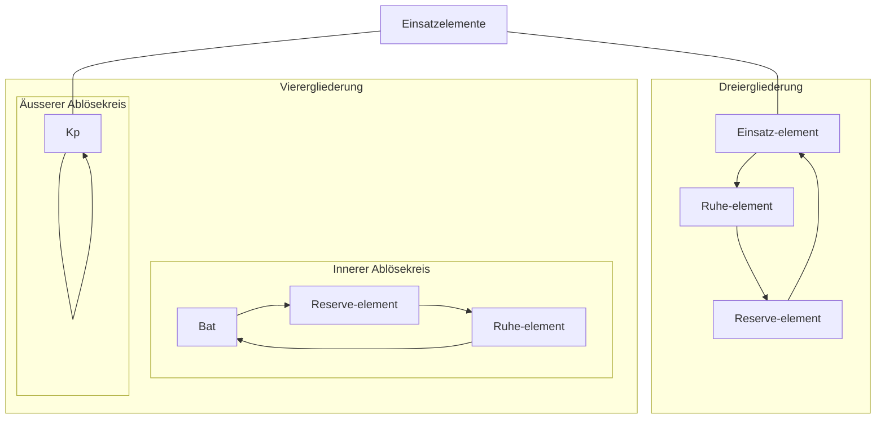
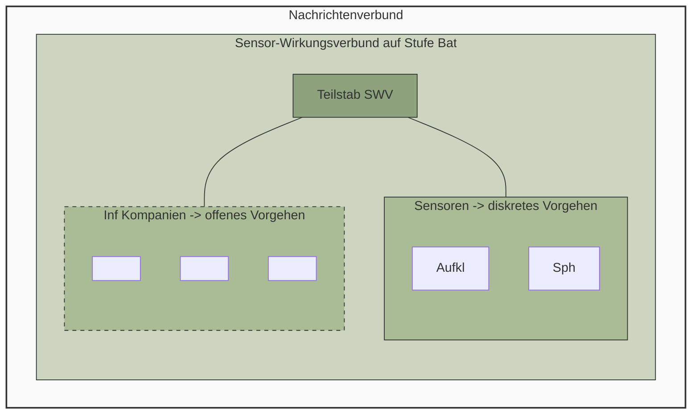
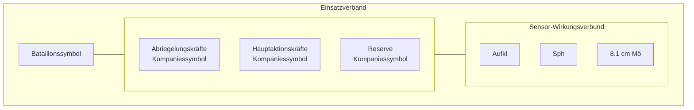
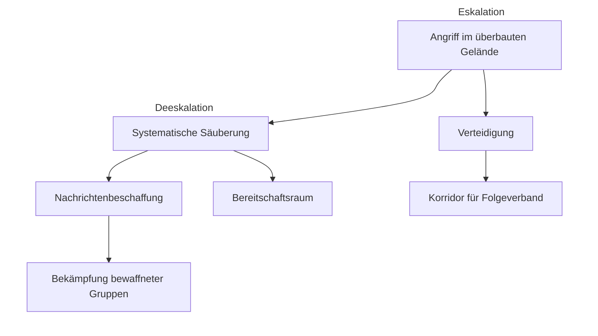
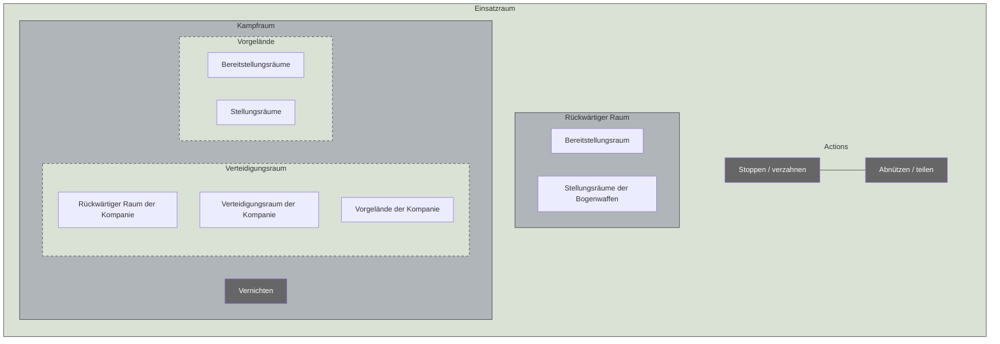

Schweizerische Eidgenossenschaft
Confédération suisse
Confederazione Svizzera
Confederaziun svizra

**Schweizer Armee**

Arbeitshilfe 53.005.21 d

# Einsatzverfahren des Infanteriebataillons

(Ei Verf Inf Bat)


Stand am 01.01.2023 SAP 2583.9472


Schweizerische Eidgenossenschaft
Confédération suisse
Confederazione Svizzera
Confederaziun svizra

**Schweizer Armee**

Arbeitshilfe 53.005.21 d

# Einsatzverfahren des Infanteriebataillons

(Ei Verf Inf Bat)

Stand am 01.01.2023

Arbeitshilfe 53.005.21 d Einsatzverfahren des Infanteriebataillons

# Verteiler

Persönliche Exemplare
* Berufsoffiziere und –unteroffiziere der Infanterie
* Offiziere der Infanterie (ohne Berufsoffiziere)

Unpersönliche Exemplare
* keine

II

Arbeitshilfe 53.005.21 d Einsatzverfahren des Infanteriebataillons

# Bemerkungen

1 Die vorliegende Arbeitshilfe ist Teil des Sammelbandes ‹Die Infanterie› und liefert detaillierte Kenntnisse über die Führung und Organisation eines Infanteriebataillons im Einsatz.

2 Zugunsten der Lesbarkeit wird in dieser Arbeitshilfe das generische Maskulin verwendet.

### Inhalt und Gliederung

3 In der vorliegenden Arbeitshilfe wird jedes Einsatzverfahren umfangreich und detailliert beschrieben. Die ausführlichen Erklärungen dienen der Vertiefung in die Materie und beschreiben Standardverhalten. In der Anwendung kann dementsprechend aufgrund einer Lagebeurteilung von diesen Standardverhalten abgewichen werden.

4 Jedes Kapitel ist gegliedert in:
* Grundsätzliches;
* Die drei Phasen des Einsatzverfahrens.

### Ansprechgruppen

5 Die Arbeitshilfe wurde für Taktiker, also für die Anwendung auf der taktische Stufe, geschrieben.

6 Die Arbeitshilfe soll vor allem von drei Ansprechgruppen benutzt werden:
* Verbandsführer/Stabsoffiziere und -unteroffiziere in der Anlern- und Festigungsstufe der Führungsausbildung;
* Berufsmilitär in Kader- und Rekrutenschulen;
* Projektleiter für Neubeschaffungen/Weiterentwicklung.

III

Arbeitshilfe 53.005.21 d Einsatzverfahren des Infanteriebataillons

## Anwendung im Lernprozess


*Abbildung 1: Schema zum Lernprozess*

7 Die Arbeitshilfe soll dem Verbandsführer/Stabsoffizier helfen, ein Einsatzverfahren zu begreifen und zu verinnerlichen.

8 Anlern- und Festigungsstufe der Führungsausbildung müssen zwingend im angeleiteten Unterricht erfolgen. Dabei sind folgende drei Schritte anzuwenden:
* Angeleitetes Erarbeiten des Verfahrens;
* Überprüfung des Erlernten durch selbständiges Erläutern der Abbildungen;
* Umlegen der Abbildungen in ein Mustergelände.

9 Die Anwendungsstufe der Führungsausbildung erfolgt im Rahmen der Verbandsausbildung. Erst in dieser Phase der Ausbildung soll bewusst vom Einsatzverfahren abgewichen werden.

IV

Arbeitshilfe 53.005.21 d
Einsatzverfahren des Infanteriebataillons

# Abbildung 2: Portfolio der Einsatzverfahren der Infanterie (nicht abschliessend)

```description
The image is a complex matrix diagram showing the portfolio of infantry operational procedures across different situational contexts (Normal, Special, and Extraordinary situations). It uses a color-coded system (green for procedures, black circles for codes) and organizes them under strategic categories like "Schützende Aktionen", "Bekämpfung bewaffneter Gruppen", and "Abwehr eines terrestrischen Vorstosses".
```

### Strategischer Rahmen

<table>
  <thead>
    <tr>
        <th>Normale Lage</th>
        <th>Besondere Lage</th>
        <th>Ausserordentliche Lage</th>
    </tr>
  </thead>
  <tbody>
    <tr>
        <td>Bewältigung von Katastrophen, Notlagen und Aufgaben nationaler Bedeutung</td>
        <td>Prävention und Abwehr von Bedrohungen der inneren Sicherheit</td>
        <td>Prävention und Abwehr eines bewaffneten Angriffs; Bewältigung von konkreten, zeitlich anhaltenden, landesweiten und nur mit militärischen Mitteln bekämpfbaren Bedrohungen der territorialen Integrität, der gesamten Bevölkerung oder der Ausübung der Staatsgewalt</td>
    </tr>
    <tr>
        <td>Subsidiärer Einsatz der Armee</td>
        <td>? -&gt; ?</td>
        <td>Originärer Einsatz der Armee</td>
    </tr>
    <tr>
        <td>**Schützende Aktionen**</td>
        <td>**Bekämpfung bewaffneter Gruppen**</td>
        <td>**Abwehr eines terrestrischen Vorstosses**</td>
    </tr>
  </tbody>
</table>

### Einsatzverfahren (Codes und Bezeichnungen)

<table>
  <thead>
    <tr>
        <th>Kategorie / Ebene</th>
        <th>Verfahren 1</th>
        <th>Verfahren 2</th>
        <th>Verfahren 3</th>
        <th>Verfahren 4</th>
    </tr>
  </thead>
  <tbody>
    <tr>
        <td>Basisverfahren (B)</td>
        <td>**B.01** Marsch</td>
        <td>**B.02** Bereitschaftsraum</td>
        <td>**B.04** Bekämpfung bewaffneter Gruppen</td>
        <td>**B.05** Angriff im überbauten Gelände</td>
    </tr>
    <tr>
        <td rowspan="2">Basisverfahren (B)</td>
        <td>**B.07** Unterstützungs- und Sicherungseinsätze</td>
        <td>**B.03** Nachrichtenbeschaffung</td>
        <td colspan="2">**B.06** Verteidigung eines Raums</td>
    </tr>
    <tr>
        <td>Kernverfahren (K)</td>
        <td>**K.01** Marsch und Bezug eines neuen Raums</td>
        <td>**K.04** Angriff nach einem Begegnungsgefecht</td>
        <td>**K.05** Abriegeln und Durchsuchen eines Geländeteils</td>
        <td>**K.07** Einbruch in ein überbautes Gelände</td>
    </tr>
    <tr>
        <td>Kernverfahren (K)</td>
        <td>**K.02** Schutz eines Objekts / Eigenschutz</td>
        <td>**K.03** Raumüberwachung</td>
        <td>**K.06** Durchsuchen einer urbanen Zone / Ortschaft</td>
        <td>**K.08** Angriff entlang einer Bewegungslinie im überbauten Gelände</td>
    </tr>
    <tr>
        <td>Kernverfahren (K)</td>
        <td colspan="2"></td>
        <td colspan="2">**K.09** Bezug einer Sperrstellung im überbauten Gelände</td>
    </tr>
    <tr>
        <td>Kernverfahren (K)</td>
        <td colspan="2"></td>
        <td colspan="2">**K.10** Kampf in einer Sperrstellung im überbauten Gelände</td>
    </tr>
    <tr>
        <td>Kernverfahren (K)</td>
        <td colspan="2"></td>
        <td colspan="2">**K.11** Angriff ohne Verzahnung</td>
    </tr>
    <tr>
        <td>Zusatzverfahren (Z)</td>
        <td>**Z.01** Verhalten auf dem Marsch (inkl. gesicherter Halt)</td>
        <td>**Z.10** Verhalten im Begegnungsgefecht / gegnerischen Hinterhalt</td>
        <td>**Z.13** Durchsuchen eines mehrstöckigen Gebäudes</td>
        <td>**Z.12** Vorgehen entlang einer Strasse</td>
    </tr>
    <tr>
        <td>Zusatzverfahren (Z)</td>
        <td>**Z.04** Offenhalten einer Bewegungslinie</td>
        <td>**Z.02** Verhalten auf der Patrouille</td>
        <td>**Z.07** Geländedurchsuchung</td>
        <td>**Z.16** Überfallartige Aktionen</td>
    </tr>
    <tr>
        <td>Zusatzverfahren (Z)</td>
        <td>**Z.05** Eskorte als Konvoischutz</td>
        <td>**Z.03** Taktischer Checkpoint</td>
        <td>**Z.08** Trennen von Akteuren</td>
        <td>**Z.14** Bezug einer Sperre</td>
    </tr>
    <tr>
        <td>Zusatzverfahren (Z)</td>
        <td></td>
        <td>**Z.06** Verifikation einer Nachricht</td>
        <td>**Z.09** Eskalation und Deeskalation mit Feuer</td>
        <td>**Z.15** Stützpunkt im überbauten Gelände</td>
    </tr>
    <tr>
        <td>Zusatzverfahren (Z)</td>
        <td>**Z.17** Verhalten bei / nach einem Lufttransport</td>
        <td></td>
        <td>**Z.11** Evakuation einer urbanen Zone</td>
        <td></td>
    </tr>
  </tbody>
</table>

V

Arbeitshilfe 53.005.21 d
Einsatzverfahren des Infanteriebataillons

VI

Arbeitshilfe 53.005.21 d Einsatzverfahren des Infanteriebataillons

# Inhaltsverzeichnis

**1 Der Marsch (B.01)** 1
1.1 Grundsätzliches 1
1.2 Die räumlich/zeitliche Planung des Marsches 2
1.3 Die technischen und taktischen Vorausaktionen 3
1.4 Die Verschiebung der Truppe in den neuen Raum 6

**2 Bereitschaftsraum (B.02)** 9
2.1 Grundsätzliches 9
2.2 Der Bezug des Bereitschaftsraums und das Erstellen der Einsatzbereitschaft 13
2.3 Das Erhalten der Einsatzbereitschaft 16
2.4 Die Raumerweiterung in den Interessenraum 20

**3 Nachrichtenbeschaffung (B.03)** 27
3.1 Grundsätzliches 27
3.2 Die Synchronisation mit der zivilen Grundplatte 30
3.3 Der komplementäre Einsatz militärischer Mittel 34
3.4 Die nachrichtengetriebenen Aktionen 38

**4 Bekämpfung bewaffneter Gruppen (B.04)** 42
4.1 Grundsätzliches 42
4.2 Die räumliche Abgrenzung des Aktionsraums 47
4.3 Die militärische Hauptaktion im abgeriegelten Aktionsraum 53
4.4 Das Auffangen der Reaktionen im Aktionsraum 66

**5 Angriff in überbautem Gelände (B.05)** 70
5.1 Grundsätzliches 70
5.2 Die Bereitstellung des Kampfgrunddispositivs 77
5.3 Der Einbruch und das Nachziehen der vorgeschobenen Unterstützungsleistung 83
5.4 Der Stoss in die Tiefe und die Inbesitznahme des Angriffsziels 91

**6 Verteidigung eines Raums (B.06)** 101
6.1 Grundsätzliches 101
6.2 Die Bereitstellung des Kampfgrunddispositivs 108
6.3 Der Kampf im Vorgelände 113
6.4 Der Kampf im Verteidigungsraum 120

**7 Unterstützungs- und Sicherungseinsätze (B.07)** 124
7.1 Grundsätzliches 124
7.2 Die Katastrophenhilfe 128
7.3 Die Unterstützung der Polizei 128

VII

Arbeitshilfe 53.005.21 d Einsatzverfahren des Infanteriebataillons

7.4 Der Schutz von ziviler Infrastruktur 129
7.5 Die Unterstützung des Bundesamtes für Zoll und Grenzsicherheit BAZG 131

VIII

Arbeitshilfe 53.005.21 d Einsatzverfahren des Infanteriebataillons

# Abbildungsverzeichnis

**Abbildung 1:** Schema zum Lernprozess IV
**Abbildung 2:** Portfolio der Einsatzverfahren der Infanterie (nicht abschliessend) V
**Abbildung 3:** Die drei Phasen des Marsches (B.01) 1
**Abbildung 4:** Räumliche Elemente des Marsches 2
**Abbildung 5:** Taktische Vorausaktionen entlang der Marschachse/im neuen Raum 5
**Abbildung 6:** Einbindung der Vorausaktionen in die Übermittlung 6
**Abbildung 7:** Marschpakete (mögliche Lösung) 7
**Abbildung 8:** Dezentraler Bataillons-Bereitschaftsraum 10
**Abbildung 9:** Möglicher Aufbau eines zentralen Bereitschaftsraums 11
**Abbildung 10:** Die drei Phasen des Bereitschaftsraums (B.02) 13
**Abbildung 11:** Ablauf zum Erstellen der Alarmbereitschaft 15
**Abbildung 12:** Ablauf zum Erstellen der Einsatzbereitschaft 16
**Abbildung 13:** Mögliche Checkliste zum Erhalten der Einsatzbereitschaft 18
**Abbildung 14:** Verfügbarkeit der Truppe bei reduzierter Bereitschaft 19
**Abbildung 15:** Die Kraft-Raum-Substitution 21
**Abbildung 16:** Die räumlichen Zonen des Bereitschaftsraums für lange Verweildauer 22
**Abbildung 17:** Ablösung auf Stufe Kompanie für Dreier- und Vierergliederung 23
**Abbildung 18:** Diensträder auf Stufe Kompanie 24
**Abbildung 19:** Aufträge ausserhalb der Bereitschaftsräume in definierten Einflusszonen 25
**Abbildung 20:** Verfügbare Kräfte für Reserveeinsätze auf Stufe Bataillon 26
**Abbildung 21:** Die Verfahren der Nachrichtenbeschaffung 28
**Abbildung 22:** Die Mittel zur Nachrichtenbeschaffung 29
**Abbildung 23:** Die drei Phasen der Nachrichtenbeschaffung (B.03) 30
**Abbildung 24:** Politische und militärische Raumangleichung 31
**Abbildung 25:** Ermittlung von Grunddaten bezüglich ziviler Organisation 32
**Abbildung 26:** Harmonisierung der Führungsstruktur 33
**Abbildung 27:** Komplementarität von zivilen und militärischen Sensoren 35
**Abbildung 28:** Erkundung des Einsatzraums und Etablieren der Grundlast 37
**Abbildung 29:** Das Ermitteln des Ist-Zustands und das Erkennen von Abweichungen 38
**Abbildung 30:** Schwergewichtsbildung für nachrichtengetriebene Aktionen 40
**Abbildung 31:** Das Prinzip der Bekämpfung von bewaffneten Gruppen 43

IX

Arbeitshilfe 53.005.21 d Einsatzverfahren des Infanteriebataillons

Abbildung 32: Die räumlichen Elemente 44
Abbildung 33: Gliederung des Einsatzverbands (mögliche Lösung) 45
Abbildung 34: Die drei Phasen der Bekämpfung bewaffneter Gruppen (B.04) 46
Abbildung 35: Verantwortungsregelung für Vorausaktionen 48
Abbildung 36: Vorausaktionen innerhalb des Aktionsraums 50
Abbildung 37: Bereitstellung der Einsatzkräfte 51
Abbildung 38: Räumliche Elemente des äusseren Rings 52
Abbildung 39: Die drei militärischen Hauptaktionen im Aktionsraum bei der Bekämpfung bewaffneter Gruppen 54
Abbildung 40: Gliederung der Hauptaktionskräfte als Kontrollverband (Mögliche Lösung) 55
Abbildung 41: Kontrolltätigkeiten mit Kleinverbänden 56
Abbildung 42: Geländedurchsuchung Stufe Kompanie 57
Abbildung 43: Gliederung der Hauptaktionskräfte als Zugriffsverband (Mögliche Lösung) 58
Abbildung 44: Bereitstellung und Annäherung des Zugriffsverbands 60
Abbildung 45: Das Etablieren des inneren Rings durch die Abriegelungskräfte 61
Abbildung 46: Der Zugriff 63
Abbildung 47: Gliederung der Hauptaktionskräfte als Angriffsverband (Mögliche Lösung) 64
Abbildung 48: Der Angriff innerhalb des Aktionsraums 65
Abbildung 49: Die Bereitstellung der Reaktionskräfte im Aktionsraum 67
Abbildung 50: Das Zusammenwirken zwischen Sensoren und Reaktionskräften 68
Abbildung 51: Die Angriffsformen im überbauten Gelände 71
Abbildung 52: Die räumlichen Elemente des Bataillons-Angriffsraums 72
Abbildung 53: Die Vorleistungen des Grossen Verbandes 74
Abbildung 54: Die Kernleistungen im Gesamtrahmen des Angriffs 76
Abbildung 55: Einsatzgliederung der Manöververbände für den Angriff im überbauten Gelände (mögliche Lösung, ohne Kommandoorgane) 76
Abbildung 56: Die drei Phasen beim Angriff im überbauten Gelände (B.05) 77
Abbildung 57: Die organisatorischen und logistischen Bewegungen im Bereitstellungsraum 78
Abbildung 58: Die räumliche Anordnung der Führungseinrichtungen im Bereitstellungsraum 79
Abbildung 59: Das Grunddispositiv des Sensor-Wirkungsverbunds 81
Abbildung 60: Die Übermittlungsnetze im Sensor-Wirkungsverbund 82

X

Arbeitshilfe 53.005.21 d Einsatzverfahren des Infanteriebataillons

Abbildung 61: Die Koordinationsaufgaben beim Einbruch auf Stufe Bataillon 84
Abbildung 62: Die Möglichkeiten zur Eskalation/Deeskalation auf Stufe Bataillon 86
Abbildung 63: Standorte und Aufgaben bei Beginn des Einbruchs (oben) und nach Ausbau des Einbruchsraums (unten) 88
Abbildung 64: Der Endausbau des Einbruchsraums (mögliche Lösung) 89
Abbildung 65: Die Aufgaben in der geschützten Kernzone des Einbruchsraums 91
Abbildung 66: Die Koordinationsaufgaben auf Stufe Bataillon beim Stoss in die Tiefe 92
Abbildung 67: Die sechs Schritte beim Staffelwechsel 93
Abbildung 68: Die Koordination des Angriffs (Beispiel) 94
Abbildung 69: Die Einsatzmöglichkeiten der Bataillonsreserve 95
Abbildung 70: Einsatzmöglichkeiten für die Bataillonsreserve 96
Abbildung 71: Die logistischen Abläufe im Angriffsraum 97
Abbildung 72: Das Erreichen der Angriffstiefe und die Abriegelung des Angriffsziels 98
Abbildung 73: Übersicht einer möglichen Folgeplanung 99
Abbildung 74: Die Anforderungen an den Bataillons-Verteidigungsraum 102
Abbildung 75: Die räumlichen Elemente der Bataillons-Einsatzraum in der Verteidigung 103
Abbildung 76: Die räumlichen Elemente des Bataillons-Verteidigungsraums 104
Abbildung 77: Die räumlichen Elemente des taktischen Bewegungsraums 105
Abbildung 78: Die Einsatzgliederung der Manöververbände für die Verteidigung eines Raums (mögliche Lösung, ohne Kommandoorgane) 107
Abbildung 79: Die drei Phasen bei der Verteidigung eines Raums (B.06) 108
Abbildung 80: Die Elemente des rückwärtigen Raums 109
Abbildung 81: Das Grunddispositiv des Sensor-Wirkungsverbunds 110
Abbildung 82: Der Einsatz der Effektoren des Sensor-Wirkungsverbunds 111
Abbildung 83: Das Festlegen des Hauptabschnitts im Verteidigungsraum 113
Abbildung 84: Die beiden Varianten des Vorgeländes 114
Abbildung 85: Die Koordinationsaufgaben des Bataillons bei der Kampfführung im Vorgelände 115
Abbildung 86: Die zeitliche und räumliche Koordination der beweglichen Kampfführung auf Stufe Bataillon 116

XI

Arbeitshilfe 53.005.21 d Einsatzverfahren des Infanteriebataillons

**Abbildung 87:** Das Prinzip der Versorgung der Abnützungsverbände 118
**Abbildung 88:** Der Bataillons-Verteidigungsraum mit Haupt- und Nebenabschnitt 119
**Abbildung 89:** Die Schwergewichtsverlagerung mit zunehmender Kampfdauer 121
**Abbildung 90:** Die Koordinationsaufgaben des Bataillons bei der Kampfführung im Verteidigungsraum 121
**Abbildung 91:** Der Einsatz der Reserveverbände im Vorgelände der Kompanie 122
**Abbildung 92:** Der Einsatz der Effektoren des Sensor-Wirkungsverbunds beim Angriff der Reserveverbände (Möglichkeit) 123
**Abbildung 93:** Die partnerschaftliche Zusammenarbeit im Einsatzraum 126
**Abbildung 94:** Militärische Unterstützung im Katastrophenfall 128
**Abbildung 95:** Militärische Unterstützung der Polizei 129
**Abbildung 96:** Militärische Unterstützung beim Schutz ziviler Infrastruktur 131
**Abbildung 97:** Militärische Unterstützung des Grenzwachtkorps 132

XII

Arbeitshilfe 53.005.21 d Einsatzverfahren des Infanteriebataillons

# 1 Der Marsch (B.01)

## 1.1 Grundsätzliches

10 Ein Marsch ist die taktische Verschiebung von Verbänden am Boden.

11 Der Marsch dient der Verschiebung bzw der Verlegung des Infanteriebataillons:
* vom Mobilmachungs- in den Bereitschaftsraum;
* von einem Bereitschafts- in einen neuen Bereitschaftsraum;
* von einem Bereitschafts- in einen Bereitstellungsraum;
* von einem Bereitschafts- bzw einem Bereitstellungsraum in einen Einsatzraum (als Annäherung);
* in einen neuen Bereitschafts-, Bereitstellungs- oder Einsatzraum;
* und nach dem Einsatz je nach Lage in einen Bereitstellungs-, Bereitschafts- oder Demobilmachungsraum.

**Die drei Phasen des Einsatzverfahrens**

12 Im Einsatzverfahren werden drei Phasen unterschieden:
1. Die räumlich/zeitliche Planung des Marsches;
2. Die technischen und taktischen Vorausaktionen;
3. Die Verschiebung der Truppe in den neuen Raum.


*Abbildung 3: Die drei Phasen des Marsches (B.01)*

1

Arbeitshilfe 53.005.21 d Einsatzverfahren des Infanteriebataillons

## 1.2 Die räumlich/zeitliche Planung des Marsches

13 Für den Marsch werden folgende räumliche Elemente festgelegt:
* Ein- und Auskolonnierungspunkte;
* Marschstreifen mit minimal zwei Marschstrassen;
* Phasenlinien;
* Weg-/Fixpunkte.

14 Marschstrassen genügen den Anforderungen an einen Marsch nur, wenn zwischen ihnen Rochademöglichkeiten bestehen. Steht nur eine Marschstrasse zur Verfügung, erhöht sich das Risiko, auf der Verschiebung blockiert oder verlangsamt zu werden.

15 Der Marsch wird auf der Landeskarte 1:50'000 geplant und geführt. Zur räumlich-zeitlichen Koordination werden wie im Angriff Phasenlinien festgelegt, die sich an zur Marschrichtung rechtwinklig angeordneten Querstrassen orientieren oder zwei auf der Landeskarte bezeichnete Punkte zu einer Linie quer zur Marschrichtung verbinden.


*Abbildung 4: Räumliche Elemente des Marsches*

16 Jeder Kompanie wird eine Marschstrasse zugeteilt und deren zeitlich gestaffelte Benutzung festgelegt.

17 Den Kompanien werden Weg- und/oder Fixpunkte zugewiesen, die auf Phasenlinien liegen und deren Überschreiten zu melden ist. Wegpunkte dienen der Bestimmung des Standortes sowie der Führung und Koordination des

2

Arbeitshilfe 53.005.21 d
Einsatzverfahren des Infanteriebataillons

Marsches. Fixpunkte sind genau bezeichnete Orte, die die Kompanie zu einer bestimmten Zeit zu erreichen oder zu überschreiten hat.

18 Der erste Fixpunkt dient der Einkolonnierung der Kompanien in den Bataillonsmarsch (Einkolonnierungspunkt), der letzte der Auskolonnierung aus demselben (Auskolonnierungspunkt).

19 Der Einkolonnierungspunkt ist durch die Kompaniespitze zur Fixzeit gemäss Marschtabelle zu überschreiten. Organisation und Führung der Bewegung bis zum Einkolonnierungspunkt liegen in der Verantwortung der jeweiligen Kompanie.

20 Der Auskolonnierungspunkt beendet den durch das Bataillon geführten Marsch. Ab hier trägt die Kompanie die Verantwortung für die Führung bis zum Erreichen des Marschzieles.

## 1.3 Die technischen und taktischen Vorausaktionen

### Die technischen Vorausaktionen

21 Mit technischen Vorausaktionen wird die Führbarkeit während der Aktion sichergestellt. Sie betreffen folgende (Sofort-)Massnahmen sowohl entlang der Marschachse wie auch am Marschziel/im neuen Raum:
* Sicherstellen der Verbindungen;
* Erkundung des Marschstreifens;
* Erkundung und Einweisung im neuen Raum;
* Aufbau der ortsgebundenen Führungsinfrastruktur im neuen Raum;
* Vorleistungen bezüglich Bauarbeiten im neuen Raum;
* Absprachen bezüglich zivil-militärischen Schnittstellen.

22 Technische Vorausaktionen werden zwischen den Stufen Bataillon und Kompanie aufgeteilt. Die Spezialisten auf Stufe Bataillon erledigen Vorleistungen, die vom ganzen Bataillon in Anspruch genommen werden. An die Kompanien werden alle Tätigkeiten delegiert, die im neuen Raum nur von dieser Stufe genutzt werden.

23 Auf Stufe Kompanie wird ein nach Lage, Auftrag und Umfang der Arbeiten massgeschneidertes Vorausdetachement eingesetzt (maximal ein Infanteriezug).

24 Kräfte, die für technische Vorausaktionen eingesetzt werden, können nur beschränkt gleichzeitig taktische Vorausaktionen ausführen. Es ist jedoch möglich, dass dieselben Kräfte zeitlich nachgestaffelt für taktische Zwecke eingesetzt werden können (Beispiel: Einweisungselement wird zum Sicherungs-/Reserveelement).

3

Arbeitshilfe 53.005.21 d Einsatzverfahren des Infanteriebataillons

25 Die Verbindungen entlang der Marschachse sind so zu planen, dass jeweils alle Kompanien auf dem Bataillonsführungs- wie auf dem Bataillons-Aufklärungsnetz kommunizieren können.

26 Vorausdetachemente auf Stufe Bataillon und/oder Kompanie können im neuen Raum folgende Erkundungsaufträge durchführen (Auswahl):
* Strassen mit genügend Ausweichstellen für friktionsloses Einfliessen in den Raum;
* Möglichkeiten zum Unterstellen der Fahrzeuge;
* Örtlichkeiten für logistische Zwecke (Magazine, Reparaturwerkstätten);
* Lebensinfrastruktur (Unterkünfte, sanitäre Anlagen, usw.);
* Möglichkeiten für den genietechnischen Ausbau;
* passive Schutzmassnahmen, gegen Feuer und ABC-Ereignisse;
* Möglichkeiten für den Einsatz des Überwachungssystems;
* Reservebildung bezüglich Betriebsstoff, Wasser- und Stromversorgung;
* sichere Telefonleitungen, Internetverbindung;
* mögliche Freiflächen für Stellungsräume der Mörserzüge;
* Landeplätze für Lufttransportmittel;
* Ausbildungsinfrastruktur;
* Möglichkeit zum Erstellen von improvisierten Truppenlagern mit Zelten oder Containereinheiten;
* Angebot für die Sport- und Freizeitgestaltung.

**Die taktischen Vorausaktionen**

27 Mit taktischen Vorausaktionen werden der Schutz gegen Überraschung sowie die Handlungsfreiheit/Reaktionsfähigkeit während dem Marsch und dem Bezug des neuen Raums sichergestellt. Sie umfassen folgende Bereiche:
* Aufklärung und Überwachung entlang der Marschachse und im neuen Raum;
* Sicherungsaufgaben entlang der Marschachse und im neuen Raum;
* Bereithalten dezentraler Reaktionsverbände als stille Reserven.

28 Taktische Vorausaktionen werden zwischen den Stufen Bataillon und Kompanie aufgeteilt. Entlang der Marschachse werden nur Spezialisten auf Stufe Bataillon eingesetzt. Im neuen Raum werden die Spezialisten des Bataillons diskret, die Kräfte der Kompanien offen eingesetzt.

29 Für die Aufklärung entlang der Marschachse wird in der Regel der Aufklärungszug eingesetzt. Der zeitliche Abstand der Aufklärungselemente zu den

4

Arbeitshilfe 53.005.21 d Einsatzverfahren des Infanteriebataillons

verschiebenden Kompanien muss so gross sein, dass diese umgeleitet werden können, ohne anhalten zu müssen. Er soll aber so klein gehalten werden, dass es dem Gegner nicht möglich ist, Aufklärung und verschiebende Kräfte zu teilen.

30 Die Aufklärung im neuen Raum erfolgt diskret und objektbezogen in der Regel durch die Späher. Die Kompanien klären vor dem Bezug die ihnen zugewiesenen Räume im offenen Verfahren auf. In der Regel wird dafür ein Infanteriezug eingesetzt, der anschliessend weitere zusätzliche Aufgaben im neuen Raum wahrnimmt (technische Vorausaktionen wie Erkundung, Einweisung, logistische Vorarbeiten).

31 Um während dem Marsch ein friktionsloses Überwinden von Schlüsselpassagen zu gewährleisten, müssen diese mindestens überwacht werden. Je nach Umweltanalyse und Bedrohung wird die Sicherung durch (Bogen)Feuer und/oder physische Präsenz der Truppe befohlen.


*Abbildung 5: Taktische Vorausaktionen entlang der Marschachse/ im neuen Raum*

32 Im neuen Raum ist es je nach Lage nötig, vorzeitig Objekte zu durchsuchen und diese anschliessend bis zum Eintreffen des Gros der Kompanie mindestens zu überwachen.

33 Je nach Lage werden vor dem Marsch dezentrale, frei verfügbare Reaktionskräfte in mindestens Zugsstärke an die Marschachse und/oder in den neuen Raum gebracht. Sie halten sich in der Hand des Bataillons bereit,
* auf Alarmierung der diskret operierenden Aufklärungselemente zu Gunsten der verschiebenden Kompanien eingesetzt zu werden;

5

Arbeitshilfe 53.005.21 d Einsatzverfahren des Infanteriebataillons

* Marschstrassen offen zu halten;
* Gelände abzuriegeln;
* Objekte/Gelände zu durchsuchen und/oder zu besetzen;
* als Eskorte eingesetzt zu werden.

<table>
  <thead>
    <tr>
        <th>Funknetz</th>
        <th>alter Raum</th>
        <th>Marsch</th>
        <th>neuer Raum</th>
    </tr>
  </thead>
  <tbody>
    <tr>
        <td>Kp Fhr Netz</td>
        <td></td>
        <td>Reaktionskräfte temporär</td>
        <td>Vorausaktionen offen</td>
    </tr>
    <tr>
        <td>Bat Fhr Netz</td>
        <td colspan="3">Führung der laufenden Aktion</td>
    </tr>
    <tr>
        <td>Bat Aufkl Netz</td>
        <td></td>
        <td>Vorausaktionen Marsch</td>
        <td>Vorausaktionen diskret</td>
    </tr>
    <tr>
        <th>Verwendung der Mittel</th>
        <th></th>
        <th></th>
        <th></th>
    </tr>
    <tr>
        <td>Aufkl</td>
        <td></td>
        <td>1. Prio</td>
        <td>2. Prio</td>
    </tr>
    <tr>
        <td>Sph</td>
        <td></td>
        <td>2. Prio</td>
        <td>1. Prio</td>
    </tr>
    <tr>
        <td>Reaktionskräfte (Inf)</td>
        <td></td>
        <td>2. Prio</td>
        <td>1. Prio</td>
    </tr>
  </tbody>
</table>

*Abbildung 6: Einbindung der Vorausaktionen in die Übermittlung*

34 Um die Eskalationsfähigkeit der Reaktionskräfte sicherzustellen, scheidet das Bataillon allenfalls einen Mörserzug aus, der diese mit Bogenfeuer unterstützen kann.

35 Die Funkverbindung zwischen den taktischen Vorausaktionen des Bataillons und den verschiebenden Kompanien ist sicherzustellen. Die Kompanien werden ins Aufklärungsnetz eingebunden, um möglichst zeitverzugslos die für sie relevanten Informationen zu erhalten.

## 1.4 Die Verschiebung der Truppe in den neuen Raum

36 Neuunterstellungen von Truppen erfolgen vor Marschbeginn im alten Raum. Das Bataillon regelt den Zeitpunkt sowie den Ort der Unterstellung. Bei der Integration neuer Kräfte regeln die Kompaniekommandanten die funktechnische Anbindung (ein Raum, ein Chef, ein Auftrag, ein Netz).

6

Arbeitshilfe 53.005.21 d Einsatzverfahren des Infanteriebataillons

37 Wird ein dezentraler Bereitschaftsraum bezogen, wird mit der Unterstellung der 8.1 cm Mörserzüge an die Infanteriekompanien sichergestellt, dass das Bataillon sofort nach Eintreffen im neuen Raum über genügend Bogenfeuer aus dezentral gesicherten Stellungsräumen verfügt und damit jederzeit in der Gewaltanwendung eskalieren kann.

38 Da sich Stabs- und Unterstützungskompanie nur beschränkt schützen können, entscheidet das Bataillon vor Marschbeginn, welche Infanteriekompanie im neuen Raum für deren Schutz zuständig ist.

39 Abgestimmt auf den Beginn des Marsches (H-Zeit) werden die vom Bataillon geplanten technischen und taktischen Vorausaktionen ausgelöst. Diese werden während dem Marsch auf dem Aufklärungsnetz geführt.

40 Das Infanteriebataillon verschiebt grundsätzlich auf minimal zwei Marschstrassen in Kompaniemarschpaketen. Jedes Marschpaket schützt sich auf der Verschiebung selbst und benützt dazu das Prinzip der Eskorte als Konvoischutz. An der Spitze und am Schluss eines Marschpakets verschiebt je ein Infanteriezug, der in der Lage ist, bei Friktionen die Marschstrasse lagegerecht und eskalationsfähig abzuriegeln.

41 Die Führungsstaffel des Bataillons wird in der Regel vor Marschbeginn im Marschpaket derjenigen Infanteriekompanie integriert, die im neuen Raum für den Schutz der Stabskompanie verantwortlich ist.

<table>
  <thead>
    <tr>
        <th></th>
        <th>Marschpaket 2</th>
        <th>Marschpaket 1</th>
        <th>Taktische Vorausaktion Kp</th>
        <th>Taktische und technische Vorausaktionen Bat</th>
    </tr>
  </thead>
  <tbody>
    <tr>
        <td rowspan="2">Marschstrasse 1</td>
        <td><br/>Ustü<br/></td>
        <td><br/> 8.1 cm Mö</td>
        <td></td>
        <td> Aufkl<br/> Sph<br/> Uem</td>
    </tr>
    <tr>
        <td rowspan="2">Marschstrasse 2</td>
        <td><br/> 8.1 cm Mö</td>
        <td><br/> 8.1 cm Mö</td>
        <td><br/></td>
        <td> Sph<br/> Aufkl</td>
    </tr>
  </tbody>
</table>

Abbildung 7: Marschpakete (mögliche Lösung)

7

Arbeitshilfe 53.005.21 d Einsatzverfahren des Infanteriebataillons

42 Die Stabskompanie schützt sich auf der Verschiebung mit ihrem organisch zugeteilten Infanteriezug (Sicherungszug). Sie verschiebt in der Regel als letztes Marschpaket und erst dann, wenn ihr neuer Raum durch die dafür bezeichnete Infanteriekompanie geschützt ist.

43 Der Bataillonsmarsch beginnt mit dem Überschreiten des Einkolonnierungspunkts. Damit der Marsch räumlich und zeitlich koordiniert/geführt werden kann, melden die Kompaniekommandanten unaufgefordert das Überschreiten von Phasenlinien, Weg- und Fixpunkten.

44 Bei Friktionen riegelt die betroffene Kompanie die Marschstrasse ab, bezieht einen gesicherten Halt oder führt das Begegnungsgefecht. Das Bataillon regelt,
* über welche Rochade folgende Kompanien die andere Marschstrasse erreichen; in welcher zeitlichen Staffelung das Ausweichen erfolgt;
* ob die Marschreihenfolge angepasst wird;
* ob und wie die von der Friktion betroffene Marschstrasse wieder geöffnet wird.

45 Die für technische und taktische Vorausaktionen während dem Marsch bezeichneten Verbände werden nach Eintreffen der letzten Kompanie im neuen Raum abgezogen und wieder in die Stammkompanien integriert.

8

Arbeitshilfe 53.005.21 d Einsatzverfahren des Infanteriebataillons

# 2 Bereitschaftsraum (B.02)

## 2.1 Grundsätzliches

46 Der Bereitschaftsraum ist ein zugewiesener Raum, in dem sich Verbände im Hinblick auf eine Aktion bereithalten.

47 Der Bereitschaftsraum ist die Einsatzaufgabe, bei der militärische Präsenz im zivilen Umfeld am nachhaltigsten wahrgenommen wird. Im Bereitschaftsraum lebt die Truppe für kürzere oder längere Zeit in unmittelbarer Nähe der Zivilbevölkerung. Durch diese Präsenz soll das zivile Umfeld realisieren, dass militärische Mittel dazu eingesetzt werden, die ausserordentliche Lage zu bereinigen.

48 Militärische Präsenz vermittelt einerseits ein Gefühl der Sicherheit. Andererseits ziehen militärische Kräfte auch Gewalt an und werden so von der Zivilbevölkerung als Last empfunden. Aus dieser Tatsache erwächst für alle militärischen Führer die Pflicht, das Zusammenleben zu regeln und die daraus sich ergebenden militärischen Notwendigkeiten unmissverständlich zu kommunizieren. Den Soldaten muss durch klare Weisungen (Einsatz- und Verhaltensregeln) ermöglicht werden, sich sicher in diesem komplexen Umfeld zu bewegen.

**Die räumliche Ausgestaltung**

49 Der Bereitschaftsraum eines militärischen Verbands muss klar vom zivilen Umfeld abgegrenzt werden. Die rechtlichen Begrenzungen müssen im Gelände klar erkennbar sein (Checkpoints, Warnschilder).

50 Um auf das äusserste vorbereitet zu sein, ist der Bereitschaftsraum im Endzustand eine permanente Redbox. Er umfasst neben der Kompaniebasis (Objekte für Unterkunft und Logistik) das gesamte taktisch zusammenhängende Gelände, das zur Gewährleistung des Schutzes von Truppe, Material, Munition und Fahrzeugen notwendig ist. Die Raumverantwortung liegt bei den Truppenkommandanten.

51 Bezüglich der räumlichen Ausgestaltung werden zwei Arten des Bereitschaftsraums unterschieden:
* dezentraler Bereitschaftsraum;
* zentraler Bereitschaftsraum.

52 Der dezentrale Bereitschaftsraum ist die Regel bei langer Verweildauer. Jeder Kompanie wird eine Ortschaft oder Anlage zugewiesen, die über genügend Gebäude für Schutz und Tarnung von Truppe, Material, Munition und Fahrzeugen verfügt. Stabs- und Unterstützungskompanie werden im Bereitschaftsraum einer Infanteriekompanie integriert. Für eine spätere Zentralisierung der

9

Arbeitshilfe 53.005.21 d Einsatzverfahren des Infanteriebataillons

Kräfte müssen eine oder mehrere grosse Gebäude/Tiefgaragen vorgesehen werden.

53 Die Vorteile des dezentralen Bereitschaftsraums sind:
* Nähe zur Zivilbevölkerung und Sichtbarkeit im zivilen Umfeld;
* rasche Verfügbarkeit von Kräften pro Geländekammer;
* grosse Bewegungsfreiheit und hohe Reaktionsfähigkeit;
* Möglichkeit zum einheitlichen Etablieren der Grundlast im ganzen Einsatzraum;
* Möglichkeit zum Bogenfeuereinsatz aus mehreren gesicherten Stellungsräumen, dadurch grosse Abdeckung des Einsatzraums mit Bogenfeuer.


*Abbildung 8: Dezentraler Bataillons-Bereitschaftsraum*

54 Der zentrale Bereitschaftsraum ist die Regel bei kurzer Verweildauer. Er ist der Ort einer temporären Bereitstellung und der letzten Organisation für eine bevorstehende, bereits bekannte Aktion vor deren Auslösung. Er benötigt eine Fläche von mindestens einem Quadratkilometer mit bereits bestehender militärischer und/oder ziviler Infrastruktur (Kasernen, Industrieanlagen, Tankanlage, Werkhof, usw). Das ganze Bataillon wird durch zentral

10

Arbeitshilfe 53.005.21 d
Einsatzverfahren des Infanteriebataillons

koordinierte Kräfte (eine dafür bezeichnete Infanteriekompanie, allenfalls ein ad hoc Verband) geschützt.

55 Für lange Verweildauer muss ein zentraler Bereitschaftsraum als improvisiertes Feldlager in den meisten Fällen mit enormem baulichem Aufwand neu errichtet und mit weiteren logistischen Einrichtungen ergänzt werden. Nur so kann dieser klar vom zivilen Umfeld abgegrenzt werden. Diese Variante bildet im stark gekammerten Gelände der Schweiz die Ausnahme.


Abbildung 9: Möglicher Aufbau eines zentralen Bereitschaftsraums

56 Die Vorteile eines zentralen Bereitschaftsraums sind:
* Einfache, einmalige Trennung von militärischem und zivilem Umfeld;
* einfache Organisation von Führung und Logistik;
* Ökonomie der Kräfte und der genietechnischen Mittel im Bereich Schutz;
* Möglichkeit zur raschen aktionsbezogenen Einsatzgliederung;
* Vereinfachung von Ablösungen im Einsatz;
* einfache Integration zusätzlicher Kräfte;
* Möglichkeit der Mittelkonzentration für Komfort- und Freizeitangebot.

11

Arbeitshilfe 53.005.21 d Einsatzverfahren des Infanteriebataillons

### Die Verweildauer

57 Bezüglich der Verweildauer werden zwei Arten des Bereitschaftsraums unterschieden:
* Bereitschaftsraum für kurze Verweildauer;
* Bereitschaftsraum für lange Verweildauer.

58 Der Bereitschaftsraum für kurze Verweildauer ist gekennzeichnet durch vollständige Verfügbarkeit der Kräfte. Er ist die Regel bei Aktionen mit grosser räumlicher Tiefe. Er bildet ein Zwischenziel im Verlauf der Gesamtaktion und dient primär der logistischen Organisation/Reorganisation für eine bereits bestimmte Folgeaktion.

59 Der Bereitschaftsraum für lange Verweildauer ist gekennzeichnet durch reduzierte Verfügbarkeit der Kräfte. Er ist die Regel bei Einsätzen, bei denen ein Raum durch militärische Präsenz stabilisiert werden muss. Der Bereitschaftsraum wird zur Einsatzbasis, aus der heraus alle Folgeaktionen geführt werden.

60 Im Folgenden wird der dezentrale Bereitschaftsraum für lange Verweildauer beschrieben.

### Die drei Phasen des Einsatzverfahrens

61 Im Einsatzverfahren werden drei Phasen unterschieden:
1. Der Bezug des Bereitschaftsraums und das Erstellen der Einsatzbereitschaft;
2. Das Erhalten der Einsatzbereitschaft durch Zentralisierung der Kräfte und Übergang in die reduzierte Bereitschaft;
3. Die Raumerweiterung in den Interessenraum zur Sicherstellung einer genügend grossen Vorwarnzeit, die es erlaubt, die Kräfte jederzeit zeitgerecht zu alarmieren.

12

Arbeitshilfe 53.005.21 d
Einsatzverfahren des Infanteriebataillons


*Abbildung 10: Die drei Phasen des Bereitschaftsraums (B.02)*

## 2.2 Der Bezug des Bereitschaftsraums und das Erstellen der Einsatzbereitschaft

62 Beim Bezug des Bereitschaftsraums werden vier Schritte unterschieden:
1. Erstellen des räumlichen Konzepts für den Bereitschaftsraum;
2. Marsch in den neuen Raum;
3. Erstellen der Alarmbereitschaft (erste Massnahmen);
4. Erstellen der Einsatzbereitschaft (erweiterte Massnahmen).

63 Die Konzepte zum Bezug des neuen Raums werden in einer Synchromatrix verarbeitet, die als Grundlage für die Befehlsgebung an die Kompaniekommandanten sowie zur Führung der Gesamtaktion dient.

**Das Erstellen des räumlichen Konzepts für den Bereitschaftsraum**

64 Bei der räumlichen Planung des Bereitschaftsraums müssen folgende Aspekte berücksichtigt werden:
* Verweildauer;
* Wirkung auf das zivile Umfeld;
* Tarnung und Auflockerung;

13

Arbeitshilfe 53.005.21 d Einsatzverfahren des Infanteriebataillons

*   Bedarf an Führungsinfrastruktur;
*   Bedarf an Lebensinfrastruktur im Einsatzraum;
*   Möglichkeit einer späteren Zentralisierung der Kräfte;
*   Sicherung mit minimalem Aufwand;
*   Einfachheit der Logistik;
*   Möglichkeit für die Integration zusätzlicher Kräfte.

65 Stabs- und Unterstützungskompanie können sich nur beschränkt schützen. Bei der Planung muss deshalb berücksichtigt werden, dass sie als Ganzes oder zugsweise im Dispositiv der Infanteriekompanien integriert werden müssen.

**Der Marsch in den neuen Raum**

66 Der Marsch des Infanteriebataillons in den neuen Raum erfolgt gemäss Kapitel 2.

**Das Erstellen der Alarmbereitschaft (erste Massnahmen)**

67 Mit dem Überschreiten des Auskolonnierungspunkts endet der Bataillonsmarsch. Die Kompanien beziehen im neuen Raum dezentrale Zugsdispositive (gesicherter Halt) und können von den Vorleistungen ihrer für Vorausaktionen ausgeschiedenen Kräfte profitieren.

68 Das Bataillon bestimmt, welche Vorausaktionen im neuen Raum aufgehoben werden oder bestehen bleiben. Nicht mehr benötigte Verbände werden wieder in die Stammkompanien integriert.

69 Sofort nach Eintreffen im neuen Raum setzen erste Massnahmen ein, die dazu dienen, die Alarmierbarkeit des Bataillons sicherzustellen. Die ersten Massnahmen beinhalten
*   die Überprüfung der Verbindungen;
*   das Retablieren von Mannschaft und Fahrzeugen;
*   die Abmarschplanung.

70 Die Kompanien verbleiben im Marschbereitschaftsgrad 4 in dezentral gesicherten Zugsdispositiven und melden nach maximal 60 Minuten den Abschluss folgender Arbeiten:

<table>
  <tbody>
    <tr>
        <td>(1)</td>
        <td>Nahsicherung aufbauen;</td>
    </tr>
    <tr>
        <td>(2)</td>
        <td>Fahrzeuge in Abfahrtrichtung wenden und marschbereit machen;</td>
    </tr>
    <tr>
        <td>(3)</td>
        <td>Verbindungen innerhalb des eigenen Verbands, zum Nachbarverband und zur vorgesetzten Kommandostelle sicherstellen;</td>
    </tr>
    <tr>
        <td>(4)</td>
        <td>Einweisung sicherstellen;</td>
    </tr>
    <tr>
        <td>(5)</td>
        <td>Alarmierung innerhalb des Verbands sicherstellen;</td>
    </tr>
  </tbody>
</table>

14

Arbeitshilfe 53.005.21 d Einsatzverfahren des Infanteriebataillons

<table>
  <tbody>
    <tr>
        <td>(6)</td>
        <td>Entschluss für gesicherten Halt überprüfen und allenfalls Kräfte auflockern/Standorte optimieren;</td>
    </tr>
    <tr>
        <td>(7)</td>
        <td>Reserve ausscheiden;</td>
    </tr>
    <tr>
        <td>(8)</td>
        <td>Beobachtung in die nächste Geländekammer sicherstellen;</td>
    </tr>
    <tr>
        <td>(9)</td>
        <td>Funktionskontrollen an Fahrzeugen, Waffen und Geräten durchführen;</td>
    </tr>
    <tr>
        <td>(10)</td>
        <td>Frontrapport (Zustandsmeldungen, Kroki mit Standorten) an vorgesetzte Kommandostelle übermitteln;</td>
    </tr>
    <tr>
        <td>(11)</td>
        <td>mögliche Friktionen durchdenken (erste Eventualplanung);</td>
    </tr>
    <tr>
        <td>(12)</td>
        <td>Befehlsausgabe/taktischen Dialog mit Unterführern durchführen;</td>
    </tr>
    <tr>
        <td>(13)</td>
        <td>Abmarsch des Verbands sicherstellen (Reihenfolge, Einkolonnierungspunkt).</td>
    </tr>
  </tbody>
</table>
*Abbildung 11: Ablauf zum Erstellen der Alarmbereitschaft*

71 Der Abmarsch muss für alle Richtungen vorbereitet werden. Normalerweise wird immer dieselbe Reihenfolge gewählt, egal in welche Richtung abmarschiert wird.

**Das Erstellen der Einsatzbereitschaft (erweiterte Massnahmen)**

Nach Erreichen der Alarmbereitschaft setzen die erweiterten Massnahmen ein, die dazu dienen, die volle Einsatzbereitschaft des Bataillons zu erstellen. Die erweiterten Massnahmen beinhalten
* das Schaffen von Redundanzen bezüglich Verbindungen;
* die Optimierung von Schutz und Tarnung;
* Massnahmen und Eventualplanung zum Halten des Standorts.

72 Die Kompanien verbleiben im Marschbereitschaftsgrad 4 in dezentral gesicherten Zugsdispositiven und melden nach maximal 180 Minuten den Abschluss folgender Arbeiten:

<table>
  <tbody>
    <tr>
        <td>(1)</td>
        <td>Dispositiv optimieren (Standort Fahrzeuge, Unterkunft für die Truppe, Tarnung);</td>
    </tr>
    <tr>
        <td>(2)</td>
        <td>Führungsinfrastruktur optimieren/geschützte KP-Struktur in Gebäuden schaffen;</td>
    </tr>
    <tr>
        <td>(3)</td>
        <td>Redundanzen bezüglich Verbindung schaffen (Funk, Feldtelefon, Verbindungsleute);</td>
    </tr>
    <tr>
        <td>(4)</td>
        <td>Truppe verpflegen und sanitätsdienstlich versorgen;</td>
    </tr>
    <tr>
        <td>(5)</td>
        <td>Einsatzbereitschaft an Fahrzeugen, Waffen und Geräten erstellen;</td>
    </tr>
    <tr>
        <td>(6)</td>
        <td>Logistische Anträge an vorgesetzte Kommandostelle übermitteln;</td>
    </tr>
    <tr>
        <td>(7)</td>
        <td>Sicherung optimieren und wo sinnvoll minimal härten;</td>
    </tr>
    <tr>
        <td>(8)</td>
        <td>Zonen mit Militärbefugnissen durch Checkpoints abgrenzen;</td>
    </tr>
  </tbody>
</table>

15

Arbeitshilfe 53.005.21 d Einsatzverfahren des Infanteriebataillons

<mark>
(9) Verbindungsaufnahme/Absprache mit Nachbarzügen im dezentralen Kompaniedispositiv durchführen;
(10) Zwischengelände zwischen dezentralen Zugsräumen mit Fusspatrouillen/Beobachtungsposten überwachen;
(11) Alarmierung einexerzieren/austesten;
(12) Durchhaltefähigkeit von Reserven mittels Ablösungen sicherstellen;
(13) Eventualplanung für Reserven befehlen und einexerzieren.
</mark>
*Abbildung 12: Ablauf zum Erstellen der Einsatzbereitschaft*

73 Die Übermittlung wird grundsätzlich von innen nach aussen aufgebaut. In einem ersten Schritt werden die Kompaniestandorte miteinander verbunden. In einem zweiten Schritt werden die Funknetze so erweitert oder verlagert, dass die Abdeckung auch in den Zwischenräumen gewährleistet ist. Der S6 plant die benötigten Netze im Einsatzraum und stellt deren Aufbau, Betrieb, Wartung und Sicherheit mit dem Übermittlungszug sicher.

74 Im Bereitschaftsraum gilt grundsätzlich der Telematikbereitschaftsgrad SE-Ein, damit die Funkgeräte synchronisiert bleiben. Gefunkt wird nur bei besonderen Ereignissen.

75 Die Verbindungen werden wo sinnvoll durch Feldtelefon überlagert, um das taktische Funknetz zu entlasten (Schaffen von Redundanzen). Die Routinekommunikation wird mit fixen Installationen (sichere Telefonleitungen und Internetverbindungen mit Datenverschlüsselung) sichergestellt.

76 Härtungen werden minimal gehalten und dürfen das rasche Verlassen des Bereitschaftsraums nicht behindern.

## 2.3 Das Erhalten der Einsatzbereitschaft

77 Der Übergang vom Bereitschaftsraum für kurze Verweildauer zum Bereitschaftsraum für lange Verweildauer wird auf Befehl des Bataillons eingeleitet. Er umfasst folgende zwei Schwergewichtsbereiche:
* Zentralisierung der Kräfte;
* Übergang in die reduzierte Bereitschaft durch das Etablieren eines auf Durchhaltefähigkeit ausgerichteten Dienstbetriebs.

**Die Zentralisierung der Kräfte**

78 Zentralisierung der Kräfte bedeutet, dass die bisher in den Kompanien dezentral aufgestellten und vollständig verfügbaren Kräfte räumlich näher zusammengeführt werden, so damit sie mit einem minimalen Aufwand an Truppen gesichert werden können. Der Ort der Zentralisierung wird bei längerer Verweildauer zur gesicherten Basis, in der sich der Verband für Einsätze bereit hält. Der Grad des Ausbaus hängt von der vorgesehenen Verweildauer ab.

16

Arbeitshilfe 53.005.21 d Einsatzverfahren des Infanteriebataillons

79 Als Basis für eine Kompanie eignen sich
* Tiefgaragen;
* Industriehallen;
* bereits bestehende militärische Infrastruktur (Kasernen);
* bereits bestehende zivile Infrastruktur (Werkhöfe, Turnhallen usw).

80 Bei der Auswahl der Infrastruktur für die Zentralisierung einer Kompanie müssen folgende Kriterien berücksichtigt werden:
* Zugänge müssen einfach kontrolliert und offen gehalten werden können;
* Das taktisch zusammenhängende Gelände muss übersichtlich und damit mit wenig Aufwand überwacht/gesichert werden können;
* Das zivile Umfeld sollte die länger anhaltende militärische Präsenz und damit die mit Polizeibefugnissen ausgestattete Truppe akzeptieren;
* Zivile Abläufe dürfen nicht in einem Mass beeinträchtigt werden, die längerfristig zu Friktionen führen (Durchgangsverkehr, Arbeitsprozesse, Einkaufsmöglichkeiten usw);
* Der minimale Komfort für die Truppe muss gewährleistet sein (Fürsorge);
* Die Logistik darf vom Unterkunftsraum nicht getrennt werden;
* Sensitives Material, Waffen, Munition und Sprengstoff müssen sicher gelagert werden können;
* Härtungen müssen möglich sein;
* Es muss genügend Raum vorhanden sein, um innerhalb der Basis weitere Platzbedürfnisse zu befriedigen (Stellungsraum für Mörser, Landeplatz für Lufttransportmittel).

81 Zum Härten der Basis kann die Dokumentation 51.091 «Schutz- und Wachtechnik – Härten von Objekten» beigezogen werden. Darin sind verfügbare Härtungsmittel (Überwachungstürme, verstärkte Kontrollposten, Schutzwälle usw) inklusive deren Schutzwirkung, Bestellnummer und Aufbauzeiten beschrieben.

82 Taktisch sind bei der Zentralisierung der Kräfte folgende Tätigkeiten umzusetzen:
* Aufklärung und lückenlose Überwachung des Geländes zwischen den dezentralen gesicherten Zugsdispositiven (Definition von Abschnittsgrenzen, Zusammenwachsen der dezentralen Strukturen zum Kompaniedispositiv mit Verantwortungssektoren);
* Durchsuchen der als Basis definierten Infrastruktur, um sicherzustellen, dass beim Bezug eine sichere Ausgangslage besteht (kein unerwarteter Kontakt mit Gegner und/oder Zivilbevölkerung, frei von IED). Das Durchsuchen kann auch als taktische Vorausaktion angeordnet

17

Arbeitshilfe 53.005.21 d Einsatzverfahren des Infanteriebataillons

werden, was aber immer mit einem Sichern der durchsuchten Objekte bis zum Bezug durch die Truppe verbunden ist;
* Durchsuchen und Besetzen des taktisch zusammenhängenden Geländes der für die Zentralisierung vorgesehenen Infrastruktur. Dieses unmittelbare Umgelände bildet die rechtliche Grenze, innerhalb derer Polizeibefugnisse der Truppe angewendet werden.

### Der Übergang in die reduzierte Bereitschaft

83 Nach der Zentralisierung von Truppe und Logistik werden folgende Massnahmen getroffen, um die Durchhaltefähigkeit der Kompanien sicherzustellen:
* Übergang zu reduzierter Bereitschaft durch Bildung von drei Elementen (Einsatz, Reserve, Ruhe);
* Sicherung der Basis (inklusive taktisch zusammenhängendes Gelände) mit minimalem Kräfteaufwand;
* Etablieren von Diensträdern, um einen geordneten Ablöseprozess sicherzustellen.

84 Die Kompanien melden den Abschluss folgender Arbeiten:

<table>
  <tbody>
    <tr>
        <td>(1)</td>
        <td>Führungsinfrastruktur sowie Durchhaltefähigkeit der Führung optimieren, Verantwortungen regeln (Kdt, Stv, Chef Einsatzelement);</td>
    </tr>
    <tr>
        <td>(2)</td>
        <td>Verbindungen überprüfen und mit Redundanzen optimieren;</td>
    </tr>
    <tr>
        <td>(3)</td>
        <td>Kontrolltätigkeit im Dienstbetrieb etablieren, um diesen zu optimieren;</td>
    </tr>
    <tr>
        <td>(4)</td>
        <td>Schutz und Sicherheit von Truppe, Fahrzeugen, Material und Munition erhöhen (Tarnung, lagegerechte Härtungen, Alarmierung, ABC-Bereich);</td>
    </tr>
    <tr>
        <td>(5)</td>
        <td>Sicherungsdispositiv des Einsatzelements beurteilen und optimieren (minimale Kräfte, Täuschung durch Scheinstellungen);</td>
    </tr>
    <tr>
        <td>(6)</td>
        <td>Vorgehen der Ablösung strukturieren (Debriefing, Briefing);</td>
    </tr>
    <tr>
        <td>(7)</td>
        <td>differenzierte Bereitschaft der Reserve und deren Tätigkeiten regeln;</td>
    </tr>
    <tr>
        <td>(8)</td>
        <td>Reserveeinsätze zum Verstärken und Entlasten des Einsatzelements planen, einexerzieren und überprüfen;</td>
    </tr>
    <tr>
        <td>(9)</td>
        <td>Einsatzlogistik sicherstellen (Sanitätsdienst, Gefangene, Austausch und Reparatur);</td>
    </tr>
    <tr>
        <td>(10)</td>
        <td>Verpflegung rund um die Uhr sicherstellen;</td>
    </tr>
    <tr>
        <td>(11)</td>
        <td>Fürsorge für die Truppe optimieren (Komfort, Freizeit);</td>
    </tr>
    <tr>
        <td>(12)</td>
        <td>Einsatz- und Verhaltensregeln für Kontrollposten definieren/überprüfen;</td>
    </tr>
    <tr>
        <td>(13)</td>
        <td>einsatzbezogene Ausbildung und Verbreitung von Lehren aus dem laufenden Einsatz (Lessons learned) sicherstellen.</td>
    </tr>
  </tbody>
</table>
*Abbildung 13: Mögliche Checkliste zum Erhalten der Einsatzbereitschaft*

18

Arbeitshilfe 53.005.21 d Einsatzverfahren des Infanteriebataillons

85 Der auf Durchhaltefähigkeit ausgerichtete Dienstbetrieb wird mittels eines Dienstrads geführt. Dieses regelt den Ablöserhythmus der drei Elemente Einsatz, Reserve und Ruhe.

86 Für das Kräftekalkül einer Kompanie in Dreiergliederung gilt:
* ein Infanteriezug als Schutzelement für die Kompaniebasis;
* ein Infanteriezug als Reserveelement auf Stufe Kompanie;
* ein Infanteriezug als Ruheelement, um die Durchhaltefähigkeit sicherzustellen.

87 Die Diensträder werden durch das Bataillon befohlen, um sicherzustellen,
* dass jederzeit klar ist, welche Kräfte in den Kompanien in welchem Bereitschaftsgrad verfügbar sind;
* dass nach einem Einsatz das Wiedererstellen der Einsatzbereitschaft im ganzen Bataillon einfacher möglich ist;
* dass während Ablösungen in den Kompanien keine Züge ruhen und das Bataillon somit sofort über alle Kräfte verfügen kann.

88 Bei der Planung eines Kompanie-Dienstrads muss von der beabsichtigten Ruhezeit ausgegangen werden. Soll diese zum Beispiel netto sechs Stunden betragen, so ergibt sich der effektive Ablöserhythmus durch Hinzufügen der Regiezeiten für Ablösung, Einsatzvorbereitung und -nachbearbeitung.


```description
Das Diagramm zeigt die Verfügbarkeit der Truppe (y-Achse mit MGB 2, MGB 3, MGB 4) über die Zeitachse (x-Achse). Eine Wellenlinie visualisiert den Wechsel zwischen verschiedenen Zuständen:
- Einsatzperiode: Die Kurve befindet sich im Bereich MGB 4 (Einsatzelement).
- Ablösungsperiode: Die Kurve sinkt ab in den Bereich MGB 3 (Reserveelement) und MGB 2 (Ruheelement).
- Die Elemente sind als Boxen mit drei Punkten darüber dargestellt: "Einsatz-element", "Reserve-element" und "Ruhe-element".
- Am Ende der Kurve ist der "Beginn neues Dienstrad" markiert.
```

*Abbildung 14: Verfügbarkeit der Truppe bei reduzierter Bereitschaft*

19

Arbeitshilfe 53.005.21 d Einsatzverfahren des Infanteriebataillons

89 Die Kompaniereserve besteht normalerweise aus einem Infanteriezug. Sie wird im Marschbereitschaftsgrad 3 bereit gehalten. Mit ihr kann das Gros der Tätigkeiten zum Wiedererstellen der Einsatzbereitschaft durchgeführt werden (Parkdienst an Waffen, Fahrzeugen und Geräten, warme Verpflegung usw).

90 Das Bataillon regelt das Vorgehen bei Ablösungen und vereinheitlicht dieses mit Checklisten. Besondere Aufmerksamkeit ist dabei der Einsatznachbearbeitung (Debriefing) des Einsatzelements zu schenken. Der Kompaniekommandant oder dessen Stellvertreter leiten diese wenn immer möglich persönlich.

91 Die Langeweile ist bei länger dauernden Einsätzen die grösste Gefahr für den psychischen Zustand der Truppe. Durch gezielte und im Alltag des Dienstbetriebs eingeplante Massnahmen müssen die Vorgesetzten diesem Umstand Rechnung tragen.

92 Bei der Freizeitgestaltung sollen körperliche und geistige Aktivitäten eine gleichwertige Rolle spielen. Bedürfnisse und Wünsche der Truppe sind wenn immer möglich zu berücksichtigen. Einrichtungen für körperliche Aktivitäten wie Sporthalle, (improvisierte) Fitnessgeräte etc erlauben es, einerseits die körperliche Fitness zu erhalten, andererseits körperliche Energie abzubauen (Psychohygiene). In einem bataillonszentralen Bereitschaftsraum ist es Aufgabe des Bataillons, Möglichkeiten für die Freizeit zu schaffen.

## 2.4 Die Raumerweiterung in den Interessenraum

93 Beim Übergang vom Bereitschaftsraum für kurze Verweildauer zum Bereitschaftsraum für lange Verweildauer wird auf Stufe Kompanie die zeitliche Verfügbarkeit der Truppe reduziert, um deren Durchhaltefähigkeit sicherzustellen. Sofort verfügbar ist pro Kompanie das Einsatzelement. Die restlichen Truppen müssen durch Erhöhung des Bereitschaftsgrads von der reduzierten in die volle Gefechtsbereitschaft gebracht werden.

94 Die für das Erreichen der vollen Gefechtsbereitschaft benötigte Zeit wird durch eine Raumerweiterung kompensiert. Der Bereitschaftsraum wird räumlich um einen Interessenraum erweitert, in dem ein Gegner vor Erreichen des Unterkunftsbereichs so lange verzögert wird, bis die ganze Kompanie für den Kampf verfügbar ist (Kraft-Raum-Substitution).

95 Der Bereitschaftsraum für lange Verweildauer besteht nach dieser Erweiterung aus drei räumlichen Zonen:
* der Unterkunfts- und Lebensbereich der Truppe;
* das zum Halten des Standorts notwendige taktisch zusammenhängende Gelände;
* der überwachte und zur Verzögerung vorbereitete Interessenraum.

20

Arbeitshilfe 53.005.21 d
Einsatzverfahren des Infanteriebataillons

96 Die Anforderungen an einen Interessenraum ergeben sich aus der Lagebeurteilung des Kompaniekommandanten vor Ort, dem taktischen Dialog mit dem Bataillon und schliesslich den Absprachen zwischen dem Bataillon und den zivilen Behörden.


*Abbildung 15: Die Kraft-Raum-Substitution*

97 Der Kompaniekommandant bereitet die Kampfführung im erweiterten Bereitschaftsraum in folgenden zwei Bereichen vor (Eventualplanung):
* Halten des Standorts (Schutz des Unterkunfts- und Lebensbereichs);
* Kampfführung im Interessenraum (Verzögerung).

98 Der Kompaniekommandant definiert sein Überwachungsnetz im Interessenraum. Er legt Warn- und Verzögerungslinien fest und scheidet Gefechtsvorposten sowie Reservekräfte und Feuer aus.

99 Das Einsatzelement auf Stufe Kompanie übernimmt zusätzlich zu den Schutzaufgaben in den beiden inneren Zonen (Halten des Standorts) sämtliche Überwachungsaufgaben im Interessenraum. Es kann zu diesem Zweck mit Spähern und/oder Aufklärern verstärkt werden.

100 Das Reserveelement auf Stufe Kompanie hält sich bereit, an den definierten Verzögerungslinien den Kampf zu führen. Es kann zu diesem Zweck mit Tei-

21

Arbeitshilfe 53.005.21 d
Einsatzverfahren des Infanteriebataillons

len des Einsatzelements verstärkt werden (Ausdünnung des Schutzauftrags in den beiden inneren Zonen).


Abbildung 16: Die räumlichen Zonen des Bereitschaftsraums für lange Verweildauer

**Einsätze ausserhalb des Bereitschaftsraums**

101 Die Kompaniekommandanten führen den Einsatz innerhalb der drei Zonen ihrer Bereitschaftsräume selbständig (Schutz, Durchhaltefähigkeit, Kampfführung).

102 Für die Stufe Bataillon beginnt mit der Raumerweiterung in die Interessenräume die militärische Nachrichtenbeschaffung im zivilen Umfeld. Im taktischen Dialog mit den Kompaniekommandanten werden Vorgehensweisen/Verfahren in den Interessenräumen abgestimmt auf das Nachrichtendienstkonzept des Bataillons. Die Kompaniekommandanten übernehmen die Vorgaben bezüglich Nachrichtenbedürfnissen des Bataillons in ihre Einsatzplanung und -führung.

103 Im Einsatzbefehl für den Bezug des Bereitschaftsraums werden den Kompaniekommandanten unter Punkt 4 (Besondere Anordnungen/Koordinierende Massnahmen) Verhaltensregeln bezüglich vertrauensbildenden Massnahmen (z B Handzettelverteilung an die Zivilbevölkerung, Kernbotschaften bei Kontaktaufnahmen) sowie Inhalt und Mitteilungsform von besonderen Nachrichtenbedürfnissen vorgegeben.

22

Arbeitshilfe 53.005.21 d Einsatzverfahren des Infanteriebataillons


*Abbildung 17: Ablösung auf Stufe Kompanie für Dreier- und Vierergliederung*

104 Sobald das Bataillon den Kompanien Aufträge erteilt, die deren physische Präsenz ausserhalb des Bereitschaftsraums erfordert, muss im Dienstrad auf Stufe Kompanie ein viertes Element ausgeschieden werden, was zu folgender Kräftegliederung führt:
* Einsatzelement für Aufträge des Bataillons ausserhalb des Bereitschaftsraums;
* Einsatzelement auf Stufe Kompanie zum Schutz des Unterkunfts-/Lebensbereichs sowie zur Überwachung des Interessenraums;
* Reserveelement für Einsätze zu Gunsten des Bataillons wie auch innerhalb des Bereitschaftsraums;
* Ruheelement zur Sicherstellung der Durchhaltefähigkeit.

105 Das Dienstrad für vier Elemente kennt einen inneren und einen äusseren Ablösekreis:
* Im inneren Kreis werden Einsatzelement, Reserve und Ruheelement abgelöst. Schwergewicht dieses Kreises bilden die Einsätze ausserhalb des Bereitschaftsraums auf Stufe Bataillon. Der Ablöserhythmus liegt normalerweise zwischen zehn und zwölf Stunden;

23

Arbeitshilfe 53.005.21 d
Einsatzverfahren des Infanteriebataillons

* Im äusseren Kreis bildet das Einsatzelement zum Schutz des Bereitschaftsraums sowohl ein Einsatz- wie auch ein Ruheelement und löst sich intern selbst ab. Im Rhythmus von zwei bis drei Tagen wird dieses Element auf Stufe Kompanie abgelöst und in den inneren Kreis integriert.




*Abbildung 18: Diensträder auf Stufe Kompanie*

106 Die einzigen Abschnittsgrenzen im Bataillonsraum bilden die im Dialog mit den zivilen Behörden ausgehandelten Bereitschaftsräume der Kompanien. Ausserhalb dieser Räume definiert das Bataillon Einflusszonen, in denen normalerweise immer dieselbe Kompanie eingesetzt wird. Dieses Verfahren garantiert eine einfache, einheitliche Führung im Raum, stellt sicher, dass keine Kompanie selbständig ausserhalb ihres Bereitschaftsraums agiert und im ganzen Bataillonsraum eine kontrollierte Grundlast etabliert wird.

24

Arbeitshilfe 53.005.21 d Einsatzverfahren des Infanteriebataillons


*Abbildung 19: Aufträge ausserhalb der Bereitschaftsräume in definierten Einflusszonen*

### Die Reservebildung auf Stufe Bataillon

107 Das Bataillon scheidet im Bereitschaftsraum keine Reserven aus, da die Diensträder der Kompanien garantieren, dass jederzeit Kräfte sofort zur Verfügung stehen.

108 Ohne die Durchhaltefähigkeit der Kompanien zu tangieren, kann das Bataillon im Bereitschaftsraum jederzeit auf folgende Reserven zugreifen:
* Bis zum Erreichen der Einsatzbereitschaft stehen alle Kompanien vollständig zur Verfügung;
* Mit dem Übergang zur reduzierten Bereitschaft und der Bildung von drei Elementen steht pro Kompanie ein Infanteriezug zur Verfügung;
* Mit der Bildung eines zweiten Einsatzelements und dem Übergang in Vierergliederung stehen pro Kompanie zwei Infanteriezüge zur Verfügung.

109 Klare Vorgaben bezüglich Dienstrad und Ablöserhythmus/-zeit ermöglichen es, dass der Bataillonskommandant jederzeit über den Zustand seiner Kompanien bezüglich Umfang und zeitlicher Verfügbarkeit der Kräfte orientiert ist. Die Kompaniekommandanten melden den Zustand ihrer Kompanien bei Ablösungen.

25

Arbeitshilfe 53.005.21 d Einsatzverfahren des Infanteriebataillons

110 Greift das Bataillon auf eine Kompaniereserve zurück oder setzt der Kompaniekommandant seine Reserve ein, müssen auf Stufe Kompanie neue Reserven durch Alarmierung des Ruheelements geschaffen werden. Dieser Vorgang führt zum Brechen des Dienstrads und zum Verlust der Durchhaltefähigkeit.


*Abbildung 20: Verfügbare Kräfte für Reserveeinsätze auf Stufe Bataillon*

111 Jeder Einsatz von Kompaniereserven ist eine Schlüsselnachricht auf Stufe Bataillon. Die resultierende Reduktion der Handlungsfreiheit muss analysiert und gegebenenfalls kompensiert werden.

112 Im Fall eines Ereignisses können Kompanien jederzeit durch das Bataillon von einem laufenden Auftrag entbunden werden und als Reserve in Bereitstellungsräume im ganzen Bataillons-Einsatzraum verschoben werden.

26

Arbeitshilfe 53.005.21 d
Einsatzverfahren des Infanteriebataillons

# 3 Nachrichtenbeschaffung (B.03)

## 3.1 Grundsätzliches

113 Nachrichtenbeschaffung ist Gewinnung von Informationen über Bedrohung, Gefahren, Akteure und Umwelt durch Überwachung, Aufklärung, Erkundung, Zielortung, Zielverfolgung und weitere geeignete Mittel und Methoden sowie deren Führung.

114 In der Nachrichtenbeschaffung geht es darum, zusammen mit der zivilen Führungsorganisation und den vorgesetzten nachrichtendienstlichen Stellen im Rahmen eines koordinierten Nachrichtenverbunds Informationen aus dem Einsatzraum (Umwelt, Akteure) zu beschaffen. Diese werden in einem verdichteten Lagebild so aufgearbeitet, dass eine Grundlage für die Planung und Durchführung zielgerichteter, vertrauensfördernder und den Raum nachhaltig stabilisierender Aktionen entsteht.

115 Die beschafften Nachrichten bilden die Entscheidungsgrundlage für das Anordnen von lagegerechten und verhältnismässigen Truppenschutzmassnahmen im Bataillonsraum.

**Das Etablieren der militärischen Grundlast im Raum**

116 Durch den Einsatz militärischer Mittel für die Nachrichtenbeschaffung wird die militärische Grundlast im Einsatzraum etabliert.

117 Als Grundlast werden alle militärischen Bewegungen bezeichnet, die von den im Raum anwesenden Akteuren nach einer Angewöhnungsphase als normal empfunden werden (Courant normal). Dazu gehören unregelmässig durchgeführte Patrouillenfahrten, eskortierte logistische Transporte und Führungsstaffeln, usw.

118 Alle für die militärische Auftragserfüllung nötigen Kräftekonzentrationen nutzen später nach Möglichkeit die etablierte Grundlast. Diese dient somit zur Verschleierung/Tarnung von militärischen Absichten und stellt sicher, dass der Gefechtsgrundsatz der Überraschung eingehalten werden kann.

**Die Verfahren der Nachrichtenbeschaffung**

119 Bei der Nachrichtenbeschaffung wird zwischen diskretem und offenem Verfahren unterschieden. Beide Verfahren werden in Kombination angewendet.

120 Beim diskreten Verfahren geht es darum, mittels Beobachtung und Überwachung Veränderungen im Raum festzustellen.

121 Beim offenen Verfahren geht es darum, Veränderungen/Reaktionen in einem Raum auszulösen/zu erzwingen (patrouillieren, kontrollieren) oder auf diese physisch zu reagieren (verifizieren, abriegeln, eingreifen).

27

Arbeitshilfe 53.005.21 d
Einsatzverfahren des Infanteriebataillons

122 Für das diskrete Verfahren werden die Spezialisten auf Stufe Bataillon (Aufklärer, Späher), für das offene Verfahren Mittel aus den Infanteriekompanien eingesetzt.

123 Nachrichtenbeschaffung ist ein langwährender Prozess, der sorgfältig geplant werden muss. Erst wenn es gelingt, von der Norm abweichendes Verhalten in einem Raum zu provozieren und zu erfassen, werden Strukturen des Gegners erkennbar.

124 Die unmittelbarste Form der Nachrichtenbeschaffung ist das Begegnungsgefecht, das Patrouillen, Checkpoints oder Eingreifkräften aufgezwungen wird. Das sofortige Abriegeln des Kampfraums sowie die anschliessende Spurensicherung sind Massnahmen für die Beweissicherung.


*Abbildung 21: Die Verfahren der Nachrichtenbeschaffung*

### Die Mittel zur Nachrichtenbeschaffung

125 Dem Bataillon stehen folgende militärische Nachrichtenbeschaffungsorgane zur Verfügung:
* der Aufklärungszug;
* der Späherzug;
* Elemente aus den Infanteriekompanien.

28

Arbeitshilfe 53.005.21 d Einsatzverfahren des Infanteriebataillons

126 Als diskrete Nachrichtenbeschaffungsorgane eignen sich die Spezialisten aus dem Sensor-Wirkungsverbund, die über die Fähigkeiten verfügen,
* zu infiltrieren;
* sich durch Tarnung dem Gelände anzupassen;
* bei Tag und Nacht zu beobachten;
* effizient und qualifiziert zu melden;
* sich selbst zu schützen;
* mit dem Feuer ihrer Spezialwaffe zu eskalieren.


*Abbildung 22: Die Mittel zur Nachrichtenbeschaffung*

127 Zur offenen Nachrichtenbeschaffung werden Elemente aus den Infanteriekompanien eingesetzt. Im Kräftekalkül geht das Bataillon davon aus, dass grundsätzlich der Infanteriehalbzug als offenes Nachrichtenbeschaffungsorgan eingesetzt wird. Falls die Gewaltbereitschaft des Gegners als hoch und die Wahrscheinlichkeit von Kampfhandlungen im Einsatzraum als gross eingeschätzt werden, wird ein Infanteriezug eingesetzt.

128 Die Spezialisten des Sensor-Wirkungsverbunds werden auf dem Bataillons-Aufklärungsnetz geführt. Werden diese in Räumen eingesetzt, in denen später Infanteriekompanien im offenen Verfahren zum Einsatz gebracht werden

29

Arbeitshilfe 53.005.21 d Einsatzverfahren des Infanteriebataillons

sollen, müssen sie in der Lage sein, auf Befehl auf das entsprechende Kompanieführungsnetz zu wechseln.

**Die drei Phasen des Einsatzverfahrens**

129 Im Einsatzverfahren werden drei Phasen unterschieden:
1. Synchronisation mit der zivilen Grundplatte als Voraussetzung der partnerschaftlichen Zusammenarbeit zwischen der militärischen und zivilen Führung im Einsatzraum;
2. Komplementärer Einsatz militärischer Mittel, der es erlaubt, ein konkretisiertes Lagebild zu erstellen;
3. Nachrichtengetriebene Aktionen, die es erlauben, Absichten des Gegners im Einsatzraum zu erkennen.


Abbildung 23: Die drei Phasen der Nachrichtenbeschaffung (B.03)

## 3.2 Die Synchronisation mit der zivilen Grundplatte

130 Um die zivil-militärische Synchronisation zu vereinfachen, decken sich die Abschnittsgrenzen des Bataillonseinsatzraums mit den politischen Grenzen.

131 Die zivile Grundplatte besteht aus der Gesamtheit aller Organe der Verwaltung, Regierung, Gesetzgebung und Rechtsprechung sowie des Vollzugs der Abläufe, wie sie im Einsatzraum etabliert sind.

132 Die Herausforderung bei der Nachrichtenbeschaffung liegt darin, den Gegner als Akteur im Einsatzraum zu identifizieren, ihn zu lokalisieren, seine

30

Arbeitshilfe 53.005.21 d
Einsatzverfahren des Infanteriebataillons

Absichten zu erkennen und diese zu durchkreuzen. Es ist unmöglich, diese Leistung nur mit militärischen Mitteln zu vollbringen.

133 Voraussetzung für eine effiziente Nachrichtenbeschaffung bildet neben dem militärischen Nachrichtenverbund ein feines Sensornetz, das im Einsatzraum im Zusammenwirken mit der zivilen Grundplatte etabliert werden muss, mit dessen Hilfe Informationen gewonnen, verifiziert und anschliessend verdichtet werden können.

134 Wenn immer möglich erfolgt die Synchronisation mit der zivilen Grundplatte, bevor militärische Kräfte den Einsatzraum beziehen. Diese Synchronisation muss über die gesamte Einsatzdauer im engen Dialog aufrecht erhalten werden. Sie muss besonders nach erfolgten militärischen Aktionen intensiviert werden, um gegenseitiges Vertrauen zu festigen.


Abbildung 24: Politische und militärische Raumangleichung

### Das Ermitteln der Grunddaten

135 Im Rahmen der Umweltanalyse muss sich das Bataillon mit den Eigenarten des Einsatzraums auseinandersetzen. Dazu stützt es sich auf sämtliche zur Verfügung stehenden offenen Quellen.

31

Arbeitshilfe 53.005.21 d Einsatzverfahren des Infanteriebataillons

136 Von sämtlichen zum Einsatzraum gehörenden Gemeinden werden individuelle Profile erstellt. Ein Gemeindeprofil ist eine kartografisch-tabellarische Darstellung, die folgende Punkte umfasst:
* Gemeindeführungsorganisation;
* Leistungsprofile von Zivilschutz, Feuerwehr, koordiniertem Sanitätsdienst und Polizei;
* Dorfstruktur (Kern, Zentrum der Dienstleistungen, Industrie, Landwirtschaft);
* besonders schützenswerte Objekte mit potentieller Gefährdung für das Umfeld;
* besonders schützenswerte Objekte aufgrund potentieller psychologischer Wirkung für das Sozialgefüge der Gemeinde;
* Risikobereiche (Überschwemmungen, Murgänge, Lawinen, usw).

![Infografik zur Ermittlung von Grunddaten bezüglich ziviler Organisationen. Der obere Teil zeigt zwei Karten mit verschiedenen Zonen, militärischen Symbolen (Ustü) und Pfeilen für Interaktionen. Der untere Teil ist in zwei Bereiche unterteilt: "Führungsstruktur" mit verschiedenen Organigramm-Modellen und "Ereignisorientierte Organisationen" mit den Kategorien Hochwasser, Lawinen und Chemieunfall. Darunter befinden sich Legenden für "Führungszusammenschluss" und "Gemeinde übergreifende Organisation", jeweils symbolisiert durch einen Doppelpfeil.](image)

*Abbildung 25: Ermittlung von Grunddaten bezüglich ziviler Organisation*

137 In einem ersten Dialog mit der zivilen Behörde geht es aus militärischer Sicht darum, die Gemeindeprofile mit Informationen aus erster Hand zu ergänzen und die objektive Datenerfassung mit subjektiven Eindrücken zu ergänzen.

32

Arbeitshilfe 53.005.21 d Einsatzverfahren des Infanteriebataillons

## Das Etablieren der Zusammenarbeit

138 Um pragmatisch zusammenarbeiten zu können, müssen die stufengerechten Ansprechpartner im Einsatzraum im Dialog zwischen militärischen und zivilen Führungsstrukturen definiert werden.

139 Die zivilen Ansprechpartner werden dem Bataillonskommandanten, den Kompaniekommandanten oder den Verantwortungsträgern im Bataillonsstab zugeordnet.

140 Der Bataillonsstab erarbeitet in Absprache mit den zivilen Behörden zwei zueinander komplementäre Konzepte:
* Das Nachrichtendienst- und Führungsunterstützungskonzept, das festlegt, wer mit welchen (zivilen) Quellen regelmässigen Kontakt hält;
* das Konzept bezüglich vertrauensbildenden Massnahmen und Information, das festlegt, welche Kernbotschaften an welche Zielgruppen gerichtet werden.


<table>
  <thead>
    <tr>
        <th>Symbol</th>
        <th>Beschreibung</th>
        <th>Zuständigkeit</th>
    </tr>
  </thead>
  <tbody>
    <tr>
        <td>★</td>
        <td>Regionale Führungsorganisation</td>
        <td>→ Bat Kdt</td>
    </tr>
    <tr>
        <td>■</td>
        <td>Gemeindeführungsorgane (Gde Präsident, Gde Kanzlei)</td>
        <td>→ Kp Kdt</td>
    </tr>
    <tr>
        <td>○</td>
        <td>Zivile Sicherheitsorgane (Polizei, GWK)</td>
        <td>→ Stab</td>
    </tr>
    <tr>
        <td>△</td>
        <td>Sanitätsdienstliche Einrichtungen (Arzt, Spital)</td>
        <td>→ Stab</td>
    </tr>
    <tr>
        <td>⬠</td>
        <td>Weitere zivile Organe (SBB, Pfarrer, Werkhof, ...)</td>
        <td>→ Stab</td>
    </tr>
    <tr>
        <td colspan="2">Einflusszonen der Inf Kp</td>
        <td>→ Stab</td>
    </tr>
  </tbody>
</table>

*Abbildung 26: Harmonisierung der Führungsstruktur*

141 Anweisungen an die Bevölkerung im Einsatzraum werden grundsätzlich durch die zivile Behörde kommuniziert. Diese weist vor Beginn und während

33

Arbeitshilfe 53.005.21 d Einsatzverfahren des Infanteriebataillons

des militärischen Einsatzes die Bevölkerung unter anderem darauf hin, dass den Anordnungen der Truppe Folge zu leisten ist und welches die Folgen von Widerhandlungen sind.

142 Nach der militärischen Lagebeurteilung und Entschlussfassung geht es darum, mit der zivilen Behörde die Konzepte und Verfahren zu besprechen, mit denen die Nachrichtenbeschaffung im Einsatzraum sichergestellt werden soll. Einsatz- und Verhaltensregeln werden im Dialog erarbeitet. Im Konfliktfall entscheiden die zivilen Behörden.

143 Der Bataillonskommandant definiert seine Bedürfnisse an zivilen Leistungen zur Auftragserfüllung im Einsatzraum. Die zivilen Verantwortungsträger beurteilen die Machbarkeit. Gemeinsam werden mögliche Leistungen priorisiert und Lösungen gesucht.

144 Das Ergebnis des Dialogs mit der zivilen Behörde fliesst in den militärischen Einsatzbefehl (Grundbefehl) unter Punkt 4 «Besondere Anordnungen / Koordinierende Massnahmen» ein. Darin werden den Kompaniekommandanten konkrete Vorgaben für das Verhalten in ihren Bereitschaftsräumen gemacht sowie Inhalt und Mitteilungsform von Schlüsselnachrichten und besonderen Nachrichtenbedürfnissen befohlen.

145 Der erste Kontakt der Truppe mit der Zivilbevölkerung ist von enormer Bedeutung für die Vertrauensbildung. Das Bataillon regelt die Modalitäten mit Verhaltensregeln.

## 3.3 Der komplementäre Einsatz militärischer Mittel

146 Im überbauten Gelände besteht auf der zivilen Grundplatte bereits ein feines Sensornetz in Form von sozialen Kontrollen, welches das Grundgerüst für die Nachrichtenbeschaffung bildet und das der militärische Führer schon aus Gründen der Ökonomie der Kräfte nutzen muss.

147 Der S2 ermittelt mit Hilfe des Nachrichtendienstkonzepts, in welchen Räumen aus nachrichtendienstlicher Sicht Informationslücken oder -schwächen bestehen und mit welchen bataillonseigenen Mitteln und Vorgehensweisen die gewünschte Information zu beschaffen ist. Er berücksichtigt dabei die Sensoren, die aus dem zivilen Umfeld einbezogen werden können. Im Sinn der Ökonomie der Kräfte lässt sich der S2 durch das Prinzip der Komplementarität leiten.

148 Ebenfalls in die Beurteilung einbezogen werden die bereits in den Interessenräumen der Bereitschaftsräume zum Schutz und zur Alarmierung der Kompanien eingesetzten militärischen Gefechtsvorposten.

34

Arbeitshilfe 53.005.21 d Einsatzverfahren des Infanteriebataillons

149 Als Grundsatz gilt:
* Im überbauten Gelände werden Nachrichten primär über zivile Quellen beschafft;
* Im Zwischengelände werden zur Nachrichtenbeschaffung primär militärische Mittel eingesetzt.


*Abbildung 27: Komplementarität von zivilen und militärischen Sensoren*

### Die Erkundung des Einsatzraums und das Etablieren der Grundlast

150 In einem ersten Schritt geht es darum, den gesamten Einsatzraum zu erkunden, um Anhaltspunkte für die Lagebeurteilung und Planung von Folgeaktionen zu erhalten. Das Bataillon weist dazu den Infanteriekompanien und den Spezialisten des Sensor-Wirkungsverbunds zeitlich beschränkte Nachrichtenbeschaffungsräume zu.

151 Der dazu nötige Befehl wird als Ergänzungsbefehl zum Einsatzbefehl formuliert. Dieser regelt die Art der Nachrichtenbeschaffung sowie den Patrouillenrhythmus.

152 Mit Schwergewicht sollen folgende Informationen primär im Sinn der Geländeerkundung beschafft werden:
* Verschiebungszeiten aus den Kompaniebasen in definierte Räume;

35

Arbeitshilfe 53.005.21 d Einsatzverfahren des Infanteriebataillons

*   technischer Zustand und Leistungskapazität von Marschstrassen (Tragfähigkeit von Brücken, Breiten- und Höhenbeschränkung, Hindernisse);
*   Funkschatten bzw -abdeckung im Einsatzraum;
*   Geländeteile, die als mögliche Bereitstellungsräume dienen und mit einfachen Mitteln gesichert werden können;
*   mögliche Stellungsräume für Mörserzüge;
*   mögliche Beobachtungsstandorte für nachrichtendienstliche Sensoren;
*   geeignete Standorte für Checkpoints.

153 Mit Beginn der Erkundung treten militärische Kräfte zum ersten Mal ausserhalb der Basen im Einsatzraum in Erscheinung. Der bewusste Verzicht auf Kontrolltätigkeiten bezweckt, dass diese vom Umfeld lediglich als zusätzliche Verkehrsteilnehmer wahrgenommen werden. Das Umfeld gewöhnt sich daran, dass militärische Patrouillen motorisiert verschieben, dass zu Fuss patrouilliert wird und dass Spezialfahrzeuge unterwegs sind. Auf diese Weise wird sichergestellt, dass mit der Nachrichtenbeschaffung eine gleichmässige militärische Grundlast im ganzen Einsatzraum etabliert wird, auf der später grössere militärische Aktionen aufbauen können.

154 Sämtliche Erkundungsergebnisse werden kartografisch-tabellarisch festgehalten. Sie dienen dem Bataillon als notwendige technische Grundlage für realistische Kraft-Zeit-Raum-Kalküle aller Folgeaktionen und können später die Entscheidungsprozesse beschleunigen.

155 Militärische Alltagsabläufe wie zum Beispiel Einkäufe bei lokalen Produzenten und Lieferanten werden mit der Nachrichtenbeschaffung kombiniert.

156 Jedem Soldaten und Vorgesetzten muss bewusst sein, dass er ein militärischer Sensor ist. Jeder Angehörige der Armee, egal welcher Tätigkeit er im Einsatzraum nachgeht, hat immer auch die Aufgabe, neben den allgemeinen Nachrichtenbedürfnissen Schlüsselnachrichten und Informationen bezüglich den festgelegten besonderen Nachrichtenbedürfnissen aufzunehmen und weiterzuleiten.

157 Mit dem Verlassen der Bereitschaftsräume ergeben sich für den Gegner neue, zusätzliche und lohnende Ziele. Begegnungsgefechte werden jederzeit möglich. Sie sind Teil der Nachrichtenbeschaffung, liefern Echtzeitnachrichten über Vorgehensweisen und Absichten des Gegners und machen diesen für militärische Kräfte physisch angreifbar.

36

Arbeitshilfe 53.005.21 d Einsatzverfahren des Infanteriebataillons


*Abbildung 28: Erkundung des Einsatzraums und Etablieren der Grundlast*

### Die Ermittlung des Ist-Zustands im Einsatzraum

158 Die mit der Erkundung etablierte Grundlast bewirkt, dass die Anwesenheit militärischer Kräfte im Einsatzraum als normal empfunden wird.

159 Dadurch wird es möglich, einen Ist-Zustand zu ermitteln, der als Basis dient, um von diesem abweichendes Verhalten zu erkennen und auf dieses angemessen zu reagieren.

160 Zur Ermittlung des Ist-Zustands im Einsatzraum und zum Erkennen von Abweichungen davon setzt das Bataillon Sensoren aus dem Sensor-Wirkungsverbund ein.

161 Das Bataillon führt den ganzen Prozess mit einer Synchromatrix und regelt die Kombination von offenem Vorgehen (Patrouillen, temporäre Checkpoints, Geländedurchsuchungen, usw) und diskretem Vorgehen (Sensoren) in einem Ergänzungsbefehl zum Einsatzbefehl (Grundbefehl) mit zeitlich beschränkter Gültigkeit.

162 Für alle Aktionen, bei denen das zivile Umfeld bewusst physisch mit der Truppe in Kontakt gebracht wird, ist vorgängig der taktische Dialog mit der zivilen Führungsorganisation zu suchen. Diese Aktionen verlangen gezielte Einsatzvorbereitungen sowie aktionsunterstützende Massnahmen im Bereich der vertrauensbildenden Massnahmen und der Information.

37

Arbeitshilfe 53.005.21 d Einsatzverfahren des Infanteriebataillons

![Abbildung 29: Das Ermitteln des Ist-Zustands und das Erkennen von Abweichungen. Die Grafik zeigt eine taktische Karte mit verschiedenen militärischen Symbolen (Infanterie, Aufklärer, Unterstützung), die in Einsatzräumen verteilt sind. Ein Bereich ist als "Aufkl" markiert und mit dem Text "Kombination von offener und temporär verdichteter diskreter Nachrichtenbeschaffung (Aufklärer), um Abweichungen vom IST-Zustand zu ermitteln" versehen. Ein weiterer Bereich ist mit "Nächster Raum, in dem Sensoren temporär verdichtet werden" beschriftet. Ein Bereich links ist mit "Ustü" gekennzeichnet.](image)

*Abbildung 29: Das Ermitteln des Ist-Zustands und das Erkennen von Abweichungen*

## 3.4 Die nachrichtengetriebenen Aktionen

163 Mit zunehmender Einsatzdauer verdichten sich die Indizien sowie die Hinweise aus der Zivilbevölkerung im Einsatzraum. Wichtig ist es, der Versuchung zu widerstehen, unverzüglich handeln zu müssen. Hinweise können Fehlinformationen mit krimineller Energie sein, um militärische Kräfte für eigene Zwecke zu instrumentalisieren.

164 Nur das Bataillon ist in der Lage, ein Gesamtbild des Einsatzraums zu generieren, Lücken und nachrichtendienstliche Bedürfnisse herauszuarbeiten, deren Beschaffung im Nachrichtenverbund und in Koordination mit der zivilen Grundplatte zu regeln und das dafür geeignetste Beschaffungsmittel zu definieren.

165 Sämtliche Einsätze, die vom Grundauftrag (Schutz im Bereitschaftsraum) und momentan gültigen Ergänzungsaufträgen abweichen, müssen durch das Bataillon koordiniert werden. Die Kompaniekommandanten dürfen von dieser Regelung nicht ohne vorangehenden taktischen Dialog mit dem Bataillon abweichen.

166 Grundsätzlich dürfen die Kompanien selbständig handeln,
* um Umweltbedingungen und Nachrichten im Bereitschaftsraum (inklusive Interessenraum) zu ermitteln;

38

Arbeitshilfe 53.005.21 d Einsatzverfahren des Infanteriebataillons

*   um den Bereitschaftsraum zu verteidigen;
*   um den Kampfraum von ausserhalb des Bereitschaftsraums in ein Begegnungsgefecht verwickelten eigenen Kräften abzuriegeln.

**Die Konzentration der nachrichtendienstlichen Mittel**

167 Das Bataillon ist aufgrund der verdichteten Verdachtsmomente nun in der Lage, Räume zu definieren, in denen mit gezielten Aktionen Verdachtsmomente verifiziert werden sollen. Mit diesen nachrichtengetriebenen Aktionen sollen gegnerische Akteure identifiziert und deren mögliche Absichten erkannt werden.

168 Nachrichtengetriebene Aktionen werden vom Bataillon geplant und mit der zivilen Führungsorganisation im Dialog abgestimmt. Das Bataillon erlässt die entsprechenden Ergänzungsbefehle zum Einsatzbefehl mit zeitlich beschränkter Gültigkeit.

169 Im Dialog mit der zivilen Führungsorganisation geht es darum:
*   aktionsrelevante Informationen zu beschaffen oder zu verifizieren;
*   zu besprechen, welcher Bedarf an zivilen Mitteln zur Unterstützung der Aktion besteht und wie weit dieser gedeckt werden kann (z B Einsatz von Polizei, Feuerwehr, Samariter, Alarmierung von Spitälern usw);
*   Kernbotschaften an die Zivilbevölkerung zu vereinbaren und die Kommunikationsverantwortung zu regeln;
*   die zeitlich-räumliche Aktivierung der für die Aktion nötigen Redbox festzulegen.

170 Der Zeitpunkt für diesen Dialog liegt im Ermessen des Bataillons. Dem Aspekt der Geheimhaltung muss Rechnung getragen werden, um die Überraschung militärischer Aktionen nicht zu gefährden.

171 Das Bataillon konzentriert für nachrichtengetriebene Aktionen seine Mittel aus dem Sensor-Wirkungsverbund und nimmt in Kauf, dass in anderen Räumen die diskreten Sensoren ausgedünnt werden.

172 Im fokussierten Raum werden normalerweise mindestens zwei Infanteriezüge unter Führung eines Kompaniekommandanten eingesetzt. Die Bildung einer Reserve vor Ort sowie das Bereitstellen logistischer Nachsorgemittel für Gefangene und Verwundete sind zwingend. Die bestehende Grundlast tarnt die Kräftekonzentration.

173 Nachrichtengetriebene Aktionen dienen der Verifizierung / weiteren Verdichtung von Nachrichten und dürfen nicht mit Zugriff oder Angriff verwechselt werden. Im Normalfall führen nachrichtengetriebene Aktionen zu Durchsuchungen und Kontrollen, können aber jederzeit auch zum Gefecht eskalieren.

39

Arbeitshilfe 53.005.21 d Einsatzverfahren des Infanteriebataillons

174 Durch nachrichtengetriebene Aktionen werden weitere Reaktionen im Raum ausgelöst, die es erlauben, Zusammenhänge zu erkennen und schlussendlich Entscheidungsgrundlagen für Abriegelung, Zugriffe und/oder Angriffe im Raum zu erhalten.

175 Die im Einsatzraum agierenden Akteure werden systematisch erfasst, im Nachrichtenverbund identifiziert, verifiziert und kategorisiert. Die so gewonnenen Erkenntnisse lassen auf mögliche Absichten des Gegners schliessen.

176 In Form von vereinfachten und mit den Partnern im Nachrichtenverbund abgesprochenen Fahndungslisten werden die Informationen den unterstellten Truppen zugänglich gemacht.

177 Nachrichtengetriebe Aktionen dienen auch dazu, die militärische Grundlast im Einsatzraum weiter zu etablieren. Militärische Kräfte werden vom zivilen Umfeld in immer weiter reichenden Tätigkeiten als natürliche Akteure wahrgenommen, die staatlich legitimiert Kontroll- und Schutzaufgaben übernehmen und die zivile Führungsorganisation bei der Bewältigung von durch den Gegner getätigten Gewaltakten unterstützen. Die natürliche Grundlast geht jetzt weit über die Patrouillentätigkeit hinaus. Sie umfasst nun örtlich begrenzt und zeitlich beschränkt auch Aktionen wie das Durchsuchen von Räumen, die Eskorte oder das Abriegeln von Räumen nach Begegnungsgefechten.


*Abbildung 30: Schwergewichtsbildung für nachrichtengetriebene Aktionen*

40

Arbeitshilfe 53.005.21 d Einsatzverfahren des Infanteriebataillons

178 Der Erfolg im eigenen Einsatzraum lässt sich in dieser Phase an der wachsenden Zuversicht des zivilen Umfelds messen, dass die staatlichen Institutionen willens und fähig sind, die einen bewaffneten Konflikt oder eine Krisenlage zu bewältigen und die verfassungsmässigen Rechte zu schützen. Je grösser diese Zuversicht wird, desto grösser und qualitativ besser wird der Informationsfluss in Form von Hinweisen auf gegnerische Akteure aus der Bevölkerung.

41

Arbeitshilfe 53.005.21 d
Einsatzverfahren des Infanteriebataillons

# 4 Bekämpfung bewaffneter Gruppen (B.04)

## 4.1 Grundsätzliches

179 Bei der Bekämpfung bewaffneter Gruppen geht es für das Infanteriebataillon darum, eine im Rahmen der Nachrichtenbeschaffung räumlich und zeitlich präzis aufgeklärte bewaffnete Gruppe zu isolieren, zu neutralisieren und die durch die Bekämpfung entstehenden Reaktionen zu erkennen und aufzufangen.

180 Zur Bekämpfung bewaffneter Gruppen wird ein Raum zeitlich beschränkt vom zivilen Umfeld abgegrenzt, um in diesem militärische Gewalt zur Auftragserfüllung anzuwenden.

181 Die Kontrolle der Zugänge erfolgt physisch und bleibt während der ganzen Aktion bestehen. Dadurch unterscheidet sich das Isolieren bei der Bekämpfung von bewaffneten Gruppen vom technischen Verfahren des Abriegelns, bei dem ein Raum meistens mit Feuer bezüglich dem Leistungsvermögen eines angreifenden Verbands portioniert und der fortlaufenden Aktion dauernd angepasst wird.

182 Beim Neutralisieren der bewaffneten Gruppen geht es um eine differenzierte Anwendung von verschiedenen Gefechtsformen. Der Grad der Intensität der Anwendung militärischer Gewalt und die zum Einsatz verfügbaren Mittel werden mit den Einsatz- und Verhaltensregeln in Absprache mit den zivilen Behörden festgelegt.

**Die Abgrenzung zur Abwehr eines terrestrischen Vorstosses**

183 Bei militärischen Aktionen im Rahmen der Abwehr eines terrestrischen Vorstosses steht die Vernichtung des Gegners im Zentrum. Dazu werden im Kraft-Raum-Zeit-Kalkül militärische Verbände im Zusammenwirken aufeinander abgestimmt. Der dazu vorgesehene Kampfraum umfasst sämtliche für die Kampfführung notwendigen Geländeteile, worin der Angriff vorgetragen wird. Das eigentliche Angriffselement wird so zusammengestellt, dass die grösste Vernichtungswirkung im Angriffsziel entwickelt werden kann.

184 Bei militärischen Aktionen im Rahmen der Bekämpfung von bewaffneten Gruppen steht die Neutralisation und nicht die Vernichtung des Gegners im Zentrum. Die im Aktionsraum durchgeführte militärische Aktion soll so punktgenau wie möglich erfolgen. Kontrolle, Zugriff und Angriff bilden Möglichkeiten der Eskalation im Raum, die sich der Verhaltensweise des Gegners im Sinn der Verhältnismässigkeit anpassen. Militärische Verbände werden im Kraft-Raum-Zeit-Kalkül so aufeinander abgestimmt, dass der Aktionsraum möglichst klein gehalten wird.

42

Arbeitshilfe 53.005.21 d
Einsatzverfahren des Infanteriebataillons

![Das Prinzip der Bekämpfung von bewaffneten Gruppen. Die Grafik zeigt einen Einsatzraum (Bluebox) mit verschiedenen militärischen Symbolen und Einheiten. Ein zentrales Element ist ein "Lohnendes Ziel, das mit militärischer Verbandsleistung neutralisiert werden soll", welches sich auf einer Plattform befindet, die als "Im Dialog ausgehandelter Aktionsraum (Redbox)" bezeichnet wird. Pfeile deuten Aktionen in verschiedene Richtungen an. Ein weiteres Element ist ein "In der militärischen Lagebeurteilung ermitteltes taktisch zusammenhängendes Gelände". Rechts unten befindet sich ein "Bereitschaftsraum (Redbox)".](image)

*Abbildung 31: Das Prinzip der Bekämpfung von bewaffneten Gruppen*

### Die Synchronisation vor Ort

185 Der Bataillonskommandant erhält den Auftrag zur Bekämpfung von bewaffneten Gruppen von seinem vorgesetzten militärischen Kommandanten.

186 In den taktischen Dialogen zwischen dem Bataillonskommandanten und seinem vorgesetzten militärischen Kommandanten geht es vor allem um folgende Inhalte:

187 Vor der Lagebeurteilung:
* Klärung offener Fragen zum Auftrag.

188 Nach durchgeführter Lagebeurteilung:
* Optimierung möglicher Lösungen im Gesamtrahmen;
* räumliche Festlegung der Redbox;
* Bestätigung der in der Redbox anzuwendenden Einsatzregeln;
* Festlegung aller benötigten Unterstützungs- und Verstärkungskräfte (inkl Leistungen der Luftwaffe) und deren Unterstellungsverhältnisse für die Dauer des Einsatzes;
* Bezeichnung der Spezialisten für Schlüsselaktionen (z B Zugriff);

43

Arbeitshilfe 53.005.21 d Einsatzverfahren des Infanteriebataillons

*   Verantwortungsregelung im Bereich der vertrauensbildenden Massnahmen und der Informationsführung;
*   Handlungsrichtlinien bezüglich Zeitpunkt und Tiefe der Synchronisation mit der zivilen Grundplatte.

189 Nach Abschluss der Einsatzplanung:
*   Bereinigung möglicher Friktionen zwischen taktischer Planung und Vorgaben.

190 Aufgrund der angeordneten Klassifizierung werden Massnahmen notwendig, deren Grund Unterstellten nicht auf Anhieb ersichtlich ist und die auch nicht weiter erklärt werden dürfen. Die Befehlsausgabe in Form von Teilbefehlen ist bei der Bekämpfung bewaffneter Gruppen die Regel (zeitlich gestaffelter Einbezug von Unterstellten).

191 In einem ersten Abspracherapport zwischen dem Bataillonskommandanten und der zivilen Behörde geht es aus militärischer Sicht darum,
*   über den Einsatz zu orientieren;
*   die zeitlich-räumliche Aktivierung der Redbox bekannt zu geben;
*   den Bedarf an zivilen Mitteln zur Unterstützung der Aktion zu formulieren;
*   aktionsbezogene Kernbotschaften und Kommunikationsverantwortlichkeiten zu regeln.


Abbildung 32: Die räumlichen Elemente

44

Arbeitshilfe 53.005.21 d Einsatzverfahren des Infanteriebataillons

192 Für die Bekämpfung bewaffneter Gruppen werden folgende räumlichen Elemente unterschieden:
* Der Raum ausserhalb des Aktionsraums (Bluebox), in dem sich die Verbände für die Bekämpfung von bewaffneten Gruppen bereitstellen und sich der Standort der Bataillonsreserve befindet;
* Der Aktionsraum (Redbox), der in den äusseren Ring und die Hauptaktionszone unterteilt wird.

193 Der äussere Ring bildet die räumliche Grenze zwischen Bluebox (ausserhalb) und Redbox (innerhalb). Er ist zugleich Phasenlinie für alle Verbände, die in die Hauptaktionszone gelangen.

194 Die Hauptaktionszone umfasst minimal das räumliche Ziel der militärischen Hauptaktion und das zu diesem gehörende taktisch zusammenhängende Gelände.

195 Innerhalb der Hauptaktionszone besteht die Möglichkeit, mit einem inneren Ring das räumliche Ziel der militärischen Hauptaktion rechtlich erneut abzugrenzen.




*Abbildung 33: Gliederung des Einsatzverbands (mögliche Lösung)*

196 Die für die Bekämpfung bewaffneter Gruppen benötigten Kräfte werden wie folgt definiert:
* **Abriegelungskräfte**: Alle im äusseren Ring für das physische Schliessen der Zugänge zum Aktionsraum eingesetzten Kräfte unter einheit-

45

Arbeitshilfe 53.005.21 d Einsatzverfahren des Infanteriebataillons

licher Führung (Kommandant der Abriegelungskräfte, in der Regel ein Kompaniekommandant);
* **Hauptaktionskräfte:** Alle für die militärische Hauptaktion im Aktionsraum eingesetzten Kräfte unter einheitlicher Führung (Kommandant der Hauptaktionskräfte, in der Regel ein Kompaniekommandant);
* **Reserveverband:** In der Regel eine Infanteriekompanie.

**Die drei Phasen des Einsatzverfahrens**

197 Im Einsatzverfahren werden drei Phasen unterschieden:
1. **Die räumliche Abgrenzung des Aktionsraums.**
   Diese Phase verfolgt den Zweck, die für die Umsetzung der Kampfidee notwendigen Geländeteile vom restlichen Einsatzraum eindeutig erkennbar abzugrenzen (äusserer Ring).
2. **Die militärische Hauptaktion im Aktionsraum.**
   In dieser Phase erfolgt die militärische Zwangs- und Gewaltanwendung in Form von Kontrollen/erweiterter Nachrichtenbeschaffung, Zugriff oder Angriff.
3. **Das Auffangen der Reaktionen im Aktionsraum.**
   Diese Phase verfolgt den Zweck, die durch das militärische Eingreifen ausgelösten Reaktionen im gesamten Aktionsraum festzustellen, gegnerische Absichten vorsorglich zu durchkreuzen und so die nachrichtendienstliche Ausbeute zu maximieren.


Abbildung 34: Die drei Phasen der Bekämpfung bewaffneter Gruppen (B.04)

46

Arbeitshilfe 53.005.21 d
Einsatzverfahren des Infanteriebataillons

## 4.2 Die räumliche Abgrenzung des Aktionsraums

198 Zur Ermittlung der Ausdehnung des Aktionsraums lässt sich der Bataillonskommandant in seinem Kraft-Raum-Zeit-Kalkül im Rahmen der Lagebeurteilung ausschliesslich von taktischen Überlegungen leiten.

199 Der Bataillonskommandant ist bestrebt, den Aktionsraum so klein wie möglich zu halten. Aus militärischer Sicht gilt es zu definieren, welche Geländeteile zur Auftragserfüllung und unter Berücksichtigung der optimalen Ausnützung der Einsatzdistanzen eingesetzter Waffen taktisch zwingend notwendig sind.

200 Bei der Ermittlung der räumlichen Ausdehnung des Aktionsraums müssen folgende Fragen beantwortet werden:
* Welche Teile des Aktionsraums sind vor, während und nach der militärischen Hauptaktion zu überwachen?
* Erfolgt die Hauptaktion aus einer linearen oder aus einer konzentrischen Bereitstellung heraus?
* Über welche Bewegungslinien fliessen die Kräfte für die Hauptaktion in den Aktionsraum ein?
* Welche Zugänge zum Aktionsraum müssen physisch kontrolliert werden (äusserer Ring)?
* Welche Vorausaktionen im Aktionsraum kommen bereits vor dem Schliessen des äusseren Rings zum Tragen?

201 Vom äusseren Ring zum räumlichen Ziel der militärischen Aktion müssen mindestens zwei leistungsstarke Bewegungslinien definiert werden (Schaffen einer Redundanz).

202 Existiert nur eine leistungsstarke Bewegungslinie vom äusseren Ring zum Aktionsziel, so ist eine Alternative über Lufttransport zu planen und zu ermöglichen. Dafür sind im Aktionsraum Landezonen für das Absetzen der Einsatzkräfte sowie für die Aufnahme von Verwundeten/Gefangenen inkl Reserveräume vorzusehen.

203 Nach Möglichkeit sollen keine grösseren Siedlungsgebiete in den Aktionsraum einbezogen werden. Ist dies unumgänglich, so muss deren Evakuation eingeplant werden. Diese dient nicht nur der Sicherheit der betroffenen Zivilbevölkerung, sondern auch dem Schutz der eigenen Truppen vor Bedrohungen in Flanken und im Rücken.

**Die Vorausaktionen ausserhalb des Aktionsraums**

204 Während der Aktionsplanung werden die Patrouillen in der Grundlast sowohl ausserhalb wie auch innerhalb des vorgesehenen Aktionsraums weitergeführt, um eine Normalität der militärischen Aktivitäten vorzutäuschen.

47

Arbeitshilfe 53.005.21 d Einsatzverfahren des Infanteriebataillons

205 Die Vorausaktionen werden wie folgt zwischen dem Bataillon und den Kompanien aufgeteilt:
* Alle Vorausaktionen im Aktionsraum werden durch das Bataillon direkt geführt und deren Leistung später den Kompanien phasen-/abschnittsweise zur Verfügung gestellt. Sie werden in Phase 2 des Einsatzverfahrens beschrieben;
* Alle Vorausaktionen ausserhalb des Aktionsraums werden an die Kompanien delegiert.


*Abbildung 35: Verantwortungsregelung für Vorausaktionen*

206 Die Vorausaktionen ausserhalb des Aktionsraums betreffen folgende Bereiche:
* Sicherstellen der Verbindung;
* Erkundung, Aufklärung und Überwachung der Bereitstellungsräume;
* Erkundung und Überwachung der Standorte für Checkpoints am äusseren Ring;
* Aufklärung, Erkundung, Sicherung und Überwachung von Bewegungslinien und deren Schlüsselpassagen.

207 Im Rahmen ihrer Einsatzvorbereitungen können die Kader die für ihren Verband bezeichneten Bereitstellungsräume und Standorte für Checkpoints im Gelände erkunden. Diese Erkundungsdetachemente nutzen die etablierte

48

Arbeitshilfe 53.005.21 d
Einsatzverfahren des Infanteriebataillons

Patrouillengrundlast im Raum. Die Patrouillenstrecken werden den Erkundungsbedürfnissen angepasst.

208 Müssen Relaisstandorte für die Funkabdeckung angepasst werden, so dürfen Standortwahl und Bezug die anstehende militärische Aktion nicht verraten. Relaisstandorte sind in der Regel ausserhalb des Aktionsraums zu wählen.

209 Das Bataillon koordiniert die Vorausaktionen mit einer Synchromatrix. Daraus muss ersichtlich sein, wann welche Kräfte die etablierte Grundlast jener Kompanie nutzen, in deren Nachrichtenbeschaffungsbereich der vorgesehene Aktionsraum liegt. Das Bataillon ordnet Massnahmen zur Täuschung an.

210 Im überbauten Gelände können Vorausaktionen auch noch kurz vor Beginn des Einsatzes durchgeführt werden, da einzeln verschiebende Fahrzeuge hier nicht als Patrouillen, sondern als normale Verkehrsteilnehmer wahrgenommen werden.

**Die Vorausaktionen innerhalb des Aktionsraums**

211 Alle Vorausaktionen innerhalb des Aktionsraums werden durch das Bataillon geführt (Aufklärungsnetz) und während der Hauptaktion den Kompanien phasen- und abschnittsweise im Sinn der Einheitlichkeit der Aktion zur Verfügung gestellt (Wechsel auf das entsprechende Kompanie-Führungsnetz).

212 Die Vorausaktionen innerhalb des Aktionsraums betreffen folgende Bereiche:
* Erkundung, Aufklärung und Sicherung/Überwachung der Annäherungskorridore;
* Aufklärung und Überwachung des Zugriffs- oder Angriffsziels;
* Etablieren des Sensor-Wirkungsverbunds;
* Bereitstellung von Reaktionskleinverbänden.

213 Der Bataillonskommandant fokussiert den Aufbau des Sensor-Wirkungsverbunds zu Gunsten der Hauptaktion auf folgende Räume:
* Aktionsziel (inkl dessen taktisch zusammenhängendes Gelände);
* Bewegungslinien/Annäherungskorridore;
* vorgesehene Landezonen für lufttransportierte Kräfte;
* Feuerzonen in Abriegelungsräumen.

214 Alle Vorausaktionen innerhalb des Aktionsraums basieren auf der Grundlast derjenigen Kompanie, zu deren Nachrichtenbeschaffungsbereich der Raum gehört.

215 Besteht die Möglichkeit des Einfliessens mit der Grundlast nicht, so müssen die Vorausaktionen als Kleindetachemente in den Aktionsraum infiltrieren.

49

Arbeitshilfe 53.005.21 d Einsatzverfahren des Infanteriebataillons

Infiltrationen benötigen viel Zeit und erfolgen allenfalls Tage vor der Auslösung der Hauptaktion. In der Infiltrationstechnik nicht ausgebildete Kräfte benötigen eine auftragsbezogene Ausbildung.

216 Sämtliche Kräfte für Vorausaktionen innerhalb des Aktionsraums werden nach Möglichkeit im Bereitschaftsraum dieser Kompanie für die Aktion vorbereitet, mit deren Patrouillen zeitlich gestaffelt in den Raum gebracht und dort abgesetzt. Das Bataillon steuert diesen Prozess mit einer Synchromatrix und unterstützt den Kompaniekommandanten bei der Durchführung.


*Abbildung 36: Vorausaktionen innerhalb des Aktionsraums*

217 Soll ein Angriffsraum später durch Bogenfeuer abgeriegelt werden, so müssen die Feuerzonen überwacht werden, um Kollateralschäden zu vermeiden. Unvorhergesehene Ereignisse im Feuerraum von Bogenwaffen können den Angriffsbeginn verzögern oder den Feuerzweck beeinflussen.

**Die Bereitstellung ausserhalb des Aktionsraums**

218 Die Bereitstellung aller an der Bekämpfung bewaffneter Gruppen beteiligten Kräfte erfolgt ausserhalb des äusseren Rings in dezentralen Bereitstellungsräumen. Diese sind im Idealfall identisch mit den gesicherten Bereitschaftsräumen der Kompanien oder werden als vorgeschobene Bereitstellungsräume auf Befehl des Bataillons bezogen.

50

Arbeitshilfe 53.005.21 d Einsatzverfahren des Infanteriebataillons

219 Damit die Kräftekonzentration vom zivilen Umfeld unerkannt bleibt, muss für den Bezug der vorgeschobenen Bereitstellungsräume die etablierte Grundlast genutzt werden.

220 Reserveverbände auf allen Stufen sind so zu gliedern, dass sie neben Kampfmitteln auch Transportmittel für logistische Bedürfnisse (Gefangene, Patienten, Nachschubgüter) mitführen. Dadurch können sie später flexibel zur Verstärkung und Entlastung im Aktionsraum, aber auch zur Eskorte eingesetzt werden.

221 Weitere für die Dauer der Bekämpfung bewaffneter Gruppen zugewiesene militärische Spezialisten (z B EOD, MP oder ABC-Spürer) halten sich am Standort der Bataillonsreserve für ihre Einsätze bereit.

222 Für die Dauer der Bekämpfung bewaffneter Gruppen werden in der Regel die 8.1 cm Mörserzüge zu einer Bataillonsfeuerstaffel zusammengefasst und als Reserve in der Hand des Bataillonskommandanten zurückbehalten.

223 Unter Berücksichtigung der optimalen Waffeneinsatzdistanz sind Stellungsräume der Mörserzüge in den Kompanie-Bereitschaftsräumen zu bevorzugen. Ist dies nicht möglich, werden sie in gesicherte vorgeschobenen Bereitstellungsräume verschoben. Die Stellungsräume werden frühestens beim Schliessen des äusseren Rings bezogen.


Abbildung 37: Bereitstellung der Einsatzkräfte

51

Arbeitshilfe 53.005.21 d
Einsatzverfahren des Infanteriebataillons

### Das Schliessen des äusseren Rings

224 Sämtliche im äusseren Ring eingesetzten Kräfte sind im Sinn der Einheitlichkeit der Aktion einem Kommandanten zu unterstellen (Kommandant äusserer Ring, in der Regel ein Kompaniekommandant).

225 Bis zum Schliessen des äusseren Rings kann die laufende Aktion jederzeit abgebrochen werden. Mögliche Kriterien für einen vorzeitigen Abbruch können sein:
* Eigene Kräfte werden auf dem Marsch in die Bereitstellungsräume oder in denselben mit Kampfhandlungen gebunden;
* Aktionsentscheidende Unterstützung- oder Verstärkungskräfte stehen nicht (mehr) zur Verfügung;
* Sicht- und Wetterverhältnisse verunmöglichen aktionsentscheidende Lufttransporte;
* Die Lage im Aktionsraum/Aktionsziel hat sich verändert und unterscheidet sich fundamental von den Planungsannahmen.


*Abbildung 38: Räumliche Elemente des äusseren Rings*

226 Vor dem Schliessen des äusseren Rings führt der Bataillonskommandant den taktischen Dialog mit seinem vorgesetzten militärischen Kommandanten. Dabei geht es primär darum,

52

Arbeitshilfe 53.005.21 d Einsatzverfahren des Infanteriebataillons

*   einen Lagebericht mit subjektiven Eindrücken aus der laufenden Aktion bis zum Bezug der Bereitstellungsräume zu übermitteln;
*   grünes Licht für die Auslösung der Abriegelung zu erhalten.

227 Der Bezug der Checkpoints durch die Kräfte des äusseren Rings erfolgt gemäss der vom Bataillon erstellten Synchromatrix. In der Regel ist pro Checkpoint ein Infanteriehalbzug einzusetzen.

228 Die Checkpoints des äusseren Rings wirken als Filter. Sie verhindern einerseits, dass der Gegner unbemerkt den abgeriegelten Aktionsraum verlassen oder in diesen einfliessen kann, kontrollieren andererseits jene Passierstrassen, über die eigene Kräfte einfliessen. Geländeteile zwischen den Checkpoints werden von den Kräften des äusseren Rings überwacht, damit auf gegnerische Bewegungen mit bereitgestellten Reserven mit Feuer oder Kontrollen reagiert werden kann.

229 Der äussere Ring bildet die Ablauflinie für alle Kräfte der militärischen Hauptaktion. Mit ihrem Überschreiten wird die Redbox aktiviert. Dies gilt auch für alle bereits im Rahmen von Vorausaktionen in den abgeriegelten Aktionsraum infiltrierten Kräfte.

## 4.3 Die militärische Hauptaktion im abgeriegelten Aktionsraum

230 Als militärische Hauptaktionen im abgeriegelten Aktionsraum sind denkbar:
*   Durch Kontrolle und erweiterte Nachrichtenbeschaffung (Kombination von diskreter Raumüberwachung und offener Kontrolltätigkeit) soll gegnerisches Handeln provoziert und kanalisiert werden;
*   Durch den konzentrischen Zugriff soll der Gegner punktgenau neutralisiert werden (militärische Verbände schaffen Voraussetzungen, Spezialisten sind Hauptträger der Aktion);
*   Durch den linearen Angriff sollen gegnerische Flächenziele vernichtet/zerschlagen werden (militärische Verbände sind Hauptträger der Aktion).

53

Arbeitshilfe 53.005.21 d Einsatzverfahren des Infanteriebataillons


*Abbildung 39: Die drei militärischen Hauptaktionen im Aktionsraum bei der Bekämpfung bewaffneter Gruppen*

231 Für alle erzwingenden Aktionen sind Überraschung und Geschwindigkeit unabdingbar. Die Kompanien müssen fähig sein, die etablierte Grundlast im Raum als Täuschung zu nutzen und so Kräftekonzentrationen zu vermeiden, die eine Aktion verraten. Wo Kräftekonzentrationen unvermeidbar sind, weil sonst die Kraft-Raum-Zeit-Überlegenheit nicht sichergestellt werden kann, müssen die Kompanien in der Lage sein, fehlende Überraschung durch Geschwindigkeit und Täuschung zu kompensieren.

**Kontrolle und erweiterte Nachrichtenbeschaffung**

232 Im Gegensatz zum lokal begrenzten, gezielten und vorbereiteten Zugriff/Angriff wird bei der Kontrolle und erweiterten Nachrichtenbeschaffung lediglich die militärische Präsenz im Aktionsraum intensiviert. Die etablierte Grundlast wird verlassen, um den Gegner bewusst in die Enge zu treiben und ihn dadurch zur Reaktion zu zwingen. Die Abriegelung des Aktionsraums schafft einen Raum, in dem bewusst und mit kalkulierbarem Risiko für Truppe und Zivilbevölkerung die Eskalation gesucht wird.

233 Für die Kontrolle und erweiterte Nachrichtenbeschaffung werden folgende räumliche Elemente unterschieden:
* Bereitschafts-/Bereitstellungsraum ausserhalb des Aktionsraums;
* temporäre Checkpoints innerhalb des Aktionsraums;
* temporäre Durchsuchungszonen innerhalb des Aktionsraums.

54

Arbeitshilfe 53.005.21 d
Einsatzverfahren des Infanteriebataillons

234 Die für die Kontrolle und erweiterte Nachrichtenbeschaffung benötigten Kräfte werden wie folgt definiert:
* **Kontrollverband:** Alle für die Kontrolltätigkeiten im Aktionsraum ausgeschiedenen Kräfte unter einheitlicher Führung (Kommandant des Kontrollverbands, in der Regel ein Kompaniekommandant);
* **Temporäre Kontrollkräfte:** Alle für die temporäre und lokale Kontrolltätigkeit innerhalb des Aktionsraums eingesetzten Kräfte inklusive temporäre Reserven zur unmittelbaren Einflussnahme vor Ort. Sie stehen unter einheitlicher Führung (je nach Verbandsgrösse ein Zugführer, der stellvertretende Kompaniekommandant oder der Kompaniekommandant);
* **Reserveverband:** In der Regel ein Infanteriezug des Kontrollverbands.


```description
Organigramm des Kontrollverbands. Ein übergeordnetes Symbol (Rechteck mit Diagonalkreuz und einem vertikalen Strich oben) führt vier Untereinheiten:
1. Kontrollkräfte: Zwei Symbole (Rechtecke mit Diagonalkreuz und drei Punkten oben).
2. Reserve: Ein Symbol (Rechteck mit Diagonalkreuz und drei Punkten oben).
3. Abriegelung: Ein Symbol (Rechteck mit Diagonalkreuz und der Beschriftung "Sph").
4. Schutz Kp Basis: Ein Symbol (Rechteck mit Diagonalkreuz und drei Punkten oben) innerhalb eines gestrichelten Rahmens.
```

*Abbildung 40: Gliederung der Hauptaktionskräfte als Kontrollverband (Mögliche Lösung)*

235 Die mit dem Hauptauftrag betraute Kompanie operiert aus einem Bereitschafts-/Bereitstellungsraum ausserhalb des abgeriegelten Aktionsraums. Sie ist im Idealfall identisch mit derjenigen Kompanie, welche die Grundlast im betroffenen Raum etabliert und die Vorausaktionen in den Raum gebracht hat.

236 Die temporären Kontrollkräfte werden über den geschlossenen äusseren Ring in den abgeriegelten Aktionsraum gebracht. Die Kontrolltätigkeiten im abgeriegelten Aktionsraum umfassen temporäre Checkpoints und Geländedurchsuchungen. Sie werden sowohl als Einzelaktion im Zugsrahmen, wie auch als koordinierte Kompanieaktion (Einsatz von minimal zwei Infanteriezügen mit Reservebildung vor Ort) durchgeführt.

237 Die Kontrolltätigkeiten werden überlagert durch den im Rahmen der Vorausaktionen etablierten Sensor-Wirkungsverbund. Die Sensoren werden auf Stufe Bataillon geführt und phasen- und abschnittsweise der kontrollierenden Kompanie zugewiesen.

55

Arbeitshilfe 53.005.21 d Einsatzverfahren des Infanteriebataillons

![Abbildung 41: Kontrolltätigkeiten mit Kleinverbänden. Die Grafik zeigt ein taktisches Schema mit verschiedenen Elementen: Einem "Äusseren Ring" zur Absperrung, einer "Bataillons-Reserve" mit 8.1cm Mö (Mörser), einer "Bataillons-Feuerstaffel", sowie internen Elementen wie "Temporäre Zuweisung der Sensoren an Hauptaktionskräfte", "Patrouille", "Kompanie-Reserve" und einer "Gebäudedurchsuchung" mit Sph (Späher) Unterstützung. Verschiedene taktische Symbole für Einheiten und Sensoren sind innerhalb und ausserhalb eines umschlossenen Bereichs ("Temporäre Kontrolle") dargestellt.](image)

*Abbildung 41: Kontrolltätigkeiten mit Kleinverbänden*

238 Im Aktionsraum werden durch Verlagerung/Verschiebung der Sensoren temporär und lokal Schwergewichte gebildet. Eine Kontrolltätigkeit wie eine Geländedurchsuchung auf Stufe Kompanie (Durchsuchelement, Abriegelungselement im Fluchtraum, Reserve vor Ort) kann auf den Quellen der Sensoren basieren und ist wegen der Möglichkeit, die Sensoren zur Feuerführung einzusetzen (Präzisions- oder Bogenfeuer) eskalierbar.

56

Arbeitshilfe 53.005.21 d Einsatzverfahren des Infanteriebataillons

![Diagram showing the tactical layout for "Geländedurchsuchung Stufe Kompanie" (Area Search Company Level). It depicts an "Äusserer Ring" (Outer Ring) containing various elements: "Bataillons-Reserve" outside the ring, "Temporäre Zuweisung der Sensoren an Hauptaktionskräfte", "Patrouille", "Temporäre Kontrolle", "Kompanie-Reserve", "Gebäudedurchsuchung", and "Bataillons-Feuerstaffel" with 8.1cm Mö (mortars). Tactical symbols for infantry units, sensors (Sph), and observation posts are shown within and around the search area.](image)

*Abbildung 42: Geländedurchsuchung Stufe Kompanie*

239 Die temporären Kontrollkräfte haben die Möglichkeit, nach erfolgter Kontrolltätigkeit
* den Aktionsraum zu verlassen und in den ursprünglichen Bereitschafts-/Bereitstellungsraum zurückzukehren;
* im Aktionsraum zu verbleiben und dort temporär einen Bereitschaftsraum zu beziehen;
* mit Teilen den Aktionsraum zu verlassen, andere diskret als Reaktionskräfte zurückzulassen;
* einen Geländeteil für einen Zugriff/Angriff abzuriegeln.

240 Die Reservebildung innerhalb des Aktionsraums erfolgt durch den Kontrollverband. Die Bataillonsreserve wird ausserhalb des Aktionsraums bereit gehalten, um
* den Kontrollverband zu entlasten (Nachsorge, Übernahme von Gefangenen am äusseren Ring) und zu verstärken (Zuführen von Kräften mit Unterstellung ab Passieren des äusseren Rings);
* in einen durch die Kontrollkräfte abgeriegelten Raum anzugreifen oder einen Zugriff zu ermöglichen.

57

Arbeitshilfe 53.005.21 d
Einsatzverfahren des Infanteriebataillons

### Der konzentrische Zugriff (Punktziel)

241 Für den Zugriff werden folgende räumlichen Elemente unterschieden:
* Dezentrale Bereitstellungsräume ausserhalb des abgeriegelten Aktionsraums;
* Annäherungskorridore zum inneren Ring;
* Innerer Ring = taktisch zusammenhängendes Gelände des Zugriffsziels;
* Zugriffsziel.


*Abbildung 43: Gliederung der Hauptaktionskräfte als Zugriffsverband (Mögliche Lösung)*

242 Die für den Zugriff benötigten Kräfte werden wie folgt definiert:
* **Zugriffsverband:** Alle für den Zugriff innerhalb des abgeriegelten Aktionsraums benötigten Kräfte unter einheitlicher Führung (Kommandant des Zugriffsverbands, in der Regel ein Kompaniekommandant);
* **Abriegelungskräfte:** Alle für die unmittelbare Abriegelung des Zugriffsziels im inneren Ring benötigten Kräfte. Sie stehen unter einheitlicher Führung (in der Regel ein Zugführer oder der stellvertretende Kompaniekommandant);
* **Zugriffselement:** Detachement aus bataillonsexternen und -internen Spezialisten, das zusammen den Zugriff im Wargaming im Detail vorbereitet hat. Es steht unter Führung eines Chefs (im Normalfall ein Offizier), der über die technischen und taktischen Fachkenntnisse zur Führung der Aktion im Zugriffsziel verfügt;
* **Reserve:** In der Regel ein Infanteriezug des Zugriffsverbands.

58

Arbeitshilfe 53.005.21 d Einsatzverfahren des Infanteriebataillons

243 Die Planung der Gesamtaktion fokussiert sich auf die Hauptaktion der Spezialisten im Zugriffsziel. Dabei sind folgende Faktoren zu berücksichtigen:
* Grössendimension des Zugriffsziels;
* Möglichkeit der direkten Unterstützung des Zugriffs;
* Durchmischung von Akteuren und Gewaltbereitschaft im Zugriffsziel;
* sekundäres Gefahrenpotenzial, das vom Zugriffsziel ausgehen kann (z B Austreten von Giftstoffen, explosive Gase usw);
* zu erwartende Sichtverhältnisse zum Zeitpunkt des Zugriffs;
* besondere Erfordernisse bezüglich Insertion und Extraktion des Zugriffselements;
* Zeitverhältnisse für die aktionsbezogenen Vorbereitungen.

244 Die Bereitstellung für den Zugriff erfolgt ausserhalb des Aktionsraums. Folgende Varianten sind denkbar:
* Bereitschaftsraum = Bereitstellungsraum. Der Zugriffsverband bereitet sich in seinem gesicherten Bereitschaftsraum auf den Einsatz vor, wo alle Unterstellungen erfolgen. Der ganze Verband fliesst anschliessend dezentral über die Ablauflinie am äusseren Ring in den Raum ein;
* Vorgeschobene dezentrale Bereitstellung: Der Zugriffsverband bezieht nach der Einsatzvorbereitung dezentrale Bereitstellungsräume ausserhalb des abgeriegelten Aktionsraums. Dieses Verfahren kommt dann zum Tragen, wenn der Bereitschaftsraum des Zugriffsverbands räumlich zu weit vom Aktionsraum entfernt liegt.

245 Erkundung, Aufklärung, Überwachung und Sicherung des Bereitstellungsraums erfolgen durch den Zugriffsverband (vgl dazu Vorausaktionen ausserhalb des abgeriegelten Aktionsraums).

246 Um den Zugriffsverband zu entlasten, werden die Annäherungsstreifen zwischen äusserem und innerem Ring durch das Bataillon gesichert (vgl dazu Vorausaktionen innerhalb des abgeriegelten Aktionsraums).

247 Um die Handlungsfreiheit und Manövrierfähigkeit sicherzustellen, müssen für den Zugriffsverband minimal zwei Annäherungskorridore gesichert werden (Redundanz). Die Annäherung erfolgt aus Gründen der Tarnung/Täuschung konzentrisch. Der Kommandant des Zugriffsverbands bestimmt, welche Abriegelungselemente des inneren Rings über welchen Korridor in den abgeriegelten Aktionsraum einfliessen.

248 Für das Passieren des äusseren Rings während der Annäherung werden minimal zwei Passierpunkte pro Passierstrasse definiert. Der erste Passierpunkt liegt dabei auf der Aussenseite des äusseren Rings. Der letzte Passierpunkt liegt auf der Phasenlinie vor Erreichen des inneren Rings (= Ablauflinie

59

Arbeitshilfe 53.005.21 d Einsatzverfahren des Infanteriebataillons

für den Zugriffsverband). Mit Überschreiten des letzten Passierpunkts endet die Einweisung des Zugriffsverbands durch das Bataillon. Der konzentrische Stoss auf den inneren Ring (= Angriffsziel für die Abriegelungskräfte) beginnt.

249 Der Kommandant des Zugriffsverbands bestimmt, in welchem Annäherungskorridor das Zugriffselement an den inneren Ring herangeführt wird. Dieses verschiebt mit einem Teil der Abriegelungskräfte und wird von diesen eskortiert.

250 Der Kommandant des Zugriffsverbands bestimmt, in welchem Annäherungskorridor die Kompaniereserve herangeführt und wie nahe am inneren Ring diese bereitgestellt wird.

251 Der innere Ring ist die letzte Führungslinie vor dem Zugriff und umfasst das gesamte taktisch zusammenhängende Gelände des Zugriffsziels. Er bildet einen möglichen Kampfraum und muss deshalb evakuiert und durchsucht werden.


*Abbildung 44: Bereitstellung und Annäherung des Zugriffsverbands*

60

Arbeitshilfe 53.005.21 d Einsatzverfahren des Infanteriebataillons


*Abbildung 45: Das Etablieren des inneren Rings durch die Abriegelungskräfte*

252 Der Kräfteansatz für die Abriegelungskräfte im inneren Ring ergibt sich aus der Konfiguration des Zugriffsziels. Für die Berechnung gilt:
* Für die Evakuation eines Hauses wird eine Infanteriegruppe benötigt. Mehrstöckige Gebäude benötigen pro Stockwerk, Mehrfamilienhäuser pro Wohnung eine Gruppe;
* Für die Abriegelung mit Feuer werden Späher oder Zielfernrohrschützen benötigt (linke und rechte Flanke, Überlagerung/Feuerschwergewicht);
* Ein Infanteriehalbzug muss als unmittelbare Reserve ausgeschieden werden.

253 Alle Abriegelungskräfte im inneren Ring stehen unter einheitlicher Führung, auch wenn deren Stärke einen Infanteriezug übersteigt (Stellvertreter des Kompaniekommandanten oder ein Zugführer des Zugriffsverbands).

254 Kommt es im Raum des inneren Rings vor dem eigentlichen Zugriff zu Gefechtshandlungen, so entscheidet der Kommandant des Zugriffsverbands im taktischen Dialog mit dem Bataillonskommandanten, ob das Zugriffselement noch zum Einsatz kommt oder ob die Kompanie zum Angriff übergeht. Diese Möglichkeit muss in der Aktionsplanung und Einsatzvorbereitung berücksichtigt werden.

61

Arbeitshilfe 53.005.21 d Einsatzverfahren des Infanteriebataillons

255 Um Überraschung und Geschwindigkeit der Aktion zu gewährleisten, muss das Schliessen des inneren Rings rasch erfolgen. Im Idealfall werden alle dominierenden Geländeteile 360 Grad um das Zugriffsziel herum gleichzeitig konzentrisch angegangen und physisch besetzt.

256 Im überbauten Gelände ist es oft nötig, linear an den inneren Ring heranzugehen. Um den Schwung der Aktion nicht zu verlieren, werden nur diejenigen Gebäude physisch genommen, die in Bewegungsrichtung gesehen vor dem Zugriffsziel liegen. Die Zivilbevölkerung wird horizontal evakuiert. Aus den physisch besetzten Gebäuden heraus wird der Rest des inneren Rings mit Feuer abgeriegelt.

257 Alle Gebäude, die dazu als Stellungsräume dienen, müssen vorher evakuiert werden. Spätestens nach erfolgtem Zugriff sind alle vorher nur mit Feuer abgeriegelten Gebäude zu durchsuchen.

258 Das Zugriffsziel ist der Ort oder das Objekt, wo die zur Erreichung des Zugriffszwecks geeigneten Spezialisten eingesetzt werden.

259 Das Zugriffselement besteht aus Spezialisten. Es wird massgeschneidert zusammengestellt, aufgabenbezogen ausgerüstet und vorbereitet. In der Regel können sich Spezialisten nicht selber schützen. Infanterieverbände müssen deshalb das taktisch zusammenhängende Gelände des Zugriffsziels (innerer Ring) beherrschen, bevor die Spezialisten für den Zugriff zum Einsatz kommen.

260 Spezialisten zeichnen sich durch Fokussierung auf Fachwissen, hohen Standardisierungsgrad ihrer Verfahren und Spezialausrüstung aus. Dies hat zur Folge, dass Aufgaben ausserhalb ihrer Spezialisierung von anderen Kräften übernommen werden müssen. Werden Zugriffsspezialisten von Grundfunktionsträgern des Bataillons oder der Kompanien unterstützt, so müssen diese während der Aktionsvorbereitung zusätzlich ausgebildet werden. Ein vorgängiges gemeinsames Training ist unerlässlich.

261 Je punktgenauer der Zugriff erfolgen und je differenzierter dabei Gewalt angewendet werden soll, desto höher muss der Spezialisierungsgrad des Zugriffselements gewählt werden. Je grösser die räumliche Dimension des Zugriffsobjekts, desto grösser ist in der Regel der Anteil weniger spezialisierter Kräfte an der Aktion.

262 Im inneren Ring befinden sich alle möglichen Stellungen, aus denen heraus das Zugriffsziel angegangen werden kann. Sobald der innere Ring geschlossen oder mit Feuer abgeriegelt ist, weist der Chef der Abriegelungskräfte dem Detachementchef des Zugriffselements die Stellung zu, aus der heraus der Zugriff zu erfolgen hat. Die Stellung wird dort gewählt, wo die Abriegelungskräfte diese nachhaltig sichern können (keine Gefechtshandlungen, keine Kräftereduktion durch Schutzaufgaben zu Gunsten der Zivilbevölkerung). Das Zugriffselement ist darauf vorbereitet, das Zugriffsziel aus jeder Richtung anzugehen.

62

Arbeitshilfe 53.005.21 d
Einsatzverfahren des Infanteriebataillons

263 Nach Auslösen des Zugriffs (=Verlassen der Stellung durch das Zugriffselement) werden gegnerische Ziele im Zugriffsziel ausschliesslich durch Angehörige des Zugriffselements neutralisiert. Zu diesem Zweck können Spezialisten des Zugriffselements als direkte Unterstützung des Zugriffs im inneren Ring zurückbleiben. Gegnerische Kräfte, die versuchen, über den inneren Ring das Zugriffsziel zu erreichen oder die sich aus dem Zugriffsziel in den inneren Ring absetzen, werden durch die Abriegelungskräfte neutralisiert.


*Abbildung 46: Der Zugriff*

264 Nach erfolgtem Zugriff wird das Zugriffselement aus dem Raum eskortiert. Sobald der gesamte innere Ring physisch besetzt, durchsucht und gesichert ist, können weitere Spezialisten zur Spurensicherung, Brandbekämpfung usw eingesetzt werden. Diese sind aus Bereitstellungsräumen ausserhalb des abgeriegelten Aktionsraums über das Bataillon abrufbar. Das Bataillon weist sie dem Kommandanten des Zugriffsverbands für die Dauer ihres Einsatzes zu.

265 Nach dem Zugriff bleibt der innere Ring gesichert. Folgende Massnahmen werden eingeleitet, um die Lage vor Ort zu konsolidieren:
* Nachschub für die Abriegelungskräfte;
* Abtransport von Patienten und Gefangenen;
* Abtransport von defekten Fahrzeugen;

63

Arbeitshilfe 53.005.21 d Einsatzverfahren des Infanteriebataillons

*   bei voraussichtlich längerem Verbleiben im Raum: Versorgung mit Lebensmitteln und Komfortartikeln (Schlafsäcke usw);
*   Einleiten der Schadenaufnahme an zivilem Eigentum für die spätere Vergütung;
*   Spurenschutz;
*   Einleiten von Aufräumarbeiten.

266 Nach erfolgter Spurensicherung durch Spezialisten, jedoch spätestens bevor sie der Zivilbevölkerung wieder zugänglich gemacht werden, sind die Kampfräume aufzuräumen. Dabei geht es insbesondere darum, Spuren des Kampfs zu beseitigen.

**Der lineare Angriff (Flächenziel)**

267 Für den Angriff werden folgende räumliche Elemente unterschieden:
*   Dezentraler Bereitstellungsraum ausserhalb des Aktionsraums;
*   Angriffsstreifen mit zwei Bewegungslinien ab äusserem Ring;
*   Angriffsziel;
*   Abriegelungszone für Bogenwaffen hinter dem Angriffsziel.

268 Die für den Angriff benötigten Kräfte werden wie folgt definiert:
*   **Angriffsverband**: Alle für den Angriff innerhalb des Aktionsraums benötigten Kräfte unter einheitlicher Führung (Kommandant des Angriffsverbands, im Normalfall ein Kompaniekommandant);
*   **Stosselemente**: Zwei Infanteriezüge, die in der Lage sind, das Angriffsziel mit Feuer und Bewegung zu nehmen oder dieses temporär abzuriegeln;
*   **Reserveverband**: In der Regel ein Infanteriezug des Angriffsverbands.


Abbildung 47: Gliederung der Hauptaktionskräfte als Angriffsverband (Mögliche Lösung)

64

Arbeitshilfe 53.005.21 d
Einsatzverfahren des Infanteriebataillons

269 Im Gegensatz zum Zugriff wird beim linearen Angriff aus einer Richtung vorgegangen. Die erforderliche Gewaltanwendung kann nicht mehr durch Spezialisten, sondern muss durch einen militärischen Verband erbracht werden. Die Wahrscheinlichkeit der Eskalation der Gewalt übersteigt diejenige der Deeskalation.


*Abbildung 48: Der Angriff innerhalb des Aktionsraums*

270 Das Bataillon verschiebt das Schwergewicht der Sensoren des Sensor-Wirkungsverbunds so, dass der Angriffsstreifen und das Angriffsziel vor Angriffsbeginn überwacht und während dem Angriff mit Spähern und 8.1 cm Mörsern abgeriegelt werden können. Vor dem Überschreiten der Ablauflinie (=äusserer Ring) werden diese Sensoren dem Angriffsverband zugewiesen und funktechnisch übertragen.

271 Der Angriffsverband überschreitet den äusseren Ring (=Ablauflinie) an mindestens zwei Orten und stösst entlang zweier Bewegungslinien vor.

272 Im unzugänglichen Gebirgsgelände müssen mindestens zwei dezentrale Lufttransport-Landezonen definiert werden, um nach der Absetzung des Stosselements sofort mit Feuer und Bewegung anzugreifen.

273 Mit 8.1 cm Mörserfeuer kann von der gewählten Angriffsrichtung abgelenkt werden (Täuschung). Mörserfeuer kann auch an Flanken und zur Abriegelung gegnerischer Bewegungen in der Tiefe eingesetzt werden. Vor der

65

Arbeitshilfe 53.005.21 d Einsatzverfahren des Infanteriebataillons

Absetzung eines lufttransportierten Stosselements kann mit Bogenfeuer vorsorglich das die Landezonen dominierende Gelände abgeriegelt werden. Wird Bogenfeuer als nicht adäquates Mittel beurteilt (weil zum Beispiel wegen der Zerstörungskraft zu grosse Kollateralschäden verursacht oder Beweismittel vernichtet würden), so kann dieses durch das Präzisionsfeuer der Späher kompensiert werden.

274 Die Abriegelungszone für Bogenwaffen hinter dem Angriffsziel muss überwacht werden, um Kollateralschäden zu vermeiden.

## 4.4 Das Auffangen der Reaktionen im Aktionsraum

275 Nach Abschluss der militärischen Hauptaktion im Aktionsraum beginnt deren nachrichtendienstliche Nachbearbeitung, die für die spätere Rechtfertigung und mediale Aufarbeitung der militärischen Gewaltanwendung von entscheidender Bedeutung ist.

276 Spätestens mit Beginn der militärischen Hauptaktion setzen die gegnerischen Reaktionen im Aktionsraum ein. Das Bataillon trifft geeignete Vorkehrungen, um diese Reaktionen mit Überwachungsorganen zu erkennen und durch die Hauptaktion ausgelöste gegnerische Absichten mit Reaktionskräften zu durchkreuzen.

277 Dem Bataillon stehen zum Auffangen der Reaktionen folgende Mittel zur Verfügung:
* Sensoren des Sensor-Wirkungsverbunds innerhalb des Aktionsraums;
* im Rahmen der Vorausaktionen infiltrierte und während der Hauptaktion im Aktionsraum diskret bereit gehaltene Reaktionskräfte;
* im Rahmen der Hauptaktion innerhalb des Aktionsraums eingesetzte Kräfte;
* die Sicherungskräfte am äusseren Ring;
* die Bataillonsreserve ausserhalb des Aktionsraums.

**Das Zusammenwirken der Sensoren mit den Reaktionskräften**

278 Die Sensoren des Sensor-Wirkungsverbunds überwachen den gesamten Aktionsraum während der militärischen Hauptaktion. Besonderes Augenmerk gilt den «Hot Spots», vermuteten Räumen gegnerischer Aktivität oder Standorten gegnerischer Schlüsselpersonen, die durch die Hauptaktion aktiviert werden. Die Anzahl der Sensoren im Aktionsraum muss gleichzeitig deren Konzentration zur Unterstützung der Hauptaktion wie auch die Überwachung des restlichen Aktionsraums zum Auffangen der Reaktionen gewährleisten. Aus diesem Grund können je nach Grösse des Aktionsraums die bataillonseigenen Sensoren verstärkt werden.

66

Arbeitshilfe 53.005.21 d Einsatzverfahren des Infanteriebataillons

279 Zum Auffangen der gegnerischen Reaktionen im Aktionsraum nach der militärischen Hauptaktion werden Reaktionskräfte in Stärke von Infanteriehalbzügen bereitgestellt. Reaktionskräfte können eingesetzt werden,
* um lokal anzugreifen und den Gegner zu neutralisieren;
* um das Ausfliessen des Gegners aus dem Raum abzuriegeln;
* um den Gegner aufzuklären und ihn zu zwingen, seine Mittel offenzulegen;
* um den Gegner an einen Checkpoint des äusseren Rings zu kanalisieren;
* um das Gefecht für eine Reserve auf Stufe Bataillon vorzubereiten.

280 Für die Bereitstellung der Reaktionskräfte können zwei Verfahren angewendet werden:
* Die Reaktionskräfte fliessen im Rahmen der Vorausaktionen in den künftigen Aktionsraum ein und halten sich anschliessend diskret bereit. Dieses Prinzip ist aufwendig und verlangt umfangreiche Erkundung von Tarnmöglichkeiten für die Gefechtsfahrzeuge der Infanteriehalbzüge;
* Die Reaktionskräfte werden ausserhalb des Aktionsraums dezentral bereit gestellt und fliessen offen während oder unmittelbar nach der Hauptaktion in den Raum ein.


Abbildung 49: Die Bereitstellung der Reaktionskräfte im Aktionsraum

67

Arbeitshilfe 53.005.21 d Einsatzverfahren des Infanteriebataillons

281 Ziel des Zusammenwirkens der Sensoren mit den Reaktionskräften ist es, dass das geeignete Wirkmittel zur richtigen Zeit in den gewünschten Raum geleitet werden kann. Die dafür eingesetzten Sensoren müssen die Fähigkeit besitzen, ihre Beobachtungen zu interpretieren und eine fundierte Vermutung über die gegnerische Absicht zu formulieren. Dies gilt insbesondere für Sensoren, die mit ihrem Feuer unmittelbar als Effektoren wirken können.

282 Das Zusammenwirken zwischen Sensoren und Reaktionskräften erfolgt nach dem Prinzip des Mörserschiessens:
* Der Sensor als Überwachungsorgan stellt ein Begehren für den Einsatz von Reaktionskräften (Feuer oder Infanterieverband) mit den Komponenten «Ziel-Zeit-Zweck» (=Feuerbegehren);
* Die Stelle mit der Einsatzkompetenz erteilt nach der Beurteilung des Begehrens die Erlaubnis für den Einsatz der Reaktionskräfte (=Feuerbefugnis);
* Der Sensor leitet die Reaktionskräfte ins Ziel (=Zielzuweisung).

283 Sensoren und Reaktionskräfte werden auf dem Bataillons-Aufklärungsnetz durch den Teilstab Sensor-Wirkungsverbund geführt.

284 Das Bataillon delegiert die Einsatzkompetenz mit Auflagen auf die tiefste sinnvolle Stufe (Sensor im Einsatzraum), um so ein rasches Reagieren im Sinn der Kampfidee zu ermöglichen.

![Abbildung 50: Das Zusammenwirken zwischen Sensoren und Reaktionskräften. Die Grafik zeigt ein taktisches Schema mit verschiedenen Einheiten (Infanterie, Aufklärung) innerhalb eines "Äusseren Rings". Verschiedene Aktionsfelder sind beschriftet: "Zielzuweisung, Neutralisation durch Angriff", "Zielzuweisung, Sperren des Fluchtwegs (temporärer Checkpoint)", "Zielzuweisung, Auffangen und Abriegeln am Checkpoint" und "Zielzuweisung, Neutralisation / Abriegeln mit Bogenfeuer". Pfeile verdeutlichen die Koordination zwischen Sensoren und Wirkungseinheiten.](image)

Abbildung 50: Das Zusammenwirken zwischen Sensoren und Reaktionskräften

68

Arbeitshilfe 53.005.21 d Einsatzverfahren des Infanteriebataillons

285 Sensoren und Reaktionskräfte müssen in der Lage sein, ihre Standorte flexibel dem Verlauf des Gefechts anzupassen. Reaktionskräfte sind an die Sensoren gebunden und dürfen nicht mit Reserven verwechselt werden, die Hauptaktionen entlasten oder verstärken.

286 Es muss jederzeit möglich sein, einen Teil der Sensoren und der Reaktionskräfte zeitlich beschränkt und räumlich begrenzt einem Kompaniekommandanten für dessen einheitliche Kampfführung während einer militärischen Hauptaktion im Aktionsraum zuzuweisen. Zu diesem Zweck wechseln die betreffenden Sensoren und Reaktionskräfte auf das entsprechende Kompanie-Führungsnetz.

**Das Auffangen der Reaktionen im Gebirgsgelände / überbauten Gelände**

287 Im Gebirgs- und dünn besiedelten Gelände werden durch die Hauptaktion im Aktionsraum Reaktionswellen erzeugt, die mit den Sensoren rasch in ihrer Gesamtheit erfasst werden können. Die provozierten gegnerischen Reaktionen sind einfach von den Reaktionen des restlichen Umfelds zu unterscheiden. Dieser Umstand bietet dem Bataillon die Möglichkeit, mit Reaktionskräften den Gegner nach dem Prinzip der Treibjagd in Räume zu kanalisieren, wo weitere eigene Kräfte zum Auffangen bereitgestellt sind (Bekämpfen mit Feuer oder physische Kontrolle).

288 Im überbauten Gelände hat die unmittelbare Wellenausbreitung nach der Hauptaktion nur einen sehr lokalen Charakter. Gegnerische Reaktionen sind schwierig von Reaktionen des restlichen Umfelds zu unterscheiden. Nach einem Zugriff/Angriff wird der Gegner zwei Verhaltensmuster anwenden:
* Rückzug und Versuch, unerkannt zu bleiben;
* Rückzug und Vorbereitung, um die Truppe anzugreifen.

289 Im urbanen Gelände werden gegnerische Reaktionen im Nachgang zu einer Hauptaktion primär mit einer Geländedurchsuchung erzeugt. Diese führt entweder zum Gefecht der Hauptkräfte im Durchsuchungsraum oder sie werden im Fluchtraum durch Sensoren und bereitgestellte Reaktionskräfte aufgefangen.

69

Arbeitshilfe 53.005.21 d Einsatzverfahren des Infanteriebataillons

# 5 Angriff in überbautem Gelände (B.05)

## 5.1 Grundsätzliches

290 Der Angriff hat zum Ziel, einen Gegner aufzusuchen, um ihn zu vernichten oder zu zerschlagen, ihm Gelände zu entreissen oder ihn zur Aufgabe des Kampfes zu zwingen.

291 Der Angriff im überbauten Gelände ist die komplexeste Gefechtsform für die Infanterie. Er ist besonders zeit- und kräfteintensiv, benötigt den gesamten (verstärkten) Bataillonsverband und erfolgt, wenn der Grosse Verband umfangreiche Vorleistungen erbringt.

292 Im überbauten Gelände werden drei lageabhängige Vorgehensweisen unterschieden:
* Einschliessen;
* Objektbezogenes Vorgehen;
* Abschnittsweises Vorgehen.

293 Durch Einschliessen werden die gegnerischen Kräfte von jeglicher Unterstützung von aussen abgeschnitten und in ihrer Handlungsfreiheit eingeschränkt. Ziel dieses Vorgehens ist es, die Führungs- und Durchhaltefähigkeit des Gegners zu verringern, um so günstige Voraussetzungen für die anschliessende Angriffsaktion zu schaffen. Es wird auf eine schnelle Entscheidung verzichtet. Dieses Vorgehen wird gewählt, wenn keine ausreichenden Informationen über den Gegner vorliegen oder wenn dieser für eine Konfrontation im überbauten Gelände zu stark, die eigenen Mittel zu schwach und der Schutz eigener Kräfte vorrangig ist.

294 Das objektbezogene Vorgehen hat zum Ziel, die Kontrolle über Schlüsselgelände und -objekte zu gewinnen. Es erfordert einen geringeren Mittelansatz als das abschnittsweise Vorgehen und verringert zudem das Risiko für die eigenen eingesetzten Mittel. Objektbezogenes Vorgehen setzt ein klares Lagebild voraus und ist nur möglich, wenn der Gegner das überbaute Gelände nicht flächendeckend beherrscht.

295 Das abschnittsweise Vorgehen hat zum Ziel, flächendeckend das überbaute Gelände zu kontrollieren und dem Gegner das Wirken in diesem zu verwehren. Die Kontrolle wird Schritt für Schritt hergestellt. Das abschnittsweise Vorgehen wird gewählt, wenn ausreichende Mittel zur Verfügung stehen und wenn die Lage eine flächendeckende Wirkung erfordert, aber das überbaute Gelände das Einschliessen nicht zulässt.

296 Das hier beschriebene Bataillons-Einsatzverfahren beschreibt den systematischen, linearen Angriff entlang von zwei Bewegungslinien zur Säuberung und Inbesitznahme eines überbauten Geländes beim abschnittsweisen Vorgehen.

70

Arbeitshilfe 53.005.21 d
Einsatzverfahren des Infanteriebataillons


*Abbildung 51: Die Angriffsformen im überbauten Gelände*

### Die Umwelt

297 Das überbaute Gelände wird bezüglich Nutzen, Bauweise und Dimensionen analysiert. Die Geländekammern ergeben sich in der Regel durch das Zwischengelände.

298 Urbane Schlüsselgelände sind in der Regel Verkehrsknotenpunkte und deren taktisch zusammenhängendes Gelände. Oft befinden sich hier politisch oder wirtschaftlich relevante Gebäudekomplexe.

299 Gebäude, Brücken, Unterführungen, usw müssen als Hindernisse betrachtet werden. Es muss analysiert werden, wie durch den Gegner erstellte Hindernisse, Trümmerwurf oder Brände die eigene Bewegungsfreiheit einschränken und welche Mittel im überbauten Gelände bereits vorhanden sind, die für die eigene, improvisierte Hindernisführung genutzt werden können.

300 Schützenswerte Infrastruktur wie Spitäler, Kulturgüter oder Einrichtungen für die Grundbedürfnisse der Zivilbevölkerung sowie die Standorte der Produktion und Lagerung von gefährlichen Stoffen beeinflussen die direkte und indirekte Feuerführung und müssen analysiert werden.

301 Die Zivilbevölkerung ist ein untrennbarer Bestandteil bei der Planung eines Angriffs im überbauten Gelände. Oft kann diese aus Gründen des Informationsschutzes zur Wahrung des Überraschungsmoments vor Auslösung einer Aktion nicht informiert werden, verbleibt in ihren Häusern und weicht erst bei unmittelbaren Kampfhandlungen in die angrenzende Umgebung aus. Aus diesen Gründen muss der Angriff im überbauten Gelände immer mit vertrauensbildenden Massnahmen bei den Frontverbänden begleitet

71

Arbeitshilfe 53.005.21 d
Einsatzverfahren des Infanteriebataillons

werden. Für die Evakuierung der Zivilbevölkerung dem Angriff sind dafür geeignete Kräfte, besondere Abläufe und ausgeschiedene Bewegungslinien vorzusehen.

302 Bei Einsätzen in unterirdischen Infrastrukturen und in Gebäuden muss der erschwerten Führungs- und Übermittlungsfähigkeit Rechnung getragen werden.

303 Die Nachtkampftauglichkeit für Einsätze im überbauten Gelände muss bereits im Bereitstellungsraum erstellt werden, weil die Lichtverhältnisse in Gebäuden auch bei Tag von Raum zu Raum und von Stockwerk zu Stockwerk wechseln und Kampfhandlungen bis in die Nacht hinein dauern können.

304 Um eine Beurteilung des überbauten Geländes durchzuführen, müssen Orts- und Stadtpläne, Luftbilder, Fotoaufnahmen, Geländeskizzen und weitere OSINT-Dokumente beigezogen und ausgewertet werden. Für die Führung sind besondere Dokumente zu erstellen, welche die Führungsraster auf der Landeskarte 1:50'000 ergänzen.

### Räumliche Elemente


*Abbildung 52: Die räumlichen Elemente des Bataillons-Angriffsraums*

72

Arbeitshilfe 53.005.21 d Einsatzverfahren des Infanteriebataillons

305 Der Bataillons-Angriffsraum wird gegliedert in:
* Rückwärtiger Raum;
* Annäherungsraum;
* Einbruchsraum;
* Säuberungsraum;
* Bewegungsstreifen der Sensoren.

306 Der Bereitstellungsraum wird durch den Grossen Verband gesichert und nach Eintreffen des Bataillons mit den Stellungsräumen der Bogenwaffen zum rückwärtigen Raum erweitert. Der Schutz der Kernzone des Bereitstellungsraums ist Sache des Bataillons.

307 Der Annäherungsraum wird durch den Grossen Verband überwacht. An seinem vorderen Rand bezieht das Bataillon die Stellungen für die direkte Unterstützung des Einbruchs.

308 Der Einbruchsraum umfasst den Ortsrand (erste zwei Häuserzeilen) sowie eine Tiefe, die es erlaubt, die Führungsfähigkeit des Bataillons im überbauten Gelände zu etablieren (geschützte Kernzone für Führung, Logistik, Reserve).

309 Der Säuberungsraum umfasst das überbaute Gelände entlang von zwei Bewegungslinien zwischen Einbruchsraum und Angriffsziel.

310 In den Bewegungsstreifen an den Flanken des Bataillons-Angriffsraums werden die Sensoren des Sensor-Wirkungsverbunds eingesetzt (Nachrichtenbeschaffung, Feuerleitung).

**Mittel- und Kräfteansatz**

311 Für das hier beschriebene Einsatzverfahren hat der Grosse Verband folgende Vorleistungen zu Gunsten des angreifenden Infanteriebataillons sicherzustellen:
* Schutz und Überwachung des Bataillons-Bereitstellungsraums im Verbund mit Formationen im Luft-, Cyber- und Elektromagnetischen Raum;
* Überwachung des Annäherungsstreifens (Korridor);
* Abriegelung und Portionierung des Angriffsraums.

73

Arbeitshilfe 53.005.21 d Einsatzverfahren des Infanteriebataillons


*Abbildung 53: Die Vorleistungen des Grossen Verbandes*

312 Das Bataillon muss über die Fähigkeit verfügen, den Angriff aus dem Bereitstellungsraum heraus zeitverzugslos zu führen. Bei der Einsatzgliederung werden die Verbände auf ihre Kernleistung im Gesamtrahmen des Angriffs zugeschnitten. Vor und nach dem Erbringen dieser Kernleistung können sie als temporäre Reserven zur Verfügung stehen.

313 Das Bataillon wird in folgende Manöververbände gegliedert:
* Ein Abriegelungsverband zur direkten Unterstützung des Einbruchs;
* ein Einbruchsverband für das Überwinden des Ortsrands, das Etablieren einer geschützten Kernzone als Basis für alle weiteren Aktionen im überbauten Gelände und für die Eskorte zwischen Einbruchs- und Säuberungsraum;
* zwei Säuberungsverbände für den Stoss in die Tiefe des überbauten Geländes.

314 Sensor-Wirkungsverbund sowie Führungsunterstützungs-/Logistikverbund erbringen ihre Leistungen primär in den Bewegungsstreifen der Sensoren sowie in den geschützten Kernzonen des Bereitstellungs- und des Einbruchsraums.

315 Reserven müssen während dem Gefecht aufgrund der rasch wechselnden Lagen immer wieder neu definiert werden:
* Der Abriegelungsverband mit seinen eskalationsfähigen Mitteln wird zunächst benötigt, um den Einbruchsverband mit direktem Feuer zu

74

Arbeitshilfe 53.005.21 d Einsatzverfahren des Infanteriebataillons

unterstützen. Er wird später als Reserve zur Unterstützung der Säuberungsverbände bereit gehalten;
* Die während dem Einbruch nicht benötigten massgeschneiderten Säuberungsverbände übernehmen während dieser Phase die Rolle der Bataillonsreserve.

316 Für die Ausarbeitung des eigenen Kraft-Raum-Zeit-Kalküls sind folgende Faktoren und Richtwerte zu berücksichtigen:
* Für den sehr zeit- und kräfteintensiven Häuser- und Ortskampf muss im Angriff ein Kräfteansatz von 4:1 oder 5:1 gewählt werden;
* Der Angriff in eine Ortschaft erfolgt normalerweise von der schmalen Seite her;
* Im Angriffsstreifen werden umfangreiche Kräfte zur Sicherung der Flanken, zur Bewachung von Gefangenen, zur Überwachung von Zivilpersonen und zur Betreuung von Verwundeten gebunden;
* Der Angriffsschwung im überbauten Gelände kann nur aufrecht erhalten werden, wenn die Möglichkeit besteht, mit Bogenfeuer und temporär verfügbaren mobilen Reserven rasch eine räumlich begrenzte und zeitlich beschränkte Überlegenheit zu erzwingen;
* Der Einbruchsverband muss minimal die ersten beiden Häuserzeilen ab Ortsrand nehmen, maximal bis zur zweiten Querstrasse vorstossen (Einbruchtiefe 200–500m, Einbruchsbreite 100–400m);
* Damit der gesamte Einbruchsraum mit direktem Feuer unterstützt werden kann, dürfen die Stellungsräume des Abriegelungsverbands nicht mehr als 400m vom Ortsrand entfernt sein;
* Die Bewegungslinien der Einbruchs- und Säuberungsverbände müssen die Häuserzeilen links und rechts der Strasse als taktisch zusammenhängendes Gelände mit einbeziehen;
* Um die zusammenhängende Kampfführung sicherzustellen, darf das Zwischengelände zwischen den beiden Bewegungslinien nicht mehr als 1–2 Häuserzeilen umfassen.

75

Arbeitshilfe 53.005.21 d Einsatzverfahren des Infanteriebataillons


*Abbildung 54: Die Kernleistungen im Gesamtrahmen des Angriffs*


<table>
  <thead>
    <tr>
        <th>Verband</th>
        <th>Einbruch</th>
        <th>Stoss in die Tiefe</th>
        <th></th>
    </tr>
  </thead>
  <tbody>
    <tr>
        <td>Abriegelungsverband</td>
        <td>[NATO-Symbol: Pz Gren Kp] [NATO-Symbol: Inf Kp] [NATO-Symbol: Inf Kp Sph] [NATO-Symbol: Inf Kp Aufkl]</td>
        <td>[NATO-Symbol: Pz Gren Kp] [NATO-Symbol: Inf Kp] [NATO-Symbol: Inf Kp] [NATO-Symbol: Inf Kp Aufkl]</td>
        <td></td>
    </tr>
    <tr>
        <td>Einbruchsverband</td>
        <td>[NATO-Symbol: Inf Kp] [NATO-Symbol: Inf Kp] [NATO-Symbol: Inf Kp] [NATO-Symbol: Inf Kp] <br/> [NATO-Symbol: Inf Kp Sph] [NATO-Symbol: Inf Kp Aufkl]</td>
        <td>[NATO-Symbol: Inf Kp] [NATO-Symbol: Inf Kp] [NATO-Symbol: Inf Kp] [NATO-Symbol: Inf Kp Sph] <br/> [NATO-Symbol: Inf Kp Aufkl]</td>
        <td></td>
    </tr>
    <tr>
        <td>Säuberungsverband</td>
        <td>[NATO-Symbol: Inf Kp] [NATO-Symbol: Inf Kp] [NATO-Symbol: Inf Kp] [NATO-Symbol: Inf Kp Sph]</td>
        <td>[NATO-Symbol: Inf Kp] [NATO-Symbol: Inf Kp] [NATO-Symbol: Inf Kp] [NATO-Symbol: Inf Kp Sph]</td>
        <td></td>
    </tr>
    <tr>
        <td>Säuberungsverband</td>
        <td>[NATO-Symbol: Inf Kp] [NATO-Symbol: Inf Kp] [NATO-Symbol: Inf Kp]</td>
        <td>[NATO-Symbol: Inf Kp] [NATO-Symbol: Inf Kp] [NATO-Symbol: Inf Kp] [NATO-Symbol: Inf Kp Sph]</td>
        <td></td>
    </tr>
    <tr>
        <td>Legende</td>
        <td>Reserve</td>
        <td>Kernleistung</td>
        <td>Neuunterstellung</td>
    </tr>
  </tbody>
</table>

*Abbildung 55: Einsatzgliederung der Manöververbände für den Angriff im überbauten Gelände (mögliche Lösung, ohne Kommandoorgane)*

76

Arbeitshilfe 53.005.21 d Einsatzverfahren des Infanteriebataillons

### Die drei Phasen des Einsatzverfahrens

317 Im Einsatzverfahren werden drei Phasen unterschieden:
1. Bereitstellung des Kampfgrunddispositivs;
2. Einbruch und Nachziehen der vorgeschobenen Unterstützungsleistung;
3. Stoss in die Tiefe und Inbesitznahme des Angriffsziels.


Abbildung 56: Die drei Phasen beim Angriff im überbauten Gelände (B.05)

## 5.2 Die Bereitstellung des Kampfgrunddispositivs

318 In der Phase 1 des Einsatzverfahrens geht es darum, die planerischen, organisatorischen, technischen und taktischen Voraussetzungen zu schaffen, um den Angriff in die Tiefe des überbauten Geländes zu tragen. Dabei geht es um
* das Etablieren des Bataillons-Bereitstellungsraums;
* den Aufbau des Sensor-Wirkungsverbunds im ganzen Bataillons-Angriffsraum.

**Die Organisation des Bereitstellungsraums**

319 Der zentrale Bereitstellungsraum ist bei einem Bataillonsangriff die Regel. Er umfasst:
* eine zentrale geschützte Kernzone;
* mehrere dezentrale, an die Kernzone angedockte Bereitstellungsräume der Kompanien.

77

Arbeitshilfe 53.005.21 d Einsatzverfahren des Infanteriebataillons


*Abbildung 57: Die organisatorischen und logistischen Bewegungen im Bereitstellungsraum*

320 Diese Anordnung erlaubt es, folgende organisatorischen und logistischen Bewegungen bzw Aktionen durchzuführen:
* Neue, von der vorgesetzten Kommandostelle unterstellte Verbände docken an die geschützte Kernzone an;
* Spezialisten auf Stufe Bataillon werden den Kompanien unterstellt;
* Neuunterstellungen zwischen bataillonsinternen Verbänden werden getätigt;
* Die angedockten Kampfverbände verlegen ihre für den Angriff nicht benötigten rückwärtigen und logistischen Elemente in die geschützte Kernzone;
* Das Bataillon unterstützt die Bereitstellung der im Angriff benötigten Kompanielogistik;
* Die stationäre Logistik (Logistikbataillon) liefert dem Bataillon angeforderte Güter in die geschützte Kernzone.

321 Die geschützte Kernzone des Bereitstellungsraums wird unterteilt in die Bereiche Führung, Logistik und Schutz. Innerhalb der geschützten Kernzone werden die Infrastruktur und allenfalls Bereitstellungsräume für den

78

Arbeitshilfe 53.005.21 d
Einsatzverfahren des Infanteriebataillons

Führungsunterstützungs-/Logistikverbund sowie für Teile des Sensor-Wirkungsverbunds sichergestellt.

### Die Führungseinrichtungen im Bereitstellungsraum

322 Der Bataillons-Kommandoposten stellt den Mittelpunkt im Bereich der Führung dar. Er wird durch die Kommandoposten aller direkt unterstellten Kompanien umgeben.

323 In den Kommandoposten der Kompanien verbleibt alles, was für die unmittelbare Führung im Angriff nicht benötigt wird. Die Kompaniekommandanten führen in den dezentralen, angedockten Bereitstellungsräumen bereits über die Führungsstaffeln.


```description
Diagram showing the spatial arrangement of command facilities in the assembly area (Bereitstellungsraum). 
The diagram is divided into a "Geschützte Kernzone" (Protected Core Zone) on the left and "Angedockte Bereitstellungsräume" (Docked Assembly Areas) on the right.

Inside the Protected Core Zone:
- Rückwärtige Führung: Contains Kp KP, Uem Z, Bat KP, and other Kp KP units.
- Vorgeschobene Führung: Contains Ustü Kp, Aufkl, Bat Fhr St, Beob, Stabskp, and Scharf S.
- Rückwärtige Logistik: Contains Ns/Rs, Ih, San, VT, LT, Bat Küche, Gefg Sst, and ABC Deko.
- Vorgeschobene Logistik: Contains Ns/Rs, Diagn, San, LT, and Gefg Sst.
- Overlapping these areas are circles for "Führungsunterstützungs- / Logistikverbund" and "Sensor-Wirkungsverbund".

Inside the Angedockte Bereitstellungsräume:
- Two "Säuberungsverband" units, each with Kp Fhr St and Kp Log.
- One "Einbruchsverband" with Kp Fhr St and Kp Log.
- One "Abriegelungsverband" with Kp Fhr St and Kp Log.

At the bottom, a legend for "Mittel Führungsunterstützungs- / Logistikverbund (mögliche Lösung)" shows various military symbols for Kdo, Si, KP, Uem, Ns/Rs, Ih, Ustü, MP, and Uem.
```

*Abbildung 58: Die räumliche Anordnung der Führungseinrichtungen im Bereitstellungsraum*

324 Der Übermittlungszug ad hoc stellt den Anschluss des Infanteriebataillons an das IMFS sowie an das HF Funknetz der vorgesetzten Kommandostelle sicher. Von der FUB wird auf Antrag die Einbindung zu IMFS zur Verfügung gestellt.

325 In unmittelbarer Nähe des Bataillons-Kommandopostens wird die Bataillons-Führungsstaffel für den vorgeschobenen Einsatz bereitgestellt. Diese umfasst die eigentliche Bataillons-Führungsstaffel, die Führungsstaffeln

79

Arbeitshilfe 53.005.21 d Einsatzverfahren des Infanteriebataillons

der Stabs- und der Unterstützungskompanie sowie die Führungselemente des Aufklärungs- und des Späherzuges aus dem Sensor-Wirkungsverbund.

**Die Vorbereitung der Logistik im Bereitstellungsraum**

326 Beim Angriff im überbauten Gelände muss die Logistik zweigeteilt nach dem Bringprinzip geführt werden. Dazu werden eine rückwärtige und eine vorgeschobene Logistik vorbereitet.

327 Der Raum für die rückwärtige Logistik gliedert sich in den Raum für Nachschub (inklusive dem Logistikpunkt als Anschluss an die Basislogistik), die stationären Werkstätten der Instandhaltung, eine Sanitätshilfsstelle, eine Bataillonsküche und eine Gefangenensammelstelle. Im Sinn der Eventualplanung sind ein ABC Dekontaminationsplatz, ein Helikopterlandeplatz sowie Abstellflächen für weitere Logistikfahrzeuge auszuscheiden.

328 In unmittelbarer Nähe der rückwärtigen Bataillonslogistik werden die für die vorgeschobene Logistik vorgesehenen Elemente aus den Bereichen Nachschub, Diagnostik, Sanität und Militärpolizei bereit gehalten. In allen Bereichen werden spezialisierte Logistikelemente aus neu unterstellten Verbänden zweckmässig integriert.

329 Die Kompanielogistik wird im Bereitstellungsraum für den Angriff zugeschnitten. Unnötiges wird nach hinten abgestossen. Neu benötigte Güter werden aus dem zentralen in den dezentralen, angedockten Teil des Bereitstellungsraums geliefert.

**Der Schutz des Bereitstellungsraums**

330 Im Bereitstellungsraum schützen sich die Verbände grundsätzlich selbst und bereiten sich für den bevorstehenden Angriff vor.

**Die Vorausaktionen im Angriffsraum**

331 Bereits während der Bereitstellungsphase werden Vorausaktionen im Angriffsraum ausgelöst bzw durchgeführt. Diese haben zum Ziel,
* die Stellungsräume der direkten und indirekten Unterstützungswaffen, den Einbruchsraum sowie das Angriffsziel zu überwachen und/oder aufzuklären;
* Voraussetzungen zu schaffen, um Nachrichten zu beschaffen und zu verdichten sowie den Kampfverbänden lohnende Ziele zuzuweisen;
* Voraussetzungen zu schaffen, um mögliche Kampfzonen, erkannte gegnerische Stellungsräume oder Verstärkungskräfte des Gegners abzuriegeln.

80

Arbeitshilfe 53.005.21 d Einsatzverfahren des Infanteriebataillons

## Der Aufbau des Sensor-Wirkungsverbunds

332 Um den Sensor-Wirkungsverbund zielgerichtet zu etablieren und später effizient einzusetzen, sind Nachrichtenbeschaffung und Feuerführung zu vernetzen. Alle Sensoren und Effektoren werden im Aufklärungsnetz miteinander verbunden. Um die Durchhaltefähigkeit der Führung sicherzustellen, werden S2, FUOf und Kommandant der Unterstützungskompanie durch die Zugführer der Sensorzüge mit ihren entsprechenden Führungselementen verstärkt und örtlich zusammengefasst.

333 Der Aufbau des Sensor-Wirkungsverbunds erfolgt in fünf Schritten:
1. Etablieren der Sensoren und Effektoren in den Bewegungsstreifen;
2. Etablieren der Sensoren im Einbruchs- und Säuberungsraum;
3. Zuweisung oder Unterstellung von Sensoren an die Kompanien;
4. Etablieren der nachrichtendienstlichen Reserve;
5. Etablieren und Erkunden der Stellungs- und Wechselstellungsräume der Effektoren


```description
Diagram showing the tactical layout of the sensor-effector network. It includes a central gray area representing the penetration and clearing zone (Einbruchs- und Säuberungsraum) with zones labeled ZZ and AZ. Various military symbols for units (Späher, Aufklärer, Scharfschützen, Mörser) are positioned around this area, corresponding to the five steps listed in the legend. A legend on the right lists "Mittel Sensor-Wirkungsverbund (mögliche Lösung)" with unit icons for Ustü, Kdo, 8.1 cm Mö, 12 cm Mö, Sph, and Aufkl.
```

**Legende zur Abbildung:**
1. **Etablieren der Sensoren und Effektoren (Scharfschützen) in den Bewegungsstreifen**
2. **Etablieren der Sensoren im Einbruchs- und Säuberungsraum**
3. **Zuweisung oder Unterstellung von Sensoren an die Kompanien**
4. **Etablieren der nachrichtendienstlichen Reserve (Aufklärer)**
5. **Etablieren und Erkunden der Stellungs- und Wechselstellungsräume der Effektoren (Mörser)**

*Abbildung 59: Das Grunddispositiv des Sensor-Wirkungsverbunds*

334 Späher werden seitlich des Bataillons-Angriffsraums in Bewegungsstreifen eingesetzt. Diese Sensoren fliessen wenn immer möglich diskret in den Raum ein und verfügen über eine erhöhte Versorgungsautonomie. Sie werden vom

81

Arbeitshilfe 53.005.21 d Einsatzverfahren des Infanteriebataillons

Einbruchsraum bis ins Angriffsziel eingesetzt und verschieben später mit dem Verlauf des Angriffs so nach vorne, dass sie die nächste Phasenlinie dominieren, bevor die angreifenden Verbände die vorhergehende überschreiten. Die ideale seitliche Entfernung zum Angriffsstreifen des Bataillons beträgt 300–600m (Einsatz Präzisionsfeuer), 1000–2000m (Einsatz Bogenfeuer).

335 Die Beobachter der 12 cm Mörser, die über INTAFF verfügen (inklusive eigenes INTAFF-Relais), sowie weitere zugeteilte Artillerie-Schiesskommandanten werden in den Bewegungsstreifen bis zu einer Distanz von 5000m ab Angriffsziel eingesetzt.

336 Dem Einbruchsverband werden in der Regel zwei, den Säuberungsverbänden wird je ein Spähertrupp zugewiesen. Die Feuerkompetenz verbleibt normalerweise auf Stufe Bataillon. Auf diese Weise verfügt jeder Verband pro Bewegungslinie über einen Sensor, der den taktischen Kommandanten im Gefecht begleitet und das Feuer im Verbund führen kann. Während sich die taktischen Kommandanten primär auf dem Bataillons- bzw Kompanie-Führungsnetz bewegen, stellt der Spähertrupp die Verbindung zum Sensor-Wirkungsverbund über das Bataillons-Aufklärungsnetz sicher.

337 Der Aufklärungszug wird als bewegliche nachrichtendienstliche Reserve zum Verdichten und Verifizieren von Nachrichten auf Stufe Bataillon in der Hand des Nachrichtenoffiziers eingesetzt.

<table>
  <thead>
    <tr>
        <th></th>
        <th>Fhr</th>
        <th>Aufkl</th>
        <th>12 cm Mö</th>
        <th>8.1 cm Mö</th>
        <th>Sph</th>
        <th>Sph<br/>Aufkl</th>
        <th>Aufkl</th>
    </tr>
    <tr>
        <th>Bat Aufkl Netz</th>
        <th>●</th>
        <th>●</th>
        <th>●</th>
        <th>●</th>
        <th>●</th>
        <th>●</th>
        <th>●</th>
    </tr>
    <tr>
        <th>Relais</th>
        <th colspan="7"></th>
    </tr>
    <tr>
        <th>Kp Netz Ustü Kp</th>
        <th></th>
        <th>●</th>
        <th>●</th>
        <th>●</th>
        <th>●</th>
        <th>●</th>
        <th>●</th>
    </tr>
    <tr>
        <th>Relais</th>
        <th colspan="7"></th>
    </tr>
    <tr>
        <th>Beob Netz 1</th>
        <th colspan="3"></th>
        <th>●</th>
        <th>●</th>
        <th>●</th>
        <th></th>
    </tr>
    <tr>
        <th>Beob Netz 2</th>
        <th colspan="3"></th>
        <th>●</th>
        <th>●</th>
        <th>●</th>
        <th></th>
    </tr>
    <tr>
        <th>FUOf Netz<br/>(INTAFF)</th>
        <th>●</th>
        <th></th>
        <th>●</th>
        <th colspan="3"></th>
        <th>●</th>
    </tr>
    <tr>
        <th>Relais</th>
        <th colspan="7"></th>
    </tr>
    <tr>
        <th></th>
        <th colspan="2"></th>
        <th>12 cm Mö</th>
        <th>8.1 cm Mö</th>
        <th>Sph</th>
        <th>Sph<br/>Aufkl</th>
        <th>Aufkl</th>
    </tr>
  </thead>
</table>

Abbildung 60: Die Übermittlungsnetze im Sensor-Wirkungsverbund

82

Arbeitshilfe 53.005.21 d Einsatzverfahren des Infanteriebataillons

338 Die Stellungsräume der 12 cm Mörserzüge liegen in einem Streifen von 200–1000m hinter den Stellungen des Abriegelungsverbands. Die Stellungsräume der 8.1 cm Mörserzüge befinden sich in einer ersten Phase in eben diesem Sektor und werden auf Befehl des Bataillons in den Einbruchsraum nachgezogen.

339 Die Logistik aller Sensoren und Effektoren wird durch den Kommandanten der Unterstützungskompanie über das Kompanie-Führungsnetz sichergestellt. In Absprache mit dem Nachschuboffizier wird entschieden, welche Güter wohin bedürfnisorientiert geliefert werden.

## 5.3 Der Einbruch und das Nachziehen der vorgeschobenen Unterstützungsleistung

340 In der Phase 2 des Einsatzverfahrens geht es darum, den Einbruchsraum zu nehmen und damit die taktische und logistische Ausgangslage für den Stoss in die Tiefe des überbauten Geländes zu schaffen.

341 Der Einbruch ist die schwierigste Phase des Angriffs. Er erfolgt wenn möglich über die Schmalseite der Ortschaft oder diagonal zu einer Ecke des überbauten Geländes, da diese die Wirkungs- und Beobachtungsmöglichkeiten des Gegners einschränken.

342 Die Bedrohung während der Einbruchsphase am Ortsrand und bis in die Tiefe der zweiten Häuserzeile bilden gegnerische Gefechtsvorposten, Scharfschützen und Beobachter indirekt schiessender Unterstützungswaffen. Ab der Zweiter Häuserzeile sind es gegnerische Kleinverbände in Gruppen- bis Zugsstärke, die entlang den Bewegungslinien Feuerüberfälle durchführen und so die gegnerischen Verteidigungsstellungen entlasten. Dominierende Anhöhen vor und um die überbauten Zone werden durch Bogenfeuer sowie Gegenangriffe panzerabwehrstarker gegnerischer Verbände bedroht.

83

Arbeitshilfe 53.005.21 d
Einsatzverfahren des Infanteriebataillons


*Abbildung 61: Die Koordinationsaufgaben beim Einbruch auf Stufe Bataillon*

343 Auf Stufe Bataillon müssen beim Einbruch folgende drei Aufgaben koordiniert werden:
1. Horizontale und vertikale Portionierung des Einbruchsraums durch den Sensor-Wirkungsverbund und den Abriegelungsverband;
2. Zusammenspiel zwischen der direkten Feuerunterstützung des Abriegelungsverbands und der Bewegung des Einbruchsverbands im Annäherungsraum;
3. Nachführen der vorgeschobenen Bataillonsführung, der Bataillonslogistik und der Bataillonsreserven in die geschützte Kernzone des Einbruchsraums.

344 Das Bataillon hält sich für den Einbruch in vier tiefgestaffelten Paketen bereit:
* Abriegelungsverband mit der Aufgabe, den Einbruch am Ortsrand zu unterstützen;
* Einbruchsverband mit der Aufgabe, den Einbruchsraum zu nehmen und zu sichern;
* Bataillonsreserven (spätere Säuberungsverbände) mit der Aufgabe, den Einbruchsverband sofort mit Infanteriekräften physisch zu verstärken;

84

Arbeitshilfe 53.005.21 d
Einsatzverfahren des Infanteriebataillons

* Effektoren des Sensor-Wirkungsverbunds mit der Aufgabe, den Einbruch in der Tiefe des überbauten Geländes zu unterstützen.

345 Die temporäre Reservebildung auf Stufe Bataillon erfolgt überschlagend. Während der Phase des Einbruchs bilden die für den Stoss in die Tiefe vorgesehenen Säuberungsverbände die Reserve. Nach erfolgtem Einbruch werden Teile des Abriegelungsverbands als Reserve ausgeschieden.

**Die horizontale und vertikale Portionierung des Einbruchsraums**

346 Der Angriff beginnt mit der koordinierten Feuereröffnung der Effektoren des Sensor-Wirkungsverbunds und des Abriegelungsverbands zur Vorbereitung des Einbruchsraums. Dafür wird ein Waffenmix benötigt, der sowohl die stärksten Flachbahn- und Bogenwaffen wie auch die ganze Bandbreite der Eskalations- und Deeskalationsmöglichkeiten abdeckt.

347 Der Abriegelungsverband unterstützt den Einbruch mit Vorbereitungsfeuer am Ortsrand und riegelt die Einbruchsstelle ab. Panzerkanonen (falls dem Bataillon Panzer zur Verfügung stehen), das Feuer der Kampfschützenpanzer, weitreichende Panzerabwehrwaffen und Scharfschützengewehre bilden einen Waffenverbund, der es nach dem Vorbereitungsfeuer erlaubt, in zugewiesenen Sektoren je nach erkannten Zielen die Gewalt zu eskalieren oder zu deeskalieren.

348 Mit dem Feuer der 8.1 cm Mörser werden erkannte Feuerüberfallstellungen und Gefechtsvorposten im Einbruchsraum bis in die Tiefe der zweiten Querstrasse zerschlagen oder niedergehalten. Entlang der ersten Querstrasse nach der zweiten Häuserzeile werden Spähertrupps aus dem Sensor-Wirkungsverbund eingesetzt. Diese leiten auch das 8.1 cm Mörserfeuer und ermöglichen damit auch für die horizontale Portionierung eine lagegerechte Eskalation und Deeskalation der Abriegelung

85

Arbeitshilfe 53.005.21 d
Einsatzverfahren des Infanteriebataillons


*Abbildung 62: Die Möglichkeiten zur Eskalation/Deeskalation auf Stufe Bataillon*

349 Mit dem Feuer der 12 cm Mörser und/oder der Artillerie werden erkannte gegnerische Verteidigungsstellungen im Angriffsziel, gegnerische Ziele im Säuberungsraum sowie Stellungsräume gegnerischer Bogenwaffen in der Tiefe des Raums bekämpft. Das schwere Bogenfeuer kann auch eingesetzt werden, um von der eigentlichen Einbruchsaktion abzulenken und den Gegner zu täuschen.

**Das Zusammenspiel zwischen der direkten Feuerunterstützung des Abriegelungsverbands und der Bewegung des Einbruchsverbands im Annäherungsraum**

350 Der Einbruchsverband ist eine verstärkte Infanteriekompanie. Der Einbruchsverband passiert den Raum der direkt schiessenden Feuerunterstützung. Dies wird mit Phasenlinien und Passierpunkten auf Stufe Bataillon koordiniert. Als Phasenlinien können bezeichnet werden:
* Das Passieren des Stellungsraums des Abriegelungsverbands durch den Einbruchsverband;
* das Erreichen der Angriffsgrundstellung durch den Einbruchsverband;
* das Erreichen der Absitzlinie am Ortsrand durch den Einbruchsverband;
* das Erreichen der ersten Querstrasse im überbauten Gelände durch den Einbruchsverband und damit das Herstellen einer Rochademöglichkeit zwischen den beiden Bewegungslinien.

86

Arbeitshilfe 53.005.21 d Einsatzverfahren des Infanteriebataillons

351 Die räumliche Koordination bei der Ablösung zwischen Abriegelungs- und Einbruchsverband bezüglich der direkten Feuerunterstützung wird wie folgt geregelt:
* Die Meldung des Erreichens der für den Einbruchsverband als Ablauflinie bezeichneten Phasenlinie auf dem Bataillons-Führungsnetz markiert den Übergang zu Feuer und Bewegung auf der Stufe des Einbruchsverbands;
* Die seitlich unmittelbar an die Bewegungslinie angrenzenden Häuserzeilen gehen in den Verantwortungsbereich des Einbruchsverbands über und ermöglichen dem Abriegelungsverband das Verlagern des Feuers auf die restlichen Gebäude am Ortsrand.

352 Je näher der Abriegelungsverband mit direktem Feuer an die beiden Einbruchsstellen und damit an eigene Truppen herangehen muss, desto kleiner wählt er das Kaliber der dafür eingesetzten Waffen und desto punktgenauer muss die Wirkung erfolgen.

353 Die Maximalleistung des Einbruchsverbands besteht darin, entlang der Bewegungslinie bis zur zweiten Querstrasse im Sinn eines ersten Bataillons-Zwischenziels vorzustossen. Beide Querstrassen sind als Phasenlinien zu bezeichnen.

354 Die Minimalleistung des Einbruchsverbands besteht darin, an der Einbruchstelle die ersten beiden Häuserzeilen zu nehmen und zu säubern, Hindernisse am Ortsrand aus dem Weg zu räumen sowie die Strassen in die Tiefe mit Feuer abzuriegeln.

355 Falls der Einbruchsverband in den ersten beiden Häuserzeilen blockiert wird, muss die Einbruchstiefe durch Verstärkung des Einbruchsverbands erzwungen werden. Das Bataillon hat dazu zwei Möglichkeiten:
* Zuführen weiterer Infanteriezüge aus den Säuberungsverbänden zur Intensivierung des abgesessenen Vorgehens entlang der Bewegungslinien;
* Zuführen von stärkeren Waffen (30mm Kanonen der Kampfschützenpanzer, allenfalls Panzer) zur Intensivierung des Feuerkampfs entlang der Bewegungslinien.

**Das Nachführen der vorgeschobenen Bataillonsführung, der Bataillonslogistik und der Bataillonsreserven in die geschützte Kernzone des Einbruchsraums**

356 Sobald die notwendige Einbruchstiefe erreicht ist, übernimmt der Einbruchsverband alle Aufgaben zum Schutz des Einbruchsraums, aus dem heraus sich der weitere Bataillonsangriff entwickelt. Der Einbruchsraum wird in der Breite so vergrössert, dass die Säuberungsverbände ihre Angriffsgrundstellung beziehen können. Bisher nur mit Feuer abgeriegelte Zonen werden gesäubert.

87

Arbeitshilfe 53.005.21 d Einsatzverfahren des Infanteriebataillons

357 Nach dem Etablieren der geschützten Kernzone im Einbruchsraum werden die Kräfte des Bataillons konsequent auf die Hauptaktion innerhalb des überbauten Geländes ausgerichtet. Führung und Logistik werden zweigeteilt und nach vorne verschoben.

358 Das Bataillon koordiniert folgende Aktionen:
* Im Einbruchsraum wird eine neue Bataillonsreserve gebildet;
* Teile der Stellungsräume der Bogenwaffen werden in den Einbruchsraum verlegt;
* Im Einbruchsraum werden vorgezogene Führung und Logistik etabliert;
* Die beiden zurückgestaffelten Säuberungsverbände halten sich bereit, den Einbruchsraum zu passieren und entlang von zwei Bewegungslinien in die Tiefe der Ortschaft zu stossen.


```description
Die Abbildung 63 ist eine zweiteilige taktische Lageskizze. 
Der obere Teil zeigt die "Situation bei Beginn Einbruch": Im Bereitstellungsraum befinden sich Logistik (Log), Führung (Fhr), Schutzverband (2), Sensor-Wirkungsverbund (3) mit 12 cm und 8.1 cm Mörsern, sowie Säuberungsverbände (6) und Reserven (R). Im Einbruchsraum befinden sich der Abriegelungsverband (4) und der Einbruchsverband (5).
Der untere Teil zeigt die Situation "... nach Ausbau Einbruchsraum": Teile der Führung (Fhr) und Logistik (Log) sowie die 8.1 cm Mörser und Reserven (R) sind in den Einbruchsraum vorgerückt. Die Säuberungsverbände (6) setzen zur Bewegung in den Einbruchsraum an. Ein Stern (*) markiert die Regelung der räumlichen Verantwortung für die Unterstützungszone des Annäherungsraums.
Legende: 
1 Führungsunterstützungs- / Logistikverbund
2 Schutzverband
3 Sensor-Wirkungsverbund
4 Abriegelungsverband
5 Einbruchsverband
6 Säuberungsverbände
```

*Abbildung 63: Standorte und Aufgaben bei Beginn des Einbruchs (oben) und nach Ausbau des Einbruchsraums (unten)*

359 Der Bataillonskommandant regelt die räumlichen Verantwortungen bezüglich Einbruchsraum und ehemaliger Unterstützungszone des Annäherungsraums (taktisch zusammenhängendes Gelände). Im Idealfall unterstellt er dem Einbruchsverband Kräfte aus dem Abriegelungsverband, die in der Lage sind, auf grosse Distanz am Ortsrand nötigenfalls mit Feuer zu eskalieren (z B weitreichende Panzerabwehr). Zwischen dem Bereitstellungsraum

88

Arbeitshilfe 53.005.21 d Einsatzverfahren des Infanteriebataillons

und diesem erweiterten Einbruchsraum wird der Schutz mit Eskorten gewährleistet.

360 Der Einbruchsverband trifft alle Voraussetzungen,
* um den Einbruchsraum und dessen taktisch zusammenhängendes Gelände zu sichern;
* um die Einweisung der nachfolgenden Verbände zu gewährleisten;
* um das Passieren der Säuberungsverbände sicherzustellen;
* um die vorgeschobene Führung und Logistik des Bataillons im Raum aufzunehmen;
* um die Bataillonsreserve und 8.1 cm Mörserzüge aufzunehmen.

361 Der Einbruchsverband bildet eine kompanieinterne Reserve für die Schwergewichtsbildung im Einbruchsraum sowie für Eskorten zwischen Einbruchs- und Säuberungsraum.

362 Der Kommandant des Einbruchsverbands bestimmt in Koordination mit dem Bataillonsstab die Sektoren für die vorgeschobene Führungsstaffel, die vorgeschobene Logistik, einen Helikopterlandeplatz, den Bereitstellungsraum der Bataillonsreserve sowie Bereitstellungs- und Stellungsräume der 8.1 cm Mörserzüge. Eine geschützte Unterbringung in Gebäuden und Hallen ist anzustreben.


Abbildung 64: Der Endausbau des Einbruchsraums (mögliche Lösung)

89

Arbeitshilfe 53.005.21 d Einsatzverfahren des Infanteriebataillons

363 Der Bataillonskommandant entscheidet in Absprache mit dem Kommandanten des Einbruchsverbands die Reihenfolge, in der nachfolgende Verbände in den Einbruchsraum nachgezogen werden. Folgende Reihenfolge ist anzustreben:
* 8.1 cm Mörserzüge;
* Bataillonsreserve;
* vorgeschobene Bataillonsführung;
* vorgeschobene Bataillonslogistik.

364 Als Bataillonsreserve werden in der Regel frei werdende Kräfte aus dem Abriegelungsverband bezeichnet, die in der Lage sind, sich unter Eigenschutz zu verschieben und über die Mittel der Säuberungsverbände hinaus zu eskalieren (Kampfschützenpanzer mit Bordkanonen, Panzer, allenfalls weitreichende Panzerabwehr).

365 Um den Einbruchsraum nicht unnötig mit Kräften zu belasten, werden die beiden Säuberungsverbände in der Regel direkt aus der Bewegung heraus durch den Raum hindurch gewiesen und direkt in den Angriff gebracht.

366 Im Endausbau werden in der geschützten Kernzone des Einbruchsraums folgende Aufgaben wahrgenommen:

<table>
  <tbody>
    <tr>
        <th>Verband</th>
        <th>Aufgaben</th>
    </tr>
    <tr>
        <td>Einbruchsverband</td>
        <td>• Sichert die Kernzone des Einbruchsraums inkl Angriffs-<br/>grundstellung der Säuberungsverbände;<br/>• überwacht das taktisch zusammenhängende Gelände des<br/>Einbruchsraums (ehemalige Unterstützungszone);<br/>• stellt Einweisung und Verkehrsführung für die Säuberungs-<br/>verbände sicher;<br/>• hält sich bereit, Logistikelemente zwischen Einbruchs- und<br/>Säuberungsraum zu eskortieren;<br/>• hält sich bereit, Gefangenen- und Verwundetentransporte aus<br/>dem Säuberungs- in den Einbruchsraum durchzuführen.</td>
    </tr>
    <tr>
        <td>Stabskompanie</td>
        <td>• Stellt in Zusammenarbeit mit dem Bataillonsstab Betrieb<br/>und Schutz der vorgeschobenen Bataillons-Führungsstaffel<br/>sicher;<br/>• koordiniert die gesamte Einsatzlogistik aus der vorgescho-<br/>benen Bataillonsbasis;<br/>• betreibt die vorgeschobene Logistik mit den Bereichen<br/>Nachschub, Instandhaltung und Sanität;<br/>• betreibt die Gefangenensammelstelle;<br/>• koordiniert die Verschiebung von Logistikelementen zwi-<br/>schen dem Bereitstellungs- und dem Säuberungsraum;<br/>• koordiniert Lufttransporte, um Güter auf dem Luftweg her-<br/>anzuführen sowie Verwundete auszufliegen.</td>
    </tr>
  </tbody>
</table>

90

Arbeitshilfe 53.005.21 d Einsatzverfahren des Infanteriebataillons

<table>
  <thead>
    <tr>
        <th>Verband</th>
        <th>Aufgaben</th>
    </tr>
  </thead>
  <tbody>
    <tr>
        <td>Bataillonsreserve</td>
        <td>* Hält sich unter minimaler Eigensicherung und in abgestufter Gefechtsbereitschaft dezentral bereit, um primär im Säuberungsraum eingesetzt zu werden.</td>
    </tr>
    <tr>
        <td>Mörserzüge (8.1 cm)</td>
        <td>* Halten sich in Bereitstellungsräumen bereit, um aus dezentralen Stellungsräumen die unmittelbare Kampfzone der Säuberungsverbände abzuriegeln.</td>
    </tr>
  </tbody>
</table>
*Abbildung 65: Die Aufgaben in der geschützten Kernzone des Einbruchsraums*

367 Während der gesamten Phase des Umbaus des Einbruchsraums zur vorgeschobenen Bataillonsbasis wird die Abriegelung im Angriffsziel sowie in der Tiefe des Angriffsraums mit dem schweren Bogenfeuer sichergestellt. Die 12 cm Mörserzüge verbleiben hierfür in den Stellungsräumen zwischen dem Bereitstellungs- und dem Einbruchsraum und werden nicht in den Einbruchsraum nachgeführt.

## 5.4 Der Stoss in die Tiefe und die Inbesitznahme des Angriffsziels

368 In der Phase 3 des Einsatzverfahrens geht es darum, Gelände in der Tiefe des überbauten Geländes in Besitz zu nehmen und/oder dort gegnerische Kräfte zu vernichten, anschliessend verbleibende Sektoren zu säubern sowie den Übergang in die Folgeplanung einzuleiten.

369 Mit zunehmender Nähe zum Angriffsziel nimmt die Bedrohung durch überfallartige Aktionen gegnerischer Reservekräfte, koordinierte gegnerische Hindernisführung und vorbereitete Angriffe aus den gegnerischen Verteidigungsstellungen heraus zu. Gleichzeitig reduziert sich bei zunehmender Verzahnung die Gefahr von gegnerischem Bogenfeuer.

370 Auf Stufe Bataillon müssen beim Stoss in die Tiefe folgende sechs Aufgaben koordiniert werden:
1. Horizontale und vertikale Portionierung des Säuberungsraums im Zusammenwirken von direkt und indirekt schiessenden Effektoren des Sensor-Wirkungsverbunds;
2. Koordination des Staffelwechsels zwischen dem Einbruchsverband und den Säuberungsverbänden;
3. Koordination zwischen den beiden Säuberungsverbänden;
4. Einsatz der Bataillonsreserve zu Gunsten der Säuberungsverbände und deren Koordination mit
5. dem Sensor-Wirkungsverbund;
6. Koordination der Logistik in der ganzen Tiefe des Angriffsraums;
7. Einsatz des Stosselements und dessen Koordination mit den Säuberungsverbänden.

91

Arbeitshilfe 53.005.21 d Einsatzverfahren des Infanteriebataillons

![Diagram showing coordination tasks at the battalion level during a deep thrust into built-up terrain. It illustrates three zones: "Bereitstellungsraum" (staging area), "Einbruchsraum" (penetration area), and "Säuberungsraum" (clearing area). The diagram includes elements like "Geschützte Kernzonen" (protected core zones), "Bewegungsstreifen Sensoren" (sensor movement strips), and various numbered tactical symbols (1-6) representing units like 12 cm and 8.1 cm mortars, reserves (R), and attack objectives (AZ). It also shows "Vertikale Portionierung" (vertical partitioning) and "Horizontale Portionierung" (horizontal partitioning) within the clearing area.](image)

Abbildung 66: Die Koordinationsaufgaben auf Stufe Bataillon beim Stoss in die Tiefe

371 Das Bataillon ist beim Stoss in die Tiefe des überbauten Geländes in drei Pakete gegliedert:
* Rückwärtige Führung, Logistik und Feuerunterstützung (12 cm Mörser) in der geschützten Kernzone des Bereitstellungsraums;
* vorgeschobene Führung, Logistik, Feuerunterstützung (8.1 cm Mörser) und Bataillonsreserve in der geschützten Kernzone des Einbruchsraums;
* Hauptaktionskräfte (Säuberungsverbände) zwischen vorderem Rand des Einbruchsraums und dem Angriffsziel.

**Die horizontale und vertikale Portionierung des Säuberungsraums**

372 Die Effektoren des Sensor-Wirkungsverbunds (Mörser, Scharfschützengewehr) werden beim Stoss in die Tiefe des überbauten Geländes eingesetzt,
* um den Säuberungsraum horizontal und vertikal zu portionieren;
* um erkannte gegnerische Ziele in der Tiefe des Raums zu bekämpfen;
* um Reserveeinsätze zu unterstützen.

373 Das Bataillon verschiebt die Sensoren in den seitlichen Bewegungsstreifen so, dass diese die folgende Phasenlinie überwachen, bevor die Säuberungsverbände die vorhergehende überschreiten und schafft somit eindeutige Grenzen zwischen Räumen mit physischer Präsenz und Feuerzonen.

374 In den Räumen mit physischer Präsenz übernehmen die Säuberungsverbände die Abriegelung (ein Raum, ein Chef, ein Auftrag).

92

Arbeitshilfe 53.005.21 d
Einsatzverfahren des Infanteriebataillons

## Die Koordination des Staffelwechsels

375 Das Bataillon koordiniert den Staffelwechsel im Einbruchsraum. Dieser soll direkt aus der Bewegung der Säuberungsverbände heraus erfolgen.

376 Die beiden Säuberungsverbände inkl der mitgeführten Kompanielogistik fliessen auf Befehl des Bataillonskommandanten entlang der beiden gesicherten Bewegungslinien über Einkolonnierungs-, Passier- und Auskolonnierungspunkte in den Einbruchsraum ein und werden durch den Einbruchsverband in temporäre Bereitstellungsräume eingewiesen.

377 Das Bataillon steuert die Aktion über eine Synchromatrix. Der Abschluss der folgenden sechs Tätigkeiten ist von den drei betroffenen Kompanien zu melden:
1. Einfliessen der Säuberungsverbände in die geschützte Angriffsgrundstellung des Einbruchsraums abgeschlossen;
2. Abriegelung der Tiefe der beiden Bewegungslinien durch die Säuberungsverbände übernommen;
3. Stosselemente bereit gestellt;
4. Ablösung aller Sicherungselemente des Einbruchsverbands erfolgt und Abriegelung in die Infanterie-Säuberungsstreifen sichergestellt;
5. Führung der Säuberungsverbände im Einbruchsraum etabliert;
6. Säuberungsverbände zum Überschreiten der Ablauflinie bereit.


Abbildung 67: Die sechs Schritte beim Staffelwechsel

93

Arbeitshilfe 53.005.21 d
Einsatzverfahren des Infanteriebataillons

### Die Koordination zwischen den beiden Säuberungsverbänden

378 Auf Stufe Bataillon wird das gleichzeitige Vorgehen der Säuberungsverbände entlang der beiden Bewegungslinien im Sinn einer zusammenhängenden Kampfführung mit Hilfe von Phasenlinien, Zwischenzielen und dem urbanen Führungsraster koordiniert.

379 Das urbane Führungsraster referenziert sich nicht wie üblich an den Koordinatenlinien, sondern orientiert sich an den Strassenzügen und wird in zahlreiche durch diese begrenzte Sektoren unterteilt. Für das urbane Führungsraster gilt:
* Phasenlinien im überbauten Gelände orientieren sich an den Querstrassen zur Angriffsrichtung;
* Zwischen- und Angriffsziele im überbauten Gelände umfassen ein oder mehrere Gebäude;
* Angriffsstreifen umfassen einen Strassenzug als Bewegungs- und Feuerlinie in die Tiefe sowie die links und rechts angrenzenden Häuserzeilen als Säuberungsstreifen für die abgesessene Infanterie (taktisch zusammenhängendes Gelände bezüglich der Strasse);
* Einkolonnierungs-, Passier- und Auskolonnierungspunkte liegen an Strassenkreuzungen oder Abzweigungen.


Abbildung 68: Die Koordination des Angriffs (Beispiel)

94

Arbeitshilfe 53.005.21 d Einsatzverfahren des Infanteriebataillons

### Der Einsatz der Bataillonsreserve

380 Beim Angriff im überbauten Gelände muss die Bataillonsreserve folgenden Kriterien genügen:
* Sie muss sich rasch und unter Eigenschutz aufgesessen auch ausserhalb von bereits gesäuberten und gesicherten Angriffsstreifen auf dem vorhandenen überbauten Strassennetz bewegen können (Kampfschützenpanzer);
* Ihre Fahrzeuge müssen über Bordwaffen mit hoher Schusskadenz verfügen (minimal 30mm Kanone);
* Sie muss über weitreichende, zielgenaue Panzerabwehr verfügen, die entlang von Strassen oder aus Überhöhungen eingesetzt werden kann;
* Sie muss über Beobachtungsorgane für Bogenfeuer verfügen.

381 Infanteriezüge eignen sich nicht als Bataillonsreserve im überbauten Gelände, da ihre Fahrzeuge über eine zu geringe Duellfähigkeit verfügen und der abgesessene Einsatz zu zeitaufwendig ist. Falls Infanteriezüge zur Verstärkung der Säuberungsverbände eingesetzt werden, so müssen sie über bereits gesäuberte und gesicherte Angriffsstreifen zugeführt werden.


*Abbildung 69: Die Einsatzmöglichkeiten der Bataillonsreserve*

95

Arbeitshilfe 53.005.21 d
Einsatzverfahren des Infanteriebataillons

382 Folgende Einsatzmöglichkeiten der Bataillonsreserve müssen beim Angriff im überbauten Gelände in die Eventualplanung des Bataillons aufgenommen werden:
* Angriffe in abgeriegelte Zonen innerhalb der Angriffsstreifen der Säuberungsverbände;
* Angriffe in die Flanken der Angriffsstreifen;
* Angriff ins Bataillons-Angriffsziel;
* Verstärkung der Säuberungsverbände (Unterstellung).

<table>
  <tbody>
    <tr>
        <td>Bezeichnung</td>
        <td>Beschreibung</td>
        <td></td>
    </tr>
    <tr>
        <td>1</td>
        <td>Angriffe in den Angriffsstreifen</td>
        <td>* Ein Säuberungsverband wird in seinem Stoss durch gegnerische Kräfte aus Feuerüberfallstellungen blockiert. Um den Angriffsschwung des Bataillons aufrecht zu erhalten, greift die Bataillonsreserve in den durch die Kompaniereserve abgeriegelten Raum an. Anschliessend führt der Säuberungsverband seinen Stoss selbständig fort.<br/>* Die Bataillonsreserve kann auch über eine Flanke stossen, primär mit Panzerabwehrwaffen und Bordkanonen in die von der gegnerischen Aktion betroffene Querstrasse wirken und damit einen Säuberungsverband entlasten.</td>
    </tr>
    <tr>
        <td>2</td>
        <td>Angriffe in die Flanken</td>
        <td>* Der Angriff des Bataillons wird in den Flanken durch gegnerische Kräfte aus Feuerüberfallstellungen oder Stützpunkten bedroht. Die Bataillonsreserve greift in einen durch den Sensor-Wirkungsverbund abgeriegelten Raum an.</td>
    </tr>
    <tr>
        <td>3</td>
        <td>Angriff ins Bataillons-Angriffsziel</td>
        <td>* Die beiden Säuberungsverbände können das Angriffsziel nicht aus eigener Kraft angreifen. Die Bataillonsreserve greift über eine durch einen Säuberungsverband gesicherte Angriffsgrundstellung an.</td>
    </tr>
    <tr>
        <td>4</td>
        <td>Unterstellung</td>
        <td>* Ein Säuberungsverband benötigt Waffen mit höherer Feuerkraft (Bordkanonen oder weitreichende Panzerabwehr), um seinen Angriff fortzusetzen. Teile der Bataillonsreserve werden temporär unterstellt.</td>
    </tr>
  </tbody>
</table>
Abbildung 70: Einsatzmöglichkeiten für die Bataillonsreserve

### Die Koordination der Logistik

383 Die beiden Kompanie-Bewegungslinien der Säuberungsverbände sind Verwundeten- und Gefangenensammel- sowie Versorgungslinien.

96

Arbeitshilfe 53.005.21 d Einsatzverfahren des Infanteriebataillons


*Abbildung 71: Die logistischen Abläufe im Angriffsraum*

384 Die Säuberungsverbände melden ihre logistischen Bedürfnisse an das Bataillon. Die angeforderte Logistik wird in der Folge bis zum markierten Treffpunkt mit der Kompanielogistik gebracht. Die Säuberungsverbände sind verantwortlich, dass die Treffpunkte hinter der Frontlinie gesichert und nicht dem direktem Feuer ausgesetzt sind.

385 Das Bataillon versorgt die Säuberungsverbände im Bringprinzip aus der vorgeschobenen Logistik des Einbruchsraums. Die Eskorte der Logistikelemente zwischen Einbruchs- und Säuberungsraum wird durch den verstärkten Einbruchsverband sichergestellt.

386 Der Logistikaustausch zwischen Bereitstellungs- und Einbruchsraum erfolgt bedürfnisorientiert mit einem kombinierten Bring-/Holprinzip. Die Eskorten der Logistikelemente werden lageabhängig durch den Abriegelungsverband oder den Einbruchsverband sichergestellt. Ein besonderes Augenmerk gilt der Vermeidung von logistischen Leerfahrten.

387 Die logistische Versorgung der Spezialisten des Sensor-Wirkungsverbunds wird durch temporär besetzte Logistikpunkte in den Flanken oder in den Stellungsräumen bedürfnisorientiert sichergestellt (Koordination durch den Kommandanten der Unterstützungskompanie).

97

Arbeitshilfe 53.005.21 d Einsatzverfahren des Infanteriebataillons

**Der Einsatz des Stosselements**

388 Bei Erreichen der angestrebten Angriffstiefe durch die Säuberungsverbände wählt das Bataillon folgendes Vorgehen:
* Durch eine Sicherheitslinie werden physische Abriegelung und Abriegelung durch Feuer voneinander getrennt;
* Beide Säuberungsverbände stossen in den Flanken am Angriffsziel vorbei und riegeln dieses physisch ab. Die Koordination der beiden Verbände erfolgt durch Phasenlinien.


*Abbildung 72: Das Erreichen der Angriffstiefe und die Abriegelung des Angriffsziels*

389 Wie und ob gegnerische Flucht- oder Absetzbewegungen in die Tiefe des Raums aufgefangen werden, ist ein Entscheid der vorgesetzten Kommandostelle, die hierfür auch die Mittel zur Verfügung stellen und führen muss.

390 Der Bataillonskommandant entscheidet aufgrund der Lage im Angriffsziel, wie dieses genommen werden soll und bestimmt ein dazu geeignetes Stosselement. Folgende Möglichkeiten sind denkbar:
* Für den Angriff werden Kräfte eines Säuberungsverbands eingesetzt. Dies ist besonders dann anzustreben, wenn nur wenig Zeit zur Verfügung steht;

98

Arbeitshilfe 53.005.21 d Einsatzverfahren des Infanteriebataillons

*   Für den Angriff wird die Bataillonsreserve eingesetzt. Dies ist nötig, wenn die Gewalt eskaliert werden muss oder wenn die beiden Säuberungsverbände durch Verluste oder aus logistischen Gründen nicht mehr zum Angriff in der Lage sind;
*   Für den Angriff werden Spezialisten eingesetzt. Dies kann sinnvoll sein, wenn die Gewalt deeskaliert werden muss/kann.

391 Das Stosselement führt seinen Angriff über eine durch einen Säuberungsverband gesicherte Angriffsgrundstellung aus der Flanke oder frontal.

**Die Massnahmen nach Erreichen des Angriffsziels**

392 Nach Erreichen des Angriffsziels sichert das Bataillon das Angriffsziel und seinen Angriffsstreifen und riegelt die Tiefe des Raums ab. Die restlichen Sektoren des überbauten Geländes werden abschnittsweise und systematisch durchsucht und gegnerische Widerstandsnester gesäubert. In Absprache mit der vorgesetzten Kommandostelle wird die verbliebene Zivilbevölkerung über die aktuelle Lage orientiert.




*Abbildung 73: Übersicht einer möglichen Folgeplanung*

393 Im Fall drohender gegnerischer Gegenangriffe geht das Bataillon zur Verteidigung nach kurzer Vorbereitung über. Dazu muss genügend Tiefe für Gefechtsvorposten und Feuerüberfallstellungen in Bedrohungsrichtung ge-

99

Arbeitshilfe 53.005.21 d
Einsatzverfahren des Infanteriebataillons

schaffen werden. Die Abriegelung der unmittelbaren Kampfzone sowie der Tiefe des Raums muss auf die neue Bedrohung ausgerichtet werden. Die Sensoren müssen allenfalls neu unterstellt oder auf Stufe Bataillon zusammengefasst werden. Neue Reserven müssen ausgeschieden und die Verbände logistisch versorgt werden.

394 Sollen weitere erkannte gegnerische Verteidigungsstellungen in der Tiefe des überbauten Geländes angegriffen werden, so sind Voraussetzungen für das Durchstossen eines infanteristischen Folgeverbands sicherzustellen. Durch Festlegen von Einkolonnierungs-, Passier- und Auskolonnierungspunkten werden dazu zwei Korridore geschaffen. Die Abriegelung durch direkt und indirekt schiessende Waffen ist mit dem Folgeverband abzusprechen.

395 Im weiteren Verlauf der Aktion wird je nach Lageentwicklung der Übergang in die Bataillons-Einsatzverfahren Nachrichtenbeschaffung, Bekämpfung bewaffneter Gruppen oder der Bezug eines neuen Bereitschaftsraums eingeleitet.

100

Arbeitshilfe 53.005.21 d Einsatzverfahren des Infanteriebataillons

# 6 Verteidigung eines Raums (B.06)

## 6.1 Grundsätzliches

396 Die Verteidigung hat zum Ziel, den angreifenden Gegner durch Feuer aus Verteidigungsstellungen und durch Angriffsaktionen zu stoppen, zu zerschlagen oder zu vernichten.

397 Die Infanterie ist die einzige Waffengattung, die den Anspruch auf Territorium nachhaltig aufrecht erhalten kann. Sie trägt die Hauptlast im Kampf der verbundenen Waffen und schafft Voraussetzungen für einen nachhaltigen Verteidigungskampf.

398 Die Infanterie führt die Verteidigung nach dem Prinzip der beweglichen Kampfführung auf allen Stufen. Sperren und Stützpunkte sind Mittel zum Zweck und haben die Aufgabe, den Gegner zu binden und ihn zum Einsatz und Offenlegen seiner Mittel zu zwingen. Das Schwergewicht des Verteidigungskampfs der Infanterie bildet die Chancennutzung vor dem Verteidigungsraum, wo es darum geht, den Gegner abzunützen und ihn minimal zu einem Staffelwechsel zu zwingen.

399 Das Infanteriebataillon muss für die Verteidigung eines Raums mit Panzerkräften verstärkt werden.

**Die Umwelt**

400 Der Gegner muss so kanalisiert werden, dass der Kampf im für die verteidigende Infanterie vorteilhaften Gelände geführt wird.

401 Die Gebäude im überbauten Gelände bilden ein zusammenhängendes Hindernisnetz, die dazwischen liegenden Strassen, Kreuzungen und Plätze sind kanalisierende Bewegungslinien und zugleich Feuerräume. Als Standorte für Sperrstellungen eignen sich insbesondere Gebäude in Massivbauweise und Nutzungszonen mit enger Strassenführung.

402 Bewegungslinien im überbauten Gelände müssen mit improvisierten Hindernissen verstärkt werden. Das überbauten Gelände bietet unzählige Möglichkeiten, mit Materialen vor Ort die Hinderniswirkung rasch und improvisiert zu erhöhen. Die Möglichkeit der raschen Requisition beim Eintreffen im Raum ist unabdingbare Voraussetzung für die effiziente rasche Vorbereitung der Sperrstellungen vor Ort.

101

Arbeitshilfe 53.005.21 d Einsatzverfahren des Infanteriebataillons


*Abbildung 74: Die Anforderungen an den Bataillons-Verteidigungsraum*

403 Im vorderen Teil des Einsatzraums müssen Geländebrücken vorhanden sein, welche die minimal getarnte, maximal gedeckte Verschiebung von Angriffsverbänden zur beweglichen Kampfführung erlauben. Über diese muss es beidseits des überbauten Geländeteils möglich sein, zwischen logistischer Versorgung im hinteren Teil des Raums und Kampfführung im vorderen Teil zu wechseln.

404 Die Ausdehnung der Vernichtungsräume muss im vorderen Teil des Einsatzraums den Einsatz weitreichender Panzerabwehrwaffen mit Vorteil aus flankierenden Stellungen technisch ermöglichen (Sichtbarkeitsstrecken). Das Gelände muss zulassen, dass mehrere voneinander unabhängige und/oder sich überschneidende Vernichtungsräume definiert werden können, die sich idealerweise an natürliche Hindernisse, Engnisse, Brücken oder überbautes Gelände anlehnen (Stauraumeffekt).

405 Im hinteren Teil des Einsatzraums sollte genügend Infrastruktur vorhanden sein, um die rückwärtigen Bedürfnisse des Bataillons zu befriedigen.

102

Arbeitshilfe 53.005.21 d Einsatzverfahren des Infanteriebataillons

## Räumliche Elemente



*Abbildung 75: Die räumlichen Elemente der Bataillons-Einsatzraum in der Verteidigung*

406 Der Bataillons-Einsatzraum in der Gefechtsform der Verteidigung wird gegliedert in:
* Rückwärtiger Raum;
* Kampfraum mit Verteidigungsraum und Vorgelände.

407 Im rückwärtigen Raum errichtet das Bataillon seine logistische Basis zur Versorgung seiner Verbände im Verteidigungsraum und Vorgelände. Hier befinden sich die Bereitstellungsräume aller Verbände, die im taktischen Bewegungsraum für die bewegliche Kampfführung eingesetzt werden, die Bereitstellungsräume der Reserveverbände, die Stellungsräume der Effektoren des Sensor-Wirkungsverbunds sowie die Standorte der statischen Führungseinrichtungen.

408 Der Verteidigungsraum im überbauten Gelände wird gegliedert in:
* Vorgelände der Kompanie;
* Verteidigungsraum der Kompanie;
* Rückwärtiger Raum der Kompanie.

103

Arbeitshilfe 53.005.21 d Einsatzverfahren des Infanteriebataillons

409 Das Vorgelände der Kompanie entspricht dem gegnerischen Einbruchsraum. Er besteht aus dem vor der Ortschaft liegenden taktisch zusammenhängenden Gelände sowie dem Ortsrand bis in die Tiefe der zweiten Querstrasse in Angriffsrichtung des Gegners. Im Vorgelände der Kompanie wird ein Zug eingesetzt.

410 Der Verteidigungsraum der Kompanie ist der Kern der Sperrstellung des Bataillons. Er umfasst minimal zwei Zugsstützpunkte an Strassenkreuzungen frühestens an der zweiten Querstrasse des gegnerischen Einbruchsraums, aus denen sich die beiden Infanteriezüge gegenseitig unterstützen können.

411 Im rückwärtigen Raum der Kompanie befinden sich die Stellungsräume für Bogenwaffen sowie die Räume für Logistik und Führung einer Kompanie.


Abbildung 76: Die räumlichen Elemente des Bataillons-Verteidigungsraums

412 Das Vorgelände des Bataillons wird gegliedert in:
* Sektoren für die bewegliche Kampfführung mit Bereitstellungs-, Stellungs- und Vernichtungsräumen;
* Geländebrücken mit einem für Gefechtsfahrzeuge befahrbaren Wegnetz.

104

Arbeitshilfe 53.005.21 d Einsatzverfahren des Infanteriebataillons

413 Mindestens ein Bereitstellungsraum pro Sektor muss den gesicherten Halt von drei Zügen sowie den Bezug mehrerer Stellungsräume über redundante Verschiebungsmöglichkeiten ermöglichen.

414 Ein Stellungsraum hat eine optimale Breite von 800–1000m und erlaubt vorzugsweise den (halb) flankierenden Einsatz von weitreichenden Panzerabwehrwaffen aus dem Hinterhang.

415 Die Vernichtungsräume haben eine optimale Ausdehnung von 800m Länge und 800m Breite und erlauben den Feuerkampf von zwei Zügen mit weitreichenden Panzerabwehrwaffen aus zwei Stellungsräumen ohne Eigengefährdung durch Bogenfeuer.

416 Die Geländebrücken im gekammerten, bewaldeten oder überbauten Gelände verbinden einerseits die einzelnen Sektoren, andererseits Bereitstellungs- und Stellungsräume untereinander. Boden- und Lufttarnung sind entweder maximal zusammenhängend gegeben oder minimal so sichergestellt, dass sich der verschiebende Verband nach dem Prinzip von Feuer und Bewegung beim Überqueren offener Zonen unterstützen kann. Die letzte offene Zone vor Erreichen des Stellungsraums darf aus dem Vernichtungsraum nicht einsehbar sein.


*Abbildung 77: Die räumlichen Elemente des taktischen Bewegungsraums*

### Mittel und Kräfteansatz

417 Der verstärkte Grosse Verband hält sich in einem Bereitschaftsraum für den Bezug von möglichen Kampfräumen bereit. Das Aufklärungsbataillon über-

105

Arbeitshilfe 53.005.21 d Einsatzverfahren des Infanteriebataillons

wacht die Annäherungsstreifen sowie die Kampfräume. Nach der Aktivierung eines Kampfraums bezieht das Panzerbataillon einen vorgeschobenen Bereitstellungsraum, schützt den Bezug der Infanterie-Einsatzräume und hält sich anschliessend als Reserve bereit.

418 Für das hier beschriebene Einsatzverfahren hat der Grosse Verband folgende Vorleistungen zu Gunsten des verteidigenden Infanteriebataillons sicherzustellen:
* Rechtzeitige Alarmierung des Bataillons;
* Schutz während der Annäherung und beim Bezug des Einsatzraums;
* Schutz und Überwachung des Bataillons-Bereitstellungsraums im Verbund mit Formationen im Luft-, Cyber- und Elektromagnetischen Raum.

419 Das Infanteriebataillon schützt sich im Bereitschaftsraum selbst und ist für die unmittelbare Aufklärung seines Annäherungsstreifens und Einsatzraums selbst verantwortlich. Das Bataillon wird für die Verteidigung eines Raums in folgende Manöververbände gegliedert:
* Ein Sperrverband zur autonomen Kampfführung im Verteidigungsraum des Bataillons;
* ein bis zwei Abnützungsverbände für die bewegliche Kampfführung im Vorgelände des Bataillons;
* ein infanteriestarker Reserveverband für Einsätze im überbauten Teil des Vorgeländes der Kompanie;
* ein panzerstarker Reserveverband für Einsätze im hinteren Teil des Vorgeländes des Bataillons unmittelbar vor dem Verteidigungsraum des Bataillons.

420 Sensor-Wirkungsverbund (verstärkte Unterstützungskompanie) sowie Führungsunterstützungs-/Logistikverbund (verstärkte Stabskompanie) erbringen ihre Leistungen primär im Vorgelände des Bataillons und in der geschützten Kernzone des Bereitstellungsraums.

106

Arbeitshilfe 53.005.21 d
Einsatzverfahren des Infanteriebataillons

<table>
  <thead>
    <tr>
        <th>Symbol</th>
        <th>Bezeichnung</th>
        <th>Gliederungselemente</th>
    </tr>
  </thead>
  <tbody>
    <tr>
        <td></td>
        <td>**Sperrverband**</td>
        <td>     Sph  8.1cm Mö</td>
    </tr>
    <tr>
        <td></td>
        <td>**Abnützungsverband**</td>
        <td>  NLAW  NLAW</td>
    </tr>
    <tr>
        <td></td>
        <td>**Abnützungsverband**</td>
        <td>  NLAW  NLAW</td>
    </tr>
    <tr>
        <td></td>
        <td>**Reserveverband**</td>
        <td>   Sph</td>
    </tr>
    <tr>
        <td></td>
        <td>**Reserveverband**</td>
        <td>    12cm Mö</td>
    </tr>
  </tbody>
</table>

*Abbildung 78: Die Einsatzgliederung der Manöververbände für die Verteidigung eines Raums (mögliche Lösung, ohne Kommandoorgane)*

### Die drei Phasen des Einsatzverfahrens

421 Im Einsatzverfahren werden drei Phasen unterschieden:
1. Bereitstellung des Kampfgrunddispositivs;
2. Kampf im Vorgelände des Bataillons;
3. Kampf im Verteidigungsraum des Bataillons.

107

Arbeitshilfe 53.005.21 d Einsatzverfahren des Infanteriebataillons


Abbildung 79: Die drei Phasen bei der Verteidigung eines Raums (B.06)

## 6.2 Die Bereitstellung des Kampfgrunddispositivs

422 In der Phase 1 des Einsatzverfahrens geht es darum, die planerischen, organisatorischen, technischen und taktischen Voraussetzungen zu schaffen, um den Gegner in der ganzen Tiefe des Bataillons-Einsatzraums abzunützen. Dabei geht es um
* das Erstellen des rückwärtigen Raums;
* den Aufbau des Sensor-Wirkungsverbunds im Kampfraum;
* den Bezug des Verteidigungsraums.

### Das Erstellen des rückwärtigen Raums

423 Nach der Auslösung durch den Grossen Verband bezieht das Infanteriebataillon einen Bereitstellungsraum im hinteren Teil des rückwärtigen Raums. Dieser besteht aus einer geschützten Kernzone sowie aus mehreren dezentralen, an die Kernzone angedockten Bereitstellungsräumen der Kompanien.

424 Die Bataillons-Führungsinfrastruktur sowie die Bataillonslogistik werden in der geschützten Kernzone etabliert. Abnützungs- und Reserveverbände verschieben ihre für die Kampfführung nicht benötigten Führungs- und Logistikelemente in die geschützte Kernzone. Die Elemente der Kompanieführung und der Logistik werden auf die Einsatzbedürfnisse reduziert. Der Sperr-

108

Arbeitshilfe 53.005.21 d Einsatzverfahren des Infanteriebataillons

verband behält alle Mittel, damit er innerhalb des Verteidigungsraums über eine erhöhte Führungs- und Logistikautonomie verfügt.

![Abbildung 80: Die Elemente des rückwärtigen Raums. Das Diagramm zeigt die "Angedockten Bereitstellungsräume" mit einer "Geschützten Kernzone", die Elemente wie Fhr, Log, Stabskp, Ustü Kp und Sperrverband enthält. Angrenzend befinden sich Abnützungsverbände, ein Inf-starker Reserveverband und ein Pz-starker Reserveverband. Rechts davon sind "Stellungsräume Bogenfeuer" dargestellt. Darunter ist eine mögliche Lösung für den Mittel Führungsunterstützung- / Logistikverbund mit verschiedenen militärischen Symbolen (Kdo, Si, KP, Uem, Ns/Rs, Ih, MP, Uem) abgebildet.](image)

*Abbildung 80: Die Elemente des rückwärtigen Raums*

425 Der Schutz der Kernzone sowie Eskorten zwischen Bereitstellungsraum und Verteidigungsraum werden durch eine Infanteriekompanie (ad hoc) sichergestellt. Dazu werden mindestens drei Infanteriezüge benötigt.

426 Die Logistik auf Stufe Bataillon wird wie folgt vorbereitet:
* Der Sperrverband wird mittels Bringprinzip bis zu einem Logistikpunkt im Verteidigungsraum versorgt;
* Die Abnützungsverbände werden von ihrer Logistik während der Kampfführung entlastet, für die logistische Versorgung in den Bataillons-Bereitstellungsraum zurückgenommen und dort mittels Holprinzip über Logistikpunkte in den angedockten Kompanieräumen versorgt.

427 Zwischen Bereitstellungsraum und Verteidigungsraum werden die Stellungsräume der Effektoren des Sensor-Wirkungsverbunds ausgeschieden (Mörserzüge).

428 Während der Bereitstellung werden der Kampfraum erkundet sowie die Relais gemäss Übermittlungskonzept errichtet (technische Vorausaktionen).

109

Arbeitshilfe 53.005.21 d Einsatzverfahren des Infanteriebataillons

## Der Aufbau des Sensor-Wirkungsverbunds im Kampfraum

429 Um den Sensor-Wirkungsverbund zielgerichtet zu etablieren und später effizient einzusetzen, sind Nachrichtenbeschaffung und Feuerführung zu vernetzen. Alle Sensoren und Effektoren werden im Aufklärungsnetz miteinander verbunden. Um die Durchhaltefähigkeit der Führung sicherzustellen, werden S2, FUOf und Kommandant der Unterstützungskompanie durch die Zugführer der Sensorzüge mit ihren entsprechenden Führungselementen verstärkt und örtlich zusammengefasst.

430 Der Aufbau des Sensor-Wirkungsverbunds erfolgt in fünf Schritten:
1. Etablieren der Sensoren am vorderen Rand des Vorgeländes des Bataillons;
2. Etablieren der Sensoren/Effektoren in den Sektoren für die bewegliche Kampfführung;
3. Etablieren der Sensoren im Verteidigungsraum und Vorbereitung der Zuweisung/Unterstellung;
4. Etablieren der nachrichtendienstlichen Reserve;
5. Etablieren und Erkunden der Stellungs- und Wechselstellungsräume der Wirkmittel (z.B. Mörser).


```description
The image is a tactical diagram showing the deployment of sensors and effectors in an operational area. 
- The "Einsatzraum" (Operational Area) is divided into "Rückwärtiger Raum" (Rear Area) and "Kampfraum" (Combat Area).
- The "Kampfraum" is further divided into "Verteidigungsraum im überbauten Gelände" (Defense area in built-up terrain) and "Vorgelände" (Forefield).
- Numbered circles 1 through 5 indicate the steps of establishment described in the text.
- Various military symbols represent units like "Aufkl" (Reconnaissance), "8.1 cm Mö" (8.1 cm Mortar), and "12 cm Mö" (12 cm Mortar).
- A legend on the right lists "Mittel Sensor-Wirkungsverbund (mögliche Lösung)" with symbols for Ustü, Kdo, 8.1 cm Mö, 12 cm Mö, Sph, and Aufkl.
- A double-headed arrow at the bottom indicates "Vorbereitung Zuweisung / Unterstellung".
```

1. **Etablieren der Sensoren am vorderen Rand des taktischen Bewegungsraums**
2. **Etablieren der Sensoren / Effektoren in den Sektoren für die bewegliche Kampfführung**
3. **Etablieren der Sensoren im Sperrriegel und Vorbereitung der Zuweisung / Unterstellung**
4. **Etablieren der nachrichtendienstlichen Reserve (Aufklärer)**
5. **Etablieren und Erkunden der Stellungs- und Wechselstellungsräume der Effektoren (Minenwerfer)**

*Abbildung 81: Das Grunddispositiv des Sensor-Wirkungsverbunds*

110

Arbeitshilfe 53.005.21 d Einsatzverfahren des Infanteriebataillons

431 Für den Einsatz der Sensoren und Effektoren des Sensor-Wirkungsverbunds sowie für die Ausgestaltung der Übermittlungsnetze gelten grundsätzlich die im Kapitel 6.2 beschriebenen Grundsätze.

432 Die Schiesskommandanten der 12 cm Mörser und der Artillerie überwachen mit Schwergewicht den vorderen Teil des Vorgeländes sowie die vorgesehenen Vernichtungsräume in den Sektoren für die bewegliche Kampfführung.

433 Die Späher und/oder Aufklärer überwachen Stellungs- und Vernichtungsräume in den Sektoren für die bewegliche Kampfführung sowie Schlüsselräume im noch nicht bezogenen Verteidigungsraum im überbauten Gelände. Folgende Zuweisungen/Unterstellungen an die Kompanien sind funktechnisch vorzubereiten:
* Verteidigungsraum: Unterstellung der Sensoren an den Sperrverband, sobald dieser seinen Raum bezogen hat;
* Vorgelände: Temporäre Zuweisung der Sensoren pro Sektor an die Abnützungsverbände zur beweglichen Kampfführung.


*Abbildung 82: Der Einsatz der Effektoren des Sensor-Wirkungsverbunds*

434 Die Späher können wie folgt eingesetzt werden:
* Der Sperrverband verfügt über seine eigenen Spähertrupps;

111

Arbeitshilfe 53.005.21 d Einsatzverfahren des Infanteriebataillons

* Die Abnützungsverbände werden von Spähern entlastet und verfügen nur temporär über deren Leistung im Rahmen des Sensor-Wirkungsverbunds;
* Die Spähertrupps des infanteriestarken Reserveverbands bleiben diesem für Angriffe im überbauten Gelände unterstellt und bilden gleichzeitig eine Sensoren-/Effektorenreserve auf Stufe Bataillon;
* Die übrigen Spähertrupps werden direkt durch das Bataillon geführt und im Sensor-Wirkungsverbund im taktischen Bewegungsraum oder zur Unterstützung von Reserveeinsätzen eingesetzt.

435 Die Mörserzüge können wie folgt eingesetzt werden:
* Das 12 cm Mörserfeuer, welches dem Reserveverband zugeteilt ist, wird durch das Bataillon koordiniert und durch die Sensoren des Sensor-Wirkungsverbunds geleitet;
* Der Sperrverband verfügt über einen bis zwei 8.1 cm Mörserzüge;
* Ein 8.1 cm Mörserzug wird durch das Bataillon geführt und primär zur Unterstützung der Reserveverbände eingesetzt.

436 Der Aufklärungszug wird als bewegliche nachrichtendienstliche Reserve zum Verdichten und Verifizieren von Nachrichten auf Stufe Bataillon in der Hand des Nachrichtenoffiziers eingesetzt.

437 Die Logistik aller Sensoren und Effektoren wird durch den Kommandanten der Unterstützungskompanie über das Kompanie-Führungsnetz sichergestellt. In Absprache mit dem Nachschuboffizier wird entschieden, welche Güter wohin bedürfnisorientiert geliefert werden.

**Der Bezug des Verteidigungsraums**

438 Im Sinn einer taktischen Vorausaktion setzt das Bataillon den Aufklärungszug für die Aufklärung und Erkundung des Verteidigungsraums, bei Bedarf zusätzlich für vertrauensbildende Massnahmen und Information zur Vorbereitung der Zivilbevölkerung ein.

439 Gleichzeitig mit der Aufklärung und Erkundung des Verteidigungsraums der Kompanie werden durch das Bataillon Sensoren in das Vorgelände der Kompanie gebracht. Diese werden dem Sperrverband unmittelbar vor dem Bezug des Verteidigungsraums unterstellt und stellen in der Folge die Nachrichtenbeschaffung sowie die Feuerführung auf Stufe Kompanie sicher.

440 Im Rahmen der Nachrichtenbeschaffung in der ganzen Tiefe des Verteidigungsraums ermittelt das Bataillon die gegnerische Einbruchsrichtung und legt den Hauptabschnitt im Verteidigungsraum des Kompanie fest, in welcher der Sperrverband seine beiden Stützpunkte bezieht.

112

Arbeitshilfe 53.005.21 d
Einsatzverfahren des Infanteriebataillons


Abbildung 83: Das Festlegen des Hauptabschnitts im Verteidigungsraum

## 6.3 Der Kampf im Vorgelände

441 In der Phase 2 des Einsatzverfahrens geht es darum, vor dem Verteidigungsraum in der ganzen Tiefe des Vorgeländes Chancen zu nutzen, um
* den Gegner abzunützen;
* die gegnerischen Kräfte zu teilen;
* dem Gegner die zusammenhängende Kampfführung zu erschweren;
* den Gegner zum Staffelwechsel und zur Anpassung seines Entschlusses zu zwingen.

442 Bezüglich Möglichkeiten für die bewegliche Kampfführung können zwei Varianten unterschieden werden:
* Variante Mittelland: Im Vorgelände bestehen zahlreiche Geländebrücken, die Verschiebungen in mehrere Richtungen erlauben. Die geschlossenen Geländeteile (Wald, urbanes Gelände) sind im Normalfall durch kurze offene Passagen voneinander getrennt, die nach dem Prinzip von Feuer und Bewegung überquert werden müssen;
* Variante Alpenraum: Die Geländebrücken befinden sich an den Talflanken mit dem Vorteil von überhöhten Stellungsräumen. Die eigenen Bewegungsmöglichkeiten sind links und rechts des Tals in eine Richtung limitiert.

113

Arbeitshilfe 53.005.21 d
Einsatzverfahren des Infanteriebataillons


*Abbildung 84: Die beiden Varianten des Vorgeländes*

443 Für eine nachhaltige bewegliche Kampfführung ohne Verzahnung mit dem Gegner scheidet das Bataillon einen bis zwei Abnützungsverbände aus. Je zwei Infanteriezüge eines Abnützungsverbands sollten mit weitreichenden Panzerabwehrmitteln ausgerüstet werden. Diese werden gestaffelt oder parallel zum Einsatz gelangen. Zusätzlich sollte der Abnützungsverband über einen Infanteriezug für den Schutz von Bewegungslinien, Flanken und Rücken verfügen.

444 Pro Sektor im Vorgelände kommt immer nur ein Abnützungsverband zum Einsatz. Der Bezug der Stellungsräume muss entweder durch Bogenfeuer oder durch den andern Abnützungsverband geschützt werden.

445 In den vorbereiteten Sektoren überwachen Sensoren des Sensor-Wirkungsverbunds die Bereitstellungsräume sowie die Stellungs- und Vernichtungsräume (Späher, Aufklärer).

446 Mit der Aktivierung eines Sektors werden die dort eingesetzten Sensoren des Sensor-Wirkungsverbunds dem Abnützungsverband temporär zugewiesen. Die Sensoren wechseln vom Bataillons-Aufklärungsnetz auf das Kompanie-Führungsnetz des betreffenden Verbands und übermitteln die Aufklärungsergebnisse direkt an den verantwortlichen Kompaniekommandanten.

114

Arbeitshilfe 53.005.21 d Einsatzverfahren des Infanteriebataillons

447 Innerhalb eines aktivierten Sektors des Vorgeländes entscheidet der verantwortliche Kompaniekommandant selbständig, wo, wie und wie lange er den beweglichen Kampf führt.


> 1 Koordination von Nachrichtenbeschaffung und Unterstützung mit schwerem Bogenfeuer
> 2 Zuweisung der Sektoren und der Sensoren für die bewegliche Kampfführung
> 3 Zuweisung der Effektoren aus dem Sensor-Wirkungsverbund
> 4 Koordination beim Einsatz von zwei Abnützungsverbänden
> 5 Koordination der Logistik (vor allem Munition)

*Abbildung 85: Die Koordinationsaufgaben des Bataillons bei der Kampfführung im Vorgelände*

448 Auf Stufe Bataillon müssen bei der Kampfführung im Vorgelände folgende Aufgaben koordiniert werden:
1. Koordination von Nachrichtenbeschaffung und Unterstützung mit schwerem Bogenfeuer;
2. Zuweisung der Sektoren und der Sensoren für die bewegliche Kampfführung;
3. Zuweisung der Effektoren aus dem Sensor-Wirkungsverbund;
4. Koordination beim Einsatz von zwei Abnützungsverbänden;
5. Koordination der Logistik (vor allem Munition).

449 Die Schiesskommandanten der 12 cm Mörser und der Artillerie werden am vorderen Rand des Vorgeländes eingesetzt. Sie beeinflussen mit ihren Nachrichten den Entscheid des Bataillons, wie und wo der Abnützungsverband/die Abnützungsverbände eingesetzt werden. Gleichzeitig werden sie

115

Arbeitshilfe 53.005.21 d
Einsatzverfahren des Infanteriebataillons

zur Leitung des schweren Bogenfeuers zur Unterstützung der Angriffsaktionen eingesetzt.

**Koordination beim Einsatz von zwei Abnützungsverbänden**

450 In zeitlicher Hinsicht kann das Bataillon die beiden Abnützungsverbände im Vorgelände gleichzeitig oder nachgestaffelt einsetzen. Der gleichzeitige Einsatz bringt das grösste Vernichtungspotential in den Raum. Mit der zeitlichen Nachstaffelung können direkte Reaktionen des Gegners auf den ersten Angriff pariert werden.


Abbildung 86: Die zeitliche und räumliche Koordination der beweglichen Kampfführung auf Stufe Bataillon beim Einsatz von zwei Abnützungsverbänden

116

Arbeitshilfe 53.005.21 d Einsatzverfahren des Infanteriebataillons

In räumlicher Hinsicht kann das Bataillon die beiden Abnützungsverbände im Vorgelände wie folgt einsetzen:

* Beide Verbände werden nebeneinander entlang derselben Bewegungslinie zum Einsatz gebracht und erreichen dadurch die grösste Tiefenwirkung im Raum;
* Beide Verbände werden aus zwei Sektoren mit sich überschneidenden Vernichtungsräumen zum Einsatz gebracht und erreichen dadurch die grösste Feuerdichte;
* Beide Verbände werden in zwei nicht zusammenhängenden Sektoren zum Einsatz gebracht und erreichen dadurch die grösste Flexibilität bezüglich beweglicher Kampfführung.

451 Soll der Kampf in mehreren Sektoren mit unterschiedlichen Vernichtungsräumen mit Bogenfeuer unterstützt/überlagert werden, so muss das Bataillon jedem Abnützungsverband mindestens einen Mörserzug als Effektor zur Verfügung stellen.

**Koordination der Logistik**

452 Beim Einsatz von zwei Abnützungsverbänden koordiniert das Bataillon die Logistik so, dass nicht beide gleichzeitig im rückwärtigen Raum reorganisiert bzw versorgt werden müssen. Dabei sind folgende zwei Varianten denkbar:

* In der Regel verschieben die Kompanien in den rückwärtigen Raum des Bataillons und werden dort logistisch versorgt (Holprinzip);
* Die Kompanien verschieben in durch das Bataillon eingerichtete vorgeschobene temporäre Logistikzonen, werden dort versorgt und gehen sofort wieder in die bewegliche Kampfführung über.

117

Arbeitshilfe 53.005.21 d Einsatzverfahren des Infanteriebataillons


*Abbildung 87: Das Prinzip der Versorgung der Abnützungsverbände*

453 Bei der Rückkehr in den rückwärtigen Raum des Bataillons können die Abnützungsverbände von der dortigen optimalen Infrastruktur profitieren. Der Zeitverlust wird durch eine Kombination von Hol- und Bringprinzip kompensiert: Die Kompanien nehmen beim erneuten Bezug eines Sektors zusätzliche Logistikgüter mit und errichten (meistens im Bereitstellungsraum eines Sektors) ihre eigenen vorgeschobenen Logistikzonen.

454 Bei vorgeschobenen temporären Logistikzonen kommt das Bringprinzip zum Tragen. Die Eskorte wird dabei durch einen der Reserveverbände sichergestellt. Die Vorteile von vorgeschobenen temporären Logistikzonen liegen im geringen Zeitverlust und damit in der raschen Wiederverfügbarkeit der Abnützungsverbände, aber auch im Verbleiben im Kampfraum, was vor allem in psychologischer Hinsicht ins Gewicht fällt.

455 Beim Einsatz von einem Abnützungsverband ist nach Möglichkeit durch das Bataillon eine vorgeschobene temporäre Logistikzone einzurichten, um die Versorgungswege möglichst kurz zu halten. So kann sichergestellt werden, dass der Abnützungsverband zugsweise logistisch versorgt werden kann.

**Der Kampf im Vorgelände eines Nebenabschnitts**

456 In einem Nebenabschnitt des Kampfraums kann ein Vorgelände für eine Infanteriekompanie ausgeschieden werden. Damit sich die physische Kampfaufnahme im Nebenabschnitt lohnt, muss genügend Raum für die Bereitstellung der Kompanie sowie die bewegliche Kampfführung von zwei voneinander unabhängig operierenden Infanteriezügen (überfallartige Akti-

118

Arbeitshilfe 53.005.21 d Einsatzverfahren des Infanteriebataillons

onen) zur Verfügung stehen. Sind diese Bedingungen nicht erfüllt, wird der Kampf im Nebenabschnitt nur mit Bogenfeuer geführt.


*Abbildung 88: Der Bataillons-Verteidigungsraum mit Haupt- und Nebenabschnitt*

457 Zeichnet sich aufgrund der Kampfhandlungen im Hauptabschnitt eine gegnerische Umgehung über den Nebenabschnitt ab, so aktiviert der Bataillonskommandant in diesem das Vorgelände. Hierzu wird in der Regel der infanteriestarke Reserveverband eingesetzt und mit einem 8.1 cm Mörserzug verstärkt.

458 Als taktische Vorausaktion wird der Aufklärungszug zur Aufklärung und Überwachung des Nebenabschnitts eingesetzt. Ebenso werden die Späher des infanteriestarken Reserveverbands in Koordination mit dem Sensor-Wirkungsverbund in den Nebenabschnitt verlegt.

459 Die Kompanie errichtet einen Bereitstellungsraum inkl Kompanielogistik sowie einen Stellungsraum für den Mörserzug. Für den Schutz wird ein Infanteriezug eingesetzt.

460 Im Nebenabschnitt wird der Gegner mit überfallartigen Aktionen abgenützt. Dabei operiert die Kompanie in zwei Zugssektoren und unterstützt die überfallartigen Aktionen mit dem Feuer ihres 8.1 cm Mörserzuges. Die Kompaniesensoren werden den Zügen in ihren Sektoren temporär zugewiesen. Die logistische Versorgung geschieht im Holprinzip.

119

Arbeitshilfe 53.005.21 d
Einsatzverfahren des Infanteriebataillons

## 6.4 Der Kampf im Verteidigungsraum

461 In der Phase 3 des Einsatzverfahrens geht es darum, den Gegner im überbauten Gelände zu binden, dadurch günstige Voraussetzungen für den beweglichen Kampf der Abnützungsverbände zu schaffen, den geschwächten Gegner durch den Sperrverband und die Abnützungsverbände abzuriegeln und mit den Reserveverbänden im Vorgelände der Kompanie zu vernichten.

462 Nach dem Bezug des Verteidigungsraums hält der Sperrverband die beiden Hauptkreuzungen des vom Bataillon definierten Hauptabschnitts des Verteidigungsraums der Kompanie.

463 In einer ersten Kampfphase führt der Sperrverband den Kampf im Vorgelände vor seinen Stützpunkten selbständig. Mit zunehmender Dauer des Gefechts verschiebt sich das Schwergewicht der Kampfhandlungen im Vorgelände der Kompanie und deren Führung von der Stufe Kompanie auf die Stufe Bataillon.

464 Auf Stufe Bataillon werden beim Kampf im Verteidigungsraum folgende Aufgaben koordiniert:
1. Schwergewichtsbildung mit dem oder den Abnützungsverbänden und Bogenfeuer im Vernichtungsraum;
2. Rückzug des Sperrverbands in den Verteidigungsraum;
3. Binden des geteilten Gegners mit Bogenfeuer;
4. Einsatz der Reserveverbände.

465 Wenn die Möglichkeiten der beweglichen Kampfführung auf Stufe Kompanie ausgereizt sind, zieht der Kompaniekommandant seine Kräfte nach Antrag an den Bataillonskommandanten und auf dessen Befehl aus dem Vorgelände zurück. Der Sperrverband konzentriert sich fortan auf das Halten der beiden Stützpunkte und auf deren Flankenschutz.

466 Die Entscheidung im Verteidigungskampf auf Stufe Bataillon wird im Vorgelände der Kompanie durch den Einsatz der Reserveverbände herbeigeführt. Nach der Rücknahme aller Elemente des Sperrverbands wechselt die Verantwortung für das gesamte Vorgelände der Kompanie auf die Stufe des Bataillons.

120

Arbeitshilfe 53.005.21 d Einsatzverfahren des Infanteriebataillons


*Abbildung 89: Die Schwergewichtsverlagerung mit zunehmender Kampfdauer*


1.  **Schwergewichtsbildung mit Abnützungsverbänden und Bogenfeuer im Vernichtungsraum**
2.  **Rückzug des Sperrverbands in den Verteidigungsraum der Kompanie**
3.  **Binden des geteilten Gegners mit Bogenfeuer**
4.  **Einsatz der Reserveverbände**

*Abbildung 90: Die Koordinationsaufgaben des Bataillons bei der Kampfführung im Verteidigungsraum*

121

Arbeitshilfe 53.005.21 d Einsatzverfahren des Infanteriebataillons

467 Für den Einsatz der Reserveverbände werden im Vorgelände der Kompanie zwei räumliche Angriffsziele definiert:
* Die urbane Einbruchszone des Gegners;
* die Zone, aus welcher der gegnerische Einbruch unterstützt wird.

468 Das Bataillon riegelt das Vorgelände der Kompanie ab und schafft dadurch günstige Voraussetzungen für den Einsatz seiner Reserveverbände. Durch die Abriegelung des Sperrverbands und der Abnützungsverbände werden die geschwächten gegnerischen Kräfte in zwei Räumen gebunden und dadurch geteilt.


*Abbildung 91: Der Einsatz der Reserveverbände im Vorgelände der Kompanie*

469 Für Angriffe in den überbauten Teil des Vorgeländes der Kompanie wird der infanteriestarke Reserveverband eingesetzt (Häuser- und Ortskampf). Angriffe in die unmittelbar an das Vorgelände angrenzende Zone des Vorgeländes der Kompanie müssen durch den panzerstarken Reserveverband geführt werden (direkte Begegnung im Feuerkampf auf Distanz).

470 Der infanteriestarke Reserveverband stösst bei seinem Gegenangriff aus der Flanke entlang von Quer- und Nebenstrassen in den überbauten Teil des Vorgeländes der Kompanie, um dort den eingebrochenen Gegner zu vernichten.

122

Arbeitshilfe 53.005.21 d Einsatzverfahren des Infanteriebataillons

471 Der panzerstarke Reserveverband sucht aktiv den Kontakt mit den gegnerischen Kräften im offenen Teil des Vorgeländes der Kompanie unmittelbar vor dem Ortsrand. Der Angriff bezweckt, den Gegner so zu schwächen, dass dieser nicht mehr in der Lage ist, erneut in das überbauten Gelände einzubrechen.

472 Für die Unterstützung der Aktionen wird der gesamte Sensor-Wirkungsverbund benötigt. Die Effektoren können wie folgt eingesetzt werden:
1. Mit der zugeteilten Artillerie wird die Abriegelung durch die Abnützungsverbände im vorderen Teil des Vorgeländes unterstützt;
2. Mit dem 12 cm Mörser wird der Gegner vor dem überbauten Gelände zerschlagen und der Angriff des panzerstarken Reserveverbands unterstützt;
3. Mit dem 8.1 cm Mörser und mit Spähern wird der Angriff der infanteriestarken Reserve im überbauten Gelände sowie die Abriegelung durch den Sperrverband unterstützt;
4. Die Spähertrupps in den Flanken unterstützen die beiden Abnützungsverbände bei ihren Annäherungs- und Absetzbewegungen zwischen den Bereitstellungs- und Stellungsräumen in den zugewiesenen Sektoren.

![Abbildung 92: Der Einsatz der Effektoren des Sensor-Wirkungsverbunds beim Angriff der Reserveverbände (Möglichkeit). Die Grafik zeigt eine taktische Karte mit verschiedenen Zonen: Rückwärtiger Raum, Verteidigungsraum im überbauten Gelände (unterteilt in Verteidigungsabschnitt und Vorabschnitt), Vorgelände, Kampfraum und Einsatzraum. Symbole für 8.1 cm Mörser, 12 cm Mörser und Späher (Sph) sind mit nummerierten Aktionskreisen (1-4) und Pfeilen dargestellt, die die Wirkungsbereiche und Bewegungen der Einheiten illustrieren.](image)

Abbildung 92: Der Einsatz der Effektoren des Sensor-Wirkungsverbunds beim Angriff der Reserveverbände (Möglichkeit)

123

Arbeitshilfe 53.005.21 d
Einsatzverfahren des Infanteriebataillons

# 7 Unterstützungs- und Sicherungseinsätze (B.07)

## 7.1 Grundsätzliches

473 Unterstützung ziviler Behörden ist eine Armeeaufgabe mit dem Ziel, die zivilen Behörden bei der Bewältigung herausfordernder Aufgaben sowie bei der Prävention und Abwehr von Bedrohungen der inneren Sicherheit zu unterstützen.

**Die militärische Leistungserbringung**

474 Für die Beurteilung der militärischen Leistungserbringung zu Gunsten eines zivilen Partners müssen fünf Gesichtspunkte berücksichtigt werden:
* Die zur Leistungserbringung zu berücksichtigenden Auflagen und Einschränkungen;
* die möglichen unterstützenden Massnahmen der Leistungsempfänger, Partner und Nachbarn;
* die zur Leistungserbringung notwendigen militärischen Mittel und Fähigkeiten;
* das bei der Leistungserbringung herrschende Gewalteskalationspotential im Raum;
* die zur Leistungserbringung nötigen flankierenden rechtlichen Massnahmen.

475 Im Alltag werden militärische Mittel primär zur Verstärkung/Aufstockung fehlender ziviler personeller und/oder technischer Ressourcen angefordert. Die zu erbringenden Leistungen in den Bereichen ausserordentliche Ereignisse, Unterstützung ziviler Behörden bei erhöhtem Schutzbedarf, Katastrophenhilfe, rasche Unterstützung ziviler Behörden bei besonderen Ereignissen, Unterstützung ziviler Behörden beim Konferenz- und Objektschutz können mit technischen militärischen (Spezialisten) Fähigkeiten abgedeckt werden. Taktische Verbandsleistung kommt kaum zum Tragen.

476 Wo im Alltag Schutzaufgaben erfüllt werden müssen, genügt das in der allgemeinen Grundausbildung gefestigte Können der Soldaten bezüglich Polizeitechnik. Der verhältnismässige Umgang mit Zwangsmitteln und Waffen bildet die obligatorische Grundlage für jede Form von Wachtdienst in Friedenszeiten und ermöglicht es den Soldaten, sich technisch und mental rasch in polizeiliche Aufgaben einzufügen. Soldaten können schon nach kurzer aufgabenbezogener Ausbildung zur Unterstützung der Polizei und des Grenzwachtkorps, zum Schutz ziviler Infrastruktur oder für Aufgaben im Rahmen der Katastrophenhilfe eingesetzt werden.

124

Arbeitshilfe 53.005.21 d Einsatzverfahren des Infanteriebataillons

477 Da zur militärischen Leistungserbringung keine taktische Verbandsleistung benötigt wird, sind Kommandanten, Zug- und Gruppenführer in Unterstützungs- und Sicherungseinsätzen primär in den Bereichen Disziplin, Ordnung und Organisation gefordert.

**Die Zusammenarbeit mit zivilen Partnern**

478 Es wird zwischen Unterstützungs- und Sicherungseinsätzen unterschieden.

479 Für das Infanteriebataillon umfassen Unterstützungseinsätze in der Regel
* Einsätze zur Schadenseindämmung und -behebung in Zusammenarbeit mit den zivilen und/oder militärischen Spezialisten, bzw zu deren Unterstützung;
* Übernahme von unterstützenden Aufgaben (Verkehrsdienst, Transporte, usw) auf dem Schadenplatz und/oder in der näheren Umgebung zur Entlastung der Spezialisten für deren Kernaufgaben;
* Übernahme von allgemeinen Aufgaben (Manpower, logistische Leistungen, usw) zur Entlastung von Spezialisten für deren Kernaufgabe, zu deren direkter Unterstützung oder zur Sicherstellung von deren Durchhaltefähigkeit.

480 Im Rahmen von Sicherungseinsätzen kann das Infanteriebataillon folgende Einsätze leisten:
* Einsätze zu Gunsten der Polizei;
* Einsätze zum Schutz ziviler Infrastruktur/Objekte;
* Einsätze zu Gunsten des Grenzwachtkorps.

481 Der Einsatz zum Schutz einer Konferenz ist eine Kombination von Schutz ziviler Infrastruktur (Objektschutz) und Einsatz zu Gunsten der Polizei und wird im vorliegenden Reglement nicht speziell behandelt.

125

Arbeitshilfe 53.005.21 d
Einsatzverfahren des Infanteriebataillons


*Abbildung 93: Die partnerschaftliche Zusammenarbeit im Einsatzraum*

482 Im Rahmen von Unterstützungs- und Sicherungseinsätzen erhält das Infanteriebataillon von seiner vorgesetzten Kommandostelle in der Regel einen weitgefassten Auftrag im Sinn von
* Ist dem Kanton ... zur Zusammenarbeit zugewiesen;
* hält sich bereit, die zivilen Behörden des Kantons ... zu unterstützen;
* schützt das Objekt ... .

483 Der militärische Aufgabenbereich wird im Dialog mit dem zivilen Partner abgesteckt. Dabei ist die Kernfrage «Ab wann erwartet der zivile Partner vom militärischen Verband welche Leistung, in welcher Zeit, für wie lange und unter welchen Auflagen?» zu beantworten.

484 Der zivile Partner erarbeitet die Traktandenliste für die Abspracherapporte.

485 Als Vorbereitung für den Abspracherapport erstellt der militärische Kommandant das Leistungsprofil seines Verbands. Dieses ist als Übersicht tabellarisch festzuhalten (PQQZD: Produkt, Qualität, Quantität, Zeit, Durchhaltefähigkeit).

486 Die eigenen Mittel und Möglichkeiten werden bezüglich Verfügbarkeit in Raum und Zeit nach den Leistungskategorien schützen, helfen und retten analysiert, ohne dabei den Fokus auf die eigene Kernleistung im Bereich

126

Arbeitshilfe 53.005.21 d Einsatzverfahren des Infanteriebataillons

Schutz aus den Augen zu verlieren. Zur Analyse helfen folgende Anhaltspunkte:
* Gebundene und freie Mittel/Möglichkeiten im Bereich (Eigen-)Schutz;
* militärische Spezialistenfähigkeiten (z B Späher, Sanitätspersonal, usw);
* Spezialistenwissen aus der beruflichen Tätigkeit der Angehörigen der Armee (Arzt, Psychologe, Pädagoge, Ingenieur, Bedienungspersonal von Spezialgeräten/-fahrzeugen, usw);
* Spezialistenwissen aus der zivilen Miliztätigkeit der Angehörigen der Armee (Feuerwehr, Rettungsdienst, SLRG, Bootsführer, Samariter, usw);
* Spezialgeräte (Stromaggregate, Scheinwerfer, Wärmebildgeräte, Restlichtverstärker, Metalldetektoren, usw);
* Transportkapazität (Personen, Ladeflächen/-volumen, Spezialfahrzeuge wie Gabelstapler, Sanitätsfahrzeuge, usw);
* Übermittlungsmittel/-kapazität;
* personelle Mittel für manuelle Arbeit;
* zusätzliches Verpflegungsvolumen.

487 Der zivile Partner formuliert am ersten Abspracherapport seine Bedürfnisse an gewünschten Leistungen. Der militärische Kommandant vergleicht diese mit seinen Möglichkeiten (Bedarf, Bestand, Bilanz). Gemeinsam werden Leistungen priorisiert. Für jede definierte Leistung wird ein ziviler Ansprechpartner als Einsatzverantwortlicher bestimmt und normalerweise auf der Stufe Gemeinde – Kompanie zugewiesen.

488 Der zivile Partner unterstützt den militärischen Verband möglicherweise in folgenden Bereichen:
* Bereitstellung der notwendigen Infrastruktur für Unterkunft und Führungseinrichtungen;
* Ergreifen, Sicherstellen und Bereitstellung der notwendigen Härtungsmassnahmen;
* Planung und Durchführung von aufgabenbezogener Ausbildung;
* nachrichtendienstlicher Austausch;
* Sicherstellung gemeinsamer Führungsunterlagen und Funkmittel.

489 Zivile und militärische Führungsinfrastruktur sollen wenn immer möglich zusammengelegt werden. Der Austausch von Verbindungsorganen ist zwingend.

127

Arbeitshilfe 53.005.21 d Einsatzverfahren des Infanteriebataillons

## 7.2 Die Katastrophenhilfe

490 Bei Einsätzen im Rahmen der Katastrophenhilfe geht es darum, erste Leistungen mindestens mit Teilen eines militärischen Verbands vor Ort so rasch als möglich zu erbringen (auch in Form von Spontanhilfe). Aufgrund der psychologischen Wirkung ist es entscheidend, dem Prinzip «Weniges rasch, der Rest später» zu folgen.

491 Im Mitteleinsatz werden in einer ersten Phase grundsätzlich keine Reserven ausgeschieden. Später sind die militärischen Mittel so einzusetzen, dass sie durchhaltefähig sind.


Abbildung 94: Militärische Unterstützung im Katastrophenfall

## 7.3 Die Unterstützung der Polizei

492 Die Unterstützung der Polizei durch Truppen kommt zum Tragen, wenn
* die Möglichkeiten der interkantonalen Unterstützung (Konkordat) ausgeschöpft sind;
* der Bund aufgrund eines Gesuchs dem betroffenen Kanton Truppen zur Verfügung stellt;
* der betroffene Kanton diese Truppen seiner Polizei zuweist.

128

Arbeitshilfe 53.005.21 d
Einsatzverfahren des Infanteriebataillons

493 Truppen und Mittel des Infanteriebataillons werden in Einsatzverantwortung der Kantone primär mit dem Ziel eingesetzt,
* die Polizei von Nebenaufgaben zu entlasten;
* die Polizeikräfte zu verstärken, indem Soldaten Polizeipatrouillen zugewiesen werden und diese in der Ausübung ihrer Tätigkeit unterstützen;
* polizeiliche Sperrzonen zu überwachen.


*Abbildung 95: Militärische Unterstützung der Polizei*

## 7.4 Der Schutz von ziviler Infrastruktur

494 Beim Einsatz von Truppen zum Schutz ziviler Infrastruktur steht nicht nur die Unversehrtheit einer Anlage im Vordergrund, sondern vielmehr die Gewährleistung von deren Funktionalität. Zusätzlich geht es darum, im Ereignisfall die Bevölkerung zu schützen, die von einer allfälligen vom Objekt ausgehenden Gefährdung betroffen ist.

495 Militärische Mittel werden einem zivilen Betreiber durch die zivile Behörde mit Einsatzverantwortung meistens mit Auflagen zugewiesen und in ein bereits vorhandenes Sicherheitsdispositiv eingebunden. Grundlage für die stufengerechte Zuweisung bildet die definierte Bedeutung eines Objekts (Wichtigkeit im Gesamtsystem, Verwundbarkeit, Gefährdungspotential, psychologische Wirkung auf die Umgebung, mediale Wirkung, usw).

129

Arbeitshilfe 53.005.21 d Einsatzverfahren des Infanteriebataillons

496 Dem Schutz ziviler Infrastruktur liegt der Grundsatz «härten, schützen, alarmieren, eingreifen» zugrunde:
* Mit Härtungen wird die Widerstandskraft eines Objekts mit baulichen und technischen Massnahmen erhöht. Diese sind in erster Linie durch den Objektbetreiber zu realisieren und werden bei Bedarf durch Massnahmen und Mittel der Truppe ergänzt;
* Mit Schutz wird die vorhandene Härtung durch aktive, personelle und taktische Massnahmen ergänzt, um gegnerischen Absichten am Objekt entgegentreten zu können;
* Mit Alarmierung wird die Auslösung bereitgestellter Reserven jederzeit sichergestellt;
* Mit Eingreifen wird eine Lage bereinigt und/oder nach erfolgtem Ereignis die ursprüngliche Lage wieder hergestellt.

497 Der Einsatz von Mitteln und die Verwirklichung von Massnahmen im Objektschutz beruhen auf einem Dreistufenprinzip:
* In der Stufe 1 hat der Objektbetreiber alle Massnahmen zu treffen, die ihm für den optimalen Schutz seiner Anlage/Einrichtung zugemutet werden können oder die ihm von Gesetzes wegen vorgeschrieben sind. Darunter fallen insbesondere alle Vorkehrungen, die dazu dienen, den durch die Polizei und/oder die Armee in den Stufen 2 und 3 zu erbringenden materiellen, organisatorischen, personellen und zeitlichen Aufwand zu reduzieren. In die Stufe 1 fallen auch alle Massnahmen, die der Objektbetreiber durch einen privaten Sicherheitsdienst ausführen lässt;
* In der Stufe 2 erhöht die zivile Polizei den durch den Objektbetreiber realisierten Schutz durch personelle und organisatorische Massnahmen;
* In der Stufe 3 gelangen Armeemittel zum Einsatz. Militärische Verbände entlasten zivile Polizeikräfte und ergänzen die durch Objektbetreiber und Polizei getroffenen Schutzmassnahmen.

130

Arbeitshilfe 53.005.21 d Einsatzverfahren des Infanteriebataillons


*Abbildung 96: Militärische Unterstützung beim Schutz ziviler Infrastruktur*

498 Beim Schutz von ziviler Infrastruktur kommt grundsätzlich das Einsatzverfahren Schutz eines Objekts zum Tragen. Der Truppe wird allerdings kaum ein Interessenraum zur Verfügung stehen, den sie taktisch frei im Sinn eines taktisch zusammenhängenden Geländes nutzen kann. Vielmehr beschränken sich die Polizeibefugnisse der Truppe in Friedenszeit beim Objektschutz meistens auf klar definierte, eindeutig abgegrenzte Schutzzonen (normalerweise eine äussere Schutzzone). Die fehlende Vorwarnzeit muss mit einer engen nachrichtendienstlichen zivil-militärischen Koordination kompensiert werden.

## 7.5 Die Unterstützung des Bundesamtes für Zoll und Grenzsicherheit BAZG

499 Ist das Bundesamt für Zoll und Grenzsicherheit (BAZG) trotz überregionaler Verstärkung mit eigenen Mitteln auf die Unterstützung der Armee angewiesen, so weist der Bund diesem militärische Mittel zur Zusammenarbeit zu. Es kommt zur Zusammenarbeit zweier Bundesvollzugsorgane unter Führung des Bundesamtes für Zoll und Grenzsicherheit.

500 Die Unterstützung des Grenzwachtkorps durch Armeemittel kann bezwecken,
* die Geländeüberwachung zu intensivieren;
* das Grenzwachtkorps durch Übernahme von Sicherungsaufgaben an den Grenzübergängen zu entlasten.

131

Arbeitshilfe 53.005.21 d Einsatzverfahren des Infanteriebataillons

501 Das Grenzwachtkorps erarbeitet die Traktandenliste für die Abspracherap-porte mit seinen zugewiesenen zivilen und militärischen Partnern.

502 Die Einsatzverantwortung sowohl für die Geländeüberwachung wie auch die Kontrolle an den Grenzübergängen verbleibt beim Grenzwachtkorps. Zur einfacheren Koordination werden Unterstützungssektoren definiert, die im Normalfall einzelnen Kompanien zugewiesen werden.


*Abbildung 97: Militärische Unterstützung des Grenzwachtkorps*

503 Muss das Grenzwachtkorps seine Mittel auf die Grenzübergänge konzentrie-ren (z B im Fall verstärkter Migration), so kann die Truppe im Zwischengelän-de einen selbständigen Auftrag erhalten.

132

Arbeitshilfe 53.005.21 d Einsatzverfahren des Infanteriebataillons

# Notizen

133

Arbeitshilfe 53.005.21 d Einsatzverfahren des Infanteriebataillons

# Notizen

134

Arbeitshilfe 53.005.21 d Einsatzverfahren des Infanteriebataillons

# Notizen

135

Arbeitshilfe 53.005.21 d Einsatzverfahren des Infanteriebataillons

# Notizen

136