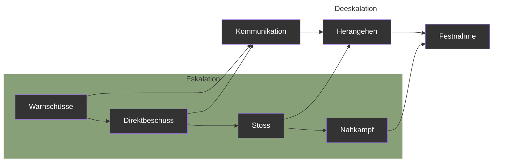
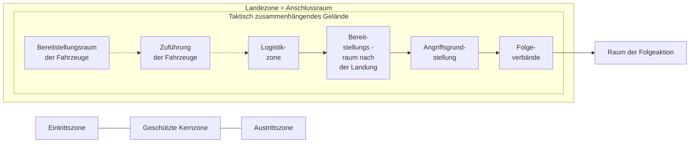

Schweizerische Eidgenossenschaft
Confédération suisse
Confederazione Svizzera
Confederaziun svizra

**Schweizer Armee**

Arbeitshilfe 53.005.25 d

# Einsatzverfahren des Infanteriezuges

(Ei Verf Inf Z)


Stand am 01.01.2023 [colspan=2] SAP 2583.9477


Schweizerische Eidgenossenschaft
Confédération suisse
Confederazione Svizzera
Confederaziun svizra

**Schweizer Armee**

Arbeitshilfe 53.005.25 d

# **Einsatzverfahren des Infanteriezuges**

(Ei Verf Inf Z)

Stand am 01.01.2023

Arbeitshilfe 53.005.25 d Einsatzverfahren des Infanteriezuges

# Verteiler

Persönliche Exemplare
* Berufsoffiziere und –unteroffiziere der Infanterie
* Offiziere und höhere Unteroffiziere der Infanterie (ohne Berufsmilitär)

Unpersönliche Exemplare
* keine

II

Arbeitshilfe 53.005.25 d Einsatzverfahren des Infanteriezuges

# Bemerkungen

1 Die vorliegende Arbeitshilfe ist Teil des Sammelbandes ‹Die Infanterie› und liefert detaillierte Kenntnisse über die Führung und Organisation eines Infanteriebataillons im Einsatz.

2 Zugunsten der Lesbarkeit wird in dieser Arbeitshilfe das generische Maskulin verwendet.

### Inhalt und Gliederung

3 In der vorliegenden Arbeitshilfe wird jedes Einsatzverfahren umfangreich und detailliert beschrieben. Die ausführlichen Erklärungen dienen der Vertiefung in die Materie und beschreiben Standardverhalten. In der Anwendung kann dementsprechend aufgrund einer Lagebeurteilung von diesen Standardverhalten abgewichen werden.

4 Jedes Kapitel ist gegliedert in:
* Grundsätzliches;
* Die drei Phasen des Einsatzverfahrens.

### Ansprechgruppen

5 Die Arbeitshilfe wurde für Taktiker, also für die Anwendung auf der taktische Stufe, geschrieben.

6 Die Arbeitshilfe soll vor allem von drei Ansprechgruppen benutzt werden:
* Verbandsführer/Stabsoffiziere und -unteroffiziere in der Anlern- und Festigungsstufe der Führungsausbildung;
* Berufsmilitär in Kader- und Rekrutenschulen;
* Projektleiter für Neubeschaffungen/Weiterentwicklung

III

Arbeitshilfe 53.005.25 d Einsatzverfahren des Infanteriezuges

## Anwendung im Lernprozess


*Abbildung 1: Schema zum Lernprozess*

7 Die Arbeitshilfe soll dem Verbandsführer/Stabsoffizier helfen, ein Einsatzverfahren zu begreifen und zu verinnerlichen.

8 Anlern- und Festigungsstufe der Führungsausbildung müssen zwingend im angeleiteten Unterricht erfolgen. Dabei sind folgende drei Schritte anzuwenden:
* Angeleitetes Erarbeiten des Verfahrens;
* Überprüfung des Erlernten durch selbständiges Erläutern der Abbildungen;
* Umlegen der Abbildungen in ein Mustergelände.

9 Die Anwendungsstufe der Führungsausbildung erfolgt im Rahmen der Verbandsausbildung. Erst in dieser Phase der Ausbildung soll bewusst vom Einsatzverfahren abgewichen werden.

IV

Arbeitshilfe 53.005.25 d Einsatzverfahren des Infanteriezuges

```description
The image is a complex diagram titled "Abbildung 2: Portfolio der Einsatzverfahren der Infanterie (nicht abschliessend)". It shows a matrix of operational procedures for infantry platoons, categorized by the legal/political situation (Normale Lage, Besondere Lage, Ausserordentliche Lage) and the type of military mission (Subsidiärer Einsatz der Armee vs. Originärer Einsatz der Armee). 

The horizontal axis represents the escalation levels:
1. Normale Lage: Bewältigung von Katastrophen, Notlagen und Aufgaben nationaler Bedeutung.
2. Besondere Lage: Prävention und Abwehr von Bedrohungen der inneren Sicherheit.
3. Ausserordentliche Lage: Prävention und Abwehr eines bewaffneten Angriffs; Bewältigung von konkreten, zeitlich anhaltenden, landesweiten und nur mit militärischen Mitteln bekämpfbaren Bedrohungen der territorialen Integrität, der gesamten Bevölkerung oder der Ausübung der Staatsgewalt.

The vertical axis is divided into three main operational categories:
- Schützende Aktionen (Protective Actions)
- Bekämpfung bewaffneter Gruppen (Combatting Armed Groups)
- Abwehr eines terrestrischen Vorstosses (Defense against a terrestrial advance)

The diagram contains numerous green boxes, each representing a specific tactical procedure with a code (e.g., B.01, K.01, Z.01). These boxes are arranged to show which procedures apply to which situation and mission type.
```

### Portfolio der Einsatzverfahren der Infanterie (nicht abschliessend)

<table>
    <tr>
        <th>Lage</th>
        <th>Normale Lage</th>
        <th>Besondere Lage</th>
        <th>Ausserordentliche Lage</th>
    </tr>
    <tr>
        <td>**Definition**</td>
        <td>Bewältigung von Katastrophen, Notlagen und Aufgaben nationaler Bedeutung</td>
        <td>Prävention und Abwehr von Bedrohungen der inneren Sicherheit</td>
        <td>Prävention und Abwehr eines bewaffneten Angriffs; Bewältigung von konkreten, zeitlich anhaltenden, landesweiten und nur mit militärischen Mitteln bekämpfbaren Bedrohungen der territorialen Integrität, der gesamten Bevölkerung oder der Ausübung der Staatsgewalt</td>
    </tr>
    <tr>
        <td>**Einsatzart**</td>
        <td>Subsidiärer Einsatz der Armee</td>
        <td>    </td>
        <td>Originärer Einsatz der Armee</td>
    </tr>
</table>#### Einsatzverfahren (nach Kategorien)

**Schützende Aktionen / Unterstützende Aktionen**
* **B.07** Unterstützungs- und Sicherungseinsätze
* **K.02** Schutz eines Objekts / Eigenschutz
* **Z.17** Verhalten bei / nach einem Lufttransport

**Bewegung und Stationierung**
* **B.01** Marsch
* **K.01** Marsch und Bezug eines neuen Raums
* **Z.01** Verhalten auf dem Marsch (inkl. gesicherter Halt)
* **Z.04** Offenhalten einer Bewegungslinie
* **Z.05** Eskorte als Konvoischutz

**Nachrichten und Überwachung**
* **B.03** Nachrichtenbeschaffung
* **K.03** Raumüberwachung

**Bekämpfung bewaffneter Gruppen**
* **B.02** Bereitschaftsraum
* **B.04** Bekämpfung bewaffneter Gruppen
* **K.04** Angriff nach einem Begegnungsgefecht
* **K.05** Abriegeln und Durchsuchen eines Geländeteils
* **K.06** Durchsuchen einer urbanen Zone / Ortschaft
* **Z.10** Verhalten im gegnerischen Hinterhalt / Begegnungsgefecht
* **Z.02** Verhalten auf der Patrouille
* **Z.03** Taktischer Checkpoint
* **Z.06** Verifikation einer Nachricht
* **Z.13** Durchsuchen eines mehrstöckigen Gebäudes
* **Z.07** Geländedurchsuchung
* **Z.08** Trennen von Akteuren
* **Z.09** Eskalation und Deeskalation mit Feuer
* **Z.11** Evakuation einer urbanen Zone

**Abwehr eines terrestrischen Vorstosses / Kampf im überbauten Gelände**
* **B.05** Angriff im überbauten Gelände
* **B.06** Verteidigung eines Raums
* **K.07** Einbruch in ein überbautes Gelände
* **K.08** Angriff entlang einer Bewegungslinie im überbauten Gelände
* **K.09** Bezug einer Sperrstellung im überbauten Gelände
* **K.10** Kampf in einer Sperrstellung im überbauten Gelände
* **K.11** Angriff ohne Verzahnung
* **Z.12** Vorgehen entlang einer Strasse
* **Z.16** Überfallartige Aktionen
* **Z.14** Bezug einer Sperre
* **Z.15** Stützpunkt im überbauten Gelände

Abbildung 2: Portfolio der Einsatzverfahren der Infanterie (nicht abschliessend)
V

Arbeitshilfe 53.005.25 d Einsatzverfahren des Infanteriezuges

VI

Arbeitshilfe 53.005.25 d Einsatzverfahren des Infanteriezuges

# Inhaltsverzeichnis

**1 Verhalten auf dem Marsch (Z.01)** 1
1.1 Grundsätzliches 1
1.2 Die Marschvorbereitungen 3
1.3 Das Verhalten in Standardsituationen 4
1.4 Die Massnahmen bei besonderen Ereignissen 11

**2 Verhalten auf der Patrouille (Z.02)** 14
2.1 Grundsätzliches 14
2.2 Die Vorbereitung und die Nachbearbeitung einer Patrouille 16
2.3 Das Verhalten in Standardsituationen 18
2.4 Die Massnahmen bei besonderen Ereignissen 23

**3 Taktischer Checkpoint (Z.03)** 30
3.1 Grundsätzliches 30
3.2 Die Einsatzvorbereitung und der Bezug des taktischen Checkpoints 33
3.3 Die Einflussnahme im Kontrollraum 36
3.4 Die Einflussnahme im Reaktionsraum 39

**4 Offenhalten einer Bewegungslinie (Z.04)** 43
4.1 Grundsätzliches 43
4.2 Das Gewinnen von Tiefe im Raum 46
4.3 Der Aufbau der zusammenhängenden Sicherung 48
4.4 Das Zusammenwirken von statischen und beweglichen Elementen 51

**5 Eskorte als Konvoischutz (Z.05)** 55
5.1 Grundsätzliches 55
5.2 Das Bereitstellen der Eskorte 58
5.3 Das Verhalten in Standardsituationen während dem Marsch 62
5.4 Die Massnahmen bei besonderen Ereignissen 65

**6 Verifikation einer Nachricht (Z.06)** 69
6.1 Grundsätzliches 69
6.2 Die Einsatzvorbereitungen und die Bereitstellung 72
6.3 Die Abriegelung des Verifikationsorts 74
6.4 Das Durchführen der Hauptaktion 79

**7 Geländedurchsuchung (Z.07)** 84
7.1 Grundsätzliches 84
7.2 Die Einsatzvorbereitungen und der Bezug der Angriffsgrundstellung 86
7.3 Das Vorgehen im Durchsuchungsraum 88
7.4 Das Bewältigen der Logistik 93

VII

Arbeitshilfe 53.005.25 d Einsatzverfahren des Infanteriezuges

**8 Trennen von Akteuren (Z.08)** 96
8.1 Grundsätzliches 96
8.2 Die Reaktion auf die Notwehrsituation im Kontaktraum 100
8.3 Die Neutralisation des Akteurs im taktisch zusammenhängenden Gelände des Kontaktraums 102
8.4 Das Bereinigen der Situation im Kontaktraum 104

**9 Eskalation und Deeskalation mit Feuer (Z.09)** 108
9.1 Grundsätzliches 108
9.2 Die Bereitstellung und der Gefechtsbeginn 112
9.3 Die Fortsetzung des Gefechts mit deeskalierenden Massnahmen 115
9.4 Die Fortsetzung des Gefechts mit eskalierenden Massnahmen 116

**10 Verhalten im Begegnungsgefecht / gegnerischen Hinterhalt (Z.10)** 121
10.1 Grundsätzliches 121
10.2 Die ersten Reaktionen und das Erlangen der Führungsfähigkeit 124
10.3 Der Übergang zum Halten des Raums 127
10.4 Das Schaffen von Voraussetzungen für Verstärkungskräfte 130

**11 Evakuation einer überbauten Zone (Z.11)** 133
11.1 Grundsätzliches 133
11.2 Das Angehen des Evakuationsraums 137
11.3 Die Durchführung der Evakuation 139
11.4 Die Zusammenarbeit mit einem Zugriffselement 143

**12 Vorgehen entlang einer Strasse (Z.12)** 149
12.1 Grundsätzliches 149
12.2 Die Vorbereitung und die Unterstützung des abgesessenen Vorgehens 154
12.3 Das abgesessene Vorgehen in den Angriffsstreifen 158
12.4 Die Handhabung des Schlauchprinzips und das Sicherstellen der Logistik 160

**13 Durchsuchen eines mehrstöckigen Gebäudes (Z.13)** 167
13.1 Grundsätzliches 167
13.2 Die Abriegelung des Gebäudes 172
13.3 Das Nehmen des ersten Zwischenziels im Treppenhaus 175
13.4 Das Durchsuchen der Stockwerke 178

**14 Bezug einer Sperre (Z.14)** 181
14.1 Grundsätzliches 181
14.2 Die ersten Massnahmen und die Kampfvorbereitungen 185
14.3 Der rasche Bezug der Sperre 189

VIII

Arbeitshilfe 53.005.25 d Einsatzverfahren des Infanteriezuges

14.4 Der Kampf in der Sperre 191
**15 Stützpunkt im überbauten Gelände (Z.15)** **198**
15.1 Grundsätzliches 198
15.2 Der Bezug des Stützpunkts und die Kampfvorbereitungen 202
15.3 Die statische Kampfführung im Verteidigungsraum 205
15.4 Die bewegliche Kampfführung im Vorgelände 209
**16 Überfallartige Aktionen (Z.16)** **216**
16.1 Grundsätzliches 216
16.2 Die Auslösung der Aktion und das Erreichen des Aktionsraums 220
16.3 Das Erreichen der Absitzzone und der Stellungsbezug 224
16.4 Der Feuerkampf und das Absetzen 227
**17 Verhalten bei Lufttransport (Z.17)** **234**
17.1 Grundsätzliches 234
17.2 Die speziellen Einsatzvorbereitungen 238
17.3 Das Verhalten in der Aufnahmezone 240
17.4 Das Verhalten in der Landezone 242

IX

Arbeitshilfe 53.005.25 d Einsatzverfahren des Infanteriezuges

# Abbildungsverzeichnis

**Abbildung 1:** Schema zum Lernprozess IV
**Abbildung 2:** Portfolio der Einsatzverfahren der Infanterie (nicht abschliessend) V
**Abbildung 3:** Die Vorteile des Gefechtsfahrzeugs 1
**Abbildung 4:** Die drei Phasen des Einsatzverfahrens Verhalten auf dem Marsch (Z.01) 2
**Abbildung 5:** Checkliste für das Erstellen der Alarmbereitschaft 3
**Abbildung 6:** Die Marschvorbereitungen 4
**Abbildung 7:** Die Führung während dem Marsch 5
**Abbildung 8:** Die räumlichen Elemente des Marsches 5
**Abbildung 9:** Die Beobachtungssektoren in der Kolonne 6
**Abbildung 10:** Beobachtungsschwergewicht rechts/links 7
**Abbildung 11:** Das Gewinnen von Breite am Beispiel der Entfaltung links 7
**Abbildung 12:** Abmarsch und Einkolonnierung 8
**Abbildung 13:** Der Bezug eines gesicherten Halts 10
**Abbildung 14:** Die Sicherung des taktisch zusammenhängenden Geländes (mögliche Lösung) 10
**Abbildung 15:** Das Verhalten bei blockierter Marschstrasse durch ein passives Hindernis 12
**Abbildung 16:** Das notfallmässige Verlassen einer Geländekammer 13
**Abbildung 17:** Das taktisch zusammenhängende Gelände der Nachrichtenbeschaffung 14
**Abbildung 18:** Die drei Phasen des Einsatzverfahrens Verhalten auf der Patrouille (Z.02) 15
**Abbildung 19:** Kraft-Raum-Zeit-Konzept mit Teilaufträgen (Beispiel) 16
**Abbildung 20:** Die Koordination der beiden Halbzüge mit den räumlichen Elementen des Angriffs 18
**Abbildung 21:** Die Organisation der motorisierten Patrouille 20
**Abbildung 22:** Die Verantwortungssektoren bei der motorisierte Patrouille (Möglichkeit) 20
**Abbildung 23:** Der Beobachtungshalt 21
**Abbildung 24:** Die abgesessenen Patrouille 22
**Abbildung 25:** Die Zusammenarbeit mit Sensoren 23
**Abbildung 26:** Die Massnahmen bei einer Friktion 24
**Abbildung 27:** Das Vorgehen bei der Blockade durch ein Hindernis 25
**Abbildung 28:** Das Vorgehen bei einer Blockade in Fahrtrichtung 27
**Abbildung 29:** Das Vorgehen bei beidseitig aktiver Blockade 28
**Abbildung 30:** Die Führung beim Vorgehen bei beidseitig aktiver Blockade 29
**Abbildung 31:** Taktischer und technischer Checkpoint 31

X

Arbeitshilfe 53.005.25 d Einsatzverfahren des Infanteriezuges

Abbildung 32: Die räumlichen Elemente des taktischen Checkpoints 32
Abbildung 33: Der taktische Checkpoint mit zwei Kontrollrichtungen (Ausnahme) 32
Abbildung 34: Die drei Phasen des Einsatzverfahrens Checkpoint (Z.03) 33
Abbildung 35: Das Vorgehen bei der Geländeanalyse 35
Abbildung 36: Der Bezug des taktischen Checkpoints 36
Abbildung 37: Standorte des Kontrollelements nach dem Bezug des taktischen Checkpoints 37
Abbildung 38: Die logistische Entlastung der Kontrollgruppe 38
Abbildung 39: Die Entlastung der Kontrollgruppe bei einem Feuerkampf 39
Abbildung 40: Die räumliche Organisation im Reaktionsraum 40
Abbildung 41: Die Neutralisation eskalationsbereiter gegnerischer Elemente 41
Abbildung 42: Kontrolle/Neutralisation von nicht identifizierten Akteuren/Gegner 42
Abbildung 43: Der nur durch Überwachungselemente zusammengehaltener Korridor 44
Abbildung 44: Der physisch vollständig gesicherte Korridor 45
Abbildung 45: Die drei Phasen des Einsatzverfahrens offenhalten einer Bewegungslinie (Z.04) 45
Abbildung 46: Die Geländeanalyse 46
Abbildung 47: Das Vorgehen beim Einfliessen in den Raum 47
Abbildung 48: Die maximale kräftemässige Auslastung des Zuges 49
Abbildung 49: Die Führungsstruktur des Zuges (mögliche Lösung) 50
Abbildung 50: Zugsdispositiv im offenen Gelände (mögliche Lösung) 50
Abbildung 51: Zugsdispositiv im gekammerten Gelände (mögliche Lösung) 51
Abbildung 52: Das Zusammenwirken von Überwachung und Kontrolle im Gruppensektor 52
Abbildung 53: Einsatz von Reaktionselementen im offenen Gelände 53
Abbildung 54: Einsatz von Reaktionselementen im gekammerten Gelände 53
Abbildung 55: Räumliche Dimensionen, Mittel- und Kräfteansatz 56
Abbildung 56: Grundsätze für die Führung der Eskorte 57
Abbildung 57: Die drei Phasen des Einsatzverfahrens Eskorte als Konvoischutz (Z.05) 58
Abbildung 58: Die Inhalte des Briefings 59
Abbildung 59: Die funktechnischen Vorbereitungen 60
Abbildung 60: Das Andocken an den Konvoi 61
Abbildung 61: Die Grundformationen der Eskorte 62
Abbildung 62: Beobachtungs- und Reaktionssektoren während dem Marsch 63

XI

Arbeitshilfe 53.005.25 d Einsatzverfahren des Infanteriezuges

**Abbildung 63:** Das Passieren des Einkolonnierungspunkts 64
**Abbildung 64:** Das Anhalten des Konvois während dem Marsch 65
**Abbildung 65:** Das Verhalten bei defektem Konvoifahrzeug 66
**Abbildung 66:** Der Durchbruch bei Feindkontakt 67
**Abbildung 67:** Das gesicherte Anhalten bei Feindkontakt 68
**Abbildung 68:** Die räumlichen Elemente 70
**Abbildung 69:** Mittel- und Kräfteansatz 71
**Abbildung 70:** Die drei Phasen des Einsatzverfahrens Verifikation einer Nachricht (Z.06) 72
**Abbildung 71:** Die Planung nach den räumlichen Elementen des Angriffs 73
**Abbildung 72:** Die Planung des Zusammenspiels der drei Kräfte 74
**Abbildung 73:** Das Einfliessen in den Raum 75
**Abbildung 74:** Die grossräumige Abriegelung 76
**Abbildung 75:** Der Mittelansatz bei der Abriegelung des Verifikationsorts 77
**Abbildung 76:** Das Vorgehen bei der Abriegelung des Verifikationsorts 78
**Abbildung 77:** Das Vorgehen bei physischer Einflussnahme auf Verdacht 80
**Abbildung 78:** Das Vorgehen bei physischer Einflussnahme aufgrund eindeutiger Indizien 81
**Abbildung 79:** Die Unterstützung durch die Kompanie 83
**Abbildung 80:** Der Kompanierahmen 84
**Abbildung 81:** Die drei Phasen des Einsatzverfahrens Geländedurchsuchung (Z.07) 85
**Abbildung 82:** Die Planung der Durchsuchung mit den räumlichen Elementen des Angriffs 86
**Abbildung 83:** Die Koordination der Aktion 87
**Abbildung 84:** Einfliessen in den Anschlussraum und Bezug der Angriffsgrundstellung 88
**Abbildung 85:** Die Abriegelung beim überschlagenden Durchsuchen 89
**Abbildung 86:** Das Vorgehen mit Feuer(bereitschaft) und Bewegung 90
**Abbildung 87:** Der Einsatz der Gefechtsfahrzeuge beim Vorgehen mit frontalem Abriegeln 91
**Abbildung 88:** Das Vorgehen mit Abriegeln aus der Flanke 92
**Abbildung 89:** Das Vorgehen in einer Geländekammer mit einzelnen Gebäuden 93
**Abbildung 90:** Die räumliche Definition einer Logistikzone 94
**Abbildung 91:** Das kombinierte Bring-/Holprinzip 95
**Abbildung 92:** Die Problematik der legitimen Gewaltanwendung 96
**Abbildung 93** Ausformulierte Ausgangslage Trennen von Akteuren (Möglichkeit) 97
**Abbildung 94** Visualisierte Ausgangslage (Möglichkeit) 98
**Abbildung 95** Die räumlichen Elemente 99

XII

Arbeitshilfe 53.005.25 d Einsatzverfahren des Infanteriezuges

Abbildung 96: Die drei Phasen des Einsatzverfahrens Trennen von Akteuren (Z.08) 99
Abbildung 97: Die ersten Reaktionen auf den Beschuss 100
Abbildung 98: Die räumliche Vorbereitung der beiden Gewaltspektren 101
Abbildung 99: Die fünf Schritte bei der Neutralisation des kooperationsbereiten Akteurs 102
Abbildung 100: Die Aktionsführung im taktisch zusammenhängenden Gelände 103
Abbildung 101: Die Bereinigung der Situation im Kontaktraum 104
Abbildung 102: Die Unterstützung durch den zweiten Halbzug (mögliche Lösung) 105
Abbildung 103: Die Lage des Zuges nach dem Abschluss der Aktion (mögliche Lösung) 107
Abbildung 104: Eskalation und Deeskalation auf der technischen Stufe 108
Abbildung 105: Eskalation und Deeskalation auf der taktischen Stufe 109
Abbildung 106: Ausformulierte Ausgangslage Eskalation und Deeskalation mit Feuer (Möglichkeit) 110
Abbildung 107: Die Einsatzgliederung des Säuberungsverbands 110
Abbildung 108: Die räumlichen Elemente 111
Abbildung 109: Die drei Phasen des Einsatzverfahrens Eskalation und Deeskalation mit Feuer (Z.09) 112
Abbildung 110: Die Bereitstellung des Zuges bezüglich der Mittel 113
Abbildung 111: Die Bereitstellung des Zuges bezüglich der Führung 114
Abbildung 112: Der Gefechtsbeginn mit Warnschüssen der Bordwaffen 114
Abbildung 113: Die Möglichkeiten des weiteren Gefechtsverlaufs (nicht abschliessend) 115
Abbildung 114: Die Aktionsführung beim dem Herangehen 116
Abbildung 115: Der Einsatz der schweren Maschinengewehre im Feuerkampf 117
Abbildung 116: Der Einsatz der abgesessenen Gruppen im Feuerkampf 118
Abbildung 117: Der Stoss zur Aufrechterhaltung der Trennung gegnerischer Kräfte 119
Abbildung 118: Das Vorgehen mit Feuer(bereitschaft) und Bewegung 120
Abbildung 119: Die Leistungen des Zuges und der Kompanie im Begegnungsgefecht 122
Abbildung 120: Die räumlichen Elemente (z B in einer Ortschaft) 123
Abbildung 121: Die drei Phasen des Einsatzverfahrens Verhalten im Begegnungsgefecht/gegnerischen Hinterhalt (Z.10) 124
Abbildung 122: Bei Beschuss ausgelöste Mechanismen 125
Abbildung 123: Das Kanalisieren der Sofortaktionstechniken 126

XIII

Arbeitshilfe 53.005.25 d Einsatzverfahren des Infanteriezuges

**Abbildung 124:** Das Erlangen der Führungsfähigkeit im unmittelbaren Kontaktraum 127
**Abbildung 125:** Checkliste zur Konkretisierung des Lagebilds 128
**Abbildung 126:** Die Durchsuchung des unmittelbaren Kontaktraums 129
**Abbildung 127:** Die Durchsuchung des erweiterten Kontaktraums 129
**Abbildung 128:** Die Verlagerung der Führungsschwergewichte ab Gefechtsbeginn 130
**Abbildung 129:** Der Kontaktraum während der Phase der logistischen Nachsorge 131
**Abbildung 130:** Mittel- und Kräfteansatz/räumliche Elemente 135
**Abbildung 131:** Horizontale und vertikale Evakuation 136
**Abbildung 132:** Die drei Phasen des Einsatzverfahrens Evakuation einer überbauten Zone (Z.11) 136
**Abbildung 133:** Die lineare Annäherung 138
**Abbildung 134:** Die konzentrische Annäherung 139
**Abbildung 135:** Die horizontale Evakuation 140
**Abbildung 136:** Die vertikale Evakuation 141
**Abbildung 137:** Die räumlichen Elemente bei einem Zugriff 143
**Abbildung 138:** Ausformulierte Ausgangslage (Möglichkeit) 144
**Abbildung 139:** Visualisierte Ausgangslage (Möglichkeit) 144
**Abbildung 140:** Die Parameter für die Zusammenarbeit 146
**Abbildung 141:** Die Verantwortungsbereiche im inneren Ring 147
**Abbildung 142:** Die Mechanik des Zugriffs 147
**Abbildung 143:** Die Strasse als Einsatzraum des Zuges 149
**Abbildung 144:** Die beiden taktischen Grundleistungen 150
**Abbildung 145:** Die Grundgliederung beim Vorgehen entlang einer Strasse 151
**Abbildung 146:** Die räumlichen Elemente beim Vorgehen entlang einer Strasse 152
**Abbildung 147:** Die Führung der Aktion 153
**Abbildung 148:** Die drei Phasen des Einsatzverfahrens Vorgehen entlang einer Strasse (Z.12) 153
**Abbildung 149:** Das taktisch zusammenhängende Gelände der Strasse 154
**Abbildung 150:** Der gekreuzte Einsatz der Bordwaffen 155
**Abbildung 151:** Das Vermeiden der Eigengefährdung durch die Bordwaffen 156
**Abbildung 152:** Die Abriegelung des Einsatzraums (Beispiel) 157
**Abbildung 153:** Die Abriegelung einzelner Gebäude (Beispiel) 158
**Abbildung 154:** Das Vorgehen in den beiden Angriffsstreifen (Einfliessen in einen Geländeteil) 159
**Abbildung 155:** Das Vorgehen im Halbzug 160

XIV

Arbeitshilfe 53.005.25 d Einsatzverfahren des Infanteriezuges

Abbildung 156: Die «Bewegungsfreiheit» in Abhängigkeit von Schutz und Tiefe 161
Abbildung 157: Ausformulierte Ausgangslage (Möglichkeit) 162
Abbildung 158: Visualisierte Ausgangslage (Möglichkeit) 162
Abbildung 159: Das Beheben einer Friktion (mögliche Lösung) 163
Abbildung 160: Das Zuführen von Verstärkungskräften 164
Abbildung 161: Der Logistikablauf für die taktische Grundleistung durchsuchen 165
Abbildung 162: Der Logistikablauf für die taktische Grundleistung säubern 166
Abbildung 163: Das Leistungsvermögen des Zuges beim Vorgehen entlang einer Strasse (taktische Grundleistung durchsuchen) 168
Abbildung 164: Das Leistungsvermögen des Zuges bei Grossgebäuden/Wohnblöcken 169
Abbildung 165: Die räumlichen Elemente 170
Abbildung 166: Die beiden Grundvarianten der Durchsuchung 171
Abbildung 167: Die drei Phasen des Einsatzverfahrens Durchsuchen eines mehrstöckigen Gebäudes (Z.13) 172
Abbildung 168: Überwachung und Abriegelung der Umgebung und der Fassaden 173
Abbildung 169: Überwachung und Abriegelung einer Breitseite (nur bei Durchsuchung in Längsrichtung) 173
Abbildung 170: Die Vorbereitung des Angehens und des Einstiegs 174
Abbildung 171: Das Angehen über die Breitseite 175
Abbildung 172: Das Angehen über die Schmalseite 176
Abbildung 173: Die Garantie der Sicherheit für im Gebäude agierende Truppen 177
Abbildung 174: Die Organisation der Führung 178
Abbildung 175: Die Organisation der Logistik 179
Abbildung 176: Der grössere Rahmen 181
Abbildung 177: Die räumlichen Elemente der Sperre 183
Abbildung 178: Die Führungsstruktur 184
Abbildung 179: Die drei Phasen des Einsatzverfahrens Bezug einer Sperre (Z.14) 184
Abbildung 180: Das Sicherungsdispositiv während den ersten Massnahmen 185
Abbildung 181: Die Erhöhung des Verzögerungswerts der Passage obligé (Beispiel) 186
Abbildung 182: Exkurs: Das Überleben von Bogenfeuer nach der Desarmierung unseres Geländes 187
Abbildung 183: Die Anforderungen an den Bereitstellungsraum 187
Abbildung 184: Die Vorbereitung des Stellungsraums (mögliche Lösung) 189

XV

Arbeitshilfe 53.005.25 d Einsatzverfahren des Infanteriezuges

Abbildung 185: Die drei Schritte beim Bezug der Sperre 190
Abbildung 186: Das Dispositiv in der Absitzzone 190
Abbildung 187: Stellungs- und Vernichtungsraum (mögliche Lösung) 192
Abbildung 188: Das Grundgerippe des Feuerkampfs (mögliche Lösung) 193
Abbildung 189: Die Rolle der einzelnen Waffen im Feuerkampf 194
Abbildung 190: Die Beeinflussung des Feuerkampfs 195
Abbildung 191: Möglichkeiten der physischen Kräfteverlagerung nach Kampfbeginn 196
Abbildung 192: Der Zugstützpunkt als Teil der Kompaniesperre im überbauten Gelände 198
Abbildung 193: Die räumlichen Elemente des Stützpunkts 200
Abbildung 194: Der Mittel-/Kräfteansatz 201
Abbildung 195: Die drei Phasen des Einsatzverfahrens Stützpunkt im überbauten Gelände (Z.15) 201
Abbildung 196: Das Eintreffen des Zuges im Verteidigungsraum 203
Abbildung 197: Die Kampfvorbereitungen im Verteidigungsraum 204
Abbildung 198: Die Kampfvorbereitungen im Vorgelände 205
Abbildung 199: Die Radien der Feuerreichweite der Schlüsselwaffen 206
Abbildung 200: Die Rolle der einzelnen Waffen im Feuerkampf 207
Abbildung 201: Die physische Verlagerung von Kräften nach Kampfbeginn 209
Abbildung 202: Parameter für die bewegliche Kampfführung im Vorgelände 210
Abbildung 203: Die Zusammenarbeit zwischen Überfallelement und Sensoren 211
Abbildung 204: Die Zusammenarbeit zwischen Überfallelement und Bordwaffen 212
Abbildung 205: Das Vorgehen des Überfallelements 213
Abbildung 206: Bewegungsraum und Stellungsräume 213
Abbildung 207: Durch Feuer gefährdete Zonen 214
Abbildung 208: Führungsunterlage zur Koordination der beweglichen Kampfführung (Beispiel) 214
Abbildung 209: Feuerüberfall und Hinterhalt (Prinzipskizze) 217
Abbildung 210: Die Parameter für die Durchführung überfallartiger Aktionen (Auswahl) 218
Abbildung 211: Die räumlichen Elemente 219
Abbildung 212: Die drei Phasen des Einsatzverfahrens Überfallartige Aktionen (Z.16) 219
Abbildung 213: Die Organisation des vorgelagerten Zugsbereitstellungsraums 220
Abbildung 214: Die Auslösung der Aktion (Normalfall) 221

XVI

Arbeitshilfe 53.005.25 d Einsatzverfahren des Infanteriezuges

Abbildung 215: Die Bereitstellung der beiden Halbzüge 222
Abbildung 216: Der Einsatz der Sensoren 223
Abbildung 217: Die Annäherung und der Bezug der Angriffsgrundstellung 223
Abbildung 218: Das Zugsdispositiv in der Absitzzone 224
Abbildung 219: Der Stellungsbezug 226
Abbildung 220: Das Anbringen eines Hindernisses beim Hinterhalt 227
Abbildung 221: Die räumliche Gliederung des Vernichtungsraums 228
Abbildung 222: Die Rolle der einzelnen Waffen im Feuerkampf 229
Abbildung 223: Die Möglichkeiten für die Integration der Bordwaffen im Feuerkampf 230
Abbildung 224: Die Varianten für die Führung des Feuerkampfs 231
Abbildung 225: Das Absetzen in die Aufnahmezone 233
Abbildung 226: Die räumlichen Elemente beim Lufttransport 234
Abbildung 227: Die beiden Normaufgaben in der Landezone 235
Abbildung 228: Mögliche Zusammensetzung eines Spitzenelements (4 Helikopter) 236
Abbildung 229: Lufttransport und Fahrzeugkolonne 237
Abbildung 230: Die drei Phasen des Einsatzverfahrens Verhalten bei Lufttransport (Z.17) 237
Abbildung 231: Die Kompensation von Schutz und Feuer der Gefechtsfahrzeuge 238
Abbildung 232: Die Schwergewichtsbildung bei der ersten Welle (Beispiel) 239
Abbildung 233: Die Sicherung der Aufnahmezone mit den Gefechtsfahrzeugen (Beispiel) 240
Abbildung 234: Die Sicherung der Aufnahmezone ohne Gefechtsfahrzeuge (Beispiel) 241
Abbildung 235: Das Prinzip für das Zuführen der Gefechtsfahrzeuge 242
Abbildung 236: Die Verantwortungsabgrenzung der Stufen Kompanie und Zug in der Landezone 243
Abbildung 237: Die vier Schritte beim Sichern der Landezone 244
Abbildung 238: Der Endausbau der Landezone 245
Abbildung 239: Beispiel einer Kompanieaktion 245

XVII

Arbeitshilfe 53.005.25 d Einsatzverfahren des Infanteriezuges

XVIII

Arbeitshilfe 53.005.25 d Einsatzverfahren des Infanteriezuges

# 1 Verhalten auf dem Marsch (Z.01)

## 1.1 Grundsätzliches

10 Ein Marsch ist die taktische Verschiebung von Verbänden am Boden. Er kann auf Stufe Zug unter Eigensicherung, wie auch integriert im Kompanierahmen erfolgen.

11 Als selbständige Zugsaufgabe sind folgende Marschzwecke denkbar:
* Vorausaktion einer Kompanie für Erkundungs-, Einweisungs- und Sicherungsaufgaben in einem neuen Raum;
* Marsch in einen Bereitstellungsraum.

12 Vom Marsch zu unterscheiden sind die Patrouille sowie die Eskorte (vgl dazu Kapitel 2 und 5). Während auf dem Marsch die Eigensicherung im Vordergrund steht, sind die beiden andern Einsatzverfahren an einen Nachrichtenbeschaffungs- oder einen Sicherungsauftrag für Dritte gebunden.

13 Der Infanteriezug hat grundsätzlich drei Möglichkeiten der taktischen Verschiebung:
* Motorisierter Marsch (Gefechtsfahrzeuge oder Lastwagen);
* Fussmarsch;
* Lufttransport.

14 Der Marsch mit den Gefechtsfahrzeugen ist die Regel zwischen überbauten Zonen, wo die Vorteile des Fahrzeugs ausgenützt werden können (Geschwindigkeit, Splitterschutz, Unterstützung durch Bordwaffe).


Abbildung 3: Die Vorteile des Gefechtsfahrzeugs

1

Arbeitshilfe 53.005.25 d
Einsatzverfahren des Infanteriezuges

15 Fussmarsch und Lufttransport bilden die Ausnahme und kommen primär im gebirgigen Gelände zum Tragen.

16 Der Infanteriezug verschiebt mit seinen Gefechtsfahrzeugen normalerweise in Kolonne, auf Sicht und auf befestigten Strassen/Wegen.

17 Strassen/Wegen werden während dem Marsch verlassen, um einen gesicherten Halt zu beziehen oder um die Truppe bei gegnerischem Beschuss in einer Deckung absitzen zu lassen.

18 Die Bordwaffen der Gefechtsfahrzeuge werden auf dem Marsch eingesetzt, um bei Kontakt mit einem Gegner der Mannschaft nach dem Absitzen das Erreichen einer ersten Deckung zu ermöglichen. Für den länger dauernden Einsatz der Bordwaffe muss das Fahrzeug mindestens in eine Teildeckung gefahren werden.

**Die drei Phasen des Einsatzverfahrens**

19 Im Einsatzverfahren werden drei Phasen unterschieden:
1. Marschvorbereitungen;
2. Verhalten in Standardsituationen;
3. Massnahmen bei besonderen Ereignissen.


Abbildung 4: Die drei Phasen des Einsatzverfahrens Verhalten auf dem Marsch (Z.01)

2

Arbeitshilfe 53.005.25 d Einsatzverfahren des Infanteriezuges

## 1.2 Die Marschvorbereitungen

20 Die Marschvorbereitungen umfassen alle Massnahmen, um einen Raum rasch und geordnet verlassen zu können. Sie umfassen die Einsatzvorbereitungen und das Erstellen der Alarmbereitschaft.

21 Um nicht überrascht zu werden, scheidet der Zug während den Marschvorbereitungen minimale Kräfte für die Sicherung aus.

22 Bei der Einsatzvorbereitung geht es darum, sich vor Marschbeginn logistisch, personell und mental auf den kommenden Einsatz vorzubereiten.

23 Das Erstellen der Alarmbereitschaft garantiert beim Marsch auf Stufe Kp, dass der Zug jederzeit ausgelöst werden kann. Der Zfhr geht beim Erstellen der Alarmbereitschaft gemäss der folgenden Checkliste vor:

<table>
  <tbody>
    <tr>
        <td>(1)</td>
        <td>Nahsicherung Stufe Zug aufbauen;</td>
    </tr>
    <tr>
        <td>(2)</td>
        <td>Fahrzeuge in Abfahrtrichtung marschbereit machen;</td>
    </tr>
    <tr>
        <td>(3)</td>
        <td>Beobachtung in die nächste Geländekammer sicherstellen;</td>
    </tr>
    <tr>
        <td>(4)</td>
        <td>Verbindungen innerhalb des Zuges, zum Nachbarverband und zur Kompanie überprüfen;</td>
    </tr>
    <tr>
        <td>(5)</td>
        <td>Reserve auf Stufe Zug bezeichnen;</td>
    </tr>
    <tr>
        <td>(6)</td>
        <td>Einweisung ins Zugsdispositiv sicherstellen;</td>
    </tr>
    <tr>
        <td>(7)</td>
        <td>Alarmierung innerhalb des Zuges sicherstellen;</td>
    </tr>
    <tr>
        <td>(8)</td>
        <td>Funktionskontrollen an Fahrzeugen, Waffen und Geräten durchführen;</td>
    </tr>
    <tr>
        <td>(9)</td>
        <td>Marschbereitschaft an Kompanie übermitteln;</td>
    </tr>
    <tr>
        <td>(10)</td>
        <td>Frontrapport (Zustandsmeldungen, Kroki mit Standorten) an Kompanie übermitteln.</td>
    </tr>
  </tbody>
</table>
*Abbildung 5: Checkliste für das Erstellen der Alarmbereitschaft*

24 Der Zugführer führt folgende persönliche Vorbereitungen durch:
* Vorbereitung der Führungsunterlagen;
* Analyse der Marschstrasse im Sinn einer Eventualplanung (mögliche Hindernisse und Umfahrungen, Wechsel auf eine alternative Marschstrasse, mögliche Räume für gesicherte Halte);
* Analyse von Standorten und Wirkungsbereichen von Sensoren entlang der Marschstrecke;
* Analyse der Möglichkeiten für eine sanitätsdienstliche Evakuation während dem Marsch (San Hist, zivile Spitäler, Bereitschaftsräume von Nachbartruppen);
* Berechnung der Marschzeit (40km/h als Berechnungsgrundlage).

3

Arbeitshilfe 53.005.25 d Einsatzverfahren des Infanteriezuges


*Abbildung 6: Die Marschvorbereitungen*

## 1.3 Das Verhalten in Standardsituationen

### Die Marschführung

25 Der Zug bildet die Marscheinheit. Er scheidet keine weiteren Erkundungs- und Aufklärungselemente aus. Der Zug verschiebt auf Sicht.

26 Der Marsch wird über die Fahrzeugkommandanten geführt (Offiziere auf den Fahrzeugen UNO und TRE, Besatzerunteroffiziere auf den Fahrzeugen DUE und QUATTRO).

27 Die Gruppenführer haben mit der Marschführung nichts zu tun. Ihre Kernaufgabe ist die Führung der abgesessenen Gruppe. Sie befinden sich während dem Marsch bei ihren Gruppen im Fahrzeuginnern. Sie hören den Zugsführungsfunk ab und orientieren ihre Gruppen während der Fahrt. Die Luken der einzelnen Fahrzeuge sind im Gegensatz zur motorisierten Patrouille geschlossen.

28 Der Zugführer wählt seinen Standort dort, wo er den Zug während dem Marsch am besten sehen und steuern kann (in der Regel auf dem ersten Fahrzeug des Zuges).

4

Arbeitshilfe 53.005.25 d
Einsatzverfahren des Infanteriezuges


*Abbildung 7: Die Führung während dem Marsch*

29 Der motorisierte Marsch wird mit der Landeskarte 1:50'000 geführt und auf Stufe Kompanie mit Fix- oder Wegpunkten koordiniert. Der Zugführer meldet das Überschreiten eines Fix- oder Wegpunktes an den Kompaniekommandanten, sobald sein letztes Fahrzeug diesen überschritten hat.

30 Beim Überschreiten eines Fix- oder Wegpunktes meldet auf Stufe Zug nur der Fahrzeugkommandant des letzten Fahrzeugs an den Zugführer (z B «QUATTRO Wegpunkt TWO-ONE überschritten»)


*Abbildung 8: Die räumlichen Elemente des Marsches*

5

Arbeitshilfe 53.005.25 d
Einsatzverfahren des Infanteriezuges

## Die Marschformationen

31 Die Marschformation des Zuges ist in der Regel die Kolonne.

32 Der Zugführer bestimmt die Abstände aufgrund der Strassen-, Witterungs- und Sichtverhältnisse. Zwischen den einzelnen Fahrzeugen wird im normalen Strassenverkehr ein Abstand von zwei Sekunden eingehalten. Der Abstand zwischen den beiden Halbzügen soll die Führung auf Sicht erlauben.

33 Die Beobachtungs-/Wirkungssektoren der Bordwaffen überschneiden sich und sind in der Kolonne wie folgt aufgeteilt (Fahrtrichtung = 12 Uhr):
* UNO: 10 bis 2 Uhr;
* DUE: 1 bis 5 Uhr;
* TRE: 7 bis 11 Uhr;
* QUATTRO: 4 bis 8 Uhr.

34 Auf Befehl «Zug, Beobachtungsschwergewicht rechts/links!» beobachten/wirken die Bordwaffen von DUE und TRE in den gleichen Sektor. Der gegenüberliegende Sektor wird nicht mehr überwacht. So können in der Flanke immer zwei Bordwaffen zusammengefasst werden.


*Abbildung 9: Die Beobachtungssektoren in der Kolonne*

6

Arbeitshilfe 53.005.25 d
Einsatzverfahren des Infanteriezuges


*Abbildung 10: Beobachtungsschwergewicht rechts/links*

35 Bei Bedarf kann aus der Kolonne heraus Breite gewonnen werden. Auf diese Weise kann die Reaktionsfähigkeit mit Feuer in alle Richtungen erhöht oder eine konzentrierte Unterstützung für das Absitzen erreicht werden.

36 Auf Befehl «Zug, Entfaltung rechts/links!» schwenkt der hintere Halbzug in die befohlene Richtung seitlich aus (darf nur auf abgesperrten Strassen trainiert werden).


*Abbildung 11: Das Gewinnen von Breite am Beispiel der Entfaltung links*

7

Arbeitshilfe 53.005.25 d
Einsatzverfahren des Infanteriezuges

### Der Abmarsch

37 Der Zugführer bestimmt die Marschreihenfolge seiner beiden Halbzüge.

38 Die Bereitmeldung zum Abmarsch erfolgt durch alle Fahrzeugkommandanten an den Zugführer, sobald das Aufsitzen der Gruppen beendet ist. Der Zugführer erteilt den Befehl «Zug, abmarschieren!».

39 Die Fahrzeugkommandanten melden, sobald ihr Fahrzeug fährt (z B «QUATTRO rollt»).

40 Das Einkolonnieren erfolgt auf Sicht, normalerweise durch Aufschliessen innerhalb der Kolonne (von vorne nach hinten). Je nach Bereitstellung kann es auch überschlagend (von hinten nach vorne) erfolgen.


Abbildung 12: Abmarsch und Einkolonnierung

### Das Überschlagen der Halbzüge

41 Der Zugführer kann bei Bedarf die Marschreihenfolge seiner Halbzüge ändern.

42 Auf Befehl «Zug, überschlagen!» verlangsamt der vordere Halbzug die Fahrt. Der hintere Halbzug überholt und übernimmt neu die Spitze des Verbands. Je nach Gelände verlässt der vordere Halbzug die Marschstrasse als Paket und hält kurz an.

43 Nach dem Überschlagen meldet das neue Schlussfahrzeug die Aufnahme der Fahrt (z B «DUE rollt»).

8

Arbeitshilfe 53.005.25 d Einsatzverfahren des Infanteriezuges

### Der gesicherte Halt

44 Ein gesicherter Halt wird bezogen, wenn der Marsch aus taktischen oder technischen Gründen unterbrochen werden muss (z B neuer Auftrag, neue Marschrichtung mit Wenden des ganzen Verbands, defektes Fahrzeug, usw).

45 Der gesicherte Halt wird in drei Schritten bezogen:
* Auskolonnieren des Zuges;
* Anhalten des Zuges;
* Sichern des taktisch zusammenhängenden Geländes.

46 Für das Auskolonnieren des Zuges aus dem Marsch legt der Zugführer einen Auskolonnierungspunkt fest. An diesem verlässt der Zug die Marschstrasse oder hält direkt an dieser an.

47 Das Anhalten des Zuges kann in der aktuellen Marschreihenfolge oder überschlagend erfolgen.

48 Der Zugführer erteilt den Befehl zum Anhalten, indem er den Zug alarmiert und ihm das Verfahren des Anhaltens sowie den Auskolonnierungspunkt befiehlt (z B: «Zug, gesicherter Halt, überschlagen, nächste Abzweigung rechts!» oder «Zug, gesicherter Halt ohne absitzen, Formation beibehalten, in 300 Meter!»).

49 Beim Anhalten in der aktuellen Marschformation wird direkt an der Marschstrasse angehalten. Die Fahrzeuge bleiben aufkolonniert. Die Marschreihenfolge wird beibehalten.

50 Beim überschlagenden Anhalten verlässt der Zug die Marschstrasse. Das erste Fahrzeug nutzt die erste Möglichkeit zum Ausstellen. Das zweite Fahrzeug überschlägt und nutzt seinerseits die erste Möglichkeit zum Ausstellen. Alle andern Fahrzeuge wiederholen das Verfahren, ohne dabei den Sichtkontakt zu verlieren.

51 Die Gruppen sitzen standardmässig ab und sichern die unmittelbare Umgebung des Fahrzeugs (Nahsicherung).

9

Arbeitshilfe 53.005.25 d Einsatzverfahren des Infanteriezuges


*Abbildung 13: Der Bezug eines gesicherten Halts*

52 Der Zugführer stellt sicher, dass das taktisch zusammenhängende Gelände des gesicherten Halts dominiert werden kann. Normalerweise werden Ein- und Ausgang aus dem Raum durch die jeweils räumlich am nächsten liegenden Gruppen kontrolliert. Das Zwischengelände wird durch die beiden Gruppen im Zentrum überwacht.


\* Taktisch zusammenhängendes Gelände

*Abbildung 14: Die Sicherung des taktisch zusammenhängenden Geländes (mögliche Lösung)*

10

Arbeitshilfe 53.005.25 d
Einsatzverfahren des Infanteriezuges

53 Für das Verlassen des gesicherten Halts folgendermassen vorgegangen:
* Sicherungsdispositiv ein- und Nahsicherung aufziehen;
* Fahrzeuge in Abfahrtrichtung marsch- und Truppe verladebereit machen;
* Alarmierung/Verbindungen innerhalb des Zuges und zur Kompanie überprüfen;
* letzte Funktions-/Bereitschaftskontrollen an Fahrzeugen, Waffen und Geräten durchführen;
* Marschbereitschaft an die Kompanie übermitteln.

54 Das Verlassen des gesicherten Halts erfolgt in der umgekehrten Reihenfolge des Bezugs. Die Einkolonnierung erfolgt auf Sicht durch Aufschliessen innerhalb der Kolonne (von vorne nach hinten) oder überschlagend (von hinten nach vorne).

## 1.4 Die Massnahmen bei besonderen Ereignissen

55 Im folgenden Kapitel werden Massnahmen bei zwei besonderen Ereignissen auf dem Marsch beschrieben. Die dargestellten Lösungen sind Handlungsmuster und müssen immer der konkreten Lage angepasst werden.

**Das Verhalten bei blockierter Marschstrasse**

56 Bei der Blockade der Marschstrasse durch ein passives Hindernis schafft sich der Zugführer mit folgenden Massnahmen Handlungsfreiheit für ein weiteres Vorgehen:
* Zug anhalten und taktisch zusammenhängendes Gelände des Ereignisorts mit den Bordwaffen des vorderen Halbzuges minimal sichern;
* Meldung an den Kompaniekommandanten, damit dieser andere marschierende Züge anhalten oder umleiten kann;
* hinteren Halbzug zurückziehen, absitzen lassen und als Reaktionselement bereithalten.

57 Der Kompaniekommandant entscheidet, ob das Hindernis zu umfahren oder dieses zu beseitigen ist.

58 Bei der Umfahrung des Hindernisses geht der Zugführer wie folgt vor:
* Wenden des hinteren Halbzuges unter dem Schutz des vorderen Halbzuges;
* Wenden des vorderen Halbzuges unter dem Schutz des hinteren Halbzuges;
* Rückzug bis zum festgelegten Einkolonnierungspunkt in die Rochade.

11

Arbeitshilfe 53.005.25 d Einsatzverfahren des Infanteriezuges

59 Zur Beseitigung des Hindernisses geht der Zugführer wie folgt vor:
* Abgesessenes Durchsuchen des Hindernisorts durch vorderen Halbzug;
* Sicherstellen der Einweisung für allenfalls zugeteilte Unterstützungskräfte;
* Beseitigung des Hindernisses durch den hinteren Halbzug unter dem Schutz des vorderen Halbzuges.

60 Für die Beseitigung/das Wegziehen schwerer Gegenstände können die Gefechtsfahrzeuge des hinteren Halbzuges verwendet werden.


*Abbildung 15: Das Verhalten bei blockierter Marschstrasse durch ein passives Hindernis*

61 Bei einer Blockade durch Akteure geht der Zugführer gemäss den Massnahmen bei besonderen Ereignissen auf der Patrouille vor (vgl dazu Kapitel 2.4).

**Das notfallmässige Verlassen einer Geländekammer**

62 Wird der Marsch durch ein Ereignis an einem Ort gestoppt, an dem keine Möglichkeit besteht, diesen zu umfahren oder die Geländekammer rasch zu verlassen, besteht immer die Möglichkeit eines gegnerischen Hinterhalts. Hier gilt: «Nie dort anhalten, wo uns ein möglicher Gegner den Kampf aufzwingen kann».

63 Dem Zugführer stehen zwei Varianten zur Verfügung, um seinen Zug aus der möglichen Gefahren-/Kampfzone herauszubringen:
* Durchbruch;
* Rückzug.

12

Arbeitshilfe 53.005.25 d Einsatzverfahren des Infanteriezuges

64 Für den Durchbruch erteilt der Zugführer den Befehl «Zug, Durchbrechen, AVANTI, AVANTI!» Alle Fahrzeuge folgen der Marschstrasse mindestens in die nächste Geländekammer. Marschreihenfolge sowie Beobachtungs- und Feuersektoren werden beibehalten.

65 Für den Rückzug erteilt der Zugführer den Befehl «Zug, STOPP, STOPP! Zug, RITORNO, RITORNO!» Alle Fahrzeuge leiten eine Notbremsung ein und setzen halbzugsweise zurück. Der vordere Halbzug deckt das Zurücksetzen des hinteren Halbzuges mit Feuer(bereitschaft).

66 Nach dem Bezug eines gesicherten Halts orientiert der Zugführer in beiden Varianten seinen Kompaniekommandanten, der das weitere Vorgehen festlegt.


*Abbildung 16: Das notfallmässige Verlassen einer Geländekammer*

67 Wird der Zug auf dem Marsch durch ein Begegnungsgefecht gebunden, so erfolgt das Vorgehen gemäss Kapitel 10.

13

Arbeitshilfe 53.005.25 d
Einsatzverfahren des Infanteriezuges

# 2 Verhalten auf der Patrouille (Z.02)

## 2.1 Grundsätzliches

68 Patrouillen sind Teil der Nachrichtenbeschaffung. Sie werden im offenen Vorgehen durchgeführt, um
* Räume zu erkunden;
* die militärische Grundlast in einem Einsatzraum zu etablieren;
* für die diskreten Organe des Sensor-Wirkungsverbunds Reaktionen zu provozieren;
* besondere Nachrichtenbedürfnisse vor Ort abzuriegeln.

69 Patrouillen kommen in der Raumüberwachung einer Infanteriekompanie zum Tragen. Sie werden mit dem Einsatzelement im Rahmen der reduzierten Gefechtsbereitschaft durchgeführt (vgl dazu Arbeitshilfe 53.005.23 «Einsatzverfahren der Infanteriekompanie», Kapitel 3.2).

70 Für alle für das zivile Umfeld sichtbaren Waffen muss die Patrouille die dazugehörige Munition mitführen. Was gezeigt wird, muss im Eskalationsfall auch eingesetzt werden können.

**Räumliche Elemente / Mittel- und Kräfteansatz**


*Abbildung 17: Das taktisch zusammenhängende Gelände der Nachrichtenbeschaffung*

71 Der Infanteriezug wird für die Patrouille in der Regel in zwei Halbzügen eingesetzt, die gleichzeitig in verschiedenen Geländekammern agieren. Auf diese Weise entsteht räumlich und zeitlich die grösste Dichte bezüglich der

14

Arbeitshilfe 53.005.25 d
Einsatzverfahren des Infanteriezuges

Nachrichtenbeschaffung. Zudem wird gewährleistet, dass sich beide Patrouillen jederzeit gegenseitig verstärken und entlasten können, ohne dass dafür die Kompaniereserve eingesetzt werden muss.

72 Wo das Gelände es nicht erlaubt, dass der eine Halbzug den andern innert nützlicher Frist unterstützen kann (z B Trennung durch Flusslauf, Bahnlinie, Autobahn oder andere Hindernisse), muss der ganze Zug in derselben Geländekammer eingesetzt werden (taktisch zusammenhängendes Gelände der Nachrichtenbeschaffung).

73 Patrouillen werden im Normalfall motorisiert und aufgesessen durchgeführt.

74 Der abgesessene Einsatz der Patrouille kommt im Rahmen eines Beobachtungshalts oder im überbauten Gelände zwischen Absetz- und Aufnahmepunkt zum Tragen.

75 Die Patrouille sucht den Kontakt mit der Zivilbevölkerung, mit andern Akteuren im Raum sowie mit anderen Nachrichtenbeschaffungsorganen (Sensoren) nur, wenn dies im Rahmen des Briefings ausdrücklich befohlen wurde.

**Die drei Phasen des Einsatzverfahrens**

76 Im Einsatzverfahren werden drei Phasen unterschieden:
1. Vorbereitung und Nachbearbeitung einer Patrouille;
2. Verhalten in Standardsituationen;
3. Massnahmen bei besonderen Ereignissen.


*Abbildung 18: Die drei Phasen des Einsatzverfahrens Verhalten auf der Patrouille (Z.02)*

15

Arbeitshilfe 53.005.25 d Einsatzverfahren des Infanteriezuges

## 2.2 Die Vorbereitung und die Nachbearbeitung einer Patrouille

**Das Briefing und die mentale Vorbereitung**

77 In der Einsatzvorbereitung (Briefing) werden die Erfahrungen aus der letzten Patrouillentätigkeit/Ablöseperiode weitergegeben und die Befehle für die folgende Patrouillentätigkeit erteilt.

78 Im Briefing wird sichergestellt, dass keine Informationen verloren gehen, sich Misserfolge nicht wiederholen und keine unnötigen Risiken eingegangen werden.

79 Am Briefing nehmen im Normalfall mindestens die beiden Halbzugführer der letzten Patrouille sowie das gesamte Kader (inkl Gruppenführer) der folgenden Patrouille teil.

80 Die Halbzugführer erhalten vom Kompaniekommandanten im Rahmen des Briefings eng gefasste Aufträge bezüglich
* Patrouillenstrecke;
* Patrouillendauer;
* Patrouillensequenzierung;
* Nachrichtenbeschaffungsverfahren;
* Übermittlung besonderer Nachrichtenbedürfnisse.

81 Der Kompaniekommandant erläutert den Halbzugführern alle Teilaufträge im taktischen Dialog. Diese bilden die räumlich-zeitlichen Leitplanken für die Patrouillentätigkeit und werden durch die Halbzugführer normalerweise chronologisch angesteuert.


*Abbildung 19: Kraft-Raum-Zeit-Konzept mit Teilaufträgen (Beispiel)*

16

Arbeitshilfe 53.005.25 d Einsatzverfahren des Infanteriezuges

82 Die Halbzugführer erhalten anlässlich des Briefings folgende Dokumente:
* Kraft-Raum-Zeit-Konzept mit chronologisch geordneten Teilaufträgen;
* Taschenkarte mit besonderen Nachrichtenbedürfnissen des Bataillons;
* Vorgaben für das Erstellen eines Patrouillenberichts.

83 Nach dem Briefing des Kompaniekommandanten koordinieren die Halbzugführer beide Patrouillen bezüglich dem taktisch zusammenhängenden Gelände der Nachrichtenbeschaffung und stellen sicher, dass sich beide Patrouillen jederzeit gegenseitig unterstützen können (vgl dazu Kapitel 2.3).

84 Die Halbzugführer führen eine Gesamtbefehlsausgabe am Geländemodell und/oder anhand anderer Visualisierungshilfen (Fotos, Kartenausschnitte, usw) durch. Sie erläutern der Truppe ihre Entschlüsse für jeden einzelnen Teilauftrag.

85 Die Halbzugführer sensibilisieren die Patrouillen für mögliche Friktionen und/oder Bedrohungen. Reaktionen werden wenn immer möglich im Kriegsspiel durchexerziert.

**Das Erstellen der Einsatzbereitschaft**

86 Ausrüstung und Bewaffnung der Patrouille richten sich nach dem zu erwartenden Eskalationspotential des Gegners. Die Halbzugführer erhalten dazu vom Kompaniekommandanten anlässlich des Briefings Weisungen, die sich an den im Moment gültigen Einsatz- und Verhaltensregeln orientieren.

87 Falls der Einsatz der Bordwaffe des Gefechtsfahrzeugs nicht erlaubt ist, muss diese vom Fahrzeug getrennt oder die Patrouille mit nicht gepanzerten Fahrzeugen durchgeführt werden. Im letzten Fall bildet das leichte Maschinengewehr das ultimative Eskalationsmittel.

**Das Debriefing und die After Action Review**

88 Nach Abschluss der Patrouille nehmen die Halbzugführer folgende Tätigkeiten in Angriff:
* Durchführen der After Action Review;
* Vorbereiten des Debriefings;
* Vorbereiten des Patrouillenberichts.

89 Debriefing und After Action Review sind Instrumente, um im Einsatz gemachte Erfahrungen auszutauschen, gemeinsam Lehren zu ziehen und aus Einzeleindrücken wieder ein Gesamtbild zu schaffen.

90 Die After Action Review wird durch die Halbzugführer (Eigensicht), das Debriefing durch den Kompaniekommandanten oder durch dessen Stellvertreter (Fremdsicht) durchgeführt.

17

Arbeitshilfe 53.005.25 d Einsatzverfahren des Infanteriezuges

91 Am Debriefing nehmen je nach Bedarf der ganze Verband oder nur die Kader der Patrouille teil.

92 Aus taktischer Sicht dient das Debriefing dazu,
* alle Teilaufträge detailliert auszuwerten;
* das Nachrichtenbild aufgrund weiterer Beobachtungen zu komplettieren.

93 Nach Abschluss des Debriefings erstellen die Halbzugführer einen Patrouillenbericht.

## 2.3 Das Verhalten in Standardsituationen

### Die Koordination der beiden Halbzüge

94 Die beiden Halbzüge werden mit den räumlichen Elementen des Angriffs koordiniert, um sicherzustellen, dass die beiden Patrouillen bei Bedarf und im Fall einer Gewalteskalation jederzeit in der gleichen Geländekammer zusammengeführt werden und sich gegenseitig unterstützen können.

95 Zur Koordination werden für beide Patrouillen Wegpunkte definiert, die möglichst auf einer die beiden Geländekammern tangierenden Bewegungslinie quer zur Patrouillenrichtung liegen.

96 Die Halbzugführer achten darauf, dass das taktisch zusammenhängende Gelände der Nachrichtenbeschaffung immer gewahrt bleibt und keine Situation entsteht, in der ein Halbzug durch den Gegner gebunden werden kann, ohne dass der andere zeitgerecht in denselben Raum zugeführt werden kann.

97 Ein allfälliges Ungleichgewicht in Kraft, Raum und Zeit zwischen den beiden Patrouillen wird mit gesicherten Halten korrigiert.


Abbildung 20: Die Koordination der beiden Halbzüge mit den räumlichen Elementen des Angriffs

18

Arbeitshilfe 53.005.25 d
Einsatzverfahren des Infanteriezuges

### Die Tätigkeiten der motorisierten Patrouille

98 Die Halbzugführer sind Kommandanten der Fahrzeuge UNO und TRE. Sie sind auf dem Kompanieführungsnetz mit dem Kompanie-Kommandoposten verbunden.

99 Auf der Patrouillenfahrt werden nur Beobachtungen an die Kompanie übermittelt, die durch die besonderen Nachrichtenbedürfnisse (BNB) des Bataillons definiert sind. Andere Beobachtungen werden protokolliert und erst nach Abschluss der Patrouille ausgewertet.

100 Auf jedem Patrouillenfahrzeug wird ein Infanterietrupp bezeichnet, der während der Patrouillenfahrt das Umgelände aus den geöffneten Luken beobachten kann (darf in Friedenszeiten nur auf abgesperrtem Gelände geübt werden).

101 Die Halbzugführer legen vor Beginn der Patrouillenfahrt die Beobachtungssektoren und -schwergewichte fest. Dazu zwei Beispiele:
* Offenes Gelände: Im vorderen Fahrzeug liegt das Beobachtungsschwergewicht direkt bei den die Strasse flankierenden Objekten (Bachgräben, Brücken, Häuser, Gärten, usw), im hinteren Fahrzeug auf den die Patrouillenstrecke begrenzenden Geländelinien;
* Überbautes Gelände: Im vorderen Fahrzeug liegt das Beobachtungsschwergewicht bei den unteren Stockwerken der angrenzenden Gebäude, im hinteren Fahrzeug bei den oberen Stockwerken.

102 Pro Patrouille wird durch einen von den Halbzugführern bezeichneten Soldaten ein Gefechtsjournal geführt, das nach Abschluss der Patrouillenfahrt das Verfassen des Patrouillenberichts und die Vorbereitung des Debriefings erleichtert.

103 Die Halbzugführer planen die Ablösung der Chargen, führen diese während der gesamten Patrouillenfahrt und stellen so die Durchhaltefähigkeit und Aufmerksamkeit ihrer Patrouillen sicher.

19

Arbeitshilfe 53.005.25 d Einsatzverfahren des Infanteriezuges


Abbildung 21: Die Organisation der motorisierten Patrouille


Abbildung 22: Die Verantwortungssektoren bei der motorisierte Patrouille (Möglichkeit)

### Der Beobachtungshalt

104 Beim Beobachtungshalt verlässt ein Halbzug die Patrouillenstrecke, tarnt seine Gefechtsfahrzeuge und bildet ad hoc abgesessene Beobachtungsposten mit diskretem Vorgehen. Die Patrouillenfahrzeuge können dabei als Relais genutzt werden.

20

Arbeitshilfe 53.005.25 d
Einsatzverfahren des Infanteriezuges

105 Beobachtungshalte dienen dazu,
* einen Raum über eine definierte Zeitspanne zu überwachen;
* Reaktionen des Umfelds auf die Patrouillenfahrt des andern Halbzuges zu registrieren.

106 Ein Beobachtungshalt wird normalerweise im Briefing vor Beginn der Patrouillentätigkeit befohlen und vorbereitet.

107 Wird während der Patrouillenfahrt für einen Halbzug ein Beobachtungshalt ad hoc angeordnet, so bezieht der andere Halbzug in der Regel einen gesicherten Halt in sinnvoller Nähe des neuen Auftragsorts und hat so die Möglichkeit, jederzeit auf eine Lageentwicklung zu reagieren.


*Abbildung 23: Der Beobachtungshalt*

### Die abgesessene Patrouille

108 Bei der abgesessenen Patrouille kommt es zum direkten, geplanten und damit beabsichtigten physischen Kontakt mit Personen im zivilen Umfeld.

109 Das Gespräch dient dazu, Indizien wie zum Beispiel Verunsicherung, Einschüchterung, usw zu registrieren. Gesprächsführer sind ausschliesslich vorbereitete Kader (Halbzug- oder Gruppenführer).

110 Abgesessene Patrouillen werden vor allem im überbauten Gelände eingesetzt, wo die motorisierte Patrouille wegen der Unübersichtlichkeit des Geländes in der Sicht und der Reaktionsfähigkeit eingeschränkt ist.

21

Arbeitshilfe 53.005.25 d
Einsatzverfahren des Infanteriezuges

111 Der Halbzugführer bestimmt einen Absetz- und einen Aufnahmepunkt. Die Patrouillenfahrzeuge werden am Absetzpunkt reaktionsbereit zurückgelassen und verschieben erst auf Befehl des Halbzugführers zum Aufnahmepunkt.

112 Die abgesessene Patrouille hat je nach Auftrag und Geländebeschaffenheit Gruppen- oder Halbzugsstärke. Sie wird auf jeden Fall beidseits einer Strasse eingesetzt.

113 Im Normalfall besteht eine abgesessene Patrouille aus zwei Elementen:
* Das Frontelement registriert mögliche Nachrichtenquellen in Marschrichtung und führt bei Bedarf das Gespräch mit Personen;
* Das zurückgestaffelte Element schützt das Frontelement. Hier befinden sich auch die leichten Maschinengewehre.

114 Beim abgesessenen Vorgehen in einer Strasse mit mehrstöckigen Häusern sichern sich die beidseits einer Strasse vorgehenden Patrouillenelemente bezüglich der oberen Stockwerke gegenseitig über das Kreuz.


*Abbildung 24: Die abgesessenen Patrouille*

### Die Zusammenarbeit mit Sensoren

115 Bei der Raumüberwachung setzt die Kompanie einerseits diskrete Sensoren, andererseits offene Patrouillen ein (vgl dazu Arbeitshilfe 53.005.23 «Einsatzverfahren der Infanteriekompanie», Kapitel 3.2). Die Zusammenarbeit im Nachrichtenbeschaffungsraum wird im Rahmen des Briefings geregelt.

116 Im Normalfall gilt für die Zusammenarbeit zwischen Sensoren und Patrouillen:

22

Arbeitshilfe 53.005.25 d
Einsatzverfahren des Infanteriezuges

*   Sensoren und Patrouillen werden als unabhängige Nachrichtenbeschaffungsorgane im gleichen Raum eingesetzt. Sie haben normalerweise keine Berührungspunkte miteinander;
*   Patrouillen provozieren Veränderungen im Umfeld, die erst im Nachgang von den Sensoren registriert werden können;
*   Bei unvorhergesehenen Friktionen können die Patrouillen mit den Sensoren auf dem Kompanie-Führungsnetz Verbindung aufnehmen;
*   Neue Aufträge an die Patrouillen werden nie über Sensoren, sondern immer über den Kompaniekommandanten oder über dessen Stellvertreter erteilt.

117 Eine besondere Form der Zusammenarbeit ergibt sich für die Insertion, wo der Sensor im Rahmen der Grundlast mit einer Patrouillenfahrt an den Ausgangsort der Infiltration gebracht wird.


*Abbildung 25: Die Zusammenarbeit mit Sensoren*

## 2.4 Die Massnahmen bei besonderen Ereignissen

118 Im folgenden Kapitel werden Massnahmen bei drei besonderen Ereignissen mit Eskalationspotential beschrieben. Die dargestellten Lösungen sind Handlungsmuster und müssen immer der konkreten Lage angepasst werden.

119 Gerät ein Halbzug während einer Patrouille in eine Lage, die ihn zur raschen Reaktion zwingt, so sind folgende Massnahmen zu treffen:

23

Arbeitshilfe 53.005.25 d
Einsatzverfahren des Infanteriezuges

*   Der betroffene Halbzugführer übernimmt die Führung des gesamten Zuges;
*   Patrouille sofort beenden und taktisch zusammenhängendes Gelände des Ereignisorts minimal sichern;
*   Ereignis an die Kompanie und auf dem Zugsführungsnetz an den andern Halbzug übermitteln und diesen sofort in einen gesicherten Halt befehlen;
*   Nicht betroffenen Halbzug in einen Bereitstellungsraum im Ereignisraum nachführen und zur Unterstützung bereithalten;
*   Normalerweise mit dem nicht betroffenen Halbzug agieren.


*Abbildung 26: Die Massnahmen bei einer Friktion*

### Die Blockade durch ein passives Hindernis

120 Die unerwartete Blockade der Patrouillenstrecke durch ein passives Hindernis muss wie ein möglicher gegnerischer Hinterhalt/ein bevorstehendes Begegnungsgefecht angegangen werden.

24

Arbeitshilfe 53.005.25 d Einsatzverfahren des Infanteriezuges


*Abbildung 27: Das Vorgehen bei der Blockade durch ein Hindernis*

121 Der betroffene Halbzug geht nach den Grundsätzen der Verteidigung vor:
* Auflockern der beiden Gruppenfahrzeuge;
* Übergang zum abgesessenen Beobachtungshalt;
* Überwachung des taktisch zusammenhängenden Geländes durch die Bordwaffenschützen der Gefechtsfahrzeuge;
* allenfalls erste Gelände-/Gebäudedurchsuchungen, um die eigene Handlungsfreiheit zu erhöhen.

122 Im Gegensatz zum Verhalten auf dem Marsch, wo es darum geht, das Hindernis zu umgehen, um die Verschiebung fortzusetzen, wird das Hindernis auf der Patrouille als mögliche Nachrichtenquelle betrachtet.

123 Der zweite Halbzug wird in denselben Raum nachgeführt. Der Zug beginnt auf Befehl des Kompaniekommandanten mit der Verifikation einer Nachricht (vgl dazu Kapitel 6).

**Die aktive Blockade**

124 Bei der Blockade der Patrouillenstrecke durch Akteure (z B Menschenansammlung) können zwei Situationen unterschieden werden:
* Blockade nur in Fahrtrichtung;
* die ganze Patrouille/ein Teil der Patrouille wird von Akteuren eingeschlossen (beidseitig aktive Blockade).

25

Arbeitshilfe 53.005.25 d Einsatzverfahren des Infanteriezuges

125 Wichtig ist, dass der Halbzugführer das Aggressions-/Eskalationspotential der Akteure rasch einschätzen kann. Dazu können ihm folgende Anhaltspunkte dienen:
* Kein wahrnehmbares Eskalationspotential (z B Demonstranten);
* sichtbares Tragen von Waffen und damit wahrscheinliches Eskalationspotential;
* eindeutig vorgetragene aktive Aggression/Eskalation.

126 Die militärische Präsenz kann die Lage zusätzlich verschärfen und als Provokation verstanden werden. Darum gilt es wenn immer möglich einen direkten Kontakt mit den Akteuren zu vermeiden und Abstand zu wahren resp zu gewinnen.

127 Jede aktive Blockade ist auch eine Nachrichtenquelle und oft gar als besonderes Nachrichtenbedürfnis des Bataillons definiert. Für die Patrouille bedeutet dies, dass der Ort der aktiven Blockade mindestens weiter überwacht werden muss.

128 Der Halbzugführer meldet das Ereignis seinem Kompaniekommandanten und erhält von diesem Weisungen über das weitere Vorgehen.

**Die aktive Blockade in Fahrtrichtung**

129 Bei einer aktiven Blockade in Fahrtrichtung geht der Halbzugführer wie folgt vor:
* Je nach Distanz gesichertes Anhalten oder Kontaktaufnahme;
* Bezug eines gesicherten Beobachtungshalts;
* Nachführen und Bereitstellung des zweiten Halbzuges;
* bei Bedarf Reaktion mit dem zweiten Halbzug;
* Rückzug oder Verbleiben des ersten Halbzuges.

130 Eine Kontaktaufnahme mit den Akteuren der aktiven Blockade ist dann angezeigt, wenn ein nicht angekündigtes Verlassen des Raums aus Sicht des Halbzugführers zu weiteren Provokationen führen könnte und vor allem das Vertrauen in die Handlungsfähigkeit der Armee dadurch verloren ginge.

131 Vor einer Kontaktaufnahme orientiert der Halbzugführer nach Möglichkeit seinen Kompaniekommandanten.

132 Im Ausnahmefall kann es angezeigt sein, dass der Halbzugführer mit Begleitung eines Infanterietrupps das Fahrzeug verlässt.

133 Die vermittelte Botschaft soll erklärend sein und keine Drohungen enthalten (Beispiel: «Wir ziehen uns aus dem Raum zurück, weil das Vorgehen gegen eine Demonstration Sache der Polizei ist»).

26

Arbeitshilfe 53.005.25 d Einsatzverfahren des Infanteriezuges

134 Der Bezug eines gesicherten Beobachtungshalts ohne vorgängige Kontaktaufnahme soll im offenen Vorgehen erfolgen.

135 Durch eindeutiges/unmissverständliches Vorgehen der Truppe soll den Akteuren der aktiven Blockade klar gemacht werden, dass das Militär die Lageentwicklung verfolgt. Damit werden eindeutige Reaktionen wie zum Beispiel dem Auflösen der Menschenansammlung oder dem Offenlegen von Eskalationsabsichten ermöglicht.

136 Der Halbzugführer orientiert den zweiten Halbzug und lässt diesen eine Bereitstellung in der Nähe des Ereignisorts, jedoch nicht in derselben Geländekammer, beziehen.


*Abbildung 28: Das Vorgehen bei einer Blockade in Fahrtrichtung*

137 Weitere Reaktionen erfolgen im diskreten Vorgehen und werden ausschliesslich durch den zweiten Halbzug getätigt. Dieser kann beispielsweise diskret einen Beobachtungsposten beziehen, bevor sich der erste Halbzug aus dem Gelände löst. Auf diese Weise wird sichergestellt, dass die Nachricht nicht verloren geht.

138 Mit dem zweiten Halbzug kann ein Anschlusspunkt für Verstärkungskräfte oder Spezialisten gesichert werden.

### Die beidseitig aktive Blockade

139 Beim Einschliessen der Patrouille durch Akteure geht der Halbzugführer wie folgt vor:
* Nachführen und Bereitstellung des zweiten Halbzuges;

27

Arbeitshilfe 53.005.25 d Einsatzverfahren des Infanteriezuges

* Kontaktaufnahme mit den Akteuren, um die Weiterfahrt zu ermöglichen;
* bei Bedarf Schaffen einer «zweiten Front» mit dem zweiten Halbzug;
* bei Bedarf Anwenden von angemessenen Zwangsmassnahmen/-mitteln.

140 Bei beidseitig aktiver Blockade ist es entscheidend, rasch möglichst auf den nicht involvierten Halbzug zurückgreifen zu können. Zu diesem Zweck orientiert der betroffene Halbzugführer den zweiten Halbzug und lässt diesen eine Bereitstellung in der Nähe des Ereignisorts, jedoch nicht in derselben Geländekammer, beziehen.

141 Der Halbzugführer nimmt mit den Akteuren Kontakt auf. Er sucht sich dazu einen Ansprechpartner in der Menge, also «jemanden, auf den die andern hören».

142 Der Halbzugführer versucht, über diesen Ansprechpartner die Akteure dazu zu bewegen, einen Ausgang zu öffnen, damit die Patrouille den Ort ohne weitere Eskalation verlassen kann.


*Abbildung 29: Das Vorgehen bei beidseitig aktiver Blockade*

143 Die Mannschaft verbleibt vorerst auf den Fahrzeugen. Auf ein Drehen des Waffenturms sowie auf verbale Provokationen der Mannschaft aus den Luken heraus ist zu verzichten.

144 Der Halbzugführer entscheidet je nach Eskalationspotential, ob die Luken der Gefechtsfahrzeuge geschlossen werden oder offen bleiben.

28

Arbeitshilfe 53.005.25 d
Einsatzverfahren des Infanteriezuges

145 Kann durch Verhandeln mit den Akteuren die Weiterfahrt der Patrouille nicht erwirkt werden, setzt der von der Blockade betroffene Halbzugführer den zweiten Halbzug ein, um eine «zweite Front» zu eröffnen und so die Kräfte der Akteure zu teilen.

146 Je nach Lage genügt es, das Vorhandensein weiterer Mittel im Raum zu kommunizieren und zu demonstrieren.

147 Wird der zweite Halbzug eingesetzt, um die Kräfte der Akteure zu teilen, so soll dessen Annäherung nach Möglichkeit aus dem Rücken erfolgen, um dem gebundenen Halbzug später die einfacher durchführbare Absetzbewegung in Fahrtrichtung zu ermöglichen.

148 Der zweite Halbzug darf sich auf keinen Fall mit den Akteuren verzahnen. Der Halbzugführer setzt vorerst Megafon oder Lautsprecher ein und versucht, die Akteure von ihrem ursprünglichen Standort zu lösen. Er entscheidet, ob die Mannschaft absitzt oder nicht.

149 Der Halbzugführer der gebundenen Patrouille löst sich mit seiner Patrouille unter der Ablenkung durch die «zweite Front» aus der Umklammerung. Wenn nötig, lässt er die Mannschaft absitzen und räumt mit Einsatz von angemessenen Zwangsmassnahmen/-mitteln die noch nicht offenen Zonen.


*Abbildung 30: Die Führung beim Vorgehen bei beidseitig aktiver Blockade*

150 Wird ein Halbzug auf der Patrouille durch ein Begegnungsgefecht gebunden, so erfolgt das Vorgehen gemäss Kapitel 10.

29

Arbeitshilfe 53.005.25 d
Einsatzverfahren des Infanteriezuges

# 3 Taktischer Checkpoint (Z.03)

## 3.1 Grundsätzliches

151 Der taktische Checkpoint ist Teil der Nachrichtenbeschaffung. Er kommt im Rahmen der Raumüberwachung einer Infanteriekompanie zum Tragen und wird mit dem Einsatzelement im Rahmen der reduzierten Gefechtsbereitschaft durchgeführt (vgl dazu Arbeitshilfe 53.005.23 «Einsatzverfahren der Infanteriekompanie», Kapitel 3.2).

152 Beim taktischen Checkpoint geht es um eine taktisch gesicherte temporäre Verkehrskontrolle. Diese wird für eine beschränkte Zeitdauer von 20–30 Minuten normalerweise in einer Kontrollrichtung betrieben. Nach dieser Dauer ist der Standort des Checkpoints bekannt und die Kontrolle verliert ihre nachrichtendienstliche Wirkung.

153 Der taktische Checkpoint ist eine Zugsaktion. Dabei kommen die beiden Halbzüge im offenen und diskreten Vorgehen gleichzeitig zum Einsatz.

154 Die im Regl 51.019 «Grundschulung 17» beschriebene Gruppeneinsatzaufgabe «Checkpoint» bildet lediglich die technische Komponente des hier beschriebenen taktischen Checkpoints (Standardverhalten im Zusammenspiel von kontrollieren und durchsuchen).

155 Der kleinste taktisch handlungsfähige Checkpoint kann nur durch einen Halbzug betrieben werden (Kontroll- und Sicherungsgruppe im gleichen taktisch zusammenhängenden Gelände) und erlangt seine Bedeutung für die Nachrichtenbeschaffung erst durch die Kombination mit einem Reaktionselement.

156 Der taktische Checkpoint im Rahmen der Nachrichtenbeschaffung darf nicht verwechselt werden mit einer stationären gehärteten Kontrolleinrichtung im Rahmen des Objektschutzes, wo es darum geht, mit Teilen eines Einsatzelements einen Zugang/Zutritt zu kontrollieren.

30

Arbeitshilfe 53.005.25 d
Einsatzverfahren des Infanteriezuges


*Abbildung 31: Taktischer und technischer Checkpoint*

157 Der taktische Checkpoint erreicht seine volle Effizienz, wenn Akteure/Gegner, die ausweichen, um sich der Kontrolle zu entziehen, ebenfalls kontrolliert und/oder neutralisiert werden können. Damit wird es möglich, durch die Kontrolle generierte Nachrichten sofort aufzufangen.

158 Der Kontrollort liegt immer in einer Passage obligé (im Idealfall am Hinterhang). Der taktische Checkpoint ist in diesem Sinn eine Vorstufe zur Sperre und damit eskalierbar.

**Räumliche Elemente / Mittel- und Kräfteansatz**

159 Im taktischen Checkpoint werden folgende räumlichen Elemente unterschieden:
* Kontrollraum mit Kontrollort und dessen taktisch zusammenhängendem Gelände;
* Reaktionsraum (Vorgelände des Kontrollraums) mit Bereitstellungsräumen und Logistikzonen.

31

Arbeitshilfe 53.005.25 d Einsatzverfahren des Infanteriezuges


*Abbildung 32: Die räumlichen Elemente des taktischen Checkpoints*

160 Der Zug wird im taktischen Checkpoint in folgende Elemente gegliedert:
* Kontrollelement (Halbzug) mit Kontroll- und Sicherungsgruppe;
* Reaktionselement (Halbzug).

161 Der Kontrollort wird nicht gehärtet. Das Fahrzeug der Kontrollgruppe dient als temporäres Hindernis.

162 Wird der taktische Checkpoint ausnahmsweise in zwei Kontrollrichtungen betrieben, so wird der ganze Zug für Kontrolle und taktische Sicherung benötigt. Die durch die Kontrolle provozierten Reaktionen müssen dann durch zugsexterne diskrete Kräfte im Vorgelände aufgefangen werden.


*Abbildung 33: Der taktische Checkpoint mit zwei Kontrollrichtungen (Ausnahme)*

32

Arbeitshilfe 53.005.25 d Einsatzverfahren des Infanteriezuges

163 Für alle für das zivile Umfeld sichtbaren Waffen muss die dazugehörige Munition mitgeführt werden. Was gezeigt wird, muss im Eskalationsfall auch eingesetzt werden können.

**Die drei Phasen des Einsatzverfahrens**

164 Im Einsatzverfahren werden drei Phasen unterschieden:
1. Die Einsatzvorbereitung und Bezug des Checkpoints;
2. Die Einflussnahme im Kontrollraum;
3. Die Einflussnahme im Reaktionsraum.


*Abbildung 34: Die drei Phasen des Einsatzverfahrens Checkpoint (Z.03)*

## 3.2 Die Einsatzvorbereitung und der Bezug des taktischen Checkpoints

165 Der taktische Checkpoint wird meistens nach kurzer Vorbereitung direkt aus einer Patrouille heraus bezogen. Der Zugführer erhält den Auftrag dazu über Funk. Dieser beinhaltet:
* Standort der Kontrolle (Planquadrat auf der momentan gültigen Führungskarte);
* Dauer der Kontrolltätigkeit;
* Kontrollrichtung;
* Zweck der Kontrolle (speziell für die Kontrolldauer definierte Nachrichtenbedürfnisse);
* Raum, in dem Reaktionen aufgefangen werden sollen (Vorgelände).

33

Arbeitshilfe 53.005.25 d Einsatzverfahren des Infanteriezuges

166 Die bereits für die Patrouille definierten besonderen Nachrichtenbedürfnisse behalten für die Dauer des Kontrollauftrags ihre Gültigkeit.

167 Mit dem Erteilen eines Kontrollauftrags wird der Zug von seiner bisherigen Patrouillentätigkeit entbunden. Der Zug bezieht einen gesicherten Halt.

168 Der Zugführer entscheidet, mit welchem Halbzug der eigentliche Kontrollauftrag im offenen Vorgehen wahrgenommen und welcher Halbzug im diskreten Vorgehen zum Auffangen der Reaktionen eingesetzt werden soll.

**Die Vorausaktionen**

169 Der Zugführer verschiebt seinen Zug erst den Kontrollraum, wenn er über diesen Informationen eingeholt hat (Nachrichtenbeschaffung vor Bewegung). Zu diesem Zweck kann er mit einem Sensor der Kompanie Verbindung aufnehmen oder ein Element des Zuges als taktische Vorausaktion einsetzen.

170 Die Kommunikation zwischen Zugführer und Sensor erfolgt auf dem Kompanie-Führungsnetz. Der Sensor ist in der Lage, den Zugführer mit dem aktuellen Lagebild im vorgesehenen Kontrollraum zu versorgen und/oder den Zug vor Ort einzuweisen.

171 Muss der Kontrollraum mit einer taktischen Vorausaktion aufgeklärt/erkundet werden, so bestimmt der Zugführer dafür in der Regel denjenigen Halbzug, der später als Reaktionselement vorgesehen ist. Die taktische Vorausaktion wird im diskreten Vorgehen und im Idealfall unter Leitung des Zugführers durchgeführt (Blick ins Gelände).

**Die Geländeanalyse**

172 Bei der Geländeanalyse stützt sich der Zugführer auf die Karte sowie die Ergebnisse der Vorausaktionen. Er analysiert das Gelände bezüglich
* einer Passage obligé als Kontrollort;
* dem taktisch zusammenhängenden Gelände des Kontrollorts;
* dem Vorgelände des Kontrollraums mit den Möglichkeiten für Akteure/Gegner, der Kontrolle auszuweichen;
* möglichen Bereitstellungsräumen für das Reaktionselement;
* möglichen Standorten für Logistikzonen.

173 Ein taktischer Checkpoint wird gemäss den Grundsätzen der Verteidigung betrieben. Um am Kontrollort jederzeit mit eigenen Kräften eskalieren zu können, müssen dessen taktisch zusammenhängendes Gelände dominiert und das Feuer von Kontroll- und Sicherungsgruppe nötigenfalls zusammengefasst werden können.

34

Arbeitshilfe 53.005.25 d
Einsatzverfahren des Infanteriezuges


*Abbildung 35: Das Vorgehen bei der Geländeanalyse*

174 Die räumliche Tiefe des Vorgeländes (taktisch zusammenhängendes Gelände der Nachrichtenbeschaffung) ergibt sich aus dem Zeitbedarf für die eigenen Reaktionen (Dauer der Beobachtung resp Deutungszeit gemachter Beobachtung + Übermittlungszeit + Entschlussfassung + Auslösung der Reaktionskräfte + Verschiebungszeit für die Reaktionskräfte zum vorgesehenen Ort der Neutralisation) sowie aus der Geschwindigkeit der Verschiebung des Zielobjekts.

175 Der Zugführer analysiert die Möglichkeiten, das Reaktionselement diskret so bereit zu stellen, dass dieses das Kontrollelement zeitgerecht entlasten oder verstärken kann. Hier können auch die Standorte für Logistikzonen geplant werden.

**Der Bezug des taktischen Checkpoints**

176 Der Bezug des taktischen Checkpoints erfolgt in drei Schritten:
* Überwachung des gesamten Aktionsraums und Offenhalten eines Zugangs;
* Bezug des Kontrollraums;
* Bezug des Reaktionsraums.

177 Der Zugführer sichert mit dem späteren Reaktionselement die im offenen Vorgehen vorgetragene Annäherung des Kontrollelements. Er hält dafür einen Zugang offen, überwacht den Kontrollraum und ist bereit, die durch den Bezug des Kontrollraums ausgelösten Reaktionen aufzufangen.

35

Arbeitshilfe 53.005.25 d Einsatzverfahren des Infanteriezuges

178 Das Reaktionselement verschiebt sich in den vom Zugführer festgelegten Bereitstellungsraum und agiert von diesem Zeitpunkt an diskret.

179 Der Zugführer wählt seinen Standort beim Reaktionselement, da dieses den eigentlichen Schlüssel zur Auftragserfüllung darstellt, während die Kontrolle selbst als Köder fungiert, um weitere Nachrichten zu generieren/beschaffen.


Abbildung 36: Der Bezug des taktischen Checkpoints

## 3.3 Die Einflussnahme im Kontrollraum

180 Der Halbzugführer im Kontrollraum koordiniert die beiden Gruppen des Kontrollelements. Er wählt seinen Standort idealerweise bei der Sicherungsgruppe.

181 Die Sicherungsgruppe wählt ihre Stellungsräume nach Möglichkeit erhöht und in Kontrollrichtung gesehen vor der Kontrollgruppe, um
* das Vor-, Um- und Zwischengelände zu überwachen und damit für die Kontrollgruppe genügend Vorwarnzeit zu generieren;
* zusammen mit der Kontrollgruppe Feuerschwergewichte zu bilden;
* die Kontrollgruppe vor dem Kontrollort bei Bedarf ab Maximalreichweite der Waffen mit Feuer zu entlasten.

182 Für den Schutz der Kontrollgruppe bildet die Sicherungsgruppe drei Detachemente. Mit dem Gefechtsfahrzeug wird das Gelände vor dem Kontrollort, mit zwei abgesessenen Trupps werden Flanken und Rücken des Stellungsraums überwacht.

36

Arbeitshilfe 53.005.25 d Einsatzverfahren des Infanteriezuges


<table>
  <thead>
    <tr>
        <th></th>
        <th>Legende zu Abbildung 37</th>
    </tr>
  </thead>
  <tbody>
    <tr>
        <td>(1)</td>
        <td>Reaktionsraum</td>
    </tr>
    <tr>
        <td>(2)</td>
        <td>Kontrollraum</td>
    </tr>
    <tr>
        <td>(3)</td>
        <td>Um- und Zwischengelände</td>
    </tr>
    <tr>
        <td>(4)</td>
        <td>Taktisch zusammenhängendes Gelände</td>
    </tr>
    <tr>
        <td>(5)</td>
        <td>Vorgelände</td>
    </tr>
    <tr>
        <td>(6)</td>
        <td>Kontrollort</td>
    </tr>
  </tbody>
</table>

*Abbildung 37: Standorte des Kontrollelements nach dem Bezug des taktischen Checkpoints*

### Mögliche Friktionen im Kontrollraum

183 Die Kontrollgruppe führt die im Regl 51.019 «GS 17» beschriebenen Tätigkeiten durch. Priorisierung und Detaillierungsgrad der Kontrollen werden vor Kontrollbeginn festgelegt.

184 Die sichtbare Kontrolltätigkeit kann dazu führen, dass Akteure/Gegner dieser ausweichen wollen. Damit entstehen lohnende Ziele für das Reaktionselement.

185 Im Kontrollraum müssen folgende Friktionen gelöst werden:
* Logistische Entlastung der Kontrollgruppe;
* Entlastung der Kontrollgruppe bei einem Feuerkampf.

186 Für eine physische Einflussnahme am Kontrollort setzt der Zugführer das Reaktionselement ein. Er kann dieses entweder über den Stellungsraum der Sicherungsgruppe zuführen (gesicherte Angriffsgrundstellung) oder dessen Annäherung durch die Sicherungsgruppe unterstützen (Schlauchprinzip).

187 Eine logistische Entlastung der Kontrollgruppe muss dann erfolgen, wenn am Checkpoint im Rahmen der Kontrolltätigkeit Personen festgenommen werden und darum die personelle Kapazität für weitere Kontrollen nicht mehr ausreicht.

188 Zur Bereinigung der Lage werden folgende Schritte eingeleitet:
* Die Sicherungsgruppe überwacht weiterhin das taktisch zusammenhängende Gelände des Kontrollorts und ist bereit, nötigenfalls ein

37

Arbeitshilfe 53.005.25 d
Einsatzverfahren des Infanteriezuges

Nachfliessen von Akteuren/Gegner in den Kontrollraum mit Feuer zu verhindern;
* Das Reaktionselement schliesst den Zugang zum Kontrollraum, um ein Nachfliessen von Akteuren/Gegner durch physische Präsenz zu verhindern und hält sich bereit, die Kontrollgruppe vor Ort zu unterstützen oder Mittel der Kompanie in den Raum einzuweisen (z B Militärpolizei);
* Auf Befehl des Zugführers verschiebt eine Gruppe des Reaktionselements an den Kontrollort und beginnt mit der logistischen Entlastung der Kontrollgruppe.


*Abbildung 38: Die logistische Entlastung der Kontrollgruppe*

189 Ein Feuerkampf im Kontrollraum kann entstehen, wenn der Gegner
* durch die Kontrolle überrascht wird und sich dieser gewaltsam mit Feuer und Bewegung zu entziehen versucht;
* mit einem zweiten Element versucht, eine Flucht von bei der Kontrolle Festgenommenen zu ermöglichen.

190 Zur Bereinigung der Lage werden folgende Schritte eingeleitet:
* Das Feuer der Kontroll- und der Sicherungsgruppe wird zusammengefasst;
* Das Reaktionselement schliesst den Zugang zum Kontrollraum vor dem Kontrollort;
* Das Reaktionselement bindet das zweite gegnerische Element und verhindert so ein Zusammenwirken der gegnerischen Kräfte;

38

Arbeitshilfe 53.005.25 d Einsatzverfahren des Infanteriezuges

*   So rasch als möglich werden deeskalierende Mittel angewendet. Der Gegner wird durch Demonstration der Überlegenheit gezwungen, seine Aktionen einzustellen und sich zu ergeben.

191 Kann die Lage nicht im Sinn einer Deeskalation bereinigt werden, wird der Raum geschlossen. Das weitere Vorgehen entspricht dem Einsatzverfahren «Verhalten im Begegnungsgefecht/gegnerischen Hinterhalt» (vgl dazu Kapitel 10). Gelingt es dem Kontrollelement, den Gegner zu binden, kann das Reaktionselement angreifen. Andernfalls besetzt es den Ausgang aus dem Kontrollraum, um der Kompanie eine Folgeaktion zu ermöglichen.


```description
Tactical diagram showing the relief of a control group during a firefight. It depicts a "Kontrollort" (control location) with a "Kontrollgruppe" (control group) represented by a military symbol. An arrow labeled "binden" (to fix/bind) points from the control group towards a central area containing a warning triangle with an exclamation mark. Above this, a "Sicherungsgruppe" (security group) is positioned. A large white arrow labeled "Physisch abriegeln" (physically seal off) points downwards into the center. To the right, a "Reaktionselement" (reaction element) is shown with another "binden" arrow pointing left towards a second warning triangle. A black arrow labeled "teilen" (to split) points upwards between the two main areas. The diagram is divided into "Kontrollraum" (control space) and "Reaktionsraum" (reaction space). A "Kontrollrichtung" (control direction) arrow points to the left.
```

*Abbildung 39: Die Entlastung der Kontrollgruppe bei einem Feuerkampf5*

192 Im Fall einer Friktion im Kontrollraum hat der Checkpoint seine nachrichtendienstliche Aufgabe erfüllt. Der Kontrollauftrag wird sekundär. Der Zugführer setzt seine Kräfte ein, um die durch die Friktion entstandene Situation zu bereinigen.

## 3.4 Die Einflussnahme im Reaktionsraum

193 Das Reaktionselement wird in einem Bereitstellungsraum diskret bereit gehalten, um auf durch die Kontrolle provozierte Reaktionen von Akteuren/Gegner zu antworten. Der Halbzug bleibt zusammen, um jederzeit mit Feuer(bereitschaft) und Bewegung vorgehen und/oder das Feuer zweier Gruppen zusammenfassen zu können.

194 Der Zugführer legt weitere Standorte für Bereitstellungsräume fest, um diese bei Bedarf zu beziehen und so den Zeitbedarf für eine Reaktion zu verkürzen.

39

Arbeitshilfe 53.005.25 d Einsatzverfahren des Infanteriezuges

195 Mögliche Zielorte für ein Eingreifen des Reaktionselements liegen primär an den Strassen, welche die zum Kontrollraum führende Bewegungslinie seitlich verlassen.

196 Allenfalls von der Kompanie zugewiesene Sensoren überwachen die Annäherung von Akteuren/Gegner entlang der Bewegungslinie und versorgen den Zugführer rechtzeitig mit den nötigen Informationen.

197 Sobald sich das Schwergewicht des Einsatzes in den Reaktionsraum verlagert, wird der Checkpoint im Kontrollraum aufgehoben. Alle nicht durch die Bereinigung einer vorangehenden Gefechtsphase gebundenen Kräfte des Kontrollelements bilden fortan die Reserve.


```description
Abbildung 40 zeigt ein taktisches Schema der räumlichen Organisation im Reaktionsraum. Es zeigt ein Strassennetz mit verschiedenen militärischen Symbolen. Ein Dreieckssymbol links ist als "Sensor (Kompanie)" beschriftet. Von dort führen weisse Pfeile mit den Nummern 1 (Kompanie-führungsnetz) und 2 (Zugs-führungsnetz) zu zwei Einheiten-Symbolen (Rechtecke mit Diagonalkreuz und Punkten darüber). Das obere Symbol ist als "Kontrollelement" beschriftet, das untere als "Reaktionselement". Gestrichelte Pfeile zeigen mögliche Bewegungen vom "Bereitstellungsraum" in verschiedene Richtungen innerhalb des "Reaktionsraums". Ein grüner Pfeil markiert den "Kontrollraum". Eine Legende unten links erklärt (1) Kompanie-führungsnetz und (2) Zugs-führungsnetz sowie die Kontrollrichtung.
```

*Abbildung 40: Die räumliche Organisation im Reaktionsraum*

198 Der Meldefluss für die Steuerung einer Aktion im Reaktionsraum läuft über drei Stationen:
* Sensoren;
* Halbzugführer des Kontrollelements;
* Halbzugführer des Reaktionselements.

199 Die Sensoren melden eine Bewegung entlang der Hauptbewegungslinie. Die Meldung erfolgt auf dem Kompanie-Führungsnetz an beide Halbzugführer.

200 Der Akteur/Gegner gelangt in den Bereich des sichtbaren Kontrollorts und hat die Chance, sich der Kontrolle zu stellen oder sich dieser zu entziehen. Das Verhalten wird durch den Halbzugführer des Kontrollelements (Standort bei der Sicherungsgruppe) auf dem Zugsführungsnetz gemeldet.

40

Arbeitshilfe 53.005.25 d
Einsatzverfahren des Infanteriezuges

201 Der Zugführer entscheidet, ob und wo das Reaktionselement zum Einsatz gelangt. Allenfalls wird in einem ersten Schritt der Standort des Bereitstellungsraums angepasst.

**Mögliche Friktionen im Reaktionsraum**

202 Im Reaktionsraum müssen folgende Friktionen gelöst werden:
* Neutralisation von gegnerischen Elementen, die im Kontrollraum ihre Eskalationsbereitschaft bereits gezeigt haben;
* Kontrolle und/oder Neutralisation von Akteuren/Gegner, die der Kontrolle ausweichen und deren Gründe dafür noch unklar sind.

203 Zur Bereinigung der Lage werden folgende Schritte eingeleitet:
* Das Reaktionselement bezieht eine Bereitstellung an der Bewegungslinie, auf welcher der Gegner seinen Rückzug eingeleitet hat;
* Eine Gruppe bezieht so spät wie möglich einen improvisierten Checkpoint direkt auf der Strasse (Fahrzeug als Hindernis, Bordwaffe frontal in Anfahrtsrichtung des gegnerischen Spitzenfahrzeugs, Gruppe abgesessen);
* Die zweite Gruppe des Reaktionselements bezieht im diskreten Verfahren eine flankierende Stellung vor dem improvisierten Checkpoint, um ein mögliches Gefecht zu unterstützen. Die Gruppe sitzt ab, um eine möglichst grosse Möglichkeit an Wirkmitteln bereitzustellen.

204 Zur Bereinigung der Lage kann das Einsatzverfahren «Eskalation und Deeskalation mit Feuer» herangezogen werden (vgl dazu Kapitel 9).

![Diagramm zur Neutralisation eskalationsbereiter gegnerischer Elemente. Es zeigt einen Kontrollraum, aus dem ein gegnerisches Fahrzeug (markiert mit einem Warnsymbol) auf einer Strasse flieht. Ein Reaktionselement aus einem Bereitstellungsraum teilt sich auf: Eine Gruppe bezieht einen Checkpoint direkt auf der Strasse, während eine zweite Gruppe eine Flankenstellung einnimmt. Ein Textfeld unten links erläutert: "Absitzen der Gruppe/ Bereitstellen aller Zwangs- und Gewaltmittel, um angemessen reagieren zu können". Eine Waage symbolisiert die Verhältnismässigkeit.](image)

*Abbildung 41: Die Neutralisation eskalationsbereiter gegnerischer Elemente*

41

Arbeitshilfe 53.005.25 d Einsatzverfahren des Infanteriezuges

205 Zur Kontrolle von Akteuren/Gegner mit nur einem Fluchtfahrzeug, deren Grund für das Ausweichen noch unklar ist und bei denen eine Eskalation nicht zu erwarten ist, stehen dem Zugführer folgende zwei Varianten zur Verfügung:
* Gleiches Vorgehen wie bei der Neutralisation eines eskalationsbereiten gegnerischen Elements (eine Gruppe offen frontal, eine Gruppe diskret aus der Flanke). Bei dieser Lösung besteht die Gefahr der ungewollten Provokation. Sie bietet jedoch die grösstmögliche Sicherheit für die eigenen Truppen;
* Schliessen der Strasse vorne und hinten durch je ein Gefechtsfahrzeug, abgesessenes Herangehen von hinten unter dem Schutz der abgesessenen Mannschaft des vorderen Fahrzeugs.

206 Bei zwei Fluchtfahrzeugen geht es darum, diese zu trennen, um ein Zusammenwirken der gegnerischen Kräfte zu verhindern. Dazu werden beide Gruppen gleichzeitig hintereinander eingesetzt (Gefechtsfahrzeuge als Hindernisse, abgesessenes, truppweise geschütztes Herangehen an die Fahrzeuge des Gegners von hinten).


*Abbildung 42: Kontrolle/Neutralisation von nicht identifizierten Akteuren/Gegner*

42

Arbeitshilfe 53.005.25 d Einsatzverfahren des Infanteriezuges

# 4 Offenhalten einer Bewegungslinie (Z.04)

## 4.1 Grundsätzliches

207 Mit dem Offenhalten einer Bewegungslinie wird sichergestellt, dass eigene Kräfte in einen Raum einfliessen können, um eine Aktion zu beginnen, eine laufende Aktion zu unterstützen oder deren logistische Nachsorge zu tätigen.

208 Die offene Bewegungslinie garantiert für Frontverbände, dass diese nicht von der Basis des eigenen und/oder des nächst höheren Verbands getrennt werden (vgl dazu den taktischen Grundsatz «Zusammenhalt der Mittel»).

209 Eine Bewegungslinie ist offen, wenn deren Ein- und Austritt sowie deren Flanken in der ganzen Länge minimal überwacht, maximal gesichert werden.

210 Für das Offenhalten einer Bewegungslinie wird ein Infanteriezug eingesetzt. Dieser wird gegliedert in
* Überwachungselemente;
* Kontrollelemente;
* Reaktionselemente.

211 Beim Offenhalten werden zwei Varianten unterschieden:
* Nur durch Überwachungselemente zusammengehaltener Korridor;
* physisch vollständig gesicherter Korridor.

**Der nur durch Überwachungselemente zusammengehaltene Korridor**

212 Beim nur durch Überwachungselemente zusammengehaltenen Korridor beschränkt sich die physische Sicherung auf die Passages obligés (Brücken, Engnisse, usw). Diese Variante des Offenhaltens kommt vor allem im offenen Gelände zum Tragen.

213 Pro Passage obligé wird normalerweise ein Halbzug mit der Möglichkeit zur sofortigen Reaktion vor Ort eingesetzt. Zwischen den gesicherten Geländeteilen garantieren Überwachungselemente (Sensoren), dass unter Eigenschutz in den Korridor einfliessende Kräfte mit Nachrichten versorgt werden.

214 Die Überwachungselemente können dem Zug zugewiesen oder auf Stufe Kompanie geführt werden.

43

Arbeitshilfe 53.005.25 d Einsatzverfahren des Infanteriezuges


*Abbildung 43: Der nur durch Überwachungselemente zusammengehaltener Korridor*

### Der physisch vollständig gesicherte Korridor

215 Beim physisch vollständig gesicherten Korridor wird der Zug in Kleindetachementen in der ganzen Tiefe des Raums eingesetzt. Diese Variante des Offenhaltens kommt vor allem im gekammerten und überbauten Gelände zum Tragen.

216 Das Kraft-Raum-Zeit-Verhältnis erlaubt dem Zug das selbständige Reagieren auf erkannte Ereignisse. Einfliessende Kräfte können sich ohne Eigenschutz im Korridor bewegen.

217 Im gekammerten und überbauten Gelände ist das Offenhalten einer Bewegungslinie sehr kräfteintensiv. Fehlende physische Kräfte/Mittel werden durch eine adäquate Vorwarnzeit (Kraft-Raum-Substitution) kompensiert. Diese wird erreicht durch
* das Anbringen zusätzlicher, rasch verfügbarer Hindernisse;
* die Zuweisung von Sensoren, die das Vorgelände in der Tiefe und in den Flanken des Korridors überwachen.

44

Arbeitshilfe 53.005.25 d
Einsatzverfahren des Infanteriezuges


**Physisches Offenhalten**

$\square$ = Sich überschneidende Sektoren

*Abbildung 44: Der physisch vollständig gesicherte Korridor*

### Die drei Phasen des Einsatzverfahrens

218 Im Einsatzverfahren werden drei Phasen unterschieden:
1. Gewinnen von Tiefe im Raum;
2. Aufbau der zusammenhängenden Sicherung;
3. Zusammenwirken von statischen und beweglichen Elementen.


**(1) Gewinnen von Tiefe im Raum**
**(2) Aufbau der zusammenhängenden Sicherung**
**(3) Zusammenwirken von statischen und beweglichen Elementen**

*Abbildung 45: Die drei Phasen des Einsatzverfahrens offenhalten einer Bewegungslinie (Z.04)*

45

Arbeitshilfe 53.005.25 d Einsatzverfahren des Infanteriezuges

219 Im Einsatzverfahren werden drei Phasen unterschieden:
1. Gewinnen von Tiefe im Raum;
2. Aufbau der zusammenhängenden Sicherung;
3. Zusammenwirken von statischen und beweglichen Elementen.

## 4.2 Das Gewinnen von Tiefe im Raum

220 Der Zugführer analysiert den zugewiesenen Korridor bezüglich
* Passages obligés, die gesichert werden müssen;
* seitlichen Zugängen für permanente Kontrollen;
* dominanten Geländeteilen für Beobachtungsstandorte;
* Feuerräumen;
* Bereitstellungsräumen für Reaktionselemente;
* Standorten für Logistikzonen (Gefangene und Verwundete).


Abbildung 46: Die Geländeanalyse

221 Beim Einfliessen in den Raum geht es für den Zug darum, möglichst rasch alle seitlichen Zugänge zum Korridor physisch zu besetzen. Jeder seitliche Zugang bildet beim Einfliessen ein Zwischenziel.

222 Der Zug geht im Zentrum der Bewegungslinie mit Feuerbereitschaft und Bewegung vor und sichert die Flanken aus der Bewegung heraus. Räumlich zurückgestaffelte Elemente werden für die Dauer der Frontaktion als Reaktionselemente bereit gehalten.

46

Arbeitshilfe 53.005.25 d
Einsatzverfahren des Infanteriezuges

223 Das Einfliessen erfolgt aufgesessen jeweils bis zum folgenden Standort einer permanenten Kontrolle (seitlicher Zugang, Phasenlinie).

224 Nach dem Erreichen einer Phasenlinie wird wie folgt vorgegangen:
* Absitzen einer Gruppe und Sicherung des unmittelbaren Umgeländes;
* Sicherung der Tiefe der Bewegungslinie durch das Gefechtsfahrzeug der Folgegruppe. Die Mannschaft bleibt aufgesessen;
* Schliessen des seitlichen Zugangs und Überwachen von dessen Vorgelände mit dem Gefechtsfahrzeug der abgesessenen Gruppe;
* Besetzen des taktisch zusammenhängenden Geländes des seitlichen Zugangs durch die abgesessene Gruppe;
* Überschlagendes, aufgesessenes Vorgehen in die Tiefe mit einer nächsten Gruppe.


**Abbildung 47: Das Vorgehen beim Einfliessen in den Raum**

225 Während der Phase des Einfliessens wird der Schutz des eigenen Verbands priorisiert. Frei werdende Kräfte/Mittel werden bereit gehalten, um das Gewinnen von Tiefe im Raum zu forcieren. Die Sicherung des Korridors für nachfolgende Kräfte ist in dieser Phase sekundär.

226 Der Zugführer entscheidet, wann und wo Kräfte reduziert oder allenfalls zu einem Reaktionselement auf Stufe Zug zusammengefasst werden.

47

Arbeitshilfe 53.005.25 d Einsatzverfahren des Infanteriezuges

## 4.3 Der Aufbau der zusammenhängenden Sicherung

227 Mit Beginn der Phase 2 des Einsatzverfahrens, also nach dem Erreichen des Austritts aus dem Korridor, wird die Priorisierung vom Selbstschutz zur Sicherung des Korridors hin verlagert. Zu diesem Zweck werden bisher nur überwachte Geländeteile/Gebäude entlang der Bewegungslinie durchsucht.

228 Für den Zugführer geht es taktisch darum,
* den beiden Halbzügen Verantwortungssektoren zuzuweisen;
* im Korridor die Wegweisung für nachfolgende Verbände über einen gesicherte Passierpunkte sicherzustellen;
* die seitlichen Zugänge in den Korridor minimal zu kontrollieren, maximal zu sperren;
* das Zwischengelände zu überwachen;
* eine zusammenhängende Feuerführung sicherzustellen;
* mit Reaktionselementen das statische Dispositiv zu verstärken/zu entlasten;
* die anfallende Logistik im Korridor (Gefangene und Verwundete) zu regeln.

**Die technische und räumliche Umsetzung**

229 Für die technische Umsetzung gilt:
* Seitliche Zugänge werden grundsätzlich mit den Gefechtsfahrzeugen und deren Bordwaffen kontrolliert. Das Fahrzeug kann dabei als Hindernis eingesetzt werden;
* Zwischengelände wird mittels eskalationsfähigen Beobachtungsposten überwacht, deren weitreichendes Feuer (leichte Maschinengewehre) sich überschneiden muss;
* An Passierpunkten wird die Einweisung sichergestellt und erfolgt die Kontrolle über die sich im Korridor befindenden Verbände;
* Mindestens eine Gruppe muss als Reaktionselement ausgeschieden werden;
* Die Logistikzone wird im Bereitstellungsraum des Reaktionselements eingerichtet.

230 Der Zug kann im gekammerten/überbauten Gelände maximal vier seitliche Zugänge kontrollieren, vier Beobachtungsposten besetzen, zwei Passierpunkte betreiben sowie eine Gruppe als Reaktionselement bereit halten.

48

Arbeitshilfe 53.005.25 d
Einsatzverfahren des Infanteriezuges


*Abbildung 48: Die maximale kräftemässige Auslastung des Zuges*

231 Jeder Beobachtungsposten wird mit je zwei leichten Maschinengewehren ausgerüstet, so dass mit den beiden Waffen ein lokales Feuerschwergewicht gebildet werden kann. Die Beobachtungsposten können auf den temporären Einsatz ausgerichtet werden, müssen also nicht durchhaltefähig sein.

232 Jeder Beobachtungsposten wird mit einem Kontrollelement räumlich so verbunden, dass er mit diesem zusammenwirken kann (Möglichkeit zur Feuerzusammenfassung vor dem Kontrollpunkt und zur physischen Verstärkung der Kontrolle vor Ort). Auf diese Weise entstehen bis zu vier Gruppensektoren.

**Die Führungsstruktur**

233 Die vier Gruppenführer führen je ein Überwachungs- und ein Kontrollelement.

234 Die Besatzerunteroffiziere werden als Gruppenführer eingesetzt (z B an einem Passierpunkt oder beim Reaktionselement). Diese maximale Ausnützung der personellen Führungsressourcen schafft im meist überdehnten Raum optimale Voraussetzungen für selbständiges Handeln vor Ort und damit für Auftragstaktik.

49

Arbeitshilfe 53.005.25 d Einsatzverfahren des Infanteriezuges


*Abbildung 49: Die Führungsstruktur des Zuges (mögliche Lösung)*

235 Der Zugführer definiert eine Logistikzone. Diese liegt idealerweise im Bereitstellungsraum des Reaktionselements (minimale Infrastruktur, Möglichkeit zur effizienten Sicherung, Möglichkeit für die Aufnahme eines Sanitätselements resp -fahrzeugs).

236 Der Zugführer wählt seinen Standort idealerweise beim Reaktionselement und ist Ansprechpartner des Kompaniekommandanten für die laufende Hauptaktion. Dem zweiten Offizier kann die Führung/Koordination des gesamten statischen Zugsdispositivs übertragen werden.

237 In langgezogenen, unübersichtlichen Korridoren oder im offenen Gelände mit zwei definierten Passages obligés ist es nötig, das Dispositiv in zwei Verantwortungssektoren für die Halbzüge zu gliedern.


*Abbildung 50: Zugsdispositiv im offenen Gelände (mögliche Lösung)*

50

Arbeitshilfe 53.005.25 d
Einsatzverfahren des Infanteriezuges


*Abbildung 51: Zugsdispositiv im gekammerten Gelände (mögliche Lösung)*

## 4.4 Das Zusammenwirken von statischen und beweglichen Elementen

238 Das Zusammenwirken von statischen und beweglichen Elementen erfolgt auf zwei Stufen:
* Stufe Gruppe: Zusammenwirken von Überwachungs- und Kontrollelementen;
* Stufe Halbzug/Zug: Schwergewichtsbildung durch Einsatz von Reaktionselementen.

**Das Zusammenwirken von Überwachungs- und Kontrollelementen im Gruppensektor**

239 Im gekammerten Gelände erfolgt die Einflussnahme primär über die Gruppensektoren (lokales Zusammenwirken von Kontroll- und Überwachungselement unter Leitung des Gruppenführers).

240 Für die Auftragserfüllung vor Ort stehen dem Gruppenführer minimal folgende Mittel zur Verfügung:
* Das Gruppenfahrzeug mit den Besatzern inkl Bordwaffe;
* ein Infanterietrupp mit zwei leichten Maschinengewehren.

241 Der Gruppenführer hat die Möglichkeit, im Kontroll- oder im Überwachungselement ein personelles Schwergewicht zu setzen und dieses je nach Lageentwicklung zu verschieben.

51

Arbeitshilfe 53.005.25 d Einsatzverfahren des Infanteriezuges

242 Der Zugführer (allenfalls der Halbzugführer) entscheidet, wo und wann zwei Beobachtungsposten zusammenwirken (Intensivierung der Überwachung, Zusammenfassen des Feuers) oder wann das Reaktionselement ein Kontrollelement logistisch entlasten muss.


*Abbildung 52: Das Zusammenwirken von Überwachung und Kontrolle im Gruppensektor*

### Die Schwergewichtsbildung durch den Einsatz von Reaktionselementen

243 Mit bereitgestellten Reaktionselementen schafft sich der Zugführer Reserven, mit welchen er im Raum Schwergewichte bilden kann.

244 Im nur durch Überwachungselemente zusammengehaltenen Korridor beschränkt sich die Einflussnahme mit den Reaktionselementen der beiden Halbzüge auf die gesicherten Passages obligés (dezentrale Lösung). Ausserhalb dieser Zonen werden gegnerische Aktionen von den Überwachungselementen registriert und von Reaktionskräften der Kompanie angegangen.

52

Arbeitshilfe 53.005.25 d
Einsatzverfahren des Infanteriezuges


*Abbildung 53: Einsatz von Reaktionselementen im offenen Gelände*

245 Im physisch vollständig gesicherten Korridor werden gegnerische Aktionen in den Gruppensektoren erkannt und angegangen. Im Fall eines Gefechts übernimmt die verantwortliche Gruppe die Aufgabe, den Gegner mindestens mit Feuer vor Ort zu binden.


**P** = Passierpunkt

(1) Logistische Entlastung
(2) Feuerzusammenfassung
(3) Verstärkung durch bereits eingesetzte Elemente
(4) Verstärkung oder Entlastung durch Reaktionselement

*Abbildung 54: Einsatz von Reaktionselementen im gekammerten Gelände*

53

Arbeitshilfe 53.005.25 d Einsatzverfahren des Infanteriezuges

246 Der Zugführer hat folgende Möglichkeiten, mit seinen Reaktionselementen auf eine Eskalation in einem Gruppensektor zu reagieren:
* Logistische Entlastung der betroffenen Gruppe, falls diese das Problem selbständig lösen kann (Übernahme von Gefangenen);
* Verstärkung der betroffenen Gruppe mit dem Feuer anderer bereits statisch eingesetzter Elemente (Feuerzusammenfassung);
* Verstärkung der betroffenen Gruppe durch physische Verschiebung anderer bisher statisch eingesetzter Elemente;
* Verstärkung oder Entlastung der betroffenen Gruppe durch Einsatz von Reaktionselementen.

247 Kommt es in einem Gruppensektor zum Zusammenwirken von dort bereits statisch eingesetzten mit neu in diesen Raum zugeführten Kräften, so wird die Führung vor Ort einem Halbzugführer übertragen.

54

Arbeitshilfe 53.005.25 d Einsatzverfahren des Infanteriezuges

# 5 Eskorte als Konvoischutz (Z.05)

## 5.1 Grundsätzliches

248 Ein Konvoi besteht aus mehreren Fahrzeugen. Dabei können zwei Arten des Konvois unterschieden werden:
* Ein verschiebender Gefechtsverband verschiebt im Konvoi und kann sich dabei mit der Eigenleistung seiner Gefechtsfahrzeuge selber schützen;
* Truppen oder Güter werden im Konvoi verschoben und müssen durch Fremdleistung geschützt werden.

249 Das Gros der Fahrzeuge des Führungsunterstützungs-/Logistikverbunds oder des Sensor-Wirkungsverbunds verfügt weder über eine Bewaffnung für den Eigenschutz noch über eine Panzerung, um Truppen/Güter splittergeschützt zu verschieben. Sie müssen darum in Lagen mit Eskalationspotential durch Kampfverbände begleitet werden.

250 Eine Eskorte ist ein Kampfverband, der einen Konvoi begleitet, der sich auf der Verschiebung nicht selber schützen kann. Sie besteht aus Truppenteilen, die aufgrund ihrer Mittel, Bewaffnung und Ausbildung den Schutz sicherstellen und im Fall eines Gefechts vor Ort eskalieren können.

251 Die Eskorte schützt einen Konvoi auf dem Marsch. Sie wird nicht eingesetzt, um den Konvoi vor Marschbeginn oder nach Marschende statisch zu schützen.

252 Die Eskorte ist an den Konvoi und an dessen Standort auf dem Marsch gebunden, wird nicht für Vorausaktionen eingesetzt und bildet keine Vorhut. Für taktische Vorausaktionen werden andere Manöververbände oder Sensoren des Sensor-Wirkungsverbunds eingesetzt.

**Räumliche Dimensionen / Mittel- und Kräfteansatz**

253 Eine Eskorte muss jederzeit die Grundsätze der Verteidigung anwenden können und besteht darum aus minimal zwei Gefechtsfahrzeugen mit eskalationsfähiger Bordbewaffnung.

254 Ein Halbzug kann Konvois bis zu einer maximalen Grösse von 4–5 Klein- oder 2 Grossfahrzeugen eskortieren.

255 Bei grösseren Konvois oder wenn die Gewaltbereitschaft des Gegners als hoch und die Wahrscheinlichkeit von Kampfhandlungen im Einsatzraum als gross eingeschätzt werden, muss ein Infanteriezug als Eskorte eingesetzt werden.

55

Arbeitshilfe 53.005.25 d Einsatzverfahren des Infanteriezuges

256 Die Konvoilänge soll maximal 150 Meter betragen (5 Lastwagen). Übersteigt die zu eskortierende Fahrzeugzahl diese Grössenordnung, so wird der Konvoi in Pakete geteilt und mit zeitlichem Intervall eskortiert.


<table>
  <thead>
    <tr>
        <th>Zunahme der Gewaltbereitschaft des Gegners/der Wahrscheinlichkeit von Kampfhandlungen</th>
        <th></th>
        <th></th>
    </tr>
  </thead>
  <tbody>
    <tr>
        <td></td>
        <td>4–5</td>
        <td>&gt; 5</td>
    </tr>
    <tr>
        <td></td>
        <td>2</td>
        <td>&gt; 2</td>
    </tr>
  </tbody>
</table>

Abbildung 55: Räumliche Dimensionen, Mittel- und Kräfteansatz

**Verantwortungen und Führungsstrukturen**

257 Der Verband, der die Eskorte übernimmt, muss eine Reserve ausscheiden, um den eskortierten Konvoi bei Kampfhandlungen zu unterstützen.

258 Um unnötige Eskorten zu vermeiden, werden nicht gepanzerte Elemente (Logistik, Bogenwaffen, usw) möglichst in die Verschiebung von Kampfverbänden integriert. Dies gilt insbesondere für den Bezug von Bereitstellungsräumen (Angriff) oder Kampfdispositiven (Verteidigung).

259 Mit jedem Einsatz einer Kompaniereserve zur Unterstützung eines Begegnungsgefechts werden immer nicht gepanzerte Fahrzeuge für Nachschub und logistische Nachsorge in den Anschlussraum zugeführt (Eskorte durch zwei Halbzüge).

56

Arbeitshilfe 53.005.25 d Einsatzverfahren des Infanteriezuges

![Diagram showing the command structure and principles for escort leadership. It depicts two command pillars: one for the convoy leader (Konvoiführer) under a company commander (Kp Kdt) and one for the escort platoon leader (Zfhr Eskorte) under a company commander (Kp Kdt). An arrow labeled "Zuweisung" (Assignment) points from the convoy leader to the escort platoon leader. A large arrow labeled "Führung auf dem Marsch" (Leadership on the march) originates from the escort platoon leader, with a secondary arrow from the company commander labeled "Verstärkung/Entlastung" (Reinforcement/Relief).](image)

*Abbildung 56: Grundsätze für die Führung der Eskorte*

260 Für die Führung der Eskorte gelten folgende Grundsätze:
* Der Zugführer der Eskorte erhält seine Befehle direkt von seinem Kompaniekommandanten;
* Der Konvoiführer wird dem Zugführer der Eskorte für die Dauer des Marsches zur Zusammenarbeit zugewiesen;
* Der Zugführer der Eskorte entscheidet über das Vorgehen bei besonderen Ereignissen während des Marsches;
* Der Kompaniekommandant ist bei Bedarf für die Verstärkung resp Entlastung der Eskorte verantwortlich.

**Die drei Phasen des Einsatzverfahrens**

261 Im Einsatzverfahren werden drei Phasen unterschieden:
1. Das Bereitstellen der Eskorte;
2. Das Verhalten in Standardsituationen;
3. Massnahmen bei besonderen Ereignissen.

57

Arbeitshilfe 53.005.25 d Einsatzverfahren des Infanteriezuges


**(1) Bereitstellen der Eskorte**
**(2) Verhalten in Standardsituationen**
**(3) Massnahmen bei besonderen Ereignissen**

*Abbildung 57: Die drei Phasen des Einsatzverfahrens Eskorte als Konvoischutz (Z.05)*

## 5.2 Das Bereitstellen der Eskorte

### Vorgaben und Koordinationsbedarf

262 Der Zugführer der Eskorte erhält vom Kompaniekommandanten im Rahmen des Briefings eng gefasste Aufträge und detaillierte Informationen bezüglich
* Zusammensetzung des Konvois;
* örtlicher und zeitlicher Verantwortungsregelung;
* Marschstrasse;
* Zusammenarbeit mit Sensoren und mit andern Truppen im Raum.

263 Um den Koordinationsbedarf auf ein Minimum zu reduzieren, nehmen nach Möglichkeit sowohl der Zugführer der Eskorte wie auch der Konvoiführer am Briefing teil.

264 Die Informationen über den zu eskortierenden Konvoi betreffen:
* Zweck der Verschiebung;
* Art und Anzahl der Fahrzeuge;
* Aufgaben des Konvoiführers;
* Zusammensetzung, Aufgaben, Bewaffnung und Mittel der Konvoimannschaft;
* Transportgüter (Gefangene, Patienten, Nachschubkategorien, usw);
* Gefahrengüter.

58

Arbeitshilfe 53.005.25 d Einsatzverfahren des Infanteriezuges

*   Bezüglich der örtlichen und zeitlichen Verantwortung der Eskorte werden festgelegt:
*   Einweisung der Eskorte in den Bereitstellungsraum des Konvois;
*   Verschiebungsbeginn;
*   Verhalten der Eskorte nach Erreichen des Marschziels.

![Diagramm mit dem Titel "Abbildung 58: Die Inhalte des Briefings". In der Mitte befindet sich ein graues Feld mit der Aufschrift "Zfhr Eskorte". Von diesem Feld gehen vier Pfeile zu verschiedenen Themenbereichen aus: 1. Oben links: "Informationen über den Konvoi" (illustriert mit einem LKW). 2. Oben rechts: "Örtliche und zeitliche Verantwortung" (illustriert mit einer Stoppuhr). 3. Unten links: "Zusammenarbeit mit Sensoren" (illustriert mit einem taktischen Symbol eines Dreiecks in einem Quadrat). 4. Unten rechts: "Marschstrasse" (illustriert mit einem Foto einer Strasse).](image)

*Abbildung 58: Die Inhalte des Briefings*

265 Die Marschstrasse wird durch den Kompaniekommandanten vorgegeben. Dieser informiert den Zugführer der Eskorte über
*   Strassenzustand;
*   gefährdete/gefährliche Passagen;
*   Ein- und Auskolonnierungspunkt;
*   Passierpunkte;
*   mögliche Ausweichroute mit Rochademöglichkeiten.

Der Kompaniekommandant regelt die Zusammenarbeit des Zugführers mit Sensoren des Sensor-Wirkungsverbunds und Wegweisungsorganen anderer Manöververbände im Raum. Er informiert den Zugführer über deren Standorte und Funknetze sowie über den Zweck der taktischen/technischen Vorausaktionen entlang der vorgegebenen Marschstrasse (Erkundung, Aufklärung, Offenhalten von Schlüsselpassagen, Bereitstellen von Reaktions- und Sanitätskräften, usw).

59

Arbeitshilfe 53.005.25 d Einsatzverfahren des Infanteriezuges

## Die Einsatzvorbereitungen

266 Unmittelbar nach dem Briefing des Kompaniekommandanten regelt der Zugführer der Eskorte mit dem Konvoiführer die noch offenen Schnittstellen für das Zusammenführen von Konvoi und Eskorte.

267 Folgende Punkte werden definiert:
* Einweisung der Eskorte in den Bereitstellungsraum des Konvois;
* Marschreihenfolge des Konvois beim Passieren des Einkolonnierungspunkts;
* Marschabstände zwischen den Fahrzeugen/Marschpaketen des Konvois;
* Marschführungsnetz.

268 Die im Kapitel 1.3 beschriebenen Verhalten in Standardsituationen während dem Marsch sind beiden Partnern bekannt und müssen nicht mehr geregelt werden.


*Abbildung 59: Die funktechnischen Vorbereitungen*

269 Bei der Gesamtbefehlsausgabe auf Stufe Zug erläutert der Zugführer der Eskorte die Marschstrasse mit all ihren Besonderheiten und bespricht für gefährdete/gefährliche Passagen mögliche Szenarien (Eventualplanung).

270 Der Zugführer der Eskorte legt ein besonderes Gewicht bei der Vorbereitung der (allenfalls zusätzlichen) Funkmittel. Er stellt sicher, dass die Funknetze von Sensoren oder Verbänden geladen werden, deren Räume während des

60

Arbeitshilfe 53.005.25 d Einsatzverfahren des Infanteriezuges

Marsches tangiert werden und dass Verbindungskontrollen durchgeführt werden.

271 Ausrüstung und Bewaffnung der Eskorte richten sich nach dem zu erwartenden Eskalationspotential des Gegners. Der Zugführer der Eskorte erhält dazu vom Kompaniekommandanten anlässlich des Briefings Weisungen, die sich an den im Moment gültigen Einsatz- und Verhaltensregeln orientieren.

272 Je nach Lage werden auf einzelnen Fahrzeugen des Konvois Stacheldraht und Sandsäcke mitgeführt, um bei Friktionen den Standort minimal härten zu können. Nicht gepanzerte Fahrzeuge des Konvois werden allenfalls durch improvisierte Massnahmen (Sandsäcke im Innern als Schutz gegen Beschuss und Splitter, Gitter/Maschendraht vor Windschutzscheiben als Schutz gegen Steinwürfe, usw) verstärkt. Der Zugführer der Eskorte und der Konvoiführer koordinieren diese Massnahmen vor dem Zusammenführen von Konvoi und Eskorte.

273 Für den Transport von Härtungsmaterial werden ausschliesslich die Konvoifahrzeuge verwendet. Die Gefechtsfahrzeuge der Eskorte werden in ihrer Beweglichkeit nicht eingeschränkt.

**Das Andocken an den Konvoi**

274 Das Andocken an den Konvoi verläuft in drei Schritten:
* Einweisung der Eskorte in den Bereitstellungsraum des Konvois;
* Durchführen der letzten Synchronisation zwischen Konvoi und Eskorte;
* Sichern des Einkolonnierungspunkts in den Marsch durch die Eskorte.


Abbildung 60: Das Andocken an den Konvoi

61

Arbeitshilfe 53.005.25 d Einsatzverfahren des Infanteriezuges

275 Bei der letzten Synchronisation zwischen Eskorte und Konvoi geht es darum,
* die gegenseitige Erreichbarkeit über Funk sicherzustellen;
* letzte Details der Marschführung zu regeln;
* im Sinn einer Eventualplanung Reaktionen bei möglichen Friktionen abzugleichen.

276 Die beiden Verbände werden nicht gemischt.

277 Nach der letzten Synchronisation vor Ort sichert die Eskorte mit einem Halbzug den Einkolonnierungspunkt in den Marsch. Der Zugführer der Eskorte meldet seinem Kompaniekommandanten die Marschbereitschaft des Konvois.

## 5.3 Das Verhalten in Standardsituationen während dem Marsch

### Grundformationen und Führung der Eskorte

278 Grundsätzlich bildet der Zug die Eskorteeinheit. Der Konvoi wird dabei von je einem Halbzug eingerahmt.

279 Wird für die Eskorte nur ein Halbzug eingesetzt (Konvoi von maximal 4–5 Klein- oder 2 Grossfahrzeugen in einem tiefen Bedrohungsspektrum), so wird der Konvoi durch je ein Gefechtsfahrzeug eingerahmt.

280 Die Eskorte bildet keine Vorhutelemente.


Abbildung 61: Die Grundformationen der Eskorte

281 Während des Marsches führt der Zugführer die Eskorte auf dem Zugsführungsnetz, über das er auch mit dem Konvoiführer kommuniziert (Marschführungsnetz).

62

Arbeitshilfe 53.005.25 d Einsatzverfahren des Infanteriezuges

282 Der Konvoiführer führt seine Elemente über ein eigenes Netz (Konvoiführungsnetz).

283 Auf dem Kompanie-Führungsnetz wird die Eskorte in den taktischen Rahmen der vorgesetzten Stelle eingebunden und mit Nachrichten versorgt. Der Zugführer der Eskorte meldet seinem Kompaniekommandanten das Überschreiten von Weg-/Fixpunkten auf dem Marsch.

**Die Sicherheit auf dem Marsch**

284 Die Fahrzeuge der Eskorte und des Konvois fahren grundsätzlich auf Sichtkontakt.

285 Die Marschgeschwindigkeit wird den Strassen- und Sichtverhältnissen angepasst und ist so hoch wie möglich zu wählen.

286 Die beiden Halbzüge der Eskorte garantieren die Rundumsicherung des Konvois während dem Marsch. Beobachtungs- und Reaktionssektoren können wie folgt definiert werden:
* Erstes Fahrzeug: Zentrum 12 Uhr (vorne);
* Zweites Fahrzeug: Zentrum 3 Uhr (rechts);
* Drittes Fahrzeug: Zentrum 9 Uhr (links);
* Viertes Fahrzeug: Zentrum 6 Uhr (hinten).

287 Die Organisation auf den Fahrzeugen entspricht derjenigen des Einsatzverfahrens «Verhalten auf der Patrouille» (vgl dazu Kapitel 2). Auf jedem Gefechtsfahrzeug kann ein Infanterietrupp bezeichnet werden, der während der Fahrt das Umgelände aus den geöffneten Luken beobachtet (darf in Friedenszeiten nur auf abgesperrtem Territorium geübt werden).


Abbildung 62: Beobachtungs- und Reaktionssektoren während dem Marsch

63

Arbeitshilfe 53.005.25 d Einsatzverfahren des Infanteriezuges

288 Gefahrenquellen werden nach Möglichkeit umfahren. Muss angehalten werden, sollte dies nicht in der Nähe von parkierten Autos, Menschenansammlungen, über Strassenschächten, auf Brücken oder in Unterführungen erfolgen.

**Das Passieren des Einkolonnierungspunkts**

289 Der Marsch wird durch den Kompaniekommandanten des Zugführers der Eskorte ausgelöst.

290 Der Einkolonnierungspunkt wird durch einen Halbzug der Eskorte gesichert. Dieses Element kontrolliert und meldet das Überschreiten der einzelnen Fahrzeuge des Konvois an den Zugführer der Eskorte.

291 Das Sicherungselement kolonniert nach dem Passieren des letzten Fahrzeugs des Konvois als letztes Element in den Marsch ein.


*Abbildung 63: Das Passieren des Einkolonnierungspunkts*

**Anhalten und Bezug eines gesicherten Halts**

292 Grundsätzlich wird der Marsch ohne Friktion/Begegnungsgefecht nur auf Befehl des Kompaniekommandanten unterbrochen.

293 Muss auf dem Marsch angehalten werden, so wird ein gesicherter Halt analog dem Zugsverfahren «Verhalten auf dem Marsch» (vgl dazu Kapitel 1.3) möglichst im gekammerten oder überbauten Gelände bezogen. Bei der Grösse des Dispositivs ist zu berücksichtigen, dass die Fahrzeuge des Konvois darin Platz finden und gesichert werden können.

64

Arbeitshilfe 53.005.25 d Einsatzverfahren des Infanteriezuges

294 Muss im offenen Gelände angehalten werden, so blockieren die Gefechtsfahrzeuge der Eskorte die Marschstrasse und schliessen den Konvoi zwischen den beiden improvisierten Checkpoints ein.

295 Das taktisch zusammenhängende Gelände des gesicherten Halts muss durch die Eskorte überwacht resp gesichert werden.

296 Zur raschen Erkundung eines möglichen gesicherten Halts kann der Zugführer der Eskorte ein Vorausdetachement bestimmen.


*Abbildung 64: Das Anhalten des Konvois während dem Marsch*

## 5.4 Die Massnahmen bei besonderen Ereignissen

297 Besondere Ereignisse auf dem Marsch können entstehen
* durch Friktionen innerhalb des Konvois (vor allem defekte Fahrzeuge);
* durch Aktionen des Gegners.

**Das Verhalten bei defekten Konvoifahrzeugen**

298 Bei einem defekten, fahruntüchtigen Konvoifahrzeug entscheidet der Zugführer der Eskorte, ob das gesicherte Anhalten innerhalb von zwei improvisierten Checkpoints entlang der Marschstrasse oder in einem gesicherten Halt abseits von dieser erfolgen soll.

299 Für das weitere Vorgehen sind drei Lösungen denkbar:
* der Konvoi führt den Marsch ohne das defekte Fahrzeug fort;
* das Transportgut wird auf andere Fahrzeuge umgeladen;

65

Arbeitshilfe 53.005.25 d Einsatzverfahren des Infanteriezuges

*   das Fahrzeug kann repariert/ersetzt werden, bevor der Konvoi den Marsch fortsetzt.

300 Im Idealfall wird das Transportgut des defekten Fahrzeugs auf die anderen Fahrzeuge umgeladen und der Marsch fortgesetzt. Ist dies nicht möglich, entscheidet der Zugführer der Eskorte nach Rücksprache mit seinem Kompaniekommandanten über das weitere Vorgehen.

301 Soll der Marsch ohne das defekte Fahrzeug und dessen Ladung fortgesetzt werden, so wird dieses getarnt und durch ein minimales abgesessenes Element der Eskorte gesichert. Alle Gefechtsfahrzeuge der Eskorte verbleiben beim Gros des Konvois.


*Abbildung 65: Das Verhalten bei defektem Konvoifahrzeug*

### Das Verhalten bei Kontakt mit einem Gegner

302 Bei Kontakt mit einem Gegner auf dem Marsch werden zwei Verhalten unterschieden, die von der Stärke des Gegners sowie von allenfalls errichteten Blockaden auf der Marschstrasse abhängen:
*   **Durchbruch:** Bei freier Marschstrasse bleibt der Konvoi in Bewegung und setzt unter dem Feuerschutz der Eskorte den Marsch fort;
*   **Gesichertes Anhalten:** Bei blockierter Marschstrasse wird das Gefecht durch die Eskorte aufgenommen. Der Konvoi verschiebt in einen gesicherten Halt und schützt sich dort während dem Gefecht selbst.

303 Für den Durchbruch erteilt der Zugführer der Eskorte den Befehl «Konvoi, Durchbrechen, AVANTI, AVANTI!» Für die Eskorte bedeutet der Befehl, dass der Feuerkampf vor Ort aufgenommen wird, um dem Konvoi ein Lösen aus

66

Arbeitshilfe 53.005.25 d
Einsatzverfahren des Infanteriezuges

dem betroffenen Raum zu ermöglichen. Für den Konvoi wird signalisiert, dass er sich auf der befohlenen Marschstrasse weiter verschiebt und dass die Eskorte anschliessend im Rücken wieder andocken wird.

304 Der Zugführer entscheidet, in welchen zwei Räumen die beiden aufgelockerten Halbzüge der Eskorte das Feuer erwidern (erkannte oder vermutete gegnerische Stellungen). Pro Feuerraum wird das Feuer von je zwei Bordwaffen der Gefechtsfahrzeuge zusammengefasst. Die Mannschaft bleibt aufgesessen.

305 Wegen der Treffererwartung führen die beiden Halbzüge das Gefecht nicht aus der Bewegung heraus, sondern beziehen für kurze Zeit statische (mindestens teilgedeckte) Stellungen. Der Anschluss an den sich verschiebenden Konvoi erfolgt überschlagend.


*Abbildung 66: Der Durchbruch bei Feindkontakt*

306 Für das gesicherte Anhalten erteilt der Zugführer der Eskorte den Befehl «Konvoi, STOPP, STOPP!» Für die Eskorte bedeutet der Befehl, dass der Feuerkampf vor Ort aufgenommen und geführt wird. Für den Konvoi wird signalisiert, dass er die Fahrzeuge überschlagend an der Marschstrasse ausstellt und sich vor Ort selbst schützt.

307 Die Eskorte nimmt das Gefecht nach dem Einsatzverfahren «Verhalten im Begegnungsgefecht/gegnerischen Hinterhalt» auf (vgl dazu Kapitel 10). Es geht darum, rasch die Feuerüberlegenheit zu gewinnen und das taktisch zusammenhängende Gelände zu dominieren.

67

Arbeitshilfe 53.005.25 d Einsatzverfahren des Infanteriezuges

308 Der Zugführer entscheidet, in welchen zwei Räumen die beiden aufgelockerten Halbzüge der Eskorte das Feuer erwidern (erkannte oder vermutetet gegnerische Stellungen). Pro Feuerraum wird das Feuer von je zwei Bordwaffen der Gefechtsfahrzeuge zusammengefasst. Die Mannschaft sitzt auf Befehl der Halbzugsführer ab.

309 Die Konvoifahrzeuge fahren selbständig so gut wie möglich in Deckungen entlang der Marschstrasse. Der Zugführer der Eskorte konzentriert sich auf seine Gefechtselemente, um das Ereignis möglichst rasch dominieren zu können.


*Abbildung 67: Das gesicherte Anhalten bei Feindkontakt*

310 Der Zugführer der Eskorte entscheidet,
* ob und wie der gesicherte Halt des Konvois optimiert wird;
* ob das taktisch zusammenhängende Gelände des gesicherten Halts physisch in Besitz genommen wird;
* ob der Marsch fortgesetzt wird;
* ob Verstärkungskräfte der Kompanie angefordert und eingewiesen werden müssen.

311 Falls der Marsch fortgesetzt wird, entscheidet der Zugführer der Eskorte, ob beim Lösen des Konvois aus dem gesicherten Halt ein Halbzug der Eskorte sofort in Front eingesetzt wird oder ob beide Halbzüge gestaffelt nachgezogen werden.

312 Falls der Marsch nicht fortgesetzt werden kann, wird die Eskorte zum Schutzelement im gesicherten Halt des Konvois.

68

Arbeitshilfe 53.005.25 d Einsatzverfahren des Infanteriezuges

# 6 Verifikation einer Nachricht (Z.06)

## 6.1 Grundsätzliches

313 Bei der Verifikation einer Nachricht geht es um eine Zugsaktion nach rascher Vorbereitung, um eine vorliegende Nachricht im Gelände zu überprüfen und diese zu bestätigen resp zu widerlegen. Die Nachricht gilt als bestätigt, wenn eine Redundanz zur Meldung einer andern Nachrichtenquelle hergestellt werden kann («Zweitmeinung»).

314 Die zu verifizierende Nachricht darf dabei nicht ein Eskalationspotential aufweisen, das die Handlungsmöglichkeiten eines Zuges bereits offensichtlich übersteigt. Am Verifikationsort vermutete Akteure, Fahrzeuge oder Waffen sollen es dem Zug ermöglichen, im Fall einer Eskalation rasch eine örtliche Kräfteüberlegenheit von 2:1 bis 3:1 zu erzielen. Auch nur vermutete stärkere/grössere Verifikationsziele müssen von einer Kompanie angegangen werden.

315 Ein Infanteriezug wird zur Verifikation eingesetzt, wenn eine Nachricht durch Sensoren des Sensor-Wirkungsverbunds im diskreten Vorgehen nicht bestätigt werden kann.

316 Die Verifikation einer Nachricht soll grundsätzlich mit deeskalierenden Massnahmen durchgeführt werden und nicht von vornherein den Einsatz eskalierender Mittel erzwingen.

317 Der taktische Rahmen für das Einsatzverfahren bildet die Raumüberwachung einer in reduzierter Bereitschaft eingesetzten Infanteriekompanie (vgl dazu Arbeitshilfe 53.005.23 «Einsatzverfahren der Infanteriekompanie», Kapitel 3.3). Der Kompaniekommandant setzt für die Verifikation einer Nachricht sein Einsatzelement ein und hält sein Reserveelement bereit, um die Aktion nötigenfalls zu unterstützen.

318 Für die Verifikation einer Nachricht sind für den betroffenen Zug zwei Ausgangslagen denkbar:
* Der Zug befindet sich als Nachrichtenbeschaffungsorgan ausserhalb des Kompanie-Bereitschaftsraums (z B Patrouille oder Checkpoint), erhält den Verifikationsauftrag über Funk und wird damit von seinem bisherigen Auftrag entbunden;
* Der Zug befindet sich im Kompanie-Bereitschaftsraum und erhält den Auftrag über eine Befehlsausgabe vor Ort.

319 Das Einsatzelement wird zur Auftragserteilung in den Kompanie-Bereitschaftsraum zurückgenommen oder direkt aus diesem heraus eingesetzt, wenn der Verifikationsauftrag komplex ist und darum im taktischen Dialog

69

Arbeitshilfe 53.005.25 d Einsatzverfahren des Infanteriezuges

erläutert und am Geländemodell durchgesprochen/einexerziert werden muss.

**Räumliche Elemente / Mittel- und Kräfteansatz**

320 Bei der Verifikation einer Nachricht werden folgende räumlichen Elemente unterschieden:
* Bereitstellungsraum;
* Annäherungsstreifen;
* Verifikationsgelände;
* Verifikationsort (mit dessen taktisch zusammenhängendem Gelände).

321 Das Verifikationsgelände umfasst minimal die letzten alternativen Zugänge zum Verifikationsort.

322 Der Zug wird für die Verifikation einer Nachricht in folgende Elemente gegliedert:
* Sicherungselement (Halbzug);
* Aktionselement (Halbzug);
* Zugewiesene Sensoren des Sensor-Wirkungsverbunds.

323 Das Sicherungselement wird im taktisch zusammenhängenden Gelände des Verifikationsorts zur Unterstützung / zum Schutz der physischen Einflussnahme des Aktionselements eingesetzt.

324 Das Aktionselement wird zur eigentlichen Auftragserfüllung am Verifikationsort eingesetzt.


*Abbildung 68: Die räumlichen Elemente*

70

Arbeitshilfe 53.005.25 d Einsatzverfahren des Infanteriezuges

325 Die Sensoren des Sensor-Wirkungsverbunds werden dem Zug von der Kompanie zugewiesen und stellen sicher, dass dieser vor der Aktion mit dem aktuellen Lagebild im Verifikationsgelände versorgt und allenfalls während der Aktion unterstützt wird.


*Abbildung 69: Mittel- und Kräfteansatz*

326 Für die Verifikation einer Nachricht wird der ganze Zug eingesetzt. Auf Stufe Zug werden weder Vorausaktionen durchgeführt, noch Reserven gebildet.

327 Der Zugführer kann erst mit der Verifikation beginnen, wenn die Kompanie dafür die folgenden Voraussetzungen geschaffen hat:
* Sensoren des Sensor-Wirkungsverbunds können den Zug im Verifikationsgelände unterstützen (Lagebild, bei Bedarf Abriegelung);
* Ein Reserveelement mit integrierten Mitteln für die logistische Nachsorge (Sanitätspatrouille sowie Transportmittel für Verwundete und Gefangene) steht bereit.

**Die drei Phasen des Einsatzverfahrens**

328 Im Einsatzverfahren werden drei Phasen unterschieden:
1. Einsatzvorbereitungen und Bereitstellung;
2. Abriegelung des Verifikationsort;
3. Durchführen der Hauptaktion.

71

Arbeitshilfe 53.005.25 d Einsatzverfahren des Infanteriezuges


**Abbildung 70: Die drei Phasen des Einsatzverfahrens Verifikation einer Nachricht (Z.06)**

## 6.2 Die Einsatzvorbereitungen und die Bereitstellung

329 Für den Zugführer geht es im Rahmen der Einsatzvorbereitungen darum,
* die Verbindung zu den Vorausaktionen der Kompanie herzustellen;
* das Lagebild unmittelbar vor Aktionsbeginn aufzuarbeiten;
* Voraussetzungen zu schaffen, um das taktisch zusammenhängende Gelände des Verifikationsorts rasch zu dominieren;
* für das physische Vorgehen im Raum Varianten zu planen und dabei deeskalierende Massnahmen zu priorisieren;
* Möglichkeiten für eine allfällige Eskalation vorzubereiten.

330 Erhält der Zugführer den Verifikationsauftrag während einem laufenden Nachrichtenbeschaffungsauftrag, so bezieht der ganze Zug einen gesicherten Halt und wird dort allenfalls zusammengeführt (z B bei einer räumlich geteilten Patrouillentätigkeit der beiden Halbzüge).

331 Der Kompaniekommandant weist dem Zug die Sensoren zur Auftragserfüllung zu. Die Verbindung wird über das Kompanie-Führungsnetz sichergestellt. Die Sensoren versorgen den Zugführer mit dem aktuellen Lagebild im Verifikationsgelände und können von diesem bei Bedarf örtlich verschoben werden.

332 Der Zugführer plant die Verifikation wie einen Angriff, also aus dem Angriffsziel rückwärts. Er legt einen Bereitstellungsraum fest, definiert einen

72

Arbeitshilfe 53.005.25 d Einsatzverfahren des Infanteriezuges

Annäherungsstreifen entlang von Strassen und Wegen sowie Zwischenziele und Phasenlinien.

333 Bei der auf der Karte durchgeführten Geländeanalyse stehen folgende Fragen im Zentrum:
* Wie ist der Verifikationsort strukturiert (z B Anzahl Gebäude)?
* Wo gibt es dominante Höhen, Fassaden sowie Ein- und Ausgänge, die der Zug besitzen muss, um am Verifikationsort tätig zu werden?
* Auf welchen befahrbaren Strassen/Wegen kann das Verifikationsgelände erreicht werden?
* Wo kann der ganze Zug ein letztes Mal organisiert werden?

334 Für die Annäherung des Zuges wird nur eine Bewegungslinie bestimmt. Allenfalls auf vergangenen Patrouillenfahrten vor Ort getätigte Einblicke erleichtern die Planung und helfen mit, die Zeitverhältnisse richtig einzuschätzen.


*Abbildung 71: Die Planung nach den räumlichen Elementen des Angriffs*

335 Für den taktischen Entschluss muss das Zusammenwirken von Sicherungselement, Aktionselement und Sensoren festgelegt werden. Folgende Fragen sind zu beantworten:
* Wie lange verschiebt der Zug als geschlossenes Paket?
* Ab wann/wo kommen beide Halbzüge getrennt zum Einsatz?
* Welche Minimalleistung muss das Sicherungselement erbringen, bevor das Aktionselement am Verifikationsort zum Einsatz kommen kann?

73

Arbeitshilfe 53.005.25 d
Einsatzverfahren des Infanteriezuges

*   Wo kann das Verifikationsgelände grossräumig abgeriegelt werden, falls sich die Lage am Verifikationsort während der Annäherung des Zuges verändert?
*   Wie unterstützen die Sensoren die Aktion?

![Abbildung 72: Die Planung des Zusammenspiels der drei Kräfte. Die Grafik zeigt links ein Uhrensymbol mit militärischen Einheiten-Symbolen und dem Text "Verschiebung/Einsatz als ganzer Zug/in Halbzügen?". Rechts ist ein grünes Rechteck mit einem vierseitigen Pfeilkreuz in der Mitte dargestellt, beschriftet mit "Minimale Leistung?" und "Sicherungselement". Darüber steht "Unterstützung durch Sensoren?" neben einem Dreieckssymbol. Das Ganze ist von einem gestrichelten Rahmen umgeben, der als "Grossräumige Abriegelung?" bezeichnet wird.](image)

*Abbildung 72: Die Planung des Zusammenspiels der drei Kräfte*

336 Nach der Befehlsausgabe an den ganzen Zug meldet der Zugführer seinem Kompaniekommandanten die Marschbereitschaft. Nach Auslösung der Aktion bezieht der Zug den Bereitstellungsraum. Verschiebungsformation ist die gesicherte Kolonne.

## 6.3 Die Abriegelung des Verifikationsorts

337 Um jederzeit auf eine mögliche Eskalation reagieren zu können, muss das taktisch zusammenhängenden Gelände des Verifikationsorts abgeriegelt werden. Der Verifikationsort wird wie ein Angriffsziel behandelt, das vom Gegner gesichert und nötigenfalls verteidigt wird.

338 Mit der Abriegelung wird garantiert, dass sämtliche durch die Aktion im Raum generierten Nachrichten abgeschöpft werden können.

**Das Einfliessen in den Raum**

339 Die Annäherung erfolgt nach dem taktischen Grundsatz des «Einfliessens in einen Geländeteil».

340 Das Einfliessen in den Raum geschieht über nur eine Bewegungslinie, mit grösstmöglicher Geschwindigkeit und im offenen Vorgehen. Geschwindigkeit und konsequentes Ansteuern der neuralgischen Punkte garantieren die

74

Arbeitshilfe 53.005.25 d
Einsatzverfahren des Infanteriezuges

grösstmögliche Sicherheit für die eigene Truppe bei gleichzeitiger Wahrung der grösstmöglichen Überraschung für die Akteure am Verifikationsort.

341 Während dem Einfliessen überwachen die dem Zug zugewiesenen Sensoren des Sensor-Wirkungsverbunds das Verifikationsgelände. Sie melden dem Zugführer auf dem Kompanie-Führungsnetz Lageveränderungen, die sich aufgrund der Annäherung des Zuges ergeben.

342 Die letzte Abzweigung/Kreuzung vor Erreichen des Verifikationsgeländes bildet die letztmögliche Angriffsgrundstellung für den Zug. Ab hier wird das Sicherungselement gemäss Entschluss des Zugführers für das Abriegeln des taktisch zusammenhängenden Geländes des Verifikationsorts eingesetzt.


*Abbildung 73: Das Einfliessen in den Raum*

### Die grossräumige Abriegelung im Verifikationsgelände

343 Zur grossräumigen Abriegelung im Verifikationsgelände kommt es, wenn während der Annäherung des Zuges die Akteure am ursprünglichen Verifikationsort so reagieren, dass die Nachricht dadurch bereits als verifiziert gilt. Dabei spielt es keine Rolle, ob die Reaktion durch die Annäherung selbst ausgelöst wurde oder nicht.

344 Eine Lageveränderung wird durch die Sensoren des Sensor-Wirkungsverbunds registriert und auf dem Kompanie-Führungsnetz übermittelt. Der Zugführer erhält den Auftrag zur grossräumigen Abriegelung von seinem Kompaniekommandanten.

75

Arbeitshilfe 53.005.25 d
Einsatzverfahren des Infanteriezuges

Die grossräumige Abriegelung wird mit temporären Checkpoints getätigt, an denen die Nachrichten abgefangen werden. Dabei ergeben sich für den Zug zwei Möglichkeiten:
*   Geschlossener Zugseinsatz;
*   dezentraler Einsatz der beiden Halbzüge.

345 Beim geschlossenen Zugseinsatz wird mit einem Halbzug ein temporärer Checkpoint bezogen (vgl dazu Arbeitshilfe 53.005.23 «Einsatzverfahren der Infanteriekompanie», Kapitel 3.4). Der andere Halbzug wird als Reaktionselement bereit gehalten.

346 Beim dezentralen Zugseinsatz werden zwei temporäre Checkpoints parallel bezogen.

347 Eine allfällige spätere Verschiebung zum ursprünglichen Verifikationsorts und dessen Durchsuchung erfolgen nur auf Befehl des Kompaniekommandanten.


Abbildung 74: Die grossräumige Abriegelung

### Die Abriegelung des Verifikationsorts

348 Die Abriegelung des vorgesehenen Verifikationsorts durch das Sicherungselement erfolgt, wenn sich die Lage dort während der Annäherung nicht verändert und somit der geplante Einsatz des Aktionselements ins Auge gefasst werden kann.

76

Arbeitshilfe 53.005.25 d Einsatzverfahren des Infanteriezuges

349 Die Abriegelung erfolgt im offenen Vorgehen. Dadurch ausgelöste Reaktionen dienen bereits der Verifikation der Nachricht und werden durch das Aktionselement aufgefangen.

350 Ob das gesamte taktisch zusammenhängende Gelände des Verifikationsorts physisch besetzt wird, hängt davon ab, ob und wie rasch sich die Lage am Verifikationsort verändert. Ist eine vollständige physische Besetzung aus Zeitgründen ausgeschlossen, so müssen mögliche gegnerische Stellungsräume mindestens mit Feuer dominiert werden.

351 Ein- und Ausgänge müssen physisch besetzt werden, bevor das Aktionselement am Verifikationsort tätig wird. Dadurch wird verhindert, dass im Verlauf der Verifikation Personen und/oder Fahrzeuge den Raum verlassen resp in diesen gelangen können.

352 Das Sicherungselement kann für die Abriegelung folgende Kräfte gleichzeitig einsetzen:
* 2 Checkpoints mit je einem Gefechtsfahrzeug und einem Infanterietrupp als Reaktionselemente vor Ort;
* 2 Beobachtungsposten mit je einem Infanterietrupp und 2 leichten Maschinengewehren (Feuerzusammenfassung);
* allenfalls Sensoren des Sensor-Wirkungsverbunds mit Scharfschützengewehren zur direkten präzisen Einflussnahme als Effektor.


*Abbildung 75: Der Mittelansatz bei der Abriegelung des Verifikationsorts*

77

Arbeitshilfe 53.005.25 d Einsatzverfahren des Infanteriezuges

353 Die Abriegelung des Verifikationsorts soll mit möglichst geringem Kräf-teaufwand und mit der Möglichkeit zum raschen Bezug direkt aus der Annä-herung heraus durchgeführt werden.

354 Die in Checkpoints eingesetzten Mittel des Sicherungselements werden in einer ersten Phase gleichzeitig für das Überwachen von möglichen gegne-rischen Stellungsräumen und die damit verbundene Möglichkeit der Eska-lation mit Feuer eingesetzt. Auf Redundanzen ist bewusst zu verzichten. Geschwindigkeit des Bezugs, Einfachheit der Aktion und Überraschung des Gegners sind höher zu gewichten.

355 Der Halbzugführer des Sicherungselements geht nach dem Verlassen der Angriffsgrundstellung wie folgt vor:
* Entscheid, welche Geländeteile allenfalls mit Sensoren des Sensor-Wirkungsverbunds überwacht und nötigenfalls mit Feuer gesichert werden;
* Bezug der Checkpoints an den Ausgängen des Verifikationsorts;
* Entscheid, welche Geländeteile direkt aus den Checkpoints heraus überwacht und nötigenfalls mit Feuer gesichert werden;
* Entscheid, welche Geländeteile physisch besetzt werden.


*Abbildung 76: Das Vorgehen bei der Abriegelung des Verifikationsorts*

356 Der Halbzugführer des Sicherungselements meldet dem Zugführer (Stand-ort beim Aktionselement) die vollständige Abriegelung des Verifikations-orts.

78

Arbeitshilfe 53.005.25 d Einsatzverfahren des Infanteriezuges

## 6.4 Das Durchführen der Hauptaktion

357 Die eigentliche Hauptaktion umfasst die physische Verifikation der Nachricht durch das Aktionselement vor Ort. Diese erfolgt im offenen Vorgehen.

358 Der Zugführer wählt seinen Standort in der Regel beim Aktionselement, da hier Entscheide über deeskalierende und eskalierende Massnahmen getroffen werden müssen, die den gesamten weiteren Verlauf der Aktion beeinflussen können.

359 Beim Durchführen der Hauptaktion können aufgrund der Reaktionen möglicher Akteure auf das im offenen Vorgehen durchgeführte Abriegeln des Verifikationsorts zwei Varianten unterschieden werden:
* Physische Einflussnahme auf Verdacht;
* physische Einflussnahme aufgrund eindeutiger Indizien.

**Die physische Einflussnahme auf Verdacht**

360 Die physische Einflussnahme auf Verdacht kommt zum Tragen, wenn durch die Abriegelung am Verifikationsort keine Reaktionen ausgelöst werden.

361 Die einzigen Anhaltspunkte für die physische Einflussnahme bilden die Inhalte und Angaben der Meldung, die zum Verifikationsauftrag geführt hat. Für den Zugführer geht es darum, selbst die Initiative zu ergreifen, um möglichen Akteuren die Gelegenheit zu geben, ihre Absicht zu zeigen (deeskalierendes Vorgehen).

362 Der Zugführer geht in fünf Schritten vor:
* Klare Absichtserklärung (z B mit Megafon oder Lautsprecher);
* Reaktion abwarten;
* gesicherte Annäherung;
* Durchsuchung;
* Spurenschutz.

79

Arbeitshilfe 53.005.25 d Einsatzverfahren des Infanteriezuges


*Abbildung 77: Das Vorgehen bei physischer Einflussnahme auf Verdacht*

363 Das Aktionselement verlässt die Gefechtsfahrzeuge, bevor es zur physischen Einflussnahme übergeht. Somit ist gewährleistet, dass alle Möglichkeiten einer gezielten, verhältnismässigen Zwangs-/Gewaltanwendung bereit gestellt werden (leichte Maschinengewehre, Blendschockgranaten, usw) und dass sofort zu Feuer(bereitschaft) und Bewegung übergegangen werden kann. Die Gefechtsfahrzeuge verbleiben in der Regel im geschützten Bereich der Checkpoints des Sicherungselements, sind jedoch bereit, im Fall einer Eskalation sofort zu agieren.

364 Der Zugführer wählt seine Stimme als tiefstes taktisches Zwangsmittel (vgl dazu Kapitel 9) und gibt möglichen Akteuren die Gelegenheit, sich zu zeigen, allfällige Waffen zu deponieren und zu kooperieren. Warnungen/Gewaltandrohungen dürfen nur ausgesprochen werden, wenn die Mittel zu deren Umsetzung bereit gestellt wurden.

365 Der Zugführer gibt genügend Zeit für die Umsetzung der kommunizierten Anordnungen.

366 Zeigen mögliche Akteure keine Reaktion, so erfolgt die rasche, durch Feuerbereitschaft gesicherte Annäherung einer Gruppe (Y-Formation). Um die Überraschung zu wahren und mögliche Akteure abzulenken, kann der Zugführer erneut das Megafon/den Lautsprecher einsetzen.

367 Auf eine unnötige Eskalation zum Beispiel durch Warnschüsse ist zu verzichten.

80

Arbeitshilfe 53.005.25 d Einsatzverfahren des Infanteriezuges

368 Die Durchsuchung des Verifikationsorts durch eine Gruppe erfolgt nach den Regeln der im Regl 51.019 «Grundschulung» beschriebenen Gelände- und/oder Gebäudedurchsuchung. Sobald die Gruppe den Verifikationsort betritt, übernimmt der Rest des Aktionselements dessen unmittelbare Abriegelung und hält sich bereit, die Frontgruppe vor allem logistisch zu unterstützen.

369 Bei der Durchsuchung steht das Auffinden von Indizien im Vordergrund, die mithelfen, die Nachricht zu bestätigen oder diese zu widerlegen. Noch am Verifikationsort anwesende Personen werden priorisiert. Fundorte von verdächtigen Gegenständen und/oder Munition werden unter Einhaltung der nötigen Sicherheitsvorkehrungen markiert (z B mittels rot/weissem Absperrband).

370 Der Zugführer meldet dem Kompaniekommandanten den Abschluss der Durchsuchung. Der Verifikationsort bleibt durch das Sicherungselement abgeriegelt. Das Aktionselement kümmert sich um die logistische Nachsorge der Aktion und stellt die Einweisung für Folgeaktionen der Kompanie sicher.

**Die physische Einflussnahme aufgrund eindeutiger Indizien**

371 Die physische Einflussnahme aufgrund eindeutiger Indizien kommt zum Tragen, wenn durch die Abriegelung am Verifikationsort Reaktionen ausgelöst werden.

372 Der Zugführer richtet die Hauptaktion auf die erzeugten Reaktionen aus. Er berücksichtigt, dass diese von zwei sich gegenseitig unterstützenden Elementen ausgehen können.

![Diagramm zum Vorgehen bei physischer Einflussnahme aufgrund eindeutiger Indizien. Es zeigt die Verschiebung vom alten zum neuen Verifikationsschwerpunkt. Legende: (1) Festlegen des neuen Verifikationsschwergewichts, (2) Schwerpunktbildung mit dem Sicherungselement, (3) Durchführen der neuen Hauptaktion, (4) Durchsuchung des ehemaligen Verifikationsorts, (5) Spurenschutz. Das Diagramm zeigt ein Aktionselement, das sich vom alten zum neuen Schwerpunkt bewegt, während ein Sicherungselement überwacht und eine ausgelöste Reaktion sowie Spuren markiert sind.](image)

Abbildung 78: Das Vorgehen bei physischer Einflussnahme aufgrund eindeutiger Indizien

81

Arbeitshilfe 53.005.25 d Einsatzverfahren des Infanteriezuges

373 Der Zugführer geht in fünf Schritten vor:
* Definition des neuen Verifikationsschwergewichts (Ort und Inhalt);
* Schwergewichtsbildung mit dem Sicherungselement;
* Durchführen der neuen Hauptaktion;
* Durchsuchung des ehemaligen Verifikationsorts;
* Spurenschutz.

374 Aufgrund der ausgelösten Reaktionen beurteilt der Zugführer deren erkennbare Schwergewichte und legt fest, wie und wo das Aktionselement eingesetzt wird. Dabei stehen ihm zwei Möglichkeiten zur Verfügung:
* Einsatz unmittelbar vor einem Checkpoint des Sicherungselements;
* Einsatz an einem Ort, wo keine Kräfte des Sicherungselements zur Unterstützung herangezogen werden können und damit Vorgehen mit Feuer(bereitschaft) und Bewegung.

375 Nach dem Festlegen des neuen Verifikationsschwergewichts überwacht das Sicherungselement in der Regel den ehemaligen Verifikationsort. Dieser ist vielfach Standort eines Unterstützungselements des Gegners, falls sich dieser mit Feuer und Bewegung absetzen will.

376 Die neue Hauptaktion wird mit dem ganzen Aktionselement angegangen und verläuft wie bei der physischen Einflussnahme auf Verdacht. Der Zugführer koordiniert allenfalls das Zusammenspiel zwischen Checkpoint des Sicherungselements und dem Vorgehen des Aktionselements.

377 Der ehemalige Verifikationsort wird im Nachgang durchsucht und Spuren werden geschützt. Alle Verifikationsorte bleiben abgeriegelt.

**Die Unterstützung durch die Kompanie**

378 Die Kompanie unterstützt den Zug bei einer unerwarteten Gewalteskalation, der Logistik und der Spurensicherung.

82

Arbeitshilfe 53.005.25 d Einsatzverfahren des Infanteriezuges


*Abbildung 79: Die Unterstützung durch die Kompanie*

379 Bei einer unerwarteten Gewalteskalation, bei der gegnerische Kräfte eine physische Einflussnahme des Aktionselements am Verifikationsort nicht mehr erlauben, wird der ganze Zug für dessen Abriegelung eingesetzt (vgl dazu Kapitel 10). Die Einflussnahme vor Ort wird mit dem Reserveelement der Kompanie durchgeführt.

380 Die Logistik wird durch (ungepanzerte) Fahrzeuge der Kompanie sichergestellt, die im Reservezug bereit gehalten werden.

381 Spuren werden durch den Zug geschützt und durch die von der Kompanie zugeführten Spezialisten gesichert und ausgewertet.

382 In allen Fällen stellt der Zugführer die Einweisung der Unterstützungskräfte über einen gesicherten Anschlusspunkt sicher. Die Abriegelung aller Verifikationsorte wird aufrechtgehalten, bis die Spezialisten ihre Arbeit im Raum abgeschlossen haben.

83

Arbeitshilfe 53.005.25 d
Einsatzverfahren des Infanteriezuges

# 7 Geländedurchsuchung (Z.07)

## 7.1 Grundsätzliches

383 Die Geländedurchsuchung eines Zuges ist Teil einer Kompanieaktion, bei der es im Rahmen einer nachrichtengetriebenen Aktion darum geht, einen definierten Raum abzuriegeln und zu durchsuchen (vgl dazu Arbeitshilfe 53.005.23 «Einsatzverfahren der Infanteriekompanie», Kapitel 5).

384 Der Kompaniekommandant gliedert seine Kompanie für das Abriegeln und Durchsuchen eines Geländeteils in drei Elemente:
* Unterstützungselement;
* Durchsuchungselement;
* Abriegelungselement.


Abbildung 80: Der Kompanierahmen

385 Beim Abriegeln und Durchsuchen eines Geländeteils wird auf Stufe Kompanie zwischen vier Räumen unterschieden, die zusammen den möglichen Kampfraum bilden:
* Anschlussraum;
* Durchsuchungsraum;
* Fluchtraum;
* Stellungs- und Bewegungsraum der Sensoren und Effektoren.

84

Arbeitshilfe 53.005.25 d Einsatzverfahren des Infanteriezuges

386 Bei der Geländedurchsuchung wird die Durchsuchung systematisch und linear durchgeführt. Der Raum ist vollständig abgeriegelt. Die Kompanie ist bereit, die Durchsuchung aus dem Anschlussraum logistisch zu unterstützen und durch diese ausgelöste Reaktionen im Fluchtraum aufzufangen.

387 Die Sensoren des Sensor-Wirkungsverbunds verbleiben auf Stufe Kompanie. Sie werden dem Durchsuchungselement bei Bedarf zugewiesen, jedoch immer auf dem Kompanie-Führungsnetz geführt.

388 Der Zug bildet die Durchsuchungseinheit. Die beiden Halbzüge unterstützen sich gegenseitig und dürfen nicht getrennt werden.

389 Die Geländedurchsuchung eines Zuges im Kompanierahmen als nachrichtengetriebene Aktion mit hoher Wahrscheinlichkeit der Eskalation darf nicht verwechselt werden mit der Verifikation einer Nachricht durch einen Zug nach nur kurzer Vorbereitung (vgl dazu Kapitel 6).

390 Die Rolle des Zuges beim Kompanie-Einsatzverfahren «Durchsuchen einer urbanen Zone / Ortschaft» wird in den Kapiteln 12 und 13 geregelt.

**Die drei Phasen des Einsatzverfahrens**

391 Im Einsatzverfahren werden drei Phasen unterschieden:
1. Einsatzvorbereitungen und Bezug der Angriffsgrundstellung;
2. Vorgehen im Durchsuchungsraum;
3. Bewältigen der Logistik.


(1) **Einsatzvorbereitungen und Bezug der Angriffsgrundstellung**
(2) **Vorgehen im Durchsuchungsraum**
(3) **Bewältigen der Logistik**

*Abbildung 81: Die drei Phasen des Einsatzverfahrens Geländedurchsuchung (Z.07)*

85

Arbeitshilfe 53.005.25 d Einsatzverfahren des Infanteriezuges

## 7.2 Die Einsatzvorbereitungen und der Bezug der Angriffsgrundstellung

### Die Planung der Durchsuchung

392 Die Einbettung der Durchsuchung in den Kompanierahmen bedingt bindende, im taktischen Dialog erläuterte Vorgaben durch den Kompaniekommandanten, die den Zugführer in der Handlungsfreiheit einschränken.

393 Der Zugführer plant die Durchsuchung nach den räumlichen Elementen des Angriffs und führt diese nach den Grundsätzen des Angriffs.

394 Die Kammerung des zu durchsuchenden Geländes ergibt natürliche Führungslinien, über die der Zugführer die Durchsuchung in Kraft, Raum und Zeit koordiniert. Sie sollen im Gelände klar erkennbar sein (z B Weg oder Bach quer zur Durchsuchungsrichtung, Fassaden schwarz von einzelnen Gebäuden, usw).

![Abbildung 82: Die Planung der Durchsuchung mit den räumlichen Elementen des Angriffs. Das Diagramm zeigt ein in Geländekammern unterteiltes Gebiet mit Phasenlinien. Ein oberer Bereich ist grün markiert mit dem Text "durchsuchen" und einem Pfeil nach links, sowie einem taktischen Symbol für einen Infanteriezug. Ein unterer Bereich ist grau markiert mit dem Text "überwachen" und einem Sichtkegel, sowie einem taktischen Symbol für einen gepanzerten Zug. Rechts zeigt ein Doppelpfeil den "Durchsuchungsstreifen" an.](image)

*Abbildung 82: Die Planung der Durchsuchung mit den räumlichen Elementen des Angriffs*

### Das Sicherstellen der Führungsfähigkeit

395 Der Zugführer wählt seinen Standort bei einem Halbzug, führt diesen selbst und koordiniert von hier aus die Bewegungen zur Gewinnung von Tiefe im Raum.

396 Falls eine Strasse im Durchsuchungsraum vorhanden ist, wird der Einsatz der Fahrzeuge (Nachziehen) und von deren Bordwaffen (Abriegeln) über einen Besatzerunteroffizier koordiniert.

86

Arbeitshilfe 53.005.25 d Einsatzverfahren des Infanteriezuges

397 Der Zugführer regelt im Rahmen der Einsatzvorbereitungen, in welcher Reihenfolge die beiden Halbzüge eingesetzt werden. Mit dem jeweils zurückgestaffelten, statisch eingesetzten Halbzug wird eine temporäre Reserve gebildet, um das Frontelement allenfalls zu verstärken oder zu entlasten.

398 Um die Einheitlichkeit der Aktion zwischen Durchsuchungs- und Fluchtraum zu garantieren, werden die Sensoren des Sensor-Wirkungsverbunds durch den Kompaniekommandanten geführt. Der Zugführer hält auf dem Kompanie-Führungsnetz Verbindung mit den Sensoren, wird über diese mit Nachrichten versorgt und kann diese nach Zuweisung durch den Kompaniekommandanten zu seiner Unterstützung einsetzen.


> (1) Überwachen/unterstützen/abriegeln durch Fahrzeuge
> (2) Überwachen/unterstützen/abriegeln durch Halbzüge
> (3) Durchsuchen/Tiefe gewinnen
> (4) Nachziehen
> (5) Überwachen/Ziele bekämpfen

*Abbildung 83: Die Koordination der Aktion*

### Der Bezug der Angriffsgrundstellung

399 Die Kompanie sichert am vorderen Rand des Anschlussraums mit dem Unterstützungselement die Angriffsgrundstellung für das Durchsuchungselement. Das Durchsuchungselement verschiebt in Kolonne in den Anschlussraum und wird dort in die Angriffsgrundstellung eingewiesen. Ab Überschreiten der Ablauflinie übernimmt der Zugführer die Verantwortung für das weitere Vorgehen in die Tiefe.

400 Die Angriffsgrundstellung wird wie folgt bezogen:
* Der für die erste Teilaufgabe der Durchsuchung vorgesehene Halbzug bezieht eine Bereitstellung im hinteren Teil der Angriffsgrundstellung;
* Für die Abriegelung vorgesehene Gefechtsfahrzeuge werden vorgezogen;

87

Arbeitshilfe 53.005.25 d
Einsatzverfahren des Infanteriezuges

*   Der für die Abriegelung vorgesehene Halbzug übernimmt die Frontstellungen vom Unterstützungselement der Kompanie.


Abbildung 84: Einfliessen in den Anschlussraum und Bezug der Angriffsgrundstellung

## 7.3 Das Vorgehen im Durchsuchungsraum

401 Die Halbzüge durchsuchen das Gelände abgesessen mit Feuer(bereitschaft) und Bewegung. Die Gefechtsfahrzeuge werden entlang einer allenfalls vorhandenen Strasse zur Abriegelung eingesetzt.

402 Bei der Koordination der beiden Halbzüge achtet der Zugführer darauf, dass sie nicht durch den Gegner getrennt werden können, damit im Ereignisfall der andere Halbzug unterstützt werden kann.

403 Beim Durchsuchen ergeben sich zwei Möglichkeiten des Verhaltens von Akteuren:
*   Sie verbleiben im Durchsuchungsraum und reagieren dort eskalierend oder deeskalierend;
*   Sie fliehen vor der Durchsuchung und werden so in den Fluchtraum abgedrängt, wo sie von einem anderen Zug der Kompanie abgefangen werden (vgl dazu Kapitel 9).

404 Der Zug geht Akteure wenn immer möglich mit deeskalierenden Mitteln an, ist jedoch immer bereit, sofort adäquat auf eine Eskalation zu reagieren.

405 Kommt der Zug während der Durchsuchung in ein Feuergefecht, so geht der Zugführer gemäss dem Einsatzverfahren «Verhalten im Begegnungsge-

88

Arbeitshilfe 53.005.25 d Einsatzverfahren des Infanteriezuges

fecht/gegnerischen Hinterhalt» vor (vgl dazu Kapitel 10). Bei einem Kontakt stellt der Zugführer minimal sicher, dass
* er den Kontaktraum dominiert;
* die Unterstützungskräfte der Kompanie nachfliessen können.

406 Bei der Durchsuchung können drei Vorgehensweisen unterschieden werden:
* Überschlagendes Vorgehen mit frontalem Abriegeln;
* Vorgehen mit Abriegeln aus der Flanke;
* Vorgehen in einer Geländekammer mit einzelnen Gebäuden.

**Das Vorgehen mit frontalem Abriegeln**

407 Beim Vorgehen mit frontalem Abriegeln erlaubt es das Gelände, zwei parallele Durchsuchungsstreifen zu definieren, in denen je ein Halbzug zum Einsatz kommt.

408 Abriegeln und Feuerunterstützung erfolgen in dieselbe Richtung. Der Zugführer bestimmt, ob die Durchsuchung überschlagend oder parallel erfolgen soll.

409 Bei der überschlagenden Durchsuchung verbleibt ein Halbzug bei der letzten Phasenlinie, während der andere Halbzug zur folgenden vorrückt. Vorteil dieser Lösung ist die bessere Übersicht sowie die Möglichkeit, mit dem statischen Element rasch zu reagieren. Nachteil dieser Lösung ist eine Flankenbedrohung für den sich bewegenden Halbzug.

410 Bei der parallelen Durchsuchung bewegen sich beide Halbzüge. Vorteil dieser Lösung ist das Ausschliessen einer Flankenbedrohnung, Nachteile sind ein grösserer Koordinationsbedarf und die kleinere Handlungsfreiheit.


Abbildung 85: Die Abriegelung beim überschlagenden Durchsuchen

89

Arbeitshilfe 53.005.25 d
Einsatzverfahren des Infanteriezuges

411 Der zur Abriegelung bestimmte Halbzug geht beim überschlagenden Durchsuchen wie folgt vor:
* Er sichert mit einer Gruppe dominantes Gelände im eigenen Streifen;
* Er sichert mit der andern Gruppe dominantes Gelände im Nachbarstreifen, hinter der nächsten Phasenlinie, ohne dabei den sich bewegenden andern Halbzug zu gefährden;
* Als Hauptwaffen werden die leichten Maschinengewehre eingesetzt.

412 Der sich bewegende Halbzug geht sowohl bei überschlagendem wie auch bei parallelem Durchsuchen wie folgt mit Feuer(bereitschaft) und Bewegung vor:
* Im gekammerten Gelände rücken die beiden Gruppen normalerweise in der Tiefe gestaffelt vor;
* Die Frontgruppe wählt je nach Gelände Y-Formation oder Linie und ist bereit, einen Akteur anzusprechen oder diesen bei erkennbarer Eskalation mit Feuer zu binden;
* Die zurückgestaffelte Gruppe ist bereit, die Frontgruppe durch Herangehen/Festnahme oder durch einen Stoss zu unterstützen;
* Der Halbzugführer kann jederzeit die Rollen der beiden Gruppen wechseln.


*Abbildung 86: Das Vorgehen mit Feuer(bereitschaft) und Bewegung*

413 Nach Erreichen eines Zwischenziels erfolgt beim überschlagenden Durchsuchen ein Wechsel der Halbzugsaufgaben. Der Zug kann vom überschlagenden in das parallele Durchsuchen übergehen oder umgekehrt.

90

Arbeitshilfe 53.005.25 d Einsatzverfahren des Infanteriezuges

414 Besteht die Möglichkeit, im Durchsuchungsraum die Gefechtsfahrzeuge entlang einer Strasse/eines Wegs nachzuziehen, so können diese in die Abriegelung einbezogen werden. Dies kann entweder zwischen den beiden Streifen oder seitlich davon erfolgen. Vor allem beim parallelen Vorgehen können mit den Gefechtsfahrzeugen (normalerweise im gekreuzten Einsatz) Abriegelungsschwergewichte vor den sich bewegenden Halbzügen gebildet werden.

415 Die Fahrzeuge werden durch einen der beiden Besatzerunteroffiziere geführt. Ihr Nachziehen kann erfolgen, sobald eine Phasenlinie erreicht wird.

![Abbildung 87: Der Einsatz der Gefechtsfahrzeuge beim Vorgehen mit frontalem Abriegeln. Die Grafik zeigt zwei Phasen des Vorgehens entlang einer Straße. In der ersten Phase (links) rücken zwei Infanterieeinheiten parallel vor, während ein Gefechtsfahrzeug auf der Straße nachzieht. In der zweiten Phase (rechts) wird das überschlagende Vorgehen dargestellt, bei dem Einheiten versetzt vorrücken und ein weiteres Fahrzeug folgt. Beschriftungen: Paralleles Vorgehen, Überschlagendes Vorgehen, Nachziehen der Fahrzeuge.](image)

*Abbildung 87: Der Einsatz der Gefechtsfahrzeuge beim Vorgehen mit frontalem Abriegeln*

### Das Vorgehen mit Abriegeln aus der Flanke

416 Das Vorgehen mit frontalem Abriegeln bildet bei der Durchsuchung die Regel. Es bedingt aber, dass die Flanken sowie die Tiefe des Durchsuchungsraums durch Sensoren überwacht werden. Ist dies nicht möglich (weil z B das Gelände zu kleinräumig ist), so kann für die Durchsuchung das weniger effiziente Vorgehen mit Abriegeln aus der Flanke nötig werden.

417 Der Zugführer wählt dieses Vorgehen, wenn vor Auslösung der Durchsuchung
* Geländeteile in der Flanke physisch besetzt werden müssen (zB seitliche Zufahrtswege);
* eine Geländekammer in der Tiefe abgeriegelt werden muss, diese aber nur aus der Flanke eingesehen werden kann.

91

Arbeitshilfe 53.005.25 d Einsatzverfahren des Infanteriezuges

418 Das Vorgehen mit Abriegeln aus der Flanke reduziert die Mittel für die eigentliche Durchsuchung. Im Idealfall können die Gefechtsfahrzeuge in der Flanke nachgezogen und zur Abriegelung eingesetzt werden, so dass der Zug über alle abgesessenen Kräfte für die Durchsuchung verfügt.

419 Abriegeln und Feuerunterstützung erfolgen nicht in dieselbe Richtung. Die daraus resultierende potentielle Gefährdung eigener Truppen wird dadurch reduziert, dass Abriegelung und Feuerunterstützung in zwei voneinander unabhängigen Geländekammern erfolgen.

![Diagramm zum Vorgehen mit Abriegeln aus der Flanke. Es zeigt militärische Symbole für Einheiten und Fahrzeuge, die sich in einem Gelände bewegen. Ein Pfeil mit der Nummer 1 zeigt eine Bewegung in Richtung einer Flanke mit Verschiebungsmöglichkeit und Stellungsräumen. Ein grüner Bereich ist mit "durchsuchen" beschriftet und wird von Einheiten (Pfeil 3) betreten. Ein grauer Bereich rechts ist mit "2 abriegeln" beschriftet. Ein Hinweis mit Sternchen besagt: "* Im Idealfall werden zur Abriegelung aus der Flanke nur die Fahrzeuge benötigt".](image)

*Abbildung 88: Das Vorgehen mit Abriegeln aus der Flanke*

### Das Vorgehen in einer Geländekammer mit einzelnen Gebäuden

420 Befinden sich in einem Durchsuchungsraum einzelne Gebäude, so müssen diese als «Inseln» behandelt werden, für die ein anderes Vorgehen gewählt wird.

421 Eine Gebäudedurchsuchung verlangsamt die Aktion. Sie erfolgt nie prophylaktisch, sondern erst dann, wenn die Geländekammer, in der sich das Gebäude befindet, im Gesamtrahmen der Durchsuchung angegangen wird.

422 Bevor ein Gebäude angegangen wird, muss es abgeriegelt werden («als Insel isolieren»), so dass Bewegungen in dieses hinein und/oder aus diesem heraus verhindert werden können.

423 Akteure haben solange die Möglichkeit, das Gebäude in Richtung Fluchtraum zu verlassen, bis dieses im Bereich der nächsten Geländekammer liegt, die im Verlauf der Durchsuchung angegangen wird. Sobald das Gebäude abgeriegelt ist, haben Akteure nur noch die Möglichkeit, auf die Aktionen des

92

Arbeitshilfe 53.005.25 d Einsatzverfahren des Infanteriezuges

Durchsuchungselements deeskalierend oder eskalierend zu reagieren. Ihre Evakuation erfolgt jetzt nur noch in Richtung des Anschlussraums.

424 Der Zugführer setzt für die Abriegelung einen Halbzug ein und kümmert sich mit dem anderen Halbzug um das Gebäude.

425 In der Regel erfolgt vor dem Angehen eines Gebäudes eine unmissverständliche Aufforderung, dieses zu verlassen (z B mittels Lautsprecher oder Megafon). Warnungen/Gewaltandrohungen dürfen nur ausgesprochen werden, wenn die Mittel zu deren Umsetzung bereit gestellt wurden.


Abbildung 89: Das Vorgehen in einer Geländekammer mit einzelnen Gebäuden

## 7.4 Das Bewältigen der Logistik

426 Während der Durchsuchung fallen logistische Probleme an. Diese beinhalten
* Personen, die in den Anschlussraum evakuiert werden müssen;
* Spuren, die geschützt und später gesichert werden müssen.

427 Grundsätzlich muss der Zug jene logistischen Probleme bewältigen, die im Durchsuchungsraum selbst verursacht werden. Alle durch die Durchsuchung ausgelösten Bewegungen in Richtung Fluchtraum werden durch das Abriegelungselement der Kompanie aufgefangen.

**Die Definition von Logistikzonen**

428 Der Zugführer definiert zwischen jeden Phasenlinien eine Logistikzone, in der vor Überschreiten der nächsten Phasenlinie Voraussetzungen für eine logistische Unterstützung durch die Kompanie geschaffen werden.

93

Arbeitshilfe 53.005.25 d Einsatzverfahren des Infanteriezuges

429 Logistikzonen werden nach Möglichkeit in der Nähe einer Strasse/eines Wegs an einem geschützten Ort definiert, damit die Kompanie den Zug möglichst mobil unterstützen kann.

430 Mit dem Gesuch um logistische Entlastung durch die Kompanie übermittelt der Zugführer auch seine Bedürfnisse bezüglich Nachschub, so dass für die Kompanie keine Leerfahrten entstehen (kombiniertes Bring-/Holprinzip).

431 Der Zugführer legt ein besonderes Augenmerk auf den Kräfteansatz bei der Sicherung der Logistikzone. Dieser darf eine Gruppe nicht übersteigen, da sonst der eigentliche Hauptauftrag, das Gewinnen von Tiefe im Durchsuchungsraum, nicht mehr gewährleistet ist. Der Zugführer beantragt bei seinem Kompaniekommandanten allenfalls ein Sicherungsdetachement für die Logistikzone.


Abbildung 90: Die räumliche Definition einer Logistikzone

### Die Evakuation

432 Zu evakuierende Personen werden am Ereignisort durch die Halbzüge zur Zentralisierung in die Logistikzone vorbereitet und gesichert.

433 Der Zugführer koordiniert,
* wann die Halbzüge Personen vom Ereignisort in die Logistikzone bringen;
* wer die Logistikzone temporär sichert;
* wo und durch wen das Unterstützungselement der Kompanie eingewiesen wird.

94

Arbeitshilfe 53.005.25 d Einsatzverfahren des Infanteriezuges

![Diagramm zum kombinierten Bring-/Holprinzip. Es zeigt zwei Zonen (grau links, grün rechts). In der Mitte befindet sich ein Kasten mit "Nachschubgüter" oben und "Gefangene", "Verwundete", "Andere" unten. Pfeile zeigen den Fluss: Von links nach rechts "bringen" (Nachschubgüter) und "holen" (Eskorte/Schutz). Von rechts nach links "holen" (Nachschubgüter) und "bringen" (Gefangene, Verwundete, Andere). Links ist ein LKW und ein taktisches Zeichen für einen Zug zu sehen, rechts ein taktisches Zeichen für eine Infanteriegruppe.](image)

*Abbildung 91: Das kombinierte Bring-/Holprinzip*

434 In der Logistikzone erfolgt eine erste Triage in Verwundete, Gefangene und unbeteiligte Dritte. Werden dem Zug für die Durchsuchung Einheitssanitäter zugewiesen, so werden diese in der Logistikzone eingesetzt.

435 Auf Stufe Zug erfolgt die Evakuation vom Ereignisort in die Logistikzone im Normalfall zu Fuss. Es werden keine Gefechtsfahrzeuge eingesetzt.

**Spurenschutz und Zuführung von Spezialisten**

436 Spuren werden durch den Zug geschützt und durch von der Kompanie zugeführten Spezialisten gesichert und ausgewertet.

437 Fundorte von verdächtige Gegenständen und/oder Munition werden unter Einhaltung der nötigen Sicherheitsvorkehrungen markiert (z B befestigtes rot/weisses Absperrband).

438 Je nach Auftrag werden dem Zug Spezialisten bereits vor Beginn der Durchsuchung zugewiesen (z B Unterstützung in rechtlich heiklen Situationen wie bei renitenter, jedoch nicht gewaltbereiter Zivilbevölkerung oder Identifikation von unbekannter Munition).

439 Eine Zuführung von Spezialisten während einer laufenden Aktion erfolgt im Bringprinzip aus dem Anschlussraum in die Logistikzone.

95

Arbeitshilfe 53.005.25 d Einsatzverfahren des Infanteriezuges

# 8 Trennen von Akteuren (Z.08)

## 8.1 Grundsätzliches

440 Das heutige Einsatzumfeld stellt für militärische Führer und Soldaten eine komplexe Wirklichkeit dar.

441 Das Hauptproblem in heutigen Einsätzen ist die eindeutige Identifikation von Akteuren, die es erlaubt, gegen diese angemessene Gegenmassnahmen zu ergreifen.

442 Der Soldat trifft im heutigen Einsatzumfeld auf Situationen, die sich jederzeit in mehrere Richtungen weiter entwickeln können. Reize, die mehrdeutig ausgesendet werden, müssen im Sinn des Vorausdenkens auf deren Gewalteskalationspotential geprüft werden.

443 Im heutigen Einsatzumfeld können vereinfacht folgende Akteure unterschieden werden:
* Klar identifizierte Gewaltanwender (Kombattante);
* mögliche Gewaltanwender (andere Akteure mit Gewaltanwendungspotential);
* unbeteiligte Dritte, vor allem Zivilpersonen (Nicht-Kombattante).

444 Klar identifiziert ist ein Gewaltanwender erst, wenn er aktiv und sichtbar Gewalt anwendet. Die Gewaltanwendung kann sich gegen Armeeangehörige oder gegen andere Akteure richten:
* Im ersten Fall entsteht eine Notwehrsituation mit den Recht auf verhältnismässige Gewaltanwendung;
* Im zweiten Fall entsteht eine Situation, die eine Gewaltanwendung erst rechtfertigt, wenn dazu ein Auftrag erteilt wird.


<table>
  <thead>
    <tr>
        <th>Zustand / Handlung</th>
        <th>Kombattante</th>
        <th>Status / Phase</th>
        <th>Reaktion / Rechtfertigung</th>
        <th>Akteursgruppe</th>
        <th></th>
    </tr>
  </thead>
  <tbody>
    <tr>
        <td>Feindselige Absicht</td>
        <td rowspan="2">Kombattante</td>
        <td>Flucht</td>
        <td>Auftrag nötig</td>
        <td rowspan="3"></td>
        <td></td>
    </tr>
    <tr>
        <td>Feindselige Handlung</td>
        <td>Tat</td>
        <td>Notwehr</td>
        <td></td>
    </tr>
    <tr>
        <td>Feindselige Absicht</td>
        <td>Vorbereitung</td>
        <td>Auftrag nötig</td>
        <td>Unbeteiligte Dritte</td>
        <td></td>
    </tr>
    <tr>
        <td></td>
        <td>Idee</td>
        <td></td>
        <td></td>
        <td colspan="2"></td>
    </tr>
    <tr>
        <td></td>
        <td></td>
        <td>Eindeutig identifizierte Gewaltanwender</td>
        <td>Akteure mit Gewaltanwendungspotential</td>
        <td colspan="2"></td>
    </tr>
  </tbody>
</table>

Abbildung 92: Die Problematik der legitimen Gewaltanwendung

96

Arbeitshilfe 53.005.25 d Einsatzverfahren des Infanteriezuges

## Die Ausgangslage

445 Das folgende Einsatzverfahren bildet einen Schlüssel zum Verständnis der verhältnismässigen Gewaltanwendung auf Stufe des kleinen Verbands. Es befähigt einen Infanteriezug, eine eskalierende komplexe Gefechtssituation mit mehreren Akteuren taktisch richtig anzugehen.

446 Im beschriebenen Einsatzverfahren geht es um das Trennen von zwei Akteuren, die einem Zug während einer laufenden Aktion/Auftragserfüllung gegenüberstehen. Es geht dabei nicht um das Trennen von Konfliktparteien in einem grösseren Rahmen, sondern um eine taktische Notwendigkeit auf engstem Raum, zu welcher der Zug als direkt beteiligter dritter Akteur gezwungen wird.

447 Aufgrund der komplexen rechtlichen Situation muss für den Beschrieb des Verfahrens eine eindeutige Ausgangslage geschaffen werden. Diese erlaubt es, das Verfahren taktisch zu beschreiben, messbar zu trainieren und Missverständnisse in der Interpretation des Rahmens zu vermeiden:

> <mark>*Der Infanteriezug xy ist als Patrouille im Rahmen der Nachrichtenbeschaffung eingesetzt (vgl dazu Kapitel 2). Der Zug arbeitet im dezentralen Verfahren in zwei Halbzügen.*</mark>
>
> <mark>*Der eine Halbzug erreicht den Rand einer überbauten Zone. Der Halbzugführer beobachtet, wie sich zwei Akteure aus zwei einander gegenüber liegenden Gebäuden heraus ein Feuergefecht liefern.*</mark>
>
> <mark>*Die Patrouille wird überraschend durch einen der Akteure unter Feuer genommen und somit in den Feuerkampf hineingezogen (Notwehrsituation).*</mark>

Abbildung 93: Ausformulierte Ausgangslage Trennen von Akteuren (Möglichkeit)

97

Arbeitshilfe 53.005.25 d
Einsatzverfahren des Infanteriezuges


<table>
  <thead>
    <tr>
        <th></th>
        <th>Symbol</th>
        <th>Description</th>
    </tr>
  </thead>
  <tbody>
    <tr>
        <td></td>
        <td>[white circle]</td>
        <td>Standort Patrouille<br/>(Halbzug)</td>
    </tr>
    <tr>
        <td></td>
        <td>[light grey circle]</td>
        <td>Standort Akteur 1<br/>(keine Aktion<br/>gegen Patrouille)</td>
    </tr>
    <tr>
        <td></td>
        <td>[dark grey circle]</td>
        <td>Standort Akteur 2<br/>(nimmt Patrouille<br/>unter Feuer)</td>
    </tr>
  </tbody>
</table>

*Abbildung 94: Visualisierte Ausgangslage (Möglichkeit)*

448 Das Einsatzverfahren ist nicht an einen Patrouillenrahmen gebunden. Es kann auch während allen andern in diesem Reglement beschriebenen Zugsverfahren auftreten. Typisch für die Situation ist immer, dass ein kleiner taktischer Verband zur Reaktion gezwungen wird und diese sofort erfolgen muss.

449 Nach der Reaktion auf die Notwehrsituation ist es möglich, dass der Zug vom Kompaniekommandanten den Auftrag erhält, sich zurückzuziehen und den Raum lediglich grossräumig abzuriegeln. Dies entbindet zwar den direkt betroffenen Verband, nicht jedoch die Kompanie von einer Folgeaktion.

450 Im folgenden Kapitel wird das Verfahren so beschrieben, dass der Zug (nach Bewilligung durch den Kompaniekommandanten) das Problem vor Ort angeht und die beiden Akteure trennt und neutralisiert.

**Die räumlichen Elemente**

451 Für den Beschrieb des Einsatzverfahrens werden folgende räumlichen Elemente unterschieden:
* Kontaktraum;
* taktisch zusammenhängendes Gelände des Kontaktraums;
* Anschlussraum.

452 Der Kontaktraum ist der Raum, in dem die erste Phase des Feuerkampfs ausgetragen wird (Feuereröffnung durch den Akteur und erste Reaktionen auf diesen Beschuss).

453 Das taktisch zusammenhängende Gelände umfasst dominante Geländeteile und Fassaden sowie Ein- und Ausgang aus dem Kontaktraum. In ihm befindet sich auch der Standort des zweiten Akteurs.

98

Arbeitshilfe 53.005.25 d
Einsatzverfahren des Infanteriezuges

454 Mit dem Anschlussraum definiert der Zugführer, wo und wie Unterstützungskräfte an den Kontaktraum herangebracht werden können. Diese fliessen über einen definierten und gesicherten Anschlusspunkt in den Raum ein.


*Abbildung 95: Die räumlichen Elemente*

### Die drei Phasen des Einsatzverfahrens

455 Im Einsatzverfahren werden drei Phasen unterschieden:
1. Reaktion auf die Notwehrsituation im Kontaktraum;
2. Neutralisation des Akteurs im taktisch zusammenhängenden Gelände des Kontaktraums;
3. Bereinigen der Situation im Kontaktraum.


**(1) Reaktion auf die Notwehrsituation im Kontaktraum**
**(2) Neutralisation des Akteurs im taktisch zusammenhängenden Gelände des Kontaktraums**
**(3) Bereinigen der Situation im Kontaktraum**

*Abbildung 96: Die drei Phasen des Einsatzverfahrens Trennen von Akteuren (Z.08)*

99

Arbeitshilfe 53.005.25 d
Einsatzverfahren des Infanteriezuges

## 8.2 Die Reaktion auf die Notwehrsituation im Kontaktraum

456 Die Gewaltanwendung eines Akteurs gegen den Halbzug führt zu einer Notwehrsituation. Der Akteur wird damit als Gegner betrachtet.

**Die ersten Reaktionen auf den Beschuss**

457 Der Zugführer nimmt das Gefecht gegen den Aggressor auf, indem er mit der Bordwaffe des Frontfahrzeugs mit wenigen Kurzserien auf die Fassade das Feuer eröffnet. Dies bewirkt, dass
* der Gegner in Deckung gezwungen wird und das Feuer einstellen muss;
* der Halbzug weiss, dass der Zugführer handelt (psychologischer Effekt);
* die zweite Gruppe durch Feuer geschützt das hintere Fahrzeug verlassen kann.

458 Der Zugführer lässt die Gruppe im hinteren Fahrzeug absitzen und ordnet an, dass das Feuer der Bordwaffe durch die präziseren leichten Maschinengewehre (Kleinkaliberwaffen mit weniger Kollateralschäden) abgelöst wird. Die Gruppe überwacht die Fassade weiss des betroffenen Gebäudes.

459 Nach dem Stellungsbezug der hinteren Gruppe lässt der Zugführer die vordere Gruppe absitzen. Diese sowie die Bordwaffenschützen der Gefechtsfahrzeuge überwachen das taktisch zusammenhängende Gelände. Der Zugführer weist dazu die Feuerräume zu.


```description
Das Diagramm zeigt eine taktische Skizze mit folgenden Elementen:
- Legende oben links: (1) Feuer erwidern, (2) Hintere Gruppe absitzen lassen, (3) Präzisere Waffen bereitstellen, (4) Vordere Gruppe absitzen lassen, (5) Taktisch zusammenhängende Gelände überwachen.
- Grafische Darstellung: Zwei Radschützenpanzer auf einer Straße. 
- Nummer 1 zeigt eine Feuerlinie vom vorderen Fahrzeug zu einem Zielbereich links.
- Nummer 2 zeigt eine Bewegungslinie (Absitzen) vom hinteren Fahrzeug zu einer Stellung (grünes Rechteck mit zwei Punkten).
- Nummer 3 zeigt ein Waagensymbol (Verhältnismäßigkeit/Präzision) bei der hinteren Stellung.
- Nummer 4 zeigt eine Bewegungslinie (Absitzen) vom vorderen Fahrzeug zu einer vorderen Stellung.
- Nummer 5 zeigt den Überwachungsbereich der vorderen Stellung.
```

*Abbildung 97: Die ersten Reaktionen auf den Beschuss*

100

Arbeitshilfe 53.005.25 d
Einsatzverfahren des Infanteriezuges

### Die räumliche Vorbereitung der beiden Gewaltspektren

460 Der Zugführer informiert den zweiten Halbzug über die Lage vor Ort und weist diesem einen Anschlusspunkt zu, über den dieser in den Raum einfließen kann.

461 Der Halbzugführer des nicht vom Gefecht betroffenen Halbzuges bezieht einen Bereitstellungsraum in der Nähe des Kontaktraums.

462 Der Zugführer lässt den befohlenen Anschlusspunkt sichern und befiehlt über Funk den weiteren Verlauf des Gefechts:
* Der erste Halbzug führt weiterhin das Gefecht gegen den vor Ort gebundenen Gegner;
* Der zweite Halbzug kümmert sich um den anderen Akteur, der bisher die Eskalation gegen Armeeangehörige nicht gesucht hat.


*Abbildung 98: Die räumliche Vorbereitung der beiden Gewaltspektren*

463 Da der Standort des zweiten Akteurs zum taktisch zusammenhängenden Gelände des Kontaktraums gehört, muss dieser genommen werden, bevor der Standort des ersten Akteurs physisch angegangen werden kann.

464 Der Zugführer teilt den Raum in zwei Zonen, in denen die beiden Halbzüge mit unterschiedlicher Zwangs-/Gewaltanwendung vorgehen:
* Im Kontaktraum wird die Eskalation aufrecht erhalten. Hier wird jede weitere Gewaltanwendung des Gegners sofort adäquat beantwortet;
* Im taktisch zusammenhängenden Gelände soll der Akteur, der bisher keine Gewalt gegen Armeeangehörige angewendet hat, mit deeskalie-

101

Arbeitshilfe 53.005.25 d Einsatzverfahren des Infanteriezuges

renden Massnahmen/Mitteln angegangen werden, um ihn zu zwingen, sich zu ergeben oder den Raum zu verlassen.

465 Nach der Auftragserteilung wird der zweite Halbzug in eine Angriffsgrundstellung eingewiesen.

## 8.3 Die Neutralisation des Akteurs im taktisch zusammenhängenden Gelände des Kontaktraums

466 Der Akteur, der bisher keine Gewalt gegen Armeeangehörige angewendet hat, jedoch offensichtlich über Mittel verfügt, um jederzeit zu eskalieren, wird durch den zweiten Halbzug mit deeskalierenden Mitteln angegangen, um ihn zu zwingen, uns seine Stellungen im taktisch zusammenhängenden Gelände des Kontaktraums zu übergeben.

467 Der zweite Halbzug geht abgesessen vor. Die Gefechtsfahrzeuge überwachen das unmittelbare Umgelände und stehen für eine Eskalation bereit.


*Abbildung 99: Die fünf Schritte bei der Neutralisation des kooperationsbereiten Akteurs*

468 Der Halbzug geht in fünf Schritten vor:
* Einsatz von Megafon oder Lautsprecher;
* entwaffnen des Akteurs;
* physische Annäherung an den Stellungsraum;
* durchsuchen des Stellungsraums;
* sichern des Stellungsraums.

102

Arbeitshilfe 53.005.25 d
Einsatzverfahren des Infanteriezuges

### Die deeskalierenden Massnahmen

469 Der Halbzugführer wählt seine Stimme (z B mit Megafon/Lautsprecher) als tiefstes taktisches Zwangsmittel (vgl dazu Kapitel 9). Er erteilt Weisungen, wie die Eskalation vermieden werden kann und gibt dem Akteur die Chance, klare Signale auszusenden, die eine Deeskalation der Lage erlauben. Warnungen/Gewaltandrohungen dürfen nur ausgesprochen werden, wenn die Mittel zu deren Umsetzung bereit gestellt wurden.

470 Der Halbzugführer erteilt die Weisungen persönlich. Nur so ist es möglich, diese den Reaktionen des Akteurs sofort anzupassen und gleichzeitig die eigenen Aktionen zu koordinieren. Gleichzeitig wird sichergestellt, dass alle Unterführer immer wissen, welche Zwangs- und Gewaltanwendung angedroht wird und die allenfalls nötigen Massnahmen/Mittel bereitstellen resp anpassen können.

471 Der Akteur wird gezwungen, Gebäude, Deckungen und Tarnungen zu verlassen, Waffen als Zeichen der Deeskalationsbereitschaft sichtbar zu deponieren und sich von diesen örtlich zu entfernen.

### Das physische Herangehen

472 Die Annäherung der ersten Gruppe an den Stellungsraum des Akteurs erfolgt unter Feuerbereitschaft der zweiten Gruppe. Sie kann bereits während dem Gespräch des Halbzugführers mit dem Akteur und für diesen diskret erfolgen oder offen durchgeführt werden.


*Abbildung 100: Die Aktionsführung im taktisch zusammenhängenden Gelände*

103

Arbeitshilfe 53.005.25 d Einsatzverfahren des Infanteriezuges

473 Nach Auslösung der physischen Annäherung übernimmt der Gruppenführer die Führung der Zwangsmassnahmen vor Ort. Die kooperationswilligen Personen werden mit minimalen Kräften überwacht.

474 Der Halbzugführer ordnet die Durchsuchung des Stellungsraums an und setzt dazu die zweite Gruppe ein. Das unmittelbare Umgelände bleibt durch die Gefechtsfahrzeuge gesichert.

475 Bei einer Gebäudedurchsuchung werden Personen zentralisiert und mit Kabelbinder fixiert, da sich diese den erteilten Weisungen, sich zu ergeben, entzogen haben.

476 Der durchsuchte Stellungsraum wird gesichert. Der Halbzugführer übermittelt den Abschluss der Aktion an den Zugführer im Kontaktraum.

## 8.4 Das Bereinigen der Situation im Kontaktraum

477 Nach (oder allenfalls bereits kurz vor) der Neutralisation des kooperationsbereiten Akteurs und der Inbesitznahme des taktisch zusammenhängenden Geländes kann der Zugführer zur Bereinigung der Situation im Kontaktraum übergehen.

478 Der Zugführer geht dabei wie folgt vor:
* Abriegeln des Angriffsziels;
* dem Gegner eine Chance geben, das Gefecht zu beenden;
* je nach Reaktion physische Annäherung oder Stoss;
* je nach Reaktion durchsuchen oder säubern;
* Übergang zur Folgeaktion.


<table>
  <thead>
    <tr>
        <th></th>
        <th>Variante 1</th>
        <th>Variante 2</th>
    </tr>
  </thead>
  <tbody>
    <tr>
        <td>(1)</td>
        <td>Abriegeln des Angriffsziels</td>
        <td>Kontaktraum:</td>
    </tr>
    <tr>
        <td>(2)</td>
        <td>dem Gegner eine Chance geben, das Gefecht zu beenden</td>
        <td>- Zentralisierung in Logistikzone</td>
    </tr>
    <tr>
        <td>(3)</td>
        <td>je nach Reaktion physische Annäherung an das Angriffsziel oder Stoss</td>
        <td>- Einweisung von Verstärkungskräften</td>
    </tr>
    <tr>
        <td>(4)</td>
        <td>je nach Reaktion durchsuchen oder säubern</td>
        <td>- etc</td>
    </tr>
    <tr>
        <td>(5)</td>
        <td>Übergang zur Folgeaktion</td>
        <td>Taktisch zusammenhängendes Gelände</td>
    </tr>
  </tbody>
</table>

Abbildung 101: Die Bereinigung der Situation im Kontaktraum

104

Arbeitshilfe 53.005.25 d
Einsatzverfahren des Infanteriezuges

479 Der Akteur im Kontaktraum wird durch den zweiten Halbzug aus dem taktisch zusammenhängenden Gelände heraus abgeriegelt, so dass der Gegner diesen nicht mehr verlassen kann und während der Aktion weder gegnerischen Verstärkungskräfte, noch weitere Akteure oder unbeteiligte Dritte in den Raum gelangen können.

480 In der Regel
* bleibt der ehemalige Stellungsraum des zweiten Akteurs physisch besetzt;
* riegeln die Gefechtsfahrzeuge Zu- und Ausgänge aus dem Raum ab;
* werden Teile des Angriffsziels durch die leichten Maschinengewehre überwacht (z B in Stossrichtung nicht einsehbare Fassaden von Gebäuden).


*Abbildung 102: Die Unterstützung durch den zweiten Halbzug (mögliche Lösung)*

### Die deeskalierenden Massnahmen

481 Vor dem physischen Herangehen wählt der Zugführer seine Stimme (z B mit Megafon/Lautsprecher) als tiefstes taktisches Zwangsmittel (vgl dazu Kapitel 9) und gibt dem Gegner die Chance, von sich aus zu deeskalieren. Der Gegner wird gezwungen, Gebäude, Deckungen und Tarnungen zu verlassen, Waffen als Zeichen der Deeskalationsbereitschaft sichtbar zu deponieren und sich von diesen örtlich zu entfernen.

482 Der Zugführer erteilt die Weisungen persönlich. Warnungen/Gewaltandrohungen dürfen nur ausgesprochen werden, wenn die Mittel zu deren Umsetzung bereit sind.

105

Arbeitshilfe 53.005.25 d Einsatzverfahren des Infanteriezuges

483 Unmittelbar vor dem Stoss können Warnschüsse zur Verstärkung der Aufforderung eingesetzt werden. Der Zugführer übermittelt dieses Vorhaben über Funk an seinen Zug und achtet bei der Ausführung auf die Gefährdung der eigenen Truppen.

**Das physische Herangehen**

484 Für das physische Herangehen stehen dem Zugführer zwei Möglichkeiten zur Verfügung:
* Bei sichtbarer Deeskalationsbereitschaft des Gegners wählt er die mit Feuerbereitschaft geschützte Annäherung einer Gruppe, um die Situation vor Ort mit deeskalierenden Zwangsmassnahmen/-mitteln zu bereinigen;
* Bei erneuter Eskalation geht der Halbzug zum Stoss mit Feuer und Bewegung über.

485 Nach einer physischen Annäherung unter Feuerbereitschaft wird das Angriffsziel durchsucht, nach einem Stoss wird dieses gesäubert.

**Reorganisation und Folgeaktionen**

486 Nach Abschluss des physischen Herangehens wird das Angriffsziel gesichert.

487 Der Zugführer befiehlt folgende Tätigkeiten:
* Überwachen von Zwischengelände;
* Durchsuchen von bisher nur überwachtem Zwischengelände;
* Schliessen oder Kontrolle der Zu- und Ausgänge;
* Bezeichnen eines Reaktionselements in Gruppenstärke;
* Schaffen einer Logistikzone mit Sammelstellen für Verwundete und Gefangene;
* Sichern eines Anschlusspunkts für Verstärkungskräfte der Kompanie;
* Spurenschutz.

488 In der Regel wird der Halbzug im taktisch zusammenhängenden Gelände für Sicherungs- und Überwachungsaufgaben eingesetzt. Der Halbzug, der das Gefecht geführt hat, wird nach der Durchsuchung des Angriffsziels für den Betrieb der Logistikzone verwendet.

106

Arbeitshilfe 53.005.25 d Einsatzverfahren des Infanteriezuges


(1) Überwachen von Zwischengelände
(2) Durchsuchen von bisher nur überwachtem Zwischengelände
(3) Schliessen oder Kontrolle der Zu- und Ausgänge
(4) Bezeichnen eines Reaktionselements in Gruppenstärke
(5) Schaffen einer Logistikzone mit Sammelstellen für Verwundete und Gefangene
(6) Sichern eines Anschlusspunkts für Verstärkungskräfte der Kompanie
(7) Spurenschutz

> Verantwortungsabgrenzung zwischen den beiden Halbzügen (Möglichkeit)

*Abbildung 103: Die Lage des Zuges nach dem Abschluss der Aktion (mögliche Lösung)*

107

Arbeitshilfe 53.005.25 d Einsatzverfahren des Infanteriezuges

# 9 Eskalation und Deeskalation mit Feuer (Z.09)

## 9.1 Grundsätzliches

489 Eskalieren bedeutet, die Härte der Zwangs-/Gewaltanwendung zu erhöhen. Deeskalieren heisst, die Härte der Zwangs-/Gewaltanwendung zu reduzieren.

490 Um im Einsatz dem Grundsatz der Verhältnismässigkeit gerecht zu werden, steht dem Infanteriezug eine breite Palette der Zwangs- und Gewaltmitteln zur Verfügung. Dabei unterscheidet man zwischen den technischen und den taktischen Möglichkeiten, mit Zwang und Gewalt zu eskalieren resp zu deeskalieren.

**Eskalation und Deeskalation auf der technischen Stufe**

491 Dem Soldaten, dem Trupp und der Gruppe stehen für Notwehr und zur Auftragserfüllung im Rahmen des Zugsverbands die im Regl 51.019 «Grundschulung» beschriebenen Zwangsmittel und -massnahmen zur Verfügung.

492 Zwangs- und Gewaltmittel in der Einsatzverantwortung des Soldaten sind:
* Nonverbaler und verbaler Zwang (Kommunikation mit Stimme);
* körperlicher Zwang;
* Reizstoffsprühgerät als Zwischenwaffe;
* Sturmgewehr (Warn-, Einzel- und Doppelschuss).


*Abbildung 104: Eskalation und Deeskalation auf der technischen Stufe*

108

Arbeitshilfe 53.005.25 d
Einsatzverfahren des Infanteriezuges

493 Zwangs- und Gewaltmittel in der Verantwortung des Trupp-/Gruppenführers sind:
* Leichtes Maschinengewehr als Schnellfeuerwaffe;
* Blendschock-, Nebel- und Handgranate;
* Gewehrgranaten mit Blendschock-, Nebel- und Sprengwirkung;
* Panzerabwehrwaffe mit Sprengwirkung und zum Schlagen von Breschen.

**Eskalation und Deeskalation auf der taktischen Stufe**

494 Dem Zugführer stehen im Rahmen der taktischen Auftragserfüllung folgende Zwangs- und Gewaltmittel zur Verfügung:
* Kommunikation (z B verstärkt mit Megafon- oder Lautsprecher);
* Warnschüsse mit den Bordwaffen der Gefechtsfahrzeuge (12.7mm Maschinengewehr);
* direkter Beschuss eines Ziels mit den Bordwaffen der Gefechtsfahrzeuge;
* direkter Beschuss eines Ziels mit panzerbrechender Munition (abwehrwaffe);
* Stoss eines Halbzuges mit Feuer(bereitschaft) und Bewegung.

495 Zentrum der taktischen Zwangs- und Gewaltanwendungsmöglichkeiten bildet die Feuereröffnung mit Warnschüssen der Bordwaffen. Aus diesem Zentrum heraus kann der Zugführer je nach Reaktion des Gegners die Zwangs- und Gewaltanwendung eskalieren oder deeskalieren.


```description
Das Diagramm zeigt eine Eskalationskurve (grüner Pfeil nach oben rechts) und eine Deeskalationskurve (grüner Pfeil nach unten links). 
Entlang der Eskalationskurve sind folgende Stufen in ovalen Feldern aufgeführt:
1. Kommunikation auf Distanz
2. Warnschüsse mit Bordwaffe
3. Direktbeschuss mit Bordwaffe
4. + Einsatz Panzerfaust
5. + physisches Herangehen

Zusätzlich sind zwei rechteckige Felder am rechten Rand platziert:
- Feuer und Bewegung (oberhalb der Kurve)
- Herangehen zur Festnahme (unterhalb der Kurve)

Zwei graue Pfeile markieren die Richtungen "Deeskalation" (nach links) und "Eskalation" (nach rechts).
```

Abbildung 105: Eskalation und Deeskalation auf der taktischen Stufe

109

Arbeitshilfe 53.005.25 d
Einsatzverfahren des Infanteriezuges

## Die Ausgangslage

496 Das folgende Einsatzverfahren bildet einen Schlüssel zum Verständnis der verhältnismässigen Gewaltanwendung auf Stufe des kleinen Verbands. Es zeigt auf, wie ein Infanteriezug einen eindeutig identifizierten Gegner in einer räumlich klar begrenzten Redbox angeht, um diesen zu neutralisieren («Feuerüberfall im heutigen Einsatzumfeld»).

497 Dabei geht es darum,
* die Lage möglichst mit deeskalierenden Massnahmen zu bereinigen;
* den Raum der Gewaltanwendung möglichst klein zu halten;
* die Dauer der Gewaltanwendung möglichst kurz zu halten;
* möglichst nur geringe Kollateralschäden zu verursachen.

498 Aufgrund der komplexen rechtlichen Situation muss für den Beschrieb des Verfahrens eine eindeutige Ausgangslage definiert werden. Diese erlaubt es, das Verfahren taktisch zu beschreiben, messbar zu trainieren und Missverständnisse in der Interpretation des Rahmens zu vermeiden.

> *Ein Gegner hat sich mit einem Feuerkampf der Kontrolle an einem Checkpoint entzogen und dort im Kampf mehrere Soldaten getötet und verwundet. Es ist ihm gelungen, mit zwei improvisiert bewaffneten Fahrzeugen zu fliehen.*
>
> *Der Infanteriezug xy hat den Auftrag erhalten, den flüchtigen Gegner in einer räumlich klar definierten Redbox zu neutralisieren.*

Abbildung 106: Ausformulierte Ausgangslage Eskalation und Deeskalation mit Feuer (Möglichkeit)


Abbildung 107: Die Einsatzgliederung des Säuberungsverbands

110

Arbeitshilfe 53.005.25 d
Einsatzverfahren des Infanteriezuges

499 Das Einsatzverfahren kann auch im Fluchtraum beim Durchsuchen eines abgeriegelten Geländes auf Stufe Kompanie zum Tragen kommen, wo der Infanteriezug als Abriegelungselement Fluchtbewegungen auffängt, die im Durchsuchungsraum ausgelöst wurden (vgl dazu Arbeitshilfe 53.005.23 «Einsatzverfahren der Infanteriekompanie», Kapitel 5.2).

**Die räumlichen Elemente**

500 Für den Beschrieb des Einsatzverfahrens werden folgende räumlichen Elemente unterschieden:
* Ausgeschiedene Redbox;
* definierter Stellungsraum;
* definierte Neutralisationszone.

501 Am Ort der vorgesehenen Neutralisation wird eine Redbox ausgeschieden. Die gewählte Geländekammer muss für den Fall einer Eskalation mit Feuer über eine Zone verfügen, welche die Munition im Sinn eines «Zielhangs» auffängt (nicht bewohntes Gelände). Damit können unnötige Kollateralschäden vermieden werden.

502 Der innerhalb der Redbox definierte Stellungsraum soll die aufgelockerte, möglichst getarnte Bereitstellung der beiden Halbzüge und deren gedeckten Stellungsbezug erlauben.

503 Die Ausdehnung der definierten Neutralisationszone soll in der Breite gute Sichtbarkeitsstrecken und in der Tiefe eine akzeptable Schussdistanz für möglicherweise eingesetzte Hauptwaffen und eine kurze Dauer für einen möglichen Stoss gewährleisten.


Abbildung 108: Die räumlichen Elemente

111

Arbeitshilfe 53.005.25 d
Einsatzverfahren des Infanteriezuges

### Die drei Phasen des Einsatzverfahrens

504 Im Einsatzverfahren werden drei Phasen unterschieden:
1. Bereitstellung und Gefechtsbeginn;
2. Fortsetzung des Gefechts mit deeskalierenden Massnahmen;
3. Fortsetzung des Gefechts mit eskalierenden Massnahmen.

![Diagramm der drei Phasen des Einsatzverfahrens: In der Mitte ein gezacktes Feld mit der Aufschrift "Reaktion". Darunter ein vertikaler Pfeil nach oben mit der Aufschrift "Warnschuss" und der Nummer "1". Von diesem Zentrum gehen zwei horizontale Pfeile aus: nach links "Variante Deeskalation" mit der Nummer "2" und nach rechts "Variante Eskalation" mit der Nummer "3". Darunter folgt die Legende: (1) Bereitstellung und Gefechtsbeginn, (2) Fortsetzung des Gefechts mit deeskalierenden Massnahmen, (3) Fortsetzung des Gefechts mit eskalierenden Massnahmen.](image)

*Abbildung 109: Die drei Phasen des Einsatzverfahrens Eskalation und Deeskalation mit Feuer (Z.09)*

## 9.2 Die Bereitstellung und der Gefechtsbeginn

### Die Einsatzvorbereitungen

505 Der Zugführer stellt seinen Zug vor Annäherungsbeginn so bereit, dass dieser nach Bezug des Stellungsraums nicht mehr umgruppiert werden muss.

506 Um das Gefecht je nach Reaktion des Gegners beeinflussen und flexibel führen zu können, werden beide Halbzüge wie folgt vorbereitet:
* Ein Halbzug führt den Feuerkampf;
* Ein Halbzug ist bereit, alle Bewegungen im Raum auszuführen.

507 Für die Führung des Feuerkampfs gelten folgende Regeln:
* Die beiden Gruppen sitzen nach Erreichen des Stellungsraums ab;
* Die beiden abgesessenen Gruppen beziehen zwei Stellungsräume im Zentrum und stellen die leichten Maschinengewehre sowie die Panzerfäuste bereit;

112

Arbeitshilfe 53.005.25 d
Einsatzverfahren des Infanteriezuges

* Leichte Maschinengewehre oder Panzerfäuste werden durch den Zugführer über die beiden Gruppenführer ausgelöst;
* Die beiden Gefechtsfahrzeuge beziehen dezentrale, teilgedeckte Stellungen in den Flanken der Gruppen;
* Die beiden Bordwaffen der Gefechtsfahrzeuge werden durch den Zugführer direkt beeinflusst.

508 Für das Ausführen von Bewegungen gelten folgende Regeln:
* Der gesamte Halbzug bleibt aufgesessen;
* Ein Vorrücken bei deeskalierender Lageentwicklung erfolgt geschlossen;
* Ein Vorrücken bei eskalierender Lageentwicklung erfolgt mit beiden Gefechtsfahrzeugen gestaffelt;
* Bewegungen werden durch den Zugführer über den Halbzugführer ausgelöst.


Abbildung 110: Die Bereitstellung des Zuges bezüglich der Mittel

113

Arbeitshilfe 53.005.25 d Einsatzverfahren des Infanteriezuges


*Abbildung 111: Die Bereitstellung des Zuges bezüglich der Führung*

509 Der Zugführer wählt seinen Standort ab Annäherungsbeginn beim Halbzug, der für den Feuerkampf vorgesehen ist.

**Der Gefechtsbeginn**

510 Nach dem Einfahren der Zielfahrzeuge in die Redbox wird das Gefecht aus dem Zentrum der taktischen Zwangs- und Gewaltanwendungsmöglichkeiten heraus aufgenommen.

511 Beide Bordwaffen des dafür vorgesehenen Halbzuges eröffnen auf Befehl des Zugführers mit Warnschüssen das Feuer. Die Warnschüsse werden dabei vor oder über die Fahrzeuge geschossen. Es werden wenige kontrollierbare kurze Serien geschossen.


*Abbildung 112: Der Gefechtsbeginn mit Warnschüssen der Bordwaffen*

114

Arbeitshilfe 53.005.25 d
Einsatzverfahren des Infanteriezuges

512 Mit den Warnschüssen gibt der Zugführer dem Gegner die Chance, den Kampf zu beenden und klare Zeichen für eine Deeskalation auszusenden. Der Einsatz der stärksten Waffe des Zuges soll den Gegner davon überzeugen, dass ein Weiterführen des Gefechts angesichts der Überlegenheit des militärischen Verbands im Raum sinnlos ist.

513 Der Zugführer registriert die Reaktion des Gegners und ist bereit, mit dem für den Feuerkampf bereitgestellten Halbzug adäquat zu reagieren.

## 9.3 Die Fortsetzung des Gefechts mit deeskalierenden Massnahmen

514 Eine Fortsetzung des Gefechts mit deeskalierenden Massnahmen ist angezeigt, wenn der Gegner sofort auf die Warnschüsse der Bordwaffen oder nach weiteren eskalierenden Massnahmen Zeichen aussendet, das Gefecht zu beenden.


*Abbildung 113: Die Möglichkeiten des weiteren Gefechtsverlaufs (nicht abschliessend)*

515 Der Zugführer wählt die Stimme (z B Megafon/Lautsprecher) als tiefstes taktisches Zwangsmittel und gibt dem Gegner die Gelegenheit, seine Waffen zu deponieren und zu kooperieren. Warnungen/Gewaltandrohungen dürfen nur ausgesprochen werden, wenn die Mittel zu deren Umsetzung bereit gestellt wurden.

516 Alle zur Eskalation bereit gestellten Mittel verbleiben reaktionsbereit.

517 Der zur Bewegung nach vorne bereit gestellte Halbzug wird eingesetzt, um auf der Nahdistanz die Lage zu bereinigen.

115

Arbeitshilfe 53.005.25 d
Einsatzverfahren des Infanteriezuges


*Abbildung 114: Die Aktionsführung beim dem Herangehen*

518 Beim Herangehen bleibt die Mannschaft aufgesessen. Beide Fahrzeuge bewegen sich als geschlossenes Paket bis zur letzten Deckung vor dem Angriffsziel.

519 Mit dem Absitzen der Gruppen in letzter Deckung übernimmt der Halbzugführer die Führung der Zwangsmittel, mit denen die Lage vor Ort bereinigt wird. Er beginnt erneut mit dem tiefsten taktischen Zwangsmittel.

520 Der erste Halbzug hält die Portionierung der Neutralisationszone aufrecht, bis der zweite Halbzug die Durchsuchung des Angriffsziels beendet hat. Die Anpassung der Abschnittsgrenzen zwischen den Halbzügen erfolgt in direkter Absprache zwischen den beiden Offizieren.

521 Für das Durchsuchen der Neutralisationszone, das Bewachen von Gefangenen oder das Versorgen von Verwundeten können Kräfte aus dem ersten Halbzug nach vorne verschoben werden. Sie werden dort durch den Halbzugführer vor Ort befohlen und eingesetzt.

522 Der Zugführer stellt nach Abschluss der Aktion einen gesicherten Anschlusspunkt für Verstärkungskräfte der Kompanie sicher.

## 9.4 Die Fortsetzung des Gefechts mit eskalierenden Massnahmen

523 Bei einer Eskalation/Kampfaufnahme des Gegners schafft der Zugführer mit Feuer günstige Voraussetzungen, bevor er eine Bewegung nach vorne auslöst.

116

Arbeitshilfe 53.005.25 d
Einsatzverfahren des Infanteriezuges

524 Der Zugführer hat drei Möglichkeiten, um mit Feuer auf eine Eskalation zu reagieren:
* Einsatz der Bordwaffen;
* Einsatz von panzerbrechenden Waffen;
* Einsatz von Kleinkaliber-Schnellfeuerwaffen.

### Die Beeinflussung des Gefechts mit den Bordwaffen

525 Der Einsatz der Bordwaffen der Gefechtsfahrzeuge ist angezeigt, wenn der Gegner mit Waffen kämpft, die auf seinen Fahrzeugen befestigt sind, allenfalls sogar über leicht gepanzerte Fahrzeuge verfügt oder sich in einem Gebäude oder in einem andern Flächenziel verschanzt.

526 Mit dem schweren Maschinengewehr können folgende Feuerzwecke angestrebt werden:
* Stoppen eines gegnerischen Fahrzeugs;
* Vernichten eines gegnerischen Fahrzeugs, aus dem geschossen wird;
* Niederhalten einer Gebäudefassade (gegnerischer Stellungsraum);
* Den nicht sichtbaren Gegner in einem Flächenziel in Deckung zwingen.

527 Der Zugführer führt die beiden Bordwaffen des für den Feuerkampf vorgesehenen Halbzuges selbst. Er weist den schweren Maschinengewehren die Ziele zu, legt Anzahl Serien, Serielängen und Feuerdauer fest, fasst die Waffen allenfalls zusammen und erteilt den Feuerbefehl.

528 Um eine unnötige Eskalation zu vermeiden, werden in der Regel
* nur wenige Serien geschossen;
* nur kurze Serien geschossen;
* die Waffen nicht zusammengefasst.


Abbildung 115: Der Einsatz der schweren Maschinengewehre im Feuerkampf

117

Arbeitshilfe 53.005.25 d
Einsatzverfahren des Infanteriezuges

### Die Beeinflussung des Gefechts mit den abgesessenen Gruppen

529 Im Sinn der Verhältnismässigkeit soll der Feuerkampf so rasch wie möglich auf Kleinkaliberwaffen (leichte Maschinengewehre, Sturmgewehre) oder präzise Einzelschusswaffen (Panzerabwehrwaffe) verlagert werden.


*Abbildung 116: Der Einsatz der abgesessenen Gruppen im Feuerkampf*

530 Der Zugführer weist den beiden Gruppenführern des für den Feuerkampf vorgesehenen Halbzuges die Zielgruppen resp Feuerräume zu.

531 Die Gruppenführer führen in den ihnen zugewiesenen Feuerräumen mit den Kleinkaliberwaffen selbständig den Kampf:
* Zuweisung von Beobachtungssektoren an die Trupps;
* direkte Einflussnahme auf die Schützen der leichten Maschinengewehre (Zielzuweisung, Feuerfreigabe, Feuerkorrektur);
* Feuerzusammenfassungen für einzelne Trupps oder die ganze Gruppe.

532 Der Einsatz der Panzerabwehrwaffe auf ausgewählte Ziele wird durch den Zugführer angeordnet. Als Feuerzwecke kommen in Frage: Vernichten eines gegnerischen Fahrzeugs oder Erreichen einer Flächensprengwirkung in einem Ziel (Mulde, Raum in einem Gebäude).

### Die Beeinflussung des Gefechts durch einen Stoss

533 Der Zugführer befiehlt einen Stoss nur dann, wenn der Gegner durch das Feuer des statisch kämpfenden Halbzuges abgeriegelt werden kann.

534 Ein Stoss kann angeordnet werden, um
* die Entscheidung im Nahkampf zu suchen;

118

Arbeitshilfe 53.005.25 d
Einsatzverfahren des Infanteriezuges

*   gegnerische Kräfte zu trennen oder eine Trennung aufrecht zu erhalten;
*   die Lage vor Ort zu klären.


```description
The image is a tactical diagram labeled "Abbildung 117: Der Stoss zur Aufrechterhaltung der Trennung gegnerischer Kräfte". 
On the left side, there is a grey rectangular area representing a high escalation zone, indicated by an upward arrow labeled "Eskalationspotential hoch". Inside this area is a box labeled "Abriegeln mit Feuer" with lines pointing to a tactical symbol for an infantry unit behind a curved barrier.
In the center, a vertical curved shape is labeled "Trennen der beiden Gewaltspektren".
On the right side, there is a green rectangular area representing a low escalation zone, indicated by a downward arrow labeled "Eskalationspotential tief". This area contains a box labeled "Stoss/anschl deeskalierende Massnahmen vor Ort". Below this, there is a dashed box labeled "Bereitstellungsraum". Two armored vehicle icons are shown moving upwards from the bottom towards the green area, and a tactical symbol for a larger unit is positioned at the bottom right.
```

535 Die Entscheidung kann durch einen Stoss gesucht werden, wenn der Gegner sich in der Neutralisationszone verschanzt und nicht mit Distanzwaffen neutralisiert werden kann.

536 Mit dem Aufrechterhalten einer durch den Feuerkampf entstandenen Trennung wird verhindert, dass gegnerische Kräfte wieder zusammenwirken können. Sie kann auch nötig werden, wenn bei den gegnerischen Kräften eine unterschiedliche Eskalationsbereitschaft entstanden ist. Durch aktives Eingreifen vor Ort soll verhindert werden, dass die zur Deeskalation entschlossenen Kräfte erneut eskalieren.

537 Ein Stoss in die Neutralisationszone kann auch ausgeführt werden, um dort eine Lage vor Ort zu klären, die aus der Distanz durch Beobachtung nicht verifiziert werden kann.

538 Vor dem Stoss des zweiten Halbzuges wird die Neutralisationszone normalerweise horizontal portioniert. Die Bewegung erfolgt flankierend in den linken oder rechten Teil der Zone.

539 Der Stoss als eskalierende Massnahme erfolgt aufgesessen. In der letzten Deckung vor Erreichen des Angriffsziels sitzen die Gruppen ab. Die Gefechtsfahrzeuge sichern die Flanken des Angriffsziels. Der abgesessene Stoss mit Feuer und Bewegung erfolgt im Zentrum des bereitgestellten «Feuertunnels».

119

Arbeitshilfe 53.005.25 d Einsatzverfahren des Infanteriezuges


*Abbildung 118: Das Vorgehen mit Feuer(bereitschaft) und Bewegung*

120

Arbeitshilfe 53.005.25 d Einsatzverfahren des Infanteriezuges

# 10 Verhalten im Begegnungsgefecht / gegnerischen Hinterhalt (Z.10)

## 10.1 Grundsätzliches

540 Die Überraschung bildet einen Grundpfeiler für den Erfolg im Gefecht. Dies gilt insbesondere für einen Gegner, der nicht in der Lage ist, uns mit seinen Mitteln in längeren Gefechten die Stirn zu bieten und darum darauf angewiesen ist, uns in kurzen, unerwarteten Gefechten möglichst grosse Verluste/grossen Schaden beizufügen.

541 Im Gegensatz zum unerwarteten Zusammentreffen zweier sich frei bewegender Kontrahenten vergangener Kriege (eigentliche Definition eines Begegnungsgefechts), wird das Begegnungsgefecht im heutigen Einsatzumfeld meistens durch einen vorbereiteten Gegner eröffnet (Hinterhalt).

**Parameter für einen gegnerischen Hinterhalt**

542 Im Hinterhalt, der von uns als Begegnungsgefecht wahrgenommen wird, zwingt uns der Gegner zeitlich beschränkt und örtlich begrenzt sein Handeln auf, wenn wir darauf mental nicht vorbereitet sind.

543 Der Gegner wählt den Raum für einen Hinterhalt so, dass
* nur Teile unseres Verbands im Raum sind und somit unsererseits keine rasche Kräfteüberlegenheit erzielt werden kann;
* unsere überlegenen Waffen wegen fehlender Einsatzdistanz, fehlendem Schwenkbereich und fehlenden Sichtbarkeitsstrecken nur beschränkt zum Einsatz kommen können;
* unsere Truppen in ihrer räumlichen Bewegungsfreiheit eingeschränkt sind;
* für unsere Truppen die psychologische Hemmschwelle für einen Waffeneinsatzes wegen drohenden Kollateralschäden hoch ist;
* eine maximale mediale Wirkung erzielt wird.

544 Der ideale Raum für einen gegnerischen Hinterhalt ist das überbauten Gelände. Die ideale Durchführungszeit dafür ist der Moment, in dem ein militärischer Auftrag inmitten der Zivilbevölkerung ausgeführt wird.

545 Der Gegner wendet bei Anlage und Durchführung eines Hinterhalts folgende Grundsätze an:
* Er eröffnet das Feuer überraschend;
* Er verbleibt nur kurze Zeit im Raum;
* Er wählt mindestens zwei dezentrale Stellungsräume;

121

Arbeitshilfe 53.005.25 d
Einsatzverfahren des Infanteriezuges

*   Er fasst das Feuer im Wirkungsraum zusammen;
*   Er deckt sein Absetzen mit Feuer aus einer bisher getarnten Stellung.

**Parameter für unser eigenes Handeln**

546 Das Begegnungsgefecht überlagert laufende Ereignisse und Aktionen. Der betroffene eigene Verband wird zur Reaktion gezwungen und kann nur durch rasches Handeln die Initiative zurückgewinnen.

547 Durch das Begegnungsgefecht entsteht für den betroffenen Zug ein «Auftrag ohne Auftrag»:
*   Den Gegner mit Feuer binden;
*   den Kontaktraum abriegeln;
*   gute Voraussetzungen für Verstärkungskräfte der Kompanie schaffen.


*Abbildung 119: Die Leistungen des Zuges und der Kompanie im Begegnungsgefecht*

548 Der häufigste Rahmen für ein Begegnungsgefecht bildet die Patrouille, bei der die beiden Halbzüge in zwei räumlich getrennten Geländekammern eingesetzt sind und damit zum Erbringen der vollen Gefechtsleistung zuerst zusammengeführt werden müssen.

549 Der vom Begegnungsgefecht betroffene Zug kann den Gegner nicht selber angreifen. Seine Gefechtsleistung beschränkt sich zuerst auf das Binden des Gegners mit Feuer und später auf das Halten des Raums (vgl dazu Arbeitshilfe 53.005.23 «Einsatzverfahren der Infanteriekompanie», Kapitel 4).

122

Arbeitshilfe 53.005.25 d
Einsatzverfahren des Infanteriezuges

### Die räumlichen Elemente

550 Für den Beschrieb des Einsatzverfahrens werden folgende räumlichen Elemente unterschieden:
* Unmittelbarer Kontaktraum;
* erweiterter Kontaktraum.

551 Der unmittelbare Kontaktraum ist der Raum, in dem die intensive Phase des Feuerkampfs ausgetragen wird. In ihm finden die ersten Reaktionen des betroffenen Verbands auf das Begegnungsgefecht statt.

552 Der erweiterte Kontaktraum umfasst das taktisch zusammenhängende Gelände und damit alle möglichen Stellungsorte des Gegners sowie alle möglichen Anschlusspunkte für das spätere Zuführen von Verstärkungskräften.


Abbildung 120: Die räumlichen Elemente (z B in einer Ortschaft)

### Die drei Phasen des Einsatzverfahrens

553 Im Einsatzverfahren werden drei Phasen unterschieden:
1. Erste Reaktionen und Erlangen der Führungsfähigkeit;
2. Übergang zum Halten des Raums;
3. Schaffen von Voraussetzungen für Verstärkungskräfte.

123

Arbeitshilfe 53.005.25 d Einsatzverfahren des Infanteriezuges


*Abbildung 121: Die drei Phasen des Einsatzverfahrens Verhalten im Begegnungsgefecht/gegnerischen Hinterhalt (Z.10)*

## 10.2 Die ersten Reaktionen und das Erlangen der Führungsfähigkeit

554 Die Truppe erlebt das überraschend ausbrechende Feuergefecht als Zustand des totalen Chaos.

555 Alle auf Stufe Soldat, Trupp und Gruppe eintrainierten und im Regl 51.019 «Grundschulung» beschriebenen Sofortaktionstechniken werden ausgelöst. Diese führen ohne Einflussnahme der Vorgesetzten auf allen Stufen zu einer Verselbständigung des Gefechts, verhindern jedoch gleichzeitig, dass die Truppe im gegnerischen Feuer durch Tatenlosigkeit in einen Zustand der Lähmung oder des Schocks verbleibt.

556 Sofortaktionstechniken sind standardisierte Verhalten, die durch Reizimpulse (z B durch gegnerischen Beschuss) reflexartig, automatisch und ohne Befehl ausgelöst werden. Sie dauern gerade solange an, bis der Verbandsführer das Gesetz des Handelns wieder an sich reisst.

124

Arbeitshilfe 53.005.25 d Einsatzverfahren des Infanteriezuges


Abbildung 122: Bei Beschuss ausgelöste Mechanismen

### Das Kanalisieren der Sofortaktionstechniken

557 Der Automatismus der auf allen Stufen ausgelösten Sofortaktionstechniken sowie der Überlebensinstinkt führen dazu, dass sich der Zug im ersten Moment des Feuerkampfs der aktiven Führung seiner Chefs entzieht.

558 Es ist Aufgabe der Verbandsführer, die Sofortaktionstechniken zu kanalisieren und zu koordinieren. Dies geschieht auf allen Führungsstufen nicht durch die Stimme, sondern durch den Einsatz einer direkt geführten starken Waffe, die allen beteiligten Verbandsangehörigen klar macht, dass der Chef das Gefecht persönlich beeinflussen kann und will:
* Stufe Gruppe: Leichtes Maschinengewehr (allenfalls Panzerabwehrwaffe);
* Stufe Zug: Bordwaffe des Gefechtsfahrzeugs.

559 Der Zugführer befiehlt mindestens ein Gefechtsfahrzeug in den Kontaktraum und weist diesem den (allenfalls vermuteten) Stellungsort des Gegners als Feuerraum zu. Er erteilt die Feuerfreigabe für mehrere Kurzserien.

560 Die Beurteilung der Wirkung im Ziel und eine allfällige Feuerkorrektur erfolgt nicht durch den Zugführer, sondern durch den Besatzerunteroffizier oder den Schützen selbst.

561 Das schwere Maschinengewehr (Bordwaffe) übertönt alle andern Waffen des Zuges an Lautstärke und vermittelt dem Verband die Gewissheit, dass der Zugführer die Feuerführung im Raum übernommen hat. Spätestens jetzt sorgen die Gruppenführer dafür, dass auch auf ihrer Stufe der Feuerkampf kanalisiert wird.

125

Arbeitshilfe 53.005.25 d Einsatzverfahren des Infanteriezuges


*Abbildung 123: Das Kanalisieren der Sofortaktionstechniken*

### Die Zuweisung von Verantwortungssektoren

562 Für den weiteren Verlauf des Gefechts ist es entscheidend, dass der Zugführer unmittelbar nach der Reaktion mit Feuer seinen Zug befiehlt).

563 Der Zugführer befiehlt seine Gruppenführer sowie seine Gefechtsfahrzeuge über Funk. Er legt ein Orientierungszifferblatt fest und benutzt dazu eindeutig identifizierbare Anhaltspunkte im Raum (Strassen, Gebäude, Buschgruppen, usw). Ohne Festlegen eines Zifferblatts gilt die ehemalige Fahrt- oder Marschrichtung als 12 Uhr (z B bei einer Patrouille).

564 Um den Gruppenführern zu ermöglichen, ihre Gruppen an einem gedeckten Ort zu besammeln und die Bergung von verwundeten Soldaten abzuschliessen, werden die Verantwortungs- und Reaktionssektoren im Kontaktraum in einer ersten Phase an die Gefechtsfahrzeuge zugewiesen.

565 Der Zugführer lässt sich durch seine Gruppenführer den Zustand der Gruppen und deren Standorte melden.

566 Um über eine grössere Palette an Wirkmöglichkeiten im unmittelbaren Kontaktraum zu verfügen, weist der Zugführer seinen Gruppen Verantwortungssektoren zu.

126

Arbeitshilfe 53.005.25 d Einsatzverfahren des Infanteriezuges


Abbildung 124: Das Erlangen der Führungsfähigkeit im unmittelbaren Kontaktraum

## 10.3 Der Übergang zum Halten des Raums

567 Um den Kampfraum zu dominieren und später zu halten, sind folgende Schritte entscheidend:
* Lösen vom Tunnelblick des unmittelbaren Kontaktraums;
* Überwachen des erweiterten Kontaktraums;
* Zusammenführen des ganzen Zuges;
* Konkretisieren des Lagebilds;
* Durchsuchen des erweiterten Kontaktraums.

**Der Einbezug des erweiterten Kontaktraums**

568 Der Zugführer setzt die Bordwaffen der Gefechtsfahrzeuge zur Überwachung möglicher Stellungsräume des Gegners im erweiterten Kontaktraum ein. Damit löst er sich vom Tunnelblick des Gefechtsbeginns und verhindert, dass der Gegner aus peripheren Stellungen erneut die Handlungsüberlegenheit gewinnen kann.

569 Taktisch geht es darum, die Kräfte im Raum zu konzentrieren, den erweiterten Kontaktraum zu dominieren und zu halten. Es geht nicht darum, ein Absetzen des Gegners aus dem Raum zu verhindern oder diesem gar nachzusetzen.

570 Um im erweiterten Kontaktraum physisch aktiv zu werden, muss der ganze Zug im Kontaktraum zusammengeführt werden. Dies beansprucht vor allem dann Zeit, wenn der zweite Halbzug bei Beginn des Begegnungsgefechts als Patrouille in einer anderen Geländekammer tätig war.

127

Arbeitshilfe 53.005.25 d
Einsatzverfahren des Infanteriezuges

571 Der Zugführer definiert und sichert einen Anschlusspunkt zum Kontaktraum und übermittelt dessen Koordinaten an den zweiten Offizier.

**Die Konkretisierung des Lagebilds**

572 Der Zugführer begibt sich so bald als möglich zu seinen Leuten, um durch persönliche Präsenz Einfluss zu nehmen und sich vor Ort ein Bild zu machen.

573 Die Konkretisierung des Lagebilds ist ein rollender Prozess über eine längere Zeitdauer. Mit der Übermittlung der Daten erhält der Kompaniekommandant Entscheidungsgrundlagen für Folgeaktionen. Die Übermittlung kann auch in mehreren Portionen erfolgen.

574 Der Zugführer kann bei der Konkretisierung des Lagebilds nach folgender Checkliste vorgehen:

<table>
    <tr>
        <td>(1)</td>
        <td>&lt;mark style="background-color: gray"&gt;Wo verläuft die Trennlinie zwischen eigenen und gegnerischen Verbänden?&lt;/mark&gt;</td>
    </tr>
    <tr>
        <td>(2)</td>
        <td>&lt;mark style="background-color: gray"&gt;Welche Geländeteile werden physisch gehalten, welche nur mit Feuer gesichert?&lt;/mark&gt;</td>
    </tr>
    <tr>
        <td>(3)</td>
        <td>&lt;mark style="background-color: gray"&gt;Wo sind Zonen, in die beobachtet und ohne Eigengefährdung Bogenfeuer geschossen werden kann?&lt;/mark&gt;</td>
    </tr>
    <tr>
        <td>(4)</td>
        <td>&lt;mark style="background-color: gray"&gt;Wo sind eigene Truppen vom Gros des Zuges getrennt worden oder in gegnerische Hände gefallen?&lt;/mark&gt;</td>
    </tr>
    <tr>
        <td>(5)</td>
        <td>&lt;mark style="background-color: gray"&gt;Wo gibt es Verwundete, die nicht geborgen/versorgt werden konnten?&lt;/mark&gt;</td>
    </tr>
    <tr>
        <td>(6)</td>
        <td>&lt;mark style="background-color: gray"&gt;Wie viele Vorgesetzte/Soldaten sind nicht mehr einsatzfähig?&lt;/mark&gt;</td>
    </tr>
    <tr>
        <td>(7)</td>
        <td>&lt;mark style="background-color: gray"&gt;Welches ist der psychische Zustand der Truppe?&lt;/mark&gt;</td>
    </tr>
    <tr>
        <td>(8)</td>
        <td>&lt;mark style="background-color: gray"&gt;Wie viele Schlüsselwaffen und -fahrzeuge sind nicht mehr einsatzfähig?&lt;/mark&gt;</td>
    </tr>
    <tr>
        <td>(9)</td>
        <td>&lt;mark style="background-color: gray"&gt;Welches ist das dringlichste logistische Bedürfnis?&lt;/mark&gt;</td>
    </tr>
    <tr>
        <td>(10)</td>
        <td>&lt;mark style="background-color: gray"&gt;Über welchen gesicherten Anschlusspunkt kann die Kompanie in den Kontaktraum gelangen?&lt;/mark&gt;</td>
    </tr>
    <tr>
        <td>(11)</td>
        <td>&lt;mark style="background-color: gray"&gt;Wo befindet sich der Vorgesetzte vor Ort?&lt;/mark&gt;</td>
    </tr>
</table>*Abbildung 125: Checkliste zur Konkretisierung des Lagebilds*

**Das Durchsuchen des taktisch zusammenhängenden Geländes des Kontaktraums**

575 Nach der Zusammenführung des Zuges im Kontaktraum werden die beiden Halbzüge im Sinn der Einheitlichkeit und Einfachheit der Aktion wie folgt eingesetzt:
* Durchsuchungselement: Der Halbzug, der bisher nicht im Gefecht involviert war, wird zur physischen Durchsuchung eingesetzt;
* Abriegelungselement: Der Halbzug, der bisher das Gefecht geführt hat, unterstützt die Durchsuchung durch Portionierung des Raums.

128

Arbeitshilfe 53.005.25 d Einsatzverfahren des Infanteriezuges

576 Der Zugführer koordiniert Durchsuchungs- und Abriegelungselement. Er legt fest, aus welcher Richtung und in welcher Reihenfolge Geländeteile resp Gebäude physisch angegangen werden und wie der Raum dazu portioniert wird.

577 In erster Priorität werden die Geländeteile/Gebäude des unmittelbaren Kontaktraums durchsucht. Bevor diese nicht gesichert sind, können keine logistischen Bewegungen vorangetrieben werden.

578 Während der Durchsuchung des unmittelbaren Kontaktraums
* riegeln die abgesessenen Gruppen des ersten Halbzuges diesen ab;
* wird der erweiterte Kontaktraum durch die Bordwaffen der Gefechtsfahrzeuge überwacht.


*Abbildung 126: Die Durchsuchung des unmittelbaren Kontaktraums*


*Abbildung 127: Die Durchsuchung des erweiterten Kontaktraums*

129

Arbeitshilfe 53.005.25 d
Einsatzverfahren des Infanteriezuges

579 Das Durchsuchungselement geht abgesessen mit Feuer(bereitschaft) und Bewegung über Zwischenziele vor. Gegnerische Verwundete werden bewacht, gefährliche Gegenstände und Einrichtungen (z B Sprengfallen, Waffen, Munition) gekennzeichnet.

580 Nach dem Durchsuchen des unmittelbaren Kontaktraums beginnt der zweite Halbzug mit der Durchsuchung des erweiterten Kontaktraums. Er wird dabei nur noch durch die Bordwaffen der Gefechtsfahrzeuge unterstützt, so dass der erste Halbzug mit der logistischen Nachsorge beginnen kann.

## 10.4 Das Schaffen von Voraussetzungen für Verstärkungskräfte

581 Noch während der Durchsuchung des erweiterten Kontaktraums verlagert der Zugführer sein Führungsschwergewicht auf das Schaffen von Voraussetzungen für Verstärkungskräfte der Kompanie. Er konzentriert sich dabei auf folgende Tätigkeiten:
* Weitere Konkretisierung des Lagebilds;
* Definition einer Logistikzone;
* Bergung und Triage von Verwundeten/Gefangenen;
* Einweisung der Verstärkungskräfte.


*Abbildung 128: Die Verlagerung der Führungsschwergewichte ab Gefechtsbeginn*

130

Arbeitshilfe 53.005.25 d
Einsatzverfahren des Infanteriezuges

### Die logistische Nachsorge

582 Im weiteren Verlauf der Aktion legt der Zugführer ein besonderes Gewicht auf die Definition der logistischen Bedürfnisse (inkl Transportmittel für die Evakuation von Verwundeten und Gefangenen) sowie auf die Definition der vor Ort nötigen Spezialisten (Militärpolizei, Spezialisten für das Entschärfen von Sprengfallen oder die Identifikation von Munition, usw).

583 Der Zugführer definiert im unmittelbaren Kontaktraum eine Logistikzone mit der Möglichkeit, Verwundete, Gefangene und Zivilbevölkerung zu trennen.

584 Die Gruppenführer beginnen im unmittelbaren Kontaktraum mit dem Bergen von bisher nicht versorgten Verwundeten. Die Zentralisierung in die Logistikzone des Zuges erfolgt nur auf Befehl des Zugführers.

585 Nach dem Abschluss der Durchsuchung des erweiterten Kontaktraums wird das Gros der Kräfte für das Betreiben der Logistikzone eingesetzt (Sicherung, erste Triage, Verhinderung von Lynchjustiz, usw).


Abbildung 129: Der Kontaktraum während der Phase der logistischen Nachsorge

### Die Unterstützung durch die Verstärkungskräfte

586 Das taktisch zusammenhängende Gelände des Kontaktraums wird im Sinn einer temporärer Schutzzone überwacht durch
* Beobachtungsposten im Vor- und Zwischengelände;
* die Bordwaffen der Gefechtsfahrzeuge primär entlang der Zufahrten, sekundär im Zwischengelände.

131

Arbeitshilfe 53.005.25 d Einsatzverfahren des Infanteriezuges

587 Der Zugführer definiert einen gesicherten Anschlusspunkt für Verstärkungskräfte der Kompanie.

588 Er nimmt beim Eintreffen der Verstärkungskräfte persönlich Kontakt auf mit dem Kompaniekommandanten oder mit deren Chef und weist diesen in die Lage vor Ort ein.

589 Nach der Evakuation der Verwundeten und Gefangenen bleibt der Kontaktraum für die Arbeit von Spezialisten zur Spurensicherung gesichert. Der Kompaniekommandant entscheidet, ob der Zug vor Ort bleibt oder durch andere Kräfte abgelöst wird.

132

Arbeitshilfe 53.005.25 d Einsatzverfahren des Infanteriezuges

# 11 Evakuation einer überbauten Zone (Z.11)

## 11.1 Grundsätzliches

590 Die in einem Einsatzraum anwesende Zivilbevölkerung behindert die Gewaltanwendung gegen einen klar identifizierten Gegner und erhöht die Möglichkeit, dass ungewollte Kollateralschäden entstehen, die medial ausgewertet und gegen die Truppe verwendet werden können.

591 Der Drang der Zivilbevölkerung, bei einer Gefährdung oder bei Kampfhandlungen den betroffenen Raum möglichst rasch zu verlassen, führt dazu, dass sich die Truppe mit unkoordinierten Fluchtbewegungen konfrontiert sieht, die eigene Bewegungen verlangsamen und/oder eigene Kräfte binden resp teilen können.

592 Das Bedürfnis der Zivilbevölkerung nach Schutz zwingt die Truppe zum physischen Kontakt und schafft Situationen, deren Bewältigung vor Ort rechtlich heikel ist (Ordnungsdienst).

**Der Zweck einer Evakuation**

593 Bei einer Evakuation geht es darum, Zivilpersonen mit definierten, eingeübten Verfahren an Orten zu konzentrieren, wo sie die militärische Auftragserfüllung nicht mehr behindern.

594 Die Evakuation erfolgt, um
* Zivilpersonen vor Waffeneinwirkung zu schützen;
* Kollateralschäden zu reduzieren;
* durch Reduktion der Akteure im Aktionsraum Übersicht zu gewinnen;
* den direkten Kontakt der eigentlichen Kampftruppen mit der Zivilbevölkerung auf ein Minimum zu beschränken.

**Die beiden Formen der Evakuation**

595 Bei der Evakuation werden zwei Formen unterschieden:
* Kontrolliertes, in der Regel seitliches Ausweichen;
* vollständige Evakuation.

596 In der Regel kommt es im Einsatzraum zu einem kontrollierten, seitlichen Ausweichen der Zivilbevölkerung. Dieses erfolgt mit zunehmender Tiefe der militärischen Aktion automatisch und wird durch unmissverständliche Anweisungen der Truppe (z B über Lautsprecher/Megafon) unterstützt.

597 Wer den Raum nicht freiwillig verlässt, wird in der Regel über Sammelräume/Logistikzonen evakuiert (vgl dazu Arbeitshilfe 53.005.23 «Einsatzverfahren der Infanteriekompanie», Kapitel 8.3).

133

Arbeitshilfe 53.005.25 d Einsatzverfahren des Infanteriezuges

598 Leisten betroffene Zivilpersonen der Aufforderung zur Evakuation nicht Folge, so werden sie vor der Evakuation vorläufig festgenommen.

599 Zur vollständigen Evakuation einer Zone kommt es, wenn eine räumlich begrenzte und zeitlich beschränkte militärische Aktion gegen eine klar identifizierte Bedrohung durchgeführt werden muss.

600 Im folgenden Kapitel wird das Zugseinsatzverfahren zur vollständigen Evakuation einer überbauten Zone beschrieben.

**Mittel- und Kräfteansatz / räumliche Elemente**

601 Für die vollständige Evakuation einer überbauten Zone muss von folgendem Kräfteansatz ausgegangen werden:
* Für die Evakuation eines zweistöckigen Gebäudes mit maximal zwei Wohnungen muss eine Gruppe eingesetzt werden;
* Für die Evakuation eines mehrstöckigen Gebäudes mit mehr als zwei Wohnungen muss ein Halbzug eingesetzt werden.

602 Für eine Evakuation wird der Zug oft verstärkt und agiert beispielsweise in drei Halbzügen unter einheitlicher Führung.

603 Für eine vollständige Evakuation werden folgende räumlichen Elemente unterschieden:
* Annäherungsstreifen;
* Evakuationsraum mit Durchsuchungs- und Evakuationszonen.

604 Annäherungsstreifen definieren, über welche Geländeteile das Einfliessen des Zuges erfolgen soll. Im Zentrum des Streifens liegt eine Strasse/ein Weg, welche die rasche motorisierte Verschiebung zwischen Bereitstellungs- und Evakuationsraum erlaubt. Im Annäherungsstreifen können Phasenlinien definiert werden.

605 Durchsuchungs- und Evakuationszonen gliedern den Evakuationsraum in mehrere Segmente und erlauben die zeitlich-räumliche Steuerung der Aktion.

606 Zivilpersonen werden in Durchsuchungszonen aufgesucht und von dort in Evakuationszonen gebracht.

134

Arbeitshilfe 53.005.25 d Einsatzverfahren des Infanteriezuges


*Abbildung 130: Mittel- und Kräfteansatz / räumliche Elemente*

### Die Arten der vollständigen Evakuation

607 Bei der vollständigen Evakuation werden zwei Arten unterschieden:
* Horizontale Evakuation;
* vertikale Evakuation.

608 Als horizontale Evakuation bezeichnet man eine Evakuation aus dem Aktionsraum hinaus. Dabei werden die Zivilpersonen aus Durchsuchungszonen in räumlich davon getrennte Evakuationszonen gebracht.

609 Die horizontale Evakuation ist sehr zeit- und mittelintensiv und kommt vor allem zum Tragen, wenn eine Zone wegen Bedrohung durch gefährliche Güter evakuiert werden muss.

610 Als vertikale Evakuation bezeichnet man eine Evakuation aus dem unmittelbaren Wirkungsraum direkt und indirekt schiessender Waffen. Die Zivilpersonen verbleiben im Aktionsraum, werden aber innerhalb von Gebäuden wenigstens in gefahrenabgewandte Räume oder in geschützte Räume im Untergeschoss gebracht. Durchsuchungs- und Evakuationszone sind räumlich identisch.

611 Die vertikale Evakuation kann rasch umgesetzt werden. Sie erfolgt dort, wo aufgrund des Zeitkalküls oder zwecks Wahrung der Überraschung des Gegners die horizontale Evakuation ausgeschlossen werden muss.

135

Arbeitshilfe 53.005.25 d Einsatzverfahren des Infanteriezuges


Abbildung 131: Horizontale und vertikale Evakuation

### Die drei Phasen des Einsatzverfahrens

612 Im Einsatzverfahren werden drei Phasen unterschieden:
1. Angehen des Evakuationsraums;
2. Durchführung der Evakuation;
3. Zusammenarbeit mit einem Zugriffselement.


Abbildung 132: Die drei Phasen des Einsatzverfahrens Evakuation einer überbauten Zone (Z.11)

136

Arbeitshilfe 53.005.25 d
Einsatzverfahren des Infanteriezuges

## 11.2 Das Angehen des Evakuationsraums

613 Beim Angehen des Evakuationsraums werden zwei Vorgehensweisen unterschieden:
* Lineare Annäherung;
* konzentrische Annäherung

614 Pro Annäherungsstreifen wird unabhängig der gewählten Variante nie weniger als ein Halbzug eingesetzt.

**Die lineare Annäherung**

615 Bei der linearen Annäherung erreicht der (verstärkte) Zug den Evakuationsraum aus einer Richtung. Dies kann in Halbzugsstärke in mehreren nebeneinander liegenden Annäherungsstreifen oder mit dem ganzen Verband in Kolonne tiefgestaffelt hintereinander in einem Annäherungsstreifen erfolgen.

616 Die lineare Annäherung ist angezeigt, wenn
* leistungsfähige Strassen nur aus einer Richtung in den Evakuationsraum führen;
* durch eine konzentrische Annäherung im Evakuationsraum ungleiche, kaum aufeinander abstimmbare Aktionsgeschwindigkeiten entstehen würden;
* der Verband durch ein konzentrisches Vorgehen getrennt würde und damit die Einheitlichkeit der Aktion in Frage gestellt ist;
* ein Fluchtraum für ein kontrolliertes Ausweichen offen gelassen werden soll.

617 Für die lineare Annäherung gliedert der Zugführer den Evakuationsraum in einen vorderen und einen hinteren Teil und eröffnet damit folgende Möglichkeiten für das weitere Vorgehen:
* Zeitlich gestaffelte Evakuation;
* gleichzeitige Evakuation mit überschlagendem motorisiertem Einsatz.

137

Arbeitshilfe 53.005.25 d Einsatzverfahren des Infanteriezuges


*Abbildung 133: Die lineare Annäherung*

618 Bei der zeitlich gestaffelten Evakuation wird zuerst der in Annäherungsrichtung gesehen vordere Teil des Raums evakuiert. Der hintere Teil wird vorerst nur überwacht (am besten mit allenfalls unterstellten Späher) und erst später aus dem bereits evakuierten und gesicherten vorderen Teil heraus angegangen. Bewegungen in die Seite oder in Durchsuchungsrichtung bleiben für die Zivilbevölkerung möglich und werden später durch andere Truppen aufgefangen.

619 Für eine gleichzeitige Evakuation des ganzen Raums erfolgt bei linearer Annäherung ein motorisiertes Überschlagen der Evakuationskräfte. Dabei wird das Risiko des Durchquerens noch nicht kontrollierter Zonen bewusst in Kauf genommen.

### Die konzentrische Annäherung

620 Bei der konzentrischen Annäherung erreicht der (verstärkte) Zug den Evakuationsraum halbzugsweise aus mehreren Richtungen.

621 Die konzentrische Annäherung ist angezeigt, wenn
* leistungsfähige Strassen aus mehreren Richtungen in den Evakuationsraum führen;
* Überraschung und Geschwindigkeit hohe Priorität haben;
* die Einheitlichkeit der Aktion trotz örtlicher Distanz nicht in Frage gestellt wird;
* kein Fluchtraum offen gelassen werden darf.

138

Arbeitshilfe 53.005.25 d Einsatzverfahren des Infanteriezuges

622 Die konzentrische Annäherung ist bei der Evakuation zur Vorbereitung eines Zugriffs die Regel (vgl dazu Kapitel 11.4).

623 Bei der konzentrischen Annäherung wird über kreisförmig angelegte Phasenlinien garantiert, dass der (verstärkte) Zug beim Erreichen des Evakuationsraums seine Kraft an mehreren Orten gleichzeitig entfalten kann.


*Abbildung 134: Die konzentrische Annäherung*

## 11.3 Die Durchführung der Evakuation

### Die horizontale Evakuation

624 Die horizontale Evakuation kommt primär bei der linearen Annäherung zum Tragen. Durchsuchungs- und Evakuationszone liegen bei der horizontalen Evakuation nebeneinander (allenfalls zentrale Durchsuchung mit beidseitigen Evakuationszonen).

625 Die Evakuation wird nach den Grundsätzen des Angriffs und dem Vorgehen in einer Strasse durchgeführt.

626 Zivilpersonen werden in den einzelnen Gebäuden vorerst auf Stufe Gruppe zentralisiert und anschliessend so rasch wie möglich in seitlich der Durchsuchungszone liegende Sammelräume in den Evakuationszonen gebracht. Letztere wurden bereits vor Aktionsbeginn definiert.

627 Nach dem seitlichen Verlassen der Durchsuchungszone kann diese als Bewegungslinie für Folgeverbände genutzt werden. Eine Fortsetzung der Evakuation nach hinten erfolgt ausschliesslich in den Evakuationszonen.

139

Arbeitshilfe 53.005.25 d Einsatzverfahren des Infanteriezuges

628 Der Zugführer hält sich bereit,
* (motorisierte) Elemente der Kompanie in die Sammelräume der Evakuationszonen einzuweisen;
* die Evakuation in weiter zurückliegende Räume zu eskortieren.


*Abbildung 135: Die horizontale Evakuation*

### Die vertikale Evakuation

629 Die vertikale Evakuation kommt primär bei der konzentrischen Annäherung und bei Aktionen mit grossem Zeitdruck zum Tragen. Durchsuchungs- und Evakuationszone sind bei der vertikalen Evakuation identisch.

630 Im Normalfall werden die Kräfte bei der vertikalen Evakuation so auf die Gebäude massgeschneidert, dass sich diese nach der Durchsuchung um die evakuierten Zivilpersonen kümmern können und nicht für weitere Durchsuchungen benötigt werden.

631 Bei der vertikalen Evakuation ist jeder Gruppenführer für die Definition des Sammelraums im zugewiesenen Gebäude selber verantwortlich. Jeder durchsuchte Raum kann als erster Sammelraum dienen.

632 Um eine Gefährdung der Zivilpersonen zu verhindern, werden diese schliesslich in jedem Gebäude im Untergeschoss zentralisiert. Auf diese Weise können militärische Aufträge schon kurze Zeit nach der vertikalen Evakuation in den Stockwerken ab Grundgeschoss erfüllt werden. Dies ist vor allem dann entscheidend, wenn zur Auftragserfüllung gegen einen klar identifizierten Gegner eskalierende Gewalt angewendet werden oder das Gefecht geführt werden muss.

140

Arbeitshilfe 53.005.25 d Einsatzverfahren des Infanteriezuges

633 Der verantwortliche Gruppenführer scheidet im zugewiesenen Gebäude Kräfte zur Bewachung der Evakuierten aus.

634 Der Zugführer legt in Absprache mit dem Kompaniekommandanten fest, ob die Zivilpersonen in einer späteren Phase aus den Gebäuden heraus in einen zentralen Sammelraum evakuiert werden und scheidet nach einer allfälligen Zentralisierung Kräfte für die Bewachung der Zivilpersonen und für die taktische Sicherung des Sammelraums aus.


Abbildung 136: Die vertikale Evakuation

### Massnahmen zur Vertrauensbildung und Information

635 Massnahmen zur Vertrauensbildung und Information haben zum Ziel, militärisches Handeln in einem Einsatzraum positiv zu verstärken. Sie richten sich primär an die eigene Zivilbevölkerung, sind darum der Wahrheit verpflichtet und dürfen nicht zum Zweck der Täuschung, der Des- oder Fehlinformation missbraucht werden (vgl dazu Reglement 53.005 «Führung und Einsatz der Infanterie», Kapitel 2.3.1).

636 Bei der Evakuation zur Erfüllung militärischer Aufträge besteht ein Dilemma zwischen der Information der eigenen Zivilbevölkerung (Vertrauensbildung) und der Überraschung des Gegners (taktische Notwendigkeit).

637 In vielen Fällen kommt es darum zur überraschenden Evakuation ohne vorgängige Informationsmöglichkeit. Der nachträglichen Information der evakuierten Zivilpersonen kommt darum grösste Bedeutung zu.

638 Vor einer Evakuation werden die Vorgesetzten, bei Bedarf sogar alle Angehörigen des Zuges, durch den Kompaniekommandanten oder ein Mitglied

141

Arbeitshilfe 53.005.25 d Einsatzverfahren des Infanteriezuges

des Bataillonsstabs im Detail über die Massnahmen zur Vertrauensbildung und Information orientiert (Briefing).

639 An diesem Briefing werden geregelt und einexerziert:
* Sprechtexte für Soldaten, die Zivilpersonen aus einem Raum evakuieren müssen;
* Sprechtexte für Vorgesetzte, die mittels Lautsprecher/Megafon Anweisungen an die Zivilbevölkerung absetzen müssen;
* Sprechtexte für die Warnung vor Gewaltanwendung;
* Sprechtexte zur Sinnvermittlung ergriffener Zwangsmassnahmen;
* Inhalte von Kernbotschaften, die vermittelt werden sollen.

640 Grundsätzlich wird der Zivilbevölkerung bei der Evakuation mitgeteilt,
* dass sie den Anordnungen der Truppe Folge zu leisten hat;
* weshalb sie evakuiert wird;
* wohin sie evakuiert wird;
* wie sie sich während der Evakuation zu verhalten hat;
* wann sie sich voraussichtlich wieder frei bewegen kann.

641 Alle Botschaften bezwecken, dass die von der Evakuation betroffene Zivilbevölkerung mit der Truppe zusammenarbeitet und kooperiert. Die Zivilpersonen sollen einsehen, dass die angeordneten Massnahmen ihrer eigenen Sicherheit dienen.

642 Auch in späteren Phasen der Evakuation, so zum Beispiel nach der Zentralisierung in einem Sammelraum, soll die Kommunikation mit der evakuierten Zivilbevölkerung durch Informationen über den Verlauf und das Ergebnis der militärischen Aktion aufrecht erhalten werden.

**Der Einsatz von Zwangsmitteln**

643 Der Zugführer wählt während der Evakuation das geeignetste Kommunikationsmittel (z B Lautsprecher oder Megafon), um Soldaten und Unterführer in den Massnahmen zur Vertrauensbildung und Information vor Ort zu unterstützen. Wenn die Lage es zulässt, wird die Zivilbevölkerung verbal zum Verlassen des Evakuationsraums aufgefordert.

644 Kann die Evakuation nicht mit verbalem Zwang durchgesetzt werden, lässt der Zugführer den Raum mit physischem Zwang evakuieren. Die Gruppen setzen nach dem Eindringen in ein Gebäude die Mitteilung, Aufforderung oder Warnung zur Zwangsevakuation mündlich ab und begleiten Personen zum definierten Sammelpunkt.

142

Arbeitshilfe 53.005.25 d
Einsatzverfahren des Infanteriezuges

## 11.4 Die Zusammenarbeit mit einem Zugriffselement

645 Eine besondere Form der Evakuation dient der Vorbereitung eines Zugriffs. Der dazu benötigte verstärkte Infanteriezug wird dazu in zwei Funktionen eingesetzt:
* Zuerst als Evakuationselement;
* später als Abriegelungselement.

646 Ein Zugriff ist eine Aktion mit dem Ziel, einen Gegner punktgenau mit dazu geeigneten Spezialisten zu neutralisieren (vgl dazu Arbeitshilfe 53.005.21 «Einsatzverfahren des Infanteriebataillons», Kapitel 4.3).

647 Vor einem Zugriff wird nach konzentrischer Annäherung das taktisch zusammenhängende Gelände um das Zugriffsziel herum vertikal evakuiert. Dieses besteht im überbauten Gelände aus allen Gebäuden, die das Zugriffsziel ringförmig umgeben und von deren Fassaden aus direkt auf dieses mit Feuer Einfluss genommen werden kann (innerer Ring).

![Diagramm zur Veranschaulichung der räumlichen Elemente bei einem Zugriff. Es zeigt ein zentrales "Zugriffsziel" (dunkelgrünes Quadrat), umgeben von mehreren weißen Gebäuden, die den "inneren Ring" bilden. Eine Lupe hebt einen Bereich hervor, der eine Anhöhe im Gelände einschließt. Textbeschriftungen: "Taktisch zusammenhängendes Gelände = Innerer Ring", "Zugriffsziel" und "Anhöhe im taktisch zusammenhängenden Gelände verlangt Einsatz von Scharfschützen oder von anderen weitreichenden Waffen (LMg)".](image)

*Abbildung 137: Die räumlichen Elemente bei einem Zugriff*

### Die Ausgangslage

648 Aufgrund der komplexen rechtlichen Situation muss für den Beschrieb der Zusammenarbeit zwischen einem verstärkten Infanteriezug und den Zugriffsspezialisten eine eindeutige Ausgangslage definiert werden. Diese erlaubt es, das Verfahren taktisch zu beschreiben, messbar zu trainieren und Missverständnisse in der Interpretation des Rahmens zu vermeiden.

143

Arbeitshilfe 53.005.25 d Einsatzverfahren des Infanteriezuges

<mark>
*Der verstärkte Infanteriezug xy schafft als Evakuations- und später als Abriegelungselement die Voraussetzungen für den Zugriff von Spezialeinsatzkräften resp Militärpolizeigrenadieren in einem urbanen Umfeld.*

*Zu diesem Zweck muss eine überbauten Zone um das Zielobjekt herum vollständig vertikal evakuiert werden (innerer Ring), damit sie als Angriffsgrundstellung für das Zugriffselement, als Stellungsraum für die unmittelbare Unterstützung des Zugriffs sowie als Logistikzone für die Nachsorge des Zugriffs genutzt werden kann.*

*Der Zug hat den Auftrag erhalten,*
* *die unmittelbar an das Zielobjekt angrenzenden Gebäude vertikal zu evakuieren;*
* *die Fassaden des Zielobjekts mit seinen Zielfernrohrschützen zu überwachen,*
* *dem Zugriffselement die Angriffsgrundstellung im inneren Ring zuzuweisen;*
* *den Zugriff logistisch zu unterstützen.*

*Die Abriegelung des Zielobjekts wird in einer offenen Flanke mit einem Spähertrupp unterstützt.*

*Dieser wird dem Zug zur Auftragserfüllung zugewiesen.*
</mark>

Abbildung 138: Ausformulierte Ausgangslage (Möglichkeit)

<mark>


<table>
  <thead>
    <tr>
        <th>Symbol</th>
        <th>Beschreibung</th>
    </tr>
  </thead>
  <tbody>
    <tr>
        <td></td>
        <td>Zielobjekt</td>
    </tr>
    <tr>
        <td></td>
        <td>Evakuationszone/ Physische Abriegelung</td>
    </tr>
    <tr>
        <td></td>
        <td>Annäherungsrichtungen</td>
    </tr>
    <tr>
        <td></td>
        <td>Abriegelung durch Späher</td>
    </tr>
  </tbody>
</table>
</mark>

Abbildung 139: Visualisierte Ausgangslage (Möglichkeit)

### Die Parameter für die Zusammenarbeit

649 Beim Zugriff kommt es zur Zusammenarbeit von Spezialisten (Zugriffselement) und einem Infanteriezug (Evakuations- und Abriegelungselement).

144

Arbeitshilfe 53.005.25 d
Einsatzverfahren des Infanteriezuges

650 Das Zugriffselement besteht aus Spezialisten. Es wird für eine Aufgabe massgeschneidert zusammengestellt, ausgerüstet und vorbereitet.

651 In der Regel ist das Zugriffselement sowohl für die Verschiebung/Annäherung wie auch während der eigentlichen Aktion auf den Schutz eines Infanteriezuges angewiesen.

652 Für die Zusammenarbeit zwischen dem Zugriffs- und dem Evakuations-/Abriegelungselement müssen folgende Punkte geregelt werden:
* Dimension der Durchsuchungs-/Evakuationszone;
* Gewaltbereitschaft der Akteure im Zugriffsziel;
* andere Gefahren im Zugriffsziel (z B Giftstoffe, explosive Gase, usw);
* Schutz bei der Verschiebung/Annäherung;
* voraussichtliche Dauer der Abriegelung des Zugriffsziels;
* Umfang der direkten Unterstützung des Zugriffs durch den Zug;
* Gemeinsame Einsatzvorbereitungen.

653 Die räumliche Lage des Zugriffsziels im überbauten Gelände bestimmt die Dimension der Durchsuchungs-/Evakuationszone und damit die Anzahl der für die Aktion nötigen Kräfte.

654 Zur Überwachung von offenen Zonen im inneren Ring sollten dem Zug Späher zugewiesen werden.

655 Die Gewaltbereitschaft der Akteure im Zugriffsziel sowie andere von diesem ausgehende Gefahren bestimmen die Ausrüstung des Zuges bezüglich mitgeführten Gewalt- und Zwangsmitteln wie auch von Spezialausrüstung (z B ABC-Schutz).

656 Für die Verschiebung/Annäherung wird das Zugriffselement eskortiert. Da das Schliessen des inneren Rings die konzentrische Annäherung bedingt, muss geregelt werden, in welchem Element des verstärkten Zuges die Spezialisten integriert werden.

657 Die voraussichtliche Dauer der Abriegelung des Zugriffsziels nach der Evakuation des inneren Rings hat Konsequenzen auf die Ausgestaltung der Massnahmen für Vertrauensbildung und Information.

658 Der Umfang der direkten Unterstützung des Zugriffs durch den Zug bestimmt, welche zugsinternen Spezialisten zur Zusammenarbeit mit dem Zugriffselement ausgeschieden und ausgebildet werden müssen. So können zum Beispiel Zielfernrohrschützen der Gruppen herangezogen werden, um während dem Zugriff die Fassaden des Zugriffsziels zu überwachen.

145

Arbeitshilfe 53.005.25 d Einsatzverfahren des Infanteriezuges

659 Jede Zusammenarbeit mit dem Zugriffselement, die über Evakuation, physische Abriegelung, Schutz und Eskorte hinausgeht, muss in der gemeinsamen Einsatzvorbereitung vertieft geschult werden.

![Die Parameter für die Zusammenarbeit: Ein Diagramm mit einem Koordinatenkreuz, das verschiedene Symbole zeigt, die den nummerierten Parametern entsprechen: (1) Dimension des Zugriffsziels (Pfeil nach rechts), (2) Zeitliche Dauer der Aktion (Uhr), (3) Gewaltbereitschaft des Gegners (bewaffnetes Fahrzeug), (4) Eskorte der Spezialisten (Konvoi von Fahrzeugen), (5) Zugsinterne Spezialistenausbildung (Spezialisten-Symbol), (6) Massnahmen zur Vertrauensbildung und Information (Megaphon), (7) Integration von Scharfschützen (Scharfschützengewehr).](image)

*Abbildung 140: Die Parameter für die Zusammenarbeit*

### Die Durchführung des Zugriffs

660 Um Überraschung und Geschwindigkeit der Aktion zu gewährleisten, muss das Schliessen des inneren Rings rasch erfolgen. Im Idealfall werden alle Gebäude um das Zugriffsziel herum gleichzeitig konzentrisch angegangen, durchsucht und vertikal evakuiert.

661 Nach der vertikalen Evakuation der Gebäude des inneren Rings wird das Evakuationselement zum Abriegelungselement und verhindert, dass der Raum während dem Zugriff betreten oder verlassen werden kann.

662 Nach Zugriffsbeginn gilt zwischen Zugriffs- und Abriegelungselement folgende Verantwortungsabgrenzung:
* Gegnerische Ziele im Zugriffsziel werden ausschliesslich durch Angehörige des Zugriffselements neutralisiert;
* Gegnerische Kräfte, die versuchen, über den inneren Ring das Zugriffsziel zu erreichen oder die sich aus dem Zugriffsziel in den inneren Ring absetzen, werden durch das Abriegelungselement neutralisiert;
* Kommt es im Raum des inneren Rings vor dem eigentlichen Zugriff zum Gefecht, so muss das Abriegelungselement in der Lage sein, den Rückzug der Spezialisten zu schützen und den Raum als Kampfverband abzuriegeln.

146

Arbeitshilfe 53.005.25 d Einsatzverfahren des Infanteriezuges


*Abbildung 141: Die Verantwortungsbereiche im inneren Ring*

663 Das Zugriffselement bezieht vor dem Zugriff in unmittelbarer Nähe des Zugriffsziels eine durch das Abriegelungselement geschützte Angriffsgrundstellung.

664 Im inneren Ring befinden sich alle möglichen Stellungen, aus denen heraus das Zugriffsziel angegangen werden kann. Sobald der inneren Ring geschlossen ist, weist der Zugführer dem Chef des Zugriffselements die Angriffsgrundstellung zu, aus der heraus der Zugriff zu erfolgen hat.


(1) Eskortieren des Zugriffslements
(2) Zuweisung/Sicherung einer Angriffsgrundstellung
(3) Evakuation des inneren Rings
(4) Zuweisung der Angriffsgrundstellung/Zugriffsrichtung
(5) Evtl Unterstützung des Zugriffs
(6) Massnahmen zur Vertrauensbildung und Information

*Abbildung 142: Die Mechanik des Zugriffs*

147

Arbeitshilfe 53.005.25 d Einsatzverfahren des Infanteriezuges

665 Die Angriffsgrundstellung wird dort gewählt, wo das Abriegelungselement diese nachhaltig sichern kann und wo vor allem während der Durchsuchung und Evakuation keine Gewalteskalation oder gar Gefechtshandlungen stattgefunden haben.

**Das Verhalten nach dem Zugriff**

666 Nach erfolgtem Zugriff wird das Zugriffselement durch das Abriegelungselement aus dem Raum eskortiert.

667 Der Zug beginnt mit den Massnahmen zur Vertrauensbildung und Information und bereitet allenfalls die horizontale Evakuation oder die Einweisung von Verstärkungskräften der Kompanie vor.

668 Das Zugriffsziel wird im Normalfall nicht betreten (Spurenschutz). Für die Spurensicherung werden weitere Spezialisten in den Raum zugeführt.

148

Arbeitshilfe 53.005.25 d
Einsatzverfahren des Infanteriezuges

# 12 Vorgehen entlang einer Strasse (Z.12)

## 12.1 Grundsätzliches

669 Beim Kampf im überbauten Gelände übernimmt der Infanteriezug im Normalfall das angriffsweise Vorgehen entlang einer Strasse.

670 Die Strasse bildet das Zentrum des Einsatzraums. Die links und rechts der Strasse verlaufenden Häuserzeilen bilden das taktisch zusammenhängende Gelände.


<table>
  <thead>
    <tr>
        <th></th>
        <th>Legende zu Abbildung 143</th>
    </tr>
  </thead>
  <tbody>
    <tr>
        <td>(1)</td>
        <td>Taktisch zusammenhängendes Gelände</td>
    </tr>
    <tr>
        <td>(2)</td>
        <td>Abriegeln</td>
    </tr>
    <tr>
        <td>(3)</td>
        <td>Tiefe gewinnen</td>
    </tr>
    <tr>
        <td>(4)</td>
        <td></td>
    </tr>
    <tr>
        <td>(5)</td>
        <td></td>
    </tr>
    <tr>
        <td>(6)</td>
        <td></td>
    </tr>
  </tbody>
</table>

*Abbildung 143: Die Strasse als Einsatzraum des Zuges*

671 Beim Vorgehen entlang einer Strasse kommen folgende taktischen Grundsätze zum Tragen:
* Entlang der «Schussschneise Strasse» werden die für die Portionierung des Raums nötigen Mittel eingesetzt (Abriegeln und Teilen);
* In den begrenzenden Häuserzeilen gewinnt der Zug mit abgesessenen Kräften Tiefe im Raum (Feuer und Bewegung);
* Auf der Strasse selbst dürfen Aktionen erst durchgeführt werden, wenn diese aus den begrenzenden Häuserzeilen nicht mehr beeinträchtigt werden können (Inbesitznahme des taktisch zusammenhängenden Geländes).

**Die taktischen Grundleistungen**

672 Beim Vorgehen entlang einer Strasse können auf Stufe Zug die beiden taktischen Leistungen durchsuchen oder säubern umgesetzt werden. Diese un-

149

Arbeitshilfe 53.005.25 d
Einsatzverfahren des Infanteriezuges

terscheiden sich einerseits im Kräfteansatz, andererseits in der Härte der eingesetzten Zwangs- und Gewaltmittel.

673 Beim Durchsuchen übernimmt der Zug das Portionieren in der Tiefe der Strasse selbst. Die Gefechtsfahrzeuge bleiben unterstellt. Die Kompanie unterstützt den Zug primär logistisch (vgl dazu Arbeitshilfe 53.005.23 «Einsatzverfahren der Infanteriekompanie», Kapitel 6).

674 Beim Säubern erzwingt das höhere Gewaltspektrum den Einsatz von zwei Zügen pro Strasse. Das Portionieren in der Tiefe der Strasse und damit die Führung der Gefechtsfahrzeuge der beiden Züge erfolgt durch die Kompanie (vgl dazu Arbeitshilfe 53.005.23 «Einsatzverfahren der Infanteriekompanie», Kapitel 8).


*Abbildung 144: Die beiden taktischen Grundleistungen*

675 Das folgende Kapitel beschreibt das Einsatzverfahren für die auf Stufe Zug schwieriger zu führende/zu koordinierende taktische Leistung durchsuchen.

**Der Mittel-/Kräfteansatz**

676 Beim Vorgehen entlang einer Strasse mit der taktischen Grundleistung «durchsuchen», also ohne Abgabe der Gefechtsfahrzeuge an die Kompanie, wird der Zug in drei Elementen eingesetzt:
* Abriegelungselement;
* Angriffselement links;
* Angriffselement rechts.

150

Arbeitshilfe 53.005.25 d
Einsatzverfahren des Infanteriezuges

677 Das Abriegelungselement besteht aus den vier Gefechtsfahrzeugen inkl deren Bedienungsmannschaften (Besatzer).

678 Die beiden Angriffselemente links und rechts bestehen aus je einem abgesessenen Halbzug, der in der Lage ist, im Häuser- und Ortskampf selbständig mit Feuer und Bewegung vorzugehen.


*Abbildung 145: Die Grundgliederung beim Vorgehen entlang einer Strasse*

### Die räumlichen Elemente

679 Im Einsatzverfahren werden folgende räumlichen Elemente unterschieden:
* Zentrale Unterstützungszone (Strasse);
* Angriffsstreifen links und rechts;
* Phasenlinien.

680 Zentrale Unterstützungszone und Angriffsstreifen strukturieren den Einsatzraum horizontal.

681 Die zentrale Unterstützungszone bildet während der laufenden Aktion in ihrem vorderen Teil die Schussschneise für die direkt schiessenden Waffen des Abriegelungselements. In ihrem hinteren Teil entsteht ein gesicherter Raum für logistische Bewegungen sowie für das rasche (auch motorisierte) Heranführen weiterer Kräfte.

682 Die Angriffsstreifen bestehen aus den die Strasse unmittelbar begrenzenden Häuserzeilen. Diese bilden den Hauptbewegungsraum für die abgesessenen Kräfte des Zuges.

151

Arbeitshilfe 53.005.25 d
Einsatzverfahren des Infanteriezuges

683 Durch Phasenlinien wird der Einsatzraum vertikal strukturiert. Zwischen den Phasenlinien sollten sich maximal 2–3 Gebäude pro Angriffsstreifen befinden.


*Abbildung 146: Die räumlichen Elemente beim Vorgehen entlang einer Strasse*

### Die Führung der Aktion

684 Die Komplexität der Lage im überbauten Gelände zwingt alle Funknetzteilnehmer zu folgenden Regeln:
* Der Zugführer führt und koordiniert die Aktion über drei Stationen (links, Mitte, rechts);
* Die Gruppenführer der Halbzüge werden möglichst mündlich vor Ort befohlen;
* Der Chef des Abriegelungselements erteilt die Befehle an die Gefechtsfahrzeuge (Schützen und Fahrer) in Form von kurzen Stellungs- oder Feuerraumzuweisungen.

685 Für die Grundstruktur der Führung ergeben sich zwei Möglichkeiten:
* Die beiden abgesessenen Angriffselemente werden durch je einen Offizier, das Abriegelungselement durch einen Besatzerunteroffizier geführt;
* Eines der beiden Angriffselemente wird durch einen Gruppenführer oder durch den zweiten Besatzerunteroffizier, das Abriegelungselement durch den zweiten Offizier geführt.

686 Auf dem Funknetz wird folgende Priorisierung festgelegt und durchgesetzt:

152

Arbeitshilfe 53.005.25 d
Einsatzverfahren des Infanteriezuges

*   Primär: Koordination zwischen den drei Schlüsselfunktionsträgern;
*   sekundär: Befehle innerhalb des Abriegelungselements;
*   tertiär: Befehle innerhalb der beiden Angriffselemente.


*Abbildung 147: Die Führung der Aktion*

### Die drei Phasen des Einsatzverfahrens

687 Im Einsatzverfahren werden drei Phasen unterschieden:
1. Vorbereitung und Unterstützung des abgesessenen Vorgehens;
2. Abgesessenes Vorgehen in den Angriffsstreifen;
3. Handhabung des Schlauchprinzips und Sicherstellen der Logistik.


**(1) Vorbereitung und Unterstützung des abgesessenen Vorgehens**
**(2) Abgesessenes Vorgehen in den Angriffsstreifen**
**(3) Handhabung des Schlauchprinzips und Sicherstellen der Logistik**

*Abbildung 148: Die drei Phasen des Einsatzverfahrens Vorgehen entlang einer Strasse (Z.12)*

153

Arbeitshilfe 53.005.25 d Einsatzverfahren des Infanteriezuges

## 12.2 Die Vorbereitung und die Unterstützung des abgesessenen Vorgehens

688 Mit dem abgesessenen Vorgehen entlang der beiden Angriffsstreifen gewinnt der Zug Tiefe im Raum. Das Vorgehen erfolgt durch die beiden Halbzüge überschlagend nach dem taktischen Grundsatz des Einfliessens in einen Geländeteil.

689 Der Zugführer bereitet den abgesessenen Einsatz wie folgt vor:
* Portionierung der Tiefe des Einsatzraums durch das Abriegelungselement;
* Überwachung und Portionierung einzelner Gebäude durch das nicht an der Bewegung beteiligte Angriffselement.

690 Die Portionierung des Einsatzraums ermöglicht es einem Angriffselement, ein Gebäude mit Feuer und Bewegung anzugehen, ohne dabei von Akteuren aus den noch nicht durchsuchten Gebäuden in der Tiefe der Strasse behindert zu werden.

691 Zu diesem Zweck muss das taktisch zusammenhängende Gelände in der Tiefe der Strasse abgeriegelt werden. Dieses besteht
* links der Strasse aus den Fassaden weiss und grün;
* rechts der Strasse aus den Fassaden weiss und rot.


Abbildung 149: Das taktisch zusammenhängende Gelände der Strasse

154

Arbeitshilfe 53.005.25 d
Einsatzverfahren des Infanteriezuges

### Die Abriegelung der Tiefe des Einsatzraums

692 Die Abriegelung der Tiefe des Einsatzraums erfolgt durch die Bordwaffen der Gefechtsfahrzeuge (Überwachung und Feuerbereitschaft). Sie beginnt mit dem Eintreffen des Zuges in der durch die Kompanie gesicherten Angriffsgrundstellung.

693 Die Gefechtsfahrzeuge/Bordwaffen werden dabei wie folgt eingesetzt:
* Um im engen Einsatzumfeld der Strasse vernünftige Einsatzräume für die Bordwaffen zu finden, erfolgen Überwachung und allenfalls Einsatz der Bordwaffe gekreuzt. Aus Fahrzeugen am rechten Strassenrand wird der linke Angriffsstreifen überwacht und umgekehrt;
* Die Bordwaffen werden nach Möglichkeit aus Teildeckungen eingesetzt;
* Fahrzeuge werden nur nachgezogen, wenn dadurch ein Mehrwert entsteht (Erweiterung des Beobachtungssektors oder des Wirkungsbereichs, besser geschützter Stellungsraum).


*Abbildung 150: Der gekreuzte Einsatz der Bordwaffen*

155

Arbeitshilfe 53.005.25 d Einsatzverfahren des Infanteriezuges


Abbildung 151: Das Vermeiden der Eigengefährdung durch die Bordwaffen

694 Die Abriegelung von Fassaden mit Bordwaffen darf in Angriffsrichtung immer erst ab dem übernächsten Gebäude erfolgen. Die Fassaden der nächsten Gebäude müssen mit Kleinkaliberwaffen gesichert werden.

695 Der Zugführer erteilt den Befehl für die Abriegelung der Tiefe des Einsatzraums an den Chef des Abriegelungselements (je nach Grundentschluss Besatzerunteroffizier oder zweiter Offizier).

696 Als Grundlage für rasche Befehle wird das urbane Führungsraster verwendet (vgl dazu Reglement 53.005 «Führung und Einsatz der Infanterie», Abbildung 22).

697 Die Befehle erfolgen vor der Auslösung der nächsten Bewegung in einem Angriffsstreifen nach folgendem Prinzip:
* Der Zugführer befiehlt die Nummern der von der Abriegelung betroffenen Gebäude. Es werden keine Fassaden oder Öffnungen befohlen;
* Der Chef des Abriegelungselements quittiert;
* Der Chef des Abriegelungselements teilt den Schützen der Bordwaffen das/die Gebäude zu (ebenfalls unter Angabe der Gebäudenummern);
* Die Schützen der Bordwaffen quittieren.

156

Arbeitshilfe 53.005.25 d Einsatzverfahren des Infanteriezuges

![Abbildung 152: Die Abriegelung des Einsatzraums (Beispiel). Die Grafik zeigt eine taktische Karte mit Gebäuden (nummeriert 13, 17, 16, 18, 19, 20, 21), Straßen (Ringstrasse, Zielstrasse) und militärischen Symbolen für Gefechtsfahrzeuge und Infanteriegruppen. Pfeile markieren "Feuer und Bewegung", "Abriegeln und Teilen" sowie das "Einfliessen in einen Raum: 18 -> 19 -> 17 -> 16 -> 20 -> 21". Eine Legende erklärt die Symbole für Gef Fz mit Bord Mg, abgesessene Inf Gr, Feuer Bord Mg, Feuer LMg / Stgw und den vorgesehenen Stoss.](image)

*Abbildung 152: Die Abriegelung des Einsatzraums (Beispiel)*

### Die Abriegelung einzelner Gebäude

698 Die Abriegelung einzelner Gebäude durch das nicht an der Bewegung beteiligte Angriffselement erfolgt im Nahbereich des vorgetragenen Stosses, wo die Sprengmunition der Bordwaffen nicht eingesetzt werden kann. Sie betrifft
* die Fassade weiss des Angriffsziels der Folgeaktion;
* die Fassade grün resp rot des Angriffsziels der laufenden Aktion.

699 Das nicht an der Bewegung beteiligte Angriffselement sichert in seinem Angriffsstreifen standardmässig die Fassade weiss des nächsten Angriffsziels von der Fassade schwarz des letzten durchsuchten Gebäudes aus. Die Fassade grün resp rot des nächsten Angriffsziels wird durch eine Bordwaffe des Abriegelungselements gesichert.

700 Müssen grössere Gebäude durchsucht werden, die mit ihrer Längsseite die Strasse flankieren, so werden diese normalerweise im Bereich des Treppenhauses geteilt. Der in Angriffsrichtung vordere Teil des Gebäudes wird während der Durchsuchung des hinteren Teils durch das nicht an der Bewegung beteiligte Angriffselement über das Kreuz abgeriegelt, das Gebäude somit vertikal portioniert.

701 Zur Abriegelung der Fassade grün resp rot werden vor allem die leichten Maschinengewehre eingesetzt.

157

Arbeitshilfe 53.005.25 d
Einsatzverfahren des Infanteriezuges


*Abbildung 153: Die Abriegelung einzelner Gebäude (Beispiel)*

## 12.3 Das abgesessene Vorgehen in den Angriffsstreifen

702 Die Bewegungen in den Angriffsstreifen bilden den Kern der Aktion und werden nach den im letzten Kapitel beschriebenen Vorbereitungen (Portionierung) ausgelöst.

703 In beiden Angriffsstreifen wird je ein abgesessener Halbzug eingesetzt. Die beiden Gruppen sind in der Lage, mit Feuer und Bewegung vorzugehen.

704 Das Vorgehen der beiden Halbzüge erfolgt im Normalfall überschlagend nach dem Grundsatz des Einfliessens in einen Geländeteil.

705 Der Zugführer koordiniert einerseits Abriegelung und Bewegung, andererseits die Bewegungen in den beiden Angriffsstreifen. Jeder Stoss auf ein Gebäude wird durch ihn persönlich ausgelöst.

158

Arbeitshilfe 53.005.25 d Einsatzverfahren des Infanteriezuges


*Abbildung 154: Das Vorgehen in den beiden Angriffsstreifen (Einfliessen in einen Geländeteil)*

706 In den beiden Halbzügen werden die Gruppenführer auf Sicht geführt. Auf diese Weise kann das Zugsführungsnetz entlastet und für die Bereitstellung, Auslösung und Koordination der Hauptaktion genutzt werden.

707 Vor dem Stoss auf ein nächstes Gebäude stellt der Halbzugführer folgende Elemente bereit:
* Eine Gruppe sichert als Unterstützungselement die oberen Stockwerke der Fassade weiss;
* Eine Gruppe hält sich als Stosselement zum Angehen des unteren Stockwerks über die Fassade weiss bereit.

708 Nach dem Eindringen des Stosselements in das Gebäude leitet der Gruppenführer das Durchsuchen (zur Technik vgl Kapitel 13).

709 Der Halbzugführer bleibt normalerweise bei der Unterstützungsgruppe und koordiniert
* das Nachstossen in das durchsuchte Gebäude;
* das Zurücklassen von Sicherungskräften im letzten Gebäude;
* das Schliessen von Flanken durch passive Massnahmen;
* die Abriegelung des folgenden Gebäudes;
* die Abriegelung zu Gunsten des andern Halbzuges;
* die Logistik.

159

Arbeitshilfe 53.005.25 d
Einsatzverfahren des Infanteriezuges

710 Um nicht unnötig Sicherungskräfte auszugeben, wird das Gelände zwischen zwei Gebäuden allenfalls mit Stacheldraht gegen ein seitliches Eindringen gesichert.

711 Die Einheitlichkeit von Markierungen an und in Gebäuden hilft zugsintern und -extern, den Überblick über durchsuchte Räume resp saubere Verschiebungswege zu behalten (vgl dazu Reglement 53.008.10 « Häuser- und Ortskampf», Kapitel 5.3).


Abbildung 155: Das Vorgehen im Halbzug

## 12.4 Die Handhabung des Schlauchprinzips und das Sicherstellen der Logistik

712 Als Schlauchprinzip wird ein Vorgehen bezeichnet, das innerhalb eines nach allen Seiten gesicherten taktisch zusammenhängenden Geländes («Schlauch») erfolgt.

713 Während an der Front Bewegungen nur innerhalb der Angriffsstreifen im Schutz von Gebäuden erfolgen dürfen und die zentrale Unterstützungszone nur durch das Abriegelungselement genutzt werden darf, so können innerhalb des «gesicherten Schlauchs» Bewegungen auch direkt auf der Strasse erfolgen.

714 Normalerweise kann in der zentralen Unterstützungszone mit physischer Präsenz agiert werden, wenn die beiden Angriffsstreifen bis in die Tiefe von zwei weiteren Gebäuden in Angriffsrichtung gesichert sind und so garantiert werden kann, dass eine frontale oder Flankenbedrohung nicht mehr besteht.

160

Arbeitshilfe 53.005.25 d Einsatzverfahren des Infanteriezuges


*Abbildung 156: Die «Bewegungsfreiheit» in Abhängigkeit von Schutz und Tiefe*

715 Das Schlauchprinzip wird primär benötigt, um
* Friktionen in der zentralen Unterstützungszone zu beheben;
* den Zug taktisch zu unterstützen;
* den Zug logistisch zu versorgen.

**Das Beheben von Friktionen in der zentralen Unterstützungszone**

716 Friktionen in der zentralen Unterstützungszone entstehen, wenn diese während dem Angriff durch Akteure betreten/blockiert wird. Diese suchen im Normalfall nicht das Gefecht, sind jedoch der doppelten Gefährdung durch eigene Truppen wie auch durch den Gegner ausgesetzt und behindern das koordinierte Zusammenwirken von Abriegelung und Bewegung.

717 In den meisten Fällen handelt es sich bei Friktionsverursachern um Zivilbevölkerung, die sich ungewollt der militärischen Auftragserfüllung in den Weg stellt. Die folgende Ausgangslage soll dazu ein mögliches Szenario geben.

161

Arbeitshilfe 53.005.25 d Einsatzverfahren des Infanteriezuges

> *Der Infanteriezug xy hat bei der Durchsuchung einer Strasse friktionslos die Phasenlinie «BARBARA» erreicht und diese vor wenigen Augenblicken auf Befehl des Kompaniekommandanten überschritten.*
>
> *Es wurden Mittel der Kompanie nachgezogen, die im Moment damit beschäftigt sind, vor allem passive Härtungsmittel in die Logistikzone nachzuführen.*
>
> *Aus einem noch nicht durchsuchten Gebäude betritt eine Gruppe zum Teil mit Kleinkaliberwaffen bewaffneter Zivilpersonen die Strasse und fordert die Truppe lautstark auf, nicht weiter vorzurücken.*

Abbildung 157: Ausformulierte Ausgangslage (Möglichkeit)


<table>
  <thead>
    <tr>
        <th>Symbol</th>
        <th>Bedeutung</th>
    </tr>
  </thead>
  <tbody>
    <tr>
        <td>[description] Dunkelgrauer Kreis</td>
        <td>Gruppe von zum Teil bewaffneten Zivilpersonen</td>
    </tr>
    <tr>
        <td>[description] Schwarzes Sechseck mit weißer 1</td>
        <td>Geplante Gesamtaktion</td>
    </tr>
    <tr>
        <td>[description] Grün schraffierte Fläche</td>
        <td>Physisch durchsuchtes Gelände</td>
    </tr>
    <tr>
        <td>[description] Gestrichelte Umrandung</td>
        <td>Mit Feuer (bereitschaft) abgeriegeltes Gelände</td>
    </tr>
    <tr>
        <td>[description] Grüner Pfeil</td>
        <td>Vorgesehene nächste Bewegung</td>
    </tr>
  </tbody>
</table>

Abbildung 158: Visualisierte Ausgangslage (Möglichkeit)

718 Für den Zugführer ergibt sich für die Friktionsbewältigung folgendes Vorgehen:
* Nicht provozieren oder unnötig eskalieren;
* Grösseren Rahmen der Gesamtaktion im Auge behalten;
* Taktisch zusammenhängendes Gelände des Friktionsorts in Besitz nehmen;
* Verstärkungskräfte der Kompanie anfordern und einweisen;
* Zentrale Unterstützungszone nicht betreten;
* Allenfalls Abriegelung der Tiefe des Einsatzraums mit leichten Maschinengewehren aus den Angriffsstreifen heraus sicherstellen.

162

Arbeitshilfe 53.005.25 d Einsatzverfahren des Infanteriezuges

719 Der Zugführer wählt die Stimme als tiefstes taktisches Zwangsmittel (vgl dazu Kapitel 9). Er erteilt Weisungen, wie eine Eskalation vermieden werden kann und gibt den Akteuren die Chance, klare Signale auszusenden, die eine Deeskalation der Lage erlauben. Warnungen/Gewaltandrohungen dürfen nur ausgesprochen werden, wenn die Mittel zu deren Umsetzung bereit gestellt wurden.

720 Der Zugführer erteilt die Weisungen persönlich. Nur so ist es möglich, diese den Reaktionen der Akteure sofort anzupassen. Gleichzeitig wird sichergestellt, dass alle Unterführer immer wissen, welche Zwangs- und Gewaltanwendung angedroht wird und die allenfalls nötigen Massnahmen/Mittel bereitstellen resp anpassen können.

721 Der Zugführer veranlasst je nach Lage und erkanntem Eskalationspotential,
* dass die Akteure sich in noch nicht durchsuchte Gebäude zurückziehen, in denen sie Schutz finden und in denen sie später im Rahmen der normalen Durchsuchung angegangen werden können;
* dass die Akteure sich geordnet den Frontelementen ergeben und in den bereits durchsuchten Gebäuden aufgenommen werden können.

722 Der Zugführer fordert von seinem Kompaniekommandanten Verstärkungskräfte für die Friktionsbewältigung an und weist diese über gesicherte Wege in bereits durchsuchte Gebäude ein.


<table>
  <thead>
    <tr>
        <th>(1) Akteure ansprechen/Weisungen erteilen</th>
        <th>(4) Hauptaktion fortführen</th>
    </tr>
  </thead>
  <tbody>
    <tr>
        <td>(2) Hauptaktion fortführen</td>
        <td>(5) Akteure aufnehmen</td>
    </tr>
    <tr>
        <td>(3) Abriegelung mit LMg übernehmen</td>
        <td>(6) Abriegelung wieder mit Bordwaffen übernehmen</td>
    </tr>
  </tbody>
</table>

*Abbildung 159: Das Beheben einer Friktion (mögliche Lösung)*

723 Der Zugführer berücksichtigt, dass die Friktion auch Teil eines gegnerischen Hinterhalts sein kann und die Akteure mit dem Gegner zusammenarbeiten

163

Arbeitshilfe 53.005.25 d Einsatzverfahren des Infanteriezuges

können. Er vermeidet deshalb, dass seine Truppe die zentrale Unterstützungszone betritt, bevor ein gesichertes taktisch zusammenhängendes Gelände dies erlaubt.

724 Da die Friktion das koordinierte Zusammenspiel von Abriegelung und Bewegung behindert, befiehlt der Zugführer, die Tiefe des Einsatzraums mit den leichten Maschinengewehren der beiden Halbzüge aus den Angriffsstreifen heraus so lange abzuriegeln, bis die Gefechtsfahrzeuge mit ihren Bordwaffen nachgezogen werden können.

725 Kann die Friktion nicht im normalen Ablauf der Aktion bewältigt werden, so werden die Akteure möglichst an Ort und Stelle mit adäquaten Zwangsmitteln gebunden. Der Angriff wird über beide Flanken in die Tiefe weitergeführt, bis die Sicherung des taktisch zusammenhängenden Geländes das Agieren von Verstärkungskräften der Kompanie in der zentralen Unterstützungszone erlaubt.

**Die taktische Unterstützung**

726 Muss der Zug für die Hauptaktion durch Kräfte der Kompanie verstärkt werden, so kann dies spätestens ab der letzten Phasenlinie nur abgesessen über die beiden Angriffsstreifen erfolgen.

727 Eine Verstärkung kann angezeigt sein, wenn der Zug nicht mehr in der Lage ist, in einem der beiden Angriffsstreifen mit Feuer und Bewegung vorzugehen, weil er
* viele Sicherungskräfte zurücklassen muss;
* viele Verwundete hat;
* eine Friktion beheben muss.


<table>
  <thead>
    <tr>
        <th>Zuführen in der zentralen Unterstützungszone möglich (auch motorisiert)</th>
        <th>Zuführen nur in den Angriffsstreifen links und/oder rechts möglich (abgesessen)</th>
        <th>Noch nicht durchsuchter und nur mit Feuer abgeriegelter Raum. Verstärkungskräfte müssen mit Eigenschutz vorgehen.</th>
    </tr>
  </thead>
  <tbody>
    <tr>
        <td>Bereich: Bis zur Letzten Phasenlinie</td>
        <td>Bereich: Nach der Letzten Phasenlinie</td>
        <td>Bereich: Vorderster Bereich</td>
    </tr>
    <tr>
        <td>Enthält: Letzte Logistikzone</td>
        <td>Enthält: Angriffsstreifen (grün markiert)</td>
        <td>Enthält: Gestrichelte Gebäudegrundrisse</td>
    </tr>
  </tbody>
</table>

Abbildung 160: Das Zuführen von Verstärkungskräften

164

Arbeitshilfe 53.005.25 d Einsatzverfahren des Infanteriezuges

728 **Die logistische Versorgung**

729 Der Zugführer bestimmt spätestens vor dem Überschreiten einer Phasenlinie in einem der beiden Angriffsstreifen eine zurückgestaffelte Logistikzone. Diese muss es ermöglichen, dass sich Elemente der Kompanie bis an deren Standort in der zentralen Unterstützungszone motorisiert bewegen können.

730 Über die Logistikzone wird der Zug durch die Kompanie im Bringprinzip versorgt und gleichzeitig im Holprinzip von Verwundeten und/oder Gefangenen entlastet.

![Der Logistikablauf für die taktische Grundleistung durchsuchen. Das Diagramm zeigt zwei parallele Angriffsstreifen (Häuserzeilen), die durch eine Phasenlinie begrenzt sind. In der Mitte befindet sich eine Logistikzone mit Nachschub- und Rückschub-Bereichen. Verschiedene nummerierte Punkte (1-5) erklären den Ablauf: (1) Dezentraler Logistikanfall, (2) Erreichen der Phasenlinie, (3) Definition der Logistikzone mit mindestens zwei Häuserzeilen Distanz, (4) Logistikanträge an die Kompanie, (5) Auslösung der Zentralisierung und Steuerung der Dezentralisation.](image)

*Abbildung 161: Der Logistikablauf für die taktische Grundleistung durchsuchen*

731 Ab Standort der Logistikzone können Versorgungsgüter nur über die Angriffsstreifen, also abgesessen durch die Gebäude an die Front gebracht werden.

732 Der Zugführer sorgt dafür, dass die beiden Halbzüge vor dem Überschreiten der nächsten Phasenlinie vor allem mit genügend Hindernismaterial (Stacheldraht) ausgestattet werden.

733 Bei der taktischen Grundleistung säubern gegen einen gewaltbereiten, identifizierten Gegner (Strasse = Einsatzraum einer Kompanie), bei der pro Angriffsstreifen je ein Infanteriezug eingesetzt wird, kommt folgende Lösung zum Tragen:
* Ein Halbzug in Front gewinnt mit Feuer und Bewegung Tiefe;
* Ein zurückgestaffelter Halbzug kümmert sich um die Logistik im Rücken der Bewegung.

165

Arbeitshilfe 53.005.25 d Einsatzverfahren des Infanteriezuges


(1) Dezentraler Logistikanfall im Angriffsstreifen
(2) Erreichen der Phasenlinie, Sicherstellen der Abriegelung in der Tiefe
(3) Definition der Logistikzone: Distanz zur Phasenlinie muss minimal zwei Häuserzeilen betragen (Schlauchprinzip)!
(4) Entlastung der Frontlogistik durch den zweiten Halbzug
(5) Logistikanträge an die Kompanie für Nachschub und Information über Dimension/Transportbedarf für Rückschub

*Abbildung 162: Der Logistikablauf für die taktische Grundleistung säubern*

166

Arbeitshilfe 53.005.25 d
Einsatzverfahren des Infanteriezuges

# 13 Durchsuchen eines mehrstöckigen Gebäudes (Z.13)

## 13.1 Grundsätzliches

**Die Gebäudedurchsuchung als Grundbaustein des Häuser- und Ortskampfs**

Eine Gebäudedurchsuchung ist eine Aktion innerhalb eines Gebäudes, um sicherzustellen, dass sich niemand mehr unrechtmässig darin aufhält oder um einen Gegner darin aufzuspüren und/oder zu neutralisieren. Die Gebäudedurchsuchung ist der wichtigste Grundbaustein im Häuser- und Ortskampf.

734 Die Gebäudedurchsuchung ist gekennzeichnet durch
* enge Platzverhältnisse, die unsere Bewegungsfreiheit stark einschränken und die dem Gegner die Chance bietet, den Fluss unserer Aktionen immer wieder zu brechen;
* eine Vielzahl von Öffnungen, aus denen der Gegner überraschend reagieren kann;
* den raschen Wechsel der Lichtverhältnisse;
* die Verstärkung der Geräuschkulisse und damit die Möglichkeit zur raschen Ortung;
* Querschläger und Abpraller beim Waffeneinsatz;
* die Schwierigkeit, Verbindungen aufrecht zu erhalten.

735 Die Techniken des Durchsuchen und Säuberns sind identisch und unterscheiden sich lediglich in der Geschwindigkeit und der Anwendung der Zwangs- und Gewaltmittel. Säubern ist die härteste Form der Durchsuchung.

**Der Mittel-/Kräfteansatz**

736 Im überbauten Gelände werden Züge im Rahmen des Angriffs einer Infanteriekompanie normalerweise entlang von Strassen eingesetzt. Je nach taktischer Grundleistung (durchsuchen oder säubern) werden dazu pro Strasse 1–2 Infanteriezüge benötigt (vgl dazu Arbeitshilfe 53.005.23 «Einsatzverfahren der Infanteriekompanie», Kapitel 6 und 8).

737 Für die Berechnung des Mittel-/Kräfteansatzes im Häuser- und Ortskampf gilt: Ein zweistöckiges Gebäude mit maximal zwei Wohnungen kann von einem abgesessenen Halbzug durchsucht/gesäubert werden.

738 Der Zug ist bei Durchsuchungsaktionen entlang einer Strasse in der Lage, in beiden Angriffsstreifen (Häuserzeilen)
* zweistöckige Gebäude mit maximal zwei Wohnungen mit Feuer und Bewegung anzugehen und zu durchsuchen;
* seinen Einsatzraum in der Tiefe selbständig abzuriegeln.

167

Arbeitshilfe 53.005.25 d Einsatzverfahren des Infanteriezuges


*Abbildung 163: Das Leistungsvermögen des Zuges beim Vorgehen entlang einer Strasse (taktische Grundleistung durchsuchen)*

739 Der Zug ist bei Säuberungsaktionen entlang einer Strasse in der Lage, in einem Angriffsstreifen (Häuserzeile)
* zweistöckige Gebäude mit maximal zwei Wohnungen mit Feuer und Bewegung anzugehen und zu säubern;
* den vorderen Halbzug vor Ort taktisch zu verstärken und/oder logistisch zu entlasten.

740 Übersteigt die Gebäudegrösse das Leistungsvermögen eines Halbzuges, so muss für dessen Durchsuchung/Säuberung ein ganzer Zug, im Normalfall die Kompaniereserve, eingesetzt werden.

741 Der Zug ist in diesem Fall in der Lage,
* das Gebäude von seiner Umgebung abzuriegeln;
* die Einstiegsfassade zu portionieren und das Angehen zu unterstützen;
* mehrere Wohnungen gleichzeitig zu durchsuchen.

168

Arbeitshilfe 53.005.25 d
Einsatzverfahren des Infanteriezuges


*Abbildung 164: Das Leistungsvermögen des Zuges bei Grossgebäuden/Wohnblöcken*

742 Das folgende Kapitel beschreibt den abgesessenen Zugseinsatz für die selbständige Durchsuchung eines mehrstöckigen Gebäudes mit mehr als zwei Wohnungen (z B Wohnblock) ohne Vorleistungen der Kompanie direkt am/im Gebäude.

### Die räumlichen Elemente

743 Am und im Gebäude werden folgende räumlichen Elemente unterschieden:
* Schmalseiten des Gebäudes;
* Breitseiten des Gebäudes;
* Treppenhaus;
* Stockwerke;
* Wohnungen.

744 Die Schmalseiten des Gebäudes umfassen jene beiden Fassaden, die neben der geringsten Ausdehnung/Fläche normalerweise auch über die wenigsten Öffnungen verfügen.

745 Die Breitseiten des Gebäudes umfassen jene beiden Fassaden, die neben der grössten Ausdehnung/Fläche normalerweise auch über die meisten Öffnungen verfügen. An ihnen liegen meistens auch die Haupteingangsöffnungen zum Gebäude.

746 Das Treppenhaus gliedert ein grosses Gebäude horizontal normalerweise in zwei Teile mit übereinander liegenden Wohnungen. Nach Erreichen und Sichern des Treppenhauses kann die Durchsuchung systematisch gesteuert

169

Arbeitshilfe 53.005.25 d Einsatzverfahren des Infanteriezuges

werden (oben-unten/links-rechts). Kräfte und Logistik können rasch nachgeführt, Verwundete, Gefangene und Zivilpersonen evakuiert werden. Das Treppenhaus bildet beim Angehen über eine Breitseite das erste, beim Angehen über eine Schmalseite ein späteres Zwischenziel.

747 Die Stockwerke teilen ein grosses Gebäude vertikal in mehrere Ebenen. Spätestens ab dem dritten Stockwerk ist ein Erreichen der zu durchsuchenden/zu säubernden Wohnungen nur noch über das Treppenhaus möglich.

748 Das wichtigste Stockwerk bildet das Erdgeschoss, über das am einfachsten Kräfte und Logistik nachgeführt oder Verwundete und Gefangene weggeführt werden können. Über das Erdgeschoss führt die Bewegungslinie, die das Gebäude mit seiner Umgebung verbindet. Wenn immer möglich erfolgt das Eindringen in das Gebäude im Erdgeschoss. Es erfolgt nur dann über ein oberes Stockwerk, wenn das Erdgeschoss dafür keine Öffnungen aufweist oder wenn der Aufstieg innerhalb des Gebäudes blockiert ist.

749 Wohnungen gliedern ein grosses Gebäude in mehrere räumliche Einheiten, für deren Durchsuchen normalerweise eine Gruppe eingesetzt wird. Anhand der Anzahl Wohnungen kann der Zugführer den überschlagenden Einsatz seiner Kräfte planen.

!
<table>
  <thead>
    <tr>
      <th>(1)</th>
      <th>Schmalseite</th>
    </tr>
  </thead>
  <tbody>
    <tr>
      <td>(2)</td>
      <td>Breitseite</td>
    </tr>
    <tr>
      <td>(3)</td>
      <td>Treppenhaus</td>
    </tr>
    <tr>
      <td>(4)</td>
      <td>Stockwerk</td>
    </tr>
    <tr>
      <td>(5)</td>
      <td>Wohnung</td>
    </tr>
  </tbody>
</table>
(image)

Abbildung 165: Die räumlichen Elemente

170

Arbeitshilfe 53.005.25 d
Einsatzverfahren des Infanteriezuges

### Die beiden Grundvarianten einer Durchsuchung auf Stufe Zug

750 Für die Durchsuchung kann der Zugführer zwischen zwei Grundvarianten auswählen:
* Angehen über eine Schmalseite und Durchsuchung in Längsrichtung;
* Angehen über eine Breitseite und Durchsuchung aus dem Zentrum heraus.

751 Die Durchsuchung in Längsrichtung kommt zum Tragen, wenn das Gebäude längs zu einer Strasse steht (also mit der Breitseite entlang der Angriffsrichtung), oder das Gebäude unter stetiger Reduktion der Portionierung durchsucht werden soll. Bei dieser Art der Durchsuchung wird der Gegner in Längsrichtung in die Enge getrieben.

752 Die Durchsuchung aus dem Zentrum heraus kommt zum Tragen, wenn das Gebäude über ein zentral liegendes Treppenhaus angegangen werden soll und die Wohnungen parallel durchsucht werden sollen.


Abbildung 166: Die beiden Grundvarianten der Durchsuchung

### Die drei Phasen des Einsatzverfahrens

753 Im Einsatzverfahren werden drei Phasen unterschieden:
1. Abriegelung des Gebäudes;
2. Nehmen des ersten Zwischenziels im Treppenhaus;
3. Durchsuchen der Stockwerke.

171

Arbeitshilfe 53.005.25 d Einsatzverfahren des Infanteriezuges


*Abbildung 167: Die drei Phasen des Einsatzverfahrens Durchsuchen eines mehrstöckigen Gebäudes (Z.13)*

## 13.2 Die Abriegelung des Gebäudes

754 Bei der Abriegelung des Gebäudes geht es für den Zugführer darum,
* dieses von der unmittelbaren Umgebung zu isolieren;
* eine Fassade für das Angehen und den Einstieg zu sichern;
* während der Aktion noch nicht durchsuchte Stockwerke zu überwachen.

**Die Überwachung und Abriegelung durch die Gefechtsfahrzeuge**

755 Zur Überwachung und Abriegelung der Umgebung des Gebäudes werden mindestens zwei Gefechtsfahrzeuge aus dezentralen, mindestens teilgedeckten Stellungen eingesetzt und durch mindestens einen Besatzerunteroffizier geführt.

756 Bei einer Durchsuchung in Längsrichtung werden zusätzlich die der Einstiegsfassade gegenüberliegende Schmalseite (Fassade schwarz) sowie die Breitseite ohne Einstieg (Fassade grün oder rot) zum Treppenhaus überwacht.

757 Bei einer Durchsuchung aus dem Zentrum heraus werden zusätzlich die der Einstiegsfassade gegenüberliegende Breitseite (Fassade schwarz) sowie beide Schmalseiten (Fassaden grün und rot) überwacht.

758 Wegen der Gefährdung der eigenen Truppen wird die Fassade, die angegangen wird, nur mit Kleinkaliberwaffen gesichert.

172

Arbeitshilfe 53.005.25 d Einsatzverfahren des Infanteriezuges

759 Die Bordwaffen der Gefechtsfahrzeuge können bei der Durchsuchung in Längsrichtung solange an einer Breitseite eingesetzt werden, bis die durchsuchenden Truppen das Treppenhaus erreichen.


**Abbildung 168: Überwachung und Abriegelung der Umgebung und der Fassaden**


**Abbildung 169: Überwachung und Abriegelung einer Breitseite (nur bei Durchsuchung in Längsrichtung)**

173

Arbeitshilfe 53.005.25 d
Einsatzverfahren des Infanteriezuges

760 Während der laufenden Aktion ist es entscheidend, dass die mit der Durchsuchung beschäftigten Verbände melden, bevor sie ein Wohnungssegment betreten.

761 Der Zugführer kann Abriegelung und Durchsuchung über den zweiten Offizier koordinieren, der die Besatzerunteroffiziere führt, die Überwachungssektoren definiert und die Feuerkompetenz erteilt.

**Die Vorbereitung des Angehens und die Unterstützung des Einstiegs**

762 Angehen und Einstieg des ersten Halbzuges erfolgen normalerweise über das Erdgeschoss und werden durch den zweiten Halbzug mit Kleinkaliberwaffen unterstützt. Dieser wird erst nachgezogen, wenn das Treppenhaus durch den ersten Halbzug gesichert ist.

763 Beim Angehen eines Gebäudes sichert der zweite Halbzug in der Regel die Stockwerke über dem Erdgeschoss. Beim Angehen über eine Breitseite müssen zusätzlich Teile des Erdgeschosses übernommen werden.

764 Um der Grösse der Fläche gerecht zu werden, kann das für die Abriegelung der Fassade an der Breitseite des Gebäudes vorgesehene Element mit leichten Maschinengewehren verstärkt werden.


*Abbildung 170: Die Vorbereitung des Angehens und des Einstiegs*

174

Arbeitshilfe 53.005.25 d
Einsatzverfahren des Infanteriezuges

## 13.3 Das Nehmen des ersten Zwischenziels im Treppenhaus

765 Das zentrale Treppenhaus bildet das erste Zwischenziel der Aktion. Angehen und Eindringen erfolgen mit dem Ziel, dieses als Ausgangspunkt für das Durchsuchen der Wohnungen in Besitz zu nehmen und zu sichern.

766 Der Zugführer setzt dazu einen Halbzug ein. Der andere Halbzug sowie die Gefechtsfahrzeuge dienen dazu, das Gebäude abzuriegeln und die Einstiegsfassade zu sichern.

**Das Angehen über die Breitseite des Gebäudes**

767 Das Angehen über die Breitseite des Gebäudes ist in der Regel die rascheste Möglichkeit, das Treppenhaus zu erreichen. Dieses gliedert ein grosses Gebäude / einen Wohnblock normalerweise in zwei Teile mit je übereinander liegenden Wohnungen.

768 Nach dem Eindringen werden das Treppenhaus gegen oben und unten (Untergeschoss/Keller) sowie die Eingänge zu den beiden Wohnungen im Erdgeschoss gesichert.

769 Der Zugführer lässt den Rest des ersten Halbzuges nachrücken. Dieser beginnt sofort mit der Durchsuchung der Erdgeschoss-Wohnungen, um die Dauer der Massierungen im Treppenhaus auf ein Minimum zu beschränken.

770 Die Sicherung gegen oben wird rasch möglichst durch den zweiten Halbzug übernommen, der ins erste Stockwerk vorrückt und dort Voraussetzungen für die spätere Fortsetzung der Durchsuchung schafft.


Abbildung 171: Das Angehen über die Breitseite

175

Arbeitshilfe 53.005.25 d Einsatzverfahren des Infanteriezuges

771 Als Variante dazu kann der Zugführer ab Beginn mit einer Gruppe des zweiten Halbzuges ins Treppenhaus eindringen, dieses sichern und anschliessend mit dem ersten Halbzug direkt mit der Durchsuchung der Wohnungen beginnen.

**Das Angehen über die Schmalseite des Gebäudes**

772 Beim Angehen über eine Schmalseite des Gebäudes muss vor Erreichen des Treppenhauses in der Regel zuerst eine Wohnung durchsucht werden.

773 Der Einstieg erfolgt mit einer Gruppe des ersten Halbzuges durch eine Öffnung im Erdgeschoss. Ab Beginn der Sicherung des ersten Raums kann die zweite Gruppe ins Gebäude nachgezogen werden.

774 Nach dem Durchsuchen der ersten Wohnung wird das Treppenhaus analog dem Angehen über die Breitseite gesichert und die Aktion wie dort beschrieben fortgesetzt.

775 Beim Angehen über die Schmalseite wird ein möglicher Gegner in die Enge getrieben. Der Zugführer trägt dieser Tatsache Rechnung, indem er von aussen die Überwachung des zweiten Gebäudeteils ab dem Treppenhaus intensiviert.


Abbildung 172: Das Angehen über die Schmalseite

176

Arbeitshilfe 53.005.25 d Einsatzverfahren des Infanteriezuges

### Das Angehen über das erste Stockwerk

776 Das Angehen über Öffnungen im ersten Stockwerk muss erfolgen, wenn das Treppenhaus und damit der Aufstieg in oberen Stockwerke blockiert ist.

777 Bevor das erste Stockwerk von aussen angegangen wird, muss die darunter liegende Wohnung im Erdgeschoss durchsucht werden.

778 Das Angehen über das erste Stockwerk soll wenn immer möglich über zwei Öffnungen parallel erfolgen, um so den Nachteil der verlangsamten Aufwärtsbewegung zu kompensieren.

### Die Organisation der Führung

779 Der Zugführer verlagert seinen Standort so rasch wie möglich ins Treppenhaus und führt die Gruppenführer des Frontelements selbst.

780 Der zweite Offizier entlastet den Zugführer. Er koordiniert die Abriegelung mit der laufenden Durchsuchung und garantiert so die Sicherheit der im Gebäude agierenden Truppen.

781 Für die Abriegelung der Fassaden von aussen gilt:
* Beim Angehen über eine Breitseite darf diese nicht mit den Bordwaffen der Gefechtsfahrzeuge abgeriegelt werden;
* Beim Angehen über eine Schmalseite darf die Breitseite ab Treppenhaus mit den Bordwaffen der Gefechtsfahrzeuge abgeriegelt werden, bis dieses durch abgesessene Truppen betreten wird;
* Mit dem Betreten einer Wohnung darf diese auch nicht mehr mit Kleinkaliberwaffen abgeriegelt werden.


Abbildung 173: Die Garantie der Sicherheit für im Gebäude agierende Truppen

177

Arbeitshilfe 53.005.25 d
Einsatzverfahren des Infanteriezuges

## 13.4 Durchsuchen der Stockwerke

782 Normalerweise durchsucht ein Halbzug ein Stockwerk mit zwei Wohnungen und schafft im Treppenhaus die Voraussetzungen, dass das folgende Stockwerk wieder in Halbzugsstärke angegangen werden kann.

783 Bei der Durchsuchung eines Stockwerks ist es möglich, eine Wohnung nach der andern oder zwei Wohnungen parallel zu durchsuchen.

**Die Organisation der Führung**

784 Der Zugführer wählt seinen Standort im Treppenhaus bei den Gruppenführern des Frontelements und führt diese selbst.

785 Der zweite Offizier entlastet den Zugführer. Er koordiniert die Abriegelung mit der laufenden Durchsuchung (inkl Gewährleisten der Sicherheiten), die vor Ort anfallenden logistischen Probleme und stellt die Einweisung von Verstärkungskräften der Kompanie sicher.

786 Die Gruppenführer melden dem Zugführer den Abschluss der Durchsuchung einer Wohnung. Die Gruppen verbleiben vorerst in den durchsuchten Zonen. Hier erfolgt auch jeweils die Befehlsausgabe des Zugführers an die Gruppenführer für den Folgeauftrag.


Abbildung 174: Die Organisation der Führung

178

Arbeitshilfe 53.005.25 d Einsatzverfahren des Infanteriezuges

## Die Organisation der Logistik

787 Fallen während der Durchsuchung einer Wohnung Verwundete, Gefangene oder Zivilpersonen an, so werden diese in einem Raum der Wohnung zentralisiert und bewacht. Die Durchsuchung wird weitergeführt und abgeschlossen.

788 Der Zugführer entscheidet, ob Verwundete, Gefangene und Zivilpersonen pro Etage zentralisiert oder ob sie an einen zentralen Ort im Gebäude (normalerweise im Erdgeschoss) gebracht werden. Mit der zweiten Variante können Kräfte für Betreuung und Bewachung eingespart werden.

789 Solange die Durchsuchung andauert, werden keine Verwundeten, Gefangenen oder Zivilpersonen aus dem Gebäude heraus evakuiert, weil die Gefahr besteht, dass der Gegner aus noch nicht durchsuchten Räumen heraus eine solche Evakuation stören kann und es so zu zusätzlichen Verlusten kommt.

790 Der zweite Offizier koordiniert bereits während der laufenden Durchsuchung die Logistikbedürfnisse mit der Kompanie und erlaubt so dem Zugführer, sich auf den Abschluss der Hauptaktion zu konzentrieren.

791 Im Normalfall hält sich das durch Kräfte der Kompanie eskortierte Unterstützungselement in der Logistikzone eines andern Zuges bereit und wird nach Abschluss der Durchsuchung über das Erdgeschoss ins Treppenhaus eingewiesen.

792 Der Zug wird normalerweise durch die Kompanie logistisch entlastet. Er beschränkt sich darauf, Verwundete, Gefangene und Zivilpersonen im Erdgeschoss für die Evakuation vorzubereiten und zu triagieren.


<table>
  <thead>
    <tr>
        <th></th>
        <th>Legende zu Abbildung 175</th>
    </tr>
  </thead>
  <tbody>
    <tr>
        <td>(1)</td>
        <td>Zentralisation auf Stufe Gruppe in den Wohnungen</td>
    </tr>
    <tr>
        <td>(2)</td>
        <td>Auslösung der Zentralisation Stufe Zug auf Befehl des Zugführers</td>
    </tr>
    <tr>
        <td>(3)</td>
        <td>Logistikzone Stufe Zug, erste Triage (Verwundete, Gefangenen, unbeteiligte Zivilpersonen)</td>
    </tr>
    <tr>
        <td>(4)</td>
        <td>Übergabe an die Kompanie (kombiniertes Bring-/Holprinzip), Eskorte durch Kompanie</td>
    </tr>
  </tbody>
</table>

Abbildung 175: Die Organisation der Logistik

179

Arbeitshilfe 53.005.25 d Einsatzverfahren des Infanteriezuges

793 Im Ausnahmefall kann der Zug mit der eskortierten Evakuation von Verwundeten, Gefangenen und Zivilpersonen beauftragt werden. Der Zugführer überträgt diese Aktion nach Abschluss der Durchsuchung in der Regel dem zweiten Offizier und setzt dazu einen Halbzug inkl Gefechtsfahrzeuge ein.

794 Für den motorisierten Transport von Verwundeten, Gefangenen und Zivilpersonen werden nicht gepanzerte Fahrzeuge eingesetzt. Die Gefechtsfahrzeuge übernehmen die Eskorte.

**Der Einsatz von Spezialisten**

795 Während der Durchsuchung können Sanitätselemente direkt an der Front mitgeführt werden. Diese rücken grundsätzlich im zweiten Halbzug integriert ins Gebäude vor und arbeiten anschliessend in bezeichneten Räumen, wohin Verwundete durch die Halbzüge gebracht werden.

796 Der Zugführer kann bei der Kompanie weitere Spezialisten abrufen:
* KAMIR/EOD-Spezialisten werden benötigt, wenn nach der Durchsuchung unbekannte, während der Durchsuchung gekennzeichnete Munition identifiziert werden muss;
* Geniespezialisten werden benötigt, wenn während/nach der Durchsuchung gegnerische Hindernisse weggeräumt und/oder Breschen gesprengt werden müssen.

180

Arbeitshilfe 53.005.25 d Einsatzverfahren des Infanteriezuges

# 14 Bezug einer Sperre (Z.14)

## 14.1 Grundsätzliches

797 Eine Sperre ist eine primär nach einer Richtung orientierte Verteidigungsstellung, die den längs einer räumlich begrenzten Angriffsachse vorstossenden Gegner stoppen soll.


*Abbildung 176: Der grössere Rahmen*

798 Auf Stufe Kompanie wird eine Sperre normalerweise im überbauten Gelände bezogen. Diese besteht aus mehreren Zugsstützpunkten, die je eine Strassenkreuzung halten (vgl dazu Kapitel 15 und Arbeitshilfe 51.005.23 «Einsatzverfahren der Infanteriekompanie», Kapitel 9 und 10).

799 Die selbständige Zugssperre kommt im gekammerten Gelände ausserhalb von überbauten Zonen zum Tragen. Mit ihr kann beispielsweise ein Nebenstoss des Gegners aufgefangen werden.

800 Die selbständige Zugssperre wird nach nur kurzer Vorbereitung bezogen.

801 Der Kampf wird statisch aus «Hinterhangstellungen» (Schützen der Panzerabwehrwaffen dürfen nicht weiter sehen, als sie mit ihren Waffen wirken/vernichten können) geführt. Die Möglichkeiten einer beweglichen Kampfführung nach der Verzahnung mit dem Gegner ist wegen der fehlenden gedeckten Verschiebungswege nur beschränkt möglich.

802 Als Sperrelement werden eine Kompaniereserve oder ein Zug aus der Bataillonsreserve eingesetzt.

181

Arbeitshilfe 53.005.25 d
Einsatzverfahren des Infanteriezuges

## Die räumlichen Elemente

803 In der Sperre werden folgende räumlichen Elemente unterschieden:
* Passage obligé;
* Stellungsraum für abgesessene Truppen;
* Stellungsraum für Gefechtsfahrzeuge;
* Vernichtungsraum;
* Bereitstellungsraum.

804 Die Passage obligé bildet räumlich das Kernstück der Sperre. In ihr wird der Gegner gezwungen, seine mechanisierten/motorisierten Bewegungen zu verlangsamen, in Kolonne durchzuführen, abzusitzen und infanteristisch die Flanken in Besitz zu nehmen (taktisch zusammenhängendes Gelände der Passage obligé).

805 Der Stellungsraum der abgesessenen Truppen im vorderen Teil der Sperre umfasst flankierende «Hinterhangstellungen» direkt in und unmittelbar vor der Passage obligé. Aus diesen ist es möglich, das Feuer der beiden Halbzüge zusammenzufassen. Alle physisch besetzten Stellungen, aus denen der Feuerkampf geführt wird, liegen in der linken oder in der rechten Flanke der Sperre.

806 Aus dem Stellungsraum für die Gefechtsfahrzeuge im hinteren Teil der Sperre werden die Bordwaffen eingesetzt. Diese werden durch die Panzerabwehrwaffen geschützt und sind somit bezüglich maximaler Wirkungsdistanz an deren «Hinterhangstellungen» gebunden.

807 Der Vernichtungsraum umfasst den Wirkungsbereich der Hauptwaffen des Zuges (Panzerabwehrwaffen, Bordwaffen der Gefechtsfahrzeuge).

808 Der Bereitstellungsraum liegt ausserhalb des Wirkungsbereichs des gegnerischen Bogenfeuers (nach allen Seiten 400 Meter ab Zentrum der Passage obligé). Er erlaubt es, unter verminderter Eigengefährdung Truppen in den splittergeschützten Gefechtsfahrzeugen für den Bezug des Stellungsraums bereit zu stellen.

182

Arbeitshilfe 53.005.25 d Einsatzverfahren des Infanteriezuges


*Abbildung 177: Die räumlichen Elemente der Sperre*

### Die Führungsstruktur

809 Der Zugführer wählt seinen Standort idealerweise beim Halbzug direkt in der Flanke der Passage obligé.

810 Er führt den Zug über den zweiten Offizier sowie die Besatzerunteroffiziere, die je zwei Gefechtsfahrzeuge und deren Bordwaffen führen.

811 Für den selbständigen Kampf in der Sperre im Nebenabschnitt einer Kompanie wird der Zug normalerweise mit Spähern verstärkt. Diese unterstützen die Kampfführung im Vernichtungsraum und werden direkt durch den Zugführer geführt.

812 Mit dem Eintreffen des Zuges in der Sperre werden diesem alle Sensoren zugewiesen, die bisher den Raum überwacht haben. Sie werden im Vorgelände der Sperre eingesetzt und direkt durch den Zugführer geführt.

183

Arbeitshilfe 53.005.25 d
Einsatzverfahren des Infanteriezuges


*Abbildung 178: Die Führungsstruktur*

## Die drei Phasen des Einsatzverfahrens

813 Im Einsatzverfahren werden drei Phasen unterschieden:
1. Erste Massnahmen und Kampfvorbereitungen;
2. Rascher Bezug der Sperre;
3. Kampf in der Sperre.


*Abbildung 179: Die drei Phasen des Einsatzverfahrens Bezug einer Sperre (Z.14)*

184

Arbeitshilfe 53.005.25 d Einsatzverfahren des Infanteriezuges

## 14.2 Die ersten Massnahmen und die Kampfvorbereitungen

814 Nach dem Eintreffen im Raum der Sperre beginnt der Zug mit den ersten Massnahmen und den Kampfvorbereitungen. Diese umfassen:
* Erste Sicherung des Dispositivs;
* Geländedurchsuchung;
* Erstellen des Haupthindernisses;
* Erkundung und Vorbereitung des Bereitstellungsraums;
* Vorbereitung des Stellungsraums.

**Die erste Sicherung des Dispositivs**

815 Nach dem Absitzen der Mannschaft beziehen die Gefechtsfahrzeuge improvisierte Stellungen an den Zufahrtswegen und sichern die Durchführung der ersten Massnahmen. Das taktische zusammenhängende Gelände des Vernichtungsraum wird mit zugseigenen Mitteln überwacht.

816 Mit den zugewiesenen Sensoren wird das Vorgelände der Sperre überwacht und die Alarmierung des Zuges sichergestellt («Panzerwarnung»).


*Abbildung 180: Das Sicherungsdispositiv während den ersten Massnahmen*

**Geländedurchsuchung**

817 Mit der Geländedurchsuchung wird sichergestellt, dass sich keine weiteren Akteure im Raum der Sperre befinden.

185

Arbeitshilfe 53.005.25 d
Einsatzverfahren des Infanteriezuges

818 Der Zugführer definiert eine Logistikzone, in der während der Durchsuchung festgenommene Personen zentralisiert werden.

**Das Erstellen des Haupthindernisses**

819 Um den Verzögerungswert zu erhöhen, wird in der Passage obligé nach Möglichkeit ein improvisiertes Hindernis erstellt oder vorbereitet. Das Hindernismaterial muss rasch angebracht/vorbereitet werden können.

820 Auf Stufe Zug sind folgende Varianten für Hindernisse in der Passage obligé denkbar:
* Trichtersprengladungen;
* Baumsprengungen;
* mehrere Richtladungen schwer;
* improvisierte Mittel (Container, Lastwagen, Sandhaufen, Pneus usw);
* allenfalls Stahlspinnen mit Stahldrahtseilen.

821 Der Zugführer entscheidet, ob für das Verstärken der Passage obligé Gefechtsfahrzeuge verwendet werden können, um das Hindernis anzubringen.

![Abbildung 181: Die Erhöhung des Verzögerungswerts der Passage obligé (Beispiel). Die Grafik zeigt links eine Barriere aus Stahlspinnen und rechts eine technische Zeichnung zur Vorbereitung einer Baumsprengung mit Beschriftungen: Gewünschte Fallrichtung, Sprengladung mit Sprengkapsel Nr 8 für die Gewährleistung der Fallrichtung, Sprengschnur 12 g/m, Sprengkapsel Nr 8, Sicherheitsanzündschnur, Anzündmittel. Ein Textfeld verweist auf: Abbildungen aus Regl 51.091 «Schutz und Wachttechnik/Härten von Objekten» und Regl 51.099 «Grundlagen Sprengdienst».](image)

*Abbildung 181: Die Erhöhung des Verzögerungswerts der Passage obligé (Beispiel)*

**Die Erkundung und die Vorbereitung des Bereitstellungsraums**

822 Im Rahmen der ersten Massnahmen werden der Bereitstellungsraum für das Überleben des Bogenfeuers, die motorisierte Verschiebung zwischen Bereitstellungs- und Stellungsraum, die Absitzzone sowie die Verschiebungswege der abgesessenen Truppe in die Waffenstellungen erkundet.

186

Arbeitshilfe 53.005.25 d Einsatzverfahren des Infanteriezuges

> **Exkurs: Das Überleben von Bogenfeuer**
>
> *Beim Beschrieb der Sperre ausserhalb von überbauten Zonen wird der Tatsache Rechnung getragen, dass nach der Desarmierung unseres Geländes keine vorbereiteten Unterstände (ASU) für das Überleben des gegnerischen Bogenfeuers mehr zur Verfügung stehen.*
>
> *Das überbauten Gelände mit seinen Gebäuden in Massivbauweise und mit Räumen im Erd- und Untergeschoss bietet die einzige Möglichkeit, gegen Bogenfeuer Schutz zu finden.*
>
> *Im Rahmen einer Zugssperre ausserhalb von überbauten Zonen müssen fehlende Schutzbauten kompensiert werden durch einen Rückzug des Sperrverbands in einen Bereitstellungsraum ausserhalb des unmittelbaren Wirkungsbereichs des gegnerischen Bogenfeuers, aus dem heraus die vorbereiteten Stellungen rasch bezogen werden können.*

*Abbildung 182: Exkurs: Das Überleben von Bogenfeuer nach der Desarmierung unseres Geländes*

823 Der Bereitstellungsraum muss es erlauben, die vier Gefechtsfahrzeuge zu dezentralisieren und die Absitzzone über mindestens zwei Wege motorisiert zu erreichen.

824 Die Absitzzone muss so gewählt werden, dass die Mannschaft in letzter Deckung absitzen kann und die Gefechtsfahrzeuge anschliessend zeitverzugslos ihre Stellungen im hinteren Teil der Sperre erreichen können.

825 Die Planung des Bezugs des Stellungsraums erfolgt wie eine Angriffsplanung (aus dem Angriffsziel rückwärts).


```description
The diagram shows a tactical layout. At the top is a long rectangular area labeled "Stellungsraum" divided into "Hinterer Teil" and "Vorderer Teil". Below it is a shaded area labeled "Absitzzone (letzte Deckung)". A thick green dotted line represents the "Radius Bogenfeuer". Below this line is the "Bereitstellungsraum" containing four infantry fighting vehicles. Labels indicate "Zeitverzugsloses Erreichen des hinteren Teils des Stellungsraums" with an arrow pointing from the vehicles to the rear position, "Mehrere Wege für Annäherung" showing multiple paths, and "Dezentralisation der Gefechtsfahrzeuge" pointing to the spread-out vehicles.
```

*Abbildung 183: Die Anforderungen an den Bereitstellungsraum*

187

Arbeitshilfe 53.005.25 d Einsatzverfahren des Infanteriezuges

## Die Vorbereitung des Stellungsraums

826 Vor Beginn der Kampfvorbereitungen im Stellungsraum müssen alle Unterführer die Kampfidee bezüglich Feuerführung in der Sperre verstanden haben. Diese wird am Geländemodell nach Möglichkeit bereits vor Beginn der Verschiebung in den Raum der Sperre befohlen und wird im Kapitel 14.4 in der Umsetzung beschrieben.

827 Im Zentrum der Kampfvorbereitungen im Stellungsraum stehen
* Flankenschutzmassnahmen im Zwischen- und Vorgelände, um eine infanteristische Inbesitznahme des Stellungsraums durch den Gegner zu verhindern;
* ein minimaler Ausbau der Hauptwaffenstellungen;
* das Markieren der Wege in die Waffenstellungen ab Absitzzone.

828 Die Flanke wird mit Stacheldraht und Richtladungen verstärkt. Um einer Unbrauchbarmachung durch gegnerisches Bogenfeuer vorzubeugen, werden letztere erst beim Bezug des Stellungsraums angebracht.

829 Die Stellungen für die Panzerabwehrwaffen werden durch Grabarbeiten und mit Sandsäcken verstärkt und so minimal vor gegnerischer Waffenwirkung geschützt.

830 Von der Absitzzone bis in die Waffenstellungen werden Markierungen angebracht, die deren Auffinden auch nach Zerstörungen durch gegnerisches Bogenfeuer erlauben (z B rot/weisses Absperrband).

831 Für die Gefechtsfahrzeuge des Zuges werden im hinteren Teil der Sperre mindestens teilgedeckte Stellungen vorbereitet. Die Standorte müssen auf die Planung des Feuerkampfs in der Sperre ausgerichtet sein und den Einsatz der Bordwaffen in die Passage obligé ermöglichen.

832 Der Zugführer entscheidet, ob Wechselstellungen für die Gefechtsfahrzeuge erkundet werden Auf deren Ausbau wird in der Regel aus Zeitgründen verzichtet.

188

Arbeitshilfe 53.005.25 d Einsatzverfahren des Infanteriezuges


*Abbildung 184: Die Vorbereitung des Stellungsraums (mögliche Lösung)*

## 14.3 Der rasche Bezug der Sperre

833 Nach dem Abschluss der Kampfvorbereitungen zieht sich der Zug in den Bereitstellungsraum ausserhalb des Wirkungsbereichs der gegnerischen Bogenwaffen zurück und hält sich halbzugsweise dezentral und aufgesessen für den Bezug der Sperre bereit.

834 Das Vorgelände der Sperre bleibt durch die zugewiesenen Sensoren, die Hauptzone des Vernichtungsraums durch die unterstellten Späher überwacht.

835 Der Stellungsraum wird auf Befehl des Zugführers bezogen, sobald der Gegner im Gefahrenbereich seines eigenen Bogenfeuers liegt.

836 Der Bezug erfolgt in drei Schritten:
* Motorisierte Verschiebung in die Absitzzone;
* abgesessener Bezug der Waffenstellungen;
* Stellungsbezug mit den Gefechtsfahrzeugen.

189

Arbeitshilfe 53.005.25 d
Einsatzverfahren des Infanteriezuges


Abbildung 185: Die drei Schritte beim Bezug der Sperre

### Die motorisierte Verschiebung in die Absitzzone

837 Nach Auslösung des Bezugs der Sperre durch den Zugführer stösst der Zug als ganzes Paket in Zugskolonne oder parallel auf zwei Wegen in Halbzügen vor. Das halbzugsweise Vorgehen hat den Vorteil, dass Massierungen vermieden werden, birgt jedoch das Risiko, dass der Zug geteilt werden kann.

838 Der erste Halbzug sichert die Absitzzone mit seinen Gefechtsfahrzeugen in den Flanken. Die beiden Fahrzeuge des zweiten Halbzuges sichern nach vorne in Richtung Stellungsraum.


Abbildung 186: Das Dispositiv in der Absitzzone

190

Arbeitshilfe 53.005.25 d Einsatzverfahren des Infanteriezuges

**Der abgesessene Bezug der Waffenstellungen**

839 Für den Zugführer geht es beim Stellungsbezug darum,
* Stellungsbezug und Mörserfeuer zu koordinieren (Sicherheit für eigene Truppen);
* Stellungsbezug und Flankenschutz zu koordinieren;
* die Feuerstellungen mit möglichst allen Hauptwaffen gleichzeitig zu erreichen.

840 Der Stellungsbezug des Zuges wird in der Regel mit Bogenfeuer unterstützt. Der Zugführer fordert das Feuer beim Kompaniekommandanten an und bestimmt den Sensor, der das Feuer leitet.

841 Die abgesessene Truppe kann beim Stellungsbezug in der Regel bis zum Erreichen der letzten Deckung vor der Feuerstellung mit Bogenfeuer unterstützt werden.

842 Beim Stellungsbezug geht der abgesessene Zug in zwei Schritten vor:
* Nehmen und Sichern der dem Gegner zugewandten Flanke der Sperre durch den ersten Halbzug;
* Stoss des zweiten Halbzuges in die zentrale Zone des Stellungsraums.

843 Der Zugführer rückt mit dem zentralen, mit dem Gros der Hauptwaffen verstärkten Halbzug vor. Um eine konzentrierte Feuereröffnung sicherzustellen, lässt er sich in letzter Deckung die Bereitschaft aller Hauptwaffen über die Gruppenführer melden.

**Der Stellungsbezug mit den Gefechtsfahrzeugen**

844 Der Stellungsbezug mit den Gefechtsfahrzeugen im hinteren Teil der Sperre erfolgt, sobald die «Hinterhangstellungen» der Panzerabwehrwaffen im vorderen Teil der Sperre garantieren, dass die Fahrzeuge sich nicht ohne Schutz exponieren.

845 Die Verschiebung der Gefechtsfahrzeuge sowie deren Stellungsbezug erfolgen normalerweise halbzugsweise gestaffelt.

## 14.4 Der Kampf in der Sperre

846 Grundsätzlich wird der Feuerkampf in der Sperre aus einer Flanke geführt. Dies erleichtert die Koordination der Feuerführung und verhindert, dass der Zug beim Bezug der Sperre aus dem Bereitstellungsraum heraus geteilt werden kann.

191

Arbeitshilfe 53.005.25 d Einsatzverfahren des Infanteriezuges

847 Der Zugführer entscheidet, aus welcher Flanke der Feuerkampf geführt werden soll. Der aus diesem Entschluss resultierende Vernichtungsraum umfasst
* die Hauptzone des Vernichtungsraums, in die alle Hauptwaffen des Zuges aus rasch vorbereiteten Stellungen wirken können («Killing ground»);
* die Nebenzone des Vernichtungsraums, in der die Sekundärwirkung der Geschosse aufgefangen werden («Zielhang»).


*Abbildung 187: Stellungs- und Vernichtungsraum (mögliche Lösung)*

### Das Grundgerippe des Feuerkampfs

848 Im Zentrum des Feuerkampfs steht der Einsatz der beiden abgesessen Halbzüge aus «Hinterhangstellungen» im vorderen Teil der Sperre. Alle vier Gruppen können dazu in denselben Vernichtungsraum wirken (Feuerschwergewicht, Zusammenfassen des Feuers aus dezentralen, aufgelockerten Gruppenstellungsräumen).

849 Das Feuer der Panzerabwehrwaffen (bis 300 Meter resp bis 600 Meter) wird mit den Bordwaffen der Gefechtsfahrzeuge aus Stellungen im hinteren Teil der Sperre (bis 800 Meter) verdichtet.

850 Die «Hinterhangstellungen» der Panzerabwehrwaffen verhindern, dass gegnerische Fahrzeuge die Stellungsräume der Gefechtsfahrzeuge unter Beschuss nehmen können, ohne sich dabei im Wirkungsraum von mehreren Panzerabwehrwaffen zu befinden.

192

Arbeitshilfe 53.005.25 d
Einsatzverfahren des Infanteriezuges


*Abbildung 188: Das Grundgerippe des Feuerkampfs (mögliche Lösung)*

### Das Zusammenwirken der einzelnen Waffen beim Feuerkampf

851 Bezüglich ihrer Rolle in der Sperre können die Waffen des Zuges bei der statischen Kampfführung wie folgt gegliedert werden:
* Bordwaffen der Gefechtsfahrzeuge;
* Panzerabwehrwaffen;
* leichte Maschinengewehre, Gewehrgranaten;
* Sturmgewehre, Handgranaten.

852 Mit den aus mindestens teilgedeckten Stellungen eingesetzten Bordwaffen der Gefechtsfahrzeuge (Sprengmunition) werden primär leicht gepanzerte und weiche Ziele in der Hauptzone des Vernichtungsraums bekämpft. Sekundär kann verhindert werden, dass der Gegner Feuerpodeste in der den Stellungsräumen gegenüber liegenden Flanke bezieht.

853 Die Panzerabwehrwaffen werden gegen gepanzerte Ziele in der Hauptzone des Vernichtungsraums der Sperre eingesetzt (wenn nötig paarweise).

854 Die leichten Maschinengewehre und Gewehrgranaten werden primär eingesetzt, um abgesessenen Gegner in der Hauptzone des Vernichtungsraums und erkannte abgesessene Bereitstellungen des Gegners im taktisch zusammenhängenden Gelände des Vernichtungsraums zu bekämpfen.

855 Sturmgewehre und Handgranaten werden zur Nahverteidigung der Stellungsräume der Panzerabwehrwaffen und der leichten Maschinengewehre eingesetzt.

193

Arbeitshilfe 53.005.25 d Einsatzverfahren des Infanteriezuges

856 Unterstellte Späher werden eingesetzt, um Schlüsselziele in der Hauptzone des Vernichtungsraums zu bekämpfen. Sie überwachen die Hauptzone des Vernichtungsraums und dessen taktisch zusammenhängendes Gelände auch während dem Feuerkampf der Hauptwaffen und ermöglichen damit dem Zugführer, rechtzeitig auf neue Lagen zu reagieren.

857 Die zugewiesenen Sensoren überwachen das Vorgelände der Sperre ausserhalb der Reichweite der Hauptwaffen. Sie sind bereit, gegnerische Bereitstellungen nach der Zuweisung eines Effektors mit Mörserfeuer zu bekämpfen.


*Abbildung 189: Die Rolle der einzelnen Waffen im Feuerkampf*

### Die Beeinflussung des Feuerkampfs

858 Die Feuereröffnung soll für den Gegner überraschend und mit grosser Konzentration/Härte erfolgen («Feuerschlag»).

859 Nach dem Verlassen der letzten Deckungen führen die beiden Halbzüge den Feuerkampf im Vernichtungsraum selbständig.

860 Der Zugführer wählt seinen Standort idealerweise beim zurückgestaffelten Halbzug in der zentralen Zone des Stellungsraums und dort bei einem der beiden Gruppenführer.

861 Er beeinflusst den Feuerkampf
* über die Portionierung des Vernichtungsraums;
* über die Definition einer Feuereröffnungslinie;
* über den zweiten Offizier;

194

Arbeitshilfe 53.005.25 d Einsatzverfahren des Infanteriezuges

* über die beiden Besatzerunteroffiziere;
* vor Ort direkt über die beiden Gruppenführer des Halbzuges in der zentralen Zone des Stellungsraums.

862 Die Portionierung des Vernichtungsraums vor Kampfbeginn schafft klare Voraussetzungen, um diesen bei Bedarf rasch zwischen den beiden Halbzügen aufzuteilen. Sie darf die Flexibilität in der Führung des Feuerkampfs jedoch nicht beeinträchtigen, wenn es nötig wird, das Feuer beider Halbzüge zusammenzufassen.

863 Die Definition einer Feuereröffnungslinie darf nicht dazu führen, dass der Zug den Zeitpunkt der Feuereröffnung unnötig lange herausschiebt und sich so das Kraft-Raum-Zeit-Verhältnis unnötig zu Gunsten des Gegners verschiebt.

864 Idealerweise wird die Feuereröffnung durch den Zugführer über Funk befohlen und durch direkte Einflussnahme auf die Panzerabwehrwaffen in der zentralen Zone des Stellungsraums durchgesetzt.


*Abbildung 190: Die Beeinflussung des Feuerkampfs*

865 Die Position der Schützen in der Linie im Moment des Stellungsbezugs bestimmt auf Stufe Gruppe in der Regel die Art/Reihenfolge der Zielbekämpfung:
* Schützen mit Standort rechts in der Linie beginnen mit der Zielbekämpfung von rechts nach links;
* Schützen mit Standort links in der Linie beginnen mit der Zielbekämpfung von links nach rechts.

195

Arbeitshilfe 53.005.25 d
Einsatzverfahren des Infanteriezuges

866 Die Gruppenführer bestimmen, wenn während dem Feuerkampf ein Ziel priorisiert werden soll. Die Priorisierung erfolgt über die Zielzuweisung an die örtlich am einfachsten erreichbare Hauptwaffe.

**Die Rolle der Hindernisführung**

867 Hindernisse verzögern einen raschen Vorstoss des Gegners und verhindern, dass er Gelände in Besitz nehmen und aus diesem heraus das Gefecht zu seinen Gunsten beeinflussen kann.

868 Hindernisse müssen während dem Kampf überwacht und bei Bedarf mit Feuer überlagert werden.

869 Unmittelbar vor und während dem Kampf kann die Wirkung von Hindernissen durch das rasche Anbringen von Richtladungen erhöht werden.

**Die physische Kräfteverlagerung nach Kampfbeginn**

870 Während dem Kampf können in der Regel weder Gegenstösse (Wiederinbesitznahme eines vom Gegner genommenen Gruppenstandorts) noch Gegenangriffe (Wiederinbesitznahme von verlorenen Geländeteilen des taktisch zusammenhängenden Geländes) durchgeführt werden.

871 Der Bezug eines Wechselstellungsraums durch einen Halbzug erfolgt nur, wenn dadurch die zusammenhängende Kampfführung in der Sperre weiterhin gewährleistet werden kann. In der Regel wird in diesem Fall die Sperre gegen hinten erweitert.

![Abbildung 191: Möglichkeiten der physischen Kräfteverlagerung nach Kampfbeginn. Die Grafik zeigt ein taktisches Schema mit verschiedenen nummerierten Aktionen: (1) Ausrichten eines Halbzugs auf den Flankenschutz, (2) Verstärkung der Sperre im hinteren Teil, (3) Verschiebung von Gefechtsfahrzeugen zur direkten lokalen Unterstützung, (4) Einsatz von Kräften zur Bergung von Verwundeten. Zudem sind Symbole für Infanterieeinheiten, ein Schützenpanzer, Verwundete und ein Diagramm zur Reduktion der Flankentiefe sowie zum Verlust an Feuerkraft dargestellt.](image)

Abbildung 191: Möglichkeiten der physischen Kräfteverlagerung nach Kampfbeginn

196

Arbeitshilfe 53.005.25 d
Einsatzverfahren des Infanteriezuges

872 Der Zugführer hat folgende Möglichkeiten, nach Kampfbeginn seine Kräfte in der Sperre physisch zu verlagern:
* Ausrichten eines Halbzuges auf den reinen Flankenschutz und damit Verlust an Feuerkraft im Vernichtungsraum;
* Zurücknehmen eines Halbzuges und damit Reduktion der Flankentiefe;
* Verschiebung von Gefechtsfahrzeugen zur direkten lokalen Unterstützung eines Halbzuges und damit Verlust an Feuerkraft im Vernichtungsraum;
* Verschiebung von Spähern oder Sensoren zur Abriegelung oder Überwachung.

197

Arbeitshilfe 53.005.25 d Einsatzverfahren des Infanteriezuges

# 15 Stützpunkt im überbauten Gelände (Z.15)

## 15.1 Grundsätzliches

873 Zugsstützpunkte werden nur im überbauten Gelände bezogen und ausgebaut, weil es nur hier möglich ist,
* den Gegner nachhaltig zu binden;
* sich rasch zur Verteidigung einzurichten;
* in den Gebäuden Schutz vor gegnerischem Bogenfeuer zu finden.

874 Stützpunkte werden in einer Ortschaft frühestens an der zweiten Querstrasse ab Ortsrand bezogen und schaffen so ein überbautes Vorgelände, das der Gegner abgesessen angehen muss, wodurch sein Vorstoss verzögert wird. Dadurch entstehen lohnende Ziele, die infanteristisch angegriffen werden können.

875 Ein Zugsstützpunkt dient dazu, im überbauten Gelände eine Strassenkreuzung zu halten. Zu diesem Zweck werden die vier die Kreuzung umgebenden Gebäude in Massivbauweise physisch besetzt und für die statische Kampfführung verstärkt.

876 Stützpunkte können nicht über lange Zeit vorbereitet werden, da die Richtung und der Streifen des gegnerischen Angriffs erst im letzten Moment bestimmt werden können. Dies verlangt von der Truppe die Fähigkeit, sich nach nur kurzer Vorbereitung einem Verteidigungskampf zu stellen.


Abbildung 192: Der Zugstützpunkt als Teil der Kompaniesperre im überbauten Gelände

198

Arbeitshilfe 53.005.25 d Einsatzverfahren des Infanteriezuges

877 Damit die Kompanie im überbauten Gelände nachhaltig verteidigen kann, werden mehrere (mindestens jedoch zwei) Zugsstützpunkte zu einer Sperre zusammengefasst. Die nebeneinander liegenden Zugsstützpunkte können sich gegenseitig unterstützen (durch sich überschneidende Feuerräume).

878 Für das Verständnis des Gesamtrahmens müssen die in der Arbeitshilfe 53.005.23 «Einsatz der Infanteriekompanie» in den Kapiteln 10 und 11 beschriebenen Einsatzverfahren herangezogen werden.

### Die Idee der Kampfführung

879 Mit der Kampfführung im Stützpunkt soll der Gegner im überbauten Gelände gebunden und mit unseren Truppen verzahnt werden. Dadurch wird er gezwungen, sich dem kräfteraubenden, abgesessenen Häuser- und Ortskampf zu stellen.

880 Die Kampfvorbereitungen im Stützpunkt werden konsequent auf zwei Phasen der Kampfführung ausgerichtet:
* Bei der beweglichen Kampfführung wird der Kampf mit Teilen des Zuges vor den eigentlichen Verteidigungsstellungen geführt;
* Zur statischen Kampfführung werden alle Kräfte aus den ausgebauten Verteidigungsstellungen eingesetzt.

### Die räumlichen Elemente

881 Im Stützpunkt werden folgende räumlichen Elemente unterschieden:
* Verteidigungsraum;
* Vorgelände.

882 Im Verteidigungsraum liegen
* die zentrale Zone des Stützpunkts mit der Strassenkreuzung und den vier verstärkten Gebäuden als Stellungsräume für die statische Kampfführung;
* das unmittelbare Zwischen- und Vorgelände mit den Feuerräumen für die statische Kampfführung;
* eine definierte Logistikzone als Anknüpfpunkt für die Versorgung des Stützpunkts durch die Kompanie.

883 Im Vorgelände liegen
* die zur Strassenkreuzung führende Strasse als Schusskanal für weitreichende Waffen und als Hauptfeuerraum für die bewegliche Kampfführung;
* die Bewegungsräume und Stellungsräume für die bewegliche Kampfführung.

199

Arbeitshilfe 53.005.25 d Einsatzverfahren des Infanteriezuges


*Abbildung 193: Die räumlichen Elemente des Stützpunkts*

### Der Mittel-/Kräfteansatz

884 In den vier Schlüsselgebäuden des Stützpunkts wird je eine abgesessene Gruppe eingesetzt.

885 Die Gefechtsfahrzeuge werden nach dem Bezug und dem Ausbau des Stützpunkts im Verteidigungsdispositiv integriert. Die Bordwaffen werden aus mindestens teilgedeckten Stellungen eingesetzt.

886 Die bewegliche Kampfführung im Vorgelände wird mit dem zurückgestaffelten Halbzug geführt (Überfallelement). Die vorderen Häuser bleiben immer besetzt (Stützpunktelement).

887 Mit dem Eintreffen des Zuges im Verteidigungsraum werden diesem alle Sensoren zugewiesen, die bisher Verteidigungsraum und Vorgelände überwacht haben (ein Raum, ein Chef, ein Auftrag, ein Netz). Ihre Rücknahme auf Stufe Kompanie erfolgt in der Regel erst, wenn der ganze Zug zur statischen Kampfführung im Verteidigungsraum übergeht und damit das Vorgelände nur noch von der Kompanie genutzt wird (vgl Arbeitshilfe 53.005.23 «Einsatzverfahren der Infanteriekompanie», Kapitel 10.3).

200

Arbeitshilfe 53.005.25 d
Einsatzverfahren des Infanteriezuges


**Abbildung 194: Der Mittel-/Kräfteansatz**

(1) Gebäude mit einer abgesessenen Gruppe
(2) Integriertes Dispositiv der Gefechtsfahrzeuge
(3) Zugewiesene Sensoren im Vorabschnitt
(4) Halbzug für die bewegliche Kampfführung
(5) Statisch eingesetzter Halbzug

### Die drei Phasen des Einsatzverfahrens

888 Im Einsatzverfahren werden drei Phasen unterschieden:
1. Bezug des Stützpunkts und Kampfvorbereitungen;
2. statische Kampfführung im Verteidigungsraum;
3. bewegliche Kampfführung im Vorgelände.


**(1) Bezug des Stützpunkts und Kampfvorbereitungen**
**(2) statische Kampfführung im Verteidigungsraum**
**(3) bewegliche Kampfführung im Vorgelände**

**Abbildung 195: Die drei Phasen des Einsatzverfahrens Stützpunkt im überbauten Gelände (Z.15)**

201

Arbeitshilfe 53.005.25 d
Einsatzverfahren des Infanteriezuges

## 15.2 Der Bezug des Stützpunkts und die Kampfvorbereitungen

889 Die Verschiebung des Zuges in den Verteidigungsraum findet im Rahmen der Kompanie nach dem in der Arbeitshilfe 53.005.23 «Einsatzverfahren der Infanteriekompanie», Kapitel 9.2 beschriebenen Verfahren statt.

890 Bei der Verschiebung werden in der Zugskolonne nicht gepanzerte Fahrzeuge integriert. Auf diesen werden im Rahmen der Einsatzvorbereitungen im Bereitschaftsraum aktive (Richtladungen, Trichtersprengladungen, usw) und passive Mittel (Stacheldraht, Sandsäcke, Drahtgitter, usw) verladen, auf die am Zielort sofort zurückgegriffen werden kann.

891 Nach dem Eintreffen im Verteidigungsraum werden folgende drei Tätigkeiten angegangen:
* Durchführen erster Massnahmen;
* Kampfvorbereitungen im Verteidigungsraum;
* Kampfvorbereitungen im Vorgelände.

**Die ersten Massnahmen nach dem Eintreffen im Verteidigungsraum**

892 Das Absitzen der Mannschaft erfolgt im Raum der vorgesehenen Logistikzone. Von hier aus beginnen die Gruppenführer auf Befehl des Zugführers mit der Durchsuchung der vier Schlüsselgebäude.

893 Nach dem Absitzen der Mannschaft beziehen die Gefechtsfahrzeuge improvisierte Stellungen und sichern die Gebäudedurchsuchung in der Tiefe der Strassen.

894 Der Zugführer setzt allenfalls zugewiesene/unterstellte Späher ein, um das unmittelbare Vorgelände und dominante Gebäude zu überwachen.

202

Arbeitshilfe 53.005.25 d Einsatzverfahren des Infanteriezuges

![Abbildung 196: Das Eintreffen des Zuges im Verteidigungsraum. Die Grafik zeigt ein taktisches Schema mit einem Schützenpanzer, Soldaten beim Absitzen (1), der Logistikzone, Ausweichkorridoren für Zivilisten (freiwillig und gezwungen), sowie nummerierten Phasen oder Bereichen (1 bis 5) und einer Legende: (1) Absitzen, (2) Durchsuchen, (3) Evakuieren, (4) Sichern, (5) Überwachen. Ein grüner Pfeil symbolisiert die Stoßrichtung, und ein grünes Dreieck markiert den Schwerpunkt (Sph) im unmittelbaren Vorgelände.](image)

*Abbildung 196: Das Eintreffen des Zuges im Verteidigungsraum*

895 Mit der abgesessenen Mannschaft werden im Rahmen der ersten Massnahmen folgende Tätigkeiten angegangen:
* Durchsuchen der vier Schlüsselgebäude;
* Einweisung der Zivilbevölkerung in die definierten Ausweichkorridore;
* Evakuation der nicht ausweichwilligen Zivilbevölkerung, allenfalls vorläufige Festnahme;
* Durchsuchen des unmittelbaren Zwischen- und Vorgeländes des Stützpunkts.

896 Im Rahmen der Gebäudedurchsuchung werden alle Zivilpersonen durch die Gruppen in den ihnen zugewiesenen Gebäuden gesammelt. Eine Zentralisierung in die zurückgestaffelte Logistikzone erfolgt erst auf Befehl des Zugführers. Die Durchsuchung wird auf allen Stufen mit Massnahmen zur Vertrauensbildung und Information unterstützt (vgl dazu Kapitel 11.3 und Arbeitshilfe 53.005.23 «Einsatz der Infanteriekompanie», Kapitel 9.2).

**Die Kampfvorbereitungen im Verteidigungsraum**

897 Vor Beginn der Kampfvorbereitungen müssen alle Unterführer die Kampfidee bezüglich Feuerführung im Stützpunkt verstanden haben. Diese wird nach Möglichkeit bereits vor dem Bezug des Verteidigungsraum am Geländemodell befohlen und im Kapitel 15.3 in der Umsetzung beschrieben.

898 Im Zentrum der Kampfvorbereitungen im Verteidigungsraum stehen der Ausbau der vier Schlüsselgebäude zu Stellungsräumen, das Härten des unmittelbaren Zwischen- und Vorgeländes und die Integration der Bordwaf-

203

Arbeitshilfe 53.005.25 d Einsatzverfahren des Infanteriezuges

fen der Gefechtsfahrzeuge in den Stützpunkt (vgl dazu Reglement 53.008.10 «Häuser- und Ortskampf», Kapitel 8).

899 Der Zugführer entscheidet, welche Gefechtsfahrzeuge verwendet werden können, um schwere Hindernisse in die Strassen zu schleppen resp zu stossen. Er kann dazu auch beim Kompaniekommandanten Genieunterstützung anfordern oder im Sinn der Notrequisition zivile Baumaschinen nutzen.

900 Für die Gefechtsfahrzeuge des Zuges werden mindestens teilgedeckte Stellungen vorbereitet. Die Standorte müssen auf die Planung des Feuerkampfs im Stützpunkt ausgerichtet sein.


(1) Ausbau der vier Schlüsselgebäude zu Stellungsräumen
(2) Härten des unmittelbaren Zwischen- und Vorgeländes
(3) Integration der Bordwaffen der Gefechtsfahrzeuge in den Stützpunkt

*Abbildung 197: Die Kampfvorbereitungen im Verteidigungsraum*

901 Wenn es die Zeitverhältnisse erlauben, werden mindestens Teilaspekte der Kampfführung im Verteidigungsraum mit der Truppe einexerziert.

### Die Kampfvorbereitungen im Vorgelände

902 Vor Beginn der Kampfvorbereitungen müssen alle Unterführer des betroffenen Halbzuges die Kampfidee bezüglich beweglicher Kampfführung im Vorgelände verstanden haben. Diese wird nach Möglichkeit bereits vor dem Bezug des Verteidigungsraum am Geländemodell befohlen und im Kapitel 15.4 in der Umsetzung beschrieben.

903 Im Gegensatz zum Verteidigungsraum werden bei den Kampfvorbereitungen im Vorgelände nur geringfügige physische Eingriffe in der Umgebung / in den Gebäuden vorgenommen. Diese betreffen
* den Ausbau von Gebäuden zu Überfallstellungen;
* die Verstärkung der Bewegungsräume.

204

Arbeitshilfe 53.005.25 d
Einsatzverfahren des Infanteriezuges

904 Gebäude werden zu Überfallstellungen ausgebaut, wenn aus ihnen eine Einflussnahme mit Feuer in mehrere Räume entlang der zum Stützpunkt führenden Strasse möglich ist.

905 Bewegungsräume werden innerhalb wie ausserhalb von Gebäuden mit Hindernissen an den Flanken verstärkt, wenn über sie mehrere Stellungsräume erreicht werden können. Je näher diese am Stützpunkt liegen, desto wichtiger wird es, dass sie mit wenig Kräfteaufwand für einen Rückzug offen gehalten werden können.

906 Zur Vereinfachung der Führung im Gefecht werden Verschiebungswege markiert.

907 Der Zugführer bezieht ihm allenfalls unterstellte Sensoren der Kompanie, die den Vorgelände bereits vor dem Eintreffen des Zuges überwacht haben, in die Kampfvorbereitungen mit ein.


*Abbildung 198: Die Kampfvorbereitungen im Vorgelände*

908 Wenn es die Zeitverhältnisse erlauben, wird die bewegliche Kampfführung im Vorgelände minimal mit den Kadern des betroffenen Halbzuges erkundet. Maximal werden Teilaktionen mit der Truppe einexerziert.

## 15.3 Die statische Kampfführung im Verteidigungsraum

909 Bei der statischen Kampfführung geht es darum, die Kräfte sowie das Feuer in der zentralen Zone des Stützpunkts und in deren unmittelbarem Vor- und Zwischengelände zu konzentrieren.

205

Arbeitshilfe 53.005.25 d Einsatzverfahren des Infanteriezuges

910 Dabei können drei Radien der Feuerreichweite der im Stützpunkt eingesetzten Schlüsselwaffen unterschieden werden:
* Radius der Bordwaffen der Gefechtsfahrzeuge (800 Meter);
* Radius der Panzerabwehrwaffen mittlerer Reichweite (600 Meter);
* Radius der Panzerabwehrwaffen kurzer Reichweite (300 Meter).

911 Bord- und Panzerabwehrwaffen bilden das Gerippe des Stützpunkts, um das herum sich der Feuerkampf entwickelt.

912 Durch das Überschneiden der Radien der Bordwaffen werden mehrere Zugsstützpunkte zusammengehalten und bilden mit einem weiteren als Reserve ausgeschiedenen Zug eine Kompanie-Sperre.


Abbildung 199: Die Radien der Feuerreichweite der Schlüsselwaffen

### Das Zusammenwirken der einzelnen Waffen beim Feuerkampf

913 Bezüglich ihrer Rolle im Stützpunkt können die Waffen des Zuges bei der statischen Kampfführung wie folgt gegliedert werden:
* Bordwaffen der Gefechtsfahrzeuge;
* Panzerabwehrwaffen;
* leichte Maschinengewehre, Gewehrgranaten;
* Sturmgewehre, Handgranaten.

914 Mit den aus mindestens teilgedeckten Stellungen eingesetzten Bordwaffen der Gefechtsfahrzeuge (Sprengmunition) wird das Nachfliessen des Gegners aus der Tiefe der Strassen in den Nahbereich des Stützpunkts verhindert.

206

Arbeitshilfe 53.005.25 d
Einsatzverfahren des Infanteriezuges

915 Zu diesem Zweck müssen zwei der vier Fahrzeuge so positioniert werden, dass sie mit dem zusammengefassten Feuer ihrer Bordwaffen die Strasse vor der zentralen Zone des Stützpunkts abriegeln können. Die beiden anderen Gefechtsfahrzeuge riegeln die seitlich abgehenden Strassen ab und sind bereit, ebenfalls in die Strasse vor der zentralen Zone des Stützpunkts zu wirken.

916 Um einen möglichst grossen Wirkbereich abzudecken, wird das Feuer der beiden Bordwaffen in der Strasse vor der zentralen Zone des Stützpunkts gekreuzt eingesetzt.

917 Die Panzerabwehrwaffen mittlerer Reichweite werden aus den vorderen beiden Schlüsselgebäuden heraus in die Tiefe der Strasse vor der zentralen Tone des Stützpunkts eingesetzt.

918 Die Panzerabwehrwaffen kurzer Reichweite werden aus den vier Schlüsselgebäuden heraus eingesetzt. Das unmittelbare Zwischen- und Vorgelände bildet einen Feuerraum, in den in jede Richtung das Panzerabwehrfeuer von immer mindestens zwei Gruppen zusammengefasst werden kann.

919 Da praktisch jedes Gebäude durch ein anderes gedeckt wird, finden sich im überbauten Gelände ideale «Hinterhangstellungen» für Panzerabwehrwaffen, aus denen der Schütze nicht weiter sieht, als er wirken und vernichten kann.

920 Die leichten Maschinengewehre und Gewehrgranaten werden primär eingesetzt, um die Gebäudefassaden im taktisch zusammenhängenden Gelände der zentralen Zone des Stützpunkts zu sichern und zu verhindern, dass dort eingedrungener Gegner direkt schiessende Unterstützungswaffen in Stellung bringen kann.


Abbildung 200: Die Rolle der einzelnen Waffen im Feuerkampf

207

Arbeitshilfe 53.005.25 d Einsatzverfahren des Infanteriezuges

921 Sturmgewehre und Handgranaten werden zur Nahverteidigung der Schlüsselgebäude in der zentralen Zone des Stützpunkts eingesetzt.

922 Die gegenseitige Unterstützung von mindestens zwei Gruppen muss nicht nur für den Panzerabwehrkampf, sondern auch für die Abwehr eines gegnerischen Angriffs im Nahbereich vorgesehen werden. Innerhalb der vier Schlüsselgebäude müssen dazu Stellungswechsel einexerziert werden.

**Die Rolle der Hindernisführung**

923 Hindernisse verzögern einen raschen gegnerischen Vorstoss entlang von Strassen, erschweren sein Vorgehen im Häuser- und Ortskampf und verhindern, dass er Gelände und/oder Gebäude in Besitz nimmt, von wo er das Gefecht zu seinen Gunsten beeinflussen kann.

924 Hindernisse müssen im Rahmen der Kampfvorbereitungen so angelegt werden, dass sie mit Feuer überlagert werden können.

925 Unmittelbar vor oder nach Kampfbeginn kann die Wirkung von Hindernissen durch das Anbringen von Richtladungen erhöht werden.

**Die physische Verlagerung von Kräften nach Kampfbeginn**

926 Die physische Verlagerung von Kräften aus der zentralen Zone des Stützpunkts heraus kann erfolgen, um
* aus Gebäuden im taktisch zusammenhängenden Gelände heraus in dieselben Feuerräume zu wirken (Bezug eines Wechselstellungsraums);
* im Rahmen der beweglichen Kampfführung überfallartige Aktionen durchzuführen.

927 Der Bezug eines Wechselstellungsraums durch einen Halbzug darf nur erfolgen, wenn dadurch die zusammenhängende Kampfführung in der zentralen Zone des Stützpunkts weiterhin gewährleistet werden kann. In der Regel wird in diesem Fall der Stützpunkt gegen hinten erweitert und die Verteidigung neu ab der Querstrasse geführt.

928 Im Rahmen des Stützpunkts werden auf Stufe Zug in der Regel weder Gegenstösse (Wiederinbesitznahme eines vom Gegner genommenen Gruppenstandorts innerhalb der zentralen Zone des Stützpunkts) noch Gegenangriffe (Wiederinbesitznahme von verlorenen Geländeteilen des taktisch zusammenhängenden Geländes) durchgeführt.

929 Der Übergang in die bewegliche Kampfführung erfolgt auf Befehl des Zugführers nach Rücksprache mit dem Kompaniekommandanten. Voraussetzung dafür ist, dass das Kraft-Raum-Zeit-Verhältnis es zulässt, den hinteren Halbzug temporär aus der zentralen Zone des Stützpunkts herauszulösen.

208

Arbeitshilfe 53.005.25 d
Einsatzverfahren des Infanteriezuges


*Abbildung 201: Die physische Verlagerung von Kräften nach Kampfbeginn*

## 15.4 Die bewegliche Kampfführung im Vorgelände

930 Im Zentrum der beweglichen Kampfführung im Vorgelände stehen überfallartige Aktionen, primär Feuerüberfälle mit nur kurzer Verweilzeit im Stellungsraum (vgl dazu Kapitel 16). Das Gefecht wird auf Distanz geführt. Der physische Stoss in ein Angriffsziel wird vermieden, um sich nicht mit dem Gegner im Vorgelände zu verzahnen.

931 Die bewegliche Kampfführung ist eine durch den Zugführer koordinierte Zusammenarbeit zwischen dem Überfallelement, den in den Stützpunkt integrierten Bordwaffen der Gefechtsfahrzeuge sowie den dem Zug zugewiesenen Sensoren im Vorgelände.

932 Für die bewegliche Kampfführung wird der Halbzug aus den beiden hinteren Gebäuden der zentralen Zone des Stützpunkts eingesetzt (Überfallelement). Die beiden vorderen Gebäude bleiben physisch besetzt (Stützpunktelement).

933 Die beiden zur beweglichen Kampfführung eingesetzten Gruppen werden abgesessen eingesetzt, unterstützen sich gegenseitig und bewegen sich wenn immer möglich im Schutz von Gebäuden. Die Gefechtsfahrzeuge mit ihren in die Kampfführung des Stützpunkts integrierten Bordwaffen verbleiben im statischen Dispositiv.

934 Die bewegliche Kampfführung erfolgt entlang der Strasse, welche in die zentrale Zone des Stützpunkts führt. Ihre maximale Tiefe ist bestimmt durch

209

Arbeitshilfe 53.005.25 d Einsatzverfahren des Infanteriezuges

* die Möglichkeit der Zusammenarbeit mit Sensoren im Vorgelände;
* die Reichweite der in den Stützpunkt integrierten Bordwaffen der Gefechtsfahrzeuge;
* die Fähigkeit des eingesetzten Halbzuges, sich aus eigener Kraft wieder in die Hauptstellungen in der zentralen Zone des Stützpunkts zurückzuziehen.

![Abbildung 202: Parameter für die bewegliche Kampfführung im Vorgelände. Die Grafik zeigt ein taktisches Schema mit folgenden Elementen: (1) Möglichkeit der Zusammenarbeit mit Sensoren, dargestellt durch Scharfschützen/Beobachter; (2) Reichweite der Bordwaffen der Gefechtsfahrzeuge, dargestellt durch Wirkungsbereiche von zwei Schützenpanzern; (3) Fähigkeit, sich aus eigener Kraft zurückzuziehen, dargestellt durch einen U-förmigen Bewegungspfeil eines Infanterieelements aus einer Stellung zurück in die zentrale Zone.](image)

*Abbildung 202: Parameter für die bewegliche Kampfführung im Vorgelände*

### Die Zusammenarbeit zwischen dem Überfallelement und den Sensoren

935 Das Vorgelände wird durch dem Zug zugewiesene Sensoren überwacht. Diese stellen sicher, dass
* lohnende Ziele für die bewegliche Kampfführung erkannt werden;
* das Überfallelement in der zentralen Zone des Stützpunkts rechtzeitig ausgelöst wird;
* allfällige Lageveränderungen während der Annäherung an das Überfallelement übermittelt werden;
* das Überfallelement in die Überfallstellungen eingewiesen wird;
* der Gegner beim Bezug der Überfallstellungen und während dem Feuerkampf abgeriegelt wird;
* das Absetzen des Überfallelements geschützt wird.

936 Die Sensoren sind im Normalfall Späher. Damit können sie als Effektoren einerseits mit ihren Scharfschützengewehren die Aktionen des Überfallelements punktgenau unterstützen, andererseits nach Zuteilung eines Mörs-

210

Arbeitshilfe 53.005.25 d
Einsatzverfahren des Infanteriezuges

erzuges als Effektor mit Bogenfeuer primär dessen Absetzen ermöglichen (Ausnahme).

937 Die Kommunikation zwischen dem Überfallelement und den Sensoren erfolgt auf dem Zugsführungsnetz.


<table>
  <thead>
    <tr>
        <th></th>
        <th>Vorgang</th>
        <th>Nummer im Diagramm</th>
    </tr>
  </thead>
  <tbody>
    <tr>
        <td>Lohnendes Ziel erkennen</td>
        <td>1</td>
        <td></td>
    </tr>
    <tr>
        <td>Zugführer alarmieren, damit Überfallelement ausgelöst werden kann</td>
        <td>2</td>
        <td></td>
    </tr>
    <tr>
        <td>Lageveränderungen während der Annäherung feststellen</td>
        <td>3</td>
        <td></td>
    </tr>
    <tr>
        <td>Überfallelement in Überfallstellung einweisen</td>
        <td>4</td>
        <td></td>
    </tr>
    <tr>
        <td>Gegner beim Bezug der Überfallstellung und während Feuerkampf abriegeln</td>
        <td>5</td>
        <td></td>
    </tr>
    <tr>
        <td>Absetzen des Überfallelements schützen</td>
        <td>6</td>
        <td></td>
    </tr>
  </tbody>
</table>

*Abbildung 203: Die Zusammenarbeit zwischen Überfallelement und Sensoren*

### Die Zusammenarbeit zwischen dem Überfallelement und den Bordwaffen

938 Die in die zentrale Zone des Stützpunkts führende Strasse bildet den Hauptfeuerraum für das aus flankierenden Stellungen eingesetzte Überfallelement. Sie wird durch die Schützen der Bordwaffen der Gefechtsfahrzeuge überwacht.

939 Die Bordwaffen der Gefechtsfahrzeuge sind in der Lage,
* ein Überfallsziel mit Feuer vor einer Aktion vorzubereiten;
* die Umgebung eines Angriffsziels abzuriegeln;
* das Absetzen sowie das Zurücknehmen des Überfallelements zu schützen.

940 Ein Angriffsziel kann den Bordwaffen zur Bekämpfung sowohl durch den Halbzugführer des Überfallelements wie auch durch die Sensoren im Vorgelände zugewiesen werden.

941 Um die Eigengefährdung für das Überfallelement während dem Feuerkampf zu reduzieren, muss sich dieses beim Einsatz von Sprengmunition der 12.7mm Maschinengewehre innerhalb von Gebäuden befinden.

211

Arbeitshilfe 53.005.25 d
Einsatzverfahren des Infanteriezuges


*Abbildung 204: Die Zusammenarbeit zwischen Überfallelement und Bordwaffen*

### Das Vorgehen des Überfallelements

942 Die Bewegungen des Überfallelements in die Stellungsräume und zurück (Annäherung und Absetzen) erfolgen über erkundete und markierte Wege und nach Möglichkeit in der Tarnung und Deckung von Gebäuden.

943 Die Verschiebungswege in die Überfallstellungen werden im Rahmen der Kampfvorbereitungen wo nötig mit Hindernissen in den Flanken verstärkt.

944 Die beiden Gruppen des Überfallelements unterstützen sich bei Annäherung und Absetzen gegenseitig (Feuer und Bewegung).

945 In der Regel wird der Rückzugsweg aus der Überfallstellung bis zum vorletzten Gebäude durch eine Gruppe physisch offen gehalten, um das Absetzen nicht unnötig zu verzögern oder dabei gar durch den Gegner behindert zu werden.

946 In der Gruppe, welche den Überfall ausführt, werden die entsprechenden Feuermittel/Waffen konzentriert (leichte Maschinengewehre, Gewehrgranaten, allenfalls Panzerfäuste).

212

Arbeitshilfe 53.005.25 d Einsatzverfahren des Infanteriezuges


(1) Markierter Annäherungs- und Rückzugsweg
(2) Im Rahmen der Kampfvorbereitung angebrachte Hindernisse
(3) Während der Annäherung angebrachte Hindernisse
(4) Zunehmendes physisches Offenhalten
(5) Überfallstellung
(6) Angriffsziel

*Abbildung 205: Das Vorgehen des Überfallelements*

### Die Koordination der Sicherheit

947 Annäherung und Absetzen erfolgen in der Regel im Bewegungsraum in der zweiten parallel zur Strasse verlaufenden Häuserzeile.

948 Die Überfallstellungen liegen in der Regel in der ersten parallel zur Strasse verlaufenden Häuserzeile.


*Abbildung 206: Bewegungsraum und Stellungsräume*

213

Arbeitshilfe 53.005.25 d
Einsatzverfahren des Infanteriezuges

949 Zur Vereinfachung der Koordination der beweglichen Kampfführung dienen Führungsunterlagen, aus denen Bewegungsräume, Stellungsräume sowie gefährdete Zonen (Feuerräume für Flachbahn- und Bogenwaffen) ersichtlich sind. Diese werden auf Stufe Kompanie erstellt, da mit ihnen auch das Zusammenwirken mehrerer parallel agierender Infanteriezüge koordiniert werden muss (vgl dazu Arbeitshilfe 53.005.23 «Einsatzverfahren der Infanteriekompanie», Kapitel 11.2).


*Abbildung 207: Durch Feuer gefährdete Zonen*


*Abbildung 208: Führungsunterlage zur Koordination der beweglichen Kampfführung (Beispiel)*

214

Arbeitshilfe 53.005.25 d Einsatzverfahren des Infanteriezuges

950 Für den Zugführer dienen die Führungsunterlagen für die Koordination zwischen Überfallelement, Bordwaffen und Sensoren.

951 Gefährdete Zonen, in denen Bewegungen nur nach Absprache oder nur nach Bewilligung durchgeführt werden dürfen, sind:
* Die ersten beiden Häuserzeilen des Einbruchraums (Ortsrand), wo sowohl das Unterstützungsfeuer des Gegners für den Einbruch wie auch das Mörserfeuer der Kompanie liegen;
* der Wirkungsbereich der aus der zentralen Zone des Stützpunkts heraus eingesetzten Waffen;
* der Wirkungsbereich der für Abriegelung und Unterstützung aus der zentralen Zone des Stützpunkts heraus eingesetzten Bordwaffen der Gefechtsfahrzeuge;
* der Wirkungsbereich von allenfalls durch Sensoren geleitetem Mörserfeuer, welches das Absetzen des Überfallelements ermöglicht (Ausnahme).

215

Arbeitshilfe 53.005.25 d Einsatzverfahren des Infanteriezuges

# 16 Überfallartige Aktionen (Z.16)

## 16.1 Grundsätzliches

952 Überfallartige Aktionen sind räumlich begrenzte und zeitlich beschränkte Angriffsaktionen eines Zuges im Rahmen der beweglichen Kampfführung in der Verteidigung. Sie sind zu trennen von dem im Kapitel 10 beschriebenen Einsatzverfahren «Eskalation und Deeskalation mit Feuer», bei dem es darum geht, die Gewaltanwendung möglichst tief zu halten.

953 Mögliche Rahmen für überfallartige Aktionen können sein:
* Kampf einer Infanteriekompanie im taktischen Bewegungsraum eines Nebenabschnitts im Rahmen der Verteidigung (vgl dazu Arbeitshilfe 53.005.21 «Einsatzverfahren des Infanterie Bataillons», Kapitel 6.3);
* Kampf im Vorgelände einer Kompanie-Sperrstellung im überbauten Gelände (vgl dazu Arbeitshilfe 53.005.23 «Einsatzverfahren der Infanteriekompanie», Kapitel 10.2 und 10.3).

954 Eine überfallartige Aktion hat zum Zweck, die Handlungsfreiheit des Gegners einzuschränken und ihn zu schwächen. Dabei steht nicht die vollständige physische Vernichtung im Vordergrund. Vielmehr geht es darum, dem Gegner einen möglichst grossen materiellen und physischen Schaden zuzufügen und ihn psychologisch zu schwächen.

955 Bei überfallartigen Aktionen wird die Verzahnung mit dem Gegner vermieden. Der Kampf wird auf Distanz gesucht, ein Stoss nicht angestrebt.

956 Der überraschende und konzentrierte Feuerkampf wird so geführt, dass sich die eigenen Kräfte nach kurzer Kampfdauer wieder vom Gegner lösen und absetzen können.

957 Überfallartige Aktionen können auch gegen einen überlegenen Gegner geführt werden, wenn dieser in seiner Kraftentfaltung aufgrund der für ihn ungünstigen Raum- und Zeitverhältnisse eingeschränkt ist.

958 Bei überfallartigen Aktionen können zwei Einsatzformen unterschieden werden:
* Feuerüberfall;
* Hinterhalt.

959 Beide Einsatzformen werden nach nur kurzer Vorbereitung durchgeführt.

960 Ein Feuerüberfall wird gegen einen statischen, nicht zur Verteidigung eingerichteten Gegner durchgeführt (z B gegen einen Gegner im gesicherten Halt oder gegen einen an einer Sperre aufgelaufenen Gegner). Der ganze Zug kann sich dabei auf den Feuerkampf und den Flankenschutz konzentrieren.

216

Arbeitshilfe 53.005.25 d
Einsatzverfahren des Infanteriezuges

961 Ein Hinterhalt wird gegen einen Gegner in der Bewegung durchgeführt. Der Zug muss sich neben dem Feuerkampf auch mit der Blockade des Gegners meistens durch das Anbringen eines Hindernisses beschäftigen.


*Abbildung 209: Feuerüberfall und Hinterhalt (Prinzipskizze)*

**Parameter für die Durchführung überfallartiger Aktionen**

962 Im folgenden Abschnitt werden Parameter beschrieben, welche die Durchführung überfallartiger Aktionen erleichtern.

963 Bezüglich den gegnerischen Möglichkeiten gilt:
* Der Gegner ist durch das Gelände in seiner Bewegung/Manövrierfähigkeit stark eingeschränkt;
* Er kann die Bordwaffen seiner Gefechtsfahrzeuge wegen eingeschränktem horizontalem und vertikalem Schwenkbereich nicht voll ausnützen;
* Er kann sein Bogenfeuer nicht einsetzen, ohne sich selbst zu gefährden.

964 Bezüglich dem Gelände gilt:
* Das Gelände ist gekammert und begünstigt ein Teilen der gegnerischen Kräfte;
* Im Zentrum des Feuerraums gibt es nur eine Strasse/einen Weg, auf dem der Gegner nur in Kolonne motorisiert/mechanisiert verschieben kann;
* Die flankierenden Stellungsräume sind erhöht und können vom Gegner nur aufwärts angegriffen werden;

217

Arbeitshilfe 53.005.25 d Einsatzverfahren des Infanteriezuges

* Das Zwischengelände erlaubt die motorisierte Annäherung bis in Zonen, von denen aus die Stellungsräume in kurzer Zeit abgesessen erreicht werden können.

![Die Parameter für die Durchführung überfallartiger Aktionen (Auswahl). Die Grafik zeigt eine topografische Skizze mit verschiedenen taktischen Elementen und nummerierten Markierungen von 1 bis 6. (1) Nur eine Strasse, die Verschiebung in Kolonne erzwingt. (2) Gekammertes Gelände erschwert gegnerische Kräfteentfaltung. (3) Gegnerisches Bogenfeuer nicht ohne Eigengefährdung einsetzbar. (4) Gelände begünstigt Teilen der gegnerischen Kräfte. (5) Erhöhte flankierende Stellungsräume können nur aufwärts angegriffen werden. (6) Zwischengelände erlaubt motorisierte Annäherung und rasches Absetzen.](image)

*Abbildung 210: Die Parameter für die Durchführung überfallartiger Aktionen (Auswahl)*

### Räumliche Elemente

965 Für überfallartige Aktionen werden folgende räumliche Elemente unterschieden:
* Bereitstellungsraum mit Logistikzone;
* mehrere Aktionsräume mit Angriffsgrundstellung, Absitz-/Aufnahmezone, Stellungsraum, Vernichtungsraum.

966 Im Bereitstellungsraum bereitet sich der Zug auf die überfallartigen Aktionen vor. Hier befindet sich auch die Logistikzone, die in der Regel von der Kompanie im kombinierten Bring-/Holprinzip bedient wird.

967 Die Aktionsräume sind Geländekammern, welche die oben beschriebenen Kriterien für die Durchführung einer überfallartigen Aktion erfüllen.

968 Eine Angriffsgrundstellung pro Geländekammer bietet die Möglichkeit für den Zug, letzte Anpassungen bezüglich der Organisation vorzunehmen.

969 In der Absitz-/Aufnahmezone bleiben die Gefechtsfahrzeuge zurück und sichern diese für eine spätere erneute Aufnahme der Truppe. Hier beginnt die abgesessen vorgetragene Phase der Aktion.

970 Aus dem Stellungsraum heraus erfolgt der konzentrierte Feuerkampf des Zuges mit abgesessen mitgeführten Infanteriewaffen.

218

Arbeitshilfe 53.005.25 d
Einsatzverfahren des Infanteriezuges


*Abbildung 211: Die räumlichen Elemente*

## Die drei Phasen des Einsatzverfahrens

971 Im Einsatzverfahren werden drei Phasen unterschieden:
1. Auslösung einer Aktion und Erreichen des Aktionsraums;
2. Erreichen der Absitzzone und Stellungsbezug;
3. Feuerkampf und Absetzen.


*Abbildung 212: Die drei Phasen des Einsatzverfahrens Überfallartige Aktionen (Z.16)*

219

Arbeitshilfe 53.005.25 d Einsatzverfahren des Infanteriezuges

## 16.2 Die Auslösung der Aktion und das Erreichen des Aktionsraums

972 Der Zug agiert normalerweise aus einem gesicherten Kompanie-Bereitstellungsraum heraus. Ein allenfalls vorgelagerter und auf Stufe Zug gesicherter Bereitstellungsraum wird wie folgt organisiert:
* Der Zugführer weist beiden Halbzügen je eine Bereitschaftszone zu, in der sich beide Kampfelemente für kommende Aktionen vorbereiten;
* Im hinteren Teil des Bereitstellungsraums wird eine Logistikzone auf Stufe Zug ausgeschieden;
* Der Zugführer weist beiden Halbzügen Sicherungszonen zur Überwachung des taktisch zusammenhängenden Geländes zu.


*Abbildung 213: Die Organisation des vorgelagerten Zugsbereitstellungsraums*

973 Das Umgelände eines Zugsbereitstellungsraums wird mit passiven Mitteln (Stacheldraht, Richtladungen, usw) verstärkt und kann so bereits während der Anwesenheit des Zuges mit nur minimalen Kräften gesichert werden.

974 Der Zugführer benötigt für die Kampfführung im Aktionsraum den ganzen Zug. Aus diesem Grund bleibt der Bereitstellungsraum nach dessen Verlassen nur mit minimalsten Kräften überwacht. Diese müssen in der Lage sein zu melden, wenn der Bereitstellungsraum während der Abwesenheit des Zuges durch gegnerische Kräfte besetzt wird und eine Rückkehr in diesen nicht mehr möglich ist.

220

Arbeitshilfe 53.005.25 d
Einsatzverfahren des Infanteriezuges

975 Je nach Bedeutung des Zugsbereitstellungsraums im Kompanierahmen erhält der Zugführer eine zusätzliche Infanteriegruppe zur minimalen Sicherung des verlassenen Bereitstellungsraums.

### Die Auslösung der Aktion

976 Unmittelbar vor dem Bezug des Aktionsraums werden dem Zug alle Sensoren zugewiesen, die diesen bisher überwacht haben (Späher und/oder Aufklärer).

977 Gegnerische Aktionen im Aktionsraum werden durch Sensoren erkannt und normalerweise auf dem Kompanie-Führungsnetz gemeldet.

978 Der Befehl für die Auslösung einer überfallartigen Aktion wird durch den Kompaniekommandanten erteilt. Als Ausnahme kann der Entscheid an den Zugführer delegiert werden.

979 Ab Befehlserteilung erfolgt die Aktionsführung durch den Zugführer selbständig.


*Abbildung 214: Die Auslösung der Aktion (Normalfall)*

### Die Einsatzvorbereitungen im Bereitstellungsraum

980 Im Bereitstellungsraum wird der Zug personell und materiell für die Aktion massgeschneidert.

981 Im Normalfall wird der Zug in zwei aufgabenspezifisch zusammengesetzten Halbzügen organisiert:
* Ein Halbzug wird ausschliesslich auf den Feuerkampf ausgerichtet (Überfallelement);

221

Arbeitshilfe 53.005.25 d Einsatzverfahren des Infanteriezuges

* Ein Halbzug wird für Unterstützungsleistungen vorbereitet (Unterstützungseleent).

982 Im Überfallelement werden mit Schwergewicht Panzerabwehrwaffen sowie das Gros der leichten Maschinengewehre integriert.

983 Das Unterstützungselement wird für den Flankenschutz mit Richtladungen leicht ausgerüstet. Bei einem Hinterhalt muss zusätzlich noch Hindernismaterial mitgeführt werden, um die gegnerische Bewegung zu stoppen.

984 Hindernismaterial wird im Unterstützungselement entweder an der Aussenseite eines Gefechtsfahrzeugs befestigt oder muss in einem nicht gepanzerten Fahrzeug eskortiert mitgeführt werden.


*Abbildung 215: Die Bereitstellung der beiden Halbzüge*

### Die Überwachung des Angriffsziels

985 Im Idealfall kann der Zugführer während der ganzen Aktion auf zwei Sensoren zurückgreifen und damit das Angriffsziel lückenlos überwachen:
* Ein Sensor überwacht das Vorgelände des Angriffsziels. Er muss bei einem sich bewegenden Gegner dem Vernichtungsraum so vorgelagert sein, dass dem Zug ausreichend Zeit zur Verfügung steht, um den Stellungsraum zu beziehen;
* Ein zweiter Sensor überwacht Stellungs- und Vernichtungsraum.

222

Arbeitshilfe 53.005.25 d
Einsatzverfahren des Infanteriezuges


*Abbildung 216: Der Einsatz der Sensoren*

### Die Annäherung in die Angriffsgrundstellung

986 Die Annäherung in die Angriffsgrundstellung erfolgt normalerweise in Zugskolonne.

987 Innerhalb der Zugskolonne übernimmt das Unterstützungselement die Spitze.

988 Allenfalls nicht gepanzerte Fahrzeuge mit Hindernismaterial werden im Zentrum der beiden Halbzüge mitgeführt (Eskorte).

989 Nach dem Bezug der Angriffsgrundstellung wird deren taktisch zusammenhängendes Gelände durch das Unterstützungselement gesichert. Der Zug bleibt zusammen.


*Abbildung 217: Die Annäherung und der Bezug der Angriffsgrundstellung*

223

Arbeitshilfe 53.005.25 d
Einsatzverfahren des Infanteriezuges

## 16.3 Das Erreichen der Absitzzone und der Stellungsbezug

990 In der Angriffsgrundstellung lässt sich der Zugführer durch die Sensoren ein letztes Lagebild übermitteln und passt bei Bedarf seinen Entschluss an.

991 Falls nötig, werden Details neu befohlen und letzte Umgruppierungen in den Halbzügen vorgenommen.

**Das Erreichen der Absitzzone**

992 Mit dem Überschreiten der Ablauflinie kann die Überraschung des Gegners nicht mehr nur durch Tarnung sichergestellt werden. Schon allein die Motoren der Gefechtsfahrzeuge machen es nötig, dass nun Tarnung durch Geschwindigkeit kompensiert werden muss.

993 Je nach Lage und zur Verfügung stehender Munition kann der Gegner während der Annäherung des Zuges mit Mörserfeuer niedergehalten werden. Dabei ist es möglich, den Gegner mit Mörserfeuer über die tatsächliche Angriffsrichtung zu täuschen.

994 Der Zug stösst ab Angriffsgrundstellung weiterhin in Zugskolonne. Ein paralleler Stoss auf zwei Wegen birgt das Risiko, dass der Zug geteilt werden kann.

995 Das Unterstützungselement erreicht die Absitzzone zuerst und sichert diese mit den Bordwaffen seiner Gefechtsfahrzeuge in den Flanken. Die Bordwaffen des Überfallelements sichern nach vorne in Richtung Stellungsraum.


*Abbildung 218: Das Zugsdispositiv in der Absitzzone*

224

Arbeitshilfe 53.005.25 d Einsatzverfahren des Infanteriezuges

### Der abgesessene Stellungsbezug

996 Der Stellungsbezug erfolgt in der Regel direkt aus der Bewegung heraus (offener Stellungsbezug).

997 Für den Zugführer geht es beim Stellungsbezug darum,
* Stellungsbezug und Mörserfeuer zu koordinieren (Sicherheit für eigene Truppen);
* Stellungsbezug und Flankenschutz zu koordinieren;
* die Feuerstellungen mit möglichst allen Hauptwaffen gleichzeitig zu erreichen.

998 Der Stellungsbezug des Zuges wird in der Regel mit Bogenfeuer unterstützt. Der Zugführer bestimmt nach dem Erhalt der Feuerkompetenz den Sensor, der das Feuer leitet.

999 Bei der Unterstützung des Stellungsbezugs mit Bogenfeuer muss unbedingt auf den Feuerzweck des Blendens mit Nebel verzichtet werden, da dieser die Situation bei Feuereröffnung verändern kann und während der kurzen Zeit des Feuerkampfs im Raum hängen bleibt.

1000 Die abgesessene Truppe kann beim Stellungsbezug in der Regel bis zum Erreichen der letzten Deckung vor der Feuerstellung mit Bogenfeuer unterstützt werden.

1001 Nach dem Verlassen der Absitzzone ändert das Vorgehen im Angriff. Wurde die Truppe bisher durch die Bordwaffen der Gefechtsfahrzeuge geschützt, so werden letztere nun erst weiter nachgezogen, nachdem das Gelände abgesessen gesäubert wurde. Die Gefechtsfahrzeuge werden später für das rasche Absetzen und damit für das Lösen vom Gegner benötigt. Sie werden darum nur noch exponiert, wenn sie durch Panzerabwehrwaffen geschützt werden können.

1002 Beim Stellungsbezug geht der abgesessene Zug in drei Schritten vor:
* Nehmen der Flanken durch das Unterstützungselement;
* Stoss des Überfallelements in die zentrale Zone des Stellungsraums;
* allenfalls Nachziehen von Gefechtsfahrzeugen in die zentrale Zone.

1003 In der Regel wird der Flankenschutz über den zweiten Offizier koordiniert.

1004 Der Stoss des Unterstützungselements in den beiden Flanken erfolgt mit je einer Gruppe in Y-Formation. Je nach Lage und Möglichkeit werden Stacheldraht und/oder Richtladungen angebracht.

1005 Die beiden Gruppen in der zentralen Zone gehen bis in die letzte Deckung in breitgestaffelter Linie vor (leichte Maschinengewehre in Front, Panzerabwehrwaffen im zweiten Glied).

225

Arbeitshilfe 53.005.25 d Einsatzverfahren des Infanteriezuges

1006 Der Zugführer rückt mit dem zentralen, mit dem Gros der Hauptwaffen verstärkten Überfallelement vor. Um später eine konzentrierte Feuereröffnung sicherzustellen, lässt er sich in letzter Deckung die Bereitschaft aller Hauptwaffen über die Gruppenführer melden. Die Verweildauer in letzter Deckung soll auf ein Minimum reduziert werden.

1007 Je nach Entschluss des Zugführers und falls das Wegnetz es erlaubt, können zwei Gefechtsfahrzeuge im Rücken des abgesessenen Zuges nachgezogen werden.


*Abbildung 219: Der Stellungsbezug*

### Das Anbringen eines Hindernisses beim Hinterhalt

1008 Das Anbringen eines Hindernisses beim Hinterhalt wird durch eine Gruppe des Unterstützungselements getätigt. Dadurch kann nur noch die der Bewegung des Gegners zugewandte Flanke geschützt werden.

1009 Im Normalfall werden für einen Hinterhalt zwei Richtladungen schwer in einer Passage obligé eingerichtet oder mehrere Bäume nach dem Anbringen von vorbereiteten Ladungen gesprengt. Die mit Richtladungen blockierten gegnerischen Fahrzeuge bilden später ein temporäres Hindernis für die Dauer des Hinterhalts.

1010 Falls das Hindernismaterial auf Fahrzeugen transportiert werden muss, so wird aufgesessen bis in die letzte Deckung vor der Passage obligé verschoben, in der das Hindernis montiert werden soll.

1011 Richtladungen müssen bis zu deren Zündung überwacht werden.

226

Arbeitshilfe 53.005.25 d Einsatzverfahren des Infanteriezuges


*Abbildung 220: Das Anbringen eines Hindernisses beim Hinterhalt*

## 16.4 Der Feuerkampf und das Absetzen

### Die räumliche Gliederung des Vernichtungsraums

1012 Der Vernichtungsraum kann in folgende Zonen gegliedert werden:
* Hauptzone des Vernichtungsraums;
* Nebenzonen des Vernichtungsraums;
* Vorgelände des Vernichtungsraums.

In der Hauptzone des Vernichtungsraums liegen die lohnenden Ziele für den Feuerkampf, mit deren Bekämpfung dem Gegner der grösste Schaden zugefügt werden kann.

Die Nebenzonen des Vernichtungsraums bilden zusammen mit dem Zugsstellungsraum das taktisch zusammenhängende Gelände der Hauptzone. In den Nebenzonen werden auch die Geschosse der für die Aktion eingesetzten Waffen aufgefangen («Zielhang»).

Das Vorgelände des Vernichtungsraums kann aus dem Stellungsraum nicht eingesehen werden. Hier kann der Gegner Verstärkungskräfte bereithalten/nachführen, um diese rasch in eine Zone des Vernichtungsraums nachzuführen.

227

Arbeitshilfe 53.005.25 d
Einsatzverfahren des Infanteriezuges


*Abbildung 221: Die räumliche Gliederung des Vernichtungsraums*

**Die Rolle der einzelnen Waffen im Feuerkampf**

1013 Bezüglich ihrer Rolle im Feuerkampf aus Überfallstellungen können die Waffen des Zuges wie folgt gegliedert werden:
* Panzerabwehrwaffen;
* leichte Maschinengewehre, Gewehrgranaten;
* Sturmgewehre, Handgranaten;
* Bordwaffen der Gefechtsfahrzeuge;
* Scharfschiessgewehre;
* Mörser.

1014 Die Panzerabwehrwaffen sind die Hauptwaffen beim Feuerkampf aus Überfallstellungen. Sie werden in der Hauptzone des Vernichtungsraums gegen jene Ziele eingesetzt, mit deren Bekämpfung dem Gegner der grösste Schaden zugefügt werden kann.

1015 Panzerabwehrwaffen müssen bei überfallartigen Aktionen aus «Hinterhangstellungen» heraus eingesetzt werden. Die Schützen dürfen nicht weiter sehen, als sie mit ihren Waffen wirken/vernichten können.

1016 Lässt das Gelände nur teilweise «Hinterhangstellungen» zu, so müssen diese temporär geschaffen werden, indem die Panzerabwehrwaffen in ausserhalb ihrer Reichweite liegenden Bereichen durch das Feuer der schweren Maschinengewehre oder der Mörser geschützt werden.

228

Arbeitshilfe 53.005.25 d Einsatzverfahren des Infanteriezuges

1017 Die leichten Maschinengewehre und Gewehrgranaten werden in der Haupt- und in den Nebenzonen des Vernichtungsraums eingesetzt, um zu verhindern, dass die Hauptwaffen während der kurzen Phase des Feuerkampfs von dort beschossen und anschliessend beim Absetzen behindert werden können.

1018 Sturmgewehre und Handgranaten werden zur Nahverteidigung der Stellungsräume der Panzerabwehrwaffen und der leichten Maschinengewehre eingesetzt.


*Abbildung 222: Die Rolle der einzelnen Waffen im Feuerkampf*

1019 Die Bordwaffen der Gefechtsfahrzeuge (Sprengmunition) kommen im Feuerkampf nur zum Einsatz, wenn das Erreichen des Stellungsraums auf befahrbaren Wegen möglich oder sie aus der Tiefe des Raums den Stellungsraum der abgesessenen Truppe überschiessen oder an diesem vorbeischiessen können. Ihr Einsatz entlang enger Schussschneisen aus der Tiefe des Raums (z B entlang eines Weges in einem Wald) ist wegen der Gefährdung eigener Truppen problematisch.

1020 Mit den Bordwaffen der Gefechtsfahrzeuge können temporäre «Hinterhangstellungen» für Panzerabwehrwaffen geschaffen oder der Feuerkampf in der Hauptzone des Vernichtungsraums verdichtet werden.

1021 Der Zugführer achtet darauf, dass er die Gefechtsfahrzeuge nicht unnötig exponiert, da er diese später für das rasche motorisierte Absetzen des Zuges aus dem Raum benötigt. In der Regel schützen die Bordwaffen die Absitz-/Aufnahmezone.

229

Arbeitshilfe 53.005.25 d
Einsatzverfahren des Infanteriezuges

1022 Dem Zug allenfalls unterstellte Späher werden eingesetzt, um Schlüsselziele in der Haupt- und Nebenzone des Vernichtungsraums zu bekämpfen. Sie überwachen den Vernichtungsraum und dessen taktisch zusammenhängendes Gelände während dem Feuerkampf der Hauptwaffen und ermöglichen dem Zugführer, rechtzeitig auf neue Lagen zu reagieren.

1023 Mörserfeuer wird einerseits eingesetzt, um den Gegner während dem Stellungsbezug im Vernichtungsraum niederzuhalten, andererseits, um während dem Feuerkampf ein gegnerisches Nachfliessen oder einen gegnerischen Angriff aus dem Vorgelände zu verhindern. Das Feuer wird nach der Zuweisung eines Effektors (Mörserzug der Kompanie) durch dem Zug zugewiesene Sensoren geleitet.

![Die Möglichkeiten für die Integration der Bordwaffen im Feuerkampf. Das Diagramm zeigt verschiedene Positionen von Schützenpanzern (Bordwaffen) im Verhältnis zum Vernichtungsraum. Ein Fahrzeug feuert aus einer Überhöhung hinter dem Stellungsraum (Überschiessen) in eine überhöhte Nebenzone (als optimal markiert). Ein anderes Fahrzeug feuert aus dem Stellungsraum heraus in die Hauptzone des Vernichtungsraums (als machbar markiert). Ein direkter Beschuss der Hauptzone aus der hinteren Überhöhung wird als problematisch dargestellt.](image)

<table>
  <thead>
    <tr>
        <th></th>
        <th>optimal</th>
        <th>machbar</th>
        <th>problematisch</th>
    </tr>
  </thead>
  <tbody>
    <tr>
        <td>Position</td>
        <td>Aus einer Überhöhung hinter dem Stellungsraum</td>
        <td>Aus dem Stellungsraum heraus</td>
        <td rowspan="2">Überschiessen in die Hauptzone</td>
    </tr>
    <tr>
        <td>Zielzone</td>
        <td>In eine überhöhte Nebenzone des Vernichtungsraums</td>
        <td>In die Hauptzone des Vernichtungsraums</td>
    </tr>
  </tbody>
</table>

Abbildung 223: Die Möglichkeiten für die Integration der Bordwaffen im Feuerkampf

### Die Führung des Feuerkampfs

1024 Die Feuereröffnung soll für den Gegner überraschend und mit grosser Konzentration/Härte erfolgen («Feuerschlag»).

1025 Zur Führung des Feuerkampfs können im Überfallelement die folgenden beiden Organisationen gewählt werden:
* Belassen von zwei Gruppenstrukturen;
* Bilden von zwei Gruppen mit Schwergewichtsaufgaben.

1026 Beim Belassen von zwei Gruppenstrukturen führen die beiden Gruppen des Überfallelements den Feuerkampf in der Haupt- wie auch in den Nebenzonen nach Verlassen der letzten Deckung in einem horizontal portionierten Feuerraum selbständig.

230

Arbeitshilfe 53.005.25 d Einsatzverfahren des Infanteriezuges

1027 Beim Bilden von zwei Gruppen mit Schwergewichtsaufgaben führt eine Gruppe den Feuerkampf mit den Hauptwaffen in der Hauptzone des Vernichtungsraums. Die andere Gruppe unterstützt diesen Kampf in den Nebenzonen des Vernichtungsraums primär mit leichten Maschinengewehren.

1028 Der Zugführer wählt seinen Standort bei einem der beiden Gruppenführer und beeinflusst den Feuerkampf direkt über diesen.

1029 Es ist möglich, eine dritte, durch einen Besatzunteroffizier geführte Gruppe und damit ein Führungsschwergewicht in der Hauptzone des Vernichtungsraums zu bilden.


*Abbildung 224: Die Varianten für die Führung des Feuerkampfs*

1030 Nach dem Verlassen der letzten Deckung werden die Feuerstellungen im Sprung bezogen. Die Feuereröffnung erfolgt in jeder Gruppe selbständig.

1031 Im Gegensatz zur Sperre wird für überfallartige Aktionen keine Feuereröffnungslinie bestimmt. Auf das Warten ohne Agieren ist zu verzichten.

1032 Die Position der Schützen in der Linie im Moment des Stellungsbezugs bestimmt auf Stufe Gruppe in der Regel die Art/Reihenfolge der Zielbekämpfung:
* Schützen mit Standort rechts in der Linie beginnen mit der Zielbekämpfung von rechts nach links;
* Schützen mit Standort links in der Linie beginnen mit der Zielbekämpfung von links nach rechts.

231

Arbeitshilfe 53.005.25 d Einsatzverfahren des Infanteriezuges

1033 Die Gruppenführer bestimmen, wann/wo während dem Feuerkampf ein Ziel priorisiert werden soll. Die Zielzuweisung erfolgt an die am einfachsten erreichbare Hauptwaffe.

**Das Absetzen**

1034 Die Verweildauer des Zuges im Stellungsraum soll so kurz wie möglich sein. In der Regel dauert der eigentliche intensive Feuerkampf nicht länger als eine Minute. Gründe dafür sind:
* Die Munition muss abgesessen in den Stellungsraum getragen werden und steht damit nicht unbeschränkt zur Verfügung;
* Mit zunehmender Gefechtsdauer erhöht sich die Gefahr, dass der Zug beim Absetzen durch gegnerische Folgeaktionen getrennt werden kann.

1035 Der Zugführer erteilt den Befehl zum Absetzen, sobald der Moment erreicht ist, bei dem einerseits dem Gegner genügend Schaden zugefügt wurde, andererseits ein geordnetes Absetzen des Zuges noch möglich ist.

1036 Für das Absetzen gilt es die Zeitspanne zu nutzen, die der Gegner benötigt, um sich nach dem überraschenden Angriff neu zu organisieren und so seine Handlungsfähigkeit zurückzugewinnen. Der Zugführer muss das Absetzen einleiten, solange sein Zug das Gefecht noch dominiert und die gegnerischen Kräfte sich in der Phase der Unordnung befinden.

1037 Der Zugführer darf sich in seinem Entscheid zum Absetzten auf keinen Fall von der Hoffnung auf sich eventuell später im Feuerkampf noch ergebende Chancen leiten lassen (Gefahr des Tunnelblicks oder des Gefechtsrauschs).

1038 Das erste Zwischenziel der Absetzbewegung bildet die durch die Bordwaffen der Gefechtsfahrzeuge gesicherte Aufnahmezone. Die Aktion erfolgt gestaffelt und in umgekehrter Reihenfolge zum Stellungsbezug:
* Zuerst wird das zentrale Überfallelement mit Feuer und Bewegung zurückgenommen (gruppenweises Lösen aus dem Stellungsraum);
* Anschliessend wird das Unterstützungselement an den Flanken abgezogen.

1039 Nach der Rücknahme über die Phasenlinie der letzten Deckungen kann das Absetzen des Zuges mit Bogenfeuer geschützt werden.

1040 Die dem Zug zugewiesenen Sensoren verbleiben getarnt im Kampfraum und versorgen den Zugführer während dem Absetzen mit dem aktuellen Lagebild.

232

Arbeitshilfe 53.005.25 d
Einsatzverfahren des Infanteriezuges


*Abbildung 225: Das Absetzen in die Aufnahmezone*

1041 Nach dem Erreichen der Aufnahmezone wird das Absetzen motorisiert und im Idealfall in geschlossener Zugskolonne bis in den Bereitstellungsraum fortgesetzt.

233

Arbeitshilfe 53.005.25 d Einsatzverfahren des Infanteriezuges

# 17 Verhalten bei Lufttransport (Z.17)

## 17.1 Grundsätzliches

1042 Ein Lufttransport kommt zum Tragen, wenn ein Gelände motorisiert nicht erreichbar ist, dessen Erreichen zu Fuss zu viel Zeit in Anspruch nehmen würde oder wo eine terrestrische Verschiebung durch den Gegner zu früh erkannt würde.

**Die räumlichen Elemente**

1043 Beim Lufttransport werden folgende räumlichen Elemente unterschieden:
* Aufnahmezone;
* Landezone.

1044 Eine Aufnahmezone ist der Ort, wo Personen oder Güter für den Lufttransport in die Helikopter verladen werden.

1045 Eine Landezone ist der Ort, wo Personen oder Güter nach einem Lufttransport abgeladen werden.


Abbildung 226: Die räumlichen Elemente beim Lufttransport

1046 Das folgende Kapitel beschreibt die Besonderheiten des Lufttransports aus infanterie-taktischer und -technischer Sicht. Für Sicherheitsvorschriften und die Durchführung von Lufttransporten in Friedenszeiten müssen die Reglemente der Luftwaffe konsultiert werden.

234

Arbeitshilfe 53.005.25 d
Einsatzverfahren des Infanteriezuges

### Der Kompanierahmen

1047 Ein lufttransportierter Infanteriezug kommt normalerweise im Rahmen einer lufttransportierten Kompanie zum Einsatz, wo er zwei Aufgaben übernehmen kann:
* Er verschiebt als erstes Element in einem neuen Raum, sichert die Landezone und schafft Voraussetzungen für Folgeaktionen der Kompanie;
* Er kann von einer bereits gesicherten Landezone profitieren und kommt als ganzer Zug abgesessen im Rahmen der Folgeaktionen zum Einsatz.

1048 Im folgenden Kapitel wird der schwierigere Zugseinsatz als Spitzenelement im Rahmen einer lufttransportierten Kompanie beschrieben.

### Der Transport in zwei Wellen

1049 Der Lufttransport eines Zuges wird in der Regel in zwei Wellen durchgeführt. Dieses Vorgehen erlaubt es,
* in der Landezone unnötige Massierungen zu vermeiden;
* die Zone zu sichern, bevor die zweite Welle anlandet.

1050 Ladeordnung und Ausrüstung des lufttransportierten Zuges werden durch den Auftrag in der Landezone bestimmt. In der Regel stehen dabei zwei Aufgaben im Vordergrund:
* Erste Welle: Sicherung der Landezone;
* Zweite Welle: Schaffen von Voraussetzungen für Folgeaktionen.


Abbildung 227: Die beiden Normaufgaben in der Landezone

235

Arbeitshilfe 53.005.25 d
Einsatzverfahren des Infanteriezuges

1051 Da mit der zweiten Welle normalerweise ein Teil der Kompanieführung transportiert wird, ist in dieser die Ladekapazität für den Zug eingeschränkt.

1052 Die personelle Besetzung der ersten vier Helikopter kann wie folgt aussehen:
*   Erste Welle: Zwei Gruppen des Spitzenzuges (inkl Zugführung);
*   Zweite Welle: Eine Gruppe des Spitzenzuges und Teile der Kommandogruppe der Kompanie (inkl Kompaniekommandant oder Stellvertreter).


*Abbildung 228: Mögliche Zusammensetzung eines Spitzenelements (4 Helikopter)*

1053 Es ist denkbar, dass der Kompanie zu einem späteren Zeitpunkt die Gefechtsfahrzeuge zugeführt werden. Zu diesem Zweck müssen die Züge oft eine Gruppe in ein zentral geführtes Begleitdetachement abgeben, das für den Schutz der Fahrzeuge auf der Verschiebung zuständig ist.

1054 Mit der Fahrzeugkolonne wird meistens die für Folgeaktionen benötigte Logistik eskortiert nachgeführt.

236

Arbeitshilfe 53.005.25 d
Einsatzverfahren des Infanteriezuges


Abbildung 229: Lufttransport und Fahrzeugkolonne

## Die drei Phasen des Einsatzverfahrens

1055 Im Einsatzverfahren werden drei Phasen unterschieden:
1. Spezielle Einsatzvorbereitungen;
2. Verhalten in der Aufnahmezone;
3. Verhalten in der Landezone.


**Abbildung 230: Die drei Phasen des Einsatzverfahrens Verhalten bei Lufttransport (Z.17)**

237

Arbeitshilfe 53.005.25 d Einsatzverfahren des Infanteriezuges

## 17.2 Die speziellen Einsatzvorbereitungen

### Die Kompensation der fehlenden Gefechtsfahrzeuge

![Abbildung 231 Die Kompensation von Schutz und Feuer der Gefechtsfahrzeuge. Das Diagramm zeigt oben ein gepanzertes Radfahrzeug, von dem zwei Pfeile ausgehen: einer beschriftet mit "Schnellfeuerwaffe" zeigt auf ein leichtes Maschinengewehr, der andere beschriftet mit "Sprengwirkung" zeigt auf eine Panzerabwehrwaffe. In der Mitte steht das Wort "Kompensation" in einem Trichter-Symbol. Unten zeigt ein Pfeil von einem weiteren gepanzerten Fahrzeug mit der Beschriftung "Fehlender Schutz" auf eine gezackte Sprechblase mit dem Wort "Überraschung".](image)

*Abbildung 231 Die Kompensation von Schutz und Feuer der Gefechtsfahrzeuge*

1056 Der lufttransportierte Zug verfügt in der Landezone nicht oder mindestens nicht sofort über seine Gefechtsfahrzeuge und über deren Bordwaffen. Die somit fehlende Wirkung der 12.7mm Maschinengewehre (Schnellfeuerwaffen mit Sprengwirkung) muss darum vor Beginn des Lufttransports kompensiert werden.

1057 Für eine Kompensation der Schnellfeuerwaffen mit Sprengwirkung stehen im Infanteriezug nur das leichte Maschinengewehr (Schnellfeuerwaffe) und die Panzerabwehrwaffe (Sprengwirkung) zur Verfügung.

1058 Der fehlende Schutz des gepanzerten Fahrzeugs muss beim Lufttransport durch Überraschung, durch Geschwindigkeit in der Aktionsdurchführung in der Landezone und durch Geländeausnutzung kompensiert werden.

### Die Umgliederung des Zuges

1059 Für das eigene Kräftekalkül und das Bestimmen der Gefechtsgliederung berücksichtigt der Zugführer neben Geländebeschaffenheit, Feindlage, Sensoren des Sensor-Wirkungsverbunds sowie mögliche Entwicklung des Gefechtsverlaufs in der Landezone zusätzlich folgende Faktoren:
* Verladekapazität pro Transporthelikopter;
* Anzahl Helikopter, die gleichzeitig anlanden können;
* Zeitintervall zwischen den beiden Wellen.

238

Arbeitshilfe 53.005.25 d Einsatzverfahren des Infanteriezuges

1060 Die Verladekapazität pro Transporthelikopter bestimmt die maximale Grösse des Elements, das geschlossen transportiert werden kann. Die Transporthelikopter Super Puma (TH 06) resp Cougar (TH 18) fassen bis zu 15 voll ausgerüstete Soldaten.

1061 Die tatsächlich transportierbare Anzahl Soldaten hängt von verschiedenen Faktoren ab wie taktische Lage (Ballistischer Schutz und/oder Abgaskühl-Elemente für den Helikopter), Aussentemperatur, Einsatzhöhe und der von der Truppe mitgeführten Ausrüstung (Splitterschutz, Rucksack, Waffen). Ausschlaggebend ist die insgesamt mitgeführte Masse. Diese wird als Nutzlast bezeichnet und mag im Winter auch auf einer Einsatzhöhe von 1800 m.ü.M. noch 2000kg betragen, kann hingegen im Sommer selbst bei einem Einsatz im Mittelland und einer Restflugzeit von lediglich 60 Flugminuten auf ca 1300kg sinken.

1062 Für einen Transport von viel und/oder sperrigem Material (bspw Minenwerfer) können die hinteren Sitze Reihe für Reihe zu Gunsten von mehr Stauraum ausgebaut werden.

1063 In der Regel werden pro Welle zwei Transporthelikopter eingesetzt. In der Aufnahmezone können die beiden Wellen gleichzeitig oder gestaffelt anlanden. In der Landezone erfolgt das Anlanden der beiden Wellen gestaffelt.

<table>
  <thead>
    <tr>
        <th></th>
        <th colspan="4"></th>
        <th>Türe</th>
        <th colspan="4"></th>
        <th></th>
    </tr>
    <tr>
        <th></th>
        <th>Pz Abwf</th>
        <th>GwA</th>
        <th>LMg</th>
        <th>Zfhr</th>
        <th colspan="2"></th>
        <th>Grfhr</th>
        <th>LMg</th>
        <th>GwA</th>
        <th>Pz Abwf</th>
    </tr>
  </thead>
  <tbody>
    <tr>
        <td>Helikopter 1</td>
        <td>Pz Abwf</td>
        <td>GwA</td>
        <td>LMg</td>
        <td>Grfhr</td>
        <td colspan="2"></td>
        <td>Load Master</td>
        <td>LMg</td>
        <td>Pz Abwf</td>
        <td>Einh San</td>
    </tr>
    <tr>
        <th></th>
        <th colspan="4"></th>
        <th>Türe</th>
        <th colspan="4"></th>
        <th></th>
    </tr>
  </tbody>
</table>
<table>
  <thead>
    <tr>
        <th></th>
        <th colspan="4"></th>
        <th>Türe</th>
        <th colspan="4"></th>
        <th></th>
    </tr>
    <tr>
        <th></th>
        <th>Pz Abwf</th>
        <th>GwA</th>
        <th>LMg</th>
        <th>Halbzfhr</th>
        <th colspan="2"></th>
        <th>Grfhr</th>
        <th>LMg</th>
        <th>GwA</th>
        <th>Pz Abwf</th>
    </tr>
  </thead>
  <tbody>
    <tr>
        <td>Helikopter 2</td>
        <td>Pz Abwf</td>
        <td>GwA</td>
        <td>LMg</td>
        <td>GwA</td>
        <td colspan="2"></td>
        <td>Load Master</td>
        <td>LMg</td>
        <td>Pz Abwf</td>
        <td>Einh San</td>
    </tr>
    <tr>
        <th></th>
        <th colspan="4"></th>
        <th>Türe</th>
        <th colspan="4"></th>
        <th></th>
    </tr>
  </tbody>
</table>

Abbildung 232: Die Schwergewichtsbildung bei der ersten Welle (Beispiel)

1064 Ist das Zeitintervall zwischen den beiden Wellen grösser als zehn Minuten, so müssen in der ersten Welle Einheitssanitäter mitgeführt werden.

1065 Das zur Sicherung der Landezone vorgesehene Element der ersten Welle muss über eine möglichst grosse, sofort verfügbare Feuerkraft verfügen. Nach der Landung, bei der die Überraschung zwangsweise verloren geht

239

Arbeitshilfe 53.005.25 d Einsatzverfahren des Infanteriezuges

(Lärm), muss es bereit sein, sofort den Kampf gegen einen Gegner zu führen, der alle vor Ort verfügbaren Kräfte zur Bekämpfung luftgelandeter Truppen konzentrieren kann.

1066 Der Zugführer setzt bei der Zusammenstellung der mit der ersten Welle transportierten Truppen ein Schwergewicht bezüglich der Zuteilung von leichten Maschinengewehren und Panzerabwehrwaffen.

1067 Die mit der ersten Welle mitgeführten Führungsorgane müssen es erlauben, in der Landezone mit den beiden verstärkten Gruppen mit Feuer und Bewegung vorzugehen und gleichzeitig die Folgeaktionen für die zweite Welle vorzubereiten.

## 17.3 Das Verhalten in der Aufnahmezone

1068 In der Aufnahmezone geht es für den Zugführer darum,
* diese rechtzeitig zu sichern;
* die Einweisung der Transporthelikopter zu tätigen;
* allenfalls die spätere Zuführung der Gefechtsfahrzeuge zu regeln.

**Die Sicherung der Aufnahmezone**

1069 Bei der Sicherung der Aufnahmezone muss deren taktisch zusammenhängendes Gelände dominiert werden.


*Abbildung 233: Die Sicherung der Aufnahmezone mit den Gefechtsfahrzeugen (Beispiel)*

240

Arbeitshilfe 53.005.25 d Einsatzverfahren des Infanteriezuges

1070 Der Zugführer setzt wenn immer möglich seine Gefechtsfahrzeuge zur Sicherung der Aufnahmezone ein. Er bildet dazu ein Schutzelement unter Führung eines Besatzerunteroffiziers.

1071 Für die Sicherung der Aufnahmezone ohne Gefechtsfahrzeuge setzt der Zugführer die Elemente der zweiten Welle ein. Er achtet darauf, dass ihr späteres Verladen nicht durch eine komplizierte und zeitraubende Auflösung des Sicherungsdispositivs verzögert wird.

1072 Für die Sicherung der Aufnahmezone ohne Gefechtsfahrzeuge ist es sinnvoll, an maximal zwei Zugängen bereits in der vorgesehenen Verladeordnung pro Helikopter physisch präsent zu sein und von dort aus das taktisch zusammenhängende Gelände in zwei Beobachtungs-/Feuersektoren zu überwachen.


*Abbildung 234: Die Sicherung der Aufnahmezone ohne Gefechtsfahrzeuge (Beispiel)*

1073 Die Truppen der ersten Welle werden nicht für die Sicherung der Aufnahmezone eingesetzt und halten sich innerhalb des Sicherungsdispositivs in den befohlenen Paketen für das Verladen bereit. Hier können bereits Kampfvorbereitungen für das Verhalten in der Landezone getätigt werden.

1074 Die Unterstellung von Spezialisten (z B Einheitssanitäter) erfolgt in der Regel vor der Verschiebung in die Aufnahmezone.

**Die Einweisung der Transporthelikopter**

1075 Die Einweisung der Transporthelikopter erfolgt durch Angehörige der für den Verlad bestimmten Welle.

241

Arbeitshilfe 53.005.25 d Einsatzverfahren des Infanteriezuges

1076 Der Chef jedes Verladepakets nimmt am Helikopter Kontakt mit dem Load Master auf.

**Die Regelung des späteren Zuführens der Gefechtsfahrzeuge**

1077 Falls die zugseigenen Gefechtsfahrzeuge zu einem späteren Zeitpunkt der lufttransportierten Truppe zugeführt werden sollen, befiehlt der Zugführer dazu einen Besatzerunteroffizier.

1078 Eine spätere Zuführung der Gefechtsfahrzeuge erfolgt normalerweise im Kompanierahmen und nicht direkt in die Landezone, sondern über einen Bereitstellungsraum, wo diese abgerufen werden können.

1079 In der Regel bestimmt der Zugführer eine Infanteriegruppe, welche die zugseigenen Gefechtsfahrzeuge begleitet.

1080 In die Fahrzeugkolonne werden normalerweise ungepanzerte Fahrzeuge für den Transport von Logistikgütern integriert (Prinzip der Eskorte).


Abbildung 235: Das Prinzip für das Zuführen der Gefechtsfahrzeuge

## 17.4 Das Verhalten in der Landezone

1081 Nach Erreichen der Landezone werden folgende drei Tätigkeiten durchgeführt:
* Anbindung der Aktion an das Dispositiv der Sensoren im Raum;
* Sicherung der Landezone (erste Welle);
* Schaffen von Voraussetzungen für Folgeaktionen (zweite Welle).

242

Arbeitshilfe 53.005.25 d
Einsatzverfahren des Infanteriezuges

## Die Anbindung der Aktion an das Dispositiv der Sensoren im Raum

1082 Eine Landezone sowie die Räume von Folgeaktionen werden bereits vor der Landung der ersten Truppen durch Sensoren des Sensor-Wirkungsverbunds überwacht.

1083 Die Sensoren sind in der Lage,
* den lufttransportierten Verband mit dem aktuellen Lagebild zu versorgen;
* die Landung mit Mörserfeuer vorzubereiten;
* während der Landung das taktisch zusammenhängende Gelände mit Präzisionsfeuer oder mit Mörserfeuer abzuriegeln;
* bei Folgeaktionen die Truppe direkt zu unterstützen.

1084 Die Sensoren werden der Kompanie vor dem Lufttransport zugewiesen und auf dem Kompanie-Führungsnetz geführt.

1085 Im Normalfall sind die Aufgaben in der Landezone zwischen Kompanie und Zug wie folgt geregelt:
* Der Kompaniekommandant (oder sein Stellvertreter) führt die Sensoren und kümmert sich um die Vorbereitung der Folgeaktionen;
* Der Zugführer ist für die rasche Sicherung der Landezone (physisch und mit Feuer) verantwortlich.

1086 Der Zugführer muss im Ausnahmefall bereit sein, zusätzlich auch die Sensoren zu führen. Dazu wird immer das Kompanie-Führungsnetz verwendet. Das Zugsführungsnetz dient ausschliesslich der Koordination der zugsinternen Bewegungen und des zugseigenen Feuers zur Sicherung der Landezone und später zur Vorbereitung von Folgeaktionen.


```description
Das Diagramm zeigt die Verantwortungsabgrenzung zwischen Kompanie und Zug in einer Landezone. 
- Ein Sensor (Symbol oben links) ist über das "Kompanieführungsnetz" mit der Führungsebene (grünes Dreieck rechts) verbunden.
- In der Landezone befinden sich Hubschrauber und ein Infanteriesymbol (Rechteck mit Diagonalkreuz und drei Punkten darüber, gekennzeichnet mit "(-)"), das die "Sicherung der Landezone" darstellt.
- Dieses Element ist über das "Zugsführungsnetz" mit einem Führungspunkt (grüner Kreis mit Fahne) verbunden.
- Ein breiter weißer Pfeil unten zeigt das "Zuführen Gefechtsfahrzeuge / Logistik" in die Zone an.
- Ein gestrichelter Pfeil rechts zeigt "Bewegungen aus der Landezone heraus" in Richtung "Folgeaktionen".
```

Abbildung 236: Die Verantwortungsabgrenzung der Stufen Kompanie und Zug in der Landezone

243

Arbeitshilfe 53.005.25 d
Einsatzverfahren des Infanteriezuges

## Die Sicherung der Landezone

1087 Die gefährlichste Phase des Lufttransports ist das Anlanden der Helikopter und deren Verlassen durch die Truppe in der lediglich durch die Sensoren gesicherten Landezone.

1088 Sobald die erste Welle gelandet ist, geht der Zug in vier Schritten vor:
* Auf beiden Seiten der Helikopter werden leichte Maschinengewehre in Stellung gebracht;
* Diese sichern das taktisch zusammenhängende Gelände der Landezone. Der Zugführer bestimmt zu diesem Zweck auf einem Zifferblatt im Gelände «Richtung 12 Uhr»;
* Der Rest der Truppe verlässt unter diesem Feuerschutz die Helikopter und besammelt sich gruppenweise an zwei Orten (Auflockern der Mittel im Raum);
* Die Schützen der leichten Maschinengewehre werden anschliessend wieder in die Gruppen integriert.

1089 Das Verfahren beim Verlassen der Helikopter muss bereits vor dem Lufttransport befohlen und spätestens in der Aufnahmezone ein letztes Mal mit der Truppe durchexerziert werden.

1090 Der Zugführer verlässt den Helikopter nach dem ersten Maschinengewehrschützen und verschafft sich einen Überblick über die Landezone. Dies ist der letzte Moment, um den einexerzierten Ablauf noch zu ändern.


Abbildung 237: Die vier Schritte beim Sichern der Landezone

244

Arbeitshilfe 53.005.25 d
Einsatzverfahren des Infanteriezuges

## Das Schaffen von Voraussetzungen für Folgeaktionen

1091 Die gesicherte Landezone bildet den Anschlussraum für alle Bewegungen, die im Rahmen von Folgeaktionen über diesen hinaus getätigt werden.

1092 Im Endausbau umfasst die Landezone
* das Sicherungsdispositiv im taktisch zusammenhängenden Gelände;
* eine gesicherte Angriffsgrundstellung für Folgeaktionen;
* einen zentralen Bereitstellungsraum für Truppen unmittelbar nach der Landung;
* eine vorbereitete Logistikzone für die Aufnahme der zugeführten Fahrzeugkolonne und/oder für lufttransportierte Güter.




*Abbildung 238: Der Endausbau der Landezone*

1093 Mit der zweiten Welle wird das Element des Zuges eingeflogen, mit dem die Voraussetzungen für Folgeaktionen geschaffen werden. Dieses wird nach der Landung durch den Zugführer oder durch den zweiten Offizier eingewiesen.

1094 Mit dem zweiten Element wird normalerweise eine Angriffsgrundstellung für Folgeverbände eingerichtet und allenfalls die Feuerunterstützung/Beobachtung in eine nächste Geländekammer sichergestellt.

245

Arbeitshilfe 53.005.25 d Einsatzverfahren des Infanteriezuges


*Abbildung 239: Beispiel einer Kompanieaktion*

1095 Für kleinere Aktionen ist es möglich, dass der Zug direkt aus der Landezone heraus in eine Folgeaktion (z B die Verifikation einer Nachricht) übergeht. Dieses Vorgehen bildet die Ausnahme, da es verunmöglicht, dass der Zug beim Scheitern der Aktion über eine gesicherte Basis mit der Kompanie verbunden bleibt und über diese logistisch versorgt werden kann.

1096 Sobald sämtliche Truppen des lufttransportierten Verbands im Raum sind, werden die Helikopter primär für logistische Aufgaben eingesetzt.

246