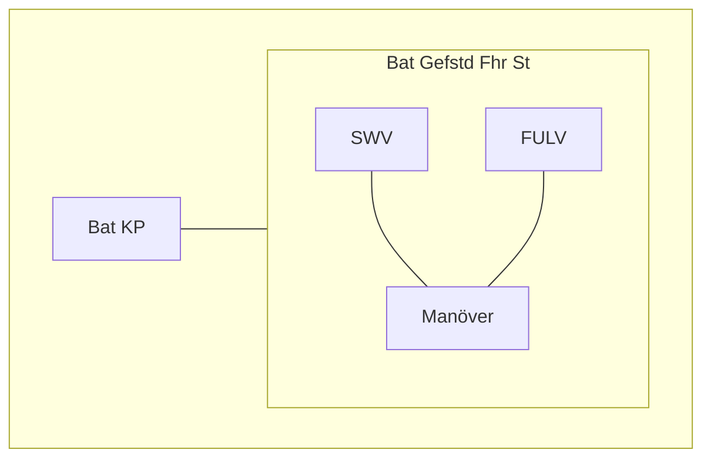
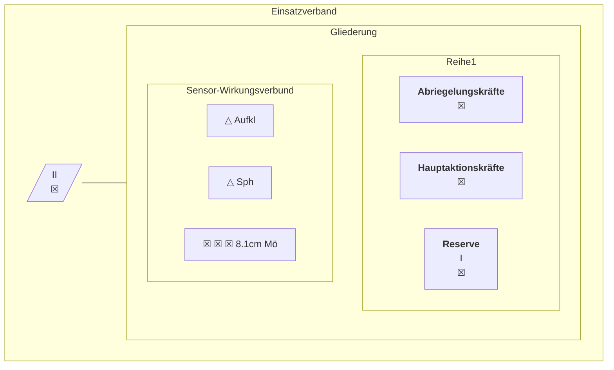
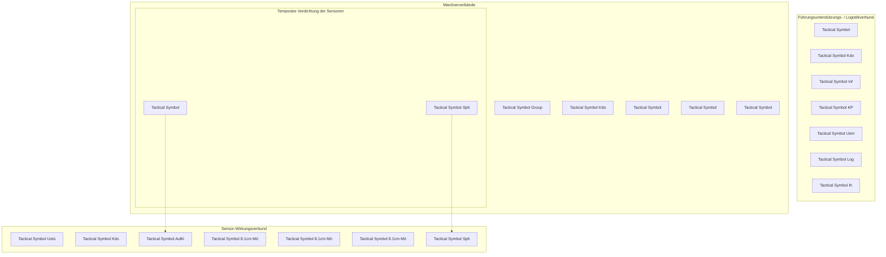
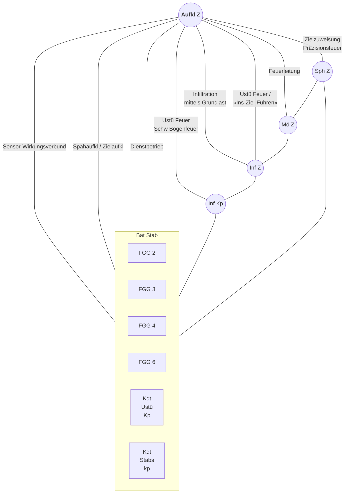
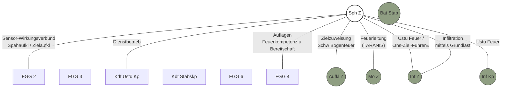
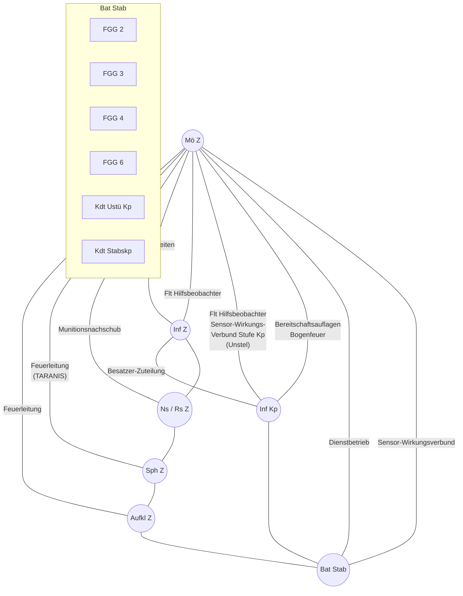
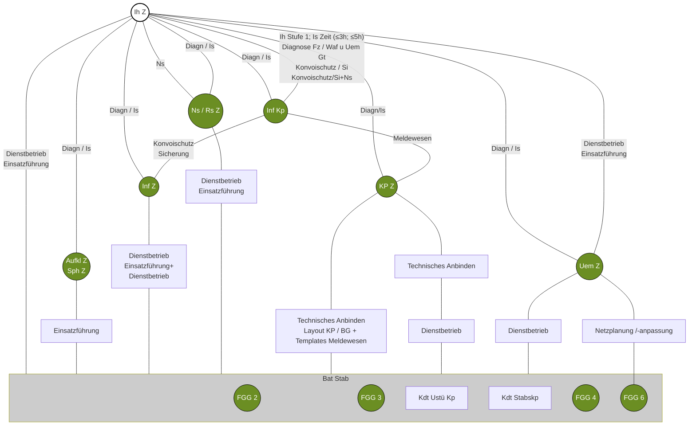

Schweizerische Eidgenossenschaft
Confédération suisse
Confederazione Svizzera
Confederaziun svizra

**Schweizer Armee**

<description>
A thick horizontal teal green bar spans the width of the page.
</description>

Reglement 53.005 d

# Führung und Einsatz der Infanterie

(Fhr u Ei der Inf)


Gültig ab 01.01.2023 SAP 2545.1517


Schweizerische Eidgenossenschaft
Confédération suisse
Confederazione Svizzera
Confederaziun svizra

**Schweizer Armee**

Reglement 53.005 d

# Führung und Einsatz der Infanterie

(Fhr u Ei der Inf )

Gültig ab 01.01.2023

Reglement 53.005 d Führung und Einsatz der Infanterie

# Verteiler

Persönliche Exemplare
* BO/BU der Inf
* Of und höh Uof (Einh u Stab) der Inf

Unpersönliche Exemplare
* keine

II

Reglement 53.005 d Führung und Einsatz der Infanterie

# Inkraftsetzung

## Reglement 53.005 d

## Führung und Einsatz der Infanterie

vom 02.08.2021<sup>1</sup>

erlassen gestützt auf Ziffer 21 Absatz 1 des Dienstreglements der Armee (DRA) vom 22. Juni 1994<sup>2</sup>.

Dieses Reglement tritt auf den 01.01.2023 in Kraft.

Auf den Termin des Inkrafttretens werden aufgehoben:
- Reglement 53.005.01 d «Einsatz der Infanterie, Teil 1: Führung und Einsatz des Bataillons». gültig ab 01.07.2013.
- Reglement 53.005.02 d «Einsatz der Infanterie, Teil 2: Führung und Einsatz der Kompanie». gültig ab 01.07.2013.
- Reglement 53.005.03 d «Einsatz der Infanterie, Teil 3: Einsatz des Zuges». gültig ab 01.07.2013.
- Reglement 53.005.04 d «Einsatz der Infanterie, Teil 4: Anhänge». gültig ab 01.07.2013.

Die Direktunterstellten heben alle diesem Reglement widersprechenden Anordnungen auf.

**Kommandant Heer**

---
<sup>1</sup>Unterzeichnungsdatum
<sup>2</sup> SR 510.107.0

III

Reglement 53.005 d Führung und Einsatz der Infanterie

# Bemerkungen

Als Rahmenwerk umfasst der dreiteilige «Sammelband – Die Infanterie» neben dem Reglement «Führung und Einsatz der Infanterie» Arbeitshilfen, in denen Einsatzverfahren auf Stufe Bataillon, Kompanie und Zug sowie für die Spezialistenzüge beschrieben werden.

Das vorliegende Reglement ist der erste Teil dieses Sammelbandes. Es vermittelt das grundlegende Verständnis der Führung und des Einsatzes der Infanterie.

Die Arbeitshilfen im Teil 2 sind für jede Führungsstufe verfügbar. Mit der ausführlichen Beschreibung der bestehenden Einsatzverfahren dienen sie als Grundlage für die Ausbildung von Infanterieoffizieren.

Sie unterstützen auch Berufsmilitärs im Rahmen der taktischen Ausbildung.

Teil 3 umfasst Arbeitshilfen für die Spezialistenzüge. Darin werden zuerst deren taktische Leistung und anschliessend die spezifischen Einsatzverfahren und -techniken beschrieben.


<table>
  <thead>
    <tr>
        <th>Teil 0</th>
        <th>Teil 1</th>
        <th colspan="3">Teil 2</th>
        <th>Teil 3</th>
    </tr>
  </thead>
  <tbody>
    <tr>
        <td>Inhaltsverzeichnis</td>
        <td>Führung und Einsatz der Infanterie</td>
        <td>Einsatzverfahren des Infanteriebataillons</td>
        <td>Einsatzverfahren der Infanteriekompanie</td>
        <td>Einsatzverfahren des Infanteriezuges</td>
        <td>Spezialistenzüge</td>
    </tr>
    <tr>
        <td>Verzeichnis sämtlicher Regl u Arbeitshilfen bzgl „Sammelband Infanterie“</td>
        <td>Beschreibt generisch die taktische Leistung der Infanterie</td>
        <td>Beschreibt Einsatzverfahren</td>
        <td>Beschreibt Einsatzverfahren</td>
        <td>Beschreibt Einsatzverfahren</td>
        <td>Beschreibt Einsatzverfahren u -technik</td>
    </tr>
    <tr>
        <td>[blank]</td>
        <td>&gt; WAS</td>
        <td>&gt; WIE</td>
        <td>&gt; WIE</td>
        <td>&gt; WIE</td>
        <td>&gt; WIE</td>
    </tr>
    <tr>
        <td>Arbeitshilfe 53.005.11</td>
        <td>Reglement 53.005</td>
        <td>Arbeitshilfe 53.005.21</td>
        <td>Arbeitshilfe 53.005.23</td>
        <td>Arbeitshilfe 53.005.25</td>
        <td>Arbeitshilfe 53.005.30 ff</td>
    </tr>
  </tbody>
</table>

*Abbildung 1: Aufbau Sammelband – Die Infanterie*

Reglement und Arbeitshilfen ergänzen sich gegenseitig. Das Reglement ist die doktrinale Grundlage für den Bereich Infanterie und wird laufend weiterentwickelt. Die Arbeitshilfen beschreiben die Einsatzverfahren im Detail und zeigen, wie sie auf der jeweiligen Führungsstufe trainiert werden können.

Diese sollen sowohl den Kommandanten als auch den Offizieren und höheren Unteroffizieren der Bataillonsstäbe, sowie den Zugführern und Spezialisten die Einsatzkomplexität näherbringen und mögliche Lösungen aufzeigen. Sie dienen der taktischen und technischen Ausbildung des einzelnen Infanteristen und können für Übungen im Rahmen der Verbandsausbildung angewendet werden.

IV

Reglement 53.005 d Führung und Einsatz der Infanterie

# Inhaltsverzeichnis

**1 Allgemeines** 1
1.1 Grundlagen und Abgrenzung 1
1.2 Kernkompetenzen der Infanterie 2
1.2.1 Abgesessener Einsatz 2
1.2.2 Polyvalenz und Komplementarität 3
1.2.3 Angemessene Gewaltanwendung 4
1.3 Einsatzumfeld 4
1.3.1 Überbautes Gelände 4
1.3.2 Bedecktes, gekammertes und gebirgiges Gelände 7
1.3.3 Bevölkerung 8
1.3.4 Bedeutung der Informationsverbreitung/Rolle der Medien 8
1.3.5 Rechtliche Komplexität 9
1.4 Bedrohung und Gefahren 11
1.4.1 Akteure und Konfliktformen 11
1.4.2 Dynamik, Unberechenbarkeit und Entwicklungsmöglichkeiten des Konfliktumfeldes 12
1.4.3 Rasche Abfolge von Eskalation und Deeskalation 13
1.5 Eigene Mittel und Möglichkeiten 14
1.5.1 Leistungsvermögen der Mittel 14
1.5.2 Einsatz der Spezialisten 16

**2 Führung** 19
2.1 Grundfähigkeiten der Bataillonsführung 19
2.1.1 Aufbau des Führungsunterstützungs-/Logistikverbunds (technische Grundplatte) 20
2.1.2 Aufbau des Sensor-Wirkungsverbunds (taktische Grundplatte) 20
2.1.3 Manövrieren von Verbänden auf der taktischen Grundplatte 21
2.2 Führungskultur 22
2.2.1 Auftrags- und Befehlstaktik 22
2.2.2 Taktischer Dialog 23
2.2.3 Zusammenwirken von Kommandant und Bataillonsstab 24
2.3 Weitere Führungsmassnahmen 26
2.3.1 Massnahmen zur Vertrauensbildung und Information 26
2.3.2 Steuerung der Zwangs- und Gewaltanwendung 27
2.3.3 Umgang mit Lehren aus dem Einsatz 29
2.3.4 Aktionen bei reduzierten Lichtverhältnissen 30
2.4 Führungsunterstützung 33
2.4.1 Planung und Führung der Führungseinrichtungen 33
2.4.2 Stationäre Führungseinrichtung: Der Kommandoposten 35

V

Reglement 53.005 d Führung und Einsatz der Infanterie

2.4.3 Mobile Führungseinrichtungen: Kommandanten- und Führungsstaffel 37
2.4.4 Schutz der Führungseinrichtungen im Einsatz 38
2.4.5 Führung aus dem Kommandoposten 38
2.4.6 Wechsel des Kommandopostens 39
2.4.7 Führung aus der Kommandantenstaffel 42
2.4.8 Führung aus der Führungsstaffel 43
2.4.9 Die Unterstützung der Bataillonsführung 44
2.5 Übermittlung 46
2.5.1 Verbindungsmittel 46
2.5.2 Funksprache 49
2.5.3 Kanalbelegung 49
2.5.4 Handhabung der Relais 50
2.6 Sensor-Wirkungsverbund (SWV) 53
2.6.1 Vernetzung des Nachrichtenverbunds mit der Feuerführung 53
2.6.2 Bedeutung der komplementären Feuerwirkung 55
2.6.3 Taktisches Leistungsvermögen des Sensor-Wirkungsverbunds 57
2.6.4 Planung und Führung des Sensor-Wirkungsverbund 58
2.6.5 Taktische und technische Aufgaben der Sensoren 62
2.6.6 Taktische Aufgaben der Effektoren 66
2.7 Führung der Kompanie 68
2.7.1 Einsatzbereitschaft 68
2.7.2 Führungseinrichtungen 72
2.7.3 Handhabung der Führungsmittel 77
2.8 Führung des Zuges 80
2.8.1 Führungsorgane 80
2.8.2 Führungsunterlagen 82
**3 Einsatz** 84
3.1 Schützende Aktionen 86
3.1.1 Auftrag 86
3.1.2 Umwelt 86
3.1.3 Gegnerische Mittel 87
3.1.4 Eigene Mittel 87
3.1.5 Zeitverhältnisse 89
3.2 Bekämpfung bewaffneter Gruppen 90
3.2.1 Auftrag 90
3.2.2 Umwelt 91
3.2.3 Gegnerische Mittel 91
3.2.4 Eigene Mittel 92
3.2.5 Zeitverhältnisse 93
3.3 Abwehr eines terrestrischen Vorstosses 96

VI

Reglement 53.005 d Führung und Einsatz der Infanterie

3.3.1 Auftrag 96
3.3.2 Umwelt 96
3.3.3 Gegnerische Mittel 97
3.3.4 Eigene Mittel 98
3.3.5 Zeitverhältnisse 102

# 4 Einsatzunterstützung und Zusammenarbeit 108
4.1 Einsatzverbände 108
4.2 Erweiterung der Mittel bezüglich Durchhaltefähigkeit 109
4.3 Erweiterung der Mittel bezüglich Kampfkraft 111

# 5 Logistik 114
5.1 Logistische Standardprozesse 114
5.2 Umgang mit Patienten und Gefangenen 116
5.2.1 Sanitätsdienst 118
5.2.2 Gefangene 120
5.3 Nachschub 121
5.3.1 Requisition 122
5.4 Instandhaltung 122

VII

Reglement 53.005 d Führung und Einsatz der Infanterie

# Anhangsverzeichnis

**Anhang 1**
Aufklärungszug (Fähigkeitskatalog Spezialistenzug) 125

**Anhang 2**
Späherzug (Fähigkeitskatalog Spezialistenzug) 128

**Anhang 3**
Mörserzug (Fähigkeitskatalog Spezialistenzug) 130

**Anhang 4**
Kommandopostenzug (Fähigkeitskatalog Spezialistenzug) 133

**Anhang 5**
Übermittlungszug (Fähigkeitskatalog Spezialistenzug) 135

**Anhang 6**
Instandhaltungszug (Fähigkeitskatalog Spezialistenzug) 137

**Anhang 7**
Nachschubzug (Fähigkeitskatalog Spezialistenzug) 139

**Anhang 8**
Markierungen für die Einweisung von Verbänden 141

**Anhang 9**
Funktionsbezogene Rufnamen 142

**Anhang 10**
Funk- und Kommandoübermittlung 145

**Anhang 11**
Antennenreichweiten und Sendeleistungen 146

**Anhang 12**
Richtwerte Sanitätsdienst 147

**Anhang 13**
Richtwerte Logistik 149

VIII

Reglement 53.005 d Führung und Einsatz der Infanterie

# Abbildungsverzeichnis

**Abbildung 1:** Aufbau Sammelband – Die Infanterie IV
**Abbildung 2:** Polyvalenz und Komplementarität der Infanterie 3
**Abbildung 3:** Gliederung von urbanen Räumen 6
**Abbildung 4:** Zonen im überbauten Gelände 7
**Abbildung 5:** Die hybride Bedrohung: eine Vielzahl von Akteuren und Konfliktformen und deren Kombination 12
**Abbildung 6:** Grundgliederung eines Infanteriebataillons und seine Grundplatten 14
**Abbildung 7:** Die Spezialistenkategorien 16
**Abbildung 8:** Die Spezialistenleistungen in den Kategorien 1–3 18
**Abbildung 9:** Die drei Grundfähigkeiten 19
**Abbildung 10:** Komplementäre Einflussbereiche 25
**Abbildung 11:** Mögliche Führungsmatrix für Spezialistenzüge 25
**Abbildung 12:** Steuerung der Zwangs- und Gewaltanwendung am Beispiel des dezentralen Bataillonsbereitschaftsraums 28
**Abbildung 13:** Übersicht der wesentlichen Elemente des Beleuchtungskonzept 33
**Abbildung 14:** Übersicht Führungseinrichtungen Stufe Bataillon 34
**Abbildung 15:** Räumliche Elemente des Bataillons-Kommandopostens 36
**Abbildung 16:** Verbindungs- und Informatikmittel im Bataillons-Kommandoposten 37
**Abbildung 17:** Führung aus dem Kommandoposten 39
**Abbildung 18:** Wechsel des Kommandopostens 40
**Abbildung 19:** Führung aus der Kommandantenstaffel 42
**Abbildung 20:** Führung aus der Führungsstaffel 44
**Abbildung 21:** Führungskarte Stufe Bataillon mit Detailkarten («Urbanes Führungsraster») 45
**Abbildung 22:** Urbanes Führungsraster 46
**Abbildung 23:** Voice-Funknetze des Infanteriebataillons 47
**Abbildung 24:** Spezifische Voice-Netze der unterstellten Kompanien 48
**Abbildung 25:** Digitales Relais und dessen Leistungsvermögen (Distanz ist geländeabhängig) 50
**Abbildung 26:** Orthogonales Relais und dessen Leistungsvermögen (Distanz ist geländeabhängig) 51
**Abbildung 27:** Beispiel einer Führungskarte «Übermittlung» 52
**Abbildung 28:** Der Sensor-Wirkungsverbund im übergeordneten Gesamtrahmen 55
**Abbildung 29:** Die Beeinflussung des Gefechts mit verschiedenen Effektoren 56

IX

Reglement 53.005 d Führung und Einsatz der Infanterie

**Abbildung 30:** Die Führung des Sensor-Wirkungsverbund 59
**Abbildung 31:** Die Möglichkeiten der Netznutzung 60
**Abbildung 32:** Primär- und Sekundärnetze 60
**Abbildung 33:** Die Steuerung von Informationsfluss und -inhalt 61
**Abbildung 34:** Die Leistungsfähigkeit des Präzisionsfeuers des Spähers 67
**Abbildung 35:** Ermitteln und Beheben von Mängeln in der qualitativen Bereitschaft 71
**Abbildung 36:** Aspekte der führungstechnischen Einsatzbereitschaft 72
**Abbildung 37:** Räumliche Elemente des Kommandopostens (mögliche Lösung) 75
**Abbildung 38:** Kommandantenstaffel der Infanteriekompanie 76
**Abbildung 39:** Ersetzen des Farbencodes durch geometrische Formen 78
**Abbildung 40:** Herleitung der Einsatzaufgaben in der Infanterie 84
**Abbildung 41:** Portfolio der Einsatzverfahren der Infanterie (nicht abschliessend) 85
**Abbildung 42:** Die drei Phasen des Schutzes eines Objekts/Eigenschutz 89
**Abbildung 43:** Mögliche Gliederung eines Einsatzverbands 92
**Abbildung 44:** Die drei Phasen der Aktion Bekämpfung von bewaffneten Gruppen 93
**Abbildung 45:** Die drei möglichen Ausprägungen einer militärischen Hauptaktion 95
**Abbildung 46:** Die Angriffsformen im überbauten Gelände 99
**Abbildung 47:** Die Einsatzgliederung der Manöververbände für die Verteidigung eines Raums (mögliche Lösung, ohne Kommandoorgane) 99
**Abbildung 48:** Die Einsatzgliederung der Manöververbände für den Angriff im überbauten Gelände (mögliche Lösung, ohne Kommandoorgane) 100
**Abbildung 49:** Die räumlichen Elemente des Bataillons-Angriffsraums 101
**Abbildung 50:** Die räumlichen Elemente des Bataillons-Verteidigungsraums 102
**Abbildung 51:** Offensive Aktion: Die drei Phasen beim Angriff im überbauten Gelände 103
**Abbildung 52:** Defensive Aktion: Die drei Phasen bei der Verteidigung eines Raumes 105
**Abbildung 53:** Liste der militärischen Spezialisten (nicht abschliessend) 110
**Abbildung 54:** Liste der zivilen Leistungserbringer (nicht abschliessend) 111
**Abbildung 55:** Mögliche Gliederung zur Sicherstellung der Durchhaltefähigkeit 111
**Abbildung 56:** Mögliche Gliederung für Kampfaufgaben im Rahmen der Abwehr 112

X

Reglement 53.005 d Führung und Einsatz der Infanterie

Abbildung 57: Logistikprozess auf Stufe Bataillon 115
Abbildung 58: Prinzipiendarstellung Verwundeten- und Gefangenenleitweg 117
Abbildung 59: Richtwerte für die Sanitätshilfsstelle (San Hist) 119
Abbildung 60: Prinzipiendarstellung Nachschub von Gütern 121
Abbildung 61: Profil des Aufklärungszuges 127
Abbildung 62: Profil des Späherzuges 129
Abbildung 63: Profil des Mörserzuges 132
Abbildung 64: Profil des Kommandopostenzuges 134
Abbildung 65: Profil des Übermittlungszuges 136
Abbildung 66: Profil des Instandhaltungszuges 138
Abbildung 67: Profil des Nachschubzuges 140

XI

Reglement 53.005 d Führung und Einsatz der Infanterie

XII

Reglement 53.005 d
Führung und Einsatz der Infanterie

# 1 Allgemeines

1 Aufgrund ihrer polyvalenten Fähigkeit hat die Infanterie (Inf) eine besondere Bedeutung in der Armee. Das Wissen um diese Verantwortung beeinflusst das Verhalten jedes Infanteristen und bildet durch ein gemeinsames und gesamtheitliches Verständnis die Grundlage für einen infanteristischen Kampfverband.

## 1.1 Grundlagen und Abgrenzung

2 Dieses Reglement stützt sich auf folgende Vorschriften:
* Reglement 50.020 d «Operative Führung 17»;
* Reglement 50.030 d «Taktische Führung 17»;
* Reglement 50.040 d «Führung und Stabsorganisation der Armee 17»;
* Reglement 50.041 d «Begriffe Führungsreglemente der Armee 17»;
* Reglement 51.002 d «Dienstreglement DR 04»;
* Reglement 51.007.04 d «Rechtliche Grundlagen für das Verhalten im Einsatz»;
* Reglement 51.011 d «Einsatzregeln der Armee»;
* Reglement 52.031 d «Logistik der Armee»;
* Reglement 53.008.01 d «Häuser- und Ortskampf»;
* Reglement 59.020 d «Sanitätsdienst der Armee»;
* Reglement 59.021 d «Sanitätsdienst der Truppe»;
* Reglement 60.031 d «Nachschub»;
* Reglement 65.910 d «Instandhaltung»;
* Arbeitshilfe 52.020.01 d «Gliederungsbilder der Armee – Infanterie», gültig ab: 01.01.2021;
* Dokumentation 52.075 d «Behelf Führung Truppenkörper 17»;
* Dokumentation 52.080 d «Behelf Führung Einheit 17»;
* Vorgaben zur Bereitschaft von Formationen R2019/21 (VBF), gültig ab: 01.01.2020.

3 Es beschreibt den Einsatz der Infanterie innerhalb der Schweiz im Rahmen der Armeeaufgaben der Verteidigung sowie zur Unterstützung der zivilen Behörden im Bereich der Abwehr schwerwiegender Bedrohung der inneren Sicherheit.

1

Reglement 53.005 d Führung und Einsatz der Infanterie

4 Das Einsatzspektrum der Infanterie in der Operationssphäre Boden umfasst insbesondere Schützende Aktionen, Bekämpfung bewaffneter Gruppen sowie Abwehr eines terrestrischen Vorstosses. Aktionen zur dissuasiven Präsenz werden in diesem Reglement nicht explizit beschrieben. Dieses Vorgehen wird im Reglement 50.030 d «Taktische Führung 17» beschrieben und ist Teil der erwähnten Aktionen.

## 1.2 Kernkompetenzen der Infanterie

5 Die Infanterie kann im ganzen Einsatzspektrum der Armee in der Operationssphäre Boden eingesetzt werden (kämpfen, schützen, helfen). Sie zeichnet sich durch ihre Polyvalenz, splittergeschützte Mobilität und ausgeprägte Befähigung zum abgesessenen Einsatz aus. Aufgrund ihrer polyvalenten Ausrüstung und Ausbildung eignet sich die Infanterie besonders zur differenzierten Gewaltanwendung im zivilen Umfeld. Sie erreicht dies durch eine konsequente Schwergewichtsbildung in folgenden Bereichen:
* Konzentration auf die infanteristische Kernkompetenz des abgesessenen Einsatzes;
* Förderung und Ausbau von Polyvalenz und Komplementarität;
* Verinnerlichung des Grundsatzes der angemessenen Gewaltanwendung.

### 1.2.1 Abgesessener Einsatz

6 Die Kernkompetenz der Infanterie ist der abgesessene Einsatz. Fahrzeuge und Unterstützungswaffen dienen der Steigerung der Wirkung dieser Kernfähigkeit. Als abgesessener Einsatz ist jenes breite Spektrum zu verstehen, das jede Form zwischenmenschlicher Begegnung umfasst. Nur der abgesessene Einsatz ermöglicht den direkten Kontakt. Einem Gegenüber kann dadurch auf Augenhöhe und mit Empathie als Mensch und nicht nur als Objekt begegnet werden.

7 Die physische Begegnung im abgesessenen Einsatz ermöglicht es, den Gegner von anderen Akteuren zu unterscheiden. Nur sie kann den Gegner nachhaltig von seinem Wollen abbringen. Dies kann mittels psychologischer Einwirkung durch Überzeugen, durch glaubhafte Androhung von Gewalt bis hin zum ultimativen Kräftemessen «Mensch gegen Mensch» erfolgen.

8 Nur im abgesessenen Einsatz:
* können sämtliche Zwangs- und Gewaltmittel gleichzeitig und angemessen eingesetzt werden;
* kann im Kampf um Territorium die Entscheidung herbeigeführt und der Anspruch darauf nachhaltig geltend gemacht werden.

2

Reglement 53.005 d Führung und Einsatz der Infanterie

### 1.2.2 Polyvalenz und Komplementarität

9 Die sich rasch und ständig ändernde Lage während des Gefechts verlangt, dass militärische Verbände rasch zwischen den Gewaltspektren (Bandbreite der Gewaltanwendung) wechseln können. Aus Sicht des einzelnen Infanteristen ist der Übergang von schützenden zu kämpfenden Aufgaben und zurück fliessend. Patrouille, Checkpoint und Durchsuchung können innert Sekunden in ein Begegnungsgefecht eskalieren.

10 Die Infanterie vermeidet eine allzu starke Standardisierung ihrer Einsatzverfahren. Aufgrund der Beurteilung von Auftrag, Umwelt, Gegner, Mittel und Zeitverhältnissen tragen taktische Kommandanten der Tatsache Rechnung, dass Verfahren und Gewaltanwendung an die raschen Lageveränderungen und fliessenden Übergänge im Einsatzumfeld angepasst werden müssen.

11 Die Infanterie versteht den Einsatz der Mittel im Verbund (z B Panzerverbände, Spezialkräfte, KAMIR, Hundeführer usw) als Voraussetzung zum Erfolg im Einsatz.

12 Die Verbände der Infanterie sind befähigt, nicht nur militärische Spezialisten aufzunehmen, sondern auch Mittel mit grösserer Feuerkraft und Reichweite wie Artillerie, Panzergrenadier- und Panzerformationen zu integrieren oder mit Partnern im nationalen Sicherheitsverbund zusammenzuarbeiten.

![Polyvalenz und Komplementarität der Infanterie: Ein Diagramm mit einer vertikalen Achse "Polyvalenz (vielseitig einsetzbar)" und einer horizontalen Achse "Komplementarität (vielseitig kombinierbar)". In der Mitte befinden sich konzentrische Kreise mit den Beschriftungen "Infanterieverbände", "Spezialisten", "Robuste Mittel" und "Grundbereitschaft". Eine diagonale Pfeilmarkierung von links unten nach rechts oben ist mit "Anstieg der Gewaltanwendung" beschriftet. Über dem Diagramm steht "Einsatz der Mittel im Verbund".](image)

Abbildung 2: Polyvalenz und Komplementarität der Infanterie

3

Reglement 53.005 d Führung und Einsatz der Infanterie

### 1.2.3 Angemessene Gewaltanwendung

13 Die Art und Weise, wie der Infanterist kämpft, ist von zentraler Bedeutung für die Akzeptanz seiner Handlungen in der Bevölkerung.

14 Um ihre Aufgaben zu erfüllen, begegnet die Infanterie gegnerischer Gewalt immer mit schützender, angemessener Gegengewalt. Dazu verfügt sie aufgrund ihrer technischen Polyvalenz über alternative Wirkmittel.

15 Das Leitbild der Infanterie umfasst sowohl die Anwendung von Gewalt als auch die Hilfeleistung an Dritte. Dies entspricht dem Handeln eines demokratisch und rechtsstaatlich organisierten sowie der Humanität verpflichteten Staats/Volks.

### 1.3 Einsatzumfeld

#### 1.3.1 Überbautes Gelände

16 Städtische Ballungsräume sind aufgrund ihrer politischen, administrativen, wirtschaftlichen, gesellschaftlichen und kulturellen Bedeutung oft operativ relevante Ziele, deren Besitz für die staatliche Existenz entscheidend ist. Sie sollten möglichst unversehrt für die Phase nach dem Konflikt bewahrt oder zurückgewonnen werden. Kampfhandlungen haben jedoch oft enorme Zerstörungen zur Folge.

17 Die anwesende Zivilbevölkerung kann nicht ausgeblendet werden, sondern wird zwangsweise in die Kampfhandlungen mit einbezogen. Dadurch haben Einsätze im überbauten Gelände eine grosse mediale Wirkung.

18 Weil sich operative/strategische Ziele eines gegnerischen Akteurs mehrheitlich im überbauten Gelände befinden, ist die Infanterie gezwungen, den Kampf in diesem Umfeld zu führen.

19 Überbautes Gelände bietet der ausrüstungsmässig unterlegenen Partei die Möglichkeit, ihre Chance gegenüber einem materiell und technologisch stärkeren Gegner zu verbessern, da seine überlegenen Wirkmittel nur eingeschränkt zum Tragen kommen (Eigengefährdung, sicht- und schusstote Räume, Begrenzung der technischen Einsatzdistanz von Waffen usw).

20 Da die Infanterie ihre Stärken im abgesessenen Einsatz am besten zur Geltung bringen kann, kämpft sie bevorzugt im überbauten Gelände. Die Anbindung des Infanteriekampfs an urbane Räume ist eine taktische Notwendigkeit.

21 Auf Grund der Komplexität militärischer Aktionen im überbauten Gelände ist es für das Verständnis unerlässlich, sich vertieft mit der Beschaffenheit

4

Reglement 53.005 d Führung und Einsatz der Infanterie

des überbauten Geländes auseinanderzusetzen. Dieses kann nach folgenden Kriterien kategorisiert werden:
* Nach seiner Bauweise;
* nach seiner Ausdehnung/Gliederung;
* nach seiner Nutzung.

22 Hinsichtlich der Bauweise in im überbauten Gelände können unterschieden werden:
* Gebäude in Massivbauweise;
* Gebäude in Skelettbauweise.

23 **Gebäude mit Massivbauweise** bieten einen guten Schutz gegen Waffenwirkung im Direktschuss und eine gute Beweglichkeit innerhalb der Gebäude. Die Dächer bieten nur einen geringen Schutz gegen Waffenwirkung.

24 **Gebäude mit Skelettbauweise** bieten einen geringen Schutz gegen Handfeuerwaffen und Splitter. Geschossdecken bieten hingegen einen guten Schutz, da sie schwerer zu durchbrechen sind.

25 Im überbauten Gelände lassen sich unterscheiden:
* Luftraum;
* dominierende Anhöhen;
* oberirdische Bebauungen;
* unterirdische Infrastrukturen.

26 Hohe Gebäude und andere Konstruktionen schränken die Nutzung **des Luftraums** ein. Aufgrund der Flugbahn der Geschosse ist der Einsatz gewisser Waffensysteme limitiert. Luftfahrzeuge sind in ihrer Manövrierfähigkeit eingeschränkt und einer erhöhten Bedrohung durch tragbare Luftabwehrsysteme ausgesetzt. Die Unterstützung aus der Luft von Kräften am Boden ist entsprechend eingeschränkt.

27 Einerseits gehören im überbauten Gelände die Dächer mit allfälligen Dachfenstern oder Dachterrassen, andererseits höher liegende Stockwerke von Gebäuden, sofern diese die Umgebung deutlich überragen, dazu. **Dominierende Anhöhen** im überbauten Gelände ziehen auf der einen Seite das Feuer auf sich, bieten auf der anderen Seite sehr gute Beobachtungs- und Wirkungsmöglichkeiten für Spezialisten wie Aufklärer, Schiesskommandanten oder Späher.

28 **Die oberirdische Bebauung** umfasst das Gros des überbauten Geländes (oberirdische Strassenführung sowie alle Gebäude, die gleich hoch sind wie die anderen in der Umgebung). In dieser Umgebung kämpft die Infanterie in erster Linie abgesessen in den Häusern entlang von definierten Bewegungs-

5

Reglement 53.005 d Führung und Einsatz der Infanterie

linien. Für die Kontrolle eines Hauses bilden Haupteingänge, Treppenhäuser, Aufzüge und Korridore die kleinräumigen Schlüsselzonen. Von hier aus werden in der Folge die restlichen Räume gesäubert oder durchsucht. Aus den Räumen und deren Tiefe heraus bieten sich zahlreiche Beobachtungs- und Waffenwirkungsmöglichkeiten zur Abriegelung des nächsten Gebäudes oder des überbauten Zwischengeländes. Die Strassenzüge sowie das Zwischengelände sind primär als Feuerlinien zu verstehen.


Abbildung 3: Gliederung von urbanen Räumen

29 Das Gros der Gebäude verfügt über **unterirdische Infrastrukturen** (Keller, Tiefgaragen und/oder Zivilschutzanlagen). In grösseren Ballungszentren wird zunehmend die Verkehrsführung mit integrierten Dienstleistungen unterirdisch geführt. Die unterirdischen Strukturen bieten sowohl für den Gegner als auch für eigene Truppen gedeckte Bewegungsmöglichkeiten, schränken aber durch die erschwerten Übermittlungsbedingungen sowie die wechselnden Lichtverhältnisse die Führungsfähigkeit ein.

30 Im überbauten Gelände können die folgenden Zonen unterschieden werden:
* Stadtkern/Historisches Zentrum;

6

Reglement 53.005 d Führung und Einsatz der Infanterie

*   Geschäftsviertel;
*   Wohnviertel;
*   Industrie- und Gewerbezone;
*   Wohnsiedlungen;
*   Sport- und Erholungszonen.


*Abbildung 4: Zonen im überbauten Gelände*

31 Der Übergang zwischen den Zonen ist oft durch einen Verkehrsträger gekennzeichnet und kann als Führungslinie/Orientierungshilfe genutzt werden.

### 1.3.2 Bedecktes, gekammertes und gebirgiges Gelände

32 Der Alpen- und Voralpenraum sowie der Jura und Teile des Mittellandes werden von einem teilweise ausgeprägten Relief bestimmt. Auf taktischer Stufe sind für den Einsatz der Infanterie die folgenden Geländetypen relevant:
*   bedecktes Gelände;
*   gekammertes Gelände;
*   gebirgiges Gelände.

33 Diese Geländetypen sind gekennzeichnet durch:
*   unterschiedliche Sicht und Übermittlungsdistanzen;
*   eingeschränkte Bewegungsmöglichkeiten zwischen den Geländekammern;
*   zahlreiche Möglichkeiten, welche kleineren bis mittleren Verbänden Deckung und Tarnung bieten.

7

Reglement 53.005 d Führung und Einsatz der Infanterie

34 Aufgrund ihrer Befähigung zum abgesessenen Kampf ist die Infanterie in der Lage, auch in diesen Geländetypen ihre Aufträge zu erfüllen. Die Einsatzverfahren unterscheiden sich im Wesentlichen nicht von denen im überbauten Gelände, müssen jedoch bzgl Umwelt, Eigene Mittel und Zeit adaptiert werden.

35 Die Infanterie ist auf die Unterstützung von Spezialisten (z B Gebirgsspezialisten) oder anderen direkten und indirekten, weitreichenden Wirkmitteln angewiesen, welche entscheidende Fähigkeitslücken schliessen. Hinzu kommt, dass die Grundausrüstung der Infanterie insbesondere für den Kampf im gebirgigen Gelände nicht geeignet ist.

### 1.3.3 Bevölkerung

36 In den Stadtzentren ist ein tieferes Bevölkerungswachstum zu beobachten als in den Agglomerationsgemeinden. Diese Entwicklung führt
* zu einer höheren Bevölkerungsdichte in den Agglomerationen;
* zu einer Ausdehnung der Agglomerationen in die semiruralen Räume;
* zu einer zunehmenden Zersiedelung des Schweizer Mittellands.

37 Die Präsenz der Zivilbevölkerung während allen Gefechtsphasen kann die Auftragserfüllung der eigenen Truppen erschweren. Sie führt zum ständigen Kontakt, zum dauernden Zwang des Identifizierens und Differenzierens. Die mögliche Zwangsanwendung gegen die eigene Zivilbevölkerung zur Durchsetzung des militärischen Auftrags stellt für Soldaten und Vorgesetzte eine enorme psychische Belastung dar. Der Gegner kann die anwesende Zivilbevölkerung als Schutzschild und Druckmittel bis hin zur Geiselnahme benutzen, was militärischer Gewaltanwendung mindestens im psychologischen Bereich Schranken setzt.

38 Die für den Erfolg notwendige Geschwindigkeit beim Bezug eines Einsatz-/Kampfraums und die dafür entscheidende Wahrung der Überraschung verunmöglichen im Extremfall eine rechtzeitige Orientierung und zeitgerechte Evakuation der Zivilbevölkerung.

### 1.3.4 Bedeutung der Informationsverbreitung/Rolle der Medien

39 Wir leben in einer multimedialen Welt. Über Internet und Mobiltelefon (mit der Möglichkeit, Geschehen auch visuell zu übermitteln) werden Informationen innert Sekunden in die globalisierte Welt verbreitet und millionenfach verstärkt. Kriege werden in den Medien inszeniert und von eingebetteten Reportern kommentiert. Die Flut an Informationen kann oft nicht mehr ob-

8

Reglement 53.005 d Führung und Einsatz der Infanterie

jektiv ausgewertet werden. Die Grenze zwischen Information und Manipulation wird fliessend.

40 Der uniformierte und damit staatlich legitimierte Gewaltanwender steht besonders im Fokus der allgegenwärtigen Medien. Er wird als Verteidiger der Grundwerte seiner Gesellschaft wahrgenommen. Solange soldatisches Handeln mit den Grundwerte der Gesellschaft übereinstimmt, wirkt das mediale Umfeld wie ein Verstärker der staatlich legitimierten Gewaltanwendung. Stehen Handlungen im Kontrast zu den Grundwerten, wird deren Legitimität sofort in Frage gestellt und geschwächt. Verstösse gegen die Grundwerte (z B Folterungen, Gewaltexzesse, unverhältnismässiges Vorgehen) werden durch die Medien unter Preisgabe der Anonymität aufgedeckt.

41 Das Handeln von Soldaten und Vorgesetzten der unteren taktischen Stufen kann unter besonderen Umständen in einem solchen medialen Umfeld strategische Bedeutung erlangen, weil die Weltöffentlichkeit ihr Handeln sofort mit dem Willen des Staats gleichsetzt, dessen Uniform sie tragen.

### 1.3.5 Rechtliche Komplexität

42 Staatlich legitimierte Gewaltanwendung muss im Spiegel öffentlicher Meinung und internationaler Abstützung in ihrer Rechtmässigkeit dauernd kritisch hinterfragt werden.

43 Die Armee verteidigt auch schützenswerte Werte und Normen, die nicht territorial an ein einzelnes Land gebunden, sondern in der Völkergemeinschaft verankert sind. Diese Werte und Normen laufen immer wieder Gefahr, Opfer der eigenen Gewaltanwendung und dadurch verraten zu werden. Erziehung und Führung der Streitkräfte müssen diesem Phänomen Rechnung tragen, indem die Einsatzprinzipien der abgestuften Gewaltanwendung (im Polizeirecht) bzw der Unterscheidung, Vorsichtsmassnahmen und der Verhältnismässigkeit (im Kriegsvölkerrecht, vgl ausführlich Regl RVE Zif 162 ff) in der Militärkultur eines Staats verankert werden.

44 Im heutigen Einsatzumfeld operieren militärische Kräfte in einem rechtlich sehr komplexen Rahmen. Nicht alle Akteure im Einsatzraum fühlen sich verpflichtet, sich an die Gesetzte zu halten, was die rechtliche Komplexität zusätzlich erhöht.

45 Die Truppe ist im Einsatz mit drei rechtlichen Ebenen konfrontiert:
* Menschenrechte (vgl ausführlich Regl 51.007.04 (RVE), Zif 16 ff);
* Polizeirecht (vgl Regl 51.007.04 (RVE), Zif 43 ff);
* Kriegsvölkerrecht (vgl Regl 51.007.04 (RVE), Zif 149 ff).

9

Reglement 53.005 d Führung und Einsatz der Infanterie

46 **Die Menschenrechte** (nationale Terminologie: Grundrechte) stehen allen Menschen von Natur aus zu, unabhängig von einer geschriebenen nationalen Rechtsordnung. Sie umfassen:
* Recht auf Leben und körperliche Unversehrtheit;
* Recht auf Freiheit usw.

47 Menschenrechte können durch Massnahmen des Polizeirechts oder durch das Kriegsvölkerrecht sowie durch individuelle Notwehr(hilfe) und Notstands(hilfe) eingeschränkt werden.

48 Vorbehalten bleibt der Kerngehalt der einzelnen Menschenrechte. Diese Garantien dürfen auch in Kriegs- und anderen Notstandsfällen nicht ausser Kraft gesetzt werden. Dazu zählen:
* Verbot der Folter und anderer unmenschlicher Behandlung oder erniedrigende Bestrafung;
* Sklavereiverbot usw.

49 **Das Polizeirecht** regelt Zwangsmassnahmen zum Schutz von Polizeigütern wie öffentliche Sicherheit und Ordnung vor Gefahren und Störungen. Die konkrete Zwangsmassnahme muss sich dabei:
* auf eine gesetzliche Grundlage stützen (insb MG und ZAG);
* durch ein öffentliches Interesse oder Menschenrechte Dritter gerechtfertigt sein;
* verhältnismässig, d h geeignet, erforderlich und zumutbar, sein.

50 **Das Kriegsvölkerrecht** regelt hingegen die Grenzen der Gewaltanwendung im internationalen oder nichtinternationalen bewaffneten Konflikt gegen Kombattante und Zivilpersonen, welche unmittelbar an Kampfhandlungen teilnehmen.

51 Die militärische Führung muss diese drei rechtlichen Ebenen und deren Komplexität im Einsatz detailliert analysieren. Daraus leitet sie für die Truppe klare und verbindliche Handlungsrichtlinien ab. Diese Vorgaben finden ihren Niederschlag in den **Einsatzregeln (Rules of Engagement, ROE)**, die auf der operativen Stufe vorgegeben und von den Truppenkommandanten soldatengerecht heruntergebrochen werden müssen. Einsatzregeln halten fest, unter welchen Umständen und Bedingungen, in welchem Umfang und in welcher Art und Weise Gewalt angewendet werden darf und legen fest, wie Massnahmen zu handhaben sind, die als provokativ aufgefasst werden könnten. Sie finden ihren Niederschlag in Form von Taschenkarten (vgl ausführlich Regl 51.011 (ROE Regl) Zif 4 ff).

52 Ergänzend zu den ROE werden konkrete **Verhaltensregeln (Rules of Behaviour, ROB)** als vertrauensbildende Massnahmen erlassen. Sie legen die Art und Weise fest, wie sich AdA zivilen Behörden, der Bevölkerung und ver-

10

Reglement 53.005 d Führung und Einsatz der Infanterie

schiedenen Akteuren gegenüber zu verhalten haben (vgl Regl 51.011 (Einsatzregeln der Armee) Zif 15).

53 Die militärische Führung kann dabei für Verstösse ihrer Unterstellten insbesondere gegen das Kriegsvölkerrecht straf- und disziplinarstrafrechtlich zur Verantwortung gezogen werden, sogenannte Kommandantenverantwortung (vgl Regl 51.007.04 (RVE) Zif 313 f).

## 1.4 Bedrohung und Gefahren

### 1.4.1 Akteure und Konfliktformen

54 Bedrohungen gehen von Akteuren aus, die durch ihr Handeln die Sicherheit, Souveränität oder territoriale Integrität und damit die Handlungsfreiheit eines Staates bzw seiner Gesellschaft gefährden.

55 Konflikte werden heute oft als hybrid bezeichnet und charakterisieren sich dadurch, dass sich in der Regel zahlreiche Akteure mit unterschiedlichsten Interessen und Absichten daran beteiligen. Das Spektrum der Akteure umfasst dabei staatliche und nichtstaatliche Akteure (zivile und militärische).

56 Entsprechend den strategischen Absichten, Fähigkeiten, Stärken und Schwächen der involvierten Akteure sowie dem gesellschaftlichen, politischen und wirtschaftlichen Kontext wird jeder bewaffnete Konflikt einen individuellen Verlauf nehmen und kann die Handlungen in Raum, Zeit und Intensität variieren.

11

Reglement 53.005 d Führung und Einsatz der Infanterie


**Abbildung 5: Die hybride Bedrohung: eine Vielzahl von Akteuren und Konfliktformen und deren Kombination**

### 1.4.2 Dynamik, Unberechenbarkeit und Entwicklungsmöglichkeiten des Konfliktumfeldes

57 Das heutige Konfliktumfeld ist oft geprägt von rasch sich verändernden Situationen mit unklarer Entwicklung. Jede Situation muss auf ihr Eskalationspotenzial hin beurteilt werden und Soldaten und Kader müssen geschult werden, mit diesen Unsicherheiten und Risiken umzugehen.

58 Die Truppe kann subsidiär zur Unterstützung der zivilen Behörden oder originär in der Verteidigung eingesetzt werden, wobei der Übergang zur Verteidigung eine gewisse Vorbereitungszeit erfordert. Im subsidiären Einsatz kommt Polizeirecht zur Anwendung, während in der Verteidigung das Kriegsvölkerrecht (KVR) gilt. Nach KVR muss der Soldat jederzeit unterscheiden zwischen (vgl ausführlich Regl 51.007.04 (RVE), Zif 183 ff):
* Personen, die bekämpft werden dürfen (Kombattante); und

12

Reglement 53.005 d Führung und Einsatz der Infanterie

*   geschützten Personen (Nicht-Kombattante).

Subsidiäre Unterstützung kann als Assistenz- oder, in Ausnahmefällen, auch im Aktivdienst geleistet werden; Verteidigung erfolgt stets im Aktivdienst und wird durch den Bundesrat angeordnet, wenn der Schutz der Bevölkerung oder die Kontrolle des Staatsgebiets nur noch durch Anwendung militärischer Mittel gewährleistet werden kann, unbesehen davon, ob es sich beim Gegner um reguläre militärische Verbände oder paramilitärische Banden handelt.

59 Da militärische Gewaltanwendung oft im urbanen Raum erfolgen muss, werden Aktionen der Armee auch in der Verteidigung besonderen Einsatzregeln unterworfen sein. Wenn immer möglich soll vermieden werden, dass die Armee gegen Zivilpersonen eingesetzt wird. Ordnungsdienst leisten nur spezialisierte Formationen der Militärpolizei.

60 Alle anderen Personen sind durch das KVR geschützte Personen. Sie dürfen nicht angegriffen werden, sich aber auch nicht am Kampf beteiligen. Darunter fallen insbesondere:
*   Kombattante «hors de combat» (die sich ergeben haben, verwundet oder krank sind und nicht mehr weiterkämpfen);
*   Sanitäts- und Seelsorgepersonal;
*   Zivilpersonen im Allgemeinen;
*   ziviles Gefolge von Streitkräften;
*   Angehörige der Zivilschutzorganisationen;
*   Angehörige von politischen Parteien und andere politische Akteure;
*   Kriminelle, solange sie sich nicht unmittelbar an Kampfhandlungen beteiligen.

### 1.4.3 Rasche Abfolge von Eskalation und Deeskalation

61 Die rasche, oft unerwartete Eskalation von Gewalt und die danach ausgelösten Gegenmassnahmen verunmöglichen in den meisten Fällen eine rechtzeitige Entflechtung der Akteure. Bei Kampfhandlungen im überbauten Gelände ist somit oft unklar, welche Wirkung durch welche Waffen verursacht wurden.

62 Die Intensität und Form der Gewalt wechselt ohne Ankündigung. Der Soldat ist konfrontiert mit langen Phasen der Ruhe, die ein trügerisches Bild von Stabilität vermitteln, wie auch mit Momenten des intensiven Gefechts.

13

Reglement 53.005 d Führung und Einsatz der Infanterie

## 1.5 Eigene Mittel und Möglichkeiten

### 1.5.1 Leistungsvermögen der Mittel

63 Das Infanteriebataillon besteht in der Grundgliederung aus:
* der Stabskompanie;
* drei Infanteriekompanien;
* einer Unterstützungskompanie.


<table>
  <thead>
    <tr>
        <th></th>
        <th>Stab</th>
        <th>Stabskp</th>
        <th>Inf Kp 1</th>
        <th>Inf Kp 2</th>
        <th>Inf Kp 3</th>
        <th>Ustü Kp</th>
    </tr>
  </thead>
  <tbody>
    <tr>
        <td></td>
        <td>21 AdA</td>
        <td>160 AdA</td>
        <td>166 AdA</td>
        <td>166 AdA</td>
        <td>166 AdA</td>
        <td>157 AdA</td>
    </tr>
    <tr>
        <td></td>
        <td rowspan="6"></td>
        <td>Kdo</td>
        <td>Kdo</td>
        <td>Kdo</td>
        <td>Kdo</td>
        <td>Kdo</td>
    </tr>
    <tr>
        <td></td>
        <td>Si</td>
        <td>1/1</td>
        <td>2/1</td>
        <td>3/1</td>
        <td>Mör 8.1</td>
    </tr>
    <tr>
        <td></td>
        <td>KP</td>
        <td>1/2</td>
        <td>2/2</td>
        <td>3/2</td>
        <td>Mör 8.1</td>
    </tr>
    <tr>
        <td></td>
        <td>Uem</td>
        <td>1/3</td>
        <td>2/3</td>
        <td>3/3</td>
        <td>Mör 8.1</td>
    </tr>
    <tr>
        <td></td>
        <td>Ns</td>
        <td colspan="3"></td>
        <td>Sph</td>
    </tr>
    <tr>
        <td></td>
        <td>Ih</td>
        <td colspan="3"></td>
        <td>Aufkl</td>
    </tr>
    <tr>
        <th></th>
        <th colspan="2">Führungsunterstützungs-/<br/>Logistikverbund (FULV)</th>
        <th colspan="3">MANÖVER</th>
        <th>Sensor-Wirkungs-<br/>verbund (SWV)</th>
    </tr>
  </tbody>
</table>

*Abbildung 6: Grundgliederung eines Infanteriebataillons und seine Grundplatten*

64 Im Rahmen der Verteidigung ist das Infanteriebataillon nach einer mehrtägigen einsatzbezogenen Ausbildung (EBA) in der Lage bei Tag und Nacht unter allen Witterungsbedingungen vornehmlich in Anlehnung an das überbaute Gelände:
* als Ganzes mit verstärkten Einheiten während Tagen im Gefecht der verbundenen Waffen eine bis drei nebeneinanderliegenden Achsen von 10 bis 15 km zu sperren;
* als Ganzes während Tagen einen Raum von 15 bis 20 km<sup>2</sup> zu halten.

14

Reglement 53.005 d Führung und Einsatz der Infanterie

65 Im Rahmen der Unterstützung der zivilen Behörden ist das Infanteriebataillon nach einigen Tagen einsatzbezogener Ausbildung (EBA) in der Lage bei Tag und Nacht unter allen Witterungsbedingungen:
* als Ganzes während Tagen eine Hauptachse à 30 bis 80 km oder 10 bis 15 Objekte zu überwachen;
* als Ganzes während Tagen wichtige zivile und armeeeigene Objekte (1 bis 4 Objekte) zu schützen sowie einzelne Objekte mit reversiblen Mitteln temporär zu härten;
* als Ganzes während Tagen Nebenabschnitte von 1600 km<sup>2</sup> zu überwachen;
* mit einer Anzahl Kompanien während Tagen Personen und Güter statisch bzw mobil zu schützen und mit Teilen oder als Ganzes zur Durchführung von Personen- und/oder Fahrzeugkontrollen an max drei unabhängigen Orten eingesetzt werden;
* als Ganzes während Wochen im Rahmen von Schutzaufgaben in Räumen von je 100 km<sup>2</sup> zu säubern, zu halten und zu sperren;
* weitere Massnahmen der zivilen Behörden als Ganzes oder mit Teilen nach Absprache zu unterstützen.

66 In der Stabskompanie sind alle Führungsunterstützungs- und Logistikmittel zusammengefasst (Führungsunterstützungs-/Logistikverbund, FULV).

67 Die Infanteriekompanien eignen sich mit ihren drei Zügen für Kampf- und Schutzaufträge und bilden die Manöververbände des Bataillons.

68 Die Unterstützungskompanie verfügt über die Mittel des Sensor-Wirkungsverbunds (SWV).

69 In der Grundgliederung ist das Infanteriebataillon durch folgende Faktoren eingeschränkt:
* fehlende Eigenständigkeit der Infanteriekompanien, sobald Aufträge anstehen, die den statischen Objektschutz übersteigen (Fähigkeit zum Abriegeln, Durchhaltefähigkeit);
* ungenügender ballistischer Schutz und Bewaffnung der Fahrzeuge erhöhen die Verwundbarkeit der Sensoren und der Logistik;
* fehlende Kampfkraft für den Einsatz im Rahmen der Abwehr (weitreichende Panzerabwehr (> 800m), Bogenfeuer mit Wirkung gegen gepanzerte Fahrzeuge).

70 Die Verstärkung der Mittel bezüglich der Durchhaltefähigkeit und der Kampfkraft wird unter Kapitel 4 beschrieben.

15

Reglement 53.005 d Führung und Einsatz der Infanterie

### 1.5.2 Einsatz der Spezialisten

71 Das folgende Kapitel beschreibt das Leistungsprofil der Spezialistenzüge der Stabs- und der Unterstützungskompanie. Es verschafft einen tabellarischen Überblick über
* die aus taktischer Sicht geforderte Leistungserbringung;
* die gegenseitigen Abhängigkeiten;
* die daraus abgeleiteten, führungsorganisatorischen Massnahmen.

72 Spezialisten werden in folgenden Bereichen eingesetzt:
* Nachrichtenbeschaffung;
* Führungsunterstützung;
* Feuerführung;
* Direkte und indirekte Feuerunterstützung;
* Splittergeschützte Mobilität;
* Logistik inkl Sanität.

73 Die Spezialistenleistungen werden in drei Kategorien eingeteilt:

<table>
  <tbody>
    <tr>
        <td>Kategorie</td>
        <td>Leistungsbeschrieb</td>
        <td></td>
    </tr>
    <tr>
        <td>1</td>
        <td>Infanteristische Grundleistungen</td>
        <td>Spezialistenfähigkeiten, die für das Erbringen der infanteristischen Grundleistung der Manöververbände (Kompanie/Zug/Gruppe) unabdingbar sind. Sie dienen der Optimierung des abgesessenen Einsatzes bezüglich splittergeschützter Mobilität und Feuerunterstützung. Die Spezialisten sind dem Manöververband fest zugeteilt (OTF).<br/>Beispiel: Besatzer (Fahrer und Schützen) der Gefechtsfahrzeuge, Schützen von leichten Maschinengewehren, Panzerabwehrwaffen, Sturmgewehren mit Zielfernrohr usw .</td>
    </tr>
    <tr>
        <td>2</td>
        <td>Technische Spezialistenfähigkeiten</td>
        <td>Spezialistenfähigkeiten, mit denen das Bataillon vor allem das Funktionieren der technischen Grundplatte und anderer technischer Leistungen sicherstellt. Dazu gehören alle Elemente des Führungsunterstützungs-/Logistikverbunds (Führungsstaffel, Übermittlung, Logistik), die technischen Leistungen der Bogenschusswaffen (Mörser) sowie die Leistungen bataillonsexterner Spezialisten (Sanität, KAMIR, ABC, MP usw).</td>
    </tr>
    <tr>
        <td>3</td>
        <td>Taktische Spezialistenfähigkeiten</td>
        <td>Spezialistenfähigkeiten, mit denen das Bataillon vor allem das Funktionieren der taktischen Grundplatte sicherstellt. Dazu gehören Elemente des Sensor-Wirkungsverbunds (Aufklärer und Späher).</td>
    </tr>
  </tbody>
</table>

*Abbildung 7: Die Spezialistenkategorien*

16

Reglement 53.005 d Führung und Einsatz der Infanterie

74 Spezialisten der Kategorie 2 erbringen ihre Leistungen zu Gunsten der Manöververbände als technische Vorausaktionen (zum Beispiel Sicherstellen der Übermittlung durch Relais) oder werden in laufenden Aktionen (zum Beispiel für einen Zugriff) sowie für deren Aufarbeitung (zum Beispiel zur Spurensicherung) zugewiesen.

75 Spezialisten der Kategorie 3 werden den Manöververbänden temporär zugewiesen, wenn die Einheitlichkeit der Gefechtsführung dies erfordert. Sie tragen die Hauptlast der taktischen Vorausaktionen auf Stufe Bataillon und sind als Sensoren in der Lage:
* Gelände und Objekte zu überwachen;
* Ziele aufzuklären;
* Gelände, Objekte und Bewegungslinien zu erkunden;
* Bogenfeuer zu leiten;
* Ziele zur Bekämpfung an Unterstützungswaffen und/oder an Infanterieverbände zuzuweisen.

76 Die Spezialisten der Kategorie 3 sind polyvalent einsetzbar. Sie können auf der Stufe des Bataillons als Sensor und Effektor für Nachrichtenbeschaffung und Feuerführung eingesetzt werden und sind gleichzeitig in der Lage, mit ihrer Spezialbewaffnung das Gefecht zu beeinflussen:
* Späher können mit ihren Präzisionsgewehren abriegeln und Punktziele bekämpfen;
* Aufklärer und Späher können gegnerische Ziele erkennen, verfolgen, bekämpfen und mit Bogenfeuer in die Tiefe diese vernichten oder das Gefechtsfeld abriegeln;
* Aufklärer können mit Drohnen Marschachsen und grossflächig Räume erkunden resp überwachen.

17

Reglement 53.005 d Führung und Einsatz der Infanterie


```description
The diagram is divided into three vertical columns labeled at the bottom:
1. Infanteristische Grundleistungen (Infantry Basic Services)
2. Technische Spezialistenfähigkeiten (Technical Specialist Skills)
3. Taktische Spezialistenfähigkeiten (Tactical Specialist Skills)

Horizontal bars and arrows represent different roles and their span across these categories:
- Spez Inf Kp: Spans from Category 1 to Category 2. Associated with "12.7 Bord-Mg, LMg, SMW, Zf Stgw, Fahrer / Besatzer, ...".
- Kdo Spez: Arrow pointing from Category 1 towards Category 2.
- Späher: Arrow pointing from Category 2 towards Category 3.
- Späher / Aufklärer: Large arrow pointing from Category 3 back towards Category 1.
- Mö Kan: Arrow pointing from Category 2 towards Category 1.
- Fhr St, Uem, Ns / Ih: Grouped under "Leistung" (Performance), spanning Category 2.
- Spez extern: Under "Zuweisung" (Assignment), spanning Category 2. Associated with "San Hist, KAMIR, ABC, MP (Pol), Hunde Fhr, LT, Log, Art. ...".
- A box labeled "Bereich der Multifunktionalität" (Area of Multifunctionality) is positioned in Category 3.
- Two text boxes on the left describe "Einsatz im technischen Spezialistenkönnen" and "Einsatz für Patrouille, Kontrolle, Sicherungsaufgaben".
```

*Abbildung 8: Die Spezialistenleistungen in den Kategorien 1–3*

18

Reglement 53.005 d Führung und Einsatz der Infanterie

# 2 Führung

77 Ein Infanterieverband kann sowohl in der Grundgliederung als auch mit anderen Mitteln verstärkt als Einsatzverband eingesetzt werden. In der Folge werden die Grundfertigkeiten der Bataillonsführung und die Führungskultur beschrieben.

## 2.1 Grundfähigkeiten der Bataillonsführung

78 Zur Führung des Infanteriebataillons müssen die drei Voraussetzungen erfüllt sein:
* Aufbau des Führungsunterstützungs-/Logistikverbund (technische Grundplatte);
* Aufbau Sensor-Wirkungsverbund (taktische Grundplatte);
* Manövrieren von Verbänden auf der technischen und taktischen Grundplatte.


Abbildung 9: Die drei Grundfähigkeiten

19

Reglement 53.005 d Führung und Einsatz der Infanterie

### 2.1.1 Aufbau des Führungsunterstützungs-/ Logistikverbunds (technische Grundplatte)

79 Die technische Grundplatte wird mit dem Führungsunterstützungs-/Logistikverbund sichergestellt.

80 Dieser umfasst alle Mittel, die für das technische Zusammenwirken von taktischer Grundplatte und Manöververbänden benötigt werden.

81 Der Führungsunterstützungs-/Logistikverbund wird durch die Spezialistenzüge der Stabskompanie gebildet.

82 Der Führungsunterstützungs-/Logistikverbund wird eingesetzt:
* um die Führungseinrichtungen des Bataillons zu schützen, erstellen, betreiben und instandzuhalten;
* um die Verbindungen im ganzen Einsatzraum aufzubauen und aufrechtzuerhalten;
* um die logistischen Voraussetzungen für den Einsatz der Manöververbände und des Sensor-Wirkungsverbunds zu schaffen und den Nachschub im Einsatz aufrechtzuerhalten;
* um den Manöververbänden unmittelbar nach Aktionen Spezialistenfähigkeiten vor Ort zur Verfügung zu stellen.

83 Die Spezialisten des Führungsunterstützungs-/Logistikverbunds werden auf Stufe Bataillon durch den Nachschuboffizier (S4) und Übermittlungsoffizier (S6) eingesetzt und durch den Kommandanten der Stabskompanie im Dienstbetrieb geführt.

84 Das Leistungsprofil des Führungsunterstützungs-/Logistikverbunds wird in den Kapiteln 2.4 und 2.5 im Detail beschrieben.

### 2.1.2 Aufbau des Sensor-Wirkungsverbunds (taktische Grundplatte)

85 Die taktische Grundplatte wird mit dem Sensor-Wirkungsverbund sichergestellt. Dieser umfasst das gesamte Netz der Sensoren und Effektoren, die der Nachrichtenbeschaffung sowie der Feuerführung dienen.

86 Der Sensor-Wirkungsverbund wird durch die Spezialistenzüge der Unterstützungskompanie gebildet.

87 Die im Sensor-Wirkungsverbund eingesetzten Sensoren verfügen über die Fähigkeit, auf ihre beschafften Nachrichten bei Bedarf mit zugewiesenem Langdistanz-Präzisions- und/oder Bogenfeuer eskalierend zu reagieren.

88 Der Sensor-Wirkungsverbund wird eingesetzt:

20

Reglement 53.005 d Führung und Einsatz der Infanterie

* um Nachrichten zu beschaffen (Beobachtung, Aufklärung);
* um Räume für Aktionen der Manöververbände vorzubereiten (Überwachung);
* um während Aktionen der Manöververbände Gelände/Objekte abzuriegeln;
* um Aktionen der Manöververbände mit zugewiesenem Präzisions- und/oder Bogenfeuer zu unterstützen.

89 Die Sensoren werden auf Stufe Bataillon durch den Nachrichtenoffizier (S2), in Zusammenarbeit mit dem Feuerunterstützungsoffizier (FUOf), eingesetzt und durch den Kommandanten der Unterstützungskompanie im Dienstbetrieb geführt.

90 Zur direkten Unterstützung der Manöververbände können die Sensoren den jeweiligen Kompaniekommandanten zugewiesen werden (ein Raum – ein Chef – ein Auftrag – ein Netz).

91 Das Leistungsprofil des Sensor-Wirkungsverbunds wird in Kapitel 2.6 im Detail beschrieben.

### 2.1.3 Manövrieren von Verbänden auf der taktischen Grundplatte

92 Die Infanteriekompanien und weitere unterstellte Kampfformationen bilden die Manöververbände des Bataillons. Sie sind in der Lage, selbständig mit Feuer, Bewegung und Reserve im Gefecht zu agieren und gleichzeitig ihre Bereitschafts- und Bereitstellungsräume zu schützen.

93 Die Manöververbände werden eingesetzt:
* um Nachrichten zu beschaffen (Patrouille, Erkundung, Aufklärung);
* um Bereitschafts- und Bereitstellungsräume zu schützen;
* um Räume temporär zu überwachen;
* um durch Schwergewichtsbildung in der Verteidigung Gelände und Objekte zu überwachen bzw zu halten und Achsen zu sperren;
* um durch Schwergewichtsbildung im Angriff die Entscheidung zu erzwingen.

94 Die Manöververbände werden durch den Bataillonskommandanten eingesetzt und über die Kompaniekommandanten grundsätzlich mit Auftragstaktik geführt.

95 Die Kompaniekommandanten müssen in der Lage sein, die Sensoren der taktischen Grundplatte bei einer temporären Zuweisung in ihre Führungsnetze zu integrieren.

21

Reglement 53.005 d Führung und Einsatz der Infanterie

## 2.2 Führungskultur

### 2.2.1 Auftrags- und Befehlstaktik

96 Achtung der Menschenwürde sowie der Menschen- und Grundrechte, gegenseitiger Respekt, Eigenverantwortung, Vertrauen und Selbstdisziplin sind entscheidende Parameter der Menschenführung in der Schweizer Armee.

97 Auftragstaktik bedeutet Führung durch Zielvorgabe. Sie lässt dem Unterstellten grösstmögliche Freiheit in der Umsetzung eines militärischen Auftrags und setzt die oben erwähnte Menschenführung und das sich darin spiegelnde Führungsverständnis am nachhaltigsten um.

98 Bei der Befehlstaktik wird der Weg zur Zielerreichung vorgegeben. Sie lässt den Unterstellten keinen/nur wenig Handlungsspielraum.

99 Die Komplexität des heutigen Einsatzumfelds verlangt eine engmaschige Abstimmung aller Kräfte im Einsatzraum, damit die geforderte Leistung im Zusammenwirken entwickelt und der angestrebte Endzustand erreicht werden kann.

100 Die Feinabstimmung aller Kräfte erfordert in der Einsatzvorbereitung, wenn immer möglich, ein gemeinsames Durchsprechen und Durchgehen des Einsatzes am Geländemodell bzw auf der Karte als integralen Bestandteil der Befehlsgebung.

101 Die gemeinsame detaillierte Synchronisation von Abläufen schränkt den Handlungsspielraum für die beteiligten Kommandanten und Verbandsführer ein.

102 Auftragstaktik tritt vor allem bei unerwarteten Ereignissen oder Friktionen in den Vordergrund. Von unterstellten Kommandanten wird dann erwartet, dass sie im Sinn des Auftrags und in der Absicht der vorgesetzten Kommandostelle initiativ handeln und alles unternehmen, um maximal ihre befohlenen Ziele zu erreichen oder minimal Voraussetzungen zu schaffen, dass der übergeordnete Verband erfolgreich Einfluss nehmen kann.

103 Die Herausforderung im Einsatz besteht darin, notwendige Befehls- und angestrebte Auftragstaktik nicht gegeneinander auszuspielen. Befehls- und Auftragstaktik sind gleichwertige Möglichkeiten der Führungspraxis. Dabei gilt der Grundsatz
* so viel Auftragstaktik wie möglich und sinnvoll;
* so wenig Befehlstaktik wie nötig.

104 Das Zusammenspiel der Führungsmethoden muss im gemeinsamen Training in Friedenszeiten geübt, erlebt und diskutiert werden. Dabei bildet die

22

Reglement 53.005 d Führung und Einsatz der Infanterie

Fähigkeit zum taktischen Dialog zwischen Vorgesetzten und Unterstellten, aber auch zwischen zivilen und militärischen Partnern die Voraussetzung für die gegenseitige Vertrauensbildung.

### 2.2.2 Taktischer Dialog

105 Der taktische Dialog ist Ausdruck einer Führungskultur, die Partner und Unterstellte in den Entscheidungsfindungsprozess einbezieht. Diese Dialogkultur ermöglicht ein Optimum an Verständnis und Nachvollziehbarkeit. Sie ist Grundlage für gegenseitiges Vertrauen. Im Weiteren reduziert sie Missverständnisse und fördert somit die Einheitlichkeit in Denken und Handeln.

106 Der taktische Dialog bildet eine Klammer zwischen Auftrags- und Befehlstaktik. Er ermöglicht es, dass Partner und Unterstellte wo immer sinnvoll eingebunden werden. Dies hat vor allem dann zu erfolgen, wenn genügend Zeit für die Vorbereitung einer Aktion zur Verfügung steht. Unter Zeitdruck wird diese Führungskultur dazu führen, dass in einem Klima des gegenseitigen Vertrauens rasch und ohne weitere Erklärungen Entscheide gefällt werden können, die sofort mitgetragen werden.

107 Die Kultur des taktischen Dialogs ist Teil der militärischen Ausbildung.

108 Jede Absprache zwischen Leistungsbezügern und -erbringen, zwischen Nachbarn und zwischen den Führungsstufen ist ein taktischer Dialog. Dies gilt sowohl für Absprachen zwischen Militärs, als auch für Absprachen zwischen Zivilen und Militärs.

109 Taktische Dialoge begleiten und ergänzen die militärischen Führungstätigkeiten. Dabei ist folgender Rhythmus anzustreben:
* Dialog 1: Klärung der erwarteten Gefechtsleistung;
* Dialog 2: Anpassung der Ziele nach der Lagebeurteilung;
* Dialog 3: Sicherstellen von einheitlichen Folgeaktionen nach Ereignissen.

110 In einem ersten taktischen Dialog nach der Auftragserteilung geht es darum, den eigenen Verantwortungsbereich abzustecken, um eindeutige Grundlagen für die Lagebeurteilung zu definieren. Offene Fragen zum Auftrag werden mit dem militärischen Vorgesetzten geklärt. Bei der Unterstützung ziviler Behörden muss der eigene Handlungsspielraum mit dem Auftraggeber definiert werden.

111 In einem zweiten taktischen Dialog nach durchgeführter Lagebeurteilung und vor der Entschlussfassung geht es darum, mit dem vorgesetzten militärischen Kommandanten oder den Kommandanten von Nachbarkompanien mögliche Lösungen im Gesamtrahmen zu optimieren und sicherzustellen, so dass die eigenen Mittel optimal auf ein gemeinsames Ziel ausgerichtet werden. Bei allen Einsätzen sind die militärischen und zivilen Bedürfnisse

23

Reglement 53.005 d Führung und Einsatz der Infanterie

aufeinander abzustimmen, um das optimale Zusammenwirken von zivilen und militärischen Mitteln sicherzustellen.

112 In einem dritten taktischen Dialog nach einer auch in der Eventualplanung nicht berücksichtigten, unerwarteten Lageentwicklung kann es notwendig sein, erneut den Dialog zu suchen, um die Folgeaktionen zu koordinieren und in den grösseren Rahmen einzubetten.

### 2.2.3 Zusammenwirken von Kommandant und Bataillonsstab

113 Die Basis für die Zusammenarbeit zwischen dem Kommandanten und seinem Bataillonsstab bilden das gegenseitige Vertrauen aufgrund menschlicher und fachlicher Kompetenzen sowie eine Führungskultur, die von Offenheit, Toleranz und gegenseitigem Respekt geprägt ist.

114 Im Bataillonsstab wird Fachwissen von Spezialisten mit der Routine erfahrener Truppenkommandanten zusammengeführt. Dies schafft Kontinuität, Vertrauen und die Möglichkeit, Wissen an jüngere Kommandanten weiterzugeben.

115 Stabsmitarbeiter mit ihren analytischen Fähigkeiten und Fachkenntnissen:
* schaffen Entscheidungsgrundlagen für ihren Kommandanten;
* schaffen taktische, technische und logistische Voraussetzungen (z B Faschdienstkonzepte) zur Umsetzung der Absicht des Bataillonskommandanten;
* setzen die Entscheide des Kommandanten in der Befehlsgebung um.

116 Die unter Punkt 4 der Befehlsgebung «Besondere Anordnungen» geregelten koordinierenden Massnahmen sind grösstenteils das Produkt der im Stab abgebildeten Fachdienste (Führungsgrundgebiete FGG).

117 Im Einsatz wird die Führungsstruktur des Bataillons angepasst:
* der Bataillonskommandant (sein Stellvertreter oder das FGG 3) führt primär die Manöververbände;
* der Nachrichtenoffizier führt den Sensor-Wirkungsverbund;
* der Nachschuboffizier oder Übermittlungsoffizier führen den Führungsunterstützungs-/Logistikverbund.

118 In der Einsatzführung werden technische und taktische Vorleistungen zu Gunsten der Manöververbände durch das Bataillon geführt. Zu diesem Zweck werden die Spezialistenzüge der Stabs- und der Unterstützungskompanie direkt durch Offiziere des Bataillonsstabs eingesetzt.

24

Reglement 53.005 d Führung und Einsatz der Infanterie

119 Die Züge der Stabskompanie werden in der Regel wie folgt eingesetzt: Im Führungsunterstützungs-/Logistikverbund werden der Infanteriesicherungszug durch den Kommandanten der Stabskompanie, der Kommandoposten- und der Übermittlungszug durch den Übermittlungsoffizier sowie der Instandhaltungs- und der Nachschubzug durch den Nachschuboffizier eingesetzt.

120 Die Züge der Unterstützungskompanie werden in der Regel wie folgt eingesetzt: Die Mörserzüge werden im Einsatz entweder den Infanteriekompanien unterstellt oder durch den Kommandanten der Unterstützungskompanie geführt. Die Späher und die Aufklärer werden primär im Sensor-Wirkungsverbund durch den Nachrichtenoffizier eingesetzt.


```description
Diagram showing the command relationships between Bat Kdt, S-staff members (S4, S6, S2, S...), Kdt Stabskp, Kdt Inf Kp, and Kdt Ustü Kp. The diagram is divided into functional areas: Führungsunterstützungs- / Logistikverbund, Manöververbände, and Sensor-Wirkungsverbund. Arrows indicate command and coordination lines.
```

*Abbildung 10: Komplementäre Einflussbereiche*

<table>
  <thead>
    <tr>
        <th>Kp</th>
        <th colspan="5">Stabskp</th>
        <th colspan="3">Ustü Kp</th>
    </tr>
    <tr>
        <th>Z</th>
        <th>Inf Si</th>
        <th>KP</th>
        <th>Uem</th>
        <th>Ns</th>
        <th>Ih</th>
        <th>Mö</th>
        <th>Sph</th>
        <th>Aufkl</th>
    </tr>
  </thead>
  <tbody>
    <tr>
        <td>**Führungsverantwortung**</td>
        <td>Kdt Stabskp</td>
        <td>S6</td>
        <td>S6</td>
        <td>S4</td>
        <td>S4</td>
        <td>Kdt Ustü Kp</td>
        <td>S2</td>
        <td>S2</td>
    </tr>
  </tbody>
</table>

*Abbildung 11: Mögliche Führungsmatrix für Spezialistenzüge*

25

Reglement 53.005 d Führung und Einsatz der Infanterie

121 Die Offiziere und höh Uof des Bataillonsstabs unterstützen die Kompaniekommandanten im Bedarfsfall in folgenden Bereichen:
* aktionsbezogene Ausbildungsinhalte und -sequenzen;
* Weiterentwicklung von Einsatzverfahren auf der Grundlage von Lehren;
* fachdienstliche Auskünfte und Hilfestellung in Form von Spezialistenausbildungen;
* beratende Unterstützung in der Menschenführung;
* Betreuung von jungen Kadern;
* Begleitung von Debriefings nach traumatischen Erlebnissen (mit Unterstützung externer Spezialisten).

## 2.3 Weitere Führungsmassnahmen

### 2.3.1 Massnahmen zur Vertrauensbildung und Information

122 Massnahmen zur Vertrauensbildung und Information haben zum Ziel, militärisches Handeln in einem Einsatzraum positiv zu verstärken. Sie richten sich primär an die eigene Zivilbevölkerung, sind der Wahrheit verpflichtet und dürfen nicht zum Zweck der Täuschung oder Fehlinformation missbraucht werden. Vorgaben zu derartigen Massnahmen werden durch die operative Stufe vorbereitet und bei Bedarf durch Spezialisten aus der Operationssphäre Informationsraum unterstützt.

123 Die Handlungsrichtlinien für Massnahmen zur Vertrauensbildung und Information werden dem Bataillon durch die vorgesetzte Kommandostelle vorgegeben.

124 Jeder Kommandant muss sich Rechenschaft darüber ablegen, welche Effekte psychologischer Art militärische Aktionen neben der eigentlichen physischen Einwirkung voraussichtlich erzeugen und mit welchen Massnahmen diese verstärkt oder abgedämpft werden müssen/können.

125 Der Bataillonskommandant bildet im Stab eine Zelle, die ein Konzept für Massnahmen zur Vertrauensbildung und Information im Einsatzraum und weitere aktionsbezogene Produkte erarbeitet (Kommunikationskonzept Komm K).

126 Das Konzept für Massnahmen zur Vertrauensbildung und Information muss mit der vorgesetzten militärischen Kommandostelle validiert und mit den zivilen Behörden abgesprochen werden.

127 Mögliche Produkte bezüglich Massnahmen zur Vertrauensbildung und Information umfassen (nicht abschliessend):

26

Reglement 53.005 d Führung und Einsatz der Infanterie

* Sprechtext für Soldaten, die Personen aus einem Raum evakuieren müssen;
* Sprechtext für Verantwortliche, die Anweisungen an Bevölkerungsteile absetzen müssen (Lautsprecheraufruf);
* Sprechtext für kollektive Warnung vor Anwendung letaler Gewaltmittel und/oder vor angriffsweisem Vorgehen (Lautsprecheraufruf);
* Sprechtext zur Sinnvermittlung ergriffener Zwangsmassnahmen;
* Inhalt von Kernbotschaften, die bei jeder Begegnung mit der Zivilbevölkerung vermittelt werden sollen;
* Aufruf mittels Flugblatt (Verteilung oder Abwurf), Poster oder Warnplakat;
* Handzettel zur Verteilung durch Patrouillen;
* Beiträge für Lokalzeitungen, -radios und -TV;
* Internetauftritt/soziale Medien.

128 In der Aktionsführung kann es nötig sein, Truppenteile auszuscheiden, die durch den Teilstab «Massnahmen zur Vertrauensbildung und Information» speziell geschult werden, um gewünschte Kernbotschaften zu verbreiten. Diese sind idealerweise mit Lautsprecherwagen ausgerüstet und wirken vor Ort auf die Zielgruppen ein. So können betroffene Bevölkerungsteile differenziert sowie direkt informiert und die Truppe entlastet werden.

### 2.3.2 Steuerung der Zwangs- und Gewaltanwendung

129 Jede Zwangs- und Gewaltanwendung hat immer im Rahmen des geltenden Landes- und Völkerrechts zu erfolgen. Unrechtmässige und unangemessene Gewaltanwendung wirkt sich langfristig negativ auf das Umfeld aus und destabilisiert den Einsatzraum statt ihn zu stabilisieren.

130 Die militärische Zwangs- und Gewaltanwendung im Einsatzraum wird mit Einsatzregeln (Rules of Engagement, ROE) definiert, die lagespezifisch angepasst werden können. Abgeleitet davon, um die Komplexität zu reduzieren und das Verständnis für die Umsetzung auf allen Stufen zu gewährleisten, kann zwischen zwei Arten von Boxen unterschieden werden: **Bluebox** und **Redbox**.

131 In einer **Bluebox** besitzt das Militär keine Raumverantwortung. Neben den der Truppe in der Regel zustehenden Polizeibefugnissen (z B Anhaltung, Durchsuchung, Festnahme) ist der Schusswaffengebrauch auf Notwehr(hilfe) und Notstands(hilfe) begrenzt. Deshalb sind in der Bluebox normalerweise nur die persönliche Waffe und RSG erlaubt, um Kollateralschäden auf ein Minimum zu reduzieren.

27

Reglement 53.005 d Führung und Einsatz der Infanterie

132 In einer **Redbox** besitzt das Militär mindestens temporär die Raumverantwortung. Dabei wird der Schusswaffengebrauch neben Notwehr(hilfe) und Notstands(hilfe) auch zur Auftragserfüllung freigegeben. Der Waffeneinsatz wird fallweise und lagegerecht auf Waffen ausgedehnt, bei deren Gebrauch auch grössere Kollateralschäden in Kauf genommen werden müssen.

133 ROE werden durch das Kdo Op aufgrund dessen Auflagen definiert. Die Definition von erlaubten Waffen und Munitionssorten erfolgt anschliessend auf der operativen Stufe und wird dem Bataillon als Auflage weitergegeben.

134 Das Bataillon verarbeitet alle gültigen Einsatz- und Verhaltensregeln in Truppenschutzinformationen. Aus diesen werden einerseits Massnahmen für den bedrohungsgerechten Schutz von Personen und Fahrzeugen abgeleitet. Andererseits definieren sie die Nutzungsbedingungen/-einschränkungen bezüglich der Umwelt, um den (Eigen)Schutz bestmöglich zu gewährleisten. Truppenschutzmassnahmen müssen kommuniziert, geführt und lagegerecht angepasst werden.


```description
Das Diagramm zeigt eine grosse graue Fläche, die als "Bluebox" bezeichnet wird. Innerhalb dieser Fläche befinden sich verschiedene Szenarien:
1. Ein "Bereitschaftsraum" (Kreis), der mit einer "Temporären Redbox" (Sprechblase) verknüpft ist.
2. Ein weiterer "Bereitschaftsraum" (Kreis), der mit einer anderen "Temporären Redbox" (Sprechblase) verknüpft ist.
3. Ein dritter "Bereitschaftsraum" (Kreis), der mit einer "Redbox" (Sprechblase) verknüpft ist.
Die Texte in den Boxen lauten:
- Bluebox: Inhärentes Recht eines Soldaten im Dienst; im ganzen Einsatzraum ab Eintreffen der Truppe; durch Truppenpräsenz definiert und im Grundbefehl geregelt.
- Temporäre Redbox (oben): für geplanten Einsatz; Notwendigkeit für militärische Gewaltanwendung; räumlich und zeitlich begrenzt; durch zivile Behörde autorisiert; in Ergänzungsbefehlen geregelt.
- Temporäre Redbox (mitte): auf Grund eines Ereignisses; räumlich und zeitlich begrenzt; Absprache mit ziviler Behörde erfolgt erst später; Entschluss des Kommandanten vor Ort.
- Redbox: auf Grund der Truppenstationierung im Einsatzraum; umfasst den gesamten Bereitschaftsraum; einmalige Absprache mit zivilen Behörden; im Grundbefehl geregelt.
```

*Abbildung 12: Steuerung der Zwangs- und Gewaltanwendung am Beispiel des dezentralen Bataillonsbereitschaftsraums*

135 Im Einsatz werden allen Angehörigen der Armee Taschenkarten (Pocket Cards) abgegeben. Darin werden die Rechte und Pflichten sowie die Kom-

28

Reglement 53.005 d Führung und Einsatz der Infanterie

petenzen des Einzelnen gemäss Einsatz- und Verhaltensregeln verständlich dargestellt.

### 2.3.3 Umgang mit Lehren aus dem Einsatz

136 Im Einsatz stehen Soldaten unter enormer psychischer Belastung. Sie erleben ihr Umfeld, sich selbst und ihren Verband in extremen Spannungsfeldern (Langeweile versus Überraschung, Mut versus Angst, Euphorie versus Hilflosigkeit, Kameradschaft versus Hass, Unversehrtheit versus Verletzung/Tod). Vorgesetzte dürfen diese Tatsachen nicht ignorieren und müssen sie vor und nach dem Einsatz thematisieren.

137 Einsatzvorbereitung und -nachbearbeitung stehen in einer Wechselbeziehung zueinander. Sie haben Scharnierfunktion bei der Sicherstellung des Einsatzerfolgs.

138 Die Einsatznachbearbeitung (Debriefing/After Action Review) dient dazu, im Einsatz gemachte Erfahrungen auszutauschen, gemeinsam Lehren zu ziehen, aus Einzeleindrücken wieder ein Gesamtbild zu schaffen, das Gefühl von Schuld und Versagen zu relativieren, aber auch Einzelerfolge zum Erfolg des ganzen Verbands zu machen. Taktisch dient die Einsatznachbearbeitung dazu, alle Quellen auszuschöpfen, um so das Lagebild zu vervollständigen.

139 In der Einsatzvorbereitung (Briefing) werden unter anderem die Lehren aus der Einsatznachbearbeitung weitergegeben. Auf diese Art wird sichergestellt, dass keine Informationen verloren gehen, sich Misserfolge nicht wiederholen und keine Risiken eingegangen werden, die zu unnötigen Verlusten führen.

140 Der Bataillonsstab macht Vorgaben für die strukturierte Einsatznachbearbeitung in den Kompanien. Mögliche anzusprechende Punkte bei der Einsatznachbearbeitung sind:
* Gesamtbild: Wie ist der Einsatz zeitlich und räumlich abgelaufen? Wo mussten wir reagieren? Psychologische Dimension: Warum gab es Tote/Verwundete, Disziplinlosigkeit usw. Rechtliche Dimension: Warum wurden ROE/rechtliche Vorgaben verletzt? Warum kam es zu Kollateralschaden?
* Taktische Dimension: Wo wurde richtig/falsch entschieden?
* Technische Dimension: Was wurde richtig/falsch ausgeführt?
* Erkenntnisse: Was muss in die Einsatzvorbereitung einfliessen? Worüber muss die vorgesetzte Kommandostelle informiert werden?

141 Spezialisten aus dem Bataillonsstab unterstützen bei Bedarf die Kompaniekommandanten bei der Einsatznachbearbeitung. Neben dem Armeeseel-

29

Reglement 53.005 d Führung und Einsatz der Infanterie

sorger eignen sich hierzu der Bataillonsarzt und ehemalige, erfahrene Kommandanten in einer Stabsfunktion.

142 Verbandsspezifische Erfahrungen müssen kritisch analysiert, beurteilt und mit andern bataillonsexternen Erfahrungen verglichen werden, um mit der nötigen Distanz echte allgemeingültige Lehren zu ziehen, die weiterverbreitet werden können.

### 2.3.4 Aktionen bei reduzierten Lichtverhältnissen

143 Reduzierte Lichtverhältnisse findet man nicht nur bei Nacht vor, sondern auch bei Tag. Besonders das überbaute Gelände bietet unzählige Orte mit schlechter Sicht, beispielsweise Tunnels, Industriehallen, Tiefgaragen, Unterführungen, Keller, Treppenhäuser und Kanalisationen.

144 Gegenüber Aktionen bei Tageslicht sind die Verbände bei reduzierten Lichtverhältnissen mit folgenden zusätzlichen Herausforderungen konfrontiert:
* erschwerte Beurteilung der Umwelt;
* erschwerte Koordination der Mittel;
* aufeinander abgestimmter Einsatz von Nachtsicht- und Beleuchtungsmitteln;
* Verlangsamung der Aktion;
* erhöhter Munitionsbedarf;
* erhöhte Panikanfälligkeit und psychische Beanspruchung.

145 Nachtkampftaugliche Verbände nutzen reduzierte Lichtverhältnisse, um sich gegenüber Akteuren mit einem tieferen Technologieniveau einen Vorteil zu verschaffen.

146 Zur Nachrichtenbeschaffung bei schlechter Sicht sind Nachtsichtgeräte besonders wirkungsvoll. Man unterscheidet:
* **Restlichtverstärker:** Sie verstärken das vorhandene Restlicht soweit, dass Objekte sichtbar werden.
* **Wärmebildgeräte:** Sie eignen sich dazu, Objekte zu erfassen, die wärmer als ihre Umgebung sind. Wärmebildbeobachtung kann sowohl in der Nacht als auch am Tag sehr wirkungsvoll eingesetzt werden.

147 Da im überbauten Gelände viele Lichtquellen (Strassen-, Gebäudebeleuchtung usw) vorhanden sind, muss abgewogen werden, welche Nachtsichtmittel sich in welcher Phase eignen. Ferner muss auch berücksichtigt werden, dass brennende Objekte oder einfaches Mündungsfeuer der Waffen den Einsatz von Nachtsichtgeräten beeinträchtigen.

30

Reglement 53.005 d Führung und Einsatz der Infanterie

148 Die Freund/Feind-Erkennung ist besonders bei schlechter Sicht erschwert. Sie kann erleichtert werden mittels:
* Weisslichtbeleuchtung;
* Infrarot-Reflektoren auf Uniformen, Waffensystemen und Fahrzeugen;
* automatischer Identifikation mittels Blueforce Tracking, RFID usw.

149 Bei reduzierten Lichtverhältnissen können Objekte beleuchtet werden mittels:
* Weisslichtquellen (Artillerie-, Mörser- und Minenwerfer-Beleuchtungsgeschosse, Leuchtpatronen, Scheinwerfer, Lampen);
* Infrarot-Beleuchtungsquellen (Laser, Beleuchtungsgeschosse).

150 Bei der Planung von Aktionen bei reduzierten Lichtverhältnissen ist dem Beleuchtungskonzept besondere Beachtung zu schenken. Als Teilkonzept ist es durch den Teilstab des Sensor-Wirkungsverbund zu erarbeiten (vgl dazu Kapitel 2.6).

151 Abgestimmt auf den Entschluss des Kommandanten werden phasenweise die angestrebten Wirkungen festgelegt. Daraus wird die Art der Beleuchtung und die Wahl der Beobachtungsmittel abgeleitet. Das Teilkonzept Beleuchtung muss durch den Kommandanten genehmigt werden, weil es Einfluss auf andere Konzepte (z B Logistik- und Nachrichtendienstkonzept) hat.

152 Steht zu Beginn einer Aktion die Überraschung im Vordergrund, kommen etwa in der Annäherung Nachtsichtgeräte zum Einsatz. Ab Auslösung der offensiven Aktion erfolgt der Übergang von Infrarot zu Weisslicht, um den Angriffsschwung hochzuhalten und die Freund-Feind-Erkennung zu ermöglichen. Die nachfolgende tabellarische Übersicht umfasst die wesentlichen Elemente, die dem Beleuchtungskonzept zugrunde liegen:

**Schützende Aktionen**
<table>
  <thead>
    <tr>
        <th>Phase</th>
        <th>Bezug eines Objekts</th>
        <th>Organisation der Durchhaltefähigkeit</th>
        <th>Übernahme zusätzlicher Aufgaben im grossen Dienstrad</th>
    </tr>
    <tr>
        <th>Angestrebte Wirkung</th>
        <th>Rascher und koordinierter Bezug der Gefechtsposten</th>
        <th>Schutz des Objekts zu jeder Zeit</th>
        <th>Schutz von zusätzlichen Objekten</th>
    </tr>
    <tr>
        <th>Art der Beleuchtung</th>
        <th>Weisslicht</th>
        <th>Weisslicht</th>
        <th>Weisslicht</th>
    </tr>
    <tr>
        <th>Beobachtungsmittel</th>
        <th>Restlichtverstärker</th>
        <th>Wärmebildgeräte und/oder Restlichtverstärker</th>
        <th>Wärmebildgeräte und/oder Restlichtverstärker</th>
    </tr>
  </thead>
</table>

31

Reglement 53.005 d Führung und Einsatz der Infanterie

**Bekämpfung bewaffneter Gruppen**

<table>
  <thead>
    <tr>
        <th>Phase</th>
        <th>Räumliche Abgrenzung des Aktionsraums</th>
        <th>Militärische Hauptaktion im abgeriegelten Aktionsraum</th>
        <th>Auffangen der Reaktionen im abgeriegelten Aktionsraum</th>
    </tr>
    <tr>
        <th>Angestrebte Wirkung</th>
        <th>Diskrete Lokalisierung/Ortung der bewaffneten Gruppen</th>
        <th>* Gedeckte Annäherung und überraschender Zugriff<br/>* Optimale Sichtverhältnisse bei der Durchsuchung<br/>* Einfache Freund/Feind Erkennung</th>
        <th>* Überraschung<br/>* Einfache Freund/Feind Erkennung</th>
    </tr>
    <tr>
        <th>Art der Beleuchtung</th>
        <th>Keine</th>
        <th>* Infrarot<br/>* Weisslicht</th>
        <th>* Infrarot<br/>* Weisslicht</th>
    </tr>
    <tr>
        <th>Beobachtungsmittel</th>
        <th>Restlichtverstärker</th>
        <th>Restlichtverstärker</th>
        <th>Wärmebildgeräte und/oder Restlichtverstärker</th>
    </tr>
  </thead>
</table>

**Abwehr eines terrestrischen Vorstosses – offensiv**

<table>
  <thead>
    <tr>
        <th>Phase</th>
        <th>Bereitstellung des Kampfdispositivs</th>
        <th>Einbruch und Nachziehen der vorgeschobenen Unterstützungsleistung</th>
        <th>Stoss in die Tiefe und Inbesitznahme des Angriffsziels</th>
    </tr>
    <tr>
        <th>Angestrebte Wirkung</th>
        <th>Rascher und koordinierter Bezug der Gefechtsposten</th>
        <th>* Überraschung<br/>* Rascher und gezielter Einbruch<br/>* Einfache Freund/Feind Erkennung</th>
        <th>* Optimale Sichtverhältnisse bei Vorstoss<br/>* Einfache Freund/Feind Erkennung</th>
    </tr>
    <tr>
        <th>Art der Beleuchtung</th>
        <th>Keine</th>
        <th>Infrarot, später Weisslicht</th>
        <th>Weisslicht</th>
    </tr>
    <tr>
        <th>Beobachtungsmittel</th>
        <th>Restlichtverstärker</th>
        <th>Wärmebildgeräte und/oder Restlichtverstärker</th>
        <th>Wärmebildgeräte und/oder Restlichtverstärker</th>
    </tr>
  </thead>
</table>

32

Reglement 53.005 d Führung und Einsatz der Infanterie

**Abwehr eines terrestrischen Vorstosses – defensiv**

<table>
  <thead>
    <tr>
        <th>Phase</th>
        <th>Bereitstellung des Kampfdispositivs</th>
        <th>Kampf im Vorgelände des Bataillons</th>
        <th>Kampf im Verteidigungsraum des Bataillons</th>
    </tr>
    <tr>
        <th>Angestrebte Wirkung</th>
        <th>Rascher und koordinierter Bezug der Gefechtsposten</th>
        <th>• Blenden des Gegners<br/>• Erkennung der generischen Ziele</th>
        <th>• Blenden des Gegners<br/>• Erkennung der generischen Ziele<br/>• Einfache Freund/Feind Erkennung</th>
    </tr>
    <tr>
        <th>Art der Beleuchtung</th>
        <th>Weisslicht</th>
        <th>Weisslicht</th>
        <th>Weisslicht</th>
    </tr>
    <tr>
        <th>Beobachtungsmittel</th>
        <th>Wärmebildgeräte und/oder Restlichtverstärker</th>
        <th>Restlichtverstärker</th>
        <th>Wärmebildgeräte und/oder Restlichtverstärker</th>
    </tr>
  </thead>
</table>

*Abbildung 13: Übersicht der wesentlichen Elemente des Beleuchtungskonzept*

## 2.4 Führungsunterstützung

153 Die Führungsunterstützung ist Bestandteil der technischen Grundplatte des Bataillons. Sie wird durch den Übermittlungsoffizier geführt. Die Mittel sind in der Stabskompanie zusammengefasst.

154 Der Beschrieb von Führungs- und Stabsarbeitsprozessen ist nicht Gegenstand dieses Kapitels. Diese werden im Reglement 50.040 «Führung und Stabsorganisation der Armee 17» sowie in der Arbeitshilfe 52.075 «Behelf Führung Truppenkörper» detailliert behandelt.

### 2.4.1 Planung und Führung der Führungseinrichtungen

155 Die Führungseinrichtungen des Bataillons umfassen:
* Kommandantenstaffel;
* Führungsstaffel (Kommandantenstaffel + Modul FULV);
* Kommandoposten (Führungsstaffel + KP Modul).

156 Die Führungseinrichtungen des Bataillons werden auf die drei in Kapitel 2.1 beschriebenen Grundfertigkeiten der Bataillonsführung ausgerichtet. Der Bataillonsstab wird mit den taktischen Kommandanten sowie den Führungsorganen aus der Stabs- und der Unterstützungskompanie ergänzt.

157 Der Übermittlungsoffizier ist in Zusammenarbeit mit dem Kommandanten der Stabskompanie für die Planung und Führung der Führungseinrichtungen

33

Reglement 53.005 d Führung und Einsatz der Infanterie

des Bataillons verantwortlich. Er erarbeitet, abgestimmt auf den Grundentschluss des Bataillonskommandanten, das Führungsunterstützungskonzept.

158 Zur Ermittlung der räumlichen und personellen Bedürfnisse ist es nötig, die Mittel aller Führungselemente zu kennen, die als Verbundleistung die Bataillonsführung ermöglichen. Aus ihnen werden der Bataillons-Kommandoposten, die Kommandanten- sowie die Führungsstaffel gebildet.

```mermaid
graph TD
    subgraph Kommandoposten ["Kommandoposten (Kdt St + KP Modul)"]
        subgraph Führungsstaffel ["Führungsstaffel (Kdt St + FULV Modul)"]
            subgraph Kommandantenstaffel ["Kommandantenstaffel (Ei + SWV)"]
                subgraph Ei ["Ei"]
                    Ei_list["- Kdt<br/>- S3<br/>- Nof<br/>- FUOf"]
                end
                subgraph SWV ["SWV"]
                    SWV_list["- Kdt Stv<br/>- S2<br/>- ND Uof<br/>- Kdt Ustü Kp"]
                end
                V001"![Vehicle 001<br/>001"]
                V002"![Vehicle 002<br/>002"]
            end
            subgraph FULV ["FULV"]
                FULV_list["- S4<br/>- S6<br/>- Kdt Stabskp"]
            end
            V004"![Vehicle 004 FIS HE<br/>004"]
        end
        V005"![Vehicle 005 FIS HE<br/>005"]
        V006"![Vehicle 006 FIS HE<br/>006"]
    end

    style Kommandoposten fill:#d9e2d5,stroke:#333,stroke-width:1px
    style Führungsstaffel fill:#d9e2d5,stroke:#333,stroke-width:1px
    style Kommandantenstaffel fill:#b8c4b1,stroke:#333,stroke-width:1px
    style Ei fill:none,stroke:#333
    style SWV fill:none,stroke:#333
    style FULV fill:none,stroke:#333
```

*Abbildung 14: Übersicht Führungseinrichtungen Stufe Bataillon*

159 Am Standort des Bataillons-Kommandopostens müssen aus taktischer oder technischer Notwendigkeit eine Vielzahl von Verbänden konzentriert/integriert werden. Dieser Tatsache muss in der räumlichen Planung Rechnung getragen werden.

160 Spätestens nach der Genehmigung des Führungsunterstützungskonzepts führt der Übermittlungsoffizier einen ersten taktischen Dialog mit dem Kommandanten der Stabskompanie sowie den Zugführern des Kommandoposten- und des Infanteriesicherungszugs durch. Er erläutert dabei die Absicht des Bataillonskommandanten und die erwartete Leistung der Führungseinrichtungen.

161 Der Kommandant der Stabskompanie ist in Absprache mit dem Übermittlungsoffizier für die Erkundung der Standorte der Führungseinrichtungen

34

Reglement 53.005 d Führung und Einsatz der Infanterie

sowie deren Verschiebungsmöglichkeiten entlang der Führungsachse verantwortlich. Er bildet dazu je nach Bedürfnissen ein oder mehrere Erkundungsdetachemente und integriert die Kader aus dem Ristl Unstel Z.

162 Im zweiten taktischen Dialog präsentieren der Kommandant der Stabskompanie und der Zugführer des Kommandopostenzugs mögliche Lösungsvarianten bezüglich des Einsatzes der Führungseinrichtungen. Der Zugführer des Infanteriesicherungszugs erläutert Lösungsmöglichkeiten, wie die Führungseinrichtungen geschützt werden können. Der Übermittlungsoffizier erstellt neben der Befehlsgebung eine Übersichtskarte «Führungseinrichtungen».

### 2.4.2 Stationäre Führungseinrichtung: Der Kommandoposten

163 Der Kommandoposten ist das Nervenzentrum des Bataillons. Er umfasst minimal das KP Modul, maximal sind die Kommandantenstaffel und FULV Modul integriert.

164 Der Kommandoposten bietet dem Bataillonskommandanten und dem erweiterten Stab optimale Bedingungen für die Planung und Führung des Bataillons im Einsatz. Die Organisation und die Infrastruktur müssen es dem Stab ermöglichen, über eine längere Einsatzdauer sämtliche Aspekte der Bataillonsführung zu bearbeiten. Der Kommandoposten wird in der Regel durch den Infanteriesicherungszug aus der Stabskompanie geschützt und ist normalerweise in das taktische Schutzdispositiv einer Infanteriekompanie eingebettet.

165 Die Wahl des Standorts für den Kommandoposten richtet sich nach folgenden Kriterien:
* Ausreichende bzw optimale Infrastruktur für alle Verbände am Standort;
* gute Lebens- und Arbeitsbedingungen über längere Zeit;
* optimale Bedingungen für die Telekommunikationsinfrastruktur;
* gute Anbindung an die Verkehrsträger;
* gute Möglichkeiten für den taktischen Schutz (inkl taktisch zusammenhängendes Gelände).

35

Reglement 53.005 d Führung und Einsatz der Infanterie


```description
Diagram showing the spatial elements of a Battalion Command Post (Bat KP). The diagram is structured with nested boxes representing different zones and functions.

- Outer boundary: Taktischer Schutz (Tactical Protection)
- Top section: Fz Park Bat KP (Vehicle Park), subdivided into:
    - Fz Park Inf Si Z
    - Fz Park KP Modul
    - Fz Park Kdt Staffel
    - Fz Park Modul FULV
- Main central area: Bat KP
    - Left column:
        - Kanzlei Bat KP
        - KP Stabskp - Kdt Stv
        - KP Ustü Kp - Kdt Stv
        - KP Inf Kp (takt Schutz)
        - Warteraum Besucher
        - Warteraum Kuriere
    - Central area: Kernzone Bat KP (Core Zone)
        - Arbeitsraum FULV: S4 / Ns Of, Ih Of, VT Of, Az, Zfhr Ih Z, Zfhr Ns/Rs Z, Log Uof, S6 / Uem Of, Ik Of, Kdt Stabskp, Zfhr KP Z, Zfhr Uem Z, Tm Zentrale
        - Arbeitsraum SWV: S2 / Nof 1, Nof 2, Zfhr Sph / Aufkl Z, ND Uof, FUOf, Kdt Ustü Kp
        - Arbeitsraum Manöver: Bat Kdt Stv, S3 / C Ei, ABC Of, PIO, Ber Of, Alpin Of, Vertreter FGG je nach Bedarf
        - Bottom right of Kernzone: Bat Adj, Qm, Stabsadj, Kdt Büro Bat Kdt, Rapportraum
- Bottom row (outside Kernzone):
    - Kanzlei Stabskp / Ukft Stabskp
    - Kanzlei Ustü Kp / Ukft Ustü Kp
    - Kanzlei Inf Kp / Ukft Inf Kp
    - Logistische Infrastruktur
    - Fz Park
    - Stellungsraum Mö Z innerhalb der Basis
```

*Abbildung 15: Räumliche Elemente des Bataillons-Kommandopostens*

166 Aufgrund seiner Dimensionen wird der Standort des Kommandopostens meistens im überbauten Gelände mit bestehender, fester Infrastruktur gewählt. Die räumliche Anordnung des Kommandopostens hängt von der vorhandenen Infrastruktur und deren Raumeinteilung ab. Die bestehende Infrastruktur wird durch die militärische Nutzung für gegnerische Akteure zu einem militärischen Ziel, welches bekämpft werden darf. Die Truppe ist aufgrund der nach Kriegsvölkerrecht gebotenen Vorsichtsmassnahmen entsprechend verpflichtet, die zu nutzende Infrastruktur und deren unmittelbare Umgebung zu evakuieren.

36

Reglement 53.005 d Führung und Einsatz der Infanterie

<table>
  <thead>
    <tr>
        <th></th>
        <th>Manöver</th>
        <th>SWV</th>
        <th>FULV</th>
    </tr>
  </thead>
  <tbody>
    <tr>
        <td rowspan="3">Gs Vb</td>
        <td>Fhr Netz Gs Vb</td>
        <td>Na Netz Gs Vb</td>
        <td>Log Netz Gs Vb</td>
    </tr>
    <tr>
        <td>AF Netz (IMFS)</td>
        <td>Br Art Ffhr Netz (INTAFF)</td>
        <td></td>
    </tr>
    <tr>
        <td>Kdo Netz (VHF / HF)</td>
        <td></td>
        <td></td>
    </tr>
    <tr>
        <td rowspan="2">Bat</td>
        <td>Bat Fhr Netz</td>
        <td>Bat Aufkl Netz</td>
        <td>Bat Log Netz</td>
    </tr>
    <tr>
        <td></td>
        <td>FUOf Netz (INTAFF)</td>
        <td></td>
    </tr>
    <tr>
        <td rowspan="7">Spezialisten</td>
        <td>Kp Fhr Netz Inf Kp (takt Schutz)</td>
        <td>Kp Fhr Netz Ustü Kp</td>
        <td>Kp Fhr Netz Stabskp</td>
    </tr>
    <tr>
        <td></td>
        <td>Z Fhr Netz Aufkl Z</td>
        <td>Z Fhr Netz Inf Z (Si)</td>
    </tr>
    <tr>
        <td></td>
        <td>Z Fhr Netz Sph Z</td>
        <td>Z Fhr Netz KP Z</td>
    </tr>
    <tr>
        <td></td>
        <td></td>
        <td>Z Fhr Netz Uem Z</td>
    </tr>
    <tr>
        <td></td>
        <td></td>
        <td>Z Fhr Netz Ih Z</td>
    </tr>
    <tr>
        <td></td>
        <td></td>
        <td>Z Fhr Netz Ns/Rs Z</td>
    </tr>
    <tr>
        <td rowspan="4">allgemein</td>
        <td>KP Netzwerk (Intranet)<br/>15 Arbeitsstationen<br/>1 Drucker sw, 1 Drucker farbig</td>
        <td>Internet (1 ADSL Anschluss)<br/>- OSINT<br/>- Datenübermittlung (Verschlüsselung)</td>
        <td></td>
    </tr>
    <tr>
        <td></td>
        <td>Komponenten FIS HEER</td>
        <td>Öffentliches Netz (Tf)</td>
        <td>Fernsehen (TV)</td>
        <td>Radio</td>
    </tr>
  </tbody>
</table>

**Legende: Verantwortlichkeiten**
*   **KP Modul** (dargestellt durch schwarzen Balken oben)
*   **Kdt Staffel** (dargestellt durch grauen Balken oben)
*   **FULV Modul** (dargestellt durch schwarzen Balken unten)
*   **Uem Z ad hoc** (dargestellt durch grauen Balken unten)

*Abbildung 16: Verbindungs- und Informatikmittel im Bataillons-Kommandoposten*

167 Das KP Modul (inkl FIS HE) und der Ristl Unstel Z (inkl breitbandiger Anbindung an das IMFS) tragen die Hauptlast für die Telematikanbindung (öffentlicher Anbieter, IMFS, Funk HF/VHF). Bei Bedarf können die Funknetze mittels Fernbetriebsausrüstung und ROIP in die entsprechenden Arbeitsbereiche verlegt werden.

168 Während der Verschiebung und/oder während des Einsatzes ausserhalb des Standorts werden die führungstechnischen Mittel durch die Kommandanten- bzw die Führungsstaffel sichergestellt.

### 2.4.3 Mobile Führungseinrichtungen: Kommandanten- und Führungsstaffel

169 Kommandanten- und Führungsstaffel bilden die mobilen Führungseinrichtungen des Bataillons. Die Kommandantenstaffel beinhaltet alle Führungselemente, um sowohl die Manöververbände als auch den Sensor-Wirkungsverbund zu führen. Wird die Kommandantenstaffel durch die Führungselemente aus dem Führungsunterstützungs-/Logistikverbund ergänzt, wird sie zur Führungsstaffel.

37

Reglement 53.005 d Führung und Einsatz der Infanterie

170 Um die Führungseffizienz ausserhalb des Kommandopostens zu garantieren, bezieht die Kommandanten- bzw Führungsstaffel entlang der Führungsachse einen Bataillonsgefechtsstand. Dieser wird innerhalb des geschützten Dispositivs einer unterstellten Kompanie bezogen. Dabei richtet sich die Anordnung nach den räumlichen Gegebenheiten vor Ort.

### 2.4.4 Schutz der Führungseinrichtungen im Einsatz

171 Der Schutz der Führungseinrichtungen richtet sich nach den Vorgaben der integralen Sicherheit (vgl dazu das Regl 52.059 «Integrale Sicherheit») sowie den taktischen Bedürfnissen. Er ist umfassend zu beurteilen.

172 Da sich Stabs- und Unterstützungskompanie nicht selber taktisch schützen können, müssen sie in der Regel in das Dispositiv einer Infanteriekompanie integriert werden. Diese stellt den taktischen Schutz des Standorts und falls nötig die Eskorte für Teile der Führungseinrichtungen bei einem Standortwechsel sicher.

173 Der Infanteriesicherungszug aus der Stabskompanie ist für den Schutz der Bataillons-Führungseinrichtungen verantwortlich. Er schützt diese sowohl im statischen Einsatz als auch während der Verschiebung. Der Zug arbeitet in zwei Halbzügen, falls mehrere Führungseinrichtungen örtlich getrennt parallel zum Einsatz kommen.

174 Bataillons-Kommandoposten und Gefechtsstand sind zu tarnen. Der Fahrzeugtarnung ist besondere Aufmerksamkeit zu schenken. Das Auffinden des Standorts kann mittels überwachten Treffpunkten sowie Jalons mit unterschiedlicher Beschriftung erschwert werden. Auf die äussere Beschriftung von Führungseinrichtungen ist zu verzichten. Verantwortlich für die Massnahmen bezüglich Tarnung ist der Kommandopostenzug.

175 Der Zutritt zu den Führungseinrichtungen wird durch den Kommandanten der Stabskompanie in Absprache mit dem Adjutanten (S1) und dem Übermittlungsoffizier geregelt. Die Zutrittsbefugnis ist schriftlich festzuhalten.

176 Der Schutz der eigenen Aktionsplanung und -führung ist integraler Bestandteil des Truppenschutzes. Der Übermittlungsoffizier stellt in Zusammenarbeit mit dem Kommandanten der Stabskompanie sowie dem Zugführer des Kommandopostenzugs die Informations- und Informatiksicherheit gemäss Vorgaben der Armee sicher und setzt diese konsequent um.

### 2.4.5 Führung aus dem Kommandoposten

177 Die Führung aus der stationären Führungseinrichtung des Kommandopostens ist die Regel bei statischen Einsätzen. Sie ermöglicht eine effiziente Führungs- und Stabsarbeit mit optimaler Infrastruktur über eine längere Zeitdauer.

38

Reglement 53.005 d Führung und Einsatz der Infanterie


*Abbildung 17: Führung aus dem Kommandoposten*

### 2.4.6 Wechsel des Kommandopostens

178 Der Wechsel des Kommandopostens erfolgt, wenn die Lage, der Auftrag oder der Kommandanten dies verlangt, in der Regel bei geringer Bedrohung, wenn ein neuer Bereitschafts- oder Bereitstellungsraum bezogen werden muss, wenn die Verbindungen zu den Vorgesetzten oder Unterstellten nicht mehr sicher sind.

179 Zur Vermeidung eines Führungsunterbruchs muss der Wechsel des Kommandopostens detailliert geplant und vorbereitet werden. Die Auf- und Abbauarbeiten sowie die Verschiebungszeiten können je nach Infrastruktur oder räumlicher Distanz sehr unterschiedlich sein (Richtzeit: 12 bis 24 Stunden). Der Bataillonskommandant entscheidet, wann der Wechsel ausgelöst wird. Während des Wechsels wird der Verband aus der Kommandanten- oder Führungsstaffel geführt.

180 Mit folgenden technischen Vorausaktionen können günstige Voraussetzungen für den Wechsel des Kommandopostens geschaffen werden:
* Nahtlose Übermittlung über entsprechende Relaisstationen;
* Vorgängiger Aufbau von zeitintensiven Teilen der Telematikmittel (z B Leitungsbau);

39

Reglement 53.005 d Führung und Einsatz der Infanterie

*   Erkundung, Absprachen sowie Einweisung am neuen Standort;
*   Erkundung, Absprachen sowie Einweisung am Standort des Gefechtsstands;
*   Aufklärung beider Standorte durch den Sensor-Wirkungsverbund.

181 Der Kommandant der Stabskompanie meldet den Vollzug der technischen Vorausaktionen. Der Nachrichtenoffizier orientiert über die aktuelle Bedrohungslage auf der geplanten Verschiebungsachse sowie am vorgesehenen neuen Standort. Bei Bedarf bildet der Kommandant der Stabskompanie ein Vorausdetachement aus dem Kommandopostenzug und dem Kommandozug der Stabskompanie.


<table>
  <thead>
    <tr>
        <th>Kdt St (Ei / SWV)</th>
        <th>Vs und Bezug Bat Gefstd</th>
        <th>Führung</th>
        <th>Führung</th>
        <th>Führung</th>
        <th>Führung</th>
        <th>Führung</th>
        <th>Vs und Bezug Bat KP</th>
        <th>Führung</th>
    </tr>
    <tr>
        <th>Fhr St (FULV)</th>
        <th>Führung</th>
        <th>Nachzug in Bat Gefstd</th>
        <th>Führung</th>
        <th>Führung</th>
        <th>Führung</th>
        <th>Vs und Bezug Bat KP</th>
        <th>Führung</th>
        <th>Führung</th>
    </tr>
    <tr>
        <th>Bat KP</th>
        <th>Betrieb Bat KP</th>
        <th>Abbau Bat KP</th>
        <th>Abbau Bat KP</th>
        <th>Vs Bat KP</th>
        <th>Aufbau Bat KP</th>
        <th>Aufbau Bat KP</th>
        <th>Betrieb Bat KP</th>
        <th>Betrieb Bat KP</th>
    </tr>
  </thead>
</table>

*Abbildung 18: Wechsel des Kommandopostens.*

182 Der Wechsel des Kommandopostens kann in zwei Varianten durchgeführt werden
*   Direkt;
*   Indirekt.

183 Die direkte Variante sieht vor, dass der ganze Kommandoposten geschlossen, ohne Bezug eines Bataillons-Gefechtsstands, vom alten zum neuen Standort verschoben wird. Der Ablauf des Wechsels erfolgt analog der indirekten Variante.

40

Reglement 53.005 d Führung und Einsatz der Infanterie

184 Bei der indirekten Variante übergeben die Teilstäbe Manöver (Führung der Manöververbände) und Sensor-Wirkungsverbund nach der Auslösung der Aktion ihre Aufgaben an den Teilstab Führungsunterstützungs-/Logistikverbund und beziehen die Kommandanten- bzw Führungsstaffel. Diese verschiebt, geschützt durch Teile des Infanteriesicherungszugs, an den vorgesehenen Standort des Bataillons-Gefechtsstandes und richtet sich dort ein. Mittels Übergaberapport über Funk wird die Führung aller Bereiche (Manöver, Sensor-Wirkungsverbund und Führungsunterstützung-/Logistikverbund) an die Kommandantenstaffel übertragen.

185 Der Teilstab Führungsunterstützungs-/Logistikverbund wird unter dem Schutz von Teilen des Infanterie-Sicherungszugs in den Gefechtsstand nachgezogen und integriert. Im Gefechtsstand werden alle Führungsbereiche sichergestellt. Gleichzeitig mit der Abfahrt des Teilstabs Führungsunterstützungs-/Logistikverbund wird mit dem Abbau des Kommandopostens begonnen. Der Kommandoposten meldet die Abmarschbereitschaft an den Bataillons-Gefechtsstand, der die Auslösung der Verschiebung befiehlt.

186 Alle Elemente des Kommandopostens, allenfalls ergänzt durch die Kommandozüge der Stabs- bzw Unterstützungskompanie, verschieben als KP Modul an den neuen Standort und werden dort durch das Vorausdetachement eingewiesen. Zum Schutz auf der Verschiebung kann ein Infanteriezug aus derjenigen Kompanie bezeichnet werden, in deren Dispositiv der Kommandoposten am neuen Standort integriert wird.

187 Beim Aufbau des neuen Kommandopostens werden zuerst die Funkverbindungen über Fernbetriebsausrüstungen oder ROIP (abgesetzter Betrieb FIS HE) sichergestellt. Sobald die Führungseinrichtung über die notwendigen Funkverbindungen verfügt und die Führungsfähigkeit über FIS HE sichergestellt ist, verschiebt der Teilstab Führungsunterstützungs-/Logistikverbund in den Kommandoposten, richtet sich ein und koordiniert in der Folge dessen weiteren Aufbau. Nach Abschluss der Aufbauarbeiten meldet der Kommandoposten die Minimalbesetzung an den Gefechtsstand.

188 Der Bataillonskommandant entscheidet, wann er die Kommandantenstaffel zum Kommandoposten nachzieht. Für die Dauer der Verschiebung werden die Bereiche Manöver und Sensor-Wirkungsverbund temporär an den Teilstab Führungsunterstützungs-/Logistikverbund übertragen. Der Aufbau des Kommandopostens wird mit dem Erreichen der Vollbesetzung abgeschlossen.

189 Während der gesamten Aktion werden die Vorausdetachemente über das Kompanie-Führungsnetz der Stabskompanie, die Verschiebung von Kommandanten- und Führungsstaffel über das Zugsführungsnetz des Infanteriesicherungszugs und die Verschiebung des KP Moduls über das Zugsführungsnetz des Kommandopostenzuges geführt.

41

Reglement 53.005 d Führung und Einsatz der Infanterie

### 2.4.7 Führung aus der Kommandantenstaffel

190 Die Kommandantenstaffel kann zum Einsatz kommen, wenn im Einsatzraum eine Kräftekonzentration mit mindestens zwei Kompanien gebildet wird und diese mit den Leistungen des Sensor-Wirkungsverbund koordiniert werden muss. Aufgrund der Durchhaltefähigkeit sollte die Einsatzdauer der Kommandantenstaffel 48 Stunden nicht übersteigen.

191 In Absprache mit dem Übermittlungsoffizier entscheidet der Bataillonskommandant über die Auslösung und den vorgesehenen Standort der Kommandantenstaffel. Die Bereitschaft wird über Marschbereitschaftsgrade gesteuert.

192 Im Auftrag des Übermittlungsoffiziers befiehlt der Kommandant der Stabskompanie den Kommandopostenzug sowie den Infanteriesicherungszug. Der Kommandopostenzug stellt sicher, dass in Zusammenarbeit mit dem Bataillonsstab alle notwendigen Führungsdokumente aktualisiert und in Redundanz zum Kommandoposten mitgeführt werden können.


*Abbildung 19: Führung aus der Kommandantenstaffel*

42

Reglement 53.005 d Führung und Einsatz der Infanterie

193 Nach der Übergabe der Führungsverantwortung an die zurückbleibenden Stabsmitarbeiter verschiebt die Kommandantenstaffel eskortiert an den vorgesehenen Standort des Gefechtsstands, wo sie durch ein Vorausdetachement ab Führungsachse eingewiesen wird.

194 Beim Eintreffen am Standort des Gefechtsstands werden die Fahrzeuge möglichst nahe zueinander aufgestellt. Der Infanteriesicherungszug stellt die Rundumsicherung sowie die Abmarschplanung sicher und erarbeitet die Eventualplanung zum Halten des Standorts. Der Kommandopostenzug überprüft alle Verbindungen zum Kommandoposten und errichtet einen improvisierten Führungsraum im Zentrum des Bataillonsgefechtsstandes. Die FIS-Stationen aus dem 001 und/oder 002 werden abgesetzt betrieben. Ausgewählte Funkverbindungen werden mittels ROIP-Gerät und eventuell RC-Boxen am zentralen Tisch bereitgestellt.

195 Nach Abschluss der Übergaberapporte aller Führungsgrundgebiete auf den entsprechenden Funknetzen (Aktualisierung des Lagebilds/Abgleich mit dem Kommandoposten) übernimmt der Bataillonskommandant die Einsatzführung aus der Kommandantenstaffel.

196 Der Kommandopostenzug optimiert die Arbeitsbedingungen für eine Zeitdauer von 48 Stunden. Innerhalb von Industrie- und Fabrikhallen müssen Sektoren wie Warteräume, improvisierte Schlafmöglichkeiten sowie Verpflegungsräume ausgeschieden werden. Ausserhalb von Gebäuden wird der improvisierte Führungsraum mit Zeltplanen überdeckt.

197 Die Ablösungen innerhalb des Gefechtsstands werden in Absprache mit allen Detachementschefs durch den Zugführer des Kommandopostenzugs geplant und kommuniziert. Während des Betriebs stellt der Kommandopostenzug die Instandhaltung relevanter Systeme sicher.

198 Beim Verlassen des Standorts wird der beschriebene Ablauf wiederholt. Die Führungsverantwortung wird nach dem Übergaberapport an den Kommandoposten übertragen.

### 2.4.8 Führung aus der Führungsstaffel

199 Die Führung aus der Führungsstaffel erfolgt, wenn ein Führungsschwergewicht möglichst frontnah und über längere Zeit gebildet werden muss (zum Beispiel beim Angriff im überbauten Gelände). Sämtliche Verbundleistungen können somit vor Ort synchronisiert werden. Aufbau und Betrieb erfolgen nach dem gleichen Prinzip wie bei der Kommandantenstaffel.

43

Reglement 53.005 d Führung und Einsatz der Infanterie



*Abbildung 20: Führung aus der Führungsstaffel*

### 2.4.9 Die Unterstützung der Bataillonsführung

200 Der Übermittlungsoffizier legt in Zusammenarbeit mit dem Nachrichtenoffizier und dem Chef Einsatz (S3) zu Beginn der Aktionsplanung aufgrund der Bedürfnisse für den vorgesehenen Einsatzraum den Bedarf an Führungs- und Detailkarten fest. Für die Einheitlichkeit von Planung und Führung innerhalb des Bataillons ist es entscheidend, dass das Erstellen von Führungskarten sowie die Handhabung von Markierungen und Bezeichnungen durch den Bataillonsstab geführt werden.

201 Die entsprechenden Kartenprodukte werden durch den Kommandopostenzug auf Plastik und/oder elektronisch (z B FIS HE) erstellt und gemäss Übermittlungsoffizier an den Stab und die unterstellten Kommandanten verteilt.

202 Die Führungskarte des Bataillons umfasst den gesamten Einsatz- und Interessenraum. Anhand der Koordinatenlinien auf der Landeskarte 1:50'000 wird die Rastereinteilung vorgenommen. Alle Fünferschritte auf der Landeskarte werden im Führungsraster zwecks Referenzierung speziell gekennzeichnet. Auf der X-Achse erfolgt die Rastereinteilung nach Buchstaben, auf der Y-Achse nach Zahlen. Die Reihenfolge kann aufsteigend oder beliebig erfolgen. Innerhalb eines Koordinatenfelds gilt die Feinunterteilung im Uhr-

44

Reglement 53.005 d Führung und Einsatz der Infanterie

zeigersinn. Somit kann jeder Standort auf 500m genau über Funk eindeutig übermittelt werden.

203 Innerhalb einer Führungskarte werden je nach Bedürfnissen weitere Detailkarten ausgeschieden. Detailkarten sind vergrösserte Darstellungen eines begrenzten Raums (vergrösserte Kartenausschnitte, Luftbilder oder Geländeskizzen). Sie werden vor allem während der Einsatzführung/im Gefecht benötigt. Auf Detailkarten wird den Buchstaben ein zweiter Buchstabe, in der Regel der Anfangsbuchstabe des speziell ausgewählten Raums, vorangestellt.


Abbildung 21: *Führungskarte Stufe Bataillon mit Detailkarten («Urbanes Führungsraster»)*

45

Reglement 53.005 d Führung und Einsatz der Infanterie


*Abbildung 22: Urbanes Führungsraster*

204 Für Einsätze im überbauten Gelände wird ein urbanes Führungsraster im Sinn einer Detailkarte erstellt. Das überbaute Gelände wird anhand von Quartieren und/oder Nutzungszonen in Sektoren mit kreisförmig umrahmten Buchstaben unterteilt. Innerhalb eines Sektors werden alle Gebäude mit dem Sektorbuchstaben und der Hausnummer bezeichnet. Die wichtigsten Strassen erhalten Decknamen, die relevanten Kreuzungen bzw Abzweigungen werden als Passierpunkte markiert.

## 2.5 Übermittlung

### 2.5.1 Verbindungsmittel

205 Neben den öffentlich zugänglichen Netzen und Drahtverbindungen verwendet das Infanteriebataillon vor allem den Führungsfunk (VHF) und den Kommandofunk (HF) als Hauptverbindungsmittel im Einsatz. Die benötigten Funknetze sind aus den beiden folgenden Tabellen ersichtlich. Die Sendereichweite im Bereich VHF hängt neben den topographischen Gegebenheiten von der Wahl und Ausrichtung der Antenne sowie von der eingestellten Sendeleistung des Geräts ab.

46

Reglement 53.005 d Führung und Einsatz der Infanterie

<table>
  <thead>
    <tr>
        <th>Netz</th>
        <th>Grundsätzliche Verwendung</th>
    </tr>
  </thead>
  <tbody>
    <tr>
        <td>Fhr Netz Gs Vb<br/>Kdo N Gs Vb (SE-240)<br/>Si u Vrk N Gs Vb</td>
        <td>* Verbindung zur vorgesetzten Kommandostelle. Es dient dem vorgesetzten Kommandanten zur Führung seiner direktunterstellten Kommandanten.</td>
    </tr>
    <tr>
        <td>Na Netz Gs Vb</td>
        <td>* Verbindung zwischen dem vorgesetzten Nachrichtenzentrum und dem FGG Nachrichten des Bataillons. Das Netz dient der beidseitigen Nachrichtenbeschaffung und -verbreitung.</td>
    </tr>
    <tr>
        <td>Log Netz Gs Vb</td>
        <td>* Verbindung zwischen dem vorgesetzten FGG Logistik und dem FGG Logistik des Bataillons. Das Netz verbindet die Logistikverantwortlichen der Formationen und ermöglicht die Führung der Logistik.</td>
    </tr>
    <tr>
        <td>Art Ffhr Netz Gs Vb (INTAFF)</td>
        <td>* Verbindung zur vorgesetzten Kommandostelle. Sie dient der Führung und Leitung des indirekten Feuers zur unmittelbaren Feuerunterstützung;<br/>* Datennetz.</td>
    </tr>
    <tr>
        <td>FUOf Netz (INTAFF)</td>
        <td>* Verbindung zwischen dem Bataillon (003) und den Schiesskommandanten. Es dient der Führung und Leitung des Artilleriefeuers im Bataillon;<br/>* Datennetz.</td>
    </tr>
    <tr>
        <td>Bat Fhr Netz</td>
        <td>* Verbindung zwischen dem Bataillonskommandanten und seinen unterstellten Kommandanten. Es dient der Führung.</td>
    </tr>
    <tr>
        <td>Bat Aufkl Netz</td>
        <td>* Verbindung zwischen dem FGG Nachrichten des Bataillons und allen im Sensor-Wirkungsverbund integrierten Elementen. Das Netz dient der einseitigen Nachrichteneinspeisung durch die nachrichtendienstlichen Organe, zur Führung derselben und zur Feuerführung des Bataillons (als Redundanz).</td>
    </tr>
    <tr>
        <td>Bat Ffhr Netz (Mö 8.1 cm)</td>
        <td>* Verbindung zwischen Feuerunterstützungsoffizier, Mörserzug und Späher. Es dient der Führung und Leitung des indirekten Feuers auf Stufe Einsatzverband und der Nachrichteneinspeisung;<br/>* Datennetz.</td>
    </tr>
    <tr>
        <td>Bat Log Netz</td>
        <td>* Verbindung zwischen dem FGG Logistik des Bataillons und allen im Führungsunterstützungs-/ Logistikverbund integrierten Logistikelementen. Das Netz dient der Logistikführung des Bataillons.</td>
    </tr>
  </tbody>
</table>

*Abbildung 23: Voice-Funknetze des Infanteriebataillons*

47

Reglement 53.005 d Führung und Einsatz der Infanterie

<table>
  <thead>
    <tr>
        <th>Formation</th>
        <th>Netz</th>
    </tr>
  </thead>
  <tbody>
    <tr>
        <td>Stabskp</td>
        <td>* Kp Fhr Netz Stabskp<br/>* Z Fhr Netz Kdo Z<br/>* Z Fhr Netz KP Z<br/>* Z Fhr Netz Inf Si Z<br/>* Z Fhr Netz Uem Z<br/>* Z Fhr Netz Ih Z<br/>* Z Fhr Netz Ns Z</td>
    </tr>
    <tr>
        <td>Inf Kp</td>
        <td>* Kp Fhr Netz Inf Kp<br/>* Z Fhr Netz Kdo Z<br/>* Z Fhr Netz Inf Z<br/>* Tech Netz Inf Z</td>
    </tr>
    <tr>
        <td>Ustü Kp</td>
        <td>* Kp Fhr Netz Ustü Kp<br/>* Z Fhr Netz Kdo Z<br/>* Z Fhr Netz Späher Z<br/>* Z Fhr Netz Aufkl Z<br/>* Z Fhr Netz Mö Z<br/>* Flt Netz Mö Z</td>
    </tr>
  </tbody>
</table>

*Abbildung 24: Spezifische Voice-Netze der unterstellten Kompanien*

206 Der Ristl Unstel Z bindet das Infanteriebataillon an das integrierte militärische Fernmeldesystem (IMFS) an (vorgesetzte Kommandostelle, Nachbarbataillone, weitere).

207 Eine Verbindung ins Automatische Fernmeldenetz ist für die Stufe Bataillon erst möglich, wenn der Anschluss an das IMFS Festnetz besteht oder die Bataillonsführung sich an einem Ort befindet, der mit AF Netz ausgerüstet ist (Führungsanlagen, Kasernen usw).

208 Das Führungs- und Informationssystem Heer (FIS HE) ermöglicht der Stufe Bataillon eine breitbandige Datenkommunikation zwischen der vorgesetzten Kommandostelle (Gs Vb) und den direktunterstellten Kompanien. Damit werden Daten für die Aufbereitung des Lagebildes übermittelt.

48

Reglement 53.005 d Führung und Einsatz der Infanterie

### 2.5.2 Funksprache

209 Die Sprechregeln sind im Reglement 58.406 «Sprechregeln für Funk und Telefon» festgelegt. Ergänzend dazu werden zwecks Standardisierung im Infanteriebataillon festgelegt:
* Funktionsbezogene Rufnamen (vgl dazu Anhang 9);
* einsatzbezogene standardisierte Funk- und Kommandoübermittlung (vgl dazu Anhang 10).

210 Die Notwendigkeit zur Standardisierung bis hin zu funktionsbezogen Rufnamen erwächst aus der Tatsache, dass im Einsatz die Fluktuationsrate des Personals wegen Ablösungen, Ersatz und Einsatzunterstellungen sehr hoch ist, die Funktionen und Rollen innerhalb der Organisation aber Bestand haben. Funktionsbezogene Rufnamen helfen, Friktionen in der Kommunikation zu reduzieren, weil so Sprache und Semantik geteilt werden.

211 In der Kommandoübermittlung über Funk ist die einseitige Übermittlung die Regel.

### 2.5.3 Kanalbelegung

212 Während der Aktionsplanung überprüft der Übermittlungsoffizier die Adressnetzpläne des Bataillons und der unterstellten Kompanien bezüglich der taktischen Bedürfnisse und passt diese gegebenenfalls in Absprache mit der vorgesetzten Kommandostelle an. Die Netzplanung muss die taktischen Anforderungen funktechnisch abbilden.

213 Die Kanalbelegung soll die Flexibilität der Bataillonsführung im Einsatz erhöhen. Dabei ist es entscheidend, dass temporäre Zuweisungen von Bataillonsverbundleistungen (Sensor-Wirkungsverbund oder Führungsunterstützungs-/Logistikverbund) an die unterstellten Kompanien oder umgekehrt während laufenden Aktionen rasch erfolgen können. Die Belegung von Haupt- (1/2) und Nebenkanälen (3/4 bzw 5/6) sowie die Zuteilung der Teilnehmernummern muss bereits während den Einsatzvorbereitungen erfolgen.

214 Als Notfunknetz des Bataillons dient die allgemeine Hailingfrequenz HLG. Die Empfangsbereitschaft für einen Aufruf auf der allgemeinen Hailingfrequenz HLG kann aktiviert oder deaktiviert werden. Jedes SE-x35 kann auf die allgemeine Hailingfrequenz umgeschaltet werden. Im HLG-Modus werden die Verbindungen nicht digital verschlüsselt. Die Funkstation ist in dieser Betriebsart für einen Ruf aus dem digitalen Funknetz nicht erreichbar.

215 Der Übermittlungsoffizier definiert in Abstimmung mit dem Teilstab Sensor-Wirkungsverbund, welche Funktionen an welchen Standorten die allgemeine Hailingfrequenz HLG im Scanning-Mode überwachen.

49

Reglement 53.005 d Führung und Einsatz der Infanterie

### 2.5.4 Handhabung der Relais

216 Der Übermittlungsoffizier ist in Zusammenarbeit mit dem Zugführer des Übermittlungszugs verantwortlich, dass die Übermittlung im Einsatzraum sowie während der erforderlichen Einsatzdauer auf den Funknetzen des Bataillons sichergestellt ist. Der Übermittlungszugführer bezieht seinen Standort in der entsprechenden Führungseinrichtung des Bataillons oder er führt Erkundungs- bzw Kontrollaufträge im Auftrag des Übermittlungsoffiziers durch.

217 Dem Übermittlungszug stehen vier Funkwagen FIS HE zur Verfügung. Jeder Funkwagen ist in der Lage ein Voice-Relais und ein Data-Relais (FIS HE) gleichzeitig zu betreiben. Mit diesen ist er in der Lage, entweder vier Relais auf vier Netzen im digitalen Betrieb, zwei Relais auf zwei Netzen im orthogonalen Betrieb oder ein Relais im orthogonalen und zwei Relais im digitalen Betrieb gleichzeitig zu erstellen, zu betreiben und instand zu halten. Relaisstandorte werden offen oder getarnt erstellt und betrieben. Die Relaismannschaften müssen sich vor Überraschungen schützen.

![Schematische Darstellung für digitales Relais:
• Fz: funkt mit FzA-235 und 50 Watt Leistung
• Relais Gruppe: installiert das Relais mit FA-235/m und funkt mit 50 Watt Leistung
• Maximale Reichweite mit Antennenkombination von FzA-235 auf FA-235/m: 15 km
• Maximale räumliche Ausdehnung: 30 km (2 x 15 km).
Die Grafik zeigt eine Relaisstation auf einem Berggipfel, die zwei Funkbereiche (Kanal 1/3/5 und Kanal 2/4/6) über eine Relaiskanalwechsellinie (RKWL) verbindet. Die maximale Reichweite pro Seite beträgt 15 km, was eine Gesamtausdehnung von 30 km ergibt. Verschiedene Einheiten (NCS K1, SUB K1, SUB K2) sind in hügeligem Gelände dargestellt.](image)

Abbildung 25: *Digitales Relais und dessen Leistungsvermögen (Distanz ist geländeabhängig)*

50

Reglement 53.005 d Führung und Einsatz der Infanterie

<mark>
**Schematische Darstellung für orthogonales Relais:**
* **Fz: funkt mit FA-235/m8 und 50 Watt Leistung**
* **Relais Gruppe: installiert orthogonales Relais mit je einer FA-235/m und funkt mit 50 Watt Leistung**
* **Maximale Reichweite mit Antennenkombination von FA-235/m8 zu FA-235/m: 23 km**
* **Maximale Reichweite mit Antennenkombination von FA-235/m zu FA-235/m: 22 km**
* **Maximale Räumliche Ausdehnung: 68 km (23 km + 22 km + 23 km).**


**Maximale räumliche Ausdehnung: 68 km**
</mark>

*Abbildung 26: Orthogonales Relais und dessen Leistungsvermögen (Distanz ist geländeabhängig)*

218 Alle Übermittlungsteilnehmer können die Verbindungsqualität sowie die Reichweite durch die Wahl der Sendeleistung, der Antennenart sowie des Antennenstandorts beeinflussen. Eine Übersicht über die Reichweiten anhand der verschiedenen Kombinationsmöglichkeiten von Antennen und Sendeleistungen ist im Anhang 11 dargestellt.

219 Im Fall einer Feuerführung 12 cm Mörser bzw Artillerie wird die Leistung einer Relaisstation INTAFF durch Formationen der Aufklärer sichergestellt. Die INTAFF-Abdeckung wird im Rahmen des Feuerführungskonzepts der vorgesetzten Kommandostelle beurteilt.

220 Während der Lagebeurteilung analysiert der Übermittlungsoffizier das Gelände des Einsatzraums bezüglich den funktechnischen Abdeckungsmöglichkeiten, eruiert anhand der taktischen Bedürfnisse die technische Machbarkeit auf den erforderlichen Netzen und berät den Bataillonskommandanten bei der Wahl seiner Führungsstandorte sowie derjenigen seiner unterstellten Kommandanten. Als Hilfsmittel steht ihm dabei das elektronische Programm PROCAL zur Verfügung, über das er eine Funkschattenkarte des Einsatzraums erstellen kann. Ebenfalls spricht er sich mit dem Führungsgrundgebiet 6 der vorgesetzten Kommandostelle ab. Anhand der Funkschattenkarte und der Geländebeurteilung erarbeitet der Übermittlungsoffizier im Rahmen des Führungsunterstützungskonzepts Varianten für die Relaisstandorte.

51

Reglement 53.005 d Führung und Einsatz der Infanterie

221 In der Grundkonfiguration sind die vier Relaisstationen betreffend Voice-Netze für das Bataillons-Führungsnetz, das Bataillons-Aufklärungsnetz (zwei Stationen) sowie das Bataillons-Logistiknetz vorgesehen. Im Einsatz wird für den Sensor-Wirkungsverbund ein Relais für das Kompanie-Führungsnetz der Unterstützungskompanie benötigt. Auf Grund der Topografie, und insbesondere im Gebirge, ist unter Umständen ein Relais für das Kompanie-Führungsnetz einer Infanteriekompanie notwendig. Der Übermittlungsoffizier beantragt, welche Netze mit welcher Priorität und welchen Relais über welche Dauer funktionieren sollen (aus seiner Sicht), damit der Kdt entscheiden kann. Dabei ist zu berücksichtigen, dass die Relais der Datennetze für das FIS HE mit den gleichen Fahrzeugen betrieben werden.

222 Spätestens nach dem Grundentschluss des Bataillonskommandanten führt der Übermittlungsoffizier einen ersten taktischen Dialog mit dem Übermittlungszugführer durch, in dem der übermittlungstechnische Grundentschluss erläutert wird. In der Folge erkundet der Übermittlungszugführer die einzelnen Relaisstandorte bezüglich der technischen Machbarkeit, der verkehrstechnischen Zugänglichkeit, der Schutzmöglichkeit sowie bezüglich vorhandener Infrastruktur zwecks Durchhaltefähigkeit der Relaismannschaft. Die Erkundungsergebnisse werden im zweiten taktischen Dialog präsentiert. Anschliessend entscheidet der Übermittlungsoffizier über die definitiven Relaisstandorte sowie über deren Anzahl und Betriebsart, finalisiert sein fachdienstliches Konzept und bringt seine Beiträge in die Produkte der Befehlsgebung ein.


Abbildung 27: Beispiel einer Führungskarte «Übermittlung»

52

Reglement 53.005 d Führung und Einsatz der Infanterie

223 Der Übermittlungsoffizier und der Übermittlungszugführer erarbeiten gemeinsam die Führungskarte «Übermittlung», aus der die Relaisstandorte und deren Netzabdeckung sowie die Relaiskanalwechsellinien ersichtlich sind. Relaiskanalwechsellinien sind im Gelände erkennbare Führungslinien, bei denen die im entsprechenden Netz integrierten Teilnehmer den Kanalschalter auf den Relaiskanal 2/4/6 oder zurück auf den Hauptkanal 1/3/5 umschalten müssen. Alle Teilnehmer des entsprechenden Netzes müssen zwingend über die Relaiskanalwechsellinien orientiert werden.

224 Nach einer detaillierten Befehlsgebung und Einsatzvorbereitung, bei der auch die notwendigen Massnahmen zur Sicherstellung der Durchhaltefähigkeit getroffen werden, verschieben die Relaisgruppen an ihre vorgesehenen Standorte. Nach dem Aufbau der Fernantennen nehmen sie Kontakt mit dem Bataillons-Kommandoposten auf. Die Verbindungsqualität muss allenfalls durch Anpassung der Antennenstandorte optimiert werden. In Absprache mit dem Übermittlungsoffizier wechselt die Relaisgruppe in den Betrieb. Der Relaisstandort wird getarnt, zum Überleben über längere Zeit eingerichtet und mittels Beobachtung vor Überraschung geschützt. Während dem Betrieb geht es darum, den Standort laufend zu optimieren und die technische Infrastruktur im Störungsfall instand zustellen. Da das Fahrzeug als Relaisstation eingesetzt ist, müssen die Relaisgruppen im Bringprinzip versorgt werden. Ein Relaisstandort wird nur auf Befehl des Übermittlungsoffiziers gewechselt oder verlassen.

225 Falls Zeitverhältnisse und Sicherheitslage es zulassen, fährt der Übermittlungszugführer die Verschiebungsachsen in alle Richtungen bis an die Grenzen der übermittlungstechnischen Machbarkeit ab. Durch wiederholte Verbindungskontrollen mit dem Relaisstandort sowie dem Kommandoposten kann er die effektive Netzabdeckung, die auf der Funkschattenkarte errechnet wurde, im Gelände verifizieren. Der Übermittlungszugführer meldet abweichende Resultate dem Übermittlungsoffizier, der die Funkschattenkarte bzw die Führungskarte «Übermittlung» aktualisiert.

## 2.6 Sensor-Wirkungsverbund (SWV)

### 2.6.1 Vernetzung des Nachrichtenverbunds mit der Feuerführung

226 Die taktische Grundplatte des Infanteriebataillons wird durch den Aufbau eines eng vernetzten Sensor-Wirkungsverbund (SWV) sichergestellt. Dieser besteht
* aus einem erweiterten Teilstab;
* aus Sensoren;
* aus Effektoren.

53

Reglement 53.005 d Führung und Einsatz der Infanterie

227 Entsprechende Mittel werden in der Unterstützungskompanie zusammengefasst. Der Sensor-Wirkungsverbund wird durch den Nachrichtenoffizier und den Feuerunterstützungsoffizier geführt. Sie werden durch den Kompaniekommandanten der Unterstützungskompanie, die Zugführer der Sensorzüge (Späher und Aufklärer) sowie deren Führungselemente verstärkt.

228 Der Nachrichtenoffizier stellt im Rahmen des Nachrichtenverbunds den Nachrichtenaustausch mit der vorgesetzten Kommandostelle, mit Nachbarn und zivilen Partnern im Einsatzraum sowie die Informationsgewinnung über offene Quellen (OSINT) sicher. Zusammen mit den eigenen Resultaten aus dem Sensor-Wirkungsverbund generiert er das integrierte Lagebild zu Handen der Bataillonsführung sowie der unterstellten Kommandanten und rapportiert der vorgesetzten Kommandostelle.

229 Der Feuerunterstützungsoffizier ist in der Lage, die Feuerführung der Bogenfeuerwaffen mit der vorgesetzten Kommandostelle abzustimmen. In der Grundgliederung des Infanteriebataillons verfügt der Feuerunterstützungsoffizier jedoch nicht über die nötige Anbindung an das Integrierte Artillerie Feuerführungs- und Feuerleitungssystem (INTAFF). Diese Anbindung muss situativ bereitgestellt werden.

230 Gemeinsam stellen der Nachrichtenoffizier und der Feuerunterstützungsoffizier sicher, dass die Nachrichtenbeschaffung und die Feuerführung des Bataillons als verbundenes Gesamtsystem zum Einsatz kommen. Dieses findet seinen Ausdruck:
* in einem vernetzten und synchronisierten Konzept für den Sensor-Wirkungsverbund;
* in Aufträgen an die Spezialistenzüge;
* in Auflagen an die Kompanien.

231 Die Leistungen des Sensor-Wirkungsverbund müssen mit der Einsatzplanung und -führung des Bataillonskommandanten und des Chefs Einsatz zur physischen Kräftekonzentration der Kompanien synchronisiert werden.

232 Die Sensoren des Bataillons (Aufklärer, Späher und zugewiesene Schiesskommandanten) werden primär diskret zum Einsatz gebracht. Bei Bedarf kann die Nachrichtenbeschaffung durch das offene Vorgehen der Infanteriekompanien überlagert werden.

233 Die Effektoren des Bataillons (Präzisionsfeuer, Mörser 8.1 cm, zugeteilte Mörser 12 cm und Artillerie 15.5 cm) werden in erster Linie auf Stufe Bataillon eingesetzt. Bei Bedarf können auch Infanterieverbände als Effektoren des Sensor-Wirkungsverbund aufgenommen und über das Bataillons-Aufklärungsnetz geführt werden.

54

Reglement 53.005 d Führung und Einsatz der Infanterie


```description
The image is a complex organizational and functional diagram titled "Abbildung 28: Der Sensor-Wirkungsverbund im übergeordneten Gesamtrahmen". 

It is divided into two main upper sections: "Nachrichtenverbund" (left) and "Feuerführung (INTAFF / TARANIS)" (right). 

In the center is a large box labeled "Sensor - Wirkungsverbund auf Stufe Bat". 
- On the left side of this central box, under "Sensoren", there are elements like "Kdo Gr", "Ustü", "Z Trupp" (Aufkl), and an icon for "Aufkl". 
- On the right side, under "Effektoren", there are elements like "Z Trupp" (Sph), and icons for "Sph", "8.1cm Mö", and other tactical symbols. 
- At the bottom of this central box is a green bar labeled "Verbandsleistungen der Einheiten".

The "Nachrichtenverbund" section connects to the central box and includes "Vorgesetzte Stelle", "Nachbarn", "DU ND Organe", "OSINT", and "ziv Partner im Ei Rm".
The "Feuerführung" section also connects to the central box and includes "Vorgesetzte Stelle", "FFZ", and "DU Bogen Fe".
```

*Abbildung 28: Der Sensor-Wirkungsverbund im übergeordneten Gesamtrahmen*

234 Leistungen des Sensor-Wirkungsverbund können temporär an die Infanteriekompanien zugewiesen oder Mittel aus dem Verbund mit oder ohne Auflagen einsatzunterstellt werden (ein Raum – ein Chef – ein Auftrag – ein Netz).

235 Erst durch die Vernetzung der Nachrichtenbeschaffung mit der Feuerführung im Rahmen des Sensor-Wirkungsverbund erhält das Bataillon die Möglichkeit, das Einsatzumfeld für die Manöververbände vorzubereiten und während des Gefechts rasch und aktiv zu beeinflussen.

### 2.6.2 Bedeutung der komplementären Feuerwirkung

236 Innerhalb des Sensor-Wirkungsverbund wird im Bereich der Effektoren zwischen dem Präzisionsfeuer der Späher und dem Bogenfeuer der Mörser und/oder der Artillerie unterschieden.

237 Das eigene Feuer wirkt auf zwei Ebenen:
* Die physische Wirkungsebene hat zum Ziel, die Kampfkraft der gegnerischen Kräfte zu reduzieren;
* Die psychologische Wirkungsebene zwingt den Gegner zu neuen Entscheidungen und/oder zur Anpassung seiner Handlungsabsichten.

55

Reglement 53.005 d Führung und Einsatz der Infanterie

Dies verlangsamt das Tempo seiner Entscheidungs- und Führungsprozesse. Gleichzeitig stärkt die psychologische Wirkungsebene die Motivation, das Vertrauen sowie die Moral der eigenen Verbände, indem durch das eigene Feuer die Handlungsfähigkeit und der Führungswille des Bataillons für die Truppe sichtbar wird.

238 Im Einsatz ist es unabdingbar, dass das Bataillon mittels differenzierter Feuerführung die Lage situationsgerecht eskalieren bzw deeskalieren kann. Dies wird durch die Zusammenfassung verschiedener Effektoren mit unterschiedlichen Waffensystemen innerhalb des Sensor-Wirkungsverbunds sichergestellt.

239 Bei indirekt schiessenden Waffen (Bogenfeuer) muss der erwartete Kollateralschaden berücksichtigt werden. Der zu erwartende Kollateralschaden kann durch den Angriffszeitpunkt, die Wahl des Feuerzwecks, die Anzahl der schiessenden Geschütze/Werfer, die Munitionsart sowie die Zünderart minimiert werden (Risikomanagement).

240 Der komplementäre Einsatz der Unterstützungsmittel ist auch wegen der unterschiedlichen minimalen Sicherheitsdistanzen der verschiedenen Waffensysteme notwendig. Sowohl im Angriff wie auch in der Verteidigung erhöht sich mit abnehmender Distanz zum Gegner die Eigengefährdung durch Unterstützungsfeuer. Waffensysteme mit kleinem Kaliber, geringer Streuung und minimalem Gefährdungspotential bieten eigenen Truppen selbst in der Verzahnung mit dem Gegner einen grösstmöglichen Schutz vor «Blue-on-Blue».


**Abbildung 29: Die Beeinflussung des Gefechts mit verschiedenen Effektoren**

56

Reglement 53.005 d Führung und Einsatz der Infanterie

241 Vor allem bei Einsätzen im überbauten Gelände sind die Vorteile des Präzisionsfeuers sowie des 8.1cm Bogenfeuers offensichtlich. Im Vergleich zum Feuer von grösseren Mörser-/Artilleriegeschützen können die Kollateralschäden kalkuliert minimiert sowie die eigenen Truppen länger und näher am Gegner unterstützt werden.

242 Durch das Einbinden in den INTAFF-Verbund der Artillerie bzw der vorgesetzten Kommandostelle kann das Infanteriebataillon von der Fähigkeit des Feuerführungsmanagements sowie von der Nachhaltigkeit des schweren Bogenfeuers profitieren.

### 2.6.3 Taktisches Leistungsvermögen des Sensor-Wirkungsverbunds

243 In Zusammenarbeit mit der vorgesetzten Kommandostelle kann der Sensor-Wirkungsverbund folgende Leistungen erbringen:
* Informationen im Rahmen des Nachrichtenverbunds (ND Organe der vorgesetzten Kommandostellen, Nachbarn, Partner) sowie über offene Quellen (OSINT) beschaffen und verifizieren und als Nachrichten verbreiten;
* das bataillonseigene Feuer mit der Feuerführung der vorgesetzten Kommandostelle koordinieren, ergänzen und/oder überlagern.

244 Der Sensor-Wirkungsverbund kann folgende taktischen Leistungen mit eigenen Mitteln erbringen:
* Informationen im Sensorverbund durch Aufklärung und Erkundung beschaffen, verifizieren, verdichten und intern als Nachrichten verbreiten;
* den Gegner mit Präzisions- und/oder Bogenfeuer abnützen;
* den Gegner mit Präzisionsfeuer vernichten;
* den Gegner mit Bogenfeuer (Nebelwurfgranate) blenden;
* ein Objekt/Gelände mit Präzisions- oder Bogenfeuer abriegeln;
* den Gegner mit Präzisions- und/oder Bogenfeuer täuschen;
* ausgelöste Reaktionen des Gegners mit Präzisions- und/oder Bogenfeuer aufklären;
* dem Gegner mit Präzisions- und/oder Bogenfeuer die eigene Stärke demonstrieren;
* einen Raum mit Bogenfeuer beleuchten;
* Manöververbände nach temporärer Zuweisung und Netzintegration in einer Aktion mit Feuer unterstützen;
* Infanterieverbände sowie andere Sensoren während des Gefechts einweisen und/oder ihnen Ziele zuweisen.

57

Reglement 53.005 d Führung und Einsatz der Infanterie

### 2.6.4 Planung und Führung des Sensor-Wirkungsverbund

245 Der Nachrichtenoffizier und der Feuerunterstützungsoffizier erarbeiten ihre Produkte im Stabsarbeitsprozess in enger Abstimmung. Das Feuerführungskonzept und feuerführungsrelevante Teile des Nachrichtendienstkonzepts werden synchronisiert, im Konzept für den Sensor-Wirkungsverbund zusammengeführt und mittels Befehl für den Sensor-Wirkungsverbund befohlen.

246 Aufgrund der Komplexität des Sensor-Wirkungsverbund sind die Offiziere der Unterstützungskompanie (inkl Zugführer der Spezialistenzüge) möglichst früh, spätestens aber nach der Entschlussfassung durch den Bataillonskommandanten, in die Aktionsplanung des Bataillons einzubinden.

247 Die Offiziere der Unterstützungskompanie bringen ihr spezialisiertes Fachwissen in die Aktionsplanung und -führung ein. In der Regel arbeiten die Zugführer des Aufklärungs- und des Späherzuges mit dem Nachrichtenoffizier, der Kompaniekommandant der Unterstützungskompanie und die Zugführer des Mörserzugs/Schiesskommandantenzugs mit dem Feuerunterstützungsoffizier zusammen. Im Auftrag des Teilstabs Sensor-Wirkungsverbund führen die Zugführer Kontrollen bei ihren Zügen durch oder werden bei den Kommandanten der Infanteriekompanien temporär als Verbindungspatrouille zwecks fachtechnischer Beratung, Koordination mit dem Sensor-Wirkungsverbund und zur Freund-/Feinderkennung eingesetzt.

248 Die Unterstellungsverhältnisse sowie Zeitpunkt und Ort der taktischen Dialoge zwischen den taktischen Kommandanten und den Spezialisten sind möglichst früh mittels Vorbefehl festzulegen. Besondere Beachtung ist dem Bereich der Übermittlung zu schenken.

249 Im ersten taktischen Dialog erläutert der taktische Kommandant seine erwartete Gefechtsleistung.

250 Erste organisatorische und logistische Aspekte werden vorbesprochen. Anschliessend erarbeiten und/oder erkunden die Detachementchefs der Sensoren und Effektoren mögliche Lösungsvarianten. Im zweiten taktischen Dialog werden die Resultate präsentiert und durch den taktischen Kommandanten bewilligt. Die Entscheide fliessen in den Einsatzplan, in die fachdienstlichen Konzepte sowie in die Befehlsgebung ein.

251 Das unter Einbezug der Spezialistenzüge erarbeitete räumliche Konzept für den Sensor-Wirkungsverbund beinhaltet:
* die Nachrichtenbeschaffungsräume (NBR);
* die Feuerräume (Bogenfeuer und Präzisionsfeuer;
* die bezeichneten Beschaffungsräume (BBR) inkl der vorgesehenen Ziele;
* die Stellungsräume und Feuerverbotszonen.

58

Reglement 53.005 d Führung und Einsatz der Infanterie

252 Der Teilstab Sensor-Wirkungsverbund legt die Schwergewichte der Sensorleistung basierend auf den ND Prioritäten und die Effektorenleistungen basierend auf der Kampfidee des Kommandanten fest. Die ND Prioritäten sind auf die Absicht des Kommandanten abgestimmt.

253 Die Aufklärer, Späher und Schiesskommandanten des Bataillons werden primär statisch und diskret zum Einsatz gebracht und nur bei Bedarf zwecks Leistungserbringung temporär an die unterstellten Einheiten zugewiesen.

254 Den an die Infanteriekompanien unterstellten Elementen des Sensor-Wirkungsverbund werden Auflagen bezüglich Bereitschaft gemacht.

255 Grundsätzlich wird das Präzisions- und Bogenfeuer nach Erteilung der beantragten Feuerkompetenz durch den verantwortlichen taktischen Kommandanten zur Wirkung gebracht. Die selbständige Feuerleitung in einem Raum erfolgt über eine vom Teilstab Sensor-Wirkungsverbund vorgängig erteilte Feuerkompetenz.


```description
Das Diagramm zeigt den "Teilstab SWV" in einem zentralen Kreis. 
- Oben links: Kasten "Planung / Führung der Sensoren" zeigt mit einem Pfeil (markiert mit 2) auf "Sensoren".
- Oben rechts: Kasten "Planung / Führung der Effektoren" zeigt auf den Teilstab.
- Innerhalb des Teilstabs: "S2" ist mit "FUOf" über eine Koordination (markiert mit 1) verbunden.
- Darunter: "Kdt Ustü Kp" gibt Befehle (markiert mit 2) an "unterstellte Effektoren" und "zugewiesene Effektoren".
- "Sensoren" haben eine Kontaktaufnahme (markiert mit 3) zu den "unterstellten Effektoren".
- Rechts aussen: Kasten "Logistik Sensoren / Effektoren".
- Legende: Grauer Kasten = Kernaufgabe; 1 = Koordination; 2 = Befehlsgebung; 3 = Kontaktaufnahme.
```

*Abbildung 30: Die Führung des Sensor-Wirkungsverbund*

256 Das Führungselement auf Stufe Bataillon wird durch die Zusammenfassung der Führungselemente der Unterstützungskompanie (Kommandogruppe) bzw seiner Sensorzüge (Z Trupp) verstärkt. Diese zusätzlichen Elemente werden räumlich und organisatorisch in die stationären oder mobilen Führungseinrichtungen des Bataillons integriert. Durch die personelle Verstärkung kann die Leistungs- und Durchhaltefähigkeit der Führung des Sensor-Wirkungsverbund über längere Zeit sichergestellt werden.

257 Der Sensorverbund wird grundsätzlich über das Bataillons-Aufklärungsnetz geführt, über die entsprechenden Aufklärer- bzw Spähernetze technisch umgesetzt und über das Kompanie-Führungsnetz der Unterstützungskompanie organisatorisch und logistisch unterstützt. Der Verbund wird mit INTAFF ergänzt und somit an die Leistungen der vorgesetzten Kommandostelle angedockt.

59

Reglement 53.005 d Führung und Einsatz der Infanterie

258 Jeder Sensor (Aufklärer, Späher, Schiesskommandant) wird einem Netz entweder nach Funktionsgruppen oder nach räumlicher Abdeckung zugeteilt.


Abbildung 31: Die Möglichkeiten der Netznutzung

259 Für die Feuerleitung des Bogenfeuers 8.1cm stehen in der Grundgliederung des Infanteriebataillons ein Feuerleitsystem (TARANIS) und als Redundanz fünf Funknetze zur Verfügung.

260 Auf Stufe Bataillon werden die Sensoren primär über das Bataillons-Aufklärungsnetz gesteuert. Bei temporärer Zuweisung von Sensoren an eine Infanteriekompanie wechselt der Sensor vom Bataillons-Aufklärungsnetz zum Kompanie-Führungsnetz. Der Kompaniekommandant wird zum taktischen Kommandanten für die betroffenen Sensoren und Effektoren.

<table>
  <thead>
    <tr>
        <th></th>
        <th>Bat Kdt</th>
        <th>S2</th>
        <th>FUOf</th>
        <th>Kp Kdt</th>
        <th>Zfhr</th>
        <th>Sensor Bat</th>
        <th>Sensor Kp</th>
    </tr>
  </thead>
  <tbody>
    <tr>
        <td>Bat Fhr Netz</td>
        <td>P</td>
        <td></td>
        <td></td>
        <td>S</td>
        <td></td>
        <td></td>
        <td></td>
    </tr>
    <tr>
        <td>Bat Aufkl Netz</td>
        <td></td>
        <td>P</td>
        <td></td>
        <td></td>
        <td></td>
        <td>P</td>
        <td></td>
    </tr>
    <tr>
        <td>Kp Fhr Netz</td>
        <td></td>
        <td></td>
        <td></td>
        <td>P</td>
        <td>S</td>
        <td></td>
        <td>P</td>
    </tr>
    <tr>
        <td>Z Fhr Netz</td>
        <td></td>
        <td></td>
        <td></td>
        <td></td>
        <td>P</td>
        <td></td>
        <td></td>
    </tr>
    <tr>
        <td>FUOf/Beob Netz</td>
        <td></td>
        <td></td>
        <td>P</td>
        <td></td>
        <td></td>
        <td>S</td>
        <td>S</td>
    </tr>
  </tbody>
</table>

Abbildung 32: Primär- und Sekundärnetze

261 Sensoren, welche die Kompaniekommandanten im Gefecht physisch begleiten, halten über das Bataillons-Aufklärungsnetz die Verbindung zum Sensor-

60

Reglement 53.005 d Führung und Einsatz der Infanterie

Wirkungsverbund. Damit verfügt der Kompaniekommandant jederzeit über die Informationen des Nachrichtenverbunds sowie der Feuerführung auf Stufe Bataillon.

262 Das Bataillon legt fest, wie Kommandanten und Zugführer der Infanteriekompanien in die Feuerleitung eingebunden werden, wenn vorgängig keine Zuweisung von Sensoren erfolgen konnte (z B bei einem Begegnungsgefecht). Der Antrag auf Feuerkompetenz erfolgt in diesem Fall normalerweise direkt an die verantwortliche Stelle, die über die Entscheidungskompetenz für einen Effektor verfügt.

263 Die Zugsführungsnetze der Sensorzüge werden für geschlossene Verschiebungen im Zugsrahmen vor und nach Einsätzen benötigt.

264 Aufgrund der Netzbelastung müssen Informationsfluss sowie -inhalt auf den entsprechenden Netzen des Sensor-Wirkungsverbund klar geregelt werden.

265 Aufgrund der beschränkten Anzahl Funkgeräte bedingt der flexible Einsatz des Sensor-Wirkungsverbund eine detaillierte Planung der Netze, der Kanalbelegungen und Relais. Die gezielte Nutzung der Nebenkanäle ermöglicht die temporären Zuweisungen von Sensoren und Effektoren auch während einer laufenden Aktion.

<table>
  <tbody>
    <tr>
        <th>Mittel</th>
        <th>Meldungen</th>
    </tr>
    <tr>
        <td>Bat Aufkl Netz/<br/>Kp Fhr Netz Inf Kp</td>
        <td>• Neue Zuteilung NBR/BBR und/oder Fe Rm<br/>• Nachrichtendienstliche Meldungen<br/>• Antrag Feuerkompetenz bzw Feuerbereitschaft<br/>• Antrag Stellungsräume bzw -orte sowie deren Wechsel<br/>• Rückgabe der Feuerkompetenz<br/>• taktische Wirkungsbeurteilung<br/>• Zielzuweisungen an Späher bzw Inf Verbände</td>
    </tr>
    <tr>
        <td>Kp Fhr Netz<br/>Inf Ustü Kp</td>
        <td>• Organisatorische und logistische Aspekte<br/>• neue Auftragserteilungen an Sensoren (längerer Zeitbedarf)</td>
    </tr>
    <tr>
        <td>Z Netze der Sensoren</td>
        <td>• geschlossene Verschiebungen im Zugsrahmen (Ausnahme)</td>
    </tr>
  </tbody>
</table>

*Abbildung 33: Die Steuerung von Informationsfluss und -inhalt*

266 Der Kommandant der Unterstützungskompanie stellt die Organisation und Logistik der Mörserzüge sowie die Versorgung der im Gelände verteilten Sensorentrupps sicher. Somit kann sich der Kommandant der Stabskompanie auf die Führungseinrichtungen sowie die Logistik der unterstellten Ma-

61

Reglement 53.005 d Führung und Einsatz der Infanterie

nöververbände konzentrieren. Je nach vorgesehener Einsatzdauer muss die logistische Autonomie der Sensoren durch den Teilstab Sensor-Wirkungsverbund festgelegt werden.

### 2.6.5 Taktische und technische Aufgaben der Sensoren

267 Die Umsetzung der taktischen Leistungen durch die Spezialistenzüge kann in Querschnitts- (Spezialistenkategorie 3) und Kernaufgaben (Spezialistenkategorie 2) unterteilt werden.

268 Sensoren müssen in der Lage sein, folgende taktische Aufgaben zu erbringen:
* überwachen;
* erkunden;
* aufklären.

269 Sensoren müssen in der Lage sein, folgende technische Aufgaben zu erbringen:
* Infiltration und Exfiltration;
* Zielortung-/verfolgung;
* Leitung von Bogenfeuer.

270 Bei der **Überwachung** geht es darum, über einen längeren Zeitraum dauernd oder wiederholt Tätigkeiten und Lageveränderungen festzustellen.

271 Die Auftragserteilung erfolgt durch den Teilstab Sensor-Wirkungsverbund mittels Zuteilung von Nachrichtenbeschaffungsräumen und Essentiellen Elementen der Information (EEI). Die Wahl von geeigneten Standorten ist Sache der eingesetzten Sensoren.

272 Nach erfolgtem Bezug der Standorte (z B durch Infiltration) wird die Überwachung im zugewiesenen Nachrichtenbeschaffungsraum in der Regel mit mehreren statischen Beobachtungsposten über längere Zeit sichergestellt. Durch diese Überlagerung kann die Nachrichtenbeschaffung verdichtet werden. Bei Bedarf werden Patrouillen der Infanteriezüge im offenen Vorgehen eingesetzt, um Reaktionen des Gegners zu provozieren.

273 Die Sensoren übermitteln die Informationen an ihre taktischen Kommandanten. Je nach Situation und Auftrag übernehmen sie zusätzlich die Aufgabe:
* das Präzisions- und/oder das Bogenfeuer zu schiessen/zu leiten;
* Ziele an andere Sensoren/Effektoren zuzuweisen;
* Infanterieverbände im Raum einzuweisen.

274 Bei der **Erkundung** geht es darum, Nachrichten über Umwelt und Gefahren zu beschaffen.

62

Reglement 53.005 d Führung und Einsatz der Infanterie

275 Die Erkundung erfolgt meistens während der Planungsphase einer Aktion. Daher kann sie im Gegensatz zu den anderen Beschaffungsarten auch im offenen Vorgehen durchgeführt werden (z B mit Patrouillen).

276 Die Sensoren ermitteln alle für eine Aktion relevanten Umweltbedingungen wie Geländebeschaffenheit, Kammerung, Ausdehnung, Verkehrsträger, natürliche und künstliche Hindernisse, Bebauung, Bauweisen und Nutzungszonen des überbauten Geländes, zivile Infrastruktur, Informationen über die Zivilbevölkerung.

277 Alle Informationen werden in einem Erkundungsbericht schriftlich festgehalten und durch Bildmaterial, Gelände- und Ansichtsskizzen ergänzt. Die Sensoren übergeben die Erkundungsberichte persönlich dem Teilstab Sensor-Wirkungsverbund und ergänzen diese mündlich mit ihren Eindrücken.

278 Alle Informationen aus der Erkundung haben auch nach Abschluss der Aktionsplanung direkten Einfluss auf die Lageverfolgung.

279 Mit der **Aufklärung** werden Nachrichten über gegnerische Akteure und Bedrohungen beschafft.

280 Für die Aufklärung infiltrieren die Sensoren an Standorte, von denen aus sie das Zielobjekt optimal überblicken können. Oft ist es aufgrund der Geländebeschaffenheit oder des gegnerischen Verhaltens nötig, das Zielobjekt aus verschiedenen Blickwinkeln aufzuklären.

281 Die Sensoren erstellen Gelände- und Ansichtsskizzen und ergänzen diese, wenn möglich durch Bildmaterial bzw Fotografien des Zielobjekts.

282 Schriftliche Aufklärungsergebnisse werden durch Teile der Sensoren an definierte Treffpunkte gebracht und dort nach Identifikation an Kuriere/Patrouillen zur Weiterleitung an den Teilstab Sensor-Wirkungsverbund übergeben. Die Sensoren stellen die Beobachtung am Zielobjekt permanent sicher, um Lageveränderungen auch während den Übergaben festzustellen.

283 Die Sensoren überwachen das Zielobjekt bis zur Auslösung einer Aktion und übermitteln die aktuellen Veränderungen im Raum. Während der eigentlichen Aktion übermitteln sie die erzielten Wirkungsresultate laufend an den Teilstab Sensor-Wirkungsverbund. Sie verbleiben nach der Aktion im Raum und garantieren, dass diese in ihrer Gesamtheit nachrichtendienstlich erfasst werden kann.

284 Die Sensoren können jederzeit zur direkten Unterstützung der Manöververbände eingesetzt und diesen temporär zugewiesen werden. Dabei sind die unterschiedlichen Fähigkeiten der Sensoren zu beachten.

285 In Absprache mit dem taktischen Kommandanten werden die Sensoren mittels Exfiltration zurückgezogen. Eine durch den Teilstab Sensor-Wir-

63

Reglement 53.005 d Führung und Einsatz der Infanterie

kungsverbund vorbereitete und durchgeführte Einsatznachbearbeitung/-auswertung mit allen eingesetzten Sensoren stellt sicher, dass auch jene Informationen abgeschöpft werden, die während dem Einsatz nicht übermittelt werden konnten.

286 Bei der **Infiltration bzw Exfiltration** von Sensoren geht es darum, unbemerkt ein(en) vom Gegner oder von der Gegenseite besetzten oder überwachten Geländeteil oder geschütztes Objekt zu betreten bzw zu verlassen.

287 Bei der In- und Exfiltration werden folgende Phasen unterschieden:
* Insertion;
* Infiltration;
* Einsatz vor Ort;
* Exfiltration;
* Extraktion.

288 In der Einsatzplanung muss besonders berücksichtigt werden, dass In- und Exfiltration sehr zeitintensiv sind. Vor allem der Synchronisation mit rascher ablaufenden Aktionen muss besondere Aufmerksamkeit geschenkt werden.

289 Je nach Auftrag sowie den Bedürfnissen des Informationsschutzes müssen die Sensoren bereits während den Einsatzvorbereitungen isoliert werden.

290 Die taktischen Führer der Sensoreinheiten sind frühzeitig in die Planung und Befehlsgebung zu integrieren. Die Befehlsgebung muss bis auf die unterste Stufe erfolgen. Der gesamte Einsatz sowie mögliche Friktionspunkte müssen in einem detaillierten Durchsprechen am Geländemodell oder anhand von Fotos/Skizzen vorbereitet werden. Für alle Phasen werden Fluchttreffpunkte und/oder standardisierte Verhaltensweisen definiert.

291 Da die eigentliche Infiltration sehr viel Zeit in Anspruch nimmt, werden die Sensoren in einer ersten Phase rasch zu Fuss, motorisiert oder lufttransportiert möglichst nahe, aber dennoch vor frühzeitiger Entdeckung geschützt, an den Einsatzort gebracht. Der Endpunkt dieser Insertion bildet den Ausgangspunkt für die eigentliche Infiltration. Hier werden allenfalls Fahrzeuge und Ausrüstungsgegenstände zurückgelassen.

292 Bei Einsätzen mit geringer Gewaltintensität kann für die Insertion die im Raum eingesetzten Verbände (z B Patrouillen) genutzt werden. Die Sensoren verschieben mit Patrouillen der Infanteriekompanien und werden im Raum zurückgelassen.

293 Nach abgeschlossener Insertion erreichen die Sensoren unbemerkt mittels Infiltration ihre vorgesehenen Einsatzorte. Dabei werden die Geländebeschaffenheit, die Topografie und schwierige Sichtverhältnisse ausgenutzt.

64

Reglement 53.005 d Führung und Einsatz der Infanterie

Vor dem Betreten einer neuen Geländekammer werden Beobachtungshalte durchgeführt.

294 Unmittelbar vor dem Zielort wird ein gedeckter Standort für eine allfällige längere Verweildauer eingerichtet. Von dort aus werden optimale, oft überhöhte Beobachtungs- und Einsatzorte gesucht. Der eigentliche Einsatz entspricht den beschriebenen Querschnitts- und Kernaufgaben.

295 Die Exfiltration nach der Auftragserfüllung beginnt auf Befehl des taktischen Kommandanten oder nach Absprache mit diesem. Dabei werden dieselben Verfahren und Gefechtstechniken wie bei der Infiltration angewendet. Aufgrund von Tarnung und Täuschung sind Infiltrations- und Exfiltrationsstreifen in unterschiedlichem Gelände zu wählen.

296 An vorgängig geplanten Treffpunkten beginnt die Phase der Extraktion. Die Sensoren verschieben aus eigener Kraft oder mit Unterstützung anderer Verbände und/oder Mittel, oft erneut unter Ausnutzung der Grundlast, zur Basis zurück.

297 Nach der Rückkehr in die Basis findet unter Leitung des Teilstabs Sensor-Wirkungsverbund die Einsatznachbearbeitung/-auswertung statt. Nach dem Wiedererstellen der Einsatzbereitschaft halten sich die Sensoren für weitere Aufträge bereit.

298 Bei der **Zielortung-/verfolgung** geht es darum, Zielobjekte zu lokalisieren, zu identifizieren, zu erfassen und gegebenenfalls zu verfolgen, um eine Wirkung durch Effektoren zu ermöglichen.

299 Die Zielortung-/verfolgung erfolgt über das Führungsraster des Bataillons auf der Basis der Landeskarte 1:50'000 oder über das vom Bataillon definierte urbane Führungsraster. Innerhalb des überbauten Geländes kann die Zielzuweisung durch die Bezeichnungen aus dem Häuser- und Ortskampf ergänzt werden.

300 Je nach Kompetenzregelung muss auch für das Präzisionsfeuer eines Spähers vor der Zielzuweisung die Feuerkompetenz mit der Angabe von Ziel, Zweck und Zeit (Dauer der Feuerkompetenz) beim taktischen Kommandanten beantragt werden.

301 Die Sensoren beherrschen Verfahren zur **Leitung von Bogenfeuer** zur Bekämpfung lohnender Ziele und/oder zur Unterstützung der eigenen Verbände. Ein geplanter Feuerraum liegt dabei immer innerhalb eines bezeichneten Beschaffungsraums. Die Ergebnisse aus den Beschaffungsarten Überwachen und Aufklären ermöglichen die Feuerleitung. In der Wirkungsbeurteilung werden die von den Sensoren herbeigeführten Reaktionen oder ausgelösten Wirkungen durch die Effektoren beurteilt.

65

Reglement 53.005 d Führung und Einsatz der Infanterie

302 Die Offiziere der Infanteriekompanien sind in der Lage, das Bogenfeuer nach einem vereinfachten Verfahren (BAMBINO) zu leiten.

303 Die Sensoren übermitteln neben Ziel, Zweck und Zeit auch alle Informationen, die der taktische Kommandant benötigt, um den Kollateralschaden abzuschätzen und die Verhältnismässigkeit beurteilen zu können (Zivilpersonen und ihr Verhalten, sowie zivile Objekte im Wirkungsbereich).

304 Falls Sensoren aus dem Sensor-Wirkungsverbund ohne Anbindung an INTAFF schweres Bogenfeuer (Mörser oder Artillerie) leiten müssen, können der Feuerbefehl und die Korrekturen über das Bataillons-Aufklärungsnetz an den Feuerunterstützungsoffizier übermittelt werden, der den Transfer zum INTAFF-System sicherstellt.

### 2.6.6 Taktische Aufgaben der Effektoren

305 Effektoren müssen in der Lage sein, folgende taktische Aufgaben zu erbringen:
* Präzisionsfeuer;
* Bogenfeuer.

306 Eine Kernkompetenz der Späher liegt in der Fähigkeit, ein **Präzisionsfeuer** ausserhalb der Waffenreichweite der abgesessenen Infanterie aus einer möglichst unerkannten Position zu schiessen.

307 In Überlagerung mit Panzerabwehrwaffen, Bordfeuerwaffen und Bogenfeuer stellt das Präzisionsfeuer ein Mittel dar, um unter Vermeidung von unerwünschten Kollateralschäden das Feuer zu eskalieren bzw zu deeskalieren. Durch die überraschende Feuereröffnung aus unerkannten Stellungen wird der Gegner auf der psychologischen Wirkungsebene verunsichert.

308 Die Späher sind in der Lage, einen abgegrenzten Aktionsraum entlang von freien Schusslinien aus flankierenden oder überhöhten Stellungen zu Gunsten von Infanterieverbänden abzuriegeln. Innerhalb des Aktionsraums werden Schlüsselziele in Absprache mit dem taktischen Kommandanten und/oder dem Teilstab Sensor-Wirkungsverbund neutralisiert. Schlüsselziele können sein: Gegnerische Führungspersonen, Beobachter, Scharfschützen, Besatzer und Fahrzeugführer, Schlüsselmaterial wie Funkgeräte. Schlüsselziele werden durch den Teilstab Sensor-Wirkungsverbund aus der Vorgabe der vorgesetzten Stelle zusammengestellt, zugewiesen und priorisiert.

309 Für die Feuereröffnung des Präzisionsfeuers bei Überwachung und Aufklärung muss ein Antrag zur Erteilung der Feuerkompetenz mit der Angabe von Ziel, Zweck und Zeit (Dauer der Kompetenz) beim verantwortlichen taktischen Kommandanten gestellt werden. Dieser beurteilt den Antrag bezüglich den gültigen Einsatzregeln, der beabsichtigten Wirkung, der Entde-

66

Reglement 53.005 d Führung und Einsatz der Infanterie

ckungsgefahr für den Sensor sowie der zusammenhängenden Kampfführung. Der selbständige Feuerkampf mit der delegierten Feuerkompetenz wird im Einsatzbefehl geregelt.

310 Durch das Verfahren der Zielzuweisung kann das Präzisionsfeuer nach Erteilung der entsprechenden Feuerkompetenz durch andere Sensoren oder taktische Kommandanten von Infanterieeinheiten geleitet werden. Zu diesem Zweck müssen diese die technische Leistungsfähigkeit des Präzisionsfeuers des Spähers kennen:

<table>
  <thead>
    <tr>
        <th>Statischer Einsatz (Kampf aus vorbereiteten Stellungen)</th>
        <th colspan="3"></th>
    </tr>
    <tr>
        <th>Wirkung</th>
        <th>Ziel</th>
        <th>bei Tag</th>
        <th>bei Nacht</th>
    </tr>
  </thead>
  <tbody>
    <tr>
        <td>neutralisieren</td>
        <td>bewegliches Ziel, Körper</td>
        <td>600 m</td>
        <td>400 m</td>
    </tr>
    <tr>
        <td>vernichten</td>
        <td>unbewegliches Ziel, Kopf</td>
        <td>300 m</td>
        <td>150 m</td>
    </tr>
    <tr>
        <td rowspan="2"></td>
        <td>unbewegliches Ziel, Körper</td>
        <td>800 m</td>
        <td>600 m</td>
    </tr>
    <tr>
        <th>Dynamischer Einsatz (Kampf aus der Bewegung)</th>
        <th colspan="3"></th>
    </tr>
    <tr>
        <td>neutralisieren</td>
        <td>bewegliches Ziel, Körper</td>
        <td>600 m</td>
        <td>400 m</td>
    </tr>
    <tr>
        <td rowspan="2"></td>
        <td>unbewegliches Ziel, Körper</td>
        <td>800 m</td>
        <td>600 m</td>
    </tr>
  </tbody>
</table>
*Abbildung 34: Die Leistungsfähigkeit des Präzisionsfeuers des Spähers*

311 Der Späher ist das einzige Mittel im Sensor-Wirkungsverbund, das Sensor- und Effektorenfähigkeiten vereint. Er kann sowohl auf Stufe Bataillon eingesetzt als auch an eine unterstellte taktische Einheit zugewiesen oder unterstellt werden.

312 Die taktische Leistung des **Bogenfeuers** wird in den Feuerzwecken Zerschlagen, Niederhalten, Stören, Blenden und Beleuchten umgesetzt. Das Bogenfeuer wird normalerweise im Verbund mit einem Sensor (Späher, Aufklärer) eingesetzt.

313 Der Wirkungsraum des Bogenfeuers wird dem Entschluss des Kdt folgend festgelegt. Einsatzdistanz und Feuerverbotszonen schränken diese Räume möglicherweise ein oder verlangen, dass der Entschluss angepasst wird. Die Bereitschaft der Feuereinheit (Mö/Art) wird mittels Feuerbereitschaftsgraden mit Zeitangaben gesteuert.

314 Das Dispositiv eines Mörserzugs ausserhalb eines Kompaniebereitschaftsraums umfasst normalerweise minimal zwei Stellungsräume. Innerhalb ei-

67

Reglement 53.005 d Führung und Einsatz der Infanterie

nes Stellungsraums befinden sich minimal zwei Stellungsorte und ein Bereitstellungsraum.

315 Im dezentralen Bataillonsbereitschaftsraum können die Mörserzüge den Kompanien zugewiesen oder unterstellt werden. Auf diese Weise verfügt der Bataillonskommandant im Umkreis von bis zu 6 Kilometern um jeden Kompaniebereitschaftsraum sofort über Bogenfeuer. Das Bataillon regelt die Zuweisung mit Auflagen respektive die Unterstellung ohne Auflagen an die Kompanien.

316 Beim Einsatz aus einem Kompaniebereitschaftsraum heraus werden für den Mörserzug je ein Stellungsort und ein Bereitstellungsraum ausgeschieden. Feuerleitstelle und Führungselement des Zugführers werden in unmittelbarer Nähe des Kompanie-Kommandopostens eingerichtet. Die Feuerleitstelle stellt sicher, dass die Infanteriekompanie über das Bataillons-Aufklärungsnetz im Sensor-Wirkungsverbund integriert ist.

## 2.7 Führung der Kompanie

### 2.7.1 Einsatzbereitschaft

317 Das Erlangen bzw Erhalten der Einsatzbereitschaft wird über vier Parameter gesteuert:
* Mentale Bereitschaft;
* materielle Bereitschaft (Funktionsbereitschaft der Ausrüstung);
* qualitative Bereitschaft;
* führungstechnische Bereitschaft.

318 Ist einer dieser vier Parameter unzureichend ausgeprägt, ist die Bereitschaft des ganzen Verbands nicht mehr gegeben.

319 **Die mentale Bereitschaft** eines Verbands findet ihren Ausdruck im Prinzip der persönlichen Einstellung als Massstab der Eigenmotivation (Aufmerksamkeit, Selbstbeherrschung, Aufrichtigkeit, Initiative, Ausdauer, Gehorsam). Sie setzt sich aus verschiedenen, nur schwer messbaren Kriterien zusammen.

320 Der Soldat ist mental einsatzbereit, wenn:
* er sich aufgrund seiner Ausbildung sicher fühlt;
* er sich mit den an ihn gestellten Aufgaben identifiziert;
* er die Notwendigkeit seines Auftrags im grösseren Rahmen erkennt und akzeptiert;
* er die zur Auftragserfüllung nötigen Gefahren und Risiken richtig einschätzt;

68

Reglement 53.005 d Führung und Einsatz der Infanterie

*   er sein Einsatzumfeld differenziert wahrnimmt;
*   er sich der möglichen Wirkung seines (Nicht-) Handelns bewusst ist.

321 Den Kommandanten stehen folgende Instrumente zur Verfügung, um die mentale Einsatzbereitschaft zu messen bzw zu beeinflussen:
*   Einweisung und Befehlsausgabe an den ganzen Verband;
*   Orientierung und Sinngebung;
*   Debriefing/After Action Review/Nachbearbeitung.

322 In der Einsatzvorbereitung (im Ausbildungsbetrieb in Friedenszeiten bei Arbeitsaufnahme oder vor Einsatzübungen) dienen Befehlsausgaben an den ganzen Verband und Briefings dazu, einem Verband Zusammenhänge aufzuzeigen, Soldaten und Unterführer in die Verantwortung einzubinden sowie das Verständnis für das geforderte Handeln zu schaffen.

323 Während der Einsatz-/Arbeitszeit ist es unabdingbar, dass die Vorgesetzten ihre Unterstellten wenn immer möglich persönlich über Lage und geplantes weiteres Vorgehen orientieren, ihnen dadurch Einblick in ihr Denken und Handeln geben und sich deren Vertrauen sichern. Dies zahlt sich vor allem dann aus, wenn unter grossem psychischem Druck und unter Zeitdruck gemeinsam Aufgaben ohne vorgängige Möglichkeit einer Einbindung der Unterstellten gelöst werden müssen.

324 In der Einsatznachbearbeitung sind das Debriefing und die After Action Review Führungsinstrumente, um im Einsatz (während der Arbeit) gemachte Erfahrungen auszutauschen, gemeinsam Lehren zu ziehen, aus Einzeleindrücken wieder ein Gesamtbild zu schaffen, das Gefühl von Schuld und Versagen zu relativieren, aber auch Einzelerfolge zum Erfolg des ganzen Verbands zu machen. Die Möglichkeit, gemachte Erfahrungen zu thematisieren und die Gewissheit, dass die Vorgesetzten Lehren daraus ziehen und diese umsetzen, schaffen gegenseitiges Vertrauen und gegenseitigen Respekt.

325 Debriefings können nicht nur psychologische Ausfälle in einem Verband reduzieren, sondern auch die Auswirkung posttraumatischer Belastungsstörungen nach Wiedereintritt ins Zivilleben minimieren.

326 Taktisch dienen Debriefing und After Action Review dazu, alle Nachrichtenquellen auszuschöpfen, um so das Nachrichtenbild zu vervollständigen.

327 **Die materielle Bereitschaft** der gesamten Ausrüstung wird sichergestellt durch zwei standardisierte Prozesse:
*   Wiedererstellen der Einsatzbereitschaft (WEB);
*   Einsatzvorbereitung (EV).

328 WEB und EV werden über zeitlich festgelegte Meldungen (Prinzip des Überschreitens von Phasenlinien) gesteuert.

69

Reglement 53.005 d Führung und Einsatz der Infanterie

329 Im Zentrum stehen das Überprüfen und Erhalten der Funktionsbereitschaft der Ausrüstung (z B Waffen, Geräte, Funkmittel, Fahrzeuge usw) mittels FUBE/FUKO.

330 WEB und EV bilden eine Einheit. Das Wiedererstellen der Einsatzbereitschaft ist Teil der Einsatznachbearbeitung und muss vor Eintritt in die nächste dienstbetriebliche Phase mit den Funktionskontrollen abgeschlossen werden. Die Einsatzvorbereitung betrifft vor allem Geräte, die vor Einsatz-/Arbeitsbeginn wieder hochgefahren werden müssen (z B Funkmittel).

331 Die Effizienz beim Wiedererstellen der Einsatzbereitschaft wird durch paralleles Arbeiten sichergestellt. Zuerst werden Arbeiten ausgeführt, die dem gesamten Verband dienen. Detachemente zur Reinigung und Kontrolle von Spezialwaffen/-geräten und Fahrzeugen werden durch die entsprechenden Spezialisten geleitet. Die Funktionskontrolle an der persönlichen Waffe sowie Reinigung und Kontrolle des persönlichen Einsatzmaterials werden von jedem AdA selbst durchgeführt.

332 Defekte Ausrüstung wird durch die Bediener in Absprache mit dem Zugführer, in der Regel über den Einheitsfeldweibel, der Bataillonswerkstatt zur Instandsetzung oder zum Austausch zugeführt.

333 Die Kompaniekader erarbeiten im gemeinsamen Dialog Ausrüstungslisten, aus denen folgende Standardpakete (Material und Munition) ersichtlich sind:
* Gefechtsausrüstung/-packung des Einzelnen;
* Führungsausrüstung des Kaders und der Führungsfahrzeuge;
* Ausrüstung der Gefechtsgruppe;
* Ausrüstung des Gefechtsfahrzeugs.

334 Die Züge verfügen über ihr fest zugeteiltes Einsatzmaterial gemäss OTF-Tabelle. Die Zugführer bestimmen einen für das Material verantwortlichen Unteroffizier (Materialchef des Zugs). Aktionsbezogenes Zusatzmaterial wird durch den Einheitsfeldweibel auf Bestellung zugeführt.

335 **Die qualitative Bereitschaft** umschreibt das minimale Niveau, mit der ein Soldat seine ihm anvertrauten Waffen, Geräte und Fahrzeuge als einzelner oder im Trupp beherrschen muss, um im Verband seinen Beitrag leisten zu können.

336 Das minimale Niveau wird in Form von messbaren Leistungsnormen festgelegt. Die Grundlage hierzu bilden die gültigen Waffen- und Einsatzreglemente. Gemessen werden Handhabung/Beherrschen und Funktionstüchtigkeit.

337 Der Dienstbetrieb muss sicherstellen, dass Zeitfenster ausgeschieden werden, in denen sowohl der Ist-Zustand ermittelt/gemessen wird, als auch der Soll-Zustand wiederhergestellt werden kann.

70

Reglement 53.005 d Führung und Einsatz der Infanterie

338 Im Ausbildungsdienst in Friedenszeit erfolgt das Ermitteln des Ist-Zustandes während der Arbeitszeit. Für das Beheben von festgestellten Mängeln wird normalerweise die Freizeit genutzt (Nacharbeit).

339 Im Einsatz werden Mängel und Abweichungen entweder in Echtereignissen festgestellt oder während der Bereitschaftszeit durch Tests ermittelt. Für das Beheben steht die Bereitschaftszeit zur Verfügung. Vor Beginn der nächsten Einsatzperiode muss die Einsatztauglichkeit verifiziert werden.


*Abbildung 35: Ermitteln und Beheben von Mängeln in der qualitativen Bereitschaft*

340 **Die führungstechnische Bereitschaft** setzt sich zusammen aus:
* den erworbenen und verinnerlichten Standards auf Stufe Soldat, Führungsorgan und Verband, welche die Geschwindigkeit einer Aktion bestimmen und die Führung im Einsatz erleichtern;
* dem Beherrschen der Führungstätigkeiten, um das Tempo einer Aktion zu bestimmen.

341 Sobald Kader und Soldaten den Dienstbetrieb als Verbandsleistung verinnerlicht haben, kann dieser als Gefäss dienen, diese Leistung zu messen und dauernd zu optimieren.

342 Ein Verband hat dann eine hohe führungstechnische Bereitschaft erreicht, wenn Soldaten und Kader die mentale Flexibilität besitzen, sich rasch auf Neues und Unerwartetes einzustellen, dabei auch Frustration rasch zu über-

71

Reglement 53.005 d Führung und Einsatz der Infanterie

winden, und so in der Lage sind, die gesamte verfügbare Energie aller Verbandsmitglieder auf die Bewältigung der Problemstellung zu verwenden.

```description
A diagram showing the aspects of leadership-technical operational readiness. It consists of two trapezoidal shapes, one inverted on top of the other. 

The top green inverted trapezoid is divided into three sections:
- Left: Problemerfassungsfähigkeit
- Middle: Entschlussfassungsfähigkeit
- Right: Befehlsgebungsfähigkeit

A white horizontal bar labeled "Adaptionsvermögen" sits at the base of the top trapezoid.

Below it, a white horizontal bar labeled "Erleichtern der Führung" sits at the top of the bottom grey trapezoid. Two arrows point between these white bars (one down, one up).

The bottom grey trapezoid contains the text:
Standards
• des Einzelnen
• des Führungsorgans
• des ganzen Verbands
```

*Abbildung 36: Aspekte der führungstechnischen Einsatzbereitschaft*

### 2.7.2 Führungseinrichtungen

343 Auf Stufe Kompanie werden folgende Führungseinrichtungen unterschieden:
* Kommandoposten;
* Kommandantenstaffel;
* Gefechtsstand.

Siehe dazu auch die Arbeitshilfe 52.080 «Behelf Führung Einheit (BFE)».

344 Als **Kommandoposten** wird eine statische, in das gesicherte Dispositiv einer Kompanie eingebettete, hinsichtlich Telematikanbindung, Einsatzplanung, Befehlsgebung und Einsatzadministration optimierte Führungseinrichtung bezeichnet. Diese kann unabhängig von den beweglichen Elementen (Fahrzeuge) betrieben werden und kann an eine urbane Infrastruktur angelehnt sein.

345 Als **Kommandantenstaffel** werden die mobilen Führungsfahrzeuge des Kompaniekommandanten und seines Stellvertreters bezeichnet.

72

Reglement 53.005 d Führung und Einsatz der Infanterie

346 Die Kommandantenstaffel wird bei Verschiebungen von der im Kommandozug eingeteilten Infanteriegruppe geschützt. Wird die Kommandantenstaffel zweigeteilt, so muss dasjenige Führungsfahrzeug, das nicht von der Infanteriegruppe des Kommandozugs begleitet wird, an einen Infanteriezug angebunden werden.

347 Als **Gefechtsstand** wird der Ort bezeichnet, von dem aus der Kompaniekommandant mit seinem Führungsorgan abgesessen und abgesetzt vom Kommandofahrzeug mit den tragbaren Funkmitteln eine Aktion führt. Diese persönliche Präsenz kann dem Einsatz grösseres psychologisches Gewicht bzw grösseren psychologischen Nachdruck verleihen. Der Kompaniegefechtsstand ist im abgesessenen Einsatz meistens örtlich identisch mit einem Zugsgefechtsstand (Schutz).

348 Auf Stufe Kompanie sind folgende drei Varianten der Führungsorganisation denkbar:
* Führung ab Kommandoposten;
* Führung ab Kommandantenstaffel;
* kombinierte Lösung (gleichzeitige Führung ab Kommandoposten und Kommandantenstaffel bzw Gefechtsstand).

349 Ab Kommandoposten wird geführt, wenn eine Einsatzleistung über längere Zeit in der Grundlast zu erbringen ist und aus Gründen der Durchhaltefähigkeit nur ein Teil der Mittel permanent und massgeschneidert im Einsatz ist. Die Führung von Einsatz und Logistik erfolgt am gleichen Ort. Ein Beispiel für das Führen ab Kommandoposten bildet der Kompanieeinsatz im Bereitschaftsraum/Objektschutz.

350 Die Führung ab Kommandantenstaffel bildet die Ausnahme. Sie kommt immer dann zum Tragen, wenn die ganze Kompanie geschlossen verschiebt und eine Staffelung (Vor- und Nachdetachemente) taktisch oder technisch nicht sinnvoll/nicht möglich ist. Ein Beispiel für das Führen nur ab Kommandantenstaffel bildet der Marsch im Rahmen des Bataillons.

351 Mit der kombinierten Lösung werden zeitlich begrenzte Einsätze mit der ganzen oder mit dem Gros der Kompanie geführt, welche die Präsenz des Kommandanten und rasche Entscheide vor Ort erfordern und darum hohe Flexibilität an die Führungsorganisation stellen. Der Einsatz wird ab Kommandantenstaffel bzw Gefechtstand geführt. Die Führung von Logistik und Schutz erfolgt weiterhin aus dem KP. Ein Beispiel für das Führen mit der kombinierten Lösung ist der Kompanieangriff nach dem Begegnungsgefecht (Kommandantenstaffel) oder ausnahmsweise der abgesessene Kompanieangriff im überbauten Gelände (Gefechtsstand).

73

Reglement 53.005 d Führung und Einsatz der Infanterie

352 Der Wechsel von der Führung ab Kommandantenstaffel zur abgesessenen Führung ab Gefechtsstand muss jederzeit gewährleistet sein.

**Der Kommandoposten**

Der Kommandoposten auf Stufe Kompanie umfasst folgende räumlichen Elemente:
* Taktischer Schutzbereich;
* Fahrzeugpark der Kommandantenstaffel;
* KP-Bereich;
* Kernzone KP;
* Führungsraum.

353 Die räumlichen Elemente werden in unterschiedliche Schutzzonen eingeteilt. Diese dienen der Zutrittsregelung und Schnittstellenbereinigung zwischen dem Sicherungselement des Kommandozugs und dem für den taktischen Schutz verantwortlichen Infanteriezug.

354 Die Funkgeräte des Kommandofahrzeugs x01 dienen im Fernbetrieb in der Regel zur Funkanbindung des Kommandopostens. Dieser muss mit weiteren verfügbaren Fernbetriebsausrüstungen auch mit dem Fahrzeug des Feldweibels verbunden werden. Auf diese Weise stehen im Führungsraum neben dem Bataillons- und dem Kompanie-Führungsnetz gleichzeitig auch das Führungsnetz des Kommandozugs oder das Bataillons-Logistiknetz zur Verfügung. Diese Konfiguration der Funkanbindung ermöglicht es einerseits, die logistische Führung der Kompanie sicherzustellen, andererseits, die Kompanie ab Kommandoposten in den Führungsunterstützungs-/Logistikverbund des Bataillons einzubinden.

355 Der Führungsraum ist so zu organisieren, dass
* er Platz für die Übermittlungszentrale bietet, wo Funkstationen im Fernbetrieb und Telefone (Amtsanschluss und Feldtelefon) besetzt werden;
* idealerweise über eine Internetverbindung verfügt;
* er an einer Führungswand mittels der drei Produkte der Führung (Führungskarte, Statusübersicht und Synchronisationsmatrix) rasch Überblick über aktionsrelevante Informationen bietet;
* genügend Abstellflächen und Arbeitsplätze für anfallende Routinearbeit wie das Erstellen von Front- und Ereignisrapporten, das Vorbereiten von Pflichtmeldungen an die vorgesetzte Kommandostelle, das Nachführen der mobilen Führungsunterlagen, das Erstellen von Führungsunterlagen usw vorhanden sind;
* er dem Kompaniekommandanten genügend Platz zur Durchführung eines Lagerapports im Einsatz mit seinen Zugführern und weiteren Unterstellten bietet;

74

Reglement 53.005 d Führung und Einsatz der Infanterie

*   Reservearbeitsplätze vorhanden sind, um weitere Führungsorgane unterstellter Spezialistenzüge und Teile der Bataillons-Führungsstaffel zu integrieren.

356 Die Kommandogruppe muss in der Lage sein:
*   den Führungsraum rund um die Uhr über lange Zeit zu betreiben;
*   gleichzeitig während 12 Stunden die Kommandantenstaffel zu betreiben.


```description
Diagram showing the spatial elements of a command post (KP). 
- The outermost layer is "Taktischer Schutz" containing "Fz Park Kdt St".
- Within that is the "KP-Bereich", which includes a "Vor- und Nachbereitungsraum mit Geländemodell und Theaterbestuhlung" and a "Taktischer Schutzbereich Inf Z".
- Inside the KP-Bereich is the "Kernzone KP", protected by "Schutzbereich Si Elemente Kdo Z".
- The Kernzone contains:
    - Warteraum Besucher
    - Warteraum Kuriere
    - Kanzlei / Büro Admin (Fw / Four)
    - Kdt Büro
    - Führungsraum, which includes:
        - Statusübersicht
        - Multiple Arbeitsplatz units
        - Uem Zentrale
        - Führungskarte
        - Synchromatrix
```

*Abbildung 37: Räumliche Elemente des Kommandopostens (mögliche Lösung)*

### Die Kommandantenstaffel

357 Die Kommandantenstaffel der Infanteriekompanie besteht aus den beiden Kommandofahrzeugen des Kompaniekommandanten und demjenigen seines Stellvertreters.

358 Wird beim Wechsel auf die Kommandantenstaffel der Betrieb des Kommandopostens aufrechterhalten, so besteht die Kommandantenstaffel normalerweise aus dem Kommandofahrzeug x00.

75

Reglement 53.005 d Führung und Einsatz der Infanterie

<description>
Diagram showing the organization of the Commander's Staff (Kommandantenstaffel) of an infantry company. The top section labeled "Einsatz" shows two armored vehicles labeled x00 and x01 with their respective personnel lists. The bottom section, labeled "Erweiterung SWV (Sensor-Wirkungsverbund)" and shaded in light green, shows two smaller vehicles for "Aufkl Trp" (Reconnaissance Troop) and "Sph Trp" (Scout Troop).
</description>

### Einsatz

<table>
  <thead>
    <tr>
        <th></th>
        <th>x00</th>
        <th>x01</th>
    </tr>
    <tr>
        <th></th>
        <th>Kdo Z (Kdt St)</th>
        <th>Kdo Z (Kdt St)</th>
    </tr>
  </thead>
  <tbody>
    <tr>
        <td></td>
        <td>Kp Kdt</td>
        <td>Kp Kdt Stv</td>
    </tr>
    <tr>
        <td></td>
        <td>Kdo Grfhr</td>
        <td>Fhr St Sdt</td>
    </tr>
    <tr>
        <td></td>
        <td>Fhr St Sdt</td>
        <td>...</td>
    </tr>
    <tr>
        <td></td>
        <td>...</td>
        <td>...</td>
    </tr>
    <tr>
        <td></td>
        <td>Inf Bes Uof (Fz Kdt)</td>
        <td>ABC Uof (Fz Kdt Stv)</td>
    </tr>
  </tbody>
</table>

### Erweiterung SWV
**(Sensor-Wirkungsverbund)**

<table>
  <tbody>
    <tr>
        <td>Aufkl Trp</td>
        <td>Sph Trp</td>
    </tr>
  </tbody>
</table>

*Abbildung 38: Kommandantenstaffel der Infanteriekompanie*

359 Für die Verschiebung an den Einsatzort integriert sich die Kommandantenstaffel in der Regel in die Marschkolonne eines Infanteriezuges. Dieser übernimmt die Eskorte und dient der Kommandantenstaffel als Konvoischutz.

360 Die Kommandantenstaffel wird auftragsbezogen mit zusätzlichen Fahrzeugen des kompanieeigenen Sensor-Wirkungsverbund erweitert.

361 Wird die Logistik auch ab Kommandantenstaffel geführt, so integriert sich der Einheitsfeldweibel mit seinem Fahrzeug in die Kommandantenstaffel. In gleicher Art werden die Fahrzeuge und das Personal der Führungsorgane des kompanieeigenen Sensor-Wirkungsverbund (z B zugewiesene oder unterstellte Späher- oder Aufklärer-Gruppen) integriert.

362 Beim Wechsel zur Kompanieführung ab Kommandantenstaffel werden die drei Produkte der Führung (Führungskarte, Synchronisationsmatrix und Statusübersicht) einsatzbezogen auf das Wesentliche komprimiert und als mobile Führungsunterlagen vorbereitet. Der Fokus verschiebt sich vom Grundentschluss auf das spezifische Ereignis, das zum Handeln zwingt, den neu erhaltenen Auftrag und die dazu durchgeführte Lagebeurteilung.

76

Reglement 53.005 d Führung und Einsatz der Infanterie

**Der Gefechtsstand**

363 Der Bezug eines Gefechtsstandes ist dann angezeigt, wenn auch das Gros der Truppe den Einsatz abgesessen führt und der Kompaniekommandant den Einsatz durch seine Präsenz beeinflussen muss/kann.

364 Verlässt der Kompaniekommandant das Kommandofahrzeug und bezieht einen Gefechtsstand, um von dort die Aktion zu führen, so bleiben Besatzer, Fahrzeugkommandant und ein Teil der Infanteriegruppe aus dem Kommandozug beim Fahrzeug, sichern dieses und dienen falls nötig mit ihren leistungsverstärkten Funkmitteln als Transitstation.

365 Kommandogruppenführer, Kommandantenstaffelsoldaten und der Rest der Infanteriegruppe aus dem Kommandozug bilden zusammen mit dem Kompaniekommandanten den Gefechtsstand. Tragbare Funkgeräte stellen die funktechnische Anbindung zum Kommandofahrzeug, zur Kompanie und zum Bataillon sicher. Das System FIS HE wird nur im statischen Einsatz im abgesetzten Betrieb verwendet. Gerade bei offensiven Aktionen muss das FIS HE durch einen auf dem Kommandofahrzeug verbleibenden Soldaten geführt werden.

366 Der Kompaniekommandant bestimmt, welches zusätzliche Personal aus dem kompanieeigenen Führungsunterstützungs-/Logistikverbund und/oder Sensor-Wirkungsverbund im Gefechtsstand benötigt wird.

### 2.7.3 Handhabung der Führungsmittel

367 Das Meldewesen (z B Meldezeit und Meldefrequenz, Inhalt von Front- und Ereignisrapport) werden durch das Bataillon einheitlich geregelt. Die Kompanie erhält dazu Vorlagen, die sie mit der geforderten Information und periodisch als Meldung abzusetzen hat.

368 Es ist anzustreben, dass Datenaustausch (wie zum Beispiel Fotos oder E-Mail), Meldungen und Nachrichtenverbreitung in elektronischer Form über FIS HE erfolgen.

369 Standardisierte Vorlagen und elektronischer Datenaustausch sollen den Arbeitsaufwand und den damit verbundenen Zeitaufwand bei der Datenauswertung und Informationsverbreitung verringern.

**Methoden der Lagedarstellung und Bearbeitung**

370 Die Methoden der Darstellung sind an die benutzte Führungsunterlage anzupassen. Dabei stehen immer Einfachheit und Aussagekraft der Darstellung im Vordergrund. Gerade auf Stufe Kompanie, deren Kommandogruppe zu grossen Teilen aus Soldaten zusammengestellt werden muss, die nicht als Führungsstaffelsoldaten ausgebildet sind, sollen Handhabung der Führungsunterlagen und Darstellung von Lagen einfach gehalten werden.

77

Reglement 53.005 d Führung und Einsatz der Infanterie

371 Im Führungsraum werden Führungsunterlagen in der Regel und nach Möglichkeit elektronisch über FIS HE geführt. Einzig diejenigen Unterlagen, die mobil gehalten werden müssen (zB für den Einsatz im Gefechtsstand), werden in Papier vorbereitet und wetterfest verpackt (Plastik, laminierte Produkte usw).

372 Mit einer auf Quadrat, Dreieck und Kreis reduzierten Symbolik können Ereignisse analog wie im System FIS HE nach ihrem Eskalationspotential gekennzeichnet werden. Durch die Farbgebung grün, gelb und rot können die Darstellungen wie folgt visuell präzisiert werden:
* **Grünes Quadrat:** Zustand gut, stabil, keine Bedrohung/Gefahr $\rightarrow$ Durchhaltefähigkeit gegeben;
* **gelbes Dreieck:** Zustand kritisch, labil, mögliche Bedrohung/Gefahr $\rightarrow$ Reserve eingesetzt;
* **roter Kreis:** Zustand schlecht, Eskalation, grosse Bedrohung/Gefahr $\rightarrow$ keine Handlungsfreiheit mehr.


*Abbildung 39: Ersetzen des Farbencodes durch geometrische Formen*

373 Mit einem Ereignisrapport an die vorgesetzte Kommandostelle erfolgt eine konsolidierte, schriftliche Meldung an den Nachrichtenoffizier. Im Ereignisrapport werden die gewonnen Informationen nach ihrer Zuverlässigkeit beurteilt.

374 Wechselt der Kompaniekommandant in einen Gefechtsstand ohne Zugang zu FIS HE, so erfolgt nach Rückkehr ein Abgleich zwischen den Führungsunterlagen, die auf Papier nahe am Geschehen geführt worden sind, und den Einträgen im FIS HE. Die Gefechtsjournaleinträge werden fusioniert und der entsprechende Ereignisrapport elektronisch abgesetzt.

78

Reglement 53.005 d Führung und Einsatz der Infanterie

375 Arbeitstechnik und Darstellung auf mobilen Führungsunterlagen müssen der Dynamik des Einsatzes angepasst sein. Kommandanten bearbeiten in der Regel ihre Führungskarten persönlich und visualisieren darauf per Funk übermittelte Nachrichten oder Befehle unverzüglich.

376 Reglementierte taktische Zeichen und Symbole bilden die Grundlage für eine gemeinsame, einheitlich verstandene Darstellung von militärischen Ereignissen und Handlungen auf Karten. Auf mobilen Führungsunterlagen müssen die Symbolsprache und die Farbenwahl oft auf das Wesentliche reduziert werden (Farben schwarz, rot, blau und grün). Wichtig ist, dass das elektronisch oder in Papierform an das Bataillon übermittelte Endprodukt die reglementarischen Symbole, Zeichen und Signaturen aufweist.

377 Auf der mobilen Führungsunterlage ergänzen Stichworte, Verbandsnummern und dergleichen neben der Signatur die Symbolsprache.

**Die Führungskarten**

378 Grundsätzlich stellt die vorgesetzte Kommandostelle Führungskarte und Detailkarten als Vorlage zur Verfügung. Die Kompanie muss jedoch in der Lage sein, rasch eigene Detail- oder Spezialkarten herzustellen und zu verbreiten. Merkpunkte, die bei der Erstellung von Führungskarten zu berücksichtigen sind, werden im Kapitel 2.4.9 «Die Unterstützung der Bataillonsführung» beschrieben.

379 Quellen rascher Informationsgewinnung sind:
* Internet (GeoPortal, Portale der Bundesverwaltung wie z B map.geo.admin.ch, truckinfo.ch usw);
* elektronische Karten (KADAS Albireo, FIS HE) und Atlanten (Atlas der Schweiz).

**Die Mitteltabelle**

380 Die Mitteltabelle ist eine visuell aufgearbeitete Darstellung aktuell verfügbarer Mittel und Reserven. Die Mittel werden buchhalterisch genau und idealerweise computer-gestützt geführt und nach Einsätzen im Kommandoposten erfasst.

381 Die Farbgebung zeigt an, wo sich Handlungsbedarf abzeichnet. Mit Stichworten werden Bemerkungen, getroffene Massnahmen, voraussichtliche Erledigung usw ergänzt.

382 Ist die Farbwahl eingeschränkt und/oder wird die Information auf den mobilen Führungsunterlagen nachgeführt, so ersetzen geometrische Formen (Quadrat, Dreieck, Kreis) den Farbencode.

79

Reglement 53.005 d Führung und Einsatz der Infanterie

### Das Gefechtsjournal

383 Im Gefechtsjournal werden einsatzrelevante Meldungen (Eingang und Absetzen von Pflichtmeldungen), Erledigung von im Einsatz anfallender Routineadministration, Befehle (Erhalt und Erteilung) und Ereignisse in chronologischer Reihenfolge festgehalten.

384 Wenn immer möglich wird das Gefechtsjournal elektronisch, mit der Möglichkeit der Anwendung von Filtern, geführt. So können Einträge nach Datum, Ereignis, Schlagwörter usw jederzeit sortiert und schliesslich fusioniert werden.

385 Ereignisse werden im Gefechtsjournal mit einer Kennziffer und einem Schlagwort versehen. Die Weiterführung dieser «Geschichtsschreibung» erfolgt auf der elektronischen Lagekarte.

386 Nach Abschluss eines Ereignisses wird der vom Bataillon vorgeschriebene Ereignisrapport an den Nachrichtenoffizier versendet. Der Versand wird im elektronischen Gefechtsjournal in der Kolonne «Erledigung» vermerkt.

## 2.8 Führung des Zuges

387 Die nachfolgenden Ausführungen richten sich mehrheitlich an die Zugführer der Infanteriezüge. Für Zugführer der Spezialistenzüge sind sie entsprechend zu adaptieren.

### 2.8.1 Führungsorgane

388 Der Zugführer führt seinen Zug über seine Direktunterstellten: den Zugführer Stellvertreter (Offizier), die vier Gruppenführer und zwei Besatzerunteroffiziere (Unteroffiziere). Die Organisation des Zuges kann je nach Auftrag aufgrund einer Lagebeurteilung des Zugführers angepasst werden.

**Zwei Offiziere – ein Zugführer**

389 Der Zugführer trägt die Verantwortung gegenüber dem Kompaniekommandanten. Der Kompaniekommandant entscheidet, wem er die Verantwortung übergibt.

390 Der Zugführer ist für die Einsatzbereitschaft seines Zuges verantwortlich. Der Grundsatz «Ein Raum – ein Chef – ein Auftrag» muss sowohl in der Ausbildung/im Einsatz als auch im Dienstbetrieb gelebt werden.

391 Dabei muss der Zugführer berücksichtigen, dass er für die Aktionsplanung sowie administrative Aufgaben Zeit einplanen und sich dazu vom Zug lösen muss. Gelegenheiten dazu bieten sich vor allem, wenn eine persönliche Anwesenheit nicht zwingend notwendig ist.

80

Reglement 53.005 d Führung und Einsatz der Infanterie

392 Die Erfolgskontrollen werden durch einen durch ihn beauftragten Unterstellten oder den Zugführer zu einem späteren Zeitpunkt durch ihn selbst durchgeführt. Die Verantwortung gegenüber dem Kompaniekommandanten kann nicht delegiert werden.

393 Der Zugführer Stellvertreter übernimmt Aufgaben nach Vorgaben des Zugführers. Bei der Aufteilung des Zuges übernimmt der Zugführer Stellvertreter vollumfänglich die Führung des zweiten Halbzuges.

394 Im Einsatz kann die Führungsverantwortung über den ganzen Zug befristet an den Zugführer Stellvertreter übergehen, falls es die Situation erfordert. Dies kann beispielsweise im Rahmen einer Patrouillentätigkeit der Fall sein, wenn beide Offiziere mit je einem Teil des Zuges in unterschiedlichen Geländekammern unterwegs sind. Ist der Zugführer Stellvertreter mit einem Problem konfrontiert, das nur vom gesamten Zug gelöst werden kann (Hinterhalt, Blockade), ist es aufgrund der Dringlichkeit der zu erbringenden Reaktion sinnvoll, dass der Zugführer Stellvertreter die gesamte Aktion führt, ohne dass er den Zugführer vorgängig über die Lage orientieren muss.

395 Wenn der Zug als Ganzes eingesetzt wird, kann der zweite Offizier im Zug beispielsweise die Verantwortung über die Gefechtsfahrzeuge übernehmen, während der Zugführer die vier Gruppenführer abgesessen führt.

**Einsatz des Zugstrupps/der Gefechtsordonnanz**

396 In der Grundgliederung des Infanteriezuges sind keine Soldaten für die Tätigkeit im Zugstrupp bzw als Gefechtsordonnanz vorgesehen. Für eine effiziente und effektive Führung ist der Zugführer aber auf eine Gefechtsordonnanz angewiesen. Organisch im Zug eingeteilte AdA können diese Funktion übernehmen.

397 Die Gefechtsordonnanz unterstützt den Zugführer in der Lageverfolgung und unterhält primär die Verbindung zur vorgesetzten Kommandostelle.

398 Die Gefechtsordonnanz muss in der Lage sein, Funksprüche entgegenzunehmen bzw abzusetzen, sowie die erhaltene Information zu priorisieren und in den Führungsdokumenten zu verarbeiten. Der Zugführer ist dafür verantwortlich, seiner Gefechtsordonnanz das nötige taktische Basiswissen zu vermitteln.

399 Dem Zugführer Stellvertreter kann eine eigene Gefechtsordonnanz zugeteilt werden, um Informationsverlust und Friktionen zu vermeiden. Die Zusammenarbeit Zugführer (Stellvertreter) – Gefechtsordonnanz muss eingeübt werden.

81

Reglement 53.005 d Führung und Einsatz der Infanterie

### Der Gefechtsstand auf Stufe Zug

400 Der Zugführer führt im Normalfall mobil. Ausnahmen bilden Aufgaben im Bereich Schutz. Die Führungseinrichtung auf Stufe Zug ist daher selten statisch, der Fokus liegt auf Führungsmitteln, die mitgeführt und bedient werden können.

401 Entscheidet sich der Zugführer dafür, den Einsatz seines Zuges über einen Gefechtsstand zu führen, ist die Bildung eines Zugstrupps in Betracht zu ziehen (Durchhaltefähigkeit). Für diese Tätigkeit eigenen sich unter anderem die Besatzerunteroffiziere.

402 In gewissen Situationen kann der Zugsgefechtsstand in den Gefechtsstand der Kp integrieret werden (z B Objektschutz, Schutz des eigenen Stao usw). Dabei können Synergien genutzt und es kann auf die Kommandospezialisten der Kompanie zurückgegriffen werden.

### 2.8.2 Führungsunterlagen

403 Die Führungsunterlagen müssen die Faktoren Mittel, Raum, Zeit und Informationen abdecken, einfach zu handhaben und hoch mobil sein. Informationen müssen schnell erfassbar sein. Eine übersichtliche Darstellung ist daher zwingend. Es empfiehlt sich daher, dass die Gefechtsordonnanz eine Mappe in der Grösse A4 mit sich führt und der Zugführer eine Mappe (minimal Karte) in der Grösse A5, die er rasch in der Beintasche oder in der Weste versorgen kann.

404 Der Faktor **Mittel** wird mit einer Mitteltabelle dargestellt, die Auskunft gibt über die Verfügbarkeit von Personal, Ausrüstung und Munition. Bei der Ausrüstung werden nur Hauptsysteme und Schlüsselgüter abgebildet. Die Verfügbarkeit wird mit geometrischen Formen (Quadrat, Dreieck und Kreis) dargestellt.

405 Der Faktor **Raum** wird auf der Führungskarte abgebildet. Die vorgesetzte Kommandostelle kann Vorlagen von Führungskarte und Detailkarten zur Verfügung stellen. Darauf werden Führungslinien, Ereignisse und Standorte von Formationen (eigene und fremde) erfasst.

406 Der Faktor **Zeit** wird anhand eines einfachen Zeitplans dargestellt. Wichtig ist, dass der Zugführer rechtzeitig erkennt, ob er Massnahmen ergreifen muss, um den Auftrag zeitgerecht zu erfüllen.

407 Der Faktor **Information** betrifft Befehle, Meldungen und Ereignisse. Das Gefechtsjournal ist die optimale Form, um Informationen aufzunehmen und um eine Nachvollziehbarkeit der Gefechtsabläufe sicherzustellen. Es werden nur die wichtigsten Meldungen (erhaltene Befehle, Weisungen, abgesetzte

82

Reglement 53.005 d Führung und Einsatz der Infanterie

Lageberichte) im Gefechtsjournal notiert. Der Gefechtsverlauf wird primär auf der Karte dargestellt.

408 Der Zugführer unterscheidet zwei verschiedene Meldungen, die er absetzt:
* Ereignismeldungen;
* Lageberichte.

409 Ereignismeldungen erfolgen einseitig an die vorgesetzte Kommandostelle, um diese laufend über den Gefechtsverlauf zu orientieren. Die vorgesetzte Kommandostelle definiert über Besondere Nachrichtenbedürfnisse (BNB), und die ND Prioritäten, welche Ereignisse unmittelbar gemeldet werden müssen.

410 Lageberichte sind strukturierte Meldungen an die vorgesetzte Kommandostelle, um diese umfassend zu orientieren. Der Lagebericht umfasst folgende Punkte:
1. Lage Rot (Wo ist der Gegner, Anzahl, was macht er?);
2. Lage Blau (Wo sind die unterstellten Formationen, Tätigkeit, MMM);
3. Auftrag ausführbar? (Kann ich meinen Auftrag erfüllen? Falls ja, wie lange noch?);
4. Getroffene Massnahmen (Welche Massnahmen habe ich bereits eingeleitet);
5. Anträge (Wie kann mich die vorgesetzte Kommandostelle unterstützen).

411 Gedankenstütze: OBAMA $\rightarrow$ Lage **R**OT, Lage **B**LAU/(GRÜN), **A**uftrag ausführbar, getroffene **M**assnahmen, **A**nträge.

83

Reglement 53.005 d
Führung und Einsatz der Infanterie

# 3 Einsatz

412 Im folgenden Kapitel wird beschrieben, was die Aufgaben «Schützende Aktionen», «Bekämpfung bewaffneter Gruppen» und «Abwehr eines terrestrischen Vorstosses» in der Umsetzung der Verteidigung für die Infanterie bedeuten, welche Rolle sie bei diesen Aufgaben hat und wie sie diese umsetzt. Der dissuasiven Präsenz wird kein eigenes Kapitel gewidmet. Für sie sind keine zusätzlichen bzw besonderen Fähigkeiten oder Verfahren notwendig, als die in den folgenden drei Kapiteln beschriebenen.

413 Hier werden die zentralen und für den Erfolg entscheidenden Faktoren und Abläufe erläutert. Aus den oben erwähnten Aufgaben wurden für die Infanterie trainierbare und im Detail beschriebene Einsatzverfahren abgeleitet. Diese sollen sowohl den Kommandanten als auch den Stabsoffizieren und -unteroffizieren, Zugführern und Spezialisten die Einsatzkomplexität näherbringen und mögliche umsetzbare Lösungen aufzeigen. Die detailliert ausgearbeiteten Einsatzverfahren sind in den Arbeitshilfen aufgeführt und werden bei der Infanterie für deren Weiterentwicklung, für die Ausbildung ihrer Kader und Soldaten sowie für Übungen verwendet.

<table>
  <thead>
    <tr>
        <th>Bedrohung</th>
        <th>Akteure</th>
        <th colspan="2">Nicht-Kombattante</th>
        <th>Kombattante</th>
    </tr>
    <tr>
        <th>Bedrohung</th>
        <th>Akteure</th>
        <th colspan="2">Irreguläre Kräfte</th>
        <th>Reguläre Kräfte</th>
    </tr>
    <tr>
        <th>Bedrohung</th>
        <th>Form der Gewaltanwendung</th>
        <th colspan="2">unkonventionell</th>
        <th>konventionell</th>
    </tr>
  </thead>
  <tbody>
    <tr>
        <td>Lage / Einsatzarten</td>
        <td>Normale Lage</td>
        <td>Besondere Lage<br/>Assistenzdienst</td>
        <td>Ausserordentliche Lage<br/>Aktivdienst</td>
        <td></td>
    </tr>
    <tr>
        <td>Armeeaufgaben (Inland)</td>
        <td></td>
        <td>Unterstützung<br/>ziviler Behörden</td>
        <td>Verteidigung</td>
        <td></td>
    </tr>
    <tr>
        <td>Umsetzung am BODEN (bzgl Infanterie)</td>
        <td>Hilfseinsätze</td>
        <td>Schützende<br/>Aktionen</td>
        <td>Bekämpfung<br/>bewaffneter<br/>Gruppen</td>
        <td>Abwehr eines<br/>terrestrischen<br/>Vorstosses</td>
    </tr>
    <tr>
        <td>Einsatzaufgaben der Infanterie</td>
        <td></td>
        <td colspan="3">Marsch</td>
    </tr>
    <tr>
        <td>Einsatzaufgaben der Infanterie</td>
        <td></td>
        <td colspan="3">Bereitschaftsraum</td>
    </tr>
    <tr>
        <td>Einsatzaufgaben der Infanterie</td>
        <td></td>
        <td colspan="3">Nachrichtenbeschaffung</td>
    </tr>
    <tr>
        <td>Einsatzaufgaben der Infanterie</td>
        <td>Bewältigung von<br/>Katastrophen, Notlagen<br/>und Aufgaben nationaler<br/>Bedeutung</td>
        <td>Unterstützungs- u<br/>Sicherungseinsätze</td>
        <td>Aufklären, isolieren<br/>und neutralisieren<br/>bewaffneter Gruppen</td>
        <td>Offensive Aktionen<br/>Gefechtsform Angriff<br/><br/>Defensive Aktionen<br/>Gefechtsform<br/>Verteidigung</td>
    </tr>
  </tbody>
</table>

Abbildung 40: Herleitung der Einsatzaufgaben in der Infanterie

84

Reglement 53.005 d Führung und Einsatz der Infanterie

```description
The image is a complex diagram titled "Abbildung 41: Portfolio der Einsatzverfahren der Infanterie (nicht abschliessend)". It is structured as a matrix or portfolio mapping different military operational procedures (Einsatzverfahren) against three levels of national security situations: "Normale Lage" (Normal Situation), "Besondere Lage" (Special Situation), and "Ausserordentliche Lage" (Extraordinary Situation).

The horizontal axis represents the escalation levels:
1. Normale Lage: Bewältigung von Katastrophen, Notlagen und Aufgaben nationaler Bedeutung. (Subsidiärer Einsatz der Armee)
2. Besondere Lage: Prävention und Abwehr von Bedrohungen der inneren Sicherheit.
3. Ausserordentliche Lage: Prävention und Abwehr eines bewaffneten Angriffs; Bewältigung von konkreten, zeitlich anhaltenden, landesweiten und nur mit militärischen Mitteln bekämpfbaren Bedrohungen der territorialen Integrität, der gesamten Bevölkerung oder der Ausübung der Staatsgewalt. (Originärer Einsatz der Armee)

The vertical axis is divided into three main categories of actions:
- Schützende Aktionen (Protective Actions)
- Bekämpfung bewaffneter Gruppen (Combatting Armed Groups)
- Abwehr eines terrestrischen Vorstosses (Defense against a Terrestrial Advance)

The diagram uses color-coded boxes (green for procedures) with alphanumeric codes (B.xx, K.xx, Z.xx) to represent specific tasks. Arrows and dashed lines indicate transitions and escalations between the different states.
```

### Portfolio der Einsatzverfahren der Infanterie (nicht abschliessend)

<table>
  <thead>
    <tr>
        <th></th>
        <th>Normale Lage</th>
        <th>Besondere Lage</th>
        <th>Ausserordentliche Lage</th>
        <th colspan="2"></th>
    </tr>
    <tr>
        <th></th>
        <th>Bewältigung von Katastrophen, Notlagen und Aufgaben nationaler Bedeutung</th>
        <th>Prävention und Abwehr von Bedrohungen der inneren Sicherheit</th>
        <th>Prävention und Abwehr eines bewaffneten Angriffs; Bewältigung von konkreten, zeitlich anhaltenden, landesweiten und nur mit militärischen Mitteln bekämpfbaren Bedrohungen der territorialen Integrität, der gesamten Bevölkerung oder der Ausübung der Staatsgewalt</th>
        <th colspan="2"></th>
    </tr>
    <tr>
        <th></th>
        <th>Subsidiärer Einsatz der Armee</th>
        <th colspan="2">Originärer Einsatz der Armee</th>
        <th colspan="2"></th>
    </tr>
    <tr>
        <th></th>
        <th>Schützende Aktionen</th>
        <th>Bekämpfung bewaffneter Gruppen</th>
        <th>Abwehr eines terrestrischen Vorstosses</th>
        <th colspan="2"></th>
    </tr>
  </thead>
  <tbody>
    <tr>
        <td rowspan="2">B (Basis)</td>
        <td>Unterstützungs- und Sicherungseinsätze **B.07**</td>
        <td>Marsch **B.01**<br/>Bereitschaftsraum **B.02**<br/>Nachrichtenbeschaffung **B.03**</td>
        <td>Bekämpfung bewaffneter Gruppen **B.04**<br/>Angriff im überbauten Gelände **B.05**<br/>Verteidigung eines Raums **B.06**</td>
        <td colspan="2"></td>
    </tr>
    <tr>
        <td rowspan="2">K (Kern)</td>
        <td>Schutz eines Objekts / Eigenschutz **K.02**</td>
        <td>Marsch und Bezug eines neuen Raums **K.01**<br/>Raumüberwachung **K.03**</td>
        <td>Abriegeln und Durchsuchen eines Geländeteils **K.05**<br/>Angriff nach einem Begegnungsgefecht **K.04**<br/>Durchsuchen einer urbanen Zone / Ortschaft **K.06**</td>
        <td>Einbruch in ein überbautes Gelände **K.07**<br/>Angriff entlang einer Bewegungslinie im überbauten Gelände **K.08**<br/>Bezug einer Sperrstellung im überbauten Gelände **K.09**<br/>Kampf in einer Sperrstellung im überbauten Gelände **K.10**<br/>Angriff ohne Verzahnung **K.11**</td>
    </tr>
    <tr>
        <td rowspan="2">Z (Zusatz)</td>
        <td>Verhalten bei / nach einem Lufttransport **Z.17**</td>
        <td>Verhalten auf dem Marsch (inkl gesicherter Halt) **Z.01**<br/>Offenhalten einer Bewegungslinie **Z.04**<br/>Eskorte als Konvoischutz **Z.05**</td>
        <td>Verhalten im Begegnungsgefecht / gegnerischen Hinterhalt **Z.10**<br/>Verhalten auf der Patrouille **Z.02**<br/>Taktischer Checkpoint **Z.03**<br/>Verifikation einer Nachricht **Z.06**</td>
        <td>Durchsuchen eines mehrstöckigen Gebäudes **Z.13**<br/>Geländedurchsuchung **Z.07**<br/>Trennen von Akteuren **Z.08**<br/>Eskalation und Deeskalation mit Feuer **Z.09**<br/>Evakuation einer urbanen Zone **Z.11**</td>
        <td>Vorgehen entlang einer Strasse **Z.12**<br/>Überfallartige Aktionen **Z.16**<br/>Bezug einer Sperre **Z.14**<br/>Stützpunkt im überbauten Gelände **Z.15**</td>
    </tr>
  </tbody>
</table>

**Abbildung 41: Portfolio der Einsatzverfahren der Infanterie (nicht abschliessend)**

85

Reglement 53.005 d Führung und Einsatz der Infanterie

## 3.1 Schützende Aktionen

### 3.1.1 Auftrag

414 Schützende Aktionen im Sinne von Schutz ziviler/kritischer Infrastruktur, Überwachungsaufgaben, Unterstützung des Bundesamt für Zoll und Grenzsicherheit (BAZG) oder anderer ziviler Organisationen können sowohl im Bereich der Unterstützung ziviler Behörden als auch in der Verteidigung geführt werden. Die angewandten Führungsprinzipien, Verfahren und Techniken sind in beiden Fällen die gleichen. Die zentralen Unterschiede finden sich im Bereich der Kompetenz- und Verantwortungsregelung. Auf die schützenden Aktionen im Rahmen der Unterstützung ziviler Behörden wird hier nicht näher eingegangen. Sie werden in der Arbeitshilfe «Einsatzverfahren eines Infanteriebataillons» beschrieben.

415 Die weiteren Ausführungen beziehen sich auf schützende Aktionen im Bereich der Verteidigung, in welchen militärische Kräfte als Ergänzung parallel zu zivilen Organen eingesetzt werden. Die zivile Grundplatte verfügt über ein dichtes Netz an Sensoren, das den zivilen Organen die Leistungserbringung ermöglicht. Durch gegnerische Akteure wird das Gleichgewicht zwischen den Aufgaben der zivilen Organe und deren Leistungsvermögen derart gestört, dass das Aufrechterhalten der verfassungsmässigen Ordnung nicht mehr garantiert ist. Durch den komplementären Einsatz von militärischen Mitteln sollen die zivilen Mittel so ergänzt werden, dass das erforderliche Gleichgewicht wiederhergestellt und das Aufrechterhalten der verfassungsmässigen Ordnung wieder garantiert ist. Den eingesetzten militärischen Kräften obliegt dabei die Aufgabe, gegnerische Akteure zu identifizieren, zu lokalisieren, deren Absicht zu erkennen und deren Umsetzung zu verhindern.

### 3.1.2 Umwelt

416 Im Rahmen von schützenden Aktionen geht es darum, in einem Raum, in dem das Aufrechterhalten der verfassungsmässigen Ordnung in Frage gestellt ist, die Normalität wiederherzustellen, indem darin militärische Kräfte mit eigenständigen Aufträgen stationiert und eingesetzt werden. Die politische Führung geht davon aus, dass nur noch militärische Mittel dazu geeignet sind, die normale Lage wiederherzustellen und den Raum zu stabilisieren.

417 Weil der Staat mit dem Einsatz militärischer Kräfte bezeugt, dass er bereit ist, zum Erreichen der gewünschten Ziele sein stärkstes Mittel einzusetzen, provoziert er damit bei den gegnerischen Akteuren Reaktionen. Diese werden durch gezielte Aktionen versuchen, die Legitimität des Armeeeinsatzes in Frage zu stellen und die gesellschaftliche Ordnung weiter zu demontieren.

86

Reglement 53.005 d Führung und Einsatz der Infanterie

Zielen solche Aktionen direkt auf die Armee, werden militärische Truppen also direkt angegriffen, gibt sich der Gegner klar als solcher zu erkennen und der politische Entscheid, militärische Kräfte einzusetzen, wird ultimativ legitimiert.

418 Die militärischen und zivilen Kräfte werden zueinander komplementär eingesetzt, um mit den eingesetzten Ressourcen einen möglichst hohen Wirkungsgrad zu erreichen. Dazu wird mit einer engen zivil-militärischen Synchronisation über die ganze Einsatzdauer klar geregelt, wer wo welche Leistungen erbringt. Mit einem massvoll abgestimmten Einsatz von Mitteln verschiedener Operationssphären soll im Raum eine Informationsüberlegenheit erreicht und dadurch gezieltes und aktives Handeln ermöglicht werden.

### 3.1.3 Gegnerische Mittel

419 Ein gegnerischer Akteur greift mit seinem Handeln unsere selbstgewählte Form des Zusammenlebens an. Dazu versucht er mit gezielten Aktionen, das Vertrauen der Bevölkerung in die staatlichen Institutionen zu zersetzen. Er kann dabei von einem gegnerischen staatlichen Akteur unterstützt oder sogar explizit eingesetzt und/oder gelenkt werden. Ob dem aber effektiv so ist, kann schwierig zu belegen sein. Er versucht möglichst unerkannt zu bleiben und jedes gegen ihn gerichtete Handeln des Staates zu seinem Vorteil zu nutzen, bzw zu seiner Zielerreichung zu instrumentalisieren. Der gegnerische Akteur ist dezentral und in Kleingruppen organisiert. Er agiert primär in urbanen Räumen, um eine möglichst grosse Wirkung zu erzielen und nutzt das Zwischen- und gebirgige Gelände als Vorbereitungs- und Rückzugsraum. In diesen Räumen muss er erkannt werden.

### 3.1.4 Eigene Mittel

420 Schützende Aufgaben sind geprägt von langer Dauer, Räumen mit grosser Ausdehnung und einer latent vorhandenen Bedrohung. Zur Gewalteskalation kommt es grundsätzlich nur dort, wo dies der Gegner will. Die eingesetzte Truppe erlebt somit ständig wechselnde Gewaltintensitäten, auf die sie situativ und nach kurzer oder ohne Vorbereitungszeit angemessen reagieren muss. Nur Truppen, die im Bereich der abgestuften Gewaltanwendung gut geschult und polyvalent einsetzbar sind, können solche Einsätze glaubwürdig und erfolgreich leisten. Die Infanterie eignet sich aufgrund ihrer Mittel, Ausbildung und Einsatzdoktrin besonders dafür.

421 Die für schützende Aufgaben eingesetzte Truppe bezieht im Raum, in dem diese Aufgaben ausgeführt werden sollen, ihren Bereitschaftsraum. Weil sich die Einsätze über eine lange Dauer erstrecken, muss sie in einen Zustand der reduzierten Bereitschaft übergehen. In diesem Zustand ist die

87

Reglement 53.005 d Führung und Einsatz der Infanterie

zeitliche Verfügbarkeit der Kräfte reduziert. Nur Einsatzelemente stehen sofort zur Verfügung. Alle anderen Kräfte benötigen eine gewisse Zeit, bis sie einsatzbereit sind und andere Verbände unterstützen oder ablösen können. Dadurch erhöht sich auch die Durchhaltefähigkeit.

422 Um den angestrebten Schutz sicherzustellen, muss zur richtigen Zeit am richtigen Ort die richtige Wirkung erbracht werden können. Das gelingt nur, wenn die richtigen Informationen rechtzeitig vorhanden sind und ausgewertet werden können. Die beiden Dimensionen Präsenz und Informationen spielen im Bereich der schützenden Aufgaben somit eine zentrale Rolle.

423 Schützende Aufgaben bedingen eine physische Präsenz. Die Art und Weise der physischen Präsenz ist entscheidend und geschickt zu wählen. Je nach Vorgehen ist die Truppe permanent oder nur temporär vor Ort und kann einer höheren oder tieferen Gewaltintensität begegnen (von Stützpunkt bis temporärem Beobachtungsposten). Je nach Einsatzverfahren ist sie für die Öffentlichkeit sichtbar oder wird von ihr nicht wahrgenommen (offenes/diskretes Vorgehen). Durch eine überlegte Kombination dieser verschiedenen Vorgehensweisen erhöht sich die Effektivität der eingesetzten Truppe. Sie kann so in ihrem ganzen Einsatzraum konstant eine hohe Wirkung erzielen, ohne überall permanent anwesend zu sein.

424 Um zur richtigen Zeit am richtigen Ort zu wirken, muss die Bataillonsführung rechtzeitig entscheiden können. Sie stellt sicher, dass die dazu notwendigen Informationen unabhängig voneinander einerseits durch Elemente des Sensor-Wirkungsverbunds und andererseits durch Elemente der Manöververbände beschafft werden und verifiziert diese. Der Bataillonseinsatzraum wird deshalb in Nachrichtenbeschaffungsräume aufgeteilt, welche je einer Kp zugewiesen werden. Damit werden auch die Ansprechpartner definiert und so die Grundlage für die Zusammenarbeit mit den zivilen Partnern gelegt. In den Nachrichtenbeschaffungsräumen erbringen die Infanteriekompanien mit ihren Elementen die geforderten Leistungen. Zu schützende Objekte werden inkl dem dazugehörenden Interessenraum einer Kompanie zugeordnet.

425 Weil der Gegner Ort und Zeitpunkt einer Gewalteskalation bestimmt, organisiert sich die eingesetzte Truppe so, dass sie möglichst im ganzen Einsatzraum, mindestens aber dort, wo eigene Truppen im Gelände unterwegs sind, rasch direkte oder indirekte Unterstützung (z B indirektes Feuer, Einsatz von Reserven, logistische Leistung) leisten kann. Dadurch kann sie im ganzen Einsatzraum jederzeit aus einer anfänglichen Reaktion auf eine gegnerische Aktion wieder die Initiative erlangen und das Geschehen dominieren.

88

Reglement 53.005 d Führung und Einsatz der Infanterie

## 3.1.5 Zeitverhältnisse

426 Schützende Aktionen müssen kommunikativ begleitet werden. Die zivilen Entscheidungsträger haben den Truppeneinsatz der Bevölkerung zu kommunizieren und zu begründen. Dazu gehört das Erläutern der Kompetenzen der Truppen und wie sich die Bevölkerung ihr gegenüber zu verhalten hat.

427 Gemäss den Nachrichtenbeschaffungsräumen werden die Kontakte zwischen der militärischen und zivilen Führung hergestellt und die Zusammenarbeit synchronisiert.

428 Der Führungsunterstützungs-/Logistikverbund und Sensor-Wirkungsverbund werden etabliert und alle Elemente werden in den Einsatzraum verschoben. Objekte, die permanent durch physisch anwesende Kräfte geschützt werden müssen, werden gemäss den Prinzipien des Angriffs genommen und das Schutzdispositiv wird dem Bedarf entsprechend etabliert.

429 Sobald die Standorte bezogen sind und das Überleben der Truppe im Einsatzraum sichergestellt ist, wird die Nachrichtenbeschaffung in den Interessenräumen und Einflusszonen etabliert. Die Truppe kann in die reduzierte Bereitschaft übergehen («Grundlast»).

430 Die zur Umsetzung der Aktion benötigten Einsatzverfahren sind in den entsprechenden Arbeitshilfen beschrieben.

![Die drei Phasen des Schutzes eines Objekts/Eigenschutz. Das Diagramm zeigt einen zentralen Bereich "Zu schützendes Objekt/Standort" mit einem Kreislauf aus "Einsatz", "Ruhe" und "Reserve" (markiert mit der Nummer 2). Links führt ein grosser Pfeil (markiert mit der Nummer 1) zum Objekt. Rechts gibt es ein gestricheltes Feld "Viertes Element - Aufgaben ausserhalb des Objekts" (markiert mit der Nummer 3). Darunter ist ein linearer Prozess dargestellt: Bezug eines Objekts -> Organisation der Durchhaltefähigkeit im kleinen Dienstrad -> Übernahme zusätzlicher Aufgaben im grossen Dienstrad.](image)

**Abbildung 42: Die drei Phasen des Schutzes eines Objekts/Eigenschutz**

89

Reglement 53.005 d Führung und Einsatz der Infanterie

431 Benötigte Einsatzverfahren Stufe Bataillon:
* Marsch (B.01);
* Bereitschaftsraum (B.02);
* Nachrichtenbeschaffung (B.03).

432 Benötigte Einsatzverfahren Stufe Kompanie:
* Marsch und Bezug eines neuen Raumes (K.01);
* Schutz eines Objekts (K.02);
* Raumüberwachung (K.03);
* Abriegeln und Durchsuchen eines Geländeteils (K.05);
* Angriff entlang einer Bewegungslinie im überbauten Gelände (K.08).

433 Benötigte Einsatzverfahren Stufe Zug:
* Verhalten auf dem Marsch (inkl gesicherter Halt) (Z.01);
* Verhalten auf der Patrouille (Z.02);
* Checkpoint (Z.03);
* Offenhalten einer Bewegungslinie (Z.04);
* Eskorte als Konvoischutz (Z.05);
* Verifikation einer Nachricht (Z.06);
* Geländedurchsuchung (Z.07);
* Trennen von Akteuren (Z.08);
* Eskalation und Deeskalation mit Feuer (Z.09);
* Evakuation einer urbanen Zone (Z.10);
* Durchsuchen eines mehrstöckigen Gebäudes (Z.13).

## 3.2 Bekämpfung bewaffneter Gruppen

### 3.2.1 Auftrag

434 Bei der Bekämpfung bewaffneter Gruppen handelt es sich um eine offensive Aktion im Falle eines bewaffneten Konflikts. Dabei bedient sich das eingesetzte einsatzgegliederte Infanteriebataillon der Gefechtsform des Angriffs. Es geht darum, eine bewaffnete Gruppe aufzuklären, zu isolieren und anschliessend zu neutralisieren.

435 In einem Fall von hinreichend intensiver und ausgedehnter Bedrohung kann ein Infanteriebataillon im Rahmen der Verteidigung eingesetzt werden, auch wenn der Angriff auf die Schweiz nicht durch gegnerische staatliche Akteure erfolgt, die einem Staat zugeordnet werden können. Der konkrete Entscheid,

90

Reglement 53.005 d Führung und Einsatz der Infanterie

ob ein Infanteriebataillon in einem solchen Fall der Verteidigung eingesetzt wird, obliegt in jedem Fall dem Bundesrat bzw der Bundesversammlung.

436 Die jeweiligen Kompetenzen und das Mass an zulässiger Gewaltanwendung werden durch die Regeln des Kriegsvölkerrechts und situativ von der operativen militärischen Führung in Abstimmung mit den zuständigen Behörden mittels Einsatzregeln (Rules of Engagement ROE) festgelegt.

### 3.2.2 Umwelt

437 Bewaffnete Gruppen agieren primär im überbauten Gelände. Dort treffen sie mit ihren Aktionen unsere Gesellschaft wirtschaftlich, politisch und kulturell am empfindlichsten und erzielen so die grösste Wirkung. Zudem können sie in diesem Gelände unerkannt operieren, Anhänger rekrutieren und finanzielle sowie materielle Mittel beschaffen.

438 Durch eine geschickte Wahl der Aktionsräume zielen bewaffnete Gruppen darauf ab, dass die Zersetzung des Vertrauens der Bevölkerung in die staatlichen Institutionen auch dann fortschreitet, wenn die bewaffnete Gruppe durch militärische Kräfte in einer Aktion neutralisiert wird.

439 Das gebirgige Gelände kann bewaffneten Gruppen als Vorbereitungs- und/oder Rückzugsraum dienen. Um für reguläre Truppen Bereitstellungsräume zu sichern, können bewaffnete Gruppen auch grenznahe Gebiete in Besitz nehmen.

440 Infanteriekräfte sind aufgrund ihrer Mittel, Ausbildung und Einsatzverfahren besonders geeignet, in überbautem Gelände eingesetzt zu werden. Sie sind in der Lage, ihre Wirkmittel differenziert und verhältnismässig einzusetzen und können dadurch so präzise wie möglich und so umfassend wie notwendig agieren. Sie sind somit ein geeignetes Mittel für die Bekämpfung bewaffneter Gruppen.

### 3.2.3 Gegnerische Mittel

441 Bewaffnete Gruppen sind grundsätzlich nicht-staatliche Akteure und können eine Begleiterscheinung von zwischenstaatlichen Konflikten sein. Staatliche Konfliktparteien versuchen diese zwecks Unterstützung der eigenen Ziele zu instrumentalisieren. Sie können jedoch auch die Schweiz herausfordern, ohne dass sich diese in einem Konflikt mit einem anderen Staat befindet.

442 Der militärische Charakter der Organisation und die Absicht, die Ziele unter Anwendung von offener Waffengewalt zu erreichen, sind die Hauptmerkmale von bewaffneten Gruppen. Die Ziele von bewaffneten Gruppen können eine politische, religiöse und/oder kulturelle Dimension haben.

443 Mittel, Organisation und Ausbildungsstand bewaffneter Gruppen sind oft gering, können aber auch einen Entwicklungsstand annehmen, die diese kaum mehr von regulären Streitkräften unterscheidet. Zu den verbreiteten

91

Reglement 53.005 d Führung und Einsatz der Infanterie

Waffensystemen gehören Handfeuer- und Langwaffen, Panzer- und Fliegerabwehrwaffen, Bogenschusswaffen und improvisierte Sprengladungen.

444 Bewaffnete Gruppen versuchen mit Aktionen im Informations- oder Cyberraum, Hinterhalten, Handstreichen und Überfällen, begrenzten Angriffsaktionen, Beschuss mit indirektem Feuer oder Anschlägen mit Sprengstoff ihre Ziele zu erreichen. Sie sind sich der quantitativen und qualitativen Unterlegenheit gegenüber einem regulären staatlichen Akteur bewusst. Deshalb versuchen sie, dessen Überlegenheit zu begegnen, indem sie Aktionsräume wählen, in denen der reguläre staatliche Akteur seine Überlegenheit nicht anwenden kann oder sie wenden Verfahren an, die nicht direkt bekämpft werden können.

### 3.2.4 Eigene Mittel

445 Zur Bekämpfung von bewaffneten Gruppen werden primär einsatzgegliederte infanteristische Verbände und Spezialkräfte eingesetzt. Je nach Eskalationspotenzial und Gelände können auch mechanisierte Kräfte und weitere Spezialisten (z B Militärpolizei, KAMIR, Hundeführer, Geb Spez usw) in den Einsatzverband integriert werden.


*Abbildung 43: Mögliche Gliederung eines Einsatzverbands*

446 Die in der Bekämpfung bewaffneter Gruppen eingesetzten Truppen agieren nach den taktischen Grundsätzen des Angriffs. Die Aktion wird vom Angriffsziel rückwärts geplant, d h ausgehend vom Angriffsziel über die Angriffsgrundstellung zum taktisch zusammenhängenden Gelände bis zurück

92

Reglement 53.005 d Führung und Einsatz der Infanterie

in den Bereitschaftsraum. Der Erfolg der Aktion ist abhängig von der Fähigkeit des Einsatzverbandes:
* eine differenzierte Wirkung zu erzeugen, d h die Intensität der Anwendung militärischer Gewalt je nach Lage anzupassen;
* jederzeit die Bewegungsfreiheit der eigenen Mittel im gesamten Einsatzraum sicherzustellen;
* mittels rascher und zielgerichteter Nachrichtenbeschaffung mit dem Sensor-Wirkungsverbund eine möglichst präzise Aktionsführung zu ermöglichen.

447 Dies hat zur Konsequenz, dass grundsätzlich eher zu viele und zu starke Kräfte eingesetzt werden (Überlegenheit), als zu wenige und zu schwache. So wird einerseits die Sicherheit der eingesetzten Truppen und der unbeteiligten Zivilpersonen im Einsatzraum erhöht und andererseits dem Gegner unmissverständlich aufgezeigt, dass er nur zwei Optionen hat: Kooperieren oder in der Konfrontation unterliegen.

### 3.2.5 Zeitverhältnisse

448 Bei der Bekämpfung einer bewaffneten Gruppe müssen deren Akteure zuerst lokalisiert und anschliessend so präzise wie möglich vom restlichen Umfeld isoliert werden, bevor sie in der Hauptaktion neutralisiert werden können. Im Anschluss geht es darum, die durch die Aktion ausgelösten Reaktionen im Einsatzraum aufzufangen.


Abbildung 44: Die drei Phasen der Aktion Bekämpfung von bewaffneten Gruppen

93

Reglement 53.005 d Führung und Einsatz der Infanterie

449 Damit das einsatzgegliederte Infanteriebataillon Akteure einer bewaffneten Gruppe lokalisieren und bekämpfen kann, muss es einen Bereitschaftsraum beziehen und aus diesem heraus in die Nachrichtenbeschaffung übergehen. Der Bereitschaftsraum dient ihm als Basis, von der aus der Führungsunterstützungs- und Logistikverbund so im Raum etabliert wird, dass durch den Sensor-Wirkungsverbund in Überlagerung und Kombination mit den Manöverelementen der Gegner lokalisiert werden kann.

450 Sobald die Akteure der zu bekämpfenden Gruppe lokalisiert wurden, richtet das Bataillon seine Mittel auf diesen Raum aus. Der Führungsunterstützungs- und Logistikverbund wird räumlich und organisatorisch so angepasst, dass die Hauptaktion optimal unterstützt werden kann. Mit dem Sensor-Wirkungsverbund wird das für die Hauptaktion sowie das für das Auffangen der durch diese ausgelösten Reaktionen benötigte Gelände (Zugänge, taktisch zusammenhängendes Gelände des Angriffsziels usw) aufgeklärt. Durch das Bereitstellen des Sensor-Wirkungsverbunds stellt die Bataillonsführung sicher, dass ab Beginn der Aktion bei Bedarf bis zum Einsatz des stärksten Mittels, dem Bogenfeuer, eskaliert werden kann. Die Manöverelemente werden dezentral so bereitgestellt, dass das für die Hauptaktion benötigte Gelände (äusserer und innerer Ring, Angriffsgrundstellung usw) überraschend und rasch in Besitz genommen, bzw dominiert werden kann und der Gegner so vom Umfeld isoliert wird (Erfolgsfaktoren: Überraschung, Geschwindigkeit). Anschließend wird aus diesem Gelände heraus die Hauptaktion ausgelöst (Erfolgsfaktoren: Überlegenheit, präzise Koordination der Mittel).

451 Als Hauptaktion sind drei unterschiedliche Ausprägungen vorstellbar:
1. Kontrolle und erweiterte Nachrichtenbeschaffung:
Der Gegner wird bewusst in die Enge getrieben und zu einer Reaktion gezwungen.
2. Konzentrischer Zugriff (Punktziel):
Der Gegner wird kleinräumig isoliert und verfügt kaum über Bewegungsfreiheit.
3. Linearer Angriff (Flächenziel):
Der Gegner wird in einem Raum festgesetzt und aus einer Richtung angegriffen.

94

Reglement 53.005 d Führung und Einsatz der Infanterie


*Abbildung 45: Die drei möglichen Ausprägungen einer militärischen Hauptaktion*

452 Spätestens mit Beginn der militärischen Hauptaktion setzen die gegnerischen Reaktionen im Einsatzraum ein. Die Bataillonsführung stellt Sensoren, Effektoren und Reaktionskräfte bereit, um durch die Hauptaktion ausgelöste gegnerische Absichten zu durchkreuzen. Eine besondere Bedeutung kommt dabei dem Zusammenspiel zwischen den Sensoren und den bereitgestellten Reaktionskräften zu. Sensoren müssen Ziele rasch erkennen und den Reaktionskräften zuweisen. Diese gehen angemessen gegen diese Ziele vor und berücksichtigen dabei konsequent den Standort eigener Truppen.

453 Die zur Umsetzung der Aktion benötigten Einsatzverfahren sind in den entsprechenden Arbeitshilfen beschrieben.

454 Benötigte Einsatzverfahren Stufe Bataillon:
* Marsch (B.01)
* Bereitschaftsraum (B.02);
* Nachrichtenbeschaffung (B.03);
* Bekämpfung bewaffneter Gruppen (B.04).

455 Benötigte Einsatzverfahren Stufe Kompanie:
* Marsch und Bezug eines neuen Raumes (K.01);
* Schutz eines Objekts (K.02);
* Raumüberwachung (K.03);
* Abriegeln und Durchsuchen eines Geländeteils (K.05);
* Durchsuchen einer urbanen Zone/Ortschaft (K.06);

95

Reglement 53.005 d Führung und Einsatz der Infanterie

* Angriff entlang einer Bewegungslinie im überbauten Gelände (K.08).

456 Benötigte Einsatzverfahren Stufe Zug:
* Verhalten auf dem Marsch (inkl gesicherter Halt) (Z.01);
* Verhalten auf der Patrouille (Z.02);
* Checkpoint (Z.03);
* Offenhalten einer Bewegungslinie (Z.04);
* Eskorte als Konvoischutz (Z.05);
* Verifikation einer Nachricht (Z.06);
* Geländedurchsuchung (Z.07);
* Trennen von Akteuren (Z.08);
* Eskalation und Deeskalation mit Feuer (Z.09);
* Evakuation einer urbanen Zone (Z.10);
* Durchsuchen eines mehrstöckigen Gebäudes (Z.13).

## 3.3 Abwehr eines terrestrischen Vorstosses

### 3.3.1 Auftrag

457 Bei der Abwehr eines terrestrischen Vorstosses handelt es sich um eine Kombination von offensiven und defensiven Aktionen im Verteidigungsfall. Dabei setzt das einsatzgegliederte Infanteriebataillon die zur Verfügung stehenden Mittel im Verbund in den Gefechtsformen der Verteidigung und des Angriffs ein. Die beiden Gefechtsformen streben die eigene Überlegenheit an und sie erzeugen eine präzise Wirkung im Einsatzraum. Es geht darum, Räume zu halten, Achsen zu sperren, den Gegner zu stoppen oder zu kanalisieren.

458 Infanteriekräfte können dazu eingesetzt werden, den Gegner, der sich bereits in überbautem Gelände befindet, anzugreifen oder einen angreifenden Gegner in einem geeigneten Raum durch eine Kombination von statischer und beweglicher Kampfführung im überbauten Gelände, das er in Besitz nehmen oder durchstossen will, zu stoppen, zu zerschlagen oder zu vernichten.

### 3.3.2 Umwelt

459 Bei der Abwehr eines terrestrischen Vorstosses geht es darum, die territoriale Integrität des Landes zu verteidigen und eine von ausserhalb kommende, gegen uns gerichtete militärische Bedrohung abzuwehren. Beim entsprechenden Akteur handelt es sich eindeutig um einen militärischen Gegner. Die politische Führung setzt die Armee zu dessen Bekämpfung ein und schafft dazu die notwendigen Voraussetzungen. Der Bund ordnet diesen Einsatz an,

96

Reglement 53.005 d Führung und Einsatz der Infanterie

führt und verantwortet ihn. Den Kantonen sind je nach Lage und politischem Entscheid weiterhin Truppen für subsidiäre Aufgaben zugewiesen.

460 Die gegnerischen Angriffe haben zum Ziel, Kontrolle über wirtschaftliche, politische und/oder kulturelle Zentren zu erlangen. Die gegnerischen Angriffsziele liegen somit primär in urbanen und dicht besiedelten Gebieten.

461 Die Infanterie entfaltet ihre Stärke insbesondere im überbauten Gelände. Bei der Abwehr eines terrestrischen Vorstosses werden Infanteriekräfte daher schwergewichtig in überbautem Gelände oder angelehnt an solches eingesetzt. Folglich kämpft die Infanterie primär inmitten der Bevölkerung und in jenen Räumen, wo sich das politische, wirtschaftliche und kulturelle Leben abspielt.

462 Infanteriekräfte brauchen für den Kampf ein Gelände, das ihnen geschützte Bewegungsmöglichkeiten und genügend Schutz sowohl gegen terrestrische Bedrohungen als auch solche aus der Luft bietet. Im urbanen Raum kann die Infanterie innert nützlicher Frist und mit einem vernünftigen Aufwand die für ihren Kampf benötigte Kampfinfrastruktur anlegen.

463 Das KVR verpflichtet die Konfliktparteien, alle praktisch möglichen Massnahmen zu treffen, um geschützte Personen und Objekte von den Folgen eines bewaffneten Konflikts zu verschonen (Vorsichtsprinzip). Gerade im Kampf im überbauten Gelände kommen den vom KVR geforderten Vorsichtmassnahmen eine besondere Bedeutung zu. Die Truppe muss hier einerseits aktive Vorsichtsmassnahmen beim Angriff auf gegnerische militärische Ziele ergreifen (z B Warnung oder Evakuation der Zivilbevölkerung, Zeitpunkt des Angriffs, Wahl der Mittel) als auch passive Vorsichtsmassnahmen treffen und sich darum bemühen, dass Zivilpersonen und zivile Objekte nicht von Angriffen des Gegners auf eigene militärische Ziele betroffen werden. Mit anderen Worten muss die Truppe, soweit praktisch möglich, es vermeiden, für den Gegner angreifbare Stellungen, Führungs- und Logistikeinrichtungen inmitten oder in der Nähe dicht bevölkerter Gebiete zu installieren (vgl Regl 51.007.04 (RVE), Zif 170 ff).

### 3.3.3 Gegnerische Mittel

464 Bei der Abwehr eines terrestrischen Vorstosses wird ein militärisch offensiv auftretender Akteur mit dem Willen zur umfassenden Gewaltanwendung bekämpft. Zur Durchsetzung seiner Interessen kann dieser Gegner ein breites Spektrum an Macht- und Gewaltinstrumenten zur Anwendung bringen.

465 Die Absichten des Gegners zielen darauf ab, rasch physische Kontrolle über wirtschaftlich, politisch und/oder kulturell wichtige Zentren zu erlangen. Seine Aktionen sollen gleichzeitig zum Verlust von territorialer Kontrolle führen und den Vertrauensschwund der Bevölkerung in die staatlichen Ins-

97

Reglement 53.005 d Führung und Einsatz der Infanterie

titutionen und Fähigkeiten maximal beschleunigen. Der Gegner will mit seinen Angriffen also nicht nur Kontrolle über Territorium, sondern gleichzeitig auch über die Bevölkerung gewinnen.

466 Zur Erreichung seiner militärischen Ziele kann der Gegner ein breites Spektrum an militärischen Fähigkeiten einsetzen. Er verhält sich gemäss seiner Doktrin und seinen taktischen Grundsätzen, ist gut organisiert (Führung und Logistik) und verfügt über rasch einsetzbare Sonderoperationskräfte. Punktuell kann er durch Akteure unterstützt werden, die bereits vor Ort/im Land sind.

### 3.3.4 Eigene Mittel

467 Für die Abwehr eines terrestrischen Vorstosses ist das einsatzgegliederte Infanteriebataillon im Verbund des Grossen Verbandes eingesetzt. Es geht darum, durch ein optimales Zusammenwirken unterschiedlicher Kräfte in einem Grossen Verband mit offensiven und defensiven Aktionen den Gegner zu stoppen und zu vernichten.

468 In einer offensiven Aktion lokalisiert die Infanterie einen Gegner, greift ihn an und bekämpft ihn. Im defensiven Einsatz bereitet sie sich in einem Raum minimal auf den Kampf vor und erwartet den Gegner, um ihn zu bekämpfen. Offensive wie defensive Aktionen werden aktiv geführt, d h beide beinhalten sowohl Angriffs- als auch Verteidigungsformen.

469 Einsatzgegliederte Infanteriekräfte werden offensiv dort eingesetzt, wo es darum geht, einen Gegner, der sich in überbautem Gelände befindet, anzugreifen und zu vernichten. Im überbauten Gelände werden drei lageabhängige Vorgehensweisen unterschieden:
* Einschliessen;
* Objektbezogenes Vorgehen;
* Abschnittsweises Vorgehen.

98

Reglement 53.005 d Führung und Einsatz der Infanterie


*Abbildung 46: Die Angriffsformen im überbauten Gelände*

470 Defensiv werden einsatzgegliederte Infanteriekräfte dort eingesetzt, wo der Gegner in urbanes und infanteriestarkes Gelände gezwungen wird, bzw wo seine Angriffsziele im entsprechenden Gelände liegen oder wo er durch solches Gelände hindurch stossen will.

<table>
  <thead>
    <tr>
        <th>Symbol</th>
        <th>Verbandstyp</th>
        <th>Unterstellte Einheiten / Mittel</th>
        <th colspan="5"></th>
    </tr>
  </thead>
  <tbody>
    <tr>
        <td></td>
        <td>**Sperrverband**</td>
        <td></td>
        <td></td>
        <td></td>
        <td></td>
        <td> Sph</td>
        <td> 8.1cm Mö</td>
    </tr>
    <tr>
        <td></td>
        <td>**Abnützungsverband**</td>
        <td></td>
        <td> NLAW</td>
        <td> NLAW</td>
        <td colspan="3"></td>
    </tr>
    <tr>
        <td></td>
        <td>**Abnützungsverband**</td>
        <td></td>
        <td> NLAW</td>
        <td> NLAW</td>
        <td colspan="3"></td>
    </tr>
    <tr>
        <td></td>
        <td>**Reserveverband**</td>
        <td></td>
        <td></td>
        <td> Sph</td>
        <td colspan="3"></td>
    </tr>
    <tr>
        <td></td>
        <td>**Reserveverband**</td>
        <td></td>
        <td></td>
        <td></td>
        <td> 12cm Mö</td>
        <td colspan="2"></td>
    </tr>
  </tbody>
</table>

*Abbildung 47: Die Einsatzgliederung der Manöververbände für die Verteidigung eines Raums (mögliche Lösung, ohne Kommandoorgane)*

99

Reglement 53.005 d Führung und Einsatz der Infanterie

471 Für offensive wie defensive Aktionen können einsatzgegliederte Infanterieverbände mit mechanisierten Formationen verstärkt werden. Infanterieverbände verfügen organisch über keine weitreichenden und aus der Bewegung heraus einsetzbaren Panzerabwehrwaffen. Ihre Fahrzeuge bieten gegenüber gegnerischer Panzerabwehr/Panzerabwehrwaffen keinen effektiven Schutz. In offensiven Aktionen benötigt das Infanteriebataillon weitreichende und präzise Wirkmittel in den Abriegelungs- und Einbruchskräften, um gedeckte oder gepanzerte Ziele präzise und auch aus der Bewegung heraus bekämpfen zu können. In defensiven Aktionen werden mechanisierte Formationen eingesetzt, um aufgelaufenen Gegner im Vorgelände zu vernichten.

<table>
  <thead>
    <tr>
        <th></th>
        <th>Einbruch</th>
        <th>Stoss in die Tiefe</th>
        <th></th>
    </tr>
    <tr>
        <th>Abriegelungsverband</th>
        <th>     Sph  Aufkl</th>
        <th>   </th>
        <th></th>
    </tr>
    <tr>
        <th>Einbruchsverband</th>
        <th>      Sph  Aufkl</th>
        <th>    Sph  Aufkl</th>
        <th></th>
    </tr>
    <tr>
        <th>Säuberungsverband</th>
        <th>     Sph</th>
        <th>    Sph</th>
        <th></th>
    </tr>
    <tr>
        <th>Säuberungsverband</th>
        <th>   </th>
        <th>    Sph</th>
        <th></th>
    </tr>
    <tr>
        <th></th>
        <th>Reserve</th>
        <th>Kernleistung</th>
        <th>Neuunterstellung</th>
    </tr>
  </thead>
</table>

Abbildung 48: *Die Einsatzgliederung der Manöververbände für den Angriff im überbauten Gelände (mögliche Lösung, ohne Kommandoorgane)*

472 Besondere Beachtung ist in der Aktionsplanung der Zivilbevölkerung zu schenken. Bei offensiven Aktionen kann diese oft nicht frühzeitig informiert werden, weil sonst das Überraschungsmoment verloren geht. Die Evakuation wird von den zivilen Behörden angeordnet und erfolgt kurz vor dem Angriff, wodurch die Zivilbevölkerung einem hohen Risiko ausgesetzt wird, weil sie sich zwischen den Fronten befindet. Bei defensiven Aktionen erfolgt die Evakuation der Zivilbevölkerung parallel zu den Kampfvorbereitungen, also kurz bevor der Gegner die urbane Zone angreift. Entsprechend tiefer ist das Risiko der Zivilbevölkerung, sich unvorhergesehen inmitten von Kampfhandlungen aufhalten zu müssen. In beiden Fällen braucht es für die Evakuation dazu geeignete Kräfte, besondere Abläufe und ausgeschiedene Räume/Bewegungslinien.

100

Reglement 53.005 d Führung und Einsatz der Infanterie

473 Bei **offensiven Aktionen** geht es darum, einen Gegner anzugreifen und zu vernichten. Eine solche Aktion wird vom Angriffsziel aus rückwärts geplant, d h ausgehend vom Angriffsziel über den Ort des Einbruchs bis zurück in den rückwärtigen Raum. Der Einbruch in die urbane Zone ist der kritischste Teil der Aktion, weil es dabei darum geht, aus der Bewegung heraus mit Feuer über grössere Distanzen in den abgesessenen Kampf mit Feuer auf kürzere Distanzen überzugehen. Eine klare und gut geführte Feuerkoordination ist dabei eine entscheidende Voraussetzung für den Erfolg der Aktion.


```description
Diagram showing the spatial elements of a battalion attack area. 
At the top, four double-headed arrows define the main zones from left to right: Rückwärtiger Raum, Annäherungsraum, Einbruchsraum, and Säuberungsraum.
Below these, various boxes represent specific functional areas:
- In the Rückwärtiger Raum: "Bereitstellungsraum mit geschützter Kernzone" and "Stellungsräume der Bogenwaffen".
- Overlapping the Annäherungsraum and Einbruchsraum: Multiple boxes labeled "Annäherungsraum", "Einbruchsraum", "Säuberungsraum", and "Unterstützungsraum".
- At the far right: "Angriffsziel".
- At the bottom, a long horizontal bar is labeled "Bewegungsstreifen der Sensoren".
```

*Abbildung 49: Die räumlichen Elemente des Bataillons-Angriffsraums*

474 Bei **defensiven Aktionen** geht es darum, möglichst früh und in geeignetem Gelände den Kampf aufzunehmen und den Gegner abzunützen und zu teilen. Dies geschieht im vorderen Teil des Kampfraumes, im sogenannten Vorgelände. Im hinteren Teil des Kampfraumes, im sogenannten Verteidigungsraum, wird der Gegner gestoppt und vernichtet. In ausgewiesenen Vernichtungsräumen im ganzen Kampfraum geht es darum, den Gegner zu vernichten. Erfolgsentscheidend ist, dass im Vorgelände die eigene Bewegungsfreiheit und somit der Druck auf den Gegner permanent erhalten bleibt, so dass er keine Kräfte nachziehen und seine sich im Kampf befindenden Kräfte kaum logistisch versorgen kann.

101

Reglement 53.005 d Führung und Einsatz der Infanterie


```description
The image is a diagram titled "Abbildung 50: Die räumlichen Elemente des Bataillons-Verteidigungsraums". It shows a large rectangular area labeled "Interessenraum". Within this space, there are three main vertical sections:
1. Left section: "Rückwärtiger Raum", containing "Bereitstellungsraum" and "Stellungsräume der Bogenwaffen".
2. Middle section: "Kampfraum", which contains the "Verteidigungsraum". Inside the Verteidigungsraum are "Rückwärtiger Raum der Kompanie", "Verteidigungsraum der Kompanie", and "Vorgelände der Kompanie".
3. Right section: "Vorgelände", containing "Bereitstellungsräume" and "Stellungsräume".
Above these sections are horizontal arrows labeled "Stoppen / verzahnen" (left) and "Abnützen / teilen" (right). A vertical arrow pointing downwards between the Kampfraum and Vorgelände is labeled "Vernichten".
```

Abbildung 50: Die räumlichen Elemente des Bataillons-Verteidigungsraums

### 3.3.5 Zeitverhältnisse

475 Für eine **offensive Aktion** muss sich das einsatzgegliederte Infanteriebataillon in einer ersten Phase für den Kampf organisieren. Dies beinhaltet einerseits den Bezug eines Bereitstellungsraumes und andererseits parallel dazu den Aufbau des Sensors-Wirkungsverbunds und des Führungs- und Logistikverbunds im ganzen Angriffsraum. Ersteres ermöglicht dem Bataillon, alle notwendigen organisatorischen (z B Integration zusätzlicher Kräfte) sowie logistischen (Nachschub, Zusammenziehen von Log Elementen für koordinierten Einsatz usw) Vorbereitungsaktionen durchzuführen. Zweiteres schützt das Bataillon vor Überraschungen und schafft durch das Bereitstellen von aktuellen Informationen die für die Bataillonsführung notwendige Grundlage für die Steuerung der Aktion.

102

Reglement 53.005 d Führung und Einsatz der Infanterie


<table>
  <thead>
    <tr>
        <th></th>
        <th colspan="3">Interessenraum</th>
    </tr>
    <tr>
        <th></th>
        <th>Bereitstellungsraum/ Rückwärtiger Raum</th>
        <th>Zwischenziel/ Einbruchsraum</th>
        <th>Angriffsziel/ Säuberungsraum</th>
    </tr>
  </thead>
  <tbody>
    <tr>
        <td>Phase 1</td>
        <td>1</td>
        <td>2</td>
        <td>3</td>
    </tr>
    <tr>
        <td>Aktion</td>
        <td>Bereitstellung des Kampfgrunddispositivs</td>
        <td>Einbruch und Nachziehen der vorgeschobenen Unterstützungsleistung</td>
        <td>Stoss in die Tiefe und Inbesitznahme des Angriffsziels</td>
    </tr>
    <tr>
        <td>Details</td>
        <td rowspan="2"></td>
        <td>Annäherung</td>
        <td>Bewegungsstreifen der Sensoren</td>
    </tr>
  </tbody>
</table>

*Abbildung 51: Offensive Aktion: Die drei Phasen beim Angriff im überbauten Gelände*

476 In einer zweiten Phase geht es darum, in die urbane Zone einzubrechen, sich dort festzusetzen und sich für den Weiterstoss bereitzuhalten. Diese Phase ist die schwierigste Phase des Angriffs. Wenn es nicht gelingt, nachhaltig an die anzugreifende urbane Zone anzudocken, kann anschliessend nicht in die Tiefe gestossen werden. Das Risiko, abgeschnitten zu werden, wäre zu gross. Der Stoss in die Tiefe der urbanen Zone wird nach dem Einbruch vorbereitet, indem die Führung, die Logistik und die Bataillonsreserve in den Einbruchsraum nachgeführt und dort geschützt bereitgestellt werden. Der Einbruchverband schützt den Einbruchsraum inkl der Angriffsgrundstellung für die Stosselemente. Ist dies erreicht, sind die Voraussetzungen für den Stoss in die Tiefe geschaffen.

477 Zu Beginn der dritten Phase kommt es zu einem Staffelwechsel. Die Elemente für den Stoss in die Tiefe werden nachgezogen und beziehen ihre Angriffsgrundstellung am vorderen Rande des Einbruchsraums. Von dort aus stossen sie in die Tiefe und nehmen das Angriffsziel in Besitz bzw vernichten den im Kampfraum anwesenden Gegner. Ein Infanteriebataillon kann mit zwei Elementen nebeneinander entlang von zwei Angriffsstreifen in die Tiefe stossen. Während dem Stoss in die Tiefe koordiniert das Bataillon diese beiden Elemente sowie den Einsatz des Sensor-Wirkungsverbund und des Führungsunterstützungs-/Logistikverbund zu deren Gunsten. Mit der Bataillonsreserve hält es sich bereit, in den Angriffsstreifen Angriffe gegen durch

103

Reglement 53.005 d Führung und Einsatz der Infanterie

Stosselemente abgeriegelten Gegner durchzuführen, den Stosselementen zusätzliche Kräfte zu unterstellen, Angriffe in die Flanken durchzuführen oder ins Angriffsziel zu stossen, falls die Stosselemente dazu nicht mehr in der Lage sind.

478 Die zur Umsetzung der Aktion benötigten Einsatzverfahren sind in den entsprechenden Arbeitshilfen beschrieben.

479 Benötigte Einsatzverfahren Stufe Bataillon:
* Marsch (B.01);
* Bereitschaftsraum (B.02);
* Nachrichtenbeschaffung (B.03);
* Angriff im überbauten Gelände (B.05).

480 Benötigte Einsatzverfahren Stufe Kompanie:
* Marsch und Bezug eines neuen Raumes (K.01);
* Raumüberwachung (K.03);
* Abriegeln und Durchsuchen eines Geländeteils (K.05);
* Durchsuchen einer urbanen Zone/Ortschaft (K.06).
* Einbruch in ein überbautes Gelände (K.07);
* Angriff entlang einer Bewegungslinie im überbauten Gelände (K.08).

481 Benötigte Einsatzverfahren Stufe Zug:
* Verhalten auf dem Marsch (inkl gesicherter Halt) (Z.01);
* Verifikation einer Nachricht (Z.06);
* Offenhalten einer Bewegungslinie (Z.04);
* Vorgehen entlang einer Strasse (Z.12);
* Überfallartige Aktionen (Z.16).

482 In einer **defensiven Aktion** muss das Infanteriebataillon in einer ersten Phase das Kampfgrunddispositiv bereitstellen. Damit werden die Voraussetzungen geschaffen, um den Gegner in der ganzen Tiefe des Kampfraumes abnützen und vernichten zu können. Dieser Raum unterteilt sich in den rückwärtigen Raum, in den Verteidigungsraum im überbauten Gelände und in das Vorgelände. Je nach Raum sind unterschiedliche Voraussetzungen für den angestrebten Erfolg zu schaffen.

104

Reglement 53.005 d Führung und Einsatz der Infanterie


```description
The image is a tactical diagram titled "Interessenraum II". It is divided into three vertical zones from left to right: "Rückwärtiger Raum", "Verteidigungsraum im urbanen Gelände", and "Vorgelände". 

- In the "Rückwärtiger Raum" (left), there is a grey circle with the number "1". Below it, the label reads "Bereitstellung des Kampfdispositivs".
- In the "Verteidigungsraum im urbanen Gelände" (middle), there is a green hourglass-shaped area with a jagged edge on the left. A grey circle with the number "3" is placed inside. Below it, the label reads "Kampf im Verteidigungsraum des Bataillons".
- In the "Vorgelände" (right), there are two dashed-line rectangular shapes with rounded corners, each containing a dashed arrow looping back. A grey circle with the number "2" is placed between them. Below it, the label reads "Kampf im Vorgelände des Bataillons".
- Dashed arrows indicate movement or flow between these zones.
```

*Abbildung 52: Defensive Aktion: Die drei Phasen bei der Verteidigung eines Raumes*

483 Im **rückwärtigen Raum** müssen Voraussetzungen geschaffen werden, damit aus diesem Raum heraus die logistischen Leistungen zugunsten der beiden anderen Räume erbracht werden und dass das Bataillon so versorgt werden kann. Die Bataillonsführung befindet sich ebenfalls in diesem Raum. Das Bataillon errichtet dazu eine geschützte Kernzone, an welche die für den Kampf im Verteidigungsraum sowie im Vorgelände benötigten Kräfte andocken. Gleichzeitig etabliert es den Sensor-Wirkungsverbund im Kampfraum. Um möglichst vor Überraschungen geschützt zu sein, etabliert es die Sensoren von vorne nach hinten, d.h. diejenigen am vorderen Ende des taktischen Bewegungsraums werden zuerst in Position gebracht. Die Sensoren im Sperrriegel werden dem Sperrverband erst zugewiesen, wenn dieser seinen Raum bezogen hat. Die Sensoren im taktischen Bewegungsraum werden den dort eingesetzten Kräften temporär zugewiesen.

484 Gleichzeitig wird der Sensor-Wirkungsverbund im Kampfraum etabliert. Um möglichst vor Überraschungen geschützt zu sein, beziehen die Sensoren ihre Standorte von vorne nach hinten, d h diejenigen am vorderen Ende des **Vorgeländes** werden zuerst in Position gebracht. Beobachtungsposten und Feuerstellungen für weitreichende Panzerabwehrwaffen bilden die taktischen Elemente im Vorgelände. Sie werden diskret für den Kampf vorbereitet (Kampfvorbereitungen). Die Sensoren im Verteidigungsraum werden dem Sperrverband erst zugewiesen, wenn dieser seinen Raum bezogen hat.

105

Reglement 53.005 d Führung und Einsatz der Infanterie

Die Sensoren im Vorgelände werden den dort eingesetzten Kräften temporär zugewiesen.

485 Sobald der Sensor-Wirkungsverbund im Verteidigungsraum und der Führungsunterstützung-/Logistikverbund im rückwärtigen Raum etabliert sind, bezieht das Bataillon mit den Sperrverbänden den **Verteidigungsraum**. Dieser besteht aus einem Haupt- und zwei Nebenabschnitten, je einer links und einer rechts des Hauptabschnitts, so dass dieser je nach Gefechtsverlauf rasch nach links oder rechts verlagert werden kann. Verteidigungsstellungen wie Sperren oder Stützpunkte bilden die taktischen Elemente im Verteidigungsraum. Sie werden mittels genietechnischen Massnahmen gehärtet und für den Kampf vorbereitet (Kampfvorbereitungen). Der Hauptabschnitt der Verteidigung wird möglichst spät und aufgrund der durch die Nachrichtenbeschaffung erkannten gegnerischen Einbruchsrichtung in die urbane Zone festgelegt.

486 Im Vorgelände wird in der zweiten Phase der Kampf aufgenommen. Dabei geht es um eine bewegliche Kampfführung ohne Verzahnung. Deren Ziel ist es, dem Gegner den grösstmöglichen Schaden zuzufügen und ihm eine geordnete Kampfführung zu verunmöglichen (abnützen, teilen usw). Je nach Gelände liegen die für die Bewegungen benötigten Geländebrücken eher seitlich entlang von Talflanken und Strassen mit primär einer Bewegungsrichtung oder bieten verschiedene Bewegungsmöglichkeiten in mehrere Richtungen. Während der ersten Phase wurden im Vorgelände Sektoren ausgewiesen, in welchen der bewegliche Kampf nun geführt wird. Diese Sektoren werden ab der ersten Phase durch Sensoren überwacht, die innerhalb dieser Sektoren vor allem mit Unterstützungsfeuer in die Vernichtungsräume hineinwirken können. Je nach gegnerischer Lage wird durch das Bataillon ein Sektor aktiviert. Der für diesen Sektor zuständige Kommandant erhält die dort eingesetzten Sensoren temporär zugewiesen. Mit seinem Verband und den zugewiesenen Sensoren bekämpft er den in seinem Raum vorhandenen Gegner.

487 In der dritten Phase geht es darum, im Verteidigungsraum den Gegner im überbauten Gelände zu stoppen. Dieser wird so gleichzeitig zum Kampf im überbauten Gelände wie auch im Vorgelände gezwungen. Im Verteidigungsraum einer Kompanie wird der Gegner durch die Sperrverbände gestoppt und vernichtet. Im Vorgelände wird er durch die dort eingesetzten Abnützungsverbände weiterhin abgenützt und zerschlagen.

488 Das Bataillon hat in dieser Phase die Möglichkeit, die Reserven einzusetzen, um den in die urbane Zone eingebrochenen Gegner im Vorgelände einer Kompanie zu vernichten. Dazu setzt es den Sperrverband und die Abnützungsverbände ein, die aus ihren Stellungen heraus den Gegner abriegeln. Mit den Reserven wird der abgeriegelte Gegner aus der Flanke heraus im da-

106

Reglement 53.005 d Führung und Einsatz der Infanterie

zwischenliegenden Vorgelände der Kompanie angegriffen und vernichtet. Mit dem Artilleriefeuer und dem Feuer der 12 cm Mörser unterstützt das Bataillon primär die Abriegelung im Vorgelände sowie den Angriff der panzerstarken Reserve vor dem überbauten Gelände. Mit dem 8.1 cm Mörserfeuer kann der infanteriestarke Reserveverband im überbauten Gelände unter Wahrung der Vorsichtsmassnahmen nach KVR unterstützt werden.

489 Die zur Umsetzung der Aktion benötigten Einsatzverfahren sind in den entsprechenden Arbeitshilfen beschrieben.

490 Benötigte Einsatzverfahren Stufe Bataillon:
* Marsch (B.01);
* Bereitschaftsraum (B.02);
* Nachrichtenbeschaffung (B.03);
* Verteidigung eines Raums (B.06).

491 Benötigte Einsatzverfahren Stufe Kompanie:
* Marsch und Bezug eines neuen Raumes (K.01);
* Bezug einer Sperrstellung im überbauten Gelände (K.09);
* Kampf in einer Sperrstellung im überbauten Gelände (K.10);
* Angriff ohne Verzahnung (K.11).

492 Benötigte Einsatzverfahren Stufe Zug:
* Verhalten auf dem Marsch (inkl gesicherter Halt) (Z.01);
* Offenhalten einer Bewegungslinie (Z.04);
* Verifikation einer Nachricht (Z.06);
* Bezug einer Sperre (Z.14);
* Stützpunkt im überbauten Gelände (Z.15);
* Überfallartige Aktionen (Z.16).

107

Reglement 53.005 d Führung und Einsatz der Infanterie

# 4 Einsatzunterstützung und Zusammenarbeit

493 Das Infanteriebataillon kann in seiner Grundgliederung in allen Lagen eingesetzt werden. Die Leistungsfähigkeit nimmt gegenüber der Intensität der Gewalt jedoch proportional ab. Je gewalttätiger also ein Konflikt ausgetragen wird, desto mehr ist das Infanteriebataillon darauf angewiesen, mit zusätzlichen Mitteln verstärkt zu werden. In der Folge wird beschrieben, wie das Infanteriebataillon bezüglich der Durchhaltefähigkeit und der Kampfkraft verstärkt werden kann.

494 Die Aufnahme und die Zusammenarbeit mit anderen Verbänden bzw Spezialisten (militärische und zivile) ist für ein Infanteriebataillon eine Selbstverständlichkeit. Bereits in der Grundgliederung verfügt das Bataillon über diverse Spezialisten (z B Aufklärung, Bogenfeuer usw) die in verschiedenen Aufgaben eingesetzt werden.

## 4.1 Einsatzverbände

495 Ein Einsatzverband ist ein nach der Einsatzgliederung aufgebauter Verband der taktischen Führungsstufe.

496 Ein Infanteriebataillon wird nur ausnahmsweise in der Grundgliederung eingesetzt. Basierend auf einer operativen Lagebeurteilung wird es auftragsbezogen gegliedert. Ihm werden entsprechende Verbände unterstellt und/oder Leistungen von anderen Verbänden zugewiesen.

497 Verbände oder Leistungen werden vor der Aktion, in der Regel im Bereitschaftsraum, unterstellt oder für eine gewisse Zeit zugewiesen. Dabei sind folgende Aspekte zu berücksichtigen:

498 Personelles:
* Gliederung und Organisation der unterstellten Verbände;
* Führung des Personalwesens;
* Dienstbetrieb.

499 Ausbildung:
* Einsatzbezogene Ausbildung (EBA);
* Infrastruktur für die Ausbildung.

500 Logistik:
* Infrastruktur für das Erstellen der Funktions- und Einsatzbereitschaft;
* Mittel für Nachschub;
* Mittel für Instandhaltung;
* Sanitätsdienstliche Kapazität.

108

Reglement 53.005 d Führung und Einsatz der Infanterie

501 **Führung:**
* Kommandoordnung und Eingliederung im Einsatzverband;
* Wirkung, Effekt und Prozesse der unterstellten Verbände bzw der zugewiesenen Leistung;
* Kultur und Moral der unterstellten Verbände;
* Kommunikationsmittel;
* Einbindung in bestehende Führungs- und Fachapplikationen (Funk, FIS HE, INTAFF usw).

## 4.2 Erweiterung der Mittel bezüglich Durchhaltefähigkeit

502 Für Aufgaben in einem Einsatzumfeld mit höherem Bedrohungspotential und der Möglichkeit der Gewalteskalation im Einsatzraum ist es nötig, die Grundgliederung des Infanteriebataillons zu ergänzen.

503 Zur **Sicherstellung der Durchhaltefähigkeit** muss eine Infanteriekompanie über einen vierten Zug verfügen. Der vierte Zug verschafft jeder Kompanie die Möglichkeit, ihren Bereitschaftsraum selbständig zu schützen und gleichzeitig als taktischen Manöververband (Feuer, Bewegung, Reserve) im Rahmen des Bataillons eingesetzt werden zu können.

504 Um über **genügend Sensoren für Nachrichtenbeschaffung und Feuerführung** zu verfügen, muss das Bataillon mit einer Anzahl Späher bzw Aufklärer verstärkt werden. Späher werden idealerweise als Beobachter/Nachrichtenbeschaffer/Feuerleiter in die Infanteriekompanien integriert. Sie geben den Kompanien die Fähigkeit, selbständig Räume abzuriegeln und verstärken gleichzeitig den Sensor-Wirkungsverbund auf Stufe Bataillon.

505 Zusätzliches Spezialistenwissen muss vor allem in den folgenden beiden Bereichen aktionsspezifisch ergänzt werden:
* Punktgenaue Zugriffe mit minimaler Gewaltanwendung;
* Aufarbeitung von Aktionen.

506 Die folgenden beiden Tabellen geben einen nicht abschliessenden Überblick über mögliche militärische und zivile Spezialistenleistungen.

<table>
  <thead>
    <tr>
        <th>Militärische Formation</th>
        <th>Leistung</th>
    </tr>
  </thead>
  <tbody>
    <tr>
        <td>Spezialkräfte</td>
        <td>* Zugriff</td>
    </tr>
    <tr>
        <td>KAMIR/EOD</td>
        <td>* Umgang mit Kampfmitteln und Sprengsätzen</td>
    </tr>
    <tr>
        <td>Pionierelemente (Genie)</td>
        <td>* Öffnen und offenhalten von Engnissen, Hindernissen<br/>und Flussübergängen</td>
    </tr>
    <tr>
        <td>Hundeführer</td>
        <td>* Einsatz als Ortungs- und Zwangsmittel</td>
    </tr>
  </tbody>
</table>

109

Reglement 53.005 d Führung und Einsatz der Infanterie

<table>
  <thead>
    <tr>
        <th>Militärische Formation</th>
        <th>Leistung</th>
    </tr>
  </thead>
  <tbody>
    <tr>
        <td>Sanitätszug (San Hist)</td>
        <td>* 1 Sanitätshilfsstelle innert 6h errichten und betreiben<br/>(H+30' Aufnahmebereitschaft, H+2h reduzierte Bereit-<br/>schaft, H+6h volle Bereitschaft)</td>
    </tr>
    <tr>
        <td rowspan="3"></td>
        <td>* Primäre sanitätsdienstliche Patiententransporte</td>
    </tr>
    <tr>
        <td>* Versorgung der Nachschubklasse VIII der Einheits-<br/>sanitäter</td>
    </tr>
    <tr>
        <td>* Behandlung von 10 notfallmedizinischen Patienten und<br/>30–50 ambulante Patienten pro 24 Stunden</td>
    </tr>
    <tr>
        <td>Sprachspezialist</td>
        <td>* Dolmetschen</td>
    </tr>
    <tr>
        <td></td>
        <td>* Befragen</td>
    </tr>
    <tr>
        <td>Militärpolizei</td>
        <td>* Kriminal-, verkehrs- und sicherheitspolizeiliche Unter-<br/>stützung der Truppe</td>
    </tr>
    <tr>
        <td></td>
        <td>* Polizeitaktischer Ordnungsdienst</td>
    </tr>
    <tr>
        <td></td>
        <td>* Spurensicherung</td>
    </tr>
    <tr>
        <td></td>
        <td>* Administrative Abfertigung und Dokumentation von<br/>verhafteten Personen</td>
    </tr>
    <tr>
        <td>Ristl Unstel Z<br/>(aus Ristl Bat)</td>
        <td>* IMFS-Anbindung sicherstellen</td>
    </tr>
    <tr>
        <td>Uem Gr SE-240<br/>(aus Stabsbat)</td>
        <td>* Funkanbindung SE-240 sicherstellen</td>
    </tr>
    <tr>
        <td>Geb Spez</td>
        <td>* Ausbildung, Vorbereitung und Unterstützung der<br/>Truppe im Einsatz in schwierigem Gelände</td>
    </tr>
    <tr>
        <td>...</td>
        <td>...</td>
    </tr>
  </tbody>
</table>

*Abbildung 53: Liste der militärischen Spezialisten (nicht abschliessend)*

<table>
  <thead>
    <tr>
        <th>Zivile Leistungs-<br/>erbringer</th>
        <th>Leistung</th>
    </tr>
  </thead>
  <tbody>
    <tr>
        <td>Polizeigrenadier</td>
        <td>* Zugriff</td>
    </tr>
    <tr>
        <td>Polizei:<br/>Forensisch wissen-<br/>schaftlicher Dienst</td>
        <td>* Spurensicherung<br/>* Umgang mit Sprengsätzen</td>
    </tr>
    <tr>
        <td>Polizei:<br/>Hundeführer</td>
        <td>* Einsatz als Zwangsmittel<br/>* Spurensuche</td>
    </tr>
    <tr>
        <td>Polizei:<br/>Verhaftungsstrasse</td>
        <td>* administrative Abfertigung und Dokumentation von<br/>verhafteten Personen</td>
    </tr>
    <tr>
        <td>Polizei</td>
        <td>* Ordnungsdienst</td>
    </tr>
  </tbody>
</table>

110

Reglement 53.005 d Führung und Einsatz der Infanterie

<table>
  <thead>
    <tr>
        <th>Zivile Leistungserbringer</th>
        <th>Leistung</th>
    </tr>
  </thead>
  <tbody>
    <tr>
        <td>Justiz</td>
        <td>* Gefängnis<br/>* Strafvollzug</td>
    </tr>
    <tr>
        <td>Feuerwehr</td>
        <td>* Brandbekämpfung</td>
    </tr>
    <tr>
        <td>Zivilschutz</td>
        <td>* Evakuation/Versorgung von Zivilpersonen</td>
    </tr>
    <tr>
        <td>...</td>
        <td>...</td>
    </tr>
  </tbody>
</table>

*Abbildung 54: Liste der zivilen Leistungserbringer (nicht abschliessend)*



*Abbildung 55: Mögliche Gliederung zur Sicherstellung der Durchhaltefähigkeit*

## 4.3 Erweiterung der Mittel bezüglich Kampfkraft

507 Für Aufgaben im Rahmen der Abwehr eines terrestrischen Vorstosses kann es erforderlich sein, die Gliederung des Infanteriebataillons durch folgende Elemente zu ergänzen:

111

Reglement 53.005 d Führung und Einsatz der Infanterie

* Zum Schliessen der Distanzlücke in der Panzerabwehr sollte eine Kompanie mit einer weitreichenden panzerbrechenden Hauptwaffe geschaffen werden;
* Zur Verstärkung des bataillonseigenen, rasch verfügbaren Bogenfeuers sollten mindestens zwei Züge mit einer panzerbrechenden Munition in den Sensor-Wirkungsverbund integriert werden;
* Zur Sicherstellung der Duellfähigkeit im Gegenangriff ausserhalb des überbauten Geländes oder für den Einbruch in eine urbane Zone sollte das Infanteriebataillon mit mechanisierte Formationen verstärkt werden (Unterstellung, keine organische OTF-Einbindung).

508 Die weitreichende Panzerabwehrkompanie muss über Fahrzeuge verfügen, die für das Bewegen im gekammerten und bedeckten Gelände geeignet sind. Die Waffe muss vom Fahrzeug getrennt im abgesessenen Infanterieeinsatz benutzt werden können.


Abbildung 56: Mögliche Gliederung für Kampfaufgaben im Rahmen der Abwehr

509 Je nach Auftrag können bataillonseigene und weitere fremde Leistungen im Sinn des Gefechts der verbundenen Waffen zusammengeführt werden. Beispiele dafür können sein:

112

Reglement 53.005 d Führung und Einsatz der Infanterie

* Indirekte Unterstützung durch Bodengestützte Luftverteidigung (IU BODLUV);
* Sensor-Wirkungsverbund, den die vorgesetzte Kommandostelle direkt führt (allgemeiner Feuerkampf);
* Mittel für die Bewegungs- und Hindernisführung (Öffnen von Hindernissen, Übergänge schaffen, Minen räumen, aber auch Hindernisse erstellen, verstärken, Schutzbauten erstellen usw);
* Kampfführung von Nachbarverbänden (z B Flankenschutz, Abnützung usw);
* Eventualplanung und Einsatz von Reserven durch die vorgesetzte Kommandostelle;
* Mittel für den Einsatz im elektromagnetischen Raum und Cyberraum;
* usw.

113

Reglement 53.005 d Führung und Einsatz der Infanterie

# 5 Logistik

510 Das folgende Kapitel beschreibt die Logistik des Infanteriebataillons und ist eine Prinzipiendarstellung. Verfahrensbezogene Anpassungen und Spezifika werden in den entsprechenden Einsatzverfahren Stufe Bataillon, Kompanie und Zug beschrieben. Das Kapitel geht gemäss nachfolgender Systematik vor:
* Beschreibung logistischer Prozesse;
* Logistik bezüglich Personen: Sanitätsdienst und Umgang mit Gefangenen;
* Logistik bezüglich Verbrauchsgütern: Nachschub (Ns Kl I, III, IV, V, VI, VIII und IX);
* Logistik bezüglich Umlaufmaterial: Instandhaltung (Ns Kl II, VII).

## 5.1 Logistische Standardprozesse

511 Die Armeelogistik umfasst drei Stufen:
* die Einsatzlogistik;
* die Basislogistik (LBA);
* die zivile Logistik.

512 Das Hauptquartier der Logistikbasis der Armee, die Armeelogistikcenter, die Armeeapotheke sowie die Logistikbrigade 1 bilden die Basislogistik. Die Mittel der Einsatzlogistik sind die des Bataillons und der Kompanien organisch unterstellten Logistikelemente.

513 Die Mittel der Einsatzlogistik auf Stufe des Infanteriebataillons sind:
* Instandhaltungszug der Stabskompanie;
* Nachschubzug der Stabskompanie;
* Weitere Logistikmittel, die mit verstärkenden Formationen unterstellt werden.

514 Die Mittel der Einsatzlogistik auf Stufe der Kompanien sind:
* Dienstgruppe bestehend aus Diensttrupp, Küchentrupp und Einheitssanitätertrupp.
* Logistikgruppe bestehend aus Nachschubtrupp.

515 Aus Sicht des Einsatzverbandes (Logistikleistungsempfänger) ist im Sinne der Entlastung/Unterstützung das Bringprinzip anzustreben.

114

Reglement 53.005 d Führung und Einsatz der Infanterie

# Logistik (im Einsatz)

**Definition TF 17:**
Gesamtheit der Dienstleistungen zur Unterstützung von Truppen in den Bereichen: Nachschub, Instandhaltung, Sanität, Verkehr und Transport, Infrastruktur.
**Logistikpunkt:** Geografisch bestimmter Treffpunkt für die Übergabe bzw Übernahme der Güter aller Nachschubklassen.

### Abbildung 57: Logistikprozess auf Stufe Bataillon


**ZEIT**

<table>
  <thead>
    <tr>
        <th>Einsatzraum</th>
        <th>Vorgeschoben</th>
        <th>Kampfraum</th>
        <th colspan="2"></th>
    </tr>
  </thead>
  <tbody>
    <tr>
        <td>- MSE 2, Küche, Tankstelle<br/>- Bat Werkstatt<br/>- Ns Güter Lager<br/>&gt; Kdt Stabskp / S4<br/>&gt;&gt; Berrm, Bat KP Stao</td>
        <td>- „One way“<br/>- Einweisung<br/>- Eigenschutz<br/>&gt; Log Uof / S4<br/>&gt;&gt; Halle / Gelände</td>
        <td>- Rückwärtiger Raum Kp<br/>- Eigenschutz = Res Zur<br/>- Triage Hptfw / Four<br/>&gt; Kdt = Kampf / Stv = Log<br/>&gt;&gt; Gebäude / Gelände</td>
        <td>- Erste Triage<br/>- Ev Einh Sanitäter<br/>- Eigenschutz / AVOR Trsp<br/>&gt; Zfhr = Kampf / Stv = Log<br/>&gt;&gt; Gebäude / Gelände</td>
        <td>- Zentralisieren Stufe Gr<br/>- Ev Log Pt Stufe Gr<br/>- Eigenschutz<br/>&gt; Grfhr / Trp C<br/>&gt;&gt; Gebäude / Gelände</td>
    </tr>
    <tr>
        <td>- Transportmittel Stabskp<br/>&gt; mit Fz (eskortiert)</td>
        <td rowspan="2"></td>
        <td>- Reserveelement KP (II)<br/>&gt; mit Fz (eskortiert)</td>
        <td>- Reserveelement KP<br/>&gt; mit Fz (eskortiert)</td>
        <td>- Binom / Trupp / Gruppe<br/>&gt; zu Fuss</td>
    </tr>
    <tr>
        <td colspan="5">Führung über Logistiknetz (Lead S4)</td>
    </tr>
    <tr>
        <td colspan="5">„Platinum-10-Minutes“/„Golden Hour“/„6 Stunden für ein Leben“</td>
    </tr>
  </tbody>
</table>

115

Reglement 53.005 d Führung und Einsatz der Infanterie

516 Die Basislogistik erbringt ihre Leistungen zu Gunsten der Einsatzverbände bis zum Logistikpunkt des Bataillons.

517 Als Logistikpunkt wird der Ort bezeichnet, wo die Einsatzlogistik der Stufen Bataillon/Kompanie zu Gunsten der unterstellten Verbände im Bring-/Holprinzip Logistikleistungen erbringt.

518 Die Einweisung ab definiertem Treffpunkt bis zum Logistikpunkt, der taktische Schutz des Raums, in dem die logistische Leistung erbracht wird, die Bereitstellung vorhandener Umschlagmittel sowie die Kennzeichnung einer Landezone für Lufttransport liegen in der Verantwortung des Logistikpunktbetreibers.

519 Planung und Führung der Eskorte als Konvoischutz für die Logistikstaffel liegen in der Verantwortung des Logistikleistungserbringers.

520 Die logistische Unterstützung von Einsätzen wird durch den Teilstab Führungsunterstützungs-/Logistikverbund geführt. Dessen personelle Zusammensetzung im Bataillonsstab, die personelle Ergänzung durch Führungsorgane aus den logistischen Spezialistenzügen des Bataillons, die funktechnische Anbindung der Logistikelemente der Einheiten für deren Integration in den Führungsunterstützungs-/Logistikverbund werden im LOK des Nachschuboffiziers geregelt.

521 Damit auch im Bereich der Einsatzlogistik Schwergewichte durch das Bataillon aktionsbezogen und flexibel verlagert werden können, müssen dafür vorsorglich geeignete führungstechnische Massnahmen getroffen werden. Die notwendigen koordinierenden Massnahmen werden in der Befehlsgebung (Grundbefehl bzw Ergänzungsbefehle mit zeitlich beschränkter Gültigkeit) in den besonderen Anordnungen im Punkt 4.4 «Logistik» festgehalten.

522 Bedürfnisse zur logistischen Unterstützung werden auf Stufe Kompanie gebündelt und an den Teilstab Führungsunterstützungs-/Logistikverbund des Bataillons gerichtet. Dieser erstellt ein Logistikkonzept und beurteilt die logistische Machbarkeit der gestellten Anträge. Dies geschieht in Koordination mit der vorgesetzten Kommandostelle und im Dialog mit dem zugewiesenen Armeelogistikcenter.

## 5.2 Umgang mit Patienten und Gefangenen

523 Der Patientenweg beschreibt, über welche Stationen ein Verletzter der geeigneten medizinischen Behandlung zugeführt wird. Der Gefangenenleitweg beschreibt, wie mit festgenommenen Personen vorzugehen ist. Beide Abläufe sind darauf ausgerichtet, die eigene Truppe von Patienten und/oder Gefangenen zu entlasten und diese rasch an die durch die vorgesetzte Kom-

116

Reglement 53.005 d Führung und Einsatz der Infanterie

mandostelle festgelegten Bestimmungsorte zu evakuieren bzw zu transportieren.

524 Am Ereignisort sind innerhalb eines taktisch geschützten Raums Patienten an einem Patientensammelpunkt und Gefangene an einer Gefangenensammelstelle voneinander getrennt zu zentralisieren, zu betreuen und zu schützen.

525 Die für den taktischen Schutz zuständige Truppe stellt die Einweisung des Sanitätselements ab definiertem Treffpunkt sicher und bezeichnet eine mögliche Landezone für einen allfälligen Lufttransport. Die vorgesetzte Kommandostelle stellt die Eskorte als Konvoischutz für das Logistikelement sicher.

<table>
  <thead>
    <tr>
        <th>Verantwortlichkeit</th>
        <th>xx</th>
        <th>II</th>
        <th>I</th>
        <th>...</th>
    </tr>
    <tr>
        <th>Patienten</th>
        <th>gemäss Vorgaben in der Basierung<br/>H H H<br/>-Einweisung / LZ⁴.</th>
        <th>-Einsatz San Z;<br/>-Einweisung / LZ⁴;<br/>-San Trsp;<br/>Konvoischutz Evakuation<br/>San Hist<br/>- Verbund mit KSD³ (RCC);<br/>- Triage;<br/>- taktischer Schutz.</th>
        <th>-Einsatz Einh San;<br/>-San Trsp;<br/>Konvoischutz Patientenevakuation<br/>-Prätriage;<br/>-administrative Erfassung.</th>
        <th>-Bergen;<br/>-Selbsthilfe;<br/>-taktische Si;<br/>-Einweisung/LZ⁴<br/>Pat SaPt<br/>-Patientensammelpunkt;<br/>-Kameradenhilfe.</th>
    </tr>
    <tr>
        <th>Gefangene</th>
        <th>-taktische Sicherung;<br/>-Einweisung / LZ⁴.<br/>Ter Reg KG Sst<br/>PW Konvoischutz Gefangenentrsp P MP</th>
        <th>- taktischer Schutz;<br/>- Einweisung / LZ⁴;<br/>BAS<br/>Konvoischutz Gefangenentrsp<br/>KG Sst<br/>-administrative Erfassung.</th>
        <th>-Gefangenentransport;<br/>BAS<br/>Konvoischutz Gefangenentransport<br/>-administrative Erfassung.</th>
        <th>- Vorläufige Festnahme;<br/>- taktischer Schutz;<br/>- Entwaffnung;<br/>-Einweisung/LZ⁴ Gefg Sst<br/>-Gefangenensammelpunkt.</th>
    </tr>
    <tr>
        <th>Besonderes</th>
        <th>Totensammelstelle<br/>Bestattung²</th>
        <th>Todesfall¹</th>
        <th colspan="2">«Platin-10 Minutes»<br/>Ab Zeitpunkt der Verwundung innerhalb 10 Minuten durch Einh San versorgt.</th>
    </tr>
  </thead>
  <tbody>
    <tr>
        <td>Besonderes</td>
        <td colspan="2">«6 Std für ein Leben»<br/>Ab Zeitpunkt der Verwundung innerhalb 6 Std im geeigneten Spital und dort behandelt.</td>
        <td colspan="2">«Golden Hour»<br/>Ab Zeitpunkt der Verwundung innerhalb 60 Minuten chirurgisch versorgt.</td>
    </tr>
  </tbody>
</table>

¹ Der Tod muss durch einen Arzt festgestellt werden. Leichenteile und Identifikationsmaterial sind einzusammeln;
² Koordination durch Kdo Ter Reg bzw J1;
³ Koordinierter Sanitätsdienst (Rescue Coordination Cell): Administrative Erfassung, Patienten- und Spitalbettendisponierung;
⁴ Landezone für Lufttransport.

Abbildung 58: Prinzipiendarstellung Verwundeten- und Gefangenenleitweg

526 Die Patientensammelstelle sowie die Gefangenensammelstelle werden auf Stufe Kompanie durch den Einheitsfeldweibel organisiert. Die Einheitssanitäter sind für die Prätriage der Patienten verantwortlich.

527 Bis zur Feststellungen des Todes durch einen Arzt sind Gefallene entlang des Sanitätsprozesses zu retten bzw zu bergen und der Triage zuzuführen. Die Einheitssanitäter priorisieren die Fälle. Als Grundsatz für die Evakuation gilt schwer vor leicht, leicht vor nicht überlebensfähig.

117

Reglement 53.005 d Führung und Einsatz der Infanterie

528 Der Einheitsfeldweibel stellt vor der Patientenevakuation bzw dem Gefangenentransport sicher:
* Einzug von Waffen, Geräten, Munition und militärischen Dokumenten;
* Identifikation des Patienten;
* Administrative Erfassung (Patientenleitsystem).

529 Beim Patienten und Gefangenen verbleiben:
* Erkennungsmarke;
* Tenue;
* Helm;
* ABC-Schutzmaterial;
* persönliche Effekten.

530 Bei der administrativen Dokumentation und Berichterstattung muss in der Rubrik «Verluste» unterschieden werden zwischen:
* Gefallene/Verstorbene;
* Dispensierte/Entlassene;
* Versprengte/Vermisste;
* Fahnenflüchtige;
* in Gefangenschaft geratene;
* Verletzte/Evakuierte, mit deren Einsatz auf unbestimmte Zeit nicht mehr zu rechnen ist.

531 Die Unterscheidung ist notwendig, weil der Verlust je nach Kategorie andere Prozesse auslöst (z B eine Vermisstenmeldung an den Suchdienst des Internationalen Komitees vom Roten Kreuz, Vorgehen bei Todesfällen, sanitätsdienstliche Behandlung oder Strafuntersuchung, vgl dazu die Arbeitshilfe 51.012 «Personalführung im Einsatz»).

### 5.2.1 Sanitätsdienst

532 Der Sanitätsprozess richtet sich in erster Linie nach dem Patientenweg. Dabei ist – abhängig von der Lage und der Verletzungsart – für den Patienten immer der schnellste Weg in die am besten geeignete sanitätsdienstliche Einrichtung zu wählen.

533 Sanitätsdienstliche Mittel werden nach drei Grundsätzen geführt:
* «Platinum-10-Minutes»: Ab Zeitpunkt der Verwundung muss der Patient innerhalb von zehn Minuten durch Einheitssanitäter versorgt werden. Diese leisten erweiterte erste Hilfe wie Anlegen von Infusionen, Intubation, automatische Defibrillation, Abgabe von Medikamenten zur

118

Reglement 53.005 d Führung und Einsatz der Infanterie

Stabilisierung und Transportvorbereitung. Notfalls wird eine Prätriage durchgeführt;
* «Golden Hour»: Ab Zeitpunkt der Verwundung und unter Einhaltung des «Platin-10-Minutes»-Grundsatzes muss der Patient innerhalb von 60 Minuten ambulant chirurgisch versorgt werden (Noteingriff). Die Durchführung des Noteingriffs erfolgt im Spital oder in einer Sanitätshilfsstelle;
* «6 Stunden für ein Leben»: Ab Zeitpunkt der Verwundung, unter Einhaltung der beiden Grundsätze «Platinum-10-Minutes» und «Golden Hour» muss innerhalb von sechs Stunden die chirurgische Behandlung in einem dafür geeigneten (spezialisierten) Spital erfolgen.

534 Die Sanitätshilfsstelle (San Hist) ist ein Element der prähospital-klinischen Stufe, wird durch einen Sanitätszug betrieben und erbringt folgende Leistungen:
* Eine Sanitätshilfsstelle errichten und betreiben;
* Patienten evakuieren/transportieren;
* Nachschub an Sanitätsmaterial (Nachschubklasse VIII) für die Einheitssanitäter bereitstellen.


<table>
  <thead>
    <tr>
        <th>San Hist</th>
        <th rowspan="2">Führung:</th>
        <th rowspan="2">→Betrieb<br/>→Administration<br/>→Transport<br/>→Übermittlung<br/>→Nachschub</th>
        <th></th>
    </tr>
  </thead>
  <tbody>
    <tr>
        <td>• 2 Lieferwagen</td>
        <td rowspan="2">• 1 San Of<br/>• 1 San Uof<br/>• 2 San Sdt Uem<br/>• 4 San Sdt/Fahr C1</td>
    </tr>
    <tr>
        <td>• 2 Sanw L</td>
        <td colspan="2"></td>
    </tr>
    <tr>
        <td>• 26 AdA</td>
        <td colspan="3"></td>
    </tr>
    <tr>
        <th>Nach Absetzen des Behandlungs- und Materialcontainers vor Ort: Triage: →Grobdiagnose</th>
        <th colspan="3"></th>
    </tr>
    <tr>
        <td>• In 30 Minuten Behandlungscontainer in Betrieb und erste Aufnahmebereitschaft erstellt; • 1 Az<br/>• 2 San Sdt Nf →Behandlungsart<br/>→Behandlungsort<br/>→Behandlungsdringlichkeit</td>
        <td colspan="3"></td>
    </tr>
    <tr>
        <td>• In 120 Minuten minimale Betriebsbereitschaft der San Hist erreicht; Behandlungsstelle:</td>
        <td rowspan="2">→Noteingriffe<br/>→Ärztliche Behandlung</td>
        <td colspan="2"></td>
    </tr>
    <tr>
        <td>• In 6 Std San Hist voll betriebsbereit. • 1 Az<br/>• 1 San Uof Nf<br/>• 2 San Sdt Nf</td>
        <td colspan="2"></td>
    </tr>
    <tr>
        <th>Zeitbedarf für Abbau und Bereitstellen der Container zum Verlad: Lagerstelle: →Ambulante Behandlung<br/>→Pflege<br/>→Betreuung<br/>→Erstellen der Transportfähigkeit<br/>→Evakuation</th>
        <th colspan="3"></th>
    </tr>
    <tr>
        <td>• 4h (Patienten müssen vorgängig evakuiert sein). • 1 San Uof<br/>• 10 San Sdt</td>
        <td colspan="3"></td>
    </tr>
  </tbody>
</table>

Abbildung 59: Richtwerte für die Sanitätshilfsstelle (San Hist)

119

Reglement 53.005 d Führung und Einsatz der Infanterie

535 Die Leistungsfähigkeit der San Hist wird auf etwa 10 Akutpatienten und 30 ambulante Patienten in 24 Stunden geschätzt. Bis zur Evakuation werden die Patienten untergebracht und betreut. Die Sanitätshilfsstelle betreut keine stationären Patienten.

536 Wird das Bataillon durch einen oder mehrere Sanitätszüge verstärkt, ist die Basierung für die Kompanien zu regeln.

537 Die Sanitätshilfsstelle basiert auf zugeteilten hospitalen Einrichtungen gemäss vorgesetzter Kommandostelle. Die Territorialdivision koordiniert die Hospitalisation.

538 Der Teilstab Führungsunterstützungs-/Logistikverbund steuert den militärischen Rettungsablauf im Einsatz mit allen im Raum verfügbaren militärischen und zivilen Transportmitteln. Die Planung der Patientenevakuation hat unter Berücksichtigung von Belegung und Kapazität der zugeteilten hospitalen Einrichtungen, der Distanz sowie der Verschiebungszeit/-achse zu erfolgen.

539 Notfallmässige Transporte sind im permissiven Umfeld über die Notrufzentrale zu organisieren. Im semi- oder nicht-permissiven Umfeld erfolgt die Evakuation der Patienten durch die Einheitssanitätertrupps ab dem Patientensammelpunkt oder der Patientensammellinie.

540 Sanitätsdienstliche Richtwerte sind im Anhang 12 aufgeführt. Sie sind Grundlagen für die Planung des Teilstabs Führungsunterstützungs-/Logistikverbund.

### 5.2.2 Gefangene

541 Durch die Truppe vorläufig festgenommene Personen werden der Gefangensammelstelle, der Militärpolizei oder der zivilen Strafverfolgungs- und Strafvollzugsbehörde übergeben. Über welche Schnittstellen dies zu erfolgen hat, koordiniert das Kommando der für den Einsatzraum zuständigen Territorialdivison. Abgenommene Dokumente und Waffen sowie das abgenommene Material sind zusammen mit den Festgenommenen zu übergeben.

542 Erbeutete Gegenstände (Dokumente, Material, Waffen, Munition, Fahrzeuge, Tiere, Esswaren, Treibstoff, Medikamente usw) werden gemäss den Weisungen des Kommandos der zuständigen Territorialdivison zum Logistikpunkt zurückgeschoben.

543 Für die Betreuung anderer Zivilpersonen wie Flüchtende, Obdachlose, aus Gefahren- und Bedrohungszonen Evakuierte usw ist grundsätzlich der Bevölkerungsschutz zuständig.

120

Reglement 53.005 d Führung und Einsatz der Infanterie

## 5.3 Nachschub

544 Der Nachschubprozess beschreibt, wie im Bataillon der Ersatz von Gütern erfolgt.

Die Aufgaben der Nachschubtrupps der Kompanien sind:
* Einrichten und Betrieb der Logistikeinrichtungen bzw Umschlagplätze der Kompanie (inkl Umschlag);
* Transport von Nachschubgütern zu den bezeichneten Zugs-Logistikeinrichtungen;
* Abtransport und Rückführung von Gütern an die Logistikeinrichtungen der Kompanie.

545 Um die notwendige Kapazität und einen ausreichenden Mittelansatz an Mannstärke und geeigneten Gerätschaften für Umschlag und Transport zu generieren, sollte nach Möglichkeit auf Stufe der Kompanien der Nachschubtrupp verstärkt werden.

<table>
  <thead>
    <tr>
        <th>Verantwortlichkeit</th>
        <th>xx</th>
        <th>II</th>
        <th>I</th>
        <th>...</th>
    </tr>
    <tr>
        <th></th>
        <th></th>
        <th>Ih Stufe 1b (ISZ⁴ &lt;5 Std)</th>
        <th>Ih Stufe 1a (ISZ⁴ &lt;3 Std)</th>
        <th>Ih Stufe 0</th>
    </tr>
  </thead>
  <tbody>
    <tr>
        <td>Bringprinzip Nachschub</td>
        <td>mobile Logistik³ (LBA)<br/>Konvoischutz</td>
        <td>- taktischer Schutz;<br/>Einweisung LZ Konvoischutz<br/>-Umschlagmittel</td>
        <td>- taktischer Schutz;<br/>Einweisung LZ Konvoischutz<br/>-Umschlagmittel</td>
        <td>- taktischer Schutz;<br/>Einweisung LZ<br/>-Umschlagmittel</td>
    </tr>
    <tr>
        <td>Holprinzip Nachschub</td>
        <td>- taktischer Schutz;<br/>mobile Logistik (LBA) Einweisung<br/>-Umschlagmittel</td>
        <td>- taktischer Schutz;<br/>Konvoischutz LZ Einweisung<br/>-Umschlagmittel</td>
        <td>- taktischer Schutz;<br/>Konvoischutz LZ Einweisung<br/>-Umschlagmittel</td>
        <td>- taktischer Schutz;<br/>Konvoischutz LZ</td>
    </tr>
    <tr>
        <td>Besonderes</td>
        <td>gem Vorgaben in der Basierung</td>
        <td>Requisition¹<br/>Is durch Zivilgewerbe &gt;300.–</td>
        <td>Requisition¹<br/>Is durch Zivilgewerbe ≤ 300.–<br/>ziv Post<br/>BEBECO Wpl Post Cen²</td>
        <td>Requisition¹</td>
    </tr>
  </tbody>
</table>

¹ Im Aktivdienst ohne besondere Anordnung, ausserhalb des Aktivdiensts nach separatem Bundesratsbeschluss möglich;
² Fassung und Abgabe der Grund- und Einsatzausrüstung basieren auf der stationären Logistik;
³ Kriegsbeuteabtransport inklusive;
⁴ Instandsetzungszeit; umfasst Zeitbedarf für Fehlerlokalisierung, Ersatzteilbeschaffung, Fehlerbehebung und Funktionsprüfung.

*Abbildung 60: Prinzipiendarstellung Nachschub von Gütern*

546 Eck- und Richtwerte im Bereich Nachschub werden im Anhang 13 abgebildet. Sie sind Grundlagen für die Planung des Teilstabs Führungsunterstützungs-/Logistikverbund.

121

Reglement 53.005 d Führung und Einsatz der Infanterie

### 5.3.1 Requisition

547 Bietet der Bund Verbände zum Aktivdienst auf, ist jedermann verpflichtet, für die Erfüllung der militärischen Aufträge sein bewegliches und unbewegliches Eigentum den Militärbehörden und den Verbänden zur Verfügung zu stellen (Requisitionsrecht). Diese Pflicht gilt bereits für die notwendigen Vorbereitungen in Friedenszeiten. Im Assistenzdienst kann der Bundesrat das Requisitionsrecht ebenfalls für anwendbar erklären. Das genaue Vorgehen wird im Einsatzbefehl des grossen Verbandes geregelt.

548 Durch Requisition kann die Truppe gegen angemessene Entschädigung des Eigentümers bewegliche und unbewegliche Sachen beschaffen (Requisitionsgüter).

549 Bewegliche Requisitionsgüter sind:
* Motorräder;
* Personen-, Liefer-, Lastwagen;
* Spezialfahrzeuge wie Kran- oder Kühlwagen;
* Gabelstapler;
* Baugeräte und -maschinen;
* Fahrzeuganhänger;
* Pferde und Maultiere.

550 Unbewegliche Requisitionsgüter sind:
* Grundstücke oder Teile davon;
* Gebäude oder Teile davon in der Grösse eines Stockwerks und mehr;
* Turn-, Lager- oder Autoeinstellhallen;
* Räumlichkeiten oder Teile eines Gebäudes in der Grösse von weniger als der Fläche eines Stockwerks.

551 Im Aktivdienst können die Militärbehörden sowie die Truppe von der Requisition Gebrauch machen. Allerdings nur soweit, als es ihre Aufträge unbedingt erfordern und sie diese nicht mit eigenen Mitteln erfüllen können. Requisitionen sind zu verfügen oder zu befehlen und sind sofort vollstreckbar. Allerdings besteht unter Umständen eine Beschwerdemöglichkeit an die Adresse der Gruppe Verteidigung des VBS.

### 5.4 Instandhaltung

552 Der Instandhaltungsprozess beschreibt die Gesamtheit der Massnahmen zur technischen Beurteilung des Ist-Zustandes und zur Wiederherstellung des Soll-Zustandes des Materials/Umlaufmaterials.

122

Reglement 53.005 d Führung und Einsatz der Infanterie

553 Der Truppenhandwerker erstellt durch Funktionskontrolle (FUKO) eine Diagnose an Objekten, Fahrzeugen und Systemen. Der Instandhaltungsoffizier (Ih Of) bzw der Technikunteroffizier Werkstattchef (Tech Uof We Chef) nimmt eine Triage bezüglich Instandsetzung vor. Dabei geht es um das Bestimmen der Ausfalldauer, das Festlegen des Instandhaltungsorts (vor Ort, in der Werkstatt Stufe Bataillon oder im Armeelogistikcenter (ALC), Vergabe ans zivile Gewerbe).

554 Der Instandhaltungszug betreibt eine Werkstatt und bewirtschaftet die Nachschubklasse IX.

555 Die Aufgaben des Bedieners im Bereich der Instandhaltung (Instandhaltungsstufe 0) sind:
* Parkdienstarbeiten gemäss Parkdienstanleitungen;
* Funktionsbereitschaftskontrollen (FUBE) zur Überprüfung der minimalen, einsatzrelevanten Systemfunktionen;
* Austausch von Einzelteilen und Verbrauchsmaterial gemäss Bedienungsanleitung des Fahrzeuges oder Systems;
* Melden von Störungen/Defekten an den Führungsunterstützungs-/Logistikverbund;
* Ausfüllen der Instandsetzungsetikette und weiteren, je nach System verlangten Meldeformularen.

556 In der Instandhaltungsstufe 1 (in der Regel innerhalb von acht Stunden) erbringt der Instandhaltungszug folgende Leistungen:
* Bergen von Fahrzeugen;
* Instandsetzung von Systemen in der Bataillonswerkstatt;
* Auswechseln von Bau-/Untergruppen/Einzelteilen;
* Durchführung der Funktionskontrolle;
* Unterstützung der Bediener/Nutzer bei der Wartung und Bedienung;
* in ausserordentlichen Lagen Durchführen von Notinstandsetzungen.

557 Das Logistikbataillon der Logistikbrigade ist in der Lage, den Instandhaltungszug der Stabskompanie auf Antrag oder gemäss Ih Konzept mit zusätzlichem Personal für die Instandsetzung zu unterstützen oder den Nachschub an Ersatzteilen (Nachschubklasse IX) sicherzustellen.

558 Nichtgepanzerte Radfahrzeuge können im Sinn der Selbstsorge zur Instandsetzung dem Zivilgewerbe übergeben werden. Kompetenzen und Vorgehen sind im Anhang 13 ersichtlich. Mögliche weitere Aufgabenbereiche für eine Vergabe an das Zivilgewerbe sind:
* Mieten von Werkstätten und Werkstattausrüstungen;

123

Reglement 53.005 d Führung und Einsatz der Infanterie

* Lieferung von Ersatzteilen;
* Lieferung von Kleinteilen und Verbrauchsmaterial;
* Instandsetzung von Radfahrzeugen und Baumaschinen;
* Instandsetzung von elektronischen Systemen.

124

Reglement 53.005 d Führung und Einsatz der Infanterie

# Anhang 1

## Aufklärungszug (Fähigkeitskatalog Spezialistenzug)

<table>
  <tbody>
    <tr>
        <td>Bereich</td>
        <td>Leistungsbeschrieb</td>
        <td>Bemerkungen</td>
    </tr>
    <tr>
        <th>Originäre Fähigkeiten</th>
        <th>* Raumüberwachung (Rm Uew): Einsatzverfahren mit dem Ziel, in Bezeichneten Beschaffungsräumen (BBR) mittels Beobachtungsposten und/oder Patrouillen Veränderungen festzustellen, Ziele zu orten sowie mit Feuer zu bekämpfen;<br/>* Späherkundung (Späh Erk): Einsatzverfahren mit dem Ziel, in einem Raum durch Beobachten, taktischen Bewegungen und Kontaktaufnahme Nachrichten über die Umwelt und Gefahren zu beschaffen;<br/>* Spähaufklärung (Späh Aufkl): Einsatzverfahren mit dem Ziel, durch eine mobile Vorgehensweise aktiv Nachrichten über das Gelände und gegnerische Akteure zu beschaffen, Ziele zu orten und mit Feuer zu bekämpfen;<br/>* Objektaufklärung (Obj Aufkl): Einsatzverfahren mit dem Ziel, nach einer Infiltration und mittels Beobachtungsposten an einem bestimmten Ort Nachrichten über gegnerische Akteure zu beschaffen, Ziele zu orten und mit Feuer zu bekämpfen;<br/>* Zielaufklärung (Ziel Aufkl): Einsatzverfahren mit dem Ziel, einen Beobachtungsstandort zu beziehen, ab diesem Ziele in einem Feuerraum zu orten und mit Feuer zu bekämpfen;<br/>* Feuerleitung von Bogenfeuer.</th>
        <th>* Einsatz primär zur diskreten Nachrichtenbeschaffung;<br/>* Die Fähigkeit zur aktiven Einflussnahme besteht in der Leitung des Feuers indirekt schiessender Waffen (Bogenfeuer) mit Flächenwirkung (8.1cm Mörser: 80x80m, 12cm Mörser: 200x200 m, 15.5 cm Artillerie: 400x400 m). Das Feuer richtet sich nach der taktischen Notwendigkeit.</th>
    </tr>
  </tbody>
</table>

125

Reglement 53.005 d Führung und Einsatz der Infanterie

<table>
  <thead>
    <tr>
        <th>Bereich</th>
        <th>Leistungsbeschrieb</th>
        <th>Bemerkungen</th>
    </tr>
  </thead>
  <tbody>
    <tr>
        <td>Fähigkeit im Verbund</td>
        <td>* Die Beweglichkeit von Aufklärern mit Fahrzeugen ermöglicht deren rasche Verlegung als Nachrichtenbeschaffungsorgan. Aufklärertrupps bilden die eigentlichen Verfügungskräfte im nachrichtendienstlichen Bereich in der Hand des Nachrichtenoffiziers. Die Aufklärer bilden die nachrichtendienstliche Reserve im Sensor-Wirkungsverbund auf Stufe Bataillon;<br/>* Aufklärer stellen mittels INTAFF den Sensor-Wirkungsverbund zur vorgesetzten Stufe sicher;<br/>* Aufklärer stellen mittels INTAFF die Integration des Bogenfeuers des 12 cm Mörsers und der 15.5 cm Artillerie in den Sensor-Wirkungsverbund des Bataillons sicher;<br/>* Aufklärer müssen in der Lage sein, ihre technischen Leistungen dem Einsatzverlauf entsprechend und zeitverzugslos einer bezeichneten taktischen Einheit zur Verfügung zu stellen.</td>
        <td>* Die Fähigkeit zur Feuerleitung von Bogenfeuer und zur Zielzuweisung an Spähertrupps und/oder Infanteriezüge muss ausgebildet sein, damit Aufklärer in einem überwachten Raum rasch eine angestrebte Wirkung/Effekt im Rahmen des Sensor-Wirkungsverbunds zur Entfaltung bringen können;<br/>* Mit der Delegation der Feuerkompetenz an ein Feuerleitorgan hat gleichzeitig zu erfolgen:<br/>a) Bezeichnung und Zuweisung der schiessenden Feuereinheit;<br/>b) Kreditierung einer bestimmten Munitionsmenge;<br/>c) Festlegen der zeitlichen Dauer der Zuweisung.</td>
    </tr>
    <tr>
        <td>Führungsorganisation</td>
        <td>* Einsatzführung durch Teilstab Sensor-Wirkungsverbund mittels Einzelbefehlen mit zeitlich beschränkter Gültigkeit (Tasking);<br/>* dienstbetriebliche Führung durch Kompaniekommandant gemäss Unterstellung.</td>
        <td>* Der Aufklärungszug ist organisch der Unterstützungskompanie unterstellt.</td>
    </tr>
    <tr>
        <td>Übermittlungstechnische Anbindung</td>
        <td>* Die Aufklärer werden im Einsatz primär über das Bataillons-Aufklärungsnetz geführt;<br/>* Wird im Verlauf einer Aktion die technische Leistung von Aufklärern einer taktischen Einheit zugewiesen, so wechselt der Aufklärungstrupp auf das Kompanie-Führungsnetz derjenigen Kompanie, zu deren Gunsten er eingesetzt wird.</td>
        <td>* Der Aufklärungstrupp leitet das 8.1cm Mörserfeuer über das vorgängig definierte Beobachternetz;<br/>* Der Aufklärungstrupp leitet das 12 cm Mörserfeuer und das 15.5 cm Artilleriefeuer über INTAFF;<br/>* Der Aufklärungstrupp ist als Sensor mit INTAFF im Sensor-Wirkungsverbund der vorgesetzten Stufe eingebunden.</td>
    </tr>
    <tr>
        <td>Besondere Fähigkeiten</td>
        <td>* Die Aufklärer bieten sich an, auch als Organ für Massnahmen zur Vertrauensbildung und Informationsvermittlung auf Stufe Bataillon eingesetzt zu werden.</td>
        <td>* Damit das Einsatzfahrzeug als Lautsprecherfahrzeug im Rahmen von Massnahmen zur Vertrauensbildung und Information eingesetzt werden kann, muss eine Lautsprecheranlage behelfsmässig installiert werden.</td>
    </tr>
  </tbody>
</table>

126

Reglement 53.005 d Führung und Einsatz der Infanterie



Abbildung 61: *Profil des Aufklärungszuges*

127

Reglement 53.005 d Führung und Einsatz der Infanterie

# Anhang 2

## Späherzug (Fähigkeitskatalog Spezialistenzug)

<table>
  <thead>
    <tr>
        <th>Bereich</th>
        <th>Leistungsbeschrieb</th>
        <th>Bemerkungen</th>
    </tr>
  </thead>
  <tbody>
    <tr>
        <td>Originäre Fähigkeiten</td>
        <td>* Zielaufklärung;<br/>* Präzisionsfeuer;<br/>* Feuerleitung von Bogenfeuer.</td>
        <td>* Einsatz primär zur diskreten Nachrichtenbeschaffung;<br/>* Fähigkeit zur aktiven Einflussnahme zur Punktzielbekämpfung und Abriegelung von Objekten/Gelände mit dem direkt schiessenden Präzisionsfeuer im Einzelschuss bis zu 1000m.<br/>* Die Fähigkeit zur aktiven Einflussnahme zur Abriegelung besteht in der Leitung indirekt schiessender Waffen (Bogenfeuer) mit Flächenwirkung (8.1cm Mörser: 80x80m). Das Feuer richtet sich nach der taktischen Notwendigkeit;<br/>* Das Feuer kann auch zur Täuschung, Blendung und Beleuchtung eingesetzt werden.</td>
    </tr>
    <tr>
        <td>Fähigkeit im Verbund</td>
        <td>* Die Späher eignen sich besonders für die objektbezogene Überwachung;<br/>* Sie sind zur Infiltration am besten geeignet (Bestandteil der Grundausbildung);<br/>* Spähertrupps müssen in der Lage sein, ihre technische Leistung dem Einsatzverlauf entsprechend und zeitverzugslos einer bezeichneten taktischen Einheit zur Verfügung zu stellen;<br/>* Die Unterstellung eines Spähertrupps an eine Infanteriekompanie erfolgt in der Regel mit Auflagen bezüglich Feuerkompetenz und Bereitschaft. Damit wird sichergestellt, dass der Spähertrupp zeitverzugslos in den Sensor-Wirkungsverbund des Bataillons eingebunden werden kann;<br/>* Die Spähertrupps auf Stufe Kompanie bilden somit eine Sensorreserve für die diskrete Nachrichtenbeschaffung der Stufe Bataillon.</td>
        <td>* Die Fähigkeit zur Leitung von Bogenfeuer und zur Zielzuweisung an eine taktische Einheit (zum Beispiel Infanteriezug) muss ausgebildet sein, damit Spähertrupps in einem überwachten Raum rasch eine angestrebte Wirkung/Effekt im Rahmen des Sensor-Wirkungsverbund zur Entfaltung bringen können;<br/>* Mit der Delegation der Feuerkompetenz an ein Feuerleitorgan hat gleichzeitig zu erfolgen:<br/>a) Bezeichnung und Zuweisung der schiessenden Feuereinheit;<br/>b) Kreditierung einer bestimmten Munitionsmenge;<br/>c) Festlegen der zeitlichen Dauer der Zuweisung.</td>
    </tr>
  </tbody>
</table>

128

Reglement 53.005 d Führung und Einsatz der Infanterie

<table>
  <thead>
    <tr>
        <th>Bereich</th>
        <th>Leistungsbeschrieb</th>
        <th>Bemerkungen</th>
    </tr>
  </thead>
  <tbody>
    <tr>
        <td>Führungs-organisation</td>
        <td>* Einsatzführung durch Teilstab Sensor-Wirkungsverbund mittels Einzelbefehlen mit zeitlich beschränkter Gültigkeit (Tasking);<br/>* dienstbetriebliche Führung durch Kompaniekommandant gemäss Unterstellung.</td>
        <td>* Der Späherzug ist organisch der Unterstützungskompanie unterstellt.</td>
    </tr>
    <tr>
        <td>Übermittlungs-technische Anbindung</td>
        <td>* Die Späher werden im Einsatz primär über das Bataillons-Aufklärungsnetz geführt;<br/>* Wird im Verlauf einer Aktion die technische Leistung von Spähern einer taktischen Einheit zugewiesen, so wechselt der Spähertrupp auf das Kompanie-Führungsnetz derjenigen Kompanie, zu deren Gunsten er eingesetzt wird.</td>
        <td>* Der Spähertrupp leitet das 8.1cm Mörserfeuer über das zuvor definierte Beobachternetz.<br/>* Im Fall einer Einsatzunterstellung zur Kampfführung ist die Feuerleitung auf einem ausgesonderten Beobachternetz zu übermitteln.</td>
    </tr>
    <tr>
        <td>Besondere Fähigkeiten</td>
        <td>* Die Späher bieten sich an, im gebirgigen Gelände Landezonen für Lufttransporte zu sichern und Sichtverhältnisse vor einem Lufttransport vor Ort zu ermitteln.</td>
        <td></td>
    </tr>
  </tbody>
</table>



Abbildung 62: Profil des Späherzuges

129

Reglement 53.005 d Führung und Einsatz der Infanterie

# Anhang 3

## Mörserzug (Fähigkeitskatalog Spezialistenzug)

<table>
  <thead>
    <tr>
        <th>Bereich</th>
        <th>Leistungsbeschrieb</th>
        <th>Bemerkungen</th>
    </tr>
  </thead>
  <tbody>
    <tr>
        <td>Originäre Fähigkeiten</td>
        <td>* Feuereinheit 8.1cm Mörser.</td>
        <td>* Jede Feuereinheit kann selbständig Ziele bekämpfen.<br/>* Waffenwirkung psychologischer Art: Momentanzünder mit EUG/WG (Sichtbarkeit) und zwecks Täuschung (blenden, Wirkungsfeuer als Ablenkung, zur Aufklärung);<br/>* Waffenwirkung physischer Art: Annäherungszünder (Splitterwirkung), Verzögerungszünder (Durchschlagskraft).</td>
    </tr>
    <tr>
        <td>Fähigkeit im Verbund</td>
        <td>* Der Mörserzug bildet zusammen mit den Beobachtungsorganen (z B Aufkl, Sph, Hilfs Beob) ein Waffensystem.</td>
        <td>* Grundsätzlich wird im Sensor-Wirkungsverbund auf Stufe Bataillon zwischen zwei Beobachterkategorien und Feuerleitnetzen differenziert:<br/>a) Hilfsbeobachter der kombattanten Einheiten (Infanterie-Zugführer/Halbzugführer, Kompaniekommandant/Stellvertreter): Feuerleitung via Beobachternetz (Netzumschaltung);<br/>b) Sensor als Beobachter im Sensor-Wirkungsverbund (Aufklärungstrupp, Spähertrupp): Feuerleitung via Beobachternetz;<br/>* Im Fall einer Einsatzunterstellung zur Kampfführung ist die Feuerleitung auf einem ausgesonderten Beobachternetz sicherzustellen;<br/>* Mit der Delegation der Feuerkompetenz an ein Feuerleitorgan hat gleichzeitig zu erfolgen:<br/>a) Bezeichnung und Zuweisung der schiessenden Feuereinheit;<br/>b) Kreditierung einer bestimmten Munitionsmenge;<br/>c) Festlegen der zeitlichen Dauer der Zuweisung;<br/>* Risikoabwägung minimaler Sicherheitsabstand Truppe-Ziel für Mö 8.1cm im Einsatz. Der zu erwartende Ausfall bei eigenem Bogenfeuer 8.1 cm in der entsprechenden Distanz liegt bei:<br/>a) 600m -&gt; 0%;<br/>b) 200m -&gt; 1% (ungedeckt);<br/>c) 100m -&gt; 10% (gedeckt).</td>
    </tr>
  </tbody>
</table>

130

Reglement 53.005 d Führung und Einsatz der Infanterie

<table>
  <thead>
    <tr>
        <th>Bereich</th>
        <th>Leistungsbeschrieb</th>
        <th>Bemerkungen</th>
    </tr>
  </thead>
  <tbody>
    <tr>
        <td>Führungs- organisation</td>
        <td>* Einsatzführung durch Teilstab Sensor-Wirkungsverbund mittels Einzelbefehlen mit zeitlich beschränkter Gültigkeit (Tasking);<br/>* dienstbetriebliche Führung durch Kompaniekommandant gemäss Unterstellung;<br/>* falls einer Infanteriekompanie einsatzunterstellt, integrale Führung durch Kompaniekommandant.</td>
        <td>* Der Mörserzug ist organisch der Unterstützungskompanie unterstellt;<br/>* Erhalten Infanteriekompanien einen Mörserzug zur Kampfführung einsatzunterstellt (zum Beispiel Kampf im Sperrriegel oder überfallartige Aktionen im Nebenabschnitt), so werden die entsprechenden Sensoren als Beobachter mitunterstellt;<br/>* Erhalten Infanteriekompanien einen Mörserzug einsatzunterstellt mit der Idee, diesen in das Dienstrad der Kompanie einzubinden, um die Durchhaltefähigkeit zu ermöglichen und/oder mit dem Zweck, aus dezentralen Kompanie-Bereitschaftsräumen eine möglichst grosse Abdeckung des Bataillons-Einsatzraums mit Bogenfeuer zu gewährleisten, so erfolgt die Unterstellung mit Auflagen bezüglich Bereitschaftsgrad und ohne gleichzeitige Unterstellung der Sensoren als Beobachter.</td>
    </tr>
    <tr>
        <td>Übermittlungs- technische Anbindung</td>
        <td>* Die Mörserzugführer werden im Einsatz primär über das Bataillons-Aufklärungsnetz geführt;<br/>* Wird im Verlauf einer Aktion die technische Leistung des Mörserzugs einer taktischen Einheit zugewiesen, so wechselt die Feuerleitstelle auf das Beobachternetz desjenigen Beobachterorgans (Sensor), das die Feuerkompetenz erhalten hat.</td>
        <td>* Der Aufklärungs- und Spähertrupp leitet das 8.1cm Mörserfeuer über das vorgängig definierte Beobachternetz.</td>
    </tr>
    <tr>
        <td>Besondere Fähigkeiten</td>
        <td>* Der Mörserzug beherrscht als Infanterieverband alle notwendigen Einsatzverfahren, so dass er zur Sicherung und als Patrouille im Rahmen des Bereitschaftsraums und der Nachrichtenbeschaffung innerhalb einer Infanteriekompanie eingesetzt werden kann.</td>
        <td>* Wird der Mörserzug als motorisierte Patrouille eingesetzt, so sollen ihm die dazu notwendigen geschützten Fahrzeuge mit deren Besatzern zugewiesen werden.</td>
    </tr>
  </tbody>
</table>

131

Reglement 53.005 d Führung und Einsatz der Infanterie


Abbildung 63: Profil des Mörserzuges



132

Reglement 53.005 d Führung und Einsatz der Infanterie

# Anhang 4

## Kommandopostenzug (Fähigkeitskatalog Spezialistenzug)

<table>
  <tbody>
    <tr>
        <th>Bereich</th>
        <th>Leistungsbeschrieb</th>
        <th>Bemerkungen</th>
    </tr>
    <tr>
        <td>Originäre Fähigkeiten</td>
        <td>* Einrichten, technischer Betrieb und Instandhaltung der Führungseinrichtungen auf Stufe Bataillon.</td>
        <td>* Der Kommandopostenzug muss in der Lage sein,<br/>a) den Bataillons-Kommandoposten (KP rück, stationärer Einsatz) rund um die Uhr über mehrere Monate zu betreiben;<br/>b) gleichzeitig während 48 Stunden die Kommandantenstaffel resp die gesamte Führungsstaffel zu betreiben (mobiler Einsatz).</td>
    </tr>
    <tr>
        <td>Fähigkeit im Verbund</td>
        <td></td>
        <td>* Folgende Formationen und Systeme müssen integriert werden können:<br/>a) Der Ristl Unstel Z (Ristl Bat);<br/>b) Die Uem Gr SE-240 (Stabsbat);<br/>c) INTAFF.</td>
    </tr>
    <tr>
        <td>Führungsorganisation</td>
        <td>* Einsatzführung durch den Teilstab Führungsunterstützungs-/Logistikverbund;<br/>* dienstbetriebliche Führung durch den Kommandanten der Stabskompanie;<br/>* für die Dauer der Verschiebung der Führungsstaffel/der Kommandantenstaffel ist der Zugführer des Infanteriezugs Konvoikommandant.</td>
        <td>* Der Übermittlungsoffizier legt das Layout des Bataillons-Kommandopostens, den Marschbereitschaftsgrad für die Führungsstaffel, die Zusammensetzung und die Sitzordnung in der Führungs- bzw Kommandantenstaffel fest.</td>
    </tr>
    <tr>
        <td>Übermittlungstechnische Anbindung</td>
        <td>* Mobiler Einsatz über das Führungsnetz des Infanteriezugs der Stabskompanie;<br/>* stationärer Einsatz über das Führungsnetz des Kommandopostenzugs.</td>
        <td>* Der Konvoischutz der Führungsstaffel erfolgt in der Regel durch den der Stabskompanie organisch unterstellten Infanteriezug.</td>
    </tr>
  </tbody>
</table>

133

Reglement 53.005 d Führung und Einsatz der Infanterie


Abbildung 64: Profil des Kommandopostenzuges

<table>
  <thead>
    <tr>
        <th></th>
        <th>Element</th>
        <th>Beziehung / Aufgabe</th>
        <th>Gegenstelle</th>
    </tr>
  </thead>
  <tbody>
    <tr>
        <td>Ristl Unstel (aus Ristl Bat)</td>
        <td>[Anbindung]</td>
        <td>KP Z</td>
        <td></td>
    </tr>
    <tr>
        <td>VHF/HF Relais (aus Stabsbat)</td>
        <td>[Anbindung]</td>
        <td>KP Z</td>
        <td></td>
    </tr>
    <tr>
        <td>Aufkl Z / Sph Z</td>
        <td>Einsatzführung</td>
        <td>FGG 2 / FGG 3 (Bat Stab)</td>
        <td></td>
    </tr>
    <tr>
        <td>Aufkl Z / Sph Z</td>
        <td>Dienstbetrieb</td>
        <td>Kdt Ustü Kp (Bat Stab)</td>
        <td></td>
    </tr>
    <tr>
        <td>Ih Z</td>
        <td>Dienstbetrieb</td>
        <td>Kdt Stabs kp (Bat Stab)</td>
        <td></td>
    </tr>
    <tr>
        <td>Ih Z</td>
        <td>Einsatzführung</td>
        <td>FGG 4 (Bat Stab)</td>
        <td></td>
    </tr>
    <tr>
        <td>KP Z</td>
        <td>Platzbedarf (Layout)</td>
        <td>Ih Z</td>
        <td></td>
    </tr>
    <tr>
        <td>KP Z</td>
        <td>Dienstbetrieb</td>
        <td>Bat Stab</td>
        <td></td>
    </tr>
    <tr>
        <td>KP Z</td>
        <td>Layout KP / BG Templates</td>
        <td>FGG 6 (Bat Stab)</td>
        <td></td>
    </tr>
    <tr>
        <td>KP Z</td>
        <td>Meldewesen</td>
        <td>Bat Stab</td>
        <td></td>
    </tr>
    <tr>
        <td>Inf Kp</td>
        <td>Meldewesen</td>
        <td>KP Z</td>
        <td></td>
    </tr>
    <tr>
        <td>Inf Kp</td>
        <td>Technisches Anbinden</td>
        <td>KP Z</td>
        <td></td>
    </tr>
    <tr>
        <td>Ns / Rs Z</td>
        <td>Sicherung</td>
        <td>KP Z</td>
        <td></td>
    </tr>
    <tr>
        <td>Inf Z</td>
        <td>Konvoischutz</td>
        <td>KP Z</td>
        <td></td>
    </tr>
    <tr>
        <td>Inf Z</td>
        <td>Einsatzführung + Dienstbetrieb</td>
        <td>Bat Stab</td>
        <td></td>
    </tr>
    <tr>
        <td>Inf Z</td>
        <td>Dienstbetrieb</td>
        <td>Bat Stab</td>
        <td></td>
    </tr>
    <tr>
        <td>Uem Z</td>
        <td>Einsatzführung</td>
        <td>Bat Stab</td>
        <td></td>
    </tr>
    <tr>
        <td>Uem Z</td>
        <td>Technisches Anbinden</td>
        <td>KP Z</td>
        <td></td>
    </tr>
    <tr>
        <td>Uem Z</td>
        <td>Netzplanung/-anpassung</td>
        <td>Bat Stab</td>
        <td></td>
    </tr>
    <tr>
        <td>Uem Z</td>
        <td>Dienstbetrieb</td>
        <td>Bat Stab</td>
        <td></td>
    </tr>
  </tbody>
</table>

134

Reglement 53.005 d Führung und Einsatz der Infanterie

# Anhang 5

## Übermittlungszug (Fähigkeitskatalog Spezialistenzug)

<table>
  <tbody>
    <tr>
        <th>Bereich</th>
        <th>Leistungsbeschrieb</th>
        <th>Bemerkungen</th>
    </tr>
    <tr>
        <td>Originäre Fähigkeiten</td>
        <td>* Einrichten, technischer Betrieb und Unterhalt der Funkabdeckung auf Stufe Bataillon.</td>
        <td>* Der Übermittlungszug muss in der Lage sein,<br/>a) 4 Relais-Standorte rund um die Uhr über mehrere Monate zu betreiben;<br/>b) aktionsbezogen Netzanpassungen umzusetzen und gleichzeitig während 5 Tagen bis zu 4 zusätzliche Relais-Standorte zu betreiben.</td>
    </tr>
    <tr>
        <td>Fähigkeit im Verbund</td>
        <td></td>
        <td>* Folgende Systeme müssen integriert werden können:<br/>a) Der Ristl Unstel Z (Ristl Bat);<br/>b) Die Uem Gr SE-240 (Stabsbat);<br/>c) INTAFF.</td>
    </tr>
    <tr>
        <td>Führungsorganisation</td>
        <td>* Einsatzführung durch den Teilstab Führungsunterstützungs-/Logistikverbund;<br/>* dienstbetriebliche Führung durch den Kommandanten der Stabskompanie.</td>
        <td>* Der Übermittlungsoffizier legt mit der Funkplanung sämtliche technischen Vorgaben fest (Adressnetzplan, TBZ, BBZ, BEZ, TEZ, Relais- und Standortwechsel usw).</td>
    </tr>
    <tr>
        <td>Übermittlungstechnische Anbindung</td>
        <td>* Gem Relais-Planung.</td>
        <td></td>
    </tr>
    <tr>
        <td>Besondere Fähigkeiten</td>
        <td>* Technische Erkundung von Relais-Standorten.</td>
        <td></td>
    </tr>
  </tbody>
</table>

135

Reglement 53.005 d Führung und Einsatz der Infanterie

```mermaid
graph TD
    UemZ((Uem Z))
    
    %% Connections to Bat Stab
    BatStab((Bat Stab))
    UemZ -- Dienstbetrieb --> BatStab
    UemZ -- Netzplanung / Netzanpassung --> BatStab
    
    %% Internal Bat Stab elements
    subgraph BatStab_Details [ ]
        direction TB
        FGG2[FGG 2]
        FGG3[FGG 3]
        KdtUstuKp[Kdt Ustü Kp]
        KdtStabskp[Kdt Stabs kp]
        FGG4[FGG 4]
        FGG6[FGG 6]
    end
    
    %% Connections to other units
    Vorgesetzte((Vorgesetzte<br/>Kdo Stelle)) -- Technisches Anbinden --> UemZ
    
    AufklZ((Aufkl Z<br/>Sph Z)) -- Technisches Anbinden --> UemZ
    AufklZ -- Einsatzführung --> BatStab
    
    IhZ((Ih Z)) -- Dienstbetrieb / Einsatzführung --> BatStab
    IhZ -- Dienstbetrieb --> UemZ
    
    Ristl[Ristl Unstel<br/>(aus Ristl Bat)] -- Technische Zusammenarbeit --> UemZ
    VHF[VHF/HF Relais<br/>(aus Stabsbat)] -- Technische Zusammenarbeit --> UemZ
    
    InfKp((Inf Kp)) -- Technisches Anbinden --> UemZ
    InfKp -- Meldewesen --> KPZ
    
    NsRsZ((Ns / Rs Z)) -- Sicherung --> KPZ
    
    InfZ((Inf Z)) -- Konvoischutz --> KPZ
    InfZ -- Dienstbetrieb --> BatStab
    
    KPZ((KP Z)) -- Technisches Anbinden --> UemZ
    KPZ -- Einsatzführung --> BatStab
    KPZ -- Templates Meldewesen / Layout KP / BG --> BatStab
    KPZ -- Einsatzführung + Dienstbetrieb --> BatStab
    
    %% Global connection
    UemZ -- Dienstbetrieb --> BatStab
```

Abbildung 65: *Profil des Übermittlungszuges*

136

Reglement 53.005 d Führung und Einsatz der Infanterie

# Anhang 6

## Instandhaltungszug (Fähigkeitskatalog Spezialistenzug)

<table>
  <thead>
    <tr>
        <th>Bereich</th>
        <th>Leistungsbeschrieb</th>
        <th>Bemerkungen</th>
    </tr>
  </thead>
  <tbody>
    <tr>
        <td>Originäre Fähigkeiten</td>
        <td>* Aussagekräftige Diagnose bei Störungen an gepanzerten und ungepanzerten Fahrzeugen, Übermittlungsmitteln, Waffen, Geräten und Material;<br/>* Instandhaltung vor Ort (bei einem Zeitaufwand von maximal 3 Stunden);<br/>* Instandhaltung in der Truppenwerkstatt (bei einem Zeitaufwand von 3 bis maximal 5 Stunden);<br/>* Ersatz und Auswechseln von funktionswichtigen (Unter)Baugruppen und Einzelteilen in begrenztem Mass;<br/>* Notinstandsetzung.</td>
        <td></td>
    </tr>
    <tr>
        <td>Führungsorganisation</td>
        <td>* Einsatzführung durch den Teilstab Führungsunterstützungs-/Logistikverbund;<br/>* dienstbetriebliche Führung durch den Kommandanten der Stabskompanie.</td>
        <td>* Die Leistungserbringung erfolgt in der Regel über definierte Logistikpunkte (Treffpunkte) in nahegelegenen Logistikeinrichtungen bzw Umschlagsplätzen des Bataillons und innerhalb der für die Kompanien definierten Zeitfenster.</td>
    </tr>
    <tr>
        <td>Übermittlungstechnische Anbindung</td>
        <td>* Der Instandhaltungszug wird im Einsatz primär über das Bataillons-Logistiknetz geführt.</td>
        <td></td>
    </tr>
  </tbody>
</table>

137

Reglement 53.005 d Führung und Einsatz der Infanterie



Abbildung 66: Profil des Instandhaltungszuges

138

Reglement 53.005 d Führung und Einsatz der Infanterie

# Anhang 7

## Nachschubzug (Fähigkeitskatalog Spezialistenzug)

<table>
  <thead>
    <tr>
        <th>Bereich</th>
        <th>Leistungsbeschrieb</th>
        <th>Bemerkungen</th>
    </tr>
  </thead>
  <tbody>
    <tr>
        <td>Originäre Fähigkeiten</td>
        <td>* Technische Organisation und Betrieb von Logistikpunkten (Treffpunkte) mit den zugehörigen Logistikeinrichtungen und Umschlagplätzen.</td>
        <td>* Für den Schutz ist eine taktische Einheit einzusetzen.</td>
    </tr>
    <tr>
        <td>Fähigkeit im Verbund</td>
        <td>* Teile des Kommandozugs der Infanteriekompanien (Log Gr) und der Unterstützungskompanie (Log Gr) können in den Logistikzug integriert und zentral durch den Teilstab Führungsunterstützungs-/Logistikverbund geführt werden.</td>
        <td>* San Hist (einsatzunterstellter Sanitätszug) und sämtliche Sanitätsfahrzeuge des Bataillons können zentral durch den Teilstab Führungsunterstützungs-/Logistikverbund geführt werden.</td>
    </tr>
    <tr>
        <td>Führungsorganisation</td>
        <td>* Einsatzführung durch den Teilstab Führungsunterstützungs-/Logistikverbund;<br/>* dienstbetriebliche Führung durch den Kommandanten der Stabskompanie.</td>
        <td>* Die Leistungserbringung erfolgt in der Regel über definierte Logistikpunkte (Treffpunkte) in nahegelegenen Logistikeinrichtungen bzw Umschlagplätzen des Bataillons und innerhalb der für die Kompanien definierten Zeitfenster.</td>
    </tr>
    <tr>
        <td>Übermittlungstechnische Anbindung</td>
        <td>* Der Logistikzug wird im Einsatz primär über das Bataillons-Logistiknetz geführt.</td>
        <td></td>
    </tr>
    <tr>
        <td>Besondere Fähigkeiten</td>
        <td>* Betriebstoffbetankungscontainer (BBC) und Feldumschlaggeräte (FUG).</td>
        <td>* Transportkapazität mit x Lastw à 6'000kg/36 Personen/10 Paletten (vgl Arbeitshilfe 61.029 «Planungshilfe VT»).</td>
    </tr>
  </tbody>
</table>

139

Reglement 53.005 d Führung und Einsatz der Infanterie


Abbildung 67: Profil des Nachschubzuges

140

Reglement 53.005 d Führung und Einsatz der Infanterie

# Anhang 8

## Markierungen für die Einweisung von Verbänden

<table>
  <thead>
    <tr>
        <th>Farbe</th>
        <th>Stufe Bataillon</th>
        <th>Stufe Kompanie</th>
    </tr>
  </thead>
  <tbody>
    <tr>
        <td>SCHWARZ</td>
        <td>Stabskompanie SIERRA</td>
        <td>Kdo Zug</td>
    </tr>
    <tr>
        <td>GRÜN</td>
        <td>Kompanie ALFA</td>
        <td>Zug 1</td>
    </tr>
    <tr>
        <td>ORANGE</td>
        <td>Kompanie BRAVO</td>
        <td>Zug 2</td>
    </tr>
    <tr>
        <td>GELB</td>
        <td>Kompanie CHARLIE</td>
        <td>Zug 3</td>
    </tr>
    <tr>
        <td>BLAU</td>
        <td>Kompanie DELTA</td>
        <td>Zug 4</td>
    </tr>
    <tr>
        <td>ROT</td>
        <td>Unterstützungskompanie UNIFORM</td>
        <td>Zug 5</td>
    </tr>
  </tbody>
</table>

141

Reglement 53.005 d Führung und Einsatz der Infanterie

# Anhang 9

## Funktionsbezogene Rufnamen

### Rufnamen im Bataillonsstab

<table>
  <thead>
    <tr>
        <th>FGG (Bat Stab)</th>
        <th>Funktion</th>
        <th>Rufname</th>
        <th>Ergänzung</th>
        <th></th>
    </tr>
  </thead>
  <tbody>
    <tr>
        <td rowspan="2"></td>
        <td>Bat Kdt</td>
        <td>GERONIMO</td>
        <td>Manöver</td>
        <td></td>
    </tr>
    <tr>
        <td>Bat Kdt Stv</td>
        <td>GERONIMO piccolo</td>
        <td></td>
        <td></td>
    </tr>
    <tr>
        <td rowspan="3">FGG 1</td>
        <td>S1/Bat Adj</td>
        <td>ADECCO</td>
        <td rowspan="3">Führungsunterstützung-/<br/>Logistikverbund</td>
        <td></td>
    </tr>
    <tr>
        <td>PIO</td>
        <td>PROPAGANDA</td>
        <td></td>
    </tr>
    <tr>
        <td>Stabsuof</td>
        <td>DRAPO</td>
        <td></td>
    </tr>
    <tr>
        <td rowspan="3">FGG2</td>
        <td>S2/Nof</td>
        <td>INTEL</td>
        <td>Sensor-Wirkungsverbund</td>
        <td></td>
    </tr>
    <tr>
        <td>Nof</td>
        <td>INTEL piccolo</td>
        <td></td>
        <td></td>
    </tr>
    <tr>
        <td>ND Uof</td>
        <td>–</td>
        <td></td>
        <td></td>
    </tr>
    <tr>
        <td rowspan="5">FGG3</td>
        <td>S3/C Ei</td>
        <td>HEADHUNTER</td>
        <td>Manöver</td>
        <td></td>
    </tr>
    <tr>
        <td>FUOf</td>
        <td>THUNDER</td>
        <td>Sensor-Wirkungsverbund</td>
        <td></td>
    </tr>
    <tr>
        <td>Ber Of</td>
        <td>PRONTO</td>
        <td>Manöver</td>
        <td></td>
    </tr>
    <tr>
        <td>ABC Of</td>
        <td>CHEMICO</td>
        <td></td>
        <td></td>
    </tr>
    <tr>
        <td>Alpin Of</td>
        <td>ALPINI</td>
        <td></td>
        <td></td>
    </tr>
    <tr>
        <td rowspan="6">FGG 4</td>
        <td>S4/Log Of</td>
        <td>CARGO</td>
        <td rowspan="6">Führungsunterstützung-/<br/>Logistikverbund</td>
        <td></td>
    </tr>
    <tr>
        <td>Ih Of</td>
        <td>REPE</td>
        <td></td>
    </tr>
    <tr>
        <td>VT Of</td>
        <td>MALOJA</td>
        <td></td>
    </tr>
    <tr>
        <td>Az</td>
        <td>MEDICO</td>
        <td></td>
    </tr>
    <tr>
        <td>Qm</td>
        <td>BROKER</td>
        <td></td>
    </tr>
    <tr>
        <td>Log Uof</td>
        <td>–</td>
        <td></td>
    </tr>
    <tr>
        <td rowspan="2">FGG6</td>
        <td>S6/Uem Of</td>
        <td>LIGHTNING</td>
        <td rowspan="2">Führungsunterstützung-/<br/>Logistikverbund</td>
        <td></td>
    </tr>
    <tr>
        <td>Ik Of</td>
        <td>LIGHTNING piccolo</td>
        <td></td>
    </tr>
  </tbody>
</table>

### Rufnamen im Sensor-Wirkungsverbund (SWV)

<table>
  <thead>
    <tr>
        <th>Verband</th>
        <th>Funktion</th>
        <th>Rufname</th>
        <th>Ergänzung</th>
    </tr>
  </thead>
  <tbody>
    <tr>
        <td rowspan="4">Bat Stab</td>
        <td>S2/Nof</td>
        <td>INTEL</td>
        <td>keine</td>
    </tr>
    <tr>
        <td>Nof</td>
        <td>INTEL piccolo</td>
        <td></td>
    </tr>
    <tr>
        <td>ND Uof</td>
        <td>–</td>
        <td></td>
    </tr>
    <tr>
        <td>FUOf</td>
        <td>THUNDER</td>
        <td></td>
    </tr>
    <tr>
        <td rowspan="2">Ustü Kp</td>
        <td>Kp Kdt</td>
        <td>UNIFORM</td>
        <td></td>
    </tr>
    <tr>
        <td>Kp Kdt Stv</td>
        <td>UNIFORM piccolo</td>
        <td></td>
    </tr>
    <tr>
        <td rowspan="2">Aufkl Z</td>
        <td>Zfhr/Z Trupp</td>
        <td>EAGLE</td>
        <td></td>
    </tr>
    <tr>
        <td>Aufkl Trupp</td>
        <td>EAGLE 1, 2, 3, 4</td>
        <td></td>
    </tr>
    <tr>
        <td rowspan="2">Sph Z</td>
        <td>Zfhr/Z Trupp</td>
        <td>HAWK</td>
        <td></td>
    </tr>
    <tr>
        <td>Sph Trupp</td>
        <td>HAWK 1, 2, 3, 4, 5, 6,<br/>7, 8, 9, 10, 11, 12</td>
        <td></td>
    </tr>
  </tbody>
</table>

142

Reglement 53.005 d Führung und Einsatz der Infanterie

<table>
  <thead>
    <tr>
        <th>Verband</th>
        <th>Funktion</th>
        <th>Rufname</th>
        <th>Ergänzung</th>
    </tr>
  </thead>
  <tbody>
    <tr>
        <td rowspan="4">8.1 cm Mö</td>
        <td>Zfhr/Z Trupp</td>
        <td>COBRA 10, 20, 30</td>
        <td></td>
    </tr>
    <tr>
        <td>Flst</td>
        <td>COBRA 10, 20, 30<br/>piccolo</td>
        <td></td>
    </tr>
    <tr>
        <td>Werfer Uof</td>
        <td>TUBA</td>
        <td></td>
    </tr>
    <tr>
        <td>Vermesser 1+2</td>
        <td>GONIO 1, 2</td>
        <td></td>
    </tr>
  </tbody>
</table>

### Rufnamen im Führungsunterstützungs-/Logistikverbund (FULV)

<table>
  <thead>
    <tr>
        <th>Verband</th>
        <th>Funktion</th>
        <th>Rufname</th>
        <th>Ergänzung</th>
    </tr>
  </thead>
  <tbody>
    <tr>
        <td rowspan="8">Bat Stab</td>
        <td>S4/Log Of</td>
        <td>CARGO</td>
        <td>keine</td>
    </tr>
    <tr>
        <td>Ih Of</td>
        <td>REPE</td>
        <td></td>
    </tr>
    <tr>
        <td>VT Of</td>
        <td>MALOJA</td>
        <td></td>
    </tr>
    <tr>
        <td>Az</td>
        <td>MEDICO</td>
        <td></td>
    </tr>
    <tr>
        <td>Qm</td>
        <td>BROKER</td>
        <td></td>
    </tr>
    <tr>
        <td>Log Uof</td>
        <td>–</td>
        <td></td>
    </tr>
    <tr>
        <td>S6/Uem Of</td>
        <td>LIGHTNING</td>
        <td></td>
    </tr>
    <tr>
        <td>Ik Of</td>
        <td>CYBER</td>
        <td></td>
    </tr>
    <tr>
        <td rowspan="3">Stabskp</td>
        <td>Kp Kdt</td>
        <td>SIERRA</td>
        <td></td>
    </tr>
    <tr>
        <td>Kp Kdt Stv</td>
        <td>SIERRA piccolo</td>
        <td></td>
    </tr>
    <tr>
        <td>Trsp Of</td>
        <td>MALOJA piccolo</td>
        <td></td>
    </tr>
    <tr>
        <td rowspan="2">KP Z</td>
        <td>Zfhr<br/>(Kommandoposten)</td>
        <td>COMMANDO</td>
        <td></td>
    </tr>
    <tr>
        <td>Zfhr<br/>(Führungsstaffel)</td>
        <td>COMMANDO<br/>MOBILE</td>
        <td></td>
    </tr>
    <tr>
        <td rowspan="2">Inf Z (Si)</td>
        <td>Zfhr</td>
        <td>SICURO</td>
        <td></td>
    </tr>
    <tr>
        <td>Zfhr Stv</td>
        <td>SICURO piccolo</td>
        <td></td>
    </tr>
    <tr>
        <td rowspan="5">Uem Z</td>
        <td>Zfhr</td>
        <td>LIGHTNING piccolo</td>
        <td></td>
    </tr>
    <tr>
        <td>Relais 1</td>
        <td>RELAIS ONE</td>
        <td></td>
    </tr>
    <tr>
        <td>Relais 2</td>
        <td>RELAIS TWO</td>
        <td></td>
    </tr>
    <tr>
        <td>Relais 3</td>
        <td>RELAIS THREE</td>
        <td></td>
    </tr>
    <tr>
        <td>Relais 4</td>
        <td>RELAIS FOUR</td>
        <td></td>
    </tr>
    <tr>
        <td rowspan="9">Logistik</td>
        <td>Ns Zfhr</td>
        <td>CARGO piccolo</td>
        <td></td>
    </tr>
    <tr>
        <td>Ih Zfhr</td>
        <td>REPE piccolo</td>
        <td></td>
    </tr>
    <tr>
        <td>Kdo Z der unstel<br/>Einheiten</td>
        <td>SERVIZIO</td>
        <td></td>
    </tr>
    <tr>
        <td>Ns Trupp</td>
        <td>REFILL ONE, TWO, ...</td>
        <td></td>
    </tr>
    <tr>
        <td>Betrst Trupp</td>
        <td>DIESEL</td>
        <td></td>
    </tr>
    <tr>
        <td>Diagn Trupp</td>
        <td>TOTALMOBIL ONE,<br/>TWO, ...</td>
        <td></td>
    </tr>
    <tr>
        <td>Ih Gr</td>
        <td>TINKER ONE,<br/>TWO, ...</td>
        <td></td>
    </tr>
    <tr>
        <td>San Hist (San Z)</td>
        <td>SANI ONE, TWO, ...</td>
        <td></td>
    </tr>
    <tr>
        <td>San Fz</td>
        <td>MEDCAR ONE,<br/>TWO, ...</td>
        <td></td>
    </tr>
  </tbody>
</table>

143

Reglement 53.005 d Führung und Einsatz der Infanterie

## Rufnamen in den Kompanien

<table>
  <thead>
    <tr>
        <th>Verband</th>
        <th>Funktion</th>
        <th>Rufname</th>
        <th>Ergänzung</th>
        <th></th>
    </tr>
  </thead>
  <tbody>
    <tr>
        <td rowspan="7">Kompanie</td>
        <td>Kdt Inf Kp 1</td>
        <td>ALFA</td>
        <td rowspan="7">keine</td>
        <td></td>
    </tr>
    <tr>
        <td>Kdt Inf Kp 2</td>
        <td>BRAVO</td>
        <td></td>
    </tr>
    <tr>
        <td>Kdt Inf Kp 3</td>
        <td>CHARLIE</td>
        <td></td>
    </tr>
    <tr>
        <td>Kdt unstel Kp 4, 5, ...</td>
        <td>DELTA, ECHO, ...</td>
        <td></td>
    </tr>
    <tr>
        <td>Kdt Stabskp</td>
        <td>SIERRA</td>
        <td></td>
    </tr>
    <tr>
        <td>Kdt Ustü Kp</td>
        <td>UNIFORM</td>
        <td></td>
    </tr>
    <tr>
        <td>Kp Kdt Stv</td>
        <td>(...) piccolo</td>
        <td></td>
    </tr>
    <tr>
        <td rowspan="15">Zug</td>
        <td>Kdo Zug</td>
        <td>SERVIZIO</td>
        <td rowspan="15">keine</td>
        <td></td>
    </tr>
    <tr>
        <td>Kdo Zug (Einh Fw)</td>
        <td>SERGENTE</td>
        <td></td>
    </tr>
    <tr>
        <td>Kdo Zug (Log Uof)</td>
        <td>SUPLEMENTO</td>
        <td></td>
    </tr>
    <tr>
        <td>Kdo Zug (Einh Four)</td>
        <td>FOURIER</td>
        <td></td>
    </tr>
    <tr>
        <td>Kdo Zug (D Gr)</td>
        <td>SERVIZIO piccolo</td>
        <td></td>
    </tr>
    <tr>
        <td>Kdo Zug (Log Gr)</td>
        <td>REFILL</td>
        <td></td>
    </tr>
    <tr>
        <td>Kdo Zug (San Trupp)</td>
        <td>MEDEVAC</td>
        <td></td>
    </tr>
    <tr>
        <td>Zfhr Zug 1</td>
        <td>AMBOS</td>
        <td></td>
    </tr>
    <tr>
        <td>Zfhr Zug 2</td>
        <td>BIVIO</td>
        <td></td>
    </tr>
    <tr>
        <td>Zfhr Zug 3</td>
        <td>CANALE</td>
        <td></td>
    </tr>
    <tr>
        <td>Zfhr Zug 4</td>
        <td>DIMITRI</td>
        <td></td>
    </tr>
    <tr>
        <td>Zfhr Zug 5</td>
        <td>EMIL</td>
        <td></td>
    </tr>
    <tr>
        <td>Zfhr Zug 6</td>
        <td>FIGARO</td>
        <td></td>
    </tr>
    <tr>
        <td>Zfhr Zug 7</td>
        <td>GRANADA</td>
        <td></td>
    </tr>
    <tr>
        <td>Zfhr Stv</td>
        <td>(...) piccolo</td>
        <td></td>
    </tr>
    <tr>
        <td>Gef Fz Z</td>
        <td>Fz Nr 1, 2, 3, 4</td>
        <td>UNO, DUE, TRE, QUATTRO</td>
        <td>Zusatz, falls Gruppen/Fahrzeuge aus den unstel Zügen auf Stufe Kp zusammengefasst werden: AMBOS, BIVIO, ...</td>
        <td></td>
    </tr>
    <tr>
        <td rowspan="5">Gr</td>
        <td>Grfhr Gr 1</td>
        <td>UNO piccolo</td>
        <td rowspan="5">keine</td>
        <td></td>
    </tr>
    <tr>
        <td>Grfhr Gr 2</td>
        <td>DUE piccolo</td>
        <td></td>
    </tr>
    <tr>
        <td>Grfhr Gr 3</td>
        <td>TRE piccolo</td>
        <td></td>
    </tr>
    <tr>
        <td>Grfhr Gr 4</td>
        <td>QUATTRO piccolo</td>
        <td></td>
    </tr>
    <tr>
        <td>Log Gr (Ns)</td>
        <td>REFILL</td>
        <td></td>
    </tr>
  </tbody>
</table>

144

Reglement 53.005 d Führung und Einsatz der Infanterie

# Anhang 10

## Funk- und Kommandoübermittlung

### Kommandoübermittlung im abgesessenen Einsatz

<table>
  <thead>
    <tr>
        <th>Kommando</th>
        <th>Verhalten</th>
    </tr>
  </thead>
  <tbody>
    <tr>
        <td>«KONTAKT!»</td>
        <td>Verband ist unter direktem Feuer. Info/Befehl folgt.</td>
    </tr>
    <tr>
        <td>«BESCHUSS!»</td>
        <td>Verband ist unter indirektem Beschuss (Mö/Art). Info/Befehl folgt.</td>
    </tr>
    <tr>
        <td>«PRONTO!»</td>
        <td>Verband ist bereit.</td>
    </tr>
    <tr>
        <td>«PRONTO UNO!»</td>
        <td>Verband ist im Ges Halt (um Fahrzeug) bereit.</td>
    </tr>
    <tr>
        <td>«NAVE!»</td>
        <td>Aufsitzen/Einbooten, Motoren starten.</td>
    </tr>
    <tr>
        <td>«CARAMBA!»</td>
        <td>Absitzen/Ausbooten. Weiteres Vorgehen gemäss Befehl.</td>
    </tr>
    <tr>
        <td>«AVANTI!»</td>
        <td>Abmarschieren/Vorrücken.</td>
    </tr>
    <tr>
        <td>«RITORNO!»</td>
        <td>Bis zum Fahrzeug/in die letzte Deckung zurückkehren.</td>
    </tr>
    <tr>
        <td>«TENERE!»</td>
        <td>Aktuelle Stellung halten. Weitere Befehle folgen.</td>
    </tr>
    <tr>
        <td>«Feuer frei!»</td>
        <td>Feuer eröffnen.</td>
    </tr>
    <tr>
        <td>«Feuer Halt!»</td>
        <td>Feuer einstellen.</td>
    </tr>
  </tbody>
</table>

### Kommandoübermittlung zwischen Fahrzeugkommandant und Fahrer

<table>
  <thead>
    <tr>
        <th>Kommando</th>
        <th>Verhalten</th>
    </tr>
  </thead>
  <tbody>
    <tr>
        <td>«Fahrer, vorwärts/rück- <br/> wärts – Marsch!»</td>
        <td>Abmarsch motorisierter Verschiebungen.</td>
    </tr>
    <tr>
        <td>«Fahrer, langsamer/ <br/> schneller!»</td>
        <td>Geschwindigkeit regulieren.</td>
    </tr>
    <tr>
        <td>«Fahrer, rechts/links <br/> – gut!»</td>
        <td>Richtungsänderung motorisiert.</td>
    </tr>
    <tr>
        <td>«Fahrer, langsam – <br/> stopp!»</td>
        <td>Normales Anhalten eines Motorfahrzeugs.</td>
    </tr>
    <tr>
        <td>«STOPP!»</td>
        <td>Notbremsung einleiten.</td>
    </tr>
    <tr>
        <td>«AVANTI – AVANTI!»</td>
        <td>Mit Vollgas durch.</td>
    </tr>
    <tr>
        <td>«RITORNO – RITORNO!»</td>
        <td>Mit Vollgas zurücksetzen.</td>
    </tr>
    <tr>
        <td>«PAKET!»</td>
        <td>Geschlossene Verschiebung im Verband.</td>
    </tr>
    <tr>
        <td>«ROLLE!»</td>
        <td>Überschlagendes Vorgehen von Deckung zu Deckung.</td>
    </tr>
    <tr>
        <td>«RAUPE!»</td>
        <td>Nachrückendes Vorgehen von Deckung zu Deckung.</td>
    </tr>
  </tbody>
</table>

### Kommandoübermittlung im Mörserzug

<table>
  <thead>
    <tr>
        <th>Kommando</th>
        <th>Verhalten</th>
    </tr>
  </thead>
  <tbody>
    <tr>
        <td>«NEUES ZIEL!»</td>
        <td>Ankündigung, dass ein neuer Feuerbefehl in Kürze folgt, erhöhte Bereitschaft.</td>
    </tr>
    <tr>
        <td>«CARAMBA!»</td>
        <td>In Stellung, an die Werfer.</td>
    </tr>
    <tr>
        <td>«TENERE!»</td>
        <td>In Stellung an den Werfern auf neue Befehle warten.</td>
    </tr>
    <tr>
        <td>«RITORNO!»</td>
        <td>Werfer abbauen, verladen und Stellung sofort verlassen.</td>
    </tr>
  </tbody>
</table>

145

Reglement 53.005 d Führung und Einsatz der Infanterie

# Anhang 11

## Antennenreichweiten und Sendeleistungen

<table>
  <thead>
    <tr>
        <th colspan="2"></th>
        <th colspan="3">5 Watt</th>
        <th colspan="3">50 Watt</th>
    </tr>
    <tr>
        <th></th>
        <th>Antennen</th>
        <th>MA-235</th>
        <th>HA-235</th>
        <th>FA-235/t</th>
        <th>FA-235/m</th>
        <th>FA-235/m8</th>
        <th>FzA-235</th>
    </tr>
  </thead>
  <tbody>
    <tr>
        <td rowspan="3">5 Watt</td>
        <td>MA-235</td>
        <td>6 km</td>
        <td>7 km</td>
        <td>8 km</td>
        <td>8 km</td>
        <td>10 km</td>
        <td>6 km</td>
    </tr>
    <tr>
        <td>HA-235</td>
        <td>7 km</td>
        <td>8 km</td>
        <td>9 km</td>
        <td>10 km</td>
        <td>11 km</td>
        <td>7 km</td>
    </tr>
    <tr>
        <td>FA-235/t</td>
        <td>8 km</td>
        <td>9 km</td>
        <td>12 km</td>
        <td>13 km</td>
        <td>14 km</td>
        <td>10 km</td>
    </tr>
    <tr>
        <td rowspan="3">50 Watt</td>
        <td>FA-235/m</td>
        <td>9 km</td>
        <td>10 km</td>
        <td>13 km</td>
        <td>22 km</td>
        <td>23 km</td>
        <td>15 km</td>
    </tr>
    <tr>
        <td>FA-235/m8</td>
        <td>10 km</td>
        <td>11 km</td>
        <td>14 km</td>
        <td>23 km</td>
        <td>24 km</td>
        <td>16 km</td>
    </tr>
    <tr>
        <td>FzA-235</td>
        <td>6 km</td>
        <td>7 km</td>
        <td>10 km</td>
        <td>15 km</td>
        <td>16 km</td>
        <td>11 km</td>
    </tr>
    <tr>
        <td colspan="8">MA = Marschantenne; HA = Hochantenne; FA = Fernantenne; FzA = Fahrzeugantenne</td>
    </tr>
  </tbody>
</table>

146

Reglement 53.005 d Führung und Einsatz der Infanterie

# Anhang 12

## Richtwerte Sanitätsdienst

### Richtwerte für militärischen Patientenanfall

<table>
  <tbody>
    <tr>
        <td>Gefechtsbedingte Ausfälle</td>
        <td>6.5% von 1000</td>
        <td>65</td>
    </tr>
    <tr>
        <td>Davon sofort Verstorbene</td>
        <td>20.2% von 65</td>
        <td>13</td>
    </tr>
    <tr>
        <td>Behandlungsbedarf davon später Verstorbene</td>
        <td>65 minus 13</td>
        <td>52</td>
    </tr>
    <tr>
        <td colspan="3">Hochrechnung aus Konflikten der letzten 30 Jahre; Annahmen: Bataillonsgrösse 1000 Mann, 8 Stunden andauerndes Gefecht</td>
    </tr>
  </tbody>
</table>

### Richtwerte für Zeitbedarf der Patientenevakuation vom Ort der Verletzung in die erste sanitätsdienstliche Einrichtung (im Idealfall)

<table>
  <tbody>
    <tr>
        <td>Grundgeschwindigkeit Transport</td>
        <td>30 km/h</td>
    </tr>
    <tr>
        <td>Fahrstrecke (Hin- und Rückfahrt)</td>
        <td>max 30 km</td>
    </tr>
    <tr>
        <td>Versorgung des Patienten</td>
        <td>30–40 Minuten</td>
    </tr>
    <tr>
        <td>Fahrzeit Hinfahrt (Evakuation)</td>
        <td>30 Minuten</td>
    </tr>
    <tr>
        <td>Zeit für Ein-/Ausladen und Übergabe der Patienten</td>
        <td>30 Minuten</td>
    </tr>
    <tr>
        <td>Fahrzeit Rückfahrt Zeitdauer für ganzen Zyklus</td>
        <td>30 Minuten</td>
    </tr>
    <tr>
        <td>Zeitdauer für ganzen Zyklus</td>
        <td>2 Std</td>
    </tr>
  </tbody>
</table>

### Richtwerte für Transportkapazität von Sanitätsfahrzeugen (nach Fahrzeugtyp)

<table>
  <thead>
    <tr>
        <th>Fz</th>
        <th colspan="2">Trsp Kapazität</th>
        <th colspan="2">Anzahl Fahrten (Zyklen)</th>
        <th colspan="2">Anzahl Patienten pro Fz und Tag</th>
    </tr>
    <tr>
        <th></th>
        <th>nur sitzende Pat</th>
        <th>nur liegende Pat</th>
        <th>während Gef (8 Std)</th>
        <th>während Gef-Pausen (16 Std)</th>
        <th>nur sitzende Pat</th>
        <th>nur liegende Pat</th>
    </tr>
  </thead>
  <tbody>
    <tr>
        <td>San Pz 6x6 (nicht OTF)</td>
        <td>6</td>
        <td>1–2</td>
        <td>4</td>
        <td>8</td>
        <td>72 (12x6)</td>
        <td>24 (36)¹ (12x12)</td>
    </tr>
    <tr>
        <td>Sanw L</td>
        <td>6</td>
        <td>1–2</td>
        <td>--²</td>
        <td>8</td>
        <td>48 (8x6)</td>
        <td>16 (8x2)</td>
    </tr>
    <tr>
        <td colspan="7">¹ Kapazität im Ausnahmefall mit der dritten zusätzlichen Tragbahrenhalterung;<br/>² Sofern das Risiko vermieden wird, in Gefechtsphasen ungeschützte Sanitätswagen für die Evakuation einzusetzen.</td>
    </tr>
  </tbody>
</table>

### Richtwerte für Transportkapazität aller Sanitätsfahrzeuge des Infanteriebataillons

<table>
  <thead>
    <tr>
        <th>pro Zyklus mit 4 Sanw L (je 1 Sanw pro Inf Kp)</th>
        <th>während Gefecht (8 Std) → 4 Zyklen</th>
        <th>während Gefechtspausen (16 Std) → 8 Zyklen</th>
    </tr>
  </thead>
  <tbody>
    <tr>
        <td>nur sitzende Pat: 24 (4x6)</td>
        <td>96¹ (4x24) Patienten</td>
        <td>192 (8x24) Patienten</td>
    </tr>
    <tr>
        <td>nur liegende Pat: 8 (4x2)</td>
        <td>32¹ (4x8) Patienten</td>
        <td>64 (8x8) Patienten</td>
    </tr>
    <tr>
        <td colspan="3">¹ Sofern das Risiko in Kauf genommen wird, in Gefechtsphasen auch ungeschützte Sanitätswagen zur Evakuation einzusetzen.</td>
    </tr>
  </tbody>
</table>

147

Reglement 53.005 d Führung und Einsatz der Infanterie

### Richtwerte für Zeitbedarf der Patientenevakuation aus der San Hist in ein Spital

<table>
  <tbody>
    <tr>
        <td>Grundgeschwindigkeit Transport</td>
        <td>40 km/h</td>
    </tr>
    <tr>
        <td>Fahrstrecke (Hin- und Rückfahrt)</td>
        <td>max 60 km</td>
    </tr>
    <tr>
        <td>Fahrzeit Hinfahrt (Evakuation)</td>
        <td>45 Minuten</td>
    </tr>
    <tr>
        <td>Zeit für Ein-/Ausladen und Übergabe der Patienten</td>
        <td>30–40 Minuten</td>
    </tr>
    <tr>
        <td>Fahrzeit Rückfahrt</td>
        <td>45 Minuten</td>
    </tr>
    <tr>
        <td>Zeitdauer für ganzen Zyklus</td>
        <td>2 Std 10 Minuten</td>
    </tr>
  </tbody>
</table>

### Richtwerte für die materielle Durchhaltefähigkeit der Einheitssanitäter

<table>
  <tbody>
    <tr>
        <td>Rucksack</td>
        <td>ca 3 Patienten</td>
    </tr>
    <tr>
        <td>San Fz (Sanw L)</td>
        <td>ca 10 Patienten</td>
    </tr>
  </tbody>
</table>

148

Reglement 53.005 d Führung und Einsatz der Infanterie

# Anhang 13

## Richtwerte Logistik

### Übersicht Nachschubklassen

<table>
  <thead>
    <tr>
        <th>Nachschub-klasse</th>
        <th>Bezeichnung</th>
        <th>Beschrieb</th>
        <th>Planbarkeit</th>
    </tr>
  </thead>
  <tbody>
    <tr>
        <td>I</td>
        <td>Verpflegung</td>
        <td>Für den Lebensunterhalt notwendige Güter</td>
        <td>Aufgrund von Bestandesmeldungen planbar. Lieferung in der Regel via Logistikpunkt.</td>
    </tr>
    <tr>
        <td>II</td>
        <td>Grundausrüstung</td>
        <td>Ausrüstung gemäss Grundausrüstungsetat einer Formation</td>
        <td>Aufgrund der Bestände und des Auftrags planbar. Bereitstellung im Raum der Basislogistik.</td>
    </tr>
    <tr>
        <td>III</td>
        <td>Betriebsstoffe</td>
        <td>Alle Arten von Treibstoffen, Schmier- und Betriebsmitteln</td>
        <td>Aufgrund der Aktionsplanung, der Bestände sowie des technisch bedingten Verbrauchs planbar. Lieferung in der Regel via Logistikpunkt.</td>
    </tr>
    <tr>
        <td>IV</td>
        <td>Bau- und Genie-material</td>
        <td>Material für bauliche Härtungsmassnahmen (Absperrmaterial usw)</td>
        <td>Aufgrund der Aktionsplanung planbar. Lieferung gemäss Logistikabsprache.</td>
    </tr>
    <tr>
        <td>V</td>
        <td>Munition</td>
        <td>Munition und Sprengmittel aller Art</td>
        <td>Aufgrund der Aktionsplanung, der Bestände sowie des technisch bedingten Verbrauchs planbar. Lieferung in der Regel via Logistikpunkt.</td>
    </tr>
    <tr>
        <td>VI</td>
        <td>Persönliches Material und Feldpost</td>
        <td>Güter für den täglichen Bedarf, die nicht lebensnotwendig sind und in normalen Lagen auch zivil beschafft werden können</td>
        <td>Aufgrund individueller Bedarfsmeldungen oder Erfahrungen planbar. Vertrieb in der Regel via «Kiosksystem», im Gefecht via Nachschubklasse I.</td>
    </tr>
    <tr>
        <td>VII</td>
        <td>Fahrzeuge, Waffen, Geräte</td>
        <td>Hauptwaffensysteme, Übermittlungsmittel, Werkzeuge usw</td>
        <td>Bedarf kaum planbar. Ersatz nur wenn Vorrat auf Armeeebene vorhanden oder anderweitig verfügbar.</td>
    </tr>
    <tr>
        <td>VIII</td>
        <td>Sanitätsmaterial und Medikamente</td>
        <td>Sanitäts-, medizinisches sowie pharmazeutisches Material</td>
        <td>Bedarf nur empirisch eruierbar. Lieferung unter Umständen möglichst rasch bis auf das Gefechtsfeld notwendig (z B Infusionen).</td>
    </tr>
    <tr>
        <td>IX</td>
        <td>Ersatzteil</td>
        <td>Baugruppen, Unterbaugruppen und Bestandteile für die Instandhaltung und rasche Instandsetzung</td>
        <td>Bedarf nur empirisch eruierbar. Lieferung einsatzwichtiger Ersatzteile möglichst rasch bis in die Logistikeinrichtung des Einsatzverbandes (rückwärtiger Raum).</td>
    </tr>
    <tr>
        <td>X</td>
        <td>Nicht militärisches Material</td>
        <td>Nicht militärisches Material, welches nicht in den anderen Nachschubklassen enthalten ist</td>
        <td>Aufgrund der Aktionsplanung planbar. Lieferung gemäss Logistikabsprache.</td>
    </tr>
  </tbody>
</table>

149

Reglement 53.005 d Führung und Einsatz der Infanterie

## Richtwerte für Gewichte von Verpackungseinheiten

<table>
<thead>
<tr>
<th>Produkt</th>
<th>Bruttogewicht (pro Gebinde)</th>
</tr>
</thead>
<tbody>
<tr>
<td>Kanister leer</td>
<td>4.5 kg</td>
</tr>
<tr>
<td>Kanister gefüllt (Faustregel)</td>
<td>20 kg</td>
</tr>
<tr>
<td>Kunststoff-Transportkiste leer</td>
<td>4.7 kg</td>
</tr>
<tr>
<td>Kunststoff-Transportkiste gefüllt: Öl</td>
<td>24 kg</td>
</tr>
<tr>
<td>Kunststoff-Transportkiste gefüllt: Frostschutz</td>
<td>28 kg</td>
</tr>
</tbody>
</table>

## Richtwerte für Volumen von Verpackungseinheiten

<table>
<thead>
<tr>
<th>Produkt</th>
<th colspan="3">Volumenbedarf</th>
</tr>
</thead>
<tbody>
<tr>
<td rowspan="3">**Kanister**</td>
<td>1 m²</td>
<td>ca 18 Kanister</td>
<td>1 Lage</td>
</tr>
<tr>
<td>1 m³</td>
<td>ca 36 Kanister</td>
<td>2 Lagen</td>
</tr>
<tr>
<td>3 m³</td>
<td>ca 100 Kanister</td>
<td>2 Lagen</td>
</tr>
<tr>
<td rowspan="3">**Kunststoff-Transportkiste**</td>
<td>1.3 m²</td>
<td>8 Kisten</td>
<td>1 Lage</td>
</tr>
<tr>
<td>1.5 m³</td>
<td>24 Kisten</td>
<td>3 Lagen</td>
</tr>
<tr>
<td>2.5 m³</td>
<td>40 Kisten</td>
<td>5 Lagen</td>
</tr>
</tbody>
</table>

## Richtwerte zur Ermittlung des Treibstoffbedarfs

<table>
<thead>
<tr>
<th>Fahrzeug</th>
<th>Tankvolumen (in Liter)</th>
<th>Verbrauch je 100km (in Liter)</th>
<th>Fahrbereich mit Tankinhalt (in km)</th>
<th>zusätzlicher Fahrbereich mit einem Kanisterinhalt¹ (in km)</th>
</tr>
</thead>
<tbody>
<tr>
<td>Motrd ²</td>
<td>17</td>
<td>4.5</td>
<td>380</td>
<td>440</td>
</tr>
<tr>
<td>Pw ²</td>
<td>55</td>
<td>9</td>
<td>610</td>
<td>220</td>
</tr>
<tr>
<td>Pw gl Puch ²</td>
<td>94</td>
<td>18</td>
<td>500</td>
<td>110</td>
</tr>
<tr>
<td>Pw gl MB G 300</td>
<td>96</td>
<td>11</td>
<td>864</td>
<td>180</td>
</tr>
<tr>
<td>Lieferwagen Kasten</td>
<td>80</td>
<td>4</td>
<td>500</td>
<td>140</td>
</tr>
<tr>
<td>Wechselaufbau</td>
<td>80</td>
<td>14</td>
<td>500</td>
<td>140</td>
</tr>
<tr>
<td>Lieferwagen gl 4x4</td>
<td>80</td>
<td>20</td>
<td>400</td>
<td>100</td>
</tr>
<tr>
<td>Duro</td>
<td>120</td>
<td>25</td>
<td>320</td>
<td>80</td>
</tr>
<tr>
<td>Lastwagen gl Steyr 6t</td>
<td>320</td>
<td>35</td>
<td>850</td>
<td>50</td>
</tr>
<tr>
<td>Steyr 10t</td>
<td>320</td>
<td>45</td>
<td>650</td>
<td>50</td>
</tr>
<tr>
<td>6/10 DM</td>
<td>300</td>
<td>45–55</td>
<td>520–620</td>
<td>30</td>
</tr>
<tr>
<td>Iveco</td>
<td>300</td>
<td>32</td>
<td>840</td>
<td>60</td>
</tr><tr>
<td>GMTF</td>
<td>180</td>
<td>20</td>
<td>810</td>
<td>90</td>
</tr><tr>
<td>Rad Spz 93</td>
<td>190</td>
<td>59</td>
<td>290</td>
<td>30</td>
</tr><tr>
<td>Aufkl Fz</td>
<td>95</td>
<td>24</td>
<td>320</td>
<td>80</td>
</tr><tr>
<td>SKdt Fz</td>
<td>95</td>
<td>24</td>
<td>320</td>
<td>80</td>
</tr>
<tr>
<td>Spz 2000</td>
<td>940</td>
<td>150</td>
<td>590</td>
<td>13</td>
</tr>
<tr>
<td>Spz 63/89</td>
<td>360</td>
<td>70</td>
<td>510</td>
<td>30</td>
</tr>
<tr>
<td>Pz 87 Leo</td>
<td>1160</td>
<td>220</td>
<td>330</td>
<td>9</td>
</tr>
<tr>
<td colspan="5">¹ Kanisterinhalt 20 l. In Verbänden mit schweren Mitteln ist der Ns von Trst mit BBC vorzuziehen (nur Diesel).<br/>² Benzinverbraucher.</td>
</tr>
</tbody>
</table>

150

Reglement 53.005 d Führung und Einsatz der Infanterie

## Übersicht und Richtwerte Geniesätze

<table>
  <thead>
    <tr>
        <th>Satz</th>
        <th>Geniesatz 1</th>
        <th>Geniesatz 2</th>
        <th>Geniesatz 3</th>
        <th>Geniesatz 4</th>
        <th>Geniesatz 5</th>
    </tr>
  </thead>
  <tbody>
    <tr>
        <td>Zusammensetzung</td>
        <td>Werkzeuge für 60–75 AdA</td>
        <td>Stahldrahtwalze (24 Stk)</td>
        <td>Hindernismaterial</td>
        <td>Baumaterial (Länge Wellblech max 4.2m)</td>
        <td>Feldunterstand (FU 88)</td>
    </tr>
    <tr>
        <td>Gewicht (in kg)</td>
        <td>388</td>
        <td>528</td>
        <td>632</td>
        <td>1’165</td>
        <td>3’500</td>
    </tr>
    <tr>
        <td>Anzahl Paletten</td>
        <td>1 Palette<br/>1 Kiste<br/>3 Schubkarren</td>
        <td>2 Bund à 12</td>
        <td>lose</td>
        <td>lose</td>
        <td>12 Paletten<br/>1 Kiste</td>
    </tr>
    <tr>
        <td>Volumen in m³</td>
        <td>2.3</td>
        <td>3.5</td>
        <td>1.1</td>
        <td>3</td>
        <td>11</td>
    </tr>
    <tr>
        <td>Sätze pro Lastwagen 1.5t</td>
        <td>2</td>
        <td>2</td>
        <td>2</td>
        <td>1</td>
        <td>--</td>
    </tr>
    <tr>
        <td>Sätze pro Lastwagen 3 t</td>
        <td>4</td>
        <td>4</td>
        <td>4</td>
        <td>2</td>
        <td>1 + 1 Anh</td>
    </tr>
    <tr>
        <td>Sätze pro Lastwagen 5 t</td>
        <td>4</td>
        <td>4</td>
        <td>8</td>
        <td>4</td>
        <td>1</td>
    </tr>
    <tr>
        <td>Sätze pro Anhänger 5.8t</td>
        <td>6</td>
        <td>4</td>
        <td>8</td>
        <td>4</td>
        <td>1</td>
    </tr>
    <tr>
        <td>Verladezeit pro Satz (in Min)</td>
        <td>15</td>
        <td>15</td>
        <td>15</td>
        <td>15</td>
        <td>15</td>
    </tr>
    <tr>
        <td>Verladeequipe AdA</td>
        <td>2</td>
        <td>3</td>
        <td>3</td>
        <td>3</td>
        <td>2</td>
    </tr>
    <tr>
        <td colspan="6">Einzelne Elemente aus den Geniesätzen können auch separat bestellt werden.</td>
    </tr>
  </tbody>
</table>

## Richtwerte für Umschlag mit Geräten

<table>
  <thead>
    <tr>
        <th>Anzahl zu verladende Paletten total ÷ 24 =</th>
        <th>Verladezeit (in Std)</th>
    </tr>
  </thead>
  <tbody>
    <tr>
        <td>+</td>
        <td>Hinfahrt zum Zielort (erstes Fahrzeug, in Std)</td>
    </tr>
    <tr>
        <td>+</td>
        <td>Rückfahrt (letztes Fahrzeug, in Std)</td>
    </tr>
    <tr>
        <td>+</td>
        <td>Regiezeiten wie zum Beispiel Ruhezeiten, Verpflegung, Rangierarbeiten der Eisenbahn, Wartezeit vor Auf- und Ablad usw</td>
    </tr>
    <tr>
        <td>=</td>
        <td>Dauer der Aktion bei geschlossener Transportkette.</td>
    </tr>
    <tr>
        <td colspan="2">Umschlag mit Handgabelhubwagen, Elektro-Handstapler, Deichselgerät, Quersitzstapler oder Feldumschlaggerät (Durchschnittsleistung pro Umschlagstelle: 24 Paletten/1 Stunde)</td>
    </tr>
    <tr>
        <td colspan="2">Als Formel zur Berechnung der optimalen Anzahl von Fahrzeugen gilt: (Zeitdauer einer Hin- und Rückfahrt + Zeitdauer eines Verlads und Ablads) ÷ Zeitdauer eines Verlads.</td>
    </tr>
  </tbody>
</table>

## Richtwerte für Umschlag von Hand (pro Mann)

<table>
  <tbody>
    <tr>
        <td>Bei langem Einsatz</td>
        <td>0.8 t pro Stunde</td>
    </tr>
    <tr>
        <td>Bei einem kurzen Einsatz</td>
        <td>1.5 t pro Stunde</td>
    </tr>
  </tbody>
</table>

## Richtwerte für Platzbedarf für die Einlagerung

<table>
  <tbody>
    <tr>
        <td>Nicht gestapelt</td>
        <td>120 Paletten</td>
        <td>240 m²</td>
    </tr>
    <tr>
        <td>Zweifach gestapelt</td>
        <td>60 Paletten</td>
        <td>120 m²</td>
    </tr>
    <tr>
        <td>Dreifach gestapelt</td>
        <td>40 Paletten</td>
        <td>80 m²</td>
    </tr>
    <tr>
        <td colspan="3">SBB/EURO Normpalette: 80 x 120 cm</td>
    </tr>
    <tr>
        <td colspan="3">Faustregel: Pro Palettengrundfläche werden 2m² benötigt, sofern direkt auf den Boden gestellt</td>
    </tr>
  </tbody>
</table>

151

Reglement 53.005 d Führung und Einsatz der Infanterie

### Kompetenzen und Vorgehen bei Auftragsvergaben an das Zivilgewerbe

<table>
  <thead>
    <tr>
        <th>Kompetenz</th>
        <th>Betrag</th>
        <th>Rechnung/Beleg</th>
        <th>Bezahlung</th>
    </tr>
  </thead>
  <tbody>
    <tr>
        <td>Trp Hwk oder Motfz Fhr</td>
        <td>≤ SFr. 300.–</td>
        <td>1 Exemplar</td>
        <td>Four (Dienstkasse)</td>
    </tr>
    <tr>
        <td>Kdt, Log Of, Ih Of, oder Tech Uof</td>
        <td>&gt; SFr. 300.</td>
        <td>2 Exemplare²</td>
        <td>LBA¹</td>
    </tr>
    <tr>
        <td colspan="4">¹ Via ALC;<br/>² Bei Unfallinstandsetzungen 3 Exemplare.</td>
    </tr>
  </tbody>
</table>

152

Reglement 53.005 d Führung und Einsatz der Infanterie

# Notizen

153

Reglement 53.005 d Führung und Einsatz der Infanterie

# Notizen

154

Reglement 53.005 d Führung und Einsatz der Infanterie

# Notizen

155

Reglement 53.005 d Führung und Einsatz der Infanterie

**Impressum**

*   **Herausgeber**: Schweizer Armee
*   **Verfasser**: Kdo Ausb, LVb Inf
*   **Premedia**: Zentrum digitale Medien der Armee DMA
*   **Vertrieb**: Bundesamt für Bauten und Logistik BBL
*   **Copyright**: VBS/DDPS
*   **Auflage**: 1500 08.2022
*   **Internet**: https://www.lmsvbs.admin.ch
*   **Reglement**: 53.005 d
*   **SAP**: 2545.1517

Inhalt gedruckt auf 100% Altpapier, aus FSC-zertifizierten Rohstoffen

156