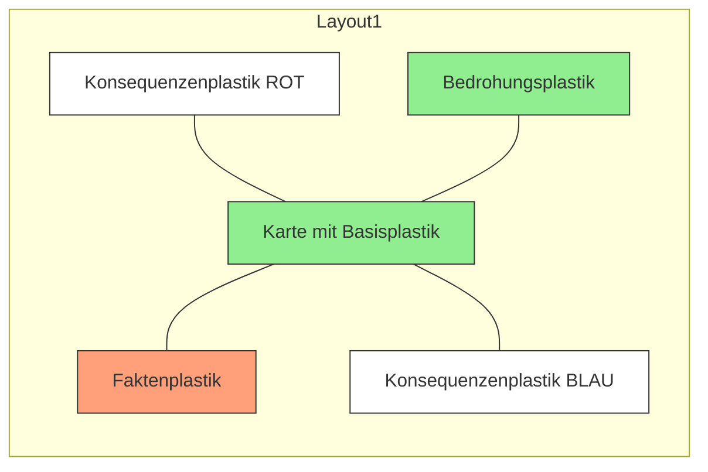
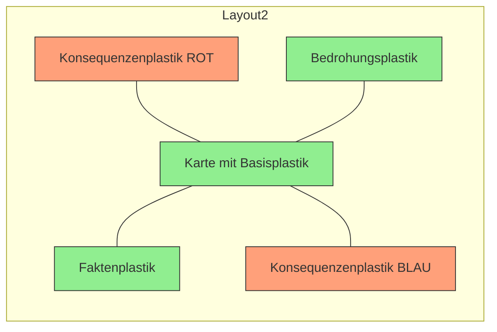
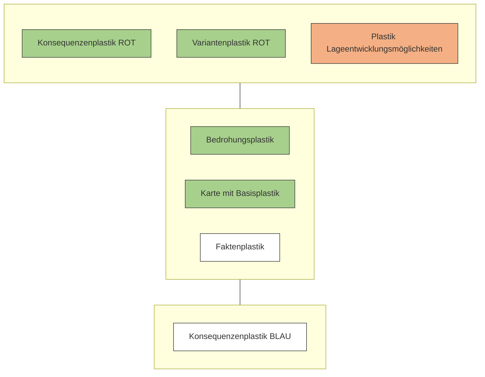

## 5.4 Führungstätigkeit: Beurteilung der Lage
### 5.4.1 Vernetzte Faktorenanalyse

#### Grundlagen
* FSO 17, Pt 4.2.4, Zif 146–179
* BFT 17, Pt 5.4

#### Worum geht es?
Ziel ist es, die Faktoren der Faktorengruppe systematisch zu analysieren, die Schlüsselbereiche ROT und BLAU sowie Konsequenzen für ROT und BLAU abzuleiten.

#### Struktur
* Ei Bf Trp Kö
* Übersichtskarte & Planungskarte
* Folien (werden zum Faktenplastik und Konsequenzenplastik ROT und BLAU)
* Folienstifte (BLAU / ROT / SCHWARZ / GRÜN)

Es werden insgesamt drei Produkte in dieser Arbeitsphase erstellt. Im ersten Teil dieser Arbeitsphase erstellt der Einh Kdt in zwei Arbeitsschritten (Aussagen sammeln & Erkenntnisse gewinnen) das rötlich markierte Produkt auf seiner Planungskarte. Die grünlich markierten Produkte dienen ihm als Unterstützung in der Arbeit.

<description>
On the right margin, there is a vertical navigation bar with the following sections:
1 Einführung
2 Allgemeines
3 Risikomanagement
4 Lageverfolgung
5 Aktionsplanung (This section is highlighted in blue)
6 Vorgehen bei unklarem Auftrag
7 Aktionsnachbereitung
8 Führungsunterstützung
9 Erkundung
10 Formulare
11 Sachregister
</description>

37

Arbeitshilfe 52.080 d Behelf Führung Einheit (BFE)

*Abb 24: Prinzip für die Erarbeitung des Faktenplastiks (Struktur)*

Im zweiten Teil dieser Arbeitsphase erstellt der Einh Kdt in einem Arbeitsschritt (Konsequenzen ableiten) die rötlich markierten Produkte auf seiner Planungskarte. Die grünlich markierten Produkte dienen ihm als Unterstützung in der Arbeit.

*Abb 25: Prinzip für die Erarbeitung von Konsequenzenplastik ROT und BLAU (Struktur)*

38

Arbeitshilfe 52.080 d Behelf Führung Einheit (BFE)

### Umsetzung
Kerntätigkeit der Beurteilung der Lage (BdL) ist das Analysieren der Faktoren, Auftrag, Umwelt, Gegnerische Mittel, Eigene Mittel und Zeitverhältnisse (AUGEZ). Die Analyse erfolgt nach den drei Schritten des Analyseschemas «Aussage – Erkenntnis – Konsequenz» – AEK.

Die Übersichtskarte mit den Abschnittsgrenzen und der Bedrohung des Trp Kö dient dem Einh Kdt als Grundlage, den Einsatz des Trp Kö zu verstehen und im Gesamtrahmen zu denken. Der Bedrohungsplastik mit den für die Einh relevanten Teilen dient als Grundlage für die Aktionen der Akteure in seinem Einsatzraum.

**Arbeitsschritt 1 – Aussagen sammeln**
In der Phase der Initialisierung hat der Einh Kdt den ganzen Ei Bf Trp Kö inklusive Beilagen und Anhänge studiert, die relevanten Punkte markiert und die Planungskarte so wie die Übersichtskarte für den Start in die BdL vorbereitet. Die gesammelten Fakten (Aussagen) aus den «Besonderen Anordnungen» kann er nun auf dem Faktenplastik der Planungskarte einzeichnen (z B KI, Trp Stao, Hindernisse, Fe Rm, Pat SaL, Log Pt, usw). Um weitere Fakten zu erhalten, dient dem Einh Kdt folgender Fragekatalog:

**Auftrag**
* Welche Bedeutung/Rolle hat meine Einheit im Gesamtrahmen des Truppenkörpers?
* Was ist die erwartete Leistung meiner Einheit (minimal/maximal)?
* Wo habe ich im Rahmen der Auftragserfüllung Handlungsspielraum (frei/gebunden)?
* Wer kann mich wie unterstützen?

**Umwelt**
* Wo kann gefahren werden?
* Wo wird man gebremst (Gewässer, Engnisse und Hindernisse)?
* Wie sieht die Geländekammerung aus und wo sind dominierende Höhen?
* Gibt es Witterungseinflüsse?
* Wie verhält sich die Zivilbevölkerung?
* Wo gibt es militärische und zivile Infra (Trp Stao und KI)?
* Welche Geländeteile zählen zu den Schlüsselbereichen (ROT & BLAU)

**Gegnerische Mittel**
* Was wollen die Akteure mit ihren Aktionen erreichen (Absicht / Motivation)?
* Über welche Anzahl Mittel, Systeme verfügen die Akteure und wie gross sind deren Reichweiten?
* Welche Einsatzverfahren wenden die Akteure an?
* Welche Verbände / Systeme / Personen zählen zu den Schlüsselbereichen?

<description>
Blue vertical tab on the right edge of the page with white text "5 Aktions-planung" rotated 90 degrees.
</description>

39

Arbeitshilfe 52.080 d Behelf Führung Einheit (BFE)

**Eigene Mittel**
* Über welche Anzahl Mittel, Systeme und Reichweiten von Waffen verfüge ich und wo kann ich sie einsetzen?
* Welche Einsatzverfahren können angewendet werden?
* Welche Verbände/Systeme/Personen zählen zu den Schlüsselbereichen?

**Zeitverhältnisse**
* Wie kann sich die Lage in der gegebenen Zeitspanne verändern?
* In welcher Zeit können die Mittel ROT und BLAU zum Einsatz kommen?
* Können Ziele und Aufgaben zeitlich in der Synchronisationsmatrix festgelegt werden?

**Arbeitsschritt 2 – Erkenntnisse gewinnen (Vernetzung)**
Um Erkenntnisse zu gewinnen, können und müssen die einzelnen Aussagen aus der Beantwortung des Fragekatalogs miteinander verknüpft werden (vgl Abb 26). Dieser Vorgang ist zentral für die vernetzte Faktorenanalyse.

*Abb 26: Faktorengruppe der Beurteilung der Lage (Umsetzung)*

Der Schritt der Erkenntnisgewinnung läuft hauptsächlich gedanklich ab. Wenn Erkenntnisse räumlich oder zeitlich fixiert werden können, zeichnet der Einh Kdt diese wiederum auf dem Faktenplastik als weitere Fakten ein (z B Schlüsselbereiche, unzugängliche Gebiete und Passagen für Mensch und Fz usw).

Beispiele von Erkenntnissen (gedanklich):
* Aufgrund des Geländes und der Einsatzdistanzen liegen Feuerstellungen für Unterstützungsfeuer des Gegners auf der westlichen Seite des Einsatzraumes.
* Ich habe einen Fluss, der meinen Raum in E und W teilt, muss aber in beiden Geländekammern kämpfen können.

40

Arbeitshilfe 52.080 d Behelf Führung Einheit (BFE)

Am Ende von Schritt 2 verfügt der Einh Kdt über alle Fakten (Aussagen und Erkenntnisse), um Schritt 3 anzugehen – Konsequenzen für ROT und BLAU daraus abzuleiten.

*Abb 27: Faktenplastik (Umsetzung)*

**Legende**
1. Passage obligé
2. Schlüsselgelände ROT
3. Schlüsselgelände BLAU
4. Unpassierbare Stelle für Fz
5. Sprengbereitschaftsgrad
6. Strassen, welche die Akteure benutzen können
7. Feuerraum (hier UF)
8. Objekt mit Kulturgüterschutz

**Arbeitsschritt 3 – Konsequenzen ableiten**
Der Übergang zur Ableitung von Konsequenzen ist aufgrund des Fragekatalogs und der Arbeitstechnik fliessend. Dabei gilt es, Folgendes zu beachten:
* Konsequenzen werden nach Kraft, Raum, Zeit und Information (KRZI) eingezeichnet.
* Konsequenzen für ROT basieren auf den Fakten (Aussagen und Erkenntnisse) und haben immer eine Konsequenz BLAU zur Folge (Prinzip: «Aus ROT mach BLAU»!). Sie werden auf dem Konsequenzenplastik ROT eingetragen.
* Konsequenzen für BLAU basieren hauptsächlich auf den Konsequenzen ROT, können aber ebenfalls aus den Fakten abgeleitet werden, ohne eine Konsequenz ROT als Grundlage zu haben (z B aufgrund von

<description>
Am rechten Rand befindet sich ein vertikaler blauer Balken mit der Aufschrift "5 Aktionsplanung".
</description>

41

Arbeitshilfe 52.080 d Behelf Führung Einheit (BFE)

zwei Geländekammern bin ich gezwungen, dezentrale Reserven zu bilden). Sie werden auf dem Konsequenzenplastik BLAU eingetragen.
* Bei den Konsequenzen BLAU ist jeweils bereits jetzt zu überlegen, ob diese für den Entschluss, für Reserveeinsätze oder für besondere Anordnungen relevant werden. Dies kommt bei der Erarbeitung von eigenen Möglichkeiten zum Tragen (vgl Kap 5.5.1).

### Schlüsselbereiche
Schlüsselbereiche ROT müssen ebenfalls mit Konsequenzen BLAU abgedeckt werden.

Beispiel: Schlüsselgelände kann entweder mit Truppen oder Feuer belegt werden.
Schlüsselverbände/Schlüsselfahrzeuge/Schlüsselsysteme können durch Änderungen von Zielprioritäten in der Feuerführung effizient bekämpft werden.

### Arbeitstechnik
* Konsequenzen für ROT werden mit rotem Stift auf den Konsequenzenplastik ROT eingetragen.
* Konsequenzen für BLAU werden mit blauem Stift auf den Konsequenzenplastik BLAU eingetragen.

Abb 28: Überlagerung Konsequenzenplastik ROT und BLAU am Ende der BdL (Umsetzung)

 ... für die Praxis
* In dieser Phase der Planung ist es irrelevant, ob die Summe der gezogenen Konsequenzen die zur Verfügung stehenden Mittel überschreitet.

42

Arbeitshilfe 52.080 d Behelf Führung Einheit (BFE)

*   Ein Schlüsselverband/-system ROT hat Priorität in der Bekämpfung und kann entweder durch Reserven (Eventualplanung) oder Prioritätenänderung von Waffensystemen bekämpft werden.
*   Im Rahmen der Beurteilung der Lage werden die Konsequenzen ROT wie auch BLAU fortlaufend aufgezeichnet. Wichtig dabei ist, dass dies auf den dafür vorbereiteten Folien ROT und BLAU passiert. Dies garantiert am Ende der BdL eine bessere Übersicht, wenn die Lageentwicklungsmöglichkeiten generiert werden.
*   Die BdL kann auch mit den Denkvorgängen 1 & 2 unterstützt werden:
    *   **Denkvorgang 1:** Was kann der Gegner unter Berücksichtigung der Umwelt mit welchen Mitteln in welcher Zeit tun, um mich am Erfüllen des Auftrages zu hindern?
    *   **Denkvorgang 2:** Was kann ich unter Berücksichtigung der Umwelt mit welchen Mitteln in welcher Zeit und in Bezug auf die gegnerischen Möglichkeiten tun, um meinen Auftrag zu erfüllen?
*   Das unten abgebildete Formular wird auf den Stufen Trp Kö bzw Gs Vb von den jeweiligen Kommandanten verwendet, um ihren Auftrag zu analysieren. Dabei wird auch das Analyseschema «AEK» angewendet und die anderen vier Faktoren der BdL mit einbezogen. Die Auftragsanalyse auf Stufe Gs Vb bzw Trp Kö stellt somit eine «Mini-BdL» mit den wichtigsten Konsequenzen des jeweiligen Kommandanten dar, um damit Vorgaben für die Stabsarbeit zu definieren. Dieses Formular kann auch durch den Einh Kdt verwendet werden, um seinen Auftrag umfassend auszuwerten und die wichtigsten Konsequenzen für die Erarbeitung der Varianten herauszuschälen.

<description>
Blue vertical tab on the right side of the page with white text rotated 90 degrees counter-clockwise.
</description>

> **5 Aktions-planung**

### Auftragsanalyse «...»

<table>
  <thead>
    <tr>
        <th colspan="2">Auftragsanalyse «...»</th>
        <th>Wer     </th>
        <th>Stand     </th>
    </tr>
    <tr>
        <th></th>
        <th>Aussagen</th>
        <th>Erkenntnisse</th>
        <th>Konsequenzen</th>
    </tr>
  </thead>
  <tbody>
    <tr>
        <td>**1. Bedeutung der Aufgabe im Gesamtrahmen**</td>
        <td>    </td>
        <td>    </td>
        <td>    </td>
    </tr>
    <tr>
        <td>**2. Erwartete Leistung des Verbandes**</td>
        <td>    </td>
        <td>    </td>
        <td>    </td>
    </tr>
    <tr>
        <td>**3. Handlungsspielraum**</td>
        <td>gebunden:     frei:</td>
        <td>    </td>
        <td>    </td>
    </tr>
    <tr>
        <td>**4. Unterstützung**</td>
        <td>    </td>
        <td>    </td>
        <td>    </td>
    </tr>
  </tbody>
</table>

*Abb 29: Formular «Auftragsanalyse» für die Stufe Trp Kö / Gs Vb*

43

Arbeitshilfe 52.080 d Behelf Führung Einheit (BFE)

*   Zur graphischen Umsetzung und zwecks armeeeinheitlicher Darstellung hat es sich bewährt, die folgenden Darstellungsarten zu verwenden.

<table>
  <thead>
    <tr>
        <th>Symbol</th>
        <th>Bezeichnung</th>
        <th>Symbol</th>
        <th>Bezeichnung</th>
    </tr>
  </thead>
  <tbody>
    <tr>
        <td></td>
        <td>**Strassen**</td>
        <td></td>
        <td>**offenes Gelände**</td>
    </tr>
    <tr>
        <td></td>
        <td>**Drehscheiben**</td>
        <td></td>
        <td>**bedecktes Gelände**</td>
    </tr>
    <tr>
        <td></td>
        <td>**Brücken, Pässe**</td>
        <td></td>
        <td>**überbautes Gebiet, Ortschaften**</td>
    </tr>
    <tr>
        <td></td>
        <td>**Ein- und Austritte, Passages obligés**</td>
        <td></td>
        <td>**gekammertes Gelände**</td>
    </tr>
    <tr>
        <td></td>
        <td>**Eisenbahnlinien**</td>
        <td></td>
        <td>**Ausdehnung**</td>
    </tr>
    <tr>
        <td></td>
        <td>**Reservierte Verkehrsträger**</td>
        <td></td>
        <td>**ziv Objekte**</td>
    </tr>
    <tr>
        <td></td>
        <td>**Flüsse**</td>
        <td></td>
        <td>**Flüchtlinge**</td>
    </tr>
    <tr>
        <td></td>
        <td>**Seen**</td>
        <td></td>
        <td>**Nebel**</td>
    </tr>
    <tr>
        <td></td>
        <td>**Sümpfe**</td>
        <td></td>
        <td>**Schlüsselgelände ROT**</td>
    </tr>
    <tr>
        <td></td>
        <td>**Berge, Hügelzüge**</td>
        <td></td>
        <td>**Schlüsselgelände BLAU**</td>
    </tr>
    <tr>
        <td>[ ] 636580</td>
        <td>**Sperrstellen**</td>
        <td rowspan="2"></td>
        <td rowspan="2">**Höhenprofil**</td>
    </tr>
    <tr>
        <td>○</td>
        <td>**Weitere wichtige Pt / Einrichtungen nach Bedarf (Farbgebung nach Bedarf, Legende anfügen)**</td>
    </tr>
  </tbody>
</table>

*Abb 30: Legende für den Faktenplastik*

44

Arbeitshilfe 52.080 d Behelf Führung Einheit (BFE)

## 5.4.2 Herleitung und Erarbeitung der Bedrohung

**Grundlagen**
* FSO 17, Pt 4.2.4, Zif 180 – 191
* BFT 17, Pt 5.4.11

**Worum geht es?**
Bei der Herleitung der Bedrohung geht es darum, den Plastik Lageentwicklungsmöglichkeiten zu zeichnen und den Textbaustein des Ei Bf Einh für die Bedrohung zu generieren.

**Struktur**
* Planungskarte mit Konsequenzenplastik ROT
* Ei Bf Einh (Vorlage/Draft)
* Folien (werden zum Variantenplastik ROT und Plastik Lageentwicklungsmöglichkeiten)
* Roter Folienstift

Es werden drei Produkte in dieser Arbeitsphase erstellt. Im ersten Teil dieser Arbeitsphase arbeitet der Einh Kdt am rötlich markierten Produkt seiner Planungskarte. Die grünlich markierten Produkte dienen ihm als Unterstützung in der Arbeit.

<description>
Diagram showing a central square "Karte mit Basisplastik" (green) surrounded by other squares. Above it is "Konsequenzenplastik ROT" (green) and "Variantenplastik ROT" (red/orange). To the left is "Bedrohungsplastik" (green). To the right is "Faktenplastik" (white). Below is "Konsequenzenplastik BLAU" (white).
</description>

*Abb 31: Prinzip für die Erarbeitung des Variantenplastiks ROT (Struktur)*

Im zweiten Teil dieser Arbeitsphase arbeitet der Einh Kdt am rötlich markierten Produkt seiner Planungskarte. Die grünlich markierten Produkte dienen ihm als Unterstützung in der Arbeit. Im zweiten Spaltenblock erhalten die Produkte eine eindeutige, standardisierte Bezeichnung und die Form des Endproduktes wird vorgegeben.

<description>
Vertical blue tab on the right edge of the page with white text.
</description>
**5 Aktionsplanung**

45

Arbeitshilfe 52.080 d Behelf Führung Einheit (BFE)

*Abb 32: Prinzip für die Erarbeitung des Plastiks Lageentwicklungsmöglichkeiten (Struktur)*

Im dritten Teil dieser Arbeitsphase erarbeitet der Einh Kdt die Textbausteine für die Bedrohung und baut die finalen Produkte in den Ei Bf Einh ein.

### Umsetzung
 Aufgrund des Konsequenzenplastiks ROT ist der Einh Kdt nun in der Lage, Varianten der Bedrohung auszuarbeiten. Diese Varianten heissen Lageentwicklungsmöglichkeiten.

**Arbeitsschritte für den ersten Teil**
1. Folie auf der Planungskarte fixieren (wird zum Variantenplastik ROT).
2. Varianten werden durch Einkreisen von Konsequenzen und Zuteilen von Nummern an die jeweiligen Konsequenzen generiert (vgl Abb 33).
3. Beurteilung von Gefährlichkeit und Wahrscheinlichkeit jeder Variante (gedanklich).
   Bei der Beurteilung sind die Stärken, Schwächen und Schlüsselbereiche für ROT zu berücksichtigen und gedanklich Einsatzverfahren über das Vorgehen ins Gelände/auf die Karte zu legen.
4. Entscheid für eine Variante (gedanklich).
   Aufgrund der Beurteilung bestimmt der Einh Kdt, wie er die Bedrohung sieht und welchen Gefechtsstandard die Akteure dabei anwenden. Diese Variante wird als «Bestimmende Lageentwicklungsmöglichkeit» bezeichnet. Alle anderen Varianten, welche nicht Teil der «Bestimmenden Lageentwicklungsmöglichkeit» sind, werden jetzt als «Weitere Lageentwicklungsmöglichkeiten» bezeichnet.

46

Arbeitshilfe 52.080 d Behelf Führung Einheit (BFE)

*Abb 33: Konsequenzenplastik ROT mit Variantenplastik ROT (Umsetzung)*

**Arbeitsschritte für den zweiten Teil**
1. Folie auf die Planungskarte aufkleben (wird zum Plastik «Lageentwicklungsmöglichkeiten»).
2. Lageentwicklungsmöglichkeiten auf Folie zeichnen.
Die «Bestimmende Lageentwicklungsmöglichkeit» wird mit ausgezogenen Linien gezeichnet. Für «Weitere Lageentwicklungsmöglichkeiten» werden gestrichelte Linien verwendet (vgl Abb 34).

*Abb 34: Plastik Lageentwicklungsmöglichkeiten (Umsetzung)*

<description>
Rechter Seitenrand mit vertikalem Register:
1 Einführung
2 Allgemeines
3 Risiko-management
4 Lage-verfolgung
5 Aktions-planung (Blau hervorgehoben)
6 Vorgehen bei unklarem Auftrag
7 Aktions-nachbereitung
8 Führungs-unterstützung
9 Erkundung
10 Formulare
11 Sachregister
</description>

47

Arbeitshilfe 52.080 d Behelf Führung Einheit (BFE)

**Arbeitsschritte für den dritten Teil**
1. Textbaustein «Bedrohung» entwickeln.
   Der Textbaustein für die «Bestimmende Lageentwicklungsmöglichkeit» und «Weitere Lageentwicklungsmöglichkeiten» kann mittels der 7W-Fragen generiert werden (vgl Abb 35). Im Zentrum steht dabei die Beschreibung, wie die Akteure im Raum der Einh vorgehen (Beschreibung des Einsatzverfahrens).
2. Übertrag der Bedrohung auf die Synchronisationsmatrix (Verfeinerung bis auf Stufe Zug).
3. Einarbeitung der Bedrohung in den Einsatzbefehl Einh/auf das Räumlich-Zeitliche Einsatzkonzept (vgl Kap 5.7.1).

<table>
  <thead>
    <tr>
        <th>W-Frage</th>
        <th>Formulierung</th>
    </tr>
  </thead>
  <tbody>
    <tr>
        <td>WANN?</td>
        <td>«... innert 3, 6, 9, 12 h, innert Tagen, h, nach Erreichen von ..., nach Überwinden von ... usw ...»</td>
    </tr>
    <tr>
        <td>WOHER?</td>
        <td>«aus einem Bereitstellungsraum ...» «aus einem Brückenkopf im Raum ...»</td>
    </tr>
    <tr>
        <td>WOMIT?</td>
        <td>«... mit 2 Mech Inf Kp nebeneinander, je 1– 2 Mech Inf Z in Front, ...»</td>
    </tr>
    <tr>
        <td>WO DURCH?</td>
        <td>«über ein Zwischenziel im Raum ... nach»</td>
    </tr>
    <tr>
        <td>WOHIN?</td>
        <td>«... an die ... Übergänge», «... ins taktische Ziel ... stossen, ...»</td>
    </tr>
    <tr>
        <td>WOZU?</td>
        <td>«um unsere Angriffsverbände im Rm ... zu binden»</td>
    </tr>
    <tr>
        <td>WIE WEITER?</td>
        <td>«... nach Erreichen des ZZ/AZ im Raum ...» «... nach Erkämpfen bzw Überschreiten von ...» «... Richtung... oder Richtung ... weiter stossen, um anschliessend ...» «... den Austritt sichern, um anschliessend ...» «... nach Zuführen von weiteren ...»</td>
    </tr>
  </tbody>
</table>
*Abb 35: Tabelle der 7W-Fragen (Umsetzung)*

Der Textbaustein für «In allen Fällen» wird wie folgt entwickelt. Die markierten Teile von «In allen Fällen» im Ei Bf Trp Kö werden heruntergebrochen (vgl dazu Tabelle unten und das Prinzip der Passage «Herunterbrechen eines Textbausteins und einer Tabelle» in Kap 5.6).

<table>
  <thead>
    <tr>
        <th>Vorgabe Textbaustein Trp Kö</th>
        <th>Lösung Textbaustein Einh</th>
    </tr>
  </thead>
  <tbody>
    <tr>
        <td>Die Akteure können durch den Einsatz von B- und C-Kampfstoffen &lt;mark style="background-color: red"&gt;im ganzen Eirm</mark> unsere Truppe binden, behindern oder schwächen.</td>
        <td>Die Akteure können durch den Einsatz von B- und C-Kampfstoffen &lt;mark style="background-color: red"&gt;in MARFELDINGEN</mark> unsere Truppe binden, behindern oder schwächen.</td>
    </tr>
  </tbody>
</table>

... für die Praxis
* Je nach Einsatz und Anzahl der Konsequenzen ROT ist es sinnvoll, pro Variante eine Folie zu erstellen. Dies erhöht die Übersicht und eine allfällige Präsentation an den Trp Kö Kdt für einen taktischen Dialog ist so bereits in den Grundzügen vorbereitet.
* Textbausteine für die Bedrohung können auch vom S2 des Trp Kö übernommen und verfeinert werden. Dieses Vorgehen ersetzt jedoch auf keinen Fall die Beurteilung der Lage.

48

Arbeitshilfe 52.080 d Behelf Führung Einheit (BFE)

* Die Bedrohung am Truppenstandort ist immer einzubeziehen, weil der eigene Standort auch im Einsatz geschützt werden muss.

## 5.4.3 Mittelbedarfsrechnung/Leistungskatalog (Bedrohung für die KI)

### Grundlagen

* BFT 17, Pt 5.4.13

### Worum geht es?

Im Rahmen der Unterstützung von zivilen Behörden werden vor allem kritische Infrastrukturen (KI) geschützt. Der Einh Kdt erhält den Schutzauftrag für diese KI in Form einer Mittelbedarfsrechnung oder eines Leistungskatalogs. Dieses Dokument gilt es nun zu verfeinern.

### Struktur

Der Leistungskatalog ist eine Zusammenstellung (Katalog) aller zu erbringenden Leistungen (mehrere Mittelbedarfsrechnungen). Der Einh Kdt erhält das Produkt in der Regel in folgender Form:

<table>
  <thead>
    <tr>
        <th>Nr</th>
        <th>Kritische Infrastruktur</th>
        <th colspan="3">Bedrohung</th>
        <th>Besonderes/Anträge</th>
        <th colspan="3"></th>
    </tr>
    <tr>
        <th></th>
        <th></th>
        <th>Bestimmende</th>
        <th>Weitere</th>
        <th>In allen Fällen</th>
        <th></th>
        <th colspan="3"></th>
    </tr>
  </thead>
  <tbody>
    <tr>
        <td rowspan="2">Nummer</td>
        <td>Beschreibung mit Koordinaten Foto/Kartenauszug</td>
        <td colspan="2" rowspan="2">Symbole</td>
        <td>Lageentwicklungsmöglichkeiten Bestimmende Lageentwicklungsmöglichkeit Weitere Lageentwicklungsmöglichkeiten In allen Fällen</td>
        <td>Wichtige Punkte • Offene Punkte • Anträge • Besonderes • Integration mit anderen KI</td>
        <td colspan="3"></td>
    </tr>
    <tr>
        <th>Prio</th>
        <th>Auflagen/Dringlichkeit</th>
        <th>Leistung</th>
        <th>Anzahl AdA/Verband</th>
        <th>Wirkung</th>
        <th>Beginn</th>
        <th>Einsatzdauer</th>
        <th>Logistik</th>
        <th>Fhr Ustü</th>
    </tr>
    <tr>
        <td>P</td>
        <td></td>
        <td>P</td>
        <td>Q</td>
        <td>Q</td>
        <td>Z</td>
        <td>D</td>
        <td colspan="2"></td>
    </tr>
    <tr>
        <td rowspan="2">Priorität</td>
        <td>Spezifikationen bezüglich Dringlichkeit und Auflagen für die KI</td>
        <td colspan="5">Zu erbringende Leistung aufgrund festgelegter Bedrohung • Produkt (erwartete Leistung) • Quantität (Menge/Anzahl) • Qualität (angestrebte Wirkung – z.B. Schutzgrad, Gefechtsleistung) • Zeitpunkt (Beginn der erwarteten Leistung) • Dauer (geschätzte Einsatzdauer)</td>
        <td colspan="2">Bewertung der Bedürfnisse für die Ustü • Material • Transport • Verbindungen</td>
    </tr>
  </tbody>
</table>

Abb 36: Mittelbedarfsrechnung (Struktur)

### Legende
Eine Mittelbedarfsrechnung eines Trp Kö beinhaltet alle notwendigen Angaben zu einer KI. Farblich werden die Bereiche in den Tabellenüberschriften hinterlegt.
* Im schwarzen Bereich (Nr, Lage der KI, Priorität, Auflagen und Dringlichkeit) sind die von den zivilen Instanzen vorgegebenen Eckwerte aufgeführt.
* Im blauen Bereich ist die Leistung nach Produkt – Quantität – Qualität – Zeitpunkt und Dauer (kurz PQQZD) definiert. Das fehlende P (Prioritäten) für das eigentliche PPQQZD ist im schwarzen Bereich zu finden.

49

Arbeitshilfe 52.080 d Behelf Führung Einheit (BFE)

* Im roten Bereich sind die Möglichkeiten der Akteure beschrieben.
* Im grauen Bereich sind offene Punkte sowie die Bedürfnisse an Unterstützungsleistungen aufgeführt.

### Umsetzung
Der Leistungskatalog dient dem Einh Kdt als Grundlage für seine Planung. Er überprüft den Inhalt für die entsprechenden KI. Sollte er zum Ergebnis kommen, dass er die Bedrohung bzw den Mittelansatz an der KI anders sieht, muss er den Dialog mit dem Kdt Trp Kö und dem S2 suchen und die Differenzen bereinigen. Dies kann bedeuten, dass die Bedrohung und somit auch der dafür geplante Mittelansatz (Personal) an der KI allenfalls angepasst werden.

### Spezialfall
Der Einh Kdt muss auch in der Lage sein, die Bedrohung, den Kräfte- und Mittelansatz für eine KI selber zu analysieren und zu bestimmen. Diverse Gründe können dazu führen, dass diese Arbeit durch den Einh Kdt geplant werden muss, wie z B:
* fehlende Vorgaben der vorgesetzten Kdo Stelle;
* eine KI muss unverhofft geschützt werden;
* schützen des eigenen Stao bzw der eigenen Ukft (im Einsatz wie Ausbildungsdienst);
* die Einh ist selbständig ohne Trp Kö im Dienst.

Eine Analyse der Bedrohung und des Mittelansatzes sollte zwingend direkt vor Ort an der KI geschehen. Dazu macht der Einh Kdt eine «objektbezogene» BdL (vgl Abb 37). Das Vorgehen ist gleich, wie in Kap 5.4.1 und 5.4.2. Am Ende der «objektbezogenen» BdL verfügt der Einh Kdt über den Plastik Lageentwicklungsmöglichkeiten für die betreffende KI und den Textbaustein für die Bedrohung. Der Textbaustein kann nun in eine leere Vorlage einer Mittelbedarfsrechnung eingebaut werden.

50

Arbeitshilfe 52.080 d Behelf Führung Einheit (BFE)

*Abb 37: Konsequenzen ROT und BLAU nach der objektbezogenen BdL (Umsetzung)*

<description>
A red warning triangle icon with an exclamation mark is positioned to the left of the following text block.
</description>

### ... für die Praxis
* Der Einh Kdt kann nach der selbständigen Beurteilung der Bedrohung, diese zur Verifikation/Genehmigung der vorgesetzten Kdo Stelle zukommen lassen.
* Die Mittelbedarfsrechnung/Der Leistungskatalog kann und soll auch für den Schutz des Truppenstandortes im Ausbildungsdienst verwendet werden.

<description>
On the right margin, there is a blue vertical tab with the number 5 and the text "Aktions-planung" rotated 90 degrees counter-clockwise.
</description>

51

Arbeitshilfe 52.080 d Behelf Führung Einheit (BFE)
