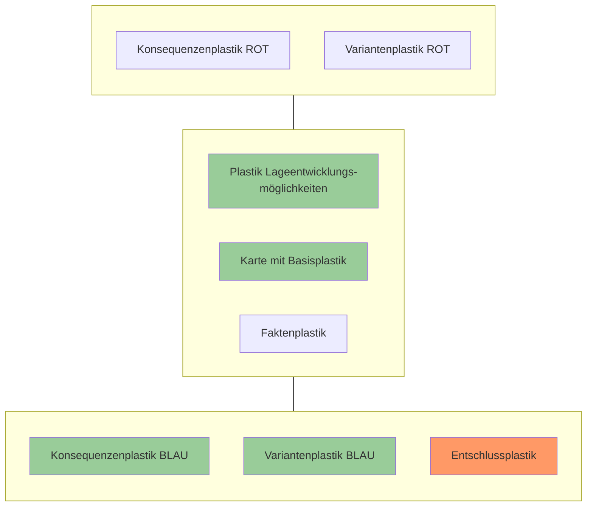

## 5.5 Führungstätigkeit: Entschlussfassung

### 5.5.1 Herleitung und Erarbeitung von eigenen Möglichkeiten


#### Grundlagen
* FSO 17, Pt 4.2.5 & Zif 206
* TF 17, Zif 5008
* BFT 17, Pt 5.5.2


#### Worum geht es?
Bei der Erarbeitung von eigenen Möglichkeiten geht es darum, machbare Varianten für den eigenen Mitteleinsatz zu generieren, welche auf die in der BdL entwickelten Lageentwicklungsmöglichkeiten ausgerichtet sind.


#### Struktur
* Planungskarte mit Plastik Lageentwicklungsmöglichkeiten und Konsequenzenplastik BLAU
* Folie (wird zum Variantenplastik BLAU)
* Blauer Folienstift

In der folgenden Arbeitsphase arbeitet der Einh Kdt am rötlich markierten Produkt seiner Planungskarte. Die grünlich markierten Produkte dienen ihm als Unterstützung in der Arbeit. Vorgängig hat er den Bedrohungsplastik von der Planungskarte entfernt und durch den Plastik Lageentwicklungsmöglichkeiten ersetzt.

```description
Diagram showing the arrangement of different plastic overlays on a map. 
- Top center: A white box labeled "Konsequenzenplastik ROT" and "Variantenplastik ROT".
- Middle row: 
    - Left: A green box labeled "Plastik Lageentwicklungsmöglichkeiten".
    - Center: A green box labeled "Karte mit Basisplastik".
    - Right: A white box labeled "Faktenplastik".
- Bottom center: A box with a green top section labeled "Konsequenzenplastik BLAU" and a larger reddish-orange bottom section labeled "Variantenplastik BLAU".
```

Abb 38: Prinzip für die Erarbeitung des Variantenplastiks BLAU (Struktur)

52

Arbeitshilfe 52.080 d Behelf Führung Einheit (BFE)

### Umsetzung

Aufgrund des Konsequenzenplastiks BLAU verfügt der Einh Kdt über mehrere Optionen, wie er auf die Lageentwicklungsmöglichkeiten antworten kann. Von zentraler Bedeutung sind:
* Die bestimmende Lageentwicklungsmöglichkeit ist Basis für den Einsatz der Hauptmittel.
* Die weiteren Lageentwicklungsmöglichkeiten sind die Basis für den Einsatz von Reserven.
* Die Bedrohung aus «In allen Fällen» wird über die besonderen Anordnungen abgedeckt (vgl Kap 5.6).


*Abb 39: Plastik Lageentwicklungsmöglichkeiten mit Konsequenzenplastik BLAU (Umsetzung)*

**Arbeitsschritte**
1. Folie auf der Planungskarte fixieren (wird zum Variantenplastik BLAU).
2. Varianten generieren:
    * Varianten werden durch Einkreisen von Konsequenzen BLAU und Zuteilen von Nummern an die jeweiligen Konsequenzen generiert, welche auf die bestimmende Lageentwicklungsmöglichkeit ausgerichtet sind (vgl Abb 40).
    * Konsequenzen, welche für die weiteren Lageentwicklungsmöglichkeiten in Frage kommen, werden eingekreist und mit «Res» markiert. Auch hier ist es möglich, durch Nummernzuteilung Varianten zu generieren.

<description>
On the right margin, there is a blue vertical tab with the text "5 Aktionsplanung".
</description>

53

Arbeitshilfe 52.080 d Behelf Führung Einheit (BFE)

* Konsequenzen wie Feuerräume, Hindernisse usw werden ebenfalls eingekreist und mit «Beso» markiert. Sie werden in der Phase der Planentwicklung bearbeitet (vgl Kap 5.6).

3. Bewertung (gedanklich) der Varianten nach den Prinzipien der Einsatzgrundsätze.
* Ausrichten auf das Ziel;
* Schwergewichtsbildung;
* Einfachheit;
* Sicherheit;
* Ökonomie der Kräfte;
* Einheitlichkeit des Handelns;
* Flexibilität;
* Freiheit des Handelns;
* Überraschung;
* Verhältnismässigkeit.


*Abb 40: Konsequenzenplastik BLAU mit Variantenplastik BLAU (Umsetzung)*

Echte Varianten unterscheiden sich unter anderem in Bezug auf die Verwendung der Reserven, der Organisation und/oder das Schwergewicht (ROS). Dies gilt ebenfalls für die Varianten ROT.


... für die Praxis
* Je nach Einsatz und Anzahl der Konsequenzen BLAU ist es sinnvoll, pro Variante eine Folie zu erstellen. Dies erhöht die Übersicht und eine

54

Arbeitshilfe 52.080 d Behelf Führung Einheit (BFE)

allfällige Präsentation an den Trp Kö Kdt für einen taktischen Dialog ist so bereits in den Grundzügen vorbereitet.

*   Reserveeinsätze können z B wie folgt aussehen:
    - Durchgebrochenen Gegner vernichten;
    - Gegenangriff vor Sperren;
    - Neue Sperrstellungen weiter hinten errichten mit parallelem Rückzug der anderen kämpfenden Kräfte auf die gleiche Höhe;
    - Abwehr von weiteren Bedrohungen (Luftlandungen, Umgehungen usw);
    Dabei sollte wenn immer möglich angestrebt werden, dass sich der Einsatz der Mittel BLAU auf den schwächsten Punkt von ROT konzentriert und gleichzeitig Massierungen verhindert werden.
*   Um Unterschiede zwischen den einzelnen Variante besser zu erkennen, kann auch die Methode von nebeneinanderhängenden Prinzipskizzen der einzelnen Varianten gewählt werden (vgl Abb 41).


*Abb 41: Gegenüberstellung von Varianten*

### 5.5.2 Entschluss


**Grundlagen**
*   FSO 17, Pt 4.2.5, Zif 210 – 216
*   BFT 17, Pt 5.5.10
*   Einsatz der Infanterie – Teil 1: Führung und Einsatz des Bataillons, Zif 255


**Worum geht es?**
Es geht darum, aus den entwickelten Varianten BLAU einen Entschluss für den Einsatz zu erarbeiten und die Absicht und Aufträge zu formulieren.


**Struktur**
*   Planungskarte mit Plastik Lageentwicklungsmöglichkeiten und Variantenplastik BLAU
*   Folie (wird zum Entschlussplastik)
*   Folienstifte (BLAU, SCHWARZ)

In der folgenden Arbeitsphase arbeitet der Einh Kdt am rötlich markierten Produkt seiner Planungskarte. Die grünlich markierten Produkte dienen ihm als Unterstützung in der Arbeit.

<description>
Rechter Seitenrand mit vertikalem Register:
1 Einführung
2 Allgemeines
3 Risiko-management
4 Lageverfolgung
5 Aktionsplanung (hervorgehoben in Blau)
6 Vorgehen bei unklarem Auftrag
7 Aktionsnachbereitung
8 Führungsunterstützung
9 Erkundung
10 Formulare
11 Sachregister
</description>

55

Arbeitshilfe 52.080 d Behelf Führung Einheit (BFE)



*Abb 42: Prinzip für die Erarbeitung des Entschlussplastiks (Struktur)*

### Umsetzung

Der Einh Kdt entscheidet sich für eine Variante und arbeitet diese zum fertigen Entschluss (Entschlussplastik) aus (Abb 43). Den Entschlussplastik benötigt er für das Formulieren der Absicht.


*Abb 43: Entschlussplastik inklusive Reserveeinsätze (Umsetzung)*

56

Arbeitshilfe 52.080 d Behelf Führung Einheit (BFE)

Da aufgrund des Konsequenzenplastik BLAU bereits Konsequenzen für die weiteren Lageentwicklungsmöglichkeiten vorhanden sind, können diese direkt zu Einsätzen der Reserve (Eventualplanungen) ausgearbeitet und gestrichelt dargestellt werden (analog Plastik Lageentwicklungsmöglichkeiten). Diese Reserveeinsätze müssen folgende Fälle abdecken:

*   Alle Varianten der weiteren Lageentwicklungsmöglichkeiten;
*   Minimale Auftragserfüllung (z B ein Hauptverband kann den Auftrag nicht mehr erfüllen);
*   Maximale Auftragserfüllung (alle Hauptverbände erfüllen ihren Auftrag und es kann eine Chance genutzt werden).

Daraus resultiert, dass am Ende eines Einsatzes die Reserve auf jeden Fall eingesetzt wird (Prinzip «all in»).

Aufgrund des Entschlussplastiks kann der Einh Kdt den Plastik «Abschnittsgrenzen» zeichnen und seine Absicht mit den dazugehörigen Aufträgen formulieren. Zudem kann er den Verlauf der Aktion seiner eigenen Mittel auf der Synchronisationsmatrix nachtragen.


*Abb 44: Abschnittsgrenzen (Umsetzung)*

**Merkpunkte für das Formulieren der Absicht**
*   Es sollten keine taktischen Standardabläufe in der Absicht eingebaut werden. Verben wie sperren, halten usw generieren anschliessend bei der Formulierung von Aufträgen Schwierigkeiten für die Direktunterstellten, die Bedeutung der Aufgabe im Gesamtrahmen zu verstehen.

<description>
Am rechten Seitenrand befindet sich ein blaues Register-Tab mit der vertikalen Aufschrift "5 Aktionsplanung".
</description>

57

Arbeitshilfe 52.080 d Behelf Führung Einheit (BFE)

Besser ist, sich der Verben in der Definition eines Begriffes zu bedienen.
* Die Absicht verfügt über eine räumliche und eine zeitliche Komponente. Die zeitliche Komponente muss nicht zwingend im Textbaustein der Absicht ersichtlich sein. Jedoch muss die Absicht die Phasen der Synchronisationsmatrix der vorgesetzten Kdo Stelle berücksichtigen und auf diese ausgerichtet sein. Somit entstehen nicht unterschiedliche Phasen auf den einzelnen Führungsebenen.

Für die Formulierung eignet sich deshalb folgende Variante:

> Ich will
> * im Rm A die Stärke und die Stossrichtung des Gegners frühzeitig erkennen;
> * auf Höhe B den Gegner aufhalten;
> * einen Durchbruch des Gegners bei der Kreuzung C verhindern;
> * mich bereithalten, um in
>   1. Priorität durchgebrochenen Gegner auf Höhe D zu stoppen;
>   2. Priorität aufgelaufenen Gegner vor der Sperre B mit Mw Fe zu zerschlagen.

**Merkpunkte für das Formulieren von Aufträgen**
* Aufträge dürfen keine Wiederholung der Absicht sein.
* Es sollen taktische Verben verwendet werden, um das Einsatzverfahren zu definieren, das angewendet werden soll.
* Aufträge müssen wiederholt werden können. Die Formulierung muss deshalb sehr einfach sein. Sie darf nicht aus x-beliebig vielen Bullets bestehen. Die Merkfähigkeit einer Person beschränkt sich auf 3 – 5 Bullets. Da auf Stufe Einh mündlich befohlen wird, ist diesem Punkt besonders Rechnung zu tragen.

Die Formulierung von Aufträgen könnte wie folgt aussehen:

<table>
  <tbody>
    <tr>
        <td>Kdo Zug</td>
        <td>* Stellt die Führung mittels KP im Rm E sicher.</td>
    </tr>
    <tr>
        <td rowspan="2"></td>
        <td>* Hält sich bereit, einen Gef Stand im Rm F zu beziehen.</td>
    </tr>
    <tr>
        <td>* Stellt die Logistik aus dem Rm G sicher.</td>
    </tr>
    <tr>
        <td>Inf Zug 1</td>
        <td>* Sperrt auf Höhe B.</td>
    </tr>
    <tr>
        <td>Inf Zug 2</td>
        <td>* Hält die Kreuzung C.</td>
    </tr>
    <tr>
        <td>Inf Zug 3</td>
        <td>* Hält sich bereit,</td>
    </tr>
    <tr>
        <td rowspan="2"></td>
        <td>- den Gegner im Engnis D zu sperren.</td>
    </tr>
    <tr>
        <td>- den Gegner vor der Sperre B zu vernichten.</td>
    </tr>
    <tr>
        <td>Mw Zug 4</td>
        <td>* Stellt FBG 10 ab Zeitpunkt X sicher.</td>
    </tr>
    <tr>
        <td rowspan="2"></td>
        <td>* Hält sich bereit,</td>
    </tr>
    <tr>
        <td>- in einer 1. Phase in die Fe Rm a – c zu wirken.</td>
    </tr>
    <tr>
        <td rowspan="4"></td>
        <td>- in einer 2. Phase in die Fe Rm d – f zu wirken.</td>
    </tr>
  </tbody>
</table>

58

Arbeitshilfe 52.080 d Behelf Führung Einheit (BFE)

**Beilage Führungsraster**
Um die Führung während des Einsatzes sicherzustellen, wird in der Regel ein Führungsraster als Beilage zum Ei Bf Trp Kö abgegeben. Dieses Raster muss vom Einh Kdt übernommen werden. Um das Problem von unterschiedlichen Kartenmassstäben in der Führung zu lösen, kann der Einh Kdt den Führungsraster des Trp Kö verfeinern (vgl Abb 45).


Abb 45: Führungsraster (Umsetzung)

<mark>**5 Aktions-planung**</mark>


... für die Praxis
* Bei länger dauernden Einsätzen ist die Durchhaltefähigkeit von entscheidender Bedeutung und wird in der Regel bereits vom Trp Kö befohlen. Bei der Formulierung der Absicht kann ein grobes Dienstrad (Anzahl Ablösungen wie: Einsatz/Ruhe/Reserve/Urlaub) bereits durch den Einh Kdt formuliert werden.
* Detaillierte Diensträder (vgl Kap 2.2) werden in den besonderen Anordnungen via Synchronisationsmatrix vom Einh Kdt festgelegt (vgl Kap 4.3).

59

Arbeitshilfe 52.080 d Behelf Führung Einheit (BFE)

## 5.5.3 Mittelbedarfsrechnung/Leistungskatalog (Entschluss für die KI)


**Grundlagen**
* BFT 17, Pt 5.5.3


**Worum geht es?**
Es geht darum, den geplanten Kräfte- und Mittelansatz taktisch sinnvoll auf der KI einzusetzen und die Grundlage für die Befehlsgebung an die Direktunterstellten zu erstellen.


**Struktur**
Auszug aus dem Leistungskatalog des Trp Kö oder bereits durch den Einh Kdt bearbeitete Vorlage einer Mittelbedarfsrechnung.


**Umsetzung**
Aufgrund der verifizierten Plausibilität oder der eigenständig generierten Bedrohung für die KI erstellt der Einh Kdt nun eine Entschlussskizze, in der er den Kräfteansatz und die Mittel unter Berücksichtigung der Auflagen des Betreibers der KI einsetzt oder Varianten aus den Konsequenzen BLAU zu einem Entschluss umsetzt. Auf der Mittelbedarfsrechnung definiert er nun in der Spalte «Anzahl AdA/Verband» (Quantität) bei jeder KI die jeweiligen Verbände (Zug, Gruppe, Trupp) bzw Anzahl AdA, welche den Schutzauftrag wahrnehmen müssen.


*Abb 46: Entschlussskizze für eine KI (Umsetzung)*

60

Arbeitshilfe 52.080 d Behelf Führung Einheit (BFE)

Aus der finalisierten Mittelbedarfsrechnung der KI und der Entschluss-skizze kann der Einh Kdt nun einen Einsatzbefehl für den Schutz der KI erstellen (analog Wachtdienstbefehl).


**... für die Praxis**
* Vorlagen für die Mittelbedarfsrechnung, den Wachtdienstbefehl und den Ei Bf für den Schutz der KI sind auf dem LMS bei den Formularen des BFE abrufbar.
* Die Mittelbedarfsrechnungen / Der Leistungskatalog der Stufe Einh können auch als Auftragsblatt für die Zfhr/Grfhr abgegeben werden. Hier muss jedoch beachtet werden, dass dieses Dokument nicht ausreicht, um Ablösungen an einer KI zu vollziehen. Dazu wird der Einsatzbefehl für den Schutz der KI benötigt.
