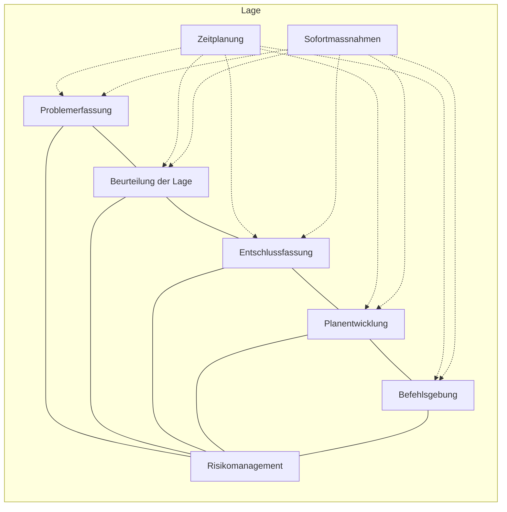

### 5.1.1 Initialisierung

**Grundlagen**
* FSO 17, Pt 4.2, Abb 10
* BFT 17, Pt 5.3.2

**Worum geht es?**
Der Prozess der Aktionsplanung dient dazu, ein Problem systematisch und rationell einer Lösung zuzuführen. Dafür werden die Führungstätigkeiten in Abb 14 angewendet. Ziel ist es, dass die unterstellten Kader möglichst zeitverzugslos befohlen werden können und die Führung des Einsatzes zeitgerecht ermöglicht wird. Die Tiefe und Ausprägung der Führungstätigkeiten sind abhängig von Lage, Auftrag, Mittel und der zur Verfügung stehenden Zeit. Als Grundsatz gilt: Was in der Aktionsplanung nicht seriös vorbereitet wird, bleibt als Altlast in der Lageverfolgung bestehen.

Die Phase der Führungstätigkeit Problemerfassung ist der Ausgangspunkt der Aktionsplanung. Mit der Initialisierung wird der Prozess gestartet und die ersten vorbereitenden Schritte der Planung eingeleitet. Die Initialisierung dient dem Einh Kdt vor allem dazu, den Einstieg in die anstehende Aktionsplanung zu vereinfachen.

> **Vorbereitende Schritte der Initialisierung**
> * Lesen und bearbeiten des Einsatzbefehls
> * Erstellen der Übersichtskarte
> * Erstellen der Planungskarte

<table>
  <thead>
    <tr>
        <th></th>
        <th>Prozessschritt</th>
        <th>Nummerierung</th>
        <th>Begleitende Tätigkeiten</th>
    </tr>
  </thead>
  <tbody>
    <tr>
        <td>Lage</td>
        <td>Problemerfassung</td>
        <td>1</td>
        <td>Zeitplanung Sofortmassnahmen Risikomanagement</td>
    </tr>
    <tr>
        <td>Lage</td>
        <td>Beurteilung der Lage</td>
        <td>2</td>
        <td>Zeitplanung Sofortmassnahmen Risikomanagement</td>
    </tr>
    <tr>
        <td>Lage</td>
        <td>Entschlussfassung</td>
        <td>3</td>
        <td>Zeitplanung Sofortmassnahmen Risikomanagement</td>
    </tr>
    <tr>
        <td>Lage</td>
        <td>Planentwicklung</td>
        <td>4</td>
        <td>Zeitplanung Sofortmassnahmen Risikomanagement</td>
    </tr>
    <tr>
        <td>Lage</td>
        <td>Befehlsgebung</td>
        <td>5</td>
        <td>Zeitplanung Sofortmassnahmen Risikomanagement</td>
    </tr>
  </tbody>
</table>

**Abb 14: Initialisierungsphase zu Beginn der Führungstätigkeiten (Struktur)**

26

Arbeitshilfe 52.080 d Behelf Führung Einheit (BFE)

### Struktur
Folgende Unterlagen werden für die Initialisierung benötigt:
* Ei Bf Trp Kö inklusive Beilagen/Anhänge;
* LK 1:50 000 (Blatt des jeweiligen Einsatzraumes Stufe Trp Kö);
* Folien/Plastik;
* Feste Unterlagen (Karton, Styropor, Holz usw);
* Leuchtstifte (ROT/BLAU/GELB/GRÜN);
* Folienstifte (BLAU/ROT/SCHWARZ/GRÜN).

### Umsetzung
Bei einem neuen Auftrag müssen zuerst vorhandene Unterlagen auf den aktuellsten Stand gebracht werden bzw gewisse Produkte bearbeitet oder neu erstellt werden. Der Einh Kdt beginnt nun mit den vorbereitenden Schritten der Initialisierung.

#### 1. Lesen und Bearbeiten des kompletten Ei Bf Trp Kö
Folgende Arbeiten führen den Einh Kdt durch den ersten Arbeitsschritt:

1. **Markieren mit blauem Leuchtstift:**
   
   * Teile der Absicht und des Auftrages im Ei Bf Trp Kö, die den eigenen Verband betreffen.
   * Erhaltener Auftrag inklusive Teile der Absicht und der Aufträge in den Eventualplanungen, die den eigenen Verband betreffen.

2. **Markieren mit grünem Leuchtstift:**
   
   * Passagen des Ei Bf Trp Kö, die direkt in den Ei Bf Einh übernommen werden (z B Nachbartruppen und Partner, die meinen Verband betreffen).

3. **Markieren mit rotem Leuchtstift:**
   
   * Teile der Bedrohung im Ei Bf Trp Kö inklusive Eventualplanungen, die den eigenen Verband betreffen.

4. **Markieren mit gelbem Leuchtstift:**
   
   * Besondere Anordnungen im Ei Bf Trp Kö, die den eigenen Verband betreffen.

5. **Übertrag finaler Textbausteine**
   
   * Textbausteine im Ei Bf Trp Kö können in den Ei Bf Einh eingebaut werden (z B Deckname, Kartenmassstab, Nachbartruppen und Partner, erhaltener Auftrag, «Geht an», «z K an» usw).

<description>
Vertical navigation bar on the right side with the following sections:
1 Einführung
2 Allgemeines
3 Risiko-management
4 Lage-verfolgung
5 Aktions-planung (highlighted in blue)
6 Vorgehen bei unklarem Auftrag
7 Aktions-nachbereitung
8 Führungs-unterstützung
9 Erkundung
10 Formulare
11 Sachregister
</description>

27

Arbeitshilfe 52.080 d Behelf Führung Einheit (BFE)

<description>
The following content is presented within a framed box, representing a document excerpt. Some parts of the text are highlighted in cyan and green.
</description>

**2 Absicht**
Ich will
* Nachrichten über den Gn im Rm GEMPENACH – GURBRÜ frühzeitig beschaffen;
* <mark>einen gn Stoss über die Saane - Aare Linie im Rm GÜMMENEN - MARFELDINGEN - NIEDERRIED verhindern;</mark>
* mich bereithalten, zu halten und sperren hinter der Verteidigungsstellungen und durchgebrochenen Gn zu vernichten;
* mit dem Fe der Art in
    - 1. Prio den Gn westlich der Saane zerschlagen;
    - <mark>2. Prio den Kampf der Sperren und Stützpunkte unterstützen.</mark>

**3 Aufträge**

**3.1 Inf Stabskp 16**
+ 1 San Z (MSE 2)
AU Pz Sap Kp 11/1
* Bezieht und betreibt Bat KP im Rm FRIESWIL.
* Betreibt RLST im Rm FRIESWIL und stellt log Bedürfnisse des Bat sicher.

**3.2 <mark>Inf Kp 16/1</mark>**
<mark>+ Mw Z 1 aus Inf Ustü Kp 16/4</mark>
<mark>+ Späher Gr 1 aus Inf Ustü Kp 16/4</mark>
<mark>+ 1 Infra Gr aus Infra Bat 1</mark>
<mark>AU Pz Sap Kp 11/1</mark>
* <mark>Sperrt den Eintritt nach DETLIGEN – FRIESWIL.</mark>

**3.3 <mark>Inf Kp 16/2</mark>**
<mark>+ Mw Z 2 aus Inf Ustü Kp 16/4</mark>
<mark>+ Späher Gr 2 aus Inf Ustü Kp 16/4</mark>
<mark>+ 1 Infra Gr aus Infra Bat 1</mark>
<mark>AU Pz Sap Kp 11/1</mark>
* <mark>Sperrt die Eintritte auf Höhe MÜHLIHOLZ - MARFELDINGEN.</mark>

Abb 15: Auszug aus einem bearbeiteten Ei Bf Trp Kö (Umsetzung)

28

Arbeitshilfe 52.080 d Behelf Führung Einheit (BFE)

## 2. Erstellen der Übersichtskarte
Folgende Arbeiten führen den Einh Kdt durch den zweiten Arbeitsschritt:
1. Kartenausschnitt (LK 1:50 000) wählen und auf feste Unterlage kleben.
2. Plastik «Abschnittsgrenzen» und Absicht (Text) des Trp Kö aufkleben.
3. Plastik «Bestimmende und weitere Lageentwicklungsmöglichkeiten» des Trp Kö aufkleben.

*Abb 16: Übersichtskarte (Umsetzung)*

<description>
The image contains a text box overlaying the map with the following content:
**Absicht**
Ich will
* Nachrichten über den Gn im Rm GEMPENACH – GURBRÜ frühzeitig beschaffen;
* <mark>einen gn Stoss über die Saane - Aare Linie im Rm GÜMMENEN - MAREL - DINGEN - NIEDERRIED verhindern;</mark>
* mich bereithalten, zu halten und sperren hinter der Verteidigungsstellungen und durchgebrochenen Gn zu vernichten;
* mit dem Fe der Art in
  - 1. Prio den Gn westlich der Saane zerschlagen;
  - 2. Prio den Kampf der Sperren und Stützpunkte unterstützen.
There is a yellow box with the number 2 next to the last bullet points.
</description>

<description>
On the right margin, there is a blue vertical tab:
**5 Aktions-planung**
</description>

29

Arbeitshilfe 52.080 d Behelf Führung Einheit (BFE)

### 3. Erstellen der Planungskarte
Folgende Arbeiten führen den Einh Kdt durch den dritten Arbeitsschritt:

1. Kartenausschnitt (Massstab nach Bedarf) definieren und auf feste Unterlage kleben.
2. Folie/Plastik direkt auf die Karte aufkleben (wird zum Basisplastik).
    * Abschnittsgrenzen der Einh mit schwarzem Folienstift einzeichnen.
    * Auftrag darauf notieren bzw aufkleben.
    * Eigene Mittel aufzeichnen/aufkleben.
3. Folie/Plastik am linken Rand der Karte à la Klappsystem befestigen (wird zum Bedrohungsplastik).
    * Relevanter Teil der Bedrohung des Trp Kö mit rotem Folienstift einzeichnen.
    * Akteure aufzeichnen/aufkleben.
4. Folie/Plastik am rechten Rand der Karte à la Klappsystem befestigen (wird zum Faktenplastik).
5. Folie/Plastik am oberen Rand der Karte à la Klappsystem befestigen (wird zum Konsequenzenplastik ROT).
6. Folie/Plastik am unteren Rand der Karte à la Klappsystem befestigen (wird zum Konsequenzenplastik BLAU).

*Abb 17: Planungskarte (Umsetzung)*

 ... für die Praxis
* Das Erstellen der Planungskarte ist die Grundlage für die Führungskarte, welche in der Lageverfolgung verwendet werden soll.
* Um Zeit zu sparen, können bereits erste Sofortmassnahmen ausgelöst werden (z B Überprüfung bzw Aktualisierung des PPQQZD (vgl Kap 6.3).

30

Arbeitshilfe 52.080 d Behelf Führung Einheit (BFE)
