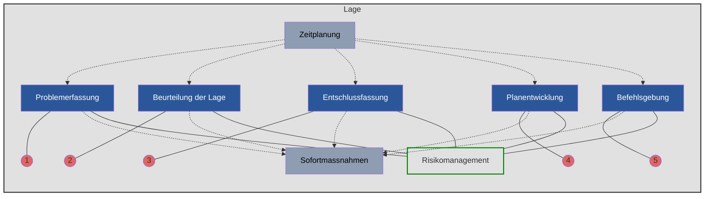
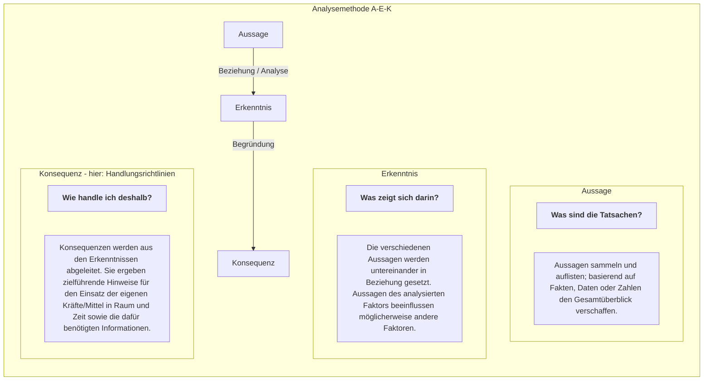
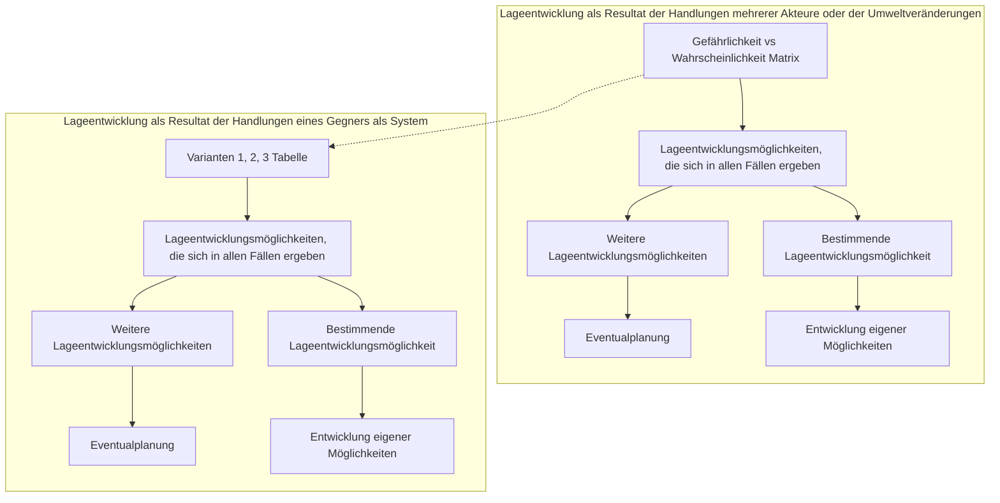

## 4.2 Aktionsplanung

110 Aktionsplanung beinhaltet alle Aufgaben, die durch den Kommandanten und seinen Stab zur Ausarbeitung einer Aktion durchgeführt werden, vom Zeitpunkt des Eintreffens eines Auftrages oder des Entstehens einer Lage, welche zum Handeln zwingt, bis zur Befehlsausgabe an die Unterstellten.



*Abb 10: Führungstätigkeiten in der Aktionsplanung*

111 Der rationale Entscheidungsfindungsprozess beinhaltet eine systematische Durchführung aller Führungstätigkeiten. Er berücksichtigt, dass
* die verschiedenen Führungsstufen einbezogen werden und die Zusammenarbeit mehrerer Personen in verschiedenen Teilprozessen ermöglicht wird;

24

Reglement 50.040 d Führung und Stabsorganisation 17

*   der Kommandant und sein Stab in den meisten Fällen unter hohem Zeitdruck und grosser Unsicherheit arbeiten und entscheiden müssen, bedingt durch ungenaue, unvollständige, falsche, veraltete, widersprüchliche oder nicht rechtzeitig verfügbare Informationen;
*   dessen Standardisierung eine zielgerichtete Zusammenarbeit mit Partnern erleichtert.

112 Dauer sowie organisatorischer, personeller und materieller Aufwand für die einzelnen Führungstätigkeiten sind abhängig von:
*   der Vielschichtigkeit des Problems;
*   der zur Verfügung stehenden Zeit;
*   der Zahl der an der Problemlösung beteiligten Personen.

113 Unterschieden werden 5 (+2) Führungstätigkeiten. Sie umfassen die Abfolge der fünf Aufgaben: Problemerfassung, Beurteilung der Lage, Entschlussfassung, Planentwicklung und Befehlsgebung. Diese werden durch zwei ständige Aufgaben begleitet: Sofortmassnahmen und Zeitplanung.

114 Im Rahmen der Führungstätigkeiten ist begleitend stets das Risikomanagement einzubeziehen. Lage, Auftrag, Führungsstufe und Persönlichkeit des Kommandanten bestimmen, welche Risiken einzugehen sind und wie mit diesen umzugehen ist.

**Risikomanagement**

115 Risiken sind von der Bedrohung, den Gefahren und weiteren Faktoren abhängige Ereignisse und Entwicklungen, die mit einer gewissen Wahrscheinlichkeit eintreten und Auswirkungen auf die Zielerreichung und die Auftragserfüllung haben können.

116 Lage-, auftrags- und führungsstufenabhängig werden bedrohungs- und gefahrenbedingte von weiteren Risiken unterschieden. Taktische Risiken sind weitgehend mit der Beurteilung der Lage abgedeckt.

117 Das Risikomanagement dient dem Kommandanten und seinem Stab dazu,
*   mögliche künftige Ereignisse und Entwicklungen vorauszusehen und damit die Entscheidungsfindung zu unterstützen;
*   die Sicherheit der Beteiligten zu gewährleisten;
*   die eigenen Kräfte/Mittel zu schützen;
*   die eigenen Kräfte/Mittel wirksam einzusetzen.

25

Reglement 50.040 d Führung und Stabsorganisation 17

### 4.2.1 Problemerfassung

118 Die Problemerfassung ist die erste Auseinandersetzung des Kommandanten und seines Stabes mit einer Problemstellung. Der Kommandant muss die zu lösende Aufgabe verstehen, seinen Stab auf die Erfüllung dieser Aufgabe ausrichten und Handlungsrichtlinien für die Umsetzung formulieren.

119 Eine Problemstellung drängt sich auf wegen:
* eines neuen Auftrags;
* zusätzlich erhaltener Befehle und/oder Weisungen;
* einer Lageveränderung, die im Verlauf der Aktion zum Handeln zwingt;
* des Erkennens bisher nicht beachteter Chancen oder Risiken bei der Erfüllung des erhaltenen Auftrages;
* einer allgemein gehaltenen, wenig präzisen Aufgabenzuweisung.

120 Die Problemerfassung besteht aus den drei Teilschritten Problementdeckung, -klärung und -beurteilung.

```mermaid
graph TD
    PS[Problemstellung<br/>Auftrag | Lage | Ereignis] --> PK[Problemklärung]
    PS -.->|"(weitere) Informationsbeschaffung"| PK
    
    PS --> PE[Problementdeckung]
    
    PE --> PK
    
    subgraph PE_Box [Problementdeckung]
    direction TB
    PE1["IST ————————> SOLL"]
    PE2["<b>Worum geht es?</b><br/>• Aufgaben, Ziel, angestrebter<br/>Endzustand?<br/>• Chancen, Risiken?<br/>• Zeitverhältnisse?"]
    PE3["<b>Einordnung</b><br/>• Neuartigkeit?<br/>• Unbestimmtheit?<br/>• Komplexität?"]
    PE4["(Erste) Aufgabenformulierung"]
    end

    subgraph PK_Box [Problemklärung]
    direction TB
    PK1["Zerlegung Problem in Teilprobleme"]
    PK2"![Diagram showing layers of a pyramid representing structure of the task"]
    PK3["<b>Struktur der Aufgabe</b>"]
    PK4["Definitive Formulierung der Aufgabe"]
    PK1 --> PK2 --> PK3 --> PK4
    end

    PK --> PB[Problembeurteilung]
    
    subgraph PB_Box [Problembeurteilung]
    direction TB
    PB1["Pro Teilproblem<br/>• Organisatorische<br/>Zuständigkeit<br/>- Stabsteile?<br/>- Verbände?<br/>- Organisation?"]
    PB2["• Bedeutung<br/>Lösungsaufwand im<br/>Gesamtrahmen"]
    PB3["• Dringlichkeit bzw<br/>Konsequenzen eines<br/>Lösungsaufschubes"]
    end

    PK4 --> AU[Aufgabenumschreibung]
    PK4 --> HR[Handlungsrichtlinien]
    
    subgraph AU_Box [Aufgabenumschreibung]
    direction TB
    AU1["Pro Teilproblem<br/>• Ziel / Zweck<br/>• Teilaufgaben<br/>• Prioritäten"]
    end

    subgraph HR_Box [Handlungsrichtlinien]
    direction TB
    HR1["Pro Teilproblem<br/>• Auflagen<br/>• Erste Lösungsansätze<br/>• Erwartete Endprodukte"]
    end

    AU_Box --- SG[Stabsgliederung]
    SG --- SG1["Einsatzgliederung des Stabes"]
```

*Abb. 11: Problemerfassung*

26

Reglement 50.040 d Führung und Stabsorganisation 17

### Problementdeckung

121 In der Problementdeckung wird geklärt, worum es in der aktuellen Lage überhaupt geht, welches Ziel oder welcher angestrebte Endzustand erreicht, in welchem Rahmen und unter welchen Zeitverhältnissen gehandelt werden muss.

122 Klar formulierte Aufträge, die sich aus einer umfassenden Orientierung über die Lage und einer eindeutigen Absicht des vorgesetzten Kommandanten zusammensetzen, lassen die Problemstellung rasch erkennen.

123 Bei Lageveränderungen im Rahmen einer laufenden Aktion ist die Problemstellung oft nicht auf den ersten Blick erkennbar. In diesem Fall bedeutet die Problementdeckung die Suche nach Chancen und Risiken. Die eigene Aufgabe wird selbst definiert und formuliert.

### Problemklärung

124 In der Problemklärung wird durch Beschaffung, Sichtung und Verdichtung zusätzlicher Informationen der Überblick über die wesentlichen Aspekte der gestellten Aufgabe gewonnen.

125 Ergebnisse der Problemklärung sind:
* ein möglichst klares Bild der gesamten Aufgabe und
* deren mögliche Zerlegung in eine überschaubare Zahl von Teilproblemen mit entsprechender Aufgabenumschreibung und erwarteten Endprodukten sowie
* aufgabenspezifische Handlungsrichtlinien.

126 Eine komplexe Aufgabe wird in Teilprobleme zerlegt, damit:
* die einzelnen Teilprobleme möglichst geringe gegenseitige Abhängigkeit aufweisen;
* die Teilprobleme derselben Führungsstufe effizient bearbeitet werden können;
* die Teilprobleme eine möglichst hohe Übereinstimmung mit den Fähigkeiten der beteiligten Stabsteile und Verbände aufweisen, um die Anpassung der Grundgliederung des Stabes und der Grund- oder Einsatzgliederung der Kräfte/Mittel gering zu halten.

### Problembeurteilung

127 In der Problembeurteilung werden Bedeutung und Dringlichkeit der Teilprobleme sowie die organisatorische Zuständigkeit festgelegt. Damit wird geklärt, welche Teilaufgaben welchen Stabsteilen zugeordnet werden und in welcher Reihenfolge sie abzuarbeiten sind.

27

Reglement 50.040 d Führung und Stabsorganisation 17

128 Bedeutung und Dringlichkeit werden geprüft, weil in den meisten Fällen nicht über ausreichende Ressourcen (Zeit, Personal) verfügt wird, um sämtliche Teilprobleme einer Aufgabe gleichzeitig zu lösen. Die Teilaufgaben sind daher zu gewichten und zu priorisieren.

129 Die Resultate der drei Teilschritte werden anlässlich des Orientierungsrapports präsentiert. Sie sind:
* Beschreibung der Aufgaben bzw des angestrebten Endzustandes, Auslegung von Ziel und Zweck der Aufgaben sowie deren Bedeutung und Dringlichkeit;
* Definition zusätzlicher Handlungsrichtlinien durch den Kommandanten in Form erster Lösungsansätze oder zu beachtender Auflagen (politisches und militärisches Umfeld, Einsatzrechtskonformität);
* Festlegung der Stabsgliederung (Einsatzgliederung des Stabes).

### 4.2.2 Sofortmassnahmen

130 Sofortmassnahmen werden ab Beginn der Problemerfassung laufend getroffen. Sie dürfen weder dem Entschluss vorgreifen noch die Entschlussfreiheit einschränken.

131 Sofortmassnahmen ermöglichen:
* die zur Verfügung stehende Vorbereitungszeit (auch die Zeit für die Einsatzvorbereitungen enthaltend) für eine Aktion auf allen Stufen bestmöglich zu nutzen;
* Informationen zu den Faktoren für die Beurteilung der Lage zu beschaffen;
* die eigene Handlungsfreiheit durch die Auslösung angepasster Massnahmen zu wahren oder zu erhöhen;
* die nachfolgenden Stufen in die Entscheidungsfindung einzubeziehen.

132 Sofortmassnahmen werden durch den Kommandanten angeordnet. Auf der taktischen Führungsstufe werden Sofortmassnahmen, die unterstellte Verbände betreffen, durch Vor- oder Teilbefehle angeordnet.

### 4.2.3 Zeitplanung

133 Mit der Zeitplanung werden interne und externe Zeitpläne unter Berücksichtigung der Verfügbarkeit des Kommandanten (Führungsrhythmus) und des Vorbereitungsgrades der Verbände (Einsatzvorbereitungen) erstellt:
* Der interne Zeitplan ist die Grundlage für die Erstellung des Stabsarbeitsplanes und berücksichtigt die Verfügbarkeit der Stabsangehö-

28

Reglement 50.040 d Führung und Stabsorganisation 17

rigen und die in der Problemerfassung festgelegte Dringlichkeit der einzelnen Teilprobleme und die Stabsgliederung;
*   Der externe Zeitplan berücksichtigt die Tätigkeiten mit Beteiligung Dritter (z B Verbände, Partner), die Umsetzung der eigenen Planung, die Dynamik der Lageentwicklung.

<table>
  <thead>
    <tr>
        <th>Zeitaufteilung</th>
        <th colspan="2">Vorbereitung der Aktion</th>
        <th>Durchführung der Aktion</th>
        <th></th>
    </tr>
    <tr>
        <th>Eigene Führungsstufe</th>
        <th>Interner Zeitplan</th>
        <th>Aktionsplanung durch den eigenen Stab</th>
        <th>Lageverfolgung</th>
        <th></th>
    </tr>
    <tr>
        <th></th>
        <th>Externer Zeitplan</th>
        <th>Aktionsplanung durch Unterstellte</th>
        <th>Lageverfolgung</th>
        <th></th>
    </tr>
    <tr>
        <th>Unterstellte Führungsstufe</th>
        <th>Interner Zeitplan</th>
        <th>Aktionsplanung durch den eigenen Stab</th>
        <th>Lageverfolgung</th>
        <th></th>
    </tr>
    <tr>
        <th></th>
        <th>Externer Zeitplan</th>
        <th>Aktionsplanung durch Unterstellte<br/>SOMA</th>
        <th>Einsatzvorbereitungen</th>
        <th>Lageverfolgung</th>
    </tr>
    <tr>
        <th></th>
        <th>T-x</th>
        <th>T</th>
        <th>Zeit</th>
        <th></th>
    </tr>
  </thead>
</table>

Abb. 12: Abhängigkeit der Zeitplanung mehrerer Führungsstufen (schematische Darstellung)

134 Die Zeitplanung umfasst das Erlangen einer Vorstellung über den Zeitbedarf und die zur Verfügung stehende Zeit für Planung und Durchführung einer Aktion. Der Zeitplan wird – in der Regel – von der Wirkung im Ziel und dem angestrebten Endzustand ausgehend rückwärts rechnend erstellt.

135 Die Zeitplanung ermöglicht erst, anstehende Aufgaben innerhalb der zur Verfügung stehenden Zeit zu lösen. Die zur Verfügung stehende Zeit wird sowohl für die Durchführung als auch für die Planung einer Aktion vollständig, Reserve inbegriffen, ausgewiesen.

136 Die Erstellung des Zeitplans beginnt während der Problemerfassung. Der Zeitplan muss während der folgenden Führungstätigkeiten ständig nachgeführt, der Lage angepasst werden und ist die Grundlage für die Erstellung der Synchronisationsmatrix.

137 Im Zeitplan wird bestimmt, was bis wann wie vorliegen muss. Bedeutung, Qualität und Erscheinungszeitpunkt der zu erstellenden Produkte der Aktionsplanung sind ebenfalls darin enthalten.

138 Der Zeitplan hält fest,
*   wieviel Zeit für die Aktionsplanung bzw -steuerung der eigenen Stufe zur Verfügung steht;
*   zu welchem Zeitpunkt einzelne Tätigkeiten abgeschlossen sein müssen;
*   wieviel Zeit Unterstellte zur Planung und Vorbereitung ihrer Aktionen zur Verfügung haben (der Kommandant legt den Beginn einer Aktion fest und wirkt dahin, dass der eingesetzte Verband zur Vorbereitung der Aktion genügend Zeit hat; sein Stab soll dabei nicht zu viel Zeit für sich beanspruchen);

29

Reglement 50.040 d Führung und Stabsorganisation 17

*   wann Unterstellte spätestens im Besitz der Produkte der Aktionsplanung sein müssen und wieviel Zeit für die Übermittlung dieser Dokumente eingeräumt wird;
*   wann benachbarte Verbände über Absicht/Möglichkeiten zur operationsraumübergreifenden Koordination verfügen müssen, falls der Einbezug der Unterstellten und Nachbarn nicht sichergestellt werden konnte.

139 Die Führungsstufen wenden den Zeitplan unterschiedlich an:
*   Alle Führungsstufen, besonders aber die militärstrategische und die operative, wenden das Prinzip des parallelen Planens an. Unterstellte werden in die Planungsarbeiten einbezogen und nehmen ihre eigene Planungsarbeit deshalb bereits vor dem Vorliegen endgültiger Produkte der Aktionsplanung auf;
*   Auf der taktischen Führungsstufe wird anstelle des parallelen Planens häufig das Planungsprinzip der Viertelregel angewendet. Pro Stufe wird ein Viertel der (noch) zur Verfügung stehenden Zeit für die eigene Aktionsplanung vorgesehen.


**Legende:**
<mark> </mark> Aktionsplanung
[ ] Rest der Vorbereitung der Aktion

*Abb. 13: Viertelregel – Aufteilung der zur Verfügung stehenden Zeit am Beispiel der taktischen Führungsstufe*

30

Reglement 50.040 d Führung und Stabsorganisation 17

140 Der Zeitplan liefert Erkenntnisse über den Vorbereitungsgrad einer Aktion. In jedem Fall muss er die für die eigentlichen Einsatzvorbereitungen (von Stab und Verbänden) benötigte Zeit ausweisen.

141 Der Zeitbedarf für die einzelnen Schritte einer Aktionsplanung lässt sich in der Regel nur abschätzen. Die für einen Ausführungsschritt eingeplante Zeit lässt sich nicht beliebig kürzen.

142 Voraussetzungen für eine angemessene Zeitplanung sind:
* Kenntnis der momentanen Fähigkeit der Kräfte/Mittel (personeller und materieller Bereitschaftsgrad);
* Kenntnis der Voraussetzungen für den optimalen Kräfte-/Mitteleinsatz;
* realistische Einschätzung nicht beeinflussbarer Faktoren (Umwelt, Kompetenzbereiche Dritter usw).

143 Festlegen von Zeiten (Limiten) heisst auch Festlegen der Rahmenbedingungen, unter welchen die Aufgaben erfüllt werden können. Für die Durchführung schwieriger oder komplexer Aktionen kann meistens nur der Beginn genau festgelegt werden, nicht aber die Dauer und der Abschluss. Oft ist es daher notwendig, Reservezeit einzuplanen.

144 Der zeitliche Rahmen wird festgelegt bzw umrissen mit Hilfe von:
* Limiten bzw Zeitpunkten;
* Zeiträumen/Grössenordnungen;
* Prioritäten/Minimalleistungen.

145 Die Anpassung des Zeitplanes ist angezeigt, wenn sich die Lage gegenüber der Ausgangslage deutlich verändert hat oder wenn bedeutend klarere Informationen zur Lage vorhanden sind.

### 4.2.4 Beurteilung der Lage

146 Beurteilen der Lage heisst, im Rahmen des Auftrages und der strukturierten Problem- bzw Aufgabenstellung:
* die entscheidenden Faktoren in Bezug auf den Auftrag erkennen und analysieren,
* daraus Konsequenzen ableiten, sowie
* aus deren Analyse Lageentwicklungsmöglichkeiten ausarbeiten und bewerten.

147 Daraus kann auf die Wirkungsmöglichkeiten der eigenen Kräfte/Mittel geschlossen werden.

31

Reglement 50.040 d Führung und Stabsorganisation 17

148 Die Resultate der Beurteilung der Lage werden anlässlich des Beurteilungsrapports aufgezeigt und darauf basierend wird die Planungsvorgabe zuhanden der Unterstellten erstellt.

**Analyse der Faktoren**

149 Bei der Beurteilung des militärstrategischen Kontextes erkennt und versteht die militärstrategische Führungsstufe die Faktoren Politik – Wirtschaft – Gesellschaft – Umwelt – Information – Wissenschaft und Technologie sowie deren Einfluss auf die eigenen Ziele – Wege – Mittel.

150 Die operative Führungsstufe beurteilt die Lage nach den Faktoren Kräfte – Raum – Zeit – Informationen (KRZI).

151 Die taktische Führungsstufe bevorzugt die Beurteilung der Lage entlang den Faktoren Auftrag – Umwelt – gegnerische Mittel – eigene Mittel – Zeitverhältnisse (AUGEZ).


Abb. 14: Faktoren bei der Beurteilung der Lage

32

Reglement 50.040 d Führung und Stabsorganisation 17

## Analysemethode Aussage – Erkenntnis – Konsequenz

152 Bei der Beurteilung der Lage geht es darum, die führungsstufenspezifischen Faktoren untereinander in Beziehung zu setzen, um mit den gefolgerten, vollständig vernetzten Erkenntnissen die Grundlagen für die eigene Entschlussfassung zu schaffen.

153 Der Kommandant und sein Stab gehen schlussfolgernd von gesammelten Aussagen aus, analysieren diese und gewinnen Erkenntnisse; schliesslich leiten sie daraus handlungsrelevante Konsequenzen ab:
* Aussagen heben Fakten, Daten oder Zahlen zum jeweiligen Beurteilungsfaktor hervor;
* Verschiedene Aussagen werden gegenseitig in Beziehung gesetzt. Aus ihrer Verknüpfung und Analyse lassen sich Erkenntnisse gewinnen;
* Konsequenzen sind konkrete Vorgaben, die der Entwicklung von Varianten dienen.




Abb. 15: Analysemethode A-E-K

33

Reglement 50.040 d Führung und Stabsorganisation 17

154 Der Kommandant beurteilt und genehmigt formulierte Konsequenzen. Daraus folgen:
* Handlungsrichtlinien, die in den weiteren Arbeitsschritten zwingend zu berücksichtigen sind;
* Sofortmassnahmen, die entsprechend umgesetzt werden;
* Pendenzen, die ihrer Dringlichkeit folgend stabsintern weiter bearbeitet werden.

**Auftrag**

155 Der Auftrag ist auf allen Führungsstufen der Ausgangspunkt und steht im Zentrum.

156 Der erhaltene Auftrag oder die selbstgestellte Aufgabe (Ziele, angestrebter Endzustand) bilden, unter Einbezug der Absicht des vorgesetzten Kommandanten und dessen Auffassung über die Lageentwicklung, die Grundlage jeglichen Handelns für den Kommandanten und seinen Stab während der ganzen Dauer einer Aktion.

157 Der Auftrag wird nach folgenden Kriterien analysiert:
* Bedeutung der Aufgabe im Gesamtrahmen;
* erwartete Leistung des eigenen Verbandes (explizit/implizit);
* Handlungsspielraum (führungsstufenabhängige Betrachtung der Auflagen und Einschränkungen). Der Auftrag wird immer nach einsatzrechtlichen Gesichtspunkten beurteilt. Der Kommandant und sein Stab benötigen daher bereits zu diesem Zeitpunkt die Richtlinien für die Gewaltanwendung bzw auf taktischer Stufe bereits die Einsatzregeln;
* jegliche Unterstützung, die bei der Erfüllung des Auftrages dienlich sein kann.

158 Führungsstufenabhängig bezeichnet der Kommandant zudem die Erfolgskriterien, an denen die Zielerreichung gemessen wird (Erfolgsbeurteilung).

159 Produkte der Auftragsanalyse sind:
* die gesamtheitliche Beurteilung des Auftrages;
* Konsequenzen und allfällige Erfolgskriterien.

**Umwelt/Raum**

160 Die Analyse der Umwelt/des Raums liefert Erkenntnisse und Konsequenzen für den Mittel-/Kräfteeinsatz und die Führung sowohl der gegnerischen als auch der eigenen Mittel/Kräfte.

34

Reglement 50.040 d Führung und Stabsorganisation 17

161 Als (Operations-) Raum in Betracht kommen:
* Weltraum;
* Luft (-raum);
* Boden;
* Maritimer Raum;
* Elektromagnetischer Raum;
* Cyber-Raum;
* Informationsraum.

162 Die Umwelt umfasst:
* Gelände;
* Witterung, Tages- und Jahreszeiten;
* Bevölkerung (z B Flüchtlingsströme, soziale Gruppierungen, Verhalten).

163 Das Gelände besteht aus:
* Achsen;
* Verkehrs-, Kommunikations- und Energieträgern;
* Gewässern;
* Vegetation;
* Engnissen und Hindernissen;
* militärischen und zivilen Infrastrukturen und Objekten.

164 Das Gelände hat für den Kräfte-/Mitteleinsatz eine grosse Bedeutung und muss deshalb sorgfältig beurteilt werden. Der Geländetyp, die Beschaffenheit, Ausdehnung und Kammerung des Geländes sowie die Witterungsbedingungen können die Bewegungsmöglichkeiten und damit die Geschwindigkeit einer Aktion beeinflussen.

165 Die Umweltanalyse erfordert besonders im Rahmen der Unterstützung ziviler Behörden eine vertiefte Analyse der physikalischen Kräfte (natur- oder zivilisationsbedingte Katastrophen).

166 Produkte der Analyse der Umwelt/des Raums sind Konsequenzen sowie gegnerische und eigene Schlüsselgelände oder Schlüsselräume. Die letzteren sind führungsstufenbezogen unterschiedlich bezeichnet und müssen, abhängig vom Operationsraum, nicht unbedingt physischer Natur sein.

35

Reglement 50.040 d Führung und Stabsorganisation 17

### Gegnerische und eigene Mittel/Kräfte

167 Die Analyse der gegnerischen und eigenen Mittel/Kräfte umfasst die vernetzte Beurteilung in Raum und Zeit von:
* Anzahl und Zusammensetzung der Verbände bzw Akteure;
* Einsatzbereitschaft;
* Fähigkeiten und Durchhaltefähigkeit.

168 Qualitative und quantitative Aussagen zu den Mitteln/Kräften werden analysiert hinsichtlich:
* Führungsunterstützung und Nachrichtenbeschaffung;
* Einsatz;
* Einsatzunterstützung und Zusammenarbeit mit Partnern;
* Logistik;
* besondere Aspekte (Moral, Gesundheit, Disziplin, Ausbildungsstand, Führungsqualität, Einsatzerfahrung).

169 Eine erweiterte Analyse der Mittel/Kräfte kann umfassen:
* Vernetzung mit anderen Akteuren;
* Ausrüstung (Waffen, Geräte, Fahrzeuge);
* Ausübung der Gewaltanwendung (Einsatzverfahren oder Techniken).

170 Neben den gegnerischen und eigenen Mitteln/Kräften spielen Partner eine entscheidende Rolle. Die Mittel/Kräfte von zivilen und militärischen Partnern – allenfalls auch diejenigen von Neutralen und unbeteiligten Dritten – müssen, je nach Lage, ebenfalls analysiert werden.

171 Insbesondere im Rahmen der Unterstützung ziviler Behörden sind die zivilen Einsatzmittel/-kräfte zu beurteilen, schwergewichtig diejenigen der Partnerorganisationen des Sicherheitsverbunds Schweiz.

172 Im Rahmen der militärischen Friedensförderung werden sowohl Streitkräfte von anderen Staaten als auch internationale Organisationen, Regierungsorganisationen und Nicht-Regierungsorganisationen in Betracht kommen.

173 Der Vergleich aller Mittel/Kräfte ergibt Erkenntnisse über deren Einsatzwert in der jeweiligen Lage.

174 Produkte der Analyse der gegnerischen und eigenen Mittel/Kräfte sind Konsequenzen sowie gegnerische und eigene Schlüsselverbände oder Schlüsselmittel.

36

Reglement 50.040 d Führung und Stabsorganisation 17

**Zeitverhältnisse/Zeit**

175 Der Zeitpunkt, zu welchem die Aktion ausgelöst werden muss, sowie die für die Dauer der Aktion zur Verfügung stehende Zeit schränken alle Bereiche der Führung ein.

176 Die Analyse der Zeitverhältnisse lässt als Produkt erkennen:
* wie sich eine Lage in einer gegebenen Zeitspanne verändern kann;
* wann gegnerische Kräfte/Mittel zur Wirkung kommen können und/oder wann eigene Kräfte/Mittel mit welchem Vorbereitungsgrad zum Einsatz gelangen können oder müssen;
* inwieweit Ziele und Aufgaben zeitlich in der Synchronisationsmatrix festgelegt werden können.

**Informationen**

177 Informationen bilden die Grundlage jeder Aktion; ohne diese können Kräfte/Mittel nicht koordiniert in Raum und Zeit eingesetzt werden.

178 Voraussetzung für die Beurteilung der Lage ist grundsätzlich das Vorhandensein von konkreten Informationen über alle Faktoren. Informationen führen dann, sofern als verlässliche Fakten beurteilt, zu den Aussagen, welche eine Analyse überhaupt ermöglichen.

179 Die Verfügbarkeit von Informationen und deren rasche Auswertung werden zu erfolgsentscheidenden Faktoren der Führung auf allen Führungsstufen. Eine effiziente Kraft-/Mittelanwendung in Raum und Zeit basiert auf der Erreichung der Informationsüberlegenheit, um die Lage richtig beurteilen zu können.

**Lageentwicklungsmöglichkeiten**

180 Unter Einbezug der verfügbaren Informationen und im Rahmen der abgeleiteten Konsequenzen werden die Lageentwicklungsmöglichkeiten ausgearbeitet und bewertet.

181 Die Lageentwicklungsmöglichkeiten können als Resultat der Handlungen eines Gegners als System (z B eines staatlichen Akteurs), der Handlungen mehrerer nicht-staatlicher Akteure und/oder der Umweltveränderungen ausgearbeitet werden.

182 In der Ausarbeitung der Lageentwicklungsmöglichkeiten geht es darum, festzustellen, mit welchen Handlungen und Kräften/Mitteln in welcher Zeit die Akteure unter Berücksichtigung der Umwelt, ihre Ziele erreichen (Bedrohung) und/oder wie die Faktoren der Umwelt (Gefahren) die eigene Auftragserfüllung in Frage stellen können.

37

Reglement 50.040 d Führung und Stabsorganisation 17

183 Die Darstellung der Lageentwicklungsmöglichkeiten enthält führungsstufenbezogene Aussagen über Bedrohung und Gefahren:
* mögliche Ziele der Akteure;
* deren möglichen Kräfte-/Mittelansatz in Raum und Zeit;
* mögliche Umweltveränderungen.

184 Die kritischen Verwundbarkeiten oder Schwachstellen der Akteure sind führungsstufenabhängig zu erkennen und hervorzuheben. Sie bilden Grundlagen zur Entwicklung eigener Möglichkeiten. Insbesondere zur Herleitung entscheidender und offensiver Aktionen ist die Untersuchung der möglichen Handlungen der Akteure auf ihre Stärken und Schwächen von entscheidender Bedeutung.

185 Lageentwicklungsmöglichkeiten werden bewertet nach deren:
* Wahrscheinlichkeit, welche aus der Beurteilung tatsächlich festgestellter Anzeichen und Verhalten resultiert (Vorbereitungen, bisherige Einsatzverfahren, Anwendung der Doktrin, vorhandene Kräfte/Mittel);
* Gefährlichkeit, welche aus der Analyse deren Auswirkungen folgt (Gefährlich ist die Lageentwicklungsmöglichkeit dann, wenn die eigene Auftragserfüllung rasch und nachhaltig in Frage gestellt wird).

186 Die Ausarbeitung und Bewertung der Lageentwicklungsmöglichkeiten werden dem Kommandanten anlässlich des Beurteilungsrapports präsentiert. Dieser legt Folgendes fest:
* die bestimmende Lageentwicklungsmöglichkeit;
* weitere Lageentwicklungsmöglichkeiten;
* Lageentwicklungsmöglichkeiten, die sich in allen Fällen ergeben.

187 Die bestimmende Lageentwicklungsmöglichkeit dient als Grundlage für die Entwicklung der eigenen Möglichkeiten. Während der Lageverfolgung muss diese Annahme mit Anzeichen bestätigt und den Gegebenheiten angepasst werden.

188 Weitere Lageentwicklungsmöglichkeiten werden gemäss den Handlungsrichtlinien des Kommandanten als Grundlage für die Eventualplanung verwendet.

189 Im Rahmen der Unterstützung ziviler Behörden liegt die Beurteilung der aktionsrelevanten Lage bei den zivilen Behörden oder von diesen bezeichneten militärischen Stellen.

38

Reglement 50.040 d
Führung und Stabsorganisation 17

# Abb. 16: Bewertung der Lageentwicklungsmöglichkeiten



### Daten aus der Matrix (Linke Seite)
<table>
  <thead>
    <tr>
        <th></th>
        <th>hu</th>
        <th>un</th>
        <th>mö</th>
        <th>wa</th>
        <th>sw</th>
        <th>hw</th>
    </tr>
  </thead>
  <tbody>
    <tr>
        <td>sh</td>
        <td>[ ]</td>
        <td>[ ]</td>
        <td>[ ]</td>
        <td>[ ]</td>
        <td>[ ]</td>
        <td>[ ]</td>
    </tr>
    <tr>
        <td>ho</td>
        <td>[ ]</td>
        <td>●</td>
        <td>[ ]</td>
        <td>●</td>
        <td>●</td>
        <td>[ ]</td>
    </tr>
    <tr>
        <td>we</td>
        <td>[ ]</td>
        <td>●</td>
        <td>●</td>
        <td>●</td>
        <td>●</td>
        <td>[ ]</td>
    </tr>
    <tr>
        <td>mo</td>
        <td>[ ]</td>
        <td>[ ]</td>
        <td>●</td>
        <td>●</td>
        <td>●</td>
        <td>[ ]</td>
    </tr>
    <tr>
        <td>ge</td>
        <td>[ ]</td>
        <td>[ ]</td>
        <td>[ ]</td>
        <td>●</td>
        <td>●</td>
        <td>[ ]</td>
    </tr>
    <tr>
        <td>sg</td>
        <td>[ ]</td>
        <td>●</td>
        <td>[ ]</td>
        <td>●</td>
        <td>●</td>
        <td>[ ]</td>
    </tr>
  </tbody>
</table>
*Legende Matrix-Achsen: Y-Achse = Gefährlichkeit (sh, ho, we, mo, ge, sg); X-Achse = Wahrscheinlichkeit (hu, un, mö, wa, sw, hw)*

### Daten aus der Variantentabelle (Rechte Seite)
<table>
  <thead>
    <tr>
        <th></th>
        <th>Variante 1</th>
        <th>Variante 2</th>
        <th>Variante 3</th>
    </tr>
    <tr>
        <th></th>
        <th>Graphische Darstellung</th>
        <th>Graphische Darstellung</th>
        <th>Graphische Darstellung</th>
    </tr>
  </thead>
  <tbody>
    <tr>
        <td>Der Gn kann</td>
        <td>- aaa<br/>- ccc<br/>- ggg<br/>- hhh<br/>- jjj</td>
        <td>- bbb<br/>- ddd<br/>- eee<br/>- hhh<br/>- jjj</td>
        <td>- fff<br/>- iii<br/>- kkk<br/>- hhh<br/>- jjj</td>
    </tr>
    <tr>
        <th></th>
        <th>Stärken | Schwächen</th>
        <th>Stärken | Schwächen</th>
        <th>Stärken | Schwächen</th>
    </tr>
  </tbody>
</table>
*Hinweis: Die Zeilen für "- hhh" und "- jjj" sind über alle drei Varianten hinweg gelb markiert und führen zum Feld "Lageentwicklungsmöglichkeiten, die sich in allen Fällen ergeben".*

39

Reglement 50.040 d Führung und Stabsorganisation 17

190 Die Armee arbeitet daher dazu nur eigene Lageentwicklungsmöglichkeiten aus, wo und wenn dies nötig ist. Im Interesse des Schutzes der eigenen Kräfte/Mittel sowie der Erfüllung des Auftrages ist eine ergänzende Beurteilung der Lage jedoch immer notwendig.

191 Risikomanagement und die Bewertung der Lageentwicklungsmöglichkeiten sind sich gegenseitig ergänzende Tätigkeiten.

### 4.2.5 Entschlussfassung

192 Der Entschluss ist das folgerichtige Resultat der Problemerfassung, der Beurteilung der Lage und der Entwicklung eigener Möglichkeiten in Varianten sowie deren Analyse und Bewertung. Anlässlich des Entschlussfassungsrapports legt der Kommandant fest, wie er den Auftrag erfüllen will.

193 Eine klare Darstellung des Entschlusses und der Überlegungen, die dazu geführt haben, erleichtert den Unterstellten dessen Umsetzung nach den Grundsätzen der Auftragstaktik.

**Entwicklung eigener Möglichkeiten in Varianten**

194 Aufgrund sämtlicher gesammelter Informationen, der aus der Beurteilung der Lage abgeleiteten Handlungsrichtlinien sowie der bestimmenden Lageentwicklungsmöglichkeit werden mehrere Varianten eigener Möglichkeiten entwickelt, analysiert und bewertet.

195 Bei der Entwicklung der eigenen Möglichkeiten geht es darum, festzustellen, welche Wirkungen mit welchen Kräften/Mittel in welcher Zeit unter Berücksichtigung der Umwelt und in Bezug auf die bestimmende Lageentwicklungsmöglichkeit erzeugt werden können, um die Ziele zu erreichen oder den Auftrag zu erfüllen.

196 Dabei ist das Denken in Varianten entscheidend. Es erlaubt, Stärken und Schwächen sowie – führungsstufenabhängig – Chancen und Risiken eines Entschlusses zu erkennen.

197 Die Anzahl der auszuarbeitenden Varianten wird durch die zur Verfügung stehende Zeit, die Bearbeitungskapazität des Kommandanten und seines Stabes, die Komplexität der Aufgaben und den vorhandenen Handlungsspielraum bestimmt.

198 Die Varianten berücksichtigen:
* den eigenen Auftrag und die Absicht des vorgesetzten Kommandanten;
* die bestimmende Lageentwicklungsmöglichkeit;
* die Handlungsrichtlinien aus der Problemerfassung und aus der Beurteilung der Lage;

40

Reglement 50.040 d Führung und Stabsorganisation 17

*   die bereits formulierten nachrichtendienstlichen Prioritäten des Kommandanten;
*   die verfügbaren Kräfte/Mittel.

199 Die Varianten beschreiben die wesentlichen Aufgaben und zeigen auf, wo die jeweiligen Schwergewichte liegen. Sie sollen eine möglichst einfache und effektive Führung ermöglichen. Waffenwirkungen, Möglichkeiten zur Deckung logistischer Bedürfnisse, Aufgaben für die Führungsunterstützung und Nachrichtenbeschaffung sowie einsatzrechtliche Gesichtspunkte sind zu berücksichtigen.

**Präsentation der Varianten**

200 Die Präsentation bindet den Kommandanten in den Prozess der Entwicklung der Varianten ein. Dies verringert den Koordinationsaufwand für die weitere Stabsarbeit. Der Kommandant kann Änderungen vornehmen, Varianten verwerfen oder eigene Varianten hinzufügen.

201 Die Varianten werden verglichen und einzelne Unterschiede hervorgehoben, aber noch nicht analysiert und bewertet. Auf diese Weise lassen sich die Besonderheiten sowie die Stärken und Schwächen einander gegenüberstellen. Bis zum Schluss der Präsentation können Fragen offen bleiben. Diese werden aufgenommen und in der Weiterentwicklung beantwortet.

<table>
  <thead>
    <tr>
        <th>Variante 1 "DECKNAME"</th>
        <th colspan="2">Variante 2 "DECKNAME"</th>
        <th colspan="2">Variante 3 "DECKNAME"</th>
        <th></th>
    </tr>
  </thead>
  <tbody>
    <tr>
        <td rowspan="2">*Graphische Darstellung*</td>
        <td colspan="2" rowspan="2">*Graphische Darstellung*</td>
        <td colspan="2" rowspan="2">*Graphische Darstellung*</td>
        <td></td>
    </tr>
    <tr>
        <td>Stärken</td>
        <td>Schwächen</td>
        <td>Stärken</td>
        <td>Schwächen</td>
        <td>Stärken</td>
        <td>Schwächen</td>
    </tr>
    <tr>
        <td>    </td>
        <td>    </td>
        <td>    </td>
        <td>    </td>
        <td>    </td>
        <td>    </td>
    </tr>
  </tbody>
</table>

*Abb. 17: Gegenüberstellung der Varianten*

**Analyse der Varianten**

202 Jede Variante wird methodisch auf ihre absehbare Wirkung hin überprüft. Verschiedene Varianten sind mit der gleichen Methode zu verifizieren.

203 Die genannten Methoden dienen:
*   der begleitenden Analyse eigener Möglichkeiten bzw Varianten;
*   der nachträglichen Validierung des Entschlusses;
*   zur Optimierung und Verfeinerung von Varianten bis hin zur Anpassung des Aktionsplanes.

41

Reglement 50.040 d Führung und Stabsorganisation 17

204 Abhängig von der zur Verfügung stehenden Zeit können folgende Methoden angewendet werden:
* Variantenprüfung;
* Erkundung im Gelände;
* Kriegsspiel/Synchronisierungsrapport;
* Simulationen;
* Truppenübungen bzw Truppenversuche.

205 Der Kommandant bestimmt die anzuwendende Methode, den Zeitpunkt und die Verantwortlichen der Durchführung. Die Resultate der Analyse werden festgehalten und später bei der Bewertung der Varianten verwendet.

206 Bei einer **Variantenprüfung** werden folgende Gesichtspunkte untersucht (jede Variante muss den folgenden Fragen standhalten):
* **Angemessenheit:** Entspricht die Variante der Absicht des vorgesetzten Kommandanten? Befolgt sie die Handlungsrichtlinien des Kommandanten? Ist sie auf das Ziel ausgerichtet? Ist sie einsatzrechtskonform?
* **Exklusivität:** Unterscheidet sich die Variante von den anderen Varianten? Echte Varianten unterscheiden sich u a in Bezug auf die Verwendung der Kräfte/Mittel und der Reserven, die Organisation und/oder das Schwergewicht.
* **Machbarkeit:** Kann der Auftrag erfüllt werden? Sind die Kräfte/Mittel ausreichend (Bestand, Qualität, Moral, Gesundheit, Disziplin, Ausbildungsstand, Ausrüstung, Durchhaltefähigkeit)? Können die unterstellten Verbände die Variante umsetzen?
* **Tragbarkeit:** Selbst wenn angemessen und machbar, ist die Variante in Bezug auf Risiken tragbar (Auswirkungen auf Personal, Moral, Material, Zeit, Gelände, Bevölkerung)? Ist das Risiko tragbar?
* **Vollständigkeit:** Beantwortet die Variante die Fragen: wann? wer? was? wo? wie? Wurde die Variante gesamtheitlich und in Bezug auf deren Abhängigkeiten betrachtet?

207 Varianten, welche die Prüfung nach diesen Gesichtspunkten nicht bestehen, müssen verworfen, ergänzt oder angepasst werden.

**Bewertung der Varianten**

208 Bei der Bewertung der Varianten geht es darum, dass der Kommandant aufgrund zu gewichtender Entscheidungskriterien die bevorzugte Variante festlegt. Der Zeitpunkt der Bekanntgabe der Gewichtung ist Kommandantenentscheid.

209 Der Kommandant bestimmt ab Beginn der Aktionsplanung, aber spätestens nach der Festlegung der bestimmenden Lageentwicklungsmöglichkeit, die

42

Reglement 50.040 d Führung und Stabsorganisation 17

Entscheidungskriterien. Diese können auf den Einsatzgrundsätzen und ausgewählten Handlungsrichtlinien aus der Beurteilung der Lage gründen. Der Kommandant kann weitere Kriterien festlegen (z B Anwendung der Doktrin, Ausrichten auf die kritischen Verwundbarkeiten oder Schwachstellen der Akteure).

### Entschluss

210 Der Kommandant fasst aufgrund der Analyse und Bewertung der Varianten seinen Entschluss.

211 Der Entschluss:
* legt fest, wie der Kommandant den Auftrag erfüllen will;
* beschreibt den räumlich-zeitlichen Ablauf der Aktion;
* regelt die Zusammensetzung und das Zusammenwirken von Nachrichtenbeschaffungs-, Einsatz- und Einsatzunterstützungsmitteln.

212 Der Entschluss bestimmt das Handeln aller Beteiligten während der ganzen Dauer der Aktion. Er ermöglicht den Unterstellten den Ablauf der Aktion sowie das Ziel der Aktion klar zu erkennen. Er richtet alle Beteiligten gedanklich auf das gemeinsame Ziel aus und lässt diese ihre Aufgabe im Gesamtrahmen erkennen.

213 Der Kommandant begründet seinen Entschluss und vergewissert sich damit, dass seine Unterstellten diesen verstanden haben.

214 Jeder gefasste Entschluss ist Änderungen unterworfen. Auf der Grundlage des Aktionsplanes und der Lageverfolgung muss er daher laufend überprüft und nötigenfalls angepasst werden.

215 Erst die Unterstützungskonzepte und der Aktionsplan ermöglichen dem Kommandanten, aus dem Entschluss seine definitive Absicht zu formulieren.

216 Von dieser formulierten Absicht wird ohne zwingenden Grund nicht abgewichen. Eine Änderung ist nur zulässig, wenn:
* eine wesentliche Lageveränderung eintritt;
* die Ziele nicht mehr oder nur unter Inkaufnahme hoher eigener Verluste erreicht werden können (einschliesslich Bevölkerung und ziviler Objekte);
* ein starres Festhalten die Auftragserfüllung gefährdet;
* sich Gelegenheiten bieten, den Auftrag auf andere Weise besser, für die Bevölkerung und die zivilen Objekte schonender oder mit geringerem Aufwand zu erfüllen.

43

Reglement 50.040 d Führung und Stabsorganisation 17

### Erstellung des Aktionskonzeptes

217 Das Aktionskonzept ist die Umsetzungsvorstellung des Kommandanten, wird aus dem Entschluss abgeleitet und beschreibt, wie der Kommandant:
* die Kräfte/Mittel in Raum und Zeit einsetzen,
* die Informationsüberlegenheit erreichen sowie
* die Ziele bzw den angestrebten Endzustand erreichen will.

218 Das Aktionskonzept dient als Grundlage für die Erstellung der Eventualplanung, der Unterstützungskonzepte und schliesslich des Aktionsplanes, die in der nachfolgenden Führungstätigkeit ausgearbeitet werden. Alle notwendigen Informationen zur Erstellung des Aktionskonzeptes befinden sich in vorgängig erstellten Produkten.

219 Das Aktionskonzept:
* entspricht den Vorgaben des vorgesetzten Kommandanten;
* stellt den Entschluss des Kommandanten zur Zielerreichung dar;
* legt die notwendigen Kräfte/Mittel der Aktion fest;
* beschreibt den räumlich-zeitlichen Ablauf der Aktion;
* ermöglicht die Information des vorgesetzten Kommandanten, der Nachbarn und der Unterstellten über den Entschluss;
* beschreibt die Bedürfnisse für die Erstellung des Aktionsplanes.

### Synchronisationsmatrix

220 Die Synchronisationsmatrix dient der räumlich-zeitlichen Koordination der Kräfte/Mittel und damit dem bestmöglichen Ressourceneinsatz zur Auftragserfüllung.

221 Mit der schriftlichen und grafischen Darstellung werden basierend auf der vorgesetzten Stufe und der bestimmenden Lageentwicklungsmöglichkeit die eigenen Führungsunterstützungs-, Einsatz-, Einsatzunterstützungsmittel und Kräfte/Mittel der Partner aufeinander abgestimmt.

222 Die Erarbeitung der Synchronisationsmatrix erfolgt während der Erstellung der Eventualplanung und der Unterstützungskonzepte oder während des Kriegsspiels unter Beizug der Resultate des Risikomanagements. Die Synchronisationsmatrix wird in der Folge verfeinert, indem die Aktion in Phasen und Sequenzen aufgeteilt wird. Jede Phase entspricht der Erreichung von Zwischenschritten (z B Schlüsselbereichen oder Zwischenzielen). Die letzte Phase mündet in den angestrebten Endzustand.

223 Die Synchronisationsmatrix dient während der Aktion als Führungsgrundlage.

44

45

<table>
  <thead>
    <tr>
        <th colspan="2">Rm, Zeit</th>
        <th>Phase</th>
        <th colspan="2">0</th>
        <th colspan="3">1</th>
        <th colspan="3">2</th>
        <th colspan="4">3</th>
        <th>4</th>
        <th>5</th>
    </tr>
    <tr>
        <th colspan="2">Mittel</th>
        <th>Sequenz</th>
        <th colspan="2"></th>
        <th>1.1</th>
        <th>1.2</th>
        <th>1.3</th>
        <th>2.1</th>
        <th>2.2</th>
        <th colspan="2"></th>
        <th>3.1</th>
        <th colspan="2">3.2</th>
        <th colspan="2"></th>
    </tr>
    <tr>
        <th></th>
        <th>Zeit (geschätzt)</th>
        <th>H-14</th>
        <th>H-12</th>
        <th>H-10</th>
        <th>H-8</th>
        <th>H-6</th>
        <th>H-4</th>
        <th>H-2</th>
        <th>H</th>
        <th>H+2</th>
        <th>H+4</th>
        <th>H+6</th>
        <th>H+8</th>
        <th>H+10</th>
        <th>H+12</th>
        <th></th>
    </tr>
    <tr>
        <th></th>
        <th>Interner Zeitplan</th>
        <th colspan="14"></th>
        <th></th>
    </tr>
  </thead>
  <tbody>
    <tr>
        <td>&lt;mark style="background-color: salmon"&gt;**Bestimmende Lageentwicklungsmöglichkeit**</mark></td>
        <td colspan="2"></td>
        <td colspan="3">Aufkl Rm..., Fe Art + LW, Stoss in Nachbarrm</td>
        <td colspan="3">Aufkl Rm..., Vorausaktionen, Fe Art + LW, Bstel im Nachbarrm</td>
        <td colspan="4">Ag in Eirm</td>
        <td colspan="2">Rz, Ggag, Ausweichen</td>
        <td colspan="2"></td>
    </tr>
    <tr>
        <td>&lt;mark style="background-color: yellow"&gt;**Partner**</mark></td>
        <td colspan="14">Zivilschutz, Polizei, Feuerwehr, Grenzwachtkorps, usw</td>
        <td colspan="2"></td>
    </tr>
    <tr>
        <td>&lt;mark style="background-color: lightgreen"&gt;**Vorgesetzte Kdo Stelle**</mark></td>
        <td colspan="14">Beschreibung analog eigene Mittel</td>
        <td colspan="2"></td>
    </tr>
    <tr>
        <td>&lt;mark style="background-color: lightgreen"&gt;**Nachbarn (inkl andere Operationsräume)**</mark></td>
        <td colspan="14">Beschreibung analog eigene Mittel</td>
        <td colspan="2"></td>
    </tr>
    <tr>
        <td>&lt;mark style="background-color: lightsteelblue"&gt;**Ei Vb Mech Br...**</mark></td>
        <td colspan="14">Vb</td>
        <td colspan="2"></td>
    </tr>
    <tr>
        <td>&lt;mark style="background-color: lightsteelblue"&gt;**FU/ Na Besch Mittel**</mark></td>
        <td>FU Bat A</td>
        <td colspan="14">Sicherstellen Fhr Fähigkeit Berrm Sicherstellen Fhr Fähigkeit, Mob KP Betrieb, COMINT, EJ</td>
        <td></td>
    </tr>
    <tr>
        <td>&lt;mark style="background-color: lightsteelblue"&gt;**FU/ Na Besch Mittel**</mark></td>
        <td>Aufkl Bat B</td>
        <td>Berrm</td>
        <td>MBG (+)</td>
        <td>Aufkl Berrm-Bstelrm</td>
        <td>Aufkl Berrm-Bstelrm, Bstelrm-Ags + rt Flanke</td>
        <td>Aufkl Bstelrm-Ags + rt Flanke</td>
        <td colspan="2">Aufkl Ags-ZZ</td>
        <td colspan="4">Aufkl ZZ-AZ</td>
        <td colspan="2">Aufkl AZ (+)</td>
        <td colspan="2"></td>
    </tr>
    <tr>
        <td>&lt;mark style="background-color: lightsteelblue"&gt;**Einsatzmittel**</mark></td>
        <td>Pz Bat C</td>
        <td>Berrm</td>
        <td colspan="4"></td>
        <td>MBG (+)</td>
        <td>Annäherung Bstelrm</td>
        <td>Annäherung Ags</td>
        <td colspan="4">Ag ZZ</td>
        <td colspan="2">Ag AZ</td>
        <td></td>
    </tr>
    <tr>
        <td>&lt;mark style="background-color: lightsteelblue"&gt;**Einsatzmittel**</mark></td>
        <td>Pz Bat D</td>
        <td>Berrm</td>
        <td colspan="4"></td>
        <td>MBG (+)</td>
        <td>Annäherung Bstelrm</td>
        <td>Annäherung Ags</td>
        <td colspan="4">Ag ZZ</td>
        <td colspan="2">Ag AZ</td>
        <td></td>
    </tr>
    <tr>
        <td>&lt;mark style="background-color: lightsteelblue"&gt;**Einsatzmittel**</mark></td>
        <td>Pz Bat E</td>
        <td>Berrm</td>
        <td colspan="2"></td>
        <td>MBG (+)</td>
        <td>Annäherung Bstelrm</td>
        <td>Annäherung Ags</td>
        <td colspan="2">Ags nehmen + sichern</td>
        <td colspan="4">Res (Ustü Ag) aus Ags</td>
        <td colspan="2">Stoss nach ZZ, Res (Ustü Ag)</td>
        <td></td>
    </tr>
    <tr>
        <td>&lt;mark style="background-color: lightsteelblue"&gt;**Einsatzmittel**</mark></td>
        <td>Mech Bat F</td>
        <td>Berrm</td>
        <td colspan="2"></td>
        <td>MBG (+)</td>
        <td>Annäherung Bstelrm</td>
        <td colspan="3">Nehmen + sichern rt Flanke</td>
        <td colspan="4">Sichern rt Flanke zwischen Bstelrm-Ags</td>
        <td colspan="2">Sichern rt Flanke zwischen Ags-ZZ</td>
        <td></td>
    </tr>
    <tr>
        <td>&lt;mark style="background-color: lightsteelblue"&gt;**Einsatzmittel**</mark></td>
        <td>Fe Kampf</td>
        <td colspan="5"></td>
        <td colspan="3">AF Fe Rm ...</td>
        <td colspan="6">UF Pz Bat C/D</td>
        <td></td>
    </tr>
    <tr>
        <td>&lt;mark style="background-color: lightsteelblue"&gt;**Einsatzunterstützungsmittel**</mark></td>
        <td>Art Abt G</td>
        <td>Berrm</td>
        <td colspan="2">Stelrm 1</td>
        <td>Vs</td>
        <td colspan="3">Stelrm 2</td>
        <td>Vs</td>
        <td colspan="5">Stelrm 3</td>
        <td colspan="2"></td>
    </tr>
    <tr>
        <td>&lt;mark style="background-color: lightsteelblue"&gt;**Einsatzunterstützungsmittel**</mark></td>
        <td>Pz Sap Bat H</td>
        <td>Berrm</td>
        <td>MBG (+)</td>
        <td colspan="6">Beweglichkeit sicherstellen (Schg Aufkl, Art Abt, Pz Bat)</td>
        <td colspan="6">Beweglichkeit sicherstellen (Schg Aufkl, Art, Pz Bat)</td>
        <td></td>
    </tr>
    <tr>
        <td>&lt;mark style="background-color: lightsteelblue"&gt;**Einsatzunterstützungsmittel**</mark></td>
        <td>LW</td>
        <td colspan="14">LA in Rm ...</td>
        <td></td>
    </tr>
    <tr>
        <td>&lt;mark style="background-color: lightsteelblue"&gt;**Einsatzunterstützungsmittel**</mark></td>
        <td>DU L Flab Lwf Abt K</td>
        <td colspan="2"></td>
        <td>MBG (+)</td>
        <td>Vs Stelrm</td>
        <td colspan="3">Aufbau RAS Krm</td>
        <td colspan="6">RAS Krm</td>
        <td colspan="2"></td>
    </tr>
    <tr>
        <td>&lt;mark style="background-color: lightsteelblue"&gt;**Log**</mark></td>
        <td>AU Log Br 1</td>
        <td colspan="14">Log Pt ...</td>
        <td></td>
    </tr>
    <tr>
        <td>&lt;mark style="background-color: lightsteelblue"&gt;**Beso**</mark></td>
        <td colspan="15">...</td>
        <td></td>
    </tr>
  </tbody>
</table>

Abb. 18: Mögliche Darstellung einer Synchronisationsmatrix für einen Ei Vb Mech Br (Auszug)

Reglement 50.040 d
Führung und Stabsorganisation 17

Reglement 50.040 d Führung und Stabsorganisation 17

### 4.2.6 Planentwicklung

224 Die Planentwicklung dient der Erstellung des Aktionsplanes. Alle Einzelheiten der Umsetzung werden geregelt. Besondere technische Systeme können die Erstellung unterstützen.

225 Es werden erstellt:
* die Eventualplanung;
* die Unterstützungskonzepte;
* der Aktionsplan.

**Eventualplanung**

226 Jeder Entschluss birgt Schwächen. Die Lage kann sich während einer Aktion günstig oder ungünstig entwickeln und Änderungen sowie Ergänzungen erfordern.

227 Die Eventualplanung ist eine hypothetische Aktionsplanung innerhalb des Aktionsplanes, die sich mit nicht berücksichtigten Lageentwicklungsmöglichkeiten befasst und somit Anpassungen des Entschlusses ermöglicht.

228 Die Eventualplanung ermöglicht:
* die Handlungsfreiheit während der Aktion zu wahren;
* rascher zu handeln;
* auf Lageveränderungen, welche die Auftragserfüllung gefährden können, erfolgversprechend zu reagieren;
* sich bietende Chancen zeitgerecht zu nutzen.

229 Die Eventualplanung beinhaltet:
* Annahmen zur Lageentwicklung und zu den Zuständen der eigenen Kräfte/Mittel;
* Handlungsmöglichkeiten bezüglich des räumlichen und zeitlichen Kräfte-/Mitteleinsatzes (vorbehaltene Entschlüsse);
* die daraus abgeleiteten Vorbereitungsmassnahmen (z B Änderung der Unterstellungs- und Unterstützungsverhältnisse, Koordinationsmassnahmen).

230 Die nicht berücksichtigten eigenen Möglichkeiten können auch als Grundlage für die Eventualplanung dienen.

231 Die Eventualplanung beeinflusst die Nachrichtenbeschaffung. Ihr Erfolg hängt wesentlich von der rechtzeitigen Auslösung der vorbehaltenen Entschlüsse ab. Eventualplanung führt daher immer zu besonderen Nachrichtenbedürfnissen.

46

Reglement 50.040 d Führung und Stabsorganisation 17

232 Die Eventualplanung muss permanent überprüft und der Lageentwicklung entsprechend überarbeitet werden.

233 Ein vorbehaltener Entschluss wird im Rahmen der Lageverfolgung ausgelöst, wenn eine Lageveränderung eintritt, die zum entsprechenden Handeln zwingt.

234 Reserveverbände bereiten sich in der Regel im Rahmen der Eventualplanung auf verschiedene Aktionen vor.

**Unterstützungskonzepte**

235 Unterstützungskonzepte sind Umsetzungsvorstellungen der Dienstchefs zur Auftragserfüllung und bilden die Beilagen zum Aktionsplan. Sie erlauben, auf der Basis des Entschlusses das Aktionskonzept und die Eventualplanung umzusetzen.

236 Ergebnisse aus den genehmigten Unterstützungskonzepten fliessen direkt in den Aktionsplan ein oder werden in den Befehl aufgenommen.

237 Der Kommandant bestimmt, welche Produkte aus den Unterstützungskonzepten in die Absicht aufgenommen werden, welche unter den besonderen Anordnungen erscheinen und welche als Befehl (Beilage zum Operations- bzw Einsatzbefehl) formuliert werden.

**Aktionsplan**

238 Der Aktionsplan fasst in schriftlicher und grafischer Form alle für die Führung der Aktion bereitgestellten Grundlagen zusammen. Der Aktionsplan ist die Grundlage für die Erstellung der Endprodukte (Operations- bzw Einsatzbefehl).

239 Der Aktionsplan wird durch den Kommandanten anlässlich einer Präsentation genehmigt oder zur Überarbeitung zurückgewiesen. Er wird dem vorgesetzten Kommandanten zur Genehmigung vorgelegt.

240 Der genehmigte Aktionsplan wird den Unterstellten so rasch wie möglich zur Verfügung gestellt. Teile davon können bereits vor dessen Fertigstellung oder Genehmigung an Unterstellte zur Verwendung weitergegeben werden.

241 Jeder Aktionsplan wird naturgemäss durch die sich verändernde Lage überholt. Deswegen muss er dauernd überprüft, nachgeführt und der Lageentwicklung angepasst werden.

47

Reglement 50.040 d Führung und Stabsorganisation 17

### 4.2.7 Befehlsgebung

242 In der Befehlsgebung werden die Endprodukte der Aktionsplanung erstellt und anlässlich der Befehlsausgabe übermittelt. Alle bisher angestellten Überlegungen werden für die Unterstellten festgehalten.

243 Wenn nötig wird der Aktionsplan konsolidiert und dann werden die Endprodukte erstellt. Die Form und Begrifflichkeit der letzteren müssen einfach, klar und präzis sein.

244 Spätestens anlässlich des Befehlsgebungsrapports legt der Kommandant die Gründe für seine Absicht dar. Damit ermöglicht er den Unterstellten, im Gesamtrahmen zu denken und zu handeln und die erfolgsentscheidenden Zusammenhänge klar zu erkennen.

245 Je länger eine Aktion dauert und je grösser Ungewissheit und Komplexität sind, umso wahrscheinlicher ist es, dass erarbeitete Befehle im Verlauf ihrer Ausführung angepasst werden müssen. Die Aufträge decken einen ersten Teil der Aktion ab.

48

Reglement 50.040 d Führung und Stabsorganisation 17
