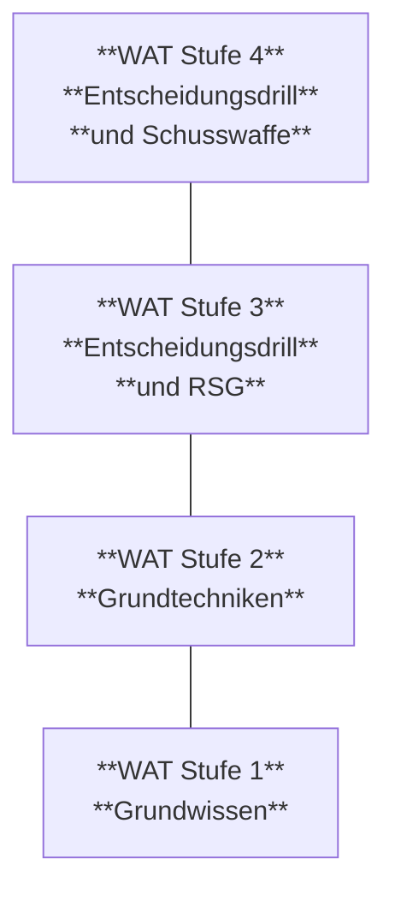

# 10 Wachtdienstbefehl

## 10.1 Grundsätzliches
<sup>1</sup> Der Wachtdienstbefehl ist schriftlich zu erlassen.

<sup>2</sup> Er regelt insbesondere die Organisation der Wache und die Anwendung von möglichen polizeilichen Zwangsmassnahmen nach den Zif 5 und 6.

<sup>3</sup> Er hat ausdrücklich festzuhalten, dass jede Wache mit Schusswaffe bei einem Angriff das Recht hat, in einer den Umständen angemessenen Weise als letztes Mittel in Notwehr oder Notwehrhilfe von der Schusswaffe Gebrauch zu machen (vgl Zif 10.2 Abs. 2 Bst. a Formulierung der Befugnis zum Schusswaffengebrauch).

<sup>4</sup> Er ist eng gefasst und lässt den Befehlsempfängern wenig Entschlussfreiheit.

<sup>5</sup> Er ist minimal INTERN zu klassifizieren.

23

Reglement 51.301 d Wachtdienst aller Truppen

## 10.2 Formulierung der Befugnis zum Schusswaffengebrauch

<sup>1</sup> Der Kommandant, der oder die Kommandantin, die den Wachtdienstbefehl erlässt, legt darin die Befugnis zum Schusswaffengebrauch fest. Er hält sich dabei an die Formulierungen von Zif 6.1 Abs. 2 und beschränkt sie in der Regel auf einzelne oder mehrere der genannten Fälle.

<sup>2</sup> Mögliche Formulierungen können im Ausbildungsdienst beispielsweise lauten:

> Wenn andere verfügbare Mittel nicht ausreichen, ist als letztes Mittel in folgenden Fällen in einer den Umständen angemessenen Weise von der Schusswaffe Gebrauch zu machen:
>
> a. wenn die Wache oder andere Personen mit einem Angriff unmittelbar bedroht oder angegriffen werden (Notwehr / Notwehrhilfe);
> b. wenn die widerrechtliche Wegnahme von Material<sup>6</sup>, das eine schwere Gefahr für die Allgemeinheit bilden kann, verhindert werden muss;
> c. wenn Personen, welche ein schweres Verbrechen oder ein schweres Vergehen gegen Leib und Leben von Angehörigen der Armee begangen haben oder eines solchen dringend verdächtigt sind, sich der Festnahme oder einer bereits vollzogenen Verhaftung durch Flucht zu entziehen versuchen (so lange sie von der Wache nach der Straftat unmittelbar verfolgt werden).

## 10.3 Hinweise zum Inhalt

<sup>1</sup> Die Bedrohung, der sich eine Wache allenfalls gegenübersieht, ist in der Orientierung des Wachtdienstbefehls festzuhalten.

<sup>2</sup> Der Wachtdienstbefehl hat neben den einzelnen Wachen auch den Wachtkommandanten oder die Wachtkommandantin, seinen oder ihren Stellvertreter, seine oder ihre Stellvertreterin, das Pikett sowie einen allfälligen Wachtoffizier oder eine allfällige Wachtoffizierin einzuschliessen.

<sup>3</sup> Zusätzlich ist im Wachtdienstbefehl festzuhalten, dass:

a. sämtliche Umgangsformen wie Besitz, Konsum und Handel von und mit Drogen gemäss den einschlägigen Bestimmungen der Betäubungsmittelgesetzgebung verboten sind; die 90.115 "Weisungen zum Umgang mit legalen Hanfprodukten im Militärdienst" des CdA zu beachten sind und die Nichtbefolgung dieser Vorschriften zu entsprechenden Konsequenzen führt (administrative Massnahmen, Disziplinarstrafverfahren, Strafverfahren);
b. bei Verbindungen, die mit Funkgeräten ohne Sprachverschlüsselung sichergestellt werden, zwingend die Verschleierung nach TOZZA (Truppen, Orte, Zeiten, Zahlen, Aufträge) zu verlangen ist;
c. der Kommandant oder die Kommandantin mit periodischen und ausserordentlichen Meldungen über den Verlauf der Wache zu orientieren ist;
d. die Wache für den Unterhalt der Warnplakate, Beleuchtungen und Absperrungen sowie für die Einsatzbereitschaft des zugewiesenen Materials verantwortlich ist.

<sup>4</sup> Was in den Grundlagen zum Wachtdienst steht (MG, VPA, DRA), soll im Wachtdienstbefehl nicht abgeschrieben werden. Der Kommandant oder die Kommandantin sorgt aber

***

<sup>6</sup> Es ist in Klammer aufzuführen, welches Material im konkreten Einzelfall gemeint ist (vgl Zif 6.7).

24

Reglement 51.301 d
Wachtdienst aller Truppen

dafür, dass der Wache alle für ihre Aufgabe erforderlichen Unterlagen im Wachtlokal zur Verfügung stehen, insbesondere:

a. Vorschriften wie VPA, DRA, Reglement 51.301 "Wachtdienst aller Truppen (WAT)", Reglement 51.019 "Grundschulung 17 (GS 17)", Reglement 51.047 "Zwangsmittel unterhalb des Schusswaffengebrauchs";
b. truppeneigene Dokumente wie Verschleierungs-, Unterkunfts-, Standort-, Telefonlisten, Alarmbefehle, Plan der Örtlichkeiten;
c. Form 06.070 dfi "Gefechtsjournal", Form 06.005 dfi "Melde- und Telegrammformulare", Form 51.301.04 d "Protokoll Beschlagnahme / Festnahme", Form 06.071 dfi "Ablösungsliste".

## 10.4 Kenntnis des Wachtdienstbefehls

<sup>1</sup> Die Angehörigen der Wache sind vor Antritt des Wachtdienstes über den Wachtdienstbefehl und die Bedrohung zu instruieren.

<sup>2</sup> *Jeder und jede Angehörige der Wache ist verpflichtet, den Wachtdienstbefehl zu kennen und zu befolgen. Bei Unklarheiten verlangt er oder sie vor dem Antritt zum Dienst die nötigen Erläuterungen (vgl Zif 75 Abs. 3 DRA).*

## 10.5 Wachtvergehen

Der Truppe ist in Erinnerung zu rufen, dass Wachtverbrechen oder -vergehen vom Militärstrafgesetz (vgl Art. 76 MStG) erfasst werden und nur in leichten Fällen eine disziplinarische Bestrafung möglich ist.

25

Reglement 51.301 d
Wachtdienst aller Truppen

# Anhang 1
## Vier-Stufen-Modell – eine tabellarische Übersicht

<table>
  <thead>
    <tr>
        <th></th>
        <th>WAT Stufe 1</th>
        <th>WAT Stufe 2</th>
        <th>WAT Stufe 3</th>
        <th>WAT Stufe 4</th>
    </tr>
  </thead>
  <tbody>
    <tr>
        <td>Endzustand der Ausbildung</td>
        <td>Der/die AdA ist berechtigt, **unbewaffnet** als Parkwache, Schiesswache, im Logendienst und den militärischen **Auskunftsdienst** eingesetzt zu werden.</td>
        <td>Der/die AdA ist berechtigt, **unbewaffnet** zusätzlich zur Stufe 1 als **Zufahrts- / Zutrittskontrolle**, zur Überwachung von Perimetern (**Patrouille**) und für dienstliche Kontrollaufgaben im Ausgang / Einrücken / Abtreten eingesetzt zu werden.</td>
        <td>Der/die AdA ist berechtigt, zusätzlich zur Stufe 2 vom **Reizstoffsprühgerät (RSG) Gebrauch zu machen.**</td>
        <td>Der/die AdA ist berechtigt, zusätzlich zur Stufe 3 von der **Schusswaffe Gebrauch zu machen.**</td>
    </tr>
    <tr>
        <td>Lerninhalte (Übersicht)</td>
        <td>• Allgemeine Kenntnisse über den Wachtdienst (Rechtsgrundlagen, Bedrohung, VPA)<br/>• Kommunizieren<br/>• Kommunikationsmittel</td>
        <td>Zusätzlich zur Stufe 1:<br/>• Zwangsmittel Modul A &amp; B<br/>• Personenkontrolle<br/>• Fahrzeugkontrolle<br/>• Patrouillentätigkeiten<br/>• Festnahme<br/>• Übermittlungsmittel<br/>• Verhältnismässigkeit</td>
        <td>Zusätzlich zur Stufe 2:<br/>• Zwangsmittel Modul C<br/>• Entscheidungsdrill</td>
        <td>Zusätzlich zur Stufe 3:<br/>• Persönlich Waffe Modul A &amp; B<br/>• Wachtdienstschiessen</td>
    </tr>
    <tr>
        <td colspan="5">**Vor dem ersten Einsatz muss der/die AdA in jedem Fall anhand des gültigen Wachtdienstbefehls am konkreten Dispositiv ausgebildet werden.**</td>
    </tr>
    <tr>
        <td>Polizeibefugnisse</td>
        <td>• Wegweisung und Fernhaltung<br/>• Anhaltung und Identitätsfeststellung<br/>• Befragung</td>
        <td>Zusätzlich zur Stufe 1:<br/>• Durchsuchen von Personen<br/>• Kontrolle von Sachen<br/>• Beschlagnahme<br/>• Vorläufige Festnahme<br/>• Anwendung von körperlichem Zwang (ohne RSG und ohne Schusswaffe)</td>
        <td>Zusätzlich zur Stufe 2:<br/>• Anwendung von körperlichem Zwang (mit RSG ohne Schusswaffe)</td>
        <td>Zusätzlich zur Stufe 3:<br/>• Anwendung von körperlichem Zwang (mit RSG und Schusswaffe)</td>
    </tr>
    <tr>
        <td>Ausbildungskontrollen</td>
        <td>Im GAD:<br/>• LMS (WAT Stufe 1)</td>
        <td>Im GAD:<br/>• LMS (WAT Stufe 2)<br/>• Technikprüfungen Zwangsmittel Modul A &amp; B</td>
        <td>Im GAD:<br/>• LMS (WAT Stufe 3)<br/>• Praktischer Test Entscheidungsdrill (Anhang 5)</td>
        <td>Im GAD:<br/>• LMS (WAT Stufe 4)<br/>• Form 51.301.02 dfi "Theoretische Prüfung Wachtdienst" (Anhang 7)<br/>• Schiessprogramm Wachtdienst (Anhang 3 &amp; 4)<br/>• Praktischer Test Entscheidungsdrill (Anhang 5)</td>
    </tr>
    <tr>
        <td>Wachtdienst im FDT</td>
        <td colspan="4">**Im Rahmen der Erstellung der Grundbereitschaft sind die Lerninhalte der jeweiligen Stufen in kombinierter Form vor dem Wachtdienstantritt zu überprüfen. Eine Ausbildungskontrolle ist darüber zu führen und bis Ende FDT aufzubewahren.**</td>
    </tr>
  </tbody>
</table>

26

Reglement 51.301 d
Wachtdienst aller Truppen

# Anhang 2
## Lerninhalte und Stoffpläne zur Ausbildung Wachtdienst aller Truppen

Die Ausbildung des Wachtdienstes aller Truppen ist in vier Stufen aufgeteilt.

Diese Ausbildung kann je nach Funktion der AdA als Ganzes oder stufenweise in Teilen absolviert werden.

Das Erlangen der WAT Stufe 1 ist Pflichtteil der Allgemeinen Grundausbildung (AGA).

Nach Abschluss der funktionsbezogenen Grundausbildung (FGA) sind grundsätzlich alle AdA zum Leisten des Wachtdienstes mit Schusswaffe befähigt.



27

Reglement 51.301 d
Wachtdienst aller Truppen

## WAT Stufe 1: Grundwissen

<table>
  <tbody>
    <tr>
        <th>Block</th>
        <th>Thema</th>
        <th>Lerninhalte</th>
        <th>Grundlagen</th>
        <th>Dauer (Richtwert)</th>
    </tr>
    <tr>
        <td>1.1</td>
        <td>Allgemeine Theorie Wachtdienst</td>
        <td>• Allgemeine Kenntnisse über den Wachtdienst (Rechtsgrundlagen, Bedrohung, VPA, Rechte und Pflichten)<br/>• Polizeibefugnisse der Truppe und Wachtdienst</td>
        <td>• Form 51.301.01 d "Allgemeine Theorie Wachtdienst aller Truppen"<br/>• Regl 51.002 d "Dienstreglement der Armee", Kap 7, Kap 8 (insbesondere Zif 77-82, 84, 92-109), Kap 9<br/>• Regl 51.019 d "Grundschulung 17", Kap 2</td>
        <td>45 min*</td>
    </tr>
    <tr>
        <td>1.2</td>
        <td>Kommunikation</td>
        <td>• Meldeschema (AEIOU)<br/>• Mündliches Melden<br/>• Schriftliches Melden<br/>• Verbale Kommunikation<br/>• Nonverbale Kommunikation</td>
        <td>• Regl 51.019 d "Grundschulung 17", Kap 5.2.1<br/>• Form 06.005 dfi "Melde- und Telegrammformulare"<br/>• Form 38.006 dfi "Meldezettel"<br/>• Regl 51.047 d "Zwangsmittel unterhalb des Schusswaffengebrauchs", Kap 2</td>
        <td>60 min*/***</td>
    </tr>
    <tr>
        <td>1.3</td>
        <td>Kommunikationsmittel</td>
        <td></td>
        <td>• Die Kommunikationsmittel basieren auf der jeweiligen Ausrüstung der Einheit. Je nach Dispositiv können sie unterschiedlich sein.</td>
        <td>15 min***</td>
    </tr>
  </tbody>
</table>

## WAT Stufe 2: Grundtechniken

<table>
  <tbody>
    <tr>
        <th>Block</th>
        <th>Thema</th>
        <th>Lerninhalte</th>
        <th>Grundlagen</th>
        <th>Dauer (Richtwert)</th>
    </tr>
    <tr>
        <td>2.1</td>
        <td>Zwangsmittel Modul A</td>
        <td>Körperzwang<br/>• Einführung Zwangsmittel / Formen der Zwangsanwendung<br/>• Sicherheitserziehung und Basisausbildung<br/>• Selbstschutz<br/>• Abwehr von Blöcken<br/>• Aktive Verteidigungstechniken<br/>• Überwältigen</td>
        <td>• Regl 51.047 d "Zwangsmittel unterhalb des Schusswaffengebrauchs", Kap 3<br/>• Regl 51.047.02 d "Anhang 2: Stoffplan Grundausbildung Zwangsmittel (AGA)"<br/>• Arbeitshilfe 51.047.04 dfi "Formen der Zwangsanwendung"</td>
        <td>5 - 11 h**</td>
    </tr>
    <tr>
        <td>2.2</td>
        <td>Zwangsmittel Modul B</td>
        <td>Schliesstechnik<br/>• Sicherheitserziehung und Basisausbildung<br/>• Technik liegend<br/>• Technik stehend</td>
        <td>• Regl 51.019 d "Grundschulung 17" (Zif 188-193, exkl 189 und 190)<br/>• Regl 51.047 d "Zwangsmittel unterhalb des Schusswaffengebrauchs", Kap 4<br/>• Regl 51.047.02 d "Anhang 2: Stoffplan Grundausbildung Zwangsmittel (AGA)"</td>
        <td>2.5 - 4.5 h**</td>
    </tr>
    <tr>
        <td>2.3</td>
        <td>Übermittlungsmittel (nach Bedarf)</td>
        <td>• SE-X35<br/>• Feldtelefon 96</td>
        <td>• Regl 58.406 dfi "Sprechregeln für Funk und Telefon"<br/>• Dok 58.440.01 dfi "Funksystem SE-135 (Checkliste)"<br/>• Dok 58.430.01 dfi "Funksystem SE-235 (Checkliste)"<br/>• Regl 58.740 d "Feldtelefon 96"</td>
        <td>1 h***<br/>(nur Grundkenntnisse Uem D bis zur EGA)</td>
    </tr>
    <tr>
        <td>2.4</td>
        <td>Personen- und Fahrzeugkontrolle, Festnahme</td>
        <td>• Routinedurchsuchung<br/>• Festnahmetechniken<br/>• Fahrzeugdurchsuchung</td>
        <td>• Regl 51.019 d "Grundschulung 17", Kap 7.4.3 – 7.4.4</td>
        <td>3 h***</td>
    </tr>
    <tr>
        <td>2.5</td>
        <td>Patrouillentätigkeit</td>
        <td>• Patrouillentechnik<br/>• Patrouillenstrecke</td>
        <td>• Regl 51.019 d "Grundschulung 17", Kap 7.4.5</td>
        <td>1 h***</td>
    </tr>
  </tbody>
</table>

\* Gemäss Stoffprogramm AGA des Kdo Ausb;
\*\* Gemäss entsprechendem Reglement;
\*\*\* Zusätzliche Ausbildungszeit spezifisch für die Wachtdienstausbildung.

28

Reglement 51.301 d
Wachtdienst aller Truppen

## WAT Stufe 3: Entscheidungsdrill und RSG

<table>
  <thead>
    <tr>
        <th>Block</th>
        <th>Thema</th>
        <th>Lerninhalte</th>
        <th>Grundlagen</th>
        <th>Dauer (Richtwert)</th>
    </tr>
  </thead>
  <tbody>
    <tr>
        <td>3.1</td>
        <td>Zwangsmittel<br/>Modul C</td>
        <td>RSG<br/>• Sicherheitserziehung und Basisausbildung<br/>• Handhabung des RSG</td>
        <td>• Regl 51.047 d "Zwangsmittel unterhalb des Schusswaffengebrauchs", Kap 5<br/>• Regl 51.047.02 d "Anhang 2: Stoffplan Grundausbildung Zwangsmittel (AGA)"</td>
        <td>2 - 4.5 h**</td>
    </tr>
    <tr>
        <td>3.2</td>
        <td>Entscheidungsdrill<br/>(exkl Szenarien mit Waffengebrauch / sofern keine Weiterausbildung zu der Stufe 4 vorgesehen ist)</td>
        <td>• Fallbeispiele mit verschiedenen Aggressionsstufen</td>
        <td>• Regl 51.301 d "Wachtdienst aller Truppen (WAT)", Anhang 5</td>
        <td>(2 h***)</td>
    </tr>
  </tbody>
</table>

## WAT Stufe 4: Entscheidungsdrill und Schusswaffe

<table>
  <thead>
    <tr>
        <th>Block</th>
        <th>Thema</th>
        <th>Lerninhalte</th>
        <th>Grundlagen</th>
        <th>Dauer (Richtwert)</th>
    </tr>
  </thead>
  <tbody>
    <tr>
        <td>4.1</td>
        <td>Schusswaffe<br/>(Stgw / Pist)</td>
        <td>Modul A<br/>• Grundkönnen</td>
        <td>• Regl 53.096.05 d "Anhang 4: Stoffplan Grundausbildung Sturmgewehr 90"<br/>oder<br/>• Regl 53.103.01 d "Anhang 3: Stoffplan Grundausbildung Pistole"</td>
        <td>11.5 h*/**<br/><br/>oder<br/>4 h*/**</td>
    </tr>
    <tr>
        <td>4.2</td>
        <td>Schusswaffe<br/>(Stgw / Pist)</td>
        <td>Modul B<br/>• Schiessen innerhalb der Gesprächsdistanz</td>
        <td>• Regl 53.096.05 d "Anhang 4: Stoffplan Grundausbildung Sturmgewehr 90"<br/>oder<br/>• Regl 53.103.01 d "Anhang 3: Stoffplan Grundausbildung Pistole"</td>
        <td>4 h*/**<br/><br/>oder<br/>4 h*/**</td>
    </tr>
    <tr>
        <td>4.3</td>
        <td>Schiessprogramm Wachtdienst</td>
        <td></td>
        <td>Stgw:<br/>• Regl 51.301 d "WAT", Anhang 3<br/>oder<br/>Pist:<br/>• Regl 51.301 d "WAT", Anhang 4</td>
        <td>80 min***</td>
    </tr>
    <tr>
        <td>4.4</td>
        <td>Theoretische Prüfung Wachtdienst</td>
        <td></td>
        <td>• Form 51.301.02 dfi "Theoretische Prüfung Wachtdienst" im Regl 51.301 d "WAT", Anhang 7<br/>• LMS: Theoretische Prüfung Wachtdienst</td>
        <td>0.5 h***</td>
    </tr>
    <tr>
        <td>4.5</td>
        <td>Entscheidungsdrill<br/>(inkl Szenarien mit Waffengebrauch)</td>
        <td>• Fallbeispiele mit verschiedenen Aggressionsstufen</td>
        <td>• Regl 51.301 d "WAT", Anhang 5</td>
        <td>(2 h***)</td>
    </tr>
  </tbody>
</table>

\* Gemäss Stoffprogramm AGA des Kdo Ausb;
\*\* Gemäss entsprechendem Reglement;
\*\*\* Zusätzliche Ausbildungszeit spezifisch für die Wachtdienstausbildung.

29

Reglement 51.301 d
Wachtdienst aller Truppen

# Anhang 3
## Modul Wachtdienstschiessen Sturmgewehr

<table>
  <thead>
    <tr>
        <th>Lektion</th>
        <th>Thema</th>
        <th>Ziel</th>
        <th>Zeit</th>
        <th>Pat</th>
    </tr>
  </thead>
  <tbody>
    <tr>
        <td>WD-1</td>
        <td>**Zeit und Distanz**<br/>Zeit für folgende Abläufe messen:<br/>- Waffen hintergehängt oder Patrouillenstellung / Ladebewegung / Warnruf / Kontaktstellung / Feuer.</td>
        <td>Notwendigkeit aufzeigen von:<br/>- Mentale Vorbereitung;<br/>- Waffeneinsatzbereitschaft (Patrouille-, Einsatz- oder Wartestellung);<br/>- Erwägung Schusswaffengebrauch = Ladebewegung.</td>
        <td>10'</td>
        <td>-</td>
    </tr>
    <tr>
        <td>WD-2</td>
        <td>**Schiessen mit Warnruf**<br/>*Ausgangslage: Unterladen / Patrouillenstellung oder Wartestellung.*<br/>Der **Warnruf** ist vor jeder Übung zu machen.<br/>- 7 m, 1 bis 3 Schuss, Scheibe T, OZL, stehend, 100% Treffer X Zone;<br/>- 10 m, 1 bis 3 Schuss, Scheibe T, OZL, stehend, 100% Treffer X Zone;<br/>- 15 m, 1 bis 3 Schuss, Scheibe T, OZL, stehend, 100% Treffer X Zone.</td>
        <td></td>
        <td>10'</td>
        <td>9</td>
    </tr>
    <tr>
        <td>WD-3</td>
        <td>**Schiessen mit Warnschuss (ab Deckung)**<br/>*Ausgangslage: Unterladen / Patrouillenstellung oder Wartestellung.*<br/>Der **Warnschuss** ist vor jeder Übung zu machen.<br/>- Warnschuss in sichere Zone (gekennzeichnete Scheibe "Blindscheibe"), 1 x 1 Schuss, OZL;<br/>- 15 m, 1 bis 3 Schuss, Scheibe T, OZL, rechte Seite der Deckung, 100% Treffer X Zone;<br/>- Warnschuss in sichere Zone (gekennzeichnete Scheibe "Blindscheibe"), 1 x 1 Schuss, OZL;<br/>- 15 m, 1 bis 3 Schuss, Scheibe T, OZL, linke Seite der Deckung, 100% Treffer X Zone.</td>
        <td></td>
        <td>15'</td>
        <td>8</td>
    </tr>
    <tr>
        <td>WD-4</td>
        <td>**Notfalldrill, Misserfolgsdrill**<br/>*Ausgangslage: Geladen, Kontaktstellung.*<br/>- 0,5 m vor der Scheibe;<br/>- Zurück bis auf 2-4 m, Schusslinie verlassen, 1 bis 3 Schuss + 2 x Misserfolgsdrill auf Animation, Scheibe T, OZL, 100% Treffer X/Y Zone.</td>
        <td></td>
        <td>15'</td>
        <td>5</td>
    </tr>
    <tr>
        <td>WD-5</td>
        <td>**Entscheiden**<br/>- Kommunizieren, bewegen, schiessen (KBS);<br/>- Bedrohung, Distanz, Zeit (BDZ);<br/>- Distanz, Hindernisse, Deckung, Überraschung (DIHDU);<br/>- Integration Warnruf;<br/>- Integration Ladebewegung;<br/>- Integration Warnschuss;<br/>- Integration Festnahme-Drill;<br/>- Integration Fluchtunfähigkeit oder Angriffsunfähigkeit;<br/>- Integration Mark RSG.</td>
        <td>*Ausgangslage:*<br/>Unterladen, Patrouillenstellung:<br/>- Der/die Ausbilder/in stellt 3 Scheiben T mit Beinen im Abstand von je 2-3 m auf und klebt auf Nr 1 eine Hand, auf Nr 2 ein Messer, auf Nr 3 eine Feuerwaffe. Weiter stellt er/sie eine "Blindscheibe" für den Warnschuss und eine Deckung auf ca. 15 m auf.<br/>- Der/die AdA beginnt eine Patrouille von 30 m.<br/>- Der/die Ausbilder/in nennt eine Nummer und der/die AdA muss auf den Reiz reagieren.</td>
        <td>30'</td>
        <td>0-5</td>
    </tr>
    <tr>
        <td>Total</td>
        <td></td>
        <td></td>
        <td>80'</td>
        <td>27</td>
    </tr>
  </tbody>
</table>

30

Reglement 51.301 d Wachtdienst aller Truppen

# Anhang 4
## Modul Wachtdienstschiessen Pistole

<table>
  <thead>
    <tr>
        <th>Lektion</th>
        <th>Thema</th>
        <th>Ziel</th>
        <th>Zeit</th>
        <th>Pat</th>
    </tr>
  </thead>
  <tbody>
    <tr>
        <td>WD-1</td>
        <td>**Zeit und Distanz**<br/>Zeit für folgende Abläufe messen:<br/>- Bereitschaftsstellung, Wartestellung / Ladebewegung / Warnruf / Kontaktstellung / Feuer.</td>
        <td>Notwendigkeit aufzeigen von:<br/>- Mentale Vorbereitung;<br/>- Waffeneinsatzbereitschaft (Grund-, Einsatz- oder Wartestellung);<br/>- Erwägung Schusswaffengebrauch = Ladebewegung.</td>
        <td>10'</td>
        <td>-</td>
    </tr>
    <tr>
        <td>WD-2</td>
        <td>**Schiessen mit Warnruf**<br/>*Ausgangslage: Unterladen / Einsatzstellung oder Wartestellung*<br/>Der **Warnruf** ist vor jeder Übung zu machen.<br/>- 5 m, 1 bis 3 Schuss, Scheibe T, OZL, stehend, 100% Treffer X Zone;<br/>- 7 m, 1 bis 3 Schuss, Scheibe T, OZL, stehend, 100% Treffer X Zone;<br/>- 10 m, 1 bis 3 Schuss, Scheibe T, OZL, stehend, 100% Treffer X Zone.</td>
        <td></td>
        <td>10'</td>
        <td>9</td>
    </tr>
    <tr>
        <td>WD-3</td>
        <td>**Schiessen mit Warnschuss (ab Deckung)**<br/>*Ausgangslage: Unterladen, Grundstellung*<br/>Der **Warnschuss** ist vor jeder Übung zu machen.<br/>- Warnschuss in sichere Zone (gekennzeichnete Scheibe "Blindscheibe"), 1 x 1 Schuss, OZL;<br/>- 15 m, 1 bis 3 Schuss, Scheibe T, OZL, rechte Seite der Deckung, 100% Treffer X Zone;<br/>- Warnschuss in sichere Zone (gekennzeichnete Scheibe "Blindscheibe"), 1 x 1 Schuss, OZL;<br/>- 15 m, 1 bis 3 Schuss, Scheibe T, OZL, linke Seite der Deckung, 100% Treffer X Zone.</td>
        <td></td>
        <td>15'</td>
        <td>8</td>
    </tr>
    <tr>
        <td>WD-4</td>
        <td>**Notfalldrill, Misserfolgsdrill**<br/>*Ausgangslage: Geladen, Kontaktstellung.*<br/>- 0,5 m vor der Scheibe;<br/>- Zurück bis auf 2-4 m, Schusslinie verlassen, 1 bis 3 Schuss + 2 x Misserfolgsdrill auf Animation, Scheibe T, OZL, 100 % Treffer X/Y Zone.</td>
        <td></td>
        <td>15'</td>
        <td>5</td>
    </tr>
    <tr>
        <td>WD-5</td>
        <td>**Entscheiden**<br/>- Kommunizieren, bewegen, schiessen (KBS);<br/>- Bedrohung, Distanz, Zeit (BDZ);<br/>- Distanz, Hindernisse, Deckung, Überraschung (DIHDU);<br/>- Integration Warnruf;<br/>- Integration Ladebewegung;<br/>- Integration Warnschuss;<br/>- Integration Festnahme-Drill;<br/>- Integration Fluchtunfähigkeit oder Angriffsunfähigkeit;<br/>- Integration Mark RSG.</td>
        <td>*Ausgangslage:*<br/>Unterladen, Grund- oder Bereitschaftsstellung:<br/>- Der/die Ausbilder/in stellt 3 Scheiben T mit Beinen im Abstand von je 2-3 m auf und klebt auf Nr 1 eine Hand, auf N. 2 ein Messer, auf N. 3 eine Feuerwaffe. Weiter stellt er/sie eine "Blindscheibe" für den Warnschuss und eine Deckung auf ca. 15 m auf.<br/>- Der/die AdA beginnt eine Patrouille von 30 m.<br/>- Der/die Ausbilder/in nennt eine Nummer und der/die AdA muss auf den Reiz reagieren.</td>
        <td>30'</td>
        <td>0-5</td>
    </tr>
    <tr>
        <td>Total</td>
        <td></td>
        <td></td>
        <td>80'</td>
        <td>27</td>
    </tr>
  </tbody>
</table>

31

Reglement 51.301 d Wachtdienst aller Truppen


32

Reglement 51.301 d Wachtdienst aller Truppen

```description
A large white number "2" on a solid black rectangular background is positioned on the left side of the page. To its right, there is a slanted image of a black combat knife or bayonet with a textured grip and a crossguard.
```


33

Reglement 51.301 d Wachtdienst aller Truppen


34

Reglement 51.301 d
Wachtdienst aller Truppen

# Anhang 5
## Entscheidungsdrill
Ziel des Entscheidungsdrills ist die Überprüfung der verhältnismässigen Reaktion der AdA in verschiedenen Szenarien in unterschiedlichen Aggressionsstufen. Dabei geht es um die Einzel- wie auch die Binomausbildung.

### Ablauf
Nachdem der Ausbilder oder die Ausbilderin die Schusswaffen der Rollenspieler und Rollenspielerinnen sowie der beübten AdA reglementarisch neutralisiert hat, kann der Entscheidungsdrill geübt werden.

Der oder die AdA beginnt am Rand des Quadrats (Grösse 3 m x 3 m) und dreht sich um. Der Ausbilder oder die Ausbilderin gibt das Szenario dem Rollenspieler oder der Rollenspielerin vor. Wenn der oder die AdA und der Rollenspieler oder die Rollenspielerin bereit ist, löst der Ausbilder oder die Ausbilderin mit dem Ruf "GO" das Szenario aus. Der oder die AdA dreht sich zur Situation um. Wenn der oder die AdA den Zwangsmittelentscheid getroffen hat, bevor es zum physischen Kontakt kommt, stoppt der Ausbilder oder die Ausbilderin mit "HALT" und bespricht den oder die AdA im KBS-Prinzip.

Die Aggressionsstufen sind nicht zwingend aufbauend (von tiefer zu hoher Intensität) zu absolvieren. Der Lerneffekt (in der Festigungs- und Anwendungsstufe) ist höher, wenn die verschiedenen Aggressionsstufen nicht nacheinander behandelt werden (Beispiel: 1. Durchlauf "verbal / statisch", 2. Durchlauf "Hieb / Stichwaffe", 3. Durchlauf "verbal / beweglich", 4. Durchlauf "Schusswaffe" usw). Wenn die Kommunikation des oder der AdA nicht überzeugend und / oder der Einsatz der Zwangsmittel nicht angemessen ist, so ist das Szenario um drei Sekunden zu verlängern.

35

Reglement 51.301 d Wachtdienst aller Truppen

<table>
  <thead>
    <tr>
        <th>Aggressionsstufen</th>
        <th colspan="2">Ausgangslage<br/>(Rollenspieler/in)</th>
        <th>Verhalten<br/>(Rollenspieler/in)</th>
        <th>Ausbilder/in<br/>Tätigkeit</th>
        <th></th>
    </tr>
  </thead>
  <tbody>
    <tr>
        <td rowspan="6">bis WAT Stufe 3</td>
        <td>Verbal<br/>statisch</td>
        <td>Der/die Rollenspieler/in steht 50 cm ausserhalb des Quadrates. Sobald sich der, die AdA umdreht, zählt er, sie leise bis 3. Dann beleidigt er, sie den, die AdA.</td>
        <td>* Hände sichtbar;<br/>* Statisch.</td>
        <td rowspan="6">Sofortiger Abbruch bevor es zum physischen Kontakt kommt.<br/>Beurteilung des Handelns auf Basis der Reglemente.</td>
        <td></td>
    </tr>
    <tr>
        <td>Verbal<br/>beweglich</td>
        <td>Der/die Rollenspieler/in steht 50 cm vor dem Quadrat. Sobald sich der, die AdA umdreht, zählt er, sie leise bis 3. Anschl beleidigt er, sie den, die AdA und bewegt sich auf ihn zu.</td>
        <td>* Hände sichtbar;<br/>* Langsam sich seitlich bewegen.</td>
        <td></td>
    </tr>
    <tr>
        <td rowspan="4">bis WAT Stufe 4</td>
        <td>Versuch einer<br/>Umklammerung</td>
        <td>Der/die Rollenspieler/in steht auf der Linie des Quadrates. Sobald sich der, die AdA umdreht, zählt er, sie langsam bis 3 und geht auf den, die AdA zu, um ihn, sie an der Uniform zu packen.</td>
        <td>* Keine Reaktion auf die Anweisung des, der AdA;<br/>* Versuchen, den Kragen zu packen.</td>
    </tr>
    <tr>
        <td>Schlagen</td>
        <td>Der/die Rollenspieler/in steht auf der Linie des Quadrates. Sobald sich der, die AdA umdreht, zählt er, sie langsam bis 3 und geht auf ihn, sie zu, um ihn, sie zu schlagen.</td>
        <td>* Keine Reaktion auf die Anweisung des, der AdA;<br/>* Schläge vorwärts.</td>
    </tr>
    <tr>
        <td>Hieb- / Stichwaffen</td>
        <td>Der/die Rollenspieler/in steht 5 Meter hinter der Linie des Quadrates. Sobald sich der, die AdA umdreht, geht er, sie zügig auf diesen, diese zu und bedroht ihn, sie mit der Waffe.</td>
        <td>* Keine Reaktion auf die Anweisung des, der AdA;<br/>* Angriff mit der Waffe auf den, die AdA.</td>
    </tr>
    <tr>
        <td>Schusswaffen</td>
        <td>Der/die Rollenspieler/in steht 5 Meter hinter der Linie des Quadrates. Die Waffe sichtbar in den Händen und der Lauf gegen den Boden gerichtet.</td>
        <td>* Keine Reaktion auf die Anweisung des, der AdA;<br/>* Die Waffe langsam auf den, die AdA richten;<br/>* Feueröffnung simulieren.</td>
    </tr>
  </tbody>
</table>

**Bedingungen:**
- Für das Erreichen der WAT Stufe 3 muss jeder oder jede AdA 3 von 4 ausgewählten Szenarien erfüllen (Szenario ohne Schusswaffengebrauch);
- Für das Erreichen der WAT Stufe 4 muss jeder oder jede AdA 4 von 5 ausgewählten Szenarien erfüllen.

36

Reglement 51.301 d
Wachtdienst aller Truppen

# Anhang 6
## Eskalationsstufen

```description
A graph showing escalation levels. The vertical axis is labeled "Bedrohung" (Threat) ranging from "tief" (low) to "hoch" (high). The horizontal axis is labeled "Reaktion Wache" (Guard Reaction) with four main zones: "Kontakt" (Contact - green background), "Kontrolle" (Control - yellow background), "Zwang" (Coercion - purple background), and "Schiessen" (Shooting - red background). A diagonal line of data points represents the escalation of measures.
```

### Eskalationsstufen Daten
<table>
    <tr>
        <th>Bedrohung / Reaktion</th>
        <th>Maßnahme</th>
        <th>Typ</th>
    </tr>
    <tr>
        <td></td>
        <td></td>
        <td></td>
    </tr>
    <tr>
        <td>hoch / Schiessen</td>
        <td>Waffengebrauch zur Auftragserfüllung</td>
        <td>Mögliches Verhalten</td>
    </tr>
    <tr>
        <td>hoch / Schiessen</td>
        <td>Kopfschuss</td>
        <td>Mögliches Verhalten</td>
    </tr>
    <tr>
        <td>hoch / Schiessen</td>
        <td>Schuss in den Leib</td>
        <td>Mögliches Verhalten</td>
    </tr>
    <tr>
        <td>hoch / Schiessen</td>
        <td>Schuss in die Extremitäten</td>
        <td>Mögliches Verhalten</td>
    </tr>
    <tr>
        <td>hoch / Schiessen</td>
        <td>Warnschuss</td>
        <td>Mögliches Verhalten</td>
    </tr>
    <tr>
        <td>hoch / Schiessen</td>
        <td>"Halt, oder ich schiesse"</td>
        <td>Mögliches Verhalten</td>
    </tr>
    <tr>
        <td>hoch / Schiessen</td>
        <td>**Waffengebrauch**</td>
        <td>Polizeiliche Zwangsmassnahme</td>
    </tr>
    <tr>
        <td>mittel-hoch / Zwang</td>
        <td>Ei Spray</td>
        <td>Mögliches Verhalten</td>
    </tr>
    <tr>
        <td>mittel-hoch / Zwang</td>
        <td>"Halt, oder ich spraye!"</td>
        <td>Mögliches Verhalten</td>
    </tr>
    <tr>
        <td>mittel-hoch / Zwang</td>
        <td>Zwischenwaffeneinsatz</td>
        <td>Mögliches Verhalten</td>
    </tr>
    <tr>
        <td>mittel-hoch / Zwang</td>
        <td>**Anwendung von körperlichem Zwang**</td>
        <td>Polizeiliche Zwangsmassnahme</td>
    </tr>
    <tr>
        <td>mittel / Zwang</td>
        <td>Fesselung</td>
        <td>Mögliches Verhalten</td>
    </tr>
    <tr>
        <td>mittel / Zwang</td>
        <td>**Vorläufige Festnahme**</td>
        <td>Polizeiliche Zwangsmassnahme</td>
    </tr>
    <tr>
        <td>mittel / Kontrolle</td>
        <td>Ist ein Protokoll erstellt worden?</td>
        <td>Mögliches Verhalten</td>
    </tr>
    <tr>
        <td>mittel / Kontrolle</td>
        <td>**Beschlagnahme**</td>
        <td>Polizeiliche Zwangsmassnahme</td>
    </tr>
    <tr>
        <td>mittel / Kontrolle</td>
        <td>Ist der Besitzer anwesend?</td>
        <td>Mögliches Verhalten</td>
    </tr>
    <tr>
        <td>mittel / Kontrolle</td>
        <td>**Kontrolle von Sachen**</td>
        <td>Polizeiliche Zwangsmassnahme</td>
    </tr>
    <tr>
        <td>mittel / Kontrolle</td>
        <td>Durchsuchen von Personen / Fz</td>
        <td>Mögliches Verhalten</td>
    </tr>
    <tr>
        <td>tief-mittel / Kontrolle</td>
        <td>"Sind Sie mit jemandem verabredet?"</td>
        <td>Mögliches Verhalten</td>
    </tr>
    <tr>
        <td>tief-mittel / Kontrolle</td>
        <td>**Befragung**</td>
        <td>Polizeiliche Zwangsmassnahme</td>
    </tr>
    <tr>
        <td>tief-mittel / Kontrolle</td>
        <td>"Können Sie mir bitte Ihren Ausweis zeigen?"</td>
        <td>Mögliches Verhalten</td>
    </tr>
    <tr>
        <td>tief-mittel / Kontrolle</td>
        <td>**Anhaltung und Identitätsfeststellung**</td>
        <td>Polizeiliche Zwangsmassnahme</td>
    </tr>
    <tr>
        <td>tief / Kontakt</td>
        <td>**Wegweisung und Fernhaltung**</td>
        <td>Polizeiliche Zwangsmassnahme</td>
    </tr>
    <tr>
        <td>tief / Kontakt</td>
        <td>"Guten Tag, wie kann ich ihnen helfen?"</td>
        <td>Mögliches Verhalten</td>
    </tr>
</table>**Reaktion Wache**
Anpassen Stimme / Körperhaltung / Waffentragart / Mitteleinsatz

■ **Polizeiliche Zwangsmassnahme**
● <font color="#4a86e8">Mögliches Verhalten</font>

37

Reglement 51.301 d Wachtdienst aller Truppen

# Anhang 7
## Form 51.301.02 dfi "Theoretische Prüfung Wachtdienst"

*   **Grad / Grade / Grado**:     
*   **Name / Nom / Cognome**:     
*   **Vorname / Prénom / Nome**:     
*   **Einteilung / Incorporation / Incorporazione**:     
*   **Datum / Date / Data**:     

*   Das Reglement 51.301 oder andere Unterlagen dürfen nicht verwendet werden.
*   Die Prüfung gilt als bestanden, wenn alle Fragen richtig beantwortet wurden.
*   Dieses Prüfungsblatt ist bis am Ende des Dienstes aufzubewahren.
*   Il est interdit d'utiliser le règlement 51.301 ou d'autres documents.
*   L'examen est réussi si toutes les réponses sont justes.
*   Cette feuille d'examen doit être conservée jusqu'à la fin du service.
*   Non è permesso utilizzare il regolamento 51.301 o altre documentazioni.
*   L'esame è superato se tutte le risposte sono giuste.
*   Questo foglio d'esame va conservato fino alla fine del servizio.

**Prüfung / Examen / Esame**:
*   bestanden / réussi / superato [ ]
*   nicht bestanden / non réussi / non superato [ ]
*   **Visum / Visa / Visto**: [signature]

<table>
  <thead>
    <tr>
        <th>1</th>
        <th>Nennen Sie die möglichen Gefahren und Bedrohungen im Wachtdienst in Friedenszeiten.<br/>Indiquez les dangers et menaces à prendre en compte dans le cadre du service de garde en temps de paix.<br/>Identificare le possibili pericole e minacce durante il servizio di guardia in tempo di pace.</th>
        <th>richtig<br/>juste<br/>giusto</th>
        <th>falsch<br/>faux<br/>sbagliato</th>
    </tr>
  </thead>
  <tbody>
    <tr>
        <td rowspan="5"></td>
        <td>[ ] Spionage / espionnage / spionaggio</td>
        <td>    </td>
        <td>    </td>
    </tr>
    <tr>
        <td>[ ] Beschimpfungen, Pöbeleien / insultes, provocations / insulti, ingiurie</td>
        <td>    </td>
        <td>    </td>
    </tr>
    <tr>
        <td>[ ] Nichtbeachten von Anweisungen, Missachten von Absperrungen / inobservation d'instructions, franchissement de clôtures / inosservanza di avvertenze, non considerazione di sbarramenti</td>
        <td>    </td>
        <td>    </td>
    </tr>
    <tr>
        <td>[ ] Brand / incendie / incendio</td>
        <td>    </td>
        <td>    </td>
    </tr>
    <tr>
        <td>[ ] Friedlicher Protest / manifestation pacifique / protesta pacifica</td>
        <td>    </td>
        <td>    </td>
    </tr>
    <tr>
        <th>2</th>
        <th>Von wem darf die Wachtmannschaft ausschliesslich Befehle entgegennehmen?<br/>Qui est le seul à pouvoir donner des ordres à l'équipe de garde?<br/>Da chi i militari della guardia possono solo prendere ordini?</th>
        <th>    </th>
        <th>    </th>
    </tr>
    <tr>
        <td rowspan="3"></td>
        <td>[ ] Nur vom Wachtkommandanten/nur von der Wachtkommandantin / le commandant de la garde / solamente dal comandante della guardia</td>
        <td>    </td>
        <td>    </td>
    </tr>
    <tr>
        <td>[ ] Von einem/einer Gradvorgesetzten / un militaire revêtant un grade supérieur / da un superiore di grado</td>
        <td>    </td>
        <td>    </td>
    </tr>
    <tr>
        <td>[ ] Von Drittpersonen / un tiers / da terze persone</td>
        <td>    </td>
        <td>    </td>
    </tr>
    <tr>
        <th>3</th>
        <th>Kreuzen Sie die richtige(n) Lösung(en) an:<br/>Cochez la (les) réponse(s) correcte(s):<br/>Mettere una crocetta in corrispondenza della/e soluzione/i corretta/e:</th>
        <th>    </th>
        <th>    </th>
    </tr>
    <tr>
        <td rowspan="6"></td>
        <td>[ ] Die Schusswaffe muss auf der Wache grundsätzlich in durchgeladenem Zustand mitgetragen werden.<br/>L’arme à feu doit être portée en principe chargée (cartouche chambrée) lors de la garde.<br/>Durante la guardia l'arma da fuoco deve in linea di principio essere portata carica.</td>
        <td>    </td>
        <td>    </td>
    </tr>
    <tr>
        <td>[ ] Die Schusswaffe ist auf der Wache entsichert zu tragen.<br/>L’arme à feu doit être portée désassurée lors de la garde.<br/>Durante la guardia l'arma da fuoco deve in linea di principio essere portata disassicurata.</td>
        <td>    </td>
        <td>    </td>
    </tr>
    <tr>
        <td>[ ] Beim Stgw muss während des Wachtdienstes immer die Seriefeuersperre eingesetzt sein.<br/>L’arrêtoir du tir en rafales doit être toujours engagé sur le F ass lors d'un service de garde.<br/>Durante la guardia il F ass deve essere portato sempre con inserita la piastrina d'arresto del fuoco a raffica.</td>
        <td>    </td>
        <td>    </td>
    </tr>
    <tr>
        <td>[ ] Das Magazin muss im Wachtdienst immer vollständig abgefüllt sein.<br/>Le magasin doit être toujours complètement rempli lors d'un service de garde.<br/>Durante il servizio di guardia il caricatore deve sempre essere completamente pieno.</td>
        <td>    </td>
        <td>    </td>
    </tr>
    <tr>
        <td>[ ] Vor der Rückkehr ins Wachtlokal ist die Schusswaffe auf Befehl und geführt zu entladen. Der/die Wachtkommandant/in oder deren Stellvertreter/in ist für die Entladekontrolle verantwortlich.<br/>Le retrait des cartouches est effectué sur ordre et conduit avant le retour au local de garde. Le commandant de la garde ou son remplaçant est responsable pour le contrôle du retrait des cartouches.<br/>La scarica deve essere ordinata e condotta prima del rientro al locale di guardia. Il comandante di guardia o il suo sostituto è responsabile del controllo della scarica.</td>
        <td>    </td>
        <td>    </td>
    </tr>
    <tr>
        <td>[ ] Ich darf im Wachtdienst eine Waffe ohne Kampfmunition tragen.<br/>J’ai le droit de porter une arme sans munitions de combat lors d'un service de garde.<br/>Durante il servizio di guardia posso portare un'arma senza munizioni da combattimento.</td>
        <td>    </td>
        <td>    </td>
    </tr>
  </tbody>
</table>

38

Reglement 51.301 d Wachtdienst aller Truppen

<table>
  <thead>
    <tr>
        <th>4</th>
        <th colspan="2">Die Wache hat das Recht und die Pflicht, polizeiliche Zwangsmassnahmen zur Wahrung und Herstellung des rechtsmässigen Zustandes anzuwenden. Nennen Sie polizeiliche Zwangsmassnahmen:<br/>La garde a le droit et le devoir de faire usage de mesures policières de contrainte pour le maintien et le rétablissement de l’état de droit. Citez des mesures policières de contrainte:<br/>La guardia ha il diritto e il dovere di adottare misure coercitive di polizia al fine di salvaguardare e ristabilire lo stato legale. Indicare misure coercitive di polizia:</th>
        <th>richtig<br/>juste<br/>giusto</th>
        <th>falsch<br/>faux<br/>sbagliato</th>
        <th></th>
    </tr>
  </thead>
  <tbody>
    <tr>
        <td></td>
        <td colspan="2">[ ] Wegweisung und Fernhaltung, Anhaltung und Identitätsfeststellung / *éloigner et tenir à distance des personnes, arrêter des personnes et contrôler leur identité* / Allontanamento e tenuta a distanza di persone, trattenuta e verifica dell’identità<br/>[ ] Warnung und Ratschlag / *mettre en garde et conseiller* / Avvertimento e consiglio<br/>[ ] Befragung, Durchsuchung / *interroger, fouiller* / Interrogazione e perquisizione<br/>[ ] Beschlagnahme / *procéder à des séquestres* / Sequestro<br/>[ ] Anwendung von körperlichem Zwang / *exercer des contraintes physiques* / Impiego di coercizione fisica</td>
        <td rowspan="2"></td>
        <td rowspan="2"></td>
        <td></td>
    </tr>
    <tr>
        <td>5</td>
        <td colspan="2">Dürfen polizeiliche Zwangsmassnahmen durch die Wache sowohl an Zivil- als auch an Militärpersonen angewendet werden?<br/>La garde est-elle autorisée à faire usage de mesures policières de contrainte tant à l'encontre de civils que de militaires?<br/>La guardia può adottare misure coercitive di polizia sia nei confronti di persone civili che di militari?<br/><br/>[ ] ja / oui / si [ ] nein / non / no</td>
        <td></td>
    </tr>
    <tr>
        <td>6</td>
        <td colspan="2">Kreuzen Sie die richtige(n) Lösung(en) zum Waffengebrauch an:<br/>*Cochez la (les) réponse(s) correcte(s) concernant l’usage de l’arme:*<br/>Mettere una crocetta in corrispondenza della/e soluzione/i corretta/e per quanto riguarda l'uso delle armi:</td>
        <td rowspan="2"></td>
        <td rowspan="2"></td>
        <td></td>
    </tr>
    <tr>
        <td></td>
        <td colspan="2">[ ] Jeder Waffengebrauch muss den Umständen angemessen sein.<br/>*Chaque usage de l’arme doit être proportionné aux circonstances.*<br/>Ogni uso di armi deve essere adeguato alle circostanze.<br/>[ ] Ich setze die Waffe ein, wenn eine andere militärische Person unmittelbar an Leib und Leben bedroht oder angegriffen wird.<br/>*J’utilise l’arme si la vie et l'intégrité corporelle d'un autre militaire sont directement menacées ou que ce dernier est attaqué.*<br/>Ricorro all'uso dell'arma se la vita e l'integrità fisica di un altro militare sono direttamente minacciate oppure se il militare viene aggredito.<br/>[ ] Ich setze die Waffe ein, wenn eine andere zivile Person unmittelbar an Leib und Leben bedroht oder angegriffen wird.<br/>*J’utilise l’arme si la vie et l’intégrité corporelle d’une personne civile sont directement menacées ou que cette dernière est attaquée.*<br/>Ricorro all'uso dell'arma se la vita e l'integrità fisica di una persona civile sono direttamente minacciate, oppure se la persona civile viene aggredita.<br/>[ ] Ich setze die Waffe ein, wenn mich jemand unmittelbar an Leib und Leben bedroht, und ich keine anderen Mittel mehr einsetzen kann.<br/>*J’utilise l’arme si quelqu’un menace directement ma vie et mon intégrité corporelle et que je ne peux pas engager d’autres moyens.*<br/>Ricorro all'uso dell'arma se la mia vita e la mia integrità fisica sono direttamente minacciate e non sono più in grado di ricorrere ad altri mezzi.<br/>[ ] Ich setze die Waffe ein, wenn ich eine flüchtende Person stoppen kann, welche einen militärischen Personenwagen gestohlen hat.<br/>*J'utilise l’arme si je peux stopper une personne en fuite qui a volé une voiture militaire.*<br/>Ricorro all'uso dell'arma se posso bloccare una persona che si dà alla fuga dopo aver rubato un'autovettura militare.</td>
        <td></td>
    </tr>
    <tr>
        <td>7</td>
        <td colspan="2">Welches Dokument regelt den Schusswaffengebrauch für die Wache endgültig?<br/>*Quel document règle définitivement l’usage de l’arme à feu par la garde?*<br/>Quale documento disciplina definitivamente l'uso delle armi da fuoco per la guardia?<br/><br/>[ ] Wachtdienstbefehl / *l'ordre du service de garde* / Ordine per il servizio di guardia<br/>[ ] Die Befehlsausgabe des Wachtkommandanten/der Wachtkommandantin / *La donnée d'ordres du commandant de la garde* / L'impartizione dell'ordine da parte del comandante di guardia<br/>[ ] Dienstreglement der Armee (DRA) / *le règlement de service de l'armée (RSA)* / il regolamento di servizio dell'esercito (RSE)</td>
        <td></td>
        <td></td>
        <td></td>
    </tr>
  </tbody>
</table>

39

Reglement 51.301 d
Wachtdienst aller Truppen

*   **8. Wie muss der Warnruf lauten und in welcher Sprache hat er zu erfolgen? / Comment la sommation doit-elle être formulée, et dans quelle langue? / Quale dev'essere l'intimazione e in che lingua deve essere pronunciata?**
    *   "Halt!" - in der Landessprache des Standortes / "Halte!" - dans la langue nationale du lieu / "Alt!" - nella lingua nazionale del luogo [ ]
    *   "Halt, oder ich schiesse!" oder "Halt, oder ich spraye!" - in der Landessprache des Standortes / "Halte ou je tire!" ou "Halte ou je spraye!" – dans la langue nationale du lieu / "Alt, o sparo" oppure Alt, o uso lo spray" – nella lingua nazionale del luogo [ ]
    *   "Stop, oder ich schiesse!" – in der Landessprache des Standortes / "Stop ou je tire!" – dans la langue nationale du lieu / "Stop, o sparo" – nella lingua nazionale del luogo [ ]
    *   "Achtung, oder ich schiesse!" – in der Landessprache des Standortes / "Attention ou je tire!" – dans la langue nationale du lieu / "Attenzione, o sparo" - nella lingua nazionale del luogo [ ]
    *   **richtig / juste / giusto**:     
    *   **falsch / faux / sbagliato**:     

*   **9. Darf der Wachtdienst mit Schusswaffe ohne Kampfmunition geleistet werden? / Un service de garde peut-il être effectué avec une arme à feu sans munitions de combat? / Può essere svolto il servizio di guardia con un'arma da fuoco senza munizioni da combattimento?**
    *   ja / oui / si [ ]
    *   nein / non / no [ ]
    *   **richtig / juste / giusto**:     
    *   **falsch / faux / sbagliato**:     

*   **10. Wer ist für den Schusswaffengebrauch im Wachtdienst verantwortlich? / Qui est responsable de l’usage de l’arme à feu lors d'un service de garde? / Chi è responsabile per l'uso delle armi da fuoco durante il servizio di guardia?**
    *   Der/die Wachtkommandant/in / le commandant de la garde / il comandante della guardia [ ]
    *   Jeder, jede einzelne AdA / chaque militaire / ogni singolo militare [ ]
    *   Der/die Gruppenführer/in / le chef de groupe / Il capogruppo [ ]
    *   **richtig / juste / giusto**:     
    *   **falsch / faux / sbagliato**:     

*   **11. Wo sind die gefüllten Magazine im Wachtlokal zu deponieren? / Où les magasins remplis doivent-ils être déposés dans le local de garde? / Dove vanno deposti i caricatori pieni nel locale di guardia?**
    *   Auf Mann / sur l'homme / sull'uomo [ ]
    *   Beim Wachtkommandant/bei der Wachtkommandantin / auprès du commandant de la garde / presso il comandante della guardia [ ]
    *   In unmittelbarer Nähe der Schusswaffen / à proximité immédiate des armes à feu / nell'immediata vicinanza delle armi da fuoco [ ]
    *   **richtig / juste / giusto**:     
    *   **falsch / faux / sbagliato**:     

*   **12. Was ist eine Notwehrsituation? / Qu’est-ce qu’une situation de légitime défense? / Che cos'è una situazione di legittima difesa?**
    *   Ich werde durch einen Angriff unmittelbar an Leib und Leben bedroht. / Ma vie et mon intégrité corporelle sont directement menacées par une attaque. / La mia vita e la mia integrità fisica sono direttamente minacciate da un'aggressione. [ ]
    *   Mein/e Kamerad/in wird von einem Angriff unmittelbar an Leib und Leben bedroht. / La vie et l'intégrité corporelle de mon camarade sont directement menacées par une attaque. / La vita e l'integrità fisica del mio camerata sono direttamente minacciate da un'aggressione. [ ]
    *   **richtig / juste / giusto**:     
    *   **falsch / faux / sbagliato**:     

*   **13. Was ist eine Notwehrhilfesituation? / Qu’est-ce que la légitime défense pour autrui? / Che cos'è una situazione di aiuto in caso di legittima difesa?**
    *   Ich werde durch einen Angriff unmittelbar an Leib und Leben bedroht. / Ma vie et mon intégrité corporelle sont directement menacées par une attaque. / La mia vita e la mia integrità fisica sono direttamente minacciate da un'aggressione. [ ]
    *   Mein/e Kamerad/in wird von einem Angriff unmittelbar an Leib und Leben bedroht. / La vie et l‘intégrité corporelle de mon camarade sont directement menacées par une attaque. / La vita e l'integrità fisica del mio camerata sono direttamente minacciate da un'aggressione. [ ]
    *   **richtig / juste / giusto**:     
    *   **falsch / faux / sbagliato**:     

*   **14. Dürfen Sie einen Warnschuss abgeben, wenn Sie damit Dritte gefährden? / Avez-vous le droit de tirer un coup de semonce si vous mettez en danger la vie de tiers en le faisant? / È consentito sparare un colpo d'avvertimento se in tal modo vengono messi in pericolo terzi?**
    *   ja / oui / si [ ]
    *   nein / non / no [ ]
    *   **richtig / juste / giusto**:     
    *   **falsch / faux / sbagliato**:     

*   **15. Wohin zielen Sie bei einer Schussabgabe zur Fluchtverhinderung (der Rücken des Flüchtenden ist dem Schützen/der Schützin zugewandt)? / Que visez-vous si vous tirez pour empêcher la fuite (le fuyard tourne le dos au tireur)? / Dove mira se deve sparare ad una persona per impedirle la fuga (la schiena della persona in fuga è rivolta verso il tiratore)?**
    *   In den Kopf / la tête / alla testa [ ]
    *   Körpermitte / le centre du corps / al centro del corpo [ ]
    *   Auf die Beine / les jambes / alle gambe [ ]
    *   **richtig / juste / giusto**:     
    *   **falsch / faux / sbagliato**:

40

Reglement 51.301 d Wachtdienst aller Truppen

# Anhang 8
# Form 51.301.03 dfi "Theoretische Prüfung Wachtdienst mit Lösungen"

* **Grad / Grade / Grado**:     
* **Name / Nom / Cognome**:     
* **Vorname / Prénom / Nome**:     
* **Einteilung / Incorporation / Incorporazione**:     
* **Datum / Date / Data**:     

- Das Reglement 51.301 oder andere Unterlagen dürfen nicht verwendet werden.
- Die Prüfung gilt als bestanden, wenn alle Fragen richtig beantwortet wurden.
- Dieses Prüfungsblatt ist bis am Ende des Dienstes aufzubewahren.
- Il est interdit d'utiliser le règlement 51.301 ou d'autres documents.
- L'examen est réussi si toutes les réponses sont justes.
- Cette feuille d'examen doit être conservée jusqu'à la fin du service.
- Non è permesso utilizzare il regolamento 51.301 o altre documentazioni.
- L'esame è superato se tutte le risposte sono giuste.
- Questo foglio d'esame va conservato fino alla fine del servizio.

**Prüfung / Examen / Esame**:
- bestanden / réussi / superato [ ]
- nicht bestanden / non réussi / non superato [ ]
- **Visum / Visa / Visto**:     

<table>
  <thead>
    <tr>
        <th>1</th>
        <th>Nennen Sie die möglichen Gefahren und Bedrohungen im Wachtdienst in Friedenszeiten.<br/>Indiquez les dangers et menaces à prendre en compte dans le cadre du service de garde en temps de paix.<br/>Identificare le possibili pericole e minacce durante il servizio di guardia in tempo die pace.</th>
        <th>Zif 1.8</th>
        <th>richtig<br/>juste<br/>giusto</th>
        <th>falsch<br/>faux<br/>sbagliato</th>
    </tr>
  </thead>
  <tbody>
    <tr>
        <td rowspan="5"></td>
        <td>**X Spionage / espionnage / spionaggio**</td>
        <td rowspan="5"></td>
        <td rowspan="5"></td>
        <td rowspan="5"></td>
    </tr>
    <tr>
        <td>**X Beschimpfungen, Pöbeleien / insultes, provocations / insulti, ingiurie**</td>
    </tr>
    <tr>
        <td>**X Nichtbeachten von Anweisungen, Missachten von Absperrungen / inobservation d'instructions, franchissement de clôtures / inosservanza di avvertenze, non considerazione di sbarramenti**</td>
    </tr>
    <tr>
        <td>**X Brand / incendie / incendio**</td>
    </tr>
    <tr>
        <td>Friedlicher Protest / manifestation pacifique / protesta pacifica</td>
    </tr>
    <tr>
        <th>2</th>
        <th>Von wem darf die Wachtmannschaft ausschliesslich Befehle entgegennehmen?<br/>Qui est le seul à pouvoir donner des ordres à l’équipe de garde?<br/>Da chi i militari della guardia possono solo prendere ordini?</th>
        <th>Zif 2.2</th>
        <th rowspan="4"></th>
        <th rowspan="4"></th>
    </tr>
    <tr>
        <td></td>
        <td>**X Nur vom Wachtkommandanten/nur von der Wachtkommandantin / le commandant de la garde / solamente dal comandante della guardia**</td>
        <td></td>
    </tr>
    <tr>
        <td></td>
        <td>Von einem/einer Gradvorgesetzten / un militaire revêtant un grade supérieur / da un superiore di grado [ ]</td>
        <td></td>
    </tr>
    <tr>
        <td></td>
        <td>Von Drittpersonen / un tiers / da terze persone [ ]</td>
        <td></td>
    </tr>
    <tr>
        <th>3</th>
        <th>Kreuzen Sie die richtige(n) Lösung(en) an:<br/>Cochez la (les) réponse(s) correcte(s):<br/>Mettere una crocetta in corrispondenza della/e soluzione/i corretta/e:</th>
        <th>Zif 4.4</th>
        <th rowspan="7"></th>
        <th rowspan="7"></th>
    </tr>
    <tr>
        <td></td>
        <td>Die Schusswaffe muss auf der Wache grundsätzlich in durchgeladenem Zustand mitgetragen werden.<br/>L’arme à feu doit être portée en principe chargée (cartouche chambrée) lors de la garde.<br/>Durante la guardia l'arma da fuoco deve in linea di principio essere portata carica. [ ]</td>
        <td></td>
    </tr>
    <tr>
        <td></td>
        <td>Die Schusswaffe ist auf der Wache entsichert zu tragen.<br/>L’arme à feu doit être portée désassurée lors de la garde.<br/>Durante la guardia l'arma da fuoco deve in linea di principio essere portata disassicurata. [ ]</td>
        <td></td>
    </tr>
    <tr>
        <td></td>
        <td>**X Beim Stgw muss während des Wachtdienstes immer die Seriefeuersperre eingesetzt sein.<br/>L’arrêtoir du tir en rafales doit être toujours engagé sur le F ass lors d'un service de garde.<br/>Durante la guardia il F ass deve essere portato sempre con inserita la piastrina d'arresto del fuoco a raffica.**</td>
        <td></td>
    </tr>
    <tr>
        <td></td>
        <td>**X Das Magazin muss im Wachtdienst immer vollständig abgefüllt sein.<br/>Le magasin doit être toujours complètement rempli lors d'un service de garde.<br/>Durante il servizio di guardia il caricatore deve sempre essere completamente pieno.**</td>
        <td></td>
    </tr>
    <tr>
        <td></td>
        <td>**X Vor der Rückkehr ins Wachtlokal ist die Schusswaffe auf Befehl und geführt zu entladen. Der/ die Wachtkommandant/in oder deren Stellvertreter/in ist für die Entladekontrolle verantwortlich.<br/>Le retrait des cartouches est effectué sur ordre et conduit avant le retour au local de garde. Le commandant de la garde ou son remplaçant est responsable pour le contrôle du retrait des cartouches.<br/>La scarica deve essere ordinata e condotta prima del rientro al locale di guardia. Il comandante di guardia o il suo sostituto è responsabile del controllo della scarica.**</td>
        <td></td>
    </tr>
    <tr>
        <td></td>
        <td>Ich darf im Wachtdienst eine Waffe ohne Kampfmunition tragen.<br/>J’ai le droit de porter une arme sans munitions de combat lors d'un service de garde.<br/>Durante il servizio di guardia posso portare un'arma senza munizioni da combattimento. [ ]</td>
        <td></td>
    </tr>
  </tbody>
</table>

41

Reglement 51.301 d
Wachtdienst aller Truppen

*   **4. Die Wache hat das Recht und die Pflicht, polizeiliche Zwangsmassnahmen zur Wahrung und Herstellung des rechtsmässigen Zustandes anzuwenden. Nennen Sie polizeiliche Zwangsmassnahmen: / La garde a le droit et le devoir de faire usage de mesures policières de contrainte pour le maintien et le rétablissement de l’état de droit. Citez des mesures policières de contrainte: / La guardia ha il diritto e il dovere di adottare misure coercitive di polizia al fine di salvaguardare e ristabilire lo stato legale. Indicare misure coercitive di polizia: (Zif 5.2)**
    *   Wegweisung und Fernhaltung, Anhaltung und Identitätsfeststellung / éloignier et tenir à distance des personnes, arrêter des personnes et contrôler leur identité / Allontanamento e tenuta a distanza di persone, trattenuta e verifica dell’identità [x]
    *   Warnung und Ratschlag / mettre en garde et conseiller / Avvertimento e consiglio [ ]
    *   Befragung, Durchsuchung / interroger, fouiller / Interrogazione e perquisizione [x]
    *   Beschlagnahme / procéder à des séquestres / Sequestro [x]
    *   Anwendung von körperlichem Zwang / exercer des contraintes physiques / Impiego di coercizione fisica [x]

*   **5. Dürfen polizeiliche Zwangsmassnahmen durch die Wache sowohl an Zivil- als auch an Militärpersonen angewendet werden? / La garde est-elle autorisée à faire usage de mesures policières de contrainte tant à l'encontre de civils que de militaires? / La guardia può adottare misure coercitive di polizia sia nei confronti di persone civili che di militari? (Zif 1.4)**
    *   ja / oui / si [x]
    *   nein / non / no [ ]

*   **6. Kreuzen Sie die richtige(n) Lösung(en) zum Waffengebrauch an: / Cochez la (les) réponse(s) correcte(s) concernant l’usage de l’arme: / Mettere una crocetta in corrispondenza della/e soluzione/i corretta/e per quanto riguarda l'uso delle armi: (Zif 6.1)**
    *   Jeder Waffengebrauch muss den Umständen angemessen sein. / Chaque usage de l’arme doit être proportionné aux circonstances. / Ogni uso di armi deve essere adeguato alle circostanze. [x]
    *   Ich setze die Waffe ein, wenn eine andere militärische Person unmittelbar an Leib und Leben bedroht oder angegriffen wird. / J’utilise l’arme si la vie et l'intégrité corporelle d'un autre militaire sont directement menacées ou que ce dernier est attaqué. / Ricorro all'uso dell'arma se la vita e l'integrità fisica di un altro militare sono direttamente minacciate oppure se il militare viene aggredito. [x]
    *   Ich setze die Waffe ein, wenn eine andere zivile Person unmittelbar an Leib und Leben bedroht oder angegriffen wird. / J’utilise l’arme si la vie et l’intégrité corporelle d’une personne civile sont directement menacées ou que cette dernière est attaquée. / Ricorro all'uso dell'arma se la vita e l'integrità fisica di una persona civile sono direttamente minacciate, oppure se la persona civile viene aggredita. [x]
    *   Ich setze die Waffe ein, wenn mich jemand unmittelbar an Leib und Leben bedroht, und ich keine anderen Mittel mehr einsetzen kann. / J’utilise l’arme si quelqu’un menace directement ma vie et mon intégrité corporelle et que je ne peux pas engager d’autres moyens. / Ricorro all'uso dell'arma se la mia vita e la mia integrità fisica sono direttamente minacciate e non sono più in grado di ricorrere ad altri mezzi. [x]
    *   Ich setze die Waffe ein, wenn ich eine flüchtende Person stoppen kann, welche einen militärischen Personenwagen gestohlen hat. / J'utilise l’arme si je peux stopper une personne en fuite qui a volé une voiture militaire. / Ricorro all'uso dell'arma se posso bloccare una persona che si dà alla fuga dopo aver rubato un'autovettura militare. [ ]

*   **7. Welches Dokument regelt den Schusswaffengebrauch für die Wache endgültig? / Quel document règle définitivement l’usage de l’arme à feu par la garde? / Quale documento disciplina definitivamente l'uso delle armi da fuoco per la guardia? (Zif 10)**
    *   Wachtdienstbefehl / l'ordre du service de garde / Ordine per il servizio di guardia [x]
    *   Die Befehlsausgabe des Wachtkommandanten/der Wachtkommandantin / La donnée d'ordres du commandant de la garde / L'impartizione dell'ordine da parte del comandante di guardia [ ]
    *   Dienstreglement der Armee (DRA) / le règlement de service de l'armée (RSA) / il regolamento di servizio dell'esercito (RSE) [ ]

42

Reglement 51.301 d
Wachtdienst aller Truppen

<table>
    <tr>
        <th>8</th>
        <th>Wie muss der Warnruf lauten und in welcher Sprache hat er zu erfolgen?&lt;br/&gt;Comment la sommation doit-elle être formulée, et dans quelle langue?&lt;br/&gt;Quale dev'essere l'intimazione e in che lingua deve essere pronunciata? **Zif 5.11.2 / 5.11.3**</th>
        <th>richtig&lt;br/&gt;juste&lt;br/&gt;giusto</th>
        <th>falsch&lt;br/&gt;faux&lt;br/&gt;sbagliato</th>
    </tr>
    <tr>
        <td></td>
        <td>[ ] "Halt!" - in der Landessprache des Standortes / "Halte!" - dans la langue nationale du lieu / "Alt!" - nella lingua nazionale del luogo&lt;br/&gt;**X "Halt, oder ich schiesse!" oder "Halt, oder ich spraye!" - in der Landessprache des Standortes / "Halte ou je tire!" ou "Halte ou je spraye!" – dans la langue nationale du lieu / "Alt, o sparo" oppure Alt, o uso lo spray" – nella lingua nazionale del luogo**&lt;br/&gt;[ ] "Stop, oder ich schiesse!" – in der Landessprache des Standortes / "Stop ou je tire!" – dans la langue nationale du lieu / "Stop, o sparo" – nella lingua nazionale del luogo&lt;br/&gt;[ ] "Achtung, oder ich schiesse!" – in der Landessprache des Standortes / "Attention ou je tire!" – dans la langue nationale du lieu / "Attenzione, o sparo" - nella lingua nazionale del luogo</td>
        <td></td>
        <td></td>
    </tr>
    <tr>
        <td>9</td>
        <td>Darf der Wachtdienst mit Schusswaffe ohne Kampfmunition geleistet werden? **Zif 4.1**&lt;br/&gt;Un service de garde peut-il être effectué avec une arme à feu sans munitions de combat?&lt;br/&gt;Può essere svolto il servizio di guardia con un'arma da fuoco senza munizioni da combattimento?&lt;br/&gt;&lt;br/&gt;[ ] ja / oui / si [space] **X nein / non / no**</td>
        <td></td>
        <td></td>
    </tr>
    <tr>
        <td>10</td>
        <td>Wer ist für den Schusswaffengebrauch im Wachtdienst verantwortlich?&lt;br/&gt;Qui est responsable de l’usage de l’arme à feu lors d'un service de garde ?&lt;br/&gt;Chi è responsabile per l'uso delle armi da fuoco durante il servizio di guardia? **Zif 5.11.1**&lt;br/&gt;[ ] Der/die Wachtkommandant/in / le commandant de la garde / il comandante della guardia&lt;br/&gt;**X Jeder, jede einzelne AdA / chaque militaire / ogni singolo militare**&lt;br/&gt;[ ] Der/die Gruppenführer/in / le chef de groupe / Il capogruppo</td>
        <td></td>
        <td></td>
    </tr>
    <tr>
        <td>11</td>
        <td>Wo sind die gefüllten Magazine im Wachtlokal zu deponieren?&lt;br/&gt;Où les magasins remplis doivent-ils être déposés dans le local de garde?&lt;br/&gt;Dove vanno deposti i caricatori pieni nel locale di guardia? **Zif 4.3**&lt;br/&gt;[ ] Auf Mann / sur l'homme / sull'uomo&lt;br/&gt;[ ] Beim Wachtkommandant/bei der Wachtkommandantin / auprès du commandant de la garde / presso il comandante della guardia&lt;br/&gt;**X In unmittelbarer Nähe der Schusswaffen / à proximité immédiate des armes à feu / nell'immediata vicinanza delle armi da fuoco**</td>
        <td></td>
        <td></td>
    </tr>
    <tr>
        <td>12</td>
        <td>Was ist eine Notwehrsituation?&lt;br/&gt;Qu’est-ce qu’une situation de légitime défense?&lt;br/&gt;Che cos'è una situazione di legittima difesa? **Zif 6.1**&lt;br/&gt;**X Ich werde durch einen Angriff unmittelbar an Leib und Leben bedroht.&lt;br/&gt;Ma vie et mon intégrité corporelle sont directement menacées par une attaque.&lt;br/&gt;La mia vita e la mia integrità fisica sono direttamente minacciate da un'aggressione.**&lt;br/&gt;[ ] Mein/e Kamerad/in wird von einem Angriff unmittelbar an Leib und Leben bedroht.&lt;br/&gt;La vie et l'intégrité corporelle de mon camarade sont directement menacées par une attaque.&lt;br/&gt;La vita e l'integrità fisica del mio camerata sono direttamente minacciate da un'aggressione.</td>
        <td></td>
        <td></td>
    </tr>
    <tr>
        <td>13</td>
        <td>Was ist eine Notwehrhilfesituation?&lt;br/&gt;Qu’est-ce que la légitime défense pour autrui?&lt;br/&gt;Che cos'è una situazione di aiuto in caso di legittima difesa? **Zif 6.1**&lt;br/&gt;[ ] Ich werde durch einen Angriff unmittelbar an Leib und Leben bedroht.&lt;br/&gt;Ma vie et mon intégrité corporelle sont directement menacées par une attaque.&lt;br/&gt;La mia vita e la mia integrità fisica sono direttamente minacciate da un'aggressione.&lt;br/&gt;**X Mein/e Kamerad/in wird von einem Angriff unmittelbar an Leib und Leben bedroht.&lt;br/&gt;La vie et l‘intégrité corporelle de mon camarade sont directement menacées par une attaque.&lt;br/&gt;La vita e l'integrità fisica del mio camerata sono direttamente minacciate da un'aggressione.**</td>
        <td></td>
        <td></td>
    </tr>
    <tr>
        <td>14</td>
        <td>Dürfen Sie einen Warnschuss abgeben, wenn Sie damit Dritte gefährden?&lt;br/&gt;Avez-vous le droit de tirer un coup de semonce si vous mettez en danger la vie de tiers en le faisant?&lt;br/&gt;È consentito sparare un colpo d'avvertimento se in tal modo vengono messi in pericolo terzi?&lt;br/&gt;**Zif 5.11.3.1**&lt;br/&gt;&lt;br/&gt;[ ] ja / oui / si [space] **X nein / non / no**</td>
        <td></td>
        <td></td>
    </tr>
    <tr>
        <td>15</td>
        <td>Wohin zielen Sie bei einer Schussabgabe zur Fluchtverhinderung (der Rücken des Flüchtenden ist dem Schützen/der Schützin zugewandt)?&lt;br/&gt;Que visez-vous si vous tirez pour empêcher la fuite (le fuyard tourne le dos au tireur)?&lt;br/&gt;Dove mira se deve sparare ad una persona per impedirle la fuga (la schiena della persona in fuga è rivolta verso il tiratore)? **Zif 5.11.3.2**&lt;br/&gt;[ ] In den Kopf / la tête / alla testa&lt;br/&gt;[ ] Körpermitte / le centre du corps / al centro del corpo&lt;br/&gt;**X Auf die Beine / les jambes / alle gambe**</td>
        <td></td>
        <td></td>
    </tr>
</table>

43

Reglement 51.301 d Wachtdienst aller Truppen

# Anhang 9
# Form 51.301.04 d "Protokoll Beschlagnahme / Festnahme"

* **genaue Ortsbezeichnung**:     
* **Datum**:     
* **genaue Zeit**:     

### Personalien der betroffenen Person
* **Grad**:     
* **Name**:     
* **Vorname**:     
* **Strasse / Nr**:     
* **PLZ / Ort**:     
* **Geburtsdatum**:     
* **Heimatort**:     
* **Telefon**:     

### Grund der Massnahme
* **Der Gegenstand / die Gegenstände wurden beschlagnahmt, weil**
    * der Zutritt damit verboten ist [ ]
    * der Besitz verboten ist [ ]
    * Gefährdung von Personen besteht [ ]
    * damit eine strafbare Handlung begangen wurde [ ]
    * damit eine strafbare Handlung geplant wurde [ ]
    * es Diebesgut ist [ ]
    * er / sie als Beweismittel dient / dienen [ ]
* **Person vorläufig festgenommen, weil**
    * sie sich unbefugten Zutritt verschafft hat [ ]
    * sie unsere Weisungen nicht befolgt hat [ ]
    * sie ein Verbrechen / Vergehen begangen hat [ ]
    * sie ein Verbrechen / Vergehen geplant hat [ ]
    * von ihr eine Gefährdung ausgeht [ ]
    * nach ihr gefahndet wird [ ]

### beschlagnahmte Gegenstände
<table>
  <thead>
    <tr>
        <th>Pos</th>
        <th>Anzahl</th>
        <th>Bezeichnung</th>
        <th>zurückerhalten<br/>Unterschrift</th>
    </tr>
  </thead>
  <tbody>
    <tr>
        <td>    </td>
        <td>    </td>
        <td>    </td>
        <td>    </td>
    </tr>
    <tr>
        <td>    </td>
        <td>    </td>
        <td>    </td>
        <td>    </td>
    </tr>
    <tr>
        <td>    </td>
        <td>    </td>
        <td>    </td>
        <td>    </td>
    </tr>
    <tr>
        <td>    </td>
        <td>    </td>
        <td>    </td>
        <td>    </td>
    </tr>
    <tr>
        <td>    </td>
        <td>    </td>
        <td>    </td>
        <td>    </td>
    </tr>
    <tr>
        <td>    </td>
        <td>    </td>
        <td>    </td>
        <td>    </td>
    </tr>
    <tr>
        <td>    </td>
        <td>    </td>
        <td>    </td>
        <td>    </td>
    </tr>
    <tr>
        <td>    </td>
        <td>    </td>
        <td>    </td>
        <td>    </td>
    </tr>
    <tr>
        <td>    </td>
        <td>    </td>
        <td>    </td>
        <td>    </td>
    </tr>
    <tr>
        <td>    </td>
        <td>    </td>
        <td>    </td>
        <td>    </td>
    </tr>
    <tr>
        <td>    </td>
        <td>    </td>
        <td>    </td>
        <td>    </td>
    </tr>
    <tr>
        <td>    </td>
        <td>    </td>
        <td>    </td>
        <td>    </td>
    </tr>
    <tr>
        <td>    </td>
        <td>    </td>
        <td>    </td>
        <td>    </td>
    </tr>
    <tr>
        <td>    </td>
        <td>    </td>
        <td>    </td>
        <td>    </td>
    </tr>
  </tbody>
</table>

### Protokollführer/in
* **Grad**:     
* **Name**:     
* **Vorname**:     
* **Einteilung**:     
* **Kdo Stelle (Vb / Ort)**:     
* **Tf Kdo Stelle**:     

* **Unterschrift der betroffenen Person**:     
* **verweigert**: [ ]
* **Unterschrift Protokollführer/in**:

44

Reglement 51.301 d Wachtdienst aller Truppen

### weitere Auskunftspersonen

*   **Grad**:     
*   **Name**:     
*   **Vorname**:     
*   **Strasse / Nr**:     
*   **PLZ / Ort**:     
*   **Geburtsdatum**:     
*   **Heimatort**:     
*   **Telefon**:     

***

*   **Grad**:     
*   **Name**:     
*   **Vorname**:     
*   **Strasse / Nr**:     
*   **PLZ / Ort**:     
*   **Geburtsdatum**:     
*   **Heimatort**:     
*   **Telefon**:     

***

*   **Grad**:     
*   **Name**:     
*   **Vorname**:     
*   **Strasse / Nr**:     
*   **PLZ / Ort**:     
*   **Geburtsdatum**:     
*   **Heimatort**:     
*   **Telefon**:     

***

*   **Grad**:     
*   **Name**:     
*   **Vorname**:     
*   **Strasse / Nr**:     
*   **PLZ / Ort**:     
*   **Geburtsdatum**:     
*   **Heimatort**:     
*   **Telefon**:     

### Bemerkungen

45

Reglement 51.301 d
Wachtdienst aller Truppen

# Anhang 10
## Form 51.301.05 dfire "Warnung "STOP" Bewachung mit Kampfmunition"


```description
The image is a yellow warning sign with a black border. 
At the top, the word "STOP" is written in large, bold, black capital letters. 
On either side of the word "STOP" is a black silhouette of a soldier standing at attention and holding a rifle.
The text below is organized into five sections, each in a different language: German, French, Italian, Romansh, and English.
```

**WARNUNG – Militärisch bewachtes Gelände!**
Sie betreten militärisch bewachtes Gebiet. Auf den Anruf «Halt!» sofort still stehen und den Weisungen der Truppe nachkommen. Der Truppe stehen Polizeibefugnisse zu. Sie macht im äussersten Fall von der Schusswaffe Gebrauch.

**MISE EN GARDE – Zone gardée militairement!**
Vous pénétrez dans une zone gardée militairement. A la sommation «Halte!», vous devez vous arrêter immédiatement et suivre les instructions de la troupe. La troupe dispose de pouvoirs de police. Elle fait usage de l'arme à feu comme moyen ultime.

**AVVISO – Zona sorvegliata militarmente!**
State entrando in una zona sorvegliata militarmente. All'ordine «Alt!» vogliate fermarvi immediatamente e seguire le istruzioni della truppa. La truppa dispone di poteri di polizia e in caso estremo aprirà il fuoco.

**AVERTIMENT – Zona survegliada militarmain!**
Vus penetrais en ina zona survegliada militarmain. Sin il cumond «Halt!» star immediat airi e suandar las instrucziuns da la truppa. La truppa ha cumpetenzas polizialas. En il mender cas fa ella diever da l'arma.

**WARNING – Militarily guarded area!**
You are entering a militarily guarded area. When called upon to «Halt!», immediately stand still and follow the instructions of military personnel. Troops have police rights. If absolutely necessary, they will shoot.

46

Reglement 51.301 d
Wachtdienst aller Truppen

# Anhang 11
## Übersicht aller Anordnungen und Arbeitshilfen im Wachtdienst

*   51.301 d "Wachtdienst aller Truppen (WAT)"
*   51.301.01 d "Allgemeine Theorie Wachtdienst aller Truppen"
*   51.301.02 dfi "Theoretische Prüfung Wachtdienst"
*   51.301.03 dfi "Theoretische Prüfung Wachdienst mit Lösungen"
*   51.301.04 d "Protokoll Beschlagnahme / Festnahme"
*   51.301.05 dfire "Warnung \"STOP\" Bewachung mit Kampfmunition"

47

Reglement 51.301 d Wachtdienst aller Truppen

# Notizen

48

Reglement 51.301 d Wachtdienst aller Truppen

# Notizen

49

Reglement 51.301 d <u>Wachtdienst aller Truppen</u>

### Impressum

* **Herausgeber**: Schweizer Armee
* **Verfasser**: Kdo Ausb, Chef der Armee
* **Premedia**: Zentrum digitale Medien der Armee DMA
* **Vertrieb**: Bundesamt für Bauten und Logistik BBL
* **Copyright**: VBS/DDPS
* **Auflage**: 4000 01.2023
* **Internet**: https://www.lmsvbs.ch
* **Reglement**: 51.301 d
* **SAP**: 2544.7699

Inhalt gedruckt auf 100% Altpapier, aus FSC-zertifizierten Rohstoffen

50
