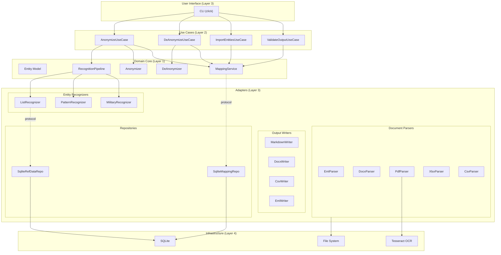
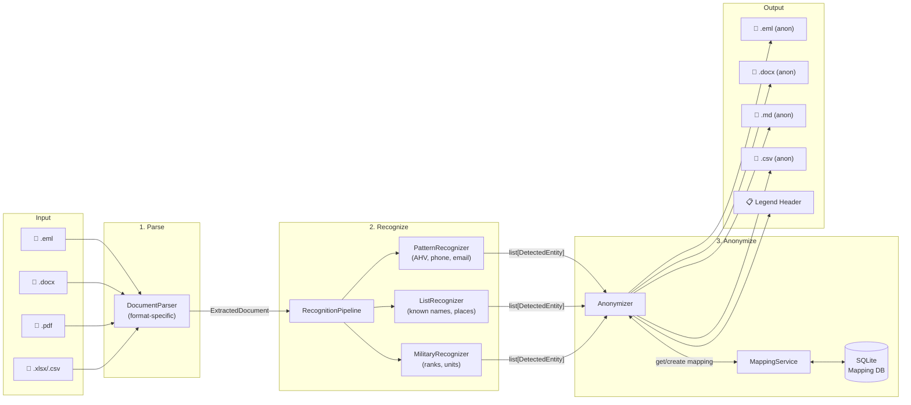
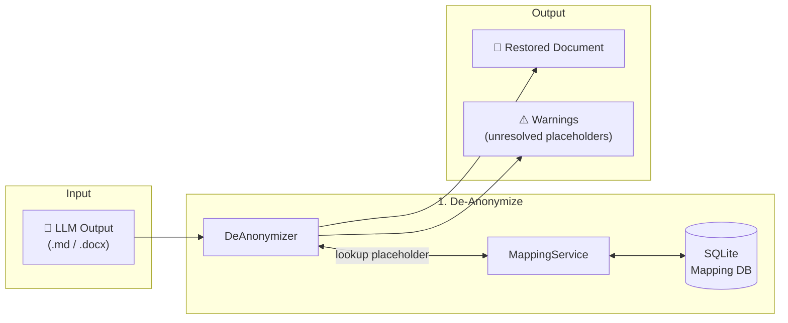
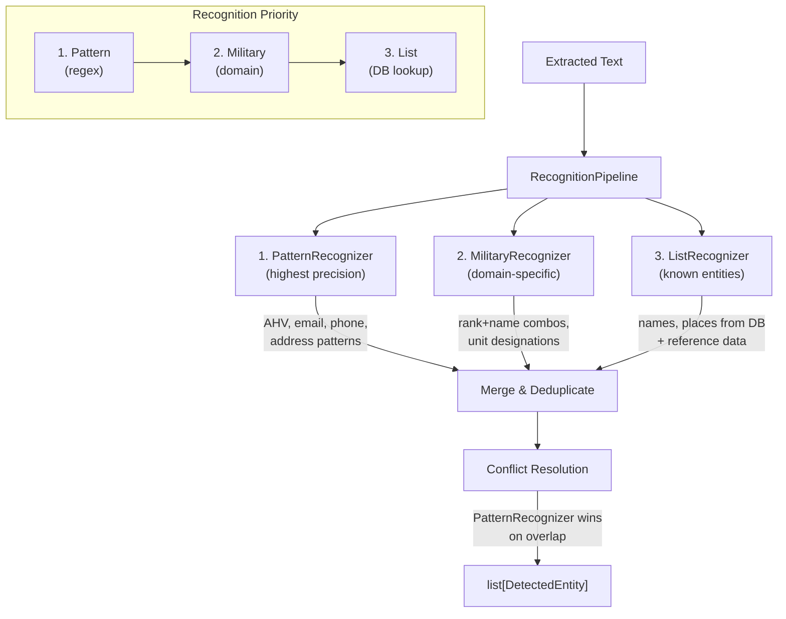

# Architecture Overview — MilAnon

> Phase 2 Output
> Version: 1.0
> Last updated: 2026-03-23

---

## 1. Architecture Principles

MilAnon follows **Clean Architecture** (Robert C. Martin). The core principle:
dependencies always point inward. Business logic never depends on I/O, UI, or
infrastructure.

### Layer Model (inside → out)

```
┌─────────────────────────────────────────┐
│            4. Infrastructure            │  SQLite driver, Tesseract OCR
├─────────────────────────────────────────┤
│            3. Adapters                  │  Parsers, CLI, DB Repository
├─────────────────────────────────────────┤
│            2. Use Cases                 │  Anonymize, De-anonymize, Import
├─────────────────────────────────────────┤
│            1. Domain (Core)             │  Entities, Mapping, Recognition
└─────────────────────────────────────────┘
```

**Dependency Rule:** Layer 1 depends on nothing. Layer 2 depends only on 1.
Layer 3 depends on 1 and 2. Layer 4 depends on 3.

### SOLID Verification

| Principle | How it's satisfied |
|-----------|--------------------|
| **S** — Single Responsibility | Each parser handles one format. Each recognizer handles one detection strategy. The anonymizer only replaces; it doesn't detect. |
| **O** — Open/Closed | New file formats = new parser class implementing `DocumentParser` protocol. New entity types = new recognizer implementing `EntityRecognizer` protocol. No existing code changes needed. |
| **L** — Liskov Substitution | All parsers are interchangeable via the `DocumentParser` protocol. All recognizers are interchangeable via `EntityRecognizer`. |
| **I** — Interface Segregation | `DocumentParser` only defines `parse()`. `EntityRecognizer` only defines `recognize()`. No fat interfaces. |
| **D** — Dependency Inversion | Use cases depend on abstract protocols (`MappingRepository`, `DocumentParser`), not on SQLite or specific file libraries. |

---

## 2. Component Diagram



---

## 3. Data Flow Diagram

### 3.1 Anonymization Flow



### 3.2 De-Anonymization Flow



### 3.3 Entity Recognition Pipeline (Detail)



**Conflict Resolution Strategy:**

When multiple recognizers detect overlapping text spans:
1. Pattern matches (regex) have highest priority — they are precise and deterministic.
2. Military recognizer has second priority — it understands rank+name compound structures.
3. List recognizer has lowest priority — it may match partial words or common terms.
4. Longer matches win over shorter matches at the same priority level.

---

## 4. Class Diagram (Core Domain)

```mermaid
classDiagram
    class EntityType {
        <<enumeration>>
        PERSON
        VORNAME
        NACHNAME
        EMAIL
        TELEFON
        AHV_NR
        GEBURTSDATUM
        ORT
        ADRESSE
        ARBEITGEBER
        EINHEIT
        FUNKTION
        GRAD_FUNKTION
        MEDIZINISCH
        FAMILIAER
        STANDORT_MIL
    }

    class DetectedEntity {
        +entity_type: EntityType
        +original_value: str
        +start_offset: int
        +end_offset: int
        +confidence: float
        +source: str
    }

    class EntityMapping {
        +entity_type: EntityType
        +original_value: str
        +placeholder: str
        +first_seen: datetime
        +last_seen: datetime
        +source_document: str
    }

    class ExtractedDocument {
        +source_path: str
        +format: DocumentFormat
        +text_content: str
        +structured_content: dict | None
        +metadata: dict
        +embedded_image_count: int
    }

    class AnonymizedDocument {
        +source_path: str
        +output_format: DocumentFormat
        +content: str
        +entities_found: list~DetectedEntity~
        +legend: str
        +warnings: list~str~
    }

    class DocumentFormat {
        <<enumeration>>
        EML
        DOCX
        PDF
        XLSX
        CSV
        MARKDOWN
    }

    class DocumentParser {
        <<protocol>>
        +parse(path: Path) ExtractedDocument
        +supported_extensions() list~str~
    }

    class EntityRecognizer {
        <<protocol>>
        +recognize(document: ExtractedDocument) list~DetectedEntity~
    }

    class MappingRepository {
        <<protocol>>
        +get_mapping(entity_type: EntityType, original_value: str) EntityMapping | None
        +create_mapping(entity_type: EntityType, original_value: str) EntityMapping
        +get_all_mappings() list~EntityMapping~
        +get_placeholder(placeholder: str) EntityMapping | None
        +import_entities(entities: list~dict~) int
    }

    class MappingService {
        -repository: MappingRepository
        +get_or_create_placeholder(entity_type: EntityType, value: str, source: str) str
        +resolve_placeholder(placeholder: str) str | None
        +get_statistics() dict
    }

    class RecognitionPipeline {
        -recognizers: list~EntityRecognizer~
        +recognize(document: ExtractedDocument) list~DetectedEntity~
        -merge_and_deduplicate(results: list~list~DetectedEntity~~) list~DetectedEntity~
        -resolve_conflicts(entities: list~DetectedEntity~) list~DetectedEntity~
    }

    class Anonymizer {
        -mapping_service: MappingService
        +anonymize(document: ExtractedDocument, entities: list~DetectedEntity~) AnonymizedDocument
        -generate_legend(entity_types: set~EntityType~) str
        -replace_entities(text: str, entities: list~DetectedEntity~) str
    }

    class DeAnonymizer {
        -mapping_service: MappingService
        +deanonymize(content: str) tuple~str, list~str~~
        -find_placeholders(text: str) list~str~
    }

    DocumentParser <|.. EmlParser
    DocumentParser <|.. DocxParser
    DocumentParser <|.. PdfParser
    DocumentParser <|.. XlsxCsvParser

    EntityRecognizer <|.. PatternRecognizer
    EntityRecognizer <|.. ListRecognizer
    EntityRecognizer <|.. MilitaryRecognizer

    MappingRepository <|.. SqliteMappingRepository

    MappingService --> MappingRepository
    RecognitionPipeline --> EntityRecognizer
    Anonymizer --> MappingService
    DeAnonymizer --> MappingService

    DetectedEntity --> EntityType
    EntityMapping --> EntityType
    ExtractedDocument --> DocumentFormat
    AnonymizedDocument --> DocumentFormat
```



---

## 5. Module Structure

```
milanon/
├── pyproject.toml                  # Project config, dependencies, CLI entry point
├── README.md                       # User-facing documentation
├── CLAUDE.md                       # Claude Code context
├── CHANGELOG.md
│
├── src/
│   └── milanon/
│       ├── __init__.py
│       ├── __main__.py             # Entry point: python -m milanon
│       │
│       ├── domain/                 # Layer 1: Core domain (no external deps)
│       │   ├── __init__.py
│       │   ├── entities.py         # EntityType, DetectedEntity, EntityMapping,
│       │   │                       #   ExtractedDocument, AnonymizedDocument
│       │   ├── protocols.py        # DocumentParser, EntityRecognizer,
│       │   │                       #   MappingRepository (Protocol classes)
│       │   ├── mapping_service.py  # MappingService (business logic)
│       │   ├── recognition.py      # RecognitionPipeline (orchestration)
│       │   ├── anonymizer.py       # Anonymizer (replacement logic)
│       │   └── deanonymizer.py     # DeAnonymizer (restoration logic)
│       │
│       ├── adapters/               # Layer 3: Implementations
│       │   ├── __init__.py
│       │   ├── parsers/            # DocumentParser implementations
│       │   │   ├── __init__.py
│       │   │   ├── eml_parser.py
│       │   │   ├── docx_parser.py
│       │   │   ├── pdf_parser.py
│       │   │   └── xlsx_csv_parser.py
│       │   ├── recognizers/        # EntityRecognizer implementations
│       │   │   ├── __init__.py
│       │   │   ├── pattern_recognizer.py    # Regex: AHV, phone, email, address
│       │   │   ├── list_recognizer.py       # DB/reference data lookup
│       │   │   └── military_recognizer.py   # Rank+name, unit designations
│       │   ├── writers/            # Output format writers
│       │   │   ├── __init__.py
│       │   │   ├── markdown_writer.py
│       │   │   ├── docx_writer.py
│       │   │   ├── csv_writer.py
│       │   │   └── eml_writer.py
│       │   └── repositories/       # MappingRepository implementations
│       │       ├── __init__.py
│       │       └── sqlite_repository.py
│       │
│       ├── usecases/               # Layer 2: Application use cases
│       │   ├── __init__.py
│       │   ├── anonymize.py        # AnonymizeUseCase
│       │   ├── deanonymize.py      # DeAnonymizeUseCase
│       │   ├── import_entities.py  # ImportEntitiesUseCase
│       │   └── validate_output.py  # ValidateOutputUseCase
│       │
│       ├── cli/                    # Layer 3: CLI adapter
│       │   ├── __init__.py
│       │   ├── main.py             # click CLI group
│       │   ├── anonymize_cmd.py    # milanon anonymize ...
│       │   ├── deanonymize_cmd.py  # milanon deanonymize ...
│       │   └── db_cmd.py           # milanon db ...
│       │
│       └── config/                 # Configuration
│           ├── __init__.py
│           ├── settings.py         # App-wide settings (DB path, thresholds)
│           └── military_patterns.py # Regex patterns for ranks, units
│
├── data/
│   ├── swiss_municipalities.csv    # BFS open data (committed)
│   └── military_units.csv          # Known unit patterns (committed)
│
└── tests/
    ├── __init__.py
    ├── conftest.py                 # Shared fixtures (sample docs, test DB)
    ├── domain/                     # Unit tests for domain logic
    │   ├── test_entities.py
    │   ├── test_mapping_service.py
    │   ├── test_recognition.py
    │   ├── test_anonymizer.py
    │   └── test_deanonymizer.py
    ├── adapters/                   # Unit tests for adapters
    │   ├── parsers/
    │   │   ├── test_eml_parser.py
    │   │   ├── test_docx_parser.py
    │   │   ├── test_pdf_parser.py
    │   │   └── test_xlsx_csv_parser.py
    │   ├── recognizers/
    │   │   ├── test_pattern_recognizer.py
    │   │   ├── test_list_recognizer.py
    │   │   └── test_military_recognizer.py
    │   └── repositories/
    │       └── test_sqlite_repository.py
    ├── usecases/                   # Integration tests
    │   ├── test_anonymize.py
    │   ├── test_deanonymize.py
    │   └── test_import_entities.py
    └── e2e/                        # End-to-end tests
        ├── test_full_pipeline.py
        └── fixtures/               # Test documents (synthetic, no real PII)
            ├── sample.eml
            ├── sample.docx
            ├── sample.pdf
            └── sample.csv
```

---

## 6. Key Design Decisions

See individual ADRs in `docs/architecture/`:

| ADR | Decision | Status |
|-----|----------|--------|
| [ADR-001](ADR-001-language-and-runtime.md) | Python 3.11+ with pyproject.toml | Accepted |
| [ADR-002](ADR-002-mapping-database.md) | SQLite for persistent entity mapping | Accepted |
| [ADR-003](ADR-003-placeholder-format.md) | `[ENTITY_TYPE_NNN]` bracket format | Accepted |
| [ADR-004](ADR-004-recognition-strategy.md) | Three-stage pipeline: Pattern → Military → List | Accepted |
| [ADR-005](ADR-005-pdf-output-format.md) | PDF → Markdown output for LLM consumption | Accepted |
| [ADR-006](ADR-006-ocr-strategy.md) | Tesseract OCR with automatic fallback | Accepted |
| [ADR-007](ADR-007-cli-framework.md) | click for CLI with subcommands | Accepted |
| [ADR-008](ADR-008-incremental-processing.md) | Content-hash delta detection for incremental batch processing | Accepted |

---

## 7. Technology Stack

| Component | Technology | Version | Purpose |
|-----------|-----------|---------|---------|
| Language | Python | 3.11+ | Core runtime |
| Packaging | pyproject.toml + pip | — | Modern Python packaging |
| CLI | click | 8.x | Command-line interface |
| EML parsing | email (stdlib) | — | MIME parsing, encoding handling |
| DOCX parsing | python-docx | 1.x | Word document read/write |
| PDF text extraction | pdfplumber | 0.11+ | Text + table extraction |
| PDF OCR | pytesseract + Pillow | — | OCR for scanned pages |
| PDF page rendering | pdf2image | — | Convert PDF pages to images for OCR |
| XLSX parsing | openpyxl | 3.x | Excel file read/write |
| CSV parsing | csv (stdlib) | — | CSV read/write |
| Database | sqlite3 (stdlib) | — | Persistent mapping storage |
| Testing | pytest | 8.x | Test framework |
| Fuzzy matching (post-MVP) | rapidfuzz | — | Typo-tolerant matching |
| NLP (post-MVP) | spaCy + de_core_news_lg | — | NER for unknown entities |

### External system dependency

| Dependency | Required | Installation |
|------------|----------|-------------|
| Tesseract OCR | Yes (for scanned PDFs) | `brew install tesseract tesseract-lang` |
| Poppler (pdf2image) | Yes (for PDF→image conversion) | `brew install poppler` |

---

## 8. Database Schema

```sql
-- Core mapping table
CREATE TABLE entity_mappings (
    id INTEGER PRIMARY KEY AUTOINCREMENT,
    entity_type TEXT NOT NULL,          -- e.g. 'PERSON', 'ORT', 'AHV_NR'
    original_value TEXT NOT NULL,       -- e.g. 'Thomas Wegmüller'
    normalized_value TEXT NOT NULL,     -- lowercase, trimmed for matching
    placeholder TEXT NOT NULL UNIQUE,   -- e.g. '[PERSON_001]'
    first_seen_at TEXT NOT NULL,        -- ISO 8601 datetime
    last_seen_at TEXT NOT NULL,         -- ISO 8601 datetime
    source_document TEXT,              -- filename where first encountered
    created_by TEXT DEFAULT 'auto',    -- 'auto', 'import', 'manual'
    UNIQUE(entity_type, normalized_value)
);

-- Reference data: Swiss municipalities
CREATE TABLE ref_municipalities (
    id INTEGER PRIMARY KEY AUTOINCREMENT,
    name TEXT NOT NULL,                -- e.g. 'Walenstadt'
    canton TEXT,                       -- e.g. 'SG'
    plz TEXT,                          -- e.g. '8880'
    bfs_number INTEGER
);

-- Reference data: Military unit patterns
CREATE TABLE ref_military_units (
    id INTEGER PRIMARY KEY AUTOINCREMENT,
    pattern TEXT NOT NULL,             -- e.g. 'Inf Bat 56'
    unit_type TEXT,                    -- e.g. 'Bataillon'
    parent_unit TEXT                   -- e.g. 'Ter Div 2'
);

-- Alias table for name variants
CREATE TABLE entity_aliases (
    id INTEGER PRIMARY KEY AUTOINCREMENT,
    mapping_id INTEGER NOT NULL REFERENCES entity_mappings(id),
    alias_value TEXT NOT NULL,         -- e.g. 'WEGMÜLLER' (caps variant)
    normalized_alias TEXT NOT NULL,    -- lowercase for matching
    UNIQUE(mapping_id, normalized_alias)
);

-- File tracking for incremental processing
CREATE TABLE file_tracking (
    id INTEGER PRIMARY KEY AUTOINCREMENT,
    file_path TEXT NOT NULL,            -- absolute path of source file
    content_hash TEXT NOT NULL,         -- SHA-256 of file content
    output_path TEXT,                   -- path of generated output file
    operation TEXT NOT NULL,            -- 'anonymize' or 'deanonymize'
    processed_at TEXT NOT NULL,         -- ISO 8601 datetime
    entity_count INTEGER DEFAULT 0,    -- entities found/replaced
    UNIQUE(file_path, operation)
);

-- Processing log (audit trail)
CREATE TABLE processing_log (
    id INTEGER PRIMARY KEY AUTOINCREMENT,
    timestamp TEXT NOT NULL,
    operation TEXT NOT NULL,           -- 'anonymize', 'deanonymize', 'import'
    input_path TEXT NOT NULL,
    output_path TEXT,
    entities_processed INTEGER DEFAULT 0,
    warnings INTEGER DEFAULT 0,
    errors INTEGER DEFAULT 0,
    duration_ms INTEGER
);

-- Indexes for performance
CREATE INDEX idx_mappings_type_normalized ON entity_mappings(entity_type, normalized_value);
CREATE INDEX idx_mappings_placeholder ON entity_mappings(placeholder);
CREATE INDEX idx_aliases_normalized ON entity_aliases(normalized_alias);
CREATE INDEX idx_municipalities_name ON ref_municipalities(name COLLATE NOCASE);
CREATE INDEX idx_tracking_path ON file_tracking(file_path, operation);
```

---

## 9. Error Handling Strategy

| Layer | Strategy |
|-------|----------|
| **Domain** | Raise specific domain exceptions (`EntityNotFoundError`, `DuplicateMappingError`). Never catch silently. |
| **Adapters** | Catch I/O exceptions, wrap in domain exceptions. Parsers raise `ParseError` with source file context. |
| **Use Cases** | Catch adapter exceptions, decide: skip file (batch) or abort (single file). Always log. |
| **CLI** | Catch use case exceptions, display user-friendly messages. Exit code 0 for success, 1 for partial (warnings), 2 for failure. |

---

## 10. Traceability Matrix

| User Story | Domain Component | Adapter(s) | Test Coverage |
|-----------|-----------------|------------|---------------|
| US-1.1 | ExtractedDocument | EmlParser | test_eml_parser.py |
| US-1.2 | ExtractedDocument | DocxParser | test_docx_parser.py |
| US-1.3 | ExtractedDocument | PdfParser | test_pdf_parser.py |
| US-1.4 | ExtractedDocument | XlsxCsvParser | test_xlsx_csv_parser.py |
| US-1.5 | — | AnonymizeUseCase (batch) | test_anonymize.py |
| US-2.1 | RecognitionPipeline | ListRecognizer | test_list_recognizer.py |
| US-2.2 | RecognitionPipeline | PatternRecognizer | test_pattern_recognizer.py |
| US-2.5 | RecognitionPipeline | MilitaryRecognizer | test_military_recognizer.py |
| US-3.1 | Anonymizer, MappingService | SqliteRepository | test_anonymizer.py |
| US-3.2 | Anonymizer | — | test_anonymizer.py |
| US-3.3 | AnonymizedDocument | Writers | test_*_writer.py |
| US-3.4 | — | AnonymizeUseCase | test_anonymize.py |
| US-3.5 | ExtractedDocument | DocxParser, PdfParser | test_*_parser.py |
| US-4.1 | DeAnonymizer, MappingService | SqliteRepository | test_deanonymizer.py |
| US-4.2 | — | DeAnonymizeUseCase | test_deanonymize.py |
| US-5.1 | MappingService | SqliteRepository | test_mapping_service.py, test_sqlite_repository.py |
| US-5.2 | — | ImportEntitiesUseCase | test_import_entities.py |
| US-6.1 | — | SqliteRefDataRepo | test_sqlite_repository.py |
| US-6.2 | — | MilitaryRecognizer | test_military_recognizer.py |
| US-7.1-7.3 | — | CLI | test_full_pipeline.py (e2e) |
| US-8.2 | — | ValidateOutputUseCase | test_full_pipeline.py (e2e) |
